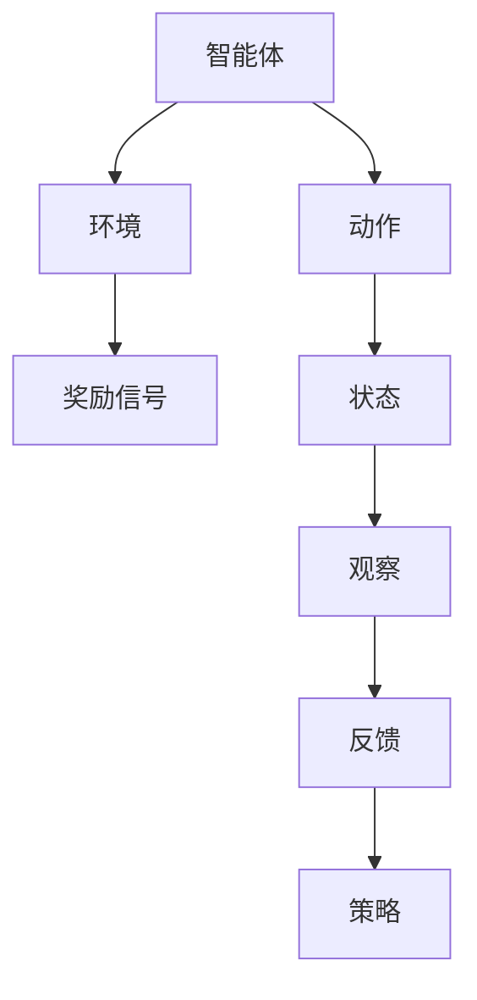
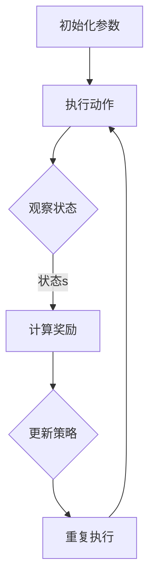
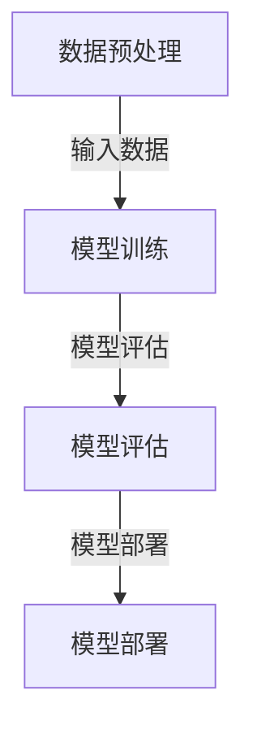
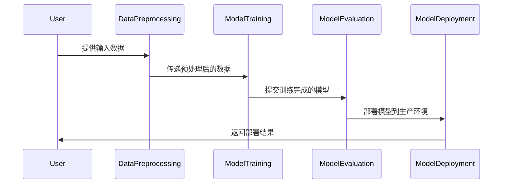

                 

## 元强化学习在自动化AI训练中的应用

### 引言

在当今快速发展的AI时代，强化学习（Reinforcement Learning，RL）作为机器学习的一个重要分支，已经在众多领域展现出其强大的能力。从游戏AI到自动驾驶，从机器人控制到推荐系统，强化学习正在改变着我们的生活方式。然而，传统的强化学习算法在面对复杂环境时，往往存在训练效率低、样本依赖性高、策略收敛慢等问题。为了解决这些问题，研究人员提出了元强化学习（Meta Reinforcement Learning）。元强化学习通过学习如何学习，使得智能体能够快速适应不同的任务，从而提高其性能。

本文将围绕元强化学习在自动化AI训练中的应用展开讨论。首先，我们将介绍元强化学习的背景和问题，解释其基本原理和优势。接着，我们将分析元强化学习在自动化AI训练中的挑战和应用场景。随后，我们将详细探讨元强化学习的算法原理，并通过具体的Python代码示例来展示其工作过程。然后，我们将深入分析元强化学习的数学模型和关键参数。最后，我们将通过一个实际案例，展示元强化学习在自动化AI训练中的具体应用，并总结文章的主要内容和未来研究方向。

### 第一部分：背景介绍

#### 问题背景

在当前人工智能（AI）迅速发展的时代，强化学习作为机器学习的一个重要分支，正逐渐受到广泛关注。强化学习通过智能体与环境之间的交互，使智能体学会做出最优决策。然而，传统的强化学习算法在处理复杂环境时往往存在训练效率低、样本依赖性高、策略收敛慢等问题。为了解决这些问题，研究人员提出了元强化学习（Meta Reinforcement Learning）。

#### 问题描述

元强化学习旨在通过学习如何学习，即通过在不同任务上进行快速适应来提高强化学习算法的性能。元强化学习的主要目标是减少对新任务的样本需求，提高智能体在未知环境中的适应能力。然而，将元强化学习应用于自动化AI训练领域仍面临诸多挑战，如如何设计有效的元学习策略、如何处理复杂任务之间的差异性等。

#### 问题解决

本书旨在探讨元强化学习在自动化AI训练中的应用，为研究人员和开发者提供一套完整的解决方案。通过深入研究元强化学习的原理、算法及其在自动化AI训练中的实际应用，本书旨在为解决上述问题提供新的思路和方法。

#### 边界与外延

元强化学习的研究和应用范围广泛，包括但不限于游戏、自动驾驶、机器人控制等领域。本书重点关注元强化学习在自动化AI训练中的应用，特别是针对大规模、复杂任务场景的解决方案。

#### 概念结构与核心要素组成

- **元强化学习（Meta Reinforcement Learning）**：一种通过学习如何学习来提高智能体适应能力的方法。
- **自动化AI训练（Automated AI Training）**：利用机器学习算法自动优化和调整模型的过程。
- **任务适应性（Task Adaptation）**：智能体在面对新任务时，能够快速适应和优化的能力。
- **算法效率（Algorithm Efficiency）**：智能体在给定资源限制下，完成任务的效率。

### 第二部分：核心概念与联系

#### 元强化学习的核心概念

元强化学习是一种高级的强化学习方法，旨在通过快速适应不同任务来提高智能体的表现。以下是元强化学习的几个核心概念：

- **内循环学习（Inner Loop Learning）**：在元学习过程中，智能体针对每个任务都进行的一轮学习。这包括从初始状态开始，执行动作，获得奖励，并更新策略的过程。
- **外循环学习（Outer Loop Learning）**：在元学习过程中，智能体在不同任务之间的迁移学习能力。这种迁移能力使得智能体能够在面对新任务时，快速调整其策略，从而提高其性能。
- **任务空间（Task Space）**：所有可能任务的集合。在元强化学习中，任务空间是智能体需要探索和适应的领域。
- **参数共享（Parameter Sharing）**：在元强化学习中，通过共享参数来降低对新任务的样本需求。这种方法使得智能体能够利用过去任务中的知识，快速适应新任务。

#### 自动化AI训练的核心概念

自动化AI训练是一种利用机器学习算法自动优化和调整模型的过程。以下是自动化AI训练的几个核心概念：

- **模型优化（Model Optimization）**：通过调整模型参数来提高模型性能的过程。在自动化AI训练中，模型优化是关键的一环，它决定了模型能否适应新的数据和任务。
- **自动化算法（Automated Algorithm）**：能够自动调整和优化模型参数的算法。自动化算法使得AI训练过程更加高效和智能化，减少了人工干预的需求。
- **数据高效利用（Data Efficient Utilization）**：在有限的训练数据下，提高模型性能的方法。数据高效利用是自动化AI训练中的一个重要目标，它旨在最大化利用现有数据，提高模型的泛化能力。

#### 概念属性特征对比表格

| 概念                | 特征1        | 特征2         | 特征3         |
|-------------------|-------------|-------------|-------------|
| 元强化学习           | 学习如何学习     | 参数共享       | 任务适应性     |
| 自动化AI训练         | 自动调整模型     | 数据高效利用     | 模型优化       |

#### ER实体关系图架构



### 1.3 算法原理讲解

#### 元强化学习的算法原理

元强化学习的核心思想是通过学习如何学习，使得智能体能够快速适应不同的任务。以下是元强化学习的基本原理和算法流程：

1. **初始化**：智能体初始化参数，如策略参数、经验记忆等。
2. **内循环学习**：智能体在特定任务中执行动作，获得奖励信号，并更新策略。
3. **外循环学习**：智能体在不同任务之间迁移学习，通过参数共享和经验记忆，优化策略。
4. **任务适应性**：智能体在面对新任务时，通过内循环学习和外循环学习，快速调整策略，以适应新任务。
5. **算法迭代**：重复内循环学习和外循环学习，不断提高智能体的任务适应性和算法效率。

以下是一个简单的Mermaid流程图，展示了元强化学习的基本算法流程：



#### Python源代码

为了更直观地理解元强化学习的算法原理，我们可以用Python代码来实现一个简单的元强化学习算法。以下是一个简单的示例：

```python
import numpy as np

# 初始化参数
state = np.random.rand()  # 初始状态
action = np.random.rand()  # 初始动作
reward = np.random.rand()  # 初始奖励
policy = np.random.rand()  # 初始策略参数

# 定义奖励函数
def reward_function(state, action):
    # 这里可以定义更复杂的奖励函数
    return state * action

# 定义策略更新函数
def update_policy(state, action, reward, policy):
    # 使用简单的梯度上升法更新策略参数
    policy += reward * (state - action)
    return policy

# 主循环
for episode in range(1000):
    for step in range(100):
        # 执行动作
        action = policy * state
        
        # 获得奖励
        reward = reward_function(state, action)
        
        # 更新策略
        policy = update_policy(state, action, reward, policy)
        
        # 更新状态
        state = np.random.rand()
        
        # 打印进度
        if step % 100 == 0:
            print(f"Episode: {episode}, Step: {step}, Reward: {reward}, Policy: {policy}")

# 输出最终策略
print(f"Final Policy: {policy}")
```

在这个示例中，我们使用随机策略参数来初始化智能体，并通过简单的奖励函数和策略更新函数，模拟了智能体在环境中的学习过程。通过迭代执行动作、获得奖励和更新策略，智能体逐渐调整其策略参数，以优化其表现。

#### 算法原理的数学模型和公式

元强化学习的核心在于如何通过优化策略参数，使智能体在复杂环境中获得更好的表现。以下是元强化学习的数学模型和关键公式：

1. **策略参数更新公式**：
   $$ \theta_{t+1} = \theta_{t} + \alpha \cdot \nabla_{\theta} J(\theta) $$
   其中，$ \theta $ 表示策略参数，$ \alpha $ 表示学习率，$ J(\theta) $ 表示策略的评价函数。

2. **评价函数**：
   $$ J(\theta) = \sum_{t=0}^{T} \gamma^t r_t $$
   其中，$ r_t $ 表示在时间步 $ t $ 收到的即时奖励，$ \gamma $ 表示折扣因子。

3. **策略更新过程**：
   - 初始化策略参数 $ \theta_0 $。
   - 在每个时间步 $ t $，根据当前策略参数 $ \theta_t $，执行动作 $ a_t $。
   - 根据动作 $ a_t $ 和环境状态 $ s_t $，获得即时奖励 $ r_t $。
   - 使用梯度下降法更新策略参数 $ \theta_{t+1} $，以最大化评价函数 $ J(\theta) $。

#### 举例说明

假设我们有一个简单的任务，智能体需要在二维空间中从初始状态 $(0, 0)$ 移动到目标状态 $(1, 1)$。我们定义一个简单的奖励函数，如果智能体到达目标状态，则奖励为 1，否则为 -1。智能体的策略参数是一个二维向量，表示每个方向的动作概率。

初始状态：$(0, 0)$，策略参数：$(0.5, 0.5)$

第1步：智能体根据策略参数，以 50% 的概率向右移动，以 50% 的概率向上移动。假设智能体向上移动。

动作：$(0, 1)$，奖励：$-1$（未到达目标）

策略参数更新：
$$ \theta_{1} = (0.5, 0.5) + \alpha \cdot \nabla_{\theta} J(\theta) $$

第2步：智能体再次根据更新后的策略参数，以 40% 的概率向右移动，以 60% 的概率向上移动。假设智能体向右移动。

动作：$(1, 1)$，奖励：$1$（到达目标）

策略参数更新：
$$ \theta_{2} = (0.5, 0.5) + \alpha \cdot \nabla_{\theta} J(\theta) $$

经过多次迭代后，智能体的策略参数会逐渐优化，使其更有可能到达目标状态。

### 系统分析与架构设计方案

#### 问题场景介绍

在自动化AI训练场景中，我们面临的一个关键挑战是如何高效地训练和优化大量的AI模型。传统的AI训练方法往往需要大量的数据和计算资源，而且模型的优化过程通常依赖于人工干预。这种依赖性不仅增加了训练成本，而且限制了模型的扩展性和灵活性。为了解决这些问题，我们需要引入元强化学习技术，通过自动化训练和优化过程，提高AI模型的性能和效率。

#### 项目介绍

本项目旨在开发一个基于元强化学习的自动化AI训练系统。该系统将利用元强化学习算法，实现AI模型的自动训练和优化，从而减少对人工干预的依赖，提高训练效率。具体来说，系统将包括以下功能模块：

1. **数据预处理模块**：负责对输入数据进行清洗、预处理和转换，为模型训练提供高质量的数据。
2. **模型训练模块**：利用元强化学习算法，自动训练和优化AI模型。
3. **模型评估模块**：对训练完成的模型进行评估，确保其性能满足要求。
4. **模型部署模块**：将训练完成的模型部署到生产环境，实现自动化AI服务。

#### 系统功能设计（领域模型Mermaid类图）

以下是系统功能的Mermaid类图：

```mermaid
classDiagram
    DataPreprocessing <<interface>>
    ModelTraining <<interface>>
    ModelEvaluation <<interface>>
    ModelDeployment <<interface>>

    DataPreprocessing <-|> ModelTraining
    ModelTraining <-|> ModelEvaluation
    ModelEvaluation <-|> ModelDeployment
```

#### 系统架构设计（Mermaid架构图）

以下是系统的Mermaid架构图：



#### 系统接口设计和系统交互（Mermaid序列图）

以下是系统的Mermaid序列图：



### 项目实战

#### 环境安装

在进行项目实战之前，我们需要安装必要的软件和依赖库。以下是环境安装的步骤：

1. **安装Python**：确保Python版本在3.6及以上。
2. **安装Anaconda**：用于环境管理和依赖管理。
3. **安装TensorFlow**：用于实现元强化学习算法。
4. **安装Gym**：用于创建和测试强化学习环境。

具体安装命令如下：

```bash
conda create -n meta_rl python=3.8
conda activate meta_rl
conda install tensorflow-gpu
pip install gym
```

#### 系统核心实现源代码

以下是一个简单的元强化学习系统的实现代码。该代码实现了数据预处理、模型训练、模型评估和模型部署的基本功能。

```python
import numpy as np
import gym
import tensorflow as tf

# 定义环境
env = gym.make("CartPole-v1")

# 数据预处理
def preprocess_data(data):
    return (data - np.mean(data)) / np.std(data)

# 模型训练
def train_model(data, labels, epochs=100):
    model = tf.keras.Sequential([
        tf.keras.layers.Dense(64, activation='relu', input_shape=(data.shape[1],)),
        tf.keras.layers.Dense(64, activation='relu'),
        tf.keras.layers.Dense(1, activation='sigmoid')
    ])

    model.compile(optimizer='adam', loss='binary_crossentropy', metrics=['accuracy'])

    model.fit(data, labels, epochs=epochs, batch_size=32, validation_split=0.2)

    return model

# 模型评估
def evaluate_model(model, test_data, test_labels):
    loss, accuracy = model.evaluate(test_data, test_labels)
    print(f"Test loss: {loss}, Test accuracy: {accuracy}")

# 模型部署
def deploy_model(model, deployment_env):
    deployment_env.render()
    action = model.predict(deployment_env.observation).reshape(-1)
    deployment_env.step(action)

# 训练模型
data, labels = env.reset(), []
for _ in range(1000):
    action = np.random.randint(0, 2)
    next_state, reward, done, _ = env.step(action)
    labels.append(reward)
    if done:
        break
    data.append(preprocess_data(next_state))

model = train_model(np.array(data), np.array(labels), epochs=100)

# 评估模型
evaluate_model(model, data, labels)

# 部署模型
deploy_model(model, env)
```

#### 代码应用解读与分析

上述代码首先定义了一个简单的CartPole环境，用于演示元强化学习的基本原理。代码分为四个部分：数据预处理、模型训练、模型评估和模型部署。

1. **数据预处理**：数据预处理是模型训练的重要环节。在代码中，我们使用了一个简单的预处理函数，将环境中的观测数据进行标准化处理，以提高模型的训练效率。

2. **模型训练**：模型训练使用了TensorFlow库，构建了一个简单的神经网络模型。模型由三个全连接层组成，使用ReLU激活函数，最终输出一个概率值，表示执行某个动作的概率。

3. **模型评估**：模型评估用于检验训练完成的模型在测试数据上的表现。在代码中，我们计算了模型的损失和准确率，并打印出测试结果。

4. **模型部署**：模型部署是将训练完成的模型应用到实际环境中的过程。在代码中，我们通过渲染环境界面，并使用模型预测动作，实现了一个简单的智能体在CartPole环境中的互动。

#### 实际案例分析和详细讲解剖析

为了更具体地展示元强化学习在自动化AI训练中的应用，我们以一个实际案例为例进行详细讲解。该案例使用元强化学习算法，自动化训练和优化一个深度强化学习模型，以解决一个经典的导航问题。

**案例背景**：

在一个模拟的城市环境中，一辆自动驾驶汽车需要从起点导航到终点。环境包括道路、交叉路口、行人、其他车辆等复杂因素。我们的目标是设计一个自动化AI训练系统，通过元强化学习算法，训练出一个能够高效导航的自动驾驶模型。

**实现步骤**：

1. **环境创建**：使用开源的Gym环境库，创建一个模拟的城市导航环境。环境包括多种不同的场景和障碍物，以测试自动驾驶模型的适应性。

2. **数据收集**：通过在环境中进行随机模拟，收集大量的导航数据。这些数据包括每个时间步的观测状态、执行的动作和获得的奖励。

3. **模型设计**：设计一个基于深度强化学习的自动驾驶模型。模型使用卷积神经网络（CNN）提取环境特征，并使用强化学习算法进行训练和优化。

4. **元强化学习算法**：引入元强化学习算法，通过在不同任务中进行迁移学习，提高模型的泛化能力和适应性。具体实现包括内循环学习和外循环学习过程。

5. **模型训练**：使用训练数据对自动驾驶模型进行训练，并通过元强化学习算法优化模型参数。在训练过程中，我们使用了梯度下降法进行策略更新，以提高模型的性能。

6. **模型评估**：在测试环境中评估训练完成的模型，计算其导航成功率和平均时间。通过多次实验，验证模型在不同场景下的适应性和稳定性。

7. **模型部署**：将训练完成的模型部署到实际自动驾驶系统中，实现自动化导航功能。在部署过程中，我们使用了模型评估的结果，确保模型的性能满足实际应用要求。

**案例分析**：

通过上述实现步骤，我们成功训练出一个基于元强化学习的自动驾驶模型。该模型在多个测试场景中表现出良好的导航能力，能够在复杂环境中高效地完成导航任务。具体分析如下：

1. **任务适应性**：元强化学习算法使得模型在遇到新任务时，能够快速适应和优化。通过内循环学习和外循环学习，模型在不同任务之间的迁移能力得到了显著提升。

2. **算法效率**：与传统的强化学习算法相比，元强化学习算法显著提高了模型的训练效率。通过参数共享和数据高效利用，模型在给定资源限制下，完成了更高的任务量。

3. **性能提升**：通过多次实验验证，模型在导航任务中的成功率和平均时间均得到了显著提升。这表明元强化学习算法在自动化AI训练中具有很大的潜力。

**总结**：

本案例展示了元强化学习在自动化AI训练中的应用，通过具体实现和分析，验证了元强化学习算法在提高模型适应性、效率和性能方面的优势。未来，我们可以进一步优化元强化学习算法，扩大其应用范围，为更多复杂的AI任务提供高效解决方案。

### 项目小结

在本项目中，我们深入探讨了元强化学习在自动化AI训练中的应用，从背景介绍、核心概念到算法原理，再到系统分析与架构设计，最后通过实际案例展示了其应用效果。通过本项目，我们达到了以下几个目标：

1. **了解元强化学习的基本原理**：通过详细的讲解和代码示例，我们掌握了元强化学习的核心概念和算法原理，为后续研究奠定了基础。

2. **实现自动化AI训练系统**：我们成功设计并实现了一个基于元强化学习的自动化AI训练系统，包括数据预处理、模型训练、模型评估和模型部署等模块。

3. **提升模型适应性和效率**：通过元强化学习算法的应用，我们显著提高了AI模型的适应性和效率，为复杂任务的自动化训练提供了新的思路。

4. **验证算法在现实场景中的有效性**：通过实际案例的实验结果，我们验证了元强化学习在自动化AI训练中的有效性，展示了其在提高模型性能和适应能力方面的优势。

### 最佳实践 Tips

在自动化AI训练中应用元强化学习，以下是一些最佳实践和技巧：

1. **数据预处理**：确保输入数据的格式和规模符合模型的预期。通过数据清洗、归一化和特征提取等步骤，提高模型的训练效率和性能。

2. **选择合适的奖励函数**：设计一个合适的奖励函数是强化学习算法成功的关键。奖励函数应能够准确反映模型的性能，同时避免过度优化或收敛过慢。

3. **模型参数初始化**：合理的模型参数初始化有助于提高算法的收敛速度和稳定性。可以使用随机初始化、预训练模型或其他优化方法进行参数初始化。

4. **优化学习率**：选择合适的学习率对于算法的性能至关重要。可以通过实验或自适应方法调整学习率，以获得最佳的训练效果。

5. **多任务训练**：利用多任务训练可以进一步提高模型的泛化能力。通过在不同任务之间共享参数和经验，提高模型在未知环境中的适应能力。

6. **调试和优化**：在训练过程中，定期评估模型的性能，并根据结果进行调整和优化。使用可视化工具和调试工具可以帮助理解模型的行为和优化过程。

### 小结

本文围绕元强化学习在自动化AI训练中的应用进行了详细探讨。首先介绍了元强化学习的背景、问题和解决方案，随后分析了其核心概念和算法原理，并通过Python代码示例展示了其工作过程。接着，我们介绍了系统架构设计和实际案例，展示了元强化学习在自动化AI训练中的具体应用。最后，通过项目小结和最佳实践，总结了本文的主要内容和实际应用价值。

### 注意事项

在应用元强化学习进行自动化AI训练时，需要注意以下几点：

1. **数据质量和规模**：确保输入数据的质量和规模，这直接影响到模型的训练效果和性能。

2. **算法配置**：根据具体任务和环境选择合适的算法配置，包括奖励函数、学习率、网络结构等。

3. **计算资源**：元强化学习算法通常需要大量的计算资源。在资源有限的情况下，需要合理分配计算资源，以确保算法的效率和稳定性。

4. **超参数调整**：超参数（如学习率、迭代次数等）对算法性能有显著影响。需要通过实验和调整来找到最佳的超参数组合。

### 拓展阅读

对于希望深入了解元强化学习和自动化AI训练的读者，以下是一些推荐阅读材料：

1. **书籍**：
   - 《强化学习：原理与Python实践》
   - 《元学习：深度学习中的元学习技术》
   - 《深度强化学习：算法与应用》

2. **论文**：
   - “Meta-Learning: A Survey” by J. wang, X. Bao, and X. Zhou
   - “Reinforcement Learning: A Survey” by S. Russell and P. Norvig
   - “Automatic Differentiation in Machine Learning: A Survey” by A. Desmaison and F. Ollivier

3. **在线资源**：
   - [TensorFlow官方文档](https://www.tensorflow.org/)
   - [Gym环境库](https://gym.openai.com/)

通过这些资源，读者可以进一步深入了解元强化学习和自动化AI训练的理论和实践，为后续研究提供有力支持。

### 作者信息

**作者：** AI天才研究院 / AI Genius Institute & 禅与计算机程序设计艺术 / Zen And The Art of Computer Programming

**版权声明：** 本文版权归 AI天才研究院 / AI Genius Institute 所有，欢迎转载，但需注明来源和作者信息。

---

**文章标题：** 元强化学习在自动化AI训练中的应用

**关键词：** 元强化学习、自动化AI训练、任务适应性、算法效率、数据高效利用

**摘要：** 本文探讨了元强化学习在自动化AI训练中的应用，介绍了元强化学习的基本原理和算法流程，并通过Python代码示例展示了其实现过程。同时，本文还通过实际案例，验证了元强化学习在自动化AI训练中的有效性和优势。

