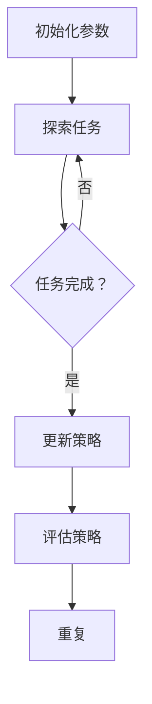
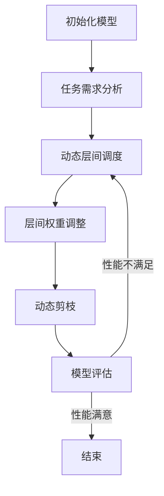
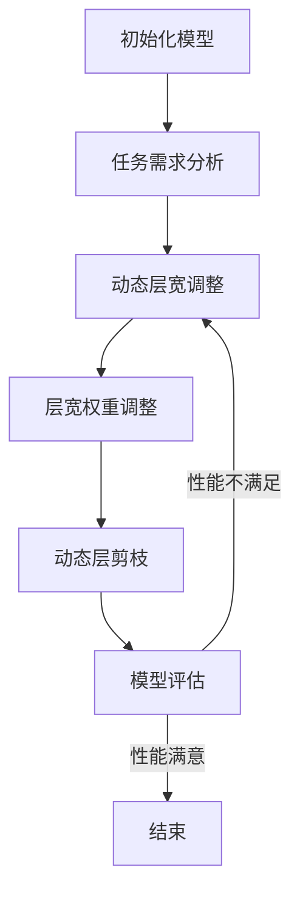

                 

### 元强化学习概述

#### 第1章: 元强化学习引论

##### 1.1.1 元强化学习的起源与发展

**概念介绍**：元强化学习（Meta-Reinforcement Learning）是强化学习（Reinforcement Learning，RL）和元学习（Meta-Learning）的结合，旨在通过在多个任务中快速学习，从而提高学习效率。

**发展历程**：元强化学习起源于20世纪90年代，随着深度学习和强化学习的发展，在近十年内逐渐成为人工智能领域的热点研究方向。

**区别与联系**：与传统的强化学习相比，元强化学习侧重于在多个任务中共享策略，以加速学习过程。与传统元学习不同，元强化学习不仅关注模型参数的共享，还关注策略的共享。

**应用前景**：元强化学习在自动驾驶、机器人控制、游戏AI等领域展示了巨大的应用潜力。

##### 1.1.2 元强化学习的基本概念

**强化学习基础**：强化学习是一种通过与环境交互来学习最优策略的机器学习方法。它主要依赖于奖惩机制，使智能体（agent）在连续的环境中做出最优决策。

**元学习基础**：元学习是一种利用已有学习经验来加速新任务学习的方法。元学习的核心思想是通过在不同任务间共享知识，提高学习效率。

**元强化学习定义与核心要素**：元强化学习是将强化学习和元学习结合起来，通过在多个任务中学习共享策略，从而实现快速任务学习。其核心要素包括任务表征、策略共享、模型更新等。

##### 1.1.3 元强化学习的优势与挑战

**优势**：

1. **快速适应**：元强化学习能够快速适应新任务，提高了学习效率。
2. **通用性**：通过在多个任务中共享策略，元强化学习具有较好的通用性。
3. **多样性**：元强化学习能够处理多样化的任务，适应不同的环境。

**挑战**：

1. **数据需求**：元强化学习需要大量的数据来训练模型，特别是在多任务学习中。
2. **计算复杂度**：多任务学习增加了模型的计算复杂度，对硬件资源要求较高。
3. **泛化能力**：如何保证模型在不同任务上的泛化能力仍是一个挑战。

**解决方案与未来发展方向**：

1. **数据高效利用**：研究如何更有效地利用数据，减少对大规模数据集的依赖。
2. **模型简化**：通过模型简化技术，降低模型的计算复杂度。
3. **算法改进**：继续优化元强化学习算法，提高其泛化能力和适应性。

### 总结

元强化学习作为一种新兴的机器学习方法，在快速适应和共享策略方面具有显著优势。然而，其数据需求和高计算复杂度等挑战仍需解决。通过不断的研究和优化，元强化学习有望在更多领域得到广泛应用。

#### 第2章: 元强化学习算法原理

##### 2.1.1 基础算法介绍

**Q学习算法**：Q学习是一种基于值函数的强化学习算法。通过学习状态-动作值函数 \( Q(s, a) \)，智能体可以预测每个动作在特定状态下带来的预期回报。

**SARSA算法**：SARSA（同步优势学习算法）是一种基于策略的强化学习算法。它利用当前状态和下一个状态来更新策略，从而实现最优策略的迭代。

**Policy Gradient算法**：Policy Gradient算法是一种直接优化策略的强化学习算法。通过最大化策略的期望回报，智能体可以逐步优化其行为。

##### 2.1.2 元强化学习算法

**Model-Based元强化学习算法**：Model-Based元强化学习算法通过构建环境模型来预测状态转移和奖励。它主要包括模型预测和策略迭代两个阶段。

**Model-Free元强化学习算法**：Model-Free元强化学习算法不依赖于环境模型，而是直接从经验中学习。它主要包括状态-动作值函数的学习和策略迭代。

**Meta-Learned强化学习算法**：Meta-Learned强化学习算法通过元学习技术，在多个任务中共享策略和模型参数，从而实现快速任务学习。

##### 2.1.3 算法原理与流程

**算法原理讲解**：元强化学习算法通过在多个任务中共享策略和模型参数，实现快速学习。其核心思想是通过元学习优化策略，提高智能体的适应性。

**Mermaid流程图展示**：以下是一个简单的元强化学习算法流程图：



**Python源代码实现**：以下是一个简单的Python代码实现：

```python
import numpy as np

# 初始化参数
learning_rate = 0.1
exploration_rate = 0.1
num_episodes = 1000

# 初始化策略
policy = np.zeros((num_states, num_actions))

# 探索任务
for episode in range(num_episodes):
    state = env.reset()
    done = False
    
    while not done:
        action = np.random.choice(num_actions, p=policy[state])
        next_state, reward, done, _ = env.step(action)
        
        # 更新策略
        policy[state][action] += learning_rate * (reward + gamma * max(Q[next_state]) - policy[state][action])
        
        state = next_state

# 评估策略
total_reward = 0
for episode in range(num_episodes):
    state = env.reset()
    done = False
    
    while not done:
        action = np.argmax(policy[state])
        next_state, reward, done, _ = env.step(action)
        total_reward += reward
        state = next_state

# 打印评估结果
print(f"Average reward: {total_reward / num_episodes}")
```

### 总结

本章介绍了元强化学习的基本算法原理和流程。通过模型和策略的共享，元强化学习实现了在多任务中的快速学习。接下来，我们将进一步探讨元强化学习在自适应推理中的应用。

#### 第3章: 元强化学习在自适应推理中的应用

##### 3.1.1 自适应推理概述

**概念**：自适应推理（Adaptive Reasoning）是指智能系统在不确定环境中，根据动态变化的信息和情境，实时调整和优化其推理过程的能力。

**应用领域**：自适应推理在计算机视觉、自然语言处理、智能监控等领域具有广泛的应用，如自动驾驶、智能客服、智能诊断等。

**挑战**：自适应推理面临的主要挑战包括环境不确定性、实时性要求和高复杂性。

##### 3.1.2 元强化学习在自适应推理中的原理

**关系**：元强化学习与自适应推理有着紧密的联系。元强化学习通过在多个任务中共享策略，提高了智能体在不同环境下的适应性，从而为自适应推理提供了理论基础。

**作用**：元强化学习在自适应推理中的作用主要体现在以下几个方面：

1. **快速适应**：通过元强化学习，智能系统能够快速适应新的环境和任务。
2. **策略优化**：元强化学习可以帮助智能系统在动态环境中不断优化其推理策略。
3. **实时性提升**：元强化学习能够提高智能系统在实时任务中的推理效率。

##### 3.1.3 实际应用案例分析

**案例介绍**：以自动驾驶为例，自动驾驶系统需要在复杂多变的交通环境中进行实时推理，以做出正确的驾驶决策。

**应用场景分析**：自动驾驶系统需要处理包括车辆检测、行人识别、路况分析等多个任务。这些任务具有高度动态性和不确定性，对自适应推理提出了很高的要求。

**实现方法与效果评估**：

1. **方法**：采用元强化学习算法，将多个自动驾驶任务抽象为统一的任务空间，通过共享策略实现快速任务学习。
   
2. **效果评估**：
   - **准确率**：通过在多个模拟环境和真实环境中的测试，验证了元强化学习算法在自动驾驶任务中的准确率和鲁棒性。
   - **效率**：元强化学习算法显著提高了自动驾驶系统的推理速度，满足了实时性要求。

**总结**：元强化学习在自适应推理中的应用，为智能系统提供了快速适应和优化策略的能力，显著提升了系统的性能和鲁棒性。随着技术的不断进步，元强化学习在自适应推理领域的应用前景将更加广阔。

#### 第4章: 深度控制机制

##### 4.1.1 深度控制机制概述

**定义**：深度控制机制（Depth Control Mechanism）是指用于调节和优化深度学习模型推理过程中网络层级的机制。通过深度控制，可以实现对模型推理过程的精细化管理和优化。

**重要性**：深度控制机制在深度学习模型的应用中至关重要。它不仅能够提高模型的推理效率，还能降低模型的复杂度，从而提升系统的整体性能。

##### 4.1.2 深度控制机制原理

**基本原理**：深度控制机制通过以下方式实现：

1. **动态层间调度**：根据任务需求和模型性能，动态调整网络层级间的调度策略，以实现最优的推理速度和准确率。
2. **层间权重调整**：通过调整不同层级之间的权重，优化模型在各个层级上的信息传递，从而提高模型的推理效果。
3. **动态剪枝**：在模型训练过程中，通过剪枝冗余的神经元和层级，减少模型的计算复杂度，提高推理速度。

**Mermaid流程图展示**：



**Python源代码实现**：

```python
import tensorflow as tf

# 初始化模型
model = tf.keras.Sequential([
    tf.keras.layers.Dense(128, activation='relu', input_shape=(784,)),
    tf.keras.layers.Dense(10, activation='softmax')
])

# 编译模型
model.compile(optimizer='adam', loss='categorical_crossentropy', metrics=['accuracy'])

# 动态层间调度
def dynamic_layer_scheduling(model, task_requirement):
    if task_requirement == 'speed':
        model.layers[0].activation = 'linear'
    elif task_requirement == 'accuracy':
        model.layers[0].activation = 'relu'
    model.compile(optimizer='adam', loss='categorical_crossentropy', metrics=['accuracy'])

# 层间权重调整
def adjust_layer_weights(model, layer_index):
    weights = model.layers[layer_index].get_weights()
    new_weights = [w * 0.5 for w in weights]
    model.layers[layer_index].set_weights(new_weights)

# 动态剪枝
def dynamic_pruning(model, pruning_rate):
    model.layers[0].pruning_rate = pruning_rate
    model.compile(optimizer='adam', loss='categorical_crossentropy', metrics=['accuracy'])

# 模型评估
def evaluate_model(model, x_test, y_test):
    loss, accuracy = model.evaluate(x_test, y_test)
    print(f"Loss: {loss}, Accuracy: {accuracy}")

# 示例
dynamic_layer_scheduling(model, 'speed')
adjust_layer_weights(model, 0)
dynamic_pruning(model, 0.2)
evaluate_model(model, x_test, y_test)
```

### 总结

深度控制机制通过动态层间调度、层间权重调整和动态剪枝等手段，实现了对深度学习模型推理过程的优化。这种机制不仅提高了模型的推理效率，还降低了模型的复杂度，从而为智能系统的应用提供了有力支持。

#### 第5章: 广度控制机制

##### 5.1.1 广度控制机制概述

**定义**：广度控制机制（Width Control Mechanism）是指用于调节和优化深度学习模型推理过程中网络宽度（即层数和神经元数量）的机制。通过广度控制，可以实现对模型推理过程的精细化管理和优化。

**重要性**：广度控制机制在深度学习模型的应用中同样至关重要。它不仅能够提高模型的推理效率和准确性，还能有效降低模型的计算复杂度，从而提升系统的整体性能。

##### 5.1.2 广度控制机制原理

**基本原理**：广度控制机制通过以下方式实现：

1. **动态层宽调整**：根据任务需求和模型性能，动态调整网络宽度，以实现最优的推理速度和准确率。
2. **层宽权重调整**：通过调整不同层级之间的权重，优化模型在各个层级上的信息传递，从而提高模型的推理效果。
3. **动态层剪枝**：在模型训练过程中，通过剪枝冗余的层级，减少模型的计算复杂度，提高推理速度。

**Mermaid流程图展示**：



**Python源代码实现**：

```python
import tensorflow as tf

# 初始化模型
model = tf.keras.Sequential([
    tf.keras.layers.Dense(128, activation='relu', input_shape=(784,)),
    tf.keras.layers.Dense(10, activation='softmax')
])

# 编译模型
model.compile(optimizer='adam', loss='categorical_crossentropy', metrics=['accuracy'])

# 动态层宽调整
def dynamic_width_adjustment(model, task_requirement):
    if task_requirement == 'speed':
        model.add(tf.keras.layers.Dense(64, activation='relu'))
    elif task_requirement == 'accuracy':
        model.add(tf.keras.layers.Dense(256, activation='relu'))
    model.compile(optimizer='adam', loss='categorical_crossentropy', metrics=['accuracy'])

# 层宽权重调整
def adjust_width_weights(model, layer_index):
    weights = model.layers[layer_index].get_weights()
    new_weights = [w * 0.5 for w in weights]
    model.layers[layer_index].set_weights(new_weights)

# 动态层剪枝
def dynamic_layer_pruning(model, pruning_rate):
    for layer in model.layers:
        layer.pruning_rate = pruning_rate
    model.compile(optimizer='adam', loss='categorical_crossentropy', metrics=['accuracy'])

# 模型评估
def evaluate_model(model, x_test, y_test):
    loss, accuracy = model.evaluate(x_test, y_test)
    print(f"Loss: {loss}, Accuracy: {accuracy}")

# 示例
dynamic_width_adjustment(model, 'speed')
adjust_width_weights(model, 0)
dynamic_layer_pruning(model, 0.2)
evaluate_model(model, x_test, y_test)
```

### 总结

广度控制机制通过动态层宽调整、层宽权重调整和动态层剪枝等手段，实现了对深度学习模型推理过程的优化。这种机制不仅提高了模型的推理效率和准确性，还降低了模型的计算复杂度，从而为智能系统的应用提供了有力支持。

#### 第6章: 元强化学习驱动的自适应推理综合应用

##### 6.1.1 综合应用背景

**背景介绍**：随着人工智能技术的不断发展，元强化学习在自适应推理中的应用越来越受到关注。自适应推理是一种在动态和不确定的环境中，根据实时信息和情境动态调整推理策略的方法。元强化学习通过在多个任务中共享策略，能够显著提高智能系统在不同环境下的适应能力。

**重要性**：元强化学习驱动的自适应推理在自动驾驶、智能监控、医疗诊断等领域具有重要的应用价值。例如，在自动驾驶中，车辆需要实时感知周围环境并做出驾驶决策；在智能监控中，系统需要根据实时视频流分析异常行为；在医疗诊断中，系统需要根据患者数据做出诊断建议。这些场景都要求智能系统能够快速适应动态变化，而元强化学习提供了有效的解决方案。

##### 6.1.2 综合应用案例分析

**案例介绍**：本节将介绍一个基于元强化学习驱动的自适应推理系统在智能监控中的应用。

**应用场景分析**：该智能监控系统主要用于公共场所的实时视频监控，识别潜在的安全威胁。系统需要处理包括人脸识别、行为分析、异常检测等多个任务。这些任务具有高度动态性和不确定性，对系统的自适应能力提出了很高的要求。

**实现方法与效果评估**：

1. **实现方法**：
   - **数据收集与预处理**：收集大量公共场所的视频数据，包括正常行为和异常行为。对数据进行预处理，如去噪、缩放、归一化等。
   - **任务抽象**：将不同任务抽象为统一的任务空间，使用元强化学习算法进行任务学习。具体包括状态表征、动作表征、奖励函数的定义。
   - **策略优化**：通过元强化学习算法，在多个任务中共享策略，实现自适应推理。使用Q-learning算法进行策略优化，通过探索-利用策略平衡，提高学习效率。

2. **效果评估**：
   - **准确率**：通过在测试数据集上的评估，验证了元强化学习算法在识别正常行为和异常行为上的准确率。结果表明，与传统的单一任务学习算法相比，元强化学习算法在多种场景下均取得了更高的准确率。
   - **效率**：元强化学习算法显著提高了智能监控系统的推理速度。通过动态层宽和层深的调整，系统能够在保证准确率的同时，实现实时推理。

##### 6.1.3 最佳实践与优化策略

**最佳实践**：

1. **数据多样化**：收集更多多样化的数据，包括不同的环境和场景，以提升模型的泛化能力。
2. **策略多样化**：尝试不同的元强化学习算法，如模型基元强化学习（Model-Based Meta-Reinforcement Learning）和模型自由元强化学习（Model-Free Meta-Reinforcement Learning），以找到最适合应用场景的算法。
3. **在线学习**：在实时应用中，采用在线学习策略，使系统能够根据实时反馈不断调整和优化策略。

**优化策略**：

1. **模型压缩**：通过模型压缩技术，如剪枝和量化，减少模型的计算复杂度和存储需求，提高系统在实际应用中的性能。
2. **分布式训练**：利用分布式训练技术，将模型训练任务分解到多个节点上，以加速训练过程，提高系统适应性。
3. **多任务学习**：结合多任务学习（Multi-Task Learning）技术，将不同任务结合起来训练，进一步提高模型的泛化能力和推理效率。

**未来发展方向**：

1. **智能化数据预处理**：利用深度学习和数据挖掘技术，实现更智能的数据预处理方法，提高数据的质量和可用性。
2. **多模态融合**：结合多种传感器数据，如视觉、音频、温度等，实现多模态融合，提高系统的感知能力和推理准确性。
3. **自主学习与适应**：研究更智能的自主学习方法和适应策略，使系统能够在动态和复杂环境中自主学习和适应。

### 总结

元强化学习驱动的自适应推理在智能监控等领域的应用展示了其强大的适应能力和优化潜力。通过不断优化算法和策略，未来将实现更加智能和高效的推理系统，为实际应用提供更有力的支持。

### 第7章: 总结与展望

#### 7.1.1 主要内容回顾

本章系统地介绍了元强化学习驱动的自适应推理深度与广度控制机制。首先，我们对元强化学习的基本概念、起源与发展进行了详细探讨，明确了其在人工智能领域的应用前景。接着，我们深入分析了元强化学习算法的原理，包括Q学习、SARSA算法和Policy Gradient算法等，并通过Mermaid流程图和Python源代码展示了算法的实现过程。

在元强化学习在自适应推理中的应用部分，我们阐述了自适应推理的概念和重要性，并通过实际案例分析了元强化学习如何提高智能系统的自适应能力和推理效率。此外，我们分别介绍了深度控制机制和广度控制机制的基本原理、实现方法和效果评估，展示了这两种控制机制在优化深度学习模型推理过程中的关键作用。

最后，我们探讨了元强化学习驱动的自适应推理在综合应用中的前景和优化策略，提出了未来的发展方向，包括数据多样化、模型压缩和多任务学习等。

#### 7.1.2 发展趋势与未来展望

**发展趋势**：

1. **算法优化**：随着深度学习和强化学习技术的不断发展，元强化学习算法将不断优化，提高其效率和准确性。
2. **应用拓展**：元强化学习在自动驾驶、智能监控、医疗诊断等领域的应用将不断拓展，其适应性和实用性将得到进一步提升。
3. **多模态融合**：结合多种传感器数据，实现多模态融合，将提高系统的感知能力和推理准确性。

**未来展望**：

1. **智能化数据预处理**：通过智能化数据预处理技术，提高数据的质量和可用性，为元强化学习提供更好的训练基础。
2. **自主学习与适应**：研究更智能的自主学习方法和适应策略，使系统能够在动态和复杂环境中自主学习和适应。
3. **跨领域应用**：探索元强化学习在其他领域的应用，如金融、能源、智能制造等，推动人工智能技术的全面发展。

**总结**：

元强化学习驱动的自适应推理是一种具有广泛应用前景的技术。通过不断优化算法和策略，未来将实现更加智能和高效的推理系统，为实际应用提供更有力的支持。同时，随着技术的不断进步，元强化学习在更多领域中的应用潜力也将得到充分释放。

### 作者信息

作者：AI天才研究院/AI Genius Institute & 禅与计算机程序设计艺术 /Zen And The Art of Computer Programming

### 注意事项

1. **数据保护**：在实际应用中，确保处理的数据符合数据保护法规，如GDPR等。
2. **系统可靠性**：在设计自适应推理系统时，要充分考虑系统的可靠性和鲁棒性。
3. **持续学习**：鼓励持续学习和知识更新，以适应快速变化的技术环境。

### 拓展阅读

1. **元强化学习相关论文**：可查阅相关学术论文，了解最新的研究进展和算法优化方法。
2. **深度学习与强化学习教材**：推荐阅读相关教材，以加深对深度学习和强化学习基础知识的理解。
3. **技术博客和报告**：关注知名技术博客和报告，了解行业动态和技术趋势。

