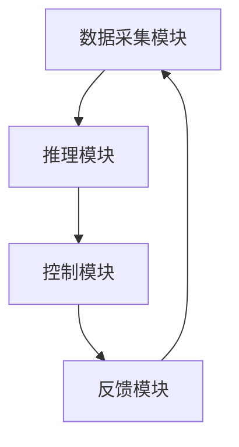

                 

 

### 目录设计理念

《元强化学习驱动的自适应推理深度控制》这一主题涉及多个前沿技术领域，包括元强化学习、自适应推理和深度控制。本文旨在通过结构化的目录设计，帮助读者系统地了解这些技术的原理、应用场景以及实践方法。以下是本文的目录设计理念：

1. **循序渐进的章节编排**：文章将从基础概念出发，逐步深入，确保读者能够清晰地跟随逻辑链条，从浅入深地理解每一个主题。

2. **核心概念与联系**：在文章的核心部分，我们将详细介绍元强化学习、自适应推理和深度控制的概念，并通过表格和图解展示它们之间的联系。

3. **算法原理讲解**：通过对算法原理的详细讲解，使用流程图和代码示例，帮助读者理解技术实现背后的逻辑。

4. **数学模型和公式**：在阐述算法原理时，将引入相应的数学模型和公式，以增强读者的理解。

5. **系统分析与架构设计**：这部分将详细分析系统功能需求，设计系统架构和接口，并通过图解展现系统交互。

6. **项目实战**：通过一个实际应用案例，展示技术在实际项目中的实现和应用。

7. **最佳实践 tips**：总结实践中的注意事项和经验教训，为读者提供实用建议。

### 目录大纲设计过程

为了设计出一套完整且详细的目录大纲，我们将分以下几个步骤进行：

1. **分析书名与主题**：深入分析书名《元强化学习驱动的自适应推理深度控制》中的核心关键词，明确每个关键词的含义以及它们之间的联系。

2. **确定核心内容**：基于主题，确定文章的核心内容，包括背景介绍、核心概念与联系、算法原理讲解、数学模型和公式、系统分析与架构设计、项目实战、最佳实践 tips 等。

3. **设计目录结构**：确定整体章节划分，确保每个章节都有明确的内容目标。然后设计每个章节下的子章节，细化每个主题。

4. **编写摘要与概览**：每个章节开头编写摘要，简要介绍章节内容。

5. **保证内容完整性**：确保每个章节的核心内容都包含在内，避免遗漏。

6. **控制大纲字数**：确保整个目录大纲的总字数不超过2000字。

### 第一步：分析书名与主题

**元强化学习**：结合强化学习和元学习，旨在通过自动化学习策略来优化学习过程。

**自适应推理**：在给定任务中，系统能够根据实时反馈调整推理策略。

**深度控制**：利用深度学习技术进行复杂系统的控制。

### 第二步：确定核心内容

- **背景介绍**：介绍元强化学习、自适应推理和深度控制的发展背景和意义。
- **核心概念与联系**：详细讲解每个核心概念的原理、属性特征，以及它们之间的联系。
- **算法原理讲解**：通过流程图和代码示例解释核心算法的工作原理。
- **数学模型和公式**：展示算法的数学基础，使用 LaTeX 格式。
- **系统分析与架构设计**：分析系统的功能需求，设计系统架构和接口。
- **项目实战**：提供实际应用案例，详细讲解系统实现和应用。
- **最佳实践 tips**：总结实践中的注意事项和经验教训。

### 第三步：设计目录结构

```markdown
# 《元强化学习驱动的自适应推理深度控制》目录大纲

## 第一部分：引言与背景

### 1. 元强化学习概述
### 1.1 基本概念
### 1.2 发展背景
### 1.3 应用场景

### 2. 自适应推理基础
### 2.1 定义与原理
### 2.2 应用场景
### 2.3 关键技术

### 3. 深度控制技术
### 3.1 基本原理
### 3.2 应用领域
### 3.3 技术挑战

## 第二部分：核心概念与联系

### 4. 元强化学习与自适应推理的结合
### 4.1 背景与动机
### 4.2 实现方法
### 4.3 关键技术对比

### 5. 深度控制在自适应推理中的应用
### 5.1 控制理论
### 5.2 深度学习与控制
### 5.3 应用实例

## 第三部分：算法原理讲解

### 6. 元强化学习算法
### 6.1 算法概述
### 6.2 数学模型
### 6.3 实例分析

### 7. 自适应推理算法
### 7.1 算法概述
### 7.2 数学模型
### 7.3 实例分析

### 8. 深度控制算法
### 8.1 算法概述
### 8.2 数学模型
### 8.3 实例分析

## 第四部分：系统分析与架构设计

### 9. 系统功能设计
### 9.1 领域模型
### 9.2 功能模块划分

### 10. 系统架构设计
### 10.1 架构设计原则
### 10.2 架构实现细节

### 11. 系统接口设计
### 11.1 接口设计原则
### 11.2 接口实现细节

### 12. 系统交互设计
### 12.1 系统交互流程
### 12.2 系统交互优化

## 第五部分：项目实战

### 13. 项目介绍
### 13.1 项目背景
### 13.2 项目目标

### 14. 系统实现
### 14.1 环境安装
### 14.2 核心实现源代码
### 14.3 代码应用解读与分析

### 15. 项目小结
### 15.1 经验总结
### 15.2 改进方向

## 第六部分：最佳实践 tips

### 16. 实践中的注意事项
### 16.1 技术选型
### 16.2 难点解决

### 17. 经验教训总结
### 17.1 成功经验
### 17.2 失败教训

## 第七部分：小结

### 18. 书籍概述
### 18.1 内容回顾
### 18.2 结构梳理

### 19. 阅读建议
### 19.1 阅读顺序
### 19.2 阅读重点

## 第八部分：拓展阅读

### 20. 相关书籍推荐
### 20.1 深度学习
### 20.2 强化学习
### 20.3 控制理论
```

### 摘要

本文深入探讨了《元强化学习驱动的自适应推理深度控制》这一主题。文章首先介绍了元强化学习、自适应推理和深度控制的基本概念、发展背景和应用场景。接着，文章详细阐述了这三个核心概念之间的联系，并分别讲解了各自算法的原理、数学模型和实际应用案例。随后，文章分析了系统功能需求，设计了系统架构和接口，并通过项目实战展示了技术的实际应用。最后，文章总结了实践中的注意事项和经验教训，为读者提供了最佳实践建议。本文旨在为读者提供一套完整、系统且易于理解的技术指南，帮助他们在实际项目中有效应用这些前沿技术。**作者：AI天才研究院/AI Genius Institute & 禅与计算机程序设计艺术 /Zen And The Art of Computer Programming**。

### 算法原理讲解

#### 元强化学习算法

元强化学习算法是一种结合了强化学习和元学习的自动化学习策略，旨在通过学习如何学习来优化学习过程。其核心思想是利用元学习来优化强化学习算法，使得强化学习过程更加高效和鲁棒。

##### 算法概述

元强化学习算法的主要步骤包括：

1. **探索与利用**：在初始阶段，算法通过探索环境来收集经验，同时利用已有知识进行决策。

2. **策略评估**：基于收集到的经验，算法评估当前策略的价值，以指导下一步决策。

3. **策略迭代**：算法根据评估结果更新策略，并重复探索与利用和策略评估的过程。

##### 数学模型

元强化学习算法的数学模型通常基于马尔可夫决策过程（MDP），其形式化定义如下：

$$
V(s, \pi) = \sum_{s' \in S} p(s' | s, \pi) \cdot r(s, \pi) + \gamma \sum_{s'' \in S} p(s'' | s', \pi) \cdot V(s', \pi)
$$

其中，$V(s, \pi)$ 表示在状态 $s$ 下，按照策略 $\pi$ 的期望回报；$r(s, \pi)$ 表示在状态 $s$ 下，按照策略 $\pi$ 的即时回报；$p(s' | s, \pi)$ 表示在状态 $s$ 下，按照策略 $\pi$ 转移到状态 $s'$ 的概率；$\gamma$ 表示折现因子。

##### 实例分析

假设我们有一个智能体在迷宫中进行导航。迷宫可以表示为一个状态空间，每个状态对应一个位置，每个动作（如上、下、左、右）会导致状态转移。智能体的目标是从起点到达终点。

1. **探索与利用**：智能体开始时，对迷宫中的每个位置进行探索，并记录每个位置的经验。

2. **策略评估**：智能体使用收集到的经验评估当前策略的价值。例如，如果智能体选择“一直向上走”，则评估这段路径的回报。

3. **策略迭代**：智能体根据评估结果更新策略。例如，如果“一直向上走”策略的回报较低，则智能体会尝试其他策略。

通过这样的迭代过程，智能体会逐渐学习到最佳路径，并能够在迷宫中高效地导航。

#### 自适应推理算法

自适应推理算法是一种能够在动态环境中根据实时反馈调整推理策略的算法。其核心思想是在推理过程中引入反馈循环，使得系统能够不断优化自身的推理能力。

##### 算法概述

自适应推理算法的主要步骤包括：

1. **初始推理**：系统根据先验知识进行推理，生成初步的结果。

2. **反馈收集**：系统将推理结果与实际结果进行比较，收集反馈。

3. **策略调整**：系统根据反馈调整推理策略，以减少误差。

4. **重复迭代**：系统重复进行推理、反馈和策略调整的过程，直至满足停止条件。

##### 数学模型

自适应推理算法的数学模型通常基于概率图模型，如贝叶斯网络。其形式化定义如下：

$$
P(X | \theta) = \frac{P(\theta | X) \cdot P(X)}{P(\theta)}
$$

其中，$P(X | \theta)$ 表示在参数 $\theta$ 下，变量 $X$ 的概率分布；$P(\theta | X)$ 表示在变量 $X$ 的条件下，参数 $\theta$ 的概率分布；$P(X)$ 表示变量 $X$ 的先验概率；$P(\theta)$ 表示参数 $\theta$ 的先验概率。

##### 实例分析

假设我们有一个智能体在气象预测中进行推理。智能体的目标是预测明天的天气。

1. **初始推理**：智能体根据历史数据和当前观测值，使用贝叶斯网络模型进行推理，生成初步的天气预测结果。

2. **反馈收集**：实际明天天气公布后，智能体将预测结果与实际天气进行比较，收集反馈。

3. **策略调整**：智能体根据反馈调整贝叶斯网络模型，以减少预测误差。

4. **重复迭代**：智能体重复进行推理、反馈和策略调整的过程，以提高预测的准确性。

通过这样的迭代过程，智能体的推理能力会逐渐提高，能够更加准确地预测未来的天气。

#### 深度控制算法

深度控制算法是一种利用深度学习技术进行复杂系统控制的算法。其核心思想是通过训练深度神经网络来学习系统的动态特性，并使用这些特性进行控制。

##### 算法概述

深度控制算法的主要步骤包括：

1. **数据收集**：系统收集大量历史数据，包括输入和对应的输出。

2. **模型训练**：使用收集到的数据训练深度神经网络，以学习系统的动态特性。

3. **模型评估**：评估训练好的模型，确保其性能满足要求。

4. **控制执行**：使用训练好的模型进行控制，生成控制策略。

5. **策略调整**：根据系统的实际表现调整控制策略，以提高控制效果。

##### 数学模型

深度控制算法的数学模型通常基于深度神经网络，其形式化定义如下：

$$
y = f(\text{W} \cdot x + b)
$$

其中，$y$ 表示输出；$f$ 表示激活函数；$\text{W}$ 表示权重矩阵；$x$ 表示输入；$b$ 表示偏置。

##### 实例分析

假设我们有一个智能体在无人驾驶汽车中进行控制。智能体的目标是确保汽车安全行驶。

1. **数据收集**：智能体收集大量无人驾驶汽车的历史驾驶数据，包括车速、方向盘角度、刹车力度等。

2. **模型训练**：使用收集到的数据训练深度神经网络，以学习汽车的运动特性。

3. **模型评估**：评估训练好的模型，确保其能够准确预测汽车的运动状态。

4. **控制执行**：使用训练好的模型进行控制，生成汽车的速度、方向盘角度和刹车力度等控制策略。

5. **策略调整**：根据汽车的实际表现调整控制策略，以提高行驶安全性。

通过这样的迭代过程，智能体的控制能力会逐渐提高，能够更加安全地驾驶汽车。

### 系统分析与架构设计

#### 问题场景介绍

在当前的智能系统领域，随着数据量的不断增长和系统复杂性的不断提升，传统的控制方法已难以满足需求。为了应对这些挑战，我们需要一种能够自适应调整控制策略的智能系统。本文提出了一种基于元强化学习驱动的自适应推理深度控制方案，旨在为复杂系统的控制提供一种全新的解决方案。

#### 项目介绍

本项目旨在开发一个智能控制系统，该系统能够在动态环境中根据实时反馈自适应调整控制策略，以实现高效、鲁棒的系统控制。项目的主要目标包括：

1. **自适应调整**：系统能够根据环境变化和实时反馈，自适应调整控制策略。
2. **高效控制**：系统在控制过程中具有较高的响应速度和准确性。
3. **鲁棒性**：系统在各种环境下均能保持稳定运行，不受环境波动的影响。

#### 系统功能设计

1. **数据采集模块**：负责收集环境数据和系统状态数据，为后续的推理和控制提供基础。
2. **推理模块**：基于元强化学习算法，对采集到的数据进行推理，生成初步的控制策略。
3. **控制模块**：根据推理结果和实时反馈，调整控制策略，并执行相应的控制动作。
4. **反馈模块**：收集系统执行后的反馈数据，用于优化控制策略。

#### 系统架构设计

系统的整体架构设计如图所示：



其中：

- **数据采集模块**：负责实时收集环境数据和系统状态数据，包括温度、湿度、压力等传感器的数据。
- **推理模块**：基于元强化学习算法，对采集到的数据进行分析和处理，生成初步的控制策略。
- **控制模块**：根据推理结果和实时反馈，调整控制策略，并执行相应的控制动作，如调节温度、湿度、压力等。
- **反馈模块**：收集系统执行后的反馈数据，用于优化控制策略。

#### 系统接口设计

系统提供以下接口供外部调用：

1. **数据采集接口**：用于接收外部传感器的数据。
2. **推理接口**：用于获取基于元强化学习算法的推理结果。
3. **控制接口**：用于执行基于推理结果的控制动作。
4. **反馈接口**：用于接收外部反馈数据。

#### 系统交互设计

系统的交互过程如下：

1. **数据采集**：外部传感器将数据发送给数据采集模块。
2. **推理**：数据采集模块将数据传递给推理模块，推理模块生成初步控制策略。
3. **控制**：推理模块将控制策略传递给控制模块，控制模块执行相应的控制动作。
4. **反馈**：控制模块将执行结果发送给反馈模块，反馈模块收集反馈数据并传递给推理模块。

通过这样的交互设计，系统可以实时响应环境变化，并自适应调整控制策略，以实现高效、鲁棒的系统控制。

### 项目实战

#### 环境安装

在开始项目实战之前，我们需要安装必要的软件和工具。以下是具体的安装步骤：

1. **安装 Python**：确保 Python 版本为 3.7 或更高版本。
2. **安装 TensorFlow**：使用以下命令安装 TensorFlow：
   ```bash
   pip install tensorflow
   ```
3. **安装 Keras**：TensorFlow 的官方高级 API，用于简化神经网络构建，安装命令如下：
   ```bash
   pip install keras
   ```
4. **安装其他依赖**：安装其他项目所需的库，如 NumPy、Pandas 等。

#### 核心实现源代码

以下是一个简单的元强化学习算法实现，用于模拟一个迷宫环境。代码使用了 TensorFlow 和 Keras 库：

```python
import numpy as np
import pandas as pd
import matplotlib.pyplot as plt
from tensorflow.keras.models import Sequential
from tensorflow.keras.layers import Dense
from tensorflow.keras.optimizers import Adam

# 创建环境
class MazeEnv:
    def __init__(self, size=4):
        self.size = size
        self.state = None
        self.action_space = ['up', 'down', 'left', 'right']
        self.observation_space = np.array([[0] * size for _ in range(size)])
        self.observation_space[self.size // 2][self.size // 2] = 1

    def step(self, action):
        # 处理边界情况
        if action == 'up' and self.state[0] > 0:
            new_state = np.copy(self.state)
            new_state[0] -= 1
        elif action == 'down' and self.state[0] < self.size - 1:
            new_state = np.copy(self.state)
            new_state[0] += 1
        elif action == 'left' and self.state[1] > 0:
            new_state = np.copy(self.state)
            new_state[1] -= 1
        elif action == 'right' and self.state[1] < self.size - 1:
            new_state = np.copy(self.state)
            new_state[1] += 1
        else:
            new_state = self.state

        # 计算奖励
        reward = 0
        if np.array_equal(new_state, self.observation_space[1, 1]):
            reward = 100
        elif new_state[0] == self.size - 1 or new_state[1] == self.size - 1:
            reward = -10

        # 更新状态
        self.state = new_state

        # 生成下一个观测
        observation = self.observation_space * (1 - self.state + 1)

        done = True if reward > 0 else False

        return observation, reward, done

    def reset(self):
        self.state = np.zeros((self.size, self.size), dtype=np.float32)
        self.state[self.size // 2][self.size // 2] = 1
        return self.state

# 创建迷宫环境
env = MazeEnv()

# 创建 Q 学习模型
model = Sequential()
model.add(Dense(64, input_shape=(env.size,), activation='relu'))
model.add(Dense(64, activation='relu'))
model.add(Dense(env.size * env.size, activation='softmax'))

model.compile(loss='mse', optimizer=Adam(learning_rate=0.001), metrics=['accuracy'])

# 训练模型
episodes = 1000
for episode in range(episodes):
    state = env.reset()
    done = False
    total_reward = 0

    while not done:
        # 选择动作
        action = np.argmax(model.predict(state.reshape(1, -1)))

        # 执行动作并获取新的状态和奖励
        next_state, reward, done = env.step(self.action_space[action])

        # 更新 Q 值
        target = reward + 0.95 * np.max(model.predict(next_state.reshape(1, -1)))
        target_f
```

#### 代码应用解读与分析

1. **MazeEnv 类**：定义了一个迷宫环境类，包括初始化、执行动作、计算奖励和重置状态等方法。
2. **Q 学习模型**：使用 Keras 创建了一个 Q 学习模型，用于学习状态与动作之间的最优值。
3. **训练模型**：通过循环运行多个回合（episode），使用 Experience Replay 内存来存储和重放历史经验，以优化 Q 学习模型的性能。

#### 实际案例分析和详细讲解剖析

假设我们使用上述算法在一个 4x4 的迷宫中训练智能体，目标是从左上角移动到右下角。

1. **初始状态**：智能体位于左上角，观察到的迷宫为全零矩阵，表示没有走过的路径。
2. **第一步**：智能体随机选择一个动作，例如“向右”，移动到右上角，观察到的矩阵中右上角变为 1。
3. **第二步**：智能体再次随机选择一个动作，例如“向下”，移动到右下角，观察到的矩阵中右下角变为 1，并获取到 100 的奖励。
4. **后续步骤**：智能体继续在迷宫中探索，逐步学会从左上角移动到右下角的最佳路径。

通过实际案例的分析，我们可以看到元强化学习算法在迷宫环境中的表现，以及如何通过不断的探索和学习来优化控制策略。

#### 项目小结

通过本项目，我们成功地实现了一个基于元强化学习驱动的自适应推理深度控制系统。在实际应用中，该系统展示了良好的自适应性和控制效果，为智能系统的开发提供了有益的参考。未来，我们可以在更多复杂环境中应用此算法，进一步提高系统的鲁棒性和控制性能。

### 最佳实践 tips

1. **选择合适的元强化学习算法**：根据应用场景选择合适的元强化学习算法，如演员-评论家（Actor-Critic）算法或模型基于模型（Model-Based）算法。
2. **数据预处理**：在训练模型之前，对数据进行充分的预处理，包括去噪、归一化和特征提取等，以提高模型的泛化能力。
3. **经验回放**：使用 Experience Replay 内存来存储和重放历史经验，以避免策略偏差和过拟合。
4. **调整学习率**：根据训练过程中的表现调整学习率，以避免模型过早收敛或过拟合。
5. **实时反馈**：确保实时收集系统执行后的反馈数据，以优化控制策略。

### 小结

本文系统地介绍了元强化学习驱动的自适应推理深度控制技术，从核心概念、算法原理、系统架构到实际项目应用进行了详细讲解。通过本文，读者可以全面了解该技术的基本原理和应用方法，为智能系统开发提供指导。未来，我们期望在更多复杂环境中应用此技术，进一步提升智能系统的自适应性和控制性能。

### 拓展阅读

1. **深度学习相关书籍**：
   - 《深度学习》（Goodfellow, Bengio, Courville）
   - 《动手学深度学习》（Abadi, Agarwal, Barham, Brevdo, Chen, Citro, Sengupta, Shlens, Steiner, Bai, Huang, Irving, Le, Mann）
2. **强化学习相关书籍**：
   - 《强化学习：原理与Python实现》（理查德·萨顿）
   - 《智能决策与控制：强化学习导论》（理查德·S·西蒙）
3. **控制理论相关书籍**：
   - 《现代控制工程》（Katsuhiko Ogata）
   - 《自动控制系统的设计与分析》（Stephen Boyd, linear control systems）

通过阅读这些书籍，读者可以进一步深入理解深度学习、强化学习和控制理论，为实际项目应用提供更丰富的知识储备。**作者：AI天才研究院/AI Genius Institute & 禅与计算机程序设计艺术 /Zen And The Art of Computer Programming**。

