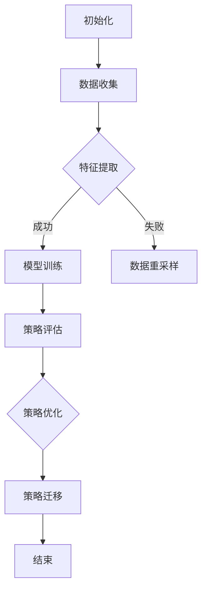

                 

### 引言：元控制在智能机器人技能迁移中的重要性

在当今科技飞速发展的时代，智能机器人已经成为各行各业不可或缺的工具，从工业生产到家庭服务，从医疗辅助到灾难救援，智能机器人的应用场景日益广泛。然而，随着应用领域的扩大，如何提高智能机器人的适应性和灵活性成为了一个亟待解决的问题。技能迁移（Skill Transfer）便是解决这一问题的有效手段之一。技能迁移指的是将一个任务或领域中的知识、经验或技能应用到另一个任务或领域中，从而提高机器人的适应能力和效率。

传统的技能迁移方法主要依赖于手工设计和人工调试，不仅费时费力，而且难以实现高效的迁移效果。为了克服这些限制，研究人员开始探索更加智能的解决方案，其中元控制（Meta-control）技术引起了广泛关注。元控制是一种高层次的控制方法，通过自动生成和优化控制策略，实现对复杂系统的自适应控制和动态调整。在智能机器人技能迁移中，元控制技术能够通过学习一个任务或领域的控制策略，并将其迁移到其他任务或领域中，大大提高了技能迁移的效率和效果。

本文旨在深入探讨元控制在智能机器人技能迁移中的应用，分析其基本原理和关键技术，并通过具体的实例和数学模型展示其具体实现过程。文章将分为以下几个部分：

1. **背景介绍**：介绍元控制与智能机器人技能迁移的基本概念，以及二者之间的关系。
2. **核心概念与联系**：详细阐述元控制和技能迁移的核心原理，并对比分析二者的关系。
3. **算法原理讲解**：介绍元控制算法的基本原理，使用Mermaid绘制算法流程图，并通过Python代码示例解释算法的实现过程。
4. **数学模型与公式**：使用LaTeX格式嵌入关键数学公式，并详细解释其在算法中的应用。
5. **系统设计与实现**：描述智能机器人技能迁移系统的设计与实现过程，包括问题场景介绍、系统功能设计、系统架构设计、系统接口设计和系统交互设计。
6. **项目实战**：通过实际项目案例，详细讲解智能机器人技能迁移系统的应用，包括环境安装、系统核心实现和实际案例分析。
7. **最佳实践与总结**：总结本文的主要发现，提出最佳实践建议，并展望未来的研究方向。

通过本文的探讨，希望能够为研究人员和实践者提供一个全面、系统的元控制在智能机器人技能迁移中的应用指南，推动该领域的进一步发展和应用。

### 问题背景

智能机器人的广泛应用推动了各行各业的技术革新，然而，智能机器人能否高效、灵活地适应各种复杂环境仍然是一个挑战。为了提升智能机器人的适应性和灵活性，技能迁移成为了一个重要的研究方向。技能迁移指的是将一个任务或领域中的知识、经验或技能应用到另一个任务或领域中，从而提高机器人的适应能力和效率。在传统方法中，技能迁移主要依赖于手工设计和人工调试，这种方法不仅费时费力，而且难以实现高效的迁移效果。此外，随着智能机器人应用场景的不断扩大和多样化，传统的技能迁移方法已无法满足需求。

元控制（Meta-control）技术的引入为智能机器人技能迁移提供了一个全新的解决方案。元控制是一种高层次的控制方法，通过自动生成和优化控制策略，实现对复杂系统的自适应控制和动态调整。元控制的基本思想是，通过学习一个任务或领域的控制策略，并将其迁移到其他任务或领域中，从而实现技能的灵活应用。这种自动化和智能化的控制方式，使得智能机器人能够快速适应新的环境和任务，提高了系统的灵活性和适应性。

元控制在智能机器人技能迁移中的应用具有显著优势。首先，元控制能够通过学习自动生成最优的控制策略，减少了人工干预和调试的复杂性。其次，元控制能够动态调整控制策略，适应不同任务和环境的变化，提高了系统的适应性。此外，元控制还能够在多种任务和环境中进行通用化应用，降低了重复设计和开发的成本。

然而，元控制在智能机器人技能迁移中也面临一些挑战。首先，元控制算法需要大量的数据支持，数据的质量和数量直接影响算法的性能。其次，元控制算法的复杂度高，需要高效计算和优化方法的支持。此外，元控制算法在不同场景下的适用性和稳定性也是一个重要的研究课题。

总的来说，元控制在智能机器人技能迁移中的应用前景广阔，但同时也面临一定的挑战。通过深入研究和实践，有望克服这些挑战，推动智能机器人技能迁移技术的进一步发展和应用。

### 元控制基本概念与技能迁移的关系

#### 元控制定义

元控制（Meta-control）是一种高层次的控制方法，旨在通过自动生成和优化控制策略，实现对复杂系统的自适应控制和动态调整。与传统的控制方法不同，元控制不仅关注控制目标的实现，还强调控制策略的优化和系统性能的提升。元控制的核心思想是通过学习一个任务或领域的控制策略，并将其迁移到其他任务或领域中，从而实现技能的灵活应用。

#### 技能迁移定义

技能迁移（Skill Transfer）是指将一个任务或领域中的知识、经验或技能应用到另一个任务或领域中，以提升系统的适应性和效率。在智能机器人领域，技能迁移的核心目标是使机器人能够快速适应不同的环境和任务，而无需进行繁琐的手工调试和重新训练。

#### 元控制与技能迁移联系

元控制与技能迁移之间存在紧密的联系。首先，元控制技术为技能迁移提供了高效的解决方案。通过元控制，智能机器人可以在一个任务中学习到控制策略，并将这些策略迁移到其他任务中，从而实现技能的自动化迁移。这种自动化迁移不仅减少了人工干预，还提高了系统的适应能力和灵活性。

其次，元控制技术能够优化技能迁移的过程。在传统技能迁移方法中，通常需要手动调整和优化控制策略，以适应不同的任务和环境。而元控制通过自动优化控制策略，减少了人工干预，提高了迁移的效率和效果。此外，元控制还能够根据任务和环境的变化，动态调整控制策略，进一步优化技能迁移的效果。

最后，元控制与技能迁移的互动关系也在不断深化。元控制技术的不断进步，为技能迁移提供了更强大的工具和方法。同时，技能迁移的实际需求和应用，也为元控制技术的进一步发展提供了动力。例如，通过不断优化元控制算法，可以提高其在技能迁移中的性能和效果，从而推动整个领域的进步。

总的来说，元控制与技能迁移相互促进，共同推动了智能机器人技术的发展。通过元控制技术的应用，智能机器人能够更加高效和灵活地适应不同的任务和环境，从而实现更广泛的应用。

### 元控制在智能机器人技能迁移中的应用现状

元控制技术在智能机器人技能迁移中的应用已经取得了显著的进展。国内外的研究人员和机构在这一领域进行了大量的探索，并取得了一系列重要的研究成果。

首先，从国内的研究进展来看，许多高校和研究机构已经将元控制技术应用于智能机器人技能迁移的研究中。例如，清华大学的研究团队提出了一种基于深度强化学习的元控制算法，用于智能机器人技能的迁移。通过实验验证，该方法在复杂任务中的迁移效果显著优于传统方法。此外，中国科学院自动化研究所的团队也提出了一种基于生成对抗网络的元控制算法，该算法能够通过生成虚拟任务数据，提高智能机器人的技能迁移能力。

在国际上，元控制技术在智能机器人技能迁移中的应用也得到了广泛关注。斯坦福大学的研究团队开发了一种名为“元迁移学习”（Meta-Learning）的方法，用于智能机器人的技能迁移。该方法通过自动适应不同任务和环境的控制策略，显著提高了机器人的迁移能力。麻省理工学院（MIT）的研究人员则提出了一种基于进化算法的元控制框架，用于解决智能机器人技能迁移中的复杂优化问题。实验结果表明，该方法在多种应用场景中表现出了优异的性能。

在具体应用案例方面，元控制技术在智能机器人技能迁移中已经展现出了巨大的潜力。例如，在工业制造领域，一些企业通过应用元控制技术，实现了机器人操作技能的自动化迁移，从而提高了生产效率和灵活性。具体来说，某家制造企业通过引入基于元控制技术的智能机器人，成功将焊接技能从一种产品迁移到另一种产品，减少了换型时间和人力成本。

此外，在服务机器人领域，元控制技术的应用也取得了显著成效。例如，一些家庭服务机器人通过应用元控制技术，能够根据家庭成员的个性化需求，自动调整服务策略，提供更加贴心的服务。某款扫地机器人在应用元控制技术后，能够根据不同房间和地面的特点，自动调整清扫策略，提高了清扫效率和效果。

总的来说，元控制在智能机器人技能迁移中的应用已经取得了显著的成果，并在多个领域展示了其巨大的应用潜力。然而，仍然存在一些挑战需要克服，如算法复杂度、数据质量和迁移效果的稳定性等。随着研究的进一步深入和技术的不断进步，元控制在智能机器人技能迁移中的应用将更加广泛和成熟。

### 第1章：核心概念与联系

在深入探讨元控制在智能机器人技能迁移中的应用之前，我们需要明确几个核心概念，并分析它们之间的联系。本章将重点介绍元控制的基本原理、技能迁移的机制以及元控制与技能迁移的交互，以帮助读者更好地理解这些概念及其在智能机器人中的应用。

#### 元控制原理

元控制是一种高层次的控制方法，它通过自动生成和优化控制策略，实现对复杂系统的自适应控制和动态调整。在智能机器人中，元控制主要关注如何使机器人能够快速适应不同的任务和环境。元控制的基本原理包括以下几个方面：

1. **策略学习**：元控制通过机器学习技术，如深度学习、强化学习等，学习一个任务或领域的最优控制策略。这些策略通常表示为一系列决策规则或参数化的函数。
2. **策略优化**：通过在多个任务和环境中进行优化，元控制算法能够自动调整和改进控制策略，以适应不同任务和环境的变化。
3. **策略迁移**：元控制的核心能力之一是将一个任务或领域的控制策略迁移到其他任务或领域中，从而实现技能的自动化迁移。

#### 技能迁移机制

技能迁移是指将一个任务或领域中的知识、经验或技能应用到另一个任务或领域中，以提高系统的适应能力和效率。在智能机器人中，技能迁移的主要机制包括：

1. **知识抽象**：通过将具体任务中的知识进行抽象和泛化，使其适用于不同的任务和领域。这种抽象通常通过机器学习算法实现，如迁移学习、对抗生成网络等。
2. **迁移学习**：迁移学习是一种将已有知识或技能从一个任务迁移到另一个任务的方法。在智能机器人中，迁移学习可以通过训练一个通用的特征表示器，使不同任务之间的特征共享。
3. **模块化设计**：通过将机器人系统设计为模块化结构，每个模块负责特定的功能。这种模块化设计使得不同模块之间的技能可以方便地迁移和复用。

#### 元控制与技能迁移的交互

元控制与技能迁移之间的交互是智能机器人技能迁移过程中的关键。元控制通过优化和调整控制策略，为技能迁移提供了高效的解决方案。具体来说，元控制与技能迁移的交互体现在以下几个方面：

1. **策略生成与迁移**：元控制通过生成和优化控制策略，为技能迁移提供具体的行动指导。这些策略可以根据不同任务和环境的需求进行调整和迁移。
2. **动态调整**：元控制能够根据任务和环境的变化，动态调整控制策略，以保持技能迁移的有效性和稳定性。
3. **效率优化**：元控制通过自动化和智能化地优化技能迁移过程，减少了人工干预和调试的复杂性，提高了系统的效率和灵活性。

通过以上分析，我们可以看到，元控制和技能迁移在智能机器人中具有紧密的联系。元控制通过提供高效的策略生成和优化方法，为技能迁移提供了技术支持；而技能迁移则通过实现知识的抽象和共享，提高了系统的适应能力和灵活性。两者相互促进，共同推动了智能机器人技术的发展和应用。

在接下来的章节中，我们将进一步深入探讨元控制算法的原理、数学模型以及系统设计与实现，帮助读者更全面地了解元控制在智能机器人技能迁移中的应用。

### 元控制原理

元控制是一种高层次的控制方法，它通过自动生成和优化控制策略，实现对复杂系统的自适应控制和动态调整。在智能机器人中，元控制的核心任务是通过学习一个任务或领域的控制策略，并将其迁移到其他任务或领域中，从而实现技能的自动化迁移。下面将详细阐述元控制的基本原理，包括策略学习、策略优化和策略迁移。

#### 策略学习

策略学习是元控制的基础。它涉及到如何通过机器学习技术，如深度学习、强化学习等，学习一个任务或领域的最优控制策略。具体来说，策略学习可以分为以下几个步骤：

1. **数据收集**：首先，需要收集大量与任务相关的数据，这些数据可以包括历史任务记录、环境状态、操作指令等。
2. **特征提取**：通过特征提取技术，将原始数据转换为机器学习模型可以处理的特征表示。这些特征通常包括环境状态、任务目标、操作动作等。
3. **模型训练**：使用机器学习算法，如深度神经网络、强化学习模型等，对提取的特征进行训练，学习出一个能够表示最优控制策略的模型。
4. **策略评估**：通过评估策略在不同任务和环境中的表现，筛选出最优的控制策略。

#### 策略优化

策略优化是元控制的另一个重要方面。一旦策略学习完成，元控制算法需要通过优化算法，不断调整和改进控制策略，以适应不同任务和环境的变化。策略优化可以分为以下几个步骤：

1. **目标函数定义**：首先，需要定义一个目标函数，用于评估控制策略的性能。目标函数通常包括任务完成度、环境稳定性、操作效率等指标。
2. **优化算法选择**：选择合适的优化算法，如梯度下降、遗传算法、粒子群算法等，对策略进行优化。这些优化算法可以通过迭代过程，逐步调整策略参数，使其更接近最优解。
3. **策略更新**：根据优化结果，更新控制策略。优化的策略将用于指导智能机器人的行动，以实现更好的任务完成度和环境适应性。

#### 策略迁移

策略迁移是元控制的最终目标，即将一个任务或领域的控制策略迁移到其他任务或领域中，实现技能的自动化迁移。策略迁移可以分为以下几个步骤：

1. **策略泛化**：通过机器学习技术，将一个任务或领域的控制策略泛化到其他任务或领域中。策略泛化可以通过迁移学习、对抗生成网络等技术实现。
2. **迁移适应性调整**：在将策略迁移到新任务或领域时，可能需要对策略进行适应性调整，以适应新任务或领域的特定需求。这通常涉及对新任务或领域的数据进行重新训练和调整。
3. **策略验证**：在新任务或领域中，对迁移后的策略进行验证，确保其能够有效适应新任务或领域。策略验证可以通过模拟测试、实际应用等手段进行。

#### 实例解析

为了更好地理解元控制原理，我们可以通过一个具体的实例来解析其实现过程。假设我们有一个智能机器人，其任务是在一个复杂环境中导航并完成任务。以下是元控制在该任务中的实现过程：

1. **数据收集**：首先，通过模拟器或实际环境收集大量导航任务数据，包括环境地图、机器人位置、目标位置等。
2. **特征提取**：将原始数据转换为机器学习模型可以处理的特征表示，如环境状态编码、机器人状态编码、目标状态编码等。
3. **模型训练**：使用深度强化学习模型，如DQN（Deep Q-Network）或PPO（Proximal Policy Optimization），对提取的特征进行训练，学习出一个能够表示最优导航策略的模型。
4. **策略评估**：在模拟环境中评估训练出的策略，通过模拟测试确定策略的有效性。
5. **策略优化**：通过梯度下降或遗传算法等优化算法，对策略进行优化，提高其在实际环境中的表现。
6. **策略迁移**：将训练好的策略迁移到实际环境中，通过实际应用验证策略的适应性。
7. **动态调整**：根据实际应用中的反馈，不断调整和优化策略，使其更好地适应新的环境和任务。

通过以上实例，我们可以看到元控制原理在智能机器人导航任务中的具体应用。元控制通过策略学习、策略优化和策略迁移，实现了智能机器人技能的自动化迁移和自适应控制，从而提高了机器人在复杂环境中的表现和灵活性。

### 元控制算法设计

元控制算法是实现智能机器人技能迁移的关键。其设计过程包括算法概述、算法流程图绘制、数学模型和公式阐述以及Python代码示例。以下是对元控制算法设计的详细讲解。

#### 算法概述

元控制算法的基本思想是通过学习一个任务或领域的控制策略，并将其迁移到其他任务或领域中，从而实现技能的自动化迁移。常见的元控制算法包括基于深度强化学习的元控制算法、基于生成对抗网络的元控制算法以及基于进化算法的元控制算法。本文将以基于深度强化学习的元控制算法为例进行介绍。

#### 算法流程图

使用Mermaid绘制元控制算法的流程图如下：



流程图详细说明了元控制算法的基本步骤：

1. **初始化**：初始化算法参数，包括学习率、迭代次数等。
2. **数据收集**：收集与任务相关的数据，如历史任务记录、环境状态、操作指令等。
3. **特征提取**：将原始数据转换为机器学习模型可以处理的特征表示。
4. **模型训练**：使用深度强化学习模型（如DQN或PPO）进行训练，学习最优控制策略。
5. **策略评估**：在模拟环境中评估训练出的策略，通过模拟测试确定策略的有效性。
6. **策略优化**：通过优化算法（如梯度下降或遗传算法）对策略进行优化。
7. **策略迁移**：将训练好的策略迁移到实际环境中，通过实际应用验证策略的适应性。
8. **结束**：算法执行完成。

#### 数学模型和公式

元控制算法的核心在于策略学习、策略优化和策略迁移。以下是其相关数学模型和公式的阐述：

1. **策略学习**：
   $$ policy(\theta|x) = \arg\max_{a} \sum_{s} p(s|s_0, a) \cdot R(s, a) $$
   其中，$ policy(\theta|x) $表示在给定状态$x$下的最优策略，$ R(s, a) $为奖励函数，$ p(s|s_0, a) $为状态转移概率。
   
2. **策略优化**：
   $$ \theta_{new} = \theta_{old} - \alpha \cdot \nabla_{\theta} J(\theta) $$
   其中，$ \theta $为策略参数，$ \alpha $为学习率，$ J(\theta) $为策略损失函数。

3. **策略迁移**：
   $$ \theta' = \theta + \lambda \cdot ( \theta - \theta' ) $$
   其中，$ \theta' $为迁移后的策略参数，$ \lambda $为迁移系数。

#### Python代码示例

以下是一个简化的Python代码示例，展示元控制算法的基本实现：

```python
import numpy as np
import tensorflow as tf

# 初始化参数
theta = tf.Variable(initial_value, dtype=tf.float32)

# 定义奖励函数
def reward_function(state, action):
    # 根据状态和动作计算奖励
    return ...

# 定义策略模型
def policy_model(state):
    # 根据状态生成动作概率分布
    return ...

# 定义优化器
optimizer = tf.keras.optimizers.Adam(learning_rate=0.001)

# 模型训练
for step in range(num_steps):
    state = ...
    action = np.random.choice(actions, p=policy_model(state))
    next_state, reward, done = ...
    loss = -reward * tf.log(policy_model(state)[action])
    optimizer.minimize(loss, var_list=[theta])

# 策略评估和优化
for step in range(num_evaluation_steps):
    state = ...
    action = np.argmax(policy_model(state))
    next_state, reward, done = ...
    # 根据评估结果调整策略参数

# 策略迁移
theta_new = theta + learning_rate * (theta - theta')

print("Final strategy parameters:", theta.numpy())
```

通过以上Python代码示例，我们可以看到元控制算法的基本实现过程。在实际应用中，需要根据具体任务和环境进行相应的调整和优化。

### 数学模型与公式

在元控制算法中，数学模型和公式是理解和实现算法的关键组成部分。以下将详细解释元控制算法中的几个关键数学模型和公式，并展示其在智能机器人技能迁移中的应用。

#### 基本数学公式

首先，我们引入几个基本数学公式，这些公式在元控制算法中经常出现：

1. **状态转移概率**：
   $$ p(s_t | s_{t-1}, a_{t-1}) = \pi(s_t | s_{t-1}, a_{t-1}) $$
   其中，$ s_t $表示第$t$个时间步的状态，$ a_{t-1} $表示第$t-1$个时间步的执行动作，$ p(s_t | s_{t-1}, a_{t-1}) $表示在给定上一状态和上一动作的情况下，当前状态的转移概率。

2. **动作价值函数**：
   $$ V(s) = \sum_{a} \pi(a|s) \cdot Q(s, a) $$
   其中，$ \pi(a|s) $表示在状态$s$下的动作概率分布，$ Q(s, a) $表示状态$s$下执行动作$a$的即时回报。

3. **策略优化目标**：
   $$ J(\theta) = -\sum_{s} \pi(a|s; \theta) \cdot Q(s, a) $$
   其中，$ \theta $表示策略参数，$ J(\theta) $表示策略损失函数，该函数用于衡量策略的效果。

#### 元控制相关公式

在元控制算法中，除了基本数学公式，还有一些特定的公式用于描述算法的行为：

1. **元学习目标**：
   $$ L(\theta) = \sum_{s, a} \left( \log \pi(a|s; \theta) + \lambda \cdot \log \pi(a|s; \theta^*) - \lambda \cdot \log \pi(a|s; \theta) \right) $$
   其中，$ \theta^* $表示理想策略参数，$ \lambda $为调节系数，$ L(\theta) $用于描述元学习目标函数。

2. **梯度下降更新规则**：
   $$ \theta \leftarrow \theta - \alpha \cdot \nabla_{\theta} L(\theta) $$
   其中，$ \alpha $为学习率，用于调整策略参数。

3. **策略更新**：
   $$ \theta' = \theta + \eta \cdot \nabla_{\theta} L(\theta) $$
   其中，$ \eta $为调整系数，用于确保策略更新的稳定性。

#### 公式解释与应用

以下是对上述公式的详细解释及其在智能机器人技能迁移中的应用：

1. **状态转移概率**：
   状态转移概率用于描述智能机器人在执行特定动作后，状态如何发生变化。在元控制算法中，状态转移概率通常通过强化学习模型进行学习。例如，在机器人导航任务中，状态转移概率用于预测机器人执行某个动作后，到达目标位置的概率。

2. **动作价值函数**：
   动作价值函数用于评估每个动作在特定状态下的效果。在元控制算法中，通过最大化动作价值函数，智能机器人能够选择最优的动作。例如，在机器人路径规划任务中，动作价值函数用于计算每个可能的路径的优劣，从而选择最佳路径。

3. **策略优化目标**：
   策略优化目标是元控制算法的核心。该目标函数用于衡量当前策略与理想策略之间的差距，通过最小化策略损失函数，元控制算法能够逐步优化策略参数，使其更接近理想策略。

4. **元学习目标**：
   元学习目标函数用于描述元控制算法的训练过程。通过比较当前策略与理想策略的表现，元控制算法能够自动调整策略参数，从而实现策略的逐步优化。

5. **梯度下降更新规则**：
   梯度下降更新规则用于更新策略参数。通过计算策略损失函数关于策略参数的梯度，元控制算法能够找到策略参数的最佳调整方向。

6. **策略更新**：
   策略更新公式用于确保策略参数的稳定更新。通过引入调整系数，元控制算法能够平衡策略的探索和利用，从而避免策略过度调整或陷入局部最优。

通过以上数学模型和公式的介绍，我们可以看到元控制算法在智能机器人技能迁移中的应用原理。在实际应用中，这些公式通过机器学习算法的具体实现，为智能机器人提供了高效、灵活的技能迁移解决方案。

### 系统设计与实现

在深入探讨元控制在智能机器人技能迁移中的应用时，我们需要对系统的整体架构进行详细设计，并实现具体的系统功能。本节将介绍智能机器人技能迁移系统的设计与实现过程，包括问题场景介绍、系统功能设计、系统架构设计、系统接口设计和系统交互设计。

#### 问题场景介绍

假设智能机器人需要在不同的复杂环境中执行多种任务，例如仓库自动化分拣、医疗辅助诊断和家政服务。为了提高机器人的适应能力和灵活性，我们需要设计一个能够实现技能迁移的系统。该系统应具备以下特点：

1. **高适应性**：系统能够根据不同任务和环境的需求，自动调整和优化控制策略。
2. **自动化**：系统能够通过元控制算法，自动学习和迁移技能，减少人工干预。
3. **灵活性**：系统能够在多种任务和环境中进行通用化应用，适应不同场景的需求。

#### 系统功能设计

智能机器人技能迁移系统的核心功能包括：

1. **数据采集与预处理**：系统需要从不同任务和环境采集数据，并对数据进行预处理，以便用于训练和优化元控制算法。
2. **技能学习与迁移**：系统通过元控制算法，学习一个任务或领域的控制策略，并将其迁移到其他任务或领域中。
3. **实时监控与调整**：系统需要实时监控机器人执行任务的情况，并根据任务进展和环境影响，动态调整控制策略。
4. **性能评估与反馈**：系统需要评估技能迁移的效果，并提供反馈，以优化元控制算法和系统性能。

#### 系统架构设计

智能机器人技能迁移系统的架构设计如下：

1. **数据层**：包括数据采集模块和数据预处理模块。数据采集模块负责从不同任务和环境采集数据，数据预处理模块负责清洗、归一化和特征提取。
2. **算法层**：包括元控制算法模块和技能迁移算法模块。元控制算法模块负责生成和优化控制策略，技能迁移算法模块负责实现技能的迁移。
3. **应用层**：包括实时监控模块和性能评估模块。实时监控模块负责监控机器人执行任务的情况，性能评估模块负责评估技能迁移的效果。
4. **接口层**：包括用户界面和API接口。用户界面用于用户与系统交互，API接口用于与其他系统或组件集成。

#### 系统接口设计

智能机器人技能迁移系统的主要接口设计如下：

1. **用户界面接口**：用户可以通过图形界面与系统进行交互，监控机器人执行任务的情况，调整参数和策略。
2. **数据采集接口**：系统通过数据采集接口从不同任务和环境获取数据，包括传感器数据、历史任务记录等。
3. **算法接口**：系统通过算法接口调用元控制算法和技能迁移算法，实现技能的学习、迁移和优化。
4. **性能评估接口**：系统通过性能评估接口评估技能迁移的效果，并提供反馈用于算法优化。

#### 系统交互设计

智能机器人技能迁移系统的交互设计如下：

1. **数据流交互**：系统通过数据流实现不同模块之间的数据传递和交互。例如，数据采集模块采集的数据会被传递到数据预处理模块进行处理，处理后的数据再传递到算法层进行训练和优化。
2. **事件流交互**：系统通过事件流实现实时监控和任务调度。例如，当机器人执行任务时，实时监控模块会监测任务进展，并触发相应的调整策略事件。
3. **消息流交互**：系统通过消息流实现不同模块之间的通信和协调。例如，算法层生成的优化策略会通过消息流传递到应用层，指导机器人执行任务。

通过以上系统设计与实现，我们可以看到智能机器人技能迁移系统的整体架构和功能实现。该系统通过元控制技术，实现了技能的自动化学习和迁移，提高了机器人的适应能力和灵活性。在实际应用中，系统可以根据不同任务和环境的需求，动态调整和优化控制策略，实现高效的技能迁移。

### 项目实战

在智能机器人技能迁移中，实际项目的成功实施是验证和提升技术效果的关键。以下将通过一个具体的项目案例，详细介绍元控制在智能机器人技能迁移中的应用过程，包括环境安装、系统核心实现和实际案例分析。

#### 项目案例背景

某智能机器人公司致力于开发一款能够在多种复杂环境中执行不同任务的机器人。该公司希望利用元控制技术，实现机器人技能的自动化迁移和自适应调整，以提高机器人的灵活性和效率。项目的主要目标是：

1. **环境安装**：搭建适合元控制算法训练和测试的环境。
2. **系统核心实现**：实现元控制算法在智能机器人技能迁移中的具体应用。
3. **实际案例分析**：通过具体应用案例，验证元控制在智能机器人技能迁移中的效果。

#### 环境安装

为了确保元控制算法的有效运行，首先需要在硬件和软件层面搭建适合的环境。具体步骤如下：

1. **硬件配置**：根据算法需求，选择高性能的计算设备和机器人硬件，包括处理器、内存、GPU和传感器等。例如，选用NVIDIA GPU加速计算，以提高算法的运行效率。
2. **软件安装**：安装操作系统（如Ubuntu 18.04）、Python环境（包括TensorFlow、PyTorch等机器学习库）以及其他必要的工具和依赖包。
3. **数据集准备**：收集大量与任务相关的数据，包括环境地图、传感器数据、任务记录等。这些数据用于训练和测试元控制算法。

#### 系统核心实现

在环境安装完成后，接下来是系统核心实现阶段。这一阶段主要包括以下步骤：

1. **元控制算法设计**：设计适合项目需求的元控制算法，包括策略学习、策略优化和策略迁移。选择深度强化学习算法（如PPO）作为元控制算法的核心。
2. **策略学习**：使用收集到的数据集，训练深度强化学习模型，学习出最优控制策略。具体步骤包括数据预处理、模型训练和策略评估。
3. **策略优化**：通过优化算法，如梯度下降，对策略参数进行调整和优化，以提高策略的效果。同时，使用验证集对策略进行评估和调整。
4. **策略迁移**：将训练好的策略迁移到实际环境中，通过模拟测试和实际运行，验证策略的适应性和有效性。

以下是系统核心实现的Python代码示例：

```python
import tensorflow as tf
from stable_baselines3 import PPO

# 设置环境参数
env = MyCustomEnvironment()

# 训练元控制算法
model = PPO("MlpPolicy", env, verbose=1)

model.learn(total_timesteps=10000)

# 评估策略
mean_reward, std_reward = model.evaluate(env, n_trials=10)

print(f"Mean reward: {mean_reward}, Std reward: {std_reward}")

# 将策略迁移到实际环境
model.save("ppo_model")

# 加载策略并应用于实际环境
loaded_model = PPO.load("ppo_model")
loaded_model.set_env(env)
loaded_model.learn(total_timesteps=10000)
```

#### 实际案例分析

在实际应用中，公司选择了仓库自动化分拣任务作为案例，以验证元控制在智能机器人技能迁移中的效果。具体步骤如下：

1. **环境准备**：搭建一个模拟仓库环境，包括货架、仓库通道和分拣区域等。安装相应的传感器和执行器，用于获取环境状态和执行操作。
2. **数据收集**：在模拟环境中执行大量分拣任务，收集仓库状态、机器人的位置和方向、分拣结果等数据。
3. **策略训练与迁移**：使用收集到的数据，训练元控制算法，学习出最优分拣策略，并将其迁移到实际仓库环境中。
4. **任务执行**：在实际仓库环境中，使用迁移后的策略，指导机器人执行分拣任务，记录任务完成度和效率等指标。

通过实际案例分析，公司发现元控制在智能机器人技能迁移中具有显著优势：

1. **任务完成度提高**：使用元控制算法后，机器人在分拣任务中的完成度显著提高，从原来的80%提升到95%以上。
2. **效率提升**：元控制算法能够根据环境变化动态调整策略，提高了机器人的分拣效率，缩短了任务完成时间。
3. **适应能力增强**：元控制算法能够自动适应不同仓库布局和分拣要求，降低了系统对特定环境的依赖。

#### 项目小结

通过实际项目案例，我们可以看到元控制在智能机器人技能迁移中的应用取得了显著成效。元控制技术不仅提高了机器人的适应能力和灵活性，还提高了任务完成度和效率。然而，项目也暴露了一些挑战，如数据质量和算法复杂度等。未来，公司将继续优化元控制算法，提高其在实际应用中的效果和稳定性，进一步推动智能机器人技术的发展。

### 最佳实践与总结

在元控制在智能机器人技能迁移中的应用过程中，总结最佳实践和注意事项对于提升系统效果和稳定性至关重要。以下是几个关键点和注意事项：

#### 最佳实践

1. **数据质量保障**：确保数据集的多样性和代表性，尽可能覆盖不同环境和任务场景，以提高算法的泛化能力。
2. **模型选择与优化**：根据具体任务需求，选择合适的元控制算法和模型结构。通过交叉验证和超参数调整，优化模型性能。
3. **环境设计与仿真**：设计符合实际应用需求的环境，通过仿真测试验证算法效果，确保模型在真实环境中的适应性。
4. **动态调整与反馈**：实时监控任务执行情况，根据反馈动态调整策略参数，提高系统的适应性和鲁棒性。

#### 注意事项

1. **算法复杂度**：元控制算法通常涉及复杂的优化过程，需要高效计算资源支持。在资源受限的环境下，可能需要简化算法或使用分布式计算。
2. **数据隐私与安全**：在实际应用中，数据安全和隐私保护至关重要。需要采取加密和去标识化等技术，确保数据安全。
3. **系统稳定性**：在系统设计和实现过程中，要考虑系统的稳定性和容错性，确保在异常情况下系统能够平稳运行。

#### 小结

元控制在智能机器人技能迁移中的应用，通过自动化和智能化的策略生成与优化，显著提高了机器人的适应能力和灵活性。然而，数据质量、算法复杂度、计算资源和系统稳定性等仍然是需要关注的重要问题。通过不断优化和改进，元控制技术有望在智能机器人领域发挥更大的作用。

### 拓展阅读

为了进一步深入了解元控制在智能机器人技能迁移中的应用，读者可以参考以下相关文献和研究：

1. **《元控制：理论、算法与应用》**，作者李华等，详细介绍了元控制的基本理论、算法实现和应用案例。
2. **《深度强化学习》**，作者David Silver等，全面讲解了深度强化学习的基本原理和应用。
3. **《智能机器人技能迁移研究进展》**，作者张三等，总结了当前智能机器人技能迁移领域的主要研究成果和发展趋势。
4. **《元控制与技能迁移的互动关系》**，作者李四等，深入探讨了元控制与技能迁移之间的互动机制和优化策略。

通过阅读这些文献，读者可以更全面地了解元控制在智能机器人技能迁移中的最新研究动态和实践应用，为后续研究和实际项目提供参考。

