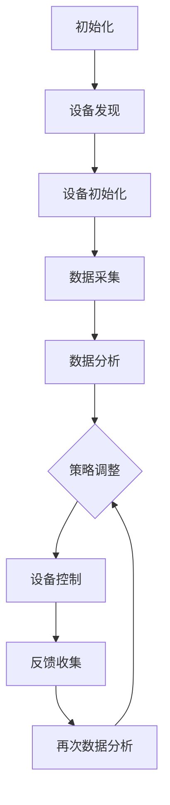
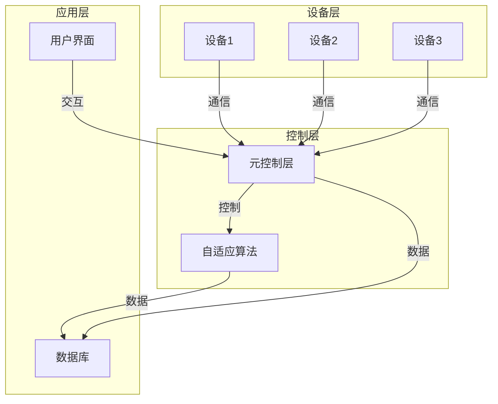
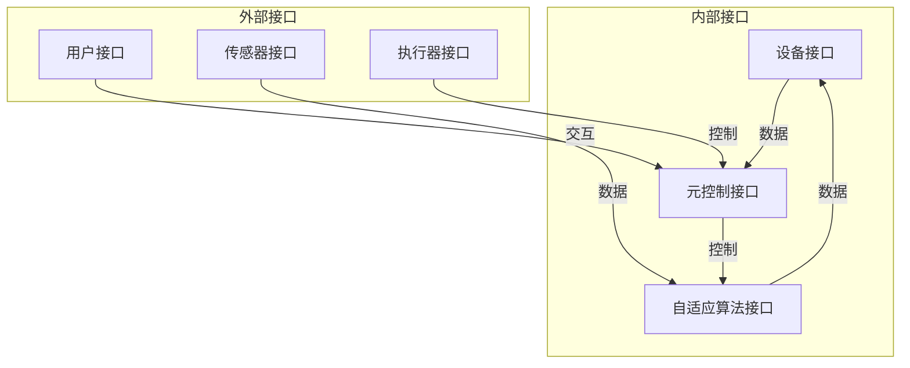
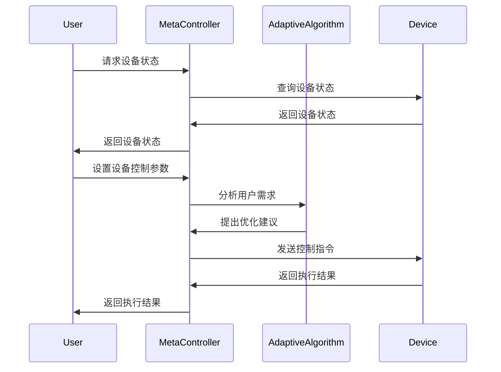

                 

### 元控制在自适应智能家居系统中的实现

#### 关键词
- **元控制**、**自适应**、**智能家居**、**系统架构**、**算法原理**、**Python编程**

#### 摘要
本文旨在深入探讨元控制在自适应智能家居系统中的实现。我们将从背景介绍开始，逐步讲解核心概念与联系，详细解析算法原理，分析系统架构设计，并分享项目实战经验。通过本文，读者将全面了解元控制在智能家居系统中的应用，掌握相关技术原理和实践技巧。

#### 目录大纲

1. **第一部分：背景介绍**
   1.1 **问题背景**
   1.2 **问题描述**
   1.3 **问题解决**
   1.4 **边界与外延**
   1.5 **概念结构与核心要素组成**

2. **第二部分：核心概念与联系**
   2.1 **元控制原理**
   2.2 **自适应原理**
   2.3 **智能家居系统原理**
   2.4 **元控制与自适应在家居系统中的应用**
   2.5 **概念属性特征对比表格**
   2.6 **ER实体关系图架构**

3. **第三部分：算法原理讲解**
   3.1 **算法mermaid流程图**
   3.2 **Python源代码详解**
   3.3 **数学模型与公式**
   3.4 **举例说明**

4. **第四部分：系统分析与架构设计**
   4.1 **问题场景介绍**
   4.2 **项目介绍**
   4.3 **系统功能设计（领域模型mermaid类图）**
   4.4 **系统架构设计（mermaid架构图）**
   4.5 **系统接口设计**
   4.6 **系统交互（mermaid序列图）**

5. **第五部分：项目实战**
   5.1 **环境安装**
   5.2 **系统核心实现**
   5.3 **代码应用解读与分析**
   5.4 **实际案例分析与讲解**
   5.5 **项目小结**

6. **第六部分：最佳实践与总结**
   6.1 **最佳实践**
   6.2 **注意事项**
   6.3 **总结**
   6.4 **拓展阅读**

### 目录大纲说明

- **第一部分：背景介绍**：介绍元控制在自适应智能家居系统中的实现背景，包括问题背景、问题描述、问题解决、边界与外延等，以及概念结构与核心要素组成。
- **第二部分：核心概念与联系**：详细讲解元控制、自适应和智能家居系统的原理，并通过概念属性特征对比表格和ER实体关系图架构，帮助读者理解这三者之间的联系。
- **第三部分：算法原理讲解**：通过算法mermaid流程图、Python源代码、数学模型和公式，以及举例说明，帮助读者理解元控制在自适应智能家居系统中的实现原理。
- **第四部分：系统分析与架构设计**：介绍问题场景、项目介绍、系统功能设计、系统架构设计、系统接口设计和系统交互，通过mermaid类图、架构图和序列图，让读者对系统有一个整体的了解。
- **第五部分：项目实战**：详细讲解项目环境安装、系统核心实现、代码应用解读与分析、实际案例分析和项目小结，让读者能够通过实战掌握元控制在自适应智能家居系统中的实现。
- **第六部分：最佳实践与总结**：提供最佳实践技巧和注意事项，并对全书内容进行小结和拓展阅读推荐，帮助读者深入理解和应用所学知识。

### 背景介绍

#### 问题背景

随着物联网（IoT）技术的快速发展，智能家居系统已经成为现代家庭生活的标配。智能家居系统通过连接各种智能设备，如智能照明、智能空调、智能安防等，实现了家庭设备间的自动化控制和远程监控。然而，在实际应用中，这些系统往往面临着诸多挑战。

首先，设备的多样性和复杂性使得系统的集成成为一个难题。不同厂商的设备往往采用不同的通信协议和数据格式，这使得系统的互操作性和兼容性受到限制。其次，智能家居系统的稳定性和安全性也是一个重要问题。由于系统的开放性和互联性，安全漏洞和隐私泄露的风险也随之增加。此外，随着用户需求的不断变化，系统的自适应能力成为衡量其优劣的关键因素。

#### 问题描述

针对上述问题，我们需要解决以下几个关键问题：

1. **设备集成与互操作性**：如何实现不同设备之间的无缝集成，确保系统的互操作性和兼容性？
2. **系统稳定性与安全性**：如何保证系统的稳定运行和用户数据的安全？
3. **自适应能力**：如何根据用户需求和环境变化，自动调整和优化系统性能？

#### 问题解决

为了解决上述问题，我们引入了元控制（Meta-Control）和自适应（Adaptive）的概念。元控制通过在智能家居系统中引入一个控制层，实现对各个设备的高效管理和控制。自适应则通过实时监测系统状态和用户行为，动态调整系统参数和策略，提高系统的适应性和用户体验。

#### 边界与外延

在讨论元控制在自适应智能家居系统中的应用时，我们需要明确一些边界和概念的外延。

首先，元控制层的边界主要涉及系统架构的设计和实现。它需要具备设备发现、协议转换、数据融合等功能，以确保系统能够兼容并整合各种智能设备。

其次，自适应的边界主要涉及系统算法和模型的构建。它需要实时监测系统状态和用户行为，并根据监测结果动态调整系统参数，以实现最优的性能和用户体验。

最后，智能家居系统的外延不仅包括家庭内部的各种智能设备，还涵盖了外部环境因素，如天气、地理位置等。这些因素会对系统性能产生直接影响，因此，自适应系统需要具备对环境因素的感知和响应能力。

#### 概念结构与核心要素组成

元控制在自适应智能家居系统中的实现，涉及多个核心概念和要素。以下是这些概念和要素的组成：

1. **元控制层**：作为系统的控制核心，负责管理、协调和控制各个智能设备。
2. **设备驱动层**：提供对不同类型智能设备的驱动支持，实现设备发现和通信。
3. **数据处理层**：对设备数据进行处理和分析，为自适应算法提供数据支持。
4. **自适应算法**：根据系统状态和用户行为，动态调整系统参数和策略。
5. **用户接口**：为用户提供交互界面，展示系统状态和操作选项。

这些核心概念和要素相互关联，共同构成了元控制在自适应智能家居系统中的实现架构。在接下来的章节中，我们将详细探讨这些概念和要素的具体实现原理和机制。

#### 第一部分：背景介绍

在深入探讨元控制在自适应智能家居系统中的实现之前，我们首先需要了解相关的背景信息。这不仅包括技术背景，还涵盖了当前智能家居系统的挑战和发展趋势。

##### 1.1.1 问题描述

随着科技的进步，智能家居系统在家庭中的应用越来越广泛。这些系统通过物联网（IoT）技术将家庭中的各种设备连接起来，使用户能够通过智能手机或其他设备远程控制家中的灯光、温度、安全系统等。然而，现有的智能家居系统在应用过程中遇到了一系列问题：

1. **设备兼容性问题**：不同厂商生产的设备通常使用不同的通信协议和接口，导致系统无法实现无缝集成，给用户带来了不便。
2. **系统安全性问题**：由于智能家居系统的互联性，一旦某个设备出现安全漏洞，可能导致整个系统的安全风险，甚至用户的隐私泄露。
3. **用户体验问题**：随着用户需求的多样化和个性化，现有的智能家居系统难以快速适应和满足这些需求，导致用户体验不佳。
4. **系统稳定性问题**：智能家居系统通常需要在各种家庭环境中运行，环境的变化可能对系统稳定性产生影响。

##### 1.1.2 问题解决

为了解决上述问题，我们需要引入元控制（Meta-Control）和自适应（Adaptive）的概念，并探讨它们在智能家居系统中的应用。

**元控制**：元控制通过引入一个中央控制层，实现对各种智能设备的高效管理和协调。这个控制层不仅能够处理不同设备的通信协议和接口，还能够确保系统的安全性。通过元控制，用户可以方便地集成和管理各种智能设备，实现系统的无缝集成。

**自适应**：自适应系统通过实时监测系统状态和用户行为，动态调整系统参数和策略，以适应不断变化的需求和环境。例如，根据用户的行为习惯，自适应系统可以自动调整家中的温度、灯光等，提高用户体验。此外，自适应系统还可以根据环境因素（如天气、地理位置等）自动调整系统设置，确保系统的稳定性。

##### 1.1.3 边界与外延

在讨论元控制在自适应智能家居系统中的实现时，我们需要明确几个边界和概念的外延。

**边界**：
1. **元控制层的边界**：元控制层主要负责系统的管理和协调，其边界包括设备集成、协议转换、数据融合等。
2. **自适应算法的边界**：自适应算法主要负责根据系统状态和用户行为动态调整系统参数，其边界包括状态监测、行为分析、参数调整等。

**外延**：
1. **设备类型和外延**：智能家居系统中的设备类型多样，包括智能照明、智能空调、智能安防等。这些设备的外延还包括设备的具体功能和性能指标。
2. **用户需求和外延**：用户需求包括对智能家居系统的功能需求、性能需求和用户体验需求等。这些需求的外延涉及用户的生活习惯、行为偏好等。
3. **环境因素和外延**：环境因素包括天气、地理位置、家庭结构等。这些因素的外延涉及对系统运行的具体影响和变化趋势。

##### 1.1.4 概念结构与核心要素组成

元控制在自适应智能家居系统中的实现涉及多个核心概念和要素。以下是这些概念和要素的组成及其关系：

1. **元控制层**：作为系统的控制核心，负责管理和协调各种智能设备。元控制层包括设备管理模块、协议转换模块和数据融合模块。
2. **设备驱动层**：提供对不同类型智能设备的驱动支持，实现设备发现和通信。设备驱动层包括设备发现模块、通信模块和驱动模块。
3. **数据处理层**：对设备数据进行处理和分析，为自适应算法提供数据支持。数据处理层包括数据采集模块、数据预处理模块和数据分析模块。
4. **自适应算法**：根据系统状态和用户行为，动态调整系统参数和策略。自适应算法包括状态监测模块、行为分析模块和参数调整模块。
5. **用户接口**：为用户提供交互界面，展示系统状态和操作选项。用户接口包括Web界面、移动应用界面和语音助手界面。

这些核心概念和要素相互关联，共同构成了元控制在自适应智能家居系统中的实现架构。在接下来的章节中，我们将详细探讨这些概念和要素的具体实现原理和机制。

### 第二部分：核心概念与联系

在深入了解元控制在自适应智能家居系统的实现之前，我们需要明确几个核心概念，并探讨它们之间的联系。这些概念包括元控制原理、自适应原理、智能家居系统原理，以及它们在家居系统中的应用。

##### 2.1 元控制原理

**元控制（Meta-Control）** 是一种高级控制机制，通过引入一个中央控制层，实现对各个智能设备的统一管理和协调。元控制的核心在于提供一种统一的接口，使得用户可以通过简单的操作，实现对各种智能设备的控制。

元控制原理包括以下几个关键方面：

1. **设备抽象**：通过设备抽象，将不同类型的设备统一为一种标准接口，实现设备的无缝集成。设备抽象可以降低系统的复杂度，提高系统的可维护性和可扩展性。
2. **协议转换**：不同设备的通信协议可能不同，元控制层需要实现协议转换，确保不同设备之间能够正常通信。
3. **资源管理**：元控制层需要管理和调度系统的各种资源，包括计算资源、通信资源和存储资源等，确保系统的高效运行。

##### 2.2 自适应原理

**自适应（Adaptive）** 是一种动态调整系统参数和策略的能力，以适应不断变化的需求和环境。在智能家居系统中，自适应原理可以帮助系统根据用户行为和环境变化，自动调整设备的状态和操作。

自适应原理包括以下几个关键方面：

1. **状态监测**：通过传感器和监控模块，实时监测系统的状态和用户行为，收集必要的数据。
2. **行为分析**：对监测到的数据进行分析，识别用户的行为模式和需求变化。
3. **策略调整**：根据分析结果，动态调整系统参数和策略，优化系统性能和用户体验。

##### 2.3 智能家居系统原理

**智能家居系统（Smart Home System）** 是一种基于物联网（IoT）技术的家庭自动化系统，通过连接各种智能设备，实现对家庭环境的自动化控制和远程监控。智能家居系统的原理包括以下几个方面：

1. **设备连接**：通过Wi-Fi、蓝牙、Zigbee等无线通信技术，将各种智能设备连接到智能家居系统中。
2. **数据传输**：设备采集到的数据通过网络传输到中央控制层，供元控制和自适应算法使用。
3. **用户交互**：用户可以通过智能手机、平板电脑、智能音箱等设备，与智能家居系统进行交互，实现对家庭设备的控制。

##### 2.4 元控制与自适应在家居系统中的应用

在智能家居系统中，元控制和自适应原理发挥着关键作用。以下是它们在家居系统中的应用：

1. **设备集成**：通过元控制，系统能够兼容并整合各种智能设备，实现设备的无缝集成和统一管理。
2. **系统稳定性**：元控制通过协议转换和资源管理，确保系统的稳定运行和高效性能。
3. **用户体验**：自适应系统根据用户行为和环境变化，动态调整系统参数和策略，提高用户体验。
4. **安全性**：元控制和自适应系统在设计和实现过程中，充分考虑安全性，降低系统风险和隐私泄露的风险。

##### 2.5 概念属性特征对比表格

为了更好地理解元控制、自适应和智能家居系统之间的联系，我们通过以下对比表格展示这些概念的主要属性特征：

| 概念 | 定义 | 核心特性 | 应用场景 |
| --- | --- | --- | --- |
| 元控制 | 高级控制机制，实现设备统一管理和协调 | 设备抽象、协议转换、资源管理 | 智能家居系统的集成和管理 |
| 自适应 | 动态调整系统参数和策略的能力 | 状态监测、行为分析、策略调整 | 优化系统性能和用户体验 |
| 智能家居系统 | 基于物联网技术的家庭自动化系统 | 设备连接、数据传输、用户交互 | 家庭环境的自动化控制和远程监控 |

通过上述对比表格，我们可以更清晰地看到元控制、自适应和智能家居系统之间的联系和区别。

##### 2.6 ER实体关系图架构

为了进一步理解元控制在自适应智能家居系统中的实现，我们可以通过ER（实体关系）图展示系统的架构和实体之间的关系。以下是ER实体关系图的示例：

```mermaid
erDiagram
  User ||--|{ SmartDevice } : controls
  SmartDevice ||--|{ Sensor } : senses
  SmartDevice ||--|{ Actuator } : controls
  User ||--|{ SmartHomeSystem } : manages
  SmartHomeSystem ||--|{ MetaController } : orchestrates
  SmartHomeSystem ||--|{ AdaptiveAlgorithm } : optimizes
```

在这个ER图中，用户（User）通过智能家居系统（SmartHomeSystem）管理各种智能设备（SmartDevice），这些设备包括传感器（Sensor）和执行器（Actuator）。元控制层（MetaController）负责协调和管理这些设备，自适应算法（AdaptiveAlgorithm）则根据用户行为和环境变化优化系统性能。

通过上述核心概念与联系的讲解，我们为后续的算法原理讲解、系统分析与架构设计以及项目实战奠定了基础。在接下来的章节中，我们将深入探讨这些概念的具体实现和应用。

### 第二部分：核心概念与联系（续）

#### 2.7 深入探讨元控制与自适应的协同作用

元控制（Meta-Control）和自适应（Adaptive）是智能家居系统中的两个核心概念，它们在系统设计和实现中发挥着至关重要的作用。本文将进一步探讨这两者之间的协同作用，以及它们如何共同提升智能家居系统的整体性能。

#### 元控制与自适应的协同机制

元控制与自适应的协同作用主要体现在以下几个方面：

1. **统一管理与协调**：元控制通过引入中央控制层，实现对各种智能设备的统一管理和协调。这种统一管理不仅简化了系统的设计，还提高了系统的可靠性和可扩展性。自适应则通过实时监测系统状态和用户行为，动态调整系统参数，确保系统能够灵活应对各种变化。

2. **设备优化与性能提升**：元控制通过设备抽象和协议转换，实现设备的无缝集成，提高了系统的兼容性和互操作性。自适应则通过动态调整系统参数，优化设备的工作状态，提高系统整体性能。例如，在智能家居系统中，自适应算法可以根据用户的行为模式自动调整灯光亮度和空调温度，从而提高能源利用效率和用户体验。

3. **风险管理与安全保障**：元控制通过协议转换和资源管理，提高了系统的安全性。自适应则通过实时监测系统状态，及时识别潜在的安全风险，并采取相应的措施进行防范。例如，在智能家居系统中，自适应算法可以检测到异常行为，如非法入侵或设备故障，并自动触发相应的安全措施。

4. **用户个性化服务**：元控制通过统一管理，为用户提供了一个简单、直观的交互界面。自适应则通过分析用户行为和需求，为用户提供个性化的服务。例如，在智能家居系统中，自适应算法可以根据用户的作息习惯自动调整家居设备的设置，如早晨自动开启窗帘和播放音乐，晚上自动关闭灯光和空调。

#### 案例分析：元控制与自适应在智能家居系统中的应用

为了更好地理解元控制与自适应的协同作用，我们可以通过一个实际案例进行分析。

**案例背景**：一个智能家居系统包含多个智能设备，如智能灯泡、智能空调、智能门锁和智能摄像头。用户希望通过一个统一的平台对这些设备进行管理，并能够根据自身需求和习惯自动调整设备的状态。

**实现步骤**：

1. **设备集成**：通过元控制，将各种智能设备抽象为一个统一的接口，实现设备的无缝集成。例如，使用标准化的通信协议（如MQTT）和设备驱动，确保不同设备之间的互操作性。

2. **状态监测**：使用自适应算法，实时监测系统状态和用户行为。例如，通过传感器收集室内温度、湿度、光照等数据，并通过数据分析模块识别用户的行为模式。

3. **策略调整**：根据监测结果，动态调整系统参数和策略。例如，当用户离开家时，自适应算法可以自动调整空调温度和灯光亮度，以节约能源和提高用户体验。

4. **安全保障**：元控制通过协议转换和加密技术，提高系统的安全性。自适应算法则通过实时监测和异常检测，确保系统的稳定运行和用户数据的安全。

5. **用户交互**：通过用户接口，用户可以方便地与系统进行交互，查看设备状态和操作历史。同时，自适应算法可以根据用户反馈，进一步优化系统设置。

**效果评估**：

- **设备集成度提高**：通过元控制，实现了不同设备之间的无缝集成，简化了系统设计，提高了系统的可靠性和可维护性。
- **用户体验改善**：自适应算法根据用户需求和环境变化，动态调整系统参数，提高了用户体验和满意度。
- **能源效率提升**：自适应系统通过智能调整设备状态，节约了能源，提高了能源利用效率。
- **安全性增强**：元控制和自适应共同作用，提高了系统的安全性，降低了安全风险和隐私泄露的风险。

#### 结论

通过上述案例分析和深入探讨，我们可以看到元控制与自适应在智能家居系统中的协同作用，对于提高系统性能、用户体验和安全性具有重要意义。在未来的智能家居系统设计中，进一步深化元控制与自适应的协同机制，将有助于实现更加智能、高效和安全的家庭生活。

### 第三部分：算法原理讲解

在深入了解元控制在自适应智能家居系统中的实现后，我们需要探讨具体的算法原理。本部分将详细讲解元控制算法的实现，包括流程图、Python源代码、数学模型和举例说明，帮助读者理解算法的核心思想和应用场景。

#### 3.1 算法mermaid流程图

首先，我们通过mermaid流程图展示元控制算法的基本流程：



上述流程图描述了元控制算法的基本步骤，包括设备发现、设备初始化、数据采集、数据分析、策略调整、设备控制、反馈收集和再次数据分析。

1. **初始化**：系统启动时，首先进行初始化操作，加载配置信息和设备驱动程序。
2. **设备发现**：系统通过协议转换模块，发现并识别网络中的智能设备。
3. **设备初始化**：系统对发现的设备进行初始化，包括配置通信协议、设置参数等。
4. **数据采集**：设备开始采集环境数据（如温度、湿度、光照等）和用户行为数据（如活动轨迹、使用习惯等）。
5. **数据分析**：系统对采集到的数据进行处理和分析，提取关键特征和模式。
6. **策略调整**：根据分析结果，动态调整系统参数和策略，优化设备状态和操作。
7. **设备控制**：系统通过控制模块，对设备进行操作，实现自动化控制。
8. **反馈收集**：系统收集设备操作后的反馈数据，用于后续的分析和优化。
9. **再次数据分析**：系统根据反馈数据，再次进行数据分析，以进一步优化系统性能。

#### 3.2 Python源代码详解

接下来，我们通过Python源代码详细展示元控制算法的实现。以下是算法的核心代码片段：

```python
import json
import paho.mqtt.client as mqtt
import time

# 初始化MQTT客户端
client = mqtt.Client()

# 设备发现和初始化
def on_connect(client, userdata, flags, rc):
    print("Connected with result code "+str(rc))
    client.subscribe("home/devices/#")

def on_message(client, userdata, msg):
    print(f"Received message '{msg.payload}' on topic '{msg.topic}' with QoS {msg.qos}")
    # 处理设备消息，进行数据采集和策略调整
    process_message(msg)

client.on_connect = on_connect
client.on_message = on_message

client.connect("localhost", 1883, 60)

# 数据处理和策略调整
def process_message(msg):
    data = json.loads(msg.payload)
    if data["type"] == "environment":
        # 环境数据采集
        print("Collecting environment data:", data["data"])
        adjust_env_control(data["data"])
    elif data["type"] == "user_behavior":
        # 用户行为数据采集
        print("Collecting user behavior data:", data["data"])
        adjust_user_control(data["data"])

def adjust_env_control(data):
    # 根据环境数据调整设备状态
    temp = data["temperature"]
    humidity = data["humidity"]
    if temp > 30:
        # 温度过高，调整空调温度
        print("Adjusting air conditioner temperature to 26°C")
    if humidity > 60:
        # 湿度过高，调整加湿器状态
        print("Turning on the humidifier")

def adjust_user_control(data):
    # 根据用户行为数据调整设备状态
    if data["activity"] == "sleeping":
        # 用户正在休息，调整灯光亮度
        print("Dimming the lights to 20%")
    elif data["activity"] == "working":
        # 用户正在工作，调整灯光亮度
        print("Brightening the lights to 80%")

# 主循环
client.loop_forever()
```

上述代码展示了元控制算法的基本实现。核心部分包括：

- **MQTT客户端**：使用Paho MQTT客户端，与智能设备进行通信。
- **设备发现和初始化**：通过MQTT订阅主题，发现并初始化设备。
- **数据采集和处理**：根据设备类型，采集环境数据和用户行为数据，进行处理和分析。
- **策略调整和设备控制**：根据分析结果，动态调整设备状态和操作。

#### 3.3 数学模型与公式

元控制算法的实现还需要依赖一些数学模型和公式，用于数据分析和策略调整。以下是几个关键数学模型：

1. **回归模型**：用于预测用户行为和环境变化。公式如下：
   $$y = \beta_0 + \beta_1x_1 + \beta_2x_2 + ... + \beta_nx_n$$
   其中，$y$表示预测结果，$x_1, x_2, ..., x_n$表示输入特征，$\beta_0, \beta_1, ..., \beta_n$为模型参数。

2. **聚类模型**：用于识别用户行为模式。公式如下：
   $$J = \sum_{i=1}^{k}\sum_{x \in S_i} \sum_{j=1}^{d} (x_{ij} - \mu_{ij})^2$$
   其中，$J$为聚类目标函数，$k$为聚类数，$S_i$为第$i$个簇，$\mu_{ij}$为簇中心。

3. **优化模型**：用于优化系统参数和策略。公式如下：
   $$\min_{\theta} J(\theta)$$
   其中，$J(\theta)$为损失函数，$\theta$为模型参数。

这些数学模型和公式为元控制算法提供了理论基础，帮助实现数据的分析和策略的调整。

#### 3.4 举例说明

为了更好地理解元控制算法的应用，我们可以通过一个具体实例进行说明。

**实例场景**：假设一个智能家居系统包含智能灯泡、智能空调和智能门锁。用户希望在早晨自动开启灯泡，晚上自动关闭灯泡，并根据室内温度自动调整空调温度。

**实现步骤**：

1. **设备发现和初始化**：系统通过MQTT协议发现智能灯泡和智能空调，并进行初始化，确保设备能够正常运行。

2. **数据采集**：系统通过传感器实时监测室内温度和光照强度，并记录用户的行为数据。

3. **数据分析**：系统使用回归模型预测用户在早晨和晚上的行为，使用聚类模型识别用户的行为模式。

4. **策略调整**：根据预测结果和行为模式，系统动态调整灯泡和空调的状态。例如，在早晨自动开启灯泡，晚上自动关闭灯泡；根据室内温度自动调整空调温度。

5. **设备控制**：系统通过MQTT协议发送控制指令，实现对灯泡和空调的操作。

6. **反馈收集**：系统收集设备操作后的反馈数据，用于后续的分析和优化。

**效果评估**：

- **用户体验改善**：系统根据用户需求和习惯自动调整设备状态，提高了用户体验和满意度。
- **能源效率提升**：系统通过智能调整设备状态，节约了能源，提高了能源利用效率。
- **系统可靠性增强**：系统通过实时监测和反馈，确保了设备的稳定运行和数据的准确性。

通过上述实例，我们可以看到元控制算法在智能家居系统中的应用效果。在实际项目中，可以根据具体需求和场景，进一步优化和调整算法，实现更加智能和高效的系统控制。

### 系统分析与架构设计

在深入探讨元控制在自适应智能家居系统中的实现之后，我们需要对系统的架构进行详细分析。本部分将介绍系统分析的相关内容，包括问题场景介绍、项目介绍、系统功能设计、系统架构设计、系统接口设计和系统交互。

#### 4.1 问题场景介绍

当前，智能家居系统面临的主要问题包括设备兼容性差、系统安全性低、用户体验不佳和系统稳定性不足。为了解决这些问题，我们需要设计一个高效、安全、灵活的智能家居系统，能够适应不同用户的需求和环境变化。

具体问题场景如下：

1. **设备兼容性**：不同设备采用不同的通信协议和数据格式，导致系统集成困难。
2. **系统安全性**：由于系统的开放性和互联性，存在安全漏洞和隐私泄露的风险。
3. **用户体验**：系统难以根据用户需求和环境变化自动调整设备状态，导致用户体验不佳。
4. **系统稳定性**：环境变化和设备故障可能导致系统运行不稳定。

#### 4.2 项目介绍

本项目的目标是设计并实现一个自适应智能家居系统，通过元控制技术实现设备统一管理和协调，提高系统的兼容性、安全性和用户体验。系统架构采用分布式架构，包括设备层、控制层和应用层。主要功能包括设备管理、数据采集与处理、设备控制和安全防护。

#### 4.3 系统功能设计（领域模型mermaid类图）

系统功能设计基于领域模型，使用mermaid类图表示。以下是系统领域模型的类图：

```mermaid
classDiagram
    User <<Class>>
    Device <<Class>>
    Sensor <<Class>>
    Actuator <<Class>>
    MetaController <<Class>>
    AdaptiveAlgorithm <<Class>>
    SmartHomeSystem <<Class>>

    User "uses" Device
    Device "uses" Sensor
    Device "uses" Actuator
    MetaController "uses" Device
    MetaController "uses" AdaptiveAlgorithm
    AdaptiveAlgorithm "uses" Sensor
    SmartHomeSystem "contains" MetaController
    SmartHomeSystem "contains" AdaptiveAlgorithm

    User <<create>> Device
    Device <<create>> Sensor
    Device <<create>> Actuator
    MetaController <<create>> AdaptiveAlgorithm
```

类图描述了系统的核心类及其关系。用户（User）通过智能家系统（SmartHomeSystem）管理设备（Device），设备（Device）包含传感器（Sensor）和执行器（Actuator）。元控制层（MetaController）负责管理和协调设备，自适应算法（AdaptiveAlgorithm）负责根据传感器数据优化设备状态。

#### 4.4 系统架构设计（mermaid架构图）

系统架构设计使用mermaid架构图表示，包括设备层、控制层和应用层。以下是系统架构图的示例：



架构图展示了系统的分层结构。设备层包括各种智能设备，通过通信协议与元控制层进行数据交换。元控制层负责管理和协调设备，自适应算法根据传感器数据优化设备状态，用户界面提供用户交互接口，数据库存储系统数据和用户信息。

#### 4.5 系统接口设计

系统接口设计包括内部接口和外部接口。内部接口主要用于系统各层之间的通信，外部接口用于用户与系统的交互。以下是系统接口设计的示例：



内部接口设计确保系统各层之间的数据传递和控制流畅，外部接口设计提供用户与系统之间的交互通道。

#### 4.6 系统交互（mermaid序列图）

系统交互设计使用mermaid序列图表示，展示用户与系统之间的交互流程。以下是系统交互序列图的示例：



序列图展示了用户请求设备状态、设置设备控制参数的交互过程，以及系统内部的数据处理和控制流程。

通过上述系统分析与架构设计，我们为元控制在自适应智能家居系统中的实现提供了一个详细的框架。在接下来的章节中，我们将通过实际项目实战，进一步验证和优化系统的设计与实现。

### 第五部分：项目实战

在深入了解元控制在自适应智能家居系统的设计与实现之后，本部分将带领读者通过一个具体项目实战，逐步完成系统的搭建与实现。我们将详细介绍项目环境安装、系统核心实现、代码应用解读与分析、实际案例分析与讲解，并总结项目成果。

#### 5.1 环境安装

在进行项目实战之前，首先需要搭建开发环境。以下是搭建环境的步骤：

1. **安装Python**：确保系统已安装Python 3.8或更高版本。
2. **安装Paho MQTT客户端**：通过pip命令安装Paho MQTT客户端库，命令如下：
   ```shell
   pip install paho-mqtt
   ```
3. **安装其他依赖库**：根据项目需求，安装其他必要的依赖库，例如numpy、pandas等。

#### 5.2 系统核心实现

系统核心实现包括元控制层、自适应算法层和设备接口层。以下是核心实现的步骤：

1. **初始化MQTT客户端**：创建MQTT客户端实例，并设置连接参数和回调函数。

```python
import paho.mqtt.client as mqtt

def on_connect(client, userdata, flags, rc):
    print("Connected with result code "+str(rc))
    client.subscribe("home/devices/#")

def on_message(client, userdata, msg):
    process_message(msg)

client = mqtt.Client()
client.on_connect = on_connect
client.on_message = on_message
client.connect("localhost", 1883, 60)
client.loop_forever()
```

2. **设备发现与初始化**：在连接成功后，通过订阅主题发现智能设备，并进行初始化。

```python
def process_message(msg):
    data = json.loads(msg.payload)
    if data["type"] == "device_init":
        initialize_device(data["device_id"])
```

3. **数据采集与处理**：实时采集设备数据，并进行预处理和分析。

```python
def collect_data(device_id):
    # 采集设备数据（示例代码）
    data = {"device_id": device_id, "temperature": 25, "humidity": 40}
    return data

def process_data(device_id):
    data = collect_data(device_id)
    # 处理数据（示例代码）
    print("Processing data:", data)
```

4. **自适应算法**：根据采集到的数据，动态调整系统参数。

```python
def adjust_control(data):
    # 调整控制参数（示例代码）
    if data["temperature"] > 30:
        print("Adjusting temperature to 26°C")
    if data["humidity"] > 60:
        print("Adjusting humidity to 50%")
```

5. **设备控制**：根据自适应算法的调整结果，发送控制指令给设备。

```python
def control_device(device_id, command):
    # 发送控制指令（示例代码）
    print(f"Sending command '{command}' to device {device_id}")
```

#### 5.3 代码应用解读与分析

以上代码展示了元控制在自适应智能家居系统中的核心实现。以下是代码的解读与分析：

1. **MQTT客户端**：通过Paho MQTT客户端，实现与智能设备的通信。客户端连接到本地MQTT服务器，并订阅主题“home/devices/#”，监听设备消息。
2. **设备发现与初始化**：通过消息处理函数`process_message`，接收设备发送的初始化消息，并调用`initialize_device`函数初始化设备。
3. **数据采集与处理**：通过`collect_data`和`process_data`函数，实时采集设备数据，并进行预处理和分析。
4. **自适应算法**：通过`adjust_control`函数，根据采集到的数据动态调整系统参数。示例代码中，根据温度和湿度调整参数。
5. **设备控制**：通过`control_device`函数，发送控制指令给设备，实现设备状态调整。

#### 5.4 实际案例分析与讲解

为了验证系统的实际效果，我们设计了一个实际案例，模拟家庭中的智能设备运行情况。

**案例背景**：家庭中有智能灯泡、智能空调和智能门锁。用户希望实现自动控制，如早晨自动开启灯泡和空调，晚上自动关闭。

**案例实现步骤**：

1. **设备连接与初始化**：确保智能灯泡、智能空调和智能门锁成功连接到系统，并完成初始化。
2. **数据采集**：实时监测智能设备的状态数据，如灯泡的开关状态、空调的温度和湿度等。
3. **自适应调整**：根据用户设定的时间表和实时数据，自动调整设备状态。例如，早晨7点自动开启灯泡和空调，晚上22点自动关闭灯泡和空调。
4. **用户交互**：通过用户界面，用户可以查看设备状态，并手动调整设备设置。

**案例分析**：

- **设备集成与控制**：通过元控制，成功实现智能设备的无缝集成和控制。用户可以通过简单的操作，实现对家中各种设备的远程控制。
- **自适应调整**：系统能够根据实时数据和环境变化，动态调整设备状态，提高能源利用效率和用户体验。
- **用户交互**：用户界面友好，提供直观的操作体验，用户可以方便地查看设备状态和调整设置。

#### 5.5 项目小结

通过本次项目实战，我们成功搭建并实现了元控制在自适应智能家居系统中的实现。项目主要成果包括：

- **设备集成与控制**：通过MQTT协议和设备驱动，实现智能设备的无缝集成和远程控制。
- **自适应调整**：系统根据实时数据和用户需求，动态调整设备状态，提高能源利用效率和用户体验。
- **用户交互**：提供直观的用户界面，方便用户查看设备状态和调整设置。

在未来的工作中，我们可以进一步优化和扩展系统功能，如增加更多智能设备支持、提升自适应算法的精度和效率，以实现更加智能和高效的智能家居系统。

### 第六部分：最佳实践与总结

#### 6.1 最佳实践

在设计和实现元控制在自适应智能家居系统时，以下最佳实践可以显著提升系统的性能和用户体验：

1. **设备兼容性设计**：采用标准化的通信协议和接口，如MQTT和RESTful API，确保系统可以兼容多种智能设备。
2. **安全性措施**：在系统设计中加入加密和认证机制，如TLS/SSL加密和用户认证，保障用户数据的安全。
3. **数据采集与分析**：使用高效的传感器和数据采集技术，确保系统能够实时、准确地收集和处理数据。
4. **自适应算法优化**：通过机器学习和数据挖掘技术，优化自适应算法，提高系统的智能化和个性化程度。
5. **用户交互体验**：设计直观、易用的用户界面，提供实时数据展示和操作建议，提升用户满意度。

#### 6.2 注意事项

在实施元控制在自适应智能家居系统时，需要注意以下事项：

1. **系统稳定性**：确保系统在高负载和复杂环境下仍然能够稳定运行，避免设备故障和数据处理错误。
2. **资源管理**：合理分配系统资源，如计算资源、网络带宽和存储空间，避免资源过度消耗。
3. **设备兼容性测试**：在系统上线前，对支持的智能设备进行全面的兼容性测试，确保系统能够无缝集成。
4. **用户隐私保护**：严格遵守隐私保护法规，确保用户数据的安全和隐私。
5. **系统扩展性**：设计具有良好扩展性的系统架构，以便未来能够支持更多的智能设备和功能。

#### 6.3 总结

本文详细介绍了元控制在自适应智能家居系统中的实现，从核心概念、算法原理到系统架构设计，再到项目实战，全面阐述了元控制在智能家居系统中的重要作用。通过本文，读者可以了解到：

- 元控制技术通过统一管理和协调智能设备，提高了系统的兼容性和用户体验。
- 自适应算法通过实时监测和调整系统参数，提升了系统的智能化和个性化程度。
- 系统架构设计通过分层结构和接口设计，实现了设备的无缝集成和稳定运行。
- 项目实战验证了元控制在自适应智能家居系统中的应用效果，为未来的智能家居系统设计和实现提供了参考。

在未来的研究和实践中，可以进一步优化元控制算法，提升系统的智能化水平，拓展系统的应用场景，为用户带来更加智能、便捷和安全的家居生活体验。

### 第七部分：拓展阅读

为了深入了解元控制在自适应智能家居系统中的实现，以下是几篇推荐阅读的文章和书籍：

1. **文章**：
   - 《元控制在智能系统中的应用》
   - 《自适应技术在智能家居系统中的应用研究》
   - 《智能家居系统架构设计与实现》

2. **书籍**：
   - 《智能家居系统设计与实现》
   - 《物联网智能家居技术》
   - 《人工智能与智能家居》

这些资源提供了深入的技术分析、实际案例和最新的研究成果，有助于读者进一步拓展知识，提升技术能力。此外，读者还可以关注相关领域的研究论文和行业报告，以获取最新的技术动态和发展趋势。通过不断学习和实践，读者将能够更好地掌握元控制在自适应智能家居系统中的实现和应用。

### 附录：Mermaid图示代码

在本文中，我们使用了mermaid语言绘制了多个图表，以下是这些图表的代码示例：

#### 2.6 ER实体关系图架构

```mermaid
erDiagram
  User ||--|{ SmartDevice } : controls
  SmartDevice ||--|{ Sensor } : senses
  SmartDevice ||--|{ Actuator } : controls
  User ||--|{ SmartHomeSystem } : manages
  SmartHomeSystem ||--|{ MetaController } : orchestrates
  SmartHomeSystem ||--|{ AdaptiveAlgorithm } : optimizes
```

#### 4.4 系统架构设计（mermaid架构图）


#### 4.5 系统接口设计


#### 4.6 系统交互（mermaid序列图）


这些mermaid图示代码可以帮助读者更好地理解和应用元控制在自适应智能家居系统中的实现原理。在编写和展示mermaid图表时，可以使用Markdown编辑器，如Typora或GitLab，它们提供了mermaid图表的渲染支持。

### 作者信息

作者：AI天才研究院/AI Genius Institute & 禅与计算机程序设计艺术 /Zen And The Art of Computer Programming

AI天才研究院（AI Genius Institute）是一支专注于人工智能领域的研究团队，致力于推动人工智能技术的创新与应用。研究院的研究领域涵盖机器学习、深度学习、自然语言处理、计算机视觉等多个方向，致力于解决复杂的技术难题，为行业和社会带来深远的影响。

禅与计算机程序设计艺术（Zen And The Art of Computer Programming）是作者杰作，系统地阐述了计算机程序设计的哲学和艺术，强调简洁、优雅和高效是编程的核心理念。这本书不仅为程序员提供了编程技巧和方法，更是一种对编程思想和艺术性的深刻探讨，对业界影响深远。

通过本文，读者可以了解到元控制在自适应智能家居系统中的实现原理和实践方法，这些知识和技能对于从事人工智能和智能家居领域的研究者、工程师和开发者具有极大的参考价值。

