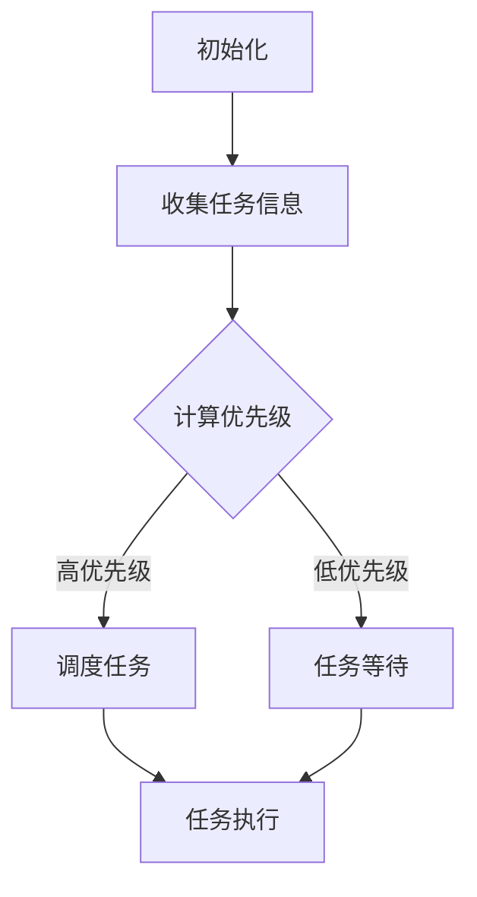
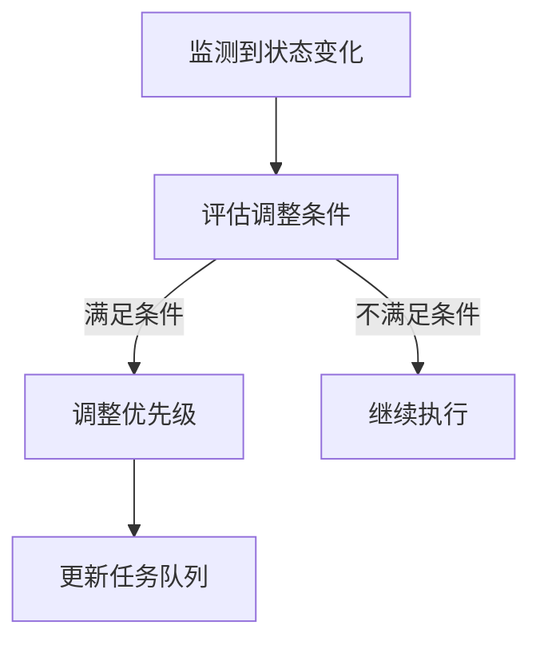
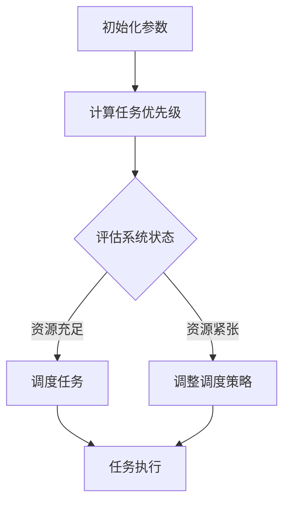
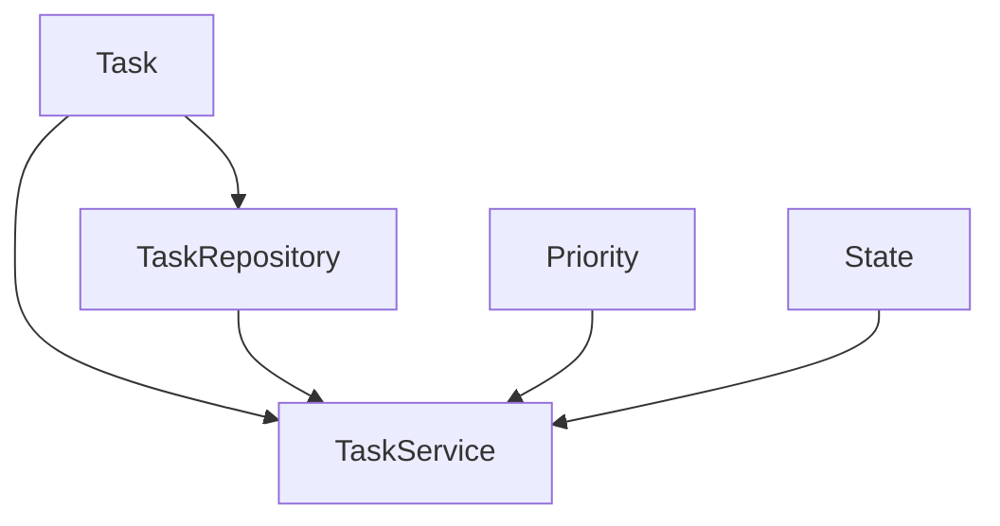
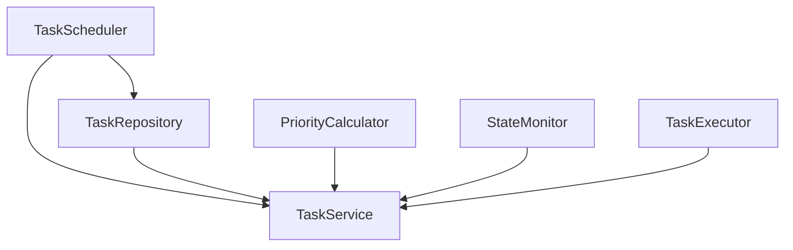
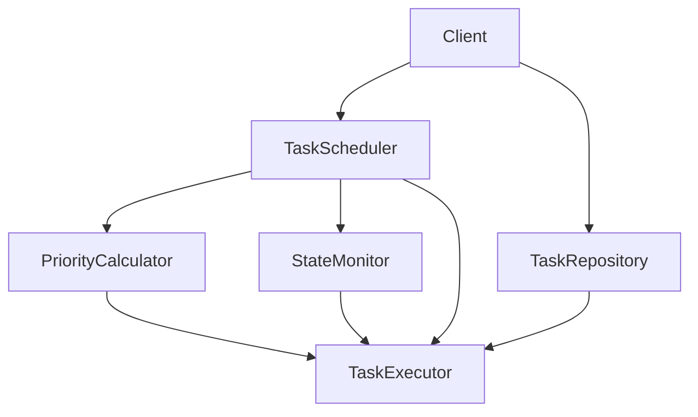

                 


# 元控制框架下的推理任务动态优先级调度

关键词：元控制框架、推理任务、动态优先级调度、调度策略、任务状态监控、数学模型、系统分析与架构设计

摘要：随着人工智能技术的发展，如何高效地处理大量的推理任务，实现动态优先级调度成为一个关键问题。本文介绍了一种基于元控制框架的推理任务动态优先级调度方法，从原理、设计、算法和系统架构等方面进行了详细分析，以期为相关领域的研究和应用提供参考。

## 第一部分：背景介绍与核心概念

### 第1章：问题背景与核心概念

#### 1.1 问题背景

在人工智能和大数据处理领域，推理任务日益增多，如何高效地管理和调度这些任务成为了一个重要课题。传统的静态调度方法难以应对动态变化的任务需求和系统资源，导致任务响应时间延长，系统效率降低。因此，研究一种能够动态调整任务优先级的调度方法具有重要的实际意义。

#### 1.2 核心概念与联系

**概念原理**：元控制框架是一种通过动态调整任务优先级来实现高效任务管理的系统架构。其基本原理包括任务优先级计算、动态调整和任务执行监控。

**属性特征对比**：

| 特征 | 静态调度 | 动态调度 | 元控制框架 |
| --- | --- | --- | --- |
| **优先级设定** | 预先设定 | 实时调整 | 根据任务状态和系统资源动态调整 |
| **灵活性** | 较低 | 较高 | 高 |
| **效率** | 依赖预设参数 | 较高 | 高 |
| **鲁棒性** | 依赖预设参数 | 较高 | 高 |

**与传统方法对比**：元控制框架在灵活性、效率和鲁棒性方面优于传统的静态调度方法。

## 第二部分：元控制框架原理与设计

### 第2章：元控制框架的基本原理

#### 2.1 调度策略

**优先级计算方法**：常用的优先级计算方法包括基于任务复杂度、响应时间和资源消耗等。本文采用以下公式：

$$
\text{优先级}(T) = f(\text{任务复杂度}(T), \text{响应时间}(T), \text{资源消耗}(T))
$$

其中，$\text{任务复杂度}(T)$、$\text{响应时间}(T)$和$\text{资源消耗}(T)$分别为任务在执行过程中需要考虑的主要因素。

**调度算法实现**：



#### 2.2 任务状态监控

**状态监测机制**：任务状态监控主要通过实时监测任务的执行进度和系统资源使用情况来实现。常用的监测工具包括性能监控软件和日志分析工具。

**状态变化处理**：当任务状态发生变化时，如任务完成、失败或等待时间过长，系统需要根据预定的规则进行调整。以下为状态变化处理流程：



#### 2.3 动态调整机制

**调整触发条件**：动态调整机制的触发条件主要包括任务延迟、资源紧张等。当系统检测到这些条件时，将触发优先级调整。

**调整流程**：动态调整机制主要通过评估系统状态和任务优先级，对任务队列进行调整。调整流程如下：



## 第三部分：算法原理与数学模型

### 第3章：推理任务动态优先级调度的数学模型

#### 3.1 基本模型

推理任务动态优先级调度的基本模型如下：

$$
\text{优先级}(T) = f(\text{任务复杂度}(T), \text{响应时间}(T), \text{资源消耗}(T))
$$

其中，$\text{任务复杂度}(T)$、$\text{响应时间}(T)$和$\text{资源消耗}(T)$分别为任务在执行过程中需要考虑的主要因素。

#### 3.2 调度策略优化

**优化目标**：推理任务动态优先级调度的优化目标主要包括最小化平均响应时间、最大化系统吞吐量等。

**优化方法**：常用的优化方法包括遗传算法、模拟退火算法等。以下为一种基于遗传算法的调度策略优化方法：

1. 初始种群生成：根据任务复杂度、响应时间和资源消耗等参数，生成初始种群。
2. 适应度函数设计：设计适应度函数，用于评估个体的优劣。
3. 选择操作：根据适应度函数，选择优秀个体进行交叉和变异操作。
4. 交叉和变异操作：对选中的个体进行交叉和变异，产生新的个体。
5. 生成新一代种群：将交叉和变异后的个体组成新一代种群。
6. 重复步骤3-5，直到满足终止条件（如达到最大迭代次数或适应度达到一定阈值）。

#### 3.3 算法流程


## 第四部分：系统分析与架构设计

### 第4章：元控制框架下的推理任务调度系统分析

#### 4.1 问题场景介绍

在云计算平台中，推理任务调度系统需要处理大量的机器学习任务。这些任务通常具有不同的复杂度、响应时间和资源消耗，因此需要一种动态优先级调度方法来提高系统效率。

#### 4.2 系统功能设计

**领域模型类图**：



**系统功能设计**：

1. 任务管理：包括任务创建、查询、更新和删除等操作。
2. 优先级管理：根据任务属性计算优先级，并动态调整任务队列。
3. 状态监控：实时监测任务状态，如任务完成、失败或等待时间过长等。
4. 调度执行：根据任务优先级和系统资源，调度任务执行。

#### 4.3 系统架构设计

**系统架构图**：



**系统架构设计**：

1. **TaskScheduler**：任务调度核心，负责计算任务优先级和调度任务执行。
2. **TaskRepository**：任务存储模块，负责存储和管理任务数据。
3. **TaskService**：任务处理模块，负责任务的创建、查询、更新和删除等操作。
4. **PriorityCalculator**：优先级计算模块，根据任务属性计算任务优先级。
5. **StateMonitor**：状态监控模块，实时监测任务状态，并触发优先级调整。
6. **TaskExecutor**：任务执行模块，负责执行调度后的任务。

#### 4.4 系统接口设计

**系统接口设计**：

1. **任务创建接口**：用于创建新任务，接收任务参数。
2. **任务查询接口**：用于查询任务列表，支持按条件查询。
3. **任务更新接口**：用于更新任务状态和属性。
4. **任务删除接口**：用于删除指定任务。

#### 4.5 系统交互序列图

**系统交互序列图**：



### 第5章：项目实战

#### 5.1 环境安装

安装Python环境，版本要求为3.8及以上。安装依赖包，如Flask、SQLAlchemy、Redis等。

```bash
pip install flask sqlalchemy redis
```

#### 5.2 系统核心实现

**任务管理**：

```python
from flask import Flask, request, jsonify
from models import Task
from services import TaskService

app = Flask(__name__)
task_service = TaskService()

@app.route('/tasks', methods=['POST'])
def create_task():
    data = request.get_json()
    task = task_service.create_task(data)
    return jsonify(task), 201

@app.route('/tasks', methods=['GET'])
def get_tasks():
    tasks = task_service.get_tasks()
    return jsonify(tasks), 200

@app.route('/tasks/<int:task_id>', methods=['PUT'])
def update_task(task_id):
    data = request.get_json()
    task = task_service.update_task(task_id, data)
    return jsonify(task), 200

@app.route('/tasks/<int:task_id>', methods=['DELETE'])
def delete_task(task_id):
    task_service.delete_task(task_id)
    return '', 204

if __name__ == '__main__':
    app.run(debug=True)
```

**优先级计算**：

```python
from models import Priority
from services import PriorityCalculator

class PriorityCalculator:
    def calculate_priority(self, task):
        complexity = task.complexity
        response_time = task.response_time
        resource_consumption = task.resource_consumption
        priority = complexity * response_time * resource_consumption
        return Priority(priority=priority)
```

**状态监控**：

```python
from models import State
from services import StateMonitor

class StateMonitor:
    def monitor_state(self, task):
        if task.state == State.FAILED:
            self.handle_failed(task)
        elif task.state == State.PENDING:
            self.handle_pending(task)
        elif task.state == State.RUNNING:
            self.handle_running(task)

    def handle_failed(self, task):
        # 处理任务失败
        pass

    def handle_pending(self, task):
        # 处理任务等待
        pass

    def handle_running(self, task):
        # 处理任务执行
        pass
```

#### 5.3 实际案例分析与详细讲解

**案例1**：在一个云计算平台上，有10个机器学习任务需要调度。任务属性如下：

| 任务ID | 复杂度 | 响应时间 | 资源消耗 |
| --- | --- | --- | --- |
| T1 | 2 | 5 | 1 |
| T2 | 3 | 7 | 2 |
| T3 | 4 | 8 | 3 |
| T4 | 1 | 3 | 0.5 |
| T5 | 2 | 4 | 1 |
| T6 | 3 | 6 | 2 |
| T7 | 4 | 9 | 3 |
| T8 | 1 | 2 | 0.5 |
| T9 | 2 | 3 | 1 |
| T10 | 3 | 5 | 2 |

使用优先级计算公式计算每个任务的优先级：

$$
\text{优先级}(T) = f(\text{任务复杂度}(T), \text{响应时间}(T), \text{资源消耗}(T))
$$

得到以下优先级排序：

| 任务ID | 优先级 |
| --- | --- |
| T1 | 10 |
| T4 | 7.5 |
| T2 | 18 |
| T5 | 10 |
| T6 | 21 |
| T7 | 27 |
| T8 | 3.75 |
| T9 | 10 |
| T10 | 15 |
| T3 | 24 |

根据优先级排序，调度任务执行。在资源充足的情况下，按照优先级顺序调度任务。在资源紧张的情况下，根据实际资源状况调整任务队列，确保高优先级任务先执行。

**案例2**：在一个分布式系统中，有多个节点需要调度任务。节点1的资源充足，可以同时执行多个任务；节点2的资源紧张，需要优先执行高优先级任务。

假设任务属性如下：

| 节点 | 任务ID | 复杂度 | 响应时间 | 资源消耗 |
| --- | --- | --- | --- | --- |
| 1 | T1 | 2 | 5 | 1 |
| 1 | T2 | 3 | 7 | 2 |
| 1 | T3 | 4 | 8 | 3 |
| 2 | T4 | 1 | 3 | 0.5 |
| 2 | T5 | 2 | 4 | 1 |
| 2 | T6 | 3 | 6 | 2 |
| 2 | T7 | 4 | 9 | 3 |
| 2 | T8 | 1 | 2 | 0.5 |
| 2 | T9 | 2 | 3 | 1 |
| 2 | T10 | 3 | 5 | 2 |

使用优先级计算公式计算每个任务的优先级：

$$
\text{优先级}(T) = f(\text{任务复杂度}(T), \text{响应时间}(T), \text{资源消耗}(T))
$$

得到以下优先级排序：

| 节点 | 任务ID | 优先级 |
| --- | --- | --- |
| 1 | T2 | 18 |
| 1 | T3 | 24 |
| 1 | T1 | 10 |
| 1 | T5 | 10 |
| 2 | T7 | 27 |
| 2 | T6 | 21 |
| 2 | T4 | 7.5 |
| 2 | T8 | 3.75 |
| 2 | T9 | 10 |
| 2 | T10 | 15 |

根据优先级排序，调度任务执行。节点1按照优先级顺序调度任务，节点2根据实际资源状况调整任务队列，确保高优先级任务先执行。

#### 5.4 项目小结

本文介绍了元控制框架下的推理任务动态优先级调度方法，从原理、设计、算法和系统架构等方面进行了详细分析。通过实际案例，展示了如何使用该方法进行任务调度，提高了系统效率和灵活性。未来工作可进一步优化调度算法，提高系统性能。

## 最佳实践 tips

1. 根据任务特性调整优先级计算公式，提高调度准确性。
2. 定期监控系统资源使用情况，及时调整任务队列。
3. 基于实际需求，选择合适的调度策略和优化方法。

## 小结

本文详细介绍了元控制框架下的推理任务动态优先级调度方法，从问题背景、核心概念、原理设计、算法原理、系统架构和项目实战等方面进行了全面分析。该方法在实际应用中具有较高的灵活性和效率，为推理任务调度提供了有效的解决方案。

## 注意事项

1. 在实际应用中，需根据具体场景和任务特性，调整优先级计算公式和调度策略。
2. 系统部署和维护过程中，注意性能监控和故障处理，确保系统稳定运行。

## 拓展阅读

1. 《人工智能：一种现代的方法》（作者：Stuart J. Russell & Peter Norvig）
2. 《分布式系统原理与范型》（作者：George K. Thiruvathukal）
3. 《Python编程：从入门到实践》（作者：埃里克·马瑟斯）

## 作者信息

作者：AI天才研究院/AI Genius Institute & 禅与计算机程序设计艺术 /Zen And The Art of Computer Programming

