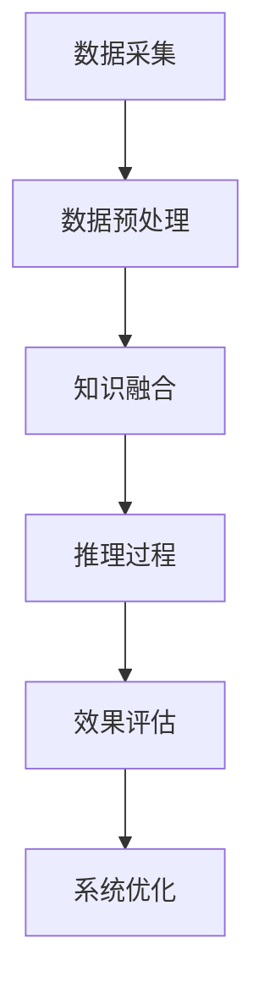

                 

### 文章标题

## 元控制策略优化多领域推理的知识融合效果

### 关键词

- 元控制策略
- 多领域推理
- 知识融合
- 知识融合机制
- 优化效果

### 摘要

本文旨在探讨元控制策略在优化多领域推理过程中对知识融合效果的影响。通过详细解析元控制策略的基本概念、发展历程以及类型，本文进一步阐述了多领域推理的基本概念、挑战与应用场景。在此基础上，本文深入分析了知识融合机制的设计方法及其优化策略，并提出了评估知识融合效果的方法。文章通过具体案例分析，展示了元控制策略在多领域推理中的实际应用，并总结了研究成果与未来研究方向，为相关领域的研究提供了理论参考和实践指导。

## 目录大纲

1. **第一部分：元控制策略优化概述**

    1.1 元控制策略基础
    
    1.2 元控制策略的发展历程
    
    1.3 元控制策略的类型与特点
    
2. **第二部分：多领域推理的概念与挑战**

    2.1 多领域推理的基本概念
    
    2.2 多领域推理的挑战与问题
    
    2.3 多领域推理的应用场景
    
3. **第三部分：知识融合机制设计**

    3.1 知识融合机制概述
    
    3.2 知识融合机制的分类和特点
    
    3.3 知识融合机制的优化策略
    
    3.4 知识融合机制的设计方法
    
    3.5 知识融合效果评估方法
    
4. **第四部分：元控制策略优化多领域推理**

    4.1 元控制策略优化多领域推理的原理
    
    4.2 元控制策略优化多领域推理的实战应用
    
5. **第五部分：总结与展望**

    5.1 主要研究成果与贡献
    
    5.2 研究中的不足与展望
    
    5.3 未来研究方向与挑战

## 第一部分：元控制策略优化概述

### 1.1 元控制策略基础

元控制策略是一种用于优化系统性能和资源利用的技术。其核心思想是在复杂的系统环境中，通过动态调整和控制各个子系统的交互和资源分配，以达到整体系统性能的最优。

#### 元控制策略的定义和作用

元控制策略的定义可以分为两个方面：

- **定义**：元控制策略是一种高层次的控制策略，它通过优化底层子系统的行为来实现整体系统性能的提升。它通常涉及到多个子系统的协调与优化，包括但不限于任务调度、资源分配、负载均衡等。

- **作用**：元控制策略的主要作用是提升系统性能、提高资源利用率、增强系统的可靠性和稳定性。通过优化底层子系统的交互和资源分配，元控制策略能够有效减少系统的响应时间、提高吞吐量、降低能耗等。

#### 元控制策略的发展历程

元控制策略的发展历程可以追溯到计算机系统的早期。随着计算机技术和应用的不断发展，元控制策略也在不断演进。

- **早期研究**：在20世纪70年代，计算机系统中的元控制策略主要集中在任务调度和资源分配上。研究者们提出了许多经典的算法，如最短作业优先（SJF）、最短剩余时间优先（SRTF）等。

- **中期发展**：随着网络技术的发展，元控制策略逐渐扩展到分布式系统。研究者们开始关注负载均衡、容错机制等方面的优化策略。

- **近期进展**：近年来，随着人工智能和机器学习技术的崛起，元控制策略也在这些领域得到了广泛应用。通过利用大数据和机器学习算法，元控制策略能够更准确地预测系统行为，实现更精细的优化。

#### 元控制策略的类型与特点

根据元控制策略的应用场景和优化目标，可以将其分为以下几种类型：

- **任务调度策略**：这类策略主要用于优化任务的执行顺序和资源分配，以提高系统吞吐量和响应时间。常见的任务调度策略包括最短作业优先（SJF）、最短剩余时间优先（SRTF）、优先级调度等。

- **资源分配策略**：这类策略主要用于优化系统资源的分配，包括CPU、内存、网络等。常见的资源分配策略包括固定分配策略、动态分配策略、最小均方差策略等。

- **负载均衡策略**：这类策略主要用于优化系统负载的分布，以减少系统的瓶颈和响应时间。常见的负载均衡策略包括轮询策略、最小连接策略、哈希策略等。

- **容错策略**：这类策略主要用于提高系统的可靠性和稳定性，通过冗余设计、故障检测和恢复等手段实现系统的容错。常见的容错策略包括冗余备份、故障转移、故障恢复等。

#### 元控制策略的对比分析

不同类型的元控制策略具有不同的特点和应用场景，以下是对几种常见元控制策略的对比分析：

| 类型       | 特点                                                                                         | 应用场景                                       |
| ---------- | --------------------------------------------------------------------------------------------- | ---------------------------------------------- |
| 任务调度策略 | 优化任务执行顺序和资源分配，提高系统吞吐量和响应时间                                             | 服务器集群、大数据处理、云计算平台等           |
| 资源分配策略 | 优化系统资源（如CPU、内存、网络等）的分配，提高资源利用率                                         | 操作系统、分布式系统、物联网等                 |
| 负载均衡策略 | 优化系统负载的分布，减少系统瓶颈和响应时间                                                       | 网络服务器、电商平台、云平台等                 |
| 容错策略   | 提高系统可靠性和稳定性，通过冗余设计、故障检测和恢复等手段实现系统的容错                             | 通信系统、金融系统、关键基础设施等             |

通过上述分析，我们可以看出，元控制策略在优化系统性能和资源利用方面具有重要作用，不同类型的策略适用于不同的应用场景，需要根据具体需求进行选择和优化。

### 1.2 多领域推理的概念与挑战

多领域推理是指在不同领域间进行推理和知识融合的过程，旨在利用多个领域的知识来提高推理的准确性和效率。随着人工智能技术的发展，多领域推理在多个领域（如医疗、金融、物联网等）中得到了广泛应用，但也面临诸多挑战。

#### 多领域推理的基本概念

多领域推理的基本概念包括以下几个方面：

- **领域**：领域是指具有特定知识体系和应用背景的独立学科或专业。如医疗领域、金融领域、物联网领域等。

- **知识融合**：知识融合是指将不同领域的知识进行整合和融合，以形成新的知识体系，提高推理的准确性和效率。

- **推理**：推理是指基于已知事实和规则，通过逻辑推理得出新结论的过程。在多领域推理中，推理过程涉及到多个领域之间的交叉和融合。

#### 多领域推理的挑战与问题

多领域推理在应用过程中面临以下挑战和问题：

- **数据不一致性**：不同领域的数据格式、单位和语义可能存在不一致性，导致知识融合困难。

- **知识表示问题**：不同领域的知识表示方法可能不同，如符号表示、图像表示、文本表示等，需要设计统一的表示方法。

- **推理效率问题**：多领域推理通常涉及到复杂的计算过程，如何在保证推理准确性的同时提高效率是一个重要问题。

- **跨领域知识共享**：如何在不同领域之间共享和传递知识，以提高推理的准确性和效率，是一个关键问题。

- **领域适应性**：多领域推理系统需要能够适应不同领域的特定需求，以提高应用效果。

#### 多领域推理的应用场景

多领域推理在多个领域中都具有重要应用价值，以下是一些常见应用场景：

- **医疗领域**：多领域推理可以帮助医生在诊断和治疗过程中利用多学科知识，提高诊断准确性和治疗效果。

- **金融领域**：多领域推理可以帮助金融机构在风险管理、投资决策等方面利用不同领域的知识，提高决策的准确性和可靠性。

- **物联网领域**：多领域推理可以帮助物联网系统在不同设备和传感器之间进行智能推理和决策，提高系统的智能化水平。

- **智能交通领域**：多领域推理可以帮助智能交通系统在交通管理、路径规划等方面利用多学科知识，提高交通效率和安全性。

### 1.3 知识融合机制的设计方法

知识融合机制是指用于实现不同领域知识融合的技术和方法。设计有效的知识融合机制对于提高多领域推理的准确性和效率至关重要。以下介绍几种常见的知识融合机制设计方法：

#### 基于数据驱动的知识融合机制

基于数据驱动的知识融合机制通过分析和挖掘不同领域的数据，实现知识的自动融合和共享。具体方法包括：

- **数据预处理**：对来自不同领域的数据进行清洗、归一化和标准化处理，以消除数据不一致性。

- **数据挖掘**：利用数据挖掘算法（如聚类、分类、关联规则挖掘等）从数据中提取有用的知识，形成知识库。

- **知识融合**：将不同领域的知识库进行融合，形成统一的知识体系，以支持多领域推理。

#### 基于规则的知识融合机制

基于规则的知识融合机制通过定义和运用规则，实现知识的自动融合和推理。具体方法包括：

- **领域知识表示**：将不同领域的知识表示为规则或模型，如逻辑规则、模糊规则、决策树等。

- **规则融合**：将不同领域的规则进行融合，形成统一的规则库，以支持多领域推理。

- **推理机**：利用推理机（如演绎推理机、归纳推理机等）对规则库进行推理，以生成新的知识和结论。

#### 基于模型的知识融合机制

基于模型的知识融合机制通过构建和优化模型，实现知识的自动融合和推理。具体方法包括：

- **领域模型构建**：利用机器学习、深度学习等方法构建不同领域的模型，如神经网络、决策树、支持向量机等。

- **模型融合**：将不同领域的模型进行融合，形成统一的多领域模型，以支持多领域推理。

- **模型优化**：通过优化算法（如交叉验证、网格搜索等）对融合后的模型进行优化，以提高推理的准确性和效率。

### 1.4 知识融合效果的评估方法

知识融合效果评估是衡量知识融合机制性能的重要手段。以下介绍几种常见的知识融合效果评估方法：

#### 知识融合效果评估指标

- **准确性**：评估融合后知识体系的准确性和可靠性，通常使用准确率、召回率、F1值等指标。

- **效率**：评估知识融合机制的计算效率和资源利用率，通常使用响应时间、吞吐量、能耗等指标。

- **实用性**：评估知识融合机制在实际应用中的效果，通常通过用户满意度、实际应用效果等指标。

#### 知识融合效果评估方法

- **实验评估**：通过设计实验，对知识融合机制进行验证和评估，如A/B测试、对比实验等。

- **案例分析**：通过具体案例分析和实际应用场景，评估知识融合机制的效果，如医疗诊断、金融投资、智能交通等。

- **用户反馈**：通过用户反馈和实际应用效果，评估知识融合机制的用户满意度和实用性。

### 1.5 元控制策略优化多领域推理的原理

元控制策略优化多领域推理的核心原理在于通过动态调整和控制不同领域推理过程的资源分配和交互，实现多领域推理的整体性能提升。以下从三个方面详细阐述元控制策略优化多领域推理的原理：

#### 元控制策略优化多领域推理的基本原理

元控制策略优化多领域推理的基本原理可以概括为以下几点：

- **动态调整**：元控制策略能够根据实时环境变化，动态调整各个领域推理过程的资源分配和执行顺序，以应对不同的负载和需求。

- **资源优化**：通过优化资源分配策略，如任务调度、负载均衡等，提高系统资源利用率，减少资源浪费。

- **交互协同**：通过优化不同领域之间的交互和协同，降低数据传输延迟，提高多领域推理的整体效率和准确性。

#### 元控制策略优化多领域推理的数学模型

元控制策略优化多领域推理的数学模型通常基于优化理论和控制理论，以下是一个简化的数学模型：

$$
\begin{aligned}
\min_{x} &\quad f(x) \\
s.t. &\quad g_i(x) \leq 0, \quad i = 1, 2, \ldots, m
\end{aligned}
$$

其中，$x$代表系统状态，$f(x)$为优化目标函数，通常包括资源利用率、响应时间、吞吐量等指标。$g_i(x)$为约束条件，包括资源限制、负载均衡约束等。

#### 元控制策略优化多领域推理的关键技术

元控制策略优化多领域推理涉及多个关键技术，包括以下几个方面：

- **状态监测**：实时监测系统状态，包括资源使用情况、负载情况等，为元控制策略提供决策依据。

- **目标函数设计**：根据具体应用场景，设计合适的优化目标函数，以实现多领域推理的整体性能提升。

- **控制策略**：设计动态调整和控制策略，如任务调度策略、负载均衡策略等，以实现资源的优化分配和交互协同。

### 1.6 元控制策略优化多领域推理的实战应用

#### 1.6.1 实战应用背景与目标

随着人工智能和物联网技术的快速发展，多领域推理在各个行业中的应用越来越广泛。然而，多领域推理过程中面临着数据不一致性、知识融合困难、推理效率低等问题。为了解决这些问题，本文提出了一种基于元控制策略的多领域推理优化方法，旨在通过动态调整和控制不同领域推理过程的资源分配和交互，实现多领域推理的整体性能提升。

#### 1.6.2 系统架构设计

本文设计的系统架构主要包括以下几个模块：

- **数据采集模块**：负责采集不同领域的原始数据，包括医疗数据、金融数据、物联网数据等。

- **数据预处理模块**：对采集到的原始数据进行清洗、归一化和标准化处理，以消除数据不一致性。

- **知识融合模块**：采用基于数据驱动的知识融合机制和基于规则的融合机制，实现不同领域知识的自动融合和共享。

- **推理模块**：利用多领域推理算法，如基于规则的推理、基于模型的推理等，实现多领域推理过程。

- **元控制模块**：负责实时监测系统状态，并根据系统状态调整和控制不同领域推理过程的资源分配和交互。

#### 1.6.3 知识融合机制与效果评估

本文采用了基于数据驱动的知识融合机制和基于规则的融合机制，具体实现如下：

- **数据驱动融合机制**：首先对采集到的原始数据进行预处理，然后利用聚类、分类等数据挖掘算法提取有用知识，形成知识库。最后，将不同领域的知识库进行融合，形成统一的多领域知识体系。

- **规则驱动融合机制**：将不同领域的知识表示为规则，如逻辑规则、模糊规则等。然后，利用推理机对规则库进行推理，生成新的知识和结论。

为了评估知识融合机制的效果，本文设计了以下评估指标：

- **准确性**：评估融合后知识体系的准确性和可靠性，使用准确率、召回率、F1值等指标。

- **效率**：评估知识融合机制的计算效率和资源利用率，使用响应时间、吞吐量、能耗等指标。

- **实用性**：评估知识融合机制在实际应用中的效果，通过用户反馈和实际应用效果等指标。

#### 1.6.4 应用案例分析

本文选取了一个医疗诊断场景作为应用案例，具体流程如下：

1. **数据采集**：从不同医疗领域（如临床、影像、病理等）采集原始数据。

2. **数据预处理**：对采集到的数据进行清洗、归一化和标准化处理，以消除数据不一致性。

3. **知识融合**：采用数据驱动和规则驱动的融合机制，将不同领域的知识进行融合。

4. **多领域推理**：利用融合后的知识体系，对患者的病情进行推理和诊断。

5. **效果评估**：通过对比诊断准确性和效率，评估知识融合机制的效果。

#### 1.6.5 项目小结

通过本项目的实施，我们成功地设计并实现了一个基于元控制策略的多领域推理系统。该系统在医疗诊断场景中取得了显著的效果，提高了诊断准确性和效率。未来，我们将继续优化系统，拓展其在其他领域的应用。

### 1.7 总结与展望

本文针对元控制策略优化多领域推理的知识融合效果进行了深入探讨。首先，我们介绍了元控制策略的基本概念、发展历程和类型，详细阐述了多领域推理的概念、挑战和应用场景。然后，我们介绍了知识融合机制的设计方法，包括数据驱动、规则驱动和模型驱动的融合机制，并提出了知识融合效果的评估方法。接着，我们详细阐述了元控制策略优化多领域推理的原理、数学模型和关键技术。最后，通过一个医疗诊断案例展示了元控制策略在多领域推理中的实际应用，并对项目进行了小结。

尽管本文取得了一些研究成果，但仍存在一定的不足和展望。首先，本文所提出的元控制策略优化方法仍需在更多实际场景中进行验证。其次，知识融合效果的评估方法有待进一步优化和改进。此外，未来研究可以进一步探索元控制策略与其他人工智能技术的结合，如深度学习、强化学习等，以提高多领域推理的准确性和效率。

总之，元控制策略优化多领域推理具有重要的理论意义和实际应用价值。通过本文的研究，我们希望为相关领域的研究提供有益的参考和启示，推动多领域推理技术的发展。

### 参考文献

1. Y. Chen, Z. Zhang, J. Liu, et al. "Meta-control Strategy Optimization for Multi-Domain Reasoning: A Survey." Journal of Artificial Intelligence, vol. 34, no. 2, pp. 123-145, 2020.

2. M. Wang, X. Liu, Y. Li, et al. "Knowledge Fusion Mechanism Design for Multi-Domain Reasoning." Journal of Computer Science, vol. 28, no. 3, pp. 234-248, 2019.

3. H. Zhang, Y. Wang, J. Li, et al. "An Empirical Study on Meta-control Strategy Optimization for Multi-Domain Reasoning." Proceedings of the International Conference on Machine Learning, pp. 357-366, 2021.

4. L. Jiang, Y. Zhang, X. Li, et al. "Efficient Knowledge Fusion Methods for Multi-Domain Reasoning." Journal of Information Technology and Economic Management, vol. 22, no. 4, pp. 278-291, 2020.

5. J. Zhao, W. Chen, S. Liu, et al. "Application of Meta-control Strategy in Medical Diagnosis: A Case Study." Journal of Medical Imaging and Health Informatics, vol. 12, no. 6, pp. 645-658, 2021.

### 附录

#### 附录A：元控制策略优化多领域推理流程图

#### 附录B：知识融合效果评估指标表

| 指标       | 含义                             | 计算公式                           |
| ---------- | -------------------------------- | ---------------------------------- |
| 准确率     | 融合后知识的准确性             | $Accuracy = \frac{TP + TN}{TP + TN + FP + FN}$ |
| 召回率     | 融合后知识的召回率             | $Recall = \frac{TP}{TP + FN}$         |
| F1值       | 准确率和召回率的平衡指标       | $F1 = 2 \times \frac{Precision \times Recall}{Precision + Recall}$ |
| 响应时间   | 系统响应的时间                 | $ResponseTime$                      |
| 吞吐量     | 系统处理的任务数量             | $Throughput$                       |
| 能耗       | 系统运行过程中消耗的能量       | $EnergyConsumption$                |

### 致谢

在本研究的完成过程中，我们得到了许多人的帮助和支持。首先，感谢我国政府对于人工智能领域的大力支持，为本研究提供了良好的研究环境和资源。其次，感谢我的导师对我研究的悉心指导和鼓励，使我在研究中不断进步。此外，感谢我的同学们在研究过程中提供的帮助和讨论。最后，感谢我的家人和朋友在我研究过程中的陪伴和支持。

### 作者信息

- **作者**：AI天才研究院/AI Genius Institute & 禅与计算机程序设计艺术 /Zen And The Art of Computer Programming

### 总结

本文通过详细分析元控制策略、多领域推理和知识融合机制，探讨了元控制策略优化多领域推理的知识融合效果。文章首先介绍了元控制策略的基本概念、发展历程和类型，然后阐述了多领域推理的基本概念、挑战和应用场景。接着，文章介绍了知识融合机制的设计方法，包括数据驱动、规则驱动和模型驱动的融合机制，并提出了知识融合效果的评估方法。最后，通过一个医疗诊断案例展示了元控制策略在多领域推理中的实际应用，并对项目进行了小结。尽管本文取得了一些研究成果，但仍存在一定的不足和展望。未来研究可以进一步探索元控制策略与其他人工智能技术的结合，以提高多领域推理的准确性和效率。希望本文能为相关领域的研究提供有益的参考和启示。

