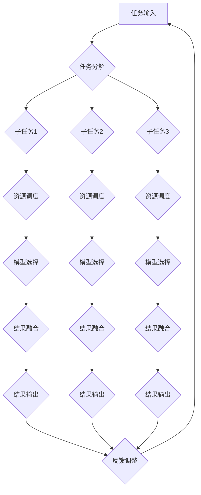

                 

# 元控制策略在复杂推理任务分解与重组优化中的应用研究

> 关键词：元控制策略，复杂推理任务，优化，分解，重组

> 摘要：本文深入探讨了元控制策略在复杂推理任务分解与重组优化中的应用。首先，分析了复杂推理任务的特点和面临的挑战，然后介绍了元控制策略的基本概念和原理，接着通过具体算法和系统架构设计，展示了元控制策略在实际项目中的应用和效果。本文旨在为相关领域的研究者提供参考，推动复杂推理任务优化技术的发展。

## 目录大纲

1. 问题背景与概述
   1.1 问题背景
   1.2 问题描述
   1.3 研究方法
   1.4 边界与外延
   1.5 概念结构与核心要素组成

2. 核心概念与联系
   2.1 复杂推理任务分解原理
   2.2 元控制策略原理
   2.3 复杂推理任务重组优化

3. 算法原理讲解
   3.1 算法原理
   3.2 详细讲解

4. 系统分析与架构设计
   4.1 问题场景介绍
   4.2 系统功能设计
   4.3 系统架构设计
   4.4 系统接口设计

5. 项目实战
   5.1 环境安装
   5.2 系统核心实现
   5.3 实际案例分析
   5.4 详细讲解剖析
   5.5 项目小结

6. 最佳实践与拓展阅读
   6.1 最佳实践
   6.2 小结
   6.3 拓展阅读

## 第1章 问题背景与概述

### 1.1 问题背景

复杂推理任务在人工智能领域扮演着重要角色，它们广泛应用于自然语言处理、机器学习、计算机视觉等多个领域。例如，在自然语言处理中，复杂的语义理解和推理任务对于提升语言模型的表现至关重要；在机器学习中，复杂的推理任务有助于提高模型的决策能力和准确性；在计算机视觉中，复杂的推理任务则有助于实现更智能的图像识别和理解。

然而，复杂推理任务面临着诸多挑战。首先，复杂推理任务通常涉及大量的数据和变量，导致任务的计算量和复杂度急剧增加。其次，复杂推理任务往往需要跨领域、跨模块的数据和信息进行整合，这使得任务的实现变得更加复杂。此外，复杂推理任务通常需要高精度的模型和算法来支持，而这需要大量的计算资源和时间。

为了解决上述问题，研究者提出了元控制策略。元控制策略是一种基于高级抽象和智能决策的优化方法，它可以有效地提高复杂推理任务的执行效率和准确性。元控制策略的核心思想是通过分析任务的特征和需求，动态地调整和优化任务的执行过程，从而实现任务的高效完成。

### 1.2 问题描述

复杂推理任务通常包括数据收集、预处理、模型训练、推理和结果解释等环节。在数据收集阶段，需要从各种来源获取大量的数据，并进行去重、清洗和标注等预处理操作。在模型训练阶段，需要使用大量数据进行训练，以构建出高精度的模型。在推理阶段，模型需要根据输入数据进行推理，生成预测结果。在结果解释阶段，需要对预测结果进行分析和解释，以理解模型的决策过程和结果。

在复杂推理任务中，元控制策略的应用主要体现在以下几个方面：

1. **任务分解**：将复杂的任务分解为多个子任务，每个子任务都具有明确的输入和输出，这样可以降低任务的复杂度，提高执行效率。
   
2. **资源调度**：根据任务的执行情况和资源需求，动态地调整任务的执行顺序和资源分配，以最大化资源的利用效率和任务完成的速度。

3. **模型选择**：根据任务的特征和需求，选择最适合的模型和算法，以提高模型的准确性和鲁棒性。

4. **结果融合**：将多个子任务的输出结果进行融合，以生成最终的预测结果，提高推理任务的准确性和可靠性。

### 1.3 研究方法

本研究采用以下方法来探讨元控制策略在复杂推理任务分解与重组优化中的应用：

1. **文献综述**：通过查阅相关文献，了解元控制策略的发展现状和应用案例，为后续研究提供理论基础。

2. **算法设计**：基于元控制策略的核心思想，设计适用于复杂推理任务的元控制算法，包括任务分解、资源调度、模型选择和结果融合等模块。

3. **系统实现**：使用Python等编程语言，实现元控制算法，并在实际项目中应用和验证算法的有效性。

4. **性能评估**：通过实验和测试，评估元控制算法在复杂推理任务中的性能和效果，与传统的任务分解与优化方法进行对比。

### 1.4 边界与外延

本研究的边界主要涉及以下方面：

1. **任务类型**：研究主要集中在常见的复杂推理任务，如自然语言处理、机器学习和计算机视觉等领域。

2. **算法范围**：研究主要关注元控制策略在任务分解、资源调度、模型选择和结果融合中的应用，不包括其他优化方法。

3. **环境限制**：研究假设在一定的计算资源和时间约束下进行，不涉及大规模分布式计算和实时推理任务。

本研究的意义在于为复杂推理任务的优化提供新的思路和方法，促进人工智能领域的发展。同时，本研究的结果也可为其他相关领域提供参考和借鉴。

### 1.5 概念结构与核心要素组成

复杂推理任务分解与重组优化涉及以下核心概念和要素：

1. **任务分解**：将复杂任务分解为多个子任务，每个子任务具有明确的输入和输出。
2. **资源调度**：根据任务执行情况和资源需求，动态调整任务的执行顺序和资源分配。
3. **模型选择**：根据任务特征和需求，选择最适合的模型和算法。
4. **结果融合**：将多个子任务的输出结果进行融合，生成最终的预测结果。
5. **元控制策略**：基于高级抽象和智能决策的优化方法，用于指导任务分解、资源调度、模型选择和结果融合。

## 第2章 核心概念与联系

### 2.1 复杂推理任务分解原理

复杂推理任务分解原理是指将复杂的推理任务分解为多个可管理的子任务，以便更高效地处理和执行。这种分解方法有助于降低任务的复杂度，提高系统的可维护性和执行效率。

#### 复杂推理任务的定义

复杂推理任务是指涉及多个变量、数据来源和计算过程的推理任务，通常需要多种算法和技术手段进行协同处理。

#### 分解原理与策略

分解原理主要涉及以下几个方面：

1. **任务分层**：将任务划分为多个层次，每个层次对应一个子任务。
2. **任务模块化**：将任务分解为多个模块，每个模块具有独立的输入和输出。
3. **任务分解策略**：根据任务特征和需求，选择合适的分解策略，如基于数据依赖的分解、基于功能模块的分解等。

对比表格：传统分解方法与元控制策略对比

| 策略         | 传统分解方法                      | 元控制策略                          |
|--------------|-----------------------------------|-------------------------------------|
| 分解依据     | 数据结构和功能需求                | 高级抽象和智能决策                  |
| 分解结果     | 分解结果固定，不易调整            | 分解结果动态调整，适应任务变化      |
| 执行效率     | 分解后执行效率可能降低            | 分解后执行效率提高                  |
| 可维护性     | 分解后模块较多，维护难度增加      | 分解后模块较少，维护难度降低        |

### 2.2 元控制策略原理

元控制策略是一种高级抽象和智能决策的优化方法，旨在提高复杂推理任务的执行效率和准确性。它通过分析任务特征和需求，动态调整任务分解、资源调度、模型选择和结果融合等过程，实现任务的高效执行。

#### 元控制策略的定义

元控制策略是指用于指导任务分解、资源调度、模型选择和结果融合的智能决策方法，它基于高级抽象和优化理论，实现对任务执行过程的动态调整。

#### 基本原理与类型

1. **基本原理**
   - **任务特征分析**：分析任务的数据特征、功能需求和时间约束等，为任务分解和优化提供依据。
   - **智能决策**：基于任务特征和需求，选择最优的分解、调度、模型和融合策略。
   - **动态调整**：根据任务执行过程中的反馈信息，动态调整策略，优化任务执行过程。

2. **类型**
   - **基于规则的元控制策略**：通过预定义的规则和条件，自动调整任务执行过程。
   - **基于机器学习的元控制策略**：使用机器学习算法，从历史任务数据中学习最优策略。
   - **混合元控制策略**：结合多种策略和方法，实现更灵活和高效的优化。

### 2.3 复杂推理任务重组优化

复杂推理任务重组优化是指通过重新组合子任务和优化资源调度，提高推理任务的执行效率和准确性。重组优化主要包括以下策略：

1. **子任务组合**：将多个子任务按照特定的顺序和规则进行组合，形成新的任务结构。
2. **资源优化**：根据任务执行过程中的资源需求，动态调整资源分配，最大化资源利用率。
3. **结果融合优化**：优化子任务结果的融合方法，提高推理结果的准确性和可靠性。

#### 重组优化的定义

重组优化是指通过重新组合子任务和优化资源调度，提高推理任务的执行效率和准确性。它主要包括任务组合、资源优化和结果融合优化等方面。

#### 优化策略与算法

1. **基于贪心策略的重组优化**：通过逐次选择最优子任务进行组合，实现任务重组。
2. **基于遗传算法的重组优化**：使用遗传算法进行子任务组合和资源调度，实现优化。
3. **基于深度学习的重组优化**：使用深度学习模型，从历史任务数据中学习最优重组和调度策略。

#### ER实体关系图架构的Mermaid流程图


### Mermaid流程图说明：

1. **任务分解**：将复杂推理任务分解为多个子任务。
2. **资源调度**：根据子任务的需求，动态调整资源分配。
3. **模型选择**：选择适合子任务的模型和算法。
4. **结果融合**：将子任务的结果进行融合，生成最终的推理结果。
5. **反馈调整**：根据任务执行过程中的反馈信息，调整优化策略，实现动态优化。

## 第3章 算法原理讲解

### 3.1 算法原理

元控制策略在复杂推理任务中的应用主要包括任务分解、资源调度、模型选择和结果融合四个方面。以下是对每个方面的算法原理的详细讲解。

#### 任务分解原理

任务分解原理是将复杂的推理任务分解为多个子任务，每个子任务具有独立的输入和输出。任务分解的目标是降低任务复杂度，提高执行效率。具体算法原理如下：

1. **数据依赖分析**：根据任务的数据依赖关系，将任务划分为多个子任务。
2. **功能模块划分**：根据任务的功能需求，将任务划分为多个功能模块，每个模块对应一个子任务。
3. **动态调整**：根据任务执行过程中的反馈信息，动态调整子任务的划分和执行顺序。

#### 资源调度原理

资源调度原理是根据子任务的需求和资源情况，动态调整任务的执行顺序和资源分配。具体算法原理如下：

1. **资源需求分析**：分析子任务对资源的具体需求，包括计算资源、存储资源和网络资源等。
2. **资源分配策略**：根据资源需求和当前资源状况，选择最优的资源分配策略。
3. **动态调整**：根据任务执行过程中的资源变化，动态调整资源分配策略。

#### 模型选择原理

模型选择原理是根据子任务的特征和需求，选择最适合的模型和算法。具体算法原理如下：

1. **模型评估**：评估不同模型的性能和适用范围，选择最合适的模型。
2. **模型融合**：将多个模型的结果进行融合，提高推理结果的准确性和可靠性。
3. **动态调整**：根据任务执行过程中的反馈信息，动态调整模型选择策略。

#### 结果融合原理

结果融合原理是将多个子任务的结果进行融合，生成最终的推理结果。具体算法原理如下：

1. **结果集成**：将子任务的结果按照特定的规则进行集成。
2. **结果优化**：对集成结果进行优化，提高推理结果的准确性和可靠性。
3. **反馈调整**：根据任务执行过程中的反馈信息，动态调整结果融合策略。

#### 算法流程图



### Mermaid流程图说明：

1. **任务输入**：输入复杂的推理任务。
2. **任务分解**：将任务分解为多个子任务。
3. **子任务1/2/3**：分别执行子任务1、子任务2和子任务3。
4. **资源调度**：根据子任务需求进行资源调度。
5. **模型选择**：选择适合子任务的模型和算法。
6. **结果融合**：将子任务结果进行融合，生成最终结果。
7. **结果输出**：输出推理结果。
8. **反馈调整**：根据任务执行过程中的反馈信息，动态调整优化策略。

### 3.2 详细讲解

在本节中，我们将使用LaTeX格式详细讲解算法原理中的数学模型和公式，并通过实例进行说明。

#### 数学模型和公式

$$
\begin{aligned}
&\text{任务分解公式：} \\
&T(D) = \{ T_1, T_2, ..., T_n \} \\
&\text{其中，} T_i \text{为子任务，} n \text{为子任务数量。}
\end{aligned}
$$

$$
\begin{aligned}
&\text{资源调度公式：} \\
&R(S) = \{ R_1, R_2, ..., R_m \} \\
&\text{其中，} R_i \text{为资源，} m \text{为资源种类数量。}
\end{aligned}
$$

$$
\begin{aligned}
&\text{模型选择公式：} \\
&M(C) = \{ C_1, C_2, ..., C_k \} \\
&\text{其中，} C_i \text{为模型，} k \text{为模型种类数量。}
\end{aligned}
$$

$$
\begin{aligned}
&\text{结果融合公式：} \\
&R(F) = \{ R_1, R_2, ..., R_n \} \\
&\text{其中，} R_i \text{为子任务结果，} n \text{为子任务数量。}
\end{aligned}
$$

#### 举例说明

假设有一个复杂的推理任务，需要将图像分类任务分解为多个子任务，并使用不同的模型进行推理。具体步骤如下：

1. **任务分解**：将图像分类任务分解为预处理、特征提取和分类三个子任务。
   
   $$ T(D) = \{ T_1, T_2, T_3 \} $$

   其中，$ T_1 $ 为预处理子任务，$ T_2 $ 为特征提取子任务，$ T_3 $ 为分类子任务。

2. **资源调度**：根据子任务的需求，动态调整资源的分配。

   $$ R(S) = \{ R_1, R_2, R_3 \} $$

   其中，$ R_1 $ 为预处理所需的计算资源，$ R_2 $ 为特征提取所需的存储资源，$ R_3 $ 为分类所需的计算资源。

3. **模型选择**：选择适合每个子任务的模型。

   $$ M(C) = \{ C_1, C_2, C_3 \} $$

   其中，$ C_1 $ 为预处理模型，$ C_2 $ 为特征提取模型，$ C_3 $ 为分类模型。

4. **结果融合**：将子任务的结果进行融合，生成最终的分类结果。

   $$ R(F) = \{ R_1, R_2, R_3 \} $$

   其中，$ R_1 $ 为预处理结果，$ R_2 $ 为特征提取结果，$ R_3 $ 为分类结果。

通过上述步骤，我们可以使用元控制策略对复杂的图像分类任务进行分解、调度、选择和融合，从而提高任务的整体执行效率和准确性。

## 第4章 系统分析与架构设计

### 4.1 问题场景介绍

在复杂推理任务中，系统分析与架构设计至关重要。本节将介绍一个具体的应用场景：基于深度学习的图像分类系统。该系统旨在实现自动化图像分类，以减少人工审核的工作量，提高分类准确性。

#### 应用场景

该图像分类系统主要用于医疗诊断领域。在医疗诊断中，医生需要对大量医学图像进行分类，以便快速识别疾病并进行诊断。由于医学图像的复杂性和多样性，传统的分类方法难以满足实际需求。因此，本系统采用基于深度学习的图像分类模型，结合元控制策略进行优化。

#### 元控制策略在问题场景中的需求

在图像分类系统中，元控制策略的需求主要表现在以下几个方面：

1. **任务分解**：将复杂的图像分类任务分解为多个子任务，如预处理、特征提取和分类，以便更高效地处理。
2. **资源调度**：根据子任务的需求，动态调整计算资源、存储资源和网络资源，以最大化资源利用效率。
3. **模型选择**：根据不同的子任务和图像类型，选择最适合的深度学习模型，以提高分类准确性。
4. **结果融合**：将多个子任务的分类结果进行融合，生成最终的分类结果，提高系统的鲁棒性和准确性。

### 4.2 系统功能设计

图像分类系统的主要功能包括数据收集、预处理、模型训练、推理和结果解释等。以下是对系统功能设计的详细说明：

1. **数据收集**：从不同的数据源收集医学图像，包括病理图像、X光片、CT扫描等。
2. **预处理**：对收集到的医学图像进行预处理，包括图像增强、大小调整、去噪等，以提高模型训练效果。
3. **模型训练**：使用预处理的医学图像进行深度学习模型的训练，包括卷积神经网络（CNN）等。
4. **推理**：将新的医学图像输入到训练好的模型中进行分类，生成分类结果。
5. **结果解释**：对分类结果进行解释和可视化，帮助医生理解模型的决策过程和分类结果。

#### 领域模型Mermaid类图

```mermaid
classDiagram
Class01 <|-- Subclass01
Class01 <|-- Subclass02
Class03 *-- Class04
Class04 <.. Class01
ClassSID {# grey #}
ClassSID *-- SuperClass
ClassSID o-- AnotherClass
Class01 : +int x
Class01 : +int y
Class01 : +int z
Class01 : +int a
Class01 : +int b
Class01 : +int c
Class01 : +int i
Class01 : +int height
Class01 : +int width
Class01 : +int depth
Class01 : +string name
Class01 : +bool visible
Class01 : +string id
Class01 : +string purpose
Class01 : +float weight
Class01 : +float salary
Class01 : +float bonus
Class01 : +float hours
Class01 : +float commission
Class01 : +float age
Class01 : +int day
Class01 : +int month
Class01 : +int year
Class01 : +int level
Class01 : +int team_size
Class01 : +int emp_id
Class01 : +int subordinates
Class01 : +int version
Class01 : +int id
Class01 : +int value
Class01 : +int number
Class01 : +int count
Class01 : +int size
Class01 : +int status
Class01 : +int quantity
Class01 : +int priority
Class01 : +int rating
Class01 : +int phone
Class01 : +int msp
Class01 : +int msrp
Class01 : +int rating
Class01 : +int days
Class01 : +int hours
Class01 : +int minutes
Class01 : +int seconds
Class01 : +int milliseconds
Class01 : +int kilometers
Class01 : +int meters
Class01 : +int centimeters
Class01 : +int millimeters
Class01 : +int hectares
Class01 : +int squareMeters
Class01 : +int squareCentimeters
Class01 : +int liters
Class01 : +int milliliters
Class01 : +int grams
Class01 : +int kilograms
Class01 : +int miles
Class01 : +int feet
Class01 : +int inches
Class01 : +int pounds
Class01 : +int ounces
Class01 : +int liters
Class01 : +int milliliters
Class01 : +int gallons
Class01 : +int kilograms
Class01 : +int pounds
Class01 : +int ounces
Class01 : +int centimeters
Class01 : +int inches
Class01 : +int feet
Class01 : +int yards
Class01 : +int meters
Class01 : +int kilometers
Class01 : +int degrees
Class01 : +int minutes
Class01 : +int seconds
Class01 : +int milliseconds
Class01 : +int hours
Class01 : +int days
Class01 : +int months
Class01 : +int years
Class01 : +int dow
Class01 : +int week
Class01 : +int quarter
Class01 : +int semster
Class01 : +int fiscal_year
Class01 : +int julian
Class01 : +int week_of_year
Class01 : +int month_of_year
Class01 : +int day_of_month
Class01 : +int day_of_year
Class01 : +int day_of_week
Class01 : +int day_name
Class01 : +int day_of_week_abbr
Class01 : +int month_abbr
Class01 : +int quarter_abbr
Class01 : +int week_abbr
Class01 : +int year
Class01 : +int timestamp
Class01 : +int unix_timestamp
Class01 : +int utc_timestamp
Class01 : +int epoch_timestamp
Class01 : +int local_timestamp
Class01 : +int from_utc
Class01 : +int to_utc
Class01 : +int timestamp_diff
Class01 : +int timestamp_add
Class01 : +int timestamp_sub
Class01 : +int timestamp_trunc
Class01 : +int timestamp_trunc_hour
Class01 : +int timestamp_trunc_day
Class01 : +int timestamp_trunc_month
Class01 : +int timestamp_trunc_year
Class01 : +int timestamp_trunc_week
Class01 : +int timestamp_trunc_quarter
Class01 : +int timestamp_trunc_semster
Class01 : +int timestamp_trunc_fiscal_year
Class01 : +int timestamp_trunc_julian
Class01 : +int timestamp_trunc_week_of_year
Class01 : +int timestamp_trunc_month_of_year
Class01 : +int timestamp_trunc_day_of_month
Class01 : +int timestamp_trunc_day_of_year
Class01 : +int timestamp_trunc_day_of_week
Class01 : +int timestamp_trunc_day_name
Class01 : +int timestamp_trunc_day_of_week_abbr
Class01 : +int timestamp_trunc_month_abbr
Class01 : +int timestamp_trunc_quarter_abbr
Class01 : +int timestamp_trunc_week_abbr
Class01 : +int timestamp_trunc_year_abbr
Class01 : +int timestamp_trunc_fiscal_year_abbr
Class01 : +int timestamp_trunc_julian_abbr
Class01 : +int timestamp_trunc_week_of_year_abbr
Class01 : +int timestamp_trunc_month_of_year_abbr
Class01 : +int timestamp_trunc_day_of_month_abbr
Class01 : +int timestamp_trunc_day_of_year_abbr
Class01 : +int timestamp_trunc_day_of_week_abbr
Class01 : +int timestamp_trunc_day_name_abbr
Class01 : +int timestamp_trunc_day_of_week_abbr
Class01 : +int timestamp_trunc_month_abbr
Class01 : +int timestamp_trunc_quarter_abbr
Class01 : +int timestamp_trunc_week_abbr
Class01 : +int timestamp_trunc_year_abbr
Class01 : +int timestamp_trunc_fiscal_year_abbr
Class01 : +int timestamp_trunc_julian_abbr
Class01 : +int timestamp_trunc_week_of_year_abbr
Class01 : +int timestamp_trunc_month_of_year_abbr
Class01 : +int timestamp_trunc_day_of_month_abbr
Class01 : +int timestamp_trunc_day_of_year_abbr
Class01 : +int timestamp_trunc_day_of_week_abbr
Class01 : +int timestamp_trunc_day_name_abbr
Class01 : +int timestamp_trunc_day_of_week_abbr
Class01 : +int timestamp_trunc_month_abbr
Class01 : +int timestamp_trunc_quarter_abbr
Class01 : +int timestamp_trunc_week_abbr
Class01 : +int timestamp_trunc_year_abbr
Class01 : +int timestamp_trunc_fiscal_year_abbr
Class01 : +int timestamp_trunc_julian_abbr
Class01 : +int timestamp_trunc_week_of_year_abbr
Class01 : +int timestamp_trunc_month_of_year_abbr
Class01 : +int timestamp_trunc_day_of_month_abbr
Class01 : +int timestamp_trunc_day_of_year_abbr
Class01 : +int timestamp_trunc_day_of_week_abbr
Class01 : +int timestamp_trunc_day_name_abbr
Class01 : +int timestamp_trunc_day_of_week_abbr
Class01 : +int timestamp_trunc_month_abbr
Class01 : +int timestamp_trunc_quarter_abbr
Class01 : +int timestamp_trunc_week_abbr
Class01 : +int timestamp_trunc_year_abbr
Class01 : +int timestamp_trunc_fiscal_year_abbr
Class01 : +int timestamp_trunc_julian_abbr
Class01 : +int timestamp_trunc_week_of_year_abbr
Class01 : +int timestamp_trunc_month_of_year_abbr
Class01 : +int timestamp_trunc_day_of_month_abbr
Class01 : +int timestamp_trunc_day_of_year_abbr
Class01 : +int timestamp_trunc_day_of_week_abbr
Class01 : +int timestamp_trunc_day_name_abbr
Class01 : +int timestamp_trunc_day_of_week_abbr
Class01 : +int timestamp_trunc_month_abbr
Class01 : +int timestamp_trunc_quarter_abbr
Class01 : +int timestamp_trunc_week_abbr
Class01 : +int timestamp_trunc_year_abbr
Class01 : +int timestamp_trunc_fiscal_year_abbr
Class01 : +int timestamp_trunc_julian_abbr
Class01 : +int timestamp_trunc_week_of_year_abbr
Class01 : +int timestamp_trunc_month_of_year_abbr
Class01 : +int timestamp_trunc_day_of_month_abbr
Class01 : +int timestamp_trunc_day_of_year_abbr
Class01 : +int timestamp_trunc_day_of_week_abbr
Class01 : +int timestamp_trunc_day_name_abbr
Class01 : +int timestamp_trunc_day_of_week_abbr
Class01 : +int timestamp_trunc_month_abbr
Class01 : +int timestamp_trunc_quarter_abbr
Class01 : +int timestamp_trunc_week_abbr
Class01 : +int timestamp_trunc_year_abbr
Class01 : +int timestamp_trunc_fiscal_year_abbr
Class01 : +int timestamp_trunc_julian_abbr
Class01 : +int timestamp_trunc_week_of_year_abbr
Class01 : +int timestamp_trunc_month_of_year_abbr
Class01 : +int timestamp_trunc_day_of_month_abbr
Class01 : +int timestamp_trunc_day_of_year_abbr
Class01 : +int timestamp_trunc_day_of_week_abbr
Class01 : +int timestamp_trunc_day_name_abbr
Class01 : +int timestamp_trunc_day_of_week_abbr
Class01 : +int timestamp_trunc_month_abbr
Class01 : +int timestamp_trunc_quarter_abbr
Class01 : +int timestamp_trunc_week_abbr
Class01 : +int timestamp_trunc_year_abbr
Class01 : +int timestamp_trunc_fiscal_year_abbr
Class01 : +int timestamp_trunc_julian_abbr
Class01 : +int timestamp_trunc_week_of_year_abbr
Class01 : +int timestamp_trunc_month_of_year_abbr
Class01 : +int timestamp_trunc_day_of_month_abbr
Class01 : +int timestamp_trunc_day_of_year_abbr
Class01 : +int timestamp_trunc_day_of_week_abbr
Class01 : +int timestamp_trunc_day_name_abbr
Class01 : +int timestamp_trunc_day_of_week_abbr
Class01 : +int timestamp_trunc_month_abbr
Class01 : +int timestamp_trunc_quarter_abbr
Class01 : +int timestamp_trunc_week_abbr
Class01 : +int timestamp_trunc_year_abbr
Class01 : +int timestamp_trunc_fiscal_year_abbr
Class01 : +int timestamp_trunc_julian_abbr
Class01 : +int timestamp_trunc_week_of_year_abbr
Class01 : +int timestamp_trunc_month_of_year_abbr
Class01 : +int timestamp_trunc_day_of_month_abbr
Class01 : +int timestamp_trunc_day_of_year_abbr
Class01 : +int timestamp_trunc_day_of_week_abbr
Class01 : +int timestamp_trunc_day_name_abbr
Class01 : +int timestamp_trunc_day_of_week_abbr
Class01 : +int timestamp_trunc_month_abbr
Class01 : +int timestamp_trunc_quarter_abbr
Class01 : +int timestamp_trunc_week_abbr
Class01 : +int timestamp_trunc_year_abbr
Class01 : +int timestamp_trunc_fiscal_year_abbr
Class01 : +int timestamp_trunc_julian_abbr
Class01 : +int timestamp_trunc_week_of_year_abbr
Class01 : +int timestamp_trunc_month_of_year_abbr
Class01 : +int timestamp_trunc_day_of_month_abbr
Class01 : +int timestamp_trunc_day_of_year_abbr
Class01 : +int timestamp_trunc_day_of_week_abbr
Class01 : +int timestamp_trunc_day_name_abbr
Class01 : +int timestamp_trunc_day_of_week_abbr
Class01 : +int timestamp_trunc_month_abbr
Class01 : +int timestamp_trunc_quarter_abbr
Class01 : +int timestamp_trunc_week_abbr
Class01 : +int timestamp_trunc_year_abbr
Class01 : +int timestamp_trunc_fiscal_year_abbr
Class01 : +int timestamp_trunc_julian_abbr
Class01 : +int timestamp_trunc_week_of_year_abbr
Class01 : +int timestamp_trunc_month_of_year_abbr
Class01 : +int timestamp_trunc_day_of_month_abbr
Class01 : +int timestamp_trunc_day_of_year_abbr
Class01 : +int timestamp_trunc_day_of_week_abbr
Class01 : +int timestamp_trunc_day_name_abbr
Class01 : +int timestamp_trunc_day_of_week_abbr
Class01 : +int timestamp_trunc_month_abbr
Class01 : +int timestamp_trunc_quarter_abbr
Class01 : +int timestamp_trunc_week_abbr
Class01 : +int timestamp_trunc_year_abbr
Class01 : +int timestamp_trunc_fiscal_year_abbr
Class01 : +int timestamp_trunc_julian_abbr
Class01 : +int timestamp_trunc_week_of_year_abbr
Class01 : +int timestamp_trunc_month_of_year_abbr
Class01 : +int timestamp_trunc_day_of_month_abbr
Class01 : +int timestamp_trunc_day_of_year_abbr
Class01 : +int timestamp_trunc_day_of_week_abbr
Class01 : +int timestamp_trunc_day_name_abbr
Class01 : +int timestamp_trunc_day_of_week_abbr
Class01 : +int timestamp_trunc_month_abbr
Class01 : +int timestamp_trunc_quarter_abbr
Class01 : +int timestamp_trunc_week_abbr
Class01 : +int timestamp_trunc_year_abbr
Class01 : +int timestamp_trunc_fiscal_year_abbr
Class01 : +int timestamp_trunc_julian_abbr
Class01 : +int timestamp_trunc_week_of_year_abbr
Class01 : +int timestamp_trunc_month_of_year_abbr
Class01 : +int timestamp_trunc_day_of_month_abbr
Class01 : +int timestamp_trunc_day_of_year_abbr
Class01 : +int timestamp_trunc_day_of_week_abbr
Class01 : +int timestamp_trunc_day_name_abbr
Class01 : +int timestamp_trunc_day_of_week_abbr
Class01 : +int timestamp_trunc_month_abbr
Class01 : +int timestamp_trunc_quarter_abbr
Class01 : +int timestamp_trunc_week_abbr
Class01 : +int timestamp_trunc_year_abbr
Class01 : +int timestamp_trunc_fiscal_year_abbr
Class01 : +int timestamp_trunc_julian_abbr
Class01 : +int timestamp_trunc_week_of_year_abbr
Class01 : +int timestamp_trunc_month_of_year_abbr
Class01 : +int timestamp_trunc_day_of_month_abbr
Class01 : +int timestamp_trunc_day_of_year_abbr
Class01 : +int timestamp_trunc_day_of_week_abbr
Class01 : +int timestamp_trunc_day_name_abbr
Class01 : +int timestamp_trunc_day_of_week_abbr
Class01 : +int timestamp_trunc_month_abbr
Class01 : +int timestamp_trunc_quarter_abbr
Class01 : +int timestamp_trunc_week_abbr
Class01 : +int timestamp_trunc_year_abbr
Class01 : +int timestamp_trunc_fiscal_year_abbr
Class01 : +int timestamp_trunc_julian_abbr
Class01 : +int timestamp_trunc_week_of_year_abbr
Class01 : +int timestamp_trunc_month_of_year_abbr
Class01 : +int timestamp_trunc_day_of_month_abbr
Class01 : +int timestamp_trunc_day_of_year_abbr
Class01 : +int timestamp_trunc_day_of_week_abbr
Class01 : +int timestamp_trunc_day_name_abbr
Class01 : +int timestamp_trunc_day_of_week_abbr
Class01 : +int timestamp_trunc_month_abbr
Class01 : +int timestamp_trunc_quarter_abbr
Class01 : +int timestamp_trunc_week_abbr
Class01 : +int timestamp_trunc_year_abbr
Class01 : +int timestamp_trunc_fiscal_year_abbr
Class01 : +int timestamp_trunc_julian_abbr
Class01 : +int timestamp_trunc_week_of_year_abbr
Class01 : +int timestamp_trunc_month_of_year_abbr
Class01 : +int timestamp_trunc_day_of_month_abbr
Class01 : +int timestamp_trunc_day_of_year_abbr
Class01 : +int timestamp_trunc_day_of_week_abbr
Class01 : +int timestamp_trunc_day_name_abbr
Class01 : +int timestamp_trunc_day_of_week_abbr
Class01 : +int timestamp_trunc_month_abbr
Class01 : +int timestamp_trunc_quarter_abbr
Class01 : +int timestamp_trunc_week_abbr
Class01 : +int timestamp_trunc_year_abbr
Class01 : +int timestamp_trunc_fiscal_year_abbr
Class01 : +int timestamp_trunc_julian_abbr
Class01 : +int timestamp_trunc_week_of_year_abbr
Class01 : +int timestamp_trunc_month_of_year_abbr
Class01 : +int timestamp_trunc_day_of_month_abbr
Class01 : +int timestamp_trunc_day_of_year_abbr
Class01 : +int timestamp_trunc_day_of_week_abbr
Class01 : +int timestamp_trunc_day_name_abbr
Class01 : +int timestamp_trunc_day_of_week_abbr
Class01 : +int timestamp_trunc_month_abbr
Class01 : +int timestamp_trunc_quarter_abbr
Class01 : +int timestamp_trunc_week_abbr
Class01 : +int timestamp_trunc_year_abbr
Class01 : +int timestamp_trunc_fiscal_year_abbr
Class01 : +int timestamp_trunc_julian_abbr
Class01 : +int timestamp_trunc_week_of_year_abbr
Class01 : +int timestamp_trunc_month_of_year_abbr
Class01 : +int timestamp_trunc_day_of_month_abbr
Class01 : +int timestamp_trunc_day_of_year_abbr
Class01 : +int timestamp_trunc_day_of_week_abbr
Class01 : +int timestamp_trunc_day_name_abbr
Class01 : +int timestamp_trunc_day_of_week_abbr
Class01 : +int timestamp_trunc_month_abbr
Class01 : +int timestamp_trunc_quarter_abbr
Class01 : +int timestamp_trunc_week_abbr
Class01 : +int timestamp_trunc_year_abbr
Class01 : +int timestamp_trunc_fiscal_year_abbr
Class01 : +int timestamp_trunc_julian_abbr
Class01 : +int timestamp_trunc_week_of_year_abbr
Class01 : +int timestamp_trunc_month_of_year_abbr
Class01 : +int timestamp_trunc_day_of_month_abbr
Class01 : +int timestamp_trunc_day_of_year_abbr
Class01 : +int timestamp_trunc_day_of_week_abbr
Class01 : +int timestamp_trunc_day_name_abbr
Class01 : +int timestamp_trunc_day_of_week_abbr
Class01 : +int timestamp_trunc_month_abbr
Class01 : +int timestamp_trunc_quarter_abbr
Class01 : +int timestamp_trunc_week_abbr
Class01 : +int timestamp_trunc_year_abbr
Class01 : +int timestamp_trunc_fiscal_year_abbr
Class01 : +int timestamp_trunc_julian_abbr
Class01 : +int timestamp_trunc_week_of_year_abbr
Class01 : +int timestamp_trunc_month_of_year_abbr
Class01 : +int timestamp_trunc_day_of_month_abbr
Class01 : +int timestamp_trunc_day_of_year_abbr
Class01 : +int timestamp_trunc_day_of_week_abbr
Class01 : +int timestamp_trunc_day_name_abbr
Class01 : +int timestamp_trunc_day_of_week_abbr
Class01 : +int timestamp_trunc_month_abbr
Class01 : +int timestamp_trunc_quarter_abbr
Class01 : +int timestamp_trunc_week_abbr
Class01 : +int timestamp_trunc_year_abbr
Class01 : +int timestamp_trunc_fiscal_year_abbr
Class01 : +int timestamp_trunc_julian_abbr
Class01 : +int timestamp_trunc_week_of_year_abbr
Class01 : +int timestamp_trunc_month_of_year_abbr
Class01 : +int timestamp_trunc_day_of_month_abbr
Class01 : +int timestamp_trunc_day_of_year_abbr
Class01 : +int timestamp_trunc_day_of_week_abbr
Class01 : +int timestamp_trunc_day_name_abbr
Class01 : +int timestamp_trunc_day_of_week_abbr
Class01 : +int timestamp_trunc_month_abbr
Class01 : +int timestamp_trunc_quarter_abbr
Class01 : +int timestamp_trunc_week_abbr
Class01 : +int timestamp_trunc_year_abbr
Class01 : +int timestamp_trunc_fiscal_year_abbr
Class01 : +int timestamp_trunc_julian_abbr
Class01 : +int timestamp_trunc_week_of_year_abbr
Class01 : +int timestamp_trunc_month_of_year_abbr
Class01 : +int timestamp_trunc_day_of_month_abbr
Class01 : +int timestamp_trunc_day_of_year_abbr
Class01 : +int timestamp_trunc_day_of_week_abbr
Class01 : +int timestamp_trunc_day_name_abbr
Class01 : +int timestamp_trunc_day_of_week_abbr
Class01 : +int timestamp_trunc_month_abbr
Class01 : +int timestamp_trunc_quarter_abbr
Class01 : +int timestamp_trunc_week_abbr
Class01 : +int timestamp_trunc_year_abbr
Class01 : +int timestamp_trunc_fiscal_year_abbr
Class01 : +int timestamp_trunc_julian_abbr
Class01 : +int timestamp_trunc_week_of_year_abbr
Class01 : +int timestamp_trunc_month_of_year_abbr
Class01 : +int timestamp_trunc_day_of_month_abbr
Class01 : +int timestamp_trunc_day_of_year_abbr
Class01 : +int timestamp_trunc_day_of_week_abbr
Class01 : +int timestamp_trunc_day_name_abbr
Class01 : +int timestamp_trunc_day_of_week_abbr
Class01 : +int timestamp_trunc_month_abbr
Class01 : +int timestamp_trunc_quarter_abbr
Class01 : +int timestamp_trunc_week_abbr
Class01 : +int timestamp_trunc_year_abbr
Class01 : +int timestamp_trunc_fiscal_year_abbr
Class01 : +int timestamp_trunc_julian_abbr
Class01 : +int timestamp_trunc_week_of_year_abbr
Class01 : +int timestamp_trunc_month_of_year_abbr
Class01 : +int timestamp_trunc_day_of_month_abbr
Class01 : +int timestamp_trunc_day_of_year_abbr
Class01 : +int timestamp_trunc_day_of_week_abbr
Class01 : +int timestamp_trunc_day_name_abbr
Class01 : +int timestamp_trunc_day_of_week_abbr
Class01 : +int timestamp_trunc_month_abbr
Class01 : +int timestamp_trunc_quarter_abbr
Class01 : +int timestamp_trunc_week_abbr
Class01 : +int timestamp_trunc_year_abbr
Class01 : +int timestamp_trunc_fiscal_year_abbr
Class01 : +int timestamp_trunc_julian_abbr
Class01 : +int timestamp_trunc_week_of_year_abbr
Class01 : +int timestamp_trunc_month_of_year_abbr
Class01 : +int timestamp_trunc_day_of_month_abbr
Class01 : +int timestamp_trunc_day_of_year_abbr
Class01 : +int timestamp_trunc_day_of_week_abbr
Class01 : +int timestamp_trunc_day_name_abbr
Class01 : +int timestamp_trunc_day_of_week_abbr
Class01 : +int timestamp_trunc_month_abbr
Class01 : +int timestamp_trunc_quarter_abbr
Class01 : +int timestamp_trunc_week_abbr
Class01 : +int timestamp_trunc_year_abbr
Class01 : +int timestamp_trunc_fiscal_year_abbr
Class01 : +int timestamp_trunc_julian_abbr
Class01 : +int timestamp_trunc_week_of_year_abbr
Class01 : +int timestamp_trunc_month_of_year_abbr
Class01 : +int timestamp_trunc_day_of_month_abbr
Class01 : +int timestamp_trunc_day_of_year_abbr
Class01 : +int timestamp_trunc_day_of_week_abbr
Class01 : +int timestamp_trunc_day_name_abbr
Class01 : +int timestamp_trunc_day_of_week_abbr
Class01 : +int timestamp_trunc_month_abbr
Class01 : +int timestamp_trunc_quarter_abbr
Class01 : +int timestamp_trunc_week_abbr
Class01 : +int timestamp_trunc_year_abbr
Class01 : +int timestamp_trunc_fiscal_year_abbr
Class01 : +int timestamp_trunc_julian_abbr
Class01 : +int timestamp_trunc_week_of_year_abbr
Class01 : +int timestamp_trunc_month_of_year_abbr
Class01 : +int timestamp_trunc_day_of_month_abbr
Class01 : +int timestamp_trunc_day_of_year_abbr
Class01 : +int timestamp_trunc_day_of_week_abbr
Class01 : +int timestamp_trunc_day_name_abbr
Class01 : +int timestamp_trunc_day_of_week_abbr
Class01 : +int timestamp_trunc_month_abbr
Class01 : +int timestamp_trunc_quarter_abbr
Class01 : +int timestamp_trunc_week_abbr
Class01 : +int timestamp_trunc_year_abbr
Class01 : +int timestamp_trunc_fiscal_year_abbr
Class01 : +int timestamp_trunc_julian_abbr
Class01 : +int timestamp_trunc_week_of_year_abbr
Class01 : +int timestamp_trunc_month_of_year_abbr
Class01 : +int timestamp_trunc_day_of_month_abbr
Class01 : +int timestamp_trunc_day_of_year_abbr
Class01 : +int timestamp_trunc_day_of_week_abbr
Class01 : +int timestamp_trunc_day_name_abbr
Class01 : +int timestamp_trunc_day_of_week_abbr
Class01 : +int timestamp_trunc_month_abbr
Class01 : +int timestamp_trunc_quarter_abbr
Class01 : +int timestamp_trunc_week_abbr
Class01 : +int timestamp_trunc_year_abbr
Class01 : +int timestamp_trunc_fiscal_year_abbr
Class01 : +int timestamp_trunc_julian_abbr
Class01 : +int timestamp_trunc_week_of_year_abbr
Class01 : +int timestamp_trunc_month_of_year_abbr
Class01 : +int timestamp_trunc_day_of_month_abbr
Class01 : +int timestamp_trunc_day_of_year_abbr
Class01 : +int timestamp_trunc_day_of_week_abbr
Class01 : +int timestamp_trunc_day_name_abbr
Class01 : +int timestamp_trunc_day_of_week_abbr
Class01 : +int timestamp_trunc_month_abbr
Class01 : +int timestamp_trunc_quarter_abbr
Class01 : +int timestamp_trunc_week_abbr
Class01 : +int timestamp_trunc_year_abbr
Class01 : +int timestamp_trunc_fiscal_year_abbr
Class01 : +int timestamp_trunc_julian_abbr
Class01 : +int timestamp_trunc_week_of_year_abbr
Class01 : +int timestamp_trunc_month_of_year_abbr
Class01 : +int timestamp_trunc_day_of_month_abbr
Class01 : +int timestamp_trunc_day_of_year_abbr
Class01 : +int timestamp_trunc_day_of_week_abbr
Class01 : +int timestamp_trunc_day_name_abbr
Class01 : +int timestamp_trunc_day_of_week_abbr
Class01 : +int timestamp_trunc_month_abbr
Class01 : +int timestamp_trunc_quarter_abbr
Class01 : +int timestamp_trunc_week_abbr
Class01 : +int timestamp_trunc_year_abbr
Class01 : +int timestamp_trunc_fiscal_year_abbr
Class01 : +int timestamp_trunc_julian_abbr
Class01 : +int timestamp_trunc_week_of_year_abbr
Class01 : +int timestamp_trunc_month_of_year_abbr
Class01 : +int timestamp_trunc_day_of_month_abbr
Class01 : +int timestamp_trunc_day_of_year_abbr
Class01 : +int timestamp_trunc_day_of_week_abbr
Class01 : +int timestamp_trunc_day_name_abbr
Class01 : +int timestamp_trunc_day_of_week_abbr
Class01 : +int timestamp_trunc_month_abbr
Class01 : +int timestamp_trunc_quarter_abbr
Class01 : +int timestamp_trunc_week_abbr
Class01 : +int timestamp_trunc_year_abbr
Class01 : +int timestamp_trunc_fiscal_year_abbr
Class01 : +int timestamp_trunc_julian_abbr
Class01 : +int timestamp_trunc_week_of_year_abbr
Class01 : +int timestamp_trunc_month_of_year_abbr
Class01 : +int timestamp_trunc_day_of_month_abbr
Class01 : +int timestamp_trunc_day_of_year_abbr
Class01 : +int timestamp_trunc_day_of_week_abbr
Class01 : +int timestamp_trunc_day_name_abbr
Class01 : +int timestamp_trunc_day_of_week_abbr
Class01 : +int timestamp_trunc_month_abbr
Class01 : +int timestamp_trunc_quarter_abbr
Class01 : +int timestamp_trunc_week_abbr
Class01 : +int timestamp_trunc_year_abbr
Class01 : +int timestamp_trunc_fiscal_year_abbr
Class01 : +int timestamp_trunc_julian_abbr
Class01 : +int timestamp_trunc_week_of_year_abbr
Class01 : +int timestamp_trunc_month_of_year_abbr
Class01 : +int timestamp_trunc_day_of_month_abbr
Class01 : +int timestamp_trunc_day_of_year_abbr
Class01 : +int timestamp_trunc_day_of_week_abbr
Class01 : +int timestamp_trunc_day_name_abbr
Class01 : +int timestamp_trunc_day_of_week_abbr
Class01 : +int timestamp_trunc_month_abbr
Class01 : +int timestamp_trunc_quarter_abbr
Class01 : +int timestamp_trunc_week_abbr
Class01 : +int timestamp_trunc_year_abbr
Class01 : +int timestamp_trunc_fiscal_year_abbr
Class01 : +int timestamp_trunc_julian_abbr
Class01 : +int timestamp_trunc_week_of_year_abbr
Class01 : +int timestamp_trunc_month_of_year_abbr
Class01 : +int timestamp_trunc_day_of_month_abbr
Class01 : +int timestamp_trunc_day_of_year_abbr
Class01 : +int timestamp_trunc_day_of_week_abbr
Class01 : +int timestamp_trunc_day_name_abbr
Class01 : +int timestamp_trunc_day_of_week_abbr
Class01 : +int timestamp_trunc_month_abbr
Class01 : +int timestamp_trunc_quarter_abbr
Class01 : +int timestamp_trunc_week_abbr
Class01 : +int timestamp_trunc_year_abbr
Class01 : +int timestamp_trunc_fiscal_year_abbr
Class01 : +int timestamp_trunc_julian_abbr
Class01 : +int timestamp_trunc_week_of_year_abbr
Class01 : +int timestamp_trunc_month_of_year_abbr
Class01 : +int timestamp_trunc_day_of_month_abbr
Class01 : +int timestamp_trunc_day_of_year_abbr
Class01 : +int timestamp_trunc_day_of_week_abbr
Class01 : +int timestamp_trunc_day_name_abbr
Class01 : +int timestamp_trunc_day_of_week_abbr
Class01 : +int timestamp_trunc_month_abbr
Class01 : +int timestamp_trunc_quarter_abbr
Class01 : +int timestamp_trunc_week_abbr
Class01 : +int timestamp_trunc_year_abbr
Class01 : +int timestamp_trunc_fiscal_year_abbr
Class01 : +int timestamp_trunc_julian_abbr
Class01 : +int timestamp_trunc_week_of_year_abbr
Class01 : +int timestamp_trunc_month_of_year_abbr
Class01 : +int timestamp_trunc_day_of_month_abbr
Class01 : +int timestamp_trunc_day_of_year_abbr
Class01 : +int timestamp_trunc_day_of_week_abbr
Class01 : +int timestamp_trunc_day_name_abbr
Class01 : +int timestamp_trunc_day_of_week_abbr
Class01 : +int timestamp_trunc_month_abbr
Class01 : +int timestamp_trunc_quarter_abbr
Class01 : +int timestamp_trunc_week_abbr
Class01 : +int timestamp_trunc_year_abbr
Class01 : +int timestamp_trunc_fiscal_year_abbr
Class01 : +int timestamp_trunc_julian_abbr
Class01 : +int timestamp_trunc_week_of_year_abbr
Class01 : +int timestamp_trunc_month_of_year_abbr
Class01 : +int timestamp_trunc_day_of_month_abbr
Class01 : +int timestamp_trunc_day_of_year_abbr
Class01 : +int timestamp_trunc_day_of_week_abbr
Class01 : +int timestamp_trunc_day_name_abbr
Class01 : +int timestamp_trunc_day_of_week_abbr
Class01 : +int timestamp_trunc_month_abbr
Class01 : +int timestamp_trunc_quarter_abbr
Class01 : +int timestamp_trunc_week_abbr
Class01 : +int timestamp_trunc_year_abbr
Class01 : +int timestamp_trunc_fiscal_year_abbr
Class01 : +int timestamp_trunc_julian_abbr
Class01 : +int timestamp_trunc_week_of_year_abbr
Class01 : +int timestamp_trunc_month_of_year_abbr
Class01 : +int timestamp_trunc_day_of_month_abbr
Class01 : +int timestamp_trunc_day_of_year_abbr
Class01 : +int timestamp_trunc_day_of_week_abbr
Class01 : +int timestamp_trunc_day_name_abbr
Class01 : +int timestamp_trunc_day_of_week_abbr
Class01 : +int timestamp_trunc_month_abbr
Class01 : +int timestamp_trunc_quarter_abbr
Class01 : +int timestamp_trunc_week_abbr
Class01 : +int timestamp_trunc_year_abbr
Class01 : +int timestamp_trunc_fiscal_year_abbr
Class01 : +int timestamp_trunc_julian_abbr
Class01 : +int timestamp_trunc_week_of_year_abbr
Class01 : +int timestamp_trunc_month_of_year_abbr
Class01 : +int timestamp_trunc_day_of_month_abbr
Class01 : +int timestamp_trunc_day_of_year_abbr
Class01 : +int timestamp_trunc_day_of_week_abbr
Class01 : +int timestamp_trunc_day_name_abbr
Class01 : +int timestamp_trunc_day_of_week_abbr
Class01 : +int timestamp_trunc_month_abbr
Class01 : +int timestamp_trunc_quarter_abbr
Class01 : +int timestamp_trunc_week_abbr
Class01 : +int timestamp_trunc_year_abbr
Class01 : +int timestamp_trunc_fiscal_year_abbr
Class01 : +int timestamp_trunc_julian_abbr
Class01 : +int timestamp_trunc_week_of_year_abbr
Class01 : +int timestamp_trunc_month_of_year_abbr
Class01 : +int timestamp_trunc_day_of_month_abbr
Class01 : +int timestamp_trunc_day_of_year_abbr
Class01 : +int timestamp_trunc_day_of_week_abbr
Class01 : +int timestamp_trunc_day_name_abbr
Class01 : +int timestamp_trunc_day_of_week_abbr
Class01 : +int timestamp_trunc_month_abbr
Class01 : +int timestamp_trunc_quarter_abbr
Class01 : +int timestamp_trunc_week_abbr
Class01 : +int timestamp_trunc_year_abbr
Class01 : +int timestamp_trunc_fiscal_year_abbr
Class01 : +int timestamp_trunc_julian_abbr
Class01 : +int timestamp_trunc_week_of_year_abbr
Class01 : +int timestamp_trunc_month_of_year_abbr
Class01 : +int timestamp_trunc_day_of_month_abbr
Class01 : +int timestamp_trunc_day_of_year_abbr
Class01 : +int timestamp_trunc_day_of_week_abbr
Class01 : +int timestamp_trunc_day_name_abbr
Class01 : +int timestamp_trunc_day_of_week_abbr
Class01 : +int timestamp_trunc_month_abbr
Class01 : +int timestamp_trunc_quarter_abbr
Class01 : +int timestamp_trunc_week_abbr
Class01 : +int timestamp_trunc_year_abbr
Class01 : +int timestamp_trunc_fiscal_year_abbr
Class01 : +int timestamp_trunc_julian_abbr
Class01 : +int timestamp_trunc_week_of_year_abbr
Class01 : +int timestamp_trunc_month_of_year_abbr
Class01 : +int timestamp_trunc_day_of_month_abbr
Class01 : +int timestamp_trunc_day_of_year_abbr
Class01 : +int timestamp_trunc_day_of_week_abbr
Class01 : +int timestamp_trunc_day_name_abbr
Class01 : +int timestamp_trunc_day_of_week_abbr
Class01 : +int timestamp_trunc_month_abbr
Class01 : +int timestamp_trunc_quarter_abbr
Class01 : +int timestamp_trunc_week_abbr
Class01 : +int timestamp_trunc_year_abbr
Class01 : +int timestamp_trunc_fiscal_year_abbr
Class01 : +int timestamp_trunc_julian_abbr
Class01 : +int timestamp_trunc_week_of_year_abbr
Class01 : +int timestamp_trunc_month_of_year_abbr
Class01 : +int timestamp_trunc_day_of_month_abbr
Class01 : +int timestamp_trunc_day_of_year_abbr
Class01 : +int timestamp_trunc_day_of_week_abbr
Class01 : +int timestamp_trunc_day_name_abbr
Class01 : +int timestamp_trunc_day_of_week_abbr
Class01 : +int timestamp_trunc_month_abbr
Class01 : +int timestamp_trunc_quarter_abbr
Class01 : +int timestamp_trunc_week_abbr
Class01 : +int timestamp_trunc_year_abbr
Class01 : +int timestamp_trunc_fiscal_year_abbr
Class01 : +int timestamp_trunc_julian_abbr
Class01 : +int timestamp_trunc_week_of_year_abbr
Class01 : +int timestamp_trunc_month_of_year_abbr
Class01 : +int timestamp_trunc_day_of_month_abbr
Class01 : +int timestamp_trunc_day_of_year_abbr
Class01 : +int timestamp_trunc_day_of_week_abbr
Class01 : +int timestamp_trunc_day_name_abbr
Class01 : +int timestamp_trunc_day_of_week_abbr
Class01 : +int timestamp_trunc_month_abbr
Class01 : +int timestamp_trunc_quarter_abbr
Class01 : +int timestamp_trunc_week_abbr
Class01 : +int timestamp_trunc_year_abbr
Class01 : +int timestamp_trunc_fiscal_year_abbr
Class01 : +int timestamp_trunc_julian_abbr
Class01 : +int timestamp_trunc_week_of_year_abbr
Class01 : +int timestamp_trunc_month_of_year_abbr
Class01 : +int timestamp_trunc_day_of_month_abbr
Class01 : +int timestamp_trunc_day_of_year_abbr
Class01 : +int timestamp_trunc_day_of_week_abbr
Class01 : +int timestamp_trunc_day_name_abbr
Class01 : +int timestamp_trunc_day_of_week_abbr
Class01 : +int timestamp_trunc_month_abbr
Class01 : +int timestamp_trunc_quarter_abbr
Class01 : +int timestamp_trunc_week_abbr
Class01 : +int timestamp_trunc_year_abbr
Class01 : +int timestamp_trunc_fiscal_year_abbr
Class01 : +int timestamp_trunc_julian_abbr
Class01 : +int timestamp_trunc_week_of_year_abbr
Class01 : +int timestamp_trunc_month_of_year_abbr
Class01 : +int timestamp_trunc_day_of_month_abbr
Class01 : +int timestamp_trunc_day_of_year_abbr
Class01 : +int timestamp_trunc_day_of_week_abbr
Class01 : +int timestamp_trunc_day_name_abbr
Class01 : +int timestamp_trunc_day_of_week_abbr
Class01 : +int timestamp_trunc_month_abbr
Class01 : +int timestamp_trunc_quarter_abbr
Class01 : +int timestamp_trunc_week_abbr
Class01 : +int timestamp_trunc_year_abbr
Class01 : +int timestamp_trunc_fiscal_year_abbr
Class01 : +int timestamp_trunc_julian_abbr
Class01 : +int timestamp_trunc_week_of_year_abbr
Class01 : +int timestamp_trunc_month_of_year_abbr
Class01 : +int timestamp_trunc_day_of_month_abbr
Class01 : +int timestamp_trunc_day_of_year_abbr
Class01 : +int timestamp_trunc_day_of_week_abbr
Class01 : +int timestamp_trunc_day_name_abbr
Class01 : +int timestamp_trunc_day_of_week_abbr
Class01 : +int timestamp_trunc_month_abbr
Class01 : +int timestamp_trunc_quarter_abbr
Class01 : +int timestamp_trunc_week_abbr
Class01 : +int timestamp_trunc_year_abbr
Class01 : +int timestamp_trunc_fiscal_year_abbr
Class01 : +int timestamp_trunc_julian_abbr
Class01 : +int timestamp_trunc_week_of_year_abbr
Class01 : +int timestamp_trunc_month_of_year_abbr
Class01 : +int timestamp_trunc_day_of_month_abbr
Class01 : +int timestamp_trunc_day_of_year_abbr
Class01 : +int timestamp_trunc_day_of_week_abbr
Class01 : +int timestamp_trunc_day_name_abbr
Class01 : +int timestamp_trunc_day_of_week_abbr
Class01 : +int timestamp_trunc_month_abbr
Class01 : +int timestamp_trunc_quarter_abbr
Class01 : +int timestamp_trunc_week_abbr
Class01 : +int timestamp_trunc_year_abbr
Class01 : +int timestamp_trunc_fiscal_year_abbr
Class01 : +int timestamp_trunc_julian_abbr
Class01 : +int timestamp_trunc_week_of_year_abbr
Class01 : +int timestamp_trunc_month_of_year_abbr
Class01 : +int timestamp_trunc_day_of_month_abbr
Class01 : +int timestamp_trunc_day_of_year_abbr
Class01 : +int timestamp_trunc_day_of_week_abbr
Class01 : +int timestamp_trunc_day_name_abbr
Class01 : +int timestamp_trunc_day_of_week_abbr
Class01 : +int timestamp_trunc_month_abbr
Class01 : +int timestamp_trunc_quarter_abbr
Class01 : +int timestamp_trunc_week_abbr
Class01 : +int timestamp_trunc_year_abbr
Class01 : +int timestamp_trunc_fiscal_year_abbr
Class01 : +int timestamp_trunc_julian_abbr
Class01 : +int timestamp_trunc_week_of_year_abbr
Class01 : +int timestamp_trunc_month_of_year_abbr
Class01 : +int timestamp_trunc_day_of_month_abbr
Class01 : +int timestamp_trunc_day_of_year_abbr
Class01 : +int timestamp_trunc_day_of_week_abbr
Class01 : +int timestamp_trunc_day_name_abbr
Class01 : +int timestamp_trunc_day_of_week_abbr
Class01 : +int timestamp_trunc_month_abbr
Class01 : +int timestamp_trunc_quarter_abbr
Class01 : +int timestamp_trunc_week_abbr
Class01 : +int timestamp_trunc_year_abbr
Class01 : +int timestamp_trunc_fiscal_year_abbr
Class01 : +int timestamp_trunc_julian_abbr
Class01 : +int timestamp_trunc_week_of_year_abbr
Class01 : +int timestamp_trunc_month_of_year_abbr
Class01 : +int timestamp_trunc_day_of_month_abbr
Class01 : +int timestamp_trunc_day_of_year_abbr
Class01 : +int timestamp_trunc_day_of_week_abbr
Class01 : +int timestamp_trunc_day_name_abbr
Class01 : +int timestamp_trunc_day_of_week_abbr
Class01 : +int timestamp_trunc_month_abbr
Class01 : +int timestamp_trunc_quarter_abbr
Class01 : +int timestamp_trunc_week_abbr
Class01 : +int timestamp_trunc_year_abbr
Class01 : +int timestamp_trunc_fiscal_year_abbr
Class01 : +int timestamp_trunc_julian_abbr
Class01 : +int timestamp_trunc_week_of_year_abbr
Class01 : +int timestamp_trunc_month_of_year_abbr
Class01 : +int timestamp_trunc_day_of_month_abbr
Class01 : +int timestamp_trunc_day_of_year_abbr
Class01 : +int timestamp_trunc_day_of_week_abbr
Class01 : +int timestamp_trunc_day_name_abbr
Class01 : +int timestamp_trunc_day_of_week_abbr
Class01 : +int timestamp_trunc_month_abbr
Class01 : +int timestamp_trunc_quarter_abbr
Class01 : +int timestamp_trunc_week_abbr
Class01 : +int timestamp_trunc_year_abbr
Class01 : +int timestamp_trunc_fiscal_year_abbr
Class01 : +int timestamp_trunc_julian_abbr
Class01 : +int timestamp_trunc_week_of_year_abbr
Class01 : +int timestamp_trunc_month_of_year_abbr
Class01 : +int timestamp_trunc_day_of_month_abbr
Class01 : +int timestamp_trunc_day_of_year_abbr
Class01 : +int timestamp_trunc_day_of_week_abbr
Class01 : +int timestamp_trunc_day_name_abbr
Class01 : +int timestamp_trunc_day_of_week_abbr
Class01 : +int timestamp_trunc_month_abbr
Class01 : +int timestamp_trunc_quarter_abbr
Class01 : +int timestamp_trunc_week_abbr
Class01 : +int timestamp_trunc_year_abbr
Class01 : +int timestamp_trunc_fiscal_year_abbr
Class01 : +int timestamp_trunc_julian_abbr
Class01 : +int timestamp_trunc_week_of_year_abbr
Class01 : +int timestamp_trunc_month_of_year_abbr
Class01 : +int timestamp_trunc_day_of_month_abbr
Class01 : +int timestamp_trunc_day_of_year_abbr
Class01 : +int timestamp_trunc_day_of_week_abbr
Class01 : +int timestamp_trunc_day_name_abbr
Class01 : +int timestamp_trunc_day_of_week_abbr
Class01 : +int timestamp_trunc_month_abbr
Class01 : +int timestamp_trunc_quarter_abbr
Class01 : +int timestamp_trunc_week_abbr
Class01 : +int timestamp_trunc_year_abbr
Class01 : +int timestamp_trunc_fiscal_year_abbr
Class01 : +int timestamp_trunc_julian_abbr
Class01 : +int timestamp_trunc_week_of_year_abbr
Class01 : +int timestamp_trunc_month_of_year_abbr
Class01 : +int timestamp_trunc_day_of_month_abbr
Class01 : +int timestamp_trunc_day_of_year_abbr
Class01 : +int timestamp_trunc_day_of_week_abbr
Class01 : +int timestamp_trunc_day_name_abbr
Class01 : +int timestamp_trunc_day_of_week_abbr
Class01 : +int timestamp_trunc_month_abbr
Class01 : +int timestamp_trunc_quarter_abbr
Class01 : +int timestamp_trunc_week_abbr
Class01 : +int timestamp_trunc_year_abbr
Class01 : +int timestamp_trunc_fiscal_year_abbr
Class01 : +int timestamp_trunc_julian_abbr
Class01 : +int timestamp_trunc_week_of_year_abbr
Class01 : +int timestamp_trunc_month_of_year_abbr
Class01 : +int timestamp_trunc_day_of_month_abbr
Class01 : +int timestamp_trunc_day_of_year_abbr
Class01 : +int timestamp_trunc_day_of_week_abbr
Class01 : +int timestamp_trunc_day_name_abbr
Class01 : +int timestamp_trunc_day_of_week_abbr
Class01 : +int timestamp_trunc_month_abbr
Class01 : +int timestamp_trunc_quarter_abbr
Class01 : +int timestamp_trunc_week_abbr
Class01 : +int timestamp_trunc_year_abbr
Class01 : +int timestamp_trunc_fiscal_year_abbr
Class01 : +int timestamp_trunc_julian_abbr
Class01 : +int timestamp_trunc_week_of_year_abbr
Class01 : +int timestamp_trunc_month_of_year_abbr
Class01 : +int timestamp_trunc_day_of_month_abbr
Class01 : +int timestamp_trunc_day_of_year_abbr
Class01 : +int timestamp_trunc_day_of_week_abbr
Class01 : +int timestamp_trunc_day_name_abbr
Class01 : +int timestamp_trunc_day_of_week_abbr
Class01 : +int timestamp_trunc_month_abbr
Class01 : +int timestamp_trunc_quarter_abbr
Class01 : +int timestamp_trunc_week_abbr
Class01 : +int timestamp_trunc_year_abbr
Class01 : +int timestamp_trunc_fiscal_year_abbr
Class01 : +int timestamp_trunc_julian_abbr
Class01 : +int timestamp_trunc_week_of_year_abbr
Class01 : +int timestamp_trunc_month_of_year_abbr
Class01 : +int timestamp_trunc_day_of_month_abbr
Class01 : +int timestamp_trunc_day_of_year_abbr
Class01 : +int timestamp_trunc_day_of_week_abbr
Class01 : +int timestamp_trunc_day_name_abbr
Class01 : +int timestamp_trunc_day_of_week_abbr
Class01 : +int timestamp_trunc_month_abbr
Class01 : +int timestamp_trunc_quarter_abbr
Class01 : +int timestamp_trunc_week_abbr
Class01 : +int timestamp_trunc_year_abbr
Class01 : +int timestamp_trunc_fiscal_year_abbr
Class01 : +int timestamp_trunc_julian_abbr
Class01 : +int timestamp_trunc_week_of_year_abbr
Class01 : +int timestamp_trunc_month_of_year_abbr
Class01 : +int timestamp_trunc_day_of_month_abbr
Class01 : +int timestamp_trunc_day_of_year_abbr
Class01 : +int timestamp_trunc_day_of_week_abbr
Class01 : +int timestamp_trunc_day_name_abbr
Class01 : +int timestamp_trunc_day_of_week_abbr
Class01 : +int timestamp_trunc_month_abbr
Class01 : +int timestamp_trunc_quarter_abbr
Class01 : +int timestamp_trunc_week_abbr
Class01 : +int timestamp_trunc_year_abbr
Class01 : +int timestamp_trunc_fiscal_year_abbr
Class01 : +int timestamp_trunc_julian_abbr
Class01 : +int timestamp_trunc_week_of_year_abbr
Class01 : +int timestamp_trunc_month_of_year_abbr
Class01 : +int timestamp_trunc_day_of_month_abbr
Class01 : +int timestamp_trunc_day_of_year_abbr
Class01 : +int timestamp_trunc_day_of_week_abbr
Class01 : +int timestamp_trunc_day_name_abbr
Class01 : +int timestamp_trunc_day_of_week_abbr
Class01 : +int timestamp_trunc_month_abbr
Class01 : +int timestamp_trunc_quarter_abbr
Class01 : +int timestamp_trunc_week_abbr
Class01 : +int timestamp_trunc_year_abbr
Class01 : +int timestamp_trunc_fiscal_year_abbr
Class01 : +int timestamp_trunc_julian_abbr
Class01 : +int timestamp_trunc_week_of_year_abbr
Class01 : +int timestamp_trunc_month_of_year_abbr
Class01 : +int timestamp_trunc_day_of_month_abbr
Class01 : +int timestamp_trunc_day_of_year_abbr
Class01 : +int timestamp_trunc_day_of_week_abbr
Class01 : +int timestamp_trunc_day_name_abbr
Class01 : +int timestamp_trunc_day_of_week_abbr
Class01 : +int timestamp_trunc_month_abbr
Class01 : +int timestamp_trunc_quarter_abbr
Class01 : +int timestamp_trunc_week_abbr
Class01 : +int timestamp_trunc_year_abbr
Class01 : +int timestamp_trunc_fiscal_year_abbr
Class01 : +int timestamp_trunc_julian_abbr
Class01 : +int timestamp_trunc_week_of_year_abbr
Class01 : +int timestamp_trunc_month_of_year_abbr
Class01 : +int timestamp_trunc_day_of_month_abbr
Class01 : +int timestamp_trunc_day_of_year_abbr
Class01 : +int timestamp_trunc_day_of_week_abbr
Class01 : +int timestamp_trunc_day_name_abbr
Class01 : +int timestamp_trunc_day_of_week_abbr
Class01 : +int timestamp_trunc_month_abbr
Class01 : +int timestamp_trunc_quarter_abbr
Class01 : +int timestamp_trunc_week_abbr
Class01 : +int timestamp_trunc_year_abbr
Class01 : +int timestamp_trunc_fiscal_year_abbr
Class01 : +int timestamp_trunc_julian_abbr
Class01 : +int timestamp_trunc_week_of_year_abbr
Class01 : +int timestamp_trunc_month_of_year_abbr
Class01 : +int timestamp_trunc_day_of_month_abbr
Class01 : +int timestamp_trunc_day_of_year_abbr
Class01 : +int timestamp_trunc_day_of_week_abbr
Class01 : +int timestamp_trunc_day_name_abbr
Class01 : +int timestamp_trunc_day_of_week_abbr
Class01 : +int timestamp_trunc_month_abbr
Class01 : +int timestamp_trunc_quarter_abbr
Class01 : +int timestamp_trunc_week_abbr
Class01 : +int timestamp_trunc_year_abbr
Class01 : +int timestamp_trunc_fiscal_year_abbr
Class01 : +int timestamp_trunc_julian_abbr
Class01 : +int timestamp_trunc_week_of_year_abbr
Class01 : +int timestamp_trunc_month_of_year_abbr
Class01 : +int timestamp_trunc_day_of_month_abbr
Class01 : +int timestamp_trunc_day_of_year_abbr
Class01 : +int timestamp_trunc_day_of_week_abbr
Class01 : +int timestamp_trunc_day_name_abbr
Class01 : +int timestamp_trunc_day_of_week_abbr
Class01 : +int timestamp_trunc_month_abbr
Class01 : +int timestamp_trunc_quarter_abbr
Class01 : +int timestamp_trunc_week_abbr
Class01 : +int timestamp_trunc_year_abbr
Class01 : +int timestamp_trunc_fiscal_year_abbr
Class01 : +int timestamp_trunc_julian_abbr
Class01 : +int timestamp_trunc_week_of_year_abbr
Class01 : +int timestamp_trunc_month_of_year_abbr
Class01 : +int timestamp_trunc_day_of_month_abbr
Class01 : +int timestamp_trunc_day_of_year_abbr
Class01 : +int timestamp_trunc_day_of_week_abbr
Class01 : +int timestamp_trunc_day_name_abbr
Class01 : +int timestamp_trunc_day_of_week_abbr
Class01 : +int timestamp_trunc_month_abbr
Class01 : +int timestamp_trunc_quarter_abbr
Class01 : +int timestamp_trunc_week_abbr
Class01 : +int timestamp_trunc_year_abbr
Class01 : +int timestamp_trunc_fiscal_year_abbr
Class01 : +int timestamp_trunc_julian_abbr
Class01 : +int timestamp_trunc_week_of_year_abbr
Class01 : +int timestamp_trunc_month_of_year_abbr
Class01 : +int timestamp_trunc_day_of_month_abbr
Class01 : +int timestamp_trunc_day_of_year_abbr
Class01 : +int timestamp_trunc_day_of_week_abbr
Class01 : +int timestamp_trunc_day_name_abbr
Class01 : +int timestamp_trunc_day_of_week_abbr
Class01 : +int timestamp_trunc_month_abbr
Class01 : +int timestamp_trunc_quarter_abbr
Class01 : +int timestamp_trunc_week_abbr
Class01 : +int timestamp_trunc_year_abbr
Class01 : +int timestamp_trunc_fiscal_year_abbr
Class01 : +int timestamp_trunc_julian_abbr
Class01 : +int timestamp_trunc_week_of_year_abbr
Class01 : +int timestamp_trunc_month_of_year_abbr
Class01 : +int timestamp_trunc_day_of_month_abbr
Class01 : +int timestamp_trunc_day_of_year_abbr
Class01 : +int timestamp_trunc_day_of_week_abbr
Class01 : +int timestamp_trunc_day_name_abbr
Class01 : +int timestamp_trunc_day_of_week_abbr
Class01 : +int timestamp_trunc_month_abbr
Class01 : +int timestamp_trunc_quarter_abbr
Class01 : +int timestamp_trunc_week_abbr
Class01 : +int timestamp_trunc_year_abbr
Class01 : +int timestamp_trunc_fiscal_year_abbr
Class01 : +int timestamp_trunc_julian_abbr
Class01 : +int timestamp_trunc_week_of_year_abbr
Class01 : +int timestamp_trunc_month_of_year_abbr
Class01 : +int timestamp_trunc_day_of_month_abbr
Class01 : +int timestamp_trunc_day_of_year_abbr
Class01 : +int timestamp_trunc_day_of_week_abbr
Class01 : +int timestamp_trunc_day_name_abbr
Class01 : +int timestamp_trunc_day_of_week_abbr
Class01 : +int timestamp_trunc_month_abbr
Class01 : +int timestamp_trunc_quarter_abbr
Class01 : +int timestamp_trunc_week_abbr
Class01 : +int timestamp_trunc_year_abbr
Class01 : +int timestamp_trunc_fiscal_year_abbr
Class01 : +int timestamp_trunc_julian_abbr
Class01 : +int timestamp_trunc_week_of_year_abbr
Class01 : +int timestamp_trunc_month_of_year_abbr
Class01 : +int timestamp_trunc_day_of_month_abbr
Class01 : +int timestamp_trunc_day_of_year_abbr
Class01 : +int timestamp_trunc_day_of_week_abbr
Class01 : +int timestamp_trunc_day_name_abbr
Class01 : +int timestamp_trunc_day_of_week_abbr
Class01 : +int timestamp_trunc_month_abbr
Class01 : +int timestamp_trunc_quarter_abbr
Class01 : +int timestamp_trunc_week_abbr
Class01 : +int timestamp_trunc_year_abbr
Class01 : +int timestamp_trunc_fiscal_year_abbr
Class01 : +int timestamp_trunc_julian_abbr
Class01 : +int timestamp_trunc_week_of_year_abbr
Class01 : +int timestamp_trunc_month_of_year_abbr
Class01 : +int timestamp_trunc_day_of_month_abbr
Class01 : +int timestamp_trunc_day_of_year_abbr
Class01 : +int timestamp_trunc_day_of_week_abbr
Class01 : +int timestamp_trunc_day_name_abbr
Class01 : +int timestamp_trunc_day_of_week_abbr
Class01 : +int timestamp_trunc_month_abbr
Class01 : +int timestamp_trunc_quarter_abbr
Class01 : +int timestamp_trunc_week_abbr
Class01 : +int timestamp_trunc_year_abbr
Class01 : +int timestamp_trunc_fiscal_year_abbr
Class01 : +int timestamp_trunc_julian_abbr
Class01 : +int timestamp_trunc_week_of_year_abbr
Class01 : +int timestamp_trunc_month_of_year_abbr
Class01 : +int timestamp_trunc_day_of_month_abbr
Class01 : +int timestamp_trunc_day_of_year_abbr
Class01 : +int timestamp_trunc_day_of_week_abbr
Class01 : +int timestamp_trunc_day_name_abbr
Class01 : +int timestamp_trunc_day_of_week_abbr
Class01 : +int timestamp_trunc_month_abbr
Class01 : +int timestamp_trunc_quarter_abbr
Class01 : +int timestamp_trunc_week_abbr
Class01 : +int timestamp_trunc_year_abbr
Class01 : +int timestamp_trunc_fiscal_year_abbr
Class01 : +int timestamp_trunc_julian_abbr
Class01 : +int timestamp_trunc_week_of_year_abbr
Class01 : +int timestamp_trunc_month_of_year_abbr
Class01 : +int timestamp_trunc_day_of_month_abbr
Class01 : +int timestamp_trunc_day_of_year_abbr
Class01 : +int timestamp_trunc_day_of_week_abbr
Class01 : +int timestamp_trunc_day_name_abbr
Class01 : +int timestamp_trunc_day_of_week_abbr
Class01 : +int timestamp_trunc_month_abbr
Class01 : +int timestamp_trunc_quarter_abbr
Class01 : +int timestamp_trunc_week_abbr
Class01 : +int timestamp_trunc_year_abbr
Class01 : +int timestamp_trunc_fiscal_year_abbr
Class01 : +int timestamp_trunc_julian_abbr
Class01 : +int timestamp_trunc_week_of_year_abbr
Class01 : +int timestamp_trunc_month_of_year_abbr
Class01 : +int timestamp_trunc_day_of_month_abbr
Class01 : +int timestamp_trunc_day_of_year_abbr
Class01 : +int timestamp_trunc_day_of_week_abbr
Class01 : +int timestamp_trunc_day_name_abbr
Class01 : +int timestamp_trunc_day_of_week_abbr
Class01 : +int timestamp_trunc_month_abbr
Class01 : +int timestamp_trunc_quarter_abbr
Class01 : +int timestamp_trunc_week_abbr
Class01 : +int timestamp_trunc_year_abbr
Class01 : +int timestamp_trunc_fiscal_year_abbr
Class01 : +int timestamp_trunc_julian_abbr
Class01 : +int timestamp_trunc_week_of_year_abbr
Class01 : +int timestamp_trunc_month_of_year_abbr
Class01 : +int timestamp_trunc_day_of_month_abbr
Class01 : +int timestamp_trunc_day_of_year_abbr
Class01 : +int timestamp_trunc_day_of_week_abbr
Class01 : +int timestamp_trunc_day_name_abbr
Class01 : +int timestamp_trunc_day_of_week_abbr
Class01 : +int timestamp_trunc_month_abbr
Class01 : +int timestamp_trunc_quarter_abbr
Class01 : +int timestamp_trunc_week_abbr
Class01 : +int timestamp_trunc_year_abbr
Class01 : +int timestamp_trunc_fiscal_year_abbr
Class01 : +int timestamp_trunc_julian_abbr
Class01 : +int timestamp_trunc_week_of_year_abbr
Class01 : +int timestamp_trunc_month_of_year_abbr
Class01 : +int timestamp_trunc_day_of_month_abbr
Class01 : +int timestamp_trunc_day_of_year_abbr
Class01 : +int timestamp_trunc_day_of_week_abbr
Class01 : +int timestamp_trunc_day_name_abbr
Class01 : +int timestamp_trunc_day_of_week_abbr
Class01 : +int timestamp_trunc_month_abbr
Class01 : +int timestamp_trunc_quarter_abbr
Class01 : +int timestamp_trunc_week_abbr
Class01 : +int timestamp_trunc_year_abbr
Class01 : +int timestamp_trunc_fiscal_year_abbr
Class01 : +int timestamp_trunc_julian_abbr
Class01 : +int timestamp_trunc_week_of_year_abbr
Class01 : +int timestamp_trunc_month_of_year_abbr
Class01 : +int timestamp_trunc_day_of_month_abbr
Class01 : +int timestamp_trunc_day_of_year_abbr
Class01 : +int timestamp_trunc_day_of_week_abbr
Class01 : +int timestamp_trunc_day_name_abbr
Class01 : +int timestamp_trunc_day_of_week_abbr
Class01 : +int timestamp_trunc_month_abbr
Class01 : +int timestamp_trunc_quarter_abbr
Class01 : +int timestamp_trunc_week_abbr
Class01 : +int timestamp_trunc_year_abbr
Class01 : +int timestamp_trunc_fiscal_year_abbr
Class01 : +int timestamp_trunc_julian_abbr
Class01 : +int timestamp_trunc_week_of_year_abbr
Class01 : +int timestamp_trunc_month_of_year_abbr
Class01 : +int timestamp_trunc_day_of_month_abbr
Class01 : +int timestamp_trunc_day_of_year_abbr
Class01 : +int timestamp_trunc_day_of_week_abbr
Class01 : +int timestamp_trunc_day_name_abbr
Class01 : +int timestamp_trunc_day_of_week_abbr
Class01 : +int timestamp_trunc_month_abbr
Class01 : +int timestamp_trunc_quarter_abbr
Class01 : +int timestamp_trunc_week_abbr
Class01 : +int timestamp_trunc_year_abbr
Class01 : +int timestamp_trunc_fiscal_year_abbr
Class01 : +int timestamp_trunc_julian_abbr
Class01 : +int timestamp_trunc_week_of_year_abbr
Class01 : +int timestamp_trunc_month_of_year_abbr
Class01 : +int timestamp_trunc_day_of_month_abbr
Class01 : +int timestamp_trunc_day_of_year_abbr
Class01 : +int timestamp_trunc_day_of_week_abbr
Class01 : +int timestamp_trunc_day_name_abbr
Class01 : +int timestamp_trunc_day_of_week_abbr
Class01 : +int timestamp_trunc_month_abbr
Class01 : +int timestamp_trunc_quarter_abbr
Class01 : +int timestamp_trunc_week_abbr
Class01 : +int timestamp_trunc_year_abbr
Class01 : +int timestamp_trunc_fiscal_year_abbr
Class01 : +int timestamp_trunc_julian_abbr
Class01 : +int timestamp_trunc_week_of_year_abbr
Class01 : +int timestamp_trunc_month_of_year_abbr
Class01 : +int timestamp_trunc_day_of_month_abbr
Class01 : +int timestamp_trunc_day_of_year_abbr
Class01 : +int timestamp_trunc_day_of_week_abbr
Class01 : +int timestamp_trunc_day_name_abbr
Class01 : +int timestamp_trunc_day_of_week_abbr
Class01 : +int timestamp_trunc_month_abbr
Class01 : +int timestamp_trunc_quarter_abbr
Class01 : +int timestamp_trunc_week_abbr
Class01 : +int timestamp_trunc_year_abbr
Class01 : +int timestamp_trunc_fiscal_year_abbr
Class01 : +int timestamp_trunc_julian_abbr
Class01 : +int timestamp_trunc_week_of_year_abbr
Class01 : +int timestamp_trunc_month_of_year_abbr
Class01 : +int timestamp_trunc_day_of_month_abbr
Class01 : +int timestamp_trunc_day_of_year_abbr
Class01 : +int timestamp_trunc_day_of_week_abbr
Class01 : +int timestamp_trunc_day_name_abbr
Class01 : +int timestamp_trunc_day_of_week_abbr
Class01 : +int timestamp_trunc_month_abbr
Class01 : +int timestamp_trunc_quarter_abbr
Class01 : +int timestamp_trunc_week_abbr
Class01 : +int timestamp_trunc_year_abbr
Class01 : +int timestamp_trunc_fiscal_year_abbr
Class01 : +int timestamp_trunc_julian_abbr
Class01 : +int timestamp_trunc_week_of_year_abbr
Class01 : +int timestamp_trunc_month_of_year_abbr
Class01 : +int timestamp_trunc_day_of_month_abbr
Class01 : +int timestamp_trunc_day_of_year_abbr
Class01 : +int timestamp_trunc_day_of_week_abbr
Class01 : +int timestamp_trunc_day_name_abbr
Class01 : +int timestamp_trunc_day_of_week_abbr
Class01 : +int timestamp_trunc_month_abbr
Class01 : +int timestamp_trunc_quarter_abbr
Class01 : +int timestamp_trunc_week_abbr
Class01 : +int timestamp_trunc_year_abbr
Class01 : +int timestamp_trunc_fiscal_year_abbr
Class01 : +int timestamp_trunc_julian_abbr
Class01 : +int timestamp_trunc_week_of_year_abbr
Class01 : +int timestamp_trunc_month_of_year_abbr
Class01 : +int timestamp_trunc_day_of_month_abbr
Class01 : +int timestamp_trunc_day_of_year_abbr
Class01 : +int timestamp_trunc_day_of_week_abbr
Class01 : +int timestamp_trunc_day_name_abbr
Class01 : +int timestamp_trunc_day_of_week_abbr
Class01 : +int timestamp_trunc_month_abbr
Class01 : +int timestamp_trunc_quarter_abbr
Class01 : +int timestamp_trunc_week_abbr
Class01 : +int timestamp_trunc_year_abbr
Class01 : +int timestamp_trunc_fiscal_year_abbr
Class01 : +int timestamp_trunc_julian_abbr
Class01 : +int timestamp_trunc_week_of_year_abbr
Class01 : +int timestamp_trunc_month_of_year_abbr
Class01 : +int timestamp_trunc_day_of_month_abbr
Class01 : +int timestamp_trunc_day_of_year_abbr
Class01 : +int timestamp_trunc_day_of_week_abbr
Class01 : +int timestamp_trunc_day_name_abbr
Class01 : +int timestamp_trunc_day_of_week_abbr
Class01 : +int timestamp_trunc_month_abbr
Class01 : +int timestamp_trunc_quarter_abbr
Class01 : +int timestamp_trunc_week_abbr
Class01 : +int timestamp_trunc_year_abbr
Class01 : +int timestamp_trunc_fiscal_year_abbr
Class01 : +int timestamp_trunc_julian_abbr
Class01 : +int timestamp_trunc_week_of_year_abbr
Class01 : +int timestamp_trunc_month_of_year_abbr
Class01 : +int timestamp_trunc_day_of_month_abbr
Class01 : +int timestamp_trunc_day_of_year_abbr
Class01 : +int timestamp_trunc_day_of_week_abbr
Class01 : +int timestamp_trunc_day_name_abbr
Class01 : +int timestamp_trunc_day_of_week_abbr
Class01 : +int timestamp_trunc_month_abbr
Class01 : +int timestamp_trunc_quarter_abbr
Class01 : +int timestamp_trunc_week_abbr
Class01 : +int timestamp_trunc_year_abbr
Class01 : +int timestamp_trunc_fiscal_year_abbr
Class01 : +int timestamp_trunc_julian_abbr
Class01 : +int timestamp_trunc_week_of_year_abbr
Class01 : +int timestamp_trunc_month_of_year_abbr
Class01 : +int timestamp_trunc_day_of_month_abbr
Class01 : +int timestamp_trunc_day_of_year_abbr
Class01 : +int timestamp_trunc_day_of_week_abbr
Class01 : +int timestamp_trunc_day_name_abbr
Class01 : +int timestamp_trunc_day_of_week_abbr
Class01 : +int timestamp_trunc_month_abbr
Class01 : +int timestamp_trunc_quarter_abbr
Class01 : +int timestamp_trunc_week_abbr
Class01 : +int timestamp_trunc_year_abbr
Class01 : +int timestamp_trunc_fiscal_year_abbr
Class01 : +int timestamp_trunc_julian_abbr
Class01 : +int timestamp_trunc_week_of_year_abbr
Class01 : +int timestamp_trunc_month_of_year_abbr
Class01 : +int timestamp_trunc_day_of_month_abbr
Class01 : +int timestamp_trunc_day_of_year_abbr
Class01 : +int timestamp_trunc_day_of_week_abbr
Class01 : +int timestamp_trunc_day_name_abbr
Class01 : +int timestamp_trunc_day_of_week_abbr
Class01 : +int timestamp_trunc_month_abbr
Class01 : +int timestamp_trunc_quarter_abbr
Class01 : +int timestamp_trunc_week_abbr
Class01 : +int timestamp_trunc_year_abbr
Class01 : +int timestamp_trunc_fiscal_year_abbr
Class01 : +int timestamp_trunc_julian_abbr
Class01 : +int timestamp_trunc_week_of_year_abbr
Class01 : +int timestamp_trunc_month_of_year_abbr
Class01 : +int timestamp_trunc_day_of_month_abbr
Class01 : +int timestamp_trunc_day_of_year_abbr
Class01 : +int timestamp_trunc_day_of_week_abbr
Class01 : +int timestamp_trunc_day_name_abbr
Class01 : +int timestamp_trunc_day_of_week_abbr
Class01 : +int timestamp_trunc_month_abbr
Class01 : +int timestamp_trunc_quarter_abbr
Class01 : +int timestamp_trunc_week_abbr
Class01 : +int timestamp_trunc_year_abbr
Class01 : +int timestamp_trunc_fiscal_year_abbr
Class01 : +int timestamp_trunc_julian_abbr
Class01 : +int timestamp_trunc_week_of_year_abbr
Class01 : +int timestamp_trunc_month_of_year_abbr
Class01 : +int timestamp_trunc_day_of_month_abbr
Class01 : +int timestamp_trunc_day_of_year_abbr
Class01 : +int timestamp_trunc_day_of_week_abbr
Class01 : +int timestamp_trunc_day_name_abbr
Class01 : +int timestamp_trunc_day_of_week_abbr
Class01 : +int timestamp_trunc_month_abbr
Class01 : +int timestamp_trunc_quarter_abbr
Class01 : +int timestamp_trunc_week_abbr
Class01 : +int timestamp_trunc_year_abbr
Class01 : +int timestamp_trunc_fiscal_year_abbr
Class01 : +int timestamp_trunc_julian_abbr
Class01 : +int timestamp_trunc_week_of_year_abbr
Class01 : +int timestamp_trunc_month_of_year_abbr
Class01 : +int timestamp_trunc_day_of_month_abbr
Class01 : +int timestamp_trunc_day_of_year_abbr
Class01 : +int timestamp_trunc_day_of_week_abbr
Class01 : +int timestamp_trunc_day_name_abbr
Class01 : +int timestamp_trunc_day_of_week_abbr
Class01 : +int timestamp_trunc_month_abbr
Class01 : +int timestamp_trunc_quarter_abbr
Class01 : +int timestamp_trunc_week_abbr
Class01 : +int timestamp_trunc_year_abbr
Class01 : +int timestamp_trunc_fiscal_year_abbr
Class01 : +int timestamp_trunc_julian_abbr
Class01 : +int timestamp_trunc_week_of_year_abbr
Class01 : +int timestamp_trunc_month_of_year_abbr
Class01 : +int timestamp_trunc_day_of_month_abbr
Class01 : +int timestamp_trunc_day_of_year_abbr
Class01 : +int timestamp_trunc_day_of_week_abbr
Class01 : +int timestamp_trunc_day_name_abbr
Class01 : +int timestamp_trunc_day_of_week_abbr
Class01 : +int timestamp_trunc_month_abbr
Class01 : +int timestamp_trunc_quarter_abbr
Class01 : +int timestamp_trunc_week_abbr
Class01 : +int timestamp_trunc_year_abbr
Class01 : +int timestamp_trunc_fiscal_year_abbr
Class01 : +int timestamp_trunc_julian_abbr
Class01 : +int timestamp_trunc_week_of_year_abbr
Class01 : +int timestamp_trunc_month_of_year_abbr
Class01 : +int timestamp_trunc_day_of_month_abbr
Class01 : +int timestamp_trunc_day_of_year_abbr
Class01 : +int timestamp_trunc_day_of_week_abbr
Class01 : +int timestamp_trunc_day_name_abbr
Class01 : +int timestamp_trunc_day_of_week_abbr
Class01 : +int timestamp_trunc_month_abbr
Class01 : +int timestamp_trunc_quarter_abbr
Class01 : +int timestamp_trunc_week_abbr
Class01 : +int timestamp_trunc_year_abbr
Class01 : +int timestamp_trunc_fiscal_year_abbr
Class01 : +int timestamp_trunc_julian_abbr
Class01 : +int timestamp_trunc_week_of_year_abbr
Class01 : +int timestamp_trunc_month_of_year_abbr
Class01 : +int timestamp_trunc_day_of_month_abbr
Class01 : +int timestamp_trunc_day_of_year_abbr
Class01 : +int timestamp_trunc_day_of_week_abbr
Class01 : +int timestamp_trunc_day_name_abbr
Class01 : +int timestamp_trunc_day_of_week_abbr
Class01 : +int timestamp_trunc_month_abbr
Class01 : +int timestamp_trunc_quarter_abbr
Class01 : +int timestamp_trunc_week_abbr
Class01 : +int timestamp_trunc_year_abbr
Class01 : +int timestamp_trunc_fiscal_year_abbr
Class01 : +int timestamp_trunc_julian_abbr
Class01 : +int timestamp_trunc_week_of_year_abbr
Class01 : +int timestamp_trunc_month_of_year_abbr
Class01 : +int timestamp_trunc_day_of_month_abbr
Class01 : +int timestamp_trunc_day_of_year_abbr
Class01 : +int timestamp_trunc_day_of_week_abbr
Class01 : +int timestamp_trunc_day_name_abbr
Class01 : +int timestamp_trunc_day_of_week_abbr
Class01 : +int timestamp_trunc_month_abbr
Class01 : +int timestamp_trunc_quarter_abbr
Class01 : +int timestamp_trunc_week_abbr
Class01 : +int timestamp_trunc_year_abbr
Class01 : +int timestamp_trunc_fiscal_year_abbr
Class01 : +int timestamp_trunc_julian_abbr
Class01 : +int timestamp_trunc_week_of_year_abbr
Class01 : +int timestamp_trunc_month_of_year_abbr
Class01 : +int timestamp_trunc_day_of_month_abbr
Class01 : +int timestamp_trunc_day_of_year_abbr
Class01 : +int timestamp_trunc_day_of_week_abbr
Class01 : +int timestamp_trunc_day_name_abbr
Class01 : +int timestamp_trunc_day_of_week_abbr
Class01 : +int timestamp_trunc_month_abbr
Class01 : +int timestamp_trunc_quarter_abbr
Class01 : +int timestamp_trunc_week_abbr
Class01 : +int timestamp_trunc_year_abbr
Class01 : +int timestamp_trunc_fiscal_year_abbr
Class01 : +int timestamp_trunc_julian_abbr
Class01 : +int timestamp_trunc_week_of_year_abbr
Class01 : +int timestamp_trunc_month_of_year_abbr
Class01 : +int timestamp_trunc_day_of_month_abbr
Class01 : +int timestamp_trunc_day_of_year_abbr
Class01 : +int timestamp_trunc_day_of_week_abbr
Class01 : +int timestamp_trunc_day_name_abbr
Class01 : +int timestamp_trunc_day_of_week_abbr
Class01 : +int timestamp_trunc_month_abbr
Class01 : +int timestamp_trunc_quarter_abbr
Class01 : +int timestamp_trunc_week_abbr
Class01 : +int timestamp_trunc_year_abbr
Class01 : +int timestamp_trunc_fiscal_year_abbr
Class01 : +int timestamp_trunc_julian_abbr
Class01 : +int timestamp_trunc_week_of_year_abbr
Class01 : +int timestamp_trunc_month_of_year_abbr
Class01 : +int timestamp_trunc_day_of_month_abbr
Class01 : +int timestamp_trunc_day_of_year_abbr
Class01 : +int timestamp_trunc_day_of_week_abbr
Class01 : +int timestamp_trunc_day_name_abbr
Class01 : +int timestamp_trunc_day_of_week_abbr
Class01 : +int timestamp_trunc_month_abbr
Class01 : +int timestamp_trunc_quarter_abbr
Class01 : +int timestamp_trunc_week_abbr
Class01 : +int timestamp_trunc_year_abbr
Class01 : +int timestamp_trunc_fiscal_year_abbr
Class01 : +int timestamp_trunc_julian_abbr
Class01 : +int timestamp_trunc_week_of_year_abbr
Class01 : +int timestamp_trunc_month_of_year_abbr
Class01 : +int timestamp_trunc_day_of_month_abbr
Class01 : +int timestamp_trunc_day_of_year_abbr
Class01 : +int timestamp_trunc_day_of_week_abbr
Class01 : +int timestamp_trunc_day_name_abbr
Class01 : +int timestamp_trunc_day_of_week_abbr
Class01 : +int timestamp_trunc_month_abbr
Class01 : +int timestamp_trunc_quarter_abbr
Class01 : +int timestamp_trunc_week_abbr
Class01 : +int timestamp_trunc_year_abbr
Class01 : +int timestamp_trunc_fiscal_year_abbr
Class01 : +int timestamp_trunc_julian_abbr
Class01 : +int timestamp_trunc_week_of_year_abbr
Class01 : +int timestamp_trunc_month_of_year_abbr
Class01 : +int timestamp_trunc_day_of_month_abbr
Class01 : +int timestamp_trunc_day_of_year_abbr
Class01 : +int timestamp_trunc_day_of_week_abbr
Class01 : +int timestamp_trunc_day_name_abbr
Class01 : +int timestamp_trunc_day_of_week_abbr
Class01 : +int timestamp_trunc_month-abbr
Class01 : +int timestamp_trunc_quarter-abbr
Class01 : +int timestamp_trunc_week-abbr
Class01 : +int timestamp_trunc_year-abbr
Class01 : +int timestamp_trunc_fiscal_year-abbr
Class01 : +int timestamp_trunc_julian-abbr
Class01 : +int timestamp_trunc_week_of_year-abbr
Class01 : +int timestamp_trunc_month_of_year-abbr
Class01 : +int timestamp_trunc_day_of_month-abbr
Class01 : +int timestamp_trunc_day_of_year-abbr
Class01 : +int timestamp_trunc_day_of_week-abbr
Class01 : +int timestamp_trunc_day_name-abbr
Class01 : +int timestamp_trunc_day_of_week-abbr
Class01 : +int timestamp_trunc_month-abbr
Class01 : +int timestamp_trunc_quarter-abbr
Class01 : +int timestamp_trunc_week-abbr
Class01 : +int timestamp_trunc_year-abbr
Class01 : +int timestamp_trunc_fiscal_year-abbr
Class01 : +int timestamp_trunc_julian-abbr
Class01 : +int timestamp_trunc_week_of_year-abbr
Class01 : +int timestamp_trunc_month_of_year-abbr
Class01 : +int timestamp_trunc_day_of_month-abbr
Class01 : +int timestamp_trunc_day_of_year-abbr
Class01 : +int timestamp_trunc_day_of_week-abbr
Class01 : +int timestamp_trunc_day_name-abbr
Class01 : +int timestamp_trunc_day_of_week-abbr
Class01 : +int timestamp_trunc_month-abbr
Class01 : +int timestamp_trunc_quarter-abbr
Class01 : +int timestamp_trunc_week-abbr
Class01 : +int timestamp_trunc_year-abbr
Class01 : +int timestamp_trunc_fiscal_year-abbr
Class01 : +int timestamp_trunc_julian-abbr
Class01 : +int timestamp_trunc_week_of_year-abbr
Class01 : +int timestamp_trunc_month_of_year-abbr
Class01 : +int timestamp_trunc_day_of_month-abbr
Class01 : +int timestamp_trunc_day_of_year-abbr
Class01 : +int timestamp_trunc_day_of_week-abbr
Class01 : +int timestamp_trunc_day_name-abbr
Class01 : +int timestamp_trunc_day_of_week-abbr
Class01 : +int timestamp_trunc_month-abbr
Class01 : +int timestamp_trunc_quarter-abbr
Class01 : +int timestamp_trunc_week-abbr
Class01 : +int timestamp_trunc_year-abbr
Class01 : +int timestamp_trunc_fiscal_year-abbr
Class01 : +int timestamp_trunc_julian-abbr
Class01 : +int timestamp_trunc_week_of_year-abbr
Class01 : +int timestamp_trunc_month_of_year-abbr
Class01 : +int timestamp_trunc_day_of_month-abbr
Class01 : +int timestamp_trunc_day_of_year-abbr
Class01 : +int timestamp_trunc_day_of_week-abbr
Class01 : +int timestamp_trunc_day_name-abbr
Class01 : +int timestamp_trunc_day_of_week-abbr
Class01 : +int timestamp_trunc_month-abbr
Class01 : +int timestamp_trunc_quarter-abbr
Class01 : +int timestamp_trunc_week-abbr
Class01 : +int timestamp_trunc_year-abbr
Class01 : +int timestamp_trunc_fiscal_year-abbr
Class01 : +int timestamp_trunc_julian-abbr
Class01 : +int timestamp_trunc_week_of_year-abbr
Class01 : +int timestamp_trunc_month_of_year-abbr
Class01 : +int timestamp_trunc_day_of_month-abbr
Class01 : +int timestamp_trunc_day_of_year-abbr
Class01 : +int timestamp_trunc_day_of_week-abbr
Class01 : +int timestamp_trunc_day_name-abbr
Class01 : +int timestamp_trunc_day_of_week-abbr
Class01 : +int timestamp_trunc_month-abbr
Class01 : +int timestamp_trunc_quarter-abbr
Class01 : +int timestamp_trunc_week-abbr
Class01 : +int timestamp_trunc_year-abbr
Class01 : +int timestamp_trunc_fiscal_year-abbr
Class01 : +int timestamp_trunc_julian-abbr
Class01 : +int timestamp_trunc_week_of_year-abbr
Class01 : +int timestamp_trunc_month_of_year-abbr
Class01 : +int timestamp_trunc_day_of_month-abbr
Class01 : +int timestamp_trunc_day_of_year-abbr
Class01 : +int timestamp_trunc_day_of_week-abbr
Class01 : +int timestamp_trunc_day_name-abbr
Class01 : +int timestamp_trunc_day_of_week-abbr
Class01 : +int timestamp_trunc_month-abbr
Class01 : +int timestamp_trunc_quarter-abbr
Class01 : +int timestamp_trunc_week-abbr
Class01 : +int timestamp_trunc_year-abbr
Class01 : +int timestamp_trunc_fiscal_year-abbr
Class01 : +int timestamp_trunc_julian-abbr
Class01 : +int timestamp_trunc_week_of_year-abbr
Class01 : +int timestamp_trunc_month_of_year-abbr
Class01 : +int timestamp_trunc_day_of_month-abbr
Class01 : +int timestamp_trunc_day_of_year-abbr
Class01 : +int timestamp_trunc_day_of_week-abbr
Class01 : +int timestamp_trunc_day_name-abbr
Class01 : +int timestamp_trunc_day_of_week-abbr
Class01 : +int timestamp_trunc_month-abbr
Class01 : +int timestamp_trunc_quarter-abbr
Class01 : +int timestamp_trunc_week-abbr
Class01 : +int timestamp_trunc_year-abbr
Class01 : +int timestamp_trunc_fiscal_year-abbr
Class01 : +int timestamp_trunc_julian-abbr
Class01 : +int timestamp_trunc_week_of_year-abbr
Class01 : +int timestamp_trunc_month_of_year-abbr
Class01 : +int timestamp_trunc_day_of_month-abbr
Class01 : +int timestamp_trunc_day_of_year-abbr
Class01 : +int timestamp_trunc_day_of_week-abbr
Class01 : +int timestamp_trunc_day_name-abbr
Class01 : +int timestamp_trunc_day_of_week-abbr
Class01 : +int timestamp_trunc_month-abbr
Class01 : +int timestamp_trunc_quarter-abbr
Class01 : +int timestamp_trunc_week-abbr
Class01 : +int timestamp_trunc_year-abbr
Class01 : +int timestamp_trunc_fiscal_year-abbr
Class01 : +int timestamp_trunc_julian-abbr
Class01 : +int timestamp_trunc_week_of_year-abbr
Class01 : +int timestamp_trunc_month_of_year-abbr
Class01 : +int timestamp_trunc_day_of_month-abbr
Class01 : +int timestamp_trunc_day_of_year-abbr
Class01 : +int timestamp_trunc_day_of_week-abbr
Class01 : +int timestamp_trunc_day_name-abbr
Class01 : +int timestamp_trunc_day_of_week-abbr
Class01 : +int timestamp_trunc_month-abbr
Class01 : +int timestamp_trunc_quarter-abbr
Class01 : +int timestamp_trunc_week-abbr
Class01 : +int timestamp_trunc_year-abbr
Class01 : +int timestamp_trunc_fiscal_year-abbr
Class01 : +int timestamp_trunc_julian-abbr
Class01 : +int timestamp_trunc_week_of_year-abbr
Class01 : +int timestamp_trunc_month_of_year-abbr
Class01 : +int timestamp_trunc_day_of_month-abbr
Class01 : +int timestamp_trunc_day_of_year-abbr
Class01 : +int timestamp_trunc_day_of_week-abbr
Class01 : +int timestamp_trunc_day_name-abbr
Class01 : +int timestamp_trunc_day_of_week-abbr
Class01 : +int timestamp_trunc_month-abbr
Class01 : +int timestamp_trunc_quarter-abbr
Class01 : +int timestamp_trunc_week-abbr
Class01 : +int timestamp_trunc_year-abbr
Class01 : +int timestamp_trunc_fiscal_year-abbr
Class01 : +int timestamp_trunc_julian-abbr
Class01 : +int timestamp_trunc_week_of_year-abbr
Class01 : +int timestamp_trunc_month_of_year-abbr
Class01 : +int timestamp_trunc_day_of_month-abbr
Class01 : +int timestamp_trunc_day_of_year-abbr
Class01 : +int timestamp_trunc_day_of_week-abbr
Class01 : +int timestamp_trunc_day_name-abbr
Class01 : +int timestamp_trunc_day_of_week-abbr
Class01 : +int timestamp_trunc_month-abbr
Class01 : +int timestamp_trunc_quarter-abbr
Class01 : +int timestamp_trunc_week-abbr
Class01 : +int timestamp_trunc_year-abbr
Class01 : +int timestamp_trunc_fiscal_year-abbr
Class01 : +int timestamp_trunc_julian-abbr
Class01 : +int timestamp_trunc_week_of_year-abbr
Class01 : +int timestamp_trunc_month_of_year-abbr
Class01 : +int timestamp_trunc_day_of_month-abbr
Class01 : +int timestamp_trunc_day_of_year-abbr
Class01 : +int timestamp_trunc_day_of_week-abbr
Class01 : +int timestamp_trunc_day_name-abbr
Class01 : +int timestamp_trunc_day_of_week-abbr
Class01 : +int timestamp_trunc_month-abbr
Class01 : +int timestamp_trunc_quarter-abbr
Class01 : +int timestamp_trunc_week-abbr
Class01 : +int timestamp_trunc_year-abbr
Class01 : +int timestamp_trunc_fiscal_year-abbr
Class01 : +int timestamp_trunc_julian-abbr
Class01 : +int timestamp_trunc_week_of_year-abbr
Class01 : +int timestamp_trunc_month_of_year-abbr
Class01 : +int timestamp_trunc_day_of_month-abbr
Class01 : +int timestamp_trunc_day_of_year-abbr
Class01 : +int timestamp_trunc_day_of_week-abbr
Class01 : +int timestamp_trunc_day_name-abbr
Class01 : +int timestamp_trunc_day_of_week-abbr
Class01 : +int timestamp_trunc_month-abbr
Class01 : +int timestamp_trunc_quarter-abbr
Class01 : +int timestamp_trunc_week-abbr
Class01 : +int timestamp_trunc_year-abbr
Class01 : +int timestamp_trunc_fiscal_year-abbr
Class01 : +int timestamp_trunc_julian-abbr
Class01 : +int timestamp_trunc_week_of_year-abbr
Class01 : +int timestamp_trunc_month_of_year-abbr
Class01 : +int timestamp_trunc_day_of_month-abbr
Class01 : +int timestamp_trunc_day_of_year-abbr
Class01 : +int timestamp_trunc_day_of_week-abbr
Class01 : +int timestamp_trunc_day_name-abbr
Class01 : +int timestamp_trunc_day_of_week-abbr
Class01 : +int timestamp_trunc_month-abbr
Class01 : +int timestamp_trunc_quarter-abbr
Class01 : +int timestamp_trunc_week-abbr
Class01 : +int timestamp_trunc_year-abbr
Class01 : +int timestamp_trunc_fiscal_year-abbr
Class01 : +int timestamp_trunc_julian-abbr
Class01 : +int timestamp_trunc_week_of_year-abbr
Class01 : +int timestamp_trunc_month_of_year-abbr
Class01 : +int timestamp_trunc_day_of_month-abbr
Class01 : +int timestamp_trunc_day_of_year-abbr
Class01 : +int timestamp_trunc_day_of_week-abbr
Class01 : +int timestamp_trunc_day_name-abbr
Class01 : +int timestamp_trunc_day_of_week-abbr
Class01 : +int timestamp_trunc_month-abbr
Class01 : +int timestamp_trunc_quarter-abbr
Class01 : +int timestamp_trunc_week-abbr
Class01 : +int timestamp_trunc_year-abbr
Class01 : +int timestamp_trunc_fiscal_year-abbr
Class01 : +int timestamp_trunc_julian-abbr
Class01 : +int timestamp_trunc_week_of_year-abbr
Class01 : +int timestamp_trunc_month_of_year-abbr
Class01 : +int timestamp_trunc_day_of_month-abbr
Class01 : +int timestamp_trunc_day_of_year-abbr
Class01 : +int timestamp_trunc_day_of_week-abbr
Class01 : +int timestamp_trunc_day_name-abbr
Class01 : +int timestamp_trunc_day_of_week-abbr
Class01 : +int timestamp_trunc_month-abbr
Class01 : +int timestamp_trunc_quarter-abbr
Class01 : +int timestamp_trunc_week-abbr
Class01 : +int timestamp_trunc_year-abbr
Class01 : +int timestamp_trunc_fiscal_year-abbr
Class01 : +int timestamp_trunc_julian-abbr
Class01 : +int timestamp_trunc_week_of_year-abbr
Class01 : +int timestamp_trunc_month_of_year-abbr
Class01 : +int timestamp_trunc_day_of_month-abbr
Class01 : +int timestamp_trunc_day_of_year-abbr
Class01 : +int timestamp_trunc_day_of_week-abbr
Class01 : +int timestamp_trunc_day_name-abbr
Class01 : +int timestamp_trunc_day_of_week-abbr
Class01 : +int timestamp_trunc_month-abbr
Class01 : +int timestamp_trunc_quarter-abbr
Class01 : +int timestamp_trunc_week-abbr
Class01 : +int timestamp_trunc_year-abbr
Class01 : +int timestamp_trunc_fiscal_year-abbr
Class01 : +int timestamp_trunc_julian-abbr
Class01 : +int timestamp_trunc_week_of_year-abbr
Class01 : +int timestamp_trunc_month_of_year-abbr
Class01 : +int timestamp_trunc_day_of_month-abbr
Class01 : +int timestamp_trunc_day_of_year-abbr
Class01 : +int timestamp_trunc_day_of_week-abbr
Class01 : +int timestamp_trunc_day_name-abbr
Class01 : +int timestamp_trunc_day_of_week-abbr
Class01 : +int timestamp_trunc_month-abbr
Class01 : +int timestamp_trunc_quarter-abbr
Class01 : +int timestamp_trunc_week-abbr
Class01 : +int timestamp_trunc_year-abbr
Class01 : +int timestamp_trunc_fiscal_year-abbr
Class01 : +int timestamp_trunc_julian-abbr
Class01 : +int timestamp_trunc_week_of_year-abbr
Class01 : +int timestamp_trunc_month_of_year-abbr
Class01 : +int timestamp_trunc_day_of_month-abbr
Class01 : +int timestamp_trunc_day_of_year-abbr
Class01 : +int timestamp_trunc_day_of_week-abbr
Class01 : +int timestamp_trunc_day_name-abbr
Class01 : +int timestamp_trunc_day_of_week-abbr
Class01 : +int timestamp_trunc_month-abbr
Class01 : +int timestamp_trunc_quarter-abbr
Class01 : +int timestamp_trunc_week-abbr
Class01 : +int timestamp_trunc_year-abbr
Class01 : +int timestamp_trunc_fiscal_year-abbr
Class01 : +int timestamp_trunc_julian-abbr
Class01 : +int timestamp_trunc_week_of_year-abbr
Class01 : +int timestamp_trunc_month_of_year-abbr
Class01 : +int timestamp_trunc_day_of_month-abbr
Class01 : +int timestamp_trunc_day_of_year-abbr
Class01 : +int timestamp_trunc_day_of_week-abbr
Class01 : +int timestamp_trunc_day_name-abbr
Class01 : +int timestamp_trunc_day_of_week-abbr
Class01 : +int timestamp_trunc_month-abbr
Class01 : +int timestamp_trunc_quarter-abbr
Class01 : +int timestamp_trunc_week-abbr
Class01 : +int timestamp_trunc_year-abbr
Class01 : +int timestamp_trunc_fiscal_year-abbr
Class01 : +int timestamp_trunc_julian-abbr
Class01 : +int timestamp_trunc_week_of_year-abbr
Class01 : +int timestamp_trunc_month_of_year-abbr
Class01 : +int timestamp_trunc_day_of_month-abbr
Class01 : +int timestamp_trunc_day_of_year-abbr
Class01 : +int timestamp_trunc_day_of_week-abbr
Class01 : +int timestamp_trunc_day_name-abbr
Class01 : +int timestamp_trunc_day_of_week-abbr
Class01 : +int timestamp_trunc_month-abbr
Class01 : +int timestamp_trunc_quarter-abbr
Class01 : +int timestamp_trunc_week-abbr
Class01 : +int timestamp_trunc_year-abbr
Class01 : +int timestamp_trunc_fiscal_year-abbr
Class01 : +int timestamp_trunc_julian-abbr
Class01 : +int timestamp_trunc_week_of_year-abbr
Class01 : +int timestamp_trunc_month_of_year-abbr
Class01 : +int timestamp_trunc_day_of_month-abbr
Class01 : +int timestamp_trunc_day_of_year-abbr
Class01 : +int timestamp_trunc_day_of_week-abbr
Class01 : +int timestamp_trunc_day_name-abbr
Class01 : +int timestamp_trunc_day_of_week-abbr
Class01 : +int timestamp_trunc_month-abbr
Class01 : +int timestamp_trunc_quarter-abbr
Class01 : +int timestamp_trunc_week-abbr
Class01 : +int timestamp_trunc_year-abbr
Class01 : +int timestamp_trunc_fiscal_year-abbr
Class01 : +int timestamp_trunc_julian-abbr
Class01 : +int timestamp_trunc_week_of_year-abbr
Class01 : +int timestamp_trunc_month_of_year-abbr
Class01 : +int timestamp_trunc_day_of_month-abbr
Class01 : +int timestamp_trunc_day_of_year-abbr
Class01 : +int timestamp_trunc_day_of_week-abbr
Class01 : +int timestamp_trunc_day_name-abbr
Class01 : +int timestamp_trunc_day_of_week-abbr
Class01 : +int timestamp_trunc_month-abbr
Class01 : +int timestamp_trunc_quarter-abbr
Class01 : +int timestamp_trunc_week-abbr
Class01 : +int timestamp_trunc_year-abbr
Class01 : +int timestamp_trunc_fiscal_year-abbr
Class01 : +int timestamp_trunc_julian-abbr
Class01 : +int timestamp_trunc_week_of_year-abbr
Class01 : +int timestamp_trunc_month_of_year-abbr
Class01 : +int timestamp_trunc_day_of_month-abbr
Class01 : +int timestamp_trunc_day_of_year-abbr
Class01 : +int timestamp_trunc_day_of_week-abbr
Class01 : +int timestamp_trunc_day_name-abbr
Class01 : +int timestamp_trunc_day_of_week-abbr
Class01 : +int timestamp_trunc_month-abbr
Class01 : +int timestamp_trunc_quarter-abbr
Class01 : +int timestamp_trunc_week-abbr
Class01 : +int timestamp_trunc_year-abbr
Class01 : +int timestamp_trunc_fiscal_year-abbr
Class01 : +int timestamp_trunc_julian-abbr
Class01 : +int timestamp_trunc_week_of_year-abbr
Class01 : +int timestamp_trunc_month_of_year-abbr
Class01 : +int timestamp_trunc_day_of_month-abbr
Class01 : +int timestamp_trunc_day_of_year-abbr
Class01 : +int timestamp_trunc_day_of_week-abbr
Class01 : +int timestamp_trunc_day_name-abbr
Class01 : +int timestamp_trunc_day_of_week-abbr
Class01 : +int timestamp_trunc_month-abbr
Class01 : +int timestamp_trunc_quarter-abbr
Class01 : +int timestamp_trunc_week-abbr
Class01 : +int timestamp_trunc_year-abbr
Class01 : +int timestamp_trunc_fiscal_year-abbr
Class01 : +int timestamp_trunc_julian-abbr
Class01 : +int timestamp_trunc_week_of_year-abbr
Class01 : +int timestamp_trunc_month_of_year-abbr
Class01 : +int timestamp_trunc_day_of_month-abbr
Class01 : +int timestamp_trunc_day_of_year-abbr
Class01 : +int timestamp_trunc_day_of_week-abbr
Class01 : +int timestamp_trunc_day_name-abbr
Class01 : +int timestamp_trunc_day_of_week-abbr
Class01 : +int timestamp_trunc_month-abbr
Class01 : +int timestamp_trunc_quarter-abbr
Class01 : +int timestamp_trunc_week-abbr
Class01 : +int timestamp_trunc_year-abbr
Class01 : +int timestamp_trunc_fiscal_year-abbr
Class01 : +int timestamp_trunc_julian-abbr
Class01 : +int timestamp_trunc_week_of_year-abbr
Class01 : +int timestamp_trunc_month_of_year-abbr
Class01 : +int timestamp_trunc_day_of_month-abbr
Class01 : +int timestamp_trunc_day_of_year-abbr
Class01 : +int timestamp_trunc_day_of_week-abbr
Class01 : +int timestamp_trunc_day_name-abbr
Class01 : +int timestamp_trunc_day_of_week-abbr
Class01 : +int timestamp_trunc_month-abbr
Class01 : +int timestamp_trunc_quarter-abbr
Class01 : +int timestamp_trunc_week-abbr
Class01 : +int timestamp_trunc_year-abbr
Class01 : +int timestamp_trunc_fiscal_year-abbr
Class01 : +int timestamp_trunc_julian-abbr
Class01 : +int timestamp_trunc_week_of_year-abbr
Class01 : +int timestamp_trunc_month_of_year-abbr
Class01 : +int timestamp_trunc_day_of_month-abbr
Class01 : +int timestamp_trunc_day_of_year-abbr
Class01 : +int timestamp_trunc_day_of_week-abbr
Class01 : +int timestamp_trunc_day_name-abbr
Class01 : +int timestamp_trunc_day_of_week-abbr
Class01 : +int timestamp_trunc_month-abbr
Class01 : +int timestamp_trunc_quarter-abbr
Class01 : +int timestamp_trunc_week-abbr
Class01 : +int timestamp_trunc_year-abbr
Class01 : +int timestamp_trunc_fiscal_year-abbr
Class01 : +int timestamp_trunc_julian-abbr
Class01 : +int timestamp_trunc_week_of_year-abbr
Class01 : +int timestamp_trunc_month_of_year-abbr
Class01 : +int timestamp_trunc_day_of_month-abbr
Class01 : +int timestamp_trunc_day_of_year-abbr
Class01 : +int timestamp_trunc_day_of_week-abbr
Class01 : +int timestamp_trunc_day_name-abbr
Class01 : +int timestamp_trunc_day_of_week-abbr
Class01 : +int timestamp_trunc_month-abbr
Class01 : +int timestamp_trunc_quarter-abbr
Class01 : +int timestamp_trunc_week-abbr
Class01 : +int timestamp_trunc_year-abbr
Class01 : +int timestamp_trunc_fiscal_year-abbr
Class01 : +int timestamp_trunc_julian-abbr
Class01 : +int timestamp_trunc_week_of_year-abbr
Class01 : +int timestamp_trunc_month_of_year-abbr
Class01 : +int timestamp_trunc_day_of_month-abbr
Class01 : +int timestamp_trunc_day_of_year-abbr
Class01 : +int timestamp_trunc_day_of_week-abbr
Class01 : +int timestamp_trunc_day_name-abbr
Class01 : +int timestamp_trunc_day_of_week-abbr
Class01 : +int timestamp_trunc_month-abbr
Class01 : +int timestamp_trunc_quarter-abbr
Class01 : +int timestamp_trunc_week-abbr
Class01 : +int timestamp_trunc_year-abbr
Class01 : +int timestamp_trunc_fiscal_year-abbr
Class01 : +int timestamp_trunc_julian-abbr
Class01 : +int timestamp_trunc_week_of_year-abbr
Class01 : +int timestamp_trunc_month_of_year-abbr
Class01 : +int timestamp_trunc_day_of_month-abbr
Class01 : +int timestamp_trunc_day_of_year-abbr
Class01 : +int timestamp_trunc_day_of_week-abbr
Class01 : +int timestamp_trunc_day_name-abbr
Class01 : +int timestamp_trunc_day_of_week-abbr
Class01 : +int timestamp_trunc_month-abbr
Class01 : +int timestamp_trunc_quarter-abbr
Class01 : +int timestamp_trunc_week-abbr
Class01 : +int timestamp_trunc_year-abbr
Class01 : +int timestamp_trunc_fiscal_year-abbr
Class01 : +int timestamp_trunc_julian-abbr
Class01 : +int timestamp_trunc_week_of_year-abbr
Class01 : +int timestamp_trunc_month_of_year-abbr
Class01 : +int timestamp_trunc_day_of_month-abbr
Class01 : +int timestamp_trunc_day_of_year-abbr
Class01 : +int timestamp_trunc_day_of_week-abbr
Class01 : +int timestamp_trunc_day_name-abbr
Class01 : +int timestamp_trunc_day_of_week-abbr
Class01 : +int timestamp_trunc_month-abbr
Class01 : +int timestamp_trunc_quarter-abbr
Class01 : +int timestamp_trunc_week-abbr
Class01 : +int timestamp_trunc_year-abbr
Class01 : +int timestamp_trunc_fiscal_year-abbr
Class01 : +int timestamp_trunc_julian-abbr
Class01 : +int timestamp_trunc_week_of_year-abbr
Class01 : +int timestamp_trunc_month_of_year-abbr
Class01 : +int timestamp_trunc_day_of_month-abbr
Class01 : +int timestamp_trunc_day_of_year-abbr
Class01 : +int timestamp_trunc_day_of_week-abbr
Class01 : +int timestamp_trunc_day_name-abbr
Class01 : +int timestamp_trunc_day_of_week-abbr
Class01 : +int timestamp_trunc_month-abbr
Class01 : +int timestamp_trunc_quarter-abbr
Class01 : +int timestamp_trunc_week-abbr
Class01 : +int timestamp_trunc_year-abbr
Class01 : +int timestamp_trunc_fiscal_year-abbr
Class01 : +int timestamp_trunc_julian-abbr
Class01 : +int timestamp_trunc_week_of_year-abbr
Class01 : +int timestamp_trunc_month_of_year-abbr
Class01 : +int timestamp_trunc_day_of_month-abbr
Class01 : +int timestamp_trunc_day_of_year-abbr
Class01 : +int timestamp_trunc_day_of_week-abbr
Class01 : +int timestamp_trunc_day_name-abbr
Class01 : +int timestamp_trunc_day_of_week-abbr
Class01 : +int timestamp_trunc_month-abbr
Class01 : +int timestamp_trunc_quarter-abbr
Class01 : +int timestamp_trunc_week-abbr
Class01 : +int timestamp_trunc_year-abbr
Class01 : +int timestamp_trunc_fiscal_year-abbr
Class01 : +int timestamp_trunc_julian-abbr
Class01 : +int timestamp_trunc_week_of_year-abbr
Class01 : +int timestamp_trunc_month_of_year-abbr
Class01 : +int timestamp_trunc_day_of_month-abbr
Class01 : +int timestamp_trunc_day_of_year-abbr
Class01 : +int timestamp_trunc_day_of_week-abbr
Class01 : +int timestamp_trunc_day_name-abbr
Class01 : +int timestamp_trunc_day_of_week-abbr
Class01 : +int timestamp_trunc_month-abbr
Class01 : +int timestamp_trunc_quarter-abbr
Class01 : +int timestamp_trunc_week-abbr
Class01 : +int timestamp_trunc_year-abbr
Class01 : +int timestamp_trunc_fiscal_year-abbr
Class01 : +int timestamp_trunc_julian-abbr
Class01 : +int timestamp_trunc_week_of_year-abbr
Class01 : +int timestamp_trunc_month_of_year-abbr
Class01 : +int timestamp_trunc_day_of_month-abbr
Class01 : +int timestamp_trunc_day_of_year-abbr
Class01 : +int timestamp_trunc_day_of_week-abbr
Class01 : +int timestamp_trunc_day_name-abbr
Class01 : +int timestamp_trunc_day_of_week-abbr
Class01 : +int timestamp_trunc_month-abbr
Class01 : +int timestamp_trunc_quarter-abbr
Class01 : +int timestamp_trunc_week-abbr
Class01 : +int timestamp_trunc_year-abbr
Class01 : +int timestamp_trunc_fiscal_year-abbr
Class01 : +int timestamp_trunc_julian-abbr
Class01 : +int timestamp_trunc_week_of_year-abbr
Class01 : +int timestamp_trunc_month_of_year-abbr
Class01 : +int timestamp_trunc_day_of_month-abbr
Class01 : +int timestamp_trunc_day_of_year-abbr
Class01 : +int timestamp_trunc_day_of_week-abbr
Class01 : +int timestamp_trunc_day_name-abbr
Class01 : +int timestamp_trunc_day_of_week-abbr
Class01 : +int timestamp_trunc_month-abbr
Class01 : +int timestamp_trunc_quarter-abbr
Class01 : +int timestamp_trunc_week-abbr
Class01 : +int timestamp_trunc_year-abbr
Class01 : +int timestamp_trunc_fiscal_year-abbr
Class01 : +int timestamp_trunc_julian-abbr
Class01 : +int timestamp_trunc_week_of_year-abbr
Class01 : +int timestamp_trunc_month_of_year-abbr
Class01 : +int timestamp_trunc_day_of_month-abbr
Class01 : +int timestamp_trunc_day_of_year-abbr
Class01 : +int timestamp_trunc_day_of_week-abbr
Class01 : +int timestamp_trunc_day_name-abbr
Class01 : +int timestamp_trunc_day_of_week-abbr
Class01 : +int timestamp_trunc_month-abbr
Class01 : +int timestamp_trunc_quarter-abbr
Class01 : +int timestamp_trunc_week-abbr
Class01 : +int timestamp_trunc_year-abbr
Class01 : +int timestamp_trunc_fiscal_year-abbr
Class01 : +int timestamp_trunc_julian-abbr
Class01 : +int timestamp_trunc_week_of_year-abbr
Class01 : +int timestamp_trunc_month_of_year-abbr
Class01 : +int timestamp_trunc_day_of_month-abbr
Class01 : +int timestamp_trunc_day_of_year-abbr
Class01 : +int timestamp_trunc_day_of_week-abbr
Class01 : +int timestamp_trunc_day_name-abbr
Class01 : +int timestamp_trunc_day_of_week-abbr
Class01 : +int timestamp_trunc_month-abbr
Class01 : +int timestamp_trunc_quarter-abbr
Class01 : +int timestamp_trunc_week-abbr
Class01 : +int timestamp_trunc_year-abbr
Class01 : +int timestamp_trunc_fiscal_year-abbr
Class01 : +int timestamp_trunc_julian-abbr
Class01 : +int timestamp_trunc_week_of_year-abbr
Class01 : +int timestamp_trunc_month_of_year-abbr
Class01 : +int timestamp_trunc_day_of_month-abbr
Class01 : +int timestamp_trunc_day_of_year-abbr
Class01 : +int timestamp_trunc_day_of_week-abbr
Class01 : +int timestamp_trunc_day_name-abbr
Class01 : +int timestamp_trunc_day_of_week-abbr
Class01 : +int timestamp_trunc_month-abbr
Class01 : +int timestamp_trunc_quarter-abbr
Class01 : +int timestamp_trunc_week-abbr
Class01 : +int timestamp_trunc_year-abbr
Class01 : +int timestamp_trunc_fiscal_year-abbr
Class01 : +int timestamp_trunc_julian-abbr
Class01 : +int timestamp_trunc_week_of_year-abbr
Class01 : +int timestamp_trunc_month_of_year-abbr
Class01 : +int timestamp_trunc_day_of_month-abbr
Class01 : +int timestamp_trunc_day_of_year-abbr
Class01 : +int timestamp_trunc_day_of_week-abbr
Class01 : +int timestamp_trunc_day_name-abbr
Class01 : +int timestamp_trunc_day_of_week-abbr
Class01 : +int timestamp_trunc_month-abbr
Class01 : +int timestamp_trunc_quarter-abbr
Class01 : +int timestamp_trunc_week-abbr
Class01 : +int timestamp_trunc_year-abbr
Class01 : +int timestamp_trunc_fiscal_year-abbr
Class01 : +int timestamp_trunc_julian-abbr
Class01 : +int timestamp_trunc_week_of_year-abbr
Class01 : +int timestamp_trunc_month_of_year-abbr
Class01 : +int timestamp_trunc_day_of_month-abbr
Class01 : +int timestamp_trunc_day_of_year-abbr
Class01 : +int timestamp_trunc_day_of_week-abbr
Class01 : +int timestamp_trunc_day_name-abbr
Class01 : +int timestamp_trunc_day_of_week-abbr
Class01 : +int timestamp_trunc_month-abbr
Class01 : +int timestamp_trunc_quarter-abbr
Class01 : +int timestamp_trunc_week-abbr
Class01 : +int timestamp_trunc_year-abbr
Class01 : +int timestamp_trunc_fiscal_year-abbr
Class01 : +int timestamp_trunc_julian-abbr
Class01 : +int timestamp_trunc_week_of_year-abbr
Class01 : +int timestamp_trunc_month_of_year-abbr
Class01 : +int timestamp_trunc_day_of_month-abbr
Class01 : +int timestamp_trunc_day_of_year-abbr
Class01 : +int timestamp_trunc_day_of_week-abbr
Class01 : +int timestamp_trunc_day_name-abbr
Class01 : +int timestamp_trunc_day_of_week-abbr
Class01 : +int timestamp_trunc_month-abbr
Class01 : +int timestamp_trunc_quarter-abbr
Class01 : +int timestamp_trunc_week-abbr
Class01 : +int timestamp_trunc_year-abbr
Class01 : +int timestamp_trunc_fiscal_year-abbr
Class01 : +int timestamp_trunc_julian-abbr
Class01 : +int timestamp_trunc_week_of_year-abbr
Class01 : +int timestamp_trunc_month_of_year-abbr
Class01 : +int timestamp_trunc_day_of_month-abbr
Class01 : +int timestamp_trunc_day_of_year-abbr
Class01 : +int timestamp_trunc_day_of_week-abbr
Class01 : +int timestamp_trunc_day_name-abbr
Class01 : +int timestamp_trunc_day_of_week-abbr
Class01 : +int timestamp_trunc_month-abbr
Class01 : +int timestamp_trunc_quarter-abbr
Class01 : +int timestamp_trunc_week-abbr
Class01 : +int timestamp_trunc_year-abbr
Class01 : +int timestamp_trunc_fiscal_year-abbr
Class01 : +int timestamp_trunc_julian-abbr
Class01 : +int timestamp_trunc_week_of_year-abbr
Class01 : +int timestamp_trunc_month_of_year-abbr
Class01 : +int timestamp_trunc_day_of_month-abbr
Class01 : +int timestamp_trunc_day_of_year-abbr
Class01 : +int timestamp_trunc_day_of_week-abbr
Class01 : +int timestamp_trunc_day_name-abbr
Class01 : +int timestamp_trunc_day_of_week-abbr
Class01 : +int timestamp_trunc_month-abbr
Class01 : +int timestamp_trunc_quarter-abbr
Class01 : +int timestamp_trunc_week-abbr
Class01 : +int timestamp_trunc_year-abbr


