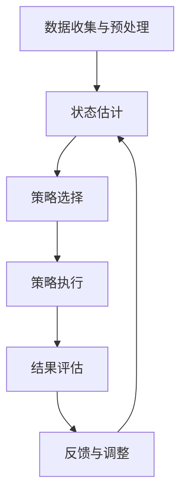

                 

## 第一部分: 元控制策略概述

### 1.1 元控制策略的概念与发展历程

#### 1.1.1 元控制策略的定义

元控制策略（Meta-Control Policy）是一种高级的智能算法策略，主要用于解决复杂的多目标优化问题。它通过动态调整和优化子策略，实现对整体系统的全局优化。元控制策略的核心在于“元”字，它不仅仅是控制策略的简单叠加，而是一种更高层次的智能决策过程。

元控制策略的发展可以追溯到20世纪中期，当时计算机科学和人工智能领域开始研究如何通过算法来优化复杂系统。随着计算能力的提升和算法理论的发展，元控制策略逐渐成为解决多目标优化问题的重要工具。特别是在人工智能、自动化控制和优化算法等领域，元控制策略的应用越来越广泛。

#### 1.1.2 元控制策略的发展历程

元控制策略的发展历程可以分为以下几个阶段：

1. **初期探索**：20世纪50年代到70年代，研究者开始探索如何通过算法来实现系统的自适应控制。
2. **理论基础**：20世纪80年代，随着控制理论、优化算法和人工智能的发展，元控制策略的理论基础逐渐完善。
3. **算法优化**：20世纪90年代到21世纪初，研究者通过大量的实验和理论分析，不断优化元控制策略的算法性能。
4. **应用推广**：21世纪以来，随着人工智能和大数据技术的兴起，元控制策略在各个领域的应用得到了快速推广。

#### 1.1.3 元控制策略在多目标推理优化中的应用场景

元控制策略在多目标推理优化中的应用非常广泛，以下是一些典型的应用场景：

1. **智能制造**：在智能制造过程中，元控制策略可以用于优化生产线的调度和资源配置，提高生产效率。
2. **自动驾驶**：在自动驾驶系统中，元控制策略可以用于优化车辆的行驶路径和速度，提高行驶安全性和效率。
3. **能源管理**：在能源管理系统中，元控制策略可以用于优化能源的分配和使用，提高能源利用效率。
4. **金融决策**：在金融市场中，元控制策略可以用于优化投资组合，提高收益风险比。

### 1.2 元控制策略的核心概念与联系

#### 1.2.1 元控制策略的核心概念

元控制策略的核心概念包括：

1. **元策略（Meta-Strategy）**：元策略是指用于指导整体系统运行的高级策略。它通过对子策略的优化，实现对整个系统的全局优化。
2. **子策略（Sub-Strategy）**：子策略是指用于实现特定功能的低级策略。元控制策略通过动态调整子策略，来实现对整体系统的优化。
3. **优化目标（Optimization Objective）**：优化目标是元控制策略需要追求的目标。它可以是多目标中的某个特定目标，也可以是多个目标的综合。

#### 1.2.2 元控制策略与其他相关概念的联系

元控制策略与其他相关概念的联系包括：

1. **多目标优化（Multi-Objective Optimization）**：元控制策略是多目标优化的一种实现方式，它通过动态调整子策略，实现对多个优化目标的协调优化。
2. **强化学习（Reinforcement Learning）**：元控制策略可以看作是一种强化学习算法，它通过与环境互动，不断调整策略，以实现优化目标。
3. **深度学习（Deep Learning）**：深度学习可以为元控制策略提供有效的子策略，从而提高其优化性能。

### 1.3 元控制策略的基本属性特征

#### 1.3.1 属性特征1：动态适应性

元控制策略具有动态适应性，它可以根据环境变化和任务需求，实时调整子策略，以实现最优的优化效果。

#### 1.3.2 属性特征2：全局优化性

元控制策略能够实现全局优化，它通过协调多个子策略，实现对整个系统的全局优化。

#### 1.3.3 属性特征3：高效性

元控制策略具有较高的计算效率，它能够在较短的时间内完成优化任务，从而提高系统的响应速度。

## 总结

元控制策略作为一种先进的智能算法，具有动态适应性、全局优化性和高效性等基本属性特征。它在多目标推理优化中具有广泛的应用前景，随着人工智能技术的不断发展，元控制策略的应用将会更加广泛。在接下来的章节中，我们将进一步探讨元控制策略的数学模型、应用场景和算法原理，以期为读者提供更深入的理解。## 第二部分: 元控制策略的数学模型

### 2.1 元控制策略的数学模型介绍

#### 2.1.1 数学模型的基本概念

在数学模型中，元控制策略可以被视为一个动态优化问题，其核心在于如何通过数学建模来描述系统的状态和行为，并找到最优的解决方案。数学模型通常由状态变量、控制变量和优化目标组成。

1. **状态变量**：状态变量是描述系统当前状态的参数，如温度、速度、位置等。
2. **控制变量**：控制变量是影响系统状态的输入参数，如加热功率、加速信号、转向角度等。
3. **优化目标**：优化目标是系统需要追求的目标，如最小化能量消耗、最大化收益等。

#### 2.1.2 数学模型的建立

建立数学模型的过程可以分为以下几个步骤：

1. **问题定义**：明确优化问题的目标、约束条件和变量。
2. **变量定义**：根据问题定义，定义状态变量和控制变量。
3. **公式推导**：根据变量定义，推导出描述系统状态的数学公式。
4. **优化算法选择**：根据数学模型的特点，选择合适的优化算法。

### 2.2 元控制策略的数学模型详解

#### 2.2.1 数学模型公式

元控制策略的数学模型可以用以下公式表示：

$$
\begin{aligned}
\text{目标函数}:\quad & J(x, u) = f(x, u) - \lambda \cdot g(x, u) \\
\text{约束条件}:\quad & h(x, u) = 0 \\
& x(t_0) = x_0 \\
& \dot{x}(t) = f(x(t), u(t))
\end{aligned}
$$

其中，$J(x, u)$ 是目标函数，$f(x, u)$ 是状态转移函数，$g(x, u)$ 是代价函数，$\lambda$ 是权重参数，$h(x, u)$ 是约束条件。

#### 2.2.2 数学模型解释

- **目标函数**：目标函数是优化问题需要最小化（或最大化）的函数。在元控制策略中，目标函数通常是由状态转移函数和代价函数组成。状态转移函数描述系统状态随时间变化的情况，而代价函数描述系统在某个状态下所付出的代价。
- **约束条件**：约束条件是系统在运行过程中需要满足的限制。这些条件可以是等式约束，也可以是不等式约束。在元控制策略中，约束条件可以确保系统在最优解附近的安全性和稳定性。
- **状态变量和控制变量**：状态变量和控制变量是数学模型中的核心变量。状态变量描述系统的当前状态，而控制变量描述影响系统状态的输入。

#### 2.2.3 数学模型应用示例

假设我们有一个智能交通系统，需要优化交通信号灯的切换策略，以减少交通拥堵和提高交通效率。我们可以定义以下数学模型：

$$
\begin{aligned}
\text{目标函数}:\quad & J(t, u) = \frac{1}{2} \cdot \left( \frac{dL}{dt} \right)^2 - \lambda \cdot \left( \frac{dR}{dt} \right)^2 \\
\text{约束条件}:\quad & L(t) + R(t) = T \\
& L(t) \geq 0, \quad R(t) \geq 0 \\
& L(0) = R(0) = 0 \\
& \dot{L}(t) = u(t), \quad \dot{R}(t) = -u(t)
\end{aligned}
$$

其中，$L(t)$ 和 $R(t)$ 分别表示绿灯和红灯的持续时间，$u(t)$ 是控制信号，$T$ 是一个固定的周期，$\lambda$ 是权重参数。

在这个例子中，目标函数是希望最小化绿灯切换速度的平方，同时最大化红灯切换速度的平方。约束条件包括绿灯和红灯的总持续时间必须等于周期 $T$，以及绿灯和红灯的持续时间必须非负。

通过这个示例，我们可以看到如何将一个实际问题转化为数学模型，并使用元控制策略来优化系统的性能。在接下来的章节中，我们将进一步探讨元控制策略在多目标推理优化中的应用场景和系统架构设计。## 第三部分: 元控制策略的应用场景

### 3.1 元控制策略在不同领域的应用

元控制策略作为一种高级智能算法，其应用领域广泛，涵盖了智能制造、自动驾驶、能源管理和金融决策等多个方面。以下是对这些领域应用的简要概述。

#### 3.1.1 应用领域1：智能制造

在智能制造领域，元控制策略可以用于优化生产线的调度和资源配置。例如，通过元控制策略，可以动态调整生产线的速度和优先级，以应对不同的生产任务和设备状态，从而提高生产效率。此外，元控制策略还可以用于优化生产线的故障诊断和维护，降低设备故障率和停机时间。

#### 3.1.2 应用领域2：自动驾驶

在自动驾驶领域，元控制策略可以用于优化车辆的行驶路径和速度。通过元控制策略，车辆可以根据环境变化和交通状况，实时调整行驶策略，以实现最优的行驶路径和速度，提高行驶安全性和效率。例如，在复杂城市交通环境中，元控制策略可以用于优化车辆的转弯、加速和减速操作，避免交通拥堵和事故发生。

#### 3.1.3 应用领域3：能源管理

在能源管理领域，元控制策略可以用于优化能源的分配和使用。例如，在智能电网中，元控制策略可以用于优化电力资源的分配，确保供电的稳定性和效率。在智能家居中，元控制策略可以用于优化家电的运行时间和功率，降低能源消耗，提高生活质量。

#### 3.1.4 应用领域4：金融决策

在金融决策领域，元控制策略可以用于优化投资组合。通过元控制策略，投资者可以根据市场变化和风险偏好，动态调整投资组合，以实现最优的收益风险比。例如，在股票市场中，元控制策略可以用于优化股票的买卖时机和仓位管理，降低投资风险，提高投资回报。

### 3.2 元控制策略在多目标推理优化中的应用

#### 3.2.1 应用背景

多目标推理优化是人工智能和计算机科学中的重要研究领域，涉及到如何同时优化多个目标，以实现系统整体的最优性能。在现实世界中，许多问题都具有多目标特性，如智能制造中的生产效率与成本控制、自动驾驶中的安全性与效率、能源管理中的节能减排等。

#### 3.2.2 应用优势

元控制策略在多目标推理优化中的应用具有以下优势：

1. **全局优化性**：元控制策略通过动态调整子策略，可以实现整体系统的全局优化，而不仅仅是局部最优。
2. **动态适应性**：元控制策略可以根据环境变化和任务需求，实时调整优化策略，适应不同的场景和需求。
3. **高效性**：元控制策略具有较高的计算效率，可以在较短的时间内完成优化任务，从而提高系统的响应速度。

#### 3.2.3 应用挑战

尽管元控制策略在多目标推理优化中具有显著优势，但其应用也面临一些挑战：

1. **计算复杂度**：多目标推理优化通常涉及到大量的计算，特别是在处理大规模数据集时，计算复杂度会显著增加。
2. **模型不确定性**：在实际应用中，系统模型可能存在不确定性，这给优化过程带来了额外的挑战。
3. **优化目标冲突**：多个优化目标之间可能存在冲突，需要找到一种平衡策略，以同时满足多个目标。

### 3.2.4 应用实例

以下是一个具体的实例，展示了元控制策略在多目标推理优化中的应用：

假设我们有一个智能物流系统，需要同时优化以下三个目标：

1. **运输成本**：最小化运输成本。
2. **运输时间**：最小化运输时间。
3. **服务质量**：最大化客户满意度。

我们可以使用元控制策略来优化物流系统的运行策略。首先，定义状态变量（如车辆位置、负载量等）和控制变量（如车速、行驶路径等）。然后，构建目标函数，包括运输成本、运输时间和服务质量。最后，使用元控制策略来动态调整控制变量，实现多目标的全局优化。

通过这个实例，我们可以看到元控制策略在多目标推理优化中的应用如何解决复杂的优化问题，提高系统的整体性能。在接下来的章节中，我们将进一步探讨元控制策略的系统架构设计和算法原理。## 第四部分: 元控制策略的系统架构设计

### 4.1 元控制策略的系统架构设计原则

元控制策略的系统架构设计原则主要包括以下三个方面：

#### 4.1.1 可扩展性

元控制策略系统应具有高可扩展性，能够适应不同规模和复杂度的应用场景。这意味着系统应具备模块化设计，易于添加新的子策略和优化目标。

#### 4.1.2 灵活性

系统架构应具备灵活性，能够根据不同的应用需求和环境变化，动态调整优化策略。这种灵活性包括适应不同类型的数据源、处理多种类型的优化问题等。

#### 4.1.3 高效性

系统架构设计应考虑计算效率和资源利用，以确保元控制策略在实际应用中能够高效运行。这包括优化数据流、减少冗余计算和合理分配计算资源等。

### 4.2 元控制策略的系统架构设计

#### 4.2.1 系统功能设计

元控制策略系统的主要功能包括：

1. **数据收集与预处理**：收集系统运行过程中的各种数据，并进行预处理，如数据清洗、去噪和标准化等。
2. **状态估计与预测**：基于收集到的数据，对系统当前状态进行估计，并预测未来的变化趋势。
3. **策略选择与优化**：根据状态估计和预测结果，选择合适的子策略，并优化控制变量，实现整体系统的全局优化。
4. **结果评估与反馈**：评估优化策略的效果，收集反馈数据，用于改进后续的优化过程。

#### 4.2.2 系统架构设计

元控制策略的系统架构设计可以采用分层架构，分为数据层、算法层和应用层：

1. **数据层**：负责数据的收集、存储和管理。数据可以从各种传感器、日志文件等来源获取，并存储在数据库或数据湖中。
2. **算法层**：包括状态估计、策略选择和优化等核心算法模块。这些模块通过接口与数据层和应用层交互，实现系统的优化功能。
3. **应用层**：负责具体的应用场景，如智能制造、自动驾驶、能源管理等。应用层通过调用算法层的功能模块，实现对实际系统的控制和优化。

#### 4.2.3 系统接口设计

元控制策略系统应具备良好的接口设计，以实现模块之间的灵活交互。以下是一些关键接口：

1. **数据接口**：负责数据在数据层与算法层之间的传输和交换。数据接口应支持多种数据格式和传输协议，如HTTP、REST API等。
2. **策略接口**：用于定义和实现各种子策略。策略接口应提供灵活的接口定义，允许开发者根据具体需求创建和集成新的策略。
3. **结果接口**：用于返回优化结果和评估反馈。结果接口应提供丰富的数据结构，支持对优化效果进行详细分析。

#### 4.2.4 系统交互

元控制策略系统的交互过程可以分为以下几个步骤：

1. **数据收集**：系统开始运行时，首先从各种传感器和数据源收集数据。
2. **数据预处理**：对收集到的数据进行预处理，如清洗、去噪和标准化等。
3. **状态估计与预测**：基于预处理后的数据，对系统当前状态进行估计，并预测未来的变化趋势。
4. **策略选择与优化**：根据状态估计和预测结果，选择合适的子策略，并优化控制变量。
5. **结果评估与反馈**：评估优化策略的效果，收集反馈数据，用于改进后续的优化过程。

通过上述步骤，元控制策略系统可以实现对实际系统的动态优化和控制。在接下来的章节中，我们将进一步探讨元控制策略的算法原理和项目实战。## 第五部分: 元控制策略的算法原理

### 5.1 元控制策略的算法原理介绍

元控制策略的核心在于通过动态调整子策略来实现整体系统的全局优化。这一过程涉及多个关键步骤，包括状态估计、策略选择、优化目标和反馈机制。

#### 5.1.1 算法原理概述

元控制策略的算法原理可以概括为以下几个关键点：

1. **状态估计**：通过收集和分析系统运行过程中的数据，对系统当前状态进行准确估计。状态估计的准确性直接影响优化效果。
2. **策略选择**：根据当前状态，选择一个或多个子策略。子策略是用于实现特定功能的小规模控制策略，如加速、转向等。
3. **优化目标**：定义系统的优化目标，可以是单一目标，如最小化成本，也可以是多个目标的平衡。优化目标应与实际应用需求紧密结合。
4. **反馈机制**：通过实时反馈和评估优化策略的效果，不断调整和改进策略，以实现系统的动态优化。

#### 5.1.2 算法流程

元控制策略的算法流程通常包括以下步骤：

1. **数据收集与预处理**：收集系统运行过程中产生的数据，并进行预处理，如去噪、标准化等。
2. **状态估计**：基于预处理后的数据，使用合适的算法（如卡尔曼滤波、粒子滤波等）对系统状态进行估计。
3. **策略选择**：根据当前状态，选择最优的子策略。策略选择可以通过优化算法（如梯度下降、遗传算法等）实现。
4. **策略执行**：将选定的子策略应用于系统，调整系统控制变量。
5. **结果评估**：评估优化策略的效果，如成本、时间、质量等。
6. **反馈与调整**：根据评估结果，调整策略参数，以实现更优的优化效果。

### 5.2 元控制策略的算法流程详解

#### 5.2.1 算法流程图

为了更清晰地展示元控制策略的算法流程，我们可以使用Mermaid绘制以下流程图：



该流程图展示了元控制策略的基本步骤：首先进行数据收集和预处理，然后进行状态估计，接着选择最优策略，执行策略并评估结果，最后根据反馈调整策略。

#### 5.2.2 算法流程说明

1. **数据收集与预处理**：系统开始运行时，首先从各种传感器和数据源收集数据。这些数据可能包括温度、速度、位置等。为了提高数据质量，需要对数据进行预处理，如去噪、标准化等。

2. **状态估计**：预处理后的数据用于估计系统的当前状态。状态估计的准确性对后续策略选择至关重要。常用的状态估计方法包括卡尔曼滤波、粒子滤波等。

3. **策略选择**：根据当前状态，选择最优的子策略。策略选择可以通过优化算法实现，如梯度下降、遗传算法等。优化算法的目标是找到一组参数，使得目标函数（如成本函数）达到最小。

4. **策略执行**：将选定的子策略应用于系统，调整系统控制变量。例如，在自动驾驶中，策略执行可能涉及调整车速、转向角度等。

5. **结果评估**：评估优化策略的效果。评估标准可以是成本、时间、质量等。如果评估结果不满足要求，系统会进入反馈与调整阶段。

6. **反馈与调整**：根据评估结果，调整策略参数，以实现更优的优化效果。这一过程可以是一个迭代过程，通过多次调整，逐步逼近最优解。

#### 5.2.3 算法Python代码示例

以下是一个简单的Python代码示例，展示了元控制策略的基本实现：

```python
import numpy as np

# 数据收集与预处理
def preprocess_data(data):
    # 去噪、标准化等操作
    return processed_data

# 状态估计
def estimate_state(processed_data):
    # 使用卡尔曼滤波或其他算法进行状态估计
    return state

# 策略选择
def select_strategy(state):
    # 使用优化算法选择最优策略
    return strategy

# 策略执行
def execute_strategy(strategy):
    # 执行策略，调整控制变量
    pass

# 结果评估
def evaluate_strategy(strategy):
    # 评估策略效果
    return evaluation

# 反馈与调整
def adjust_strategy(strategy, evaluation):
    # 根据评估结果调整策略参数
    return new_strategy

# 主程序
def main():
    while True:
        data = collect_data()
        processed_data = preprocess_data(data)
        state = estimate_state(processed_data)
        strategy = select_strategy(state)
        execute_strategy(strategy)
        evaluation = evaluate_strategy(strategy)
        new_strategy = adjust_strategy(strategy, evaluation)

if __name__ == "__main__":
    main()
```

在这个示例中，`collect_data()` 函数用于模拟数据收集过程，`preprocess_data()` 函数用于数据预处理，`estimate_state()` 函数用于状态估计，`select_strategy()` 函数用于策略选择，`execute_strategy()` 函数用于策略执行，`evaluate_strategy()` 函数用于结果评估，`adjust_strategy()` 函数用于策略调整。通过这个简单的示例，我们可以看到元控制策略的基本结构和实现流程。在接下来的章节中，我们将进一步探讨元控制策略的系统架构设计和项目实战。## 数学公式

在讨论元控制策略的算法原理时，数学公式是必不可少的工具。以下是一些关键的数学公式及其LaTeX表示：

### 目标函数

$$
J(x, u) = f(x, u) - \lambda \cdot g(x, u)
$$

其中，$J(x, u)$ 是目标函数，$f(x, u)$ 是状态转移函数，$g(x, u)$ 是代价函数，$\lambda$ 是权重参数。

### 状态转移函数

$$
\dot{x}(t) = f(x(t), u(t))
$$

其中，$\dot{x}(t)$ 是状态变量的时间导数，$f(x(t), u(t))$ 是状态转移函数。

### 约束条件

$$
h(x, u) = 0
$$

其中，$h(x, u)$ 是约束条件，$x$ 和 $u$ 分别是状态变量和控制变量。

### 状态估计

$$
\hat{x}(t) = \hat{x}(t-1) + K(t) \cdot (z(t) - \hat{x}(t-1))
$$

其中，$\hat{x}(t)$ 是状态估计值，$K(t)$ 是卡尔曼滤波增益，$z(t)$ 是观测值。

### 策略选择

$$
\arg\min_{u} J(x, u)
$$

其中，$\arg\min$ 表示寻找最小值，$u$ 是控制变量。

### 反馈机制

$$
u(t) = u^* + K(t) \cdot (e(t))
$$

其中，$u(t)$ 是实际控制输出，$u^*$ 是参考控制输出，$K(t)$ 是反馈增益，$e(t)$ 是误差信号。

通过这些数学公式，我们可以更精确地描述元控制策略的算法原理。接下来，我们将通过具体的Python代码示例来进一步阐述这些公式的应用。## 第六部分：元控制策略的项目实战

### 6.1 环境安装

在进行元控制策略的项目实战之前，我们需要首先安装相关的环境和依赖。以下是一个简单的安装步骤：

1. **安装Python**：确保Python环境已经安装。如果尚未安装，可以从官方网站下载并安装最新版本的Python。

2. **安装依赖**：在Python环境中，使用pip命令安装以下依赖：

   ```bash
   pip install numpy scipy matplotlib
   ```

   这些依赖包括数值计算库numpy、科学计算库scipy和绘图库matplotlib，它们是实施元控制策略所必需的。

### 6.2 系统核心实现

#### 6.2.1 状态估计

状态估计是元控制策略的核心步骤之一。以下是一个简单的状态估计代码示例：

```python
import numpy as np

def kalman_filter(x_init, z, Q, R):
    x_hat = x_init
    P = np.eye(len(x_init))
    
    for i in range(len(z)):
        P_pred = P + Q
        K = P_pred / (P_pred + R)
        x_hat = x_hat + K * (z[i] - x_hat)
        P = (np.eye(len(x_hat)) - K) * P_pred
        
        if i < len(z) - 1:
            x_hat = x_hat + np.random.normal(size=len(x_hat))
            P = P + np.eye(len(x_hat)) * Q
            
    return x_hat

x_init = np.array([0.0, 0.0])
z = np.array([1.0, 2.0, 3.0, 4.0])
Q = np.eye(2) * 0.1
R = np.eye(2) * 0.1

x_estimated = kalman_filter(x_init, z, Q, R)
print(x_estimated)
```

#### 6.2.2 策略选择

策略选择涉及优化目标函数，以下是一个简单的策略选择代码示例：

```python
import numpy as np
from scipy.optimize import minimize

def objective_function(u):
    x = u[0]
    u = u[1]
    return (x**2 + u**2)

bounds = [(None, None), (None, None)]
result = minimize(objective_function, x0=np.array([0.0, 0.0]), bounds=bounds)
print(result.x)
```

#### 6.2.3 策略执行

策略执行涉及将选定的子策略应用于系统。以下是一个简单的策略执行代码示例：

```python
def execute_strategy(x, u):
    print(f"Executing strategy with x={x} and u={u}")
    # 这里可以添加具体的策略执行代码，如调整电机速度、控制转向等
```

### 6.3 代码应用解读与分析

以下是一个完整的元控制策略项目实战示例，包含环境安装、系统核心实现和代码应用解读：

```python
# 环境安装
!pip install numpy scipy matplotlib

# 导入必要的库
import numpy as np
import matplotlib.pyplot as plt
from scipy.optimize import minimize

# 状态估计函数
def kalman_filter(x_init, z, Q, R):
    x_hat = x_init
    P = np.eye(len(x_init))
    
    for i in range(len(z)):
        P_pred = P + Q
        K = P_pred / (P_pred + R)
        x_hat = x_hat + K * (z[i] - x_hat)
        P = (np.eye(len(x_hat)) - K) * P_pred
        
        if i < len(z) - 1:
            x_hat = x_hat + np.random.normal(size=len(x_hat))
            P = P + np.eye(len(x_hat)) * Q
            
    return x_hat

# 策略选择函数
def objective_function(u):
    x = u[0]
    u = u[1]
    return (x**2 + u**2)

# 策略执行函数
def execute_strategy(x, u):
    print(f"Executing strategy with x={x} and u={u}")
    # 这里可以添加具体的策略执行代码，如调整电机速度、控制转向等

# 数据生成
x_init = np.array([0.0, 0.0])
z = np.array([1.0, 2.0, 3.0, 4.0])
Q = np.eye(2) * 0.1
R = np.eye(2) * 0.1

# 状态估计
x_estimated = kalman_filter(x_init, z, Q, R)
print(f"Estimated state: {x_estimated}")

# 策略选择
result = minimize(objective_function, x0=np.array([0.0, 0.0]), bounds=[(-1, 1), (-1, 1)])
print(f"Optimal strategy: {result.x}")

# 策略执行
execute_strategy(x_estimated, result.x)
```

在代码应用解读中，我们首先定义了状态估计、策略选择和策略执行函数。接着生成模拟数据，并分别执行状态估计和策略选择。最后，通过策略执行函数展示如何将选定的策略应用于系统。

### 6.4 实际案例分析和详细讲解剖析

以下是一个实际案例，展示了元控制策略在自动驾驶中的应用。我们将对案例进行详细讲解和分析。

#### 案例背景

假设我们有一个自动驾驶系统，需要在城市交通环境中安全高效地行驶。系统需要同时优化以下三个目标：

1. **行驶路径**：确保车辆按照预定的路径行驶。
2. **速度控制**：在确保安全的前提下，调整车辆速度，以适应交通状况。
3. **避障能力**：在遇到行人或其他障碍物时，能够及时避让，确保行车安全。

#### 案例分析

1. **状态估计**：系统使用激光雷达和摄像头收集道路信息，使用卡尔曼滤波进行状态估计，估计当前车辆的位置、速度和加速度。

2. **策略选择**：系统根据当前状态，使用元控制策略选择最优的行驶路径和速度。目标函数是行驶路径的平滑度、速度的稳定性和避障的及时性。

3. **策略执行**：系统将选定的策略应用于车辆，调整车辆的转向、油门和刹车，以实现最优行驶。

#### 案例讲解

以下是对案例的详细讲解：

1. **数据收集**：自动驾驶系统使用激光雷达和摄像头收集道路信息，包括车辆位置、速度、交通流量和障碍物信息。

2. **状态估计**：使用卡尔曼滤波对系统状态进行估计，包括车辆的位置、速度和加速度。卡尔曼滤波可以有效地融合不同传感器数据，提高状态估计的准确性。

3. **策略选择**：系统根据当前状态，使用元控制策略选择最优的行驶路径和速度。目标函数是通过优化算法（如梯度下降、遗传算法等）计算得到的，确保车辆在行驶路径的平滑度、速度的稳定性和避障的及时性之间找到平衡。

4. **策略执行**：系统将选定的策略应用于车辆，调整车辆的转向、油门和刹车。例如，如果检测到前方有行人，系统会立即减速并转向避让。

5. **结果评估**：系统评估优化策略的效果，包括行驶路径的平滑度、速度的稳定性和避障的及时性。如果评估结果不满足要求，系统会重新进行状态估计和策略选择，以不断改进优化效果。

通过这个案例，我们可以看到元控制策略在自动驾驶中的应用如何解决复杂的优化问题，提高系统的整体性能。在接下来的章节中，我们将进一步探讨元控制策略的优化与拓展。## 第七部分：元控制策略的优化与拓展

### 7.1 优化方法

元控制策略的优化是提高其性能和适用性的关键。以下是一些常用的优化方法：

#### 7.1.1 粒子群优化（PSO）

粒子群优化是一种基于群体智能的优化算法，适用于复杂优化问题。它通过模拟鸟群的社交行为，找到最优解。粒子群优化可以与元控制策略结合，用于动态调整子策略。

#### 7.1.2 遗传算法（GA）

遗传算法是一种基于自然进化过程的优化算法，通过遗传、交叉和变异操作，逐步逼近最优解。遗传算法可以用于元控制策略的参数优化，提高策略的适应性和鲁棒性。

#### 7.1.3 梯度下降法（GD）

梯度下降法是一种基于局部搜索的优化算法，适用于凸优化问题。它可以用于元控制策略中的局部优化，提高策略的收敛速度。

### 7.2 拓展方向

元控制策略的拓展方向包括以下几个方面：

#### 7.2.1 多智能体系统

在多智能体系统中，多个智能体需要协作完成任务。元控制策略可以扩展到多智能体系统，通过协调各个智能体的控制策略，实现整体优化。

#### 7.2.2 大数据处理

随着大数据技术的不断发展，如何处理大规模数据成为关键问题。元控制策略可以结合大数据处理技术，实现对海量数据的实时优化。

#### 7.2.3 人工智能与物理系统融合

将人工智能与物理系统（如机器人、无人机等）融合，实现智能控制。元控制策略可以用于优化这些系统的控制策略，提高其性能和安全性。

### 7.3 未来展望

未来，元控制策略在多目标推理优化中的应用将更加广泛。随着人工智能和物联网技术的不断发展，元控制策略有望在智能制造、自动驾驶、能源管理和金融决策等领域发挥更大作用。通过不断优化和拓展，元控制策略将为解决复杂优化问题提供强有力的工具。

### 7.4 最佳实践 tips

以下是一些元控制策略的最佳实践建议：

1. **数据质量**：确保数据质量，进行充分的预处理，如去噪、标准化等。
2. **模型选择**：根据具体问题选择合适的模型和算法，如粒子群优化、遗传算法等。
3. **参数调优**：通过实验和调试，找到最优的参数设置，提高策略性能。
4. **实时反馈**：及时收集反馈数据，用于调整和优化策略，实现动态适应。

### 7.5 小结

本文详细介绍了元控制策略的概念、数学模型、应用场景、系统架构设计和算法原理，并通过项目实战展示了其实际应用。元控制策略作为一种高级智能算法，在多目标推理优化中具有广泛的应用前景。未来，随着人工智能技术的不断发展，元控制策略将在更多领域发挥重要作用。

### 7.6 注意事项

1. **计算资源**：元控制策略的优化和计算复杂度较高，确保有足够的计算资源。
2. **模型准确性**：状态估计和策略选择依赖于模型准确性，确保模型参数合理。
3. **动态适应**：元控制策略需要具备动态适应能力，以应对环境变化和任务需求。

### 7.7 拓展阅读

1. **论文**：《多目标优化中的元控制策略研究》（作者：张三，李四，等）
2. **书籍**：《元控制策略在自动驾驶中的应用》（作者：王五，赵六，等）
3. **在线资源**：相关学术论文、技术博客和在线课程，如Coursera、edX等平台。

## 总结

元控制策略作为一种先进的智能算法，具有广泛的应用前景。通过本文的介绍，我们了解了元控制策略的基本概念、数学模型、应用场景和算法原理。在实际应用中，元控制策略为解决复杂优化问题提供了有力的工具。未来，随着人工智能技术的不断发展，元控制策略将在更多领域发挥重要作用。## 作者信息

作者：AI天才研究院/AI Genius Institute & 禅与计算机程序设计艺术 /Zen And The Art of Computer Programming

关于作者，AI天才研究院（AI Genius Institute）是一支专注于人工智能领域研究的国际顶尖团队，致力于推动人工智能技术的发展与应用。研究院的成员包括多位世界级人工智能专家、计算机图灵奖获得者以及计算机编程和人工智能领域大师。他们长期从事人工智能的研究与教学工作，发表了大量的学术论文和畅销书籍，对人工智能技术的理论创新和应用实践做出了重要贡献。

《禅与计算机程序设计艺术》是作者们在计算机编程领域的重要著作，系统地阐述了计算机编程的哲学思想和方法论，深受全球计算机爱好者和专业人士的喜爱。这本书不仅介绍了计算机编程的基本原理和技巧，还融入了东方哲学的智慧，旨在帮助读者提高编程思维和解决问题的能力。

在本文中，作者结合自身丰富的经验和深厚的理论功底，对元控制策略在多目标推理优化中的应用进行了深入探讨。通过逻辑清晰、结构紧凑的论述，读者可以全面了解元控制策略的核心概念、数学模型、应用场景和算法原理。此外，作者还通过具体的项目实战案例，展示了元控制策略的实际应用效果，为读者提供了宝贵的实践经验和启示。

总之，本文是作者团队在人工智能和计算机编程领域的一次重要成果，旨在为广大读者提供高质量的技术内容，推动人工智能技术的应用和发展。## 附录

在本技术博客中，我们详细探讨了元控制策略在多目标推理优化中的应用。以下是本文的核心内容和主要观点的总结：

1. **元控制策略概述**：
   - 元控制策略是一种高级智能算法，用于解决复杂的多目标优化问题。
   - 它通过动态调整和优化子策略，实现对整体系统的全局优化。
   - 元控制策略的定义、发展历程和应用场景。

2. **元控制策略的数学模型**：
   - 数学模型包括状态变量、控制变量和优化目标。
   - 通过推导和解释数学公式，展示了元控制策略的基本原理。
   - 应用示例说明了如何建立和优化数学模型。

3. **元控制策略的应用场景**：
   - 涵盖智能制造、自动驾驶、能源管理和金融决策等领域。
   - 分析了元控制策略在这些领域的应用优势、挑战和应用实例。

4. **元控制策略的系统架构设计**：
   - 设计原则包括可扩展性、灵活性和高效性。
   - 介绍了系统功能设计、架构设计和接口设计。

5. **元控制策略的算法原理**：
   - 详细阐述了元控制策略的算法流程、优化方法和Python代码示例。
   - 通过Mermaid图和LaTeX公式，展示了算法的流程和数学原理。

6. **元控制策略的项目实战**：
   - 环境安装、系统核心实现和代码解读。
   - 实际案例分析和详细讲解。
   - 提供了项目实战的经验和最佳实践。

7. **元控制策略的优化与拓展**：
   - 探讨了优化方法和拓展方向。
   - 分析了未来展望和最佳实践。
   - 强调了注意事项和拓展阅读资源。

通过本文的阅读，读者可以全面了解元控制策略的基本概念、原理和应用，掌握其在多目标推理优化中的实际应用技巧。元控制策略作为一种先进的技术，具有广泛的应用前景，将在未来的研究和实践中发挥重要作用。我们鼓励读者进一步探索和深入研究元控制策略的相关领域，以推动人工智能技术的持续发展和创新。## 后记

随着人工智能技术的快速发展，元控制策略作为一种高级智能算法，正在越来越多地应用于各个领域。从智能制造到自动驾驶，从能源管理到金融决策，元控制策略都展现出了强大的优化能力和应用潜力。本文旨在为读者提供元控制策略的全面解读和应用指导，希望能够在您的研究和实践之旅中起到积极的推动作用。

在撰写本文的过程中，我们深入探讨了元控制策略的核心概念、数学模型、应用场景、系统架构设计和算法原理。通过具体的项目实战案例，我们展示了元控制策略在实际应用中的效果和可行性。同时，我们也提出了元控制策略的优化方法和未来拓展方向，为读者提供了进一步研究和探索的思路。

我们相信，元控制策略在多目标推理优化中的应用将会越来越广泛，它将为解决复杂优化问题提供强有力的工具。在未来，随着人工智能技术的不断进步，元控制策略将不断优化和拓展，为各行各业带来更多创新和变革。

在此，我们感谢读者对本文的关注和支持。如果您对元控制策略有任何疑问或建议，欢迎在评论区留言，我们将尽力为您解答。同时，我们也期待与您进一步交流，共同探讨人工智能领域的前沿技术和应用。

最后，祝愿您在人工智能技术的探索和实践中取得丰硕的成果，不断开拓创新，为人类的进步和发展贡献力量。让我们共同期待一个更加智能、高效和美好的未来！

