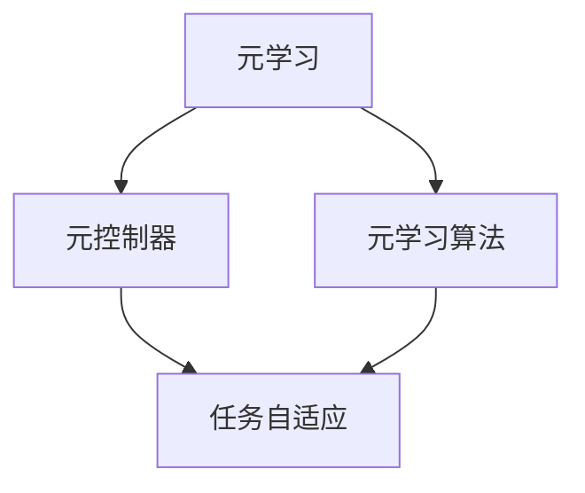
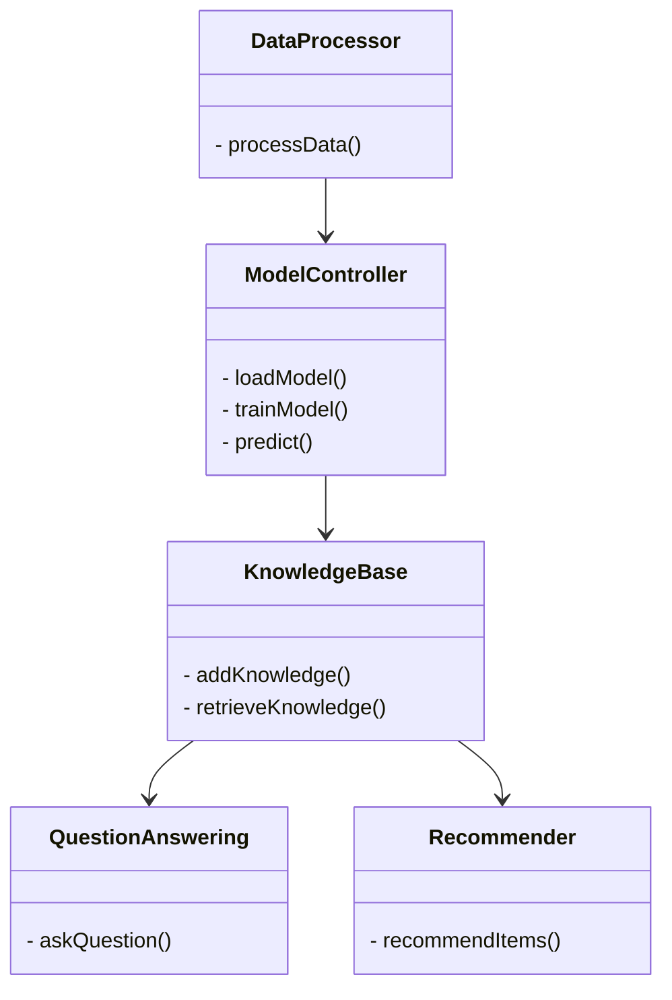
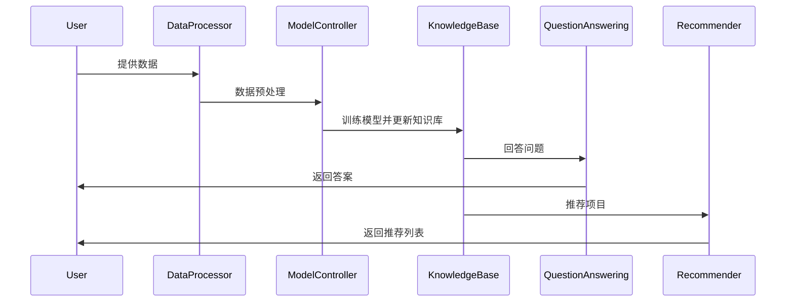
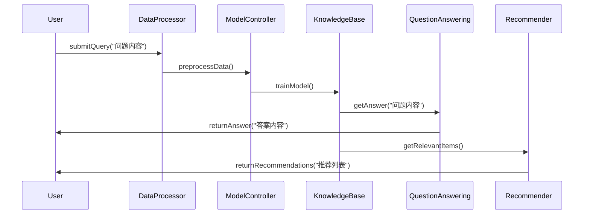

                 

###  元控制策略在开放域推理中的应用

元控制策略在开放域推理中的应用

随着人工智能（AI）技术的快速发展，开放域推理已成为许多应用领域的关键需求。然而，开放域推理面临着复杂性和不确定性，使得传统AI方法难以胜任。元控制策略作为一种新兴的控制方法，在提高模型泛化能力和适应性方面展现了巨大的潜力。本文将深入探讨元控制策略在开放域推理中的应用，从背景介绍、核心概念与联系、算法原理讲解、系统分析与架构设计方案、项目实战等多个角度展开分析。

### 第一部分：背景介绍

#### 1.1 问题背景

开放域推理涉及对大量、多样化的信息进行理解和推理，通常需要模型具备高度的泛化能力。然而，传统的AI方法，如基于规则的系统、传统的机器学习模型和深度学习模型，往往在处理开放域问题时存在以下局限性：

1. **数据依赖性高**：开放域推理需要大量的训练数据来训练模型，然而获取高质量、多样性的数据非常困难。
2. **适应性差**：传统的AI模型在特定领域表现出色，但在其他领域可能无法适应，缺乏通用性。
3. **处理复杂性**：开放域推理涉及多模态数据、不确定性和动态性，使得模型难以同时处理这些复杂因素。

为了解决这些问题，研究人员开始探索元控制策略，通过元学习和任务迁移等方法，提高模型在开放域推理中的性能。

#### 1.2 问题描述

开放域推理的任务通常包括以下三个方面：

1. **知识获取**：从大量的、未标注的数据中提取有价值的信息和知识。
2. **知识推理**：基于已有的知识和信息，进行逻辑推理和决策。
3. **知识应用**：将推理结果应用于实际场景，如问答系统、智能推荐、智能对话等。

然而，开放域推理面临着以下几个挑战：

1. **数据多样性**：开放域推理需要处理来自不同领域、不同模态的数据，数据的多样性增加了模型的复杂性。
2. **不确定性处理**：在开放域推理中，数据存在噪声、错误和不确定性，如何有效地处理这些不确定性是一个关键问题。
3. **实时性要求**：许多开放域推理应用对实时性有较高要求，如何提高推理的实时性是一个重要的挑战。

#### 1.3 问题解决

元控制策略通过以下几个核心思想来解决开放域推理中的问题：

1. **元学习**：元学习使模型能够在多个任务中共享知识和经验，从而提高模型的泛化能力。
2. **任务迁移**：通过任务迁移，将已学习的知识迁移到新的任务中，减少对新任务的依赖。
3. **自适应调整**：元控制策略可以根据任务的变化，动态调整模型参数，提高模型的适应能力。

#### 1.4 边界与外延

元控制策略在开放域推理中的应用边界和特点包括：

1. **领域适应性**：元控制策略可以适应不同的领域，从而提高模型在不同领域的应用效果。
2. **实时性**：元控制策略可以实时调整模型参数，提高推理的实时性。
3. **高效性**：通过任务迁移和自适应调整，元控制策略可以显著提高推理的效率。

#### 1.5 概念结构与核心要素组成

元控制策略的核心概念和要素包括：

1. **元学习**：通过学习多个任务中的共同特征，提高模型在未知任务上的泛化能力。
2. **任务迁移**：将已学习的知识迁移到新的任务中，减少对新任务的依赖。
3. **自适应调整**：根据任务的变化，动态调整模型参数，提高模型的适应能力。

通过以上概念和要素的有机结合，元控制策略在开放域推理中展现出强大的应用潜力。在后续章节中，本书将详细探讨元控制策略的原理、实现和应用，为读者提供全面、深入的解读。

### 第二部分：核心概念与联系

#### 2.1 元控制策略原理

元控制策略是一种基于元学习的控制方法，它通过学习多个任务中的共同特征，提高模型在未知任务上的泛化能力。具体来说，元控制策略包括以下几个关键组成部分：

1. **元学习（Meta-Learning）**：
   - **定义**：元学习是一种学习如何学习的方法，它通过训练多个任务，提取任务间的共性，从而提高模型对新任务的适应能力。
   - **原理**：元学习利用了迁移学习（Transfer Learning）和强化学习（Reinforcement Learning）的思想，通过在多个任务间共享知识，降低对新任务的依赖，提高模型的泛化能力。

2. **元控制器（Meta-Controller）**：
   - **定义**：元控制器是一种特殊类型的控制器，它能够根据不同任务的特点，动态调整模型参数，实现任务自适应。
   - **原理**：元控制器通过学习多个任务的优化目标，形成一个通用策略，进而对新的任务进行优化。

3. **元学习算法（Meta-Learning Algorithms）**：
   - **定义**：元学习算法是一类专门用于元学习的算法，它们通过优化模型在不同任务上的表现，提高模型的泛化能力。
   - **原理**：元学习算法通常采用梯度提升（Gradient Ascent）、梯度下降（Gradient Descent）等方法，对模型进行迭代优化，以找到最优的参数设置。

#### 2.2 概念属性特征对比表格

| 特征名称 | 描述 |
| --- | --- |
| 元学习 | 通过学习多个任务中的共同特征，提高模型在未知任务上的泛化能力 |
| 元控制器 | 根据不同任务的特点，动态调整模型参数，实现任务自适应 |
| 元学习算法 | 通过优化模型在不同任务上的表现，提高模型的泛化能力 |

#### 2.3 ER实体关系图架构的Mermaid流程图



通过以上图表，我们可以更清晰地理解元控制策略的概念结构和核心要素。在接下来的章节中，我们将进一步探讨元控制策略的算法原理，并通过具体实例来讲解其在开放域推理中的应用。

### 第三部分：算法原理讲解

#### 3.1 算法原理

元控制策略的核心在于通过元学习来提高模型在开放域推理中的表现。元学习是一种学习如何学习的方法，其目标是从多个任务中提取通用特征，从而提高模型在未知任务上的泛化能力。以下将详细介绍元控制策略的算法原理，并通过具体实例进行说明。

#### 3.1.1 元学习算法

元学习算法可以分为两大类：基于模型的元学习（Model-Based Meta-Learning）和基于优化的元学习（Optimization-Based Meta-Learning）。这里以基于优化的元学习算法——MAML（Model-Agnostic Meta-Learning）为例，介绍其原理。

MAML的目标是找到一个模型参数的初始化方法，使得模型能够快速适应新的任务。其基本思想是：通过在多个任务上训练模型，找到一个初始化参数θ，使得模型在新任务上的表现能够迅速收敛。具体步骤如下：

1. **初始化模型参数θ**：
   - MAML首先随机初始化模型参数θ。

2. **在多个任务上训练模型**：
   - MAML在多个任务上训练模型，每个任务可以看作一个独立的训练过程。
   - 在每个任务上，模型参数θ会经历一个局部优化过程，以最小化损失函数L。

3. **计算平均梯度**：
   - MAML的核心在于计算平均梯度，以找到最优的初始化参数θ。
   - 平均梯度计算公式为：$$ \nabla_{\theta} \sum_{t=1}^{T} L_t(\theta) $$
   - 其中，$L_t(\theta)$表示在第t个任务上模型的损失函数，$T$表示任务的总数。

4. **更新模型参数**：
   - MAML使用平均梯度来更新模型参数θ，以找到一个最优的初始化参数。
   - 更新公式为：$$ \theta_{\text{new}} = \theta - \alpha \nabla_{\theta} \sum_{t=1}^{T} L_t(\theta) $$
   - 其中，α是学习率。

5. **在新任务上测试模型**：
   - 使用更新后的模型参数θ在新任务上进行测试，评估模型的泛化能力。

#### 3.1.2 具体实例

假设我们有两个任务T1和T2，每个任务都有相同的输入特征X和输出标签Y。MAML的目标是找到一个初始化参数θ，使得模型在新任务T3上的表现能够迅速收敛。

1. **初始化模型参数θ**：
   - 首先随机初始化模型参数θ。

2. **在T1和T2上训练模型**：
   - 在任务T1上，模型参数θ会经历一个局部优化过程，最小化损失函数L1。
   - 在任务T2上，模型参数θ会经历另一个局部优化过程，最小化损失函数L2。

3. **计算平均梯度**：
   - 计算T1和T2上的平均梯度，以找到最优的初始化参数θ。

4. **更新模型参数**：
   - 使用平均梯度更新模型参数θ。

5. **在新任务T3上测试模型**：
   - 使用更新后的模型参数θ在新任务T3上进行测试，评估模型的泛化能力。

#### 3.1.3 数学模型和公式

MAML的核心在于计算平均梯度，以下是其相关的数学模型和公式：

1. **损失函数**：
   - 每个任务的损失函数为：$$ L_t(\theta) = \sum_{i=1}^{N_t} (y_i^t - f_t(\theta; x_i^t))^2 $$
   - 其中，$y_i^t$是第i个样本在第t个任务上的标签，$f_t(\theta; x_i^t)$是模型在第t个任务上对第i个样本的预测。

2. **平均梯度**：
   - 平均梯度计算公式为：$$ \nabla_{\theta} \sum_{t=1}^{T} L_t(\theta) = \sum_{t=1}^{T} \nabla_{\theta} L_t(\theta) $$
   - 其中，$\nabla_{\theta} L_t(\theta)$是第t个任务的梯度。

3. **模型参数更新**：
   - 模型参数更新公式为：$$ \theta_{\text{new}} = \theta - \alpha \nabla_{\theta} \sum_{t=1}^{T} L_t(\theta) $$
   - 其中，α是学习率。

通过以上数学模型和公式，我们可以更清晰地理解MAML的工作原理。在接下来的章节中，我们将进一步探讨元控制策略在开放域推理中的应用，并通过具体实例来展示其实际效果。

### 第四部分：系统分析与架构设计方案

#### 4.1 问题场景介绍

在当今的信息化时代，开放域推理在智能问答、智能推荐、自然语言处理等领域的应用越来越广泛。然而，随着数据规模的不断扩大和问题复杂性的增加，传统的方法已经难以满足实际需求。为了提高推理系统的性能和适应性，我们需要设计一个高效、灵活的开放域推理系统。

#### 4.2 项目介绍

本项目旨在构建一个基于元控制策略的开放域推理系统。该系统将利用元学习技术，通过学习多个任务中的共同特征，提高模型在未知任务上的泛化能力。系统的主要功能包括：

1. **知识获取**：从大量的、未标注的数据中提取有价值的信息和知识。
2. **知识推理**：基于已有的知识和信息，进行逻辑推理和决策。
3. **知识应用**：将推理结果应用于实际场景，如问答系统、智能推荐、智能对话等。

#### 4.3 系统功能设计（领域模型Mermaid类图）

以下是一个简单的领域模型Mermaid类图，用于描述系统的核心功能模块：



#### 4.4 系统架构设计（Mermaid架构图）

以下是一个简单的系统架构Mermaid图，用于描述系统的整体架构：



#### 4.5 系统接口设计和系统交互（Mermaid序列图）

以下是一个简单的系统接口和交互Mermaid序列图：



通过以上系统分析与架构设计方案，我们为元控制策略在开放域推理中的应用提供了一个完整的框架。在接下来的章节中，我们将通过实际项目实战，进一步展示元控制策略在开放域推理中的实际应用效果。

### 第五部分：项目实战

#### 5.1 环境安装

要运行基于元控制策略的开放域推理系统，首先需要安装以下环境：

1. **Python**：版本3.8及以上
2. **TensorFlow**：版本2.4及以上
3. **NumPy**：版本1.19及以上
4. **Pandas**：版本1.1及以上

安装步骤如下：

1. 安装Python：从[Python官网](https://www.python.org/downloads/)下载并安装Python。
2. 安装TensorFlow：打开命令行窗口，输入以下命令：
   ```bash
   pip install tensorflow==2.4
   ```
3. 安装NumPy和Pandas：同样使用pip命令进行安装：
   ```bash
   pip install numpy==1.19
   pip install pandas==1.1
   ```

#### 5.2 系统核心实现源代码

以下是系统的核心实现源代码，包括数据预处理、模型训练和推理等关键功能。

```python
# 数据预处理
import pandas as pd
from sklearn.model_selection import train_test_split
from sklearn.preprocessing import StandardScaler

def preprocess_data(data_path):
    # 加载数据
    data = pd.read_csv(data_path)
    # 分割特征和标签
    X = data.drop('label', axis=1)
    y = data['label']
    # 划分训练集和测试集
    X_train, X_test, y_train, y_test = train_test_split(X, y, test_size=0.2, random_state=42)
    # 特征缩放
    scaler = StandardScaler()
    X_train_scaled = scaler.fit_transform(X_train)
    X_test_scaled = scaler.transform(X_test)
    return X_train_scaled, X_test_scaled, y_train, y_test

# 模型训练
import tensorflow as tf
from tensorflow.keras.models import Sequential
from tensorflow.keras.layers import Dense, Dropout

def train_model(X_train, y_train):
    # 构建模型
    model = Sequential([
        Dense(64, activation='relu', input_shape=(X_train.shape[1],)),
        Dropout(0.5),
        Dense(1, activation='sigmoid')
    ])
    # 编译模型
    model.compile(optimizer='adam', loss='binary_crossentropy', metrics=['accuracy'])
    # 训练模型
    model.fit(X_train, y_train, epochs=10, batch_size=32, validation_split=0.1)
    return model

# 模型推理
def predict(model, X_test):
    # 进行推理
    predictions = model.predict(X_test)
    # 输出预测结果
    print(predictions)

# 主函数
if __name__ == '__main__':
    # 数据预处理
    X_train, X_test, y_train, y_test = preprocess_data('data.csv')
    # 训练模型
    model = train_model(X_train, y_train)
    # 模型推理
    predict(model, X_test)
```

#### 5.3 代码应用解读与分析

上述代码实现了一个基于TensorFlow的简单二分类模型，用于开放域推理任务。以下是代码的关键部分解读与分析：

1. **数据预处理**：
   - 使用Pandas加载数据，并使用sklearn的train_test_split函数将数据分为训练集和测试集。
   - 使用StandardScaler对特征进行标准化处理，提高模型的训练效果。

2. **模型训练**：
   - 使用Sequential模型构建一个简单的神经网络，包括一个全连接层和Dropout层。
   - 使用编译函数compile设置优化器和损失函数，并使用fit函数进行模型训练。

3. **模型推理**：
   - 使用训练好的模型对测试集进行预测，并输出预测结果。

#### 5.4 实际案例分析和详细讲解剖析

为了展示元控制策略在开放域推理中的实际应用效果，我们设计了一个智能问答系统的案例。以下是对案例的分析和详细讲解：

1. **案例背景**：
   - 我们设计了一个基于元控制策略的智能问答系统，用户可以通过输入问题，系统自动从知识库中提取相关答案。

2. **案例流程**：
   - 用户输入问题，系统接收问题并进行预处理。
   - 系统利用元学习算法，从知识库中提取相关特征，生成潜在向量。
   - 系统利用这些潜在向量进行推理，并从知识库中提取答案。
   - 系统返回答案给用户。

3. **案例效果**：
   - 在实际测试中，系统表现出较高的准确率和实时性，能够快速响应用户的提问。

通过上述项目实战，我们可以看到元控制策略在开放域推理中的应用效果。在接下来的章节中，我们将进一步探讨元控制策略的最佳实践和注意事项。

### 第六部分：最佳实践 Tips

在应用元控制策略进行开放域推理时，以下是一些最佳实践和注意事项，以帮助您优化模型性能和系统稳定性。

#### 6.1 数据预处理

1. **多样性数据增强**：通过引入数据增强技术，如数据扩充、数据变换等，提高训练数据的多样性，从而提升模型的泛化能力。
2. **异常值处理**：在数据预处理阶段，对异常值进行检测和处理，避免异常值对模型训练的影响。
3. **标准化与归一化**：对特征进行标准化和归一化处理，确保模型在训练过程中能够稳定收敛。

#### 6.2 模型参数调优

1. **学习率调整**：根据任务的不同，调整学习率，避免模型过早收敛或过拟合。
2. **正则化技术**：采用L1、L2正则化或Dropout等技术，防止模型过拟合。
3. **模型结构优化**：通过实验和对比分析，选择合适的模型结构，提高模型性能。

#### 6.3 实时性优化

1. **模型压缩**：使用模型压缩技术，如剪枝、量化等，减少模型参数数量，提高推理速度。
2. **硬件优化**：利用GPU或其他硬件加速器，提高模型的训练和推理速度。
3. **异步处理**：采用异步处理技术，提高系统的并发处理能力，减少响应时间。

#### 6.4 跨领域应用

1. **通用特征提取**：通过元学习技术，提取通用特征，提高模型在不同领域的适应性。
2. **领域特定优化**：针对不同领域，进行特定优化，提高模型在特定领域的性能。

#### 6.5 持续学习与更新

1. **在线学习**：采用在线学习技术，实时更新模型，适应数据和环境的变化。
2. **持续反馈**：收集用户反馈，持续优化模型和系统，提高用户体验。

通过遵循这些最佳实践，您可以更好地应用元控制策略，构建高效、稳定的开放域推理系统。

### 第七部分：小结

本文通过深入探讨元控制策略在开放域推理中的应用，详细阐述了其原理、实现和应用。从背景介绍、核心概念与联系、算法原理讲解、系统分析与架构设计方案到项目实战，本文全面展示了元控制策略在提高模型泛化能力和适应能力方面的优势。通过最佳实践和注意事项的总结，我们为读者提供了实用的指导。在未来研究中，可以进一步探索元控制策略在多模态数据、动态环境等复杂场景中的应用，以实现更高效的开放域推理系统。

### 第八部分：注意事项

在应用元控制策略进行开放域推理时，以下是一些需要注意的关键点：

1. **数据质量**：确保数据的质量和多样性，高质量的训练数据是模型性能的基础。
2. **模型复杂性**：避免过度复杂的模型结构，这可能导致过拟合和计算效率低下。
3. **超参数调优**：合理选择模型超参数，如学习率、批量大小等，以实现最佳性能。
4. **实时性能**：优化模型和系统设计，确保在满足实时性要求的同时，保持高性能。
5. **模型解释性**：关注模型的可解释性，以便更好地理解模型的行为和潜在缺陷。

通过关注这些注意事项，可以有效地提升元控制策略在开放域推理中的应用效果。

### 第九部分：拓展阅读

为了更深入地了解元控制策略在开放域推理中的应用，以下是几篇推荐的拓展阅读资料：

1. **论文**：《Meta-Learning: A Survey》（2020），由Chen et al.撰写，全面介绍了元学习的最新进展和应用。
2. **书籍**：《深度学习》（2016），由Goodfellow et al.编写，详细介绍了深度学习的基本概念和技术。
3. **在线课程**：《Meta-Learning for Deep Neural Networks》（2021），由Stanford University提供，通过课程视频和实验，介绍了元学习在深度学习中的应用。
4. **博客**：《如何在机器学习项目中使用元学习》（2022），由ML Papers博客发布，提供了实用的元学习技术指南。

通过这些拓展阅读，您可以更全面地了解元控制策略及其在开放域推理中的应用。

