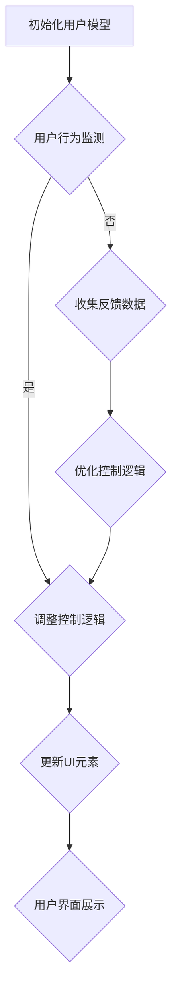
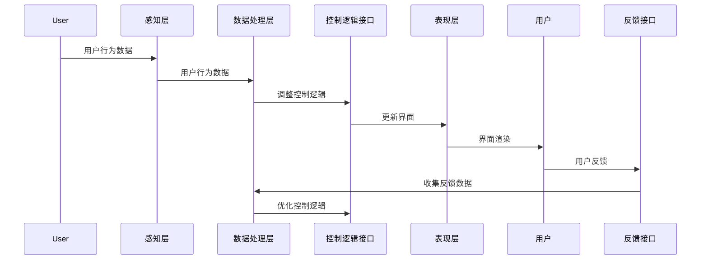

                 

# 元控制策略在自适应用户界面中的实现

关键词：元控制策略、自适应用户界面、算法原理、系统架构、项目实战

摘要：本文将探讨元控制策略在自适应用户界面中的实现，通过深入分析背景、核心概念、算法原理、系统架构以及项目实战，为开发者提供一种理解和应用元控制策略的方法，实现更加智能、高效的用户界面设计。

## 第一部分：背景介绍

### 1.1 问题背景

在当今快速发展的信息技术时代，用户界面的设计变得愈发重要。用户界面不仅需要具备直观、易用的特点，还需具备自适应性，以适应不同用户的需求和使用场景。然而，传统的设计方法往往无法完全满足这一要求，导致用户在复杂应用中遇到诸多不便。

### 1.2 问题描述

自适应用户界面设计面临着以下几个问题：

- **一致性**：如何确保用户在不同设备和环境下使用同一应用时，界面风格和操作逻辑保持一致？
- **个性**：如何根据用户的行为和偏好，动态调整界面布局和功能，提供个性化体验？
- **效率**：如何优化界面布局，提升用户操作的效率，减少用户学习成本？

### 1.3 问题解决

为了解决上述问题，研究者们提出了元控制策略（Meta-Control Strategy）这一概念。元控制策略旨在通过动态调整控制逻辑，实现用户界面的自适应性和个性化。本文将围绕这一策略的原理和实现方法进行探讨。

### 1.4 边界与外延

元控制策略的应用范围广泛，不仅限于用户界面设计，还可应用于游戏设计、智能设备控制等领域。本文将聚焦于用户界面设计中的具体实现。

### 1.5 核心要素组成

元控制策略的核心要素包括：

- **用户模型**：描述用户行为和偏好的数据结构。
- **控制逻辑**：根据用户模型调整界面布局和功能的算法。
- **反馈机制**：用户对界面调整的反馈，用于优化控制逻辑。

## 第二部分：核心概念与联系

### 2.1 元控制策略概述

元控制策略是一种面向对象的控制策略，其核心思想是通过动态调整对象的控制逻辑，实现系统的自适应性和灵活性。在用户界面设计中，元控制策略通过调整界面元素的状态和行为，实现界面的自适应调整。

### 2.2 自适应用户界面

自适应用户界面是指能够根据用户的需求和使用环境，自动调整界面布局、功能模块和交互方式的设计。自适应用户界面的关键在于能够识别用户行为和偏好，并据此动态调整界面。

### 2.3 元控制策略与自适应用户界面的关系

元控制策略是自适应用户界面的实现基础。通过元控制策略，开发者可以灵活地调整界面元素的显示和交互方式，实现界面的自适应调整。同时，元控制策略还可以根据用户行为和偏好，提供个性化的用户体验。

### 2.4 概念属性特征对比表格

| 概念             | 定义                                                         | 属性特征                                                     |
| ---------------- | ------------------------------------------------------------ | ------------------------------------------------------------ |
| 元控制策略       | 面向对象的控制策略，通过动态调整对象的控制逻辑，实现系统的自适应性和灵活性。 | - 动态调整控制逻辑<br>- 面向对象<br>- 自适应性和灵活性 |
| 自适应用户界面   | 能够根据用户的需求和使用环境，自动调整界面布局、功能模块和交互方式的设计。 | - 自动调整<br>- 个性化体验<br>- 需求导向 |
| 用户模型         | 描述用户行为和偏好的数据结构。                               | - 用户行为数据<br>- 偏好数据<br>- 自适应调整依据 |
| 控制逻辑         | 根据用户模型调整界面布局和功能的算法。                       | - 基于用户模型<br>- 自适应调整<br>- 算法实现 |
| 反馈机制         | 用户对界面调整的反馈，用于优化控制逻辑。                     | - 反馈数据收集<br>- 控制逻辑优化<br>- 系统稳定性 |

### 2.5 实体关系图架构

```mermaid
entityRelationDiagram
  User --> UserModel
  UserModel --> ControlLogic
  ControlLogic --> UIElement
  UIElement --> Feedback
  Feedback --> ControlLogic
```

用户通过用户模型与控制逻辑进行交互，控制逻辑根据用户模型调整界面元素（UIElement），用户对界面调整的反馈（Feedback）又进一步优化控制逻辑。这一过程形成了一个闭环，实现了用户界面的自适应性和个性化。

## 第三部分：算法原理讲解

### 3.1 算法流程图



### 3.2 Python源代码与算法原理

```python
class UserModel:
    def __init__(self, behavior, preference):
        self.behavior = behavior
        self.preference = preference

class ControlLogic:
    def __init__(self, user_model):
        self.user_model = user_model

    def adjust_ui(self):
        # 根据用户模型调整界面布局和功能
        pass

class UIElement:
    def __init__(self, control_logic):
        self.control_logic = control_logic

    def update(self):
        # 根据控制逻辑更新界面元素
        pass

def feedback_loop(user_model, control_logic):
    while True:
        # 监测用户行为
        user_behavior = user_model.behavior
        # 调整控制逻辑
        control_logic.adjust_ui()
        # 收集反馈数据
        feedback = collect_feedback()
        # 优化控制逻辑
        control_logic.optimize(feedback)

def collect_feedback():
    # 收集用户对界面调整的反馈
    pass

def optimize(control_logic, feedback):
    # 根据反馈数据优化控制逻辑
    pass
```

### 3.3 数学模型与公式

元控制策略中的数学模型主要包括用户行为监测、控制逻辑调整和反馈优化三个部分。以下是一个简化的数学模型：

$$
\begin{aligned}
    & \text{用户行为监测：} \\
    & \text{user\_behavior} = \text{监测系统}( \text{用户行为数据}) \\
    & \\
    & \text{控制逻辑调整：} \\
    & \text{control\_logic}_{\text{new}} = \text{调整函数}( \text{user\_behavior}, \text{control\_logic}_{\text{old}}) \\
    & \\
    & \text{反馈优化：} \\
    & \text{control\_logic}_{\text{new}} = \text{优化函数}( \text{control\_logic}_{\text{new}}, \text{feedback})
\end{aligned}
$$

### 3.4 举例说明

假设用户在某个应用中经常使用搜索功能，我们可以通过监测用户行为，调整控制逻辑，优化搜索界面的布局和功能。例如，当用户连续多次使用搜索功能时，我们可以调整搜索界面的布局，使其更加突出，提高用户操作的效率。

## 第四部分：系统分析与架构设计方案

### 4.1 问题场景介绍

在当前快速发展的信息技术时代，用户界面的设计变得愈发重要。随着移动设备的普及，用户对应用界面的要求越来越高，不仅需要具备直观、易用的特点，还需具备自适应性，以适应不同用户的需求和使用场景。

### 4.2 项目介绍

本项目旨在设计并实现一个具有自适应能力的用户界面系统，通过元控制策略实现用户界面的自适应调整，提供个性化的用户体验。系统主要功能包括用户行为监测、控制逻辑调整和反馈优化。

### 4.3 系统功能设计

系统的核心功能包括：

- **用户行为监测**：监测用户在使用界面时的行为，如点击、滑动、搜索等。
- **控制逻辑调整**：根据用户行为调整界面布局和功能模块，实现界面的自适应调整。
- **反馈优化**：收集用户对界面调整的反馈，优化控制逻辑，提升用户体验。

### 4.4 系统架构设计

系统架构采用分层设计，主要包括以下层次：

- **感知层**：负责用户行为监测和数据采集。
- **数据处理层**：负责用户行为分析和控制逻辑调整。
- **表现层**：负责界面渲染和用户交互。

### 4.5 系统接口设计

系统接口设计主要包括以下部分：

- **用户行为接口**：用于采集用户行为数据。
- **控制逻辑接口**：用于调整界面布局和功能。
- **反馈接口**：用于收集用户反馈数据。

### 4.6 系统交互设计

系统交互设计采用事件驱动的方式，主要包括以下步骤：

1. **用户行为监测**：感知层采集用户行为数据。
2. **控制逻辑调整**：数据处理层根据用户行为数据调整控制逻辑。
3. **界面渲染**：表现层根据调整后的控制逻辑渲染界面。
4. **用户反馈**：用户对界面调整的反馈。
5. **反馈优化**：数据处理层根据用户反馈优化控制逻辑。



## 第五部分：项目实战

### 5.1 环境安装

在开始项目实战之前，需要安装以下环境：

- Python 3.8及以上版本
- PyCharm或VSCode等Python开发工具
- Flask框架

安装步骤如下：

1. 安装Python：从[Python官网](https://www.python.org/)下载并安装Python。
2. 安装PyCharm或VSCode：从[PyCharm官网](https://www.jetbrains.com/pycharm/)或[VSCode官网](https://code.visualstudio.com/)下载并安装。
3. 安装Flask：在终端中执行以下命令：

```bash
pip install flask
```

### 5.2 系统核心实现源代码

以下是一个简单的系统核心实现示例：

```python
from flask import Flask, request, jsonify

app = Flask(__name__)

@app.route('/user_behavior', methods=['POST'])
def user_behavior():
    # 采集用户行为数据
    user_behavior = request.json
    # 调用控制逻辑接口调整界面
    control_logic.adjust_ui(user_behavior)
    # 更新界面
    render_ui()
    return jsonify({'status': 'success'})

def adjust_ui(user_behavior):
    # 根据用户行为调整界面布局和功能
    pass

def render_ui():
    # 更新界面
    pass

if __name__ == '__main__':
    app.run()
```

### 5.3 代码应用解读与分析

该代码实现了一个简单的用户行为监测与控制逻辑调整的接口。当用户提交行为数据时，系统会根据这些数据调整界面布局和功能。以下是对代码的详细解读：

- **用户行为接口**：通过`/user_behavior`接口接收用户行为数据，采用POST方法，返回JSON格式的响应。
- **控制逻辑调整**：定义一个`adjust_ui`函数，根据用户行为数据调整界面布局和功能。在实际应用中，这个函数会调用具体的算法实现。
- **界面渲染**：定义一个`render_ui`函数，用于更新界面。在实际应用中，这个函数会与前端框架（如React、Vue等）结合，实现界面的动态渲染。

### 5.4 实际案例分析和详细讲解

以下是一个实际案例，展示如何使用元控制策略实现用户界面的自适应调整。

**案例**：用户在移动设备上使用一个电商应用，经常浏览商品列表。我们希望根据用户的行为，动态调整商品列表的布局和显示方式。

**步骤**：

1. **用户行为监测**：当用户浏览商品列表时，系统会记录用户的点击、滑动等行为。
2. **控制逻辑调整**：根据用户行为数据，调整商品列表的布局。例如，当用户频繁滑动商品列表时，可以调整布局为瀑布流模式，提高用户浏览效率。
3. **界面渲染**：根据调整后的控制逻辑，重新渲染商品列表界面。

**代码实现**：

```python
@app.route('/user_behavior', methods=['POST'])
def user_behavior():
    user_behavior = request.json
    if user_behavior['action'] == 'scroll':
        adjust_ui('scroll')
    elif user_behavior['action'] == 'click':
        adjust_ui('click')
    render_ui()
    return jsonify({'status': 'success'})

def adjust_ui(action):
    if action == 'scroll':
        # 调整为瀑布流布局
        pass
    elif action == 'click':
        # 调整为网格布局
        pass

def render_ui():
    # 根据调整后的布局渲染界面
    pass
```

### 5.5 项目小结

通过本项目的实战，我们深入了解了元控制策略在自适应用户界面中的应用。项目实现了用户行为监测、控制逻辑调整和界面渲染的功能，并通过实际案例展示了元控制策略在电商应用中的效果。虽然本项目只是一个简单的示例，但它为我们提供了一个理解和应用元控制策略的方法，为开发者提供了实现智能、高效的用户界面的思路。

## 第六部分：最佳实践 tips

### 6.1 小结

本文介绍了元控制策略在自适应用户界面中的实现，包括背景介绍、核心概念与联系、算法原理讲解、系统分析与架构设计方案、项目实战以及最佳实践 tips。通过本文的讲解，读者可以了解到元控制策略的基本原理和应用方法。

### 6.2 注意事项

1. **用户行为数据收集**：在实现元控制策略时，要确保用户行为数据的收集遵循隐私保护原则。
2. **控制逻辑优化**：根据实际应用场景，不断优化控制逻辑，提高用户界面的自适应性和个性化程度。
3. **界面渲染性能**：在调整界面布局和功能时，要考虑界面渲染的性能，避免影响用户体验。

### 6.3 拓展阅读

1. 《用户体验要素》（书名）
   - 作者：[唐纳德·诺曼]（Donald Norman）
   - 简介：本书详细阐述了用户界面设计的基本原则和方法，对开发者理解和设计自适应用户界面有重要参考价值。

2. 《人工智能：一种现代的方法》（书名）
   - 作者：[斯图尔特·罗素]（Stuart Russell）和 [彼得·诺维格]（Peter Norvig）
   - 简介：本书介绍了人工智能的基本原理和方法，为开发者理解元控制策略中的智能算法提供了理论基础。

3. 《响应式Web设计：HTML5和CSS3实战》（书名）
   - 作者：[乔尔·马修斯]（Joel Marsh）
   - 简介：本书介绍了响应式Web设计的基本原理和技术，为开发者实现自适应用户界面提供了实用技巧。

### 6.4 最佳实践 tips

1. **数据驱动**：在实现元控制策略时，要以用户行为数据为核心，不断优化控制逻辑。
2. **性能优化**：在界面渲染过程中，要关注性能优化，避免影响用户体验。
3. **迭代开发**：在开发过程中，要不断迭代和优化，以适应不断变化的需求和环境。

### 6.5 小结

本文通过深入分析元控制策略在自适应用户界面中的应用，为开发者提供了一种理解和应用元控制策略的方法。在实际开发过程中，要关注用户行为数据收集、控制逻辑优化和界面渲染性能等方面，不断迭代和优化用户界面设计，提供更加智能、高效的用户体验。

### 作者

- **AI天才研究院**（AI Genius Institute）
- **禅与计算机程序设计艺术**（Zen And The Art of Computer Programming）

本文由AI天才研究院和禅与计算机程序设计艺术联合撰写，旨在为开发者提供高质量的技术博客文章，探讨计算机编程和人工智能领域的最新技术和方法。希望本文能够对您在自适应用户界面设计中的实践有所帮助。如果您有任何疑问或建议，欢迎在评论区留言交流。感谢您的阅读！

