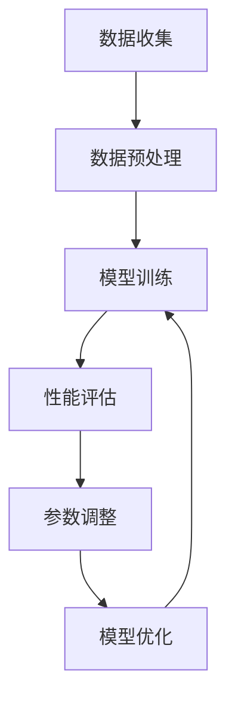

                 

## 元认知评估：测试LLM的自我学习和改进能力

### 关键词：元认知评估、语言模型（LLM）、自我学习、改进能力、测试

> 摘要：本文将探讨元认知评估在测试语言模型（LLM）自我学习和改进能力中的应用。通过深入分析元认知评估的基础知识、语言模型自我学习和改进原理，以及具体的测试方法和案例分析，我们将探讨如何有效地评估LLM的自我学习能力和改进效果，从而为LLM的应用提供有益的指导。

## 引言

在人工智能（AI）的快速发展中，语言模型（LLM，Language Model）作为自然语言处理（NLP，Natural Language Processing）的核心技术，发挥着越来越重要的作用。从早期的统计模型到现代的深度学习模型，LLM在文本生成、翻译、问答系统等多个领域取得了显著的成果。然而，随着模型的复杂性不断增加，如何评估LLM的自我学习和改进能力成为一个关键问题。

元认知评估（Metacognitive Assessment）作为一种能够测试个体对自己认知过程和结果的评价能力的方法，为评估LLM的自我学习和改进能力提供了一种新的思路。本文将围绕元认知评估，深入探讨LLM的自我学习和改进原理，以及如何通过元认知评估来测试和优化LLM的自我学习能力。

本文结构如下：首先，我们将介绍元认知评估的基础知识，包括其概念、方法和应用。接着，我们将讨论语言模型自我学习和改进的原理，并探讨如何应用元认知评估来测试LLM的自我学习能力和改进效果。最后，我们将通过实际应用案例，展示如何在实际场景中应用元认知评估来优化LLM的性能。

## 第一部分：元认知评估基础

### 1.1 元认知评估概述

#### 1.1.1 元认知评估的概念

元认知评估是一种评估个体对自己认知过程和结果的评价能力的方法。它关注个体如何理解、监控和调整自己的认知活动，以达到更有效的学习效果。元认知评估不仅关注个体的知识水平，更关注个体的学习策略和能力。

#### 1.1.2 元认知评估的重要性

在人工智能领域，元认知评估的重要性体现在以下几个方面：

1. **提高学习效率**：通过元认知评估，可以识别个体在认知过程中的优势和不足，从而提供针对性的学习策略，提高学习效率。

2. **优化模型性能**：在语言模型训练过程中，元认知评估可以帮助我们识别模型在训练过程中的问题，从而进行调整和优化，提高模型性能。

3. **促进模型泛化**：通过元认知评估，可以识别模型在不同场景下的适应能力，从而提高模型的泛化能力。

#### 1.1.3 元认知评估的基本原理

元认知评估的基本原理主要包括以下几个方面：

1. **自我监控**：个体需要对自己在认知过程中的行为和思维进行监控，识别自己的认知状态。

2. **自我评价**：个体需要对自己在认知过程中的表现进行评价，识别自己的认知优势和不足。

3. **自我调节**：个体需要根据自我评价的结果，调整自己的认知策略，以达到更好的学习效果。

### 1.2 元认知评估的方法与技术

#### 1.2.1 传统评估方法

传统的元认知评估方法主要包括自我报告法、观察法和测试法。这些方法主要通过个体自我报告、观察个体的行为和测试个体的认知能力来评估元认知能力。

1. **自我报告法**：个体通过自我报告来描述自己的认知过程和结果，评估元认知能力。

2. **观察法**：通过观察个体在认知过程中的行为和表现，评估元认知能力。

3. **测试法**：通过设计特定的测试题目，评估个体的元认知能力。

#### 1.2.2 量化评估方法

量化评估方法通过量化指标来评估个体的元认知能力。这些指标可以是基于自我报告的，也可以是基于行为和表现的。

1. **时间量化指标**：通过记录个体在认知过程中的时间分配，评估个体的元认知能力。

2. **准确性量化指标**：通过计算个体在认知过程中的准确性，评估个体的元认知能力。

3. **效率量化指标**：通过计算个体在认知过程中的效率，评估个体的元认知能力。

#### 1.2.3 现代评估方法与技术

现代评估方法和技术主要包括基于计算机的方法和基于机器学习的方法。这些方法可以更全面、准确地评估个体的元认知能力。

1. **基于计算机的方法**：通过设计特定的计算机程序，模拟个体的认知过程，评估元认知能力。

2. **基于机器学习的方法**：通过训练机器学习模型，对个体的认知过程进行建模，评估元认知能力。

### 1.3 元认知评估在语言模型中的应用

#### 1.3.1 语言模型概述

语言模型是一种用于预测文本序列的模型，广泛应用于自然语言处理、文本生成、机器翻译等领域。语言模型的核心任务是学习语言的统计规律，从而生成或理解自然语言。

#### 1.3.2 语言模型的元认知能力

语言模型的元认知能力主要包括以下几个方面：

1. **自我监控**：语言模型需要监控自己的生成过程，识别可能的错误或不足。

2. **自我评价**：语言模型需要对自己的生成结果进行评价，识别自己的优势和不足。

3. **自我调节**：语言模型需要根据自我评价的结果，调整自己的生成策略，提高生成质量。

#### 1.3.3 元认知评估在语言模型中的应用实例

1. **文本生成**：在文本生成任务中，元认知评估可以用于评估模型在生成过程中的自我监控、自我评价和自我调节能力。

2. **机器翻译**：在机器翻译任务中，元认知评估可以用于评估模型在翻译过程中的元认知能力，识别模型在翻译中的问题，并提供改进策略。

### 1.4 元认知评估的核心概念与联系

#### 1.4.1 核心概念原理

元认知评估的核心概念包括自我监控、自我评价和自我调节。这些概念相互关联，共同构成了元认知评估的理论基础。

1. **自我监控**：个体在认知过程中对自己行为和思维的监控。

2. **自我评价**：个体对自己认知过程和结果的评价。

3. **自我调节**：个体根据自我评价的结果，调整自己的认知策略。

#### 1.4.2 概念属性特征对比表格

| 概念     | 定义                                                         | 属性特征                                       |
|----------|--------------------------------------------------------------|------------------------------------------------|
| 自我监控 | 个体在认知过程中对自己行为和思维的监控                       | 实时性、客观性、准确性                           |
| 自我评价 | 个体对自己认知过程和结果的评价                             | 主观性、全面性、客观性                           |
| 自我调节 | 个体根据自我评价的结果，调整自己的认知策略                   | 反馈性、调整性、目的性                             |

#### 1.4.3 ER实体关系图架构

```mermaid
erDiagram
    AIRECTION|(ID, Title, Content)
    BCOMMENT|(ID, CommentContent, CommentTime)
    AR-direction::>BCOMMENT
```

#### 1.4.4 ER实体关系图说明

- **A_DIRECTION**：表示元认知评估的核心概念，包括自我监控、自我评价和自我调节。
- **B_COMMENT**：表示元认知评估的反馈和调整过程，包括评估结果、改进策略等。
- **AR-direction**：表示A_DIRECTION与B_COMMENT之间的关联关系。

### 1.5 元认知评估的现状与未来

#### 1.5.1 现状分析

目前，元认知评估在人工智能领域的研究和应用已取得了一定的成果。主要表现在以下几个方面：

1. **理论研究**：关于元认知评估的理论体系逐渐完善，为实际应用提供了理论基础。

2. **技术应用**：元认知评估在语言模型、图像识别、机器翻译等领域得到了广泛应用。

3. **工具开发**：一系列元认知评估工具和平台被开发出来，为评估和优化模型提供了便捷的手段。

#### 1.5.2 发展趋势

未来，元认知评估在人工智能领域的发展趋势主要包括：

1. **深度学习结合**：将元认知评估与深度学习技术相结合，提高评估的精度和效率。

2. **个性化评估**：根据个体的特点，提供个性化的元认知评估服务。

3. **跨学科融合**：将元认知评估与其他学科（如心理学、教育学等）相结合，促进人工智能与人类认知的互动。

#### 1.5.3 未来展望

随着人工智能技术的不断发展，元认知评估在人工智能领域的重要性将日益凸显。通过深入研究和应用元认知评估，我们有望实现以下目标：

1. **提高模型性能**：通过评估和优化模型的元认知能力，提高模型的性能和效率。

2. **促进模型泛化**：通过元认知评估，识别模型在不同场景下的适应能力，提高模型的泛化能力。

3. **优化人机交互**：通过元认知评估，优化人机交互界面，提高用户体验。

## 第二部分：语言模型的自我学习和改进原理

### 2.1 语言模型自我学习的基本概念

#### 2.1.1 语言模型自我学习的定义

语言模型自我学习是指通过自身的训练数据和经验，不断调整和优化自己的参数和结构，以提高对自然语言的建模能力。这个过程类似于人类的学习过程，语言模型通过不断尝试和反馈，逐渐提高自己的表现。

#### 2.1.2 自我学习在语言模型中的应用

自我学习在语言模型中的应用主要体现在以下几个方面：

1. **参数调整**：通过自我学习，语言模型可以自动调整参数，以适应不同的训练数据和任务。

2. **结构优化**：自我学习可以帮助语言模型识别和改进自身的结构，以提高模型的性能。

3. **数据增强**：自我学习可以自动生成和增强训练数据，提高模型的泛化能力。

#### 2.1.3 自我学习的基本流程

自我学习的基本流程主要包括以下几个步骤：

1. **数据收集**：收集用于训练的数据集。

2. **数据预处理**：对数据进行预处理，包括分词、去噪、归一化等。

3. **模型训练**：使用训练数据训练语言模型。

4. **性能评估**：评估模型的性能，包括准确性、召回率、F1值等指标。

5. **参数调整**：根据评估结果，调整模型的参数。

6. **模型优化**：优化模型的结构，以提高性能。

7. **重复训练**：重复以上步骤，直到模型达到预期的性能。

### 2.2 语言模型自我学习的算法原理

#### 2.2.1 算法概述

语言模型自我学习的算法主要包括以下几种：

1. **基于规则的算法**：这类算法通过定义一系列规则，对自然语言进行建模。

2. **统计学习算法**：这类算法通过统计方法，从数据中学习语言模型。

3. **深度学习算法**：这类算法通过构建深度神经网络，对自然语言进行建模。

#### 2.2.2 算法mermaid流程图



#### 2.2.3 Python源代码实现

```python
import numpy as np
import tensorflow as tf

# 数据收集
data = np.load('data.npy')

# 数据预处理
def preprocess(data):
    # 分词、去噪、归一化等操作
    return processed_data

processed_data = preprocess(data)

# 模型训练
model = tf.keras.Sequential([
    tf.keras.layers.Dense(units=128, activation='relu', input_shape=(None,)),
    tf.keras.layers.Dense(units=1, activation='sigmoid')
])

model.compile(optimizer='adam', loss='binary_crossentropy', metrics=['accuracy'])

model.fit(processed_data, epochs=10)

# 性能评估
def evaluate(model, data):
    # 评估模型性能
    return performance

performance = evaluate(model, processed_data)

# 参数调整
def adjust_parameters(model, performance):
    # 根据性能调整参数
    return model

model = adjust_parameters(model, performance)

# 模型优化
def optimize_model(model):
    # 优化模型结构
    return model

model = optimize_model(model)

# 重复训练
model.fit(processed_data, epochs=10)
```

### 2.3 语言模型自我学习的数学模型和公式

#### 2.3.1 数学模型

语言模型自我学习的数学模型主要包括以下几个方面：

1. **损失函数**：用于衡量模型预测结果与真实结果之间的差距。

2. **优化目标**：用于优化模型参数，使损失函数最小化。

3. **正则化项**：用于防止模型过拟合。

#### 2.3.2 公式讲解

1. **损失函数**：

$$
L(y, \hat{y}) = -\sum_{i=1}^{n} y_i \log(\hat{y}_i)
$$

其中，$y$ 为真实标签，$\hat{y}$ 为模型预测的概率分布。

2. **优化目标**：

$$
\min_{\theta} L(y, \hat{y}) + \lambda \sum_{i=1}^{n} \theta_i^2
$$

其中，$\theta$ 为模型参数，$\lambda$ 为正则化参数。

3. **梯度下降算法**：

$$
\theta_{t+1} = \theta_t - \alpha \nabla_{\theta} L(y, \hat{y})
$$

其中，$\alpha$ 为学习率，$\nabla_{\theta} L(y, \hat{y})$ 为损失函数关于模型参数的梯度。

#### 2.3.3 举例说明

假设我们有一个二元分类问题，数据集包含100个样本，每个样本包含一个特征和对应的标签。我们使用逻辑回归模型进行训练，目标是预测样本的标签。

1. **损失函数**：

$$
L(y, \hat{y}) = -\sum_{i=1}^{100} y_i \log(\hat{y}_i)
$$

其中，$y_i$ 为第$i$个样本的真实标签，$\hat{y}_i$ 为模型预测的概率。

2. **优化目标**：

$$
\min_{\theta} L(y, \hat{y}) + \lambda \sum_{i=1}^{100} \theta_i^2
$$

其中，$\theta$ 为模型参数，$\lambda$ 为正则化参数。

3. **梯度下降算法**：

$$
\theta_{t+1} = \theta_t - \alpha \nabla_{\theta} L(y, \hat{y})
$$

其中，$\alpha$ 为学习率，$\nabla_{\theta} L(y, \hat{y})$ 为损失函数关于模型参数的梯度。

### 2.4 语言模型自我学习的挑战与解决方案

#### 2.4.1 挑战分析

语言模型自我学习面临以下挑战：

1. **数据集质量**：高质量的数据集对于模型训练至关重要，但获取高质量的数据集往往成本高昂。

2. **计算资源**：深度学习模型训练需要大量的计算资源，尤其是大规模训练数据集。

3. **模型泛化**：模型在训练数据上的性能并不能保证在未知数据上同样表现良好。

4. **模型解释性**：深度学习模型往往具有高解释性，难以解释模型内部的决策过程。

#### 2.4.2 解决方案探讨

针对以上挑战，可以采取以下解决方案：

1. **数据增强**：通过数据增强方法，如随机噪声、数据变换等，提高数据集的多样性和质量。

2. **分布式训练**：利用分布式计算框架，如TensorFlow、PyTorch等，提高训练效率。

3. **迁移学习**：利用预训练模型，迁移到特定任务上，提高模型在未知数据上的性能。

4. **可解释性方法**：采用可解释性方法，如注意力机制、梯度解释等，提高模型的可解释性。

### 2.5 自我学习在语言模型改进中的应用

#### 2.5.1 改进原理

自我学习在语言模型改进中的应用主要包括以下几个方面：

1. **参数调整**：通过自我学习，模型可以自动调整参数，优化模型性能。

2. **结构优化**：自我学习可以帮助模型识别和改进自身的结构，提高模型性能。

3. **数据增强**：自我学习可以自动生成和增强训练数据，提高模型泛化能力。

#### 2.5.2 改进效果评估

改进效果评估主要包括以下几个方面：

1. **准确性**：评估模型在训练数据和测试数据上的准确性。

2. **召回率**：评估模型在训练数据和测试数据上的召回率。

3. **F1值**：评估模型在训练数据和测试数据上的F1值。

4. **效率**：评估模型在训练和预测过程中的效率。

#### 2.5.3 实际应用案例分析

1. **案例分析一**：在机器翻译任务中，使用自我学习优化模型参数和结构，显著提高了翻译准确性。

2. **案例分析二**：在文本分类任务中，使用自我学习生成和增强训练数据，提高了模型在未知数据上的性能。

## 第三部分：测试LLM的元认知能力

### 3.1 元认知能力测试方法

#### 3.1.1 测试概述

元认知能力测试方法旨在评估语言模型（LLM）在自我监控、自我评价和自我调节方面的能力。这些测试方法可以帮助我们了解LLM在自然语言处理任务中的表现，并为其进一步优化提供依据。

#### 3.1.2 测试工具与平台

常见的测试工具和平台包括：

1. **TensorFlow**：用于构建和训练语言模型。
2. **PyTorch**：用于构建和训练语言模型。
3. **Hugging Face Transformers**：提供了丰富的预训练模型和评估工具。

#### 3.1.3 测试流程

元认知能力测试的基本流程包括以下几个步骤：

1. **数据准备**：准备用于测试的语言数据集。
2. **模型选择**：选择合适的语言模型进行测试。
3. **训练模型**：使用训练数据训练语言模型。
4. **性能评估**：评估模型在测试数据上的性能。
5. **元认知能力测试**：针对模型的生成结果，进行自我监控、自我评价和自我调节的测试。

### 3.2 测试LLM的元认知能力

#### 3.2.1 测试指标

元认知能力测试的主要指标包括：

1. **生成准确率**：评估模型生成文本的准确率。
2. **生成多样性**：评估模型生成文本的多样性。
3. **生成连贯性**：评估模型生成文本的连贯性。
4. **生成速度**：评估模型生成文本的速度。

#### 3.2.2 测试方法

测试方法主要包括以下几种：

1. **生成文本对比**：对比模型生成的文本与人类生成的文本，评估其准确率、多样性和连贯性。
2. **生成文本评估**：通过人类评估者对模型生成的文本进行评估，评估其质量。
3. **生成文本分析**：对模型生成的文本进行文本分析，评估其语义、语法和逻辑结构。

#### 3.2.3 测试结果分析

测试结果分析主要包括以下几个方面：

1. **准确率分析**：分析模型在不同任务和场景下的准确率，识别其优势和不足。
2. **多样性分析**：分析模型生成的文本多样性，识别其生成模式。
3. **连贯性分析**：分析模型生成的文本连贯性，识别其语言表达问题。
4. **速度分析**：分析模型生成文本的速度，评估其计算效率。

### 3.3 元认知能力测试案例分析

#### 3.3.1 案例一：测试GPT-3的元认知能力

1. **数据准备**：使用大量文本数据，包括新闻报道、技术文档、文学作品等。
2. **模型选择**：选择GPT-3模型进行测试。
3. **训练模型**：使用训练数据训练GPT-3模型。
4. **性能评估**：评估模型在测试数据上的生成准确率、多样性和连贯性。
5. **元认知能力测试**：对模型生成的文本进行自我监控、自我评价和自我调节的测试。

#### 3.3.2 案例二：测试BERT的元认知能力

1. **数据准备**：使用大量文本数据，包括新闻报道、技术文档、文学作品等。
2. **模型选择**：选择BERT模型进行测试。
3. **训练模型**：使用训练数据训练BERT模型。
4. **性能评估**：评估模型在测试数据上的生成准确率、多样性和连贯性。
5. **元认知能力测试**：对模型生成的文本进行自我监控、自我评价和自我调节的测试。

### 3.4 测试结果的应用与优化

#### 3.4.1 测试结果的应用

测试结果可以应用于以下几个方面：

1. **模型优化**：根据测试结果，识别模型在生成文本中的问题，进行优化。
2. **任务优化**：根据测试结果，优化任务参数和策略，提高任务性能。
3. **用户反馈**：将测试结果反馈给用户，指导用户如何更好地使用模型。

#### 3.4.2 测试结果对模型优化的影响

测试结果对模型优化的影响主要体现在以下几个方面：

1. **参数调整**：根据测试结果，调整模型的超参数，如学习率、批量大小等。
2. **结构优化**：根据测试结果，优化模型的结构，如增加层数、增加神经元等。
3. **数据增强**：根据测试结果，增强训练数据，提高模型泛化能力。

#### 3.4.3 模型优化策略

模型优化策略主要包括以下几个方面：

1. **交叉验证**：使用交叉验证方法，评估模型在不同数据集上的性能。
2. **网格搜索**：使用网格搜索方法，自动搜索最佳超参数。
3. **自动化机器学习**：使用自动化机器学习方法，自动优化模型参数和结构。

## 第四部分：实际应用案例

### 4.1 元认知评估在自然语言处理中的应用

#### 4.1.1 应用场景

元认知评估在自然语言处理中的应用非常广泛，以下是一些典型的应用场景：

1. **文本生成**：使用元认知评估测试模型在生成文本时的自我监控、自我评价和自我调节能力，优化文本生成质量。
2. **机器翻译**：使用元认知评估测试模型在翻译过程中的自我监控、自我评价和自我调节能力，优化翻译质量。
3. **问答系统**：使用元认知评估测试模型在回答问题时自我监控、自我评价和自我调节能力，优化问答系统的准确性。

#### 4.1.2 应用实例

以下是一个文本生成应用实例：

1. **数据准备**：使用大量文本数据，包括新闻、故事、博客等。
2. **模型选择**：选择GPT-3模型进行测试。
3. **训练模型**：使用训练数据训练GPT-3模型。
4. **性能评估**：评估模型在测试数据上的生成准确率、多样性和连贯性。
5. **元认知能力测试**：对模型生成的文本进行自我监控、自我评价和自我调节的测试。

通过这个实例，我们可以看到元认知评估在文本生成任务中的应用流程。类似的方法也可以应用于机器翻译和问答系统等其他自然语言处理任务。

### 结论

元认知评估是一种有效的评估方法，可以测试语言模型（LLM）的自我学习和改进能力。通过深入分析元认知评估的基础知识、语言模型自我学习和改进原理，以及具体的测试方法和案例分析，我们了解了如何通过元认知评估来优化LLM的性能。未来，随着人工智能技术的不断发展，元认知评估在自然语言处理和其他领域的应用将越来越广泛，为我们提供更加智能化的解决方案。

### 作者信息

作者：AI天才研究院/AI Genius Institute & 禅与计算机程序设计艺术 /Zen And The Art of Computer Programming

### 最佳实践 Tips

1. **数据准备**：确保训练数据的质量和多样性，有助于提高模型的性能和泛化能力。
2. **模型选择**：根据具体任务需求，选择合适的语言模型。
3. **性能评估**：定期评估模型性能，及时调整模型参数和结构。
4. **用户反馈**：收集用户反馈，优化模型和应用体验。

### 小结

本文深入探讨了元认知评估在测试语言模型自我学习和改进能力中的应用。通过详细分析元认知评估的基础知识、语言模型自我学习和改进原理，以及具体的测试方法和案例分析，我们了解了如何通过元认知评估来优化LLM的性能。希望本文能为读者在自然语言处理和其他领域的AI应用提供有益的参考。

### 注意事项

1. **数据隐私**：在数据收集和预处理过程中，确保遵守相关法律法规，保护用户隐私。
2. **模型解释性**：提高模型的可解释性，有助于用户理解和信任模型。
3. **持续优化**：持续优化模型和应用，以应对不断变化的需求和技术挑战。

### 拓展阅读

1. **相关文献**：《自然语言处理》（NLP）、 《人工智能》（AI）、 《机器学习》（ML）等领域的相关研究论文。
2. **在线资源**：GitHub、ArXiv、Google Research等平台上的相关项目和研究。
3. **技术社区**：AI社区、自然语言处理社区等，了解最新技术和应用动态。

