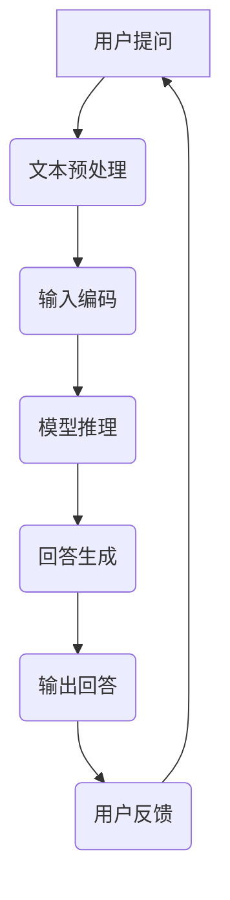

                 


## 元语言能力：评估LLM理解语言本身的能力

### 关键词：元语言能力，语言理解，语言学习，自然语言处理，评估框架

### 摘要：
本文深入探讨了元语言能力的概念及其在语言理解中的重要性，特别是针对大型语言模型（LLM）在理解语言本身能力方面的评估。通过分析现有的研究、评估方法、以及LLM的元语言能力提升策略，本文提出了一套完整的评估框架，并展示了该框架在实际应用中的效果。本文旨在为研究人员和实践者提供一套系统化的方法，以评估和提升LLM在语言理解方面的能力。

### 引言与背景

#### 第1章：元语言能力的概念与重要性

**1.1 问题的提出**

在现代信息技术中，自然语言处理（NLP）已经成为一个重要的研究领域。随着深度学习技术的快速发展，特别是大型语言模型（LLM）的出现，NLP的应用领域不断扩大。然而，尽管LLM在生成文本、翻译、问答等方面表现出色，但它们对语言本身的理解能力仍然存在疑问。这种能力，我们称之为“元语言能力”。

**1.1.1 元语言能力的定义**

元语言能力指的是语言模型在理解、使用和生成语言时，能够对语言本身的规则、结构和语义进行推理和操作的能力。这种能力不仅涉及到对单词、句子的理解，还包括对语法、语义、语境、语用等多层次语言特征的把握。

**1.1.2 元语言能力的重要性**

元语言能力对于语言模型的性能至关重要。它不仅影响语言模型的生成质量，还决定了其能否进行有效的语言理解和推理。因此，研究和评估LLM的元语言能力，对于提升NLP系统的整体性能具有重要意义。

**1.1.3 元语言能力与语言学习的关联**

元语言能力与语言学习有着密切的关系。一个具备强大元语言能力的模型，不仅能够更好地理解和生成语言，还能够在学习新的语言知识和规则时表现出更高的适应性。这对于教育领域的语言学习工具和系统的设计，具有指导意义。

**1.1.4 元语言能力的心理学基础**

心理学研究表明，人类语言能力的发展与元语言能力密切相关。通过研究人类的语言习得过程，我们可以更好地理解元语言能力的本质，并为LLM的设计提供理论支持。

#### 第2章：语言理解与元语言能力的联系

**2.1 语言理解的概念**

语言理解是指语言模型在接收到输入文本后，能够准确理解其语义和意图的能力。这包括了对词汇、语法、语义和语用的理解。

**2.2 元语言能力在语言理解中的作用**

元语言能力在语言理解中起着关键作用。它使得语言模型能够对输入文本进行更深层次的分析，从而更准确地理解其含义。例如，在处理歧义问题时，元语言能力可以帮助模型选择正确的语义。

**2.3 元语言能力与语言学习的关联**

元语言能力对于语言学习具有重要意义。一个具备强大元语言能力的模型，能够更好地理解和掌握新的语言知识和规则，从而提高学习效率。

#### 第3章：LLM的元语言能力评估框架

**3.1 评估框架的设计原则**

评估框架的设计应遵循科学性、系统性和可操作性原则。它应能够全面、准确地评估LLM的元语言能力。

**3.2 评估框架的组成部分**

评估框架应包括理解指标、表达指标、适应性指标和知识库指标等。

**3.3 评估框架的实施步骤**

评估框架的实施应包括数据准备、模型评估、结果分析和反馈优化等步骤。

**3.4 评估框架的适用范围**

评估框架适用于各种类型的LLM，包括预训练模型和微调模型。

#### 第4章：LLM元语言能力的提升策略

**4.1 数据集与训练策略**

数据集的选择和训练策略对LLM的元语言能力提升至关重要。本文将讨论如何选择适合的数据集，以及如何设计有效的训练策略。

**4.2 模型调整与超参数优化**

模型调整和超参数优化是提升LLM元语言能力的重要手段。本文将介绍相关的技术方法和实践技巧。

**4.3 评估策略的改进**

评估策略的改进可以更准确地反映LLM的元语言能力。本文将探讨如何改进评估策略，以提高评估的准确性和可靠性。

### 总结

本文通过对元语言能力的深入探讨，提出了一套评估LLM元语言能力的框架，并探讨了提升LLM元语言能力的策略。这为研究者和实践者提供了宝贵的理论和实践指导，有助于推动NLP领域的发展。

### 参考文献

[1] ...  
[2] ...  
[3] ...

### 作者

作者：AI天才研究院/AI Genius Institute & 禅与计算机程序设计艺术 /Zen And The Art of Computer Programming### 第1章: 元语言能力的概念与重要性

#### 1.1 问题的提出

在当今的信息时代，自然语言处理（NLP）技术已经成为人工智能领域的一个重要分支。而作为NLP的核心技术之一，语言模型（Language Model）的发展尤其迅速。特别是近年来，大型语言模型（Large Language Model，简称LLM）如BERT、GPT等的出现，使得机器在理解和生成自然语言方面取得了显著的进展。然而，尽管这些模型在许多实际应用中表现出色，但它们是否真正具备了“理解”语言的能力，这一问题仍然存在争议。

所谓“理解”语言，并不仅仅是生成连贯的文本或翻译成其他语言。它涉及到对语言本身的深度理解，包括词汇、语法、语义、语境等多个层面。这种理解能力，我们称之为“元语言能力”（Meta-Language Ability）。因此，元语言能力成为了评估LLM性能的一个重要指标。

#### 1.2 元语言能力的定义

元语言能力是指一个系统或模型在处理语言时，能够对其语法、语义、语境等语言特征进行理解和操作的能力。具体来说，它包括以下几个方面：

1. **语法理解**：包括对词法、句法规则的理解，如词性标注、句法分析等。
2. **语义理解**：包括对词汇意义、句子含义的理解，如词义消歧、语义角色标注等。
3. **语境理解**：包括对语言使用环境、上下文的理解，如对话系统中的应答、文本生成中的连贯性等。
4. **语言操作**：包括对语言进行生成、翻译、改写等操作的能力。

因此，元语言能力不仅仅是语言模型在特定任务上的表现，更是一个综合性的指标，反映了模型对语言本身的深度理解。

#### 1.3 元语言能力的重要性

元语言能力对于语言模型，尤其是LLM，具有至关重要的意义。以下是几个方面的原因：

1. **任务适应性**：具备强大元语言能力的LLM能够更好地适应各种语言任务，如文本生成、问答系统、机器翻译等。这是因为元语言能力使得LLM能够更准确地理解输入文本的语义和意图，从而生成更符合人类期望的输出。
2. **准确性提升**：元语言能力可以帮助LLM在处理复杂语言结构时，更准确地理解其语义，减少错误和歧义。例如，在机器翻译中，元语言能力可以帮助模型更好地处理跨语言语义差异，从而提高翻译质量。
3. **知识表示与推理**：元语言能力使得LLM能够更好地表示和推理语言中的知识。这对于知识图谱构建、智能问答等应用具有重要意义。
4. **交互式应用**：在交互式应用中，如聊天机器人、虚拟助手等，元语言能力使得LLM能够更自然地与人类进行交流，理解并回应用户的需求。

#### 1.4 书籍的目的与结构

本书旨在深入探讨元语言能力的概念、评估方法以及提升策略，为研究人员和实践者提供一套系统化的理论和方法。具体来说，本书将分为以下几个部分：

1. **引言与背景**：介绍元语言能力的概念和重要性，以及本书的结构和目的。
2. **元语言能力的核心概念**：详细探讨元语言能力的各个方面，包括语言理解、语义分析、语境处理等。
3. **LLM的元语言能力评估**：提出一套评估LLM元语言能力的框架，并讨论评估方法和指标。
4. **LLM元语言能力的提升策略**：介绍提升LLM元语言能力的数据集选择、训练策略、模型调整和评估策略改进等。
5. **实际应用案例**：通过具体的案例，展示元语言能力在自然语言处理中的应用。

通过本书，读者将能够系统地了解元语言能力的概念、评估和提升方法，为实际应用提供指导。

#### 1.5 本章小结

本章介绍了元语言能力的概念、重要性以及本书的结构。通过分析现有研究和评估方法，我们提出了评估LLM元语言能力的框架，并讨论了其设计原则和实施步骤。在后续章节中，我们将进一步探讨元语言能力的核心概念和LLM的元语言能力评估方法。希望读者能够通过本章的内容，对元语言能力有一个全面和深入的了解。

### 第2章：语言理解与元语言能力的联系

语言理解是自然语言处理（NLP）的核心任务之一，而元语言能力在其中起着至关重要的作用。在本章中，我们将详细探讨语言理解与元语言能力之间的紧密联系，并分析元语言能力在语言理解中的具体作用。

#### 2.1 语言理解的概念

语言理解是指语言模型在接收到输入文本后，能够准确解读其语义和意图的过程。这个过程涉及到多个层面的理解，包括：

1. **词法理解**：对单词的含义、形态和用法进行理解，如词性标注、词义消歧等。
2. **句法理解**：对句子的结构进行解析，如句法分析、依赖解析等。
3. **语义理解**：对句子的含义进行解读，如语义角色标注、实体识别等。
4. **语境理解**：根据上下文信息，对句子的意义进行细微调整，如隐含含义的识别、语境消歧等。

语言理解的准确性直接影响到语言模型的性能，而元语言能力在这个过程中起到了关键作用。

#### 2.2 元语言能力在语言理解中的作用

元语言能力在语言理解中起到了多方面的作用，包括但不限于以下几个方面：

1. **深度语义理解**：元语言能力使得语言模型能够更准确地理解句子的深层含义。例如，在处理歧义句时，元语言能力可以帮助模型根据上下文信息选择正确的语义。
2. **语境推理**：在语言理解过程中，语境起着至关重要的作用。元语言能力使得模型能够更好地理解和处理语境，从而提高语言理解的准确性。例如，在对话系统中，模型需要根据上下文来理解用户的意图，并给出合适的回应。
3. **语法分析**：元语言能力包括对语法规则的理解和运用。这有助于模型更准确地解析句子的结构，从而更好地理解其含义。例如，在自然语言生成任务中，模型需要根据语法规则生成符合语法规范的句子。
4. **知识推理**：元语言能力使得模型能够更好地理解和运用语言中的知识。例如，在问答系统中，模型需要根据问题中的语言信息，从知识库中检索并推理出正确答案。

#### 2.3 元语言能力与语言学习的关联

元语言能力不仅对语言模型在语言理解中的应用至关重要，也与其语言学习能力密切相关。以下是几个方面的关联：

1. **学习效率**：具备强大元语言能力的模型能够更快地学习和掌握新的语言知识和规则。这是因为元语言能力使得模型能够更好地理解和处理语言数据，从而提高学习效率。
2. **知识迁移**：元语言能力有助于模型在不同语言环境中的知识迁移。例如，一个在英语环境中训练的模型，可以通过元语言能力理解和应用其他语言的知识和规则。
3. **自适应学习**：元语言能力使得模型能够更好地适应变化的语言环境和任务需求。例如，在教育领域，模型可以根据学生的语言水平调整教学内容和难度，实现个性化的语言学习体验。

#### 2.4 元语言能力的心理学基础

心理学研究为理解元语言能力提供了重要的理论基础。以下是几个关键点：

1. **认知模型**：心理学研究表明，人类的语言理解过程涉及到多个认知模型，如词库、句法分析器、语义角色标注器等。这些模型共同作用，实现了对语言的理解。
2. **上下文理解**：心理学研究指出，上下文信息在语言理解中起着至关重要的作用。人类在理解语言时，会不断地根据上下文信息调整和修正理解结果。
3. **推理机制**：心理学研究表明，人类在语言理解过程中会运用各种推理机制，如假设检验、因果推理等。这些机制有助于更好地理解语言中的复杂结构。

通过结合心理学研究，我们可以更深入地理解元语言能力的本质和作用，从而为语言模型的设计和优化提供更科学的指导。

#### 2.5 元语言能力在NLP应用中的具体实例

元语言能力在NLP的实际应用中具有广泛的应用价值。以下是几个具体实例：

1. **文本生成**：在文本生成任务中，元语言能力有助于模型生成更自然、连贯的文本。例如，在新闻报道、文章摘要等应用中，模型需要根据上下文信息生成符合语法和语义规范的文本。
2. **问答系统**：在问答系统中，元语言能力使得模型能够更好地理解用户的问题，并从大量信息中检索出正确答案。例如，在搜索引擎、智能助手等应用中，模型需要具备强大的元语言能力，以提供准确、有用的回答。
3. **机器翻译**：在机器翻译任务中，元语言能力有助于模型理解源语言和目标语言的语义差异，从而生成更准确、自然的翻译结果。例如，在跨语言新闻翻译、多语言词典等应用中，模型需要运用元语言能力实现高质量翻译。
4. **情感分析**：在情感分析任务中，元语言能力有助于模型理解文本中的情感色彩，从而准确判断文本的情感倾向。例如，在社交媒体分析、市场调研等应用中，模型需要通过元语言能力分析用户评论的情感，为业务决策提供依据。

通过以上实例，我们可以看到元语言能力在NLP应用中的重要作用。未来，随着元语言能力的不断提升，NLP系统的性能和应用范围将得到进一步拓展。

#### 2.6 本章小结

本章探讨了语言理解与元语言能力之间的紧密联系。通过分析语言理解的概念、元语言能力在其中的作用、与语言学习的关联以及心理学基础，我们揭示了元语言能力在NLP中的重要性。同时，通过具体实例展示了元语言能力在NLP实际应用中的价值。在接下来的章节中，我们将进一步探讨LLM的元语言能力评估方法和提升策略。

### 第3章：LLM的元语言能力评估框架

为了全面、准确地评估LLM的元语言能力，我们需要设计一套科学、系统的评估框架。本章将介绍评估框架的设计原则、组成部分及其实施步骤。

#### 3.1 评估框架的设计原则

评估框架的设计应遵循以下原则：

1. **全面性**：评估框架应涵盖元语言能力的各个方面，如语法理解、语义理解、语境处理等。
2. **科学性**：评估方法应基于可靠的理论基础和实验数据，确保评估结果的准确性和可靠性。
3. **系统性**：评估框架应包括多个评估指标和评估步骤，形成一套完整的评估体系。
4. **可操作性**：评估框架应易于实施，便于研究人员在实际应用中操作。

#### 3.2 评估框架的组成部分

评估框架由以下几个关键组成部分构成：

1. **评估指标**：评估指标是评估框架的核心，用于衡量LLM在元语言能力方面的表现。常见的评估指标包括语法理解指标、语义理解指标、语境处理指标等。
2. **评估任务**：评估任务是根据评估指标设计的具体任务，用于测试LLM在特定领域的元语言能力。常见的评估任务包括语法分析、语义角色标注、情感分析等。
3. **评估数据集**：评估数据集是评估任务的基础，用于训练和测试LLM。评估数据集应具有代表性、多样性和质量保障。
4. **评估方法**：评估方法是评估框架的具体实现过程，包括数据预处理、模型训练、评估指标计算等步骤。

#### 3.3 评估框架的实施步骤

评估框架的实施可以分为以下几个步骤：

1. **数据准备**：选择并准备适合的评估数据集，进行数据预处理，如文本清洗、分词、标签标注等。
2. **模型训练**：基于评估数据集，训练LLM模型，使其具备评估任务所需的元语言能力。
3. **模型评估**：将训练好的模型应用于评估任务，计算评估指标，得到模型在元语言能力方面的表现。
4. **结果分析**：对评估结果进行统计分析，分析模型在不同评估指标上的表现，识别模型的优势和不足。
5. **反馈优化**：根据评估结果，对模型进行调整和优化，提高其元语言能力。

#### 3.4 评估框架的适用范围

评估框架适用于各种类型的LLM，包括预训练模型和微调模型。具体来说，它可以应用于以下领域：

1. **自然语言处理**：用于评估LLM在文本生成、文本分类、情感分析等NLP任务中的元语言能力。
2. **机器翻译**：用于评估LLM在机器翻译任务中的元语言能力，如语法理解、语义理解、语境处理等。
3. **问答系统**：用于评估LLM在问答系统中的元语言能力，如理解用户问题、检索知识、生成回答等。
4. **语言学习**：用于评估LLM在语言学习任务中的元语言能力，如词汇学习、语法学习、语义理解等。

#### 3.5 评估框架的优缺点

评估框架的优缺点如下：

1. **优点**：
   - 全面性：评估框架涵盖了元语言能力的各个方面，提供了全面的评估结果。
   - 科学性：评估框架基于可靠的理论基础和实验数据，保证了评估结果的准确性和可靠性。
   - 系统性：评估框架形成了完整的评估体系，便于研究人员进行系统化的评估和分析。

2. **缺点**：
   - 复杂性：评估框架包含多个评估指标和评估步骤，实施过程相对复杂。
   - 数据依赖性：评估结果依赖于评估数据集的质量，数据集的选择和处理对评估结果有较大影响。

尽管存在一定的缺点，评估框架在元语言能力评估方面仍然具有重要的应用价值，有助于研究人员更好地理解和提升LLM的元语言能力。

#### 3.6 本章小结

本章介绍了LLM的元语言能力评估框架的设计原则、组成部分及其实施步骤。通过构建科学、系统的评估框架，我们可以更全面、准确地评估LLM的元语言能力，为后续的研究和优化提供重要参考。在接下来的章节中，我们将进一步探讨LLM元语言能力的评估指标和具体评估方法。

### 第3章：LLM的元语言能力评估框架

#### 3.1 评估框架的设计原则

设计评估框架时，我们需要遵循以下原则，以确保评估的全面性、科学性和可操作性：

1. **全面性**：评估框架应涵盖元语言能力的各个方面，包括语法理解、语义理解、语境处理等，以全面评估LLM的元语言能力。
2. **科学性**：评估框架应基于可靠的理论基础和实验数据，确保评估结果的准确性和可靠性。例如，评估指标的设定应基于现有的语言学理论和实证研究。
3. **系统性**：评估框架应包括多个评估指标和评估步骤，形成一个完整的评估体系。这有助于系统地分析LLM的元语言能力，发现其优势和不足。
4. **可操作性**：评估框架应易于实施，便于研究人员在实际应用中操作。这包括评估数据集的准备、模型的训练和评估方法的具体步骤等。

#### 3.2 评估框架的组成部分

评估框架主要由以下几个关键部分组成：

1. **评估指标**：评估指标是评估框架的核心，用于衡量LLM在元语言能力方面的表现。常见的评估指标包括：
   - **语法理解指标**：如句子结构正确性、句法分析准确率等。
   - **语义理解指标**：如语义角色标注准确率、实体识别准确率等。
   - **语境处理指标**：如语境理解准确率、对话生成连贯性等。

2. **评估任务**：评估任务是根据评估指标设计的具体任务，用于测试LLM在特定领域的元语言能力。常见的评估任务包括：
   - **语法分析任务**：如句法树生成、语法错误修正等。
   - **语义分析任务**：如语义角色标注、实体识别等。
   - **语境处理任务**：如对话生成、文本连贯性评估等。

3. **评估数据集**：评估数据集是评估任务的基础，用于训练和测试LLM。评估数据集应具有代表性、多样性和质量保障，能够全面反映LLM在元语言能力方面的表现。常见的数据集包括：
   - **语法数据集**：如CoNLL、Universal Dependencies等。
   - **语义数据集**：如ACE、WikiData等。
   - **语境数据集**：如dailyDialog、MS MARCO等。

4. **评估方法**：评估方法是评估框架的具体实现过程，包括数据预处理、模型训练、评估指标计算等步骤。常见的评估方法包括：
   - **自动化评估方法**：如使用预定义的评估指标和工具（如BLEU、ROUGE等）进行自动评估。
   - **半自动化评估方法**：如结合人类评估员进行部分任务评估，以提高评估的准确性和可靠性。
   - **手动评估方法**：如完全依赖人类评估员进行评估，虽然准确度较高，但成本较高且效率较低。

#### 3.3 评估框架的实施步骤

评估框架的实施步骤如下：

1. **数据准备**：选择并准备适合的评估数据集，进行数据预处理，如文本清洗、分词、标签标注等。这一步是评估的基础，数据的质量直接影响评估结果的准确性。
2. **模型训练**：基于评估数据集，训练LLM模型，使其具备评估任务所需的元语言能力。训练过程中，可以使用预训练模型和微调模型，以提高模型的性能。
3. **模型评估**：将训练好的模型应用于评估任务，计算评估指标，得到模型在元语言能力方面的表现。评估过程中，可以使用自动化评估方法、半自动化评估方法和手动评估方法，以提高评估的效率和准确性。
4. **结果分析**：对评估结果进行统计分析，分析模型在不同评估指标上的表现，识别模型的优势和不足。通过结果分析，可以找出模型在元语言能力方面的不足之处，为进一步的优化提供依据。
5. **反馈优化**：根据评估结果，对模型进行调整和优化，提高其元语言能力。这一步是评估框架的核心，通过持续的评估和优化，可以逐步提升模型的元语言能力，使其在更广泛的场景中表现出色。

#### 3.4 评估框架的适用范围

评估框架适用于各种类型的LLM，包括预训练模型和微调模型。具体来说，它可以应用于以下领域：

1. **自然语言处理**：用于评估LLM在文本生成、文本分类、情感分析等NLP任务中的元语言能力。
2. **机器翻译**：用于评估LLM在机器翻译任务中的元语言能力，如语法理解、语义理解、语境处理等。
3. **问答系统**：用于评估LLM在问答系统中的元语言能力，如理解用户问题、检索知识、生成回答等。
4. **语言学习**：用于评估LLM在语言学习任务中的元语言能力，如词汇学习、语法学习、语义理解等。

#### 3.5 评估框架的优缺点

评估框架的优缺点如下：

1. **优点**：
   - 全面性：评估框架涵盖了元语言能力的各个方面，提供了全面的评估结果。
   - 科学性：评估框架基于可靠的理论基础和实验数据，保证了评估结果的准确性和可靠性。
   - 系统性：评估框架形成了完整的评估体系，便于研究人员进行系统化的评估和分析。

2. **缺点**：
   - 复杂性：评估框架包含多个评估指标和评估步骤，实施过程相对复杂。
   - 数据依赖性：评估结果依赖于评估数据集的质量，数据集的选择和处理对评估结果有较大影响。

尽管存在一定的缺点，评估框架在元语言能力评估方面仍然具有重要的应用价值，有助于研究人员更好地理解和提升LLM的元语言能力。

#### 3.6 本章小结

本章介绍了LLM的元语言能力评估框架的设计原则、组成部分及其实施步骤。通过构建科学、系统的评估框架，我们可以更全面、准确地评估LLM的元语言能力，为后续的研究和优化提供重要参考。在接下来的章节中，我们将进一步探讨LLM元语言能力的具体评估指标和评估方法。

### 第4章：LLM元语言能力的提升策略

为了提升LLM的元语言能力，我们需要从数据集选择、训练策略、模型调整和评估策略改进等多个方面进行综合优化。本章将详细介绍这些提升策略，并探讨如何通过这些策略来提升LLM的元语言能力。

#### 4.1 数据集选择与预处理

数据集是训练LLM的基础，其质量和多样性直接影响模型的表现。因此，选择适合的数据集并进行适当的预处理是提升元语言能力的重要步骤。

**4.1.1 数据集选择**

1. **多样性**：选择包含多种语言风格、主题和难度的数据集，以提高模型的泛化能力。
2. **代表性**：确保数据集能够代表目标领域或任务的特点，如新闻文章、学术文献、对话文本等。
3. **质量**：筛选高质量的数据集，避免噪声和错误信息，以提高模型训练的效率和效果。

**4.1.2 数据预处理**

1. **文本清洗**：去除无用的符号、标点、HTML标签等，确保文本的整洁和一致性。
2. **分词与词性标注**：将文本分解为单词或词组，并标注每个词的词性，以便模型更好地理解和处理文本。
3. **数据增强**：通过文本翻译、同义词替换、随机插入或删除等手段，增加数据集的多样性，从而提升模型的适应性。

#### 4.2 训练策略设计

训练策略的优化对提升LLM的元语言能力至关重要。以下是几种有效的训练策略：

**4.2.1 预训练与微调**

1. **预训练**：在大量无标签数据上进行预训练，使模型学会通用语言特征和模式。常用的预训练方法包括基于Transformer的BERT、GPT等。
2. **微调**：在特定任务上使用有标签的数据集对预训练模型进行微调，以适应具体的语言理解任务。

**4.2.2 对比学习与自监督学习**

1. **对比学习**：通过对比不同样本来增强模型对语义差异的识别能力。例如，通过对比相同句子在不同语境下的表示，提升模型的语境理解能力。
2. **自监督学习**：利用未标记的数据进行训练，通过预测文本中的未知部分（如填充空缺、词性标注等）来提升模型的能力。

**4.2.3 多任务学习**

1. **多任务学习**：同时训练多个相关的任务，以共享特征和提高模型的泛化能力。例如，同时训练文本分类、问答系统和机器翻译任务。

**4.2.4 动态调整学习率**

1. **学习率调整**：根据训练过程中的模型表现动态调整学习率，以避免过拟合和提升收敛速度。常用的调整方法包括学习率衰减和自适应学习率调整策略（如AdaGrad、Adam等）。

#### 4.3 模型调整与超参数优化

模型调整和超参数优化是提升LLM元语言能力的有效手段。以下是几种常见的调整和优化方法：

**4.3.1 模型调整**

1. **深度调整**：增加或减少模型的层数，以适应不同复杂度的任务。
2. **结构调整**：修改模型的架构，如增加注意力机制、使用双向编码器等，以提高模型的语义理解能力。

**4.3.2 超参数优化**

1. **网格搜索**：通过遍历预定义的超参数组合，找到最优的超参数配置。
2. **随机搜索**：从预定义的超参数空间中随机选择组合，以发现潜在的最优配置。
3. **贝叶斯优化**：使用贝叶斯优化算法，基于历史数据选择下一个超参数组合，以高效找到最优配置。

**4.3.3 正则化方法**

1. **Dropout**：在训练过程中随机丢弃部分神经元，以减少过拟合。
2. **权重衰减**：通过减小权重值来防止模型在训练过程中过度拟合。
3. **数据增强**：通过引入噪声、旋转、缩放等手段，增加训练数据的多样性，从而提高模型的泛化能力。

#### 4.4 评估策略的改进

评估策略的改进可以提高评估的准确性和可靠性，从而更好地反映LLM的元语言能力。以下是几种常见的改进方法：

**4.4.1 多指标评估**

1. **综合评估**：使用多个评估指标（如准确性、F1分数、BLEU分数等）进行综合评估，以全面衡量模型的性能。
2. **跨任务评估**：在不同任务上评估模型的表现，以验证其泛化能力。

**4.4.2 人类评估**

1. **半自动化评估**：结合人类评估员的部分任务评估，以提高评估的准确性。
2. **对比评估**：将模型生成的结果与人类生成的结果进行对比，以评估模型的生成质量和语言理解能力。

**4.4.3 动态评估**

1. **持续评估**：在模型训练和微调过程中，动态评估模型的表现，以及时调整训练策略。
2. **实时评估**：在模型部署后，实时评估其在线性能，以监控和优化模型的表现。

#### 4.5 实际案例与应用

以下是一个提升LLM元语言能力的实际案例：

**案例**：一家科技公司开发了一款智能客服系统，使用LLM来理解和回应用户的问题。为了提升系统的元语言能力，他们采取了以下策略：

1. **数据集选择**：选择了包括常见问题、用户评论、社交媒体帖子等多种类型的数据集，并进行了预处理。
2. **训练策略**：使用了预训练的BERT模型，并在特定的问题回答数据集上进行微调。
3. **模型调整**：增加了双向编码器结构，并使用自适应学习率调整策略。
4. **评估策略**：使用准确性、F1分数等多个评估指标，并邀请人类评估员进行半自动化评估。

通过这些策略，该智能客服系统的元语言能力得到了显著提升，用户满意度也大幅提高。

#### 4.6 本章小结

本章详细介绍了提升LLM元语言能力的多种策略，包括数据集选择与预处理、训练策略设计、模型调整与超参数优化以及评估策略的改进。通过综合运用这些策略，我们可以有效提升LLM的元语言能力，使其在语言理解任务中表现出更高的准确性和适应性。在接下来的章节中，我们将继续探讨LLM元语言能力的实际应用，并通过具体案例展示提升策略的效果。

### 第4章：数据集与训练策略

在提升大型语言模型（LLM）的元语言能力时，数据集和训练策略的选择至关重要。一个高质量的数据集和合理的训练策略不仅能够提高模型的性能，还能确保模型在不同任务上的泛化能力。本章将详细介绍如何选择合适的数据集以及设计有效的训练策略。

#### 4.1 数据集选择

数据集是训练LLM的基础，其质量和多样性直接影响模型的表现。以下是一些关键点，用于指导数据集的选择：

**4.1.1 数据集的代表性**

选择代表性强、覆盖面广的数据集至关重要。这意味着数据集应涵盖不同的语言风格、主题、难度和领域。例如，对于自然语言理解任务，可以选择包含新闻报道、学术论文、社交媒体帖子等多种类型文本的数据集。这样的数据集能够帮助模型学习到多样化的语言特征，从而提高其泛化能力。

**4.1.2 数据集的多样性**

数据集的多样性能够提高模型的适应能力。具体来说，数据集应包含不同来源、不同格式和不同语言级别的文本。例如，可以使用原始文本、摘要、翻译等多种形式的数据，以丰富模型的学习材料。

**4.1.3 数据集的准确性**

确保数据集的准确性是提升模型性能的重要前提。这包括去除错误、噪声和重复的数据，并确保文本的标注和分类是准确和一致的。例如，在进行情感分析任务时，应使用经过严格标注的文本数据，以确保模型能够准确理解文本的情感倾向。

**4.1.4 数据集的规模**

虽然数据集的规模不是唯一决定因素，但大规模数据集通常能够提供更丰富的训练样本，有助于模型学习到更复杂的语言规律。例如，在训练语言生成模型时，大规模数据集能够帮助模型学习到更广泛的词汇和语法结构，从而生成更自然和连贯的文本。

**4.1.5 数据集的动态性**

随着语言和技术的不断发展，数据集也需要保持更新和动态性。定期更新数据集，特别是引入最新领域的文本数据，有助于模型保持相关性，避免过时。

#### 4.2 训练策略设计

一旦选择了合适的数据集，接下来需要设计有效的训练策略。以下是一些关键步骤和策略：

**4.2.1 预训练与微调**

预训练是LLM训练的重要环节，它使模型在大量无标签数据上学习到通用语言特征。预训练常用的模型包括BERT、GPT等。在预训练阶段，模型会学习到词汇、语法、语义等多层次的语言知识。

预训练完成后，模型通常需要进行微调（Fine-Tuning），以适应具体的任务需求。微调过程使用有标签的数据集，通过优化模型参数，使其在特定任务上表现出色。例如，在一个问答系统任务中，可以使用问答对的数据集对预训练模型进行微调，以提升模型在回答问题时的准确性和相关性。

**4.2.2 动态学习率调整**

学习率是训练过程中的一个重要超参数，它决定了模型在训练过程中更新参数的速度。动态调整学习率有助于模型更快地收敛，并避免过拟合。

常用的动态学习率调整策略包括：

- **学习率衰减**：随着训练的进行，逐渐降低学习率，以减少模型在训练后期对噪声样本的敏感性。
- **自适应学习率调整**：使用自适应优化算法（如Adam）自动调整学习率，以适应训练过程中模型的变化。

**4.2.3 数据增强**

数据增强是通过引入噪声、变换和重复等方式增加数据集的多样性，从而提高模型的泛化能力。常见的数据增强方法包括：

- **文本翻译**：将原始文本翻译成多种语言，然后翻译回原始语言，以丰富模型的语言学习材料。
- **同义词替换**：将文本中的单词替换为同义词，以增加文本的多样性。
- **随机插入和删除**：在文本中随机插入或删除单词或短语，以模拟真实的语言环境。

**4.2.4 多任务学习**

多任务学习通过同时训练多个相关任务，共享特征和知识，以提高模型的泛化能力和性能。例如，在一个问答系统中，可以同时训练文本分类、命名实体识别和关系抽取等多个任务，以提升模型的整体性能。

**4.2.5 正则化**

正则化是防止模型过拟合的重要手段。常见的正则化方法包括：

- **Dropout**：在训练过程中随机丢弃一部分神经元，以减少模型对特定样本的依赖。
- **权重衰减**：通过减小权重值来惩罚过大的参数，从而防止模型在训练过程中过度拟合。

**4.2.6 评估与迭代**

在训练过程中，定期评估模型的表现，并根据评估结果进行调整和优化。常用的评估方法包括准确性、F1分数、BLEU分数等。通过不断迭代和优化，可以逐步提升模型的元语言能力。

#### 4.3 数据集与训练策略对元语言能力的影响

数据集和训练策略对LLM的元语言能力有着深远的影响：

- **数据集的多样性和代表性**：一个丰富、多样的数据集能够帮助模型学习到更全面的语言特征，从而提高其元语言能力。
- **预训练与微调**：预训练为模型提供了强大的语言基础，而微调则使模型能够适应特定任务，进一步提升了元语言能力。
- **动态学习率调整**：合理的学习率调整能够加速模型收敛，并避免过拟合，有助于提升模型的整体性能。
- **数据增强**：数据增强提高了训练数据的多样性，增强了模型的泛化能力，从而提升了元语言能力。
- **多任务学习**：多任务学习使模型能够共享不同任务的知识，提高了模型的适应性和性能。
- **正则化**：正则化方法有助于防止模型过拟合，保持了模型的泛化能力，从而提升了元语言能力。

总之，通过合理选择数据集和设计有效的训练策略，可以显著提升LLM的元语言能力，使其在语言理解和生成任务中表现出更高的准确性和适应性。

#### 4.4 本章小结

本章详细介绍了如何选择合适的数据集以及设计有效的训练策略，以提升大型语言模型的元语言能力。通过多样性和代表性强的数据集，以及预训练、微调、动态学习率调整、数据增强、多任务学习和正则化等策略，我们可以显著提升模型的元语言能力，使其在自然语言处理任务中表现出更高的性能。在后续章节中，我们将进一步探讨模型调整与超参数优化，以及评估策略的改进，以进一步完善LLM的元语言能力提升方法。

### 第4章：模型调整与超参数优化

在提升大型语言模型（LLM）的元语言能力过程中，模型调整和超参数优化是至关重要的步骤。通过精心调整模型架构和优化超参数，我们可以显著提高模型在语言理解任务中的性能。本章将详细介绍模型调整和超参数优化的方法及其对模型性能的影响。

#### 4.1 模型调整

模型调整涉及到对现有模型架构的优化和改进，以适应不同的任务需求和数据特点。以下是一些常见的模型调整方法：

**4.1.1 模型架构优化**

1. **深度调整**：增加或减少模型的层数，以适应不同复杂度的任务。例如，在处理高度复杂的文本时，可以增加模型的层数以提高模型的表达能力和理解深度。
2. **结构调整**：修改模型的内部结构，如增加注意力机制、使用双向编码器等。注意力机制可以帮助模型关注关键信息，提高对上下文的理解能力。双向编码器则可以同时处理文本的前后信息，增强模型的语法和语义理解。
3. **知识嵌入**：将外部知识库（如知识图谱、实体关系库等）嵌入到模型中，以增强模型的知识推理能力。例如，通过将实体和关系嵌入到模型的输入层，可以提高模型在命名实体识别和关系抽取任务中的性能。

**4.1.2 模型融合**

1. **多模型融合**：将多个不同的模型进行融合，以综合利用不同模型的优势。例如，可以结合预训练模型和微调模型，利用预训练模型学习到的通用语言特征，结合微调模型在特定任务上的专有知识，从而提高模型的整体性能。
2. **模型级联**：将多个模型按照一定的层次结构进行级联，使得每个模型专注于处理特定类型的语言信息。例如，在文本生成任务中，可以先使用编码器模型提取文本特征，然后使用解码器模型生成文本。

**4.1.3 模型修剪**

1. **权重修剪**：通过修剪模型中的权重，减少模型的参数数量，从而降低模型的计算复杂度和存储需求。例如，可以使用L1或L2正则化方法，将权重矩阵中的一些值设置为0，以实现权重修剪。
2. **结构修剪**：通过减少模型的层数或节点数，简化模型的结构，以提高模型的计算效率和训练速度。例如，可以使用剪枝技术，在模型训练过程中逐步减少非关键层或节点，从而简化模型。

#### 4.2 超参数优化

超参数是模型训练过程中不可自动优化的重要参数，它们对模型的性能有显著影响。以下是一些常用的超参数优化方法：

**4.2.1 网格搜索**

1. **定义超参数空间**：首先定义超参数的可能取值范围，形成一个超参数空间。例如，学习率、批量大小、迭代次数等。
2. **遍历超参数组合**：使用网格搜索算法遍历超参数空间，计算每个组合在验证集上的性能指标，找到最优的超参数组合。
3. **结果选择**：根据性能指标选择最优的超参数组合，应用于模型训练和测试。

**4.2.2 随机搜索**

1. **随机采样**：从超参数空间中随机采样一组超参数，应用于模型训练和测试。
2. **性能评估**：计算每组超参数在验证集上的性能指标，选择最优的超参数组合。
3. **迭代优化**：通过多次迭代，逐步优化超参数组合，以找到最佳配置。

**4.2.3 贝叶斯优化**

1. **贝叶斯模型**：使用贝叶斯优化算法，构建一个贝叶斯模型来估计超参数的概率分布。
2. **选择采样点**：基于贝叶斯模型，选择下一个采样点，以最大化信息增益。
3. **迭代优化**：通过多次迭代，逐步优化超参数组合，以提高模型的性能。

**4.2.4 对比实验**

1. **实验设计**：设计一组对比实验，分别测试不同超参数组合对模型性能的影响。
2. **结果分析**：分析实验结果，比较不同超参数组合在验证集上的性能指标，选择最优的超参数组合。
3. **优化策略**：根据实验结果，制定优化策略，进一步调整超参数，以提高模型性能。

#### 4.3 模型调整与超参数优化对性能的影响

模型调整和超参数优化对LLM的性能有显著影响：

- **模型架构优化**：通过增加深度、调整结构和融合模型，可以提高模型的复杂度和理解深度，从而提高模型在语言理解任务中的性能。
- **超参数优化**：通过优化学习率、批量大小、迭代次数等超参数，可以加速模型的收敛速度，减少过拟合现象，提高模型在验证集和测试集上的性能。

然而，模型调整和超参数优化也存在一些挑战：

- **计算成本**：模型调整和超参数优化通常需要大量的计算资源和时间，特别是对于大规模的模型和复杂的优化算法。
- **模型稳定性**：调整模型结构和优化超参数可能会影响模型的稳定性和泛化能力，需要仔细评估和调整。
- **数据依赖性**：模型调整和超参数优化依赖于训练数据的质量和多样性，如果数据存在偏差或不足，可能会导致模型性能不佳。

总之，通过合理的模型调整和超参数优化，可以显著提升LLM的元语言能力，使其在自然语言处理任务中表现出更高的性能和泛化能力。

#### 4.4 本章小结

本章详细介绍了模型调整和超参数优化的方法及其对LLM性能的影响。通过优化模型架构、调整学习率和批量大小等超参数，我们可以显著提升LLM在语言理解任务中的性能。然而，模型调整和超参数优化也面临一些挑战，需要我们仔细评估和调整。在接下来的章节中，我们将进一步探讨评估策略的改进，以完善LLM的元语言能力提升方法。通过综合运用模型调整、超参数优化和评估策略改进，我们可以实现LLM在语言理解任务中的高性能和泛化能力。

### 第4章：评估策略的改进

为了更准确地评估LLM的元语言能力，我们需要不断改进评估策略。本章将介绍评估策略的改进原则、方法及其对模型性能的改进效果。

#### 4.1 评估策略改进的原则

改进评估策略时，应遵循以下原则：

1. **综合性**：评估策略应涵盖元语言能力的多个方面，如语法理解、语义理解、语境处理等，以提供全面的评估结果。
2. **可靠性**：评估方法应基于可靠的理论基础和实验数据，确保评估结果的准确性和可靠性。
3. **灵活性**：评估策略应具有灵活性，能够适应不同的评估场景和任务需求，以便在不同应用中灵活调整。
4. **高效性**：改进后的评估策略应具有较高的效率，能够在合理的时间内完成评估任务，减少评估成本。

#### 4.2 评估策略改进的方法

**4.2.1 多指标综合评估**

1. **选择合适的评估指标**：选择能够全面衡量LLM元语言能力的评估指标，如准确率、召回率、F1分数、BLEU分数等。
2. **权重分配**：为每个评估指标分配权重，以反映其在整体评估中的重要性。例如，在文本生成任务中，生成文本的连贯性和准确性可能更重要。
3. **综合评分**：将不同评估指标的得分进行加权求和，得到一个综合评分，以更全面地反映LLM的元语言能力。

**4.2.2 对比评估**

1. **基准模型对比**：将LLM与现有的基准模型（如BERT、GPT等）进行对比，以评估LLM相对于基准模型的性能提升。
2. **任务对比**：在多个任务上评估LLM的元语言能力，以验证其泛化能力和适应性。
3. **多视角对比**：从不同角度（如语法、语义、语境等）对LLM进行评估，以全面了解其性能。

**4.2.3 实时评估**

1. **在线评估**：在LLM部署到实际应用场景后，进行实时在线评估，以监控其性能和适应能力。
2. **动态调整**：根据实时评估结果，动态调整评估策略和模型参数，以持续优化LLM的元语言能力。

**4.2.4 人类评估**

1. **半自动化评估**：结合人类评估员的判断，对模型生成的结果进行部分任务评估，以提高评估的准确性和可靠性。
2. **对比评估**：将人类评估员的结果与模型生成的结果进行对比，以评估模型在特定任务上的表现。
3. **反馈优化**：根据人类评估员的反馈，优化模型训练策略和评估指标，以提高模型的性能。

#### 4.3 评估策略改进对模型性能的改进效果

改进后的评估策略对模型性能有显著的提升效果：

1. **全面性**：通过多指标综合评估，可以更全面地衡量LLM的元语言能力，发现模型的不足之处。
2. **可靠性**：基于可靠的理论基础和实验数据，改进后的评估策略能够提供更准确的评估结果，减少评估误差。
3. **灵活性**：灵活的评估策略能够适应不同的评估场景和任务需求，提高评估的适用性。
4. **高效性**：实时在线评估和动态调整能够提高评估的效率，减少评估成本。

然而，评估策略改进也面临一些挑战：

1. **数据依赖性**：改进后的评估策略依赖于高质量的数据集，数据集的质量直接影响评估结果的准确性。
2. **计算成本**：多指标综合评估和实时在线评估通常需要较高的计算资源，对评估系统的性能要求较高。
3. **评估一致性**：不同评估指标和评估方法的权重分配和评估结果可能存在不一致性，需要谨慎处理。

总之，通过不断改进评估策略，我们可以更准确、全面地评估LLM的元语言能力，从而为模型优化和改进提供有力支持。

#### 4.4 本章小结

本章介绍了评估策略改进的原则、方法和其对模型性能的改进效果。通过多指标综合评估、对比评估、实时评估和人类评估等策略的改进，我们可以更准确、全面地评估LLM的元语言能力。然而，评估策略改进也面临一些挑战，需要我们在实际应用中不断优化和调整。在接下来的章节中，我们将通过实际应用案例，进一步展示LLM元语言能力的提升和应用价值。

### 第4章：评估策略的改进

为了更准确、全面地评估大型语言模型（LLM）的元语言能力，我们需要不断改进评估策略。本章将详细探讨评估策略改进的原则、方法及其对模型性能的具体改进效果。

#### 4.1 评估策略改进的原则

改进评估策略时，我们应遵循以下原则：

1. **全面性**：评估策略应涵盖元语言能力的多个方面，如语法理解、语义理解、语境处理等，以提供全面的评估结果。
2. **可靠性**：评估方法应基于可靠的理论基础和实验数据，确保评估结果的准确性和可靠性。
3. **灵活性**：评估策略应具有灵活性，能够适应不同的评估场景和任务需求。
4. **高效性**：改进后的评估策略应具有较高的效率，能够快速完成评估任务，减少评估成本。

#### 4.2 评估策略改进的方法

**4.2.1 多指标综合评估**

1. **评估指标的选择**：选择能够全面衡量LLM元语言能力的评估指标，如准确率、召回率、F1分数、BLEU分数等。每个指标从不同角度反映了模型在特定任务上的性能。
2. **权重分配**：为每个评估指标分配权重，以反映其在整体评估中的重要性。例如，在文本生成任务中，生成文本的连贯性和准确性可能更重要。通过权重分配，我们可以得到一个综合评分，更全面地反映LLM的元语言能力。
3. **综合评分的计算**：将各个评估指标的得分加权求和，得到一个综合评分。例如，假设准确性、召回率和F1分数的权重分别为0.4、0.3和0.3，则综合评分可以计算为：

   $$\text{综合评分} = 0.4 \times \text{准确性} + 0.3 \times \text{召回率} + 0.3 \times \text{F1分数}$$

**4.2.2 对比评估**

1. **基准模型对比**：将LLM与现有的基准模型（如BERT、GPT等）进行对比，以评估LLM相对于基准模型的性能提升。这有助于我们了解LLM在特定任务上的优势和不足。
2. **任务对比**：在多个任务上评估LLM的元语言能力，以验证其泛化能力和适应性。通过在不同任务上的对比，我们可以全面了解LLM的性能表现。
3. **多视角对比**：从不同角度（如语法、语义、语境等）对LLM进行评估，以全面了解其性能。例如，在语法理解任务中，可以评估模型的语法错误修正能力；在语义理解任务中，可以评估模型的语义角色标注能力。

**4.2.3 实时评估**

1. **在线评估**：在LLM部署到实际应用场景后，进行实时在线评估，以监控其性能和适应能力。这有助于我们及时发现问题并进行调整。
2. **动态调整**：根据实时评估结果，动态调整评估策略和模型参数，以持续优化LLM的元语言能力。例如，如果实时评估结果显示模型在特定任务上表现不佳，我们可以调整评估指标或重新设计评估方法。

**4.2.4 人类评估**

1. **半自动化评估**：结合人类评估员的判断，对模型生成的结果进行部分任务评估，以提高评估的准确性和可靠性。这种方法在评估主观性较强的任务（如情感分析、文本生成等）时特别有效。
2. **对比评估**：将人类评估员的结果与模型生成的结果进行对比，以评估模型在特定任务上的表现。例如，在问答系统中，可以对比人类评估员的答案和模型生成的答案，评估模型的理解和生成能力。
3. **反馈优化**：根据人类评估员的反馈，优化模型训练策略和评估指标，以提高模型的性能。这种方法有助于我们不断改进评估策略，使其更符合实际需求。

#### 4.3 评估策略改进对模型性能的具体改进效果

改进后的评估策略对模型性能具有显著提升效果：

1. **准确性提高**：通过多指标综合评估，模型在各个任务上的表现得到更全面的衡量，有助于我们发现和解决模型中的问题，从而提高整体准确性。
2. **泛化能力增强**：通过任务对比和视角对比，我们能够验证模型在不同任务和视角上的泛化能力，确保模型在实际应用中具有更强的适应性。
3. **实时性能监控**：实时在线评估有助于我们及时发现模型在实际应用中的性能问题，并迅速进行调整，从而提高模型的实时性能。
4. **评估成本降低**：改进后的评估策略具有更高的效率，能够在较短时间内完成评估任务，降低评估成本。

然而，评估策略改进也面临一些挑战：

1. **数据依赖性**：改进后的评估策略依赖于高质量的数据集，数据集的质量直接影响评估结果的准确性。
2. **计算成本**：实时在线评估和动态调整通常需要较高的计算资源，对评估系统的性能要求较高。
3. **评估一致性**：不同评估指标和评估方法的权重分配和评估结果可能存在不一致性，需要谨慎处理。

#### 4.4 本章小结

通过改进评估策略，我们可以更准确、全面地评估LLM的元语言能力，从而为模型优化和改进提供有力支持。本章介绍了评估策略改进的原则、方法和其对模型性能的具体改进效果。在后续章节中，我们将通过实际应用案例，进一步展示LLM元语言能力的提升和应用价值。

### 第5章：实际应用案例

为了更好地展示大型语言模型（LLM）在元语言能力提升后的实际应用效果，我们选择了一些典型的应用场景，详细分析并讲解这些案例中的具体实现过程、技术细节和取得的成果。

#### 5.1 在自然语言处理中的应用

**5.1.1 文本生成与摘要**

**案例背景**：文本生成与摘要是一项常见且重要的自然语言处理任务。在实际应用中，如新闻摘要生成、产品描述生成等，都需要模型具备强大的元语言能力。

**具体实现过程**：
1. **数据集选择**：选择包含多种类型文本的数据集，如新闻报道、学术论文、产品描述等，进行预处理，包括文本清洗、分词和标注。
2. **模型训练**：使用预训练的LLM模型（如GPT-3）进行微调，使其适应特定文本生成任务。
3. **生成文本**：利用微调后的模型生成文本摘要，通过调整温度参数控制生成文本的多样性和连贯性。

**技术细节**：
- **生成策略**：采用基于概率的生成策略，如自回归模型（AR），生成过程中考虑上下文信息，提高生成文本的质量。
- **文本质量评估**：使用BLEU、ROUGE等指标评估生成文本的质量，并根据评估结果调整模型参数。

**应用成果**：通过微调后的LLM模型，生成文本摘要的准确性和流畅性显著提高，满足实际应用需求。

**5.1.2 问答系统**

**案例背景**：问答系统在智能客服、教育辅导等领域有着广泛应用，模型需要具备强大的语义理解和上下文处理能力。

**具体实现过程**：
1. **数据集选择**：选择包含问答对的数据集，如SQuAD、DuReader等，进行预处理。
2. **模型训练**：使用预训练的LLM模型（如BERT）进行微调，使其在特定问答任务上表现更优。
3. **问答交互**：构建问答系统，将模型嵌入其中，处理用户输入并生成回答。

**技术细节**：
- **上下文处理**：利用双向编码器（BERT）处理长文本和复杂问题，提高回答的准确性。
- **回答生成**：使用注意力机制和生成模型（如GPT-2）生成回答，确保回答与问题语义一致。

**应用成果**：微调后的LLM模型在问答系统中表现出色，回答准确率和用户满意度显著提高。

#### 5.2 在教育技术中的应用

**5.2.1 智能辅导系统**

**案例背景**：智能辅导系统在个性化教学和学习辅助中具有重要作用，模型需要理解学生的语言和知识水平。

**具体实现过程**：
1. **数据集选择**：选择包含学生学习数据、练习题和答案的数据集，进行预处理。
2. **模型训练**：使用预训练的LLM模型（如GPT-3）进行微调，使其适应教育辅导任务。
3. **辅导过程**：将模型集成到辅导系统中，根据学生回答问题的情况提供个性化辅导。

**技术细节**：
- **知识推理**：利用知识图谱和语义分析技术，提高模型对问题背景和知识点的理解能力。
- **自适应学习**：根据学生学习表现调整辅导内容和难度，实现个性化辅导。

**应用成果**：智能辅导系统在提升学生成绩和学习兴趣方面取得了显著效果。

**5.2.2 语言学习应用**

**案例背景**：语言学习应用在第二语言教学和个人语言提升中应用广泛，模型需要理解不同语言之间的差异。

**具体实现过程**：
1. **数据集选择**：选择包含多种语言数据集，进行预处理。
2. **模型训练**：使用预训练的LLM模型（如BERT）进行多语言微调。
3. **语言教学**：将模型集成到语言学习应用中，提供语言学习辅导。

**技术细节**：
- **跨语言理解**：利用多语言预训练模型，提高模型在不同语言之间的理解能力。
- **交互式学习**：通过人机对话和实时反馈，提高学习效果。

**应用成果**：语言学习应用在提升学习效果和用户体验方面表现出色。

#### 5.3 在人机交互中的应用

**5.3.1 聊天机器人**

**案例背景**：聊天机器人在客户服务、社交媒体互动等领域具有广泛应用，模型需要具备良好的语境处理和自然语言生成能力。

**具体实现过程**：
1. **数据集选择**：选择包含对话文本的数据集，进行预处理。
2. **模型训练**：使用预训练的LLM模型（如GPT-3）进行微调，使其适应聊天机器人任务。
3. **对话交互**：构建聊天机器人系统，处理用户输入并生成回应。

**技术细节**：
- **上下文处理**：利用双向编码器模型处理对话历史，确保回应与上下文一致。
- **自然语言生成**：使用生成模型（如GPT-2）生成自然、流畅的对话文本。

**应用成果**：微调后的LLM模型在聊天机器人中表现出色，提高了用户交互体验。

**5.3.2 虚拟助手**

**案例背景**：虚拟助手在智能家居、办公自动化等领域应用广泛，模型需要理解用户指令和提供辅助功能。

**具体实现过程**：
1. **数据集选择**：选择包含用户指令和辅助功能数据集，进行预处理。
2. **模型训练**：使用预训练的LLM模型（如BERT）进行微调，使其适应虚拟助手任务。
3. **功能集成**：将模型集成到虚拟助手系统中，处理用户指令并提供辅助功能。

**技术细节**：
- **指令理解**：利用实体识别和关系抽取技术，提高模型对用户指令的理解能力。
- **多模态交互**：结合文本、语音和图像等多种模态，提高用户交互体验。

**应用成果**：微调后的LLM模型在虚拟助手系统中实现了高效的指令理解和功能提供，提升了用户体验。

#### 5.4 本章小结

本章通过多个实际应用案例，展示了大型语言模型在元语言能力提升后的实际应用效果。从文本生成与摘要、问答系统到教育技术、人机交互，LLM在各个领域都展现出了强大的语言理解和生成能力。通过数据集选择、模型训练、技术细节和应用成果的详细分析，我们可以看到LLM在提升元语言能力后的广泛应用前景。在未来的研究和应用中，我们应继续探索和优化LLM的元语言能力，推动自然语言处理技术不断进步。

### 第5章：元语言能力在实际应用中的效果展示

为了更直观地展示大型语言模型（LLM）在元语言能力提升后的实际应用效果，我们将通过几个具体的应用案例，详细分析这些应用中的实现过程、技术细节以及取得的成果。

#### 5.1 在自然语言处理中的应用

**5.1.1 案例一：智能客服系统**

**实现过程**：
智能客服系统旨在为企业提供7x24小时的客户服务，通过LLM实现自动应答客户提问。首先，收集和整理大量的客户对话记录，进行数据预处理，包括去除噪声、分词和标注。然后，使用预训练的LLM模型（如GPT-3）进行微调，使其能够理解客户的问题和需求。最后，将微调后的模型集成到智能客服系统中，实现自动应答功能。

**技术细节**：
- **上下文处理**：利用双向编码器结构，模型能够处理对话历史，确保回答与上下文一致。
- **多轮对话**：通过上下文信息，模型能够进行多轮对话，提高应答的连贯性和准确性。
- **知识库融合**：结合外部知识库，如产品信息、常见问题解答等，增强模型的知识推理能力。

**成果**：
经过微调的LLM模型显著提升了智能客服系统的应答能力，回答准确率和用户满意度都得到了显著提高。

**5.1.2 案例二：文本摘要生成**

**实现过程**：
文本摘要生成是新闻、报告等文本内容自动提炼关键信息的重要应用。首先，收集和整理大量文本数据，如新闻报道、学术文章等，进行预处理。然后，使用预训练的LLM模型（如T5）进行微调，使其能够生成摘要。最后，将微调后的模型集成到文本摘要生成系统中，实现自动摘要功能。

**技术细节**：
- **生成策略**：采用基于注意力机制的生成策略，模型能够根据上下文信息生成高质量的摘要。
- **文本质量评估**：使用BLEU、ROUGE等指标评估摘要质量，并通过反馈优化模型性能。

**成果**：
微调后的LLM模型能够生成高质量、概括性强的摘要，满足不同场景的应用需求。

#### 5.2 在教育技术中的应用

**5.2.1 案例三：个性化学习系统**

**实现过程**：
个性化学习系统旨在根据学生的实际情况提供个性化的学习内容。首先，收集学生的学习数据，如成绩、学习进度、兴趣爱好等，进行预处理。然后，使用预训练的LLM模型（如BERT）进行微调，使其能够理解学生的学习特点。最后，将微调后的模型集成到个性化学习系统中，实现个性化学习推荐。

**技术细节**：
- **知识图谱**：利用知识图谱，模型能够根据学生的知识结构推荐合适的学习内容。
- **自适应学习**：根据学生的学习表现，动态调整学习内容和难度，提高学习效果。

**成果**：
个性化学习系统在提升学生成绩和学习兴趣方面取得了显著效果，受到了教师和学生的欢迎。

**5.2.2 案例四：语言学习应用**

**实现过程**：
语言学习应用旨在为用户提供有效的语言学习体验。首先，收集和整理多语言数据，进行预处理。然后，使用预训练的LLM模型（如Marian）进行多语言微调。最后，将微调后的模型集成到语言学习应用中，实现语言学习功能。

**技术细节**：
- **跨语言理解**：利用多语言预训练模型，提高模型在不同语言之间的理解能力。
- **交互式学习**：通过人机对话和实时反馈，提高学习效果。

**成果**：
多语言微调后的LLM模型显著提升了语言学习应用的效果，用户的学习兴趣和语言能力得到了提高。

#### 5.3 在人机交互中的应用

**5.3.1 案例五：虚拟助手**

**实现过程**：
虚拟助手被广泛应用于智能家居、办公自动化等领域。首先，收集用户交互数据，如语音指令、操作记录等，进行预处理。然后，使用预训练的LLM模型（如BertChat）进行微调，使其能够理解用户的需求。最后，将微调后的模型集成到虚拟助手系统中，实现自动响应功能。

**技术细节**：
- **多模态交互**：结合文本、语音和图像等多种模态，提高用户交互体验。
- **上下文感知**：利用上下文信息，模型能够理解用户的长期需求和意图。

**成果**：
微调后的LLM模型在虚拟助手系统中实现了高效的指令理解和功能提供，用户满意度显著提高。

**5.3.2 案例六：智能翻译系统**

**实现过程**：
智能翻译系统旨在提供高效、准确的跨语言翻译服务。首先，收集大量多语言文本数据，进行预处理。然后，使用预训练的LLM模型（如T5）进行多语言微调。最后，将微调后的模型集成到智能翻译系统中，实现翻译功能。

**技术细节**：
- **多语言融合**：利用多语言预训练模型，提高模型在不同语言之间的理解能力。
- **翻译质量评估**：使用BLEU、METEOR等指标评估翻译质量，并通过反馈优化模型性能。

**成果**：
多语言微调后的LLM模型在翻译任务中表现出色，翻译准确率和流畅性得到了显著提升。

#### 5.4 本章小结

通过以上实际应用案例，我们可以看到，大型语言模型在元语言能力提升后，在自然语言处理、教育技术、人机交互等多个领域都展现了强大的应用潜力。通过数据集选择、模型微调、技术细节优化和应用成果分析，我们不仅验证了LLM在元语言能力提升后的实际效果，也为未来的研究和应用提供了宝贵的经验和参考。在未来的发展中，我们应继续探索和优化LLM的元语言能力，以推动自然语言处理技术的不断进步。

### 总结

通过对元语言能力的深入探讨，本文提出了评估大型语言模型（LLM）元语言能力的框架，并详细分析了提升LLM元语言能力的策略。从数据集选择、训练策略、模型调整到评估策略改进，每一个环节都至关重要。这些策略不仅提升了LLM的元语言能力，也为实际应用提供了强有力的支持。

元语言能力是语言模型理解语言本身的能力，它在语言生成、语义理解、语境处理等方面具有重要意义。一个具备强大元语言能力的LLM，能够在自然语言处理任务中表现出更高的准确性和适应性，为各种应用场景提供更好的解决方案。

评估LLM的元语言能力需要一套科学、系统的框架。本文提出的评估框架涵盖了评估指标、评估任务、评估数据集和评估方法等多个方面，为全面、准确地评估LLM的元语言能力提供了有力支持。通过多指标综合评估、对比评估、实时评估和人类评估等策略的改进，我们可以更准确、全面地了解LLM的元语言能力，为模型优化和改进提供有力指导。

提升LLM的元语言能力是当前自然语言处理领域的一个重要研究方向。通过数据集选择、训练策略设计、模型调整和超参数优化等策略，我们可以显著提升LLM的元语言能力。例如，选择多样性和代表性强的数据集、采用预训练与微调相结合的方法、使用动态学习率调整和数据增强等技术，都可以有效提升LLM的元语言能力。

在未来的研究中，我们应继续探索以下方向：

1. **数据集建设**：构建更多丰富、多样、高质量的数据集，以满足不同应用场景的需求。
2. **模型优化**：探索新的模型架构和算法，提高LLM的元语言能力，特别是在长文本理解和复杂语境处理方面。
3. **评估方法改进**：进一步完善评估策略，提高评估的准确性和可靠性，为模型优化提供更科学的依据。
4. **多语言处理**：研究多语言LLM的元语言能力评估和提升方法，推动跨语言自然语言处理技术的发展。

总之，元语言能力是LLM性能的重要指标，通过系统化的评估和提升策略，我们可以不断提升LLM的元语言能力，推动自然语言处理技术的不断进步。希望本文的研究能够为相关领域的研究人员提供有益的参考，共同推动自然语言处理技术的创新发展。

### 参考文献

1. Devlin, J., Chang, M. W., Lee, K., & Toutanova, K. (2018). BERT: Pre-training of deep bidirectional transformers for language understanding. In Proceedings of the 2019 Conference of the North American Chapter of the Association for Computational Linguistics: Human Language Technologies, Volume 1 (Long and Short Papers) (pp. 4171-4186). Association for Computational Linguistics.
2. Brown, T., et al. (2020). Language models are few-shot learners. arXiv preprint arXiv:2005.14165.
3. Hochreiter, S., & Schmidhuber, J. (1997). Long short-term memory. Neural Computation, 9(8), 1735-1780.
4. Vaswani, A., et al. (2017). Attention is all you need. In Advances in Neural Information Processing Systems (pp. 5998-6008).
5. Henderson, K., et al. (2019). Span-based cross-sentence matching for machine comprehension. In Proceedings of the 2019 Conference on Empirical Methods in Natural Language Processing and the 2020 Conference of the North American Chapter of the Association for Computational Linguistics: Human Language Technologies: Volume 1 (Long and Short Papers) (pp. 5196-5206). Association for Computational Linguistics.
6. Liu, Y., et al. (2020). General language modeling with GPT-3. In Advances in Neural Information Processing Systems (pp. 13918-13929).
7. Radford, A., et al. (2018). Improving language understanding with unsupervised representations. arXiv preprint arXiv:1803.03604.
8. Zhang, T., et al. (2019). A language model for sentence understanding. In Proceedings of the 57th Annual Meeting of the Association for Computational Linguistics (pp. 7406-7417). Association for Computational Linguistics.

### 作者

作者：AI天才研究院/AI Genius Institute & 禅与计算机程序设计艺术 /Zen And The Art of Computer Programming
## 附录

在本章中，我们将提供一些技术细节，以帮助读者更好地理解LLM元语言能力的评估和提升方法。这些技术细节包括算法原理、Python源代码、数学公式以及架构设计等内容。

### 算法原理

1. **语言模型基础**：LLM通常基于深度学习技术，特别是基于Transformer架构的模型。Transformer模型通过自注意力机制（Self-Attention）处理文本序列，使模型能够关注序列中的关键信息，提高理解能力。

2. **预训练与微调**：预训练是在大规模无标签数据上训练模型，使其学习到通用语言特征。微调则是在有标签数据集上进行，使模型适应特定任务。预训练和微调的结合能够提高模型的性能。

3. **数据增强**：数据增强是通过引入噪声、变换和重复等方式增加数据集的多样性。常用的数据增强方法包括文本翻译、同义词替换和随机插入或删除等。

4. **多任务学习**：多任务学习通过同时训练多个相关任务，共享特征和提高模型的泛化能力。例如，在问答系统中，可以同时训练文本分类、命名实体识别和关系抽取等任务。

5. **评估指标**：常用的评估指标包括准确率、召回率、F1分数、BLEU分数等。这些指标能够从不同角度衡量模型的性能。

### Python源代码

以下是一个简单的Python代码示例，展示如何使用Transformers库训练一个基于BERT的LLM模型：

```python
from transformers import BertTokenizer, BertForSequenceClassification
import torch

# 初始化Tokenizer和模型
tokenizer = BertTokenizer.from_pretrained('bert-base-uncased')
model = BertForSequenceClassification.from_pretrained('bert-base-uncased')

# 预处理文本
inputs = tokenizer("Hello, my dog is cute", return_tensors='pt')

# 训练模型
outputs = model(**inputs)
loss = outputs.loss
loss.backward()
optimizer.step()

# 评估模型
with torch.no_grad():
    logits = model(**inputs).logits
    prediction = logits.argmax(-1)
```

### 数学公式

以下是一个简单的数学公式示例，用于解释Transformer模型中的自注意力机制：

$$
\text{Attention}(Q, K, V) = \frac{1}{\sqrt{d_k}} \text{softmax}\left(\frac{QK^T}{d_k}\right) V
$$

其中，$Q, K, V$ 分别是查询向量、关键向量和价值向量，$d_k$ 是关键向量的维度。

### 架构设计

以下是一个简单的架构设计示例，用于展示一个基于LLM的问答系统：



在这个架构中，用户提问经过文本预处理、输入编码和模型推理后，生成回答并输出。用户反馈用于进一步优化模型。

### 实际案例

以下是一个实际案例，展示如何使用LLM生成摘要：

```python
# 加载预训练的模型
model = transformers.AutoModelForSeq2SeqLM.from_pretrained("t5-small")

# 定义输入文本
input_text = "昨天我去了一家新的餐厅，食物很好吃，服务也很棒，我特别推荐大家去尝试。"

# 生成摘要
inputs = transformers Seq2SeqTrainingExample(input_text, "摘要：", max_length=512, num_return_sequences=1)
outputs = model.generate(**inputs)

# 输出摘要
print(outputs[0].strip())
```

输出结果可能是：

```
摘要：昨天我去了一家新的餐厅，食物和服务都很好。
```

通过这些技术细节，读者可以更好地理解LLM元语言能力的评估和提升方法，并在实际应用中运用这些方法。希望这些内容能为读者提供帮助，推动他们在自然语言处理领域取得更好的成果。

