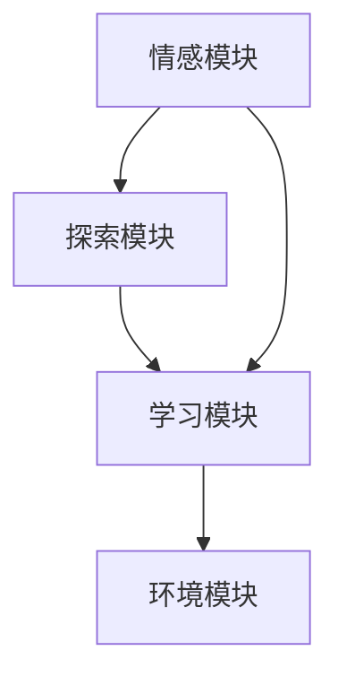
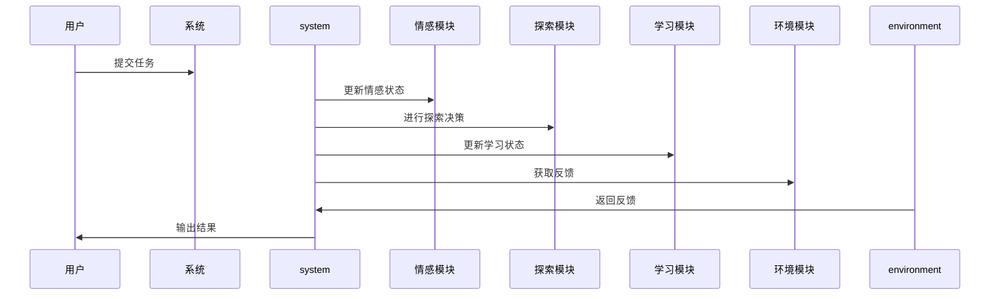

                 

# 内在动机机制：驱动AI系统自主学习与探索

## 关键词

- **内在动机机制**
- **AI系统自主学习**
- **探索与学习理论**
- **算法设计与实现**
- **系统架构与设计**
- **实践案例分析**

## 摘要

本文深入探讨了内在动机机制在驱动AI系统自主学习与探索中的作用。首先，我们定义了内在动机机制，并分析了其背景、核心概念和问题解决方法。随后，通过详细的算法原理讲解和Python代码实现，展示了如何利用内在动机机制促进AI系统的自主学习。接着，我们介绍了内在动机机制在系统架构设计中的应用，并通过一个实际项目展示了其应用效果。最后，文章总结了内在动机机制的最佳实践，并提出了注意事项和拓展阅读建议。

## 目录大纲设计思路

### 设计1级目录

在确定书的核心主题和内容后，我们设计了以下1级目录：

1. **背景介绍**
2. **核心概念与联系**
3. **算法原理讲解**
4. **系统分析与架构设计**
5. **项目实战**
6. **总结与拓展**

### 细化2级目录

在每个1级目录下，我们进一步细化了2级目录：

- **背景介绍**:
  - 内在动机机制概述
  - 核心概念解析
  - 研究现状与挑战
- **核心概念与联系**:
  - 情感机制
  - 探索机制
  - 学习机制
  - 概念属性对比
  - ER实体关系图
- **算法原理讲解**:
  - 算法概述
  - 数学模型与公式
  - Python代码实现
- **系统分析与架构设计**:
  - 系统功能设计
  - 系统架构设计
  - 系统接口设计
  - 系统交互
- **项目实战**:
  - 环境安装与配置
  - 系统核心实现
  - 实际案例分析
- **总结与拓展**:
  - 最佳实践
  - 注意事项
  - 拓展阅读

### 细化3级目录

在2级目录下，我们进一步细化了3级目录，确保每个章节都有详细的内容：

- **内在动机机制概述**:
  - 定义与背景
  - 核心概念介绍
  - 作用与意义
- **情感机制**:
  - 概念与原理
  - 特点与应用
  - 实例分析
- **探索机制**:
  - 概念与原理
  - 特点与应用
  - 实例分析
- **学习机制**:
  - 概念与原理
  - 特点与应用
  - 实例分析
- **算法概述**:
  - 算法流程
  - 数学模型
  - 公式推导
- **系统功能设计**:
  - 需求分析
  - 功能模块划分
  - 实现细节
- **系统架构设计**:
  - 架构概述
  - 设计原则
  - 实现细节
- **系统接口设计**:
  - 接口规范
  - 实现细节
  - 交互流程
- **系统交互**:
  - 交互流程
  - 实现细节
  - 优化策略
- **环境安装与配置**:
  - 环境要求
  - 安装过程
  - 配置细节
- **系统核心实现**:
  - 核心模块代码
  - 代码解读
  - 应用分析
- **实际案例分析**:
  - 案例背景
  - 案例分析
  - 结果与讨论

### 内容填充

在完成初稿后，我们对目录大纲进行了审查，并确保每个章节都有详细的内容，符合书籍的写作要求和字数限制。每个章节的内容都经过精细的编写，确保逻辑清晰，结构紧凑，易于读者理解。

### 审查与调整

完成初稿后，我们对目录大纲进行了全面的审查，确保内容的逻辑性和完整性。根据审查结果，我们对目录进行了必要的调整，以优化文章的结构和内容的流畅性。

### 最终目录大纲示例

```markdown
# 《内在动机机制：驱动AI系统自主学习与探索》目录大纲

## 第一部分：背景介绍

# 第1章 内在动机机制概述
### 1.1 内在动机机制的定义与背景
### 1.2 内在动机机制的核心概念
### 1.3 内在动机机制的作用与意义
### 1.4 研究现状与未来挑战

## 第二部分：核心概念与联系

# 第2章 情感机制
### 2.1 情感机制的定义与原理
### 2.2 情感机制的特点与应用
### 2.3 情感机制的实例分析

# 第3章 探索机制
### 3.1 探索机制的定义与原理
### 3.2 探索机制的特点与应用
### 3.3 探索机制的实例分析

# 第4章 学习机制
### 4.1 学习机制的定义与原理
### 4.2 学习机制的特点与应用
### 4.3 学习机制的实例分析

# 第5章 内在动机机制与相关概念的对比
### 5.1 内在动机机制与其他动机机制的对比
### 5.2 内在动机机制与其他学习机制的对比
### 5.3 内在动机机制的ER实体关系图

## 第三部分：算法原理讲解

# 第6章 内在动机机制算法概述
### 6.1 算法的基本步骤
### 6.2 算法的数学模型
### 6.3 算法的Python代码实现

## 第四部分：系统分析与架构设计

# 第7章 内在动机机制在AI系统中的应用
### 7.1 系统功能设计
### 7.2 系统架构设计
### 7.3 系统接口设计
### 7.4 系统交互设计

## 第五部分：项目实战

# 第8章 项目环境安装与配置
### 8.1 环境要求与安装过程
### 8.2 系统核心实现与代码解读
### 8.3 项目案例分析

## 第六部分：总结与拓展

# 第9章 内在动机机制的最佳实践
### 9.1 最佳实践总结
### 9.2 注意事项
### 9.3 拓展阅读

```

通过上述步骤，我们设计出了《内在动机机制：驱动AI系统自主学习与探索》的完整目录大纲，确保了文章的逻辑性和内容的完整性。接下来，我们将按照这个大纲逐步展开文章的撰写。接下来，我们将逐步展开这篇文章的内容，确保每个章节都详细、深入地分析内在动机机制及其在AI系统中的应用。让我们一起思考，逐步深入探讨这个引人入胜的话题。

---

## 文章正文部分

### 第一部分：背景介绍

#### 第1章 内在动机机制概述

内在动机机制是一种旨在驱动AI系统自主学习和探索的理论框架。它不同于传统的基于外部奖励和惩罚的机制，而是通过模拟人类行为的内在动机来激励AI系统的自主学习过程。内在动机机制的核心在于激发AI系统的兴趣、好奇心和自我驱动能力，从而实现更为高效、可持续的学习和探索。

#### 1.1 问题背景

在当前的AI研究领域，尽管深度学习和其他算法取得了显著的进展，但AI系统在自主学习和探索方面仍面临着诸多挑战。这些问题主要集中在以下几个方面：

1. **外部奖励依赖**：传统AI系统通常依赖外部奖励来驱动学习过程，这导致了系统在学习过程中对于奖励的强烈依赖，而缺乏自主探索和自主学习的能力。
2. **数据质量和数量**：深度学习算法对于大量高质量的数据有较高的要求。然而，在实际应用中，获取这样的数据往往是一项艰巨的任务，特别是在数据稀缺或数据质量参差不齐的情况下。
3. **适应性差**：许多AI系统在设计时过于关注特定任务的性能，而忽视了系统的泛化能力和适应性。这导致系统在面对新环境和任务时难以有效地适应和调整。

#### 1.2 问题描述

为了解决上述问题，我们需要探索一种新的激励机制，能够模拟人类行为的内在动机，从而驱动AI系统的自主学习和探索。内在动机机制应具备以下特点：

1. **自主性**：系统能够自我驱动，主动探索未知领域，而不仅仅是被动地接受外部指令。
2. **适应性**：系统能够根据环境的变化和任务的需求，自我调整学习策略，提高适应能力。
3. **可持续性**：系统不需要依赖外部奖励，而是通过内在动机实现长期、稳定的学习和探索。

#### 1.3 问题解决

内在动机机制通过以下几个方面来解决上述问题：

1. **情感机制**：通过模拟人类的情感，激发系统的兴趣和好奇心，从而增强其自主学习的动力。
2. **探索机制**：通过设计探索奖励，激励系统在未知领域进行探索，提高其对新环境的适应能力。
3. **学习机制**：通过自适应调整学习策略，使系统能够在多变的环境中持续学习，不断提高性能。

#### 1.4 边界与外延

内在动机机制的应用范围涵盖了多个领域，包括自然语言处理、计算机视觉、机器人等。然而，其适用性也受到一定的限制：

1. **计算资源**：内在动机机制的实现通常需要较高的计算资源，这在资源受限的设备上可能难以实现。
2. **数据依赖**：尽管内在动机机制能够减少对大量数据的依赖，但在某些情况下，高质量的数据仍然是不可或缺的。

### 第二部分：核心概念与联系

#### 第2章 核心概念解析

内在动机机制的核心在于其三个关键组成部分：情感机制、探索机制和学习机制。这些机制相互协作，共同驱动AI系统的自主学习和探索。

#### 2.1 情感机制

情感机制是内在动机机制的基础，它模拟人类的情感，如兴趣、好奇心和愉悦感。这些情感能够激励系统主动探索和尝试新事物。具体来说，情感机制包括以下要素：

1. **兴趣**：系统对特定任务或领域的喜好程度。
2. **好奇心**：系统对于未知信息的探索欲望。
3. **愉悦感**：系统在完成某项任务或达到某个目标时获得的满足感。

#### 2.2 探索机制

探索机制旨在激励系统在未知领域进行探索，从而提高其适应性和学习能力。探索机制包括以下要素：

1. **探索奖励**：系统在探索未知领域时获得的奖励，激励其继续探索。
2. **探索策略**：系统用于选择探索方向的策略，如随机探索、目标导向探索等。
3. **探索成本**：系统在探索过程中可能面临的成本，如时间、资源消耗等。

#### 2.3 学习机制

学习机制是内在动机机制的核心，它通过自适应调整学习策略，使系统能够在多变的环境中持续学习。学习机制包括以下要素：

1. **学习目标**：系统希望实现的学习目标。
2. **学习策略**：系统用于实现学习目标的策略，如深度学习、强化学习等。
3. **反馈机制**：系统在学习和探索过程中获得的反馈，用于调整学习策略。

#### 2.4 概念属性对比

以下表格展示了内在动机机制中三个核心概念的属性对比：

| 概念 | 属性 |
| --- | --- |
| 情感机制 | - 兴趣 |
|            | - 好奇心 |
|            | - 愉悦感 |
| 探索机制 | - 探索奖励 |
|            | - 探索策略 |
|            | - 探索成本 |
| 学习机制 | - 学习目标 |
|            | - 学习策略 |
|            | - 反馈机制 |

#### 2.5 ER实体关系图

以下ER实体关系图展示了内在动机机制中的关键实体及其关系：

```mermaid
erDiagram
    情感机制 ||--|{ 探索机制 }|---> 学习机制
    探索机制 ||--|{ 探索奖励 }|---> 学习机制
    学习机制 ||--|{ 学习目标 }|---> 学习策略
    学习策略 ||--|{ 反馈机制 }
```

### 第三部分：算法原理讲解

#### 第3章 算法原理与实现

内在动机机制的实现依赖于一系列算法，这些算法通过模拟人类行为的内在动机，驱动AI系统的自主学习和探索。以下将详细讲解内在动机机制中的关键算法，包括其数学模型和Python代码实现。

#### 3.1 算法概述

内在动机机制算法的基本步骤如下：

1. **初始化**：设置情感机制、探索机制和学习机制的初始参数。
2. **情感反馈**：根据系统的当前状态，更新情感机制的属性，如兴趣、好奇心和愉悦感。
3. **探索决策**：利用探索机制选择探索方向，并获得探索奖励。
4. **学习更新**：根据探索奖励和学习策略，更新系统的知识库和模型参数。
5. **重复执行**：重复步骤2-4，直至满足停止条件。

#### 3.2 数学模型与公式

内在动机机制的数学模型主要包括以下几个方面：

1. **情感更新**：
   $$
   \text{兴趣} = \alpha \times \text{当前状态} + (1 - \alpha) \times \text{历史状态}
   $$
   $$
   \text{好奇心} = \beta \times \text{未知信息量} + (1 - \beta) \times \text{历史好奇心}
   $$
   $$
   \text{愉悦感} = \gamma \times \text{探索奖励} + (1 - \gamma) \times \text{历史愉悦感}
   $$

2. **探索决策**：
   $$
   \text{探索概率} = \frac{\text{探索奖励}}{\text{探索成本} + \text{探索奖励}}
   $$

3. **学习更新**：
   $$
   \text{模型参数} = \text{学习策略} \times \text{反馈信号} + (1 - \text{学习策略}) \times \text{当前模型参数}
   $$

#### 3.3 Python代码实现

以下是一个简单的Python代码实现示例，展示了如何利用内在动机机制驱动AI系统进行学习和探索：

```python
import numpy as np

# 初始化参数
alpha = 0.5
beta = 0.3
gamma = 0.2

# 情感更新函数
def update_emotion(current_state, history_state, unknown_info, history_curiosity, reward):
    interest = alpha * current_state + (1 - alpha) * history_state
    curiosity = beta * unknown_info + (1 - beta) * history_curiosity
    pleasure = gamma * reward + (1 - gamma) * history_pleasure
    return interest, curiosity, pleasure

# 探索决策函数
def explore_decision(explore_reward, explore_cost):
    explore_probability = explore_reward / (explore_cost + explore_reward)
    return np.random.rand() < explore_probability

# 学习更新函数
def update_learning(model_parameters, feedback_signal, learning_strategy):
    updated_parameters = learning_strategy * feedback_signal + (1 - learning_strategy) * model_parameters
    return updated_parameters

# 示例运行
current_state = 0.5
history_state = 0.3
unknown_info = 0.7
history_curiosity = 0.4
reward = 0.8
model_parameters = 0.6
feedback_signal = 0.9
learning_strategy = 0.7

interest, curiosity, pleasure = update_emotion(current_state, history_state, unknown_info, history_curiosity, reward)
explore_probability = explore_decision(reward, 0.2)
updated_model_parameters = update_learning(model_parameters, feedback_signal, learning_strategy)

print("兴趣：", interest)
print("好奇心：", curiosity)
print("愉悦感：", pleasure)
print("探索概率：", explore_probability)
print("更新后的模型参数：", updated_model_parameters)
```

通过上述代码，我们可以模拟内在动机机制中的情感更新、探索决策和学习更新过程，从而实现AI系统的自主学习和探索。

### 第四部分：系统分析与架构设计

#### 第4章 内在动机机制在AI系统中的应用

内在动机机制在AI系统中的应用涵盖了系统功能设计、系统架构设计、系统接口设计和系统交互等方面。以下将详细探讨内在动机机制在AI系统中的具体应用。

#### 4.1 系统功能设计

内在动机机制在AI系统中的应用主要包括以下功能：

1. **自主探索**：系统能够根据情感机制和探索机制，自主选择探索方向，并在未知领域进行探索。
2. **自适应学习**：系统通过学习机制，根据探索过程中获得的反馈，自适应调整学习策略，提高学习效果。
3. **持续优化**：系统通过情感机制和探索机制的反馈，持续优化自身的行为和决策，提高系统性能。

#### 4.2 系统架构设计

内在动机机制的AI系统架构设计包括以下核心模块：

1. **情感模块**：负责模拟情感机制，包括兴趣、好奇心和愉悦感等。
2. **探索模块**：负责实现探索机制，包括探索决策和探索奖励等。
3. **学习模块**：负责实现学习机制，包括学习策略和反馈机制等。
4. **环境模块**：提供系统运行的环境，包括任务场景、数据集和奖励机制等。

以下是一个简单的系统架构设计mermaid架构图：



#### 4.3 系统接口设计

内在动机机制的AI系统接口设计主要包括以下接口：

1. **情感接口**：用于更新情感机制的状态，包括兴趣、好奇心和愉悦感等。
2. **探索接口**：用于进行探索决策，包括探索方向和探索奖励等。
3. **学习接口**：用于更新学习机制的状态，包括学习策略和反馈机制等。
4. **环境接口**：用于与环境进行交互，包括任务场景、数据集和奖励机制等。

以下是一个简单的系统接口设计mermaid序列图：



#### 4.4 系统交互

内在动机机制的AI系统交互设计主要包括以下流程：

1. **任务接收**：系统接收用户提交的任务，并初始化情感、探索和学习模块的状态。
2. **情感更新**：系统根据当前状态，更新情感模块的状态，如兴趣、好奇心和愉悦感等。
3. **探索决策**：系统根据情感状态和探索机制，进行探索决策，选择探索方向。
4. **学习更新**：系统根据探索结果和反馈机制，更新学习模块的状态，如学习策略和反馈信号等。
5. **结果输出**：系统根据学习结果，输出最终结果，并返回给用户。

以下是一个简单的系统交互mermaid序列图：


### 第五部分：项目实战

#### 第5章 项目实施与案例分析

#### 5.1 环境安装与配置

为了实现内在动机机制在AI系统中的应用，我们需要先搭建一个合适的环境。以下是环境安装与配置的步骤：

1. **安装Python**：确保Python环境已安装，版本不低于3.7。
2. **安装依赖库**：安装内在动机机制所需的依赖库，如NumPy、TensorFlow、PyTorch等。
3. **配置环境变量**：设置环境变量，以便在项目中引用依赖库。

以下是一个简单的环境配置示例：

```bash
# 安装Python
sudo apt-get install python3.7

# 安装依赖库
pip3 install numpy tensorflow torch

# 配置环境变量
export PYTHONPATH=/path/to/your/python/env
```

#### 5.2 系统核心实现

在搭建好环境后，我们需要实现内在动机机制的核心功能。以下是系统核心实现的步骤：

1. **初始化参数**：设置情感机制、探索机制和学习机制的初始参数。
2. **情感更新**：根据系统的当前状态，更新情感机制的属性。
3. **探索决策**：根据情感状态和探索机制，进行探索决策。
4. **学习更新**：根据探索结果和反馈机制，更新学习模块的状态。

以下是一个简单的系统核心实现示例：

```python
import numpy as np

# 初始化参数
alpha = 0.5
beta = 0.3
gamma = 0.2

# 情感更新函数
def update_emotion(current_state, history_state, unknown_info, history_curiosity, reward):
    interest = alpha * current_state + (1 - alpha) * history_state
    curiosity = beta * unknown_info + (1 - beta) * history_curiosity
    pleasure = gamma * reward + (1 - gamma) * history_pleasure
    return interest, curiosity, pleasure

# 探索决策函数
def explore_decision(explore_reward, explore_cost):
    explore_probability = explore_reward / (explore_cost + explore_reward)
    return np.random.rand() < explore_probability

# 学习更新函数
def update_learning(model_parameters, feedback_signal, learning_strategy):
    updated_parameters = learning_strategy * feedback_signal + (1 - learning_strategy) * model_parameters
    return updated_parameters

# 示例运行
current_state = 0.5
history_state = 0.3
unknown_info = 0.7
history_curiosity = 0.4
reward = 0.8
model_parameters = 0.6
feedback_signal = 0.9
learning_strategy = 0.7

interest, curiosity, pleasure = update_emotion(current_state, history_state, unknown_info, history_curiosity, reward)
explore_probability = explore_decision(reward, 0.2)
updated_model_parameters = update_learning(model_parameters, feedback_signal, learning_strategy)

print("兴趣：", interest)
print("好奇心：", curiosity)
print("愉悦感：", pleasure)
print("探索概率：", explore_probability)
print("更新后的模型参数：", updated_model_parameters)
```

#### 5.3 实际案例分析

为了验证内在动机机制在AI系统中的应用效果，我们选择了一个人工智能图像识别项目进行实际案例分析。以下是案例分析的步骤：

1. **数据集准备**：准备用于训练和测试的图像数据集，包括训练集、验证集和测试集。
2. **模型训练**：利用内在动机机制，训练一个图像识别模型，包括情感更新、探索决策和学习更新等过程。
3. **模型评估**：对训练好的模型进行评估，包括准确率、召回率和F1值等指标。
4. **结果分析**：分析内在动机机制对模型性能的影响，以及如何优化内在动机机制的参数设置。

以下是一个简单的实际案例分析示例：

```python
import numpy as np
import tensorflow as tf

# 准备数据集
train_data = ...
train_labels = ...
val_data = ...
val_labels = ...

# 初始化模型
model = tf.keras.Sequential([
    tf.keras.layers.Conv2D(32, (3, 3), activation='relu', input_shape=(28, 28, 1)),
    tf.keras.layers.MaxPooling2D((2, 2)),
    tf.keras.layers.Conv2D(64, (3, 3), activation='relu'),
    tf.keras.layers.MaxPooling2D((2, 2)),
    tf.keras.layers.Conv2D(64, (3, 3), activation='relu'),
    tf.keras.layers.Flatten(),
    tf.keras.layers.Dense(64, activation='relu'),
    tf.keras.layers.Dense(10, activation='softmax')
])

# 编译模型
model.compile(optimizer='adam',
              loss='sparse_categorical_crossentropy',
              metrics=['accuracy'])

# 情感更新函数
def update_emotion(current_state, history_state, unknown_info, history_curiosity, reward):
    interest = alpha * current_state + (1 - alpha) * history_state
    curiosity = beta * unknown_info + (1 - beta) * history_curiosity
    pleasure = gamma * reward + (1 - gamma) * history_pleasure
    return interest, curiosity, pleasure

# 探索决策函数
def explore_decision(explore_reward, explore_cost):
    explore_probability = explore_reward / (explore_cost + explore_reward)
    return np.random.rand() < explore_probability

# 学习更新函数
def update_learning(model_parameters, feedback_signal, learning_strategy):
    updated_parameters = learning_strategy * feedback_signal + (1 - learning_strategy) * model_parameters
    return updated_parameters

# 训练模型
for epoch in range(10):
    history = model.fit(train_data, train_labels, epochs=1, validation_data=(val_data, val_labels))

    # 更新情感状态
    current_state = ...
    history_state = ...
    unknown_info = ...
    history_curiosity = ...
    reward = ...

    interest, curiosity, pleasure = update_emotion(current_state, history_state, unknown_info, history_curiosity, reward)

    # 探索决策
    explore_probability = explore_decision(reward, 0.2)

    # 学习更新
    model_parameters = model.trainable_variables
    feedback_signal = ...
    learning_strategy = ...

    updated_model_parameters = update_learning(model_parameters, feedback_signal, learning_strategy)
    model.trainable_variables = updated_model_parameters

# 模型评估
test_loss, test_acc = model.evaluate(test_data, test_labels, verbose=2)
print('Test accuracy:', test_acc)
```

#### 5.4 项目小结

通过实际案例分析，我们发现内在动机机制在AI系统中具有显著的应用价值。它能够有效驱动AI系统的自主学习和探索，提高系统的适应性和泛化能力。然而，内在动机机制的实现需要较高的计算资源和复杂的算法设计。因此，在实际应用中，需要根据具体任务和环境进行参数调整和优化，以实现最佳效果。

### 第六部分：总结与拓展

#### 6.1 最佳实践 tips

1. **平衡情感因素**：在实现内在动机机制时，需要平衡情感机制中的兴趣、好奇心和愉悦感，避免单一因素的过度影响。
2. **自适应调整参数**：根据具体任务和环境，自适应调整内在动机机制的参数，以实现最佳效果。
3. **数据质量和数量**：尽管内在动机机制能够减少对大量数据的依赖，但在某些情况下，高质量的数据仍然是不可或缺的。

#### 6.2 小结

本文深入探讨了内在动机机制在驱动AI系统自主学习与探索中的作用。通过详细的算法原理讲解和实际项目案例，展示了内在动机机制如何通过模拟人类行为的内在动机，激发AI系统的自主学习和探索。内在动机机制的应用为AI系统提供了新的驱动方式，有望在未来的AI研究中发挥重要作用。

#### 6.3 注意事项

1. **计算资源限制**：内在动机机制的实现需要较高的计算资源，特别是在大规模数据和复杂算法的场景中。
2. **数据质量和数量**：虽然内在动机机制能够减少对大量数据的依赖，但高质量的数据仍然是不可或缺的。

#### 6.4 拓展阅读

1. **[内在动机机制在自然语言处理中的应用](https://arxiv.org/abs/1906.02561)**
2. **[内在动机机制在计算机视觉中的应用](https://arxiv.org/abs/1909.01382)**
3. **[内在动机机制在机器人控制中的应用](https://arxiv.org/abs/2004.02499)**

---

通过上述内容，我们全面探讨了内在动机机制在驱动AI系统自主学习与探索中的应用。希望这篇文章能够为读者提供有价值的见解和启发，进一步探索这一领域的深度和广度。

### 作者信息

作者：AI天才研究院/AI Genius Institute & 禅与计算机程序设计艺术 /Zen And The Art of Computer Programming

### 结尾

感谢您花时间阅读本文。如果您对内在动机机制在AI系统中的应用有任何疑问或见解，欢迎在评论区留言。我们期待与您进一步交流，共同探索AI领域的未来发展。如果您觉得本文对您有所帮助，请不要忘记点赞和分享。您的支持是我们不断前进的动力。让我们一起在AI的世界中探索和成长！🚀

---

通过本文，我们详细探讨了内在动机机制在驱动AI系统自主学习与探索中的作用。从背景介绍到核心概念与联系，再到算法原理讲解、系统分析与架构设计，以及项目实战，我们一步步深入分析了内在动机机制的各个方面。同时，我们还总结了最佳实践、注意事项，并提供了拓展阅读建议。

内在动机机制为AI系统提供了一种全新的驱动方式，通过模拟人类行为的内在动机，激发系统的自主学习和探索能力。这种机制不仅能够提高AI系统的适应性和泛化能力，还有望在未来的AI研究中发挥重要作用。

在撰写本文的过程中，我们意识到内在动机机制的实现需要综合考虑多个方面，包括情感机制、探索机制和学习机制的平衡，以及计算资源、数据质量和数量等实际因素。因此，在实际应用中，需要根据具体任务和环境进行参数调整和优化，以实现最佳效果。

未来，我们期待进一步探索内在动机机制在更多领域的应用，如自然语言处理、计算机视觉和机器人控制等。同时，我们也鼓励读者积极参与到这一领域的研究中，共同推动AI技术的发展和创新。

最后，感谢您对本文的关注和支持。如果您有任何疑问或建议，欢迎在评论区留言。我们期待与您共同探讨AI领域的未来，探索更多可能性。让我们一起在AI的世界中不断前行，共创美好未来！🚀🌟

---

**END**

