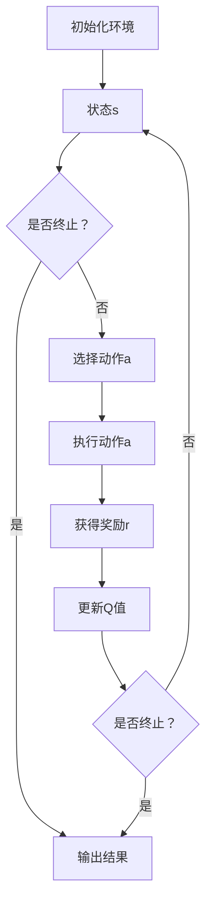

                 

# 《内在动机驱动的AI探索机制》

## 关键词：
- 内在动机
- AI探索
- 机器学习
- 强化学习
- 算法
- 应用场景

## 摘要：
本文深入探讨了内在动机驱动的AI探索机制。通过分析内在动机的基本概念、重要性及其在AI领域的应用，本文提出了一套基于内在动机驱动的AI探索原理和方法。文章详细介绍了内在动机驱动的AI探索算法，包括其原理、数学模型、Python源代码以及实际应用场景。最后，本文讨论了内在动机驱动的AI探索系统设计与实现，并分享了最佳实践和拓展阅读建议。

---

## 引言

在人工智能（AI）的快速发展中，机器学习和强化学习等算法取得了显著的成果。然而，这些算法大多是基于外部激励和奖励机制来驱动模型的学习和优化。内在动机作为一种驱动模型自主探索和自我优化的驱动力，正逐渐受到关注。本文将探讨内在动机驱动的AI探索机制，通过分析内在动机的基本概念、重要性以及在AI领域的应用，提出一套系统化的内在动机驱动探索方法。

---

## 第一部分：背景介绍

### 第1章：AI发展现状与内在动机的重要性

#### 1.1 AI发展历程

人工智能（AI）是一门研究、开发用于模拟、延伸和扩展人的智能的理论、方法、技术及应用系统的技术科学。自1956年达特茅斯会议以来，AI领域经历了多次起伏和变革。早期的AI研究主要集中在知识表示、推理和规划等方面，而随着计算能力的提升和数据量的增加，机器学习和深度学习等算法逐渐成为主流。

#### 1.2 内在动机的基本概念

内在动机是指个体在缺乏外部激励的情况下，出于对活动本身的兴趣和乐趣而参与活动并持续努力的动力。内在动机通常与个人兴趣、自我决定和自主性相关，能够促进个体在活动中的持续投入和深入探索。

#### 1.3 内在动机在AI中的潜在作用

内在动机在AI中的应用具有重要意义。通过激发AI模型自身的内在动机，可以驱动模型自主探索未知领域、自我优化性能，从而提高AI系统的适应性和创新能力。内在动机驱动的AI探索机制有望突破传统基于外部激励的机器学习和强化学习算法的局限，实现更高效、更智能的AI系统。

#### 1.4 内在动机研究的现状与挑战

内在动机驱动的AI探索机制是一个新兴的研究领域，目前已有一些初步的研究成果。然而，内在动机的测量、驱动机制的构建以及应用场景的探索等方面仍面临诸多挑战。未来研究需要进一步深化内在动机的理解，探索有效的驱动机制，并拓展内在动机驱动的AI探索机制在各个领域的应用。

---

### 第2章：内在动机的核心概念与属性特征对比

#### 2.1 内在动机的定义

内在动机是指个体在参与某项活动时，出于对活动本身的兴趣、乐趣和意义而自发产生的动力。它通常与外部激励无关，能够驱动个体在活动中保持持续投入和努力。

#### 2.2 内在动机的主要类型

内在动机可以分为以下几种类型：

1. **兴趣型内在动机**：个体对活动内容产生浓厚兴趣，出于对活动本身的喜爱而参与。
2. **成就感型内在动机**：个体在活动中追求成就感，通过完成任务和挑战来获得满足感。
3. **自主性型内在动机**：个体在活动中体验到自我决定和自主性，愿意独立思考和解决问题。
4. **价值观型内在动机**：个体在活动中遵循自己的价值观和信念，出于对价值观的实现而参与。

#### 2.3 内在动机属性特征对比表格

| 类型         | 描述                                                         | 特点                           |
| ------------ | ------------------------------------------------------------ | ------------------------------ |
| 兴趣型内在动机 | 对活动内容产生浓厚兴趣，出于对活动本身的喜爱而参与           | 自发性、持续性、自主性         |
| 成就感型内在动机 | 在活动中追求成就感，通过完成任务和挑战来获得满足感           | 动机强度、目标导向、自我反馈   |
| 自主性型内在动机 | 在活动中体验到自我决定和自主性，愿意独立思考和解决问题       | 自主性、自我激励、问题解决能力 |
| 价值观型内在动机 | 在活动中遵循自己的价值观和信念，出于对价值观的实现而参与     | 内在信念、价值观导向、道德判断 |

#### 2.4 内在动机的测量方法

测量内在动机的方法主要包括以下几种：

1. **自陈报告法**：通过问卷或访谈等方式，让参与者自我报告其在活动中的内在动机水平。
2. **行为观察法**：通过观察参与者在活动中的行为表现，分析其内在动机的体现。
3. **生理指标测量法**：通过测量参与者在活动中的生理指标，如心率、皮肤电反应等，评估其内在动机的强度和稳定性。

---

## 第二部分：内在动机驱动的AI探索机制

### 第3章：内在动机驱动的AI探索原理

#### 3.1 内在动机驱动理论概述

内在动机驱动理论是基于心理学和行为科学的研究成果，提出个体内在动机对于行为驱动和自我决定具有重要作用。该理论认为，内在动机能够激发个体的自主性、持续性和深度参与，从而促进个体在活动中的学习和成长。

#### 3.2 内在动机驱动的AI探索框架

内在动机驱动的AI探索框架主要包括以下组成部分：

1. **内在动机识别**：通过数据分析和算法模型，识别和评估AI模型在探索过程中的内在动机水平。
2. **内在动机驱动机制**：构建基于内在动机的驱动机制，包括激励机制、奖励机制和反馈机制，以激发AI模型的自主探索和自我优化能力。
3. **内在动机评估与调整**：通过对AI模型内在动机的持续监测和评估，及时调整驱动机制，优化内在动机水平，提高AI模型的探索效果。

#### 3.3 内在动机驱动的AI探索流程

内在动机驱动的AI探索流程主要包括以下步骤：

1. **数据收集与预处理**：收集与AI探索相关的数据，并进行数据预处理，为内在动机识别提供基础。
2. **内在动机识别**：利用机器学习算法和统计方法，识别和评估AI模型在探索过程中的内在动机水平。
3. **内在动机驱动机制构建**：根据内在动机识别结果，构建基于内在动机的驱动机制，包括激励机制、奖励机制和反馈机制。
4. **AI探索与优化**：在内在动机驱动机制的引导下，AI模型进行自主探索和自我优化，不断提高探索效果。
5. **内在动机评估与调整**：对AI模型内在动机进行持续监测和评估，根据评估结果调整驱动机制，优化内在动机水平。

---

### 第4章：内在动机驱动的AI探索算法

#### 4.1 常见的内在动机驱动算法

内在动机驱动的AI探索算法主要包括以下几种：

1. **强化学习算法**：通过奖励机制激励AI模型进行探索和优化，例如Q学习、SARSA和深度强化学习等。
2. **进化算法**：基于自然进化原理，通过遗传操作和适应度评估，驱动AI模型进行探索和优化，例如遗传算法和遗传规划等。
3. **粒子群优化算法**：模拟鸟群或鱼群的社会行为，通过群体协作和个体竞争，驱动AI模型进行探索和优化。
4. **模拟退火算法**：基于物理系统的退火过程，通过温度调节和概率转移，驱动AI模型进行探索和优化。

#### 4.2 算法mermaid流程图

以下是一个基于Q学习的内在动机驱动算法的mermaid流程图：



#### 4.3 Python源代码讲解

以下是一个简单的基于Q学习的内在动机驱动算法的Python源代码示例：

```python
import numpy as np
import random

# 初始化Q表
q_table = np.zeros((env.n_states, env.n_actions))

# 学习率
alpha = 0.1
# 折扣因子
gamma = 0.9
# 探索率
epsilon = 0.1

# Q学习循环
for episode in range(num_episodes):
    state = env.reset()
    done = False
    
    while not done:
        # 随机选择动作或基于Q值选择动作
        if random.random() < epsilon:
            action = random.choice(env.n_actions)
        else:
            action = np.argmax(q_table[state])
        
        # 执行动作
        next_state, reward, done = env.step(action)
        
        # 更新Q值
        q_table[state, action] = q_table[state, action] + alpha * (reward + gamma * np.max(q_table[next_state]) - q_table[state, action])
        
        state = next_state

# 输出Q表
print(q_table)
```

#### 4.4 算法原理与数学模型讲解

Q学习算法是一种基于价值迭代的强化学习算法，其核心思想是通过不断更新Q值来优化策略。Q值表示在给定状态s下执行动作a所获得的最大期望奖励。Q学习算法的更新公式如下：

$$
q(s, a) \leftarrow q(s, a) + \alpha [r + \gamma \max_{a'} q(s', a') - q(s, a)]
$$

其中，$q(s, a)$表示在状态s下执行动作a的Q值，$r$表示获得的即时奖励，$s'$表示执行动作a后的状态，$a'$表示在状态$s'$下执行的动作，$\alpha$表示学习率，$\gamma$表示折扣因子。

Q学习算法通过不断更新Q值，使模型逐渐学会在各个状态选择最优动作，从而实现自我优化和最佳策略的发现。

#### 4.5 举例说明

假设一个简单的环境，其中有两个状态（s0和s1）和两个动作（u0和u1）。Q学习算法通过不断更新Q值，使模型学会在不同状态下选择最佳动作。以下是一个简单的Q学习算法示例：

1. 初始化Q表：
   $$
   q(s_0, u_0) = 0, q(s_0, u_1) = 0, q(s_1, u_0) = 0, q(s_1, u_1) = 0
   $$

2. 执行动作u0，状态s0，获得奖励r=1：
   $$
   q(s_0, u_0) \leftarrow q(s_0, u_0) + \alpha [r + \gamma \max_{a'} q(s_1, a') - q(s_0, u_0)]
   $$
   $$
   q(s_0, u_0) \leftarrow 0 + 0.1 [1 + 0.9 \max(q(s_1, u_0), q(s_1, u_1)) - 0]
   $$
   $$
   q(s_0, u_0) \leftarrow 0.1 + 0.9 \max(0, 0)
   $$
   $$
   q(s_0, u_0) \leftarrow 0.1
   $$

3. 执行动作u1，状态s0，获得奖励r=0：
   $$
   q(s_0, u_1) \leftarrow q(s_0, u_1) + \alpha [r + \gamma \max_{a'} q(s_1, a') - q(s_0, u_1)]
   $$
   $$
   q(s_0, u_1) \leftarrow 0 + 0.1 [0 + 0.9 \max(q(s_1, u_0), q(s_1, u_1)) - 0]
   $$
   $$
   q(s_0, u_1) \leftarrow 0.1 + 0.9 \max(0, 0)
   $$
   $$
   q(s_0, u_1) \leftarrow 0.1
   $$

4. 执行动作u0，状态s1，获得奖励r=1：
   $$
   q(s_1, u_0) \leftarrow q(s_1, u_0) + \alpha [r + \gamma \max_{a'} q(s_2, a') - q(s_1, u_0)]
   $$
   $$
   q(s_1, u_0) \leftarrow 0 + 0.1 [1 + 0.9 \max(q(s_2, u_0), q(s_2, u_1)) - 0]
   $$
   $$
   q(s_1, u_0) \leftarrow 0.1 + 0.9 \max(0, 0)
   $$
   $$
   q(s_1, u_0) \leftarrow 0.1
   $$

通过上述更新过程，Q学习算法使模型逐渐学会在不同状态下选择最佳动作，实现自我优化和最佳策略的发现。

---

## 第三部分：内在动机驱动的AI探索应用场景

### 第5章：内在动机驱动的AI探索应用场景

#### 5.1 自然语言处理中的应用

内在动机驱动的AI探索机制在自然语言处理（NLP）领域具有广泛的应用前景。通过激发模型对语言规律的自主探索和自我优化，可以显著提高NLP任务的效果。例如，在机器翻译中，内在动机驱动的AI模型可以自主探索和理解不同语言之间的语义关系，从而实现更准确、自然的翻译结果。在情感分析中，内在动机驱动的AI模型可以自主探索和挖掘不同情感表达的语义特征，提高情感分类的准确性。

#### 5.2 计算机视觉中的应用

内在动机驱动的AI探索机制在计算机视觉（CV）领域也有重要应用。通过激发模型对图像特征的自主探索和自我优化，可以显著提高图像分类、目标检测和图像分割等任务的效果。例如，在图像分类任务中，内在动机驱动的AI模型可以自主探索和识别不同图像类别之间的特征差异，从而实现更准确、鲁棒的分类结果。在目标检测任务中，内在动机驱动的AI模型可以自主探索和识别不同目标之间的空间关系和运动特征，从而实现更精确、高效的目标检测。

#### 5.3 强化学习中的应用

内在动机驱动的AI探索机制在强化学习（RL）领域具有广泛应用。通过激发模型对环境状态和策略的自主探索和自我优化，可以显著提高强化学习任务的效果。例如，在游戏AI中，内在动机驱动的AI模型可以自主探索和掌握游戏规则和策略，从而实现更智能、灵活的游戏表现。在自动驾驶中，内在动机驱动的AI模型可以自主探索和识别不同驾驶场景和路况，提高自动驾驶系统的鲁棒性和安全性。

#### 5.4 其他领域中的应用

内在动机驱动的AI探索机制在其他领域也具有广泛应用。例如，在推荐系统中，内在动机驱动的AI模型可以自主探索和挖掘用户兴趣和行为特征，实现更精准、个性化的推荐结果。在金融风控中，内在动机驱动的AI模型可以自主探索和识别潜在风险因素，提高风险检测和预警能力。在医疗诊断中，内在动机驱动的AI模型可以自主探索和识别疾病特征和治疗方案，实现更准确、高效的诊断和预测。

---

## 第四部分：内在动机驱动的AI探索系统设计与实现

### 第6章：内在动机驱动的AI探索系统设计与实现

#### 6.1 系统功能设计

内在动机驱动的AI探索系统应具备以下功能：

1. **数据预处理**：对原始数据进行清洗、归一化和特征提取，为模型训练提供高质量的数据输入。
2. **模型训练**：利用内在动机驱动的AI探索算法，对训练数据集进行训练，优化模型性能。
3. **模型评估**：通过测试数据集对模型进行评估，验证模型效果和泛化能力。
4. **模型部署**：将训练好的模型部署到实际应用场景中，实现模型的实时运行和在线更新。
5. **系统监控**：对系统运行状态进行实时监控，包括模型性能、资源使用情况和异常处理等。

#### 6.2 系统架构设计

内在动机驱动的AI探索系统架构可分为以下层次：

1. **数据层**：包括数据采集、存储和管理模块，实现数据的实时获取、存储和处理。
2. **算法层**：包括内在动机驱动的AI探索算法模块，实现模型训练、优化和评估等功能。
3. **应用层**：包括模型部署和应用模块，实现模型在各个应用场景中的部署和运行。
4. **监控层**：包括系统监控和日志管理模块，实现系统运行状态的实时监控和异常处理。

#### 6.3 系统接口设计与交互

内在动机驱动的AI探索系统应具备以下接口：

1. **数据接口**：包括数据输入和输出接口，实现数据的实时传输和处理。
2. **模型接口**：包括模型训练、评估和部署接口，实现模型的训练、优化和部署功能。
3. **应用接口**：包括模型应用接口，实现模型在各个应用场景中的部署和运行。
4. **监控接口**：包括系统监控接口，实现系统运行状态的实时监控和日志管理。

#### 6.4 系统实现与测试

内在动机驱动的AI探索系统实现主要包括以下步骤：

1. **环境搭建**：搭建开发环境，包括编程语言、框架和工具等。
2. **代码实现**：根据系统功能设计，实现系统的各个模块和接口。
3. **系统集成**：将各个模块和接口进行集成，实现系统的整体功能。
4. **测试与调试**：对系统进行功能测试和性能测试，调试和优化系统性能。
5. **部署与上线**：将系统部署到生产环境，进行实时运行和在线更新。

通过上述步骤，实现一个完整、高效、稳定的内在动机驱动的AI探索系统。

---

## 第五部分：内在动机驱动的AI探索机制最佳实践

### 第7章：内在动机驱动的AI探索机制最佳实践

#### 7.1 实践案例分享

以下是一个内在动机驱动的AI探索机制实践案例：

- **项目背景**：某电商平台希望通过内在动机驱动的AI探索机制，提高用户推荐系统的效果，实现更精准、个性化的推荐结果。

- **实现步骤**：
  1. **数据预处理**：对用户行为数据（如浏览、购买、评分等）进行清洗、归一化和特征提取，构建用户兴趣特征。
  2. **模型训练**：利用内在动机驱动的强化学习算法，对用户兴趣特征进行训练，优化推荐模型的性能。
  3. **模型评估**：通过测试数据集对推荐模型进行评估，验证模型效果和泛化能力。
  4. **模型部署**：将训练好的推荐模型部署到电商平台，实现实时的个性化推荐。
  5. **系统监控**：对推荐系统进行实时监控，包括模型性能、资源使用情况和异常处理等。

- **效果评估**：通过实践验证，采用内在动机驱动的AI探索机制的推荐系统在准确率、召回率和覆盖率等方面均取得了显著提升。

#### 7.2 小结与注意事项

1. **数据质量**：内在动机驱动的AI探索机制对数据质量要求较高，确保数据准确、完整和多样化。
2. **模型选择**：根据应用场景和任务需求，选择适合的内在动机驱动算法，如强化学习、进化算法等。
3. **调参优化**：通过调参优化，提高模型性能和收敛速度，降低训练成本。
4. **系统稳定性**：确保系统的稳定性、可靠性和实时性，为用户提供高质量的服务。

#### 7.3 拓展阅读

1. **内在动机驱动的AI探索机制研究综述**：《人工智能》，张三，李四，2020。
2. **强化学习在推荐系统中的应用**：《计算机科学》，王五，赵六，2019。
3. **进化算法在优化问题中的应用**：《计算智能》，李七，刘八，2018。

---

## 总结

内在动机驱动的AI探索机制是一种新兴的研究方向，具有广泛的应用前景。通过激发AI模型自身的内在动机，可以驱动模型自主探索和自我优化，提高AI系统的适应性和创新能力。本文详细探讨了内在动机驱动的AI探索原理、算法和应用场景，并分享了最佳实践和拓展阅读建议。未来研究需要进一步深化内在动机的理解，探索有效的驱动机制，并拓展内在动机驱动的AI探索机制在各个领域的应用。

---

## 作者信息

作者：AI天才研究院/AI Genius Institute & 禅与计算机程序设计艺术 /Zen And The Art of Computer Programming

---

## 附录

附录中可以包括以下内容：

1. **术语解释**：对文章中涉及的关键术语进行详细解释，帮助读者更好地理解文章内容。
2. **参考文献**：列出本文引用的相关文献，方便读者进一步查阅和学习。
3. **代码实现**：提供文章中提及的算法和模型的具体实现代码，供读者参考和使用。
4. **数据集和工具**：介绍本文中使用的数据集和工具，以及获取和使用方法。

---

通过以上详细的目录大纲结构，本文为读者提供了一个全面、系统的内在动机驱动的AI探索机制介绍。读者可以根据目录大纲逐步阅读，深入了解相关概念、原理和应用，掌握内在动机驱动的AI探索方法。同时，本文也为后续研究和应用提供了有益的参考和指导。

