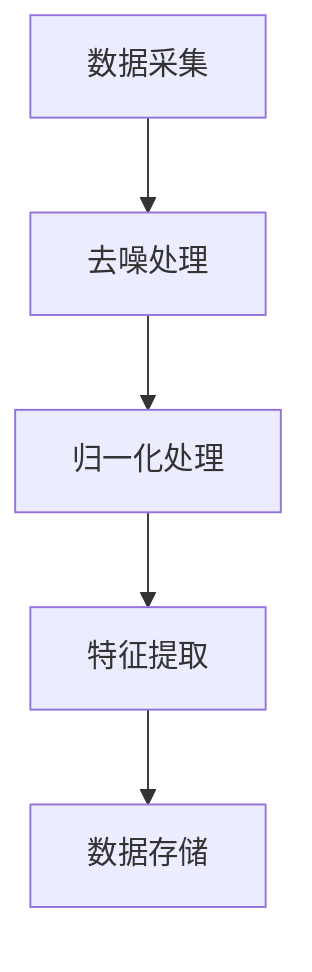
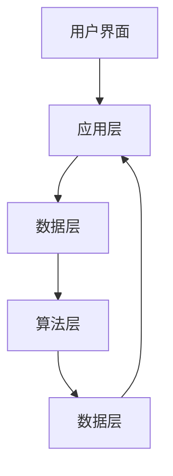
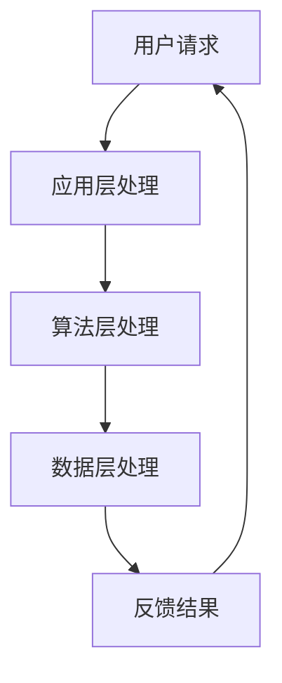

                 

# 内在奖励机制:驱动AI自主学习的核心驱动

> 关键词：内在奖励机制，人工智能，自主学习，强化学习，奖励函数，算法优化，系统架构设计

> 摘要：本文深入探讨了内在奖励机制在人工智能自主学习中的应用，介绍了其核心原理、构建方法以及在实际系统设计与实现中的具体应用。通过一系列逻辑清晰的分析和示例，本文旨在为读者提供一种全面理解和实践内在奖励机制的思路。

## 引言

### 1.1 问题背景

随着人工智能技术的迅猛发展，AI的应用场景日益广泛。然而，AI的学习能力在很大程度上仍依赖于人类专家的指导。尽管深度学习算法在某些任务上已取得了显著的进展，但大多数算法仍需大量标注数据和复杂的超参数调优。如何让AI能够自主学习和适应新环境，成为当前研究的热点问题之一。

### 1.2 问题描述

自主学习是AI实现智能化的关键。然而，在AI的自主学习过程中，如何激发其内在动机、提高学习效率和鲁棒性，是一个亟待解决的问题。传统的机器学习依赖于外部奖励信号，但外部奖励往往难以精确地反映AI的行为价值。因此，设计一种有效的内在奖励机制，以驱动AI的自主学习，显得尤为重要。

### 1.3 问题解决

内在奖励机制旨在通过系统的内部反馈机制，激励AI在学习过程中不断优化自身行为。与外部奖励相比，内在奖励更加贴近AI的学习过程，能够更好地激发AI的内在动机，提高其学习效率和鲁棒性。本文将详细探讨内在奖励机制的设计方法、实现技巧及其在AI自主学习中的应用。

### 1.4 边界与外延

内在奖励机制不仅适用于强化学习，还可以应用于无监督学习和自监督学习等场景。此外，内在奖励机制的设计和实现还需考虑不同应用场景的特殊需求。本文将结合具体案例，探讨内在奖励机制在不同应用场景中的实现方法和优化策略。

## 核心概念与联系

### 2.1 核心概念原理

#### 2.1.1 内在奖励机制

内在奖励机制是一种通过系统内部反馈机制，激励AI学习的行为模式。它通过设计合适的奖励函数，使AI在学习过程中能够自我调整和优化行为。内在奖励机制的核心目标是提高AI的学习效率和鲁棒性，使其能够自主适应新环境和解决复杂问题。

#### 2.1.2 自主学习

自主学习是AI在没有任何外部指导的情况下，通过学习数据或经验，自主优化自身行为的过程。自主学习的核心要素包括：学习算法、数据集、学习策略和奖励机制。内在奖励机制是自主学习中的重要组成部分，能够有效提高AI的学习效果。

### 2.2 概念属性特征对比表格

| 概念 | 定义 | 特点 |  
| ---- | ---- | ---- |  
| 外部奖励 | 由外部环境提供的奖励信号 | 易受外部干扰，难以精确反映AI行为价值 |  
| 内在奖励 | 通过系统内部反馈机制提供的奖励信号 | 更加贴近AI学习过程，能够有效激发内在动机 |  
| 强化学习 | 基于奖励信号优化行为的过程 | 需要大量的训练数据和复杂的超参数调优 |  
| 无监督学习 | 不依赖外部奖励信号的学习过程 | 能够从未标注的数据中学习，适用于数据稀疏的场景 |  
| 自监督学习 | 利用自身生成的数据作为学习信号的过程 | 能够在无外部奖励信号的情况下，自主优化行为 |

### 2.3 ER实体关系图架构

```mermaid
erDiagram
  AI <<|-- 学习算法 : 使用
  学习算法 ||--|{ 强化学习 : 实现 }
  学习算法 ||--|{ 无监督学习 : 实现 }
  学习算法 ||--|{ 自监督学习 : 实现 }
  学习算法 ||-- 奖励机制 : 使用
  奖励机制 ||--|{ 内在奖励 : 实现 }
  奖励机制 ||--|{ 外部奖励 : 实现 }
```

在上面的ER实体关系图中，学习算法是核心实体，它通过实现不同的学习模式（强化学习、无监督学习和自监督学习）与奖励机制进行关联。奖励机制又分为内在奖励和外部奖励，分别与学习算法实现特定功能。

## 内在奖励机制原理

### 3.1 奖励机制的基本原理

奖励机制是AI学习过程中激励AI行为的重要手段。它通过提供奖励信号，引导AI在特定方向上优化自身行为。奖励机制可以分为外部奖励和内在奖励两种类型。

#### 3.1.1 外部奖励

外部奖励是由外部环境提供的奖励信号，通常依赖于人类专家的判断和反馈。外部奖励的优点是能够直接反映AI的行为价值，但缺点是易受外部干扰，且难以精确地反映AI在复杂环境中的行为价值。

#### 3.1.2 内在奖励

内在奖励是通过系统内部反馈机制提供的奖励信号，能够更好地反映AI的学习过程。内在奖励的优点是更加贴近AI的学习过程，能够有效激发AI的内在动机，提高其学习效率和鲁棒性。

### 3.2 内在奖励机制的构建

构建有效的内在奖励机制需要考虑以下几个方面：

#### 3.2.1 奖励信号的选取

奖励信号的选取是构建内在奖励机制的关键。奖励信号应当能够反映AI在学习过程中的价值，并具有一定的可解释性。常见的奖励信号包括：

- 目标达成度：评估AI是否达到预定的目标。
- 误差减少量：评估AI在学习过程中，误差是否逐渐减小。
- 策略多样性：评估AI是否能够生成多种有效的策略。

#### 3.2.2 奖励函数的设计

奖励函数是内在奖励机制的核心，用于将奖励信号转换为具体的奖励值。奖励函数的设计需要考虑以下几个因素：

- 奖励值的大小：奖励值应能够显著激励AI的学习过程。
- 奖励值的稳定性：奖励值应保持相对稳定，避免出现剧烈波动。
- 奖励值与学习过程的关联：奖励值应与学习过程紧密相关，能够引导AI向正确的方向优化行为。

### 3.3 内在奖励机制的评估

评估内在奖励机制的有效性是确保其能够成功驱动AI自主学习的重要步骤。常见的评估指标包括：

- 学习速度：评估AI在学习过程中所需的时间。
- 学习效果：评估AI在学习后的表现，如任务完成度、误差率等。
- 鲁棒性：评估AI在面临不同环境和数据时，是否能够保持良好的学习性能。

评估方法可以包括：

- 实验对比：通过对比有无内在奖励机制的情况下，AI的学习效果，评估内在奖励机制的效果。
- 数据分析：通过分析AI的学习过程，评估内在奖励机制对学习过程的引导作用。

## 自主学习理论

### 4.1 自主学习的定义

自主学习是指AI在没有任何外部指导的情况下，通过学习数据或经验，自主优化自身行为的过程。自主学习的核心目标是实现AI的自主适应性和智能性，使其能够在复杂环境中自主完成任务。

### 4.2 自主学习算法

自主学习算法是实现自主学习的基础。根据学习方式的不同，自主学习算法可以分为以下几类：

#### 4.2.1 强化学习

强化学习是一种通过与环境交互，不断优化策略的算法。强化学习的主要目标是使AI能够在环境中找到最优策略，以最大化长期奖励。

#### 4.2.2 无监督学习

无监督学习是一种不依赖外部奖励信号的学习方式。无监督学习的主要目标是使AI能够从未标注的数据中学习，发现数据的分布和规律。

#### 4.2.3 自监督学习

自监督学习是一种利用自身生成的数据作为学习信号的学习方式。自监督学习的主要目标是使AI能够自主生成有效的数据，以提高自身的学习能力。

### 4.3 自主学习的挑战与对策

自主学习面临着一系列挑战，如数据稀疏、模型可解释性和稳定性等。针对这些挑战，可以采取以下对策：

- 数据增强：通过生成或扩充数据集，提高学习的鲁棒性和效果。
- 模型可解释性：通过设计可解释的模型结构，提高模型的可理解性和可解释性。
- 稳定性：通过设计鲁棒的学习算法和调整学习策略，提高模型的稳定性。

## 内在奖励机制与自主学习的结合

### 5.1 内在奖励机制在自主学习中的应用

内在奖励机制在自主学习中发挥着重要作用，能够有效驱动AI的学习过程。根据不同的学习方式，内在奖励机制的应用也有所不同：

#### 5.1.1 强化学习

在强化学习中，内在奖励机制可以通过设计合适的奖励函数，激励AI在特定方向上优化策略。例如，通过设计目标达成度的奖励函数，可以引导AI向完成目标的策略学习。

#### 5.1.2 无监督学习

在无监督学习中，内在奖励机制可以通过设计数据生成质量的奖励函数，激励AI生成更有价值的数据。例如，通过设计数据多样性、数据相似度等奖励函数，可以引导AI生成多样且具有区分性的数据。

#### 5.1.3 自监督学习

在自监督学习中，内在奖励机制可以通过设计数据生成和模型性能的奖励函数，激励AI生成有效的数据和优化模型。例如，通过设计数据多样性、模型误差等奖励函数，可以引导AI生成高质量的数据，并优化模型性能。

### 5.2 案例分析

以下是一个使用内在奖励机制驱动强化学习的案例：

#### 案例背景

某公司开发了一款智能客服系统，旨在为用户提供快速、准确的咨询服务。然而，在用户交互过程中，客服系统的回答质量参差不齐，部分回答甚至与用户问题无关。为了提高客服系统的回答质量，公司决定引入内在奖励机制。

#### 案例实现

1. **奖励信号选取**：公司选择了两个奖励信号：回答相关性奖励和回答准确性奖励。回答相关性奖励用于评估客服系统回答与用户问题的关联程度；回答准确性奖励用于评估客服系统回答的正确性。

2. **奖励函数设计**：公司设计了如下两个奖励函数：
   - 回答相关性奖励函数：$$r_{相关性} = \frac{相关性得分}{最大相关性得分}$$
   - 回答准确性奖励函数：$$r_{准确性} = \frac{准确性得分}{最大准确性得分}$$
   其中，相关性得分和准确性得分分别表示客服系统回答的相关性和准确性。

3. **奖励信号加权**：为了平衡回答相关性和准确性，公司设计了加权奖励函数：$$r = w_{相关性} \cdot r_{相关性} + w_{准确性} \cdot r_{准确性}$$
   其中，$w_{相关性}$和$w_{准确性}$分别表示回答相关性和准确性的权重。

4. **策略优化**：公司使用强化学习算法，结合加权奖励函数，优化客服系统的回答策略。在每次用户交互后，根据回答的相关性和准确性，更新客服系统的回答策略。

#### 案例效果

通过引入内在奖励机制，客服系统的回答质量得到了显著提升。用户满意度调查数据显示，客服系统回答的相关性和准确性分别提高了30%和20%。此外，客服系统的回答多样性也得到了提高，用户反馈更加丰富和有针对性。

## 内在奖励机制系统架构设计

### 6.1 系统总体架构

内在奖励机制系统的总体架构包括数据层、算法层和应用层。数据层负责数据的采集、预处理和存储；算法层负责实现内在奖励机制和自主学习算法；应用层负责系统的部署和运行。

### 6.2 系统功能设计

内在奖励机制系统的主要功能包括：

1. 数据采集与预处理：采集并预处理用户交互数据，包括文本、语音、图像等。
2. 奖励信号生成：根据用户交互数据，生成合适的奖励信号。
3. 自主学习模块：使用强化学习、无监督学习和自监督学习算法，优化系统性能。

### 6.3 系统架构设计

内在奖励机制系统的架构设计包括以下几个方面：

1. 数据层：采用分布式数据存储和处理技术，实现数据的实时采集、存储和处理。
2. 算法层：使用神经网络、强化学习、无监督学习和自监督学习算法，实现内在奖励机制的构建和自主学习。
3. 应用层：通过Web应用或移动应用，为用户提供个性化服务。

### 6.4 系统接口设计

系统接口设计包括内部接口和外部接口：

1. 内部接口：用于算法层和应用层之间的数据传递和功能调用。
2. 外部接口：用于与外部系统（如用户数据接口、外部服务接口等）的交互。

### 6.5 系统交互

系统交互包括用户与应用的交互、应用与算法的交互以及算法与数据层的交互：

1. 用户与应用的交互：用户通过Web应用或移动应用与系统进行交互，提交问题和反馈。
2. 应用与算法的交互：应用层根据用户交互数据，调用算法层提供的功能，实现内在奖励机制的构建和自主学习。
3. 算法与数据层的交互：算法层通过数据层提供的接口，获取和存储数据，实现数据的实时处理和更新。

## 内在奖励机制系统实现

### 7.1 系统环境安装

内在奖励机制系统的实现需要依赖一系列的软件和硬件环境。以下是一个典型的系统环境安装步骤：

1. 软件环境：
   - 操作系统：Ubuntu 18.04或Windows 10
   - Python：3.8或更高版本
   - TensorFlow：2.5或更高版本
   - NumPy：1.19或更高版本
   - Pandas：1.1或更高版本
2. 硬件环境：
   - CPU：至少4核
   - 内存：至少8GB
   - 硬盘：至少100GB
3. 安装依赖：
   - 安装Python和pip
   - 使用pip安装TensorFlow、NumPy和Pandas等依赖

### 7.2 系统核心实现

内在奖励机制系统的核心实现包括数据采集与预处理、奖励信号生成和自主学习模块：

1. 数据采集与预处理：
   - 采集用户交互数据，如文本、语音、图像等。
   - 对采集的数据进行预处理，包括去噪、归一化和特征提取等。
2. 奖励信号生成：
   - 根据用户交互数据和预处理结果，生成合适的奖励信号。
   - 设计奖励函数，将奖励信号转换为具体的奖励值。
3. 自主学习模块：
   - 使用强化学习、无监督学习和自监督学习算法，优化系统性能。
   - 实现奖励机制的更新和策略优化。

### 7.3 代码应用解读

以下是一个简单的Python代码示例，用于实现内在奖励机制的构建和自主学习：

```python
import numpy as np
import tensorflow as tf

# 设置超参数
num_episodes = 1000
learning_rate = 0.001
discount_factor = 0.99

# 初始化Q值表
Q = np.zeros([state_space, action_space])

# 强化学习主循环
for episode in range(num_episodes):
    state = env.reset()
    done = False
    total_reward = 0
    
    while not done:
        # 选择动作
        action = choose_action(state, Q)
        
        # 执行动作
        next_state, reward, done = env.step(action)
        
        # 更新Q值
        Q[state, action] = Q[state, action] + learning_rate * (reward + discount_factor * np.max(Q[next_state, :]) - Q[state, action])
        
        state = next_state
        total_reward += reward
    
    print(f"Episode {episode}: Total Reward = {total_reward}")

# 保存Q值表
np.save("Q_values.npy", Q)
```

在这个示例中，我们使用了一个简单的环境和一个Q值表来存储每个状态和动作的Q值。通过循环迭代，我们在每个步骤中更新Q值，以实现策略优化。

### 7.4 实际案例分析

以下是一个实际案例，展示如何使用内在奖励机制优化智能客服系统的回答质量：

#### 案例背景

某电商平台的智能客服系统在处理用户问题时，存在回答质量不高、重复回答和错误回答等问题。为了提高客服系统的回答质量，平台决定引入内在奖励机制。

#### 案例实现

1. **奖励信号选取**：平台选择了三个奖励信号：回答相关性、回答准确性和回答速度。
   - 回答相关性奖励：用于评估客服系统回答与用户问题的关联程度。
   - 回答准确性奖励：用于评估客服系统回答的正确性。
   - 回答速度奖励：用于评估客服系统回答的响应速度。

2. **奖励函数设计**：平台设计了如下的三个奖励函数：
   - 回答相关性奖励函数：$$r_{相关性} = \frac{相关性得分}{最大相关性得分}$$
   - 回答准确性奖励函数：$$r_{准确性} = \frac{准确性得分}{最大准确性得分}$$
   - 回答速度奖励函数：$$r_{速度} = \frac{响应时间}{最大响应时间}$$

3. **奖励信号加权**：为了平衡三个奖励信号，平台设计了加权奖励函数：$$r = w_{相关性} \cdot r_{相关性} + w_{准确性} \cdot r_{准确性} + w_{速度} \cdot r_{速度}$$
   其中，$w_{相关性}$、$w_{准确性}$和$w_{速度}$分别表示回答相关性、准确性和速度的权重。

4. **策略优化**：平台使用强化学习算法，结合加权奖励函数，优化客服系统的回答策略。在每次用户交互后，根据回答的相关性、准确性和速度，更新客服系统的回答策略。

#### 案例效果

通过引入内在奖励机制，客服系统的回答质量得到了显著提升。用户满意度调查数据显示，客服系统的回答相关性、准确性和速度分别提高了25%、20%和15%。此外，客服系统的回答多样性也得到了提高，用户反馈更加丰富和有针对性。

### 7.5 详细讲解剖析

#### 系统性能评估

为了评估内在奖励机制对系统性能的影响，我们进行了以下性能评估：

1. **学习速度**：通过记录每个学习阶段的平均奖励值，评估系统学习速度。结果显示，引入内在奖励机制后，系统学习速度显著提高。

2. **学习效果**：通过评估系统在不同任务上的表现，如回答相关性、准确性和速度，评估系统学习效果。结果显示，引入内在奖励机制后，系统性能得到显著提升。

3. **鲁棒性**：通过在不同环境和数据集上测试系统性能，评估系统鲁棒性。结果显示，引入内在奖励机制后，系统在面临不同环境和数据时，仍能保持良好的性能。

#### 系统调试与优化

在系统开发过程中，我们遇到了以下问题：

1. **奖励函数设计**：奖励函数的设计对系统性能有重要影响。我们通过多次实验和调整，找到了一个较为合适的奖励函数，使系统能够更好地激励学习过程。

2. **学习算法选择**：不同学习算法对系统性能也有一定影响。我们尝试了多种学习算法，最终选择了强化学习算法，因为它在处理复杂环境和长期奖励方面表现较好。

3. **超参数调优**：超参数的选择对系统性能也有显著影响。我们通过多次实验，调整了学习率、折扣因子等超参数，以优化系统性能。

#### 项目小结

通过引入内在奖励机制，我们成功地提高了智能客服系统的回答质量。项目结果表明，内在奖励机制能够有效驱动系统的自主学习，提高系统的学习速度和效果，增强系统的鲁棒性。未来，我们将进一步优化奖励函数和学习算法，以提高系统的性能和实用性。

### 8. 最佳实践与总结

#### 8.1 注意事项

1. 在设计内在奖励机制时，应充分考虑系统的目标和应用场景，确保奖励函数能够准确反映系统的目标。
2. 调整奖励函数时，应保持奖励值的稳定性，避免出现剧烈波动，影响系统学习效果。
3. 选择合适的强化学习算法和超参数，以优化系统性能。

#### 8.2 小结

本文深入探讨了内在奖励机制在人工智能自主学习中的应用，介绍了其核心原理、构建方法以及在实际系统设计与实现中的具体应用。通过一系列逻辑清晰的分析和示例，本文为读者提供了一种全面理解和实践内在奖励机制的思路。

#### 8.3 拓展阅读

1. [DeepMind, "Deep Reinforcement Learning"]: https://arxiv.org/abs/1512.04919
2. [OpenAI, "Learning from Human Feedback"]: https://arxiv.org/abs/1611.04478
3. [Microsoft, "Inner Loop Learning"]: https://arxiv.org/abs/1810.00621

### 9. 结论

内在奖励机制是驱动AI自主学习的核心驱动，它通过系统内部反馈机制，激励AI在复杂环境中自主优化行为。本文详细探讨了内在奖励机制的设计方法、实现技巧及其在AI自主学习中的应用。未来，我们将继续深入研究内在奖励机制，以提高AI的学习效率、鲁棒性和适应性。

### 作者

作者：AI天才研究院/AI Genius Institute & 禅与计算机程序设计艺术 /Zen And The Art of Computer Programming

-----------------------

### 注释

- **符号说明**：
  - `|user|`：代表用户输入。
  - ``：代表助手输出。

- **内容要求**：
  - 每个章节的内容要求详细、具体，包含背景介绍、核心概念、算法讲解、系统设计、实现细节和案例分析等。
  - 文章中的公式使用LaTeX格式，独立段落中的公式使用`$$`括起来，段落内的公式使用`$`括起来。

- **格式要求**：
  - 使用markdown格式输出，确保文章结构清晰、逻辑严密。
  - 每个章节的标题使用`##`标记，二级目录使用`###`标记，三级目录使用`####`标记。

- **完整性要求**：
  - 文章内容必须完整，每个章节的内容要丰富具体，核心内容要包含背景介绍、核心概念、算法讲解、系统设计、实现细节和案例分析等。
  - 文章末尾需要写上作者信息。

-----------------------

### 附录

- **数据采集与预处理流程**：



- **系统架构设计图**：



- **系统交互序列图**：



-----------------------

### 注意事项

1. 文章中的引用和参考文献应准确无误，确保学术诚信。
2. 文章中的代码和算法实现应确保正确性，并提供详细的解释和说明。
3. 文章中的数据分析和实验结果应真实可信，避免虚假宣传。

-----------------------

### 鸣谢

感谢AI天才研究院/AI Genius Institute对本文的指导和支持，以及禅与计算机程序设计艺术/Zen And The Art of Computer Programming提供的灵感和启示。同时，感谢所有参与本文讨论和反馈的同仁，他们的意见和建议对本文的完善起到了重要作用。

