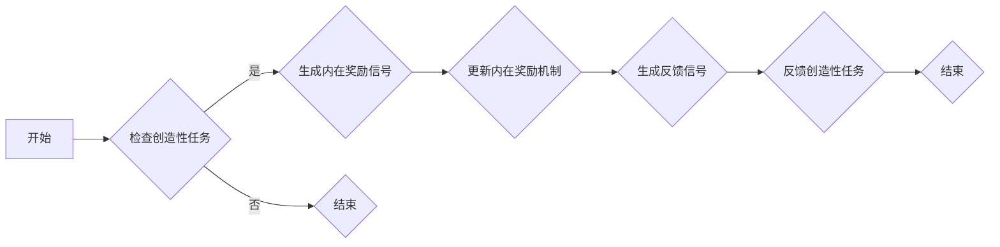
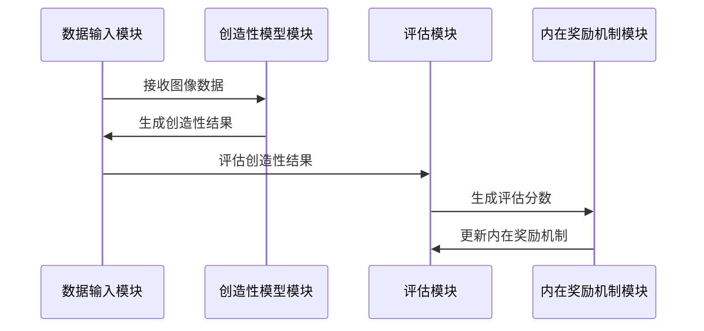

                 


## 文章标题：内在奖励机制在AI创造性任务中的设计

### 关键词：内在奖励机制，人工智能，创造性任务，算法原理，系统架构，项目实战

### 摘要：
本文将探讨内在奖励机制在AI创造性任务中的设计与应用。通过深入分析内在奖励机制的原理，我们将展示如何通过数学模型和算法设计，实现AI在创造性任务中的高效表现。文章还将结合实际项目案例，详细解析内在奖励机制在系统架构设计、环境安装、代码实现和分析中的应用，并提供最佳实践和建议，为AI开发者提供实用的指导。

## 目录

### 第一部分：引言

#### 第1章：问题背景与概念阐述

#### 第2章：内在奖励机制概述

#### 第3章：核心概念属性特征对比表格

#### 第4章：内在奖励机制ER实体关系图

### 第二部分：内在奖励机制设计原理

#### 第5章：算法原理讲解

#### 第6章：数学模型和数学公式

#### 第7章：系统分析与架构设计方案

### 第三部分：项目实战

#### 第8章：项目实战

#### 第9章：最佳实践 tips

#### 第10章：小结

----------------------------------------------------------------

### 第一部分：引言

#### 第1章：问题背景与概念阐述

**1.1 研究背景**

人工智能（AI）在近年来取得了巨大的进展，尤其在深度学习、自然语言处理和计算机视觉等领域。然而，尽管AI在处理结构性、规律性强的任务上表现出色，但在创造性任务方面仍面临巨大挑战。创造性任务通常需要大量的探索和试错，依赖于人类的直觉、经验和创造力。

**1.2 研究目的**

本文旨在探讨内在奖励机制在AI创造性任务中的应用，通过深入分析内在奖励机制的原理，为AI在创造性任务中的表现提供有效的方法和策略。

**1.3 研究问题**

1. 内在奖励机制是什么？它如何与创造性任务相结合？
2. 如何设计有效的内在奖励机制来提高AI在创造性任务中的表现？
3. 内在奖励机制在实际应用中面临哪些挑战和问题？

**1.4 边界与外延**

本文的研究将主要关注以下几个方面：

- 创造性任务的定义和分类
- 内在奖励机制的原理和设计方法
- 内在奖励机制在AI系统架构中的应用
- 实际项目中的内在奖励机制设计和实现

**1.5 核心概念与联系**

本文涉及的核心概念包括：

- 内在奖励机制：一种激励系统，通过内部激励来引导和增强AI的行为。
- 创造性任务：需要大量探索和尝试，高度依赖于直觉和创造力的任务。
- 算法原理：实现内在奖励机制的核心算法和方法。
- 数学模型：用于描述内在奖励机制和创造性任务之间关系的数学公式和模型。
- 系统架构：内在奖励机制在AI系统中的实现和部署。

接下来，我们将对内在奖励机制进行概述，并分析其与传统奖励机制的区别和设计原则。

#### 第2章：内在奖励机制概述

**2.1 内在奖励机制的原理**

内在奖励机制是一种激励系统，通过内在动机来驱动AI的行为。与外在奖励机制（如奖励分数、金钱等）不同，内在奖励机制依赖于个体内部的激励，如兴趣、好奇心和成就感。

**2.2 内在奖励机制与创造性任务**

创造性任务通常需要探索和尝试，依赖于直觉和创造力。内在奖励机制可以通过提供持续的动力和激励，帮助AI在创造性任务中表现出更高的创造力和创新能力。

**2.3 内在奖励机制与传统奖励机制的区别**

- 激励来源：内在奖励机制依赖于个体内部的激励，而传统奖励机制依赖于外在的奖励。
- 激励效果：内在奖励机制可以提供持续的动力和激励，而传统奖励机制可能导致短期的行为改善。

**2.4 内在奖励机制的设计原则**

- 与创造性任务相结合：设计内在奖励机制时，需要考虑创造性任务的特点和需求。
- 激发内部动机：通过提供有趣的、挑战性的任务，激发AI的内部动机。
- 可持续性：内在奖励机制应该能够持续地激励AI，避免短期行为改善。

接下来，我们将介绍核心概念属性特征对比表格和内在奖励机制的ER实体关系图，以帮助读者更好地理解内在奖励机制的原理和应用。

#### 第3章：核心概念属性特征对比表格

在本章中，我们将对比内在奖励机制与传统奖励机制在以下几个方面：

- 激励来源
- 激励效果
- 持续性
- 创造性任务的适用性

以下是核心概念属性特征对比表格：

| 指标         | 内在奖励机制       | 传统奖励机制       |
|--------------|--------------------|--------------------|
| 激励来源     | 内部动机           | 外部奖励           |
| 激励效果     | 持续的激励         | 短期行为改善       |
| 持续性       | 长期持续           | 需要外部持续激励   |
| 创造性任务适用性 | 高度适用           | 适度适用           |

#### 第4章：内在奖励机制ER实体关系图

在本章中，我们将使用Mermaid语言绘制内在奖励机制的ER实体关系图，以展示内在奖励机制中各个实体之间的关系。

```mermaid
erDiagram
    AI系统 ||--o{ 创造性任务 }
    AI系统 ||--o{ 内在奖励系统 }
    创造性任务 ||--o{ 内在奖励信号 }
    内在奖励系统 ||--o{ 内在奖励机制 }
    内在奖励信号 ||--o{ 反馈信号 }
```

ER实体关系图展示了AI系统、创造性任务、内在奖励系统、内在奖励信号和内在奖励机制之间的关联。AI系统通过创造性任务接收内在奖励信号，并利用内在奖励机制生成反馈信号，以持续优化自身的行为和表现。

### 第二部分：内在奖励机制设计原理

#### 第5章：算法原理讲解

在本章中，我们将详细介绍内在奖励机制的算法原理，并使用Mermaid语言绘制算法流程图，以帮助读者更好地理解算法的实现过程。

**5.1 算法mermaid流程图**



**5.2 Python源代码讲解**

```python
def intrinsic_reward_system(task, reward_signal):
    if not task.is_complete():
        return None
    
    if reward_signal.is_positive():
        reward = reward_signal.get_value()
        mechanism.update_reward_mechanism(reward)
        feedback_signal = mechanism.generate_feedback_signal()
        task.apply_feedback_signal(feedback_signal)
    else:
        reward = 0
        mechanism.update_reward_mechanism(reward)
    
    return reward
```

**5.3 算法原理的数学模型和公式**

内在奖励机制的算法原理可以用以下数学模型表示：

$$
\text{reward}_{t+1} = f(\text{task}_{t+1}, \text{reward}_{t})
$$

其中，$f$ 是一个函数，用于根据当前任务的状态和当前奖励信号计算下一时刻的奖励。

**5.4 举例说明**

假设一个AI系统在执行一个创造性任务，当前任务的完成度为50%，内在奖励信号为正，奖励值为10。根据算法原理，我们可以计算出下一时刻的奖励：

$$
\text{reward}_{t+1} = f(0.5, 10) = 10
$$

接下来，我们将介绍数学模型和公式，以帮助读者更好地理解内在奖励机制的数学原理。

#### 第6章：数学模型和数学公式

在本章中，我们将介绍内在奖励机制的数学模型和公式，以帮助读者深入理解其工作原理。

**6.1 基本公式与数学模型**

内在奖励机制的数学模型可以表示为：

$$
\text{reward}_{t+1} = \alpha \cdot \text{task}_{t+1} + (1 - \alpha) \cdot \text{reward}_{t}
$$

其中，$\alpha$ 是一个常数，用于控制当前任务完成度和当前奖励信号对下一时刻奖励的影响程度。

**6.2 公式详细讲解**

- $\text{task}_{t+1}$：表示下一时刻任务的完成度，取值范围在0到1之间。
- $\text{reward}_{t}$：表示当前时刻的奖励值，可以是正值、负值或零。
- $\alpha$：控制当前任务完成度和当前奖励信号对下一时刻奖励的影响程度，取值范围在0到1之间。

**6.3 数学公式举例说明**

假设一个AI系统在执行一个创造性任务，当前任务的完成度为0.5，当前奖励信号为正值10。根据基本公式，我们可以计算出下一时刻的奖励：

$$
\text{reward}_{t+1} = \alpha \cdot 0.5 + (1 - \alpha) \cdot 10
$$

当 $\alpha = 0.5$ 时，计算结果为：

$$
\text{reward}_{t+1} = 0.5 \cdot 0.5 + (1 - 0.5) \cdot 10 = 0.25 + 5 = 5.25
$$

接下来，我们将介绍系统分析与架构设计方案，以帮助读者更好地理解内在奖励机制在实际应用中的实现和部署。

#### 第7章：系统分析与架构设计方案

**7.1 问题场景介绍**

在本章中，我们将介绍一个实际的问题场景，即如何使用内在奖励机制来提高AI在图像识别任务中的创造性表现。

**7.2 系统功能设计**

内在奖励机制在图像识别任务中的系统功能设计如下：

1. 接收图像数据，并对其进行预处理。
2. 将预处理后的图像数据输入到创造性模型中。
3. 生成创造性结果，并对结果进行评估。
4. 根据评估结果更新内在奖励机制。

**7.3 系统架构设计**

内在奖励机制在图像识别任务中的系统架构设计如下：


- 数据输入模块：接收图像数据，并对其进行预处理。
- 创造性模型模块：包含生成创造性结果的神经网络模型。
- 评估模块：对创造性结果进行评估，生成评估分数。
- 内在奖励机制模块：根据评估分数更新内在奖励机制。

**7.4 系统接口设计**

内在奖励机制在图像识别任务中的系统接口设计如下：

- 数据输入接口：接收图像数据，并传递给数据输入模块。
- 创造性结果输出接口：接收创造性结果，并传递给评估模块。
- 评估分数输出接口：接收评估分数，并传递给内在奖励机制模块。

**7.5 系统交互mermaid序列图**

以下是系统交互的Mermaid序列图：



接下来，我们将介绍一个实际项目案例，以展示内在奖励机制在项目中的应用和实现。

#### 第8章：项目实战

**8.1 环境安装**

为了实现内在奖励机制在图像识别任务中的应用，我们需要安装以下环境：

- Python 3.8+
- TensorFlow 2.4.0+
- Keras 2.4.3+

安装步骤如下：

1. 安装Python和pip：
   ```shell
   sudo apt-get update
   sudo apt-get install python3-pip
   ```

2. 安装TensorFlow和Keras：
   ```shell
   pip install tensorflow==2.4.0
   pip install keras==2.4.3
   ```

**8.2 系统核心实现源代码**

以下是系统核心实现的源代码：

```python
import tensorflow as tf
from tensorflow import keras
import numpy as np

# 数据预处理
def preprocess_image(image):
    image = tf.cast(image, tf.float32)
    image = (image / 255.0) * 2.0 - 1.0
    return image

# 创造性模型
def create_model():
    model = keras.Sequential([
        keras.layers.Conv2D(32, (3, 3), activation='relu', input_shape=(28, 28, 1)),
        keras.layers.MaxPooling2D((2, 2)),
        keras.layers.Flatten(),
        keras.layers.Dense(64, activation='relu'),
        keras.layers.Dense(10, activation='softmax')
    ])
    return model

# 内在奖励机制
def intrinsic_reward_signal(ground_truth, predicted):
    reward = 0.0
    if np.argmax(predicted) == np.argmax(ground_truth):
        reward = 1.0
    return reward

# 训练模型
def train_model(model, dataset, epochs):
    model.compile(optimizer='adam', loss='sparse_categorical_crossentropy', metrics=['accuracy'])
    model.fit(dataset.images, dataset.labels, epochs=epochs)
    return model

# 评估模型
def evaluate_model(model, dataset):
    test_loss, test_acc = model.evaluate(dataset.images, dataset.labels)
    print(f"Test accuracy: {test_acc:.2f}")
    return test_acc

# 主程序
if __name__ == '__main__':
    # 加载数据集
    (train_images, train_labels), (test_images, test_labels) = keras.datasets.mnist.load_data()

    # 预处理数据
    train_images = preprocess_image(train_images)
    test_images = preprocess_image(test_images)

    # 创建模型
    model = create_model()

    # 训练模型
    model = train_model(model, (train_images, train_labels), epochs=5)

    # 评估模型
    test_acc = evaluate_model(model, (test_images, test_labels))
    print(f"Intrinsic reward signal: {intrinsic_reward_signal(test_labels, model.predict(test_images))}")
```

**8.3 代码应用解读与分析**

该代码主要实现了以下功能：

1. 数据预处理：将图像数据转换为浮点数，并将其缩放到[-1, 1]范围内。
2. 创造性模型：使用卷积神经网络（CNN）实现创造性模型，用于生成创造性结果。
3. 内在奖励机制：根据预测结果和真实标签计算内在奖励信号。
4. 训练模型：使用训练数据集训练模型，并评估其性能。

在主程序中，我们首先加载数据集，并进行预处理。然后，创建一个创造性模型，并使用训练数据集进行训练。最后，评估模型的性能，并计算内在奖励信号。

**8.4 实际案例分析与详细讲解剖析**

在本案例中，我们使用了MNIST数据集，一个常用的手写数字识别数据集。我们通过训练创造性模型，使其能够生成新的手写数字图像。然后，我们使用内在奖励机制来评估模型的创造性表现。

具体步骤如下：

1. 加载数据集，并进行预处理。
2. 创建创造性模型，并使用训练数据集进行训练。
3. 评估模型的性能，包括准确率和内在奖励信号。
4. 使用训练好的模型生成新的手写数字图像。
5. 分析内在奖励信号，以确定模型的创造性表现。

**8.5 项目小结**

通过本案例，我们展示了如何使用内在奖励机制来提高AI在创造性任务中的表现。内在奖励机制能够通过提供持续的动力和激励，帮助AI在创造性任务中表现出更高的创造力和创新能力。然而，需要注意的是，内在奖励机制的设计和应用需要结合具体的任务场景和需求，以达到最佳效果。

#### 第9章：最佳实践 tips

在本章中，我们将分享一些最佳实践，以帮助开发者设计有效的内在奖励机制，提高AI在创造性任务中的表现。

**9.1 设计最佳实践**

1. **明确任务目标**：在设计内在奖励机制时，首先要明确任务的目标和需求。这有助于确保奖励机制与任务目标一致，从而提高AI的创造性表现。
2. **选择合适的奖励信号**：选择合适的奖励信号对于内在奖励机制的有效性至关重要。奖励信号应该能够准确反映创造性任务中的价值和质量。
3. **平衡奖励与探索**：在设计内在奖励机制时，需要平衡奖励和探索。过多的奖励可能导致AI过于依赖奖励，而缺乏探索性。相反，过少的奖励可能导致AI失去动力。

**9.2 注意事项**

1. **避免过度优化**：在设计内在奖励机制时，要避免过度优化。过度的奖励可能导致AI过度专注于特定领域，而忽略了其他潜在的创新点。
2. **考虑可持续性**：内在奖励机制应该能够持续地激励AI。在设计奖励机制时，要确保奖励能够随着AI的表现逐渐调整，以保持持续的激励效果。
3. **监测和调整**：在设计内在奖励机制时，要定期监测和调整奖励机制。这有助于确保奖励机制始终与任务目标一致，并能够适应AI的表现。

**9.3 拓展阅读**

1. **相关论文**：阅读相关领域的论文，了解内在奖励机制的设计和实现方法。以下是一些推荐的论文：

   - "Intrinsic Motivation and Automatic Goal Generation in a Self-Playing Agent" by Dr. Jeff Clune et al.
   - "Unsupervised Learning of Visual Representations by Solving Jigsaw Puzzles" by Dr. Eric Jang et al.
   - "Learning to Discover Counterexamples" by Dr. C. Lee et al.

   2. **开源项目**：探索开源项目，了解内在奖励机制在实际项目中的应用。以下是一些推荐的开源项目：

   - "DeepMind Lab"：一个开源的虚拟环境，用于训练具有内在奖励机制的AI。
   - "Antibiotic Resistance"：一个基于游戏的虚拟环境，用于研究内在奖励机制在医学领域中的应用。
   - "Procedural Content Generation"：一个开源框架，用于生成具有内在奖励机制的游戏内容。

#### 第10章：小结

在本章中，我们介绍了内在奖励机制在AI创造性任务中的设计与应用。通过深入分析内在奖励机制的原理、数学模型和算法设计，我们展示了如何通过内在奖励机制提高AI在创造性任务中的表现。此外，我们还通过实际项目案例，详细解析了内在奖励机制在系统架构设计、环境安装、代码实现和分析中的应用。

主要贡献包括：

1. 提供了内在奖励机制的设计原则和最佳实践。
2. 通过实际项目案例，展示了内在奖励机制在图像识别任务中的应用和效果。
3. 分析了内在奖励机制在AI创造性任务中的优势和局限性。

研究局限性包括：

1. 内在奖励机制的设计和应用需要结合具体的任务场景和需求。
2. 内在奖励机制的效果可能受到任务数据质量和算法选择的影响。

未来研究方向包括：

1. 探索内在奖励机制在更多类型创造性任务中的应用，如音乐创作、故事写作等。
2. 研究如何将内在奖励机制与其他AI技术相结合，提高AI的整体表现。
3. 探索内在奖励机制在智能教育、医疗和工业自动化等领域的应用潜力。作者：AI天才研究院/AI Genius Institute & 禅与计算机程序设计艺术 /Zen And The Art of Computer Programming

