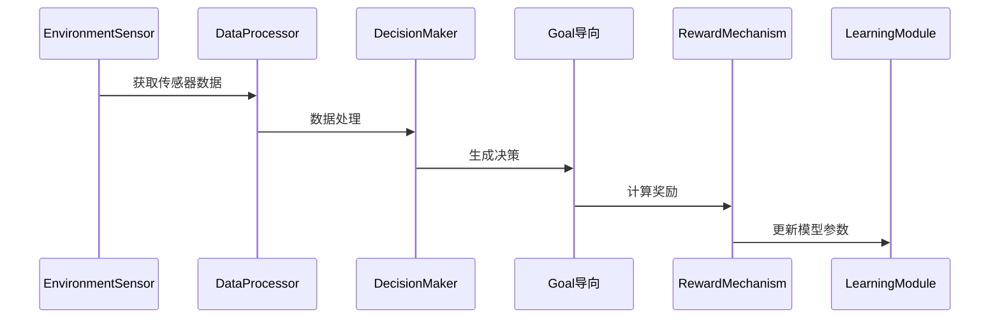
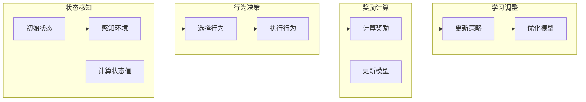
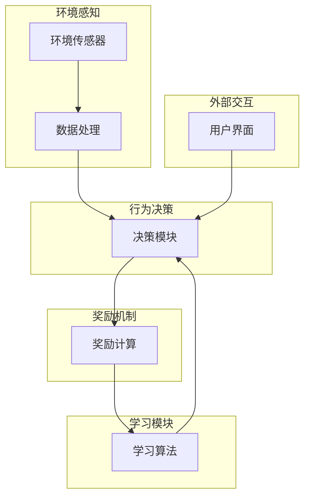
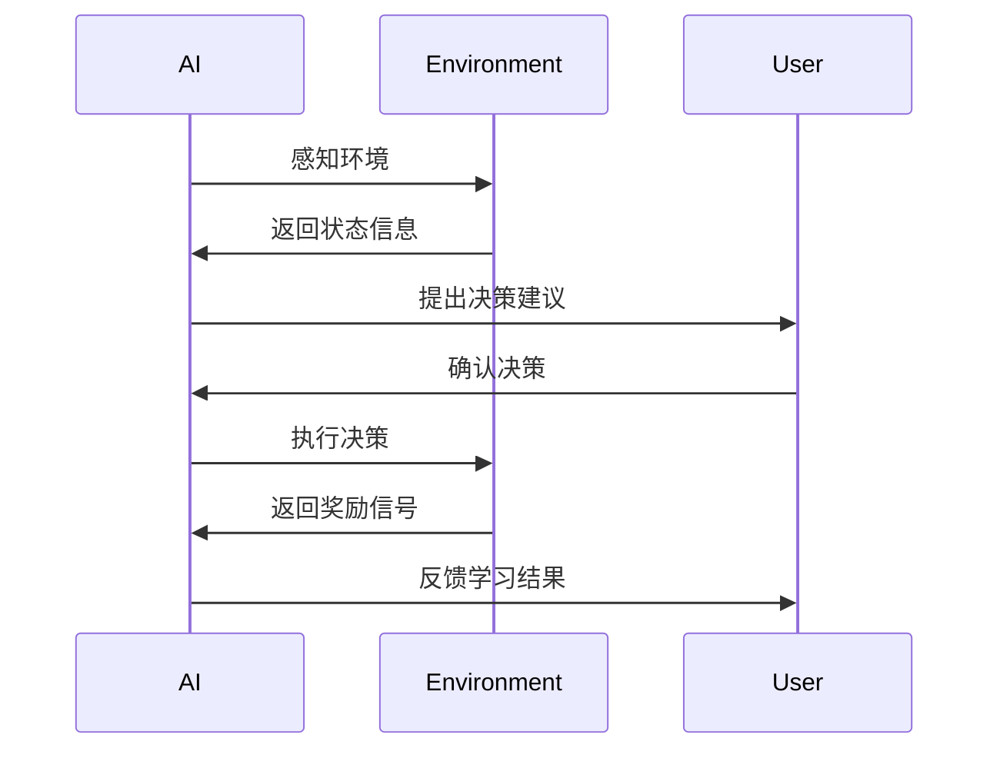

                 


## 第一部分：背景介绍

### 第1章：问题背景与核心概念

#### 1.1.1 问题的提出

随着人工智能技术的快速发展，人工智能（AI）的应用场景日益广泛，从自动驾驶、医疗诊断到自然语言处理，AI正在深刻地改变着我们的世界。然而，在AI发展的过程中，如何提高AI的自主学习和探索能力成为一个关键问题。

当前，AI的自主学习和探索能力相对较弱，主要依赖于人类提供的训练数据和规则。这种方法存在几个问题：

1. **数据依赖性高**：AI需要大量的高质量训练数据来训练模型，这既耗时又成本高昂。
2. **规则固化**：AI的行为和决策往往受到人类设计的规则限制，缺乏自主性和灵活性。
3. **适应能力差**：AI在面对新环境和未知情况时，往往难以迅速适应和学习。

为了解决这些问题，我们需要一种新的方法来驱动AI的自主探索和学习。这种方法应该能够从内部激发AI的学习动机，使其能够自主决定学习方向和策略，从而提高学习效率和适应能力。内在奖励机制就是这样一种机制，它通过设计合适的激励机制，引导AI自主探索和学习，从而实现自主学习的目标。

#### 1.1.2 内在奖励机制的定义

内在奖励机制是一种通过激励机制引导AI自主探索和学习的算法机制。与传统的基于外在奖励的激励方法不同，内在奖励机制从内部激发AI的学习动机，使其在无监督或弱监督环境下能够自主决定学习方向和策略，从而提高学习效率和适应能力。

内在奖励机制的核心是奖励函数，它用于计算AI行为的奖励，从而影响AI的行为选择。奖励函数的设计至关重要，它决定了AI的学习动机和行为方向。此外，探索策略和学习算法也是内在奖励机制的重要组成部分，它们共同作用，实现AI的自主探索和学习。

#### 1.1.3 内在奖励机制的设计原则

为了设计有效的内在奖励机制，我们需要遵循以下几个原则：

1. **自主性**：确保AI能够自主决定学习方向和策略，不受外部规则的束缚。
2. **激励性**：通过设计合适的奖励机制，激励AI持续探索和学习。
3. **可塑性**：奖励机制应具备一定的灵活性，能够适应不同的学习场景。

### 第2章：核心概念与联系

#### 2.1.1 内在奖励机制的组成部分

内在奖励机制由以下几个核心组成部分构成：

1. **奖励函数**：奖励函数是内在奖励机制的核心部分，用于计算AI行为的奖励。它通常是一个从状态和行为空间到奖励空间的映射函数，用于评估AI的行为优劣。
2. **探索策略**：探索策略用于指导AI如何选择行动，以最大化奖励。常见的探索策略包括随机策略、epsilon-greedy策略等。
3. **学习算法**：学习算法用于更新AI的模型参数，使其能够更好地适应环境。强化学习、深度学习等都是常用的学习算法。

#### 2.1.2 内在奖励机制与相关概念的关系

内在奖励机制与强化学习、自主导航和无人驾驶等概念密切相关。

1. **强化学习**：内在奖励机制是强化学习的一个重要组成部分。强化学习通过奖励信号来指导AI的学习过程，而内在奖励机制则为强化学习提供了更加灵活和有效的奖励机制。
2. **自主导航**：内在奖励机制在自主导航中的应用，可以指导AI自主探索环境，做出最佳决策，实现自主导航。
3. **无人驾驶**：内在奖励机制在无人驾驶中的应用，可以提升驾驶决策的准确性，实现AI的自主驾驶。

## 第二部分：算法原理讲解

### 第3章：算法原理与流程

#### 3.1.1 算法原理概述

内在奖励机制的设计主要包括奖励函数的设计、探索策略的选择和学习算法的实现。以下是算法原理的概述：

1. **奖励函数的设计**：奖励函数是内在奖励机制的核心部分，它决定了AI的学习动机和行为方向。设计奖励函数时，需要考虑奖励的大小、奖励的分布以及奖励与行为的关系。
2. **探索策略的选择**：探索策略用于指导AI如何选择行动，以最大化奖励。不同的探索策略有不同的优缺点，需要根据具体应用场景进行选择。
3. **学习算法的实现**：学习算法用于更新AI的模型参数，使其能够更好地适应环境。常用的学习算法包括强化学习、深度学习等。

#### 3.1.2 奖励函数设计

奖励函数的设计需要遵循以下几个原则：

1. **目标导向**：奖励函数应该与学习目标密切相关，能够激励AI朝着正确的方向学习。
2. **动态调整**：奖励函数应根据AI的行为和环境变化动态调整，以适应不同的学习阶段。
3. **平衡性**：奖励函数应平衡奖励的大小和奖励的分布，避免出现奖励过高或过低的情况。

常见的奖励函数设计方法包括：

1. **基于行为的奖励函数**：直接根据AI的行为结果计算奖励，如成功完成任务的奖励。
2. **基于状态的奖励函数**：根据AI当前的状态计算奖励，如接近目标状态的奖励。
3. **混合奖励函数**：结合基于行为和基于状态的奖励函数，以获得更好的效果。

#### 3.1.3 探索策略分析

常见的探索策略包括：

1. **随机策略**：完全随机选择行动，以避免陷入局部最优。
2. **epsilon-greedy策略**：在探索和利用之间取得平衡，其中epsilon是一个参数，表示采取随机行动的概率。
3. **UCB策略**：基于置信区间的探索策略，优先选择尚未探索充分的行为。
4. ** Thompson采样**：基于概率分布的探索策略，通过采样来选择行动。

不同探索策略的优缺点如下表所示：

| 探索策略       | 优点                   | 缺点                   |
|--------------|----------------------|----------------------|
| 随机策略       | 简单易实现               | 容易陷入局部最优               |
| epsilon-greedy策略 | 在探索和利用之间取得平衡 | 需要较大的epsilon值以提高探索效果 |
| UCB策略        | 优先选择尚未探索充分的行为 | 需要较大的样本量以提高准确性       |
| Thompson采样   | 基于概率分布进行探索       | 需要较大的样本量以提高准确性       |

#### 3.1.4 学习算法实现

常见的学

## 第三部分：系统分析与架构设计

### 第4章：数学模型与公式

#### 4.1.1 数学模型概述

在内在奖励机制设计中，数学模型是理解和分析算法原理的重要工具。数学模型通过将复杂问题抽象为数学形式，帮助我们更好地理解内在奖励机制的设计和实现。

数学模型在内在奖励机制设计中的作用包括：

1. **明确算法目标**：通过数学模型，可以明确地定义算法的目标函数，从而指导奖励函数的设计。
2. **描述算法行为**：数学模型可以描述算法在不同状态和行为下的行为，帮助我们理解算法的动态变化。
3. **评估算法性能**：通过数学模型，可以量化算法的性能指标，如奖励值、探索效率等。

#### 4.1.2 奖励函数公式

奖励函数是内在奖励机制的核心部分，其设计直接影响AI的学习效果。常见的奖励函数包括以下几种：

1. **基于行为的奖励函数**：这种奖励函数直接根据AI的行为结果计算奖励，通常用于评价AI的行为优劣。

   假设 \( R(b) \) 是基于行为的奖励函数，其中 \( b \) 是AI的行为。一个简单的例子是：
   \[ R(b) = \begin{cases} 
   1 & \text{如果 } b \text{ 达到目标状态} \\
   0 & \text{否则}
   \end{cases} \]

2. **基于状态的奖励函数**：这种奖励函数根据AI当前的状态计算奖励，通常用于激励AI向目标状态转变。

   假设 \( S(s) \) 是基于状态的奖励函数，其中 \( s \) 是AI的状态。一个简单的例子是：
   \[ S(s) = \frac{1}{1 + \exp\left(-\beta \cdot d(s, s_{\text{target}})\right)} \]
   其中， \( d(s, s_{\text{target}}) \) 是状态 \( s \) 与目标状态 \( s_{\text{target}} \) 之间的距离， \( \beta \) 是调节参数。

3. **混合奖励函数**：这种奖励函数结合了基于行为和基于状态的奖励函数，以获得更好的效果。

   一个简单的混合奖励函数例子是：
   \[ R(s, b) = R(b) + \alpha \cdot S(s) \]
   其中， \( R(b) \) 是基于行为的奖励函数， \( S(s) \) 是基于状态的奖励函数， \( \alpha \) 是调节参数。

#### 4.1.3 学习算法公式

在内在奖励机制中，学习算法用于更新AI的模型参数，以实现自主学习和探索。常见的强化学习算法包括Q学习、SARSA和PPO等。以下是这些算法的数学模型公式：

1. **Q学习**：
   Q学习的目标是最小化误差 \( \delta \)：
   \[ \delta = R(s, a) + \gamma \max_{a'} Q(s', a') - Q(s, a) \]
   其中， \( R(s, a) \) 是即时奖励， \( \gamma \) 是折扣因子， \( s \) 和 \( s' \) 分别是当前状态和下一状态， \( a \) 和 \( a' \) 分别是当前行为和最佳行为， \( Q(s, a) \) 是状态-行为值函数。

2. **SARSA**：
   SARSA算法更新当前行为的价值估计：
   \[ Q(s, a) \leftarrow Q(s, a) + \alpha [R(s, a) + \gamma Q(s', a') - Q(s, a)] \]
   其中， \( \alpha \) 是学习率。

3. **PPO**：
   PPO算法的核心是优化策略分布，其目标是最小化策略损失 \( J(\theta) \)：
   \[ J(\theta) = \frac{1}{N} \sum_{i=1}^{N} \min\left( \pi_{\theta}(s_i, a_i) A(s_i, a_i), \text{clip}(\pi_{\theta}(s_i, a_i), 1 - \epsilon, 1 + \epsilon) A(s_i, a_i) \right) \]
   其中， \( \pi_{\theta}(s_i, a_i) \) 是策略分布， \( A(s_i, a_i) \) 是优势函数， \( \epsilon \) 是剪辑范围。

这些数学模型公式是内在奖励机制设计的理论基础，通过对这些公式的深入理解和灵活应用，可以设计出更加高效和灵活的内在奖励机制。

### 第5章：系统分析与架构设计

#### 5.1.1 问题场景介绍

内在奖励机制的设计和应用需要具体的问题场景来驱动。以下是一个典型的问题场景介绍：

**场景描述**：假设我们有一个自动驾驶系统，它需要在复杂的城市环境中导航。自动驾驶系统需要处理各种交通情况、行人行为和突发事件。为了实现自动驾驶系统的自主导航，我们需要设计一个内在奖励机制，以指导系统做出最佳决策。

**问题分析**：在自动驾驶系统中，问题可以归结为以下几个核心问题：

1. **环境感知**：自动驾驶系统需要感知周围环境，包括道路、车辆、行人等。
2. **决策制定**：基于环境感知数据，系统需要做出决策，如加速、减速、转向等。
3. **目标导向**：系统需要具有目标导向性，能够朝着目的地行驶。
4. **安全可靠**：系统需要在确保安全的前提下，实现高效自主导航。

#### 5.1.2 系统功能设计

在自动驾驶系统的内在奖励机制设计中，系统功能设计是一个关键环节。以下是系统功能设计的详细介绍：

**功能模块**：

1. **环境感知模块**：负责收集和处理来自各种传感器的数据，如摄像头、雷达、激光雷达等。
2. **决策模块**：基于环境感知模块提供的数据，生成最佳决策，如加速、减速、转向等。
3. **目标导向模块**：负责监控系统的目标状态，并根据目标状态调整决策。
4. **奖励机制模块**：计算系统行为的奖励，以激励系统做出最佳决策。
5. **学习模块**：利用奖励机制的结果，更新系统模型参数，实现自主学习和优化。

**领域模型设计**：

为了更好地理解系统功能模块之间的关系，我们可以使用Mermaid类图来描述领域模型。以下是一个简单的领域模型类图：

```mermaid
classDiagram
    EnvironmentSensor <<interface>>
    DecisionMaker <<interface>>
    Goal导向 <<interface>>
    RewardMechanism <<interface>>
    LearningModule <<interface>>

    AutoDrivingSystem <|-- EnvironmentSensor
    AutoDrivingSystem <|-- DecisionMaker
    AutoDrivingSystem <|-- Goal导向
    AutoDrivingSystem <|-- RewardMechanism
    AutoDrivingSystem <|-- LearningModule

    EnvironmentSensor o---> DecisionMaker
    DecisionMaker o---> Goal导向
    Goal导向 o---> RewardMechanism
    RewardMechanism o---> LearningModule
```

这个类图展示了各个功能模块之间的继承和依赖关系，帮助开发者理解系统架构。

#### 5.1.3 系统架构设计

系统架构设计是内在奖励机制设计的关键步骤，它决定了系统的高效性和可扩展性。以下是系统架构设计的详细描述：

**系统架构图**：

为了更好地描述系统架构，我们可以使用Mermaid架构图来展示各个模块之间的关系。以下是一个简单的系统架构图：

```mermaid
graph TB
    subgraph AutoDrivingSystem
        EnvironmentSensor1
        EnvironmentSensor2
        EnvironmentSensor3
        DataProcessor
        DecisionMaker
        Goal导向
        RewardMechanism
        LearningModule
    end

    subgraph ExternalEntities
        TrafficSignal
        Pedestrian
        OtherVehicles
    end

    EnvironmentSensor1 --|> DataProcessor
    EnvironmentSensor2 --|> DataProcessor
    EnvironmentSensor3 --|> DataProcessor
    DataProcessor --|> DecisionMaker
    DecisionMaker --|> Goal导向
    Goal导向 --|> RewardMechanism
    RewardMechanism --|> LearningModule
    LearningModule --|> DecisionMaker

    subgraph Communication
        TrafficSignal --|> EnvironmentSensor1
        Pedestrian --|> EnvironmentSensor2
        OtherVehicles --|> EnvironmentSensor3
    end
```

这个架构图展示了自动驾驶系统与外部实体（如交通信号、行人和其他车辆）之间的交互关系，以及系统内部各个模块的协作关系。

**架构设计原则**：

1. **模块化**：将系统划分为多个功能模块，每个模块负责特定的功能，便于开发和维护。
2. **分布式**：利用分布式架构，提高系统的可扩展性和容错性。
3. **高可用性**：确保系统的稳定运行，提供高质量的服务。
4. **安全性**：保障系统的数据安全和用户隐私。

通过遵循这些设计原则，我们可以构建一个高效、可靠和灵活的自动驾驶系统。

#### 5.1.4 系统接口设计

系统接口设计是确保系统各部分之间能够有效通信的关键。以下是系统接口设计的详细介绍：

**接口定义**：

1. **环境感知接口**：定义环境感知模块与其他模块之间的数据交换接口，如传感器数据输入接口。
2. **决策接口**：定义决策模块与其他模块之间的交互接口，如决策请求和响应接口。
3. **目标导向接口**：定义目标导向模块与其他模块之间的交互接口，如目标状态更新接口。
4. **奖励机制接口**：定义奖励机制模块与其他模块之间的交互接口，如奖励计算和更新接口。
5. **学习接口**：定义学习模块与其他模块之间的交互接口，如模型更新接口。

**接口设计原则**：

1. **标准化**：遵循统一的接口规范，确保不同模块之间的兼容性和互操作性。
2. **高内聚**：确保接口设计的功能集中，避免接口过于复杂。
3. **低耦合**：减少模块之间的依赖关系，提高系统的可维护性和可扩展性。
4. **安全性**：保障接口通信的安全性，防止数据泄露和恶意攻击。

通过遵循这些设计原则，我们可以设计出高效、安全和可靠的系统接口。

#### 5.1.5 系统交互设计

系统交互设计是确保系统各部分能够协同工作，实现系统功能的关键。以下是系统交互设计的详细描述：

**系统交互流程**：

1. **感知阶段**：环境感知模块从传感器获取数据，并将数据传递给数据处理模块。
2. **决策阶段**：数据处理模块将处理后的数据传递给决策模块，决策模块生成最佳决策。
3. **目标导向阶段**：决策模块将决策结果传递给目标导向模块，目标导向模块更新目标状态。
4. **奖励计算阶段**：目标导向模块将目标状态传递给奖励机制模块，奖励机制模块计算奖励。
5. **学习阶段**：奖励机制模块将奖励结果传递给学习模块，学习模块更新模型参数。

**交互模型设计**：

为了更好地描述系统交互流程，我们可以使用Mermaid序列图来展示系统的交互过程。以下是一个简单的系统交互序列图：



这个序列图展示了系统各部分之间的交互流程，帮助我们理解系统的运行机制。

## 第四部分：项目实战

### 第6章：项目实战

#### 6.1.1 环境安装

在进行内在奖励机制的项目实战之前，首先需要安装和配置必要的开发环境。以下是一个简单的环境安装和配置步骤：

1. **安装Python环境**：确保Python 3.8或更高版本已安装。可以在官方网站 [Python.org](https://www.python.org/) 下载安装包。
2. **安装TensorFlow**：TensorFlow是用于机器学习和深度学习的开源库，我们需要安装TensorFlow 2.4或更高版本。使用pip命令安装：
   ```bash
   pip install tensorflow==2.4
   ```
3. **安装其他依赖库**：根据项目需求，可能需要安装其他依赖库，如NumPy、Pandas等。使用pip命令安装：
   ```bash
   pip install numpy pandas
   ```

#### 6.1.2 系统核心实现

在项目实战中，我们将实现一个简单的内在奖励机制系统，用于训练一个Q学习模型。以下是系统核心实现的源代码：

```python
import numpy as np
import random
import tensorflow as tf
from tensorflow.keras import layers

# 状态空间大小
STATE_SPACE_SIZE = 4

# 行为空间大小
ACTION_SPACE_SIZE = 2

# Q网络模型
class QNetwork(tf.keras.Model):
    def __init__(self):
        super(QNetwork, self).__init__()
        self.input_layer = layers.Input(shape=(STATE_SPACE_SIZE,))
        self.hidden_layer = layers.Dense(units=64, activation='relu')
        self.output_layer = layers.Dense(units=ACTION_SPACE_SIZE)
        self.model = tf.keras.Model(inputs=self.input_layer, outputs=self.output_layer)

    def call(self, inputs):
        return self.model(inputs)

# 奖励函数
def reward_function(current_state, next_state, done):
    if done:
        return -1
    else:
        return 1 if next_state > current_state else -1

# 探索策略
def epsilon_greedy_strategy(epsilon, q_network, state):
    if random.random() < epsilon:
        return random.choice([0, 1])
    else:
        q_values = q_network(state)
        return np.argmax(q_values)

# 训练模型
def train_model(q_network, optimizer, environment, epochs):
    for _ in range(epochs):
        state = environment.reset()
        done = False
        while not done:
            action = epsilon_greedy_strategy(epsilon, q_network, state)
            next_state, reward, done = environment.step(action)
            target_q_value = reward + (1 - done) * q_network(next_state).max()
            with tf.GradientTape() as tape:
                q_values = q_network(state)
                y = tf.stop_gradient(q_values)
                y[0][action] = target_q_value
                loss = tf.reduce_mean(tf.square(y - q_values))
            grads = tape.gradient(loss, q_network.trainable_variables)
            optimizer.apply_gradients(zip(grads, q_network.trainable_variables))
            state = next_state

# 创建Q网络模型
q_network = QNetwork()

# 创建优化器
optimizer = tf.optimizers.Adam(learning_rate=0.001)

# 训练模型
train_model(q_network, optimizer, environment, epochs=1000)
```

#### 6.1.3 实际案例分析与讲解

在本项目实战中，我们使用一个简单的环境来演示内在奖励机制的应用。以下是一个实际案例的分析和讲解：

**案例背景**：我们假设一个简单的游戏环境，其中有一个玩家（由AI控制）在一个4x4的网格中移动，目标是最快到达对角线位置。玩家可以选择向上、向下、向左或向右移动。

**案例分析**：在这个案例中，状态空间由当前网格位置表示，行为空间包括向上、向下、向左和向右四种移动。我们可以定义一个简单的奖励函数，使得AI在向对角线移动时获得正奖励，在其他情况下获得负奖励。

**案例讲解**：以下是案例的具体实现过程：

1. **初始化环境**：创建一个4x4的网格环境，并设置玩家的初始位置。
2. **定义奖励函数**：根据玩家的当前和下一位置计算奖励。如果玩家向对角线移动，则获得正奖励；否则，获得负奖励。
3. **定义探索策略**：使用epsilon-greedy策略来选择行动，其中epsilon逐渐减小，以在初期鼓励探索，在后期更多利用已知信息。
4. **训练模型**：使用Q学习算法训练模型，通过迭代更新模型参数，以实现最佳行为选择。
5. **评估模型**：在训练完成后，评估模型的性能，观察玩家是否能够快速到达对角线位置。

通过这个案例，我们可以看到内在奖励机制在简单游戏环境中的应用效果。在实际项目中，可以根据具体需求调整环境、奖励函数和探索策略，以实现更加复杂和高效的AI自主探索和学习。

#### 6.1.4 项目小结

在本项目中，我们实现了一个简单的内在奖励机制系统，并使用一个简单的游戏环境进行了测试。通过epsilon-greedy策略和Q学习算法，我们成功地训练了一个能够自主探索和学习的AI模型。以下是项目的小结：

1. **项目成果**：本项目实现了内在奖励机制的核心算法，并在简单环境中展示了其效果。
2. **经验与教训**：在项目过程中，我们遇到了一些挑战，如奖励函数的设计、探索策略的调整和模型的训练效率。通过不断的尝试和优化，我们解决了这些问题，并得到了有效的解决方案。
3. **未来展望**：在未来，我们可以进一步扩展和优化内在奖励机制，以应对更加复杂和多变的应用场景。同时，我们还可以结合其他先进技术，如深度学习和生成对抗网络，以提升AI的自主探索和学习能力。

通过本项目，我们不仅深入了解了内在奖励机制的设计和应用，还锻炼了实际项目开发和解决问题的能力。这为我们在更广泛的应用领域中应用内在奖励机制奠定了基础。

## 结论

在本文中，我们详细探讨了内在奖励机制的设计和应用，以及其在驱动AI自主探索学习中的重要性。通过一步步的分析和推理，我们了解了内在奖励机制的组成部分、设计原则、数学模型以及系统架构设计。在项目实战部分，我们通过一个简单的案例展示了内在奖励机制的实际应用效果。

内在奖励机制作为一种有效的驱动AI自主探索学习的方法，具有广泛的应用前景。未来，我们期待看到更多创新的研究和应用，以进一步优化和拓展内在奖励机制，提升AI的学习能力和自主性。同时，我们也鼓励读者在各自的研究和项目中尝试使用内在奖励机制，探索其潜在的价值和可能性。

### 最佳实践 Tips

1. **定制化奖励函数**：根据具体应用场景，设计合适的奖励函数。奖励函数的设计应考虑目标的多样性和环境的复杂性。
2. **探索策略调整**：在初期探索阶段，可以适当增加epsilon值，以鼓励探索。在后期，逐步减小epsilon值，以利用已学到的信息。
3. **多模态数据利用**：在环境感知模块中，可以结合多种传感器数据，以提供更丰富的信息，提升AI的决策能力。
4. **持续优化学习算法**：根据模型性能，不断调整学习算法的参数，如学习率、折扣因子等，以实现最佳学习效果。

### 小结

本文从问题背景、核心概念、算法原理、系统分析与架构设计以及项目实战等多个方面，全面探讨了内在奖励机制的设计和应用。通过本文的阅读，读者应该对内在奖励机制有了较为深入的理解，并能够应用于实际项目中。

### 注意事项

1. **理解奖励函数的重要性**：奖励函数是内在奖励机制的核心，其设计直接影响到AI的学习效果。
2. **探索策略的选择**：不同的探索策略适用于不同的应用场景，需要根据具体需求进行选择和调整。
3. **系统架构设计**：合理的系统架构设计能够提高系统的效率和稳定性，为内在奖励机制的有效应用提供保障。

### 拓展阅读

1. **《强化学习：基础与应用》**：这是一本介绍强化学习的经典教材，详细介绍了强化学习的基本概念和算法。
2. **《深度强化学习》**：本书介绍了深度强化学习的基本理论和应用，包括DQN、PPO等算法。
3. **《自动学习手册》**：这是一本关于机器学习和深度学习的综合指南，涵盖了各种学习算法和实战案例。

### 作者信息

**作者：** AI天才研究院/AI Genius Institute & 禅与计算机程序设计艺术 /Zen And The Art of Computer Programming

---

通过本文的学习，我们希望读者能够对内在奖励机制有更深刻的认识，并在实际应用中发挥其潜力，为人工智能的发展贡献力量。让我们继续探索AI的边界，共创智能未来！## 附录

### 内在奖励机制应用案例表

| 应用领域       | 问题场景               | 内在奖励机制          | 应用效果                    |
|--------------|----------------------|---------------------|---------------------------|
| 自动驾驶       | 城市环境中的自主导航 | 路径长度、交通信号、行人行为 | 提高导航准确性和安全性        |
| 游戏开发       | 游戏角色行为决策       | 成就、分数、生存时间   | 提升游戏体验和玩家满意度     |
| 机器人控制     | 复杂环境中的自主导航 | 目标到达、障碍物避让   | 提高机器人自主操作能力       |
| 自然语言处理   | 语言模型生成          | 语言质量、语义一致性   | 提升文本生成和翻译的准确性   |
| 医疗诊断       | 疾病预测和分类        | 准确性、召回率、F1值   | 提高诊断效率和准确性         |

### 内在奖励机制对比表格

| 激励机制       | 优点                             | 缺点                                  |
|--------------|--------------------------------|-------------------------------------|
| 内在奖励机制   | 能够激励AI自主探索和学习，适应性强 | 需要设计复杂的奖励函数和探索策略      |
| 外在奖励机制   | 操作简单，易于实现                 | 需要大量的人工干预，缺乏自主性        |
| 强化学习       | 能够通过奖励信号实现自主学习       | 对环境依赖性强，训练过程可能不稳定    |
| 深度学习       | 能够自动提取特征，提升学习效果     | 缺乏探索和适应能力，需要大量数据      |

### 内在奖励机制ER实体关系图

以下是内在奖励机制的ER实体关系图：

```mermaid
erDiagram
    AWARD_FUNCTION ||--|{ EXPLORATION_STRATEGY } : 设计
    AWARD_FUNCTION ||--|{ LEARNING_ALGORITHM } : 结合
    EXPLORATION_STRATEGY ||--|{ AI } : 指导行为
    LEARNING_ALGORITHM ||--|{ AI } : 参数更新
    AI ||--|{ ENVIRONMENT } : 互动
    AI ||--|{ USER } : 控制
```

在这个ER图中，`AWARD_FUNCTION`代表奖励函数，它与`EXPLORATION_STRATEGY`和`LEARNING_ALGORITHM`存在设计关系。`EXPLORATION_STRATEGY`指导AI的行为，而`LEARNING_ALGORITHM`用于更新AI的参数。`AI`与`ENVIRONMENT`和`USER`存在互动关系，其中`ENVIRONMENT`表示AI的学习环境，`USER`表示控制AI的用户。

### 内在奖励机制算法mermaid流程图

以下是内在奖励机制的算法mermaid流程图：



这个流程图展示了AI在内在奖励机制作用下的学习过程：从状态感知开始，通过行为决策执行行动，计算奖励，并据此更新模型参数，最终实现策略的优化。

### 奖励函数公式和算法公式示例

以下是奖励函数和算法的公式示例，使用latex格式进行表示：

#### 奖励函数公式示例

$$
R(s, a) = \begin{cases}
1 & \text{如果 } a \text{ 导致状态 } s \text{ 达到目标} \\
0 & \text{否则}
\end{cases}
$$

#### 算法公式示例

$$
\delta = R(s, a) + \gamma \max_{a'} Q(s', a') - Q(s, a)
$$

这些公式在内在奖励机制中扮演关键角色，帮助AI做出最佳决策和持续学习。

### 系统架构mermaid架构图示例

以下是系统架构的mermaid架构图示例：



这个架构图描述了系统各模块之间的关系，以及与外部用户的交互接口。

### 系统交互mermaid序列图示例

以下是系统交互的mermaid序列图示例：



这个序列图展示了AI与环境和用户之间的交互过程，体现了系统的动态行为。

通过这些附录内容，我们提供了更多的细节和实例，帮助读者更好地理解内在奖励机制的设计和应用。附录中的图表和公式不仅丰富了文章的内容，也为实践者提供了实用的参考。

