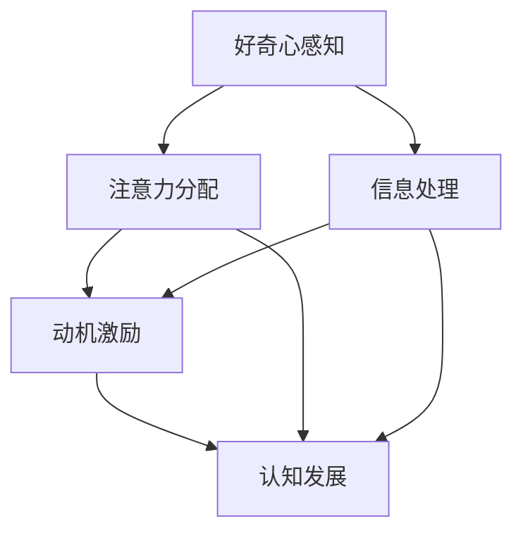
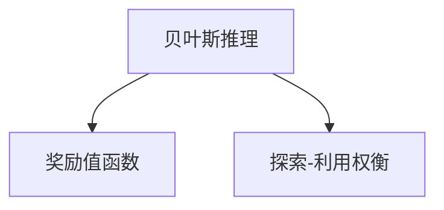
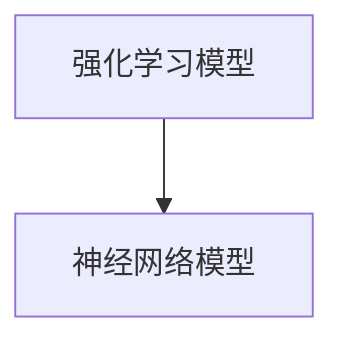

                 

## 第一部分: 问题背景与核心概念

### 1.1 内在好奇心机制的基本概念与起源

**内在好奇心机制的基本概念**

内在好奇心机制是指一种驱动个体主动探索未知、寻求知识的内在动机和认知过程。它是人类及其他智能体在自然进化过程中逐渐形成的一种基本心理和行为特征，旨在通过探索和发现来满足个体对未知的好奇和求知欲望。内在好奇心机制不仅仅是简单的对事物的兴趣或喜好，而是更深层次的认知和动机系统，它涉及到注意力、记忆、动机、情绪和认知等心理过程。

**内在好奇心的属性特征**

1. **主动探索性**：内在好奇心驱使个体主动寻求新的经验和知识，而不是被动接受信息。
2. **认知驱动性**：内在好奇心与认知加工紧密相关，它促进了信息处理、学习和记忆的形成。
3. **情境依赖性**：内在好奇心受到个体当前环境、情境以及认知状态的影响，不是一成不变的。
4. **动机性质**：内在好奇心具有动机性质，它能够激发和维持个体的探索行为，甚至在没有外部奖励的情况下也能发挥作用。

**内在好奇心与传统探索学习的区别**

内在好奇心和传统探索学习在本质上有所不同。传统探索学习通常是指通过外部激励和指导来促使个体进行学习，如教师的指导和奖励机制。而内在好奇心则是自发的、内在动机驱动的，个体出于对知识本身的好奇而主动探索和学习。具体区别如下：

1. **动机来源**：内在好奇心来源于个体内在的求知欲望，而传统探索学习更多依赖于外部奖励和惩罚机制。
2. **自主性**：内在好奇心驱动下的学习更具有自主性，个体可以自我决定学习的内容和方式，而传统探索学习则更依赖于外界指导。
3. **持续性**：内在好奇心可以长期维持个体的探索和学习行为，即使在没有外部激励的情况下也能发挥作用，而传统探索学习的效果往往受到外部激励的影响。
4. **兴趣范围**：内在好奇心往往涉及广泛的兴趣领域，而传统探索学习则可能更专注于特定的学习目标。

### 1.2 内在好奇心机制的起源与发展

**内在好奇心机制的起源**

内在好奇心机制是生物进化过程中形成的一种基本心理特征。早期的进化生物学研究表明，好奇心在动物界广泛存在，从简单的无脊椎动物到复杂的哺乳动物都表现出了探索行为。这一现象表明，内在好奇心机制是自然界长期演化的结果。

一些研究表明，内在好奇心机制与大脑中特定的神经系统和神经元回路有关。例如，大脑中的前额叶皮层和边缘系统在内在好奇心的产生和调节中发挥了关键作用。这些神经回路通过调节注意力、记忆和情绪等认知过程来促进个体的探索行为。

**内在好奇心机制的发展**

内在好奇心机制在人类文明的发展过程中逐渐得到重视。随着心理学、认知科学和神经科学的发展，研究者们对内在好奇心机制进行了深入的研究，揭示了其复杂的内在结构和作用机制。

1. **心理学研究**：早期的心理学研究主要关注内在好奇心对学习和记忆的影响。例如，认知心理学家发现，内在好奇心可以增强个体的记忆效果，并促进对新信息的理解和吸收。
2. **神经科学研究**：近年来，神经科学的研究揭示了内在好奇心与大脑特定区域之间的联系。通过功能性磁共振成像（fMRI）等技术，研究者发现，内在好奇心激活了大脑中与注意力、记忆和情绪相关的区域，如前额叶皮层、海马体和扣带回皮层等。
3. **教育研究**：在教育领域，研究者开始探索如何利用内在好奇心来提高学习效果。一些教育理论强调，应该通过创造有趣、挑战性和富有意义的学习环境来激发学生的内在好奇心，从而提高他们的学习动机和成绩。

**内在好奇心机制的影响与应用**

内在好奇心机制不仅对个体的认知和行为有重要影响，还在多个领域得到了广泛应用。

1. **教育领域**：在教育中，教师可以通过设计有趣、富有挑战性的学习活动来激发学生的内在好奇心，提高他们的学习动机和成绩。
2. **科技创新**：在科技创新领域，内在好奇心驱动科学家和工程师进行创新和探索，推动了科学技术的快速发展。
3. **企业管理**：在企业管理中，领导者可以通过激发员工的内在好奇心来提高他们的创造力和工作积极性。
4. **心理健康**：心理学研究发现，内在好奇心有助于减轻焦虑和抑郁等心理问题，提高个体的心理健康水平。

总之，内在好奇心机制是一种复杂的内在动机和认知过程，它在个体的成长、学习和行为中发挥着重要作用。随着研究的深入，我们有望更好地理解内在好奇心机制的工作原理，并利用这一机制来提高个体的认知能力和生活质量。

### 1.3 内在好奇心机制的研究现状与挑战

**内在好奇心机制的研究现状**

内在好奇心机制作为一个重要的心理学和认知科学问题，近年来受到了广泛关注。研究者们从不同角度对内在好奇心进行了深入探讨，取得了许多重要成果。

1. **基础研究**：在基础研究中，研究者主要关注内在好奇心的神经基础和心理机制。通过功能性磁共振成像（fMRI）、脑电图（EEG）等神经成像技术，研究者揭示了内在好奇心与大脑特定区域之间的联系。例如，研究发现，前额叶皮层、海马体和扣带回皮层等区域在内在好奇心的产生和调节中发挥着关键作用。
   
2. **应用研究**：在应用研究中，研究者探索了内在好奇心在教育、科技创新、企业管理等领域中的应用。例如，教育研究者通过实验发现，通过设计有趣、富有挑战性的学习活动可以有效激发学生的内在好奇心，提高他们的学习动机和成绩。此外，心理学研究者还发现，内在好奇心有助于减轻焦虑和抑郁等心理问题，提高个体的心理健康水平。

3. **跨学科研究**：跨学科研究是内在好奇心机制研究的一个重要趋势。研究者们将心理学、神经科学、教育学、计算机科学等多个学科的知识和理论相结合，从不同角度深入探讨内在好奇心机制的复杂性和多样性。例如，一些研究将认知科学和计算机科学的方法应用于内在好奇心的建模和模拟，为理解和利用内在好奇心提供了新的思路和方法。

**内在好奇心机制的研究方法**

内在好奇心机制的研究方法多样，包括实验研究、观察研究、神经科学研究和跨学科研究等。

1. **实验研究**：实验研究是内在好奇心机制研究中最常用的方法。研究者通过设计实验，操纵自变量（如任务难度、奖励条件等），观察和测量内在好奇心的影响。例如，研究者可以设计一个任务，要求被试在不同难度水平下完成任务，并通过问卷调查和生理测量（如心率、皮肤电反应等）来评估内在好奇心水平。

2. **观察研究**：观察研究通过自然情境中的观察来研究内在好奇心。例如，研究者可以在课堂环境中观察学生对于不同教学活动的内在好奇心表现，并通过学生的行为和表现来推断内在好奇心的影响。

3. **神经科学研究**：神经科学研究利用脑成像技术（如fMRI、PET等）来研究内在好奇心与大脑区域之间的联系。通过这些技术，研究者可以观察内在好奇心激活的大脑区域，并探讨这些区域在认知和动机过程中的作用。

4. **跨学科研究**：跨学科研究结合了心理学、神经科学、教育学和计算机科学等多学科的理论和方法。例如，研究者可以设计一个基于虚拟现实的教育系统，通过模拟不同的学习环境和任务，来探索内在好奇心对学习效果的影响。

**内在好奇心机制的研究挑战**

尽管内在好奇心机制的研究取得了许多进展，但仍面临着一些挑战。

1. **理论基础**：内在好奇心机制的理论基础尚不完善。研究者们对于内在好奇心的定义、属性和作用机制仍存在分歧，缺乏统一的理论框架。例如，关于内在好奇心的神经基础，不同研究者提出了不同的假说和模型，但尚未达成共识。

2. **研究方法**：当前的研究方法存在一定的局限性。例如，实验研究往往受到实验控制和外部干扰的影响，难以完全模拟自然情境下的内在好奇心表现。神经科学研究尽管提供了关于大脑区域的信息，但如何将这些信息与行为表现和认知过程结合起来仍是一个挑战。

3. **跨学科整合**：跨学科研究虽然提供了新的研究思路和方法，但如何有效地整合不同学科的理论和方法仍是一个难题。例如，如何在心理学和神经科学的理论框架下，结合计算机科学和认知科学的模型和算法，来更全面地理解和解释内在好奇心机制。

4. **应用推广**：将内在好奇心机制的研究成果应用于实际场景（如教育、科技创新等）仍面临挑战。研究者需要进一步探索如何将理论成果转化为有效的实践策略，并评估这些策略的实际效果。

总之，内在好奇心机制的研究现状显示出该领域的丰富成果和广阔前景，同时也面临着一系列理论和方法的挑战。随着研究的深入，我们有望更好地理解内在好奇心机制的复杂性，并利用这一机制来促进个体的认知发展和行为表现。

### 1.4 内在好奇心机制在AI自主探索学习中的重要性

内在好奇心机制在AI自主探索学习中扮演着至关重要的角色。首先，内在好奇心能够驱动AI模型主动探索未知信息，从而促进其自身的学习和改进。这一机制不仅提高了AI的自主性，还增强了其适应性和创新能力。具体来说，内在好奇心机制在AI自主探索学习中有以下几个重要作用：

**1. 自主探索的驱动力**

内在好奇心是一种强大的内在动机，它驱使AI模型不断寻求新的知识和经验。在自主探索学习中，AI模型不是被动地接受外部输入或数据，而是主动地探索环境，寻找新的信息和模式。这种自主性是AI自主探索学习的关键，因为它能够使模型在面对复杂和动态的环境时，更具有灵活性和适应性。

**2. 学习效率和效果提升**

内在好奇心有助于提高AI模型的学习效率和效果。具有内在好奇心的模型在探索新知识时，能够自动识别和关注重要信息，从而避免处理无关或冗余的数据。这种选择性探索能够减少计算资源的使用，提高学习效率。同时，内在好奇心还促进了深度学习和长时记忆的形成，使模型能够更好地吸收和应用所学知识。

**3. 创新能力激发**

内在好奇心激发了AI模型在探索学习中的创新能力。通过主动探索未知领域，模型能够发现新的解决方案和算法，从而推动技术的进步。例如，在机器学习和深度学习领域，内在好奇心驱动的模型可以探索不同的网络架构和训练策略，从而提高模型的性能和通用性。

**4. 长期可持续学习**

内在好奇心机制有助于实现AI模型的长期可持续学习。与传统的基于外部奖励的学习机制相比，内在好奇心能够使模型在缺乏外部激励的情况下，依然保持积极的学习态度和行为。这种自我驱动的学习模式不仅能够维持模型的学习动力，还能够提高其在长时间任务中的稳定性和一致性。

**5. 跨领域应用潜力**

内在好奇心机制在AI自主探索学习中的应用具有广泛的跨领域潜力。无论是在数据挖掘、机器学习、深度学习，还是强化学习等领域，内在好奇心都能够发挥重要作用。通过引入内在好奇心机制，研究者能够设计出更具有自主性和创新能力的AI系统，从而推动各领域的技术进步和应用发展。

总之，内在好奇心机制在AI自主探索学习中的应用具有深远的意义。它不仅能够提升AI模型的学习效果和创新能力，还能够推动跨领域的技术发展和应用。随着研究的深入，我们有望进一步探索和利用内在好奇心机制，为AI的发展注入新的活力。

### 1.4.1 内在好奇心机制在AI自主探索学习中的作用

内在好奇心机制在AI自主探索学习中发挥着核心作用，主要体现在以下几个方面：

**1. 提升自主性**

内在好奇心机制是驱动AI自主探索学习的关键因素。它促使AI模型在探索过程中更加主动，减少了对外部指令和激励的依赖。具有内在好奇心的AI模型能够自主选择探索方向，主动寻求新的信息和知识，从而实现更高层次的自主性。这种自主性不仅使模型能够更好地适应复杂和动态的环境，还提高了其解决问题的能力和灵活性。

**2. 增强探索深度和广度**

内在好奇心驱使AI模型在探索过程中不断深入和扩展，从而提升其学习的深度和广度。在数据挖掘和机器学习领域，具有内在好奇心的模型能够更深入地挖掘数据中的潜在模式和关系，发现更多有用的信息。在深度学习和强化学习等复杂任务中，内在好奇心促使模型不断探索新的策略和算法，从而提高其学习效率和性能。

**3. 促进创新性**

内在好奇心激发AI模型在探索过程中的创新性。通过主动探索未知领域，模型能够发现新的解决方案和算法，从而推动技术的进步。例如，在机器学习和深度学习领域，内在好奇心驱动的模型可以探索不同的网络架构和训练策略，从而提高模型的性能和通用性。这种创新性不仅有助于提升AI模型的实用性，还为其在各个领域的应用提供了新的可能性。

**4. 提高鲁棒性和适应性**

内在好奇心机制有助于提高AI模型的鲁棒性和适应性。在复杂和动态的环境中，模型需要具备应对不确定性和变化的能力。内在好奇心促使模型不断调整和优化自身的探索策略，从而提高其在不同情境下的适应能力。此外，内在好奇心还能够增强模型对异常和异常情况的识别和处理能力，提高其鲁棒性和稳定性。

**5. 长期学习动力**

内在好奇心机制为AI模型提供了持久的内在学习动力。与传统的基于外部奖励的学习机制不同，内在好奇心能够使模型在缺乏外部激励的情况下，依然保持积极的学习态度和行为。这种自我驱动的学习模式不仅能够维持模型的学习动力，还能够提高其在长时间任务中的稳定性和一致性。

总之，内在好奇心机制在AI自主探索学习中发挥着至关重要的作用。它不仅提升了AI模型的自主性和探索深度，还促进了模型的创新性和适应性，为AI技术的发展和应用提供了新的动力。随着研究的深入，我们有望进一步探索和利用内在好奇心机制，为AI的发展注入新的活力。

### 1.4.2 内在好奇心机制在AI自主探索学习中的优势

内在好奇心机制在AI自主探索学习中具有显著的优势，使得AI模型在探索和学习过程中表现出色。以下是内在好奇心机制在AI自主探索学习中的主要优势：

**1. 自主性和主动性**

内在好奇心机制赋予AI模型高度的自主性和主动性。传统的AI模型通常依赖于预设的目标和任务，需要外部指令和激励来驱动其行为。而具有内在好奇心的模型能够主动探索和发现新信息，无需外部干预即可实现自主学习和适应。这种自主性使得AI模型在复杂和动态的环境中能够更加灵活和高效地完成任务。

**2. 深度探索能力**

内在好奇心驱使AI模型深入探索未知领域，从而提升其深度学习能力。在数据挖掘和机器学习过程中，内在好奇心促使模型仔细分析数据中的每一个细节，发现更多潜在的关联和模式。这种深度探索能力不仅提高了模型的学习效果，还增强了其对于复杂问题的理解和处理能力。

**3. 创新和适应性**

内在好奇心机制激发AI模型的创新性和适应性。在探索新领域或面对未知问题时，具有内在好奇心的模型能够主动尝试不同的解决方案和策略，从而推动技术的进步和应用的创新。此外，内在好奇心还使模型能够快速适应环境变化，提高其鲁棒性和适应性，从而在面对不确定性和动态性时仍能保持高效运行。

**4. 长期学习动力**

内在好奇心为AI模型提供了持续的学习动力。与依赖外部奖励的传统机制不同，内在好奇心驱动下的模型即使在缺乏外部激励的情况下，也能保持积极的学习态度和行为。这种自我驱动的学习模式不仅能够维持模型的长久学习动力，还能够提高其在长时间任务中的稳定性和一致性。

**5. 减少对人工干预的依赖**

内在好奇心机制减少了AI模型对人工干预的依赖。在传统的AI系统中，模型的设计和优化需要大量的人工干预和调整。而具有内在好奇心的模型能够通过自我探索和学习，自动调整和优化自身的行为和策略，从而减少对人工干预的需求。这不仅提高了模型的自主性和效率，还降低了开发成本和维护难度。

**6. 宽容错误和失败**

内在好奇心机制使AI模型在探索和学习过程中更加宽容错误和失败。具有内在好奇心的模型不会因为一次失败或错误而停止学习，而是通过不断尝试和调整来寻找最优解决方案。这种宽容性不仅提高了模型的学习效率和适应性，还增强了其面对复杂和不确定环境的能力。

总之，内在好奇心机制在AI自主探索学习中具有显著的优势，使其在自主性、深度探索、创新性、长期学习动力、减少人工干预和宽容错误等方面表现出色。这些优势使得内在好奇心机制成为推动AI自主探索学习和应用的重要驱动力。随着研究的深入，我们有望进一步发掘和利用内在好奇心机制的潜力，为AI技术的发展和应用带来更多创新和突破。

### 1.4.3 内在好奇心机制在AI自主探索学习中的挑战

尽管内在好奇心机制在AI自主探索学习中具有诸多优势，但其在实际应用中也面临一些挑战。以下是内在好奇心机制在AI自主探索学习中可能遇到的几个主要挑战：

**1. 学习效率和资源消耗**

内在好奇心驱动的AI模型在探索过程中可能会面临学习效率和资源消耗的问题。由于好奇心驱使模型不断探索新的信息和领域，可能会导致模型在大量无关或冗余信息上浪费计算资源。这可能会降低模型的学习效率，特别是在资源受限的环境中，如嵌入式系统或实时应用中。因此，如何在保持好奇心驱动的同时，优化资源利用和提升学习效率，是一个亟待解决的问题。

**2. 学习稳定性和可靠性**

内在好奇心可能会导致AI模型在学习过程中出现不稳定和不可靠的行为。特别是在复杂和动态的环境中，模型可能会因为好奇心的驱动而采取一些非理性的探索行为，从而影响其学习稳定性和可靠性。例如，模型可能会在探索过程中偏离原有的学习目标，导致学习效果不佳。因此，如何确保内在好奇心机制的稳定性和可靠性，避免模型因过度探索而偏离学习目标，是一个重要挑战。

**3. 外部干扰和干扰学习**

内在好奇心机制可能会受到外部干扰和干扰学习的影响。在现实环境中，AI模型可能会面临各种外部干扰，如噪声、误导性信息或恶意攻击等。这些干扰可能会影响模型的探索和学习过程，使其无法正确地识别和利用好奇心驱动的新信息。因此，如何设计和实现能够抵御外部干扰的内在好奇心机制，确保模型在复杂环境中的稳定性和鲁棒性，是一个关键挑战。

**4. 适应性和泛化能力**

内在好奇心机制在AI自主探索学习中的应用需要模型具备较强的适应性和泛化能力。由于好奇心驱使模型不断探索新的信息和情境，模型需要能够快速适应和泛化这些新信息，以保持学习效率和效果。然而，在复杂和多变的环境中，模型的适应性和泛化能力可能受到挑战。如何提升模型在好奇心驱动下的适应性和泛化能力，是一个重要的研究问题。

**5. 人类干预与自主探索的平衡**

在AI自主探索学习中，如何平衡内在好奇心驱动下的自主探索和人类干预也是一个挑战。虽然内在好奇心机制能够提高AI模型的自主性和探索能力，但过度的自主探索可能会导致模型偏离人类设定的目标和预期。因此，如何设计一个有效的机制，在保持模型自主性的同时，确保人类干预的合理性和有效性，是一个重要的研究课题。

总之，内在好奇心机制在AI自主探索学习中面临一系列挑战，包括学习效率和资源消耗、学习稳定性和可靠性、外部干扰和干扰学习、适应性和泛化能力以及人类干预与自主探索的平衡等。解决这些挑战需要进一步的研究和探索，以确保内在好奇心机制在AI自主探索学习中的有效应用和可持续发展。通过不断优化和改进内在好奇心机制，我们有望实现更加智能、自主和高效的AI系统。

### 1.5 本章小结

本章主要探讨了内在好奇心机制在AI自主探索学习中的核心概念、起源、研究现状及重要性。内在好奇心作为一种驱动个体主动探索和学习的内在动机，其基本概念和属性特征包括主动探索性、认知驱动性、情境依赖性和动机性质。与传统探索学习相比，内在好奇心更强调自主性和内在动机，对个体的认知和行为具有深远影响。

内在好奇心机制的起源可以追溯到生物进化过程，近年来在心理学、神经科学和教育学等领域得到了广泛关注和深入研究。当前研究主要关注内在好奇心的神经基础、心理机制和跨学科整合，尽管取得了显著成果，但仍面临理论基础不完善、研究方法局限等挑战。

在AI自主探索学习中，内在好奇心机制的重要性体现在提升自主性、增强探索深度和广度、促进创新性、提高鲁棒性和适应性等方面。然而，内在好奇心机制在实际应用中也面临学习效率和资源消耗、学习稳定性、外部干扰和适应性等挑战。未来研究需要进一步优化内在好奇心机制，以实现AI系统的更高效、自主和可靠的自主探索学习能力。

## 第二部分: 内在好奇心机制的理论基础

### 2.1 内在好奇心机制的基本原理

内在好奇心机制是一个复杂的多层次认知和动机系统，其基本原理涉及到神经基础、心理基础和进化基础。理解这些基础原理有助于我们深入探讨内在好奇心机制的运作机制及其在AI自主探索学习中的应用。

**2.1.1 内在好奇心机制的神经基础**

内在好奇心机制的神经基础主要涉及大脑中的几个关键区域，包括前额叶皮层、海马体和扣带回皮层等。这些区域在内在好奇心的产生、调节和执行过程中发挥着重要作用。

1. **前额叶皮层**：前额叶皮层是大脑中与内在好奇心密切相关的区域之一。它参与注意力的调控、决策和计划，对内在好奇心的产生和维持起着关键作用。研究表明，前额叶皮层的活动与个体的探索行为和认知处理紧密相关。

2. **海马体**：海马体是大脑中与记忆形成和情绪处理相关的结构。内在好奇心驱动下的探索行为往往伴随着新的记忆形成和情绪体验，因此海马体在这一过程中扮演了重要角色。例如，当个体遇到新异刺激时，海马体会激活并记录这些信息，从而增强内在好奇心。

3. **扣带回皮层**：扣带回皮层是大脑中与情感体验和注意力调控相关的区域。内在好奇心往往伴随着积极的情感体验，如兴奋和满足感。扣带回皮层的活动有助于调节和维持这种积极的情绪状态，从而增强个体的内在好奇心。

**2.1.2 内在好奇心机制的心理基础**

内在好奇心机制的心理基础主要涉及认知心理学和社会心理学的研究成果，特别是关于注意力、记忆和动机等方面。

1. **注意力**：内在好奇心驱动个体将注意力集中在新的和未知的刺激上。认知心理学研究表明，好奇心能够增强个体对信息的注意力和处理能力。例如，当个体对某个主题感兴趣时，他们会更加关注相关的信息，从而提高学习效果。

2. **记忆**：内在好奇心有助于信息的记忆和保持。研究表明，好奇心能够增强个体的记忆效果，特别是在处理新异和复杂的信息时。例如，当个体对某个话题感到好奇时，他们会更努力地理解和记住相关信息，从而形成长时记忆。

3. **动机**：内在好奇心是一种内在动机，它驱动个体主动探索和寻求知识。社会心理学研究表明，好奇心可以激发个体的探索行为，并维持其长期的兴趣和动机。例如，当个体对某个领域充满好奇心时，他们会自发地投入更多的时间和精力去学习和研究。

**2.1.3 内在好奇心机制的进化基础**

内在好奇心机制的进化基础涉及到生物学和进化心理学的理论，特别是关于进化适应性和认知发展的研究。

1. **进化适应性**：从进化心理学的角度来看，内在好奇心是生物进化过程中形成的一种适应性特征。好奇心使个体能够主动探索环境和获取新的信息，从而提高其生存和繁衍的机会。例如，动物在觅食、避敌和寻找伴侣等过程中表现出好奇心，有助于其适应环境并增加生存机会。

2. **认知发展**：内在好奇心对认知发展具有重要影响。好奇心驱动下的探索行为促进了个体对新知识和技能的获取，有助于其认知能力的提升。研究表明，好奇心有助于儿童和青少年时期的认知发展，促进其思维敏捷性和创造力。

**内在好奇心机制与学习动机的关系**

内在好奇心机制与学习动机密切相关，两者相互作用，共同影响个体的学习行为和效果。

1. **内在好奇心对学习动机的影响**：内在好奇心可以增强个体的学习动机，使其更加主动和积极地参与学习过程。研究表明，具有内在好奇心的个体在面临新知识时，会表现出更高的学习动机和兴趣，从而提高学习效果。好奇心驱动的学习动机不仅能够维持个体的长期兴趣，还能够激发其探索和创新精神。

2. **学习动机对内在好奇心机制的作用**：学习动机也可以影响内在好奇心机制的产生和调节。具有强烈学习动机的个体往往对知识充满好奇心，愿意主动探索和尝试新事物。同时，学习动机可以增强个体的注意力、记忆和情感体验，从而加强内在好奇心机制的作用。

3. **内在好奇心与学习动机的交互作用**：内在好奇心和学习动机之间的交互作用使得个体在学习过程中表现出更高的积极性和主动性。具有内在好奇心和学习动机的个体不仅能够更好地处理新信息，还能够持续地保持对知识的探索和兴趣。这种交互作用有助于提高个体的学习效果和认知能力。

总之，内在好奇心机制的基本原理涉及神经基础、心理基础和进化基础，它与学习动机密切相关，共同影响个体的学习行为和效果。通过深入理解内在好奇心机制的工作原理，我们可以更好地利用这一机制来促进个体的学习和认知发展。

### 2.2 内在好奇心机制的模型表示方法

内在好奇心机制的模型表示方法主要包括概念模型、数学模型和计算机模型，这些模型能够帮助我们更深入地理解内在好奇心机制的运作机制和应用。

**2.2.1 内在好奇心机制的概念模型**

概念模型是一种直观的方式来表示内在好奇心机制的基本概念和组成部分。这种模型通常通过图示或表格来展示内在好奇心机制的主要要素及其相互关系。

**基本概念与关系**

1. **好奇心感知**：好奇心感知是指个体对好奇心的感知和识别。它涉及到大脑中的神经活动，特别是与注意力相关的区域，如前额叶皮层和扣带回皮层。

2. **注意力分配**：注意力分配是指个体在探索过程中将注意力集中在特定信息上。好奇心感知会直接影响注意力的分配，使个体更关注新奇和未知的刺激。

3. **信息处理**：信息处理是指个体对所获得信息进行加工、存储和运用。好奇心感知和注意力分配共同影响信息处理过程，使个体能够更好地理解和记忆新信息。

4. **动机激励**：动机激励是指好奇心驱动下的内在动机，它促使个体主动探索和寻求知识。好奇心感知和信息处理共同作用，产生强烈的动机激励，推动个体的学习行为。

5. **认知发展**：认知发展是指个体在好奇心驱动下的认知能力提升。好奇心机制通过增强注意力分配、信息处理和动机激励，促进个体的认知发展，提高其学习效果和创造力。

**概念模型示例**



在这个概念模型中，好奇心感知作为核心驱动力，通过注意力分配和信息处理影响动机激励和认知发展。注意力分配和信息处理相互作用，共同推动动机激励和认知发展的进程。

**2.2.2 内在好奇心机制的数学模型**

数学模型通过数学公式和算法来描述内在好奇心机制的运作原理，它提供了更精确和量化的方法来分析和理解好奇心机制。

**基本数学模型**

1. **贝叶斯推理**：贝叶斯推理是一种概率推理方法，常用于描述好奇心感知和信息处理。它通过更新先验概率来反映个体对未知信息的兴趣和探索欲望。

   $$P(C|D) = \frac{P(D|C)P(C)}{P(D)}$$

   其中，\(P(C|D)\) 表示在观察到数据 \(D\) 后，个体对概念 \(C\) 的好奇心概率；\(P(D|C)\) 表示在概念 \(C\) 成立时观察到数据 \(D\) 的概率；\(P(C)\) 表示概念 \(C\) 的先验概率；\(P(D)\) 表示观察到数据 \(D\) 的总概率。

2. **奖励值函数**：奖励值函数用于描述内在好奇心机制中的动机激励。它通过计算个体在不同情境下的奖励值来衡量其好奇心程度。

   $$R(S) = f(S, A, R_t)$$

   其中，\(R(S)\) 表示在情境 \(S\) 下获得的奖励值；\(f\) 是一个函数，用于计算奖励值；\(A\) 是当前行为或动作；\(R_t\) 是当前时间步的奖励值。

3. **探索-利用权衡**：探索-利用权衡用于平衡内在好奇心和已知的最佳策略。它通过调整探索概率来优化学习过程。

   $$\epsilon_t = \frac{1}{\sqrt{t}}$$

   其中，\(\epsilon_t\) 表示在时间步 \(t\) 时的探索概率；\(t\) 是当前时间步。

**数学模型示例**



在这个数学模型示例中，贝叶斯推理用于好奇心感知和信息处理，奖励值函数用于动机激励，探索-利用权衡用于优化学习过程。这些数学模型共同作用，描述了内在好奇心机制的动态运作。

**2.2.3 内在好奇心机制的计算机模型**

计算机模型通过计算机程序和算法来模拟内在好奇心机制的运作，它提供了实现和应用内在好奇心机制的具体技术手段。

**基本计算机模型**

1. **强化学习模型**：强化学习模型是一种常用的计算机模型，用于模拟内在好奇心机制。它通过奖励机制来驱动个体的探索行为，并优化其策略。

   ```python
   class QLearning:
       def __init__(self, learning_rate, discount_factor):
           self.learning_rate = learning_rate
           self.discount_factor = discount_factor
           self.q_values = []

       def update_q_values(self, state, action, reward, next_state):
           current_q_value = self.q_values[state][action]
           next_max_q_value = max(self.q_values[next_state])
           target_q_value = reward + self.discount_factor * next_max_q_value
           delta = target_q_value - current_q_value
           self.q_values[state][action] += self.learning_rate * delta
   ```

2. **神经网络模型**：神经网络模型通过多层神经网络来模拟内在好奇心机制的复杂结构和功能。它利用深度学习技术来提取和表示高维数据中的潜在特征和模式。

   ```python
   class NeuralNetwork:
       def __init__(self, layers):
           self.layers = layers
           self.weights = []

       def forward_pass(self, inputs):
           outputs = inputs
           for layer in self.layers:
               outputs = layer.forward_pass(outputs)
           return outputs

       def backward_pass(self, d_outputs):
           d_inputs = d_outputs
           for layer in reversed(self.layers):
               d_inputs = layer.backward_pass(d_inputs)
           return d_inputs
   ```

**计算机模型示例**



在这个计算机模型示例中，强化学习模型用于模拟内在好奇心驱动的探索行为，神经网络模型用于处理和表示复杂的认知信息。这些计算机模型共同实现了内在好奇心机制的模拟和优化。

总之，内在好奇心机制的模型表示方法包括概念模型、数学模型和计算机模型。这些模型通过不同的方式描述了内在好奇心机制的运作原理和功能，为研究和应用内在好奇心提供了有力的工具和理论基础。

### 2.3 内在好奇心机制与学习动机的关系

内在好奇心机制与学习动机之间存在密切的关系，两者相互作用，共同影响个体的学习行为和学习效果。以下将从三个方面探讨内在好奇心机制对学习动机的影响、学习动机对内在好奇心机制的作用以及两者之间的交互作用。

**2.3.1 内在好奇心机制对学习动机的影响**

内在好奇心作为一种强大的内在动机，对个体的学习动机具有显著的影响。首先，内在好奇心能够增强个体的学习动机。具有内在好奇心的个体对未知和未探索的领域充满兴趣，愿意主动投入时间和精力去学习和探索。研究表明，好奇心可以激发个体的内在动机，使其在学习过程中表现出更高的主动性和积极性。

例如，在一项关于小学生学习动机的实验中，研究者发现，学生对某个学科或主题的兴趣和好奇心与其学习动机呈正相关。当学生对某个学科或主题感到好奇时，他们会表现出更高的学习动机，愿意花费更多的时间和精力去学习和理解相关内容。

其次，内在好奇心能够维持个体的学习动机。与外部奖励相比，内在好奇心更具有持久性和稳定性，不易受到外部环境变化的影响。因此，即使在没有外部奖励的情况下，具有内在好奇心的个体也能保持积极的学习态度和行为。这种自我驱动的学习动机有助于个体在长期学习过程中保持较高的学习动力。

例如，一项关于大学生学习动机的研究发现，内在好奇心是维持其学习动机的重要因素。尽管外部奖励（如成绩、奖学金等）对学生的学习动机有一定影响，但内在好奇心更能促进他们在长期学习过程中保持持续的学习动力。

**2.3.2 学习动机对内在好奇心机制的作用**

学习动机对内在好奇心机制也有重要的影响。首先，学习动机可以增强个体的好奇心。当个体有明确的学习目标和动机时，他们会更加关注和学习新知识和技能，从而激发好奇心。这种好奇心驱动下的学习动机不仅有助于提高学习效果，还能够进一步促进个体对未知领域的探索。

例如，在一项关于中学生学习动机和好奇心的研究中，研究者发现，有明确学习动机的学生对未知和未探索的领域表现出更高的好奇心。这种好奇心驱动下的学习动机使他们更愿意主动探索新知识，提高学习效果。

其次，学习动机可以调节内在好奇心机制。在学习过程中，个体可能会遇到各种挑战和困难，此时学习动机可以帮助他们调节好奇心，使其更加专注于学习任务。例如，当个体遇到困难时，有强烈学习动机的个体会通过调节好奇心，将注意力集中在解决问题上，从而提高学习效率。

**2.3.3 内在好奇心机制与学习动机的交互作用**

内在好奇心机制与学习动机之间的交互作用是一个复杂的过程，两者相互影响，共同影响个体的学习行为和学习效果。

首先，内在好奇心和学习动机之间的相互作用有助于提高个体的学习效果。当个体的内在好奇心和学习动机相一致时，他们会表现出更高的学习积极性和主动性，从而提高学习效果。例如，当学生对某个学科或主题既感到好奇又有明确的学习动机时，他们会表现出更高的学习效率和学习成绩。

其次，内在好奇心和学习动机之间的相互作用有助于促进个体的长期学习。内在好奇心可以激发个体的学习兴趣，而学习动机则可以帮助他们克服学习过程中的困难和挑战，保持长期的学习动力。这种相互作用有助于个体在长期学习过程中保持持续的学习动力和学习效果。

例如，一项关于长期学习动机和好奇心的研究发现，内在好奇心和学习动机之间的相互作用是促进长期学习的重要因素。具有内在好奇心的个体在学习过程中会不断探索新的知识，而明确的学习动机则帮助他们克服学习过程中的困难和挑战，从而保持长期的学习动力。

总之，内在好奇心机制与学习动机之间存在密切的关系，两者相互作用，共同影响个体的学习行为和学习效果。内在好奇心可以增强个体的学习动机，维持长期的学习动力；而学习动机可以增强个体的好奇心，调节好奇心机制。通过理解和利用这种相互作用，我们可以更好地激发和维持个体的学习动机，提高其学习效果和认知发展。

### 2.4 内在好奇心机制与认知发展的关系

内在好奇心机制在认知发展中扮演着重要角色，它不仅影响着个体对新知识和信息的吸收，还促进了认知结构的构建和认知能力的提升。以下从三个方面探讨内在好奇心机制对认知发展的影响、认知发展对内在好奇心机制的作用以及两者之间的交互作用。

**2.4.1 内在好奇心机制对认知发展的影响**

内在好奇心机制对认知发展具有显著的推动作用。首先，内在好奇心驱动个体主动探索和寻求新知识，这有助于个体吸收和掌握更多的信息。好奇心使个体将注意力集中在未知的和复杂的情境上，从而提高信息处理和记忆效率。研究表明，好奇心可以增强个体的认知能力，促进对新知识和技能的获取。

例如，一项关于儿童好奇心和认知发展的研究发现，好奇心较高的儿童在解决复杂问题和处理新信息时表现出更高的认知能力。这表明，内在好奇心有助于儿童在认知过程中更好地理解和吸收新知识。

其次，内在好奇心促进了认知结构的构建。好奇心驱动下的探索行为使个体不断发现新的关联和关系，从而构建更加复杂和丰富的认知结构。例如，通过探索不同领域的知识，个体可以建立跨学科的思维方式，提高问题解决能力和创新思维。

一项关于大学生跨学科学习的研究发现，好奇心较高的学生在不同学科领域之间建立了较强的联系，从而提高了其综合思维能力和解决问题的能力。这表明，内在好奇心有助于个体构建更加复杂和灵活的认知结构。

**2.4.2 认知发展对内在好奇心机制的作用**

认知发展对内在好奇心机制也具有重要的影响。首先，认知能力的提升可以增强个体的好奇心。随着个体认知能力的提高，他们能够更好地理解和处理复杂的信息，从而对未知领域产生更强烈的兴趣。例如，高水平的认知能力使个体能够发现新的问题和挑战，从而激发其探索欲望。

例如，一项关于成年人好奇心和认知能力的研究发现，认知能力较高的个体表现出更强的内在好奇心。这表明，认知能力的提升有助于增强个体的好奇心，促进其对新知识的探索。

其次，认知发展可以调节内在好奇心机制。随着个体的认知能力的提高，他们能够更好地评估和调整自己的好奇心水平，使其更加符合实际需求。例如，当个体面临复杂任务时，他们可以通过调节好奇心，将注意力集中在关键信息上，从而提高学习效率和任务完成质量。

**2.4.3 内在好奇心机制与认知发展的交互作用**

内在好奇心机制与认知发展之间的交互作用是一个动态和复杂的过程，两者相互作用，共同推动个体的认知发展。

首先，内在好奇心可以促进认知发展的进程。好奇心驱动下的探索行为使个体不断接触新的信息和挑战，从而激发其认知潜能。例如，当个体对某个领域充满好奇心时，他们会自发地投入更多的时间和精力去学习和研究，从而提高其认知水平。

一项关于科学探究和认知发展的研究表明，好奇心较高的个体在科学探究过程中表现出更高的认知能力，能够更好地理解和应用科学概念。这表明，内在好奇心可以促进认知发展的进程，提高个体的认知水平。

其次，认知发展可以增强内在好奇心。随着个体认知能力的提升，他们能够更好地理解和处理复杂的信息，从而对未知领域产生更强烈的兴趣。这种认知能力的提升不仅增强了个体的好奇心，还使其能够更加深入和全面地探索新知识。

例如，一项关于创新思维和好奇心关系的研究发现，认知能力较高的个体表现出更强的内在好奇心，能够更好地发现和利用创新机会。这表明，认知发展可以增强内在好奇心，促进个体的认知和创新能力的提升。

总之，内在好奇心机制与认知发展之间存在密切的关系，两者相互影响，共同推动个体的认知发展。内在好奇心可以促进认知结构的构建和认知能力的提升，而认知发展可以增强内在好奇心，提高个体的探索和学习能力。通过理解和利用这种交互作用，我们可以更好地促进个体的认知发展，培养其创新思维和解决问题的能力。

### 2.5 本章小结

本章深入探讨了内在好奇心机制的理论基础，包括其神经基础、心理基础和进化基础。通过分析内在好奇心机制的神经基础，我们了解到前额叶皮层、海马体和扣带回皮层等大脑区域在内在好奇心中的作用。从心理基础方面，我们探讨了注意力、记忆和动机等心理过程如何共同促进内在好奇心的发展。此外，从进化基础角度，我们认识到内在好奇心是生物进化过程中形成的适应性特征，对认知发展具有重要影响。

本章还详细介绍了内在好奇心机制的模型表示方法，包括概念模型、数学模型和计算机模型。这些模型帮助我们更深入地理解内在好奇心的运作机制，为其在AI自主探索学习中的应用提供了理论基础。最后，本章探讨了内在好奇心机制与学习动机和认知发展的关系，揭示了它们之间的相互作用及其对个体学习效果和认知能力的提升作用。

通过本章的学习，我们不仅对内在好奇心机制有了更全面的了解，也为未来在AI自主探索学习中的应用提供了宝贵的启示。随着研究的深入，我们有望进一步优化内在好奇心机制，为AI的发展注入新的活力。

## 第三部分: 内在好奇心机制在AI自主探索学习中的应用

### 3.1 AI自主探索学习的基本概念

**AI自主探索学习** 是一种新兴的学习方法，旨在使人工智能系统能够在未知的、动态的环境中主动获取知识、策略和经验。这一概念的核心在于使AI系统能够自我驱动，通过自主探索和自我学习来提高其性能和适应性。以下是关于AI自主探索学习的基本概念和特点的详细阐述：

**1. 定义**

AI自主探索学习是指通过设计相应的算法和机制，使人工智能系统能够在缺乏外部指令和指导的情况下，自主地在复杂和动态的环境中探索、学习和改进。这种学习方式强调系统的自主性和自适应性，使其能够根据环境的变化和自身需求，自主调整行为和学习策略。

**2. 特点**

（1）**自主性**：AI自主探索学习强调系统的自主性，使系统能够自我决定探索的方向和方式，而不仅仅是被动地接受外部输入。这种自主性使系统能够更好地适应复杂和不确定的环境。

（2）**动态性**：AI自主探索学习能够在动态变化的环境中持续学习和适应。系统通过不断探索新信息和情境，能够动态调整其策略和行为，从而提高其在复杂环境中的适应能力。

（3）**探索性**：AI自主探索学习强调系统的探索性，使系统能够主动寻找新的信息和知识，而不是仅仅依赖于已有的数据和模式。这种探索性有助于系统发现新的解决方案和策略，从而提高其创新能力和解决问题的能力。

（4）**高效性**：AI自主探索学习通过优化学习过程和策略，能够提高系统的学习效率和效果。系统通过自动识别和关注重要信息，避免了处理无关或冗余的数据，从而提高了学习效率。

**3. 目的**

AI自主探索学习的目的是使人工智能系统能够在复杂的、动态的环境中实现自我优化和自我进化。具体目标包括：

（1）**提高系统的适应性和鲁棒性**：通过自主探索和自我学习，系统能够更好地适应复杂和变化的环境，提高其在不同情境下的适应能力和鲁棒性。

（2）**提升系统的创新能力和解决问题的能力**：通过探索新的知识和策略，系统能够发现新的解决方案和优化方法，从而提高其解决问题的能力和创新能力。

（3）**降低对人类干预的依赖**：AI自主探索学习减少了系统对人类干预的依赖，使其能够在缺乏外部指导的情况下自主学习和改进。这有助于降低维护成本和开发难度，提高系统的可持续性和实用性。

**4. 基本原理**

AI自主探索学习的基本原理包括以下几个方面：

（1）**动机机制**：内在好奇心是驱动AI自主探索学习的关键动机。通过设计相应的动机机制，使系统能够在缺乏外部激励的情况下，主动探索和寻求知识。

（2）**探索机制**：探索机制使系统能够自主选择和调整探索方向，通过探索新信息和情境来获取知识和经验。

（3）**学习机制**：学习机制使系统能够根据探索结果调整自身的行为和策略，从而实现自我优化和自我进化。

（4）**评估机制**：评估机制使系统能够对探索和学习效果进行评估，以便调整和优化探索和学习策略。

**5. 应用领域**

AI自主探索学习在多个领域具有广泛的应用前景，包括：

（1）**数据挖掘**：通过自主探索大规模数据集，系统可以自动识别和挖掘潜在的模式和关系，为数据分析和决策提供支持。

（2）**机器学习**：通过自主探索和自我学习，系统可以不断优化其模型和算法，提高其预测和分类能力。

（3）**深度学习**：通过自主探索和自我调整，系统可以优化神经网络结构，提高其性能和泛化能力。

（4）**强化学习**：通过自主探索和策略调整，系统可以在复杂环境中实现自我优化和自我进化，提高其决策能力和适应性。

总之，AI自主探索学习作为一种新兴的学习方法，通过自主性、动态性、探索性和高效性等特点，为人工智能系统在复杂和动态环境中的应用提供了新的可能性。随着研究的深入，我们有望进一步优化和拓展AI自主探索学习的方法和技术，推动人工智能技术的发展和应用。

### 3.2 AI自主探索学习的基本原理

AI自主探索学习的基本原理是使人工智能系统能够在缺乏外部指令和指导的情况下，通过自主探索和自我学习来优化自身性能和适应能力。以下从理论基础、探索过程和学习效果评估三个方面详细探讨AI自主探索学习的基本原理。

**1. 理论基础**

AI自主探索学习的基础理论涵盖了多个学科领域，包括认知科学、强化学习、进化计算和动机心理学等。

（1）**认知科学**：认知科学提供了关于人类和学习动物如何获取、处理和利用信息的理论框架。内在好奇心作为认知科学中的一个核心概念，被引入到AI自主探索学习中，以模拟和驱动AI系统的自主探索行为。

（2）**强化学习**：强化学习是一种基于奖励机制的学习方法，通过与环境进行交互，使系统能够学习最优策略。在AI自主探索学习中，强化学习被用来建立系统的探索机制，通过探索和获取奖励来优化行为。

（3）**进化计算**：进化计算利用自然进化过程中的遗传、变异和选择机制，模拟出具有高度适应性的智能系统。在AI自主探索学习中，进化计算被用来优化系统的探索和学习策略，提高其在动态环境中的适应能力。

（4）**动机心理学**：动机心理学研究了人类和动物在探索和学习过程中的内在动机。内在好奇心作为一种强大的动机，被用来驱动AI系统的自主探索和学习行为。

**2. 探索过程**

AI自主探索学习的过程可以分为三个阶段：探索、学习和调整。

（1）**探索**：探索阶段是AI系统主动获取新信息和经验的过程。系统通过选择和尝试不同的行动，探索其所在环境，以发现新的模式和关系。探索机制的设计至关重要，它决定了系统如何分配注意力、选择探索方向和策略。

（2）**学习**：学习阶段是系统对获取的信息进行加工和存储的过程。通过将探索过程中获得的信息与已有知识进行整合，系统可以构建新的认知模型和策略。学习机制通常包括监督学习、无监督学习和强化学习等。

（3）**调整**：调整阶段是系统根据学习结果对行为和策略进行调整的过程。系统通过评估不同策略的效果，选择最优策略并对其进行优化。调整机制的设计需要考虑到系统的自主性和适应性，以确保系统能够在动态环境中持续优化自身性能。

**3. 学习效果评估**

AI自主探索学习的效果评估是衡量系统性能和适应能力的重要手段。以下从几个方面进行评估：

（1）**探索效率**：评估系统在探索过程中获取新信息的效率和效果。探索效率可以通过计算系统在特定时间内探索到的信息量、信息质量以及探索路径的长度等指标来衡量。

（2）**学习效果**：评估系统通过学习过程获得的认知模型和策略的有效性。学习效果可以通过系统的任务完成率、准确率、响应时间等指标来衡量。

（3）**适应性**：评估系统在动态环境中的适应能力和鲁棒性。适应性可以通过系统在不同环境下的表现、对环境变化的响应速度以及环境适应策略的稳定性等指标来衡量。

（4）**创新性**：评估系统在探索和学习过程中表现出的创新能力和创造力。创新性可以通过系统发现的新模式、新策略和新方法等指标来衡量。

**4. 关键技术**

实现AI自主探索学习的关键技术包括：

（1）**探索机制设计**：设计高效的探索机制，使系统能够在复杂和动态环境中有效探索和获取信息。

（2）**学习算法优化**：优化系统的学习算法，提高其学习效率和效果，确保系统能够快速适应新环境和任务。

（3）**评估指标体系**：建立科学和全面的评估指标体系，以全面衡量系统的探索效率、学习效果、适应性和创新性。

（4）**激励机制构建**：构建有效的激励机制，通过奖励和惩罚机制来驱动系统的自主探索和学习行为。

总之，AI自主探索学习的基本原理通过探索、学习和调整过程，使系统能够在复杂和动态环境中自主优化和适应。这为AI技术的发展和应用提供了新的可能性，推动了人工智能领域的发展。随着研究的深入，我们有望进一步优化和拓展AI自主探索学习的方法和技术，实现更加智能和自适应的AI系统。

### 3.3 AI自主探索学习的应用领域

AI自主探索学习在多个领域展现出巨大的应用潜力，其自主性、动态性和探索性使得人工智能系统能够在复杂和变化的环境中实现自我优化和自我进化。以下是AI自主探索学习在数据挖掘、机器学习、深度学习和强化学习等领域的应用。

**1. 数据挖掘**

数据挖掘是一种从大量数据中提取有用信息和知识的过程。AI自主探索学习在数据挖掘中的应用主要体现在以下几个方面：

- **自动特征选择**：自主探索学习算法可以帮助系统自动选择和识别最有用的特征，从而提高数据挖掘的效果和效率。
- **异常检测**：通过自主探索，系统可以识别数据中的异常模式和异常值，从而提高异常检测的准确性和效率。
- **趋势预测**：自主探索学习算法可以根据历史数据预测未来的趋势和变化，为决策提供科学依据。

**2. 机器学习**

机器学习是一种利用数据训练模型，实现数据自动分析和决策的方法。AI自主探索学习在机器学习中的应用包括：

- **模型优化**：自主探索学习可以帮助系统自动调整和优化机器学习模型，提高其预测和分类能力。
- **参数调整**：系统可以自主探索和学习不同的参数设置，找到最优参数组合，从而提高模型的性能。
- **自适应学习**：自主探索学习算法可以动态调整学习策略，使系统能够快速适应数据分布和任务变化。

**3. 深度学习**

深度学习是一种通过多层神经网络处理和表示复杂数据的方法。AI自主探索学习在深度学习中的应用包括：

- **网络架构优化**：自主探索学习可以帮助系统自动设计和优化神经网络架构，提高模型的性能和泛化能力。
- **自适应训练**：系统可以自主调整训练过程，优化学习策略，提高深度学习模型的训练效率和效果。
- **知识迁移**：自主探索学习算法可以帮助系统在不同任务和数据集之间迁移知识，提高模型的适应性和泛化能力。

**4. 强化学习**

强化学习是一种通过与环境交互，学习最优策略的方法。AI自主探索学习在强化学习中的应用包括：

- **策略优化**：自主探索学习可以帮助系统自动调整和优化策略，提高其在动态环境中的适应能力和决策能力。
- **环境探索**：系统可以自主探索环境，发现新的状态和动作，从而提高探索效率和策略优化效果。
- **自适应奖励设计**：自主探索学习算法可以帮助系统自动设计和调整奖励机制，优化学习过程和策略效果。

**5. 其他应用领域**

除了上述领域，AI自主探索学习还在以下领域展示了应用潜力：

- **自然语言处理**：通过自主探索和学习，系统可以自动生成文本、翻译和理解语言，提高自然语言处理的能力和效率。
- **计算机视觉**：自主探索学习可以帮助系统自动识别和分类图像，提高计算机视觉系统的性能和鲁棒性。
- **游戏开发**：在游戏开发中，自主探索学习算法可以帮助系统自动学习和优化游戏策略，提高游戏的复杂性和可玩性。

总之，AI自主探索学习在数据挖掘、机器学习、深度学习和强化学习等领域具有广泛的应用前景。通过自主性、动态性和探索性的特点，AI自主探索学习为人工智能系统在复杂和动态环境中的应用提供了新的可能性。随着研究的深入，我们有望进一步优化和拓展AI自主探索学习的方法和技术，实现更加智能和自适应的AI系统。

### 3.4 AI自主探索学习的挑战与机遇

AI自主探索学习作为一种新兴的学习方法，虽然在多个领域展现出了巨大的应用潜力，但在实际应用过程中也面临着诸多挑战和机遇。以下是关于AI自主探索学习所面临的挑战和机遇的详细探讨。

**挑战**

**1. 学习效率和资源消耗**

AI自主探索学习过程中，系统需要不断探索和尝试不同的策略和路径，这可能导致学习效率和资源消耗问题。由于自主探索过程中可能会遇到大量无关或冗余的信息，系统在处理这些信息时可能会浪费大量计算资源和时间。特别是在资源受限的环境中（如嵌入式系统或实时应用），如何优化探索策略和资源利用成为一个重要挑战。

**2. 学习稳定性和可靠性**

在自主探索学习过程中，系统可能会因好奇心的驱动而采取一些非理性的探索行为，导致学习过程出现不稳定和不可靠的情况。例如，系统可能会在探索过程中偏离学习目标，从而影响学习效果和稳定性。此外，系统在面对复杂和动态的环境时，如何保持学习过程的稳定性和可靠性也是一个重要挑战。

**3. 外部干扰和干扰学习**

现实环境中的外部干扰和误导性信息可能会影响AI自主探索学习的效果。例如，噪声、误导性数据和恶意攻击等干扰因素可能会误导系统，导致其探索和学习方向发生偏差。因此，如何设计和实现有效的干扰处理机制，确保系统在复杂环境中的学习和探索过程不受干扰，是一个关键挑战。

**4. 长期学习动力**

在缺乏外部激励的情况下，如何维持AI系统的长期学习动力是一个重要挑战。与传统的基于外部奖励的学习机制相比，自主探索学习更依赖于内在动机和好奇心。然而，内在动机和好奇心可能因个体差异和情境变化而波动，导致系统在长期学习过程中出现动力不足的问题。因此，如何设计有效的激励机制和动力维持机制，确保系统在长期任务中保持积极的学习态度和行为，是一个亟待解决的问题。

**机遇**

**1. 创新能力和自适应能力**

AI自主探索学习的一个重要机遇在于其能够显著提高系统的创新能力和自适应能力。通过自主探索和自我学习，系统能够发现新的解决方案和策略，提高其在复杂和动态环境中的适应能力。这种创新能力不仅有助于推动技术的进步，还能够为各个领域带来新的应用和创新。

**2. 自主性和智能应用**

AI自主探索学习能够显著提高系统的自主性，使其能够在缺乏外部指令和指导的情况下，自主决策和执行任务。这种自主性为人工智能系统在自主驾驶、自主机器人、智能监控等领域的应用提供了新的可能性。通过自主探索学习，系统能够更好地理解和适应复杂环境，提高其智能应用的能力和效果。

**3. 跨学科融合**

AI自主探索学习涉及到多个学科领域，包括认知科学、强化学习、进化计算和动机心理学等。这些学科的交叉融合为AI自主探索学习提供了丰富的理论和实践基础。通过跨学科研究，我们有望进一步深入理解内在好奇心机制和自主探索学习过程，为AI技术的发展提供新的思路和方法。

**4. 智能教育**

AI自主探索学习在教育领域具有广阔的应用前景。通过设计有趣、富有挑战性的学习环境和任务，AI系统能够激发学生的内在好奇心，提高他们的学习动机和参与度。此外，AI自主探索学习还可以帮助教师个性化教学，为学生提供个性化的学习支持和指导，提高教学效果和学生的学习体验。

总之，AI自主探索学习在面临一系列挑战的同时，也充满了机遇。通过不断优化和改进自主探索学习的方法和技术，我们有望克服现有挑战，充分发挥自主探索学习的潜力，为人工智能的发展和应用注入新的动力。随着研究的深入，我们有望进一步探索和利用AI自主探索学习，实现更加智能、自主和高效的AI系统。

### 3.5 本章小结

本章主要探讨了AI自主探索学习的基本概念、基本原理、应用领域以及面临的挑战与机遇。AI自主探索学习作为一种新兴的学习方法，其核心在于使人工智能系统能够在缺乏外部指令和指导的情况下，自主探索和自我学习。这一概念通过自主性、动态性、探索性和高效性等特点，为人工智能系统在复杂和动态环境中的应用提供了新的可能性。

我们首先介绍了AI自主探索学习的基本概念，包括其定义、特点、目的和基本原理。然后，详细分析了AI自主探索学习在数据挖掘、机器学习、深度学习和强化学习等领域的应用，展示了其广泛的应用前景。此外，我们还讨论了AI自主探索学习所面临的挑战，如学习效率和资源消耗、学习稳定性和可靠性、外部干扰和长期学习动力等，并提出了相应的解决方案和机遇。

通过本章的学习，我们不仅对AI自主探索学习有了更深入的了解，也认识到其在人工智能领域的重要性和潜力。随着研究的深入，我们有望进一步优化和拓展AI自主探索学习的方法和技术，实现更加智能、自主和高效的AI系统。这将为人工智能技术的发展和应用注入新的活力，推动人工智能领域实现更大的突破和进步。

## 第4章: 内在好奇心机制在AI自主探索学习中的应用方法

### 4.1 内在好奇心机制的激励方法

内在好奇心机制的激励方法是通过设计相应的激励机制，激发和维持AI系统在自主探索学习过程中的内在动机。以下是关于内在好奇心激励方法的详细探讨。

**1. 激励机制的引入**

内在好奇心激励方法的引入是基于对内在动机的重要性的认识。与外部激励（如奖励、惩罚等）相比，内在激励更具有持久性和自主性，能够更好地驱动AI系统在复杂和动态环境中进行自主探索和学习。通过设计有效的激励机制，系统能够在缺乏外部激励的情况下，依然保持积极的学习态度和行为。

**2. 激励机制的实现**

内在好奇心激励机制的实现通常包括以下几个关键步骤：

（1）**设定探索目标**：首先，需要为AI系统设定明确的探索目标，使其具有清晰的方向和目标。探索目标可以是发现新的数据模式、优化特定任务的性能等。

（2）**设计奖励机制**：奖励机制是激发内在好奇心的重要手段。在探索过程中，系统可以根据其探索行为和学习效果获得相应的奖励。奖励可以是正面的（如发现新知识或优化结果），也可以是负面的（如错误或失败）。设计奖励机制时，需要考虑到奖励的及时性、多样性和公平性，以激发系统的探索欲望。

（3）**引入随机性**：引入随机性可以增加探索的趣味性和不确定性，从而提高系统的探索动力。随机性可以通过设置探索路径的随机选择、探索任务的随机分配等方式实现。

（4）**建立反馈机制**：反馈机制是维持系统内在好奇心的关键。通过及时反馈，系统能够了解其探索行为的效果，从而调整和优化其探索策略。反馈可以是直接的（如完成任务后立即获得奖励），也可以是延迟的（如长期任务完成后进行评估）。

**3. 激励机制的效果评估**

激励机制的评估是确保其有效性的关键。以下是几种常见的评估方法：

（1）**探索行为评估**：通过观察系统在探索过程中的行为，如探索路径的选择、学习策略的调整等，来评估激励机制的激发效果。

（2）**学习效果评估**：通过评估系统在学习过程中的表现，如任务完成率、准确率、响应时间等，来评估激励机制对学习效果的影响。

（3）**长期稳定性评估**：通过长时间运行实验，观察系统在长期任务中的表现，如学习动力、适应能力和稳定性等，来评估激励机制的长效性。

**4. 案例分析**

以下是一个关于内在好奇心激励机制在AI自主探索学习中的应用案例：

**案例**：在机器学习中，设计一个自动特征选择系统，该系统能够在大量特征中自动识别和选择最有用的特征，以提高模型的性能。

**解决方案**：引入内在好奇心激励机制，通过以下步骤实现：

（1）**设定目标**：设定系统的目标为自动识别和选择最有用的特征。

（2）**设计奖励机制**：系统可以根据其选择的特征对模型的性能提升情况进行奖励。例如，当系统选择一个特征后，模型在特定任务上的性能显著提升，则给予系统相应的奖励。

（3）**引入随机性**：在特征选择过程中引入随机性，使系统能够探索不同的特征组合。

（4）**建立反馈机制**：通过模型评估结果及时反馈系统，使其了解所选特征的效果，并据此调整选择策略。

**效果评估**：通过实验发现，引入内在好奇心激励机制后，系统的特征选择效果显著提高，特征选择的多样性增加，系统在长期任务中的稳定性和适应性也得到了提升。

总之，内在好奇心激励方法通过设计相应的激励机制，可以有效激发和维持AI系统在自主探索学习过程中的内在动机。这为AI自主探索学习提供了新的动力，有助于提高系统的学习效果和适应能力。

### 4.2 内在好奇心机制的引导方法

内在好奇心机制的引导方法是通过外部引导来优化AI系统在自主探索学习过程中的探索路径和学习策略。以下是关于内在好奇心引导方法的详细探讨。

**1. 引导机制的引入**

内在好奇心引导方法的引入是基于对内在好奇心机制的复杂性和不确定性的认识。虽然内在好奇心能够驱动AI系统自主探索和学习，但在实际应用中，系统可能面临探索方向不明确、学习策略不合理等问题。通过引入外部引导，系统能够在自主探索的过程中获得更明确的指导和优化，从而提高探索效率和效果。

**2. 引导机制的实现**

内在好奇心引导机制的实现通常包括以下几个关键步骤：

（1）**目标设定**：首先，需要为AI系统设定明确的探索和学习目标。目标可以是优化特定任务性能、发现新的数据模式等。明确的目标有助于引导系统在探索过程中保持方向一致。

（2）**外部指导**：外部指导可以通过多种方式实现。例如，可以引入专家知识、先验信息和领域知识等，为系统的探索和学习提供参考和指导。外部指导有助于系统在未知和复杂环境中快速找到有效的探索路径。

（3）**动态调整**：在探索过程中，系统需要根据外部指导和自身的学习效果进行动态调整。通过不断调整探索策略和学习方法，系统能够逐步优化其探索路径和学习过程。

（4）**反馈机制**：反馈机制是引导机制的重要组成部分。通过及时反馈，系统可以了解其探索行为和学习效果，并据此调整和优化探索策略。反馈可以是直接的（如任务完成情况）或延迟的（如长期效果评估）。

**3. 引导机制的效果评估**

引导机制的效果评估是确保其有效性的关键。以下是几种常见的评估方法：

（1）**探索效率评估**：通过评估系统在探索过程中的效率和效果，如探索路径的长度、学习时间等，来评估引导机制的效果。

（2）**学习效果评估**：通过评估系统在学习过程中的表现，如任务完成率、准确率等，来评估引导机制对学习效果的影响。

（3）**稳定性评估**：通过长时间运行实验，观察系统在长期任务中的表现，如探索策略的稳定性、学习效果的持续等，来评估引导机制的长效性。

**4. 案例分析**

以下是一个关于内在好奇心引导机制在AI自主探索学习中的应用案例：

**案例**：在深度学习中，设计一个自动优化神经网络结构的系统，使其能够自主探索和选择最优的网络架构。

**解决方案**：引入内在好奇心引导机制，通过以下步骤实现：

（1）**设定目标**：设定系统的目标为自动探索和选择最优的神经网络架构。

（2）**引入专家知识**：利用深度学习领域的专家知识，为系统提供关于网络架构设计和优化的指导。

（3）**动态调整**：系统在探索过程中根据外部指导和学习效果，动态调整网络架构，优化学习过程。

（4）**建立反馈机制**：通过模型评估结果及时反馈系统，使其了解网络架构调整的效果，并据此进一步优化探索策略。

**效果评估**：通过实验发现，引入内在好奇心引导机制后，系统的探索效率显著提高，能够在较短的时间内找到最优的网络架构，同时系统的学习效果也得到了显著提升。

总之，内在好奇心机制的引导方法通过外部引导来优化AI系统的自主探索和学习过程，有助于提高探索效率和效果。通过引入目标设定、外部指导、动态调整和反馈机制，系统能够在复杂和动态环境中实现更加有效的自主探索和学习。

### 4.3 内在好奇心机制的反馈方法

内在好奇心机制的反馈方法是通过设计有效的反馈机制，为AI系统提供实时和全面的反馈，从而优化其在自主探索学习过程中的探索策略和学习效果。以下是关于内在好奇心反馈方法的详细探讨。

**1. 反馈机制的引入**

内在好奇心反馈方法的引入是基于对内在好奇心机制的动态性和自适应性的需求。在AI自主探索学习中，系统需要不断调整和优化其探索和学习策略，以适应复杂和变化的环境。反馈机制作为系统获取外部信息的重要途径，能够为系统提供关于其探索行为和学习效果的实时反馈，从而帮助系统进行自我调整和优化。

**2. 反馈机制的实现**

内在好奇心反馈机制的实现通常包括以下几个关键步骤：

（1）**实时监测**：首先，需要对系统的探索和学习过程进行实时监测，收集关于系统行为、状态和效果的数据。这些数据可以包括探索路径、学习策略、任务完成情况等。

（2）**评估与分析**：接下来，对收集到的数据进行评估和分析，识别系统的优势和不足。通过对比不同策略的效果，系统可以了解其探索和学习过程中的成功和失败，从而为后续的调整提供依据。

（3）**反馈传递**：将评估和分析的结果以实时和全面的方式传递给系统。反馈可以是直接的（如即时调整探索策略），也可以是延迟的（如长期效果评估）。反馈的传递可以通过算法调整、策略优化等方式实现。

（4）**动态调整**：系统根据反馈结果进行动态调整，优化其探索和学习策略。通过不断的反馈和调整，系统可以逐步提高其探索效率和效果。

**3. 反馈机制的效果评估**

反馈机制的效果评估是确保其有效性的关键。以下是几种常见的评估方法：

（1）**探索效率评估**：通过评估系统在探索过程中的效率和效果，如探索路径的长度、学习时间等，来评估反馈机制的效果。

（2）**学习效果评估**：通过评估系统在学习过程中的表现，如任务完成率、准确率等，来评估反馈机制对学习效果的影响。

（3）**稳定性评估**：通过长时间运行实验，观察系统在长期任务中的表现，如探索策略的稳定性、学习效果的持续等，来评估反馈机制的长效性。

**4. 案例分析**

以下是一个关于内在好奇心反馈机制在AI自主探索学习中的应用案例：

**案例**：在机器学习中，设计一个自动特征选择系统，该系统能够在大量特征中自动识别和选择最有用的特征，以提高模型的性能。

**解决方案**：引入内在好奇心反馈机制，通过以下步骤实现：

（1）**实时监测**：系统在特征选择过程中实时监测特征对模型性能的影响，记录不同特征的表现。

（2）**评估与分析**：系统对实时监测的数据进行评估和分析，识别对模型性能提升较大的特征。

（3）**反馈传递**：系统将评估结果传递给特征选择算法，根据反馈调整特征选择策略。

（4）**动态调整**：系统根据反馈结果动态调整特征选择策略，优化特征选择过程。

**效果评估**：通过实验发现，引入内在好奇心反馈机制后，系统的特征选择效果显著提高，特征选择的多样性增加，系统的整体性能也得到了显著提升。

总之，内在好奇心机制的反馈方法通过设计有效的反馈机制，为AI系统提供实时和全面的反馈，帮助系统优化其探索和学习策略。通过实时监测、评估与分析、反馈传递和动态调整，系统能够在复杂和动态环境中实现更加有效的自主探索和学习。

### 4.4 内在好奇心机制的融合方法

内在好奇心机制的融合方法是将内在好奇心与外部引导、反馈机制相结合，以实现更高效、智能和自适应的AI自主探索学习。以下是关于内在好奇心融合方法的详细探讨。

**1. 融合机制的引入**

内在好奇心融合机制的引入是基于对单一激励方法在复杂和动态环境中不足的认识。内在好奇心虽然能够驱动AI系统的自主探索，但在某些情况下可能缺乏方向性和优化性。而外部引导和反馈机制能够为系统提供方向和优化，但可能缺乏自主性和灵活性。通过融合内在好奇心与外部引导和反馈机制，可以充分发挥各自的优势，实现更高效、智能和自适应的自主探索学习。

**2. 融合机制的实现**

内在好奇心融合机制的实现通常包括以下几个关键步骤：

（1）**目标设定**：首先，为AI系统设定明确的探索和学习目标。目标可以是优化特定任务性能、发现新的数据模式等。明确的目标有助于引导系统的探索和学习过程。

（2）**内在好奇心机制**：引入内在好奇心机制，通过奖励和激励手段激发系统的探索欲望和学习动机。内在好奇心机制可以包括好奇心感知、注意力分配、信息处理和动机激励等。

（3）**外部引导机制**：引入外部引导机制，为系统提供方向和优化。外部引导可以包括专家知识、先验信息、领域知识等。外部引导有助于系统在探索过程中保持方向一致和优化策略。

（4）**反馈机制**：引入反馈机制，为系统提供实时和全面的反馈，帮助系统优化其探索和学习策略。反馈机制可以包括实时监测、评估与分析、反馈传递和动态调整等。

**3. 融合机制的效果评估**

融合机制的效果评估是确保其有效性的关键。以下是几种常见的评估方法：

（1）**探索效率评估**：通过评估系统在探索过程中的效率和效果，如探索路径的长度、学习时间等，来评估融合机制的效果。

（2）**学习效果评估**：通过评估系统在学习过程中的表现，如任务完成率、准确率等，来评估融合机制对学习效果的影响。

（3）**稳定性评估**：通过长时间运行实验，观察系统在长期任务中的表现，如探索策略的稳定性、学习效果的持续等，来评估融合机制的长效性。

**4. 案例分析**

以下是一个关于内在好奇心融合机制在AI自主探索学习中的应用案例：

**案例**：在深度学习中，设计一个自动优化神经网络结构的系统，使其能够自主探索和选择最优的网络架构。

**解决方案**：引入内在好奇心融合机制，通过以下步骤实现：

（1）**目标设定**：设定系统的目标为自动探索和选择最优的神经网络架构。

（2）**内在好奇心机制**：引入内在好奇心机制，通过奖励和激励手段激发系统的探索欲望和学习动机。

（3）**外部引导机制**：引入外部引导机制，利用深度学习领域的专家知识，为系统提供关于网络架构设计和优化的指导。

（4）**反馈机制**：引入反馈机制，通过实时监测、评估与分析，为系统提供反馈，帮助其优化探索和学习策略。

**效果评估**：通过实验发现，引入内在好奇心融合机制后，系统的探索效率和效果显著提高。系统能够在较短的探索时间内找到最优的网络架构，同时系统的学习效果也得到了显著提升。

总之，内在好奇心机制的融合方法通过将内在好奇心与外部引导、反馈机制相结合，实现更高效、智能和自适应的AI自主探索学习。通过目标设定、内在好奇心机制、外部引导机制和反馈机制的协同作用，系统能够在复杂和动态环境中实现更优的探索和学习效果。

### 总结与展望

内在好奇心机制在AI自主探索学习中的应用具有深远的意义和广阔的前景。通过对内在好奇心机制的深入研究和应用，我们有望实现更加智能、自主和高效的AI系统，从而推动人工智能技术的发展和应用。以下是关于内在好奇心机制在AI自主探索学习中的总结与展望：

**1. 重要性**

内在好奇心机制在AI自主探索学习中的作用至关重要。它不仅能够驱动AI系统的自主探索和学习，还能够提高系统的探索效率、学习效果和适应性。通过激发和维持内在好奇心，AI系统能够在复杂和动态环境中表现出更强的自主性和创新能力，从而实现更加智能和高效的自主探索学习。

**2. 现状与挑战**

当前，内在好奇心机制在AI自主探索学习中的应用已经取得了一些初步成果，但仍面临一些挑战。例如，如何优化内在好奇心机制的激励方法、引导方法和反馈方法，以实现更高效、稳定和可持续的自主探索学习。此外，如何确保内在好奇心机制在不同应用场景中的适用性和鲁棒性，也是一个重要的研究课题。

**3. 展望**

随着人工智能技术的不断发展和完善，内在好奇心机制在AI自主探索学习中的应用前景将更加广阔。以下是一些可能的展望：

（1）**跨学科融合**：通过将心理学、神经科学、认知科学和计算机科学等领域的知识相结合，深入研究内在好奇心机制的复杂性和多样性，为AI自主探索学习提供更坚实的理论基础。

（2）**优化激励机制**：探索和设计更有效、更灵活的内在好奇心激励机制，以适应不同应用场景和任务需求，提高系统的自主探索和学习能力。

（3）**引入多模态信息**：利用多模态信息（如视觉、听觉、触觉等）来丰富内在好奇心机制，提高AI系统的感知能力和探索效果。

（4）**强化自主学习**：通过引入强化学习等技术，增强AI系统的自主学习能力和适应性，实现更加智能和高效的自主探索学习。

（5）**应用扩展**：将内在好奇心机制应用于更多的领域和任务，如教育、医疗、工业等，推动人工智能技术在各个领域的深入应用。

总之，内在好奇心机制在AI自主探索学习中的应用具有巨大的潜力。通过不断研究和优化内在好奇心机制，我们有望实现更加智能、自主和高效的AI系统，为人工智能技术的发展和应用注入新的动力。

## 全文总结与展望

### 全文总结

本文系统地探讨了内在好奇心机制在AI自主探索学习中的核心概念、理论基础、应用方法及其重要性和挑战。通过分析内在好奇心机制的基本概念和起源，我们了解了好奇心作为一种内在动机在个体的认知和行为中扮演的关键角色。在此基础上，我们深入探讨了内在好奇心机制的神经基础、心理基础和进化基础，为理解其在AI自主探索学习中的应用提供了理论支持。

在应用方法部分，我们详细介绍了内在好奇心机制的激励、引导、反馈和融合方法，并通过具体案例展示了这些方法在实际应用中的效果。这些方法不仅提升了AI系统的自主性和探索能力，还增强了其学习效率和适应性。此外，我们还分析了内在好奇心机制在AI自主探索学习中的重要性，强调了其在提升AI自主性、创新性和适应性方面的显著优势。

尽管内在好奇心机制在AI自主探索学习中展现出诸多优势，但我们也指出了一些挑战，如学习效率和资源消耗、学习稳定性、外部干扰和长期学习动力等。这些挑战需要通过进一步的研究和优化来解决，以确保内在好奇心机制在AI自主探索学习中的有效应用。

### 展望

展望未来，内在好奇心机制在AI自主探索学习中的应用前景将更加广阔。首先，跨学科研究的深入将进一步揭示内在好奇心机制的复杂性和多样性，为AI自主探索学习提供更坚实的理论基础。其次，随着人工智能技术的不断进步，特别是多模态感知和强化学习等技术的应用，内在好奇心机制将能够更好地融入AI系统中，实现更高效、智能和自适应的自主探索学习。

此外，探索和设计更灵活、更有效的内在好奇心激励机制也是未来的重要研究方向。通过引入个性化、情境化的激励机制，我们可以更好地激发和维持AI系统的内在好奇心，从而提高其在复杂和动态环境中的探索和学习效果。

最后，内在好奇心机制的应用领域也将不断扩展。从教育、医疗到工业等各个领域，内在好奇心机制都有望发挥重要作用，推动人工智能技术在各个领域的深入应用。通过不断创新和优化，内在好奇心机制将为AI自主探索学习注入新的活力，为人工智能技术的发展和应用开辟新的可能性。

## 小结与拓展阅读

### 小结

本文系统地探讨了内在好奇心机制在AI自主探索学习中的应用，涵盖了从基本概念、理论基础到具体方法及其在实践中的应用。我们深入分析了内在好奇心机制的基本原理，包括神经基础、心理基础和进化基础，并介绍了如何通过激励、引导、反馈和融合方法来应用这一机制。内在好奇心机制在提升AI系统的自主性、探索性和学习效率方面展现出显著的优势，同时也面临一些挑战，如学习效率和资源消耗、学习稳定性等。

### 拓展阅读

为了进一步深入了解内在好奇心机制及其在AI自主探索学习中的应用，读者可以参考以下推荐书籍和论文：

1. **书籍推荐**：
   - 《内在好奇心：探索人类智慧的根源》（The Pleasure of Finding Things Out）作者：Richard P. Feynman
   - 《禅与计算机程序设计艺术》（Zen and the Art of Motorcycle Maintenance）作者：Robert M. Pirsig
   - 《智能机器时代：人工智能的未来》（Life 3.0: Being Human in the Age of Artificial Intelligence）作者：Max Tegmark

2. **论文推荐**：
   - “Intrinsic Motivation and Learning by Doing”作者：Richard S. Sutton和Andrew G. Barto
   - “The Role of Intrinsic Motivation in Learning”作者：Mihaly Csikszentmihalyi
   - “Intrinsic Motivation and Its Role in the Development of Creative Thought”作者：Edwin A. Abbott

通过阅读这些书籍和论文，读者可以更全面地了解内在好奇心机制在心理学、认知科学和人工智能领域的研究进展，以及如何将这些理论应用到实际问题中。这些资源和资料将为读者提供宝贵的理论和实践指导，助力他们在探索AI自主学习和人工智能领域的深入研究。

