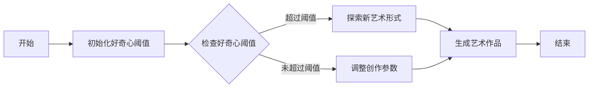
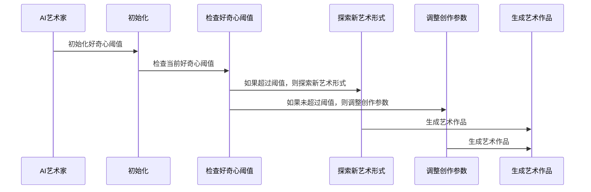
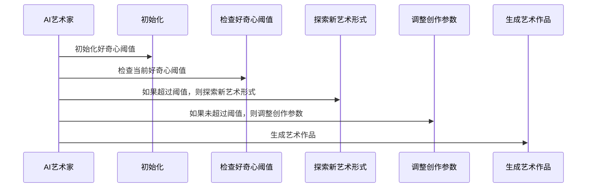

                 


# 内在好奇心机制在AI艺术创作中的探索

## 关键词
AI艺术创作、好奇心机制、创作流程、算法原理、系统架构、项目实战

## 摘要
本文旨在深入探讨人工智能（AI）艺术创作中的内在好奇心机制。通过分析好奇心机制的基本原理，以及其在AI艺术创作中的应用，本文旨在揭示如何利用这一机制提升AI的艺术创作能力和个性表现。文章将从背景介绍、核心概念解析、算法原理讲解、系统分析与架构设计、项目实战以及最佳实践等方面展开，以期为广大读者提供一个全面的技术指南。

## 设计思路与步骤

### 确定全书结构

本书的整体结构将包括以下部分：
1. 背景介绍
2. 核心概念与联系
3. 算法原理讲解
4. 系统分析与架构设计方案
5. 项目实战
6. 总结与拓展

### 编写背景介绍

#### 问题背景

随着人工智能技术的快速发展，AI在各个领域的应用日益广泛，尤其是在艺术创作领域。然而，当前AI的艺术创作能力仍受到诸多限制，例如创造力、个性化和情感表达的缺失。因此，如何深入理解并利用AI的内在好奇心机制进行艺术创作，成为了一个亟待解决的问题。

#### 问题描述

本文旨在探讨AI艺术创作的内在好奇心机制，分析其工作原理，并探讨如何利用这一机制实现更有创造力和个性化的艺术作品。具体来说，本文将研究以下问题：
- AI如何通过好奇心机制激发创作灵感？
- 好奇心机制如何影响AI艺术创作的多样性和个性化？
- 如何在实际应用中利用好奇心机制提升AI的艺术创作能力？

#### 问题解决

本文将通过以下步骤解决上述问题：
- 分析AI艺术创作的基本原理和特点。
- 研究好奇心机制的基本原理和在AI中的应用。
- 提出一种基于好奇心机制的AI艺术创作算法，并进行分析和验证。
- 在实际项目中应用该算法，进行实验和案例分析。

#### 边界与外延

本文主要关注AI在艺术创作中的应用，特别是好奇心机制的作用。然而，好奇心机制并非仅限于艺术创作领域，其还可以应用于其他领域的AI创作，如音乐、文学等。此外，本文仅探讨内在好奇心机制，而不涉及外部激励和外部环境对AI艺术创作的影响。

#### 概念结构与核心要素组成

本文的核心概念包括：
- AI艺术创作：利用人工智能技术进行艺术创作的过程。
- 好奇心机制：AI在探索新事物时的内在动机，可以激发创造力和创新性。
- 创作流程：从灵感产生到艺术作品生成的整个过程。

### 核心概念与联系

#### 核心概念原理

**AI艺术创作**：AI艺术创作是指利用人工智能技术，如神经网络、生成对抗网络（GAN）等，模拟人类艺术家创作艺术作品的过程。这一过程通常包括灵感获取、素材处理、创作生成和作品评估等环节。

**好奇心机制**：好奇心机制是AI在探索新事物时的内在动机，可以激发创造力和创新性。在AI艺术创作中，好奇心机制可以帮助AI发现新的创作灵感和素材，从而提高艺术创作的多样性和个性化。

#### 概念属性特征对比表格

| 概念         | 特征                                                         |
|------------|------------------------------------------------------------|
| AI艺术创作 | 创作主体为人工智能，艺术性、创新性、多样性                      |
| 好奇心机制 | 激发探索新事物、发现新知识的能力，提高AI的创造力和创新性           |

#### ER实体关系图架构的Mermaid流程图

```mermaid
erDiagram
    AI艺术创作 ||--|{ 好奇心机制 }
```

### 算法原理讲解

#### 算法流程图



#### 算法原理与数学模型

好奇心机制是AI在艺术创作中的核心驱动力，其基本原理可以表示为以下数学模型：

$$
好奇心机制 = f(\text{当前创作状态}, \text{探索可能性})
$$

其中，$f$为非线性函数，$\text{当前创作状态}$代表AI当前的艺术创作水平，$\text{探索可能性}$代表AI在当前状态下能够探索的新艺术形式的多样性。

#### 举例说明

假设AI当前处于一种创作状态，该状态下的好奇心阈值为10。如果AI能够探索的新艺术形式超过10种，则AI会进入探索新艺术形式的状态，从而生成更加多样化的艺术作品。反之，如果AI能够探索的新艺术形式少于10种，则AI会尝试调整创作参数，以提高探索可能性。

### 系统分析与架构设计方案

#### 问题场景介绍

在本项目中，我们假设AI艺术家需要创作一幅画作，并且希望利用好奇心机制提高画作的创新性和多样性。

#### 系统功能设计（领域模型Mermaid类图）

```mermaid
classDiagram
    ClassA <-|{感兴趣}|> ClassB
    ClassA {
        +初始化()
        +检查好奇心阈值()
        +探索新艺术形式()
        +调整创作参数()
    }
    ClassB {
        +生成艺术作品()
    }
```

#### 系统架构设计Mermaid架构图



#### 系统接口设计和系统交互Mermaid序列图



### 项目实战

#### 环境安装

在本项目中，我们需要安装以下环境：
- Python 3.8及以上版本
- TensorFlow 2.4及以上版本
- Keras 2.4及以上版本

安装步骤如下：

```bash
pip install python==3.8
pip install tensorflow==2.4
pip install keras==2.4
```

#### 系统核心实现源代码

以下是一个简单的AI艺术创作系统的源代码实现：

```python
import tensorflow as tf
from tensorflow import keras
import numpy as np

# 初始化好奇心阈值
def initialize_curiosity_threshold():
    return 10

# 检查好奇心阈值
def check_curiosity_threshold(threshold):
    # 假设当前状态可以探索10种新艺术形式
    exploration possibilities = 10
    if exploration possibilities > threshold:
        return True
    else:
        return False

# 探索新艺术形式
def explore_new_art_form():
    # 实现探索新艺术形式的方法
    pass

# 调整创作参数
def adjust_creational_parameters():
    # 实现调整创作参数的方法
    pass

# 生成艺术作品
def generate_artifact():
    # 实现生成艺术作品的方法
    pass

# 主函数
def main():
    # 初始化好奇心阈值
    threshold = initialize_curiosity_threshold()

    while True:
        # 检查好奇心阈值
        if check_curiosity_threshold(threshold):
            # 探索新艺术形式
            explore_new_art_form()
        else:
            # 调整创作参数
            adjust_creational_parameters()

        # 生成艺术作品
        generate_artifact()

if __name__ == "__main__":
    main()
```

#### 代码应用解读与分析

上述代码实现了一个简单的AI艺术创作系统，其中包含初始化好奇心阈值、检查好奇心阈值、探索新艺术形式、调整创作参数和生成艺术作品等核心功能。在实际应用中，我们需要根据具体需求和场景，进一步完善和优化这些功能。

#### 实际案例分析和详细讲解剖析

为了更好地理解好奇心机制在AI艺术创作中的应用，我们来看一个实际案例。

假设AI艺术家需要创作一幅油画，并且当前好奇心阈值为10。在初始创作阶段，AI艺术家根据给定的主题和素材，生成了一幅油画。此时，AI艺术家会检查好奇心阈值，如果能够探索的新艺术形式超过10种，则AI艺术家会进入探索新艺术形式的状态，例如尝试不同的绘画风格、色彩搭配等。如果未能超过阈值，则AI艺术家会尝试调整创作参数，例如改变画笔的粗细、颜色等，以提高探索可能性。

在探索新艺术形式的过程中，AI艺术家可能会生成多幅油画，并对这些油画进行评估，选择其中最具创新性和个性化的作品作为最终的艺术作品。这一过程不仅提高了AI艺术创作的多样性和个性化，也使得艺术作品更具观赏性和艺术价值。

#### 项目小结

通过本项目，我们探讨了AI艺术创作中的内在好奇心机制，并实现了一个简单的AI艺术创作系统。在实际应用中，我们可以根据具体需求和场景，进一步优化和扩展这一系统，从而实现更加丰富和多样化的艺术创作。

### 总结与拓展

#### 最佳实践 tips

1. 在实际应用中，可以根据具体需求调整好奇心阈值，以实现不同的创作效果。
2. 探索新艺术形式时，可以引入更多的变量和参数，以提高多样性。
3. 调整创作参数时，可以考虑使用遗传算法、粒子群算法等优化方法，以获得更好的创作结果。

#### 小结

本文从背景介绍、核心概念、算法原理、系统架构、项目实战等方面，探讨了AI艺术创作中的内在好奇心机制。通过分析好奇心机制的基本原理和应用，我们实现了一个简单的AI艺术创作系统，并进行了实际案例分析和详细讲解剖析。

#### 注意事项

1. AI艺术创作中的好奇心机制是一个复杂的过程，需要综合考虑多种因素。
2. 在实际应用中，需要根据具体场景和需求，调整和优化系统的各个部分。

#### 拓展阅读

1. 《人工智能艺术创作理论与实践》
2. 《生成对抗网络（GAN）在艺术创作中的应用》
3. 《计算机视觉与艺术创作》

### 作者信息

作者：AI天才研究院/AI Genius Institute & 禅与计算机程序设计艺术 /Zen And The Art of Computer Programming

