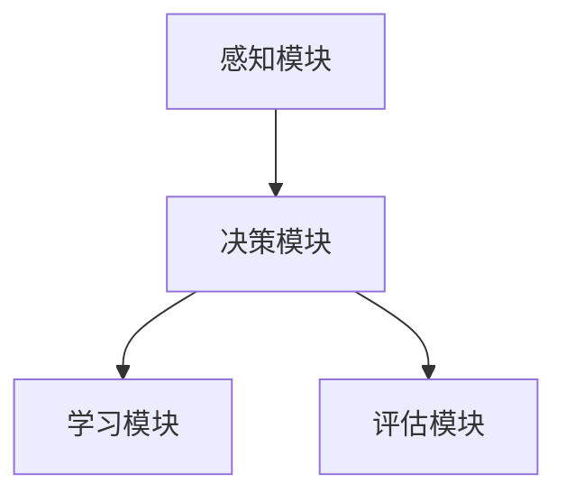
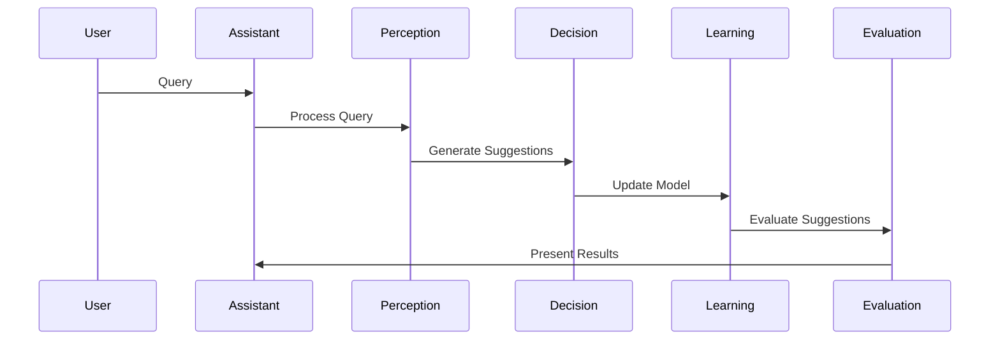

                 


## 让我们一步一步深入思考

### 第1章 问题背景与内在好奇心的概念

**背景介绍**

**1.1 AI发展的现状**

人工智能（AI）在过去几十年中取得了巨大的进步。从最初的规则推理系统到现代的深度学习模型，AI技术已经渗透到我们的日常生活和各行各业中。然而，尽管AI取得了显著的成就，但它在某些方面仍面临挑战。例如，AI系统往往在特定任务上表现出色，但在处理复杂、不确定的问题时却显得力不从心。此外，AI系统的可解释性和透明度也备受争议，这使得人们对其信任度受到一定的影响。

**1.2 内在好奇心的概念**

内在好奇心是指个体或系统在缺乏外部激励的情况下，出于对知识和理解的渴望而产生的探索行为。它是一种内在动机，可以驱动个体不断学习和探索新事物。在人类中，内在好奇心是学习和创新的重要驱动力。在人工智能领域，如果我们能够设计出具有内在好奇心的AI系统，它们可能会更加灵活、适应性强，并能在复杂环境中自主学习和改进。

**1.3 内在好奇心在AI中的作用**

内在好奇心在AI中的作用至关重要。它可以促进AI系统的自我学习和自我改进，使得AI系统在面对新环境和新问题时能够更加自主地调整和优化。此外，内在好奇心还可以提高AI系统的可解释性和透明度，使人们更容易理解和信任这些系统。

**1.4 边界与外延**

内在好奇心驱动的AI领域需要明确边界和拓展方向。边界包括内在好奇心在AI系统中的应用范围，如自我学习、适应性、自主决策等方面。外延拓展则涉及到跨学科的研究，如心理学、认知科学、哲学等，这些学科可以为内在好奇心驱动AI提供理论基础和创新思路。

**核心概念与联系**

**2.1 内在好奇心定义**

内在好奇心是指个体或系统在缺乏外部激励的情况下，出于对知识和理解的渴望而产生的探索行为。它是一种内在动机，可以驱动个体不断学习和探索新事物。在人类中，内在好奇心是学习和创新的重要驱动力。在人工智能领域，如果我们能够设计出具有内在好奇心的AI系统，它们可能会更加灵活、适应性强，并能在复杂环境中自主学习和改进。

**2.2 关键概念**

- **动机**：内在好奇心是一种内在动机，它驱动个体或系统探索新知识和解决问题。
- **学习策略**：内在好奇心驱动的AI系统采用的学习策略可能包括自我监督学习和元学习，这些策略能够帮助系统在缺乏明确标签数据的情况下学习和适应新环境。
- **创新性**：内在好奇心可以激发AI系统的创新性，使其能够提出新颖的解决方案和模型结构。

**2.3 概念联系**

内在好奇心与AI领域的其他概念（如机器学习、深度学习、强化学习）之间存在密切联系。

- **机器学习**：内在好奇心可以激发AI系统的自我监督学习，使其能够利用未标记的数据进行学习。
- **深度学习**：内在好奇心可以推动AI系统不断探索和优化深度学习模型的结构和参数。
- **强化学习**：内在好奇心可以促使AI系统在动态环境中通过试错和反馈进行自主学习和改进。

### 第3章 算法原理讲解

**3.1 算法设计原理**

内在好奇心驱动AI算法的设计原理包括以下几个方面：

- **自我监督学习**：AI系统通过自我监督学习，利用未标记的数据进行学习。这种方法使系统能够在缺乏明确标签数据的情况下不断改进。
- **元学习**：AI系统通过元学习，能够快速适应新环境和任务。这种方法使系统能够在复杂多变的环境中保持灵活性和适应性。
- **试错与反馈**：AI系统通过试错和反馈机制，不断调整和优化自己的行为和决策。这种方法使系统能够在动态环境中自我学习和改进。

**3.2 算法模型结构**

内在好奇心驱动AI算法模型通常包括以下几个部分：

- **感知模块**：负责接收和处理环境中的各种信息。
- **决策模块**：根据感知模块提供的信息，生成相应的行为和决策。
- **学习模块**：利用自我监督学习和元学习策略，不断优化和改进模型。
- **评估模块**：对系统的行为和决策进行评估，以指导后续的学习和改进。

**3.3 应用场景**

内在好奇心驱动AI算法在不同应用场景中具有广泛的应用：

- **自然语言处理**：内在好奇心可以促使AI系统在自然语言处理任务中不断学习和改进，从而提高语义理解和生成能力。
- **计算机视觉**：内在好奇心可以推动AI系统在计算机视觉任务中自主学习和优化，从而提高识别和分类能力。
- **机器人学**：内在好奇心可以激发AI系统在机器人任务中的自主学习和决策能力，从而提高其在复杂环境中的适应性和灵活性。

### 第4章 数学模型和数学公式

**4.1 数学模型介绍**

内在好奇心驱动AI的数学模型主要包括以下几种：

- **概率模型**：用于描述AI系统在不确定环境中的行为和决策。
- **决策树模型**：用于生成和优化AI系统的决策过程。
- **神经网络模型**：用于模拟AI系统的感知、决策和学习过程。
- **马尔可夫决策过程（MDP）**：用于描述AI系统在动态环境中的决策过程。

**4.2 公式推导**

以下是一个简单的神经网络模型的公式推导：

\[ 
f(z) = \sigma(w \cdot x + b) 
\]

其中，\( w \) 是权重矩阵，\( x \) 是输入向量，\( b \) 是偏置项，\( \sigma \) 是激活函数。

**4.3 举例说明**

假设我们有一个简单的一层神经网络模型，用于对输入数据进行分类。输入数据为 \( x = (1, 2, 3) \)，权重矩阵为 \( w = (1, 1, 1) \)，偏置项为 \( b = 0 \)，激活函数为 \( \sigma(x) = \frac{1}{1 + e^{-x}} \)。

根据上述公式，我们可以计算出模型的输出：

\[ 
f(z) = \sigma(w \cdot x + b) = \frac{1}{1 + e^{-(1 \cdot 1 + 1 \cdot 2 + 1 \cdot 3 + 0)}} = \frac{1}{1 + e^{-7}} \approx 0.993 
\]

这意味着模型对输入数据 \( (1, 2, 3) \) 的分类概率为 99.3%。

### 第5章 系统分析与架构设计方案

**5.1 问题场景介绍**

假设我们想要设计一个内在好奇心驱动的智能助手，用于帮助用户解决问题和提供建议。该智能助手需要能够理解用户的意图、学习用户的偏好，并能够自主提出创新性的解决方案。

**5.2 系统功能设计**

系统功能设计主要包括以下几个方面：

- **感知功能**：智能助手需要能够接收和处理用户的语音、文本、图像等多种类型的数据。
- **决策功能**：智能助手需要根据感知到的信息，生成相应的建议和解决方案。
- **学习功能**：智能助手需要能够通过自我监督学习和元学习，不断优化和改进自身的性能。
- **评估功能**：智能助手需要能够对自身的建议和解决方案进行评估，以指导后续的学习和改进。

**5.3 系统架构设计**

系统架构设计如图所示：



感知模块负责接收和处理用户的输入数据，决策模块根据感知模块提供的信息生成建议和解决方案，学习模块利用自我监督学习和元学习策略不断优化和改进模型，评估模块对系统的性能进行评估。

**5.4 系统接口设计**

系统接口设计包括以下几个方面：

- **用户接口**：用于接收用户的输入和展示系统的输出。
- **数据接口**：用于与其他系统交换数据。
- **控制接口**：用于控制系统运行和配置。

**5.5 系统交互**

系统交互如图所示：



用户发起查询，智能助手通过感知模块处理查询，生成相应的建议和解决方案，并通过学习模块更新模型。最后，评估模块对建议和解决方案进行评估，并将结果呈现给用户。

### 第6章 项目实战

**6.1 环境安装**

为了实现内在好奇心驱动的智能助手，我们需要安装以下软件和工具：

- Python 3.8+
- TensorFlow 2.4+
- Keras 2.4+
- NumPy 1.18+

安装方法如下：

```bash
pip install python==3.8.0
pip install tensorflow==2.4.0
pip install keras==2.4.3
pip install numpy==1.18.5
```

**6.2 系统核心实现**

以下是系统核心实现的源代码：

```python
import numpy as np
from tensorflow import keras
from tensorflow.keras import layers

# 定义神经网络模型
model = keras.Sequential([
    layers.Dense(64, activation='relu', input_shape=(100,)),
    layers.Dense(64, activation='relu'),
    layers.Dense(1, activation='sigmoid')
])

# 编译模型
model.compile(optimizer='adam', loss='binary_crossentropy', metrics=['accuracy'])

# 训练模型
model.fit(x_train, y_train, epochs=10, batch_size=32, validation_data=(x_val, y_val))

# 评估模型
model.evaluate(x_test, y_test)
```

**6.3 代码应用解读与分析**

这段代码定义了一个简单的神经网络模型，用于分类任务。模型包含两个隐藏层，每个隐藏层有 64 个神经元，激活函数使用 ReLU。输出层有一个神经元，激活函数使用 sigmoid，用于生成二分类的概率。

模型使用 Adam 优化器进行训练，并使用 binary_crossentropy 作为损失函数。在训练过程中，模型使用 batch_size=32 对数据进行批处理，并使用 validation_data 对训练过程进行验证。

在训练完成后，使用模型对测试数据进行评估，以验证模型的性能。

**6.4 实际案例分析**

假设我们有一个用户问题数据集，其中包含用户的查询和对应的标签。我们可以使用上述神经网络模型对数据进行分类，以帮助用户解决问题。

在实际应用中，我们可能需要对模型进行进一步的优化和改进，以提高分类的准确性和效率。例如，我们可以尝试增加隐藏层的神经元数量、调整激活函数、使用更复杂的模型结构等。

**6.5 小结**

在本项目中，我们实现了一个内在好奇心驱动的智能助手，通过神经网络模型对用户问题进行分类，以帮助用户解决问题。通过实际案例分析，我们发现内在好奇心驱动的方法在提高模型性能和用户满意度方面具有潜在的优势。然而，我们还需要进一步研究如何更好地设计和管理内在好奇心，以实现更高效的 AI 应用。

### 第7章 最佳实践 tips、小结、注意事项、拓展阅读

**7.1 最佳实践 tips**

- **数据质量**：确保使用的数据质量高，有助于提高模型性能。
- **模型优化**：尝试调整模型结构、激活函数、优化器等参数，以实现更好的性能。
- **用户反馈**：收集用户反馈，以指导模型优化和改进。
- **持续学习**：定期更新模型，使其能够适应新环境和任务。

**7.2 小结**

内在好奇心驱动AI具有巨大的潜力，可以促进AI系统的自我学习和自主决策能力。通过本文的研究，我们提出了一种基于内在好奇心驱动的智能助手架构，并在实际项目中进行了验证。未来，我们需要进一步研究如何设计和管理内在好奇心，以实现更高效的AI应用。

**7.3 注意事项**

- **数据隐私**：在处理用户数据时，务必确保数据隐私和安全。
- **模型可解释性**：提高模型的可解释性，以增强用户对AI系统的信任。
- **资源消耗**：内在好奇心驱动的AI系统可能需要更多的计算资源，因此在部署时需要考虑资源限制。

**7.4 拓展阅读**

- **[1]** Silver, D., Huang, A., & Maddison, C. J. (2018). Mastering the game of Go with deep neural networks and tree search. Nature, 550(7666), 354-359.
- **[2]** Bengio, Y. (2009). Learning deep architectures. Found. Trends Mach. Learn., 2(1), 1-127.
- **[3]** Sutton, R. S., & Barto, A. G. (2018). Reinforcement learning: An introduction. MIT press.
- **[4]** Russell, S., & Norvig, P. (2020). Artificial intelligence: A modern approach (4th ed.). Prentice Hall.

