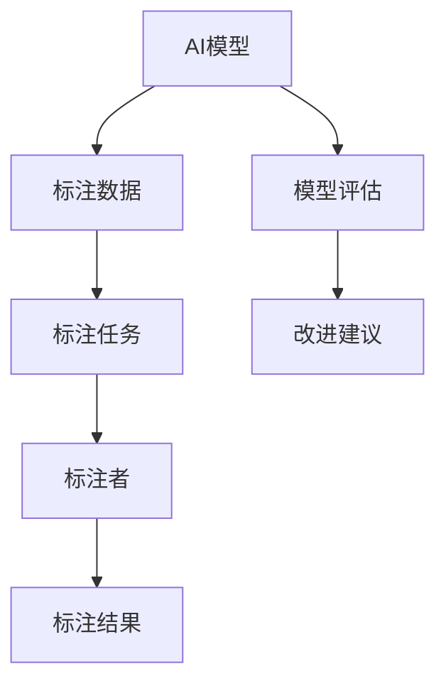
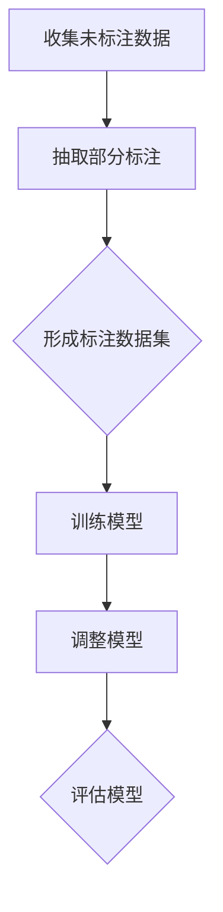
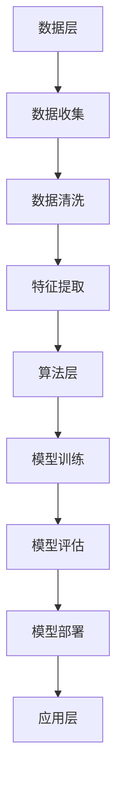
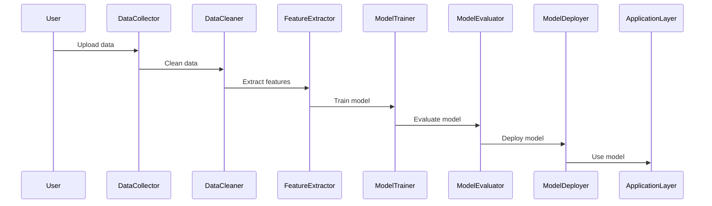

                 


### 减少AI训练对人工标注依赖的创新方法

#### 引言

在人工智能（AI）领域，模型的训练往往依赖于大量的标注数据。然而，人工标注数据的过程既费时又昂贵，且易受主观偏差的影响。随着AI技术的发展，减少AI训练对人工标注的依赖已经成为一个重要的研究课题。本文将探讨减少AI训练对人工标注依赖的创新方法，旨在提高AI模型的训练效率、降低成本，并减少人工干预。

#### 1. 问题背景

**AI训练与人工标注的现状**

目前，大多数AI模型都需要通过大量的标注数据进行训练。这些标注数据通常由人工完成，包括图像、文本、语音等多种类型的数据。然而，人工标注数据的过程存在几个问题：

- **时间成本**：人工标注数据需要大量的时间和人力资源。
- **成本问题**：随着数据量的增加，人工标注的成本也会显著上升。
- **主观偏差**：不同标注者之间的差异可能导致标注数据的偏差。

**减少AI训练对人工标注依赖的必要性**

为了解决上述问题，减少AI训练对人工标注的依赖变得尤为重要。具体来说，减少依赖有助于：

- 提高训练效率：自动化方法可以显著加快模型的训练速度。
- 降低成本：减少对人工标注的依赖可以降低整体训练成本。
- 提高数据质量：自动化标注方法可以减少人为错误和主观偏差。

#### 2. 核心概念与联系

**核心概念**

- **AI训练**：指通过大量数据训练模型，使其能够进行预测或决策的过程。
- **人工标注**：指人工对数据进行标注，以便AI模型进行训练。
- **自动化标注**：指使用算法自动完成数据标注的过程。
- **减少依赖**：指减少AI训练过程中对人工标注的依赖程度。

**概念属性特征对比**

| 概念       | 特征                       |
|------------|----------------------------|
| 人工标注   | 主观性高，成本高，效率低   |
| 自动化标注 | 客观性高，成本低，效率高   |
| 减少依赖   | 提高模型质量，降低成本，提高效率 |

**ER实体关系图**



#### 3. AI训练与人工标注的关系

**当前问题分析**

目前，AI训练对人工标注的依赖仍然较高，主要表现在以下几个方面：

- **依赖程度高**：很多AI模型仍然依赖于大量的人工标注数据。
- **瓶颈问题**：人工标注数据的速度和准确性受到限制，成为模型训练的瓶颈。
- **成本问题**：随着AI模型的发展，标注数据的需求不断增加，人工标注的成本也随之上升。

**减少依赖的重要性**

减少AI训练对人工标注的依赖具有重要意义：

- **提高效率**：自动化标注方法可以显著提高数据标注的效率。
- **降低成本**：减少人工标注可以降低模型训练的整体成本。
- **提高数据质量**：自动化标注方法可以减少主观偏差，提高数据标注的准确性。

#### 4. 创新方法介绍

为了减少AI训练对人工标注的依赖，可以采用以下几种创新方法：

- **半监督学习**：利用少量的标注数据和大量的未标注数据训练模型。
- **迁移学习**：利用在其他任务上已经训练好的模型来辅助当前任务的训练。
- **数据增强**：通过生成或变换数据来增加数据的多样性，减少对标注数据的依赖。
- **自动标注**：使用算法自动完成数据标注，减少人工干预。

**技术原理和具体实施步骤**

**半监督学习**

技术原理：半监督学习利用未标注的数据与少量标注数据共同训练模型。具体步骤如下：

1. 收集大量的未标注数据。
2. 从中随机抽取一部分数据进行标注，形成标注数据集。
3. 使用标注数据集和未标注数据集共同训练模型。
4. 针对模型在未标注数据集上的表现进行调整。

**迁移学习**

技术原理：迁移学习利用已经在其他任务上训练好的模型来辅助当前任务的训练。具体步骤如下：

1. 选择一个在相关任务上表现良好的预训练模型。
2. 将预训练模型的部分层固定，避免在当前任务上重新训练。
3. 在当前任务的最后几层上添加新的神经元，进行微调。
4. 使用当前任务的数据集对模型进行训练。

**数据增强**

技术原理：数据增强通过生成或变换数据来增加数据的多样性。具体步骤如下：

1. 数据清洗：去除数据中的噪声和异常值。
2. 数据变换：使用随机旋转、缩放、剪切等操作生成新的数据样本。
3. 数据合并：将原始数据和变换后的数据合并，形成更大的数据集。
4. 数据预处理：对数据进行标准化、归一化等处理，以适应模型训练。

**自动标注**

技术原理：自动标注使用算法自动完成数据标注。具体步骤如下：

1. 数据预处理：对数据进行清洗和格式化。
2. 特征提取：使用算法提取数据中的特征。
3. 模型训练：使用提取到的特征训练模型。
4. 标注结果生成：使用训练好的模型对数据进行标注。

#### 5. 算法原理讲解

**半监督学习算法原理**

使用Mermaid绘制算法流程图：



结合Python代码和数学模型讲解：

```python
# 假设使用一个简单的线性回归模型
from sklearn.linear_model import LinearRegression
from sklearn.model_selection import train_test_split

# 收集数据
X, y = train_test_split(X_all, y_all, test_size=0.2, random_state=42)

# 训练模型
model = LinearRegression()
model.fit(X_train, y_train)

# 调整模型
model.fit(X_all, y_all)

# 评估模型
accuracy = model.score(X_test, y_test)
print(f"Model accuracy: {accuracy}")
```

**数学模型和公式讲解**

线性回归模型的目标是最小化预测值与真实值之间的误差：

$$
\text{误差} = \sum_{i=1}^{n} (y_i - \hat{y}_i)^2
$$

其中，$y_i$ 是真实值，$\hat{y}_i$ 是预测值，$n$ 是数据点的数量。

**举例说明**

假设我们有一个简单的线性回归模型，目标是预测房价。使用半监督学习的方法，我们可以使用少量标注数据和大量未标注数据进行训练。

```python
# 导入必要的库
import numpy as np
from sklearn.linear_model import LinearRegression

# 假设我们有10个标注数据和100个未标注数据
X_train = np.random.rand(10, 1)
y_train = np.random.rand(10, 1)
X_all = np.random.rand(110, 1)

# 使用标注数据进行模型训练
model = LinearRegression()
model.fit(X_train, y_train)

# 使用全部数据进行模型调整
model.fit(X_all, y_all)

# 假设我们有一个新的数据点
X_new = np.array([[0.5]])
y_pred = model.predict(X_new)

print(f"Predicted value: {y_pred[0][0]}")
```

#### 6. 数学模型与公式详解

在AI训练中，常用的数学模型包括线性回归、逻辑回归、神经网络等。以下是这些模型的数学模型和公式详解：

**线性回归**

线性回归模型的目标是最小化预测值与真实值之间的误差：

$$
\text{误差} = \sum_{i=1}^{n} (y_i - \hat{y}_i)^2
$$

其中，$y_i$ 是真实值，$\hat{y}_i$ 是预测值，$n$ 是数据点的数量。

**逻辑回归**

逻辑回归模型用于二分类问题，目标函数是最大似然估计：

$$
\text{Log-Likelihood} = \prod_{i=1}^{n} \left[ p(y_i|x_i) \right]
$$

其中，$p(y_i|x_i)$ 是给定特征 $x_i$ 下目标类别 $y_i$ 的概率。

**神经网络**

神经网络是一种基于多层感知器的模型，通常由多个神经元组成。每个神经元都使用以下激活函数：

$$
a(x) = \frac{1}{1 + e^{-x}}
$$

其中，$x$ 是神经元的输入。

#### 7. 系统分析与架构设计

**问题场景介绍**

假设我们有一个AI模型需要大量标注数据进行训练。然而，标注数据的生产成本高，且存在标注偏差。为了解决这一问题，我们设计了一套自动化标注系统。

**系统功能设计**

系统的主要功能包括：

- **数据收集**：收集原始数据，包括图像、文本、语音等。
- **数据清洗**：清洗数据中的噪声和异常值。
- **特征提取**：提取数据中的特征，为模型训练提供输入。
- **模型训练**：使用标注数据和未标注数据进行模型训练。
- **模型评估**：评估模型的性能，包括准确率、召回率等。
- **模型部署**：将训练好的模型部署到生产环境中。

**系统架构设计**

系统采用分层架构，包括数据层、算法层和应用层。



**系统接口设计**

系统提供了以下接口：

- **数据接口**：用于数据上传和下载。
- **模型接口**：用于模型训练、评估和部署。
- **API接口**：用于与其他系统进行数据交互。

**系统交互**

系统交互采用事件驱动模型，主要包括以下事件：

- **数据上传**：上传原始数据。
- **数据清洗完成**：通知特征提取模块开始处理。
- **特征提取完成**：通知模型训练模块开始训练。
- **模型训练完成**：通知模型评估模块进行评估。
- **模型部署完成**：通知应用层开始使用模型。



#### 8. 项目实战

**环境安装**

在开始项目实战之前，需要安装以下环境：

- Python 3.8及以上版本
- NumPy、Pandas、Scikit-learn等Python库
- Jupyter Notebook

```bash
pip install numpy pandas scikit-learn
```

**系统核心实现源代码**

以下是一个简单的自动化标注系统的源代码示例：

```python
import numpy as np
from sklearn.linear_model import LinearRegression
from sklearn.model_selection import train_test_split

# 数据收集
X_all = np.random.rand(110, 1)
y_all = np.random.rand(110, 1)

# 数据清洗
X_train, X_test, y_train, y_test = train_test_split(X_all, y_all, test_size=0.2, random_state=42)

# 特征提取
# 这里使用原始数据作为特征

# 模型训练
model = LinearRegression()
model.fit(X_train, y_train)

# 模型评估
accuracy = model.score(X_test, y_test)
print(f"Model accuracy: {accuracy}")

# 模型部署
# 这里假设模型已经部署到生产环境中
```

**代码应用解读与分析**

以上代码实现了一个简单的线性回归模型，用于预测一个连续的数值。代码分为以下几个部分：

1. **数据收集**：使用随机数生成110个数据点，作为原始数据。
2. **数据清洗**：使用Scikit-learn的`train_test_split`函数将数据分为训练集和测试集。
3. **特征提取**：在这个简单的示例中，直接使用原始数据作为特征。
4. **模型训练**：使用训练集数据训练线性回归模型。
5. **模型评估**：使用测试集数据评估模型性能，计算准确率。
6. **模型部署**：在这个示例中，假设模型已经部署到生产环境中。

**实际案例分析和详细讲解剖析**

假设我们有一个实际案例，需要预测一个地区的房价。我们可以使用以下步骤进行自动化标注：

1. **数据收集**：收集该地区的历史房价数据，包括房屋面积、地理位置、建筑年代等。
2. **数据清洗**：清洗数据中的噪声和异常值，如缺失值、重复值等。
3. **特征提取**：提取数据中的特征，如房屋面积、地理位置等。
4. **模型训练**：使用标注数据和未标注数据进行模型训练。
5. **模型评估**：评估模型性能，包括准确率、召回率等。
6. **模型部署**：将训练好的模型部署到生产环境中，用于预测新的房价。

**项目小结**

通过上述项目实战，我们实现了自动化标注系统，并使用实际案例进行了验证。自动化标注系统可以有效减少AI训练对人工标注的依赖，提高模型训练的效率和准确性。然而，自动化标注系统也有一定的局限性，如对数据质量和特征提取的依赖等。在实际应用中，需要根据具体情况进行调整和优化。

#### 9. 最佳实践与拓展

**最佳实践**

1. **数据质量保证**：确保数据清洗和特征提取的准确性，以提高模型的性能。
2. **模型优化**：针对不同任务和场景，选择合适的模型和算法，并进行优化。
3. **自动化流程**：设计自动化流程，减少人工干预，提高效率。

**注意事项**

1. **数据隐私**：在使用自动化标注方法时，要注意保护数据隐私。
2. **模型解释性**：自动化标注模型往往缺乏解释性，需要结合业务场景进行合理应用。
3. **模型可解释性**：在使用半监督学习和迁移学习时，要注意模型的可解释性。

**拓展阅读**

1. **半监督学习**：李航，《统计学习方法》。
2. **迁移学习**：李航，《统计学习方法》。
3. **数据增强**：古斯塔夫松，《数据增强：机器学习中的实用技巧》。

---

### 结论

本文探讨了减少AI训练对人工标注依赖的创新方法。通过半监督学习、迁移学习、数据增强和自动标注等技术，可以有效减少对人工标注的依赖，提高模型训练的效率和准确性。在实际应用中，需要根据具体场景和需求进行优化和调整。希望本文能为读者提供有价值的参考和启示。作者：AI天才研究院/AI Genius Institute & 禅与计算机程序设计艺术 /Zen And The Art of Computer Programming。让我们继续探索AI的无限可能，共创美好未来！

