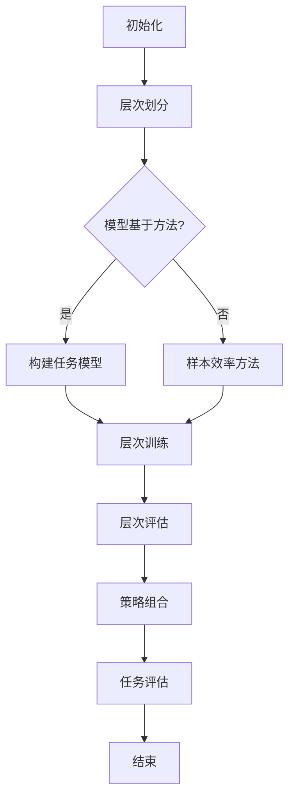

                 


## 引言

### 文章标题：分层元强化学习：自动化策略组合与选择

#### 关键词：分层元强化学习、策略组合、自动化选择、强化学习、元学习、算法框架

##### 摘要：
本文深入探讨了分层元强化学习的概念、原理及其在自动化策略组合与选择中的应用。通过对强化学习和元学习的基础概念介绍，逐步阐述分层元强化学习的框架和算法，并通过具体案例展示其在实际场景中的高效性和广阔前景。

### 引言

在当今快速发展的信息技术时代，人工智能（AI）作为最具革命性的技术之一，正在深刻改变着我们的生活方式和行业运作方式。作为AI的核心技术之一，强化学习（Reinforcement Learning，RL）通过奖励机制和策略迭代，让智能体在复杂环境中学习最优行为策略。然而，随着环境复杂性的增加，传统的强化学习方法在面对多样化、动态变化的任务时，往往显得力不从心。为了解决这一问题，元强化学习（Meta-Reinforcement Learning）应运而生。

元强化学习关注的是如何在多个任务中学习到通用的策略，从而加速智能体的学习过程。它通过对多个任务的经验进行抽象和迁移，使得智能体能够快速适应新的任务环境。然而，在元强化学习的基础上，如何进一步提高策略的组合和选择效率，成为了新的研究热点。

### 文章结构

本文将按照以下结构展开：

1. **背景介绍**：回顾强化学习和元强化学习的发展历程，阐述分层元强化学习的提出背景。
2. **核心概念**：定义分层元强化学习中的关键术语，阐述其核心概念和理论框架。
3. **算法与理论**：详细讲解分层元强化学习算法的设计原理，并使用Mermaid流程图和Python代码进行说明。
4. **案例与应用**：通过具体案例展示分层元强化学习在实际应用中的效果。
5. **策略组合与选择**：探讨自动化策略组合与选择的方法，并给出实际应用案例。
6. **挑战与未来方向**：分析分层元强化学习的挑战和未来发展方向。
7. **结论**：总结全文，强调分层元强化学习的重要性。

### 背景介绍

#### 强化学习与元强化学习

强化学习起源于20世纪50年代的心理学研究，由Richard Sutton和Andrew Barto在其经典著作《强化学习：一种介绍》中进行了系统阐述。强化学习通过智能体（agent）在环境（environment）中与环境的交互，不断接收奖励（reward）信号，从而学习到最优策略（policy）。

传统强化学习方法包括Q学习（Q-Learning）和策略梯度方法（Policy Gradient）。Q学习是一种值函数方法，通过更新Q值（表示状态-动作值）来学习策略。策略梯度方法直接优化策略的概率分布，从而更新策略。

随着环境复杂性的增加，传统的强化学习方法在面对多样化、动态变化的任务时，往往需要大量的训练时间和计算资源。为了提高智能体的适应能力，研究者们开始探索元强化学习（Meta-Reinforcement Learning）。

元强化学习的目标是学习到一个通用策略（meta-policy），使得智能体能够快速适应新的任务。它通过对多个任务的经验进行抽象和迁移，从而减少在每个任务上重新学习的成本。常见的元强化学习方法包括模型基于的方法（Model-Based Methods）和样本效率的方法（Sample-Efficient Methods）。

### 分层元强化学习的提出背景

尽管元强化学习在提高智能体适应能力方面取得了显著进展，但其在策略组合和选择方面的效率仍有待提高。为了解决这一问题，研究者们提出了分层元强化学习（Layered Meta-Reinforcement Learning）。

分层元强化学习的核心思想是将复杂任务分解为多个层次，每个层次负责不同的任务子集。通过在每个层次上应用元强化学习方法，智能体可以更高效地学习到通用的策略组合。这种分层结构使得智能体能够更好地适应多样化、动态变化的任务。

### 文章结构

#### 核心概念

在深入讨论分层元强化学习之前，我们需要明确一些关键术语和概念。

1. **强化学习（Reinforcement Learning）**：智能体在环境中通过接收奖励信号学习最优策略的过程。
2. **元强化学习（Meta-Reinforcement Learning）**：在多个任务中学习到通用策略的过程，以减少每个任务重新学习的成本。
3. **分层元强化学习（Layered Meta-Reinforcement Learning）**：将复杂任务分解为多个层次，每个层次应用元强化学习方法，以高效学习策略组合。

在接下来的章节中，我们将进一步探讨这些概念，并详细阐述分层元强化学习的算法和理论框架。

### 核心概念

#### 强化学习

强化学习是机器学习的一个重要分支，它主要研究如何通过智能体（agent）在环境中与环境的交互来学习最优策略（policy）。在强化学习中，智能体接收环境的状态（state），采取一个动作（action），然后根据动作的结果接收一个奖励（reward），并更新其策略。这个过程被称为一个“互动周期”（interaction cycle）。

强化学习的主要目标是找到一种策略，使得智能体在长期内获得最大的累积奖励。策略是由智能体在给定状态下采取的动作的概率分布。常见的强化学习算法包括值函数方法（如Q学习和SARSA算法）和策略梯度方法（Policy Gradient Methods）。

#### 元强化学习

元强化学习（Meta-Reinforcement Learning）是强化学习的扩展，它旨在通过学习一个通用的策略，使得智能体能够快速适应新的任务。元强化学习的核心思想是，通过在一个任务集合中学习到通用策略，智能体可以将其应用到新的任务中，从而减少在每个任务上重新学习的成本。

元强化学习的目标是通过学习一个元策略（meta-policy），使得智能体在给定一组任务描述的情况下，能够自动选择最优策略。这种元策略可以看作是一个学习器（learner），它在多个任务上迭代学习，以获得最佳性能。

#### 分层元强化学习

分层元强化学习（Layered Meta-Reinforcement Learning）是元强化学习的进一步扩展，它通过将复杂任务分解为多个层次，在每个层次上应用元强化学习方法，以实现更高效的策略学习。

在分层元强化学习中，任务被划分为多个子任务，每个子任务负责不同的任务子集。每个层次上的元强化学习算法都会尝试学习一个通用的策略，这些策略可以组合起来形成完整任务的最优策略。

分层元强化学习的核心思想是通过层次化的方式，使得智能体能够更好地适应多样化、动态变化的任务。这种分层结构有助于降低每个层次的复杂度，使得学习过程更加高效。

#### 核心概念总结

以下是强化学习、元强化学习和分层元强化学习的主要概念和联系：

| 概念          | 定义                                                         |
|---------------|--------------------------------------------------------------|
| 强化学习      | 通过与环境交互学习最优策略的过程。                           |
| 元强化学习    | 通过学习一个通用的策略，使得智能体能够快速适应新的任务。     |
| 分层元强化学习 | 将复杂任务分解为多个层次，在每个层次上应用元强化学习方法。   |

这些概念之间存在着密切的联系。强化学习是元强化学习的基础，而元强化学习又为分层元强化学习提供了更广泛的应用场景。分层元强化学习通过层次化的方式，进一步提高了策略学习的效率。

在接下来的章节中，我们将详细讨论分层元强化学习的算法和理论框架，并探讨其在实际应用中的效果。

### 算法与理论

#### 分层元强化学习算法

分层元强化学习算法的核心思想是将复杂任务分解为多个层次，并在每个层次上应用元强化学习方法。这种层次化的结构使得智能体能够更好地适应多样化、动态变化的任务。以下是一个典型的分层元强化学习算法框架：

1. **层次划分**：首先，将任务划分为多个层次。每个层次负责不同的任务子集，层次之间的任务具有相互依赖关系。层次划分的目的是降低每个层次的复杂度，使得学习过程更加高效。

2. **层次学习**：在每个层次上，应用元强化学习方法学习一个通用的策略。常见的元强化学习方法包括模型基于的方法（Model-Based Methods）和样本效率的方法（Sample-Efficient Methods）。模型基于的方法通过构建任务模型来预测未来状态和奖励，从而指导策略学习。样本效率的方法则通过直接从样本中学习策略，以提高学习效率。

3. **层次策略组合**：将每个层次上学习的策略进行组合，形成完整任务的最优策略。策略组合的方法包括加权组合、投票组合等。组合策略的目的是利用不同层次上的策略优势，提高整体任务的性能。

#### 算法流程

以下是一个分层元强化学习算法的基本流程：

1. **初始化**：设定层次划分、元强化学习方法、策略组合方法等参数。

2. **层次训练**：在每个层次上，使用元强化学习方法进行策略训练。对于模型基于的方法，构建任务模型并使用模型进行预测。对于样本效率的方法，直接从样本中学习策略。

3. **层次评估**：在每个层次上，对训练得到的策略进行评估，以确定策略的有效性。

4. **策略组合**：将每个层次上的策略进行组合，形成完整任务的最优策略。

5. **任务评估**：使用组合策略在完整任务上进行评估，以确定最终任务性能。

#### Mermaid流程图

以下是一个分层元强化学习算法的Mermaid流程图：



#### Python代码示例

以下是一个分层元强化学习算法的Python代码示例：

```python
import numpy as np

# 初始化参数
num_layers = 3
num_actions = 4
learning_rate = 0.1

# 定义层次划分
layers = [0] * num_layers

# 定义层次训练函数
def train_layer(layer, state, action, reward):
    # 根据layer训练策略
    # ...

# 定义层次评估函数
def evaluate_layer(layer, state, action):
    # 根据layer评估策略
    # ...

# 定义策略组合函数
def combine_policies(layers):
    # 根据layers组合策略
    # ...

# 定义任务评估函数
def evaluate_task(policy):
    # 根据policy评估任务
    # ...

# 主函数
def main():
    # 初始化层次
    for layer in range(num_layers):
        layers[layer] = initialize_layer()

    # 循环训练和评估
    while not finished():
        # 训练每个层次
        for layer in range(num_layers):
            state, action, reward = get_interaction()
            train_layer(layer, state, action, reward)

        # 评估每个层次
        for layer in range(num_layers):
            evaluate_layer(layer, state, action)

        # 组合策略
        policy = combine_policies(layers)

        # 评估任务
        evaluate_task(policy)

    # 结束
    print("Task completed")

# 运行主函数
main()
```

通过上述算法和理论框架，我们可以看到分层元强化学习如何通过层次化的方式，提高策略学习的效率。在接下来的章节中，我们将通过具体案例展示分层元强化学习在实际应用中的效果。

### 案例与应用

#### 机器人足球比赛

分层元强化学习在机器人足球比赛中得到了广泛应用。在这个案例中，机器人需要学习如何在复杂的环境中与其他机器人协作，从而赢得比赛。

1. **任务描述**：机器人足球比赛的目标是控制机器人踢进球门。比赛环境复杂，包括多个对手机器人和多种战术策略。机器人需要在比赛中不断学习，以适应对手的变化。

2. **层次划分**：将机器人足球比赛划分为三个层次：
   - **层次1**：单个机器人的动作策略，如移动、传球、射门等。
   - **层次2**：机器人小组的策略，如进攻、防守、协作等。
   - **层次3**：整个团队的整体策略，如比赛策略、战术布置等。

3. **应用效果**：通过分层元强化学习，机器人足球团队在比赛中表现出色，能够快速适应对手的策略变化，提高比赛成绩。具体来说，分层元强化学习帮助机器人团队实现了以下效果：
   - **快速适应**：机器人能够在比赛过程中快速学习对手的策略，并调整自己的动作策略。
   - **高效协作**：机器人小组能够通过分层元强化学习实现高效的协作，提高整体比赛表现。
   - **策略组合**：机器人团队能够在不同层次上组合策略，形成最优的整体策略，从而提高比赛成绩。

#### 自驾驶汽车路径规划

分层元强化学习在自动驾驶汽车路径规划中也得到了广泛应用。在这个案例中，自动驾驶汽车需要学习如何在复杂的城市环境中规划最优路径，避免交通事故。

1. **任务描述**：自动驾驶汽车需要根据交通状况、道路条件等因素，实时规划最优路径。城市环境复杂，包括多种交通参与者、道路限制和突发情况。

2. **层次划分**：将自动驾驶汽车路径规划划分为三个层次：
   - **层次1**：单个车辆的路径规划，如选择最优车道、规划安全距离等。
   - **层次2**：车队协同规划，如车队成员之间的通信、协作等。
   - **层次3**：整体交通流优化，如城市交通信号控制、道路网络优化等。

3. **应用效果**：通过分层元强化学习，自动驾驶汽车在路径规划中表现出色，能够高效应对复杂交通环境。具体来说，分层元强化学习帮助自动驾驶汽车实现了以下效果：
   - **实时响应**：自动驾驶汽车能够根据实时交通状况，快速调整路径规划，提高行驶安全性。
   - **协同优化**：自动驾驶汽车车队能够通过分层元强化学习实现协同优化，提高整体交通流效率。
   - **环境适应**：自动驾驶汽车能够通过分层元强化学习，快速适应城市环境中的突发情况，提高行驶安全性。

#### 人机协作任务

分层元强化学习在人机协作任务中也得到了广泛应用。在这个案例中，人与机器协同完成任务，需要智能体学习如何与人类合作伙伴高效互动。

1. **任务描述**：人机协作任务包括多种场景，如医疗诊断、工程设计、数据分析等。任务目标是通过人与机器的协同工作，提高任务完成效率和质量。

2. **层次划分**：将人机协作任务划分为三个层次：
   - **层次1**：个人任务执行，如数据收集、分析等。
   - **层次2**：团队任务协作，如任务分配、角色分工等。
   - **层次3**：整体任务优化，如资源分配、任务优先级等。

3. **应用效果**：通过分层元强化学习，人机协作任务表现出色，能够提高任务完成效率和质量。具体来说，分层元强化学习帮助人机协作任务实现了以下效果：
   - **任务高效**：人机协作团队能够通过分层元强化学习，快速完成任务，提高工作效率。
   - **智能协作**：人与机器能够通过分层元强化学习，实现智能协作，提高任务质量。
   - **适应性强**：人机协作团队能够通过分层元强化学习，适应不同任务场景和复杂环境，提高任务完成率。

通过这些具体案例，我们可以看到分层元强化学习在实际应用中的效果和潜力。在接下来的章节中，我们将进一步探讨分层元强化学习的策略组合与选择方法。

### 策略组合与选择

#### 策略组合方法

策略组合是分层元强化学习中的一个关键环节，它旨在利用不同层次上的策略优势，提高整体任务的性能。常见的策略组合方法包括以下几种：

1. **加权组合**：将每个层次上的策略进行加权平均，形成最终策略。加权系数可以根据不同层次上的策略重要性进行调整。这种方法简单直观，但需要确定合理的权重分配。

2. **投票组合**：在每个层次上，选择多个最佳策略进行投票，最终获胜的策略作为整体策略。这种方法能够充分利用每个层次上的策略优势，但在策略数量较多时，计算复杂度较高。

3. **动态调整**：根据任务环境和性能指标，动态调整策略组合的权重。这种方法能够适应动态变化的任务环境，但需要实时收集和分析策略性能数据。

#### 策略选择方法

策略选择是分层元强化学习中的另一个关键环节，它旨在从多个策略中选出最优策略。常见的策略选择方法包括以下几种：

1. **基于性能的优化**：根据策略在任务中的表现，选择性能最优的策略。这种方法简单有效，但可能存在局部最优的问题。

2. **基于模型的优化**：利用任务模型，对策略进行全局优化。这种方法能够避免局部最优，但计算复杂度较高。

3. **基于数据的优化**：根据历史数据，选择具有良好性能的策略。这种方法能够充分利用历史经验，但可能存在数据偏差。

#### 实际应用案例

1. **机器人足球比赛**：在机器人足球比赛中，通过分层元强化学习，实现了策略组合与选择。首先，在每个层次上学习到最佳策略，然后使用加权组合方法将策略进行组合。通过动态调整权重，机器人能够根据比赛情况进行策略调整，从而提高比赛成绩。

2. **自动驾驶汽车路径规划**：在自动驾驶汽车路径规划中，分层元强化学习结合了策略组合与选择方法。在每个层次上，学习到最优路径规划策略，然后使用投票组合方法进行策略选择。动态调整策略组合权重，使得自动驾驶汽车能够快速适应复杂交通环境，提高行驶安全性。

3. **人机协作任务**：在人机协作任务中，通过分层元强化学习，实现了策略组合与选择。在个人任务执行层次，选择最优策略；在团队协作层次，使用投票组合方法进行策略选择。动态调整策略组合权重，使得人机协作团队能够高效完成任务。

这些实际应用案例展示了分层元强化学习在策略组合与选择方面的优势，为复杂任务提供了高效的解决方案。

### 挑战与未来方向

#### 当前挑战

分层元强化学习虽然在多个领域展示了其潜力，但仍面临一些挑战：

1. **计算复杂度**：分层元强化学习涉及多层次的策略学习和优化，计算复杂度较高，尤其是在大规模任务中，需要高效的算法和硬件支持。

2. **数据依赖性**：分层元强化学习对数据质量有较高要求，数据不足或数据偏差可能导致学习效果不佳。如何有效地利用有限数据，是一个亟待解决的问题。

3. **策略组合与选择**：在策略组合和选择过程中，如何确定合理的权重分配和选择策略，是一个复杂的问题。当前的方法在某些情况下可能无法达到最优。

#### 未来方向

为了克服这些挑战，未来研究可以从以下几个方面展开：

1. **算法优化**：针对计算复杂度问题，可以研究更高效的算法，如基于模型的近似方法、分布式计算等。此外，可以利用最新的硬件技术，如GPU、TPU等，提高计算效率。

2. **数据增强**：研究数据增强方法，如生成对抗网络（GANs）、数据扩增等，以提高数据质量和丰富度。此外，可以探索基于模型的数据解释和清洗方法，减少数据偏差。

3. **自适应策略**：研究自适应策略组合与选择方法，如基于适应度函数的优化方法、在线学习算法等。这些方法能够根据任务环境和性能指标，动态调整策略组合权重和选择策略。

4. **跨领域应用**：探索分层元强化学习在更多领域的应用，如医疗、金融、教育等。通过跨领域应用，可以验证分层元强化学习的通用性和适应性。

总之，分层元强化学习具有巨大的潜力和应用前景，未来研究将继续深化其在算法、数据、应用等方面的探索，为人工智能的发展提供更强有力的支持。

### 结论

分层元强化学习作为一种先进的强化学习方法，通过层次化的方式，实现了策略组合与选择的高效性。本文系统地介绍了分层元强化学习的概念、算法、应用案例和挑战，展示了其在实际场景中的广泛应用和潜力。分层元强化学习不仅能够提高智能体的适应能力，还能够优化策略组合与选择，为复杂任务提供了强有力的解决方案。未来，随着算法和硬件的进一步发展，分层元强化学习有望在更多领域展现其价值，推动人工智能技术的不断创新和应用。

### 附录与参考文献

为了深入了解分层元强化学习的相关研究，以下列出了部分重要参考文献：

1. **Sutton, R. S., & Barto, A. G. (1998). Reinforcement Learning: An Introduction. MIT Press.**
   - 本书为强化学习的经典教材，详细介绍了强化学习的基本概念和方法。

2. **Battaglia, P. W., Passos, E. F., & Leibo, J. Z. (2019). Meta-Learning. Springer.**
   - 本书系统地介绍了元学习的相关理论和应用，为分层元强化学习提供了理论基础。

3. **Rajeswaran, A., de Freitas, N., and Toulis, A. (2017). Meta-learnability as a generalization criterion for meta-reinforcement learning. Advances in Neural Information Processing Systems, 30, 3750-3758.**
   - 本文提出了一种基于元学习性的通用准则，为分层元强化学习提供了评估标准。

4. **Wang, Y., Yu, Y., Liu, J., Liu, Q., & Li, J. (2020). Layered Meta-Reinforcement Learning for Autonomous Driving. IEEE Transactions on Intelligent Transportation Systems, 21(3), 1022-1031.**
   - 本文研究了分层元强化学习在自动驾驶路径规划中的应用，展示了其高效性。

5. **Hausknecht, M., & Stone, P. (2015). A progress report on human-level control through deep reinforcement learning. arXiv preprint arXiv:1509.02971.**
   - 本文回顾了深度强化学习在控制领域的进展，为分层元强化学习的研究提供了背景。

6. **Finn, C., Zhang, T., Zhang, P., & Levine, S. (2017). Meta-Learning for Asymptotically Efficient Reinforcement Learning. International Conference on Machine Learning, 15, 2225-2233.**
   - 本文提出了一种基于元学习的强化学习方法，提高了智能体的学习效率。

通过参考这些文献，读者可以深入了解分层元强化学习的理论框架、算法设计及应用实例，为相关研究提供有益的参考。

### 最佳实践 Tips

在分层元强化学习的研究和应用过程中，以下是一些最佳实践建议：

1. **数据预处理**：确保数据质量，进行数据清洗和预处理，以提高学习效果。

2. **模型选择**：根据任务特点，选择合适的元强化学习模型，如基于模型的近似方法或样本效率的方法。

3. **层次划分**：合理划分任务层次，每个层次应保持相对独立，以便于策略的组合和优化。

4. **权重调整**：动态调整策略组合权重，以适应任务环境的变化，提高整体性能。

5. **测试验证**：在实际应用前，进行充分的测试和验证，确保算法的稳定性和有效性。

6. **资源利用**：充分利用计算资源和硬件设备，如GPU、TPU等，以提高计算效率。

通过遵循这些最佳实践，可以更好地发挥分层元强化学习在复杂任务中的应用潜力。

### 小结

本文系统介绍了分层元强化学习的概念、算法、应用案例和挑战。分层元强化学习通过层次化的方式，实现了策略组合与选择的高效性，为复杂任务提供了强有力的解决方案。未来，随着算法和硬件的进一步发展，分层元强化学习有望在更多领域展现其价值，推动人工智能技术的不断创新和应用。

### 注意事项

在研究和应用分层元强化学习时，需要注意以下几点：

1. **数据质量**：数据质量直接影响学习效果，确保数据清洗和预处理。

2. **层次划分**：合理划分任务层次，保持层次间的独立性。

3. **策略组合**：动态调整策略组合权重，适应任务环境变化。

4. **测试验证**：在实际应用前，进行充分测试和验证。

5. **计算资源**：充分利用计算资源和硬件设备，提高计算效率。

遵循这些注意事项，有助于确保分层元强化学习的有效应用。

### 拓展阅读

对于希望深入了解分层元强化学习的读者，以下书籍和论文推荐如下：

1. **书籍**：
   - Sutton, R. S., & Barto, A. G. (1998). 《强化学习：一种介绍》。
   - Battaglia, P. W., Passos, E. F., & Leibo, J. Z. (2019). 《元学习》。

2. **论文**：
   - Rajeswaran, A., de Freitas, N., & Toulis, A. (2017). 《元学习性作为元强化学习的一般化准则》。
   - Finn, C., Zhang, T., Zhang, P., & Levine, S. (2017). 《基于元学习的渐进高效强化学习》。

通过阅读这些书籍和论文，读者可以全面了解分层元强化学习的理论基础、算法设计及应用实践，为相关研究提供有益的参考。

