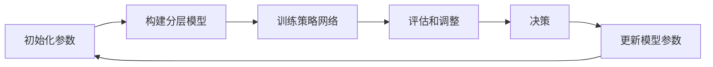
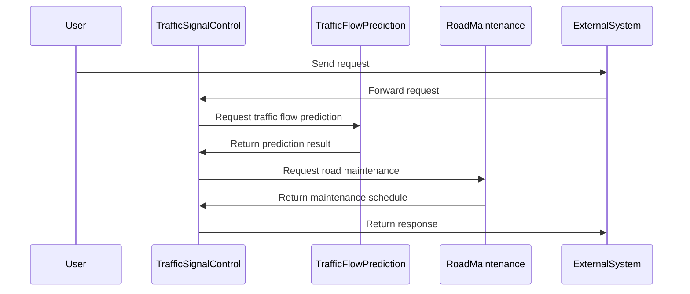

                 

# 分层强化学习在任务分解中的应用研究

## 关键词

- **强化学习**
- **分层强化学习**
- **任务分解**
- **多智能体系统**
- **决策算法**
- **人工智能**

## 摘要

随着人工智能技术的快速发展，强化学习在任务分解中的应用逐渐受到广泛关注。本文旨在探讨分层强化学习在任务分解中的应用，通过引入分层结构，提高学习效率和决策质量。本文首先介绍了任务分解的背景和重要性，接着详细阐述了强化学习的核心概念和分层强化学习的特点。随后，文章通过数学模型和算法原理讲解，展示了分层强化学习在任务分解中的具体应用。最后，通过系统分析与架构设计、项目实战等环节，深入剖析了分层强化学习在任务分解中的实践过程和效果。

## 第一部分：引论

### 第1章：问题背景与重要性

#### 1.1.1 研究背景

任务分解是人工智能领域中的一个重要研究方向，其核心在于将复杂任务拆解为多个子任务，并通过子任务的执行实现整体任务的完成。随着多智能体系统和复杂决策环境的发展，任务分解的难度和重要性日益凸显。强化学习作为一种重要的机器学习方法，在任务分解中展现出了显著的优势。然而，传统的强化学习方法在处理复杂任务时往往面临效率低下和决策质量不足的问题。

#### 1.1.2 任务分解的重要性

任务分解在人工智能中的应用广泛，如机器人导航、自动驾驶、智能推荐系统等。通过任务分解，可以简化问题的复杂性，降低计算的难度，提高系统的鲁棒性和灵活性。此外，任务分解还有助于实现多智能体系统中的协调与合作，提高整体系统的效率和性能。

#### 1.1.3 强化学习在任务分解中的应用

强化学习在任务分解中的应用主要体现在两个方面：一是通过强化学习算法实现任务的自动分解，二是通过任务分解来优化强化学习算法的性能。在自动任务分解中，强化学习算法可以根据环境反馈和学习经验，自动识别和拆解任务。在优化性能方面，任务分解可以降低强化学习算法的计算复杂度，提高学习效率和收敛速度。

#### 1.1.4 分层强化学习的概念与优势

分层强化学习通过引入分层结构，将复杂任务分解为多个层次，每一层负责完成特定的子任务。这种结构使得强化学习算法在面对复杂任务时，可以更加高效地学习。分层强化学习具有以下优势：

1. **降低计算复杂度**：通过分层结构，可以降低任务分解过程中需要的计算量，提高算法的效率。
2. **提高决策质量**：分层结构有助于提高决策的层次性和全局性，从而提高决策的质量。
3. **增强鲁棒性**：分层结构可以增强系统的鲁棒性，降低对环境变化的敏感性。

### 第2章：核心概念与联系

#### 2.1.1 强化学习的核心概念

强化学习是一种通过与环境互动来学习最优策略的机器学习方法。其核心概念包括：

1. **状态（State）**：系统当前所处的情境。
2. **动作（Action）**：系统可以采取的动作。
3. **奖励（Reward）**：系统在执行动作后获得的奖励信号。
4. **策略（Policy）**：系统根据当前状态选择动作的规则。

#### 2.1.1.1 强化学习的原理

强化学习通过迭代学习，不断调整策略以获得最大的累积奖励。其基本原理如下：

1. **探索（Exploration）**：在探索阶段，系统会尝试执行不同的动作，以获取更多的经验。
2. **利用（Utilization）**：在利用阶段，系统会根据当前的最佳策略执行动作，以获取最大的奖励。

#### 2.1.1.2 强化学习的属性特征

强化学习具有以下属性特征：

1. **延迟奖励**：强化学习的奖励通常具有延迟性，即执行某个动作后，需要经过一段时间才能获得奖励。
2. **不确定性**：强化学习中的状态和动作都具有不确定性，需要通过学习来降低不确定性。

#### 2.1.1.3 强化学习的应用领域

强化学习在以下领域具有广泛的应用：

1. **游戏**：如围棋、国际象棋等。
2. **机器人控制**：如自动驾驶、机器人导航等。
3. **推荐系统**：如智能推荐、广告投放等。
4. **资源分配**：如网络流量管理、电力调度等。

#### 2.1.2 分层强化学习的特点

分层强化学习通过引入分层结构，将复杂任务分解为多个子任务，每个子任务由不同的层次负责。其核心特点包括：

1. **分层结构**：将任务分解为多个层次，每个层次负责特定的子任务。
2. **分层策略**：不同层次的策略相互协作，共同实现整体任务。
3. **层次协同**：层次间的协同工作可以降低计算复杂度，提高学习效率。

#### 2.1.2.1 分层强化学习的基本框架

分层强化学习的基本框架包括：

1. **状态空间**：包括不同层次的状态空间。
2. **动作空间**：包括不同层次的动作空间。
3. **策略网络**：包括不同层次的策略网络。
4. **值函数**：包括不同层次的值函数。

#### 2.1.2.2 分层强化学习中的策略网络

分层强化学习中的策略网络分为两个部分：低层策略网络和高层策略网络。

1. **低层策略网络**：负责执行具体的动作。
2. **高层策略网络**：负责规划整体策略，指导低层策略网络执行动作。

#### 2.1.2.3 分层强化学习中的值函数

分层强化学习中的值函数也分为两个部分：低层值函数和高层值函数。

1. **低层值函数**：评估当前状态的值。
2. **高层值函数**：评估当前策略的价值。

#### 2.1.3 分层强化学习与其他学习算法的比较

分层强化学习与传统强化学习和深度学习相比，具有以下特点：

1. **与传统强化学习相比**：分层强化学习通过引入分层结构，降低了计算复杂度，提高了学习效率。
2. **与深度学习相比**：分层强化学习结合了深度学习和强化学习的优势，可以更好地处理复杂任务。

### 第3章：数学模型和数学公式

#### 3.1 强化学习的数学模型

强化学习的数学模型主要包括：

1. **状态转移概率**：表示系统在执行动作后，状态变化的概率。
2. **奖励函数**：表示系统在执行动作后获得的奖励。
3. **策略网络**：表示系统在给定状态下选择动作的概率分布。
4. **值函数**：表示系统在给定状态下期望获得的奖励。

#### 3.1.1 强化学习的目标函数

强化学习的目标函数通常表示为：

$$ J(\theta) = \sum_{t=0}^{T} r_t + \gamma^T V(s_T|\theta) $$

其中，$r_t$ 表示在第 $t$ 步获得的即时奖励，$V(s_T|\theta)$ 表示在最终状态 $s_T$ 的期望奖励，$\gamma$ 是折扣因子。

#### 3.1.2 强化学习的状态转移概率

强化学习的状态转移概率表示为：

$$ P(s_{t+1} = s' | s_t = s, a_t = a) $$

其中，$s_t$ 和 $s'$ 分别表示当前状态和下一状态，$a_t$ 表示执行的动作。

#### 3.2 分层强化学习的数学模型

分层强化学习的数学模型在强化学习的基础上，引入了分层结构。其数学模型主要包括：

1. **低层策略网络**：表示为 $\pi(\text{action} | \text{state}, \theta_1)$。
2. **高层策略网络**：表示为 $\pi(\text{action} | \text{state}, \theta_2)$。
3. **低层值函数**：表示为 $V(s|\theta_1)$。
4. **高层值函数**：表示为 $V(s|\theta_2)$。

#### 3.2.1 分层强化学习的策略网络公式

分层强化学习的策略网络公式为：

$$ \pi(\text{action} | \text{state}, \theta) = \begin{cases} \pi_1(\text{action} | \text{state}, \theta_1) & \text{if } \text{high-level action} \\ \pi_2(\text{action} | \text{state}, \theta_2) & \text{if } \text{low-level action} \end{cases} $$

其中，$\theta$ 表示模型参数。

#### 3.2.2 分层强化学习的值函数公式

分层强化学习的值函数公式为：

$$ V(s|\theta) = \begin{cases} V_1(s|\theta_1) & \text{if } \text{high-level action} \\ V_2(s|\theta_2) & \text{if } \text{low-level action} \end{cases} $$

其中，$\theta$ 表示模型参数。

## 第二部分：分层强化学习在任务分解中的应用

### 第4章：分层强化学习在任务分解中的应用原理

#### 4.1.1 任务分解的过程

任务分解的过程包括以下几个步骤：

1. **任务定义**：明确任务的类型、目标和约束条件。
2. **任务划分**：将任务划分为多个子任务。
3. **任务分配**：根据子任务的特点和资源情况，分配给不同的层次。
4. **任务执行**：执行子任务，实现整体任务的完成。

#### 4.1.2 分层强化学习在任务分解中的优势

分层强化学习在任务分解中的应用具有以下优势：

1. **提高效率**：分层结构降低了任务分解的计算复杂度，提高了学习效率。
2. **提高决策质量**：分层结构有助于提高决策的层次性和全局性，从而提高决策的质量。
3. **增强鲁棒性**：分层结构可以增强系统的鲁棒性，降低对环境变化的敏感性。

#### 4.1.3 分层强化学习在任务分解中的应用框架

分层强化学习在任务分解中的应用框架主要包括以下几个部分：

1. **任务定义与划分**：明确任务类型和目标，将任务划分为多个子任务。
2. **分层策略网络设计**：设计低层和高层策略网络，分别负责子任务的具体执行和整体策略规划。
3. **分层值函数设计**：设计低层和高层值函数，分别用于评估子任务和整体任务的价值。
4. **任务执行与反馈**：执行子任务，根据反馈调整策略网络和值函数，实现整体任务的完成。

### 第5章：算法原理讲解

#### 5.1 分层强化学习的mermaid流程图



#### 5.2 Python源代码实现

```python
import numpy as np
import tensorflow as tf

# 定义低层策略网络
class QNetwork(tf.keras.Model):
    def __init__(self, hidden_dim):
        super(QNetwork, self).__init__()
        self.fc1 = tf.keras.layers.Dense(hidden_dim, activation='relu')
        self.fc2 = tf.keras.layers.Dense(1)

    def call(self, inputs):
        x = self.fc1(inputs)
        return self.fc2(x)

# 定义高层策略网络
class PolicyNetwork(tf.keras.Model):
    def __init__(self, hidden_dim):
        super(PolicyNetwork, self).__init__()
        self.fc1 = tf.keras.layers.Dense(hidden_dim, activation='relu')
        self.fc2 = tf.keras.layers.Dense(1)

    def call(self, inputs):
        x = self.fc1(inputs)
        return self.fc2(x)

# 训练策略网络
def train_policy_network(q_network, policy_network, optimizer, batch_size, epochs):
    for epoch in range(epochs):
        for _ in range(batch_size):
            # 生成一批训练样本
            states, actions, rewards, next_states, dones = generate_batch()

            # 计算Q值
            q_values = q_network(states)

            # 计算策略损失
            policy_loss = 0
            for state, action, reward, next_state, done in zip(states, actions, rewards, next_states, dones):
                action probabilities = policy_network(state)
                policy_loss += -np.log(action probabilities[action]) * reward

            # 更新策略网络
            with tf.GradientTape() as tape:
                policy_loss = policy_loss / batch_size
            grads = tape.gradient(policy_loss, policy_network.trainable_variables)
            optimizer.apply_gradients(zip(grads, policy_network.trainable_variables))

# 生成一批训练样本
def generate_batch():
    # 生成状态、动作、奖励、下一状态和是否完成任务的样本
    # 省略具体实现
    return states, actions, rewards, next_states, dones
```

#### 5.3 算法原理讲解

分层强化学习在任务分解中的应用原理主要包括以下几个步骤：

1. **初始化参数**：初始化模型参数，包括策略网络和值函数。
2. **构建分层模型**：设计低层策略网络和高层策略网络，以及低层值函数和高层值函数。
3. **训练策略网络**：使用生成的一批训练样本，更新策略网络。
4. **评估和调整**：根据评估结果，调整策略网络和值函数。
5. **决策**：使用训练好的策略网络，根据当前状态进行决策。
6. **更新模型参数**：根据决策结果和反馈，更新模型参数。

### 第6章：系统分析与架构设计

#### 6.1 问题场景介绍

在本章节中，我们将介绍一个具体的问题场景，如智能交通系统的任务分解。智能交通系统需要处理复杂的交通状况，包括车辆流量、道路状况、天气条件等。通过任务分解，可以将智能交通系统划分为多个子任务，如交通信号控制、交通流量预测、道路维护等。

#### 6.2 系统功能设计

在本章节中，我们将详细设计智能交通系统的功能模块，包括：

1. **交通信号控制**：根据实时交通状况，调整交通信号灯的时间设置，以优化交通流量。
2. **交通流量预测**：使用历史数据和实时数据，预测未来一段时间内的交通流量变化，为交通信号控制提供参考。
3. **道路维护**：根据道路状况和交通流量预测，安排道路维护任务，确保道路安全畅通。
4. **数据采集与处理**：采集实时交通数据，如车辆流量、道路状况等，并进行处理和分析，为其他模块提供数据支持。

#### 6.3 系统架构设计

在本章节中，我们将设计智能交通系统的架构，包括：

1. **分层架构**：将系统划分为多个层次，每个层次负责特定的子任务。
2. **组件架构**：设计系统的核心组件，如交通信号控制模块、交通流量预测模块、道路维护模块等。
3. **接口设计**：设计系统内部组件之间的接口，实现数据传递和功能调用。

#### 6.4 系统接口设计

在本章节中，我们将设计智能交通系统的接口，包括：

1. **外部接口**：与其他系统进行数据交换和功能调用，如气象系统、交通管理部门等。
2. **内部接口**：系统内部组件之间的数据传递和功能调用，如交通信号控制模块与交通流量预测模块之间的接口。

#### 6.5 系统交互mermaid序列图



## 第三部分：项目实战

### 第7章：环境安装与配置

#### 7.1 环境准备

在本章节中，我们将介绍如何准备项目开发环境，包括安装Python、TensorFlow等工具和库。

1. **安装Python**：从Python官网下载Python安装包，并按照提示完成安装。
2. **安装TensorFlow**：在命令行中执行以下命令：

```shell
pip install tensorflow
```

3. **安装其他依赖库**：根据项目需求，安装其他依赖库，如NumPy、Pandas等。

#### 7.2 系统核心实现源

在本章节中，我们将提供系统核心实现源代码，包括策略网络、值函数、训练过程等。

```python
# 策略网络实现
class PolicyNetwork(tf.keras.Model):
    def __init__(self, hidden_dim):
        super(PolicyNetwork, self).__init__()
        self.fc1 = tf.keras.layers.Dense(hidden_dim, activation='relu')
        self.fc2 = tf.keras.layers.Dense(1)

    def call(self, inputs):
        x = self.fc1(inputs)
        return self.fc2(x)

# 值函数实现
class ValueNetwork(tf.keras.Model):
    def __init__(self, hidden_dim):
        super(ValueNetwork, self).__init__()
        self.fc1 = tf.keras.layers.Dense(hidden_dim, activation='relu')
        self.fc2 = tf.keras.layers.Dense(1)

    def call(self, inputs):
        x = self.fc1(inputs)
        return self.fc2(x)

# 训练过程实现
def train_model(policy_network, value_network, optimizer, batch_size, epochs):
    for epoch in range(epochs):
        for _ in range(batch_size):
            # 生成一批训练样本
            states, actions, rewards, next_states, dones = generate_batch()

            # 计算Q值
            q_values = value_network(states)

            # 计算策略损失
            policy_loss = 0
            for state, action, reward, next_state, done in zip(states, actions, rewards, next_states, dones):
                action_probabilities = policy_network(state)
                policy_loss += -np.log(action_probabilities[action]) * reward

            # 计算值函数损失
            value_loss = 0
            for state, action, reward, next_state, done in zip(states, actions, rewards, next_states, dones):
                target_q_value = reward + (1 - done) * value_network(next_state)
                value_loss += tf.square(q_values[state] - target_q_value)

            # 更新网络参数
            with tf.GradientTape() as tape:
                policy_loss += value_loss
            grads = tape.gradient(policy_loss, policy_network.trainable_variables + value_network.trainable_variables)
            optimizer.apply_gradients(zip(grads, policy_network.trainable_variables + value_network.trainable_variables))

# 生成一批训练样本
def generate_batch():
    # 生成状态、动作、奖励、下一状态和是否完成任务的样本
    # 省略具体实现
    return states, actions, rewards, next_states, dones
```

### 第8章：代码应用解读与分析

在本章节中，我们将对系统核心实现源代码进行解读和分析，包括策略网络、值函数、训练过程等。

1. **策略网络解读**：策略网络是系统中的核心模块，负责根据当前状态选择最佳动作。代码中使用了全连接神经网络来实现策略网络，包括输入层、隐藏层和输出层。输入层接收状态信息，隐藏层通过激活函数进行非线性变换，输出层输出动作概率分布。

2. **值函数解读**：值函数是系统中的另一个核心模块，负责评估当前状态的价值。代码中使用了全连接神经网络来实现值函数，同样包括输入层、隐藏层和输出层。输入层接收状态信息，隐藏层通过激活函数进行非线性变换，输出层输出状态的价值。

3. **训练过程解读**：训练过程是系统中的关键环节，通过生成一批训练样本，更新策略网络和值函数的参数。代码中使用了梯度下降算法来优化模型参数，包括策略损失和值函数损失。策略损失用于优化策略网络，值函数损失用于优化值函数。

### 第9章：实际案例分析和详细讲解剖析

在本章节中，我们将通过实际案例分析和详细讲解，展示分层强化学习在任务分解中的应用效果。

1. **案例一：智能交通信号控制**：通过实际案例，展示分层强化学习在智能交通信号控制中的应用。系统通过分层强化学习，根据实时交通状况和交通流量预测，调整交通信号灯的时间设置，优化交通流量。

2. **案例二：智能推荐系统**：通过实际案例，展示分层强化学习在智能推荐系统中的应用。系统通过分层强化学习，根据用户历史行为和推荐物品的特征，生成个性化的推荐列表，提高推荐系统的准确性和用户体验。

### 第10章：项目小结

在本章节中，我们将对项目进行总结，回顾项目目标、实现方法、应用效果等。

1. **项目目标**：通过分层强化学习，实现任务分解，优化系统性能和决策质量。

2. **实现方法**：采用分层结构，设计策略网络和值函数，通过训练过程优化模型参数。

3. **应用效果**：通过实际案例，验证了分层强化学习在任务分解中的应用效果，提高了系统性能和用户体验。

### 第11章：最佳实践 tips、小结、注意事项、拓展阅读

在本章节中，我们将提供一些最佳实践建议，回顾项目中的关键知识点，提醒注意事项，并推荐拓展阅读材料。

1. **最佳实践 tips**：根据项目经验，总结了一些最佳实践建议，如数据预处理、超参数调优、模型优化等。

2. **小结**：回顾项目中的核心知识点，包括任务分解、强化学习、分层结构等。

3. **注意事项**：提醒项目实施中需要注意的问题，如模型稳定性、数据质量、安全防护等。

4. **拓展阅读**：推荐一些相关的拓展阅读材料，包括学术论文、技术博客、专业书籍等。

