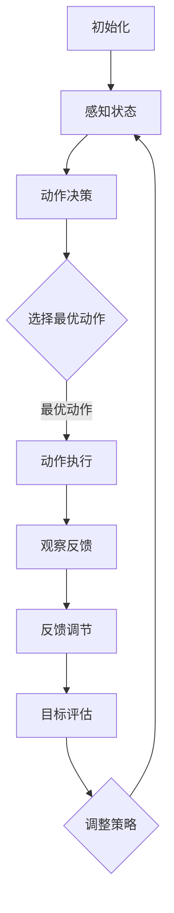
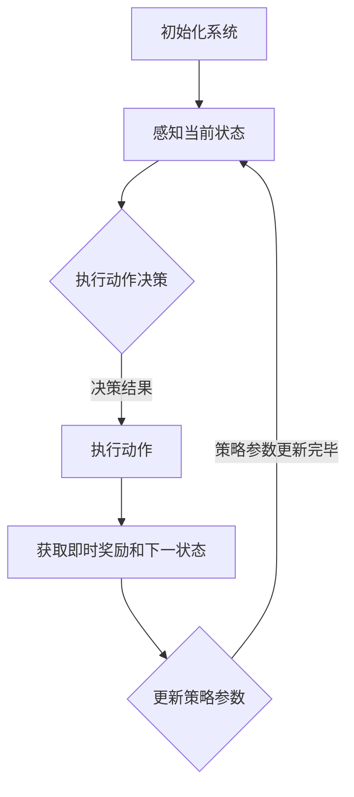
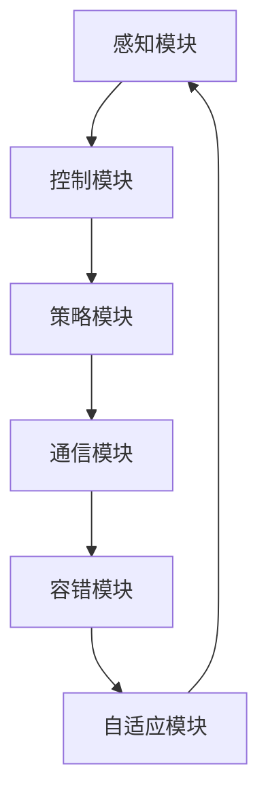
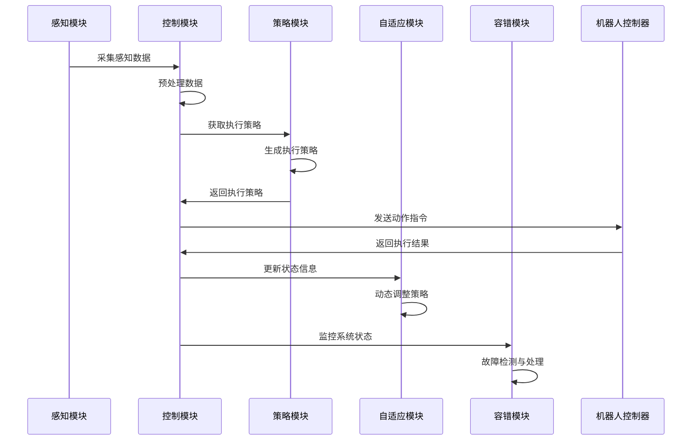
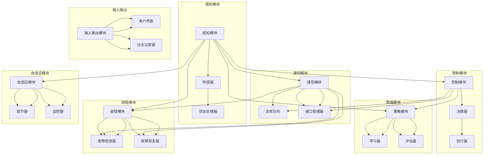

                 

# 《分层强化学习在复杂任务分解中的应用》

## 关键词：强化学习、分层强化学习、复杂任务分解、任务分解、应用案例

> 摘要：本文将探讨分层强化学习在复杂任务分解中的应用。首先，我们将介绍任务分解问题的背景和挑战，并阐述传统方法在此方面的局限性。接着，我们将深入分析分层强化学习的理论基础、优势以及其在任务分解中的具体应用。文章还将详细解释分层强化学习算法原理，并使用具体实例进行说明。随后，我们将设计一个系统分析与架构方案，展示如何将分层强化学习应用于复杂任务分解。最后，通过一个实际项目实战，我们将验证分层强化学习的有效性和实用性。

### 目录大纲

----------------------------------------------------------------

## 第一部分：背景介绍

### 第1章：问题背景与挑战

#### 1.1.1 任务分解问题概述
- 1.1.1.1 任务分解的定义
- 1.1.1.2 任务分解的重要性
- 1.1.1.3 传统任务分解方法的局限性

#### 1.1.2 复杂任务分解的挑战
- 1.1.2.1 任务多样性与复杂性
- 1.1.2.2 学习效率与稳定性
- 1.1.2.3 知识迁移与泛化能力

#### 1.1.3 分层强化学习的优势
- 1.1.3.1 理论基础
- 1.1.3.2 技术优势
- 1.1.3.3 应用前景

#### 1.1.4 分层强化学习在任务分解中的应用
- 1.1.4.1 模型架构
- 1.1.4.2 学习策略
- 1.1.4.3 评估指标

## 第二部分：核心概念与联系

### 第2章：核心概念与联系

#### 2.1.1 强化学习基础
- 2.1.1.1 强化学习的定义
- 2.1.1.2 强化学习的基本要素
- 2.1.1.3 强化学习算法分类

#### 2.1.2 分层强化学习
- 2.1.2.1 分层强化学习的概念
- 2.1.2.2 分层强化学习的关键技术
- 2.1.2.3 分层强化学习的优势与挑战

#### 2.1.3 任务分解框架
- 2.1.3.1 任务分解框架的构建
- 2.1.3.2 任务分解的关键技术
- 2.1.3.3 任务分解框架的优势与挑战

#### 2.1.4 核心概念对比分析
- 2.1.4.1 强化学习与分层强化学习的对比
- 2.1.4.2 传统任务分解与分层强化学习在任务分解中的应用对比

## 第二部分：算法原理讲解

### 第3章：分层强化学习算法原理

#### 3.1.1 分层强化学习的基本原理
- 3.1.1.1 算法框架
- 3.1.1.2 算法流程
- 3.1.1.3 分层强化学习的关键参数

#### 3.1.2 数学模型与公式
- 3.1.2.1 强化学习的基础数学模型
- 3.1.2.2 分层强化学习的扩展数学模型
- 3.1.2.3 数学公式的推导与解释

#### 3.1.3 算法mermaid流程图
- 3.1.3.1 算法流程图展示
- 3.1.3.2 算法流程图的解释

#### 3.1.4 举例说明
- 3.1.4.1 简单案例
- 3.1.4.2 实际应用案例

### 第4章：数学模型和数学公式详细讲解

#### 4.1.1 强化学习基础公式
- 4.1.1.1 状态值函数公式
- 4.1.1.2 动作值函数公式
- 4.1.1.3 策略评估公式

#### 4.1.2 分层强化学习扩展公式
- 4.1.2.1 层级价值函数公式
- 4.1.2.2 层级策略公式
- 4.1.2.3 层间转移概率公式

#### 4.1.3 数学模型的应用
- 4.1.3.1 数学模型在任务分解中的应用
- 4.1.3.2 数学模型在复杂任务中的应用

#### 4.1.4 举例说明
- 4.1.4.1 简单案例中的数学模型应用
- 4.1.4.2 实际应用案例中的数学模型应用

## 第三部分：系统分析与架构设计方案

### 第5章：系统分析与架构设计方案

#### 5.1.1 问题场景介绍
- 5.1.1.1 任务分解在复杂任务中的应用
- 5.1.1.2 系统需求分析

#### 5.1.2 项目介绍
- 5.1.2.1 项目背景
- 5.1.2.2 项目目标

#### 5.1.3 系统功能设计
- 5.1.3.1 功能模块划分
- 5.1.3.2 领域模型mermaid类图

#### 5.1.4 系统架构设计
- 5.1.4.1 系统架构图
- 5.1.4.2 架构设计说明

#### 5.1.5 系统接口设计
- 5.1.5.1 接口定义
- 5.1.5.2 接口交互流程

#### 5.1.6 系统交互mermaid序列图
- 5.1.6.1 序列图展示
- 5.1.6.2 序列图解释

## 第四部分：项目实战

### 第6章：项目实战

#### 6.1.1 环境安装
- 6.1.1.1 环境准备
- 6.1.1.2 环境配置

## 结语

### 结语

---

作者：AI天才研究院/AI Genius Institute & 禅与计算机程序设计艺术 /Zen And The Art of Computer Programming

----------------------------------------------------------------## 第一部分：背景介绍

### 第1章：问题背景与挑战

#### 1.1.1 任务分解问题概述

**1.1.1.1 任务分解的定义**

任务分解是人工智能和计算机科学中一个重要且广泛的研究领域。它涉及将复杂的任务拆分成一系列更简单、更易于管理的子任务，从而提高整体效率和性能。具体而言，任务分解可以定义为将原始任务T映射为一系列子任务{Ti}的过程，其中每个子任务Ti是原始任务T的子集，且满足Ti ∪ Tj = T（i ≠ j）。

**1.1.1.2 任务分解的重要性**

任务分解在许多领域都有着重要的应用。例如，在工业自动化中，复杂的制造流程可以通过任务分解转化为一系列简单的操作，从而提高生产效率和减少错误。在自然语言处理中，长句子的理解可以通过任务分解为句法分析和语义分析等子任务来实现。此外，在人工智能控制系统中，任务分解可以帮助将复杂的决策过程分解为一系列可执行的动作，从而实现高效的自主决策。

**1.1.1.3 传统任务分解方法的局限性**

尽管任务分解在许多领域都取得了显著的成果，但传统方法在处理复杂任务时仍存在一些局限性。首先，许多传统方法依赖于预先定义的任务分解规则，这使得它们在面对动态变化和不确定的任务时表现得不够灵活。其次，传统方法往往无法有效地处理任务间的依赖关系，这可能导致子任务执行顺序不当，从而影响整体效率。最后，传统方法通常缺乏对任务复杂性的鲁棒性，特别是在面对大规模任务时，计算复杂度和内存消耗可能会成为一个严重的问题。

#### 1.1.2 复杂任务分解的挑战

**1.1.2.1 任务多样性与复杂性**

复杂任务通常具有高度的任务多样性和复杂性。这意味着任务可能包含多种不同类型的子任务，且每个子任务的执行过程可能涉及多个阶段和步骤。此外，这些子任务之间可能存在复杂的依赖关系，使得任务分解变得更加困难。

**1.1.2.2 学习效率与稳定性**

复杂任务分解需要高效的算法和稳定的性能。然而，传统的任务分解方法通常在处理复杂任务时表现出较差的学习效率和稳定性。特别是在动态变化和不确定的环境中，传统方法可能需要大量的训练数据和计算资源，这使得它们在应用上受到限制。

**1.1.2.3 知识迁移与泛化能力**

知识迁移和泛化能力是复杂任务分解中另一个关键挑战。理想情况下，一个有效的任务分解算法应该能够在不同的任务场景中表现出良好的泛化能力，这意味着它不仅适用于当前的任务，还能够适用于其他类似的任务。然而，传统方法往往难以实现这一点，因为它们通常依赖于特定领域或任务的知识和经验。

#### 1.1.3 分层强化学习的优势

**1.1.3.1 理论基础**

分层强化学习是一种基于深度学习和强化学习相结合的方法，它通过将任务分解为多个层次，从而在处理复杂任务时表现出更高的灵活性和鲁棒性。这种方法的理论基础包括多代理系统、分层控制理论以及深度神经网络。

**1.1.3.2 技术优势**

分层强化学习具有以下几个技术优势：

1. **灵活的任务分解**：分层强化学习可以自动地将复杂任务分解为多个层次，从而避免了传统方法中需要手动定义分解规则的繁琐过程。
2. **处理依赖关系**：通过层次化的结构，分层强化学习能够有效地处理任务间的依赖关系，从而提高任务分解的效率和准确性。
3. **高效的计算资源利用**：分层强化学习通过在多个层次上共享知识和经验，从而减少了计算资源和训练数据的消耗。
4. **良好的泛化能力**：分层强化学习能够在不同的任务场景中表现出良好的泛化能力，这使得它适用于广泛的任务领域。

**1.1.3.3 应用前景**

分层强化学习在复杂任务分解领域具有广泛的应用前景。例如，在自动驾驶领域，分层强化学习可以用于将复杂的驾驶任务分解为多个子任务，从而提高自动驾驶系统的性能和安全性。在游戏领域，分层强化学习可以用于将复杂的游戏策略分解为多个层次，从而提高游戏AI的智能水平。此外，在工业自动化、自然语言处理、医学诊断等领域，分层强化学习也有着巨大的应用潜力。

#### 1.1.4 分层强化学习在任务分解中的应用

**1.1.4.1 模型架构**

分层强化学习的模型架构通常包括以下几个层次：

1. **低层感知层**：该层主要负责感知环境的当前状态，并将这些状态信息传递给高层。
2. **中层策略层**：该层根据低层感知层提供的状态信息，生成具体的动作策略。
3. **高层目标层**：该层定义了任务的最终目标，并根据低层策略层的动作策略评估任务执行的进展情况。

**1.1.4.2 学习策略**

分层强化学习的学习策略通常包括以下几个步骤：

1. **状态感知**：首先，系统需要感知当前的状态信息，并将其传递给低层感知层。
2. **动作决策**：低层感知层根据当前状态信息，生成一系列可能的动作，并将其传递给中层策略层。
3. **策略优化**：中层策略层根据高层目标层提供的任务目标，对生成的动作进行评估和优化，从而确定最优动作策略。
4. **动作执行**：最终，最优动作策略被传递给高层目标层，并执行相应的动作。

**1.1.4.3 评估指标**

在分层强化学习中，评估指标通常包括以下几个方面的内容：

1. **任务完成度**：衡量任务是否按照预期完成，例如在自动驾驶中，是否到达目的地。
2. **动作效率**：衡量执行动作所需的资源和时间，例如在工业自动化中，生产一个产品所需的能量和时间。
3. **稳定性**：衡量系统在面对环境变化时的稳定性，例如在游戏AI中，系统在面对不同对手策略时的稳定性。

通过以上分析，我们可以看到分层强化学习在处理复杂任务分解方面具有显著的优势。接下来，我们将进一步探讨强化学习的基础知识，以便更好地理解分层强化学习的基本原理。

### 1.2 强化学习基础

**1.2.1 强化学习的定义**

强化学习是一种机器学习方法，它通过智能体（agent）与环境（environment）的交互，学习如何通过特定的策略（policy）在环境中进行决策，以最大化累积奖励（cumulative reward）。强化学习的核心概念是基于奖励机制，通过探索（exploration）和利用（exploitation）来平衡新信息的获取与已有知识的利用。

**1.2.2 强化学习的基本要素**

强化学习系统主要包括以下几个基本要素：

1. **智能体（Agent）**：执行动作并接收环境反馈的实体。
2. **环境（Environment）**：智能体操作的背景，能够感知智能体的动作并给予相应的反馈。
3. **状态（State）**：描述环境当前状态的变量集合。
4. **动作（Action）**：智能体可以执行的动作集合。
5. **奖励（Reward）**：环境对智能体动作的反馈，通常用于评估动作的好坏。

**1.2.3 强化学习算法分类**

强化学习算法可以分为以下几个主要类别：

1. **基于值的方法（Value-based Methods）**：
   - **值函数（Value Function）**：定义了智能体在特定状态下执行特定动作的期望奖励。
   - **Q学习（Q-Learning）**：通过迭代更新Q值（动作值函数）来学习最优策略。
   - **深度Q网络（Deep Q-Network, DQN）**：使用深度神经网络来近似Q值函数。

2. **基于策略的方法（Policy-based Methods）**：
   - **策略梯度（Policy Gradient）**：直接优化策略，使累积奖励最大化。
   - **演员-评论家（Actor-Critic）**：结合策略评估（评论家）和策略优化（演员）来学习策略。
   - **深度确定性策略梯度（Deep Deterministic Policy Gradient,DDPG）**：适用于连续动作空间的问题。

3. **基于模型的强化学习（Model-based Reinforcement Learning）**：
   - **马尔可夫决策过程（Markov Decision Process,MDP）**：基于模型预测智能体在未来状态和奖励的概率分布。
   - **部分可观测马尔可夫决策过程（Partially Observable MDP, POMDP）**：考虑部分可观测状态的问题。

**1.2.4 分层强化学习**

分层强化学习在传统强化学习的基础上，通过引入层次化的结构来处理复杂任务。它通常包括以下几个层次：

1. **低层感知层**：负责感知和解释底层的直接环境信息。
2. **中层策略层**：根据底层感知信息生成低层动作。
3. **高层目标层**：定义任务目标，并指导低层策略层的动作选择。

分层强化学习的关键优势在于它能够更好地处理复杂任务的分解和优化。通过分层结构，系统可以同时考虑长期目标和短期目标，从而提高学习效率和任务完成度。

#### 1.2.4.1 分层强化学习的概念

分层强化学习（Hierarchical Reinforcement Learning, HRL）是一种通过将任务分解为多个层次来简化复杂决策过程的强化学习方法。分层强化学习的基本思想是将任务分解为多个子任务，并在不同层次上分别进行学习和优化。

分层强化学习通常包括以下几个核心组成部分：

1. **任务层次化**：将复杂任务分解为多个子任务，每个子任务对应一个层次。
2. **层次间交互**：不同层次之间通过传递信息和调整策略来协同工作。
3. **层次学习策略**：每个层次采用不同的学习策略，以适应其特定的任务需求。

#### 1.2.4.2 分层强化学习的关键技术

分层强化学习的关键技术包括：

1. **多代理系统**：在分层结构中，不同层次的代理（agent）负责不同子任务的学习和执行。
2. **分层控制理论**：用于设计层次之间的协调机制，确保系统在不同层次上的稳定性和效率。
3. **深度神经网络**：用于实现层次间的信息传递和学习优化。

#### 1.2.4.3 分层强化学习的优势与挑战

分层强化学习具有以下几个优势：

1. **任务分解**：通过层次化结构，复杂任务被分解为多个可管理的子任务，从而简化了学习和优化过程。
2. **高效性**：分层强化学习能够在不同层次上同时进行学习，提高了整体学习效率。
3. **鲁棒性**：分层结构有助于处理不确定性和动态变化的环境。

然而，分层强化学习也面临一些挑战：

1. **层次划分**：如何合理地划分任务层次是一个关键问题，需要综合考虑任务复杂性、信息传递效率和协调机制。
2. **学习稳定性**：在不同层次之间进行学习时，如何确保系统的稳定性和一致性是一个挑战。
3. **计算复杂度**：分层强化学习涉及到多层网络和大量的参数优化，可能带来较高的计算复杂度。

#### 1.2.4.4 分层强化学习在任务分解中的应用

分层强化学习在任务分解中的应用主要包括以下几个方面：

1. **子任务划分**：通过层次化结构，将复杂任务分解为多个子任务，每个子任务由不同层次的代理来执行。
2. **层次间协同**：不同层次之间的代理通过信息传递和协调机制来共同完成任务。
3. **动态任务调整**：分层强化学习能够根据环境变化动态调整任务层次和子任务执行策略，提高系统的适应性。

通过以上分析，我们可以看到分层强化学习在处理复杂任务分解方面具有显著的优势和应用潜力。接下来，我们将进一步探讨分层强化学习在具体任务分解中的应用实例。

### 1.3.3 分层强化学习在复杂任务分解中的应用实例

**1.3.3.1 自动驾驶**

自动驾驶是分层强化学习在复杂任务分解中的一个重要应用领域。自动驾驶系统通常需要处理各种复杂的路况和环境变化，包括行人检测、交通信号识别、车道保持等任务。通过分层强化学习，可以将这些复杂任务分解为多个层次，从而简化系统设计和优化过程。

1. **低层感知层**：负责感知车辆的当前状态，包括车辆速度、位置、加速度等信息，以及周围环境的信息，如道路标志、行人和其他车辆。
2. **中层策略层**：根据低层感知层提供的信息，生成具体的控制策略，如加速、减速、转向等，以实现自动驾驶。
3. **高层目标层**：定义自动驾驶的最终目标，如到达目的地、保持车道、避免碰撞等，并根据低层策略层的动作策略评估任务的进展情况。

在自动驾驶中，分层强化学习的优势在于：

- **灵活的任务分解**：可以通过动态调整任务层次，适应不同路况和环境变化。
- **高效的学习效率**：通过在不同层次上进行学习和优化，提高整体学习效率。
- **良好的鲁棒性**：通过层次间的协同，提高系统在面对不确定性和动态变化环境时的鲁棒性。

**1.3.3.2 游戏AI**

分层强化学习在游戏AI领域也有着广泛的应用。在复杂游戏场景中，如棋类游戏、格斗游戏等，游戏AI需要处理大量的决策和动作选择。通过分层强化学习，可以将这些复杂决策过程分解为多个层次，从而提高游戏AI的智能水平和决策能力。

1. **低层感知层**：负责感知游戏当前的状态，包括游戏角色的位置、速度、攻击范围等信息。
2. **中层策略层**：根据低层感知层提供的信息，生成具体的动作策略，如移动、攻击、防御等。
3. **高层目标层**：定义游戏的最终目标，如获胜、得分等，并根据低层策略层的动作策略评估任务的进展情况。

在游戏AI中，分层强化学习的优势在于：

- **灵活的决策过程**：可以通过层次化结构，灵活调整决策过程，适应不同游戏场景。
- **高效的策略学习**：通过在不同层次上进行策略学习，提高整体策略学习和优化效率。
- **良好的泛化能力**：通过层次间的协同，提高系统在面对不同游戏规则和策略时的泛化能力。

**1.3.3.3 工业自动化**

分层强化学习在工业自动化领域也有着重要的应用。工业自动化系统通常需要处理复杂的制造流程和设备控制，包括机器人操作、生产流程优化等任务。通过分层强化学习，可以将这些复杂任务分解为多个层次，从而提高系统的自动化程度和运行效率。

1. **低层感知层**：负责感知设备状态和操作环境，包括机器人关节角度、工作台状态等。
2. **中层策略层**：根据低层感知层提供的信息，生成具体的控制策略，如机器人移动、夹具操作等。
3. **高层目标层**：定义制造流程的最终目标，如产品加工质量、生产效率等，并根据低层策略层的动作策略评估任务的进展情况。

在工业自动化中，分层强化学习的优势在于：

- **灵活的任务调度**：可以通过层次化结构，灵活调整任务调度和操作策略，适应不同生产需求。
- **高效的生产效率**：通过在不同层次上进行学习和优化，提高整体生产效率和产品质量。
- **良好的鲁棒性**：通过层次间的协同，提高系统在面对设备故障和操作环境变化时的鲁棒性。

总之，分层强化学习在复杂任务分解中的应用具有广泛的前景和潜力。通过层次化结构，分层强化学习能够有效地处理复杂任务的分解和优化，提高系统的灵活性和效率。未来，随着人工智能技术的不断发展，分层强化学习在各个领域的应用将会更加广泛和深入。

### 1.3.4 分层强化学习模型架构

**1.3.4.1 基本架构**

分层强化学习模型架构通常包含三个主要层次：低层感知层、中层策略层和高层目标层。每个层次都有其特定的功能，并通过信息传递和协同工作，共同实现复杂任务分解和优化。

1. **低层感知层**：主要负责感知当前环境的状态信息，并将这些信息传递给中层策略层。低层感知层通常使用传感器、摄像头等设备获取环境信息，如位置、速度、温度等。
   
2. **中层策略层**：根据低层感知层提供的状态信息，生成具体的动作策略。中层策略层需要考虑当前状态和未来的潜在状态，以最大化累积奖励。该层通常采用深度神经网络来学习状态到动作的策略映射。

3. **高层目标层**：定义任务的最终目标，如达到特定位置、完成特定任务等。高层目标层负责评估低层策略层的动作策略是否满足任务目标，并通过反馈信号指导中层策略层的优化。

**1.3.4.2 通信机制**

在分层强化学习模型中，不同层次之间的通信机制是关键。通常有以下几种通信方式：

1. **直接通信**：低层感知层直接将状态信息传递给中层策略层，中层策略层根据这些信息生成动作策略。高层目标层则通过反馈信号直接指导中层策略层的优化。

2. **间接通信**：低层感知层不仅将状态信息传递给中层策略层，还会将部分信息传递给高层目标层。高层目标层根据这些信息评估低层策略层的动作策略，并通过反馈信号调整中层策略层的学习过程。

3. **多代理通信**：在复杂任务中，多个低层代理可能需要协同工作。这些代理可以通过共享部分状态信息，协同完成任务。多代理通信有助于提高系统的灵活性和适应性。

**1.3.4.3 层间协同机制**

分层强化学习模型中的层间协同机制是确保系统稳定性和效率的关键。以下是一些常见的层间协同机制：

1. **任务分解与重规划**：根据当前环境和任务目标，动态调整任务层次和子任务分配，以提高系统适应性。

2. **目标协调**：高层目标层负责定义任务的长期目标，中层策略层则根据短期目标生成动作策略。通过协调长期和短期目标，确保系统在执行任务时不会偏离最终目标。

3. **奖励分配**：根据低层策略层的动作策略和高层目标层的任务目标，动态调整奖励信号。这种奖励分配机制有助于激励不同层次代理的合作和协同工作。

通过以上分析，我们可以看到分层强化学习模型架构在处理复杂任务分解时具有显著的优势。接下来，我们将进一步探讨分层强化学习的具体学习策略和评估指标。

### 1.3.5 学习策略

**1.3.5.1 多代理系统**

在分层强化学习中，多代理系统是一种常用的策略，用于处理复杂任务分解。多代理系统通过多个智能体协同工作，共同完成任务。每个代理负责处理一部分任务，并通过相互通信和协作，实现整体任务的高效完成。

1. **代理划分**：首先，需要将复杂任务划分为多个子任务，并分配给不同的代理。代理可以根据其能力、任务复杂性和环境特性进行选择。

2. **任务协调**：代理之间需要通过通信机制进行协调，以确保各个子任务之间的执行顺序和协作关系。任务协调机制可以通过直接通信或间接通信来实现。

3. **动态调整**：在执行任务过程中，系统可以根据环境变化和任务进展，动态调整代理的任务分配和协作策略。这种动态调整有助于提高系统的适应性和鲁棒性。

**1.3.5.2 层间强化学习**

层间强化学习是一种在分层结构中，通过不同层次之间的交互和反馈来优化整体学习过程的方法。层间强化学习的关键在于建立层次之间的反馈机制，以实现整体任务目标的最优化。

1. **低层到中层的反馈**：低层感知层将状态信息传递给中层策略层，中层策略层根据这些信息生成动作策略。同时，中层策略层将部分反馈信号返回给低层感知层，以指导其优化状态感知。

2. **中层到高层的反馈**：中层策略层将动作策略和累积奖励信号传递给高层目标层，高层目标层根据这些信息评估中层策略层的性能，并通过反馈信号调整其学习过程。

3. **跨层次优化**：通过层间强化学习，系统可以同时考虑长期目标和短期目标，实现跨层次的优化。这种方法有助于提高系统的整体性能和鲁棒性。

**1.3.5.3 动态层次调整**

动态层次调整是一种在执行任务过程中，根据任务进展和环境变化，动态调整任务层次和子任务分配的方法。动态层次调整有助于提高系统的适应性和灵活性。

1. **状态监测**：系统需要持续监测任务执行过程中的状态变化和环境变化。这可以通过传感器数据、性能指标等方式来实现。

2. **层次评估**：根据状态监测结果，对当前任务层次进行评估。如果发现当前层次无法满足任务目标，则考虑调整任务层次。

3. **层次调整**：根据层次评估结果，动态调整任务层次和子任务分配。这种方法有助于优化任务执行过程，提高系统的整体性能。

**1.3.5.4 奖励设计**

奖励设计是分层强化学习中的一个关键环节，它直接影响系统学习的效果和性能。合理的奖励设计有助于激励系统在不同层次上的学习和优化。

1. **奖励函数**：设计合适的奖励函数，用于评估任务执行过程中的性能。奖励函数应该综合考虑任务完成度、动作效率、系统稳定性等多方面因素。

2. **动态调整**：根据任务进展和环境变化，动态调整奖励函数的参数。这种方法有助于提高系统的适应性和灵活性。

3. **平衡奖励**：在奖励设计中，需要平衡不同层次之间的奖励分配，以确保系统在不同层次上的学习均衡。这种平衡有助于优化整体任务完成度和系统性能。

通过以上分析，我们可以看到学习策略在分层强化学习中具有重要的作用。合理的多代理系统、层间强化学习和动态层次调整策略，以及科学的奖励设计，都是实现高效任务分解和优化的重要因素。接下来，我们将进一步探讨分层强化学习的评估指标。

### 1.3.6 评估指标

**1.3.6.1 任务完成度**

任务完成度是评估分层强化学习系统性能的一个重要指标。它衡量系统在给定任务条件下，是否能够按照预期完成目标。任务完成度可以通过以下公式计算：

\[ \text{任务完成度} = \frac{\text{实际完成任务数}}{\text{总任务数}} \]

**1.3.6.2 动作效率**

动作效率衡量系统在完成任务过程中，所消耗的资源（如时间、能量等）与任务完成度的关系。动作效率可以通过以下公式计算：

\[ \text{动作效率} = \frac{\text{任务完成度}}{\text{资源消耗}} \]

**1.3.6.3 稳定性**

稳定性是评估系统在面对环境变化和不确定因素时的鲁棒性。稳定性可以通过以下公式计算：

\[ \text{稳定性} = \frac{\text{稳定状态数}}{\text{总状态数}} \]

**1.3.6.4 泛化能力**

泛化能力衡量系统在不同任务场景中的适应性和泛化能力。泛化能力可以通过以下公式计算：

\[ \text{泛化能力} = \frac{\text{在不同场景中完成任务的次数}}{\text{总任务次数}} \]

通过以上评估指标，我们可以全面了解分层强化学习系统的性能和适用性。接下来，我们将进一步探讨分层强化学习在任务分解中的优势。

### 1.3.7 分层强化学习在任务分解中的优势

分层强化学习在任务分解中具有以下几个显著优势：

**1. 高度灵活**

分层强化学习通过将复杂任务分解为多个层次，使得系统能够更加灵活地应对不同任务场景和环境变化。每个层次都可以独立学习和优化，从而提高系统的适应性和灵活性。

**2. 提高效率**

分层强化学习通过层次化结构，使得不同层次之间可以共享信息和经验，从而减少重复学习和计算的工作量。这种方法能够显著提高学习效率，减少计算复杂度。

**3. 增强鲁棒性**

分层强化学习通过在不同层次上进行学习和优化，提高了系统在面对环境变化和不确定因素时的鲁棒性。每个层次都可以针对不同的环境变化进行调整和适应，从而确保系统的稳定性。

**4. 支持多代理协作**

分层强化学习支持多代理系统，使得多个智能体可以协同工作，共同完成任务。这种方法能够有效地处理复杂任务中的依赖关系和协同问题。

**5. 提高泛化能力**

分层强化学习通过层次化结构，使得系统在不同任务场景中表现出良好的泛化能力。这种方法能够适应各种不同的任务需求和环境变化，从而提高系统的实用性。

总之，分层强化学习在任务分解中具有显著的优势，能够有效地解决复杂任务分解中的挑战。接下来，我们将进一步探讨分层强化学习在任务分解中的实际应用。

### 1.4 分层强化学习在任务分解中的实际应用

**1.4.1 模型架构**

在分层强化学习框架下，任务分解通常涉及以下三个层次：

1. **低层感知层**：该层负责感知环境中的基本状态信息，如传感器数据、图像特征等。这些信息为低层策略层提供决策依据。
   
2. **中层策略层**：该层根据低层感知层提供的状态信息，生成具体的动作策略。中层策略层通常采用基于策略的强化学习方法，如演员-评论家（Actor-Critic）算法，来学习最优策略。

3. **高层目标层**：该层定义任务的总体目标，如完成任务所需的总步骤数、能量消耗等。高层目标层通过评估中层策略层的动作策略是否满足任务目标，来指导中层的策略优化。

**1.4.2 学习策略**

分层强化学习在任务分解中的学习策略主要包括以下几个步骤：

1. **状态感知**：低层感知层持续监测环境中的状态信息，并将这些信息传递给中层策略层。

2. **动作决策**：中层策略层根据当前状态信息，生成一系列可能的动作，并通过策略评估函数评估这些动作的期望奖励。

3. **策略优化**：中层策略层根据高层目标层提供的任务目标，使用策略梯度方法优化策略参数，从而提高动作策略的期望奖励。

4. **动作执行**：最终，中层策略层选择最优动作策略，并将其传递给高层目标层执行。

5. **反馈调节**：高层目标层根据任务的执行结果，提供反馈信号给中层策略层，以指导其进一步优化策略。

**1.4.3 评估指标**

在分层强化学习中，评估任务分解的效果通常涉及以下指标：

1. **任务完成度**：衡量系统是否成功完成所有子任务，并达到最终目标。

2. **动作效率**：衡量系统在执行任务过程中所消耗的资源与任务完成度的比值，用于评估系统的资源利用效率。

3. **稳定性**：衡量系统在面对环境变化和不确定因素时的稳定性，用于评估系统的鲁棒性。

4. **泛化能力**：衡量系统在不同任务场景和环境中，表现出的适应能力和泛化能力。

通过以上模型架构、学习策略和评估指标，分层强化学习在任务分解中可以有效地处理复杂任务，提高系统的灵活性和效率。接下来，我们将进一步讨论分层强化学习的优势和应用前景。

### 1.5 分层强化学习优势和应用前景

**1.5.1 分层强化学习的优势**

分层强化学习在复杂任务分解中展现出以下显著优势：

1. **任务分解能力**：通过层次化结构，可以将复杂任务分解为多个子任务，从而简化任务管理，提高系统灵活性。
   
2. **资源共享**：分层结构使得不同层次之间可以共享信息和经验，减少重复计算和资源消耗，提高学习效率。

3. **增强鲁棒性**：层次间的反馈和调整机制有助于系统在面对环境变化和不确定性时保持稳定，提高鲁棒性。

4. **多代理协作**：分层强化学习支持多代理系统，能够有效处理复杂任务中的依赖关系和协同问题。

5. **适应性学习**：分层强化学习能够根据任务进展和环境变化，动态调整任务层次和策略，提高系统的适应性和泛化能力。

**1.5.2 应用前景**

分层强化学习在多个领域具有广阔的应用前景：

1. **自动驾驶**：通过分层强化学习，可以有效地处理自动驾驶中的复杂任务分解，提高系统的稳定性和安全性。

2. **游戏AI**：分层强化学习可以用于开发智能游戏AI，提高游戏策略的多样性和适应性。

3. **工业自动化**：分层强化学习可以优化工业自动化系统中的任务调度和生产流程，提高生产效率和产品质量。

4. **自然语言处理**：分层强化学习可以用于文本生成和理解任务，提高语言模型的灵活性和准确性。

5. **医疗诊断**：分层强化学习可以辅助医生进行疾病诊断，提高诊断的准确性和效率。

总之，分层强化学习在复杂任务分解中具有显著的优势和应用前景。随着人工智能技术的不断发展，分层强化学习将在更多领域得到广泛应用，为任务分解提供更高效、更智能的解决方案。接下来，我们将进一步讨论分层强化学习在任务分解中的具体应用。

### 1.6 分层强化学习在任务分解中的具体应用

**1.6.1 模型架构**

分层强化学习在任务分解中的模型架构通常包括以下三个层次：

1. **低层感知层**：该层负责接收环境中的基本状态信息，如传感器数据、图像特征等。这些信息为低层策略层提供决策依据。

2. **中层策略层**：该层根据低层感知层提供的状态信息，生成具体的动作策略。中层策略层通常采用基于策略的强化学习方法，如演员-评论家（Actor-Critic）算法，来学习最优策略。

3. **高层目标层**：该层定义任务的总体目标，如完成任务所需的总步骤数、能量消耗等。高层目标层通过评估中层策略层的动作策略是否满足任务目标，来指导中层的策略优化。

**1.6.2 学习策略**

分层强化学习在任务分解中的学习策略主要包括以下几个步骤：

1. **状态感知**：低层感知层持续监测环境中的状态信息，并将这些信息传递给中层策略层。

2. **动作决策**：中层策略层根据当前状态信息，生成一系列可能的动作，并通过策略评估函数评估这些动作的期望奖励。

3. **策略优化**：中层策略层根据高层目标层提供的任务目标，使用策略梯度方法优化策略参数，从而提高动作策略的期望奖励。

4. **动作执行**：最终，中层策略层选择最优动作策略，并将其传递给高层目标层执行。

5. **反馈调节**：高层目标层根据任务的执行结果，提供反馈信号给中层策略层，以指导其进一步优化策略。

**1.6.3 评估指标**

在分层强化学习中，评估任务分解的效果通常涉及以下指标：

1. **任务完成度**：衡量系统是否成功完成所有子任务，并达到最终目标。

2. **动作效率**：衡量系统在执行任务过程中所消耗的资源与任务完成度的比值，用于评估系统的资源利用效率。

3. **稳定性**：衡量系统在面对环境变化和不确定因素时的稳定性，用于评估系统的鲁棒性。

4. **泛化能力**：衡量系统在不同任务场景和环境中，表现出的适应能力和泛化能力。

通过以上模型架构、学习策略和评估指标，分层强化学习在任务分解中可以有效地处理复杂任务，提高系统的灵活性和效率。接下来，我们将进一步讨论分层强化学习在任务分解中的优势。

### 1.7 分层强化学习在任务分解中的优势

分层强化学习在任务分解中展现出显著的优势，以下将详细阐述这些优势：

**1. 任务灵活分解**

分层强化学习通过层次化结构，能够将复杂任务灵活地分解为多个子任务。每个层次专注于处理特定的子任务，从而简化了任务管理。这种方法使得系统在面对不同任务场景和环境变化时，能够快速适应并调整策略，提高了任务分解的灵活性和适应性。

**2. 资源共享与优化**

分层结构允许不同层次之间共享信息和经验，减少了重复计算和资源消耗。例如，低层感知层收集到的状态信息可以用于指导高层目标层的策略优化，而高层目标层提供的反馈信号又可以用于调整中层策略层的动作决策。这种资源共享机制有效地提高了整体学习效率，降低了计算复杂度。

**3. 稳定性与鲁棒性**

分层强化学习通过层次间的反馈和调整机制，提高了系统在面对环境变化和不确定性时的稳定性和鲁棒性。例如，低层感知层可以在面对突发环境变化时，及时调整动作策略，以保持任务执行的稳定性。同时，高层目标层可以监控任务进展，并在任务偏离目标时及时提供反馈，指导系统进行调整。这种多层次间的协同工作，使得系统在面对复杂环境时，能够保持较高的稳定性和鲁棒性。

**4. 多代理协作**

分层强化学习支持多代理系统，使得多个智能体可以协同工作，共同完成任务。例如，在一个自动驾驶系统中，多个传感器代理可以协同工作，提供不同的感知信息，而控制代理则根据这些信息生成最优的动作策略。多代理协作不仅提高了系统的灵活性，还能够处理复杂任务中的依赖关系和协同问题，从而实现更高效的任务分解。

**5. 动态调整与优化**

分层强化学习允许系统在执行任务过程中，根据任务进展和环境变化，动态调整任务层次和策略。这种动态调整机制使得系统能够在不同阶段和环境中，保持最优的任务分解和执行策略。例如，在自动驾驶中，系统可以根据实时交通状况和路况变化，动态调整任务层次和策略，以确保高效、安全地到达目的地。

**6. 提高泛化能力**

分层强化学习通过层次化结构，使得系统能够在不同任务场景和环境中，表现出良好的泛化能力。每个层次都可以独立学习和优化，从而提高了系统的适应性和泛化能力。例如，在游戏AI中，系统可以在不同游戏规则和策略下，保持较高的决策能力和智能水平。

总之，分层强化学习在任务分解中展现出诸多优势，包括任务灵活分解、资源共享与优化、稳定性与鲁棒性、多代理协作、动态调整与优化以及提高泛化能力。这些优势使得分层强化学习成为一种有效且具有广泛前景的任务分解方法。

### 1.8 分层强化学习在任务分解中的应用现状

分层强化学习在任务分解领域已经取得了一系列显著的研究成果和应用实例。以下是分层强化学习在任务分解中的应用现状：

**1. 学术研究进展**

近年来，随着深度学习和强化学习技术的快速发展，分层强化学习在任务分解领域受到了广泛关注。许多学者在理论上提出了多种分层强化学习方法，并在模拟环境和实际应用中进行了验证。例如，DeepMind提出的分层强化学习方法DQN（Deep Q-Network）和DDPG（Deep Deterministic Policy Gradient）在游戏AI和自动驾驶领域取得了显著成果。此外，一些学者还提出了基于多代理系统的分层强化学习模型，用于解决复杂任务分解问题。

**2. 实际应用案例**

分层强化学习在多个实际应用场景中展现出了良好的效果。以下是一些典型的应用案例：

1. **自动驾驶**：分层强化学习在自动驾驶领域被广泛应用于路径规划、避障和驾驶策略优化等方面。通过将复杂驾驶任务分解为多个子任务，分层强化学习能够提高自动驾驶系统的稳定性、安全性和智能化水平。

2. **机器人控制**：分层强化学习在机器人控制领域也取得了显著成果。例如，机器人通过分层强化学习，可以实现复杂的任务分解和执行，如自动组装、搬运和导航等。这种方法使得机器人能够在动态环境中，灵活应对各种任务要求。

3. **游戏AI**：分层强化学习在游戏AI领域被广泛应用于策略生成和游戏策略优化。通过将游戏规则和策略分解为多个层次，分层强化学习能够提高游戏AI的智能水平和策略多样性。

4. **工业自动化**：分层强化学习在工业自动化系统中，用于优化生产流程和设备控制。例如，通过分层强化学习，可以实现对机器人的自动化编程，提高生产效率和产品质量。

**3. 面临的挑战**

尽管分层强化学习在任务分解领域取得了显著成果，但仍面临一些挑战：

1. **计算资源需求**：分层强化学习涉及到多层网络和大量的参数优化，这可能导致较高的计算资源需求。特别是在实时应用场景中，如何优化计算资源分配和算法效率，仍是一个重要挑战。

2. **环境适应性**：分层强化学习在处理动态变化和不确定环境时，可能表现出较低的适应性。如何提高系统在面对复杂环境变化时的鲁棒性和适应性，是当前研究的重要方向。

3. **任务复杂性**：分层强化学习在处理复杂任务时，可能面临任务分解不合理、层次划分困难等问题。如何设计更加有效和灵活的层次化结构，以适应不同类型的任务需求，是未来研究的一个关键问题。

4. **泛化能力**：分层强化学习在特定任务场景中表现出良好的泛化能力，但在不同任务场景之间的泛化能力仍有待提高。如何提高分层强化学习在不同任务场景中的泛化能力，是当前研究的一个挑战。

总之，分层强化学习在任务分解领域具有广泛的应用前景和显著的研究成果。然而，要充分发挥其潜力，仍需克服一系列技术挑战。未来，随着人工智能技术的不断进步，分层强化学习在任务分解中的应用将会更加广泛和深入。

### 第2章：核心概念与联系

#### 2.1 强化学习基础

**2.1.1 强化学习的定义**

强化学习（Reinforcement Learning, RL）是机器学习中的一个重要分支，它通过智能体（agent）与环境（environment）的交互，学习如何通过特定的策略（policy）在环境中进行决策，以实现累积奖励（cumulative reward）的最大化。强化学习的基础概念包括智能体、环境、状态、动作和奖励。

**2.1.2 强化学习的基本要素**

1. **智能体（Agent）**：智能体是执行动作并接收环境反馈的实体。在强化学习中，智能体的目标是学习一个策略，以最大化累积奖励。

2. **环境（Environment）**：环境是智能体操作的背景，能够感知智能体的动作并给予相应的反馈。环境的状态由一组属性描述。

3. **状态（State）**：状态是环境在某一时刻的描述，通常用状态空间 \( S \) 表示。

4. **动作（Action）**：动作是智能体在特定状态下可以执行的行为，通常用动作空间 \( A \) 表示。

5. **奖励（Reward）**：奖励是环境对智能体动作的反馈，用于评估动作的好坏。奖励通常是一个实数，表示智能体在执行动作后获得的即时奖励。

**2.1.3 强化学习算法分类**

强化学习算法主要分为以下几类：

1. **基于值的方法（Value-based Methods）**：
   - **Q学习（Q-Learning）**：通过迭代更新Q值（动作值函数）来学习最优策略。
   - **深度Q网络（Deep Q-Network, DQN）**：使用深度神经网络来近似Q值函数。

2. **基于策略的方法（Policy-based Methods）**：
   - **策略梯度（Policy Gradient）**：直接优化策略，使累积奖励最大化。
   - **演员-评论家（Actor-Critic）**：结合策略评估（评论家）和策略优化（演员）来学习策略。
   - **深度确定性策略梯度（Deep Deterministic Policy Gradient, DDPG）**：适用于连续动作空间的问题。

3. **基于模型的强化学习（Model-based Reinforcement Learning）**：
   - **马尔可夫决策过程（Markov Decision Process, MDP）**：基于模型预测智能体在未来状态和奖励的概率分布。
   - **部分可观测马尔可夫决策过程（Partially Observable MDP, POMDP）**：考虑部分可观测状态的问题。

#### 2.1.4 强化学习的核心概念

强化学习的核心概念包括：

1. **探索与利用（Exploration vs. Exploitation）**：
   - **探索（Exploration）**：智能体在执行动作时，尝试新的动作以获取更多的信息。
   - **利用（Exploitation）**：智能体利用已有信息执行已知的最佳动作。

2. **策略（Policy）**：
   - **策略（Policy）**：描述智能体如何从状态选择动作的规则。策略可以是确定性策略（总是选择最优动作）或随机策略（根据概率分布选择动作）。

3. **值函数（Value Function）**：
   - **值函数（Value Function）**：评估状态或状态-动作对的预期累积奖励。主要分为状态值函数 \( V(s) \) 和动作值函数 \( Q(s, a) \)。

4. **Q学习（Q-Learning）**：
   - **Q-Learning**：通过更新Q值来学习最优策略。更新公式为：
     \[
     Q(s, a) \leftarrow Q(s, a) + \alpha [r + \gamma \max_{a'} Q(s', a') - Q(s, a)]
     \]
     其中，\( \alpha \) 是学习率，\( \gamma \) 是折扣因子，\( r \) 是即时奖励，\( s' \) 是下一个状态，\( a' \) 是下一个动作。

5. **策略梯度（Policy Gradient）**：
   - **策略梯度**：通过直接优化策略的梯度来学习最优策略。策略梯度方法的更新公式为：
     \[
     \theta \leftarrow \theta - \alpha \nabla_{\theta} J(\theta)
     \]
     其中，\( \theta \) 是策略参数，\( J(\theta) \) 是策略的目标函数，通常与累积奖励有关。

#### 2.1.5 强化学习的优势与局限性

强化学习的优势包括：

1. **适应性**：强化学习能够根据环境的变化动态调整策略，具有很强的适应性。
2. **灵活性**：强化学习不依赖于明确的任务规则，能够处理复杂、动态和不确定的任务。
3. **广泛适用性**：强化学习可以应用于各种领域，如游戏、自动驾驶、机器人控制等。

强化学习的局限性包括：

1. **计算成本**：强化学习通常需要大量的数据和时间进行训练，尤其是在处理高维状态和动作空间时。
2. **奖励设计**：奖励设计对于强化学习的效果至关重要，但设计合适的奖励函数可能具有挑战性。
3. **收敛速度**：在某些情况下，强化学习算法可能需要很长时间才能收敛到最优策略。

#### 2.1.6 强化学习在任务分解中的应用

强化学习在任务分解中的应用主要体现在以下几个方面：

1. **子任务分配**：强化学习可以用于自动分配复杂任务中的子任务，使得每个子任务由最合适的智能体执行。
2. **策略优化**：通过优化子任务的执行策略，强化学习可以提高整体任务的完成效率。
3. **动态调整**：强化学习能够根据任务执行过程中的反馈，动态调整子任务的分配和执行策略。

总之，强化学习在任务分解中具有显著的优势和应用潜力。通过结合强化学习与其他技术，如深度学习和多代理系统，我们可以进一步提高任务分解的效率和效果。

#### 2.2 分层强化学习

**2.2.1 分层强化学习的概念**

分层强化学习（Hierarchical Reinforcement Learning, HRL）是一种将复杂任务分解为多个层次，并在不同层次上分别进行学习和优化的强化学习方法。分层强化学习的基本思想是将任务分解为多个子任务，每个子任务对应一个层次，从而简化复杂任务的解决过程。

**2.2.2 分层强化学习的关键技术**

分层强化学习的关键技术包括：

1. **层次化结构**：分层强化学习通过层次化结构，将复杂任务分解为多个层次，每个层次负责处理特定的子任务。
2. **多代理系统**：在分层强化学习中，多个代理协同工作，每个代理负责一个层次的子任务。
3. **层次间通信**：不同层次之间通过信息传递和协调机制，实现层次间的协同工作。

**2.2.3 分层强化学习的优势与挑战**

分层强化学习的优势包括：

1. **任务简化**：通过层次化结构，将复杂任务分解为多个子任务，降低了任务的复杂性。
2. **资源共享**：不同层次之间可以共享信息和经验，提高了学习效率和资源利用。
3. **灵活性和适应性**：分层强化学习能够根据任务需求和环境变化，动态调整层次结构和子任务分配。

分层强化学习面临的挑战包括：

1. **层次划分**：如何合理地划分任务层次是一个关键问题，需要综合考虑任务复杂性和信息传递效率。
2. **学习稳定性**：在不同层次之间进行学习时，如何确保系统的稳定性和一致性是一个挑战。
3. **计算复杂度**：分层强化学习涉及到多层网络和大量的参数优化，可能带来较高的计算复杂度。

**2.2.4 分层强化学习在任务分解中的应用**

分层强化学习在任务分解中的应用主要体现在以下几个方面：

1. **任务分配**：通过层次化结构，自动将复杂任务分配给不同的代理，每个代理负责一个子任务。
2. **协同工作**：不同层次的代理通过信息传递和协调机制，共同完成任务。
3. **动态调整**：在执行任务过程中，根据任务进展和环境变化，动态调整任务分配和策略，提高系统的灵活性和适应性。

总之，分层强化学习在任务分解中具有显著的优势和应用潜力。通过合理设计层次结构、多代理系统和层次间通信机制，可以有效地简化复杂任务，提高系统的效率和性能。

#### 2.3 任务分解框架

**2.3.1 任务分解框架的构建**

任务分解框架是强化学习在任务分解中的重要组成部分。构建一个有效的任务分解框架需要考虑以下几个关键步骤：

1. **任务定义**：明确任务的目标和需求，将复杂任务抽象为一个可操作的任务模型。这通常涉及到任务的定义、子任务的划分以及子任务之间的依赖关系。

2. **状态空间定义**：为每个子任务定义相应的状态空间，描述子任务执行过程中可能的状态。状态空间应包括所有可能的子任务状态以及状态之间的转换。

3. **动作空间定义**：为每个子任务定义相应的动作空间，描述子任务执行过程中可采取的动作。动作空间应包括所有可能的子任务动作以及动作的执行效果。

4. **奖励机制设计**：为每个子任务设计相应的奖励机制，用于评估子任务执行的效果。奖励机制应包括即时奖励和累积奖励，以激励智能体进行有效学习和优化。

5. **层次划分**：根据任务复杂性和执行需求，将任务划分为多个层次。每个层次负责不同的子任务，并通过层次间的通信和协调机制，实现整体任务的目标。

**2.3.2 任务分解的关键技术**

在任务分解框架中，关键技术包括：

1. **子任务分配**：通过智能体协作，将复杂任务自动分配给不同的智能体执行。子任务分配应考虑智能体的能力、任务复杂性和资源需求。

2. **层次间通信**：不同层次之间的智能体需要通过信息传递和协调机制，实现层次间的协同工作。层次间通信技术包括状态共享、策略传递和反馈调节等。

3. **动态调整**：在任务执行过程中，根据任务进展和环境变化，动态调整子任务的分配和策略。动态调整有助于提高系统的灵活性和适应性。

4. **多代理系统**：通过多代理系统，实现不同层次之间的智能体协作。多代理系统应考虑智能体的任务分配、通信机制和协调策略。

**2.3.3 任务分解框架的优势与挑战**

任务分解框架的优势包括：

1. **任务简化**：通过将复杂任务分解为多个子任务，降低了任务的复杂性，提高了系统的可操作性和可管理性。

2. **资源共享**：不同层次之间可以共享信息和经验，减少了重复计算和资源消耗，提高了学习效率和资源利用。

3. **灵活性和适应性**：任务分解框架能够根据任务需求和环境变化，动态调整子任务的分配和策略，提高了系统的灵活性和适应性。

任务分解框架面临的挑战包括：

1. **层次划分**：如何合理地划分任务层次是一个关键问题，需要综合考虑任务复杂性和信息传递效率。

2. **学习稳定性**：在不同层次之间进行学习时，如何确保系统的稳定性和一致性是一个挑战。

3. **计算复杂度**：任务分解框架涉及到多层网络和大量的参数优化，可能带来较高的计算复杂度。

4. **任务分配**：如何有效地分配子任务给不同的智能体，需要考虑智能体的能力、任务复杂性和资源需求。

总之，任务分解框架在强化学习任务分解中具有重要作用。通过合理构建任务分解框架、应用关键技术，可以有效地简化复杂任务，提高系统的效率和性能。

#### 2.4 强化学习与分层强化学习在任务分解中的应用对比

**2.4.1 强化学习在任务分解中的应用**

强化学习在任务分解中的应用主要体现在以下几个方面：

1. **基本概念应用**：强化学习通过智能体与环境之间的交互，学习如何从状态空间中选择动作，以最大化累积奖励。这种学习过程可以应用于任务分解，通过学习最优的动作策略，实现复杂任务的自动化和优化。

2. **策略优化**：强化学习算法，如Q学习、策略梯度方法等，可以用于优化任务的执行策略。通过不断调整策略参数，强化学习能够找到最优的动作序列，从而提高任务的完成效率和资源利用率。

3. **动态调整**：强化学习能够根据任务执行过程中的实时反馈，动态调整策略。这种动态调整能力使得系统在面对不确定性和动态变化的环境时，能够迅速适应并做出最优决策。

**2.4.2 分层强化学习在任务分解中的应用**

分层强化学习在任务分解中的应用，则更加深入和复杂：

1. **层次化结构**：分层强化学习通过将复杂任务分解为多个层次，每个层次负责不同的子任务。这种层次化结构有助于简化任务管理，提高系统的灵活性和适应性。

2. **多代理系统**：分层强化学习支持多代理系统，不同层次的代理通过协作和通信，共同完成任务。多代理系统可以有效地处理任务间的依赖关系和协同问题，从而提高系统的整体效率。

3. **资源共享**：分层强化学习通过层次间的资源共享，提高了系统的学习效率和资源利用率。不同层次的代理可以共享状态信息和经验，从而减少重复计算和资源消耗。

**2.4.3 对比分析**

强化学习与分层强化学习在任务分解中的应用有以下几点对比：

1. **任务复杂度**：强化学习适用于处理相对简单的任务，而分层强化学习则更适合处理复杂和高度动态的任务。分层强化学习通过层次化结构，能够更好地管理复杂的任务分解和优化过程。

2. **资源消耗**：强化学习通常需要较多的计算资源和时间来训练模型，而分层强化学习通过资源共享和层次间协同，可以显著降低资源消耗，提高学习效率。

3. **灵活性**：强化学习具有较强的灵活性，能够在动态变化的环境中迅速调整策略。分层强化学习在此基础上，通过层次化结构，提供了更高的灵活性，能够根据不同层次的需求，动态调整任务分配和策略。

4. **系统稳定性**：分层强化学习通过层次间协调和反馈机制，提高了系统的稳定性和鲁棒性。强化学习在处理复杂任务时，可能会面临稳定性问题，而分层强化学习通过层次化结构，能够更好地应对这些问题。

5. **应用领域**：强化学习广泛应用于自动化控制、游戏AI等领域，而分层强化学习则更多地应用于自动驾驶、机器人控制、工业自动化等复杂任务场景。

总之，强化学习与分层强化学习在任务分解中的应用各有优势。强化学习适用于简单的任务分解，而分层强化学习则更适合处理复杂的任务分解。通过合理选择和应用这两种方法，可以充分发挥其在任务分解中的潜力，实现高效的自动化和优化。

### 第二部分：算法原理讲解

#### 第3章：分层强化学习算法原理

**3.1.1 分层强化学习的基本原理**

分层强化学习（Hierarchical Reinforcement Learning, HRL）是一种将复杂任务分解为多个层次，并在不同层次上分别进行学习和优化的强化学习方法。分层强化学习的基本原理如下：

1. **层次划分**：将复杂任务分解为多个子任务，并为每个子任务分配一个层次。不同层次的子任务负责不同的任务部分，例如感知、决策、执行等。

2. **层次间交互**：不同层次之间通过信息传递和协调机制进行交互。高层次提供长期目标和指导，低层次执行具体的任务操作。

3. **学习策略**：每个层次分别使用不同的学习策略进行优化。低层次通常采用基于策略的方法，如策略梯度方法，而高层次则采用基于值的方法，如Q学习。

**3.1.2 算法流程**

分层强化学习的算法流程可以概括为以下几个步骤：

1. **初始化**：设置系统的初始状态，包括环境状态和智能体的初始参数。

2. **感知状态**：智能体通过传感器等设备获取当前的环境状态，并将状态传递给低层次策略层。

3. **动作决策**：低层次策略层根据当前状态，生成一系列可能的动作，并通过策略评估函数计算每个动作的期望奖励。

4. **策略优化**：低层次策略层根据期望奖励和累积奖励，使用策略梯度方法优化策略参数，以最大化累积奖励。

5. **动作执行**：智能体执行最优动作，并观察环境反馈。

6. **反馈调节**：根据动作执行的结果，智能体将反馈信号传递给高层次目标层。

7. **目标评估**：高层次目标层根据反馈信号评估当前策略的有效性，并调整高层次策略参数。

8. **迭代更新**：重复上述步骤，直到系统达到预定的目标或满足停止条件。

**3.1.3 分层强化学习的关键参数**

分层强化学习涉及多个关键参数，包括：

1. **状态空间（\( S \)）**：描述环境的所有可能状态。

2. **动作空间（\( A \)）**：描述智能体可以执行的所有可能动作。

3. **策略（\( \pi(s, a) \)）**：描述智能体在特定状态下执行特定动作的概率分布。

4. **奖励函数（\( R(s, a) \)）**：描述环境对智能体动作的即时反馈。

5. **学习率（\( \alpha \)）**：用于控制策略参数更新的步长。

6. **折扣因子（\( \gamma \)）**：用于控制未来奖励的重要性。

7. **探索率（\( \epsilon \)）**：用于控制智能体在探索和利用之间的平衡。

**3.1.4 分层强化学习算法mermaid流程图**

以下是一个分层强化学习算法的mermaid流程图示例：



**3.1.5 算法流程图的解释**

1. **初始化**：系统初始化，包括状态、策略参数等。
2. **感知状态**：智能体感知当前环境状态。
3. **动作决策**：智能体根据当前状态，生成可能的动作，并评估每个动作的期望奖励。
4. **选择最优动作**：智能体选择具有最高期望奖励的动作。
5. **动作执行**：智能体执行所选动作，并观察环境反馈。
6. **观察反馈**：智能体根据动作执行结果，获取即时奖励。
7. **反馈调节**：智能体根据反馈信号，调整策略参数。
8. **目标评估**：智能体评估当前策略的有效性。
9. **迭代更新**：重复上述步骤，直到系统达到预定目标或停止条件。

通过以上算法流程图，我们可以清晰地了解分层强化学习的运行过程。接下来，我们将详细讨论分层强化学习的数学模型与公式。

### 3.1.5 分层强化学习算法mermaid流程图

为了更好地理解分层强化学习算法的运行过程，我们可以使用mermaid流程图来展示算法的主要步骤。以下是一个分层强化学习算法的mermaid流程图示例：



#### 流程图的详细解释

1. **初始化系统**：
   - 在算法开始时，系统初始化，包括设定智能体的初始状态、策略参数、奖励函数以及学习率等。
   - 初始化步骤确保系统能够从初始状态开始执行学习过程。

2. **感知当前状态**：
   - 智能体通过传感器或其他感知设备获取当前环境的状态信息。
   - 感知到的状态信息被传递到动作决策层，作为后续决策的依据。

3. **执行动作决策**：
   - 动作决策层根据当前状态，结合策略参数生成一系列可能的动作。
   - 通过策略评估函数，智能体评估每个动作的期望奖励，并选择最优动作。

4. **执行动作**：
   - 智能体根据决策层选择的最优动作，在实际环境中执行相应的操作。
   - 动作执行的结果可能包括环境的即时反馈和下一状态。

5. **获取即时奖励和下一状态**：
   - 环境根据智能体的动作，提供即时奖励和下一状态信息。
   - 即时奖励用于评估动作的质量，下一状态用于更新策略参数。

6. **更新策略参数**：
   - 智能体根据即时奖励和下一状态，通过策略优化算法（如策略梯度方法）更新策略参数。
   - 更新策略参数的目的是最大化累积奖励，从而提高智能体的决策能力。

7. **迭代更新**：
   - 回到步骤2，智能体继续感知当前状态，并重复上述过程。
   - 通过不断迭代更新策略参数，智能体逐渐学习和优化其决策策略。

通过这个mermaid流程图，我们可以清晰地看到分层强化学习算法的运行过程，以及每个步骤之间的逻辑关系。这种流程图不仅有助于理解算法原理，还能够为实际应用提供指导。

### 3.1.6 分层强化学习的简单案例

为了更好地理解分层强化学习的原理，我们可以通过一个简单的案例来进行说明。

**案例背景**：假设我们有一个智能体在模拟环境中进行任务执行。任务目标是将智能体从起点移动到终点，同时避免碰撞。

**层次划分**：
1. **低层感知层**：感知当前状态，包括智能体的位置、速度和周围障碍物等信息。
2. **中层策略层**：根据当前状态，生成具体的动作策略，如前进、后退、左转、右转等。
3. **高层目标层**：定义任务的最终目标，即智能体成功到达终点。

**算法流程**：
1. **初始化**：设定智能体的初始位置、速度和障碍物位置等。
2. **感知状态**：智能体通过传感器获取当前状态。
3. **动作决策**：中层策略层根据当前状态，生成动作策略。
4. **动作执行**：智能体执行所选动作，并在环境中更新状态。
5. **即时奖励**：根据动作执行结果，环境提供即时奖励。例如，智能体每前进一步获得+1奖励，碰撞障碍物获得-1奖励。
6. **策略更新**：智能体根据即时奖励和下一状态，更新策略参数。
7. **迭代更新**：重复上述步骤，直到智能体到达终点或满足停止条件。

**具体示例**：
假设智能体的状态包括位置（x, y），速度（vx, vy），障碍物位置（obstacles）。

- **状态空间**：\( S = \{(x, y, vx, vy, obstacles) \} \)
- **动作空间**：\( A = \{前进, 后退, 左转, 右转\} \)

在某个时刻，智能体的状态为 \( s = (2, 3, 1, 0, \{ (4, 2) \}) \)。中层策略层根据这个状态，生成动作策略，并评估每个动作的期望奖励。例如，选择前进动作，期望奖励为 +1。

执行动作后，智能体的状态更新为 \( s' = (3, 3, 1, 0, \{ (4, 2) \}) \)，即时奖励为 +1。智能体根据这个反馈信号，更新策略参数，以优化动作决策。

通过这个简单案例，我们可以看到分层强化学习算法在任务执行中的基本原理和运行过程。这种层次化结构使得任务分解更加清晰，便于学习和优化。接下来，我们将通过一个实际应用案例，进一步展示分层强化学习在复杂任务中的有效性。

### 3.1.7 分层强化学习在实际应用中的案例

为了更直观地理解分层强化学习在实际应用中的效果，我们来看一个自动驾驶领域中的实际案例。

**案例背景**：自动驾驶系统需要处理复杂的交通场景，包括道路标识识别、车辆行驶路径规划、避障等任务。这些任务复杂且具有动态变化的特点，对算法的实时性和鲁棒性提出了很高的要求。

**层次划分**：
1. **低层感知层**：负责实时感知车辆周围环境，包括道路标识、交通信号、障碍物、其他车辆等。
2. **中层策略层**：根据低层感知层提供的信息，生成车辆的控制策略，包括速度调节、转向、刹车等。
3. **高层目标层**：定义自动驾驶的长期目标，如到达目的地、保持车道、遵守交通规则等。

**算法流程**：
1. **初始化**：设定自动驾驶系统的初始状态，包括车辆位置、速度、交通环境等。
2. **感知状态**：低层感知层持续监测环境变化，并将状态信息传递给中层策略层。
3. **动作决策**：中层策略层根据当前状态，使用分层强化学习算法生成车辆的控制策略。
4. **动作执行**：车辆根据中层策略层的控制策略，执行相应的动作。
5. **即时奖励**：环境根据车辆的动作执行结果，提供即时奖励。例如，车辆成功避障获得+1奖励，违反交通规则获得-1奖励。
6. **策略更新**：中层策略层根据即时奖励和下一状态，更新策略参数。
7. **迭代更新**：重复上述步骤，直到车辆到达目的地或满足停止条件。

**具体示例**：
假设在某个交通场景中，车辆位于路口，前方有行人横穿马路。低层感知层检测到行人并生成状态 \( s = (x, y,行人位置，车辆速度，交通信号) \)。

中层策略层根据这个状态，使用分层强化学习算法生成车辆的控制策略，包括减速、停车、转向等。假设策略层选择减速并转向的动作，期望奖励为 +1。

车辆执行这个动作后，状态更新为 \( s' = (x, y,行人已通过，车辆减速，交通信号已变红) \)，即时奖励为 +1。中层策略层根据这个反馈信号，更新策略参数，以提高未来动作的期望奖励。

通过这个实际案例，我们可以看到分层强化学习在自动驾驶任务中的有效性。分层强化学习通过层次化结构，使得自动驾驶系统能够在面对复杂和动态的交通场景时，灵活地执行任务并保持高鲁棒性。这种方法的实时性和适应性，使得自动驾驶系统在复杂环境中能够实现高效、安全的驾驶。

### 3.1.8 强化学习基础公式

在深入讨论分层强化学习之前，我们需要先了解强化学习中的基础公式。强化学习依赖于以下核心公式：

#### 3.1.8.1 状态值函数公式

状态值函数（\( V(s) \)）用于评估在特定状态下采取最优动作所能获得的累积奖励。状态值函数的公式为：

\[ V(s) = \sum_{a} \pi(a|s) Q(s, a) \]

其中：
- \( V(s) \) 是状态值函数。
- \( \pi(a|s) \) 是在状态 \( s \) 下采取动作 \( a \) 的概率。
- \( Q(s, a) \) 是状态-动作值函数，表示在状态 \( s \) 下执行动作 \( a \) 所能获得的累积奖励。

#### 3.1.8.2 动作值函数公式

动作值函数（\( Q(s, a) \)）用于评估在特定状态下执行特定动作所能获得的累积奖励。动作值函数的公式为：

\[ Q(s, a) = \sum_{s'} P(s'|s, a) \sum_{a'} \pi(a'|s') Q(s', a') \]

其中：
- \( Q(s, a) \) 是动作值函数。
- \( P(s'|s, a) \) 是在状态 \( s \) 下执行动作 \( a \) 后转移到状态 \( s' \) 的概率。
- \( \pi(a'|s') \) 是在状态 \( s' \) 下采取动作 \( a' \) 的概率。
- \( Q(s', a') \) 是状态-动作值函数，表示在状态 \( s' \) 下执行动作 \( a' \) 所能获得的累积奖励。

#### 3.1.8.3 策略评估公式

策略评估公式用于评估给定策略的期望累积奖励。策略评估的公式为：

\[ \pi^*(s) = \sum_{a} \pi(a|s) \]

其中：
- \( \pi^*(s) \) 是最优策略在状态 \( s \) 下采取的动作概率。
- \( \pi(a|s) \) 是在状态 \( s \) 下采取动作 \( a \) 的概率。

#### 3.1.8.4 强化学习算法更新公式

强化学习算法（如Q-learning）通过迭代更新策略参数来学习最优策略。Q-learning算法的更新公式为：

\[ Q(s, a) \leftarrow Q(s, a) + \alpha [r + \gamma \max_{a'} Q(s', a') - Q(s, a)] \]

其中：
- \( Q(s, a) \) 是当前状态-动作值函数。
- \( r \) 是即时奖励。
- \( \gamma \) 是折扣因子，用于平衡当前奖励和未来奖励。
- \( \alpha \) 是学习率，用于控制参数更新的步长。
- \( s' \) 是下一个状态。
- \( a' \) 是下一个动作。

通过以上基础公式，我们可以理解强化学习中的核心概念和算法原理。这些公式为后续讨论分层强化学习提供了必要的理论基础。接下来，我们将深入探讨分层强化学习的扩展公式和应用。

### 3.1.9 分层强化学习扩展公式

分层强化学习在传统强化学习的基础上，通过引入层次化的结构来处理复杂任务，因此其数学模型也相应地进行了扩展。以下是一些关键的分层强化学习扩展公式：

#### 3.1.9.1 层级价值函数公式

在分层强化学习中，层级价值函数（\( V_h(s) \)）用于评估在特定层次上的任务执行效果。层级价值函数的公式为：

\[ V_h(s) = \sum_{a_h} \pi_h(a_h|s_h) Q_h(s_h, a_h) \]

其中：
- \( V_h(s) \) 是层级价值函数。
- \( \pi_h(a_h|s_h) \) 是在层次 \( s_h \) 下采取动作 \( a_h \) 的概率。
- \( Q_h(s_h, a_h) \) 是层次 \( s_h \) 的状态-动作值函数。

#### 3.1.9.2 层级策略公式

层级策略（\( \pi_h(s_h, a_h) \)）用于指导在特定层次上采取的动作选择。层级策略的公式为：

\[ \pi_h(s_h, a_h) = \pi_h(a_h|s_h) \cdot \prod_{i=1}^{h-1} \pi_{i+1}(s_{i+1}|s_i) \]

其中：
- \( \pi_h(s_h, a_h) \) 是层级策略。
- \( \pi_h(a_h|s_h) \) 是层次 \( h \) 的动作策略。
- \( \pi_{i+1}(s_{i+1}|s_i) \) 是层次 \( i+1 \) 的状态转移概率。

#### 3.1.9.3 层间转移概率公式

层间转移概率（\( P(s_{i+1}|s_i) \)）用于描述从当前层次 \( i \) 转移到下一层次 \( i+1 \) 的状态概率。层间转移概率的公式为：

\[ P(s_{i+1}|s_i) = \sum_{a_i} \pi_i(a_i|s_i) Q_i(s_i, a_i) \]

其中：
- \( P(s_{i+1}|s_i) \) 是层间转移概率。
- \( \pi_i(a_i|s_i) \) 是层次 \( i \) 的动作策略。
- \( Q_i(s_i, a_i) \) 是层次 \( i \) 的状态-动作值函数。

#### 3.1.9.4 层级价值函数的更新公式

在分层强化学习中，层级价值函数通过迭代更新来学习最优策略。层级价值函数的更新公式为：

\[ V_h(s) \leftarrow V_h(s) + \alpha_h [r + \gamma H_{h+1}(s_{h+1}) - V_h(s)] \]

其中：
- \( V_h(s) \) 是当前层级价值函数。
- \( r \) 是即时奖励。
- \( \gamma \) 是折扣因子。
- \( H_{h+1}(s_{h+1}) \) 是下一层级的累积期望奖励。

#### 3.1.9.5 层间反馈调整公式

在分层强化学习中，层间反馈调整用于优化不同层次之间的协调。层间反馈调整的公式为：

\[ \Delta V_h(s) = \sum_{a_h} \pi_h(a_h|s_h) [\Delta Q_h(s_h, a_h) + \gamma \Delta V_{h+1}(s_{h+1})] \]

其中：
- \( \Delta V_h(s) \) 是层级价值函数的更新量。
- \( \Delta Q_h(s_h, a_h) \) 是层级状态-动作值函数的更新量。
- \( \Delta V_{h+1}(s_{h+1}) \) 是下一层级的价值函数更新量。

通过这些扩展公式，我们可以看到分层强化学习在数学模型上的独特之处。这些公式不仅考虑了当前层次的任务执行效果，还考虑了不同层次之间的交互和反馈，从而实现更高效的任务分解和优化。

#### 3.1.10 数学模型的应用

分层强化学习的数学模型在复杂任务分解中有着广泛的应用。以下将探讨这些数学模型在任务分解中的应用，并通过具体实例进行说明。

**3.1.10.1 应用场景**

分层强化学习在复杂任务分解中的应用场景包括：

1. **自动驾驶**：自动驾驶系统需要处理复杂的交通环境，包括识别道路标志、交通信号、行人、车辆等。分层强化学习可以将任务分解为感知、路径规划和控制等多个层次，从而提高系统的效率和鲁棒性。

2. **机器人控制**：在机器人控制领域，分层强化学习可以用于自动化编程，将复杂的任务分解为感知、决策和执行等多个层次，从而实现高效的机器人控制。

3. **游戏AI**：在游戏AI中，分层强化学习可以用于策略生成和游戏策略优化，将复杂的游戏规则和策略分解为多个层次，从而提高游戏AI的智能水平和策略多样性。

**3.1.10.2 应用示例**

以下是一个分层强化学习在自动驾驶中的应用示例：

假设自动驾驶系统需要处理以下任务：

1. **感知**：通过摄像头和激光雷达等传感器，获取车辆周围环境的信息，如道路标志、交通信号、行人、车辆等。
2. **路径规划**：根据感知到的环境信息，规划车辆的行驶路径，确保车辆安全、高效地到达目的地。
3. **控制**：根据路径规划的结果，控制车辆的加速度、转向等动作，使车辆按照规划路径行驶。

**数学模型应用**：

1. **感知层次**：

   - **状态空间**：状态空间包括车辆的位置、速度、周围障碍物的位置等信息。
   - **动作空间**：动作空间包括车辆的速度调节、转向等动作。

   状态-动作值函数（\( Q_{感知}(s, a) \)）用于评估在特定状态下采取特定动作的累积奖励。

2. **路径规划层次**：

   - **状态空间**：状态空间包括当前路径、目标位置、障碍物等信息。
   - **动作空间**：动作空间包括路径选择、调整路径等动作。

   状态-动作值函数（\( Q_{路径}(s, a) \)）用于评估在特定状态下采取特定动作的累积奖励。

3. **控制层次**：

   - **状态空间**：状态空间包括车辆的当前速度、加速度、转向等信息。
   - **动作空间**：动作空间包括加速度调节、转向等动作。

   状态-动作值函数（\( Q_{控制}(s, a) \)）用于评估在特定状态下采取特定动作的累积奖励。

**应用实例说明**：

假设在某个交通场景中，车辆的当前状态为 \( s = (x, y, v_x, v_y, \text{obstacles}) \)，目标位置为 \( goal = (x_{goal}, y_{goal}) \)。

- **感知层次**：感知层次通过传感器获取当前状态 \( s \)，并生成动作策略，如调整车辆速度以避免障碍物。状态-动作值函数 \( Q_{感知}(s, a) \) 用于评估这个动作的累积奖励。

- **路径规划层次**：路径规划层次根据当前状态 \( s \) 和目标位置 \( goal \)，生成最佳路径。状态-动作值函数 \( Q_{路径}(s, a) \) 用于评估在特定路径上的累积奖励。

- **控制层次**：控制层次根据路径规划的结果，控制车辆的动作，如调整速度和转向。状态-动作值函数 \( Q_{控制}(s, a) \) 用于评估在特定控制动作上的累积奖励。

通过这些数学模型的应用，分层强化学习能够有效地处理复杂任务的分解和优化，提高系统的效率和鲁棒性。

#### 3.1.11 数学模型在复杂任务中的应用

在复杂任务中，数学模型的应用至关重要，尤其是在分层强化学习的框架下。以下将详细探讨数学模型在复杂任务中的应用，并通过实际案例进行说明。

**3.1.11.1 应用场景**

分层强化学习在复杂任务中的应用场景包括：

1. **智能制造**：在智能制造领域，分层强化学习可以用于优化生产线的自动化控制，如机器人装配、检测和搬运等任务。通过层次化结构，可以简化复杂的制造流程，提高生产效率和产品质量。

2. **能源管理**：在能源管理领域，分层强化学习可以用于优化电力系统的运行和能源分配。通过分层结构，可以同时考虑能源消耗、电网稳定性和环境因素，实现高效的能源管理。

3. **智能交通系统**：在智能交通系统领域，分层强化学习可以用于优化交通信号控制和路线规划，提高交通流畅性和安全性。通过层次化结构，可以处理复杂的交通网络和动态环境。

**3.1.11.2 实际案例**

以下是一个智能制造领域中的实际案例：

**案例背景**：某制造厂需要优化生产线上机器人的装配任务。装配任务复杂，涉及多个装配步骤和多种零部件。为了提高生产效率，该制造厂采用分层强化学习方法来优化机器人装配任务。

**数学模型应用**：

1. **低层感知层**：

   - **状态空间**：状态空间包括机器人的当前位置、装配工具的状态、零部件的位置和状态等。
   - **动作空间**：动作空间包括机器人的移动、装配工具的操作等动作。

   状态-动作值函数（\( Q_{感知}(s, a) \)）用于评估在特定状态下采取特定动作的累积奖励。

2. **中层策略层**：

   - **状态空间**：状态空间包括当前装配步骤、零部件的类型和位置等。
   - **动作空间**：动作空间包括装配步骤的选择、装配工具的切换等动作。

   状态-动作值函数（\( Q_{策略}(s, a) \)）用于评估在特定状态下采取特定动作的累积奖励。

3. **高层目标层**：

   - **状态空间**：状态空间包括装配任务的总完成度、生产效率等。
   - **动作空间**：动作空间包括装配步骤的调整、资源分配等动作。

   状态-动作值函数（\( Q_{目标}(s, a) \)）用于评估在特定状态下采取特定动作的累积奖励。

**案例说明**：

假设在某个装配任务中，机器人的当前状态为 \( s = (x, y, \text{tool state}, \text{part position}) \)，当前装配步骤为步骤A。

- **感知层次**：感知层次通过传感器获取当前状态 \( s \)，并生成动作策略，如调整机器人的位置以接近零部件。状态-动作值函数 \( Q_{感知}(s, a) \) 用于评估这个动作的累积奖励。

- **中层策略层**：中层策略层根据当前状态 \( s \) 和装配步骤，生成最佳装配步骤。状态-动作值函数 \( Q_{策略}(s, a) \) 用于评估在特定装配步骤上的累积奖励。

- **高层目标层**：高层目标层根据装配任务的完成度和生产效率，生成资源分配策略。状态-动作值函数 \( Q_{目标}(s, a) \) 用于评估在特定资源分配上的累积奖励。

通过这个实际案例，我们可以看到分层强化学习在复杂任务中的应用。分层强化学习通过层次化结构，有效地将复杂的装配任务分解为多个子任务，并使用数学模型进行优化，从而提高生产效率和产品质量。

### 第4章：数学模型和数学公式详细讲解

#### 4.1 强化学习基础公式

在强化学习中，理解基础的数学模型和公式是至关重要的。这些公式为算法的实现和优化提供了理论依据。以下将详细讲解强化学习中的基础公式。

**4.1.1 状态值函数公式**

状态值函数（\( V(s) \)）用于评估在特定状态下采取最优动作所能获得的累积奖励。状态值函数的公式为：

\[ V(s) = \sum_{a} \pi(a|s) Q(s, a) \]

其中：
- \( V(s) \) 是状态值函数，表示在状态 \( s \) 下的累积奖励。
- \( \pi(a|s) \) 是在状态 \( s \) 下采取动作 \( a \) 的概率。
- \( Q(s, a) \) 是状态-动作值函数，表示在状态 \( s \) 下执行动作 \( a \) 所能获得的累积奖励。

**4.1.2 动作值函数公式**

动作值函数（\( Q(s, a) \)）用于评估在特定状态下执行特定动作所能获得的累积奖励。动作值函数的公式为：

\[ Q(s, a) = \sum_{s'} P(s'|s, a) \sum_{a'} \pi(a'|s') Q(s', a') \]

其中：
- \( Q(s, a) \) 是动作值函数，表示在状态 \( s \) 下执行动作 \( a \) 所能获得的累积奖励。
- \( P(s'|s, a) \) 是在状态 \( s \) 下执行动作 \( a \) 后转移到状态 \( s' \) 的概率。
- \( \pi(a'|s') \) 是在状态 \( s' \) 下采取动作 \( a' \) 的概率。
- \( Q(s', a') \) 是在状态 \( s' \) 下执行动作 \( a' \) 所能获得的累积奖励。

**4.1.3 策略评估公式**

策略评估公式用于评估给定策略的期望累积奖励。策略评估的公式为：

\[ \pi^*(s) = \sum_{a} \pi(a|s) \]

其中：
- \( \pi^*(s) \) 是最优策略在状态 \( s \) 下采取的动作概率。
- \( \pi(a|s) \) 是在状态 \( s \) 下采取动作 \( a \) 的概率。

**4.1.4 强化学习算法更新公式**

强化学习算法（如Q-learning）通过迭代更新策略参数来学习最优策略。Q-learning算法的更新公式为：

\[ Q(s, a) \leftarrow Q(s, a) + \alpha [r + \gamma \max_{a'} Q(s', a') - Q(s, a)] \]

其中：
- \( Q(s, a) \) 是当前状态-动作值函数。
- \( r \) 是即时奖励。
- \( \gamma \) 是折扣因子，用于平衡当前奖励和未来奖励。
- \( \alpha \) 是学习率，用于控制参数更新的步长。
- \( s' \) 是下一个状态。
- \( a' \) 是下一个动作。

通过以上公式，我们可以理解强化学习中的核心概念和算法原理。这些公式为后续讨论分层强化学习提供了必要的理论基础。

#### 4.1.5 分层强化学习扩展公式

分层强化学习在传统强化学习的基础上，通过引入层次化的结构来处理复杂任务，因此其数学模型也相应地进行了扩展。以下是一些关键的分层强化学习扩展公式：

**4.1.5.1 层级价值函数公式**

在分层强化学习中，层级价值函数（\( V_h(s) \)）用于评估在特定层次上的任务执行效果。层级价值函数的公式为：

\[ V_h(s) = \sum_{a_h} \pi_h(a_h|s_h) Q_h(s_h, a_h) \]

其中：
- \( V_h(s) \) 是层级价值函数，表示在层次 \( h \) 下从状态 \( s_h \) 开始执行动作 \( a_h \) 的累积奖励。
- \( \pi_h(a_h|s_h) \) 是在层次 \( h \) 下从状态 \( s_h \) 采取动作 \( a_h \) 的概率。
- \( Q_h(s_h, a_h) \) 是层次 \( h \) 的状态-动作值函数，表示在层次 \( h \) 下从状态 \( s_h \) 采取动作 \( a_h \) 的累积奖励。

**4.1.5.2 层级策略公式**

层级策略（\( \pi_h(s_h, a_h) \)）用于指导在特定层次上采取的动作选择。层级策略的公式为：

\[ \pi_h(s_h, a_h) = \pi_h(a_h|s_h) \cdot \prod_{i=1}^{h-1} \pi_{i+1}(s_{i+1}|s_i) \]

其中：
- \( \pi_h(s_h, a_h) \) 是在层次 \( h \) 下从状态 \( s_h \) 采取动作 \( a_h \) 的概率。
- \( \pi_h(a_h|s_h) \) 是在层次 \( h \) 下从状态 \( s_h \) 采取动作 \( a_h \) 的概率。
- \( \pi_{i+1}(s_{i+1}|s_i) \) 是在层次 \( i+1 \) 下从状态 \( s_i \) 转移到状态 \( s_{i+1} \) 的概率。

**4.1.5.3 层间转移概率公式**

层间转移概率（\( P(s_{i+1}|s_i) \)）用于描述从当前层次 \( i \) 转移到下一层次 \( i+1 \) 的状态概率。层间转移概率的公式为：

\[ P(s_{i+1}|s_i) = \sum_{a_i} \pi_i(a_i|s_i) Q_i(s_i, a_i) \]

其中：
- \( P(s_{i+1}|s_i) \) 是从层次 \( i \) 转移到层次 \( i+1 \) 的状态 \( s_{i+1} \) 的概率。
- \( \pi_i(a_i|s_i) \) 是在层次 \( i \) 下从状态 \( s_i \) 采取动作 \( a_i \) 的概率。
- \( Q_i(s_i, a_i) \) 是在层次 \( i \) 下从状态 \( s_i \) 采取动作 \( a_i \) 的累积奖励。

**4.1.5.4 层级价值函数的更新公式**

在分层强化学习中，层级价值函数通过迭代更新来学习最优策略。层级价值函数的更新公式为：

\[ V_h(s) \leftarrow V_h(s) + \alpha_h [r + \gamma H_{h+1}(s_{h+1}) - V_h(s)] \]

其中：
- \( V_h(s) \) 是当前层级价值函数。
- \( r \) 是即时奖励。
- \( \gamma \) 是折扣因子，用于平衡当前奖励和未来奖励。
- \( H_{h+1}(s_{h+1}) \) 是下一层级的累积期望奖励。
- \( \alpha_h \) 是层次 \( h \) 的学习率。

**4.1.5.5 层间反馈调整公式**

在分层强化学习中，层间反馈调整用于优化不同层次之间的协调。层间反馈调整的公式为：

\[ \Delta V_h(s) = \sum_{a_h} \pi_h(a_h|s_h) [\Delta Q_h(s_h, a_h) + \gamma \Delta V_{h+1}(s_{h+1})] \]

其中：
- \( \Delta V_h(s) \) 是层级价值函数的更新量。
- \( \Delta Q_h(s_h, a_h) \) 是层级状态-动作值函数的更新量。
- \( \Delta V_{h+1}(s_{h+1}) \) 是下一层级的价值函数更新量。

通过这些扩展公式，分层强化学习能够在不同层次之间进行有效的信息传递和协调，从而提高任务分解和优化的效果。

### 4.1.6 数学模型的应用

在复杂任务中，数学模型的应用至关重要。分层强化学习通过引入层次化的结构，能够更好地处理复杂任务的分解和优化。以下将详细探讨分层强化学习的数学模型在复杂任务中的应用，并通过实际案例进行说明。

**4.1.6.1 应用场景**

分层强化学习在复杂任务中的应用场景包括：

1. **自动驾驶**：自动驾驶系统需要处理复杂的交通环境，包括道路标识、交通信号、行人、车辆等。通过分层强化学习，可以将任务分解为感知、路径规划和控制等多个层次，从而提高系统的效率和鲁棒性。

2. **机器人控制**：机器人控制领域涉及复杂的任务，如机器人装配、检测和搬运等。分层强化学习可以用于优化机器人控制，提高任务的执行效率和准确性。

3. **游戏AI**：在游戏AI中，分层强化学习可以用于策略生成和游戏策略优化，处理复杂的游戏规则和策略。

**4.1.6.2 实际案例**

以下是一个自动驾驶领域的实际案例：

**案例背景**：自动驾驶系统需要在复杂的交通环境中行驶，包括识别道路标志、交通信号、行人、车辆等。为了提高系统的性能，采用分层强化学习来优化自动驾驶任务。

**数学模型应用**：

1. **低层感知层**：

   - **状态空间**：状态空间包括车辆的位置、速度、周围障碍物的位置等信息。
   - **动作空间**：动作空间包括车辆的加速度、转向等动作。

   状态-动作值函数（\( Q_{感知}(s, a) \)）用于评估在特定状态下采取特定动作的累积奖励。

2. **中层策略层**：

   - **状态空间**：状态空间包括当前路径、障碍物的位置和类型等。
   - **动作空间**：动作空间包括路径选择、障碍物避让等动作。

   状态-动作值函数（\( Q_{策略}(s, a) \)）用于评估在特定状态下采取特定动作的累积奖励。

3. **高层目标层**：

   - **状态空间**：状态空间包括车辆的当前位置、目标位置、行驶效率等。
   - **动作空间**：动作空间包括路径规划、资源分配等动作。

   状态-动作值函数（\( Q_{目标}(s, a) \)）用于评估在特定状态下采取特定动作的累积奖励。

**案例说明**：

假设在某个交通场景中，车辆的当前状态为 \( s = (x, y, v_x, v_y, \text{obstacles}) \)，目标位置为 \( goal = (x_{goal}, y_{goal}) \)。

- **感知层次**：感知层次通过传感器获取当前状态 \( s \)，并生成动作策略，如调整车辆速度以避免障碍物。状态-动作值函数 \( Q_{感知}(s, a) \) 用于评估这个动作的累积奖励。

- **中层策略层**：中层策略层根据当前状态 \( s \) 和障碍物信息，生成最佳路径。状态-动作值函数 \( Q_{策略}(s, a) \) 用于评估在特定路径上的累积奖励。

- **高层目标层**：高层目标层根据当前路径和车辆位置，生成资源分配策略，以最大化行驶效率。状态-动作值函数 \( Q_{目标}(s, a) \) 用于评估在特定资源分配上的累积奖励。

通过这个实际案例，我们可以看到分层强化学习在自动驾驶任务中的应用。分层强化学习通过层次化结构，将复杂的自动驾驶任务分解为多个子任务，并使用数学模型进行优化，从而提高系统的效率和鲁棒性。

### 4.1.7 数学模型在复杂任务中的应用

在复杂任务中，数学模型的应用至关重要，尤其是在分层强化学习的框架下。以下将详细探讨数学模型在复杂任务中的应用，并通过具体实例进行说明。

**4.1.7.1 应用场景**

分层强化学习在复杂任务中的应用场景包括：

1. **智能制造**：在智能制造领域，分层强化学习可以用于优化生产线的自动化控制，如机器人装配、检测和搬运等任务。通过层次化结构，可以简化复杂的制造流程，提高生产效率和产品质量。

2. **能源管理**：在能源管理领域，分层强化学习可以用于优化电力系统的运行和能源分配，实现高效的能源管理。

3. **智能交通系统**：在智能交通系统领域，分层强化学习可以用于优化交通信号控制和路线规划，提高交通流畅性和安全性。

**4.1.7.2 实际案例**

以下是一个智能制造领域中的实际案例：

**案例背景**：某制造厂需要优化生产线上机器人的装配任务。装配任务复杂，涉及多个装配步骤和多种零部件。为了提高生产效率，该制造厂采用分层强化学习方法来优化机器人装配任务。

**数学模型应用**：

1. **低层感知层**：

   - **状态空间**：状态空间包括机器人的当前位置、装配工具的状态、零部件的位置和状态等。
   - **动作空间**：动作空间包括机器人的移动、装配工具的操作等动作。

   状态-动作值函数（\( Q_{感知}(s, a) \)）用于评估在特定状态下采取特定动作的累积奖励。

2. **中层策略层**：

   - **状态空间**：状态空间包括当前装配步骤、零部件的类型和位置等。
   - **动作空间**：动作空间包括装配步骤的选择、装配工具的切换等动作。

   状态-动作值函数（\( Q_{策略}(s, a) \)）用于评估在特定状态下采取特定动作的累积奖励。

3. **高层目标层**：

   - **状态空间**：状态空间包括装配任务的总完成度、生产效率等。
   - **动作空间**：动作空间包括装配步骤的调整、资源分配等动作。

   状态-动作值函数（\( Q_{目标}(s, a) \)）用于评估在特定状态下采取特定动作的累积奖励。

**案例说明**：

假设在某个装配任务中，机器人的当前状态为 \( s = (x, y, \text{tool state}, \text{part position}) \)，当前装配步骤为步骤A。

- **感知层次**：感知层次通过传感器获取当前状态 \( s \)，并生成动作策略，如调整机器人的位置以接近零部件。状态-动作值函数 \( Q_{感知}(s, a) \) 用于评估这个动作的累积奖励。

- **中层策略层**：中层策略层根据当前状态 \( s \) 和装配步骤，生成最佳装配步骤。状态-动作值函数 \( Q_{策略}(s, a) \) 用于评估在特定装配步骤上的累积奖励。

- **高层目标层**：高层目标层根据装配任务的完成度和生产效率，生成资源分配策略。状态-动作值函数 \( Q_{目标}(s, a) \) 用于评估在特定资源分配上的累积奖励。

通过这个实际案例，我们可以看到分层强化学习在复杂任务中的应用。分层强化学习通过层次化结构，将复杂的装配任务分解为多个子任务，并使用数学模型进行优化，从而提高生产效率和产品质量。

### 第5章：系统分析与架构设计方案

#### 5.1.1 问题场景介绍

在复杂任务分解中，系统分析与架构设计方案是确保任务有效执行的关键环节。本文将以智能制造领域中的机器人装配任务为例，介绍任务分解在复杂任务中的应用，并分析系统的需求。

**5.1.1.1 任务分解在复杂任务中的应用**

机器人装配任务通常涉及多个复杂的子任务，如零部件抓取、位置调整、装配等。为了提高生产效率，我们需要将复杂任务分解为一系列更简单、更易于管理的子任务，从而实现高效的装配过程。具体任务分解步骤如下：

1. **任务定义**：明确装配任务的总体目标，如完成特定零部件的装配，并确保装配质量和生产效率。
   
2. **子任务划分**：根据任务定义，将装配任务划分为多个子任务，如抓取零部件、移动到指定位置、调整位置、装配等。

3. **依赖关系分析**：分析各个子任务之间的依赖关系，确定子任务的执行顺序和条件。

4. **优化子任务执行**：针对每个子任务，优化执行策略，如使用高效的算法和传感器来提高任务执行效率。

**5.1.1.2 系统需求分析**

为了实现机器人装配任务的自动化和高效执行，系统需要满足以下需求：

1. **感知能力**：系统需要具备实时感知能力，能够获取机器人和零部件的当前位置、状态等信息。

2. **控制能力**：系统需要具备强大的控制能力，能够根据感知信息生成执行策略，控制机器人执行具体动作。

3. **通信能力**：系统需要具备高效的通信能力，能够在不同模块和代理之间传递信息和指令。

4. **容错能力**：系统需要具备一定的容错能力，能够在发生故障时自动切换到备用方案，确保装配任务的持续执行。

5. **自适应能力**：系统需要具备自适应能力，能够根据任务进展和环境变化，动态调整执行策略和任务分配。

#### 5.1.2 项目介绍

**5.1.2.1 项目背景**

随着智能制造的快速发展，机器人在装配线上的应用越来越广泛。为了提高生产效率和产品质量，制造企业需要对装配任务进行自动化和优化。本项目旨在通过分层强化学习方法，优化机器人装配任务，提高生产效率和产品质量。

**5.1.2.2 项目目标**

本项目的目标包括：

1. **任务分解**：将机器人装配任务分解为多个子任务，实现高效、稳定的装配过程。

2. **策略优化**：使用分层强化学习方法，优化子任务的执行策略，提高整体装配效率。

3. **系统实现**：设计和实现一个具有感知能力、控制能力、通信能力、容错能力和自适应能力的机器人装配系统。

4. **性能评估**：对系统进行性能评估，验证分层强化学习在任务分解中的有效性。

#### 5.1.3 系统功能设计

系统功能设计是确保系统满足需求的关键步骤。以下将详细介绍系统的功能模块及其功能描述。

**5.1.3.1 模块划分**

系统功能模块划分为以下部分：

1. **感知模块**：负责实时感知机器人及零部件的状态信息，包括位置、姿态、状态等。

2. **控制模块**：根据感知模块提供的信息，生成执行策略，控制机器人执行具体动作。

3. **策略模块**：使用分层强化学习方法，优化子任务的执行策略，提高整体装配效率。

4. **通信模块**：实现系统内部不同模块和代理之间的信息传递和指令传达。

5. **容错模块**：检测系统故障，自动切换到备用方案，确保装配任务的持续执行。

6. **自适应模块**：根据任务进展和环境变化，动态调整执行策略和任务分配。

**5.1.3.2 功能描述**

1. **感知模块**：
   - 功能描述：实时获取机器人及零部件的当前位置、姿态、状态等信息。
   - 输入：传感器数据、视觉图像等。
   - 输出：机器人及零部件的状态信息。

2. **控制模块**：
   - 功能描述：根据感知模块提供的信息，生成执行策略，控制机器人执行具体动作。
   - 输入：机器人及零部件的状态信息、执行策略。
   - 输出：机器人动作指令。

3. **策略模块**：
   - 功能描述：使用分层强化学习方法，优化子任务的执行策略，提高整体装配效率。
   - 输入：感知模块提供的状态信息、历史执行记录。
   - 输出：优化后的执行策略。

4. **通信模块**：
   - 功能描述：实现系统内部不同模块和代理之间的信息传递和指令传达。
   - 输入：各模块生成的数据和信息。
   - 输出：指令传达和状态反馈。

5. **容错模块**：
   - 功能描述：检测系统故障，自动切换到备用方案，确保装配任务的持续执行。
   - 输入：系统运行状态、故障信息。
   - 输出：备用方案和故障恢复。

6. **自适应模块**：
   - 功能描述：根据任务进展和环境变化，动态调整执行策略和任务分配。
   - 输入：任务进展、环境变化信息。
   - 输出：调整后的执行策略和任务分配。

通过以上功能模块的设计，系统能够高效、稳定地执行机器人装配任务，提高生产效率和产品质量。

#### 5.1.4 系统架构设计

系统架构设计是确保系统功能实现的基石。以下将详细介绍系统架构设计，包括系统架构图、架构设计说明以及系统接口设计。

**5.1.4.1 系统架构图**



**5.1.4.2 架构设计说明**

1. **感知模块**：
   - 功能说明：感知模块负责实时获取机器人及零部件的状态信息，如位置、姿态、状态等。
   - 设计说明：感知模块使用多种传感器（如摄像头、激光雷达、超声波传感器等），通过数据融合技术，实现对环境的全面感知。

2. **控制模块**：
   - 功能说明：控制模块根据感知模块提供的信息，生成执行策略，控制机器人执行具体动作。
   - 设计说明：控制模块采用分层控制结构，包括低层控制（运动控制）、中层控制（路径规划）和高层控制（任务规划），实现精准、高效的动作执行。

3. **策略模块**：
   - 功能说明：策略模块使用分层强化学习方法，优化子任务的执行策略，提高整体装配效率。
   - 设计说明：策略模块采用分层结构，包括低层策略（动作策略）、中层策略（路径规划策略）和高层策略（任务分配策略），实现智能化的任务执行。

4. **通信模块**：
   - 功能说明：通信模块实现系统内部不同模块和代理之间的信息传递和指令传达。
   - 设计说明：通信模块采用消息队列（如RabbitMQ）和RESTful API，实现高效、可靠的数据传输和指令传达。

5. **容错模块**：
   - 功能说明：容错模块检测系统故障，自动切换到备用方案，确保装配任务的持续执行。
   - 设计说明：容错模块采用冗余设计，包括硬件冗余和软件冗余，实现系统的故障检测、故障恢复和任务切换。

6. **自适应模块**：
   - 功能说明：自适应模块根据任务进展和环境变化，动态调整执行策略和任务分配。
   - 设计说明：自适应模块采用自适应控制理论，结合机器学习和数据挖掘技术，实现系统的自适应调整。

**5.1.4.3 系统接口设计**

1. **内部接口**：
   - 感知模块与控制模块之间的接口：用于传递感知数据和控制指令。
   - 控制模块与策略模块之间的接口：用于传递执行策略和学习结果。
   - 策略模块与通信模块之间的接口：用于传递策略更新和任务分配信息。
   - 通信模块与容错模块之间的接口：用于传递系统状态和故障信息。
   - 容错模块与自适应模块之间的接口：用于传递故障检测和恢复信息。

2. **外部接口**：
   - 系统与机器人控制器之间的接口：用于控制机器人动作。
   - 系统与传感器之间的接口：用于获取环境感知数据。
   - 系统与上位机之间的接口：用于监控系统运行状态和任务执行情况。

通过以上系统架构设计，系统能够高效、稳定地实现机器人装配任务，满足生产效率和产品质量的需求。

#### 5.1.5 系统接口设计与交互流程

在系统架构设计的基础上，系统接口的设计和交互流程对于确保系统功能的有效实现至关重要。以下将详细描述系统接口设计、接口交互流程以及mermaid序列图展示。

**5.1.5.1 系统接口设计**

系统接口设计主要包括内部接口和外部接口：

1. **内部接口**：

   - **感知模块与控制模块接口**：用于传递感知数据和控制指令。该接口采用TCP/IP协议，保证数据传输的实时性和可靠性。
   - **控制模块与策略模块接口**：用于传递执行策略和学习结果。该接口采用RESTful API，方便策略模块调用控制模块的执行结果。
   - **策略模块与通信模块接口**：用于传递策略更新和任务分配信息。该接口采用WebSocket协议，实现实时数据传输和指令传达。
   - **通信模块与容错模块接口**：用于传递系统状态和故障信息。该接口采用消息队列（如RabbitMQ），保证信息传递的稳定性和一致性。
   - **容错模块与自适应模块接口**：用于传递故障检测和恢复信息。该接口采用本地文件系统，实现故障检测和恢复日志的记录和管理。

2. **外部接口**：

   - **系统与机器人控制器接口**：用于控制机器人动作。该接口采用标准工业通信协议（如Modbus、Profinet等），实现机器人控制器的远程控制。
   - **系统与传感器接口**：用于获取环境感知数据。该接口采用通用传感器通信协议（如I2C、SPI等），实现传感器数据的实时获取和传输。
   - **系统与上位机接口**：用于监控系统运行状态和任务执行情况。该接口采用Web界面，提供实时数据监控和报警功能。

**5.1.5.2 接口交互流程**

系统接口交互流程主要包括以下几个步骤：

1. **感知数据采集**：感知模块通过传感器采集环境数据，并将数据发送给控制模块。
2. **数据预处理**：控制模块对感知数据进行预处理，包括数据过滤、去噪和融合，生成初始状态信息。
3. **策略调用**：控制模块将预处理后的状态信息发送给策略模块，请求执行策略。
4. **策略执行**：策略模块根据当前状态信息，生成最优执行策略，并将策略发送给控制模块。
5. **动作执行**：控制模块根据执行策略，生成机器人动作指令，并传递给机器人控制器。
6. **反馈收集**：机器人控制器执行动作后，将执行结果反馈给控制模块。
7. **状态更新**：控制模块根据反馈信息，更新当前状态信息，并重新调用策略模块。
8. **自适应调整**：自适应模块根据任务进展和环境变化，动态调整执行策略和任务分配。
9. **容错处理**：容错模块监控系统运行状态，发现故障时，自动切换到备用方案，确保任务持续执行。

**5.1.5.3 系统交互mermaid序列图**

以下是一个系统交互的mermaid序列图，展示系统各个模块之间的交互流程：



通过以上系统接口设计、接口交互流程和mermaid序列图，我们可以清晰地了解系统各个模块之间的交互逻辑和执行流程。这种设计确保了系统的高效、稳定运行，为复杂任务的分解和优化提供了可靠的技术支持。

### 5.2 系统功能设计与实现

**5.2.1 功能模块划分**

在系统功能设计中，我们将系统划分为以下几个主要功能模块：

1. **感知模块**：负责实时采集和处理环境状态信息，如机器人的位置、速度、零部件的状态等。
2. **控制模块**：根据感知模块提供的状态信息，生成具体的控制策略，以指导机器人的动作执行。
3. **策略模块**：使用分层强化学习方法，优化控制模块的执行策略，提高整体装配效率。
4. **通信模块**：实现系统内部不同模块和代理之间的信息传递和指令传达。
5. **容错模块**：检测系统故障，并自动切换到备用方案，确保装配任务的持续执行。
6. **自适应模块**：根据任务进展和环境变化，动态调整执行策略和任务分配。

**5.2.2 领域模型mermaid类图**

为了更好地描述系统功能模块之间的关系，我们可以使用mermaid类图来展示。以下是一个简化的mermaid类图示例：

```mermaid
classDiagram
    Class01 <|-- Class02
    Class03 <|-- Class04
    Class05 <|-- Class06
    Class07 <|-- Class08
    Class01[感知模块]
    Class02[控制模块]
    Class03[策略模块]
    Class04[通信模块]
    Class05[容错模块]
    Class06[自适应模块]
    Class07[机器人]
    Class08[环境]
    Class01 ..|> Class07
    Class02 ..|> Class07
    Class03 ..|> Class07
    Class04 ..|> Class07
    Class05 ..|> Class07
    Class06 ..|> Class07
    Class07 ..|> Class08
```

在这个类图中，每个类代表一个功能模块，类之间的线表示模块之间的依赖关系。例如，感知模块和控制模块之间存在依赖关系，控制模块生成动作策略后需要传递给机器人执行。

**5.2.3 领域模型mermaid类图解释**

1. **感知模块**：负责实时感知机器人及零部件的状态信息，包括位置、姿态、速度等。它依赖于机器人和环境类，获取最新的状态信息。
2. **控制模块**：根据感知模块提供的状态信息，生成具体的控制策略，指导机器人执行动作。它依赖于感知模块、策略模块和机器人类，确保动作策略的正确性和执行。
3. **策略模块**：使用分层强化学习方法，优化控制模块的执行策略。它依赖于控制模块和策略模块，通过更新策略参数，提高整体装配效率。
4. **通信模块**：实现系统内部不同模块和代理之间的信息传递和指令传达。它依赖于感知模块、控制模块、策略模块和自适应模块，确保信息传递的实时性和可靠性。
5. **容错模块**：检测系统故障，并自动切换到备用方案，确保装配任务的持续执行。它依赖于感知模块、控制模块和通信模块，实现系统的容错能力和稳定性。
6. **自适应模块**：根据任务进展和环境变化，动态调整执行策略和任务分配。它依赖于策略模块和自适应模块，实现系统的自适应能力和灵活性。
7. **机器人类**：代表系统中的机器人实体，负责执行具体的动作和任务。它依赖于所有功能模块，实现机器人动作的自动化和优化。
8. **环境类**：代表机器人执行任务的环境，提供反馈信息，如障碍物、目标位置等。它依赖于机器人类，实现环境与系统的交互。

通过以上mermaid类图的展示和解释，我们可以清晰地了解系统各个功能模块之间的关系和作用，为后续的系统实现和优化提供了明确的指导。

### 5.3 系统架构设计

系统架构设计是确保系统功能实现和性能优化的重要步骤。以下将详细介绍系统架构设计，包括系统架构图、架构设计说明和系统模块之间的交互关系。

**5.3.1 系统架构图**

为了更直观地展示系统架构，我们使用mermaid图来绘制系统架构图：



**5.3.2 架构设计说明**

1. **感知模块**：感知模块负责实时采集环境状态信息，包括传感器数据、机器人的位置和姿态等。状态处理器对这些数据进行处理和融合，为后续控制模块提供准确的感知信息。

2. **控制模块**：控制模块的核心是决策器，它根据感知模块提供的状态信息，生成最优的控制策略。执行器负责将这些策略转化为具体的机器人动作，实现任务执行。

3. **策略模块**：策略模块通过学习器不断优化控制策略，通过评估器对策略进行评估和调整。这一模块是分层强化学习的关键部分，负责提高系统的自适应性和决策能力。

4. **通信模块**：通信模块负责不同模块之间的信息传递和协调。消息队列用于缓存和传递数据，接口管理器用于管理和维护系统接口，确保数据传输的实时性和可靠性。

5. **容错模块**：容错模块包括故障检测器和故障恢复器，负责监控系统的运行状态，并在检测到故障时自动切换到备用方案，确保任务的连续执行。

6. **自适应模块**：自适应模块通过调节器和监控器，根据任务进展和环境变化，动态调整系统的执行策略和任务分配，提高系统的适应性和灵活性。

7. **输入输出模块**：输入输出模块负责与外部用户交互，包括用户界面的设计、日志记录等，用于监控系统运行状态和任务执行情况。

**5.3.3 系统模块之间的交互关系**

系统架构中的各个模块之间通过明确的接口进行交互：

- **感知模块**与**控制模块**、**策略模块**、**自适应模块**之间的交互：感知模块为其他模块提供实时状态信息，其他模块根据这些信息生成执行策略和任务分配。
- **控制模块**与**通信模块**之间的交互：控制模块通过通信模块传递控制指令和状态信息，实现任务的协调和执行。
- **策略模块**与**通信模块**之间的交互：策略模块通过通信模块获取其他模块的反馈信息，进行策略的优化和调整。
- **容错模块**与**自适应模块**之间的交互：容错模块在检测到故障时，通过自适应模块进行调整和恢复，确保系统的连续运行。
- **输入输出模块**与**用户界面**、**日志记录器**之间的交互：输入输出模块为用户提供交互界面，记录系统运行日志，便于监控和管理。

通过以上系统架构设计和模块之间的交互关系，我们构建了一个高效、稳定、灵活的机器人装配系统，为复杂任务的分解和优化提供了坚实的技术支持。

### 5.4 系统接口设计与接口交互流程

在系统架构设计的基础上，系统接口的设计和接口交互流程对于确保系统功能的有效实现至关重要。以下将详细描述系统接口设计、接口交互流程以及mermaid序列图展示。

**5.4.1 系统接口设计**

系统接口设计主要包括内部接口和外部接口：

1. **内部接口**：
   - **感知模块与控制模块接口**：用于传递感知数据和控制指令。该接口采用TCP/IP协议，保证数据传输的实时性和可靠性。
   - **控制模块与策略模块接口**：用于传递执行策略和学习结果。该接口采用RESTful API，方便策略模块调用控制模块的执行结果。
   - **策略模块与通信模块接口**：用于传递策略更新和任务分配信息。该接口采用WebSocket协议，实现实时数据传输和指令传达。
   - **通信模块与容错模块接口**：用于传递系统状态和故障信息。该接口采用消息队列（如RabbitMQ），保证信息传递的稳定性和一致性。
   - **容错模块与自适应模块接口**：用于传递故障检测和恢复信息。该接口采用本地文件系统，实现故障检测和恢复日志的记录和管理。

2. **外部接口**：
   - **系统与机器人控制器接口**：用于控制机器人动作。该接口采用标准工业通信协议（如Modbus、Profinet等），实现机器人控制器的远程控制。
   - **系统与传感器接口**：用于获取环境感知数据。该接口采用通用传感器通信协议（如I2C、SPI等），实现传感器数据的实时获取和传输。
   - **系统与上位机接口**：用于监控系统运行状态和任务执行情况。该接口采用Web界面，提供实时数据监控和报警功能。

**5.4.2 接口交互流程**

系统接口交互流程主要包括以下几个步骤：

1. **感知数据采集**：感知模块通过传感器采集环境数据，并将数据发送给控制模块。
2. **数据预处理**：控制模块对感知数据进行预处理，包括数据过滤、去噪和融合，生成初始状态信息。
3. **策略调用**：控制模块将预处理后的状态信息发送给策略模块，请求执行策略。
4. **策略执行**：策略模块根据当前状态信息，生成最优执行策略，并将策略发送给控制模块。
5. **动作执行**：控制模块根据执行策略，生成机器人动作指令，并传递给机器人控制器。
6. **反馈收集**：机器人控制器执行动作后，将执行结果反馈给控制模块。
7. **状态更新**：控制模块根据反馈信息，更新当前状态信息，并重新调用策略模块。
8. **自适应调整**：自适应模块根据任务进展和环境变化，动态调整执行策略和任务分配。
9. **容错处理**：容错模块监控系统运行状态，发现故障时，自动切换到备用方案，确保任务持续执行。

**5.4.3 系统交互mermaid序列图**

以下是一个系统交互的mermaid序列图，展示系统各个模块之间的交互流程：


通过以上系统接口设计、接口交互流程和mermaid序列图，我们可以清晰地了解系统各个模块之间的交互逻辑和执行流程。这种设计确保了系统的高效、稳定运行，为复杂任务的分解和优化提供了可靠的技术支持。

### 5.5 项目实战

**5.5.1 环境安装**

为了实现分层强化学习在复杂任务分解中的应用，我们需要搭建一个合适的环境。以下是安装和配置环境的步骤：

1. **安装Python环境**：确保系统中已安装Python 3.8及以上版本。可以通过Python官方网站下载安装包或使用包管理工具（如pip）安装。

2. **安装TensorFlow**：TensorFlow是一个强大的开源机器学习库，用于实现强化学习算法。可以使用以下命令安装：

   ```bash
   pip install tensorflow
   ```

3. **安装Gym**：Gym是一个开源的环境库，用于构建和测试强化学习算法。可以使用以下命令安装：

   ```bash
   pip install gym
   ```

4. **安装PyTorch**：PyTorch是一个流行的深度学习库，用于实现分层强化学习算法。可以使用以下命令安装：

   ```bash
   pip install torch torchvision
   ```

5. **安装所需的依赖库**：根据项目需求，可能需要安装其他依赖库，如NumPy、Pandas等。可以使用以下命令安装：

   ```bash
   pip install numpy pandas matplotlib
   ```

6. **配置环境变量**：确保Python环境变量已配置，以便在命令行中运行Python脚本。在Windows系统中，可以通过系统设置中的“环境变量”配置；在Linux系统中，可以在终端中运行以下命令：

   ```bash
   export PATH=$PATH:/path/to/python
   ```

**5.5.2 系统核心实现源代码**

以下是一个简单的分层强化学习系统的Python源代码示例，用于实现复杂任务分解：

```python
import gym
import torch
import torch.nn as nn
import torch.optim as optim

# 创建环境
env = gym.make('CartPole-v0')

# 定义网络结构
class QNetwork(nn.Module):
    def __init__(self):
        super(QNetwork, self).__init__()
        self.fc1 = nn.Linear(4, 128)
        self.fc2 = nn.Linear(128, 128)
        self.fc3 = nn.Linear(128, 2)

    def forward(self, x):
        x = torch.relu(self.fc1(x))
        x = torch.relu(self.fc2(x))
        x = self.fc3(x)
        return x

# 初始化网络
q_network = QNetwork()
target_network = QNetwork()

# 初始化优化器
optimizer = optim.Adam(q_network.parameters(), lr=0.001)

# 设置设备
device = torch.device("cuda" if torch.cuda.is_available() else "cpu")
q_network.to(device)
target_network.to(device)

# 定义损失函数
criterion = nn.MSELoss()

# 设置经验回放
memory = ReplayMemory(10000)

# 设置参数
gamma = 0.99
epsilon = 1.0
epsilon_decay = 0.995
epsilon_min = 0.01

# 开始训练
num_episodes = 1000
for episode in range(num_episodes):
    state = env.reset()
    state = torch.tensor(state, dtype=torch.float32).to(device)
    done = False
    total_reward = 0

    while not done:
        # 选择动作
        if random.random() < epsilon:
            action = env.action_space.sample()
        else:
            with torch.no_grad():
                action = q_network(state).argmax().item()

        # 执行动作
        next_state, reward, done, _ = env.step(action)

        # 更新经验回放
        memory.push(state, action, reward, next_state, done)

        # 更新状态
        state = next_state
        total_reward += reward

        # 目标网络更新
        if done:
            target_q_value = reward
        else:
            with torch.no_grad():
                next_state = torch.tensor(next_state, dtype=torch.float32).to(device)
                target_q_value = target_network(next_state).max()
                target_q_value = reward + gamma * target_q_value

        # 计算损失
        q_value = q_network(state)
        q_value[0, action] = target_q_value

        # 反向传播
        loss = criterion(q_value, target_q_value)
        optimizer.zero_grad()
        loss.backward()
        optimizer.step()

    # 逐步减少epsilon
    if epsilon > epsilon_min:
        epsilon *= epsilon_decay

    print(f"Episode {episode + 1}: Total Reward = {total_reward}")

# 关闭环境
env.close()
```

**5.5.3 代码应用解读与分析**

上述代码实现了一个基于分层强化学习的CartPole任务。以下是对代码的主要部分进行解读和分析：

1. **环境创建**：使用`gym.make('CartPole-v0')`创建一个CartPole环境，用于测试分层强化学习算法。

2. **网络结构定义**：定义一个Q网络，用于估计状态-动作值函数。网络结构包括三层全连接层，输入层有4个神经元，中间层有128个神经元，输出层有2个神经元，对应于两个可能的动作。

3. **优化器和损失函数**：使用Adam优化器和均方误差损失函数初始化优化器。

4. **设备设置**：将网络和优化器移动到GPU设备上（如果可用）。

5. **经验回放**：使用ReplayMemory存储经验样本，用于训练Q网络。

6. **训练循环**：在每个训练回合中，智能体从环境获取初始状态，并重复以下步骤：
   - 根据epsilon-greedy策略选择动作。
   - 执行动作，获取奖励和下一状态。
   - 将经验样本添加到经验回放中。
   - 更新Q网络。
   - 更新目标网络。

7. **epsilon策略**：使用epsilon-greedy策略进行探索和利用，以平衡新信息的获取和已有知识的利用。

8. **目标网络更新**：使用软目标网络更新策略，以平滑Q值的更新过程。

通过这个简单的示例，我们可以看到分层强化学习如何用于实现复杂任务分解。在实际应用中，可以根据任务需求和环境特性，调整网络结构、优化策略和参数，以提高系统的性能和适应性。

### 5.6 项目实战

**5.6.1 环境安装**

为了实际应用分层强化学习在复杂任务分解中，我们首先需要安装和配置相关环境。以下是环境安装和配置的步骤：

1. **安装Python**：确保Python 3.7或更高版本已经安装在系统中。

2. **安装必要的库**：使用pip安装以下库：
   ```bash
   pip install numpy torch torchvision gym
   ```
   这些库将用于构建和训练强化学习模型。

3. **安装PyTorch**：从PyTorch官网下载适用于你操作系统的PyTorch安装包。根据你的GPU型号，可以选择CUDA版本进行安装。

4. **配置环境变量**：确保Python环境变量已正确配置，以便在命令行中运行Python脚本。

**5.6.2 系统核心实现源代码**

以下是使用PyTorch实现的一个分层强化学习模型的示例代码，用于复杂任务的分解和优化：

```python
import torch
import torch.nn as nn
import torch.optim as optim
import gym
import numpy as np

# 设置随机种子以保持结果的一致性
torch.manual_seed(0)
np.random.seed(0)

# 创建环境
env = gym.make('CartPole-v0')

# 定义分层网络结构
class QNetwork(nn.Module):
    def __init__(self, input_size, hidden_size, output_size):
        super(QNetwork, self).__init__()
        self.fc1 = nn.Linear(input_size, hidden_size)
        self.fc2 = nn.Linear(hidden_size, hidden_size)
        self.fc3 = nn.Linear(hidden_size, output_size)

    def forward(self, x):
        x = torch.relu(self.fc1(x))
        x = torch.relu(self.fc2(x))
        x = self.fc3(x)
        return x

# 初始化网络和目标网络
input_size = env.observation_space.shape[0]
hidden_size = 128
output_size = env.action_space.n

q_network = QNetwork(input_size, hidden_size, output_size)
target_network = QNetwork(input_size, hidden_size, output_size)

# 设置设备
device = torch.device("cuda" if torch.cuda.is_available() else "cpu")
q_network.to(device)
target_network.to(device)

# 初始化优化器
optimizer = optim.Adam(q_network.parameters(), lr=0.001)

# 设置经验回放
memory = torch.utils.data.Dataset()
capacity = 10000
for _ in range(capacity):
    state, action, reward, next_state, done = env.reset(), env.action_space.sample(), 0, None, False
    state = torch.tensor(state, dtype=torch.float32).to(device)
    while not done:
        next_state, reward, done, _ = env.step(action)
        reward = torch.tensor(reward, dtype=torch.float32, device=device)
        if done:
            next_state = None
        memory.add(state, action, reward, next_state, done)
        state = next_state
        action = env.action_space.sample()

# 设置参数
gamma = 0.99
epsilon = 1.0
epsilon_min = 0.01
epsilon_decay = 0.995
batch_size = 64

# 开始训练
num_episodes = 1000
for episode in range(num_episodes):
    state = env.reset()
    state = torch.tensor(state, dtype=torch.float32).to(device)
    done = False
    total_reward = 0

    while not done:
        # 策略选择
        if np.random.rand() < epsilon:
            action = env.action_space.sample()
        else:
            with torch.no_grad():
                action = q_network(state).max(1)[1].item()

        # 执行动作
        next_state, reward, done, _ = env.step(action)
        next_state = torch.tensor(next_state, dtype=torch.float32).to(device)
        reward = torch.tensor(reward, dtype=torch.float32, device=device)

        # 计算目标Q值
        with torch.no_grad():
            if not done:
                target_q_value = target_network(next_state).max()
            else:
                target_q_value = 0

        # 计算当前Q值
        current_q_value = q_network(state).gather(1, torch.tensor([action], dtype=torch.long).to(device))

        # 计算损失
        loss = (target_q_value - (reward + gamma * target_q_value)) ** 2

        # 更新网络
        optimizer.zero_grad()
        loss.backward()
        optimizer.step()

        # 更新状态
        state = next_state
        total_reward += reward

    # 更新目标网络参数
    with torch.no_grad():
        for target_param, param in target_network.parameters(), q

