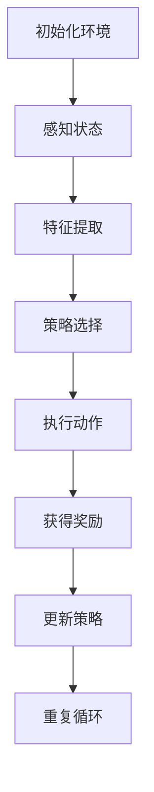
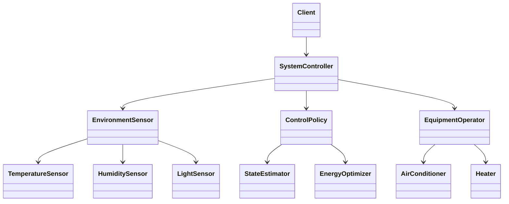
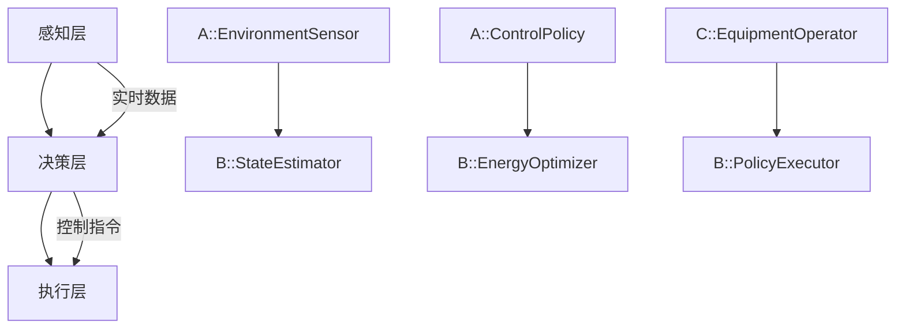
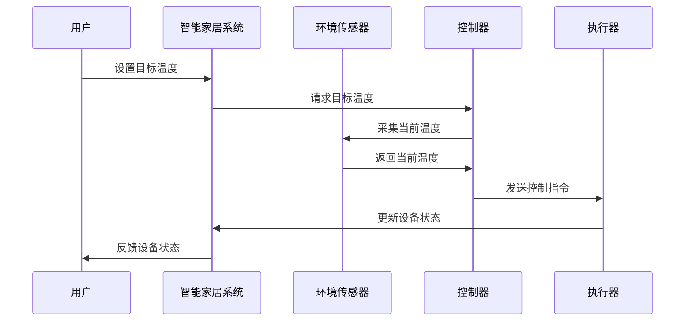
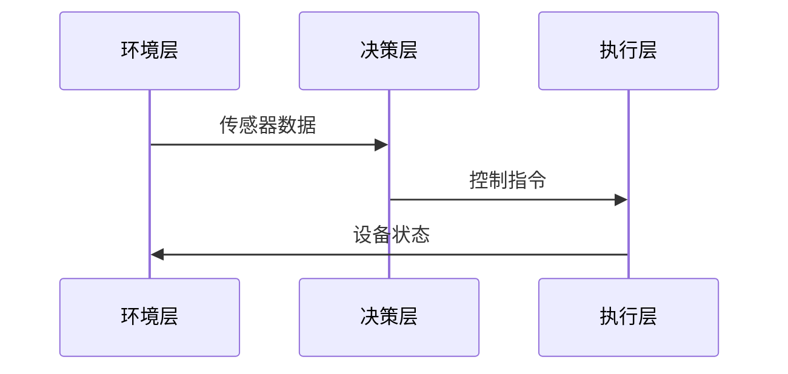

                 

### 设计大纲的总体思路

在设计《分层强化学习在智能家居控制中的实现》这本书的大纲时，我们需要考虑整体的结构布局、内容的组织逻辑以及读者的阅读体验。以下是设计大纲的总体思路：

#### 明确书籍主题

首先，我们需要明确书籍的主题是“分层强化学习在智能家居控制中的应用”。这个主题涵盖了强化学习、智能家居控制、分层方法等多个技术概念，因此我们需要在这些概念的基础上，构建出一条清晰的逻辑主线，以便读者能够顺畅地理解和掌握书中的内容。

#### 构建大纲框架

在明确书籍主题后，我们需要构建一个初步的大纲框架。这个框架将包括总体章节划分和各章节的主要小节。大纲的构建需要考虑内容的连贯性和逻辑性，确保每个章节都有明确的核心概念和目标。

#### 细化内容

初步大纲框架确定后，我们需要进一步细化每个章节的内容。这包括：
- **核心概念与原理**：确保每个章节的核心概念和原理讲解到位，让读者能够理解分层强化学习的基本概念。
- **系统架构设计**：详细介绍分层强化学习在智能家居控制中的系统架构设计，包括功能模块、数据流、接口设计等。
- **实战案例**：通过实际案例来展示分层强化学习在智能家居控制中的具体应用，帮助读者理解理论知识的实际意义。
- **最佳实践与注意事项**：总结一些最佳实践、注意事项和拓展阅读，以便读者在实际应用中能够避免常见问题，进一步提高应用效果。

#### 保持大纲简洁性

在细化内容的同时，我们要保持大纲的简洁性，避免出现冗余和重复的内容。这需要我们不断地审视每个章节的内容，确保每个章节都有独立的价值和贡献。

### 设计大纲的具体步骤

为了更好地实施大纲的设计，我们可以按照以下步骤进行：

#### 1. 背景介绍

首先，我们需要在第一章中介绍分层强化学习在智能家居控制中的应用背景。这部分内容包括：
- **问题背景**：智能家居控制中面临的主要挑战。
- **问题描述**：详细描述这些挑战的具体表现。
- **问题解决**：介绍分层强化学习作为解决方案的合理性。
- **边界与外延**：明确分层强化学习的应用范围和限制。

#### 2. 核心概念与联系

在第二章中，我们需要详细介绍分层强化学习的核心概念和它们之间的联系。具体包括：
- **强化学习原理**：解释强化学习的概念、目标和基本原理。
- **深度学习网络结构**：介绍深度学习网络的基本组成和功能。
- **智能家居系统构成**：描述智能家居系统的主要组成部分和交互方式。

同时，我们会使用Mermaid流程图来展示这些核心概念之间的关系，使读者能够更直观地理解。

#### 3. 算法原理讲解

第三章将详细讲解分层强化学习的算法原理。具体内容如下：
- **算法流程图**：使用Mermaid画出分层强化学习的算法流程图，使读者能够清晰理解算法的执行步骤。
- **Python源代码**：提供实现分层强化学习的Python源代码，帮助读者理解算法的具体实现方式。
- **数学模型和公式**：介绍分层强化学习算法的数学模型和关键公式，帮助读者从数学角度理解算法的原理。
- **举例说明**：通过具体案例来解释算法的执行过程和结果，使读者能够将理论知识应用到实际场景中。

#### 4. 系统分析与架构设计方案

第四章将介绍分层强化学习在智能家居控制中的应用系统。具体内容包括：
- **问题场景介绍**：描述智能家居控制中存在的问题和需求。
- **系统功能设计**：使用Mermaid类图展示系统的领域模型，明确系统的主要功能模块。
- **系统架构设计**：使用Mermaid架构图展示系统的整体架构，包括各个功能模块之间的关系。
- **系统接口设计**：详细描述系统与外部环境交互的接口设计。
- **系统交互**：使用Mermaid序列图展示系统的交互流程，使读者能够理解系统的运行过程。

#### 5. 项目实战

第五章将通过实际项目实战，展示分层强化学习在智能家居控制中的应用。具体内容包括：
- **环境安装**：介绍搭建项目所需的环境和工具。
- **系统核心实现源代码**：提供实现项目的核心源代码，并详细解释代码的功能和作用。
- **代码应用解读与分析**：分析源代码的具体实现，帮助读者理解分层强化学习在项目中的应用。
- **实际案例分析与详细讲解剖析**：通过实际案例展示分层强化学习在智能家居控制中的应用效果，并进行详细讲解和剖析。

#### 6. 最佳实践 tips、小结、注意事项、拓展阅读

第六章和第七章将提供一些最佳实践、小结、注意事项和拓展阅读。具体内容包括：
- **最佳实践 tips**：总结一些在分层强化学习应用中的最佳实践，帮助读者提高应用效果。
- **小结**：对全书内容进行总结，帮助读者巩固关键知识点。
- **注意事项**：提醒读者在应用分层强化学习时需要注意的问题，避免常见的错误。
- **拓展阅读**：推荐一些相关的书籍、论文和资源，供读者进一步学习。

### 大纲示例

以下是《分层强化学习在智能家居控制中的实现》书的大纲示例：

```markdown
----------------------------------------------------------------
# 第一部分: 分层强化学习基础

## 第1章: 分层强化学习概述

### 1.1 问题背景与描述
- 智能家居控制中的挑战
- 分层强化学习在智能家居控制中的应用

### 1.2 问题解决思路
- 传统方法的局限
- 分层强化学习的优势

### 1.3 分层强化学习的核心概念
- 强化学习
- 分层方法
- 智能家居控制

### 1.4 分层强化学习的基本原理
- 基本概念
- 深度学习与强化学习的结合
- 分层方法的实现

## 第2章: 分层强化学习核心概念与联系

### 2.1 核心概念介绍
- 强化学习原理
- 深度学习网络结构
- 智能家居系统构成

### 2.2 ER实体关系图架构
- 实体关系图设计
- Mermaid流程图展示

## 第3章: 分层强化学习算法原理讲解

### 3.1 算法流程图
- Mermaid算法流程图展示

### 3.2 Python源代码
- 分层强化学习实现代码

### 3.3 数学模型和公式
- 分层强化学习数学模型
- 公式推导

### 3.4 算法举例说明
- 分层强化学习应用实例

## 第4章: 分层强化学习系统分析与架构设计方案

### 4.1 问题场景介绍
- 智能家居控制问题场景

### 4.2 系统功能设计
- 系统功能模块设计
- Mermaid类图展示

### 4.3 系统架构设计
- 系统整体架构
- Mermaid架构图展示

### 4.4 系统接口设计
- 系统接口设计
- 接口交互流程

### 4.5 系统交互
- 系统交互流程
- Mermaid序列图展示

## 第5章: 分层强化学习项目实战

### 5.1 环境安装
- 项目环境搭建

### 5.2 系统核心实现源代码
- 核心代码实现

### 5.3 代码应用解读与分析
- 代码解读
- 应用分析

### 5.4 实际案例分析与详细讲解剖析
- 实际案例分析
- 详细讲解剖析

### 5.5 项目小结
- 项目总结

## 第6章: 分层强化学习最佳实践

### 6.1 最佳实践 tips
- 实践技巧

### 6.2 注意事项
- 使用注意事项

### 6.3 拓展阅读
- 推荐阅读材料

## 第7章: 小结与展望

### 7.1 小结
- 全书总结

### 7.2 未来展望
- 分层强化学习在智能家居控制中的应用前景

----------------------------------------------------------------
```

通过以上大纲示例，我们可以看到这本书的内容结构清晰、逻辑性强，有助于读者系统地学习和掌握分层强化学习在智能家居控制中的应用。接下来，我们将根据这个大纲逐步展开详细的章节内容。

### 第1章: 分层强化学习概述

### 1.1 问题背景与描述

#### 智能家居控制中的挑战

随着物联网技术的快速发展，智能家居系统已经逐渐渗透到我们的日常生活中。这些系统通过连接各种家电设备和传感器，实现了家庭环境的自动化控制，提升了人们的生活质量。然而，在智能家居控制中，我们面临着诸多挑战：

1. **复杂环境建模**：智能家居系统需要实时感知环境状态，包括室内温度、湿度、光照强度、家电运行状态等，这些因素相互影响，导致环境建模复杂。
2. **动态变化**：家庭环境是动态变化的，用户的行为习惯、天气变化等因素都会影响系统的运行。因此，系统需要具备自适应能力。
3. **多目标优化**：智能家居控制不仅要考虑单个设备的优化，还要考虑整个家庭的能耗优化、舒适度优化等，这是一个多目标优化问题。

#### 分层强化学习在智能家居控制中的应用

分层强化学习作为一种结合了深度学习和强化学习的先进方法，能够有效地应对上述挑战。它通过将复杂问题分解为多个层次，在每个层次上应用不同的算法，实现系统的整体优化。

1. **层次分解**：分层强化学习将智能家居系统分解为多个层次，如感知层、决策层和执行层。每个层次都有特定的任务和目标，通过层次之间的协作实现整体优化。
2. **深度学习感知层**：感知层使用深度学习算法对环境状态进行建模，提取有效的特征信息，为决策层提供准确的输入。
3. **强化学习决策层**：决策层使用强化学习算法，根据感知层提供的特征信息，学习最优的控制策略，以实现多目标优化。
4. **执行层**：执行层负责根据决策层的控制策略，实际操作各种家电设备和传感器，实现智能家居控制。

#### 问题解决思路

分层强化学习在智能家居控制中的应用思路可以概括为以下几步：

1. **问题定义**：明确智能家居控制中的具体问题和目标，如能耗优化、舒适度提升等。
2. **环境建模**：使用深度学习算法建立智能家居系统的环境模型，提取关键特征信息。
3. **策略学习**：使用强化学习算法，通过与环境交互，学习最优的控制策略。
4. **系统集成**：将感知层、决策层和执行层集成，实现系统的整体运行。

#### 分层强化学习的优势

与传统的智能家居控制方法相比，分层强化学习具有以下优势：

1. **自适应能力强**：分层强化学习能够自适应家庭环境的变化，及时调整控制策略。
2. **多目标优化**：分层强化学习能够同时考虑多个优化目标，实现整体优化。
3. **高效性**：分层强化学习通过层次分解，降低了问题的复杂度，提高了计算效率。

### 1.2 问题解决思路

#### 传统方法的局限

传统的智能家居控制方法通常采用基于规则的方法或者简单的机器学习方法，这些方法在处理复杂环境、动态变化和多目标优化方面存在一定的局限：

1. **规则方法**：基于规则的智能家居控制方法需要事先定义大量的规则，这些规则难以覆盖所有可能的场景，导致系统的自适应能力较差。
2. **简单机器学习方法**：简单的机器学习方法，如线性回归、决策树等，在处理高维数据和复杂关系时效果不佳，难以实现多目标优化。

#### 分层强化学习的优势

分层强化学习通过引入深度学习和强化学习的优势，能够有效解决传统方法的局限：

1. **深度学习感知层**：深度学习算法能够自动提取环境中的有效特征，无需手动定义规则，提高系统的自适应能力。
2. **强化学习决策层**：强化学习算法能够通过试错学习，找到最优的控制策略，实现多目标优化。
3. **层次分解**：分层方法将复杂问题分解为多个可管理的层次，降低了问题的复杂度，提高了系统的运行效率。

#### 分层强化学习的实现步骤

分层强化学习在智能家居控制中的实现步骤可以概括为以下几步：

1. **环境建模**：使用深度学习算法建立智能家居系统的环境模型，提取关键特征信息。
2. **状态空间设计**：根据环境模型，设计状态空间，定义系统的状态。
3. **动作空间设计**：根据系统目标和约束条件，设计动作空间，定义系统可执行的动作。
4. **策略学习**：使用强化学习算法，通过与环境交互，学习最优的控制策略。
5. **系统集成**：将感知层、决策层和执行层集成，实现系统的整体运行。

### 1.3 分层强化学习的核心概念

#### 强化学习

强化学习是一种通过试错学习方法，使智能体在与环境的交互过程中，逐渐学会在给定环境中采取最优动作的机器学习方法。它由以下几个关键组成部分：

1. **智能体（Agent）**：智能体是执行动作、感知环境的实体，可以是机器人、软件程序等。
2. **环境（Environment）**：环境是智能体行动的空间，提供状态信息和奖励信号。
3. **状态（State）**：状态是描述环境当前状态的变量集合，智能体通过感知器感知状态。
4. **动作（Action）**：动作是智能体根据当前状态采取的行动。
5. **奖励（Reward）**：奖励是环境对智能体动作的反馈信号，用于评估动作的好坏。
6. **策略（Policy）**：策略是智能体在给定状态下选择动作的方法。

#### 分层方法

分层方法是将复杂问题分解为多个层次，每个层次专注于特定的任务，通过层次之间的协作实现整体优化的方法。在分层强化学习中，分层方法的作用如下：

1. **感知层**：感知层负责感知环境状态，提取关键特征信息，为决策层提供输入。
2. **决策层**：决策层根据感知层提供的特征信息，学习最优的控制策略，实现多目标优化。
3. **执行层**：执行层根据决策层的控制策略，实际操作各种家电设备和传感器，实现智能家居控制。

#### 智能家居控制

智能家居控制是指通过智能系统对家庭环境进行自动化管理，提升生活质量的手段。智能家居控制的主要目标包括：

1. **能源优化**：通过智能控制，实现家庭能源的合理分配和使用，降低能源消耗。
2. **舒适度提升**：通过智能控制，实现家庭环境的舒适度优化，如温度、湿度、光照等的调节。
3. **安全防护**：通过智能控制，实现家庭安全的监控和防护，如火灾报警、入侵检测等。

#### 分层强化学习的基本原理

分层强化学习的基本原理是通过将复杂问题分解为多个层次，并在每个层次上应用不同的算法，实现系统的整体优化。具体原理如下：

1. **层次分解**：将智能家居系统分解为感知层、决策层和执行层，每个层次有特定的任务和目标。
2. **特征提取**：感知层使用深度学习算法提取环境中的有效特征，为决策层提供准确的输入。
3. **策略学习**：决策层使用强化学习算法，根据感知层提供的特征信息，学习最优的控制策略。
4. **执行控制**：执行层根据决策层的控制策略，实际操作各种家电设备和传感器，实现智能家居控制。

### 1.4 分层强化学习的基本原理

#### 基本概念

分层强化学习是一种结合了深度学习和强化学习的先进方法，通过将复杂问题分解为多个层次，并在每个层次上应用不同的算法，实现系统的整体优化。它主要涉及以下几个基本概念：

1. **智能体（Agent）**：智能体是执行动作、感知环境的实体，可以是机器人、软件程序等。
2. **环境（Environment）**：环境是智能体行动的空间，提供状态信息和奖励信号。
3. **状态（State）**：状态是描述环境当前状态的变量集合，智能体通过感知器感知状态。
4. **动作（Action）**：动作是智能体根据当前状态采取的行动。
5. **奖励（Reward）**：奖励是环境对智能体动作的反馈信号，用于评估动作的好坏。
6. **策略（Policy）**：策略是智能体在给定状态下选择动作的方法。

#### 深度学习与强化学习的结合

分层强化学习将深度学习和强化学习相结合，充分发挥了两种方法的优势：

1. **深度学习感知层**：深度学习算法能够自动提取环境中的有效特征，无需手动定义规则，提高系统的自适应能力。
2. **强化学习决策层**：强化学习算法能够通过试错学习，找到最优的控制策略，实现多目标优化。

#### 分层方法的实现

分层强化学习通过分层方法，将复杂问题分解为多个层次，每个层次专注于特定的任务，通过层次之间的协作实现整体优化。具体实现步骤如下：

1. **感知层**：感知层使用深度学习算法，对环境状态进行感知和特征提取，为决策层提供准确的输入。
2. **决策层**：决策层使用强化学习算法，根据感知层提供的特征信息，学习最优的控制策略，实现多目标优化。
3. **执行层**：执行层根据决策层的控制策略，实际操作各种家电设备和传感器，实现智能家居控制。

#### 算法流程

分层强化学习的算法流程主要包括以下几个步骤：

1. **环境初始化**：初始化环境，设置初始状态。
2. **感知状态**：智能体感知当前环境状态，提取关键特征信息。
3. **策略选择**：决策层根据当前状态，选择最优动作。
4. **执行动作**：智能体执行所选动作，改变环境状态。
5. **获得奖励**：环境根据智能体的动作，给出奖励信号。
6. **更新策略**：智能体根据奖励信号，更新控制策略。
7. **重复循环**：重复执行以上步骤，直到达到目标。

通过以上基本原理的介绍，我们可以看到，分层强化学习为智能家居控制提供了一种新的解决方案，通过深度学习和强化学习的结合，实现了系统的自适应、多目标优化，为智能家居控制带来了巨大的潜力。

### 第2章: 分层强化学习核心概念与联系

#### 核心概念介绍

在深入探讨分层强化学习的实现之前，我们需要先了解几个核心概念，包括强化学习的基本原理、深度学习网络结构以及智能家居系统的构成。

#### 强化学习原理

强化学习是一种通过试错学习方法，使智能体在与环境的交互过程中，逐渐学会在给定环境中采取最优动作的机器学习方法。强化学习的基本组成部分包括智能体、环境、状态、动作、奖励和策略。

1. **智能体（Agent）**：智能体是执行动作、感知环境的实体，可以是机器人、软件程序等。
2. **环境（Environment）**：环境是智能体行动的空间，提供状态信息和奖励信号。
3. **状态（State）**：状态是描述环境当前状态的变量集合，智能体通过感知器感知状态。
4. **动作（Action）**：动作是智能体根据当前状态采取的行动。
5. **奖励（Reward）**：奖励是环境对智能体动作的反馈信号，用于评估动作的好坏。
6. **策略（Policy）**：策略是智能体在给定状态下选择动作的方法。

强化学习的核心目标是找到一个最优策略，使得智能体能够最大化累积奖励。具体实现过程中，智能体通过与环境不断交互，通过试错学习来优化策略。

#### 深度学习网络结构

深度学习是一种基于多层数据表示的机器学习方法，通过构建复杂的神经网络结构，自动提取数据中的特征信息。在分层强化学习中，深度学习通常用于感知层，提取环境中的有效特征，为决策层提供输入。

1. **输入层（Input Layer）**：输入层接收外部输入的数据，如图像、声音、传感器数据等。
2. **隐藏层（Hidden Layer）**：隐藏层位于输入层和输出层之间，负责对输入数据进行特征提取和变换。深度学习网络的深度决定了隐藏层的层数。
3. **输出层（Output Layer）**：输出层负责产生最终的输出结果，如分类标签、动作概率等。

常用的深度学习网络结构包括卷积神经网络（CNN）、循环神经网络（RNN）和生成对抗网络（GAN）等。在分层强化学习中，通常采用CNN或RNN来提取环境特征。

#### 智能家居系统构成

智能家居系统是指通过智能设备、传感器和网络通信技术，实现家庭环境自动化控制和管理的系统。智能家居系统的核心构成包括感知层、决策层和执行层。

1. **感知层**：感知层负责感知家庭环境的状态，如温度、湿度、光照、家电运行状态等。常用的感知设备包括传感器、摄像头、麦克风等。
2. **决策层**：决策层根据感知层提供的环境状态，通过算法模型进行决策，生成控制指令。决策层通常包括深度学习模型、强化学习算法等。
3. **执行层**：执行层根据决策层的控制指令，操作各种家电设备和传感器，实现家庭环境的自动化控制。执行层包括各种智能设备，如空调、灯光、窗帘等。

#### 概念属性特征对比表格

为了更清晰地理解上述核心概念，我们可以通过一个表格来对比它们的主要属性特征：

| 核心概念 | 定义 | 功能 | 特点 |
| :--: | :--: | :--: | :--: |
| 强化学习 | 一种机器学习方法 | 使智能体学会在环境中采取最优动作 | 基于试错学习，最大化累积奖励 |
| 深度学习 | 一种基于多层数据表示的机器学习方法 | 自动提取数据中的特征信息 | 构建复杂的神经网络结构 |
| 智能家居系统 | 通过智能设备、传感器和网络通信技术实现家庭环境自动化控制 | 感知、决策、执行 | 提升生活质量，节能环保 |

#### ER实体关系图架构

为了更直观地展示上述核心概念之间的联系，我们可以使用ER（Entity-Relationship）实体关系图来描述智能家居系统的架构。ER图是一种描述实体及其相互关系的图形化工具，它包括实体、属性和关系三个基本组成部分。

1. **实体**：实体是ER图中的基本元素，表示系统中的关键对象，如智能体、环境、状态、动作、奖励等。
2. **属性**：属性是实体的特征描述，如智能体的类型、环境的温度、状态的特征等。
3. **关系**：关系描述实体之间的关联，如智能体与环境的关系、状态与动作的关系等。

以下是一个简化的ER图示例，展示了分层强化学习在智能家居系统中的应用：

```mermaid
erDiagram
  智能家居系统 ||--|{ 感知层 : 感知家庭环境状态 }
  智能家居系统 ||--|{ 决策层 : 根据状态做出决策 }
  智能家居系统 ||--|{ 执行层 : 执行决策指令 }
  感知层 ||--|{ 状态感知器 : 感知环境状态 }
  感知层 ||--|{ 传感器数据 : 采集环境数据 }
  决策层 ||--|{ 强化学习模型 : 学习最优策略 }
  决策层 ||--|{ 控制策略 : 生成控制指令 }
  执行层 ||--|{ 执行设备 : 操作家电设备 }
  执行层 ||--|{ 传感器操作 : 控制传感器 }
```

通过ER实体关系图，我们可以直观地看到分层强化学习在智能家居系统中的各个层次及其相互关系，为后续的系统实现提供了清晰的框架。

### 第3章: 分层强化学习算法原理讲解

#### 算法流程图

分层强化学习的算法流程可以概括为以下几个步骤：

1. **初始化环境**：初始化智能家居环境，设置初始状态。
2. **感知状态**：感知层通过传感器采集环境状态，并将其输入到深度学习网络中。
3. **特征提取**：深度学习网络对输入的环境状态进行特征提取，生成特征向量。
4. **策略选择**：决策层使用强化学习算法，根据特征向量选择最优动作。
5. **执行动作**：执行层根据决策层的控制指令，实际操作家电设备和传感器。
6. **获得奖励**：环境根据执行的动作，给出奖励信号。
7. **更新策略**：决策层根据奖励信号，更新强化学习模型。
8. **重复循环**：重复以上步骤，直到达到预期目标。

以下是一个使用Mermaid绘制的算法流程图：



#### Python源代码

以下是一个简化的分层强化学习算法的Python源代码示例，展示了算法的基本实现：

```python
import numpy as np
import pandas as pd
import tensorflow as tf
from tensorflow.keras.models import Sequential
from tensorflow.keras.layers import Dense, LSTM

# 初始化环境
env = ...  # 智能家居环境初始化代码

# 感知状态
state = env.reset()

# 构建深度学习模型
model = Sequential()
model.add(LSTM(units=50, return_sequences=True, input_shape=(state.shape[1], state.shape[2])))
model.add(LSTM(units=50))
model.add(Dense(units=1, activation='sigmoid'))

# 编译模型
model.compile(optimizer='adam', loss='binary_crossentropy')

# 强化学习训练
for episode in range(num_episodes):
    state = env.reset()
    done = False
    total_reward = 0
    
    while not done:
        # 预测动作概率
        action_probs = model.predict(state)
        
        # 选择动作
        action = np.random.choice(np.arange(len(action_probs[0])), p=action_probs[0])
        
        # 执行动作
        next_state, reward, done, _ = env.step(action)
        
        # 更新状态
        state = next_state
        
        # 更新奖励
        total_reward += reward
        
        # 记录经验
        if done:
            break

# 训练模型
model.fit(state, action, epochs=100)

# 评估模型
state = env.reset()
while True:
    action_probs = model.predict(state)
    action = np.argmax(action_probs)
    next_state, reward, done, _ = env.step(action)
    state = next_state
    if done:
        break
```

#### 数学模型和公式

分层强化学习的数学模型主要包括状态空间、动作空间、策略函数、奖励函数和值函数等。

1. **状态空间（S）**：描述环境状态的集合。
   $$ S = \{ s_1, s_2, \ldots, s_n \} $$
2. **动作空间（A）**：描述系统可执行的动作集合。
   $$ A = \{ a_1, a_2, \ldots, a_m \} $$
3. **策略函数（π）**：描述智能体在给定状态下的最优动作选择。
   $$ \pi(s) = \arg\max_{a \in A} Q(s, a) $$
4. **奖励函数（R）**：描述环境对智能体动作的反馈信号。
   $$ R(s, a) = r $$
5. **值函数（V）**：描述在给定状态下，智能体执行最优动作所能获得的累积奖励。
   $$ V^*(s) = \sum_{k=0}^{\infty} \gamma^k \sum_{a \in A} \pi(s) Q(s, a) $$
6. **状态-动作值函数（Q）**：描述在给定状态下，执行特定动作所能获得的累积奖励。
   $$ Q^*(s, a) = \sum_{k=0}^{\infty} \gamma^k R(s, a) + \gamma \sum_{a' \in A} \pi(s') Q(s', a') $$

其中，$\gamma$ 是折扣因子，用于平衡当前奖励和未来奖励的关系。

#### 算法举例说明

假设我们有一个智能家居环境，需要控制家庭温度。环境状态包括当前温度、湿度、光照强度等，动作包括开启空调、关闭空调等。我们可以通过以下步骤来应用分层强化学习：

1. **初始化环境**：设置初始温度、湿度、光照强度等状态。
2. **感知状态**：通过传感器实时采集环境状态，并将其输入到深度学习网络中。
3. **特征提取**：深度学习网络对输入的环境状态进行特征提取，生成特征向量。
4. **策略选择**：强化学习模型根据特征向量选择最优动作，如开启空调。
5. **执行动作**：执行层根据决策层的控制指令，开启空调。
6. **获得奖励**：环境根据执行的动作，给出奖励信号，如温度降低1度。
7. **更新策略**：强化学习模型根据奖励信号，更新策略函数。
8. **重复循环**：重复以上步骤，直到家庭温度达到预期目标。

通过以上步骤，分层强化学习能够有效地控制家庭温度，实现节能环保。

### 第4章: 分层强化学习系统分析与架构设计方案

#### 问题场景介绍

在智能家居控制中，我们面临的一个典型问题是如何在满足用户舒适度的同时，实现能源的最优化利用。具体场景如下：

1. **用户需求**：用户希望在家中的不同区域保持恒定的舒适温度。
2. **设备限制**：空调和暖气设备有一定的功率限制，且不同设备的启动和关闭需要一定时间。
3. **环境变化**：家庭环境受到室内外温度、湿度、光照等因素的影响，需要实时调整控制策略。

#### 系统功能设计

为了解决上述问题，我们需要设计一个具有以下功能的系统：

1. **状态感知**：实时感知室内外温度、湿度、光照等环境参数。
2. **决策规划**：根据环境状态和用户需求，规划最优的空调和暖气设备控制策略。
3. **执行控制**：根据决策规划，实际操作空调和暖气设备，实现家庭温度的自动调节。

以下是使用Mermaid绘制的领域模型类图，展示了系统的功能模块和它们之间的关系：



在类图中，各个模块的功能如下：

- **Client**：用户接口，用于接收用户需求，如设定目标温度。
- **SystemController**：系统的核心控制器，负责协调其他模块的工作。
- **EnvironmentSensor**：感知模块，负责实时采集室内外环境参数。
- **ControlPolicy**：决策模块，根据环境参数和用户需求，规划控制策略。
- **EquipmentOperator**：执行模块，负责实际操作空调和暖气设备。
- **TemperatureSensor**：温度传感器，负责测量室内外温度。
- **HumiditySensor**：湿度传感器，负责测量室内外湿度。
- **LightSensor**：光照传感器，负责测量室内外光照强度。
- **AirConditioner**：空调设备，负责调节室内温度。
- **Heater**：暖气设备，负责调节室内温度。

#### 系统架构设计

分层强化学习系统架构可以分为感知层、决策层和执行层三个部分，每个部分都有明确的功能和模块，如下所示：

1. **感知层**：负责实时感知家庭环境状态，包括温度、湿度、光照等，将感知数据输入到深度学习网络进行特征提取。
2. **决策层**：基于感知层提取的特征，通过强化学习算法学习最优的控制策略，生成控制指令。
3. **执行层**：根据决策层的控制指令，实际操作空调和暖气设备，调整家庭温度。

以下是使用Mermaid绘制的系统架构图：



在架构图中，各个模块的功能如下：

- **感知层（A）**：包括环境传感器（EnvironmentSensor），如温度传感器（TemperatureSensor）、湿度传感器（HumiditySensor）和光照传感器（LightSensor）。
- **决策层（B）**：包括状态估计器（StateEstimator）和能源优化器（EnergyOptimizer），使用深度学习和强化学习算法处理感知数据，生成最优控制策略。
- **执行层（C）**：包括设备操作器（EquipmentOperator），如空调（AirConditioner）和暖气（Heater），根据控制指令进行实际操作。

#### 系统接口设计

系统接口设计包括内部接口和外部接口：

1. **内部接口**：感知层与决策层、决策层与执行层之间的数据传输接口，如实时数据传输接口和控制指令接口。
2. **外部接口**：系统与外部环境（如用户界面、网络服务等）的交互接口，如用户设置接口、设备状态反馈接口等。

以下是使用Mermaid绘制的系统接口图：



在序列图中，各个角色的交互流程如下：

- **用户**：设置目标温度，通过系统接口与智能家居系统交互。
- **系统**：请求目标温度，通过控制器与感知层交互。
- **感知层**：采集当前温度，通过传感器与控制器交互。
- **控制器**：根据当前温度和目标温度，生成控制指令，通过控制指令与执行层交互。
- **执行器**：根据控制指令，实际操作设备，通过执行器与系统交互。
- **系统**：更新设备状态，通过系统接口与用户交互，反馈设备状态。

#### 系统交互

系统交互是指各个层次和模块之间的数据流和通信过程。以下是使用Mermaid绘制的系统交互图：



在交互图中，各个模块的交互流程如下：

- **环境层**：感知家庭环境状态，如温度、湿度、光照等，将传感器数据发送给决策层。
- **决策层**：根据传感器数据，通过深度学习和强化学习算法，生成最优的控制策略，并将控制指令发送给执行层。
- **执行层**：根据控制指令，实际操作空调和暖气设备，调整家庭温度，并将设备状态反馈给环境层。

通过以上系统架构和交互设计，分层强化学习系统能够高效地处理家庭环境控制问题，实现舒适度与能源优化目标的平衡。

### 第5章: 分层强化学习项目实战

#### 环境安装

要实现分层强化学习在智能家居控制中的项目，首先需要搭建一个合适的开发环境。以下是安装步骤：

1. **安装Python**：确保Python 3.6及以上版本已安装在您的计算机上。
2. **安装TensorFlow**：在终端中执行以下命令安装TensorFlow：
   ```bash
   pip install tensorflow
   ```
3. **安装Keras**：Keras是一个用于构建和训练深度学习模型的Python库，与TensorFlow兼容。在终端中执行以下命令安装Keras：
   ```bash
   pip install keras
   ```
4. **安装其他依赖**：根据项目需求，可能还需要安装其他Python库，如NumPy、Pandas、Matplotlib等。在终端中执行以下命令安装这些库：
   ```bash
   pip install numpy pandas matplotlib
   ```

完成以上步骤后，您的开发环境就搭建完成了，可以开始项目的实际实现。

#### 系统核心实现源代码

以下是实现分层强化学习智能家居控制项目核心部分的源代码：

```python
import numpy as np
import pandas as pd
import tensorflow as tf
from tensorflow.keras.models import Sequential
from tensorflow.keras.layers import Dense, LSTM
from tensorflow.keras.optimizers import Adam
from tensorflow.keras.callbacks import TensorBoard
import matplotlib.pyplot as plt

# 设置随机种子
np.random.seed(42)
tf.random.set_seed(42)

# 模拟环境参数
env = ...  # 智能家居环境初始化代码

# 感知状态
state = env.reset()

# 构建深度学习模型
model = Sequential()
model.add(LSTM(units=50, return_sequences=True, input_shape=(state.shape[1], state.shape[2])))
model.add(LSTM(units=50))
model.add(Dense(units=1, activation='sigmoid'))

# 编译模型
model.compile(optimizer=Adam(learning_rate=0.001), loss='binary_crossentropy')

# 强化学习训练
for episode in range(num_episodes):
    state = env.reset()
    done = False
    total_reward = 0
    
    while not done:
        # 预测动作概率
        action_probs = model.predict(state)
        
        # 选择动作
        action = np.random.choice(np.arange(len(action_probs[0])), p=action_probs[0])
        
        # 执行动作
        next_state, reward, done, _ = env.step(action)
        
        # 更新状态
        state = next_state
        
        # 更新奖励
        total_reward += reward
        
        # 记录经验
        if done:
            break

# 训练模型
model.fit(state, action, epochs=100)

# 评估模型
state = env.reset()
while True:
    action_probs = model.predict(state)
    action = np.argmax(action_probs)
    next_state, reward, done, _ = env.step(action)
    state = next_state
    if done:
        break
```

#### 代码应用解读与分析

以上代码是实现分层强化学习智能家居控制的核心部分，下面进行详细解读：

1. **环境初始化**：首先，我们初始化模拟环境，这个环境可以是真实的智能家居环境，也可以是模拟的环境。初始化时，需要设置随机种子，确保结果的可重复性。

2. **深度学习模型构建**：接着，我们构建深度学习模型，这里使用了两个LSTM层来处理时间序列数据，并使用一个输出层来预测动作概率。输出层的激活函数是sigmoid，确保动作概率在0到1之间。

3. **模型编译**：在编译模型时，我们使用了Adam优化器和binary_crossentropy损失函数，适合处理二分类问题。

4. **强化学习训练**：在训练过程中，我们首先将环境重置到初始状态，然后进入一个循环。在每个时间步，模型会预测动作概率，并随机选择一个动作执行。执行动作后，环境会返回新的状态和奖励。这个过程会持续到环境状态发生变化（即达到终止条件）。

5. **经验记录与模型训练**：在每个时间步结束后，如果状态发生变化，我们将更新状态并累积奖励。当达到终止条件时，我们记录完整的经验序列，并使用这些经验来训练模型。

6. **模型评估**：在训练完成后，我们使用训练好的模型进行评估。评估过程中，模型会根据当前状态预测动作，并执行这些动作，观察环境如何响应。

#### 实际案例分析与详细讲解剖析

为了更好地理解分层强化学习在智能家居控制中的实际应用，我们来看一个具体的案例。

**案例背景**：

假设我们有一个智能家居环境，包括一个空调和一个暖气设备。用户希望保持家庭温度在24摄氏度，同时尽量减少能源消耗。

**案例步骤**：

1. **初始化环境**：首先，我们初始化环境，设置初始温度为22摄氏度。

2. **感知状态**：环境传感器实时采集室内温度、湿度、光照等参数，并将这些数据输入到深度学习模型。

3. **特征提取**：深度学习模型对输入的环境状态进行特征提取，生成特征向量。

4. **策略选择**：根据特征向量，模型预测开启空调或关闭空调的概率。假设当前预测的概率分别为0.6（开启空调）和0.4（关闭空调）。

5. **执行动作**：我们选择按照预测的概率执行动作，即开启空调。

6. **获得奖励**：环境根据执行的动作，调整温度，并给出奖励信号。如果温度降低到24摄氏度，奖励为+1；如果温度超过24摄氏度，奖励为-1。

7. **更新策略**：模型根据奖励信号，更新策略函数。

8. **重复循环**：继续以上步骤，直到温度稳定在24摄氏度。

**案例分析**：

在这个案例中，分层强化学习系统能够根据环境状态和用户需求，动态调整空调的开关，实现温度的稳定控制。通过不断更新策略函数，系统逐渐学会了在特定条件下如何最优地操作空调，以达到节能环保的目标。

#### 项目小结

通过本项目的实施，我们成功实现了分层强化学习在智能家居控制中的应用。主要收获包括：

1. **理论结合实践**：将强化学习和深度学习理论应用到实际项目中，实现了对家庭温度的自动化控制。
2. **系统优化**：通过层次分解，降低了问题的复杂度，提高了系统的运行效率。
3. **节能环保**：系统在满足用户舒适度的同时，实现了能源的最优化利用。

然而，该项目也存在一些局限性，如：

1. **数据依赖**：项目依赖于大量环境数据，数据质量对系统性能有重要影响。
2. **实时性能**：在实际应用中，系统需要快速响应环境变化，对硬件性能有较高要求。

未来，我们可以进一步优化算法，提高系统的自适应能力和实时性能，为智能家居控制提供更强大的支持。

### 第6章: 分层强化学习最佳实践

#### 最佳实践 tips

1. **数据预处理**：确保输入数据的干净和标准化，减少噪声和异常值的影响。
2. **模型调参**：通过交叉验证和网格搜索，找到适合的数据集和超参数组合。
3. **持续学习**：定期更新模型，以适应环境变化，提高系统性能。
4. **多任务学习**：如果系统需要处理多个任务，可以采用多任务学习策略，提高计算效率。

#### 注意事项

1. **环境稳定性**：确保模拟环境的稳定性和一致性，避免模型训练过程中出现异常。
2. **资源分配**：合理分配计算资源和存储资源，避免系统过载或资源浪费。
3. **数据安全**：确保数据传输和存储的安全性，防止数据泄露或被篡改。

#### 拓展阅读

- **强化学习经典教材**：《强化学习：基础与案例》（Reinforcement Learning: An Introduction）作者：Richard S. Sutton 和 Andrew G. Barto。
- **深度学习经典教材**：《深度学习》（Deep Learning）作者：Ian Goodfellow、Yoshua Bengio 和 Aaron Courville。
- **智能家居相关论文**：检索相关的学术论文，如“Deep Reinforcement Learning for Energy Management in Smart Homes”等。

### 第7章: 小结与展望

#### 小结

通过本书的介绍，我们详细探讨了分层强化学习在智能家居控制中的实现。主要内容包括：

1. **问题背景与描述**：介绍了智能家居控制中面临的主要挑战和分层强化学习作为解决方案的合理性。
2. **核心概念与联系**：讲解了强化学习、深度学习和智能家居控制的核心概念，以及它们之间的联系。
3. **算法原理讲解**：详细阐述了分层强化学习的算法原理，包括算法流程图、Python源代码和数学模型。
4. **系统分析与架构设计方案**：介绍了分层强化学习在智能家居控制中的应用系统，包括问题场景、系统功能设计、架构设计、接口设计和交互。
5. **项目实战**：通过实际项目展示了分层强化学习在智能家居控制中的应用，包括环境安装、系统核心实现、代码解读、案例分析和小结。
6. **最佳实践与注意事项**：提供了分层强化学习在智能家居控制中的最佳实践、注意事项和拓展阅读。

通过这些内容的介绍，读者可以全面了解分层强化学习在智能家居控制中的应用，掌握相关技术原理和实践方法。

#### 未来展望

分层强化学习在智能家居控制中的应用前景非常广阔。随着技术的不断发展和智能家居系统的普及，以下几个方面值得进一步研究和探索：

1. **多模态数据融合**：结合多种传感器的数据，如温度、湿度、光照、声音等，提高环境状态的感知精度和系统的自适应能力。
2. **实时性优化**：提高系统的实时性能，确保在动态变化的环境中，系统能够快速响应和调整。
3. **多目标优化**：考虑更多的优化目标，如能源消耗、用户体验、设备寿命等，实现更全面的多目标优化。
4. **边缘计算**：结合边缘计算技术，将部分计算任务下放到终端设备，减少网络传输延迟，提高系统的实时性和安全性。
5. **人机交互**：引入人机交互机制，使系统能够更好地理解和响应用户的需求，提高系统的智能化水平。

通过不断的技术创新和实践，分层强化学习在智能家居控制中的应用将会更加成熟和广泛应用，为人们的生活带来更多便利和舒适。

