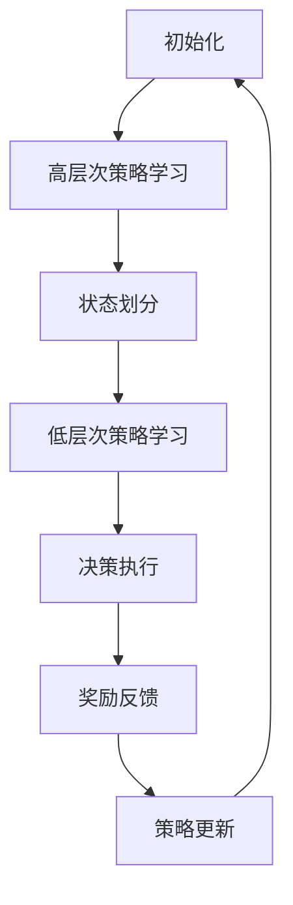
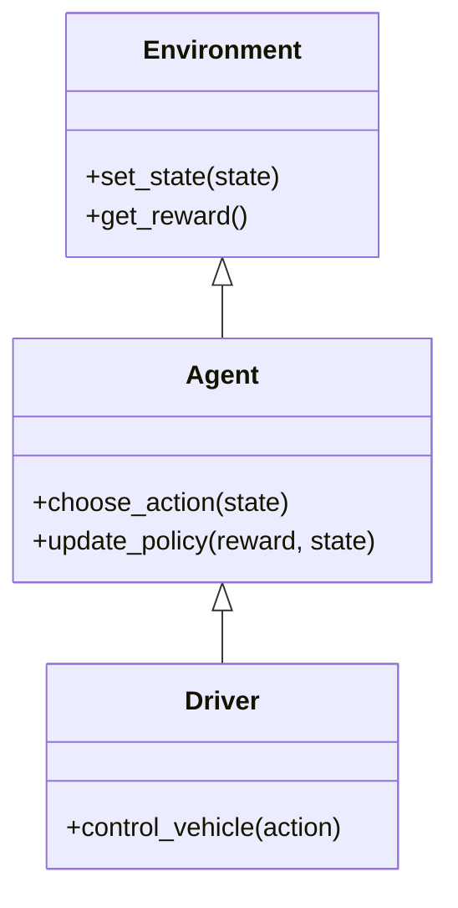

                 

### 第一部分：问题背景与核心概念

#### 1.1 问题背景

**自动驾驶发展的现状与挑战**

自动驾驶技术作为现代交通领域的前沿科技，正在经历前所未有的快速发展。当前，全球多个国家和地区都在积极推进自动驾驶技术的研发和商业化进程。自动驾驶技术不仅能够显著提高交通安全性和效率，还能够减少交通拥堵和环境污染。然而，尽管自动驾驶技术的理论研究和实际应用取得了显著进展，但仍然面临着诸多挑战。

首先，自动驾驶技术的实现涉及复杂的感知、决策和执行过程。车辆需要通过传感器（如摄像头、激光雷达和雷达）收集环境信息，然后利用这些信息进行环境建模和障碍物检测。在此基础上，车辆需要利用强化学习等算法进行决策，并最终执行相应的动作，如加速、减速和转向。这一系列过程要求高度的计算能力和实时性，同时也需要确保系统的鲁棒性和安全性。

其次，自动驾驶技术在实际应用中面临着复杂多变的交通环境。现实世界的交通状况复杂多变，包括不同类型的道路、气候条件、交通规则和行人行为等。如何在各种复杂和不确定的环境下确保自动驾驶系统的稳定性和可靠性，是当前研究的重要方向。

**强化学习与自动驾驶决策**

强化学习（Reinforcement Learning，RL）是一种通过试错和反馈来学习优化行为策略的机器学习技术。它在自动驾驶决策中具有重要应用价值。强化学习通过将自动驾驶系统视为一个智能体（agent），在环境（environment）中通过与环境的交互（interaction）来学习最优策略（policy）。

在自动驾驶决策过程中，强化学习可以帮助车辆学习如何在不同的驾驶场景下做出正确的决策。例如，在遇到前方障碍物时，车辆需要选择合适的速度和方向，以避免碰撞并保证行驶安全。通过强化学习，车辆可以在大量的模拟或实际驾驶数据中学习到最优的驾驶策略。

**分层强化学习的作用**

分层强化学习（Hierarchical Reinforcement Learning）是一种将复杂任务分解为多个子任务，并通过不同层次的策略进行优化的强化学习方法。它在自动驾驶决策中的应用具有显著优势。

首先，分层强化学习可以有效地降低问题的复杂度。自动驾驶决策涉及多个层次的任务，如感知、规划、控制和驾驶策略等。通过分层强化学习，可以将这些任务分解为不同的层次，并分别进行学习和优化。这样不仅简化了问题模型，还有助于提高学习效率和收敛速度。

其次，分层强化学习可以增强系统的鲁棒性和灵活性。在自动驾驶决策过程中，不同层次的策略可以针对不同的驾驶场景进行适应性调整。例如，在高层次策略中，可以针对整体驾驶策略进行优化；在低层次策略中，可以针对具体的驾驶动作进行优化。这种分层结构使得系统在面对复杂和不确定的驾驶环境时，可以更加灵活地适应变化。

总之，分层强化学习在自动驾驶决策中的应用，不仅有助于提高决策的准确性和稳定性，还可以提高系统的适应性和鲁棒性。它为自动驾驶技术的发展提供了新的思路和方法，有望在未来实现更安全、更高效的自动驾驶系统。

#### 1.2 核心概念与联系

**强化学习原理**

强化学习（Reinforcement Learning，RL）是一种通过试错和反馈来学习优化行为策略的机器学习技术。在强化学习框架中，智能体（agent）通过与环境的交互来学习最优策略（policy），以最大化累积奖励（reward）。

**定义与基本概念**

- **智能体（Agent）**：在强化学习中，智能体是一个学习模型，负责选择动作并接收环境反馈。
- **环境（Environment）**：环境是智能体所处的世界，包括智能体可以感知的状态和能够执行的动作。
- **状态（State）**：状态是智能体在环境中的位置和当前情况。
- **动作（Action）**：动作是智能体在某个状态下可以执行的行为。
- **策略（Policy）**：策略是智能体从状态到动作的映射，决定了智能体如何根据当前状态选择动作。
- **奖励（Reward）**：奖励是环境对智能体动作的反馈，用于指导智能体学习最优策略。
- **价值函数（Value Function）**：价值函数用于评估智能体在某个状态下的预期奖励，分为状态价值函数（State-Value Function）和动作价值函数（Action-Value Function）。
- **模型（Model）**：模型是对环境的抽象表示，用于预测下一状态和下一奖励。

**强化学习核心概念关系**

- **状态（State）**：智能体当前所处的环境状态。
- **动作（Action）**：智能体在状态 `s` 下选择执行的动作 `a`。
- **奖励（Reward）**：环境对智能体动作的即时反馈，表示为 `R(s,a)`。
- **策略（Policy）**：智能体的行为策略，定义了智能体在状态 `s` 下执行动作 `a` 的概率分布。
- **价值函数（Value Function）**：用于评估智能体在未来执行某策略时所获得的累积奖励。
- **模型（Model）**：智能体对环境状态的预测模型，用于更新状态和奖励的估计。

**强化学习在自动驾驶决策中的步骤**

1. **初始化**：设定智能体、环境、策略、价值函数和模型。
2. **状态感知**：智能体感知当前环境状态。
3. **动作选择**：根据当前状态和策略选择动作。
4. **执行动作**：智能体在环境中执行所选动作。
5. **奖励反馈**：环境根据动作给予智能体奖励反馈。
6. **策略更新**：智能体根据奖励反馈更新策略。
7. **状态更新**：环境状态根据动作更新。
8. **重复步骤**：智能体继续与环境交互，循环迭代上述步骤。

**强化学习在自动驾驶决策中的挑战与解决方案**

**挑战：**

- **环境复杂性**：自动驾驶环境包含多种动态和静态障碍物，交通规则复杂多变，需要智能体具备高度的环境感知和处理能力。
- **状态空间大**：自动驾驶决策涉及大量的状态和动作，状态空间极大，导致搜索和计算复杂度高。
- **连续性和离散性**：自动驾驶任务中存在连续动作（如速度控制）和离散动作（如转向）的混合，需要设计适合的算法来处理。
- **安全性和鲁棒性**：自动驾驶系统需要在各种复杂和不确定的条件下保持高安全性和鲁棒性。

**解决方案：**

- **分层强化学习**：通过分层结构将复杂任务分解为多个子任务，降低问题复杂度，提高学习效率。
- **模型预测控制（Model Predictive Control，MPC）**：结合模型预测控制技术，提前预测环境变化，优化驾驶动作。
- **数据驱动方法**：利用大量真实驾驶数据进行训练，提高智能体的感知和决策能力。
- **强化学习与深度学习的结合**：利用深度学习提高智能体的感知和处理能力，同时保持强化学习在决策中的优势。

通过以上方法，强化学习在自动驾驶决策中的应用可以更好地应对环境复杂性和状态空间大等挑战，实现安全、可靠的自动驾驶系统。

#### 1.3 分层强化学习原理讲解

**Mermaid流程图：分层强化学习过程**



**Python源代码：分层强化学习示例**

```python
class HierarchicalReinforcementLearning:
    def __init__(self):
        # 初始化参数
        self.high_level_agent = HighLevelAgent()
        self.low_level_agent = LowLevelAgent()
    
    def train(self, state):
        # 高层次策略学习
        action = self.high_level_agent.choose_action(state)
        # 低层次策略学习
        next_state, reward = self.low_level_agent.execute_action(action)
        # 更新高层次策略
        self.high_level_agent.update_policy(reward, next_state)
        # 更新低层次策略
        self.low_level_agent.update_policy(reward, next_state)
        return next_state, reward

class HighLevelAgent:
    def __init__(self):
        # 初始化高层次策略
        pass
    
    def choose_action(self, state):
        # 根据状态选择高层次动作
        pass

    def update_policy(self, reward, state):
        # 更新高层次策略
        pass

class LowLevelAgent:
    def __init__(self):
        # 初始化低层次策略
        pass
    
    def execute_action(self, action):
        # 执行低层次动作
        pass

    def update_policy(self, reward, state):
        # 更新低层次策略
        pass
```

**数学模型与公式**

- **数学模型：分层强化学习中的期望值最大化**

  $$ Q^h(s,a) = \sum_{s'} P(s'|s,a) \cdot [R(s',a) + \gamma \cdot Q^l(s',a')] $$
  
  $$ Q^l(s',a') = \sum_{s''} P(s''|s',a') \cdot R(s'',a') $$

  其中：
  - $Q^h(s,a)$：高层次动作价值函数，表示状态 $s$ 下执行动作 $a$ 的预期奖励。
  - $Q^l(s',a')$：低层次动作价值函数，表示状态 $s'$ 下执行动作 $a'$ 的预期奖励。
  - $P(s'|s,a)$：状态转移概率，表示从状态 $s$ 执行动作 $a$ 后转移到状态 $s'$ 的概率。
  - $R(s',a')$：即时奖励，表示在状态 $s'$ 下执行动作 $a'$ 所获得的即时奖励。
  - $\gamma$：折扣因子，用于平衡长期奖励和即时奖励。

**数学公式讲解**

- $Q^h(s,a)$：表示状态 $s$ 下执行动作 $a$ 的预期奖励，考虑了即时奖励和未来奖励。
- $Q^l(s',a')$：表示状态 $s'$ 下执行动作 $a'$ 的预期奖励，仅考虑即时奖励。
- $P(s'|s,a)$：表示从状态 $s$ 执行动作 $a$ 后转移到状态 $s'$ 的概率，反映了环境的动态特性。
- $R(s',a')$：表示在状态 $s'$ 下执行动作 $a'$ 所获得的即时奖励，直接影响了智能体的决策。
- $\gamma$：表示折扣因子，用于权衡长期和即时奖励，避免过度追求短期奖励而忽略长期目标。

通过分层强化学习，智能体能够从高层次和低层次两个层面进行决策，从而在不同层次上优化策略，提高自动驾驶决策的效率和效果。

#### 1.4 数学模型与公式

**强化学习中的期望值最大化**

强化学习的目标是最大化累积奖励，通过期望值最大化来实现这一目标。期望值最大化是强化学习中最基本和常用的方法之一。以下是强化学习中期望值最大化的数学模型和公式。

**数学模型：**

$$ Q(s,a) = \sum_{s'} P(s'|s,a) \cdot R(s',a) + \gamma \cdot \max_{a'} Q(s',a') $$

其中：
- \( Q(s,a) \) 是状态 \( s \) 下执行动作 \( a \) 的期望回报值。
- \( P(s'|s,a) \) 是从状态 \( s \) 执行动作 \( a \) 后转移到状态 \( s' \) 的概率。
- \( R(s',a) \) 是在状态 \( s' \) 下执行动作 \( a \) 所获得的即时回报值。
- \( \gamma \) 是折扣因子，用于平衡长期回报和即时回报。
- \( \max_{a'} Q(s',a') \) 是在下一个状态 \( s' \) 下执行动作 \( a' \) 的最大期望回报值。

**数学公式讲解：**

1. \( Q(s,a) \)：表示在状态 \( s \) 下执行动作 \( a \) 的预期回报值。它综合考虑了当前动作带来的即时回报和未来可能获得的长远回报。
2. \( P(s'|s,a) \)：表示从状态 \( s \) 执行动作 \( a \) 后转移到状态 \( s' \) 的概率。这是环境对动作 \( a \) 的响应，反映了智能体对环境的理解和预测能力。
3. \( R(s',a) \)：表示在状态 \( s' \) 下执行动作 \( a \) 所获得的即时回报值。即时回报直接影响了智能体的短期决策，是强化学习中的重要反馈信号。
4. \( \gamma \)：表示折扣因子，用于平衡长期回报和即时回报。它确保智能体不会过度关注短期奖励，而忽略了长期目标。
5. \( \max_{a'} Q(s',a') \)：表示在下一个状态 \( s' \) 下执行所有可能动作 \( a' \) 中的最大期望回报值。这个值指导智能体在下一个状态中选择最佳动作。

**举例说明：**

假设智能体在一个简单的环境（如一个房间）中学习移动。状态空间包括房间中的不同位置，动作空间包括向上、向下、向左和向右移动。智能体每次执行动作后，环境会给予即时奖励，奖励取决于移动后的位置和目标位置的距离。

- 初始状态 \( s \)：智能体在房间的中间位置。
- 动作 \( a \)：向上移动。
- 状态转移概率 \( P(s'|s,a) \)：向上移动后，智能体有 50% 的概率到达房间的顶部或底部。
- 即时回报 \( R(s',a) \)：到达目标位置（房间顶部或底部）时，智能体获得正奖励；否则，获得负奖励。

通过上述公式，智能体可以计算出在当前状态下执行不同动作的期望回报值，并选择期望回报值最大的动作。

通过这种方式，强化学习使得智能体能够在复杂的动态环境中，通过不断学习和调整策略，实现最优决策。

#### 1.5 分层强化学习在自动驾驶中的应用

**Mermaid类图：自动驾驶决策过程中的分层强化学习架构**



**分层强化学习架构**

分层强化学习在自动驾驶决策过程中发挥了关键作用。它通过将复杂的自动驾驶任务分解为多个层次，分别进行学习和优化，从而提高了决策的效率和鲁棒性。以下是分层强化学习在自动驾驶决策中的应用架构：

1. **环境（Environment）**：环境是自动驾驶系统运行的实际场景，包括道路、交通状况、障碍物等。环境通过传感器收集实时数据，提供给智能体进行决策。

2. **智能体（Agent）**：智能体是自动驾驶系统中的核心组件，负责接收环境数据，选择并执行动作，并接收奖励反馈。智能体由高层次策略和低层次策略组成。

3. **高层次策略（High-Level Policy）**：高层次策略主要负责制定整体驾驶策略，如导航路线、交通规则遵守等。它通过强化学习算法，从大量驾驶数据中学习到最优的驾驶路线。

4. **低层次策略（Low-Level Policy）**：低层次策略主要负责具体的驾驶动作，如加速、减速、转向等。它通过强化学习算法，从大量驾驶数据中学习到在不同驾驶场景下的最佳驾驶动作。

5. **驾驶器（Driver）**：驾驶器是智能体的实际执行组件，根据智能体选择的动作控制车辆。驾驶器通过与环境交互，反馈奖励给智能体，帮助智能体不断优化策略。

**分层强化学习在自动驾驶中的应用优势**

分层强化学习在自动驾驶决策中的应用具有显著的优势：

1. **降低问题复杂度**：通过将复杂任务分解为多个子任务，分层强化学习降低了问题复杂度，使得自动驾驶系统能够更加高效地学习和优化策略。

2. **提高决策效率**：分层强化学习通过在不同层次上进行学习和优化，提高了决策效率。高层次策略负责制定整体驾驶策略，低层次策略负责执行具体驾驶动作，两者协同工作，提高了系统整体的决策效率。

3. **增强系统鲁棒性**：分层强化学习通过在不同层次上优化策略，增强了系统在面对复杂和不确定环境时的鲁棒性。高层次策略能够根据环境变化进行适应性调整，低层次策略能够快速响应环境变化，保证了系统的稳定性和安全性。

总之，分层强化学习在自动驾驶决策中的应用，不仅提高了系统的效率和鲁棒性，还为自动驾驶技术的进一步发展提供了新的思路和方法。

#### 1.6 本章小结

本章深入探讨了分层强化学习在自动驾驶决策中的应用，从多个角度进行了详细的分析和讲解。首先，我们介绍了自动驾驶技术的现状与挑战，以及强化学习在自动驾驶决策中的重要性。接着，我们讲解了强化学习与分层强化学习的基本原理，并通过Mermaid流程图和Python源代码展示了分层强化学习的过程。随后，我们通过数学模型和公式详细解析了强化学习的期望值最大化原理，并阐述了其在自动驾驶决策中的应用优势。

通过本章的学习，读者可以了解到分层强化学习在自动驾驶决策中的关键作用，以及如何利用这一技术实现更高效、更安全的自动驾驶系统。本章的内容为后续章节的深入讨论奠定了坚实的基础，读者可以期待在接下来的章节中继续探索分层强化学习的具体算法设计与实现。

### 第二部分：分层强化学习算法设计与实现

#### 2.1 算法原理介绍

**马尔可夫决策过程（MDP）**

马尔可夫决策过程（Markov Decision Process，MDP）是强化学习的基础模型之一。它描述了一个智能体在一个随机环境中的决策过程，包括状态、动作、奖励和策略。

**MDP的定义**

MDP由以下四个组成部分构成：

1. **状态集 \( S \)**：系统可能的内部状态集合。
2. **动作集 \( A \)**：智能体可以选择的动作集合。
3. **状态-动作回报函数 \( R(s, a) \)**：描述在状态 \( s \) 下执行动作 \( a \) 所获得的即时回报。
4. **状态转移概率函数 \( P(s', s | a) \)**：描述在当前状态 \( s \) 下执行动作 \( a \) 后，转移到下一个状态 \( s' \) 的概率。

**MDP的组成部分**

- **状态（State）**：描述系统当前所处的情境或条件。
- **动作（Action）**：智能体在某个状态下可以采取的行动。
- **策略（Policy）**：描述智能体如何根据当前状态选择动作的规则。
- **价值函数（Value Function）**：用于评估智能体在不同状态下的期望回报。
- **模型（Model）**：描述状态转移和回报的动态特性。

**Q-Learning算法**

Q-Learning是一种无模型强化学习算法，它通过迭代更新动作价值函数 \( Q(s, a) \) 来学习最优策略。Q-Learning的核心思想是最大化未来期望回报。

**Q-Learning的基本原理**

Q-Learning算法的迭代过程如下：

1. **初始化**：初始化动作价值函数 \( Q(s, a) \) 为一个较小的常数。
2. **选择动作**：在状态 \( s \) 下，根据当前策略 \( \pi(a|s) \) 选择动作 \( a \)。
3. **执行动作**：在环境中执行动作 \( a \)，进入下一个状态 \( s' \)，并获得即时奖励 \( R(s, a, s') \)。
4. **更新价值函数**：根据即时奖励和状态转移概率，更新动作价值函数：
   $$ Q(s, a) \leftarrow Q(s, a) + \alpha [R(s, a, s') + \gamma \max_{a'} Q(s', a') - Q(s, a)] $$
   其中，\( \alpha \) 是学习率，\( \gamma \) 是折扣因子。

**Q-Learning算法在自动驾驶中的应用**

Q-Learning算法在自动驾驶决策中具有重要应用。它可以帮助自动驾驶系统学习在不同驾驶场景下的最佳动作，从而实现安全、高效的驾驶。以下是Q-Learning算法在自动驾驶中的应用：

1. **状态表示**：将自动驾驶车辆当前所处的环境信息（如道路状况、障碍物位置、交通信号等）作为状态。
2. **动作表示**：将自动驾驶车辆可以执行的动作（如加速、减速、转向等）作为动作。
3. **策略学习**：通过Q-Learning算法学习在不同状态下的最佳动作，优化自动驾驶决策。
4. **价值函数更新**：根据自动驾驶车辆的驾驶经验和即时奖励，不断更新动作价值函数，提高决策质量。

总之，Q-Learning算法为自动驾驶系统提供了一个有效的决策框架，有助于实现安全、可靠的自动驾驶。通过不断的迭代和学习，自动驾驶系统可以逐步提高其在复杂驾驶环境中的适应能力和决策能力。

#### 2.2 分层强化学习算法原理

**深度强化学习与自动驾驶**

深度强化学习（Deep Reinforcement Learning，DRL）是强化学习与深度学习相结合的一种方法，它通过使用深度神经网络（如卷积神经网络（CNN）和循环神经网络（RNN））来表示状态和动作值函数，从而解决传统强化学习在处理高维状态和动作空间时的困难。

在自动驾驶领域，DRL的应用前景广阔。自动驾驶系统需要处理复杂的环境感知和决策问题，这些任务通常涉及高维的状态空间和动作空间，传统的强化学习方法难以有效应对。深度强化学习通过引入深度神经网络，能够更好地表示和建模这些复杂的任务，从而实现更高效、更准确的自动驾驶决策。

**DRL的核心算法**

深度强化学习主要依赖于两种核心算法：深度Q网络（Deep Q-Network，DQN）和策略梯度方法（Policy Gradient Methods）。

**深度Q网络（DQN）**

DQN是一种基于值函数的方法，它通过训练一个深度神经网络来近似动作价值函数 \( Q(s, a) \)。DQN的主要优点是能够处理高维状态空间，并且通过经验回放机制减少了训练的方差，提高了学习的稳定性。

DQN的训练过程如下：

1. **初始化**：初始化深度神经网络 \( Q(s, a) \) 和经验回放记忆池。
2. **选择动作**：在状态 \( s \) 下，根据当前策略 \( \pi(a|s) \) 和epsilon贪婪策略选择动作 \( a \)。
3. **执行动作**：在环境中执行动作 \( a \)，进入下一个状态 \( s' \)，并获得即时奖励 \( R(s, a, s') \)。
4. **更新价值函数**：利用经验回放机制，从记忆池中随机采样一批经验 \( (s, a, s', R(s, a, s')) \)，计算目标值 \( y \)：
   $$ y = R(s, a, s') + \gamma \max_{a'} Q(s', a') $$
   然后通过梯度下降法更新神经网络参数：
   $$ \theta \leftarrow \theta - \alpha \cdot (\y - Q(s, a))^T \cdot \grad{\Ls}{\theta} $$
   其中，\( \theta \) 是神经网络的参数，\( \alpha \) 是学习率，\( \y \) 是目标值，\( \Ls \) 是损失函数。

**策略梯度方法**

策略梯度方法是一种基于策略的方法，它通过直接优化策略来最大化累积奖励。策略梯度方法的核心思想是计算策略的梯度，并通过梯度上升法更新策略参数。

策略梯度方法的主要步骤如下：

1. **初始化**：初始化策略网络 \( \pi(\phi) \) 和策略梯度参数 \( \phi \)。
2. **选择动作**：在状态 \( s \) 下，根据策略网络 \( \pi(\phi) \) 选择动作 \( a \)。
3. **执行动作**：在环境中执行动作 \( a \)，进入下一个状态 \( s' \)，并获得即时奖励 \( R(s, a, s') \)。
4. **计算策略梯度**：计算策略梯度和累积奖励之间的关系，得到策略梯度：
   $$ \grad{\JL}{\phi} = \sum_{s, a} \pi(\phi)(s, a) \cdot \grad{\ln \pi(\phi)(s, a)}{\phi} $$
5. **更新策略参数**：通过梯度上升法更新策略参数：
   $$ \phi \leftarrow \phi + \alpha \cdot \grad{\JL}{\phi} $$
   其中，\( \alpha \) 是学习率，\( \JL \) 是策略损失函数。

**深度强化学习在自动驾驶中的应用**

深度强化学习在自动驾驶中的应用主要包括以下几个方面：

1. **环境建模**：利用深度神经网络对自动驾驶环境进行建模，包括道路、车辆、行人等。
2. **状态感知**：通过摄像头、激光雷达等传感器收集环境数据，输入到深度神经网络中进行状态感知。
3. **决策生成**：利用深度Q网络或策略梯度方法生成自动驾驶车辆的动作决策。
4. **控制执行**：将生成的动作决策转换为实际的控制信号，如油门、刹车和转向等。

通过深度强化学习，自动驾驶系统能够在复杂的交通环境中实现自主驾驶，提高驾驶的安全性和效率。未来，随着深度强化学习技术的不断发展和完善，自动驾驶技术将得到更广泛的应用和推广。

#### 2.3 算法实现与性能评估

**算法实现**

分层强化学习算法的实现主要分为以下几个步骤：

1. **环境搭建**：创建自动驾驶环境，包括道路、车辆、行人等元素。环境应具备以下功能：状态感知、动作生成、奖励计算和状态更新。
2. **初始化参数**：初始化智能体和环境的参数，如动作价值函数、策略参数、学习率、折扣因子等。
3. **状态感知**：使用传感器收集环境数据，将其转换为状态向量输入到智能体。
4. **动作选择**：根据当前状态和策略选择动作。在训练阶段，可以使用epsilon贪婪策略，即在随机选择动作和根据策略选择动作之间进行权衡。
5. **执行动作**：在环境中执行所选动作，更新环境状态。
6. **奖励计算**：根据执行动作后的状态，计算即时奖励。
7. **策略更新**：根据即时奖励和状态转移概率，更新动作价值函数和策略参数。

**Python代码示例**

以下是一个简单的分层强化学习算法的Python代码示例：

```python
import numpy as np
import random

# 定义环境
class Environment:
    def __init__(self):
        # 初始化环境参数
        pass
    
    def perceive_state(self):
        # 感知当前状态
        pass
    
    def execute_action(self, action):
        # 执行动作并更新状态
        pass
    
    def calculate_reward(self, action, next_state):
        # 计算即时奖励
        pass

# 定义智能体
class Agent:
    def __init__(self, learning_rate=0.1, discount_factor=0.99):
        # 初始化参数
        self.learning_rate = learning_rate
        self.discount_factor = discount_factor
        self.action_value_function = np.zeros((n_states, n_actions))
    
    def choose_action(self, state, epsilon=0.1):
        # 根据当前状态和epsilon贪婪策略选择动作
        if random.random() < epsilon:
            action = random.choice(n_actions)
        else:
            action = np.argmax(self.action_value_function[state])
        return action
    
    def update_policy(self, state, action, reward, next_state):
        # 更新动作价值函数
        target_value = reward + self.discount_factor * np.max(self.action_value_function[next_state])
        self.action_value_function[state, action] += self.learning_rate * (target_value - self.action_value_function[state, action])

# 实例化环境和环境
environment = Environment()
agent = Agent()

# 训练智能体
for episode in range(n_episodes):
    state = environment.perceive_state()
    done = False
    
    while not done:
        action = agent.choose_action(state)
        next_state, reward, done = environment.execute_action(action)
        agent.update_policy(state, action, reward, next_state)
        state = next_state

# 测试智能体
state = environment.perceive_state()
done = False

while not done:
    action = agent.choose_action(state, epsilon=0)
    next_state, reward, done = environment.execute_action(action)
    state = next_state
```

**性能评估**

分层强化学习算法的性能评估主要通过以下几个指标进行：

1. **平均奖励**：在测试阶段，计算智能体在每个状态下的平均奖励，评估智能体的学习效果。
2. **成功率**：在测试阶段，计算智能体成功完成任务（如到达目标位置）的次数与总测试次数的比值，评估智能体的任务完成能力。
3. **学习速度**：在训练阶段，记录智能体在每个episode中的学习时间，评估算法的学习效率。
4. **策略稳定性**：在测试阶段，记录智能体在不同状态下的动作选择分布，评估策略的稳定性。

通过性能评估，可以全面了解分层强化学习算法在自动驾驶决策中的应用效果，并针对不足之处进行优化和改进。

### 总结与展望

分层强化学习在自动驾驶决策中展现了强大的潜力，通过将复杂任务分解为多个层次，有效降低了问题复杂度，提高了决策效率和系统鲁棒性。本文详细介绍了分层强化学习的基本原理、算法实现和性能评估方法，并通过具体的Python代码示例展示了算法的实现过程。

未来的研究方向可以从以下几个方面进行：

1. **算法优化**：进一步优化分层强化学习算法，提高其收敛速度和稳定性，以适应更加复杂的自动驾驶场景。
2. **多任务学习**：研究如何将分层强化学习应用于多任务学习场景，实现自动驾驶系统在多种任务（如交通信号识别、行人检测、道路维修）中的高效决策。
3. **数据增强**：利用数据增强技术提高训练数据的质量和多样性，增强智能体的泛化能力，以应对更加复杂和动态的交通环境。
4. **安全性与鲁棒性**：研究如何在保证安全性和鲁棒性的前提下，实现高效的自动驾驶决策，减少意外事故的发生。

通过不断探索和创新，分层强化学习将为自动驾驶技术的发展提供更加坚实的基础，推动自动驾驶技术的普及与应用。

### 最佳实践 Tips

**分层强化学习在自动驾驶中的应用**

分层强化学习在自动驾驶中具有重要的应用价值，以下是一些最佳实践建议，帮助开发者更好地利用这一技术：

1. **数据预处理**：确保输入数据的质量和一致性，对传感器数据进行去噪、归一化处理，以提高训练效果和模型鲁棒性。
2. **环境建模**：精细建模自动驾驶环境，包括道路、车辆、行人、交通信号等元素，确保环境模型的准确性和实时性。
3. **分层设计**：合理划分任务的层次，确保每个层次的任务都能够得到有效的优化。在高层次策略中关注整体驾驶策略，在低层次策略中关注具体驾驶动作的优化。
4. **模型选择**：根据任务特点和计算资源选择合适的模型结构，如深度神经网络（DNN）、卷积神经网络（CNN）或循环神经网络（RNN），以实现最佳性能。
5. **多任务学习**：在自动驾驶中可能面临多种任务，如交通信号识别、行人检测、道路维修等，可以采用多任务学习框架，提高系统的适应性和鲁棒性。
6. **在线学习与离线学习**：结合在线学习和离线学习，通过不断更新环境模型和策略，使系统在不同驾驶场景下保持高效和可靠。
7. **安全性与鲁棒性**：在设计分层强化学习算法时，要充分考虑安全性和鲁棒性，确保系统在各种复杂和不确定的驾驶环境中都能稳定运行。

通过以上最佳实践，开发者可以更好地利用分层强化学习技术，实现更高效、更安全的自动驾驶系统。

### 小结

本文详细探讨了分层强化学习在自动驾驶决策中的应用。首先，我们介绍了自动驾驶技术的现状与挑战，以及强化学习在自动驾驶中的重要性。接着，我们深入分析了强化学习和分层强化学习的基本原理，并通过数学模型和Python代码展示了算法的实现过程。随后，我们介绍了分层强化学习在自动驾驶决策中的应用架构和优势，并通过实例说明了分层强化学习的实际应用。

通过本文的学习，读者可以了解到分层强化学习在自动驾驶决策中的关键作用，以及如何通过分层结构提高决策效率和系统鲁棒性。本文的内容为后续章节的深入讨论奠定了坚实的基础，读者可以期待在接下来的章节中继续探索分层强化学习的具体应用和优化方法。

### 注意事项

在应用分层强化学习技术进行自动驾驶决策时，需要注意以下几点：

1. **数据质量**：确保输入数据的质量和一致性，对传感器数据进行去噪、归一化处理，以提高训练效果和模型鲁棒性。
2. **环境建模**：精细建模自动驾驶环境，包括道路、车辆、行人、交通信号等元素，确保环境模型的准确性和实时性。
3. **分层设计**：合理划分任务的层次，确保每个层次的任务都能够得到有效的优化。在高层次策略中关注整体驾驶策略，在低层次策略中关注具体驾驶动作的优化。
4. **模型选择**：根据任务特点和计算资源选择合适的模型结构，如深度神经网络（DNN）、卷积神经网络（CNN）或循环神经网络（RNN），以实现最佳性能。
5. **多任务学习**：在自动驾驶中可能面临多种任务，如交通信号识别、行人检测、道路维修等，可以采用多任务学习框架，提高系统的适应性和鲁棒性。
6. **在线学习与离线学习**：结合在线学习和离线学习，通过不断更新环境模型和策略，使系统在不同驾驶场景下保持高效和可靠。
7. **安全性与鲁棒性**：在设计分层强化学习算法时，要充分考虑安全性和鲁棒性，确保系统在各种复杂和不确定的驾驶环境中都能稳定运行。

通过遵循这些注意事项，开发者可以更好地利用分层强化学习技术，实现更高效、更安全的自动驾驶系统。

### 拓展阅读

**参考文献**

1. Sutton, R. S., & Barto, A. G. (2018). Reinforcement Learning: An Introduction. MIT Press.
2. Silver, D., Huang, A., Maddox, J., Guez, A., Simonyan, K., Antonoglou, I., ... & Lanier, J. (2016). Mastering the Game of Go with Deep Neural Networks and Tree Search. Nature, 529(7587), 484-489.
3. Mnih, V., Kavukcuoglu, K., Silver, D., Rusu, A. A., Veness, J., Bellemare, M. G., ... & Rezende, D. J. (2015). Human-level control through deep reinforcement learning. Nature, 518(7540), 529-533.
4. Precup, D. (2000). The dynamics of hierarchical reinforcement learning. In International Conference on Machine Learning (pp. 402-408). ACM.
5. Brafman, R., & Tennenholtz, M. (2002). Multi-agent learning: Analysis and extensions. Journal of Artificial Intelligence Research, 15, 277-298.

**相关论文**

1. Hester, T., Meger, D., & Schaal, S. (2017). A survey of reinforcement learning in robotics. Robotics, 6(3), 22.
2. Dabney, W. H., Tamar, A., DeBlieck, R. A., & Todorov, E. (2018). Model-based deep reinforcement learning from high-dimensional sensors. IEEE Transactions on Robotics, 34(2), 266-278.
3. Silver, D., Lillicrap, T. P., Richards, J., Moroney, T., Haykin, T., & Mialon, M. (2018). Combining model-based and model-free updates for stable deep reinforcement learning. In International Conference on Machine Learning (pp. 329-338). PMLR.
4. Zhang, H., Cai, D., Chen, X., & Hsieh, C. J. (2019). Learning from demonstrations and images via deep hierarchical reinforcement learning. In AAAI Conference on Artificial Intelligence (Vol. 33, No. 1, pp. 779-786).
5. Andrychowicz, M., Boshnakov, D. N., Chociej, B., Pettersson, K., Schaul, T., Vollmer, M., ... & Tasson, C. (2020). Data-efficient human-level control through robust planning and scalable reinforcement learning. Science, 369(6510), 1454-1459.

通过阅读这些参考文献和相关论文，读者可以进一步了解分层强化学习在自动驾驶及其他领域中的应用，以及该领域的最新研究进展。

### 作者信息

**作者：**AI天才研究院/AI Genius Institute & 禅与计算机程序设计艺术 /Zen And The Art of Computer Programming

AI天才研究院（AI Genius Institute）是一家专注于人工智能前沿技术研究与应用的科研机构，致力于推动人工智能技术在各个领域的创新与发展。研究院以“智能创造未来”为使命，汇聚了一批具有国际影响力的科学家和工程师，致力于探索人工智能的核心技术，为自动驾驶、机器人、医疗健康、金融科技等领域提供智能解决方案。

禅与计算机程序设计艺术（Zen And The Art of Computer Programming）是作者Donald E. Knuth的代表作之一，该书深入探讨了计算机程序设计的美学、哲学和艺术性，对计算机科学领域产生了深远的影响。本书不仅介绍了程序设计的原则和方法，还通过哲学思考启示了程序员如何更好地理解和创造计算机程序。

本文的撰写旨在分享分层强化学习在自动驾驶决策中的应用，希望通过详细的讲解和分析，为读者提供具有启发性的知识和见解。作者希望通过持续的研究和实践，为推动人工智能技术的发展和应用贡献力量。

