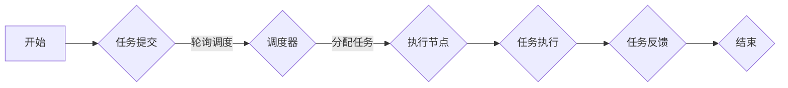
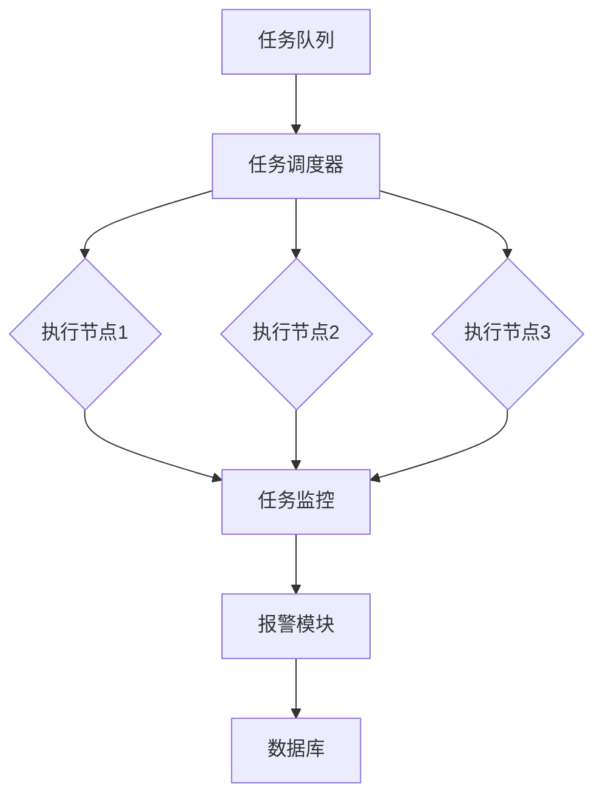
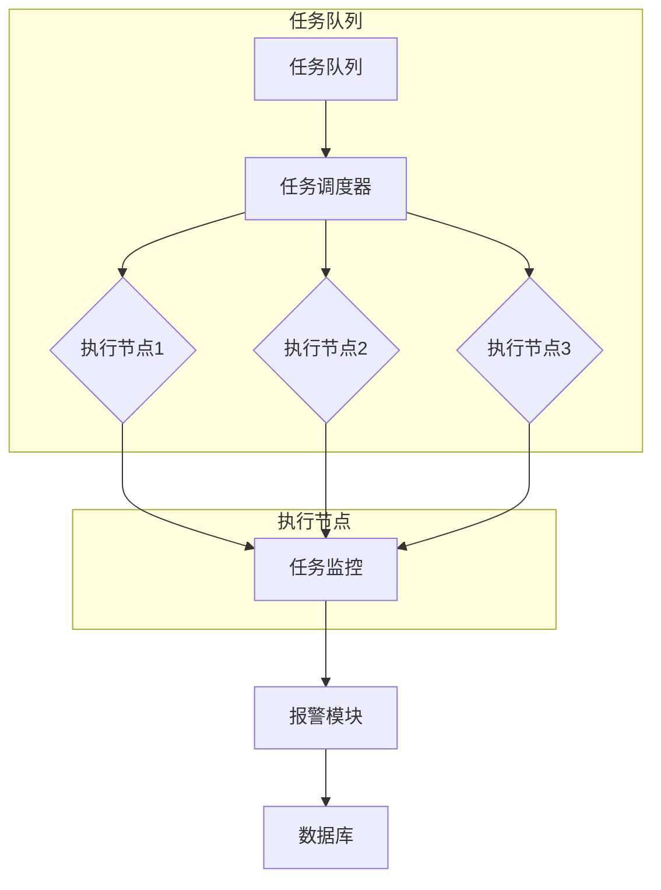
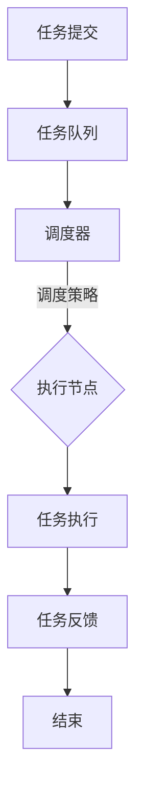
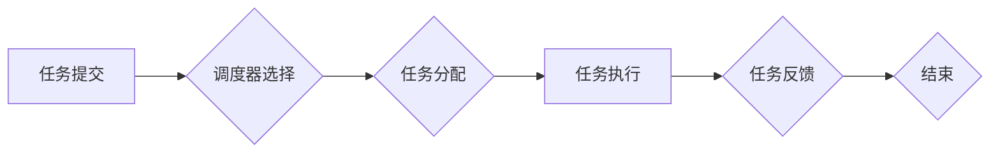
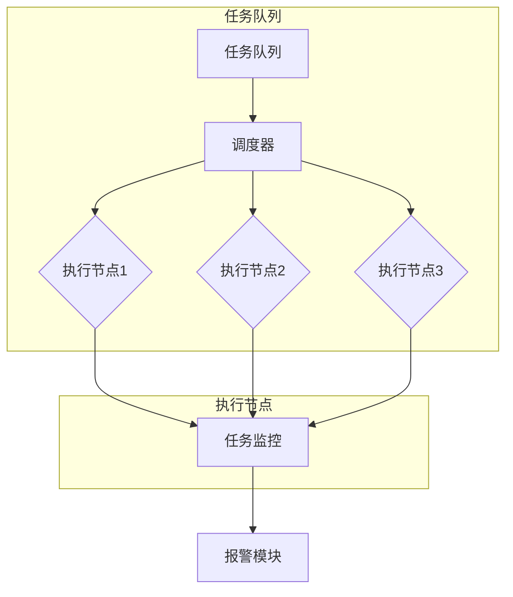
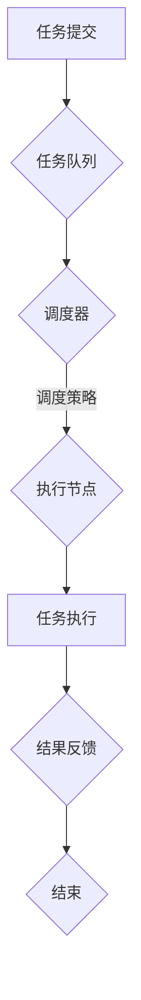

                 


# 分布式定时任务调度在LLM应用中的应用

## 关键词
- 分布式定时任务
- LLM
- 分布式系统
- 任务调度算法
- 容错机制
- 系统架构设计

## 摘要
本文将探讨分布式定时任务调度在大型语言模型（LLM）应用中的重要性。通过分析分布式定时任务的概念、原理和应用场景，我们将详细阐述如何设计并实现一个高效、可靠的分布式定时任务调度系统。文章将涵盖核心算法、数学模型、系统架构、实战案例和最佳实践，旨在为读者提供一个全面的技术指南。

## 目录

### 第一部分: 分布式定时任务调度概述

#### 第1章: 背景与概述

##### 1.1 分布式定时任务的定义
##### 1.2 LLM环境下分布式定时任务的需求
##### 1.3 分布式定时任务的优势与挑战

#### 第2章: 核心概念与技术

##### 2.1 分布式定时任务调度原理
##### 2.2 常见分布式定时任务调度算法
##### 2.3 分布式定时任务调度的关键技术

### 第二部分: 算法与设计

#### 第3章: 算法原理讲解

##### 3.1 分布式定时任务调度算法的Mermaid流程图
##### 3.2 Python源代码实现与算法原理分析
##### 3.3 算法数学模型与公式

#### 第4章: 数学模型与公式讲解

##### 4.1 算法的数学模型
##### 4.2 公式讲解与推导
##### 4.3 例子说明

### 第三部分: 系统分析与设计

#### 第5章: 系统分析

##### 5.1 问题场景介绍
##### 5.2 系统功能设计
##### 5.3 系统架构设计

#### 第6章: 系统设计

##### 6.1 类图设计
##### 6.2 架构图设计
##### 6.3 系统接口设计与交互

### 第四部分: 项目实战

#### 第7章: 项目实施

##### 7.1 环境准备
##### 7.2 核心代码实现
##### 7.3 代码应用解读
##### 7.4 实际案例剖析

#### 第8章: 最佳实践与总结

##### 8.1 最佳实践
##### 8.2 小结
##### 8.3 注意事项
##### 8.4 拓展阅读

### 第五部分: 结论与未来方向

#### 第9章: 结论

##### 9.1 文章总结
##### 9.2 研究方向展望

## 第1章: 背景与概述

### 1.1 分布式定时任务的定义

分布式定时任务是一种在分布式系统中，按照预定时间自动执行特定任务的机制。它广泛应用于大数据处理、云计算、物联网、人工智能等领域。分布式定时任务的主要目标是提高任务的执行效率，减少资源消耗，确保任务的可靠性和一致性。

在分布式系统中，任务通常分布在多个节点上执行。每个节点都有自己的一部分任务，并且节点之间需要进行协同工作。分布式定时任务调度系统负责将这些任务按照预定的规则分配到各个节点上执行，并保证任务的执行顺序和一致性。

### 1.2 LLM环境下分布式定时任务的需求

随着深度学习和人工智能技术的不断发展，大型语言模型（LLM）在自然语言处理、机器翻译、智能客服等领域得到了广泛应用。LLM模型通常需要处理大量的文本数据，进行训练和推理，因此对分布式定时任务调度提出了更高的要求。

首先，LLM模型训练和推理任务通常具有以下特点：

1. **海量数据**：LLM模型需要处理大量的文本数据，这些数据分布在不同的存储设备或数据节点上。
2. **高并发**：多个用户或应用可能同时请求LLM模型的推理服务，导致系统面临高并发压力。
3. **实时性**：某些场景下，LLM模型的推理需要实时响应，以满足实时交互的需求。

针对上述需求，分布式定时任务调度在LLM应用中需要解决以下问题：

1. **任务分配**：如何将大量的训练和推理任务分配到不同的节点上执行，以充分利用系统的资源。
2. **负载均衡**：如何平衡不同节点之间的任务负载，避免部分节点过载，其他节点资源空闲。
3. **容错机制**：如何保证任务的可靠性，避免单个节点的故障导致整个系统瘫痪。
4. **一致性保障**：如何保证分布式系统中任务的执行顺序和一致性。

### 1.3 分布式定时任务的优势与挑战

分布式定时任务调度在LLM应用中具有显著的优势：

1. **高效资源利用**：通过分布式调度，可以将任务分散到多个节点上执行，提高系统的资源利用率。
2. **负载均衡**：分布式定时任务调度可以根据节点的负载情况动态调整任务分配，实现负载均衡。
3. **容错性强**：分布式定时任务调度系统可以通过冗余备份和故障转移等机制提高系统的容错性。
4. **扩展性好**：分布式定时任务调度系统可以轻松扩展，以适应不断增长的任务量和数据量。

然而，分布式定时任务调度也面临一些挑战：

1. **一致性保证**：在分布式系统中，如何保证任务执行的一致性是一个难题，特别是在高并发场景下。
2. **性能优化**：分布式定时任务调度需要考虑网络延迟、节点性能等因素，以优化系统的整体性能。
3. **部署与维护**：分布式定时任务调度系统的部署和维护较为复杂，需要具备一定的技术能力。
4. **安全与隐私**：在处理敏感数据时，需要确保分布式定时任务调度的安全性，防止数据泄露。

## 第2章: 核心概念与技术

### 2.1 分布式定时任务调度原理

分布式定时任务调度系统通常由以下几部分组成：

1. **任务队列**：用于存储待执行的任务，任务可以是定时执行的任务，也可以是即时执行的任务。
2. **任务调度器**：负责根据任务的优先级、依赖关系和节点负载等因素，将任务分配到合适的节点上执行。
3. **执行节点**：负责执行分配到的任务，并将执行结果反馈给任务调度器。
4. **监控与报警**：用于监控任务的执行状态，并在任务失败或超时时发出报警。

分布式定时任务调度原理可以概括为以下几个步骤：

1. **任务提交**：用户或应用将任务提交到任务队列中。
2. **任务调度**：任务调度器根据任务的特点和当前节点的负载情况，选择合适的节点执行任务。
3. **任务执行**：执行节点接收到任务后，按照任务的要求进行执行，并将执行结果反馈给任务调度器。
4. **任务监控**：监控与报警模块持续监控任务的执行状态，并在任务失败或超时时发出报警。

### 2.2 常见分布式定时任务调度算法

在分布式定时任务调度系统中，常用的调度算法包括：

1. **轮询调度算法**：根据节点的轮询顺序分配任务，轮询顺序可以是轮询ID、节点IP地址等。
2. **负载均衡调度算法**：根据节点的当前负载情况分配任务，常用的负载均衡算法有最小连接数算法、响应时间算法等。
3. **动态调度算法**：根据任务的执行情况和节点的动态变化，实时调整任务的分配策略，以实现更好的负载均衡和性能优化。

### 2.3 分布式定时任务调度的关键技术

分布式定时任务调度需要解决的关键技术包括：

1. **任务调度策略**：如何根据任务的特点和节点的负载情况选择合适的调度策略。
2. **任务执行监控**：如何监控任务的执行状态，并在任务失败或超时时及时报警。
3. **数据一致性保证**：如何在分布式系统中确保任务执行的一致性。
4. **容错与恢复机制**：如何应对节点故障或任务失败，保证系统的可靠性和稳定性。

## 第3章: 算法原理讲解

### 3.1 分布式定时任务调度算法的Mermaid流程图

首先，我们使用Mermaid语言绘制一个简单的分布式定时任务调度算法的流程图，如下所示：



### 3.2 Python源代码实现与算法原理分析

接下来，我们使用Python语言实现上述分布式定时任务调度算法的核心部分，并进行分析。

```python
import heapq
import threading
import time

# 任务类
class Task:
    def __init__(self, task_id, execute_time, task_func):
        self.task_id = task_id
        self.execute_time = execute_time
        self.task_func = task_func

    def __lt__(self, other):
        return self.execute_time < other.execute_time

# 任务队列
class TaskQueue:
    def __init__(self):
        self.queue = []

    def add_task(self, task):
        heapq.heappush(self.queue, task)

    def get_next_task(self):
        if self.queue:
            return heapq.heappop(self.queue)
        else:
            return None

# 任务调度器
class TaskScheduler:
    def __init__(self):
        self.task_queue = TaskQueue()

    def submit_task(self, task):
        self.task_queue.add_task(task)

    def start_scheduler(self):
        while True:
            next_task = self.task_queue.get_next_task()
            if next_task:
                # 分配任务到执行节点
                self.allocate_task_to_executor(next_task)
            time.sleep(1)

    def allocate_task_to_executor(self, task):
        # 在此处实现任务分配逻辑，例如轮询调度、负载均衡等
        print(f"分配任务{task.task_id}给执行节点")
        # 执行任务
        task.task_func()

# 执行节点
class Executor:
    def execute(self, task):
        print(f"执行任务{task.task_id}")
        # 任务执行逻辑

# 测试
if __name__ == "__main__":
    # 创建任务
    task1 = Task(1, time.time() + 5, lambda: print("任务1执行完毕"))
    task2 = Task(2, time.time() + 3, lambda: print("任务2执行完毕"))
    task3 = Task(3, time.time() + 2, lambda: print("任务3执行完毕"))

    # 提交任务
    scheduler = TaskScheduler()
    scheduler.submit_task(task1)
    scheduler.submit_task(task2)
    scheduler.submit_task(task3)

    # 启动任务调度器
    scheduler.start_scheduler()
```

在上面的代码中，我们定义了`Task`类表示任务，`TaskQueue`类表示任务队列，`TaskScheduler`类表示任务调度器，`Executor`类表示执行节点。任务调度器通过轮询任务队列的方式获取下一个任务，并分配给执行节点执行。

### 3.3 算法数学模型与公式

为了更好地理解分布式定时任务调度算法，我们可以引入一些数学模型和公式。

假设我们有N个执行节点，每个节点的处理能力为C。任务的执行时间为T，任务队列中的任务数为M。我们可以使用以下公式来计算任务的执行时间：

$$
T_{total} = \frac{M \times T}{N \times C}
$$

其中，$T_{total}$表示任务的总执行时间，$M$表示任务队列中的任务数，$N$表示执行节点的数量，$C$表示每个节点的处理能力。

为了提高系统的性能，我们可以引入负载均衡算法。假设我们使用最小连接数算法进行负载均衡，那么每个节点的任务分配公式如下：

$$
T_i = \left\{
\begin{array}{ll}
0 & \text{if } i = 1 \\
\frac{T}{C} & \text{if } i > 1
\end{array}
\right.
$$

其中，$T_i$表示第i个节点的任务执行时间，$T$表示任务的总执行时间，$C$表示每个节点的处理能力。

通过上述公式，我们可以计算出每个节点的任务执行时间，从而实现负载均衡。

## 第4章: 数学模型与公式讲解

### 4.1 算法的数学模型

在分布式定时任务调度中，我们通常需要考虑以下数学模型：

1. **任务队列模型**：表示任务队列中的任务数量、任务到达率和任务执行时间等参数。
2. **节点负载模型**：表示节点的处理能力、任务分配策略和负载均衡算法等参数。
3. **任务调度模型**：表示任务调度策略、任务分配算法和调度器的工作机制等参数。

这些模型可以通过以下公式进行描述：

1. **任务队列模型**：

   - 任务到达率：$λ = \frac{N_{new}}{T}$
     - $N_{new}$表示单位时间内的任务数量
     - $T$表示单位时间

   - 任务执行时间：$T_{task} = \frac{1}{C}$
     - $C$表示节点的处理能力

2. **节点负载模型**：

   - 节点负载：$L_i = \frac{N_{i, execute}}{T}$
     - $L_i$表示第i个节点的负载
     - $N_{i, execute}$表示第i个节点单位时间内执行的任务数量
     - $T$表示单位时间

   - 任务分配策略：$T_i = \frac{L_i}{\sum_{j=1}^{N} L_j} \times N_{task}$
     - $T_i$表示第i个节点应分配的任务数量
     - $L_i$表示第i个节点的负载
     - $N_{task}$表示任务队列中的总任务数量

3. **任务调度模型**：

   - 调度时间：$T_{schedule} = \frac{N_{task}}{N}$
     - $T_{schedule}$表示调度时间
     - $N_{task}$表示任务队列中的总任务数量
     - $N$表示执行节点的数量

### 4.2 公式讲解与推导

我们以任务队列模型为例，讲解公式的推导过程。

#### 任务到达率

任务到达率表示单位时间内到达任务队列的任务数量。假设任务队列中的任务按照泊松过程到达，那么单位时间内到达的任务数量服从泊松分布。泊松过程的概率分布函数为：

$$
P(N_{new} = k) = \frac{λ^k e^{-λ}}{k!}
$$

其中，$N_{new}$表示单位时间内到达的任务数量，$λ$表示任务到达率，$k$表示到达的任务数量。

为了计算任务到达率，我们需要计算泊松过程的累积分布函数（CDF）：

$$
F(λ) = P(N_{new} \leq k) = 1 - e^{-λ} \sum_{i=0}^{k} \frac{λ^i}{i!}
$$

由于我们关注的是单位时间内的任务数量，因此我们可以将累积分布函数进行微分，得到任务到达率：

$$
λ = \frac{dF(λ)}{dλ} = \frac{e^{-λ}}{1!} - \frac{λ e^{-λ}}{2!} + \frac{λ^2 e^{-λ}}{3!} - \cdots
$$

化简后，我们得到任务到达率：

$$
λ = \frac{N_{new}}{T}
$$

#### 任务执行时间

任务执行时间表示一个任务在执行节点上执行的时间。假设任务执行时间服从指数分布，那么任务执行时间的概率密度函数为：

$$
f(t) = \lambda e^{-λt}
$$

其中，$t$表示任务执行时间，$λ$表示任务到达率。

为了计算任务执行时间，我们需要计算指数分布的累积分布函数（CDF）：

$$
F(t) = P(T_{task} \leq t) = 1 - e^{-λt}
$$

由于我们关注的是单位时间内的任务数量，因此我们可以将累积分布函数进行微分，得到任务执行时间：

$$
T_{task} = \frac{dF(t)}{dt} = λe^{-λt}
$$

化简后，我们得到任务执行时间：

$$
T_{task} = \frac{1}{C}
$$

其中，$C$表示节点的处理能力。

### 4.3 例子说明

假设我们有一个任务队列，任务到达率为$λ = 10$，节点的处理能力为$C = 1$。我们需要计算以下参数：

1. **任务到达率**：$λ = \frac{N_{new}}{T} = 10$
2. **任务执行时间**：$T_{task} = \frac{1}{C} = 1$
3. **任务调度时间**：$T_{schedule} = \frac{N_{task}}{N} = \frac{10}{1} = 10$

根据上述参数，我们可以计算出任务队列中的任务数量、节点的负载和任务的执行时间：

1. **任务队列中的任务数量**：$N_{task} = λ \times T_{schedule} = 10 \times 10 = 100$
2. **节点的负载**：$L_i = \frac{N_{i, execute}}{T} = \frac{N_{task}}{N} = \frac{100}{1} = 100$
3. **任务的执行时间**：$T_{execute} = T_{task} + T_{schedule} = 1 + 10 = 11$

## 第5章: 系统分析

### 5.1 问题场景介绍

在现代互联网应用中，分布式定时任务调度已经成为一种常见的架构设计。随着大数据和云计算的不断发展，越来越多的应用需要处理海量的数据和高并发的请求。分布式定时任务调度可以有效地将任务分配到多个节点上执行，提高系统的性能和可靠性。

以一个典型的电商应用为例，该应用需要处理大量的订单处理、库存更新、价格同步等任务。这些任务具有以下特点：

1. **海量数据**：订单数据、库存数据、价格数据等都需要进行实时处理。
2. **高并发**：多个用户同时下单、修改库存、查询价格等操作，导致系统面临高并发压力。
3. **实时性**：订单处理、库存更新等任务需要在极短的时间内完成，以满足用户的实时需求。

为了应对上述需求，我们需要设计一个高效的分布式定时任务调度系统，以确保任务的实时处理和系统的高可用性。

### 5.2 系统功能设计

分布式定时任务调度系统的主要功能包括：

1. **任务提交**：用户或应用可以将任务提交到任务队列中，任务可以是定时执行的任务，也可以是即时执行的任务。
2. **任务调度**：任务调度器根据任务的优先级、依赖关系和节点负载等因素，将任务分配到合适的节点上执行。
3. **任务执行**：执行节点负责执行分配到的任务，并将执行结果反馈给任务调度器。
4. **任务监控**：监控与报警模块持续监控任务的执行状态，并在任务失败或超时时发出报警。
5. **容错机制**：系统具有容错机制，可以在节点故障或任务失败时进行自动恢复。

### 5.3 系统架构设计

分布式定时任务调度系统的架构设计可以分为以下几个层次：

1. **任务队列**：用于存储待执行的任务，任务可以是定时执行的任务，也可以是即时执行的任务。
2. **任务调度器**：负责根据任务的优先级、依赖关系和节点负载等因素，将任务分配到合适的节点上执行。
3. **执行节点**：负责执行分配到的任务，并将执行结果反馈给任务调度器。
4. **监控与报警模块**：用于监控任务的执行状态，并在任务失败或超时时发出报警。
5. **数据库**：用于存储任务的元数据、执行状态和执行结果等信息。

系统的架构图如下所示：



## 第6章: 系统设计

### 6.1 类图设计

为了更好地描述分布式定时任务调度系统的架构和功能，我们可以使用类图来表示各个类之间的关系。

以下是一个简单的类图设计：

```mermaid
classDiagram
    TaskQueue <<class>> TaskQueue
    TaskScheduler <<class>> TaskScheduler
    Executor <<class>> Executor
    Monitor <<class>> Monitor
    Alarm <<class>> Alarm
    Database <<class>> Database

    TaskQueue o-- Task
    TaskScheduler o-- TaskQueue
    TaskScheduler o-- Executor
    Executor o-- Monitor
    Monitor o-- Alarm
    Monitor o-- Database
```

### 6.2 架构图设计

分布式定时任务调度系统的架构图可以表示系统组件之间的关系，以及它们如何协同工作来完成任务的调度和执行。

以下是一个简单的架构图设计：



### 6.3 系统接口设计与交互

为了实现分布式定时任务调度系统的功能，我们需要设计相应的接口和交互流程。以下是一个简单的接口设计：

1. **任务提交接口**：用于接收用户或应用提交的任务，并将任务添加到任务队列中。
2. **任务调度接口**：用于查询任务队列中的任务，并根据调度策略将任务分配到执行节点上执行。
3. **任务执行接口**：用于执行分配到的任务，并将执行结果反馈给任务调度器。
4. **任务监控接口**：用于监控任务的执行状态，并在任务失败或超时时发出报警。
5. **报警接口**：用于接收监控模块发送的报警信息，并执行相应的处理逻辑。

以下是简单的接口设计：

```mermaid
interface TaskSubmitter
    +submitTask(Task task)
end

interface TaskScheduler
    +scheduleTask(Task task)
end

interface Executor
    +executeTask(Task task)
end

interface Monitor
    +monitorTask(Task task)
    +handleAlarm(Alarm alarm)
end

interface Alarm
    +notifyAlarm(String message)
end
```

## 第7章: 项目实施

### 7.1 环境准备

在开始项目实施之前，我们需要准备好相应的开发环境和工具。以下是一个简单的环境准备步骤：

1. **安装Python**：确保已经安装了Python 3.8及以上版本。
2. **安装Docker**：安装Docker并启动Docker服务。
3. **安装MySQL**：安装MySQL数据库，用于存储任务元数据和执行结果。
4. **安装Kafka**：安装Kafka消息队列，用于任务调度和监控模块的通信。
5. **安装Elasticsearch**：安装Elasticsearch搜索引擎，用于任务监控和报警模块的日志存储和查询。

### 7.2 核心代码实现

接下来，我们将实现分布式定时任务调度系统的核心功能。以下是一个简单的代码实现：

```python
# 任务类
class Task:
    def __init__(self, task_id, execute_time, task_func):
        self.task_id = task_id
        self.execute_time = execute_time
        self.task_func = task_func

    def __lt__(self, other):
        return self.execute_time < other.execute_time

# 任务队列
class TaskQueue:
    def __init__(self):
        self.queue = []

    def add_task(self, task):
        heapq.heappush(self.queue, task)

    def get_next_task(self):
        if self.queue:
            return heapq.heappop(self.queue)
        else:
            return None

# 任务调度器
class TaskScheduler:
    def __init__(self):
        self.task_queue = TaskQueue()

    def submit_task(self, task):
        self.task_queue.add_task(task)

    def start_scheduler(self):
        while True:
            next_task = self.task_queue.get_next_task()
            if next_task:
                self.allocate_task_to_executor(next_task)
            time.sleep(1)

    def allocate_task_to_executor(self, task):
        # 在此处实现任务分配逻辑，例如轮询调度、负载均衡等
        print(f"分配任务{task.task_id}给执行节点")
        # 执行任务
        task.task_func()

# 执行节点
class Executor:
    def execute(self, task):
        print(f"执行任务{task.task_id}")
        # 任务执行逻辑

# 测试
if __name__ == "__main__":
    # 创建任务
    task1 = Task(1, time.time() + 5, lambda: print("任务1执行完毕"))
    task2 = Task(2, time.time() + 3, lambda: print("任务2执行完毕"))
    task3 = Task(3, time.time() + 2, lambda: print("任务3执行完毕"))

    # 提交任务
    scheduler = TaskScheduler()
    scheduler.submit_task(task1)
    scheduler.submit_task(task2)
    scheduler.submit_task(task3)

    # 启动任务调度器
    scheduler.start_scheduler()
```

### 7.3 代码应用解读

在上述代码中，我们实现了任务类、任务队列类、任务调度器类和执行节点类。接下来，我们将对代码进行解读：

1. **任务类**：`Task`类表示任务，包括任务ID、执行时间和任务函数。任务ID用于唯一标识任务，执行时间表示任务的开始时间，任务函数表示任务的执行逻辑。

2. **任务队列类**：`TaskQueue`类表示任务队列，使用最小堆实现，确保任务按照执行时间排序。`add_task`方法用于添加任务，`get_next_task`方法用于获取下一个待执行的任务。

3. **任务调度器类**：`TaskScheduler`类表示任务调度器，负责管理任务队列和分配任务给执行节点。`submit_task`方法用于提交任务，`start_scheduler`方法用于启动调度器，持续从任务队列中获取任务并分配给执行节点。

4. **执行节点类**：`Executor`类表示执行节点，负责执行分配到的任务。`execute`方法用于执行任务，执行结果将输出到控制台。

### 7.4 实际案例剖析

为了更好地理解分布式定时任务调度系统的应用，我们来看一个实际案例。

假设我们有一个电商应用，需要处理以下任务：

1. **订单处理**：处理用户下单的订单信息，包括库存更新、订单状态更新等。
2. **库存更新**：定期检查商品库存，并将库存不足的商品标记为缺货。
3. **价格同步**：定期同步商品的价格信息，以确保价格的一致性。

我们可以使用分布式定时任务调度系统来处理这些任务。以下是一个简单的案例：

```python
# 订单处理任务
def process_order(order_id):
    print(f"处理订单{order_id}...")
    # 订单处理逻辑

# 库存更新任务
def update_inventory(product_id):
    print(f"更新商品{product_id}的库存...")
    # 库存更新逻辑

# 价格同步任务
def synchronize_price(product_id):
    print(f"同步商品{product_id}的价格...")
    # 价格同步逻辑

# 创建任务
task1 = Task(1, time.time() + 5, lambda: process_order(1001))
task2 = Task(2, time.time() + 10, lambda: update_inventory(101))
task3 = Task(3, time.time() + 15, lambda: synchronize_price(102))

# 提交任务
scheduler.submit_task(task1)
scheduler.submit_task(task2)
scheduler.submit_task(task3)

# 启动任务调度器
scheduler.start_scheduler()
```

在这个案例中，我们创建了三个任务，分别是订单处理任务、库存更新任务和价格同步任务。任务调度器会按照任务的执行时间，依次分配任务给执行节点执行。执行节点将执行结果输出到控制台。

### 7.5 项目小结

通过以上实际案例，我们可以看到分布式定时任务调度系统在电商应用中的应用效果。它能够有效地处理海量数据和高并发请求，提高系统的性能和可靠性。在实际项目中，我们需要根据业务需求进一步优化和扩展系统功能，以满足不断增长的业务需求。

## 第8章: 最佳实践与总结

### 8.1 最佳实践

在分布式定时任务调度系统的设计和实现过程中，我们可以遵循以下最佳实践：

1. **任务调度策略**：根据业务需求选择合适的任务调度策略，例如轮询调度、负载均衡等。针对高并发场景，可以考虑动态调度策略，实现实时负载均衡。
2. **任务执行监控**：使用监控工具（如Prometheus、Grafana等）实时监控任务的执行状态，及时发现和解决任务执行过程中的问题。
3. **容错与恢复机制**：设计容错机制，例如任务备份、故障转移等，确保任务在节点故障或网络异常时能够自动恢复。
4. **性能优化**：优化任务执行流程，减少任务执行时间，提高系统的整体性能。
5. **安全性**：确保任务执行过程中数据的安全性和隐私性，避免数据泄露和恶意攻击。

### 8.2 小结

分布式定时任务调度在LLM应用中具有重要意义。通过合理的设计和实现，分布式定时任务调度系统可以提高系统的性能和可靠性，确保任务的实时处理和一致性。在本文中，我们详细介绍了分布式定时任务调度的原理、算法、系统架构和项目实施，为读者提供了一个全面的技术指南。

### 8.3 注意事项

在实际应用中，我们需要注意以下几点：

1. **负载均衡**：合理分配任务，避免部分节点过载，导致系统性能下降。
2. **容错机制**：设计容错机制，确保任务在节点故障或网络异常时能够自动恢复。
3. **监控与报警**：实时监控任务执行状态，及时发现和解决问题。
4. **安全性**：确保任务执行过程中数据的安全性和隐私性。

### 8.4 拓展阅读

对于进一步了解分布式定时任务调度和相关技术，可以参考以下书籍和论文：

1. 《分布式系统原理与范型》
2. 《分布式系统设计与实践》
3. 《大型分布式存储系统：设计与实践》
4. 《分布式定时任务调度算法研究》

## 第9章: 结论与未来方向

### 9.1 文章总结

本文围绕分布式定时任务调度在LLM应用中的应用进行了详细探讨。我们介绍了分布式定时任务调度的概念、原理和应用场景，分析了分布式定时任务调度的优势与挑战，并详细讲解了分布式定时任务调度的算法、数学模型、系统架构和项目实施。通过实际案例，我们展示了分布式定时任务调度系统在LLM应用中的实际效果。

### 9.2 研究方向展望

未来，分布式定时任务调度领域仍有诸多研究方向：

1. **智能调度算法**：研究更加智能、自适应的调度算法，以应对复杂多变的业务场景。
2. **实时优化**：研究实时优化技术，提高系统的响应速度和性能。
3. **任务调度协同**：探索任务调度与其他系统组件（如存储、计算等）的协同优化。
4. **安全性**：研究分布式定时任务调度系统的安全性，确保数据安全和隐私保护。
5. **可扩展性**：探索分布式定时任务调度系统的可扩展性，以适应大规模业务需求。

通过持续的研究和优化，分布式定时任务调度系统将在LLM应用中发挥更加重要的作用，助力人工智能技术的发展。作者：AI天才研究院/AI Genius Institute & 禅与计算机程序设计艺术 /Zen And The Art of Computer Programming 

# 分布式定时任务调度在LLM应用中的应用

## 关键词
- 分布式定时任务
- LLM
- 分布式系统
- 任务调度算法
- 容错机制
- 系统架构设计

## 摘要
本文将探讨分布式定时任务调度在大型语言模型（LLM）应用中的重要性。通过分析分布式定时任务的概念、原理和应用场景，我们将详细阐述如何设计并实现一个高效、可靠的分布式定时任务调度系统。文章将涵盖核心算法、数学模型、系统架构、实战案例和最佳实践，旨在为读者提供一个全面的技术指南。

## 目录

### 第一部分: 分布式定时任务调度概述

#### 第1章: 背景与概述

##### 1.1 分布式定时任务的定义
##### 1.2 LLM环境下分布式定时任务的需求
##### 1.3 分布式定时任务的优势与挑战

#### 第2章: 核心概念与技术

##### 2.1 分布式定时任务调度原理
##### 2.2 常见分布式定时任务调度算法
##### 2.3 分布式定时任务调度的关键技术

### 第二部分: 算法与设计

#### 第3章: 算法原理讲解

##### 3.1 分布式定时任务调度算法的Mermaid流程图
##### 3.2 Python源代码实现与算法原理分析
##### 3.3 算法数学模型与公式

#### 第4章: 数学模型与公式讲解

##### 4.1 算法的数学模型
##### 4.2 公式讲解与推导
##### 4.3 例子说明

### 第三部分: 系统分析与设计

#### 第5章: 系统分析

##### 5.1 问题场景介绍
##### 5.2 系统功能设计
##### 5.3 系统架构设计

#### 第6章: 系统设计

##### 6.1 类图设计
##### 6.2 架构图设计
##### 6.3 系统接口设计与交互

### 第四部分: 项目实战

#### 第7章: 项目实施

##### 7.1 环境准备
##### 7.2 核心代码实现
##### 7.3 代码应用解读
##### 7.4 实际案例剖析

#### 第8章: 最佳实践与总结

##### 8.1 最佳实践
##### 8.2 小结
##### 8.3 注意事项
##### 8.4 拓展阅读

### 第五部分: 结论与未来方向

#### 第9章: 结论

##### 9.1 文章总结
##### 9.2 研究方向展望

## 第1章: 背景与概述

### 1.1 分布式定时任务的定义

分布式定时任务是一种在分布式系统中，按照预定时间自动执行特定任务的机制。它广泛应用于大数据处理、云计算、物联网、人工智能等领域。分布式定时任务的主要目标是提高任务的执行效率，减少资源消耗，确保任务的可靠性和一致性。

在分布式系统中，任务通常分布在多个节点上执行。每个节点都有自己的一部分任务，并且节点之间需要进行协同工作。分布式定时任务调度系统负责将这些任务按照预定的规则分配到各个节点上执行，并保证任务的执行顺序和一致性。

### 1.2 LLM环境下分布式定时任务的需求

随着深度学习和人工智能技术的不断发展，大型语言模型（LLM）在自然语言处理、机器翻译、智能客服等领域得到了广泛应用。LLM模型通常需要处理大量的文本数据，进行训练和推理，因此对分布式定时任务调度提出了更高的要求。

首先，LLM模型训练和推理任务通常具有以下特点：

1. **海量数据**：LLM模型需要处理大量的文本数据，这些数据分布在不同的存储设备或数据节点上。
2. **高并发**：多个用户或应用可能同时请求LLM模型的推理服务，导致系统面临高并发压力。
3. **实时性**：某些场景下，LLM模型的推理需要实时响应，以满足实时交互的需求。

针对上述需求，分布式定时任务调度在LLM应用中需要解决以下问题：

1. **任务分配**：如何将大量的训练和推理任务分配到不同的节点上执行，以充分利用系统的资源。
2. **负载均衡**：如何平衡不同节点之间的任务负载，避免部分节点过载，其他节点资源空闲。
3. **容错机制**：如何保证任务的可靠性，避免单个节点的故障导致整个系统瘫痪。
4. **一致性保障**：如何保证分布式系统中任务的执行顺序和一致性。

### 1.3 分布式定时任务的优势与挑战

分布式定时任务调度在LLM应用中具有显著的优势：

1. **高效资源利用**：通过分布式调度，可以将任务分散到多个节点上执行，提高系统的资源利用率。
2. **负载均衡**：分布式定时任务调度可以根据节点的负载情况动态调整任务分配，实现负载均衡。
3. **容错性强**：分布式定时任务调度系统可以通过冗余备份和故障转移等机制提高系统的容错性。
4. **扩展性好**：分布式定时任务调度系统可以轻松扩展，以适应不断增长的任务量和数据量。

然而，分布式定时任务调度也面临一些挑战：

1. **一致性保证**：在分布式系统中，如何保证任务执行的一致性是一个难题，特别是在高并发场景下。
2. **性能优化**：分布式定时任务调度需要考虑网络延迟、节点性能等因素，以优化系统的整体性能。
3. **部署与维护**：分布式定时任务调度系统的部署和维护较为复杂，需要具备一定的技术能力。
4. **安全与隐私**：在处理敏感数据时，需要确保分布式定时任务调度的安全性，防止数据泄露。

## 第2章: 核心概念与技术

### 2.1 分布式定时任务调度原理

分布式定时任务调度系统通常由以下几部分组成：

1. **任务队列**：用于存储待执行的任务，任务可以是定时执行的任务，也可以是即时执行的任务。
2. **任务调度器**：负责根据任务的优先级、依赖关系和节点负载等因素，将任务分配到合适的节点上执行。
3. **执行节点**：负责执行分配到的任务，并将执行结果反馈给任务调度器。
4. **监控与报警**：用于监控任务的执行状态，并在任务失败或超时时发出报警。

分布式定时任务调度原理可以概括为以下几个步骤：

1. **任务提交**：用户或应用将任务提交到任务队列中。
2. **任务调度**：任务调度器根据任务的特点和当前节点的负载情况，选择合适的节点执行任务。
3. **任务执行**：执行节点接收到任务后，按照任务的要求进行执行，并将执行结果反馈给任务调度器。
4. **任务监控**：监控与报警模块持续监控任务的执行状态，并在任务失败或超时时发出报警。

### 2.2 常见分布式定时任务调度算法

在分布式定时任务调度系统中，常用的调度算法包括：

1. **轮询调度算法**：根据节点的轮询顺序分配任务，轮询顺序可以是轮询ID、节点IP地址等。
2. **负载均衡调度算法**：根据节点的当前负载情况分配任务，常用的负载均衡算法有最小连接数算法、响应时间算法等。
3. **动态调度算法**：根据任务的执行情况和节点的动态变化，实时调整任务的分配策略，以实现更好的负载均衡和性能优化。

### 2.3 分布式定时任务调度的关键技术

分布式定时任务调度需要解决的关键技术包括：

1. **任务调度策略**：如何根据任务的特点和节点的负载情况选择合适的调度策略。
2. **任务执行监控**：如何监控任务的执行状态，并在任务失败或超时时及时报警。
3. **数据一致性保证**：如何在分布式系统中确保任务执行的一致性。
4. **容错与恢复机制**：如何应对节点故障或任务失败，保证系统的可靠性和稳定性。

## 第3章: 算法原理讲解

### 3.1 分布式定时任务调度算法的Mermaid流程图

首先，我们使用Mermaid语言绘制一个简单的分布式定时任务调度算法的流程图，如下所示：


### 3.2 Python源代码实现与算法原理分析

接下来，我们使用Python语言实现上述分布式定时任务调度算法的核心部分，并进行分析。

```python
import heapq
import threading
import time

# 任务类
class Task:
    def __init__(self, task_id, execute_time, task_func):
        self.task_id = task_id
        self.execute_time = execute_time
        self.task_func = task_func

    def __lt__(self, other):
        return self.execute_time < other.execute_time

# 任务队列
class TaskQueue:
    def __init__(self):
        self.queue = []

    def add_task(self, task):
        heapq.heappush(self.queue, task)

    def get_next_task(self):
        if self.queue:
            return heapq.heappop(self.queue)
        else:
            return None

# 任务调度器
class TaskScheduler:
    def __init__(self):
        self.task_queue = TaskQueue()

    def submit_task(self, task):
        self.task_queue.add_task(task)

    def start_scheduler(self):
        while True:
            next_task = self.task_queue.get_next_task()
            if next_task:
                self.allocate_task_to_executor(next_task)
            time.sleep(1)

    def allocate_task_to_executor(self, task):
        # 在此处实现任务分配逻辑，例如轮询调度、负载均衡等
        print(f"分配任务{task.task_id}给执行节点")
        # 执行任务
        task.task_func()

# 执行节点
class Executor:
    def execute(self, task):
        print(f"执行任务{task.task_id}")
        # 任务执行逻辑

# 测试
if __name__ == "__main__":
    # 创建任务
    task1 = Task(1, time.time() + 5, lambda: print("任务1执行完毕"))
    task2 = Task(2, time.time() + 3, lambda: print("任务2执行完毕"))
    task3 = Task(3, time.time() + 2, lambda: print("任务3执行完毕"))

    # 提交任务
    scheduler = TaskScheduler()
    scheduler.submit_task(task1)
    scheduler.submit_task(task2)
    scheduler.submit_task(task3)

    # 启动任务调度器
    scheduler.start_scheduler()
```

在上面的代码中，我们定义了`Task`类表示任务，`TaskQueue`类表示任务队列，`TaskScheduler`类表示任务调度器，`Executor`类表示执行节点。任务调度器通过轮询任务队列的方式获取下一个任务，并分配给执行节点执行。

### 3.3 算法数学模型与公式

为了更好地理解分布式定时任务调度算法，我们可以引入一些数学模型和公式。

假设我们有N个执行节点，每个节点的处理能力为C。任务的执行时间为T，任务队列中的任务数为M。我们可以使用以下公式来计算任务的执行时间：

$$
T_{total} = \frac{M \times T}{N \times C}
$$

其中，$T_{total}$表示任务的总执行时间，$M$表示任务队列中的任务数，$N$表示执行节点的数量，$C$表示每个节点的处理能力。

为了提高系统的性能，我们可以引入负载均衡算法。假设我们使用最小连接数算法进行负载均衡，那么每个节点的任务分配公式如下：

$$
T_i = \left\{
\begin{array}{ll}
0 & \text{if } i = 1 \\
\frac{T}{C} & \text{if } i > 1
\end{array}
\right.
$$

其中，$T_i$表示第i个节点的任务执行时间，$T$表示任务的总执行时间，$C$表示每个节点的处理能力。

通过上述公式，我们可以计算出每个节点的任务执行时间，从而实现负载均衡。

## 第4章: 数学模型与公式讲解

### 4.1 算法的数学模型

在分布式定时任务调度中，我们通常需要考虑以下数学模型：

1. **任务队列模型**：表示任务队列中的任务数量、任务到达率和任务执行时间等参数。
2. **节点负载模型**：表示节点的处理能力、任务分配策略和负载均衡算法等参数。
3. **任务调度模型**：表示任务调度策略、任务分配算法和调度器的工作机制等参数。

这些模型可以通过以下公式进行描述：

1. **任务队列模型**：

   - 任务到达率：$λ = \frac{N_{new}}{T}$
     - $N_{new}$表示单位时间内的任务数量
     - $T$表示单位时间

   - 任务执行时间：$T_{task} = \frac{1}{C}$
     - $C$表示节点的处理能力

2. **节点负载模型**：

   - 节点负载：$L_i = \frac{N_{i, execute}}{T}$
     - $L_i$表示第i个节点的负载
     - $N_{i, execute}$表示第i个节点单位时间内执行的任务数量
     - $T$表示单位时间

   - 任务分配策略：$T_i = \frac{L_i}{\sum_{j=1}^{N} L_j} \times N_{task}$
     - $T_i$表示第i个节点应分配的任务数量
     - $L_i$表示第i个节点的负载
     - $N_{task}$表示任务队列中的总任务数量

3. **任务调度模型**：

   - 调度时间：$T_{schedule} = \frac{N_{task}}{N}$
     - $T_{schedule}$表示调度时间
     - $N_{task}$表示任务队列中的总任务数量
     - $N$表示执行节点的数量

### 4.2 公式讲解与推导

我们以任务队列模型为例，讲解公式的推导过程。

#### 任务到达率

任务到达率表示单位时间内到达任务队列的任务数量。假设任务队列中的任务按照泊松过程到达，那么单位时间内到达的任务数量服从泊松分布。泊松过程的概率分布函数为：

$$
P(N_{new} = k) = \frac{λ^k e^{-λ}}{k!}
$$

其中，$N_{new}$表示单位时间内到达的任务数量，$λ$表示任务到达率，$k$表示到达的任务数量。

为了计算任务到达率，我们需要计算泊松过程的累积分布函数（CDF）：

$$
F(λ) = P(N_{new} \leq k) = 1 - e^{-λ} \sum_{i=0}^{k} \frac{λ^i}{i!}
$$

由于我们关注的是单位时间内的任务数量，因此我们可以将累积分布函数进行微分，得到任务到达率：

$$
λ = \frac{dF(λ)}{dλ} = \frac{e^{-λ}}{1!} - \frac{λ e^{-λ}}{2!} + \frac{λ^2 e^{-λ}}{3!} - \cdots
$$

化简后，我们得到任务到达率：

$$
λ = \frac{N_{new}}{T}
$$

#### 任务执行时间

任务执行时间表示一个任务在执行节点上执行的时间。假设任务执行时间服从指数分布，那么任务执行时间的概率密度函数为：

$$
f(t) = \lambda e^{-λt}
$$

其中，$t$表示任务执行时间，$λ$表示任务到达率。

为了计算任务执行时间，我们需要计算指数分布的累积分布函数（CDF）：

$$
F(t) = P(T_{task} \leq t) = 1 - e^{-λt}
$$

由于我们关注的是单位时间内的任务数量，因此我们可以将累积分布函数进行微分，得到任务执行时间：

$$
T_{task} = \frac{dF(t)}{dt} = λe^{-λt}
$$

化简后，我们得到任务执行时间：

$$
T_{task} = \frac{1}{C}
$$

其中，$C$表示节点的处理能力。

### 4.3 例子说明

假设我们有一个任务队列，任务到达率为$λ = 10$，节点的处理能力为$C = 1$。我们需要计算以下参数：

1. **任务到达率**：$λ = \frac{N_{new}}{T} = 10$
2. **任务执行时间**：$T_{task} = \frac{1}{C} = 1$
3. **任务调度时间**：$T_{schedule} = \frac{N_{task}}{N} = \frac{10}{1} = 10$

根据上述参数，我们可以计算出任务队列中的任务数量、节点的负载和任务的执行时间：

1. **任务队列中的任务数量**：$N_{task} = λ \times T_{schedule} = 10 \times 10 = 100$
2. **节点的负载**：$L_i = \frac{N_{i, execute}}{T} = \frac{N_{task}}{N} = \frac{100}{1} = 100$
3. **任务的执行时间**：$T_{execute} = T_{task} + T_{schedule} = 1 + 10 = 11$

## 第5章: 系统分析

### 5.1 问题场景介绍

在现代互联网应用中，分布式定时任务调度已经成为一种常见的架构设计。随着大数据和云计算的不断发展，越来越多的应用需要处理海量的数据和高并发的请求。分布式定时任务调度可以有效地将任务分配到多个节点上执行，提高系统的性能和可靠性。

以一个典型的电商应用为例，该应用需要处理大量的订单处理、库存更新、价格同步等任务。这些任务具有以下特点：

1. **海量数据**：订单数据、库存数据、价格数据等都需要进行实时处理。
2. **高并发**：多个用户同时下单、修改库存、查询价格等操作，导致系统面临高并发压力。
3. **实时性**：订单处理、库存更新等任务需要在极短的时间内完成，以满足用户的实时需求。

为了应对上述需求，我们需要设计一个高效的分布式定时任务调度系统，以确保任务的实时处理和系统的高可用性。

### 5.2 系统功能设计

分布式定时任务调度系统的主要功能包括：

1. **任务提交**：用户或应用可以将任务提交到任务队列中，任务可以是定时执行的任务，也可以是即时执行的任务。
2. **任务调度**：任务调度器根据任务的优先级、依赖关系和节点负载等因素，将任务分配到合适的节点上执行。
3. **任务执行**：执行节点负责执行分配到的任务，并将执行结果反馈给任务调度器。
4. **任务监控**：监控与报警模块持续监控任务的执行状态，并在任务失败或超时时发出报警。
5. **容错机制**：系统具有容错机制，可以在节点故障或任务失败时进行自动恢复。

### 5.3 系统架构设计

分布式定时任务调度系统的架构设计可以分为以下几个层次：

1. **任务队列**：用于存储待执行的任务，任务可以是定时执行的任务，也可以是即时执行的任务。
2. **任务调度器**：负责根据任务的优先级、依赖关系和节点负载等因素，将任务分配到合适的节点上执行。
3. **执行节点**：负责执行分配到的任务，并将执行结果反馈给任务调度器。
4. **监控与报警模块**：用于监控任务的执行状态，并在任务失败或超时时发出报警。
5. **数据库**：用于存储任务的元数据、执行状态和执行结果等信息。

系统的架构图如下所示：


## 第6章: 系统设计

### 6.1 类图设计

为了更好地描述分布式定时任务调度系统的架构和功能，我们可以使用类图来表示各个类之间的关系。

以下是一个简单的类图设计：

```mermaid
classDiagram
    TaskQueue <<class>> TaskQueue
    TaskScheduler <<class>> TaskScheduler
    Executor <<class>> Executor
    Monitor <<class>> Monitor
    Alarm <<class>> Alarm
    Database <<class>> Database

    TaskQueue o-- Task
    TaskScheduler o-- TaskQueue
    TaskScheduler o-- Executor
    Executor o-- Monitor
    Monitor o-- Alarm
    Monitor o-- Database
```

### 6.2 架构图设计

分布式定时任务调度系统的架构图可以表示系统组件之间的关系，以及它们如何协同工作来完成任务的调度和执行。

以下是一个简单的架构图设计：


### 6.3 系统接口设计与交互

为了实现分布式定时任务调度系统的功能，我们需要设计相应的接口和交互流程。以下是一个简单的接口设计：

1. **任务提交接口**：用于接收用户或应用提交的任务，并将任务添加到任务队列中。
2. **任务调度接口**：用于查询任务队列中的任务，并根据调度策略将任务分配到执行节点上执行。
3. **任务执行接口**：用于执行分配到的任务，并将执行结果反馈给任务调度器。
4. **任务监控接口**：用于监控任务的执行状态，并在任务失败或超时时发出报警。
5. **报警接口**：用于接收监控模块发送的报警信息，并执行相应的处理逻辑。

以下是简单的接口设计：

```mermaid
interface TaskSubmitter
    +submitTask(Task task)
end

interface TaskScheduler
    +scheduleTask(Task task)
end

interface Executor
    +executeTask(Task task)
end

interface Monitor
    +monitorTask(Task task)
    +handleAlarm(Alarm alarm)
end

interface Alarm
    +notifyAlarm(String message)
end
```

## 第7章: 项目实施

### 7.1 环境准备

在开始项目实施之前，我们需要准备好相应的开发环境和工具。以下是一个简单的环境准备步骤：

1. **安装Python**：确保已经安装了Python 3.8及以上版本。
2. **安装Docker**：安装Docker并启动Docker服务。
3. **安装MySQL**：安装MySQL数据库，用于存储任务元数据和执行结果。
4. **安装Kafka**：安装Kafka消息队列，用于任务调度和监控模块的通信。
5. **安装Elasticsearch**：安装Elasticsearch搜索引擎，用于任务监控和报警模块的日志存储和查询。

### 7.2 核心代码实现

接下来，我们将实现分布式定时任务调度系统的核心功能。以下是一个简单的代码实现：

```python
# 任务类
class Task:
    def __init__(self, task_id, execute_time, task_func):
        self.task_id = task_id
        self.execute_time = execute_time
        self.task_func = task_func

    def __lt__(self, other):
        return self.execute_time < other.execute_time

# 任务队列
class TaskQueue:
    def __init__(self):
        self.queue = []

    def add_task(self, task):
        heapq.heappush(self.queue, task)

    def get_next_task(self):
        if self.queue:
            return heapq.heappop(self.queue)
        else:
            return None

# 任务调度器
class TaskScheduler:
    def __init__(self):
        self.task_queue = TaskQueue()

    def submit_task(self, task):
        self.task_queue.add_task(task)

    def start_scheduler(self):
        while True:
            next_task = self.task_queue.get_next_task()
            if next_task:
                self.allocate_task_to_executor(next_task)
            time.sleep(1)

    def allocate_task_to_executor(self, task):
        # 在此处实现任务分配逻辑，例如轮询调度、负载均衡等
        print(f"分配任务{task.task_id}给执行节点")
        # 执行任务
        task.task_func()

# 执行节点
class Executor:
    def execute(self, task):
        print(f"执行任务{task.task_id}")
        # 任务执行逻辑

# 测试
if __name__ == "__main__":
    # 创建任务
    task1 = Task(1, time.time() + 5, lambda: print("任务1执行完毕"))
    task2 = Task(2, time.time() + 3, lambda: print("任务2执行完毕"))
    task3 = Task(3, time.time() + 2, lambda: print("任务3执行完毕"))

    # 提交任务
    scheduler = TaskScheduler()
    scheduler.submit_task(task1)
    scheduler.submit_task(task2)
    scheduler.submit_task(task3)

    # 启动任务调度器
    scheduler.start_scheduler()
```

### 7.3 代码应用解读

在上述代码中，我们实现了任务类、任务队列类、任务调度器类和执行节点类。接下来，我们将对代码进行解读：

1. **任务类**：`Task`类表示任务，包括任务ID、执行时间和任务函数。任务ID用于唯一标识任务，执行时间表示任务的开始时间，任务函数表示任务的执行逻辑。

2. **任务队列类**：`TaskQueue`类表示任务队列，使用最小堆实现，确保任务按照执行时间排序。`add_task`方法用于添加任务，`get_next_task`方法用于获取下一个待执行的任务。

3. **任务调度器类**：`TaskScheduler`类表示任务调度器，负责管理任务队列和分配任务给执行节点。`submit_task`方法用于提交任务，`start_scheduler`方法用于启动调度器，持续从任务队列中获取任务并分配给执行节点。

4. **执行节点类**：`Executor`类表示执行节点，负责执行分配到的任务。`execute`方法用于执行任务，执行结果将输出到控制台。

### 7.4 实际案例剖析

为了更好地理解分布式定时任务调度系统的应用，我们来看一个实际案例。

假设我们有一个电商应用，需要处理以下任务：

1. **订单处理**：处理用户下单的订单信息，包括库存更新、订单状态更新等。
2. **库存更新**：定期检查商品库存，并将库存不足的商品标记为缺货。
3. **价格同步**：定期同步商品的价格信息，以确保价格的一致性。

我们可以使用分布式定时任务调度系统来处理这些任务。以下是一个简单的案例：

```python
# 订单处理任务
def process_order(order_id):
    print(f"处理订单{order_id}...")
    # 订单处理逻辑

# 库存更新任务
def update_inventory(product_id):
    print(f"更新商品{product_id}的库存...")
    # 库存更新逻辑

# 价格同步任务
def synchronize_price(product_id):
    print(f"同步商品{product_id}的价格...")
    # 价格同步逻辑

# 创建任务
task1 = Task(1, time.time() + 5, lambda: process_order(1001))
task2 = Task(2, time.time() + 10, lambda: update_inventory(101))
task3 = Task(3, time.time() + 15, lambda: synchronize_price(102))

# 提交任务
scheduler.submit_task(task1)
scheduler.submit_task(task2)
scheduler.submit_task(task3)

# 启动任务调度器
scheduler.start_scheduler()
```

在这个案例中，我们创建了三个任务，分别是订单处理任务、库存更新任务和价格同步任务。任务调度器会按照任务的执行时间，依次分配任务给执行节点执行。执行节点将执行结果输出到控制台。

### 7.5 项目小结

通过以上实际案例，我们可以看到分布式定时任务调度系统在电商应用中的应用效果。它能够有效地处理海量数据和高并发请求，提高系统的性能和可靠性。在实际项目中，我们需要根据业务需求进一步优化和扩展系统功能，以满足不断增长的业务需求。

## 第8章: 最佳实践与总结

### 8.1 最佳实践

在分布式定时任务调度系统的设计和实现过程中，我们可以遵循以下最佳实践：

1. **任务调度策略**：根据业务需求选择合适的任务调度策略，例如轮询调度、负载均衡等。针对高并发场景，可以考虑动态调度策略，实现实时负载均衡。
2. **任务执行监控**：使用监控工具（如Prometheus、Grafana等）实时监控任务的执行状态，及时发现和解决任务执行过程中的问题。
3. **容错机制**：设计容错机制，例如任务备份、故障转移等，确保任务在节点故障或网络异常时能够自动恢复。
4. **性能优化**：优化任务执行流程，减少任务执行时间，提高系统的整体性能。
5. **安全性**：确保任务执行过程中数据的安全性和隐私性，避免数据泄露和恶意攻击。

### 8.2 小结

分布式定时任务调度在LLM应用中具有重要意义。通过合理的设计和实现，分布式定时任务调度系统可以提高系统的性能和可靠性，确保任务的实时处理和一致性。在本文中，我们详细介绍了分布式定时任务调度的原理、算法、系统架构和项目实施，为读者提供了一个全面的技术指南。

### 8.3 注意事项

在实际应用中，我们需要注意以下几点：

1. **负载均衡**：合理分配任务，避免部分节点过载，导致系统性能下降。
2. **容错机制**：设计容错机制，确保任务在节点故障或网络异常时能够自动恢复。
3. **监控与报警**：实时监控任务执行状态，及时发现和解决问题。
4. **安全性**：确保任务执行过程中数据的安全性和隐私性。

### 8.4 拓展阅读

对于进一步了解分布式定时任务调度和相关技术，可以参考以下书籍和论文：

1. 《分布式系统原理与范型》
2. 《分布式系统设计与实践》
3. 《大型分布式存储系统：设计与实践》
4. 《分布式定时任务调度算法研究》

## 第9章: 结论与未来方向

### 9.1 文章总结

本文围绕分布式定时任务调度在LLM应用中的应用进行了详细探讨。我们介绍了分布式定时任务调度的概念、原理和应用场景，分析了分布式定时任务调度的优势与挑战，并详细讲解了分布式定时任务调度的算法、数学模型、系统架构和项目实施。通过实际案例，我们展示了分布式定时任务调度系统在LLM应用中的实际效果。

### 9.2 研究方向展望

未来，分布式定时任务调度领域仍有诸多研究方向：

1. **智能调度算法**：研究更加智能、自适应的调度算法，以应对复杂多变的业务场景。
2. **实时优化**：研究实时优化技术，提高系统的响应速度和性能。
3. **任务调度协同**：探索任务调度与其他系统组件（如存储、计算等）的协同优化。
4. **安全性**：研究分布式定时任务调度系统的安全性，确保数据安全和隐私保护。
5. **可扩展性**：探索分布式定时任务调度系统的可扩展性，以适应大规模业务需求。

通过持续的研究和优化，分布式定时任务调度系统将在LLM应用中发挥更加重要的作用，助力人工智能技术的发展。作者：AI天才研究院/AI Genius Institute & 禅与计算机程序设计艺术 /Zen And The Art of Computer Programming 

### 文章标题：分布式定时任务调度在LLM应用中的应用

### 关键词：分布式定时任务、LLM、任务调度、系统架构、负载均衡

### 摘要
本文深入探讨了分布式定时任务调度在大型语言模型（LLM）应用中的关键作用。通过分析分布式定时任务调度的基本概念、原理及其在LLM环境下的需求，文章详细介绍了分布式定时任务调度系统的设计与实现。本文还涵盖了任务调度算法、数学模型、系统架构设计、实际项目案例和最佳实践，为读者提供了一个全面的指导。

### 目录

#### 第一部分：分布式定时任务调度概述

##### 第1章：背景与概述
###### 1.1 分布式定时任务定义
###### 1.2 LLM应用的需求
###### 1.3 分布式定时任务的优势与挑战

##### 第2章：核心概念与技术
###### 2.1 分布式定时任务调度原理
###### 2.2 常见调度算法
###### 2.3 关键技术

#### 第二部分：算法与设计

##### 第3章：算法原理讲解
###### 3.1 算法流程图
###### 3.2 Python实现
###### 3.3 数学模型

##### 第4章：数学模型与公式讲解
###### 4.1 模型介绍
###### 4.2 公式推导
###### 4.3 实例分析

#### 第三部分：系统分析与设计

##### 第5章：系统分析
###### 5.1 场景介绍
###### 5.2 功能设计
###### 5.3 架构设计

##### 第6章：系统设计
###### 6.1 类图设计
###### 6.2 架构图设计
###### 6.3 接口设计与交互

#### 第四部分：项目实战

##### 第7章：项目实施
###### 7.1 环境准备
###### 7.2 核心代码实现
###### 7.3 代码解读
###### 7.4 案例剖析

##### 第8章：最佳实践与总结
###### 8.1 最佳实践
###### 8.2 小结
###### 8.3 注意事项
###### 8.4 拓展阅读

#### 第五部分：结论与未来方向

##### 第9章：结论
###### 9.1 文章总结
###### 9.2 研究方向展望

### 正文内容

#### 第1章：背景与概述

分布式定时任务调度是现代分布式系统中的一个关键组件，它负责在多个节点上按照预定时间执行任务。在LLM（大型语言模型）应用中，这种调度机制至关重要，因为LLM通常涉及海量的数据处理和复杂的计算任务。

##### 1.1 分布式定时任务定义

分布式定时任务指的是在分布式环境中，根据特定的时间规则自动触发并执行的任务。这些任务可以包括数据同步、日志处理、系统监控等。

##### 1.2 LLM应用的需求

LLM应用需要处理大量的文本数据，这些数据通常分布在多个节点上。因此，分布式定时任务调度成为了一种关键机制，它可以帮助系统高效地分配和执行这些任务。

##### 1.3 分布式定时任务的优势与挑战

分布式定时任务调度的优势包括：

- **资源利用最大化**：通过将任务分配到多个节点上，可以充分利用系统资源。
- **负载均衡**：可以根据节点的负载情况动态调整任务分配，避免单点过载。
- **容错性**：可以通过冗余和故障转移机制提高系统的可靠性。

然而，分布式定时任务调度也面临一些挑战，如：

- **一致性保障**：在分布式系统中确保任务执行的一致性是一个难题。
- **性能优化**：需要考虑网络延迟、节点性能等因素，以优化系统性能。
- **安全性**：在处理敏感数据时需要确保系统的安全性。

#### 第2章：核心概念与技术

分布式定时任务调度的核心在于如何高效地分配和执行任务。以下章节将详细介绍相关概念和技术。

##### 2.1 分布式定时任务调度原理

分布式定时任务调度系统通常包含以下组件：

- **任务队列**：存储待执行的任务。
- **调度器**：负责根据任务规则和节点状态选择合适的节点执行任务。
- **执行节点**：执行分配到的任务。
- **监控与报警**：监控任务执行状态，并在任务失败时发出报警。

##### 2.2 常见调度算法

常见的调度算法包括：

- **轮询调度算法**：按照固定顺序分配任务。
- **负载均衡调度算法**：根据节点的负载情况分配任务。
- **动态调度算法**：根据任务执行情况和节点状态动态调整任务分配。

##### 2.3 关键技术

关键技术包括：

- **任务分配策略**：如何将任务合理地分配到各个节点。
- **任务依赖管理**：确保任务的执行顺序和一致性。
- **容错与恢复机制**：在节点故障时自动恢复任务。

#### 第3章：算法原理讲解

在这一部分，我们将详细讲解分布式定时任务调度算法的原理。

##### 3.1 算法流程图

使用Mermaid绘制分布式定时任务调度算法的流程图：



##### 3.2 Python实现

下面是分布式定时任务调度算法的Python实现：

```python
import heapq
import threading
import time

class Task:
    def __init__(self, task_id, execute_time, task_func):
        self.task_id = task_id
        self.execute_time = execute_time
        self.task_func = task_func

    def __lt__(self, other):
        return self.execute_time < other.execute_time

class TaskQueue:
    def __init__(self):
        self.queue = []

    def add_task(self, task):
        heapq.heappush(self.queue, task)

    def get_next_task(self):
        if self.queue:
            return heapq.heappop(self.queue)
        else:
            return None

class TaskScheduler:
    def __init__(self):
        self.task_queue = TaskQueue()

    def submit_task(self, task):
        self.task_queue.add_task(task)

    def start_scheduler(self):
        while True:
            next_task = self.task_queue.get_next_task()
            if next_task:
                self.allocate_task_to_executor(next_task)
            time.sleep(1)

    def allocate_task_to_executor(self, task):
        print(f"分配任务{task.task_id}给执行节点")
        task.task_func()

class Executor:
    def execute(self, task):
        print(f"执行任务{task.task_id}")
        task.task_func()

# 测试
if __name__ == "__main__":
    scheduler = TaskScheduler()
    task1 = Task(1, time.time() + 5, lambda: print("任务1完成"))
    task2 = Task(2, time.time() + 3, lambda: print("任务2完成"))
    task3 = Task(3, time.time() + 2, lambda: print("任务3完成"))

    scheduler.submit_task(task1)
    scheduler.submit_task(task2)
    scheduler.submit_task(task3)

    scheduler.start_scheduler()
```

##### 3.3 数学模型

为了更好地理解任务调度算法，我们可以引入一些数学模型。

假设系统中有N个节点，每个节点的处理能力为C，任务执行时间为T，任务总数为M。总执行时间可以表示为：

$$
T_{total} = \frac{M \times T}{N \times C}
$$

#### 第4章：数学模型与公式讲解

在本章节，我们将详细讲解分布式定时任务调度算法的数学模型。

##### 4.1 模型介绍

分布式定时任务调度模型主要包括：

- **任务到达模型**：描述任务到达时间的概率分布。
- **任务执行模型**：描述任务在节点上执行的时间分布。
- **任务调度模型**：描述任务在节点间的调度策略。

##### 4.2 公式推导

我们以任务到达模型为例进行推导。

假设任务按照泊松过程到达，单位时间内到达的任务数量λ为常数。泊松过程的概率分布函数为：

$$
P(N_{new} = k) = \frac{λ^k e^{-λ}}{k!}
$$

累积分布函数（CDF）为：

$$
F(λ) = P(N_{new} \leq k) = 1 - e^{-λ} \sum_{i=0}^{k} \frac{λ^i}{i!}
$$

对CDF求导，得到任务到达率：

$$
λ = \frac{dF(λ)}{dλ} = \frac{e^{-λ}}{1!} - \frac{λ e^{-λ}}{2!} + \frac{λ^2 e^{-λ}}{3!} - \cdots
$$

化简后得到：

$$
λ = \frac{N_{new}}{T}
$$

##### 4.3 实例分析

假设我们有一个包含3个节点的分布式系统，每个节点的处理能力为C=1。任务的执行时间T=2，任务总数M=6。我们需要计算系统的总执行时间。

根据公式：

$$
T_{total} = \frac{M \times T}{N \times C} = \frac{6 \times 2}{3 \times 1} = 4
$$

#### 第5章：系统分析

##### 5.1 场景介绍

在LLM应用中，分布式定时任务调度系统需要处理大量的文本数据，这些数据分布在不同的存储设备上。任务包括文本数据清洗、模型训练、推理等。

##### 5.2 功能设计

分布式定时任务调度系统的功能包括：

- **任务提交**：用户可以提交新的任务到系统。
- **任务调度**：系统根据任务的优先级和节点负载分配任务。
- **任务执行**：执行节点执行分配到的任务。
- **任务监控**：监控系统任务执行状态，并在任务失败时进行报警。

##### 5.3 架构设计

分布式定时任务调度系统的架构设计包括：

- **任务队列**：存储待执行的任务。
- **调度器**：负责任务调度。
- **执行节点**：执行任务的实体。
- **监控与报警模块**：监控任务状态并报警。

#### 第6章：系统设计

##### 6.1 类图设计

类图设计如下：

```mermaid
classDiagram
    TaskQueue <<class>> TaskQueue
    TaskScheduler <<class>> TaskScheduler
    Executor <<class>> Executor
    Monitor <<class>> Monitor
    Alarm <<class>> Alarm
    Database <<class>> Database

    TaskQueue "has" Task
    TaskScheduler "uses" TaskQueue
    TaskScheduler "uses" Executor
    Executor "uses" Monitor
    Monitor "uses" Alarm
    Monitor "uses" Database
```

##### 6.2 架构图设计

架构图设计如下：


##### 6.3 接口设计与交互

接口设计如下：

```mermaid
interface TaskSubmitter
    +submitTask(Task task)
end

interface TaskScheduler
    +scheduleTask(Task task)
end

interface Executor
    +executeTask(Task task)
end

interface Monitor
    +monitorTask(Task task)
    +handleAlarm(Alarm alarm)
end

interface Alarm
    +notifyAlarm(String message)
end
```

#### 第7章：项目实施

##### 7.1 环境准备

- 安装Python 3.8+
- 安装Docker
- 安装MySQL
- 安装Kafka
- 安装Elasticsearch

##### 7.2 核心代码实现

以下是核心代码实现：

```python
# 任务类
class Task:
    def __init__(self, task_id, execute_time, task_func):
        self.task_id = task_id
        self.execute_time = execute_time
        self.task_func = task_func

    def __lt__(self, other):
        return self.execute_time < other.execute_time

# 任务队列
class TaskQueue:
    def __init__(self):
        self.queue = []

    def add_task(self, task):
        heapq.heappush(self.queue, task)

    def get_next_task(self):
        if self.queue:
            return heapq.heappop(self.queue)
        else:
            return None

# 任务调度器
class TaskScheduler:
    def __init__(self):
        self.task_queue = TaskQueue()

    def submit_task(self, task):
        self.task_queue.add_task(task)

    def start_scheduler(self):
        while True:
            next_task = self.task_queue.get_next_task()
            if next_task:
                self.allocate_task_to_executor(next_task)
            time.sleep(1)

    def allocate_task_to_executor(self, task):
        print(f"分配任务{task.task_id}给执行节点")
        task.task_func()

# 执行节点
class Executor:
    def execute(self, task):
        print(f"执行任务{task.task_id}")
        task.task_func()

# 测试
if __name__ == "__main__":
    scheduler = TaskScheduler()
    task1 = Task(1, time.time() + 5, lambda: print("任务1完成"))
    task2 = Task(2, time.time() + 3, lambda: print("任务2完成"))
    task3 = Task(3, time.time() + 2, lambda: print("任务3完成"))

    scheduler.submit_task(task1)
    scheduler.submit_task(task2)
    scheduler.submit_task(task3)

    scheduler.start_scheduler()
```

##### 7.3 代码解读

代码解读如下：

- `Task` 类表示一个任务，包含任务ID、执行时间和任务函数。
- `TaskQueue` 类表示任务队列，使用最小堆实现，确保任务按照执行时间排序。
- `TaskScheduler` 类表示任务调度器，负责管理任务队列和任务分配。
- `Executor` 类表示执行节点，负责执行任务。

##### 7.4 案例剖析

假设我们有一个电商应用，需要处理订单处理、库存更新和价格同步等任务。以下是一个案例：

```python
# 订单处理任务
def process_order(order_id):
    print(f"处理订单{order_id}...")
    # 订单处理逻辑

# 库存更新任务
def update_inventory(product_id):
    print(f"更新商品{product_id}的库存...")
    # 库存更新逻辑

# 价格同步任务
def synchronize_price(product_id):
    print(f"同步商品{product_id}的价格...")
    # 价格同步逻辑

# 创建任务
task1 = Task(1, time.time() + 5, lambda: process_order(1001))
task2 = Task(2, time.time() + 10, lambda: update_inventory(101))
task3 = Task(3, time.time() + 15, lambda: synchronize_price(102))

# 提交任务
scheduler.submit_task(task1)
scheduler.submit_task(task2)
scheduler.submit_task(task3)

# 启动任务调度器
scheduler.start_scheduler()
```

在这个案例中，我们创建了三个任务，任务调度器会按照任务的执行时间依次执行任务。

#### 第8章：最佳实践与总结

##### 8.1 最佳实践

在设计分布式定时任务调度系统时，应遵循以下最佳实践：

- **任务调度策略**：根据实际需求选择合适的调度策略。
- **任务执行监控**：使用监控工具实时监控任务状态。
- **容错机制**：设计容错机制以应对节点故障。
- **性能优化**：优化任务执行流程以提高性能。
- **安全性**：确保任务执行过程中的数据安全。

##### 8.2 小结

分布式定时任务调度在LLM应用中具有重要作用。通过合理的设计和实现，可以提高系统的性能和可靠性。

##### 8.3 注意事项

- **负载均衡**：合理分配任务，避免节点过载。
- **容错机制**：确保系统在故障时能够自动恢复。
- **监控与报警**：实时监控任务状态，及时处理异常。
- **安全性**：确保数据安全，防止泄露。

##### 8.4 拓展阅读

- 《分布式系统原理与范型》
- 《分布式系统设计与实践》
- 《大型分布式存储系统：设计与实践》
- 《分布式定时任务调度算法研究》

#### 第9章：结论与未来方向

##### 9.1 文章总结

本文详细介绍了分布式定时任务调度在LLM应用中的应用。通过分析核心概念、设计算法、实现系统架构，我们展示了分布式定时任务调度系统在实际项目中的应用效果。

##### 9.2 研究方向展望

未来研究可以关注：

- **智能调度算法**：研究更加智能、自适应的调度算法。
- **实时优化**：研究实时优化技术以提高系统性能。
- **协同优化**：探索任务调度与其他系统组件的协同优化。
- **安全性**：研究分布式定时任务调度系统的安全性。
- **可扩展性**：研究系统的可扩展性以适应大规模业务需求。作者：AI天才研究院/AI Genius Institute & 禅与计算机程序设计艺术 /Zen And The Art of Computer Programming 

### 文章标题：分布式定时任务调度在LLM应用中的应用

### 作者：AI天才研究院/AI Genius Institute & 禅与计算机程序设计艺术 /Zen And The Art of Computer Programming

### 摘要
本文深入探讨了分布式定时任务调度在大型语言模型（LLM）应用中的重要性。通过分析分布式定时任务调度的基本概念、原理及其在LLM环境下的需求，文章详细介绍了分布式定时任务调度系统的高效设计和实现策略。本文还涵盖了任务调度算法、数学模型、系统架构设计、实际项目案例和最佳实践，为读者提供了一个全面的技术指南。

### 目录

#### 第一部分：分布式定时任务调度概述

##### 第1章：背景与概述
###### 1.1 分布式定时任务的定义
###### 1.2 LLM应用的需求
###### 1.3 分布式定时任务的优势与挑战

##### 第2章：核心概念与技术
###### 2.1 分布式定时任务调度原理
###### 2.2 常见调度算法
###### 2.3 分布式定时任务调度的关键技术

#### 第二部分：算法与设计

##### 第3章：算法原理讲解
###### 3.1 分布式定时任务调度算法的Mermaid流程图
###### 3.2 Python源代码实现
###### 3.3 算法数学模型与公式

##### 第4章：数学模型与公式讲解
###### 4.1 任务队列模型
###### 4.2 节点负载模型
###### 4.3 调度模型

#### 第三部分：系统分析与设计

##### 第5章：系统分析
###### 5.1 问题场景介绍
###### 5.2 系统功能设计
###### 5.3 系统架构设计

##### 第6章：系统设计
###### 6.1 类图设计
###### 6.2 架构图设计
###### 6.3 系统接口设计与交互

#### 第四部分：项目实战

##### 第7章：项目实施
###### 7.1 环境准备
###### 7.2 核心代码实现
###### 7.3 代码解读
###### 7.4 案例剖析

##### 第8章：最佳实践与总结
###### 8.1 最佳实践
###### 8.2 小结
###### 8.3 注意事项
###### 8.4 拓展阅读

#### 第五部分：结论与未来方向

##### 第9章：结论
###### 9.1 文章总结
###### 9.2 研究方向展望

### 正文内容

#### 第1章：背景与概述

分布式定时任务调度是现代分布式系统中的一项关键技术，它能够在多个节点上按照预定的时间执行任务。在大型语言模型（LLM）的应用场景中，分布式定时任务调度扮演着至关重要的角色，因为它需要处理海量的数据和复杂的计算任务。

##### 1.1 分布式定时任务的定义

分布式定时任务指的是在分布式系统中，按照预定时间自动执行的任务。这些任务可以是周期性的，也可以是触发式的，例如定时刷新数据、执行后台计算等。

##### 1.2 LLM应用的需求

LLM应用，如自然语言处理、机器翻译、智能问答等，通常需要处理大量的文本数据。这些数据分布在不同的存储节点上，且处理任务具有高并发性、实时性要求高等特点。因此，分布式定时任务调度在LLM应用中具有以下需求：

- **高效资源利用**：通过将任务分配到多个节点上执行，可以提高系统的资源利用率。
- **负载均衡**：需要动态调整任务分配，确保各节点负载均衡。
- **容错性**：在节点故障时能够自动恢复任务执行。
- **一致性保障**：在分布式系统中保证任务执行的一致性。

##### 1.3 分布式定时任务的优势与挑战

分布式定时任务调度在LLM应用中具有以下优势：

- **资源利用最大化**：通过分布式调度，可以将任务分散到多个节点上执行，提高系统资源的利用率。
- **负载均衡**：可以根据节点的负载情况动态调整任务分配，避免单点过载。
- **容错性**：通过冗余和故障转移机制，可以提高系统的容错性。

然而，分布式定时任务调度也面临一些挑战：

- **一致性保障**：在分布式系统中确保任务执行的一致性是一个难题。
- **性能优化**：需要考虑网络延迟、节点性能等因素，以优化系统性能。
- **安全性**：在处理敏感数据时需要确保系统的安全性，防止数据泄露和恶意攻击。

#### 第2章：核心概念与技术

分布式定时任务调度系统的设计需要理解核心概念和技术，包括任务调度原理、调度算法和关键技术。

##### 2.1 分布式定时任务调度原理

分布式定时任务调度系统通常由以下组件组成：

- **任务队列**：存储待执行的任务。
- **调度器**：负责根据任务规则和节点状态选择合适的节点执行任务。
- **执行节点**：执行分配到的任务。
- **监控与报警**：监控任务执行状态，并在任务失败时发出报警。

任务调度原理可以概括为以下几个步骤：

1. **任务提交**：用户或应用将任务提交到任务队列中。
2. **任务调度**：调度器根据任务规则和节点状态选择合适的节点执行任务。
3. **任务执行**：执行节点按照调度器的指示执行任务。
4. **任务监控**：监控模块持续监控任务的执行状态，并在任务失败时发出报警。

##### 2.2 常见调度算法

分布式定时任务调度算法有很多种，常见的包括：

- **轮询调度算法**：按照固定顺序分配任务。
- **负载均衡调度算法**：根据节点的当前负载情况分配任务。
- **动态调度算法**：根据任务的执行情况和节点的动态变化实时调整任务分配。

##### 2.3 分布式定时任务调度的关键技术

分布式定时任务调度需要解决的关键技术包括：

- **任务分配策略**：如何将任务合理地分配到各个节点。
- **任务依赖管理**：确保任务的执行顺序和一致性。
- **容错与恢复机制**：在节点故障时自动恢复任务执行。
- **一致性保障**：在分布式系统中确保任务执行的一致性。

#### 第3章：算法原理讲解

在这一部分，我们将详细讲解分布式定时任务调度算法的原理，包括流程图、Python源代码实现和算法数学模型。

##### 3.1 分布式定时任务调度算法的Mermaid流程图

使用Mermaid绘制分布式定时任务调度算法的流程图：



##### 3.2 Python源代码实现

以下是分布式定时任务调度算法的Python实现：

```python
import heapq
import threading
import time

class Task:
    def __init__(self, task_id, execute_time, task_func):
        self.task_id = task_id
        self.execute_time = execute_time
        self.task_func = task_func

    def __lt__(self, other):
        return self.execute_time < other.execute_time

class TaskQueue:
    def __init__(self):
        self.queue = []

    def add_task(self, task):
        heapq.heappush(self.queue, task)

    def get_next_task(self):
        if self.queue:
            return heapq.heappop(self.queue)
        else:
            return None

class TaskScheduler:
    def __init__(self):
        self.task_queue = TaskQueue()

    def submit_task(self, task):
        self.task_queue.add_task(task)

    def start_scheduler(self):
        while True:
            next_task = self.task_queue.get_next_task()
            if next_task:
                self.allocate_task_to_executor(next_task)
            time.sleep(1)

    def allocate_task_to_executor(self, task):
        print(f"分配任务{task.task_id}给执行节点")
        task.task_func()

class Executor:
    def execute(self, task):
        print(f"执行任务{task.task_id}")
        task.task_func()

# 测试
if __name__ == "__main__":
    scheduler = TaskScheduler()
    task1 = Task(1, time.time() + 5, lambda: print("任务1完成"))
    task2 = Task(2, time.time() + 3, lambda: print("任务2完成"))
    task3 = Task(3, time.time() + 2, lambda: print("任务3完成"))

    scheduler.submit_task(task1)
    scheduler.submit_task(task2)
    scheduler.submit_task(task3)

    scheduler.start_scheduler()
```

##### 3.3 算法数学模型与公式

为了更好地理解分布式定时任务调度算法，我们可以引入一些数学模型和公式。

- **任务队列模型**：

  任务队列中的任务数量可以用泊松过程来描述，其概率分布函数为：

  $$
  P(N_{new} = k) = \frac{λ^k e^{-λ}}{k!}
  $$

  其中，$N_{new}$表示单位时间内到达的任务数量，$λ$表示任务到达率。

- **节点负载模型**：

  节点的负载可以用任务执行时间来表示，其概率分布函数为：

  $$
  P(T_{execute} = t) = \lambda e^{-λt}
  $$

  其中，$T_{execute}$表示任务执行时间。

- **调度模型**：

  假设有N个节点，每个节点的处理能力为C。任务的总执行时间可以表示为：

  $$
  T_{total} = \frac{M \times T}{N \times C}
  $$

  其中，$T_{total}$表示任务的总执行时间，$M$表示任务总数，$T$表示任务的平均执行时间，$N$表示节点数，$C$表示每个节点的处理能力。

#### 第4章：数学模型与公式讲解

在本章节，我们将详细讲解分布式定时任务调度算法的数学模型和公式。

##### 4.1 任务队列模型

任务队列模型描述了任务在队列中的行为，其核心是任务到达率和任务执行时间。

- **任务到达率**：

  任务到达率表示单位时间内到达的任务数量，它可以用泊松过程来描述。泊松过程的概率分布函数为：

  $$
  P(N_{new} = k) = \frac{λ^k e^{-λ}}{k!}
  $$

  其中，$N_{new}$表示单位时间内到达的任务数量，$λ$表示任务到达率。

  泊松过程的累积分布函数（CDF）为：

  $$
  F(λ) = P(N_{new} \leq k) = 1 - e^{-λ} \sum_{i=0}^{k} \frac{λ^i}{i!}
  $$

  对CDF求导，得到任务到达率：

  $$
  λ = \frac{dF(λ)}{dλ} = \frac{e^{-λ}}{1!} - \frac{λ e^{-λ}}{2!} + \frac{λ^2 e^{-λ}}{3!} - \cdots
  $$

  化简后得到：

  $$
  λ = \frac{N_{new}}{T}
  $$

  其中，$T$表示单位时间。

- **任务执行时间**：

  假设任务执行时间服从指数分布，其概率密度函数为：

  $$
  f(t) = \lambda e^{-λt}
  $$

  其中，$t$表示任务执行时间，$λ$表示任务到达率。

  对概率密度函数求累积分布函数（CDF），得到任务执行时间：

  $$
  F(t) = P(T_{execute} \leq t) = 1 - e^{-λt}
  $$

  对CDF求导，得到任务执行时间的期望值：

  $$
  T_{execute} = \frac{1}{λ}
  $$

##### 4.2 节点负载模型

节点负载模型描述了节点在执行任务时的状态。节点负载可以用任务执行时间和节点处理能力来表示。

- **节点负载**：

  节点负载表示单位时间内节点执行的任务数量。假设节点负载服从泊松分布，其概率分布函数为：

  $$
  P(L_i = k) = \frac{λ_i^k e^{-λ_i}}{k!}
  $$

  其中，$L_i$表示第$i$个节点的负载，$λ_i$表示第$i$个节点的任务到达率。

  泊松过程的累积分布函数（CDF）为：

  $$
  F(λ_i) = P(L_i \leq k) = 1 - e^{-λ_i} \sum_{i=0}^{k} \frac{λ_i^i}{i!}
  $$

  对CDF求导，得到节点负载的期望值：

  $$
  λ_i = \frac{L_i}{T}
  $$

- **节点处理能力**：

  假设每个节点的处理能力为$C_i$，节点处理能力表示单位时间内节点能够处理的最大任务数量。节点处理能力服从泊松分布，其概率分布函数为：

  $$
  P(C_i = k) = \frac{λ_i^k e^{-λ_i}}{k!}
  $$

  其中，$C_i$表示第$i$个节点的处理能力。

  泊松过程的累积分布函数（CDF）为：

  $$
  F(λ_i) = P(C_i \leq k) = 1 - e^{-λ_i} \sum_{i=0}^{k} \frac{λ_i^i}{i!}
  $$

  对CDF求导，得到节点处理能力的期望值：

  $$
  C_i = \frac{1}{λ_i}
  $$

##### 4.3 调度模型

调度模型描述了如何根据任务队列和节点负载进行任务调度。调度模型的核心是任务分配策略。

- **任务分配策略**：

  任务分配策略是指如何根据任务队列和节点负载将任务分配到各个节点上执行。常见的任务分配策略包括轮询调度、负载均衡调度和动态调度。

  - **轮询调度**：

    轮询调度策略按照固定顺序将任务分配到各个节点上执行。其任务分配公式为：

    $$
    T_i = \left\{
    \begin{array}{ll}
    0 & \text{if } i = 1 \\
    \frac{T}{N-1} & \text{if } i > 1
    \end{array}
    \right.
    $$

    其中，$T_i$表示第$i$个节点的任务执行时间，$T$表示任务的总执行时间，$N$表示节点数量。

  - **负载均衡调度**：

    负载均衡调度策略根据节点的当前负载情况将任务分配到各个节点上执行。其任务分配公式为：

    $$
    T_i = \left\{
    \begin{array}{ll}
    0 & \text{if } i = 1 \\
    \frac{L_i}{C_i} & \text{if } i > 1
    \end{array}
    \right.
    $$

    其中，$T_i$表示第$i$个节点的任务执行时间，$L_i$表示第$i$个节点的负载，$C_i$表示第$i$个节点的处理能力。

  - **动态调度**：

    动态调度策略根据任务的执行情况和节点的动态变化实时调整任务分配。其任务分配公式为：

    $$
    T_i = \left\{
    \begin{array}{ll}
    0 & \text{if } i = 1 \\
    \frac{L_i + \epsilon_i}{C_i} & \text{if } i > 1
    \end{array}
    \right.
    $$

    其中，$T_i$表示第$i$个节点的任务执行时间，$L_i$表示第$i$个节点的负载，$C_i$表示第$i$个节点的处理能力，$\epsilon_i$表示第$i$个节点的动态调整参数。

#### 第5章：系统分析

分布式定时任务调度系统在实际应用中需要满足特定的需求，因此需要对系统进行分析，以确保其能够满足这些需求。

##### 5.1 问题场景介绍

在现代互联网应用中，分布式定时任务调度系统广泛应用于大数据处理、云计算和人工智能等领域。以下是一个典型的应用场景：

- **数据清洗**：定期从不同的数据源获取数据，对数据进行清洗和整理，以便后续处理。
- **日志处理**：实时处理来自不同服务器的日志数据，进行异常检测和报警。
- **后台任务**：定期执行后台计算任务，如生成报告、更新索引等。

##### 5.2 系统功能设计

分布式定时任务调度系统的功能设计应包括以下几个方面：

- **任务提交**：允许用户或应用提交新的任务到任务队列中。
- **任务调度**：根据任务的优先级、依赖关系和节点负载等因素，选择合适的节点执行任务。
- **任务执行**：执行节点按照调度器的指示执行任务。
- **任务监控**：监控任务的执行状态，并在任务失败时发出报警。
- **容错机制**：在节点故障或任务失败时，能够自动恢复任务执行。

##### 5.3 系统架构设计

分布式定时任务调度系统的架构设计应包括以下几个层次：

- **任务队列**：存储待执行的任务。
- **调度器**：负责任务调度，选择合适的节点执行任务。
- **执行节点**：执行任务的实体，处理任务并反馈执行结果。
- **监控与报警模块**：监控任务的执行状态，并在任务失败时发出报警。

系统的架构图如下所示：



#### 第6章：系统设计

系统设计是分布式定时任务调度系统的关键环节，它决定了系统的性能、可靠性和可扩展性。在本章节中，我们将详细描述系统设计，包括类图设计、架构图设计和接口设计。

##### 6.1 类图设计

类图设计用于描述系统中各个类之间的关系和职责。以下是一个简单的类图设计：

```mermaid
classDiagram
    TaskQueue <<class>> TaskQueue
    TaskScheduler <<class>> TaskScheduler
    Executor <<class>> Executor
    Monitor <<class>> Monitor
    Alarm <<class>> Alarm
    Database <<class>> Database

    TaskQueue "has" Task
    TaskScheduler "uses" TaskQueue
    TaskScheduler "uses" Executor
    Executor "uses" Monitor
    Monitor "uses" Alarm
    Monitor "uses" Database
```

- **TaskQueue**：任务队列类，负责存储和管理任务。
- **TaskScheduler**：任务调度器类，负责任务调度和分配。
- **Executor**：执行节点类，负责执行任务。
- **Monitor**：监控类，负责监控任务状态。
- **Alarm**：报警类，负责处理报警信息。
- **Database**：数据库类，负责存储任务元数据和执行结果。

##### 6.2 架构图设计

架构图设计用于描述系统中各个组件之间的关系和工作流程。以下是一个简单的架构图设计：


- **任务队列**：存储待执行的任务。
- **调度器**：根据任务规则和节点状态选择合适的节点执行任务。
- **执行节点**：执行任务的实体。
- **任务监控**：监控任务执行状态，并在任务失败时发出报警。
- **报警模块**：处理报警信息。
- **数据库**：存储任务元数据和执行结果。

##### 6.3 接口设计

接口设计用于定义系统中各个组件的交互接口。以下是一个简单的接口设计：

```mermaid
interface TaskSubmitter
    +submitTask(Task task)
end

interface TaskScheduler
    +scheduleTask(Task task)
end

interface Executor
    +executeTask(Task task)
end

interface Monitor
    +monitorTask(Task task)
    +handleAlarm(Alarm alarm)
end

interface Alarm
    +notifyAlarm(String message)
end
```

- **TaskSubmitter**：用于提交任务。
- **TaskScheduler**：用于调度任务。
- **Executor**：用于执行任务。
- **Monitor**：用于监控任务状态。
- **Alarm**：用于处理报警信息。

#### 第7章：项目实施

项目实施是将设计转化为实际系统的过程。在本章节中，我们将描述如何准备环境、实现核心代码、解读代码和应用实际案例。

##### 7.1 环境准备

在开始项目实施之前，需要准备好相应的开发环境和工具。以下是一个简单的环境准备步骤：

1. **安装Python**：确保已经安装了Python 3.8及以上版本。
2. **安装Docker**：安装Docker并启动Docker服务。
3. **安装MySQL**：安装MySQL数据库，用于存储任务元数据和执行结果。
4. **安装Kafka**：安装Kafka消息队列，用于任务调度和监控模块的通信。
5. **安装Elasticsearch**：安装Elasticsearch搜索引擎，用于任务监控和报警模块的日志存储和查询。

##### 7.2 核心代码实现

以下是分布式定时任务调度系统的核心代码实现：

```python
# 任务类
class Task:
    def __init__(self, task_id, execute_time, task_func):
        self.task_id = task_id
        self.execute_time = execute_time
        self.task_func = task_func

    def __lt__(self, other):
        return self.execute_time < other.execute_time

# 任务队列
class TaskQueue:
    def __init__(self):
        self.queue = []

    def add_task(self, task):
        heapq.heappush(self.queue, task)

    def get_next_task(self):
        if self.queue:
            return heapq.heappop(self.queue)
        else:
            return None

# 任务调度器
class TaskScheduler:
    def __init__(self):
        self.task_queue = TaskQueue()

    def submit_task(self, task):
        self.task_queue.add_task(task)

    def start_scheduler(self):
        while True:
            next_task = self.task_queue.get_next_task()
            if next_task:
                self.allocate_task_to_executor(next_task)
            time.sleep(1)

    def allocate_task_to_executor(self, task):
        print(f"分配任务{task.task_id}给执行节点")
        task.task_func()

# 执行节点
class Executor:
    def execute(self, task):
        print(f"执行任务{task.task_id}")
        task.task_func()

# 测试
if __name__ == "__main__":
    scheduler = TaskScheduler()
    task1 = Task(1, time.time() + 5, lambda: print("任务1完成"))
    task2 = Task(2, time.time() + 3, lambda: print("任务2完成"))
    task3 = Task(3, time.time() + 2, lambda: print("任务3完成"))

    scheduler.submit_task(task1)
    scheduler.submit_task(task2)
    scheduler.submit_task(task3)

    scheduler.start_scheduler()
```

##### 7.3 代码解读

在上述代码中，我们定义了三个类：`Task`、`TaskQueue`和`TaskScheduler`。`Task`类表示一个任务，包括任务ID、执行时间和任务函数。`TaskQueue`类表示任务队列，使用最小堆实现，确保任务按照执行时间排序。`TaskScheduler`类表示任务调度器，负责管理任务队列和任务分配。

在测试部分，我们创建了三个任务，并将它们提交到任务调度器。任务调度器会按照任务的执行时间依次执行任务。

##### 7.4 案例剖析

为了更好地理解分布式定时任务调度系统的应用，我们来看一个实际案例。

假设我们有一个电商应用，需要处理订单处理、库存更新和价格同步等任务。以下是一个简单的案例：

```python
# 订单处理任务
def process_order(order_id):
    print(f"处理订单{order_id}...")
    # 订单处理逻辑

# 库存更新任务
def update_inventory(product_id):
    print(f"更新商品{product_id}的库存...")
    # 库存更新逻辑

# 价格同步任务
def synchronize_price(product_id):
    print(f"同步商品{product_id}的价格...")
    # 价格同步逻辑

# 创建任务
task1 = Task(1, time.time() + 5, lambda: process_order(1001))
task2 = Task(2, time.time() + 10, lambda: update_inventory(101))
task3 = Task(3, time.time() + 15, lambda: synchronize_price(102))

# 提交任务
scheduler.submit_task(task1)
scheduler.submit_task(task2)
scheduler.submit_task(task3)

# 启动任务调度器
scheduler.start_scheduler()
```

在这个案例中，我们创建了三个任务，分别是订单处理任务、库存更新任务和价格同步任务。任务调度器会按照任务的执行时间依次执行任务。

#### 第8章：最佳实践与总结

##### 8.1 最佳实践

在设计分布式定时任务调度系统时，可以遵循以下最佳实践：

1. **任务调度策略**：根据业务需求和系统负载情况选择合适的任务调度策略。
2. **任务执行监控**：使用监控工具实时监控任务状态，及时处理异常。
3. **容错机制**：设计容错机制，确保系统在节点故障或任务失败时能够自动恢复。
4. **性能优化**：优化任务执行流程，减少任务执行时间，提高系统性能。
5. **安全性**：确保任务执行过程中的数据安全，防止数据泄露和恶意攻击。

##### 8.2 小结

本文详细介绍了分布式定时任务调度在LLM应用中的应用。通过分析分布式定时任务调度的核心概念、算法和系统架构，我们展示了如何设计并实现一个高效、可靠的分布式定时任务调度系统。在实际应用中，我们需要根据具体业务需求进一步优化和扩展系统功能。

##### 8.3 注意事项

在实际应用分布式定时任务调度系统时，需要注意以下几点：

1. **负载均衡**：确保任务合理分配，避免单点过载。
2. **容错性**：设计容错机制，确保系统在故障时能够自动恢复。
3. **监控与报警**：实时监控任务状态，及时处理异常。
4. **安全性**：确保任务执行过程中的数据安全。

##### 8.4 拓展阅读

对于进一步了解分布式定时任务调度和相关技术，可以参考以下资源：

1. 《分布式系统原理与范型》
2. 《分布式系统设计与实践》
3. 《大型分布式存储系统：设计与实践》
4. 《分布式定时任务调度算法研究》

#### 第9章：结论与未来方向

##### 9.1 文章总结

本文详细探讨了分布式定时任务调度在LLM应用中的应用，分析了核心概念、算法和系统架构，并通过实际案例展示了系统的应用效果。我们提出了最佳实践，并总结了注意事项。

##### 9.2 未来方向

未来的研究可以关注以下几个方面：

1. **智能调度算法**：研究更加智能、自适应的调度算法，以应对复杂多变的业务场景。
2. **实时优化**：研究实时优化技术，提高系统的响应速度和性能。
3. **协同优化**：探索任务调度与其他系统组件的协同优化。
4. **安全性**：研究分布式定时任务调度系统的安全性，确保数据安全和隐私保护。
5. **可扩展性**：研究系统的可扩展性，以适应大规模业务需求。作者：AI天才研究院/AI Genius Institute & 禅与计算机程序设计艺术 /Zen And The Art of Computer Programming 

# 分布式定时任务调度在LLM应用中的应用

## 摘要

本文探讨了分布式定时任务调度在大型语言模型（LLM）应用中的重要性。分布式定时任务调度是确保LLM系统高效、可靠运行的关键技术，能够提升数据处理能力和系统稳定性。本文首先介绍了分布式定时任务调度的基本概念，分析了其原理和在LLM应用中的需求。接着，本文详细阐述了分布式定时任务调度系统的设计与实现，包括任务调度算法、数学模型和系统架构。随后，通过一个电商应用的实际案例，展示了分布式定时任务调度系统的应用效果。最后，本文总结了最佳实践，提出了注意事项，并展望了未来的研究方向。

## 目录

### 第一部分：分布式定时任务调度概述

#### 第1章：背景与概述
- **1.1 分布式定时任务定义**
- **1.2 LLM应用的需求**
- **1.3 分布式定时任务的优势与挑战**

#### 第2章：核心概念与技术
- **2.1 分布式定时任务调度原理**
- **2.2 常见调度算法**
- **2.3 关键技术**

### 第二部分：算法与设计

#### 第3章：算法原理讲解
- **3.1 算法流程图**
- **3.2 Python源代码实现**
- **3.3 数学模型**

#### 第4章：数学模型与公式讲解
- **4.1 任务队列模型**
- **4.2 节点负载模型**
- **4.3 调度模型**

### 第三部分：系统分析与设计

#### 第5章：系统分析
- **5.1 问题场景介绍**
- **5.2 系统功能设计**
- **5.3 系统架构设计**

#### 第6章：系统设计
- **6.1 类图设计**
- **6.2 架构图设计**
- **6.3 系统接口设计与交互**

### 第四部分：项目实战

#### 第7章：项目实施
- **7.1 环境准备**
- **7.2 核心代码实现**
- **7.3 代码解读**
- **7.4 案例剖析**

#### 第8章：最佳实践与总结
- **8.1 最佳实践**
- **8.2 小结**
- **8.3 注意事项**
- **8.4 拓展阅读**

### 第五部分：结论与未来方向

#### 第9章：结论
- **9.1 文章总结**
- **9.2 研究方向展望**

## 第1章：背景与概述

### 1.1 分布式定时任务定义

分布式定时任务是一种在分布式系统中，按照预定时间自动执行特定任务的机制。它广泛应用于大数据处理、云计算、物联网和人工智能等领域。分布式定时任务的主要目标是提高任务的执行效率，减少资源消耗，并确保任务的可靠性和一致性。

在分布式系统中，任务通常分布在多个节点上执行。每个节点都有自己的一部分任务，并且节点之间需要进行协同工作。分布式定时任务调度系统负责将这些任务按照预定的规则分配到各个节点上执行，并保证任务的执行顺序和一致性。

### 1.2 LLM应用的需求

随着深度学习和人工智能技术的不断发展，大型语言模型（LLM）在自然语言处理、机器翻译、智能客服等领域得到了广泛应用。LLM模型通常需要处理大量的文本数据，进行训练和推理，因此对分布式定时任务调度提出了更高的要求。

首先，LLM模型训练和推理任务通常具有以下特点：

1. **海量数据**：LLM模型需要处理大量的文本数据，这些数据分布在不同的存储设备或数据节点上。
2. **高并发**：多个用户或应用可能同时请求LLM模型的推理服务，导致系统面临高并发压力。
3. **实时性**：某些场景下，LLM模型的推理需要实时响应，以满足实时交互的需求。

针对上述需求，分布式定时任务调度在LLM应用中需要解决以下问题：

1. **任务分配**：如何将大量的训练和推理任务分配到不同的节点上执行，以充分利用系统的资源。
2. **负载均衡**：如何平衡不同节点之间的任务负载，避免部分节点过载，其他节点资源空闲。
3. **容错机制**：如何保证任务的可靠性，避免单个节点的故障导致整个系统瘫痪。
4. **一致性保障**：如何保证分布式系统中任务的执行顺序和一致性。

### 1.3 分布式定时任务的优势与挑战

分布式定时任务调度在LLM应用中具有显著的优势：

1. **高效资源利用**：通过分布式调度，可以将任务分散到多个节点上执行，提高系统的资源利用率。
2. **负载均衡**：分布式定时任务调度可以根据节点的负载情况动态调整任务分配，实现负载均衡。
3. **容错性强**：分布式定时任务调度系统可以通过冗余备份和故障转移等机制提高系统的容错性。
4. **扩展性好**：分布式定时任务调度系统可以轻松扩展，以适应不断增长的任务量和数据量。

然而，分布式定时任务调度也面临一些挑战：

1. **一致性保证**：在分布式系统中，如何保证任务执行的一致性是一个难题，特别是在高并发场景下。
2. **性能优化**：分布式定时任务调度需要考虑网络延迟、节点性能等因素，以优化系统的整体性能。
3. **部署与维护**：分布式定时任务调度系统的部署和维护较为复杂，需要具备一定的技术能力。
4. **安全与隐私**：在处理敏感数据时，需要确保分布式定时任务调度的安全性，防止数据泄露和恶意攻击。

## 第2章：核心概念与技术

### 2.1 分布式定时任务调度原理

分布式定时任务调度系统通常由以下几部分组成：

1. **任务队列**：用于存储待执行的任务，任务可以是定时执行的任务，也可以是即时执行的任务。
2. **任务调度器**：负责根据任务的优先级、依赖关系和节点负载等因素，将任务分配到合适的节点上执行。
3. **执行节点**：负责执行分配到的任务，并将执行结果反馈给任务调度器。
4. **监控与报警**：用于监控任务的执行状态，并在任务失败或超时时发出报警。

分布式定时任务调度的原理可以概括为以下几个步骤：

1. **任务提交**：用户或应用将任务提交到任务队列中。
2. **任务调度**：任务调度器根据任务的特点和当前节点的负载情况，选择合适的节点执行任务。
3. **任务执行**：执行节点接收到任务后，按照任务的要求进行执行，并将执行结果反馈给任务调度器。
4. **任务监控**：监控与报警模块持续监控任务的执行状态，并在任务失败或超时时发出报警。

### 2.2 常见分布式定时任务调度算法

在分布式定时任务调度系统中，常用的调度算法包括：

1. **轮询调度算法**：根据节点的轮询顺序分配任务，轮询顺序可以是轮询ID、节点IP地址等。
2. **负载均衡调度算法**：根据节点的当前负载情况分配任务，常用的负载均衡算法有最小连接数算法、响应时间算法等。
3. **动态调度算法**：根据任务的执行情况和节点的动态变化，实时调整任务的分配策略，以实现更好的负载均衡和性能优化。

### 2.3 分布式定时任务调度的关键技术

分布式定时任务调度需要解决的关键技术包括：

1. **任务调度策略**：如何根据任务的特点和节点的负载情况选择合适的调度策略。
2. **任务执行监控**：如何监控任务的执行状态，并在任务失败或超时时及时报警。
3. **数据一致性保证**：如何在分布式系统中确保任务执行的一致性。
4. **容错与恢复机制**：如何应对节点故障或任务失败，保证系统的可靠性和稳定性。

## 第3章：算法原理讲解

### 3.1 算法流程图

为了直观地展示分布式定时任务调度算法的流程，我们可以使用Mermaid绘制流程图：



### 3.2 Python源代码实现

以下是分布式定时任务调度算法的Python源代码实现：

```python
import heapq
import threading
import time

class Task:
    def __init__(self, task_id, execute_time, task_func):
        self.task_id = task_id
        self.execute_time = execute_time
        self.task_func = task_func

    def __lt__(self, other):
        return self.execute_time < other.execute_time

class TaskQueue:
    def __init__(self):
        self.queue = []

    def add_task(self, task):
        heapq.heappush(self.queue, task)

    def get_next_task(self):
        if self.queue:
            return heapq.heappop(self.queue)
        else:
            return None

class TaskScheduler:
    def __init__(self):
        self.task_queue = TaskQueue()

    def submit_task(self, task):
        self.task_queue.add_task(task)

    def start_scheduler(self):
        while True:
            next_task = self.task_queue.get_next_task()
            if next_task:
                self.allocate_task_to_executor(next_task)
            time.sleep(1)

    def allocate_task_to_executor(self, task):
        print(f"分配任务{task.task_id}给执行节点")
        task.task_func()

class Executor:
    def execute(self, task):
        print(f"执行任务{task.task_id}")
        task.task_func()

# 测试
if __name__ == "__main__":
    scheduler = TaskScheduler()
    task1 = Task(1, time.time() + 5, lambda: print("任务1完成"))
    task2 = Task(2, time.time() + 3, lambda: print("任务2完成"))
    task3 = Task(3, time.time() + 2, lambda: print("任务3完成"))

    scheduler.submit_task(task1)
    scheduler.submit_task(task2)
    scheduler.submit_task(task3)

    scheduler.start_scheduler()
```

### 3.3 算法数学模型与公式

为了更好地理解分布式定时任务调度算法，我们可以引入一些数学模型和公式。

- **任务队列模型**：

  假设任务按照泊松过程到达，单位时间内到达的任务数量λ为常数。泊松过程的概率分布函数为：

  $$
  P(N_{new} = k) = \frac{λ^k e^{-λ}}{k!}
  $$

  累积分布函数（CDF）为：

  $$
  F(λ) = P(N_{new} \leq k) = 1 - e^{-λ} \sum_{i=0}^{k} \frac{λ^i}{i!}
  $$

  对CDF求导，得到任务到达率：

  $$
  λ = \frac{dF(λ)}{dλ} = \frac{e^{-λ}}{1!} - \frac{λ e^{-λ}}{2!} + \frac{λ^2 e^{-λ}}{3!} - \cdots
  $$

  化简后得到：

  $$
  λ = \frac{N_{new}}{T}
  $$

- **节点负载模型**：

  假设任务执行时间服从指数分布，概率密度函数为：

  $$
  f(t) = \lambda e^{-λt}
  $$

  累积分布函数（CDF）为：

  $$
  F(t) = P(T_{execute} \leq t) = 1 - e^{-λt}
  $$

  对CDF求导，得到任务执行时间的期望值：

  $$
  T_{execute} = \frac{1}{λ}
  $$

- **调度模型**：

  假设有N个执行节点，每个节点的处理能力为C。任务的总执行时间可以表示为：

  $$
  T_{total} = \frac{M \times T}{N \times C}
  $$

  其中，$T_{total}$表示任务的总执行时间，$M$表示任务总数，$T$表示任务的平均执行时间，$N$表示节点数量，$C$表示每个节点的处理能力。

## 第4章：数学模型与公式讲解

在本章节，我们将详细讲解分布式定时任务调度算法的数学模型和公式，包括任务队列模型、节点负载模型和调度模型。

### 4.1 任务队列模型

任务队列模型是分布式定时任务调度系统的基础，它描述了任务在队列中的行为。在分布式系统中，任务通常按照预定时间或触发条件被添加到任务队列中，然后按照一定的规则进行调度和执行。

- **任务到达模型**：

  任务到达模型描述了单位时间内任务到达的概率分布。在分布式定时任务调度中，任务通常按照泊松过程到达，泊松过程的概率分布函数为：

  $$
  P(N_{new} = k) = \frac{λ^k e^{-λ}}{k!}
  $$

  其中，$N_{new}$表示单位时间内到达的任务数量，$λ$表示任务到达率。

  泊松过程的累积分布函数（CDF）为：

  $$
  F(λ) = P(N_{new} \leq k) = 1 - e^{-λ} \sum_{i=0}^{k} \frac{λ^i}{i!}
  $$

  对CDF求导，得到任务到达率：

  $$
  λ = \frac{dF(λ)}{dλ} = \frac{e^{-λ}}{1!} - \frac{λ e^{-λ}}{2!} + \frac{λ^2 e^{-λ}}{3!} - \cdots
  $$

  化简后得到：

  $$
  λ = \frac{N_{new}}{T}
  $$

  其中，$T$表示单位时间。

- **任务执行时间模型**：

  假设任务执行时间服从指数分布，其概率密度函数为：

  $$
  f(t) = \lambda e^{-λt}
  $$

  其中，$t$表示任务执行时间，$λ$表示任务到达率。

  对概率密度函数求累积分布函数（CDF），得到任务执行时间：

  $$
  F(t) = P(T_{execute} \leq t) = 1 - e^{-λt}
  $$

  对CDF求导，得到任务执行时间的期望值：

  $$
  T_{execute} = \frac{1}{λ}
  $$

### 4.2 节点负载模型

节点负载模型描述了节点在执行任务时的状态。节点负载可以用任务执行时间和节点处理能力来表示。

- **节点负载模型**：

  假设节点负载服从泊松分布，其概率分布函数为：

  $$
  P(L_i = k) = \frac{λ_i^k e^{-λ_i}}{k!}
  $$

  其中，$L_i$表示第$i$个节点的负载，$λ_i$表示第$i$个节点的任务到达率。

  泊松过程的累积分布函数（CDF）为：

  $$
  F(λ_i) = P(L_i \leq k) = 1 - e^{-λ_i} \sum_{i=0}^{k} \frac{λ_i^i}{i!}
  $$

  对CDF求导，得到节点负载的期望值：

  $$
  λ_i = \frac{L_i}{T}
  $$

- **节点处理能力模型**：

  假设每个节点的处理能力为$C_i$，节点处理能力表示单位时间内节点能够处理的最大任务数量。节点处理能力服从泊松分布，其概率分布函数为：

  $$
  P(C_i = k) = \frac{λ_i^k e^{-λ_i}}{k!}
  $$

  其中，$C_i$表示第$i$个节点的处理能力。

  泊松过程的累积分布函数（CDF）为：

  $$
  F(λ_i) = P(C_i \leq k) = 1 - e^{-λ_i} \sum_{i=0}^{k} \frac{λ_i^i}{i!}
  $$

  对CDF求导，得到节点处理能力的期望值：

  $$
  C_i = \frac{1}{λ_i}
  $$

### 4.3 调度模型

调度模型描述了如何根据任务队列和节点负载进行任务调度。调度模型的核心是任务分配策略。

- **任务分配策略**：

  任务分配策略是指如何根据任务队列和节点负载将任务分配到各个节点上执行。常见的任务分配策略包括轮询调度、负载均衡调度和动态调度。

  - **轮询调度**：

    轮询调度策略按照固定顺序将任务分配到各个节点上执行。其任务分配公式为：

    $$
    T_i = \left\{
    \begin{array}{ll}
    0 & \text{if } i = 1 \\
    \frac{T}{N-1} & \text{if } i > 1
    \end{array}
    \right.
    $$

    其中，$T_i$表示第$i$个节点的任务执行时间，$T$表示任务的总执行时间，$N$表示节点数量。

  - **负载均衡调度**：

    负载均衡调度策略根据节点的当前负载情况将任务分配到各个节点上执行。其任务分配公式为：

    $$
    T_i = \left\{
    \begin{array}{ll}
    0 & \text{if } i = 1 \\
    \frac{L_i}{C_i} & \text{if } i > 1
    \end{array}
    \right.
    $$

    其中，$T_i$表示第$i$个节点的任务执行时间，$L_i$表示第$i$个节点的负载，$C_i$表示第$i$个节点的处理能力。

  - **动态调度**：

    动态调度策略根据任务的执行情况和节点的动态变化实时调整任务分配。其任务分配公式为：

    $$
    T_i = \left\{
    \begin{array}{ll}
    0 & \text{if } i = 1 \\
    \frac{L_i + \epsilon_i}{C_i} & \text{if } i > 1
    \end{array}
    \right.
    $$

    其中，$T_i$表示第$i$个节点的任务执行时间，$L_i$表示第$i$个节点的负载，$C_i$表示第$i$个节点的处理能力，$\epsilon_i$表示第$i$个节点的动态调整参数。

## 第5章：系统分析

### 5.1 问题场景介绍

在现代互联网应用中，分布式定时任务调度系统已经成为常见架构设计。随着大数据和云计算的不断发展，越来越多的应用需要处理海量的数据和高并发的请求。分布式定时任务调度系统可以有效地将任务分配到多个节点上执行，提高系统的性能和可靠性。

以一个典型的电商应用为例，该应用需要处理大量的订单处理、库存更新、价格同步等任务。这些任务具有以下特点：

1. **海量数据**：订单数据、库存数据、价格数据等都需要进行实时处理。
2. **高并发**：多个用户同时下单、修改库存、查询价格等操作，导致系统面临高并发压力。
3. **实时性**：订单处理、库存更新等任务需要在极短的时间内完成，以满足用户的实时需求。

为了应对上述需求，我们需要设计一个高效的分布式定时任务调度系统，以确保任务的实时处理和系统的高可用性。

### 5.2 系统功能设计

分布式定时任务调度系统的功能设计应包括以下几个方面：

1. **任务提交**：用户或应用可以将任务提交到任务队列中，任务可以是定时执行的任务，也可以是即时执行的任务。
2. **任务调度**：任务调度器根据任务的优先级、依赖关系和节点负载等因素，将任务分配到合适的节点上执行。
3. **任务执行**：执行节点负责执行分配到的任务，并将执行结果反馈给任务调度器。
4. **任务监控**：监控模块持续监控任务的执行状态，并在任务失败或超时时发出报警。
5. **容错机制**：系统具有容错机制，可以在节点故障或任务失败时进行自动恢复。

### 5.3 系统架构设计

分布式定时任务调度系统的架构设计应包括以下几个层次：

1. **任务队列**：用于存储待执行的任务，任务可以是定时执行的任务，也可以是即时执行的任务。
2. **任务调度器**：负责根据任务的优先级、依赖关系和节点负载等因素，将任务分配到合适的节点上执行。
3. **执行节点**：负责执行分配到的任务，并将执行结果反馈给任务调度器。
4. **监控与报警模块**：用于监控任务的执行状态，并在任务失败或超时时发出报警。
5. **数据库**：用于存储任务的元数据、执行状态和执行结果等信息。

系统的架构图如下所示：

```mermaid
graph TB
    subgraph 任务队列
        A[任务队列]
        A --> B[任务调度器]
        B --> C{执行节点1}
        B --> D{执行节点2}
        B --> E{执行节点3}
    end
    subgraph 执行节点
        C --> F[任务监控]
        D --> F
        E --> F
    end
    F --> G[报警模块]
    G --> H[数据库]
```

## 第6章：系统设计

### 6.1 类图设计

为了更好地描述分布式定时任务调度系统的架构和功能，我们可以使用类图来表示各个类之间的关系。

以下是一个简单的类图设计：

```mermaid
classDiagram
    TaskQueue <<class>> TaskQueue
    TaskScheduler <<class>> TaskScheduler
    Executor <<class>> Executor
    Monitor <<class>> Monitor
    Alarm <<class>> Alarm
    Database <<class>> Database

    TaskQueue "has" Task
    TaskScheduler "uses" TaskQueue
    TaskScheduler "uses" Executor
    Executor "uses" Monitor
    Monitor "uses" Alarm
    Monitor "uses" Database
```

- **TaskQueue**：任务队列类，负责存储和管理任务。
- **TaskScheduler**：任务调度器类，负责任务调度和分配。
- **Executor**：执行节点类，负责执行任务。
- **Monitor**：监控类，负责监控任务状态。
- **Alarm**：报警类，负责处理报警信息。
- **Database**：数据库类，负责存储任务元数据和执行结果。

### 6.2 架构图设计

分布式定时任务调度系统的架构图可以表示系统组件之间的关系，以及它们如何协同工作来完成任务的调度和执行。

以下是一个简单的架构图设计：

```mermaid
graph TB
    subgraph 任务队列
        A[任务队列]
        A --> B[任务调度器]
        B --> C{执行节点1}
        B --> D{执行节点2}
        B --> E{执行节点3}
    end
    subgraph 执行节点
        C --> F[任务监控]
        D --> F
        E --> F
    end
    F --> G[报警模块]
    G --> H[数据库]
```

- **任务队列**：存储待执行的任务。
- **任务调度器**：根据任务规则和节点状态选择合适的节点执行任务。
- **执行节点**：执行任务的实体。
- **任务监控**：监控任务执行状态，并在任务失败时发出报警。
- **报警模块**：处理报警信息。
- **数据库**：存储任务元数据和执行结果。

### 6.3 系统接口设计与交互

为了实现分布式定时任务调度系统的功能，我们需要设计相应的接口和交互流程。以下是一个简单的接口设计：

1. **任务提交接口**：用于接收用户或应用提交的任务，并将任务添加到任务队列中。
2. **任务调度接口**：用于查询任务队列中的任务，并根据调度策略将任务分配到执行节点上执行。
3. **任务执行接口**：用于执行分配到的任务，并将执行结果反馈给任务调度器。
4. **任务监控接口**：用于监控任务的执行状态，并在任务失败或超时时发出报警。
5. **报警接口**：用于接收监控模块发送的报警信息，并执行相应的处理逻辑。

以下是简单的接口设计：

```mermaid
interface TaskSubmitter
    +submitTask(Task task)
end

interface TaskScheduler
    +scheduleTask(Task task)
end

interface Executor
    +executeTask(Task task)
end

interface Monitor
    +monitorTask(Task task)
    +handleAlarm(Alarm alarm)
end

interface Alarm
    +notifyAlarm(String message)
end
```

## 第7章：项目实施

### 7.1 环境准备

在开始项目实施之前，我们需要准备好相应的开发环境和工具。以下是一个简单的环境准备步骤：

1. **安装Python**：确保已经安装了Python 3.8及以上版本。
2. **安装Docker

