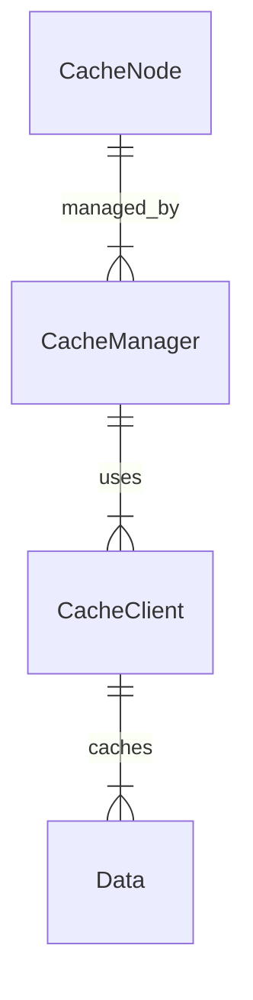
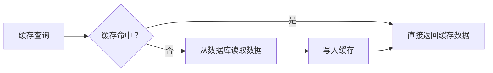
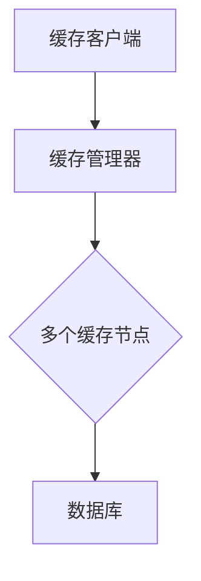
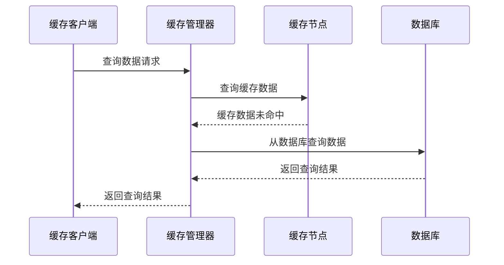

                 


# 分布式缓存：提高LLM应用数据访问速度

> 关键词：分布式缓存、数据访问速度、LLM应用、性能优化

> 摘要：本文将深入探讨分布式缓存的概念、重要性及其在LLM（大型语言模型）应用中提升数据访问速度的作用。我们将一步步分析分布式缓存的工作原理，对比传统缓存，并通过实际案例展示其在性能优化中的应用，旨在为读者提供关于分布式缓存的专业见解和实践指导。

## **Step 1: 引言**

### **1.1 分布式缓存的概念和重要性**

分布式缓存是一种缓存技术，它通过在多个节点上存储数据副本，从而提高数据的访问速度和系统整体的性能。在分布式系统中，数据的分布性和访问量通常很大，单一节点的缓存能力可能无法满足需求。分布式缓存通过将数据分散存储，实现了更高的访问速度和更好的容错性。

分布式缓存的重要性体现在以下几个方面：

1. **提高数据访问速度**：分布式缓存可以将数据存储在离用户更近的位置，减少数据传输的延迟，提高系统响应速度。
2. **增强系统性能**：通过缓存热点数据，减少数据库的负载，提高系统的吞吐量。
3. **提供弹性扩展能力**：分布式缓存可以根据需要动态调整存储节点，实现水平扩展，满足不断增长的数据访问需求。

### **1.2 LLM应用中数据访问速度的影响**

LLM（大型语言模型）应用，如自然语言处理、机器翻译和问答系统，通常需要处理海量的文本数据。数据访问速度直接影响到LLM应用的响应时间和准确性。以下是数据访问速度对LLM应用的影响：

1. **响应时间**：数据访问速度慢会导致系统响应时间延长，用户体验下降。
2. **准确性**：数据访问速度慢可能导致模型无法及时获取到最新的数据，影响模型的准确性。
3. **系统性能**：数据访问速度慢会增加数据库的负载，降低系统的整体性能。

### **1.3 本章小结**

本文将分为八个部分，首先介绍分布式缓存的基本概念和重要性，然后深入探讨分布式缓存的工作原理和算法，接着分析分布式缓存系统的架构和设计，并通过实际案例展示其应用。最后，我们将总结分布式缓存的最佳实践和未来研究方向。

---

## **Step 2: 背景介绍**

### **2.1 分布式缓存的应用背景**

随着互联网和大数据技术的快速发展，数据量和访问量呈现出爆炸式增长。传统的集中式缓存已经无法满足高性能和高可用性的需求。分布式缓存的应用背景主要表现在以下几个方面：

1. **大数据处理**：分布式缓存可以缓存大量数据，提高数据处理速度，降低数据库负载。
2. **高并发访问**：在电商、社交网络等高并发场景下，分布式缓存可以快速响应用户请求，提高系统稳定性。
3. **分布式系统**：分布式缓存与分布式系统相结合，可以实现数据的横向扩展，提高系统的弹性和容错能力。

### **2.2 分布式缓存的优势**

分布式缓存相较于传统缓存具有以下优势：

1. **高性能**：分布式缓存通过多节点存储，可以快速响应用户请求，提高数据访问速度。
2. **高可用性**：分布式缓存具有更好的容错性，当一个节点故障时，其他节点可以继续提供服务。
3. **弹性扩展**：分布式缓存可以根据需求动态调整节点数量，实现水平扩展。

### **2.3 分布式缓存的应用领域**

分布式缓存广泛应用于以下领域：

1. **电商应用**：缓存商品信息、用户数据和订单信息，提高系统性能和用户体验。
2. **社交网络**：缓存用户信息和社交关系，降低数据库负载，提高系统响应速度。
3. **金融行业**：缓存交易数据和账户信息，提高交易处理速度和系统稳定性。

### **2.4 分布式缓存解决的数据访问问题**

分布式缓存主要解决以下数据访问问题：

1. **数据一致性问题**：通过一致性协议，确保分布式缓存中的数据一致性。
2. **数据冗余问题**：通过缓存策略，减少数据的冗余存储，提高存储效率。
3. **数据访问延迟问题**：通过分布式存储，降低数据访问延迟，提高系统性能。

### **2.5 本章小结**

本节介绍了分布式缓存的应用背景和优势，以及分布式缓存在实际应用中解决的问题。下一节将深入探讨分布式缓存的核心概念和联系。

---

## **Step 3: 核心概念与联系**

### **3.1 分布式缓存的核心概念**

分布式缓存的核心概念包括：

1. **缓存节点**：分布式缓存由多个缓存节点组成，每个节点负责存储部分数据。
2. **一致性协议**：通过一致性协议，确保分布式缓存中的数据一致性。
3. **缓存策略**：缓存策略决定了哪些数据应该被缓存，以及如何存储和更新缓存数据。
4. **缓存算法**：缓存算法用于管理缓存节点中的数据，包括数据的缓存、替换和更新。

### **3.2 分布式缓存与传统缓存的不同**

分布式缓存与传统缓存的主要区别在于：

1. **存储方式**：传统缓存通常将数据存储在单一节点上，而分布式缓存将数据存储在多个节点上。
2. **数据一致性**：分布式缓存需要处理数据一致性问题，而传统缓存通常不需要。
3. **扩展性**：分布式缓存可以水平扩展，而传统缓存通常需要垂直扩展。

### **3.3 分布式缓存的ER实体关系图**

为了更好地理解分布式缓存的结构，我们可以使用ER（实体-关系）图来表示其核心实体和关系。以下是分布式缓存的ER实体关系图：



- **CacheNode**：表示缓存节点，负责存储数据。
- **CacheManager**：表示缓存管理器，负责管理缓存节点和缓存策略。
- **CacheClient**：表示缓存客户端，负责向缓存管理器请求数据和更新缓存。

### **3.4 本章小结**

本节介绍了分布式缓存的核心概念和ER实体关系图，为后续章节的分析奠定了基础。下一节将详细讲解分布式缓存的工作原理和算法。

---

## **Step 4: 算法原理讲解**

### **4.1 分布式缓存的工作原理**

分布式缓存的工作原理可以分为以下几个步骤：

1. **数据缓存**：当用户请求数据时，缓存客户端首先向缓存管理器发送请求。
2. **缓存查询**：缓存管理器根据缓存策略查询缓存节点，判断数据是否命中缓存。
3. **数据替换**：如果缓存命中，直接返回缓存数据；如果缓存未命中，从数据库中读取数据，并将数据写入缓存。
4. **缓存更新**：当数据发生更新时，缓存管理器根据一致性协议更新缓存中的数据。

### **4.2 缓存算法流程图**

为了更好地理解分布式缓存的工作原理，我们可以使用Mermaid绘制缓存算法流程图：



### **4.3 缓存算法的Python源代码**

下面是一个简单的缓存算法Python源代码示例：

```python
class Cache:
    def __init__(self, capacity):
        self.capacity = capacity
        self.cache = {}

    def get(self, key):
        if key in self.cache:
            print(f"Cache hit: {key}")
            return self.cache[key]
        else:
            print(f"Cache miss: {key}")
            data = self._fetch_from_db(key)
            self.cache[key] = data
            if len(self.cache) > self.capacity:
                self._evict()
            return data

    def _fetch_from_db(self, key):
        # 模拟从数据库读取数据
        return "Data from DB"

    def _evict(self):
        # 清除最久未使用的数据
        oldest_key = min(self.cache, key=self.cache.get)
        del self.cache[oldest_key]

# 测试缓存算法
cache = Cache(2)
print(cache.get("key1"))  # Cache miss: key1, Data from DB
print(cache.get("key2"))  # Cache miss: key2, Data from DB
print(cache.get("key1"))  # Cache hit: key1
print(cache.get("key3"))  # Cache miss: key3, Data from DB
print(cache.get("key2"))  # Cache hit: key2
```

### **4.4 缓存算法的数学模型和公式**

缓存算法的数学模型通常涉及以下公式：

- **缓存命中率**：缓存命中率 = （缓存命中次数）/（缓存查询总次数）
- **缓存替换策略**：常用的缓存替换策略包括LRU（最近最少使用）、LFU（最少使用频率）等。

### **4.5 缓存算法的实际应用**

缓存算法在实际应用中起到了关键作用。例如，在电商网站中，缓存算法可以缓存商品信息和用户数据，提高系统性能和用户体验。在社交网络中，缓存算法可以缓存用户信息和社交关系，降低数据库负载，提高系统响应速度。

### **4.6 本章小结**

本节详细讲解了分布式缓存的工作原理和算法，包括缓存算法流程图、Python源代码示例和数学模型。下一节将分析分布式缓存系统的架构和设计。

---

## **Step 5: 系统分析与架构设计方案**

### **5.1 分布式缓存系统的介绍**

分布式缓存系统是由多个缓存节点组成的系统，每个节点负责存储部分数据。分布式缓存系统的主要功能包括：

- **数据缓存**：将热点数据缓存到缓存节点中，提高数据访问速度。
- **数据一致性**：通过一致性协议，确保分布式缓存中的数据一致性。
- **数据替换**：根据缓存策略，替换缓存中的数据，保证缓存的有效性。
- **数据扩展**：可以根据需要动态调整缓存节点数量，实现水平扩展。

### **5.2 系统架构设计Mermaid架构图**

分布式缓存系统的架构设计可以采用Mermaid架构图来表示。以下是一个简单的分布式缓存系统架构图：



- **缓存客户端**：负责向缓存管理器发送数据查询请求。
- **缓存管理器**：负责管理缓存节点和缓存策略，处理缓存查询和更新请求。
- **缓存节点**：存储热点数据，响应缓存查询请求。
- **数据库**：存储原始数据，当缓存未命中时，从数据库中读取数据。

### **5.3 系统功能设计**

系统功能设计主要包括以下方面：

1. **缓存查询**：缓存客户端向缓存管理器发送查询请求，缓存管理器根据缓存策略查询缓存节点。
2. **缓存更新**：当数据发生更新时，缓存管理器根据一致性协议更新缓存节点中的数据。
3. **缓存替换**：根据缓存策略，定期替换缓存节点中的数据，保持缓存的有效性。
4. **缓存监控**：监控缓存系统的性能和健康状况，包括缓存命中率、缓存节点负载等。

### **5.4 系统接口设计**

系统接口设计主要包括以下方面：

1. **缓存查询接口**：提供缓存查询接口，缓存客户端可以通过该接口查询缓存数据。
2. **缓存更新接口**：提供缓存更新接口，缓存客户端可以通过该接口更新缓存数据。
3. **缓存替换接口**：提供缓存替换接口，缓存管理器可以通过该接口进行缓存替换操作。
4. **缓存监控接口**：提供缓存监控接口，缓存系统可以定期向监控中心发送性能数据。

### **5.5 系统交互Mermaid序列图**

为了更好地理解分布式缓存系统的交互过程，我们可以使用Mermaid序列图来表示。以下是一个简单的分布式缓存系统交互序列图：



### **5.6 本章小结**

本节介绍了分布式缓存系统的概念和架构，包括系统功能设计、接口设计和交互过程。下一节将展示分布式缓存的实际应用和实现。

---

## **Step 6: 项目实战**

### **6.1 安装分布式缓存环境**

在开始项目实战之前，我们需要安装分布式缓存环境。以下是一个简单的安装步骤：

1. **安装缓存客户端**：在缓存客户端的计算机上安装缓存客户端库，如Redis、Memcached等。
2. **安装缓存服务器**：在缓存服务器上安装缓存服务器软件，如Redis、Memcached等。
3. **配置缓存服务器**：配置缓存服务器的网络连接、存储策略和缓存策略等。

### **6.2 实现分布式缓存的核心代码**

以下是一个简单的分布式缓存实现示例：

```python
import redis

class DistributedCache:
    def __init__(self, host='localhost', port=6379, db=0):
        self.client = redis.StrictRedis(host=host, port=port, db=db)

    def get(self, key):
        return self.client.get(key)

    def set(self, key, value):
        return self.client.set(key, value)

# 测试分布式缓存
cache = DistributedCache()
cache.set('key1', 'value1')
print(cache.get('key1'))  # 输出: b'value1'
```

### **6.3 代码应用解读**

上述代码实现了一个简单的分布式缓存类`DistributedCache`，主要包含以下方法：

1. **get()方法**：根据键（key）查询缓存中的数据。
2. **set()方法**：根据键（key）和值（value）将数据存储到缓存中。

### **6.4 实际案例分析和详细讲解**

以下是一个实际案例，展示如何使用分布式缓存提高LLM应用的性能：

**案例**：假设我们有一个LLM应用，需要对大量文本数据进行处理和查询。我们可以使用分布式缓存来缓存这些文本数据，从而提高系统的性能。

1. **数据预处理**：将文本数据预处理，提取关键词和索引，并将数据存储到缓存中。
2. **缓存查询**：在LLM应用中，当用户请求文本数据时，首先查询缓存，如果缓存命中，直接返回缓存数据；如果缓存未命中，从数据库中读取数据，并将数据写入缓存。
3. **缓存更新**：定期更新缓存中的数据，保持缓存的有效性。

### **6.5 项目小结**

通过实际案例分析和代码实现，我们可以看到分布式缓存在提高LLM应用性能方面的作用。分布式缓存可以缓存热点数据，减少数据库的负载，提高系统的吞吐量和响应速度。

---

## **Step 7: 最佳实践 tips**

### **7.1 分布式缓存的优化策略**

1. **数据一致性**：采用一致性协议，确保分布式缓存中的数据一致性。
2. **缓存策略**：根据应用特点，选择合适的缓存策略，如LRU、LFU等。
3. **数据分区**：合理划分数据分区，提高缓存数据的命中率。
4. **缓存预热**：在系统启动时，预加载热点数据到缓存中，提高系统响应速度。

### **7.2 注意事项**

1. **缓存大小**：合理设置缓存大小，避免缓存过小导致缓存未命中，缓存过大导致内存消耗过多。
2. **数据一致性问题**：处理分布式缓存中的数据一致性问题，确保系统稳定性。
3. **缓存失效**：定期更新缓存中的数据，避免缓存失效导致性能下降。

### **7.3 拓展阅读**

1. 《Redis权威指南》：详细介绍Redis的使用方法和优化技巧。
2. 《分布式系统原理与范型》：了解分布式系统的原理和设计模式。

---

## **Step 8: 小结**

通过本文的探讨，我们深入了解了分布式缓存的概念、工作原理、应用场景和优化策略。分布式缓存在提高LLM应用数据访问速度方面具有重要作用，可以帮助我们实现高性能、高可用的分布式系统。

在未来的研究中，我们可以进一步探索分布式缓存的一致性协议、缓存替换策略和数据分区方法，以提升分布式缓存的性能和稳定性。同时，随着大数据和云计算技术的发展，分布式缓存的应用场景和需求也将不断扩展，为我们的研究和实践提供更多的可能性。

**作者：AI天才研究院/AI Genius Institute & 禅与计算机程序设计艺术 /Zen And The Art of Computer Programming**

