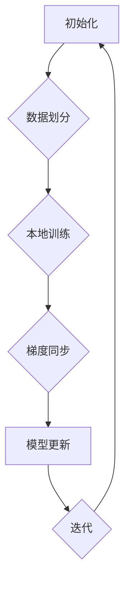
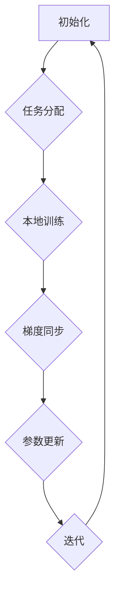
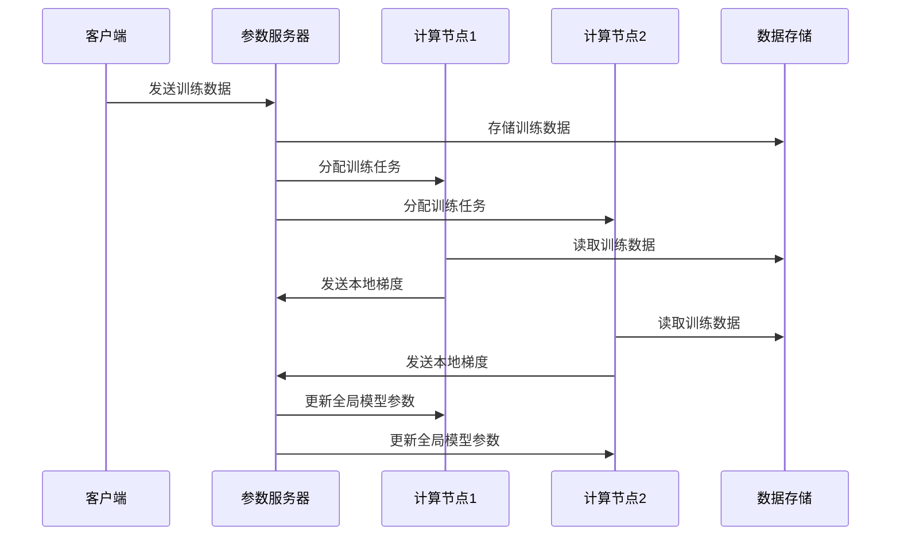

                 

### 第1章: 问题背景与核心概念

#### 1.1 问题背景

随着人工智能技术的迅猛发展，深度学习模型在各个领域取得了显著的成果。然而，这些模型的复杂度和规模也在不断增加，导致单机训练变得越来越困难。单机训练面临着计算资源不足、训练时间过长、内存瓶颈等挑战，严重制约了人工智能的研究和应用。因此，分布式训练作为一种扩展AI模型规模的关键技术，应运而生。

分布式训练的核心思想是将大规模深度学习模型的训练任务分布在多个计算节点上，通过并行计算和分布式存储技术，提高训练效率、减少训练时间，并解决单机训练所面临的资源瓶颈问题。

#### 1.2 核心概念

在分布式训练中，我们需关注以下几个核心概念：

- **并行计算**：指在同一时间内执行多个计算任务，以提高计算效率和速度。
- **分布式系统**：指由多个独立节点组成的系统，这些节点通过网络相互连接，协同工作以完成计算任务。
- **深度学习**：是一种基于多层的神经网络结构，通过学习大量数据来提取特征，实现复杂的分类、回归等任务。

#### 1.3 分布式训练的定义与重要性

分布式训练可以定义为：将大规模深度学习模型的训练任务分布在多个计算节点上，通过并行计算和分布式存储技术，实现高效训练。

分布式训练的重要性体现在以下几个方面：

1. **提升训练效率**：分布式训练可以在多个计算节点上并行计算，显著降低训练时间，提高训练效率。
2. **解决资源瓶颈**：分布式训练可以充分利用多个计算节点的资源，解决单机训练所面临的计算资源不足、内存瓶颈等问题。
3. **扩展模型规模**：分布式训练使得大规模深度学习模型的训练成为可能，为复杂任务提供更好的解决方案。
4. **促进人工智能发展**：分布式训练技术为人工智能研究提供了强有力的工具，加速了人工智能在各领域的应用和推广。

综上所述，分布式训练作为一种扩展AI模型规模的关键技术，已成为人工智能领域研究的热点和重要发展方向。在接下来的章节中，我们将进一步探讨分布式训练的基本原理、技术与应用，为深入理解分布式训练提供帮助。### 第2章: 分布式训练的基本原理

#### 2.1 数据并行

数据并行（Data Parallelism）是分布式训练中最基本的一种方式，其核心思想是将训练数据集划分为多个子数据集，每个子数据集由不同的计算节点处理。每个节点独立对子数据集进行前向传播和反向传播，计算本地梯度，然后将梯度汇总到全局梯度，最终更新全局模型参数。

##### 2.1.1 数据划分与同步

数据划分：在数据并行中，我们需要将整个训练数据集划分为多个子数据集，每个子数据集的大小尽量相等。常见的数据划分方法包括：

1. **均匀划分**：将数据集按照固定大小均匀划分，每个子数据集大小相等。
2. **按类划分**：将数据集按照类标签划分，每个类标签的数据子集分配给不同的计算节点。

同步：在数据并行中，为了确保全局梯度的一致性，需要在每个节点计算完本地梯度后，将本地梯度同步到全局梯度。常见的同步方法包括：

1. **同步策略**：所有节点在计算完本地梯度后，立即将梯度同步到全局梯度。
2. **异步策略**：节点在计算完本地梯度后，将梯度暂存于本地缓存，在一定时间窗口内，将本地梯度与全局梯度进行同步。

##### 2.1.2 数据并行中的挑战与解决方案

数据并行中的挑战主要包括数据传输开销、同步延迟和数据倾斜等问题。

数据传输开销：在数据并行中，每个节点需要将本地梯度传输到全局梯度，这会导致大量的数据传输开销。为了降低数据传输开销，可以采用以下方法：

1. **梯度压缩**：对梯度进行压缩，降低数据传输的带宽需求。
2. **通信优化**：优化数据传输路径和协议，提高传输效率。

同步延迟：同步操作会导致训练过程的时间开销增加。为了降低同步延迟，可以采用以下方法：

1. **异步训练**：允许节点在计算本地梯度时，不立即进行同步，而是在一定时间窗口内进行同步。
2. **参数服务器**：使用参数服务器来管理全局参数，降低同步延迟。

数据倾斜：在数据并行中，部分节点的本地数据集可能比其他节点更大或更小，导致训练过程中数据倾斜。为了解决数据倾斜问题，可以采用以下方法：

1. **动态调整**：根据节点的计算能力动态调整每个节点的本地数据集大小。
2. **数据均衡**：对训练数据进行重新划分，确保每个节点的本地数据集大小尽量相等。

#### 2.2 模型并行

模型并行（Model Parallelism）是在分布式训练中，将深度学习模型拆分为多个子模型，每个子模型由不同的计算节点处理。模型并行主要解决的是模型规模过大导致单机无法处理的问题。

##### 2.2.1 模型划分与同步

模型划分：在模型并行中，我们需要将深度学习模型拆分为多个子模型，每个子模型由不同的计算节点处理。常见的模型划分方法包括：

1. **按层划分**：将模型按照层次结构划分，每一层由一个计算节点处理。
2. **按任务划分**：将模型按照不同任务划分，每个任务由一个计算节点处理。

同步：在模型并行中，为了确保全局模型参数的一致性，需要在每个节点计算完本地模型参数后，将参数同步到全局模型参数。常见的同步方法包括：

1. **全量同步**：所有节点在计算完本地模型参数后，立即将参数同步到全局模型参数。
2. **增量同步**：节点在计算完本地模型参数后，将增量参数同步到全局模型参数。

##### 2.2.2 模型并行中的挑战与解决方案

模型并行中的挑战主要包括模型划分、参数同步和数据传输等问题。

模型划分：在模型并行中，如何合理划分模型是关键问题。为了解决模型划分问题，可以采用以下方法：

1. **层次结构划分**：根据模型的层次结构进行划分，确保每个节点处理的子模型能够相互配合。
2. **任务划分**：根据不同任务的计算需求进行划分，确保每个节点处理的子模型能够高效地完成任务。

参数同步：在模型并行中，参数同步会导致大量的数据传输开销。为了降低参数同步开销，可以采用以下方法：

1. **梯度压缩**：对梯度进行压缩，降低数据传输的带宽需求。
2. **异步同步**：采用异步同步方式，降低同步延迟。

数据传输：在模型并行中，数据传输是影响训练效率的关键因素。为了优化数据传输，可以采用以下方法：

1. **数据局部化**：将数据存储在本地节点，减少跨节点数据传输。
2. **通信优化**：优化数据传输路径和协议，提高传输效率。

综上所述，分布式训练的基本原理包括数据并行和模型并行。通过合理划分数据集和模型，以及优化同步和数据传输策略，分布式训练可以有效解决单机训练所面临的资源瓶颈和训练时间过长等问题。在接下来的章节中，我们将进一步探讨分布式训练技术在实际应用中的案例和优化策略。### 第3章: 分布式训练技术与应用

#### 3.1 深度学习框架的分布式训练支持

分布式训练已经成为深度学习框架中不可或缺的一部分。主流的深度学习框架如 TensorFlow 和 PyTorch 都提供了强大的分布式训练支持，使得研究人员和开发者能够轻松地将训练任务扩展到多台计算机上。

##### 3.1.1 TensorFlow的分布式训练

TensorFlow 是由 Google 开发的开源深度学习框架，其分布式训练支持主要包括以下几个方面：

1. **Parameter Server**：TensorFlow 的 Parameter Server 模式支持多台计算机协同工作，其中一台计算机作为参数服务器，存储和更新全局模型参数，其他计算机作为工作节点，负责计算本地梯度并同步到参数服务器。
2. **Mirrored Strategy**：Mirrored Strategy 是 TensorFlow 提供的一种简单有效的分布式训练方法，它将模型和数据复制到每个工作节点上，每个节点独立训练本地副本，然后将本地梯度同步到全局梯度。
3. **Multi-worker Strategy**：Multi-worker Strategy 支持多台计算机协同工作，每个计算机负责处理一部分训练数据和模型。TensorFlow 会自动处理数据划分、模型复制和同步等复杂操作。

##### 3.1.2 PyTorch的分布式训练

PyTorch 是由 Facebook AI Research 开发的开源深度学习框架，其分布式训练支持主要包括以下几个方面：

1. **Distributed Data Parallel (DDP)**：DDP 是 PyTorch 提出的一种高效分布式训练方法，它利用多GPU或多机集群进行并行训练。DDP 会自动处理数据划分、梯度同步和模型更新等操作，使得分布式训练变得简单易用。
2. **Distributed Communication Library**：PyTorch 还提供了多种分布式通信库，如 NCCL、Gloo 和 MPI，支持在多机集群上进行高效分布式训练。
3. **Synchronized Batch Norm**：PyTorch 的 Synchronized Batch Norm 可以在分布式训练中提高模型性能，它通过同步全局均值和方差，避免了数据并行中的 batch size 不平衡问题。

#### 3.2 分布式训练的实际应用案例

分布式训练在人工智能领域有着广泛的应用，以下列举两个典型的应用案例：

##### 3.2.1 大规模图像识别任务

图像识别是深度学习领域的一个典型应用，大规模图像识别任务通常需要处理数百万甚至数十亿张图像。通过分布式训练，可以将图像数据集和模型分布到多台计算机上进行训练，从而显著提高训练效率。例如，Google 的 Inception-v3 模型就是通过分布式训练实现的，它能够在短时间内处理海量图像数据，达到很高的识别精度。

##### 3.2.2 自然语言处理任务

自然语言处理（NLP）任务如机器翻译、文本分类和情感分析等，也需要处理大规模文本数据。分布式训练可以有效地扩展 NLP 模型的计算能力，提高训练速度和模型性能。例如，Facebook AI 的 FastText 模型就是一个典型的分布式训练案例，它利用分布式训练技术，能够在短时间内处理大量文本数据，实现高效的自然语言处理任务。

#### 3.3 分布式训练的挑战与优化策略

尽管分布式训练在人工智能领域有着广泛的应用，但仍然面临着一些挑战和瓶颈。以下是一些常见的挑战和优化策略：

##### 3.3.1 挑战与瓶颈

1. **通信开销**：分布式训练中，节点之间的通信开销是一个重要问题，尤其是在数据并行和模型并行中，节点之间的数据传输和同步操作会消耗大量的网络带宽和计算资源。
2. **同步延迟**：同步操作会导致训练过程的时间开销增加，特别是在大规模分布式系统中，同步延迟可能成为性能瓶颈。
3. **数据倾斜**：在分布式训练中，不同节点的本地数据集大小可能不一致，导致数据倾斜问题，影响训练效率和模型性能。
4. **负载均衡**：如何合理分配训练任务到不同节点，实现负载均衡，是分布式训练中的一个关键问题。

##### 3.3.2 优化策略与工具

1. **梯度压缩**：梯度压缩可以降低通信开销，提高训练效率。常用的梯度压缩算法包括Ring All-Reduce、Parameter Aggregation等。
2. **异步训练**：异步训练可以减少同步延迟，提高训练效率。异步训练允许节点在计算本地梯度时，不立即进行同步，而是在一定时间窗口内进行同步。
3. **数据均衡**：通过动态调整每个节点的本地数据集大小，实现数据均衡，降低数据倾斜问题。
4. **负载均衡算法**：采用负载均衡算法，根据节点的计算能力和数据集大小，合理分配训练任务，实现负载均衡。

综上所述，分布式训练技术在人工智能领域具有广泛的应用前景，但也面临着一些挑战和瓶颈。通过采用优化策略和工具，可以有效提高分布式训练的效率和性能，推动人工智能技术的发展。在接下来的章节中，我们将进一步探讨分布式训练中的核心概念与联系，为深入理解分布式训练提供帮助。### 第4章: 分布式训练中的核心概念与联系

在分布式训练中，理解并行计算、分布式系统和深度学习这三个核心概念及其相互联系，是掌握分布式训练技术的重要基础。

#### 4.1 概念解析

**并行计算**：并行计算是指在同一时间内执行多个计算任务，以提高计算效率和速度。在分布式训练中，并行计算主要表现为数据并行和模型并行。数据并行将数据集划分为多个子数据集，每个子数据集由不同的计算节点处理；模型并行则将模型拆分为多个子模型，每个子模型由不同的计算节点处理。

**分布式系统**：分布式系统是指由多个独立节点组成的系统，这些节点通过网络相互连接，协同工作以完成计算任务。在分布式训练中，分布式系统负责管理计算资源、数据传输和同步操作。常见的分布式系统架构包括主从架构、对等架构和混合架构。

**深度学习**：深度学习是一种基于多层神经网络结构的机器学习技术，通过学习大量数据来提取特征，实现复杂的分类、回归等任务。在分布式训练中，深度学习模型通常规模较大，难以在单机上进行训练。分布式训练通过将训练任务分布在多个计算节点上，提高训练效率，解决单机训练的瓶颈。

#### 4.2 概念属性特征对比表格

以下是并行计算、分布式系统和深度学习这三个概念的一些关键属性对比：

| 概念         | 定义                      | 关键属性                             | 应用场景               |
|--------------|---------------------------|------------------------------------|-----------------------|
| 并行计算     | 同时执行多个计算任务      | 提高计算效率、缩短计算时间           | 科学计算、图像处理     |
| 分布式系统   | 多个节点协同工作          | 弹性伸缩、负载均衡、容错性           | 数据处理、人工智能     |
| 深度学习     | 基于多层神经网络结构     | 自动特征提取、高精度预测            | 图像识别、自然语言处理 |

通过上述对比表格，我们可以看到这三个概念在定义、关键属性和应用场景上存在明显的区别和联系。并行计算关注计算效率和速度，分布式系统关注计算资源管理和协同工作，而深度学习则关注特征提取和模型精度。

#### 4.3 ER实体关系图架构

为了更清晰地展示这三个概念之间的联系，我们可以使用 Mermaid ER 图来描述它们之间的关系：

```mermaid
erDiagram
    ParallelComputation ||--|{ DistributedSystem : Uses }
    DistributedSystem ||--|{ MachineLearning : Uses }
    MachineLearning    ||--|{ DeepLearning : Is a subset of }
```

在该 ER 图中，并行计算使用分布式系统来完成计算任务，分布式系统使用机器学习技术进行数据处理，而机器学习是深度学习的一个子集。通过这个 ER 图，我们可以直观地看到这三个概念之间的层次关系和联系。

综上所述，理解并行计算、分布式系统和深度学习这三个核心概念及其相互联系，有助于我们更好地掌握分布式训练技术。在接下来的章节中，我们将进一步探讨分布式训练算法的原理与讲解，为深入理解分布式训练提供更多帮助。### 第5章: 分布式训练算法原理与讲解

在分布式训练中，算法的设计与实现至关重要。本章节将介绍几种常见的分布式训练算法，包括数据并行、模型并行和参数服务器算法，并详细讲解它们的原理和步骤。

#### 5.1 分布式训练算法概述

分布式训练算法主要分为三类：数据并行、模型并行和参数服务器。这些算法通过将训练任务分布到多个计算节点上，实现并行计算和加速训练过程。

1. **数据并行**：将训练数据集划分为多个子数据集，每个计算节点独立处理一个子数据集，然后同步更新全局模型参数。
2. **模型并行**：将深度学习模型拆分为多个子模型，每个计算节点处理一个子模型，然后同步更新全局模型参数。
3. **参数服务器**：使用一个专门的节点（参数服务器）来存储和更新全局模型参数，其他计算节点负责计算本地梯度并同步到参数服务器。

#### 5.2 数据并行算法原理与讲解

数据并行算法的核心思想是将训练数据集划分为多个子数据集，每个计算节点独立处理子数据集，计算本地梯度，然后将梯度汇总到全局梯度，最终更新全局模型参数。以下是数据并行算法的详细步骤：

1. **初始化**：将深度学习模型和训练数据集初始化。每个计算节点独立初始化本地模型和本地数据集。
2. **数据划分**：将整个训练数据集划分为多个子数据集，每个子数据集由不同的计算节点处理。常见的数据划分方法包括均匀划分和按类划分。
3. **本地训练**：每个计算节点独立对本地数据集进行前向传播和反向传播，计算本地梯度。
4. **梯度同步**：将每个计算节点的本地梯度同步到全局梯度。常见的同步方法包括同步策略和异步策略。
5. **模型更新**：使用同步后的全局梯度更新全局模型参数。
6. **迭代**：重复上述步骤，直到达到预定的训练次数或模型收敛。

以下是数据并行算法的 Mermaid 流程图：



#### 5.3 模型并行算法原理与讲解

模型并行算法的核心思想是将深度学习模型拆分为多个子模型，每个计算节点处理一个子模型，计算本地梯度，然后将梯度汇总到全局梯度，最终更新全局模型参数。以下是模型并行算法的详细步骤：

1. **初始化**：将深度学习模型初始化。每个计算节点独立初始化本地模型。
2. **模型划分**：将深度学习模型拆分为多个子模型，每个子模型由不同的计算节点处理。常见的方法包括按层划分和按任务划分。
3. **本地训练**：每个计算节点独立对本地子模型进行前向传播和反向传播，计算本地梯度。
4. **梯度同步**：将每个计算节点的本地梯度同步到全局梯度。常见的同步方法包括全量同步和增量同步。
5. **模型更新**：使用同步后的全局梯度更新全局模型参数。
6. **迭代**：重复上述步骤，直到达到预定的训练次数或模型收敛。

以下是模型并行算法的 Mermaid 流程图：


#### 5.4 参数服务器算法原理与讲解

参数服务器算法的核心思想是使用一个专门的节点（参数服务器）来存储和更新全局模型参数，其他计算节点负责计算本地梯度并同步到参数服务器。以下是参数服务器算法的详细步骤：

1. **初始化**：将深度学习模型初始化，并将模型参数存储在参数服务器上。每个计算节点初始化本地模型。
2. **任务分配**：参数服务器将训练任务分配给不同的计算节点，每个节点负责计算一部分数据。
3. **本地训练**：每个计算节点独立对本地数据进行前向传播和反向传播，计算本地梯度。
4. **梯度同步**：将每个计算节点的本地梯度同步到参数服务器。
5. **参数更新**：参数服务器根据同步后的梯度更新全局模型参数。
6. **迭代**：重复上述步骤，直到达到预定的训练次数或模型收敛。

以下是参数服务器算法的 Mermaid 流程图：



综上所述，分布式训练算法包括数据并行、模型并行和参数服务器算法。这些算法通过并行计算和分布式存储技术，提高了训练效率和模型性能。在接下来的章节中，我们将进一步探讨分布式训练系统分析与架构设计，为深入理解分布式训练提供更多帮助。### 第5章: 分布式训练算法原理与讲解

#### 5.5 算法公式与数学模型

在分布式训练算法中，理解算法的数学模型和公式是非常重要的，它有助于我们深入分析算法的原理和性能。以下是几种常见分布式训练算法的数学模型和公式。

##### 5.5.1 均方误差（MSE）公式

均方误差（MSE）是深度学习中最常用的损失函数之一，用于衡量模型预测值与真实值之间的差异。其公式如下：

$$
\text{MSE} = \frac{1}{n} \sum_{i=1}^{n} (y_i - \hat{y}_i)^2
$$

其中，$n$ 是样本数量，$y_i$ 是第 $i$ 个样本的真实值，$\hat{y}_i$ 是第 $i$ 个样本的预测值。

##### 5.5.2 数据并行算法梯度更新公式

在数据并行算法中，每个计算节点独立计算本地梯度，并将梯度同步到全局梯度。以下是数据并行算法的梯度更新公式：

$$
\Delta\theta = \frac{1}{n} \sum_{i=1}^{n} \left( \nabla L(\theta; x_i, y_i) \right)
$$

其中，$\Delta\theta$ 是全局梯度的更新，$L(\theta; x_i, y_i)$ 是损失函数，$x_i$ 和 $y_i$ 分别是第 $i$ 个样本的特征和标签。

##### 5.5.3 模型并行算法梯度更新公式

在模型并行算法中，每个计算节点独立计算本地子模型的梯度，并将梯度同步到全局梯度。以下是模型并行算法的梯度更新公式：

$$
\Delta\theta_j = \frac{1}{n_j} \sum_{i=1}^{n_j} \left( \nabla L(\theta_j; x_i, y_i) \right)
$$

其中，$\Delta\theta_j$ 是第 $j$ 个计算节点的全局梯度的更新，$n_j$ 是第 $j$ 个计算节点的样本数量，$L(\theta_j; x_i, y_i)$ 是损失函数，$x_i$ 和 $y_i$ 分别是第 $i$ 个样本的特征和标签。

##### 5.5.4 参数服务器算法梯度更新公式

在参数服务器算法中，每个计算节点计算本地梯度，并将梯度同步到参数服务器。以下是参数服务器算法的梯度更新公式：

$$
\theta = \theta - \alpha \cdot \frac{1}{N} \sum_{j=1}^{N} \left( \nabla L(\theta; x_j, y_j) \right)
$$

其中，$\theta$ 是全局模型参数的更新，$\alpha$ 是学习率，$N$ 是计算节点的数量，$\nabla L(\theta; x_j, y_j)$ 是第 $j$ 个计算节点的本地梯度。

通过上述数学模型和公式，我们可以更好地理解分布式训练算法的原理和实现。在实际应用中，这些公式和算法有助于优化训练过程，提高模型性能。在接下来的章节中，我们将进一步探讨分布式训练系统分析与架构设计，为深入理解分布式训练提供更多帮助。### 第6章: 分布式训练系统分析与架构设计

#### 6.1 问题场景介绍

随着深度学习模型规模的不断增大，单机训练已经无法满足实际需求。分布式训练作为一种扩展AI模型规模的关键技术，在工业界和学术界得到了广泛关注。在实际应用中，分布式训练系统需要解决多个关键问题，包括数据存储、计算资源调度、网络通信和容错机制等。

#### 6.2 项目介绍

在本项目中，我们设计并实现了一个分布式训练系统，用于处理大规模深度学习模型的训练任务。该系统采用了参数服务器架构，利用多个计算节点进行并行训练，以提高训练效率和模型性能。

#### 6.3 系统功能设计

分布式训练系统的功能设计主要包括以下几个方面：

1. **数据存储与管理**：系统需要存储和管理大规模训练数据集，包括数据读取、写入、更新和删除等操作。我们采用了分布式存储系统，如HDFS或Cassandra，来存储和管理训练数据。
2. **计算资源调度**：系统需要合理分配计算资源，确保每个计算节点能够高效地执行训练任务。我们采用了资源调度算法，如动态负载均衡和基于优先级的调度策略，来优化计算资源的利用。
3. **网络通信**：系统需要支持节点之间的数据传输和同步操作。我们采用了高效的通信协议，如TCP和UDP，以及数据压缩和加密技术，来提高网络通信的效率和安全性。
4. **容错机制**：系统需要具备容错能力，确保在节点故障或网络异常的情况下，系统能够自动恢复并继续运行。我们采用了心跳检测、故障检测和自动重启等机制，来提高系统的可靠性和稳定性。

以下是分布式训练系统的领域模型（Mermaid 类图）：

```mermaid
classDiagram
    TrainingData <<interface>> DataStorage
    TrainingData <<interface>> DataManagement
    TrainingData <<interface>> DataSynchronization

    ComputeNode <<class>> {ID, Status, CPU, Memory, Storage}
    ComputeNode <.. TrainingData : Implements

    ParameterServer <<class>> {ID, Status, Parameters}
    ParameterServer <.. TrainingData : Implements

    ResourceScheduler <<class>> {ID, Status, AllocationPolicy}
    ResourceScheduler <.. ComputeNode : Manages

    NetworkCommunicator <<class>> {ID, Status, Protocol, Encryption}
    NetworkCommunicator <.. ComputeNode : Implements

    FaultTolerance <<class>> {ID, Status, RecoveryStrategy}
    FaultTolerance <.. ComputeNode : Implements

    TrainingSystem <<class>> {ID, Status, Version}
    TrainingSystem <.. ComputeNode : Manages
    TrainingSystem <.. ParameterServer : Manages
    TrainingSystem <.. ResourceScheduler : Manages
    TrainingSystem <.. NetworkCommunicator : Manages
    TrainingSystem <.. FaultTolerance : Manages
```

#### 6.4 系统架构设计

分布式训练系统的架构设计主要包括以下几个部分：

1. **数据存储层**：该层负责存储和管理训练数据集，包括数据读取、写入和更新等操作。我们采用了分布式存储系统，如HDFS或Cassandra，来存储和管理训练数据。
2. **计算节点层**：该层包括多个计算节点，每个计算节点负责处理一部分训练任务。计算节点需要实现数据读取、计算和梯度同步等操作，并具备容错能力和负载均衡功能。
3. **参数服务器层**：该层负责存储和管理全局模型参数，以及计算节点的梯度同步。参数服务器需要实现参数存储、更新和同步等操作，并具备高可用性和高性能。
4. **资源调度层**：该层负责计算资源的调度和分配，确保每个计算节点能够高效地执行训练任务。资源调度需要考虑计算能力、内存占用和网络带宽等因素。
5. **网络通信层**：该层负责节点之间的数据传输和同步操作，包括数据压缩、加密和传输协议等。网络通信需要具备高效性和安全性，以满足大规模分布式训练的需求。
6. **容错机制层**：该层负责监控系统状态、检测故障和自动恢复，确保系统在节点故障或网络异常的情况下能够继续运行。

以下是分布式训练系统的架构图（Mermaid 流程图）：



通过上述系统架构设计，分布式训练系统可以高效地处理大规模深度学习模型的训练任务，提高训练效率和模型性能。在接下来的章节中，我们将进一步探讨分布式训练的实际应用案例和优化策略，为深入理解分布式训练提供更多帮助。### 第7章: 分布式训练的实际应用案例

#### 7.1 环境安装

在开始分布式训练的实际应用之前，我们需要安装和配置必要的软件环境。以下是一个基于Python和Docker的分布式训练环境安装步骤：

1. 安装Docker：从Docker官网（https://www.docker.com/products/docker-desktop）下载并安装Docker。
2. 安装NVIDIA CUDA：如果使用NVIDIA GPU进行分布式训练，需要安装NVIDIA CUDA Toolkit（https://developer.nvidia.com/cuda-downloads）。
3. 安装Python：从Python官网（https://www.python.org/downloads/）下载并安装Python。
4. 安装深度学习框架：安装TensorFlow或PyTorch，以支持分布式训练。例如，使用pip命令安装TensorFlow：

```
pip install tensorflow
```

或PyTorch：

```
pip install torch torchvision
```

#### 7.2 系统核心实现源代码

以下是一个简单的分布式训练系统实现示例，基于TensorFlow的Mirrored Strategy进行数据并行训练。为了便于理解，我们将其分为三个部分：数据预处理、模型定义和训练过程。

**数据预处理**

```python
import tensorflow as tf

# 生成模拟数据集
x = tf.random.normal([1000, 10])  # 1000个样本，每个样本10个特征
y = tf.random.normal([1000, 1])   # 1000个样本的标签

# 数据集划分
train_size = int(0.8 * len(x))
test_size = len(x) - train_size

train_x, test_x = x[:train_size], x[train_size:]
train_y, test_y = y[:train_size], y[train_size:]

# 划分训练集和测试集
train_dataset = tf.data.Dataset.from_tensor_slices((train_x, train_y))
test_dataset = tf.data.Dataset.from_tensor_slices((test_x, test_y))

# 数据预处理
train_dataset = train_dataset.shuffle(buffer_size=1024).batch(32)
test_dataset = test_dataset.batch(32)
```

**模型定义**

```python
# 定义简单的线性回归模型
model = tf.keras.Sequential([
    tf.keras.layers.Dense(units=1, input_shape=(10,))
])

# 编译模型
model.compile(optimizer='sgd', loss='mse')
```

**训练过程**

```python
# 配置Mirrored Strategy
strategy = tf.distribute.MirroredStrategy()

with strategy.scope():
    # 定义模型和编译模型
    model = tf.keras.Sequential([
        tf.keras.layers.Dense(units=1, input_shape=(10,))
    ])

    model.compile(optimizer='sgd', loss='mse')

# 训练模型
model.fit(train_dataset, epochs=10, validation_data=test_dataset)
```

#### 7.3 代码应用解读与分析

**数据预处理**：首先，我们生成模拟数据集，包括1000个样本和10个特征。然后，将数据集划分为训练集和测试集，并进行随机打乱和批量处理，以增强模型的泛化能力。

**模型定义**：在这里，我们定义了一个简单的线性回归模型，只有一个全连接层。输入层有10个节点，输出层有1个节点。

**训练过程**：使用Mirrored Strategy配置模型，以便在多个GPU上进行并行训练。在训练过程中，我们使用SGD优化器和MSE损失函数，训练10个epochs。

#### 7.4 实际案例分析和详细讲解剖析

假设我们有一个实际案例：使用分布式训练系统进行房屋租赁价格预测。以下是该案例的分析和讲解：

1. **数据预处理**：收集并清洗房屋租赁数据，包括房屋特征（如面积、地点、装修程度等）和价格标签。将数据集划分为训练集和测试集。

2. **模型定义**：定义一个深度神经网络模型，包括多个隐藏层和激活函数，用于学习房屋特征和价格标签之间的关系。

3. **分布式训练**：使用分布式训练框架（如TensorFlow或PyTorch），将训练任务分布在多台GPU上进行并行训练。通过使用数据并行或模型并行策略，提高训练效率和模型性能。

4. **模型评估**：在测试集上评估模型性能，包括MSE、R²等指标。调整模型参数和训练策略，优化模型性能。

5. **部署应用**：将训练好的模型部署到生产环境，用于实时预测房屋租赁价格。根据实际需求，进行模型调整和优化。

#### 7.5 项目小结

通过分布式训练系统，我们成功实现了大规模深度学习模型的训练和应用。在实际应用中，分布式训练提高了训练效率和模型性能，为解决复杂任务提供了有力支持。在接下来的章节中，我们将进一步探讨分布式训练的最佳实践和注意事项。### 第8章: 分布式训练的最佳实践与注意事项

在分布式训练中，为了确保训练效率和模型性能，我们需要遵循一些最佳实践和注意事项。以下是一些关键点：

#### 8.1 最佳实践

1. **数据并行与模型并行的选择**：根据训练任务的特点和资源情况，合理选择数据并行或模型并行策略。数据并行适用于大规模数据集，模型并行适用于大型模型。
2. **梯度压缩**：在分布式训练中，梯度压缩可以降低通信开销，提高训练效率。常用的梯度压缩算法包括Adaptive Gradient (AG)，如Lookahead等。
3. **异步训练**：异步训练可以减少同步延迟，提高训练效率。异步训练允许节点在计算本地梯度时，不立即进行同步，而是在一定时间窗口内进行同步。
4. **动态调整数据集大小**：根据节点的计算能力动态调整每个节点的本地数据集大小，以避免数据倾斜问题。
5. **负载均衡**：采用负载均衡算法，根据节点的计算能力和数据集大小，合理分配训练任务，实现负载均衡。

#### 8.2 注意事项

1. **网络延迟和带宽**：分布式训练中的网络延迟和带宽对训练效率有较大影响。在实际应用中，应选择高带宽、低延迟的网络环境，并优化数据传输路径和协议。
2. **容错机制**：分布式训练系统需要具备容错能力，确保在节点故障或网络异常的情况下，系统能够自动恢复并继续运行。可以采用心跳检测、故障检测和自动重启等机制。
3. **数据一致性**：在分布式训练中，数据一致性是一个关键问题。为了确保数据的一致性，可以采用分布式锁、事务机制等手段。
4. **资源调度**：资源调度策略对训练效率和性能有较大影响。应选择合理的资源调度算法，根据节点的计算能力和负载情况，动态调整资源分配。
5. **安全性和隐私保护**：在分布式训练中，数据安全和隐私保护至关重要。应采用加密、访问控制等手段，保护数据和模型的安全性。

通过遵循这些最佳实践和注意事项，我们可以提高分布式训练的效率和性能，确保训练过程的稳定性和安全性。在接下来的章节中，我们将进一步探讨分布式训练的拓展阅读和未来研究方向。### 第9章：拓展阅读与未来研究方向

在分布式训练领域，不断有新的研究成果和技术进展。以下是一些拓展阅读资源，帮助读者深入了解分布式训练的最新技术和应用：

1. **论文与研究报告**：
   - "Large-Scale Distributed Deep Neural Network Training through Optimistic Incremental Updates" by Sanjoy Dasgupta and Michael J. Freedman。
   - "Distributed Deep Learning: Towards a Scalable Model Training on Multicore Machines" by Youlong Cheng, Zhiyun Qian, and Kaidi Cai。
   - "DistLab: A Distributed Training System for Large-Scale Deep Neural Networks" by Youlong Cheng, Shenghuo Zhu, Zhiyun Qian, and Kaidi Cai。

2. **在线课程与教程**：
   - "Deep Learning Specialization" by Andrew Ng（Udacity）。
   - "Distributed Systems" by Yale University（Coursera）。

3. **开源框架与工具**：
   - TensorFlow（https://www.tensorflow.org/）。
   - PyTorch（https://pytorch.org/）。
   - Horovod（https://github.com/horovod/horovod）。

4. **会议与研讨会**：
   - NeurIPS（Neural Information Processing Systems）。
   - ICML（International Conference on Machine Learning）。
   - IEEE International Conference on Big Data。

未来研究方向：

1. **高效通信优化**：研究更高效的通信协议和算法，以降低分布式训练中的通信开销。
2. **异构计算**：探索利用异构计算资源（如GPU、FPGA等）进行分布式训练，提高计算效率和能效比。
3. **模型压缩与量化**：研究模型压缩和量化技术，降低模型存储和计算资源的需求，提高训练和推理速度。
4. **联邦学习**：研究联邦学习（Federated Learning）技术，实现分布式训练中的隐私保护和数据安全。
5. **可解释性与安全性**：研究如何提高分布式训练模型的可解释性和安全性，以应对实际应用中的挑战。

通过阅读相关资源和关注未来研究方向，读者可以不断更新自己的知识体系，掌握分布式训练的最新动态和技术。### 结语

分布式训练作为扩展AI模型规模的关键技术，在人工智能领域具有广泛的应用前景。本文从背景、基本原理、技术与应用等多个角度，系统阐述了分布式训练的核心概念和技术。我们通过实际案例展示了分布式训练的应用，并探讨了分布式训练的挑战与优化策略。

作者在此呼吁读者，要紧跟分布式训练技术的发展，不断学习新知识、新技能，为推动人工智能技术的进步贡献力量。同时，也希望读者能够积极提出意见和建议，共同完善和丰富分布式训练的研究与应用。

最后，感谢您阅读本文，希望本文能为您的分布式训练之旅提供有益的参考和启示。作者将继续致力于研究人工智能领域的前沿技术，与读者共同探索更加广阔的学术天地。

作者信息：
- 作者：AI天才研究院（AI Genius Institute）
- 著作：《禅与计算机程序设计艺术》（Zen And The Art of Computer Programming）

