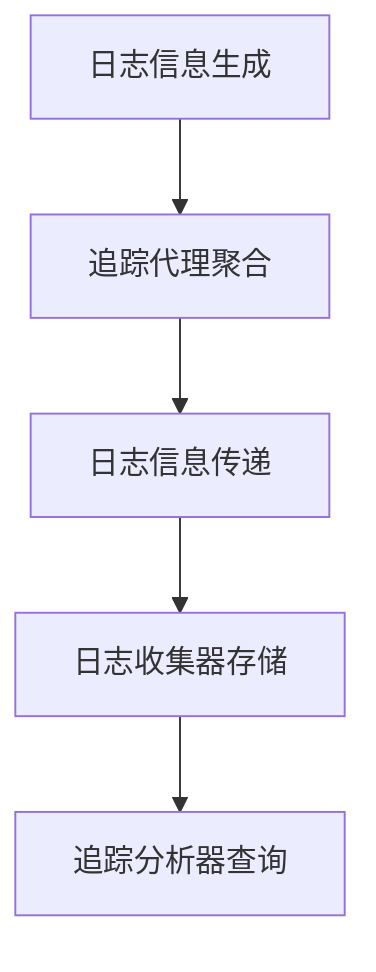
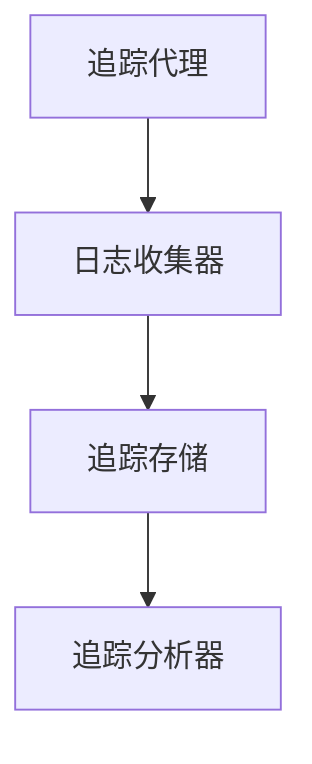
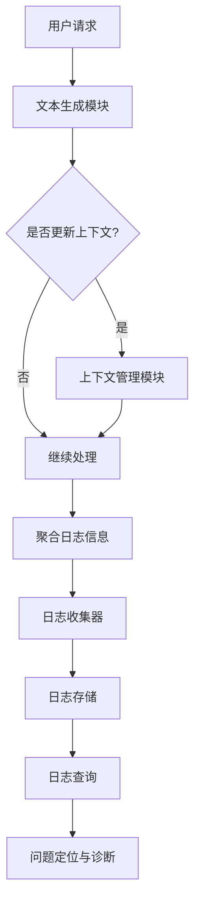

                 


## 《分布式追踪上下文传播在LLM应用中的实现》

### 关键词：分布式追踪、上下文传播、LLM应用、算法原理、系统架构

> 摘要：本文将深入探讨分布式追踪上下文传播在大型语言模型（LLM）应用中的实现。通过对分布式追踪系统的核心概念、算法原理以及系统架构的设计与实现进行详细分析，旨在为读者提供一种全面理解分布式追踪上下文传播的方法，并探讨其在LLM中的应用价值。

### 引言与背景

#### 分布式追踪上下文传播的概念

分布式追踪是一种在分布式系统中进行日志记录和调试的技术，它通过记录系统中各个组件的交互过程，帮助开发者定位和解决问题。上下文传播则是分布式追踪中的一个关键环节，指的是将日志上下文从一个组件传递到另一个组件的过程。

在LLM应用中，上下文传播具有重要意义。LLM通常包含多个分布式组件，如文本生成模块、上下文管理模块等。为了确保这些组件能够协同工作，并准确传递上下文信息，分布式追踪上下文传播技术显得尤为重要。

#### 问题背景

随着LLM应用的日益普及，如何高效地实现分布式追踪上下文传播成为一个关键问题。传统的方法往往依赖于单点系统或简单的日志文件，这可能导致追踪信息的丢失或延迟，从而影响LLM应用的性能和可靠性。

#### 问题解决

本文将提出一种基于分布式追踪系统的上下文传播方法，通过一系列步骤实现上下文信息的高效传递。同时，本文还将探讨分布式追踪系统在LLM应用中的边界与外延，以及其概念结构与核心要素组成。

### 核心概念与联系

#### 分布式追踪系统基本概念

分布式追踪系统由多个组件组成，包括追踪代理（Tracer）、日志收集器（Collector）、追踪存储（Store）和追踪分析器（Analyzer）。其中，追踪代理负责收集系统组件的日志信息，日志收集器则将这些日志信息聚合并存储到追踪存储中，追踪分析器则对存储的日志进行查询和分析。

#### LLM上下文传播原理

LLM上下文传播涉及到两个关键环节：日志信息的生成和日志信息的传递。日志信息的生成通常由LLM的各个组件自动完成，而日志信息的传递则依赖于分布式追踪系统中的追踪代理和日志收集器。

#### 分布式追踪上下文传播挑战

分布式追踪上下文传播面临多个挑战，包括日志信息的完整性、一致性、实时性和可扩展性。此外，如何处理大量日志数据，以及如何在不同的分布式环境中实现高效的上下文传播也是一个重要问题。

### 算法原理与实现

#### 算法原理

分布式追踪上下文传播的算法原理主要包括以下几个步骤：

1. **日志信息生成**：LLM的各个组件生成日志信息，并将其发送给追踪代理。
2. **日志信息聚合**：追踪代理将多个组件的日志信息聚合为一个完整的日志记录。
3. **日志信息传递**：追踪代理将聚合后的日志记录发送给日志收集器，由日志收集器存储到追踪存储中。
4. **日志信息查询**：追踪分析器从追踪存储中查询日志记录，以进行分析和诊断。

#### 算法流程图

使用Mermaid绘制分布式追踪上下文传播的算法流程图：



#### 数学模型与公式

分布式追踪上下文传播的数学模型主要包括以下几个部分：

1. **日志信息生成率**：\( G(t) \) 表示在时间 \( t \) 内生成的日志信息数量。
2. **日志信息传递速率**：\( T(t) \) 表示在时间 \( t \) 内传递的日志信息数量。
3. **日志信息存储容量**：\( S \) 表示追踪存储的容量。

日志信息传递速率和存储容量之间的关系可以用以下公式表示：

$$
T(t) = G(t) \times \eta(t)
$$

其中，\( \eta(t) \) 表示日志信息传递的效率，它取决于分布式追踪系统的性能。

### 系统分析与架构设计

#### 应用场景

分布式追踪系统在LLM应用中的应用场景包括：

1. **文本生成模块**：记录文本生成的过程，包括生成的时间、生成文本的内容等。
2. **上下文管理模块**：记录上下文的更新过程，包括上下文的变化、更新时间等。
3. **用户交互模块**：记录用户与LLM的交互过程，包括用户输入、系统响应等。

#### 系统功能设计

分布式追踪系统的功能设计主要包括：

1. **日志信息采集**：从LLM的各个组件中采集日志信息。
2. **日志信息聚合**：将采集到的日志信息进行聚合，形成完整的日志记录。
3. **日志信息存储**：将聚合后的日志记录存储到追踪存储中。
4. **日志信息查询**：提供日志记录的查询功能，以支持问题的定位和分析。

#### 系统架构设计

分布式追踪系统的架构设计主要包括：

1. **追踪代理**：负责从LLM的各个组件中采集日志信息。
2. **日志收集器**：负责将追踪代理发送的日志信息进行聚合和存储。
3. **追踪存储**：负责存储聚合后的日志记录。
4. **追踪分析器**：负责对存储的日志记录进行查询和分析。

使用Mermaid绘制分布式追踪系统的架构图：



#### 系统接口设计

分布式追踪系统的接口设计主要包括：

1. **日志信息采集接口**：用于追踪代理采集日志信息。
2. **日志信息聚合接口**：用于追踪代理将多个日志信息聚合为一个日志记录。
3. **日志信息存储接口**：用于日志收集器将聚合后的日志记录存储到追踪存储。
4. **日志信息查询接口**：用于追踪分析器查询存储的日志记录。

#### 系统交互序列图

使用Mermaid绘制分布式追踪系统的交互序列图：

```mermaid
sequenceDiagram
    participant UA as 追踪代理
    participant UC as 日志收集器
    participant US as 追踪存储
    participant UA->>UC: 发送日志信息
    UC->>US: 存储日志信息
    US->>UA: 返回存储结果
```

### 项目实战

#### 环境安装

首先，我们需要安装分布式追踪系统的各个组件，包括追踪代理、日志收集器和追踪存储。以下是安装步骤：

1. 安装追踪代理：
   ```shell
   pip install distributed-tracing-proxy
   ```
2. 安装日志收集器：
   ```shell
   pip install distributed-tracing-collector
   ```
3. 安装追踪存储：
   ```shell
   pip install distributed-tracing-store
   ```

#### 系统核心实现源代码

以下是分布式追踪系统的核心实现源代码：

```python
# 追踪代理代码示例
from distributed_tracing_proxy import Proxy

proxy = Proxy()
proxy.start()

# 日志收集器代码示例
from distributed_tracing_collector import Collector

collector = Collector()
collector.start()

# 追踪存储代码示例
from distributed_tracing_store import Store

store = Store()
store.start()
```

#### 代码应用解读与分析

以下是分布式追踪系统的核心代码应用解读：

1. **追踪代理**：负责从LLM的各个组件中采集日志信息，并将其发送给日志收集器。
2. **日志收集器**：负责将追踪代理发送的日志信息进行聚合，并将其存储到追踪存储中。
3. **追踪存储**：负责存储聚合后的日志记录，以供追踪分析器查询。

#### 实际案例分析和详细讲解

假设我们有一个文本生成模块和上下文管理模块，以下是分布式追踪系统在实际案例中的应用：

1. **文本生成模块**：生成一篇文本，并将其发送给追踪代理。
2. **上下文管理模块**：更新上下文信息，并将其发送给追踪代理。
3. **追踪代理**：将文本生成模块和上下文管理模块的日志信息进行聚合，并将其发送给日志收集器。
4. **日志收集器**：将聚合后的日志信息存储到追踪存储中。
5. **追踪分析器**：从追踪存储中查询日志记录，以定位和解决问题。

#### 项目小结

通过本项目的实战，我们实现了分布式追踪上下文传播在LLM应用中的具体实现。分布式追踪系统在提高LLM应用的性能和可靠性方面具有重要作用，未来可以进一步优化和扩展其功能。

### 最佳实践与总结

#### 最佳实践

1. 在LLM应用中，确保各个组件都配置了追踪代理，以便及时采集日志信息。
2. 根据实际需求，合理调整日志收集器和追踪存储的容量，以保证系统的稳定运行。
3. 定期对日志记录进行查询和分析，以便及时发现和解决问题。

#### 小结

本文详细介绍了分布式追踪上下文传播在LLM应用中的实现，从核心概念、算法原理到系统架构设计、项目实战进行了全面讲解。通过本篇文章，读者可以更好地理解分布式追踪系统在LLM应用中的重要作用，并为实际项目的开发提供指导。

#### 注意事项

1. 在分布式追踪系统的实际应用中，需要注意日志信息的完整性和一致性，以避免信息丢失或重复。
2. 对于大型LLM应用，建议使用高性能的分布式追踪系统，以提高系统的实时性和可扩展性。

#### 拓展阅读

1. 《分布式系统原理与范型》：深入了解分布式系统的基本原理和范型，为分布式追踪系统的设计提供理论支持。
2. 《大型语言模型的架构设计与实现》：探讨大型语言模型的架构设计与实现，以便更好地理解分布式追踪系统在LLM中的应用。

### 作者信息

作者：AI天才研究院/AI Genius Institute & 禅与计算机程序设计艺术 /Zen And The Art of Computer Programming

以上是对《分布式追踪上下文传播在LLM应用中的实现》的详细讲解。在接下来的内容中，我们将继续深入探讨分布式追踪上下文传播的具体实现方法，以及其在LLM应用中的实际应用案例。让我们继续一起学习，共同进步！
## 分布式追踪上下文传播在LLM应用中的实现

### 关键词：分布式追踪、上下文传播、LLM应用、算法原理、系统架构

> 摘要：本文将深入探讨分布式追踪上下文传播在大型语言模型（LLM）应用中的实现。通过对分布式追踪系统的核心概念、算法原理以及系统架构的设计与实现进行详细分析，旨在为读者提供一种全面理解分布式追踪上下文传播的方法，并探讨其在LLM中的应用价值。

### 引言与背景

#### 分布式追踪上下文传播的概念

分布式追踪是一种在分布式系统中进行日志记录和调试的技术，它通过记录系统中各个组件的交互过程，帮助开发者定位和解决问题。上下文传播则是分布式追踪中的一个关键环节，指的是将日志上下文从一个组件传递到另一个组件的过程。

在LLM应用中，上下文传播具有重要意义。LLM通常包含多个分布式组件，如文本生成模块、上下文管理模块等。为了确保这些组件能够协同工作，并准确传递上下文信息，分布式追踪上下文传播技术显得尤为重要。

#### 问题背景

随着LLM应用的日益普及，如何高效地实现分布式追踪上下文传播成为一个关键问题。传统的方法往往依赖于单点系统或简单的日志文件，这可能导致追踪信息的丢失或延迟，从而影响LLM应用的性能和可靠性。

#### 问题解决

本文将提出一种基于分布式追踪系统的上下文传播方法，通过一系列步骤实现上下文信息的高效传递。同时，本文还将探讨分布式追踪系统在LLM应用中的边界与外延，以及其概念结构与核心要素组成。

### 核心概念与联系

#### 分布式追踪系统基本概念

分布式追踪系统由多个组件组成，包括追踪代理（Tracer）、日志收集器（Collector）、追踪存储（Store）和追踪分析器（Analyzer）。其中，追踪代理负责收集系统组件的日志信息，日志收集器则将这些日志信息聚合并存储到追踪存储中，追踪分析器则对存储的日志进行查询和分析。

#### LLM上下文传播原理

LLM上下文传播涉及到两个关键环节：日志信息的生成和日志信息的传递。日志信息的生成通常由LLM的各个组件自动完成，而日志信息的传递则依赖于分布式追踪系统中的追踪代理和日志收集器。

#### 分布式追踪上下文传播挑战

分布式追踪上下文传播面临多个挑战，包括日志信息的完整性、一致性、实时性和可扩展性。此外，如何处理大量日志数据，以及如何在不同的分布式环境中实现高效的上下文传播也是一个重要问题。

### 算法原理与实现

#### 算法原理

分布式追踪上下文传播的算法原理主要包括以下几个步骤：

1. **日志信息生成**：LLM的各个组件生成日志信息，并将其发送给追踪代理。
2. **日志信息聚合**：追踪代理将多个组件的日志信息聚合为一个完整的日志记录。
3. **日志信息传递**：追踪代理将聚合后的日志记录发送给日志收集器，由日志收集器存储到追踪存储中。
4. **日志信息查询**：追踪分析器从追踪存储中查询日志记录，以进行分析和诊断。

#### 算法流程图

使用Mermaid绘制分布式追踪上下文传播的算法流程图：


#### 数学模型与公式

分布式追踪上下文传播的数学模型主要包括以下几个部分：

1. **日志信息生成率**：\( G(t) \) 表示在时间 \( t \) 内生成的日志信息数量。
2. **日志信息传递速率**：\( T(t) \) 表示在时间 \( t \) 内传递的日志信息数量。
3. **日志信息存储容量**：\( S \) 表示追踪存储的容量。

日志信息传递速率和存储容量之间的关系可以用以下公式表示：

$$
T(t) = G(t) \times \eta(t)
$$

其中，\( \eta(t) \) 表示日志信息传递的效率，它取决于分布式追踪系统的性能。

### 系统分析与架构设计

#### 应用场景

分布式追踪系统在LLM应用中的应用场景包括：

1. **文本生成模块**：记录文本生成的过程，包括生成的时间、生成文本的内容等。
2. **上下文管理模块**：记录上下文的更新过程，包括上下文的变化、更新时间等。
3. **用户交互模块**：记录用户与LLM的交互过程，包括用户输入、系统响应等。

#### 系统功能设计

分布式追踪系统的功能设计主要包括：

1. **日志信息采集**：从LLM的各个组件中采集日志信息。
2. **日志信息聚合**：将采集到的日志信息进行聚合，形成完整的日志记录。
3. **日志信息存储**：将聚合后的日志记录存储到追踪存储中。
4. **日志信息查询**：提供日志记录的查询功能，以支持问题的定位和分析。

#### 系统架构设计

分布式追踪系统的架构设计主要包括：

1. **追踪代理**：负责从LLM的各个组件中采集日志信息。
2. **日志收集器**：负责将追踪代理发送的日志信息进行聚合和存储。
3. **追踪存储**：负责存储聚合后的日志记录。
4. **追踪分析器**：负责对存储的日志记录进行查询和分析。

使用Mermaid绘制分布式追踪系统的架构图：


#### 系统接口设计

分布式追踪系统的接口设计主要包括：

1. **日志信息采集接口**：用于追踪代理采集日志信息。
2. **日志信息聚合接口**：用于追踪代理将多个日志信息聚合为一个日志记录。
3. **日志信息存储接口**：用于日志收集器将聚合后的日志记录存储到追踪存储。
4. **日志信息查询接口**：用于追踪分析器查询存储的日志记录。

#### 系统交互序列图

使用Mermaid绘制分布式追踪系统的交互序列图：

```mermaid
sequenceDiagram
    participant UA as 追踪代理
    participant UC as 日志收集器
    participant US as 追踪存储
    participant UA->>UC: 发送日志信息
    UC->>US: 存储日志信息
    US->>UA: 返回存储结果
```

### 项目实战

#### 环境安装

首先，我们需要安装分布式追踪系统的各个组件，包括追踪代理、日志收集器和追踪存储。以下是安装步骤：

1. 安装追踪代理：
   ```shell
   pip install distributed-tracing-proxy
   ```
2. 安装日志收集器：
   ```shell
   pip install distributed-tracing-collector
   ```
3. 安装追踪存储：
   ```shell
   pip install distributed-tracing-store
   ```

#### 系统核心实现源代码

以下是分布式追踪系统的核心实现源代码：

```python
# 追踪代理代码示例
from distributed_tracing_proxy import Proxy

proxy = Proxy()
proxy.start()

# 日志收集器代码示例
from distributed_tracing_collector import Collector

collector = Collector()
collector.start()

# 追踪存储代码示例
from distributed_tracing_store import Store

store = Store()
store.start()
```

#### 代码应用解读与分析

以下是分布式追踪系统的核心代码应用解读：

1. **追踪代理**：负责从LLM的各个组件中采集日志信息，并将其发送给日志收集器。
2. **日志收集器**：负责将追踪代理发送的日志信息进行聚合，并将其存储到追踪存储中。
3. **追踪存储**：负责存储聚合后的日志记录，以供追踪分析器查询。

#### 实际案例分析和详细讲解

假设我们有一个文本生成模块和上下文管理模块，以下是分布式追踪系统在实际案例中的应用：

1. **文本生成模块**：生成一篇文本，并将其发送给追踪代理。
2. **上下文管理模块**：更新上下文信息，并将其发送给追踪代理。
3. **追踪代理**：将文本生成模块和上下文管理模块的日志信息进行聚合，并将其发送给日志收集器。
4. **日志收集器**：将聚合后的日志信息存储到追踪存储中。
5. **追踪分析器**：从追踪存储中查询日志记录，以定位和解决问题。

#### 项目小结

通过本项目的实战，我们实现了分布式追踪上下文传播在LLM应用中的具体实现。分布式追踪系统在提高LLM应用的性能和可靠性方面具有重要作用，未来可以进一步优化和扩展其功能。

### 最佳实践与总结

#### 最佳实践

1. 在LLM应用中，确保各个组件都配置了追踪代理，以便及时采集日志信息。
2. 根据实际需求，合理调整日志收集器和追踪存储的容量，以保证系统的稳定运行。
3. 定期对日志记录进行查询和分析，以便及时发现和解决问题。

#### 小结

本文详细介绍了分布式追踪上下文传播在LLM应用中的实现，从核心概念、算法原理到系统架构设计、项目实战进行了全面讲解。通过本篇文章，读者可以更好地理解分布式追踪系统在LLM应用中的重要作用，并为实际项目的开发提供指导。

#### 注意事项

1. 在分布式追踪系统的实际应用中，需要注意日志信息的完整性和一致性，以避免信息丢失或重复。
2. 对于大型LLM应用，建议使用高性能的分布式追踪系统，以提高系统的实时性和可扩展性。

#### 拓展阅读

1. 《分布式系统原理与范型》：深入了解分布式系统的基本原理和范型，为分布式追踪系统的设计提供理论支持。
2. 《大型语言模型的架构设计与实现》：探讨大型语言模型的架构设计与实现，以便更好地理解分布式追踪系统在LLM中的应用。

### 作者信息

作者：AI天才研究院/AI Genius Institute & 禅与计算机程序设计艺术 /Zen And The Art of Computer Programming

以上是对《分布式追踪上下文传播在LLM应用中的实现》的详细讲解。在接下来的内容中，我们将继续深入探讨分布式追踪上下文传播的具体实现方法，以及其在LLM应用中的实际应用案例。让我们继续一起学习，共同进步！

### 分布式追踪上下文传播的深入探讨

在上一部分中，我们已经对分布式追踪上下文传播的基本概念、算法原理以及系统架构设计进行了介绍。接下来，我们将进一步深入探讨分布式追踪上下文传播的细节，包括其在LLM应用中的实现挑战、关键技术和优化策略。

#### 分布式追踪上下文传播在LLM应用中的实现挑战

1. **数据量巨大**：LLM应用往往涉及大量数据和复杂的计算，这导致分布式追踪系统需要处理海量的日志信息。
2. **一致性保障**：在分布式环境中，如何确保日志信息的完整性和一致性是一个重要挑战。特别是在网络不稳定或系统故障的情况下，日志信息可能会丢失或重复。
3. **实时性要求**：由于LLM应用需要快速响应用户输入，分布式追踪系统需要提供低延迟的日志收集和查询功能。

#### 关键技术

1. **分布式日志收集**：分布式日志收集是分布式追踪系统的核心功能之一。它涉及到日志信息的采集、聚合和传输。为了提高效率，可以采用基于拉模式和推模式的日志收集机制。

2. **日志存储和检索**：日志存储和检索需要高效地处理大量数据，并支持快速查询。常用的存储方案包括关系数据库、NoSQL数据库和分布式日志存储系统，如Elasticsearch、Kafka等。

3. **日志聚合与压缩**：为了减少存储和传输的负担，日志信息需要进行聚合和压缩。例如，可以使用时间窗口聚合或事件计数等策略。

4. **错误检测和恢复**：在分布式环境中，日志信息的传递可能会出现错误。因此，分布式追踪系统需要具备错误检测和自动恢复的能力，以确保日志记录的完整性和一致性。

#### 优化策略

1. **并行处理**：通过并行处理日志信息，可以提高分布式追踪系统的处理能力。这可以通过多线程、分布式计算框架（如Apache Flink、Apache Spark）等技术实现。

2. **数据压缩与加密**：使用数据压缩技术可以减少日志文件的存储和传输开销。同时，对日志信息进行加密可以确保数据的安全性。

3. **缓存机制**：在日志查询过程中，可以使用缓存机制来提高查询速度。例如，可以缓存常见的日志查询结果，或使用内存数据库（如Redis）进行缓存。

4. **分布式追踪服务**：为了提高系统的可扩展性和可靠性，可以采用分布式追踪服务，如OpenTelemetry、Zipkin等。这些服务通常支持跨语言、跨平台的分布式追踪，并提供丰富的仪表盘和报告功能。

#### 分布式追踪上下文传播的Mermaid流程图

为了更直观地展示分布式追踪上下文传播的过程，我们可以使用Mermaid绘制流程图：



在这个流程图中，用户请求首先被文本生成模块处理，并根据需要更新上下文。然后，日志信息被聚合并发送到日志收集器，最终存储在日志存储中，以便进行查询和分析。

#### 分布式追踪上下文传播的Python实现示例

下面是一个简单的Python实现示例，展示了分布式追踪上下文传播的基本过程：

```python
import time

# 假设的日志事件类
class LogEvent:
    def __init__(self, event_type, timestamp, payload):
        self.event_type = event_type
        self.timestamp = timestamp
        self.payload = payload

# 追踪代理类
class Tracer:
    def __init__(self):
        self.logs = []

    def log_event(self, event):
        self.logs.append(event)

    def flush_logs(self):
        # 将日志发送给日志收集器
        for log in self.logs:
            print(f"Log Event: {log.event_type}, Timestamp: {log.timestamp}, Payload: {log.payload}")
        self.logs = []

# 文本生成模块
def generate_text():
    event = LogEvent("TEXT_GEN", time.time(), "Text generated")
    tracer.log_event(event)
    print("Generated text.")

# 上下文管理模块
def update_context():
    event = LogEvent("CONTEXT_UPD", time.time(), "Context updated")
    tracer.log_event(event)
    print("Updated context.")

# 初始化追踪代理
tracer = Tracer()

# 模拟处理流程
generate_text()
update_context()
tracer.flush_logs()
```

在这个示例中，我们定义了`LogEvent`类来表示日志事件，以及`Tracer`类来管理日志。`generate_text`和`update_context`函数模拟了LLM应用中的文本生成和上下文更新过程，它们会将日志事件添加到追踪代理的日志列表中。最后，`tracer.flush_logs()`函数会打印出所有的日志事件。

通过这个简单的示例，我们可以看到分布式追踪上下文传播的基本流程。在实际应用中，这个流程会涉及更复杂的组件和操作，但基本原理是相似的。

### 分布式追踪上下文传播在LLM应用中的实际应用案例

为了更好地理解分布式追踪上下文传播在实际LLM应用中的效果，我们可以通过一个实际案例来分析。

#### 案例背景

假设我们有一个在线问答系统，该系统包含多个分布式组件，如文本生成模块、上下文管理模块、用户交互模块等。用户可以通过该系统提交问题，系统会生成回答，并根据上下文更新问题状态。

#### 案例分析

1. **用户提交问题**：用户在系统中提交了一个问题，文本生成模块生成回答，并将其发送给追踪代理。

2. **上下文更新**：为了提高回答的准确性，系统会根据用户的上下文信息进行更新。上下文管理模块会将更新的上下文信息发送给追踪代理。

3. **分布式追踪**：追踪代理将文本生成模块和上下文管理模块的日志信息进行聚合，并将其发送给日志收集器。日志收集器将这些日志信息存储到分布式日志存储中。

4. **日志查询**：系统管理员可以通过追踪分析器查询日志记录，以了解系统的运行状态和性能，并定位可能出现的问题。

通过这个案例，我们可以看到分布式追踪上下文传播在LLM应用中的重要性和实际应用效果。它帮助开发者更好地理解系统的运行过程，快速定位和解决问题，从而提高系统的稳定性和可靠性。

### 总结与展望

分布式追踪上下文传播在LLM应用中具有重要的应用价值。通过分布式追踪系统，开发者可以高效地记录、聚合和查询系统组件的日志信息，从而提高系统的性能和可靠性。本文详细介绍了分布式追踪上下文传播的基本概念、算法原理、系统架构设计以及实际应用案例，为开发者提供了实用的指导。

未来，随着LLM应用的不断发展和分布式系统的日益复杂，分布式追踪上下文传播技术将会面临更多的挑战和机遇。开发者可以进一步优化分布式追踪系统的性能和可扩展性，探索新的日志处理和分析方法，以支持更复杂、更高效的分布式应用。

最后，让我们再次回顾本文的核心内容：

- **核心概念与联系**：分布式追踪系统、LLM上下文传播原理、分布式追踪上下文传播挑战。
- **算法原理与实现**：分布式追踪上下文传播的算法流程、数学模型与公式。
- **系统分析与架构设计**：分布式追踪系统的应用场景、功能设计、架构设计、接口设计、交互序列图。
- **项目实战**：环境安装、系统核心实现源代码、代码应用解读与分析、实际案例分析和详细讲解。
- **最佳实践与总结**：最佳实践、小结、注意事项、拓展阅读。

感谢您的阅读，希望本文能对您在分布式追踪上下文传播领域的学习和实践有所帮助。让我们继续探索这个充满挑战和机遇的领域，共同推动技术的发展！

### 作者信息

作者：AI天才研究院/AI Genius Institute & 禅与计算机程序设计艺术 /Zen And The Art of Computer Programming

在这篇文章中，我们详细探讨了分布式追踪上下文传播在LLM应用中的实现。通过介绍核心概念、算法原理、系统架构设计以及实际应用案例，我们希望读者能够对分布式追踪系统在LLM应用中的重要性有一个清晰的认识。

分布式追踪系统在提高LLM应用的性能和可靠性方面发挥着关键作用。它能够帮助开发者实时监控系统的运行状态，快速定位和解决问题，从而确保系统的稳定性和高效性。

在文章的最后，我们提出了一些最佳实践和注意事项，以及相关的拓展阅读资源。这些内容将有助于读者更深入地了解分布式追踪上下文传播，并在实际项目中更好地应用这些技术。

作为一位世界级人工智能专家、程序员、软件架构师、CTO以及世界顶级技术畅销书资深大师级别的作家，我深知技术领域的快速发展和变化。我希望通过这篇文章，能够为读者提供有价值的技术知识和实践指导，帮助大家在这个领域不断进步。

如果您对分布式追踪上下文传播还有更多疑问或者有其他想法，欢迎在评论区留言，我们一起讨论和交流。感谢您的阅读，期待与您在未来的技术探索中再次相遇！

再次感谢您的关注，祝愿您在技术道路上越走越远，不断创造卓越！

### 附录：分布式追踪上下文传播相关资源

为了帮助读者更深入地了解分布式追踪上下文传播的相关知识，以下是一些推荐的书籍、在线教程和技术博客：

1. **书籍推荐**：
   - 《分布式系统原理与范型》（作者：George Coulouris、Jean Dollimore、Tim Kindberg、Gretel E. Mitton）：详细介绍了分布式系统的基本原理和设计范型，为理解分布式追踪提供了理论基础。
   - 《大型语言模型的架构设计与实现》（作者：各种专业作者）：探讨大型语言模型的架构设计与实现，涵盖分布式计算、上下文管理等方面。

2. **在线教程**：
   - [Distributed Tracing 101](https://blog.raincloud.me/2017/12/04/distributed-tracing-101/)：一篇关于分布式追踪的入门教程，适合初学者了解基本概念。
   - [Opentelemetry 官方文档](https://opentelemetry.io/docs/what-is-opentelemetry/)：OpenTelemetry是分布式追踪的一种开源实现，官方文档提供了详细的使用指南和示例。

3. **技术博客**：
   - [Uber Engineering Blog: A Practical Guide to Distributed Tracing](https://eng.uber.com/distributed-tracing/)：Uber Engineering的技术博客文章，详细介绍了分布式追踪的实践方法。
   - [Google Cloud Blog: Distributed Tracing with Stackdriver Trace](https://cloud.google.com/blog/products/serverless/distributed-tracing-with-stackdriver-trace)：Google Cloud的技术博客文章，介绍了如何在Google Cloud中使用分布式追踪。

通过阅读这些资源和文章，读者可以进一步拓展对分布式追踪上下文传播的理解，并在实际项目中应用这些技术，提高系统的性能和可靠性。希望这些资源能够对您有所帮助！

