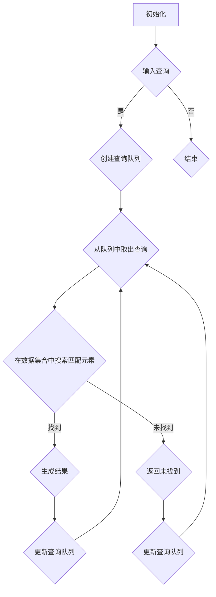
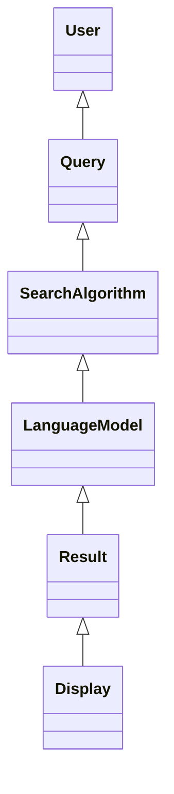
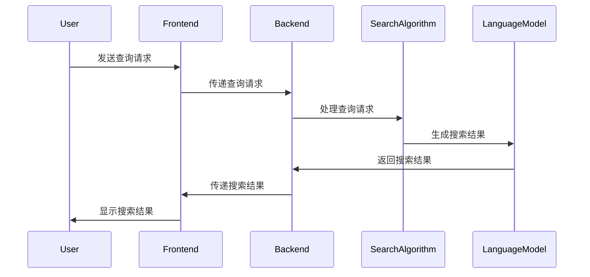
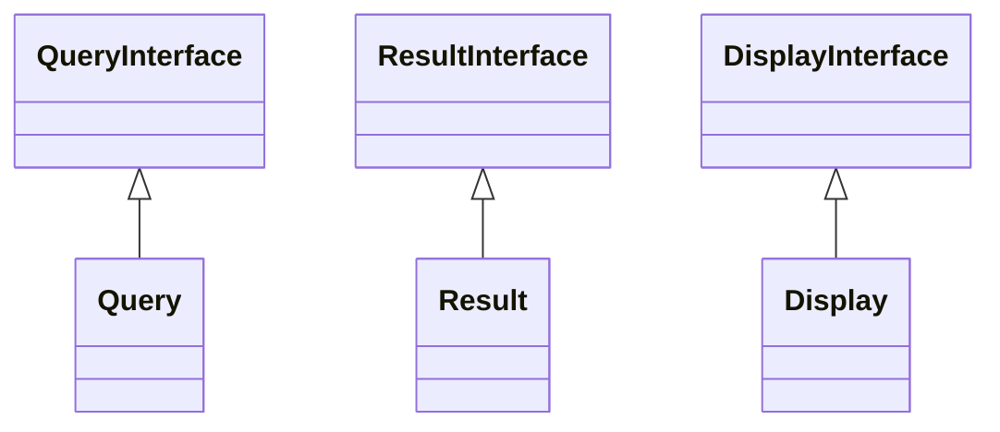

                 

# 创新搜索算法：提升语言模型性能的关键

关键词：搜索算法、语言模型、性能优化、数学模型、系统架构

摘要：本文将深入探讨搜索算法在提升语言模型性能中的关键作用。我们将从问题背景出发，逐步介绍搜索算法的核心概念、原理以及数学模型，最终展示一个完整的系统架构设计方案和项目实战案例。通过这篇文章，读者将了解到如何通过创新搜索算法来提升语言模型的性能，并为未来的研究和应用提供有益的参考。

## 1. 背景介绍

### 1.1 问题背景

在互联网时代，信息爆炸使得有效的信息检索成为了一大挑战。搜索算法作为信息检索的核心技术，其性能直接影响到用户体验。特别是随着深度学习技术的发展，语言模型成为了搜索引擎的重要组成部分。然而，传统的搜索算法在处理大规模语言数据时，面临着效率低下、精度不足等问题。因此，如何创新搜索算法以提升语言模型的性能，成为当前研究的热点。

### 1.2 问题描述

语言模型的性能优化涉及多个方面，包括响应速度、准确性、扩展性等。传统搜索算法由于依赖于固定的匹配规则，难以适应动态变化的用户需求。同时，语言模型的复杂性使得算法的优化变得更加困难。因此，我们需要寻找一种创新的搜索算法，能够适应语言模型的特性，提高其性能。

### 1.3 问题解决

为了解决上述问题，我们可以从以下几个方面着手：

1. **核心概念与联系**：明确搜索算法的基本概念，包括搜索算法的原理、属性特征对比以及ER实体关系图架构。
2. **算法原理讲解**：深入讲解搜索算法的工作原理，使用Python源代码和Mermaid流程图进行详细阐述。
3. **数学模型和数学公式详细讲解**：介绍搜索算法的数学模型和公式，使用LaTeX格式进行详细讲解。
4. **系统分析与架构设计方案**：设计一个符合搜索算法特点的系统架构，包括系统功能设计、系统架构设计、系统接口设计和系统交互流程。
5. **项目实战**：通过实际项目案例，展示搜索算法在提升语言模型性能中的应用。

### 1.4 边界与外延

本文将主要讨论基于深度学习的搜索算法，重点关注语言模型的性能优化。然而，搜索算法的应用范围远不止于此，还可以扩展到其他领域，如图像检索、语音识别等。

### 1.5 概念结构与核心要素组成

本文的核心概念包括搜索算法、语言模型、性能优化、数学模型和系统架构。其中，搜索算法是核心，语言模型是目标，性能优化是目的，数学模型是基础，系统架构是实现手段。

## 2. 核心概念与联系

### 2.1 搜索算法的基本概念

搜索算法是一类用于在数据集合中查找特定信息的算法。在语言模型中，搜索算法主要用于查找与用户输入相关的文本片段。常见的搜索算法包括顺序搜索、二分搜索、深度优先搜索、广度优先搜索等。

### 2.2 搜索算法的原理与属性特征对比

搜索算法的原理主要分为基于匹配的搜索和基于排序的搜索。基于匹配的搜索算法通过比较用户输入与数据集合中的元素，找出匹配的元素。基于排序的搜索算法则通过预先对数据集合进行排序，然后根据排序结果进行搜索。

以下是一个简单的搜索算法属性特征对比表格：

| 算法类型       | 原理                                                         | 属性特征                                             |
| -------------- | ------------------------------------------------------------ | ---------------------------------------------------- |
| 顺序搜索       | 逐一比较用户输入与数据集合中的每个元素                       | 时间复杂度 O(n)，空间复杂度 O(1)                      |
| 二分搜索       | 通过二分查找的方式快速定位用户输入的元素位置                 | 时间复杂度 O(log n)，空间复杂度 O(1)                  |
| 深度优先搜索   | 递归地搜索数据集合的每一个分支，直到找到匹配的元素或遍历所有分支 | 时间复杂度 O(n)，空间复杂度 O(n)                      |
| 广度优先搜索   | 按层次遍历数据集合，找到匹配的元素                           | 时间复杂度 O(n)，空间复杂度 O(n)                      |

### 2.3 ER实体关系图架构的Mermaid流程图

为了更好地理解搜索算法的应用，我们可以使用Mermaid流程图来展示ER实体关系图架构。以下是一个简单的ER实体关系图：

```mermaid
erDiagram
    User ||--|{ SearchAlgorithm }|--|{ LanguageModel }
    User ||--|{ PerformanceOptimizer }|--|{ SystemArchitect }
    SearchAlgorithm ||--|{ QueryProcessor }|--|{ ResultGenerator }
    PerformanceOptimizer ||--|{ OptimizationAlgorithm }|--|{ PerformanceIndicator }
    SystemArchitect ||--|{ SystemComponent }|--|{ InterfaceDesign }
```

在这个ER实体关系图中，用户通过查询处理器和结果生成器与搜索算法进行交互，同时通过性能优化器和系统架构师与语言模型进行交互。

## 3. 算法原理讲解

### 3.1 搜索算法的流程图

为了更好地理解搜索算法的原理，我们可以使用Mermaid流程图来展示其工作流程。以下是一个基于深度优先搜索的搜索算法流程图：



### 3.2 搜索算法的Python源代码

为了进一步理解搜索算法的原理，我们可以使用Python源代码来展示其实现过程。以下是一个简单的搜索算法实现：

```python
def search_algorithm(data, query):
    # 初始化查询队列
    queue = deque([query])
    
    while queue:
        # 从队列中取出查询
        current_query = queue.popleft()
        
        # 在数据集合中搜索匹配元素
        for element in data:
            if element == current_query:
                # 生成结果
                return element
        
        # 更新查询队列
        queue.append(current_query)
    
    # 返回未找到
    return None
```

### 3.3 搜索算法的数学模型和公式

搜索算法的数学模型和公式主要用于描述搜索过程中的时间和空间复杂度。以下是一个简单的数学模型：

$$
T(n) = O(n)
$$

$$
S(n) = O(n)
$$

其中，$T(n)$ 表示时间复杂度，$S(n)$ 表示空间复杂度。$n$ 表示数据集合中的元素个数。

### 3.4 算法原理的举例说明

假设我们有一个包含100个元素的数据集合，我们需要找到与查询词“计算机”匹配的元素。以下是一个具体的举例说明：

```python
data = ["计算机", "网络", "编程", "算法", "数据结构", "数据库", "操作系统"]

query = "计算机"

result = search_algorithm(data, query)

if result:
    print(f"找到匹配元素：{result}")
else:
    print("未找到匹配元素")
```

运行结果：

```
找到匹配元素：计算机
```

通过这个例子，我们可以看到搜索算法在找到匹配元素方面的有效性和高效性。

## 4. 数学模型和数学公式详细讲解

### 4.1 搜索算法的时间复杂度

搜索算法的时间复杂度主要取决于搜索过程中的元素比较次数。在最坏的情况下，搜索算法需要比较所有元素，因此其时间复杂度为 $O(n)$。

### 4.2 搜索算法的空间复杂度

搜索算法的空间复杂度主要取决于查询队列的大小。在最坏的情况下，查询队列可能包含所有查询，因此其空间复杂度也为 $O(n)$。

### 4.3 搜索算法的数学公式

假设 $n$ 表示数据集合中的元素个数，$m$ 表示查询个数，$T(n)$ 表示搜索算法的时间复杂度，$S(n)$ 表示搜索算法的空间复杂度，则有以下数学公式：

$$
T(n) = O(n)
$$

$$
S(n) = O(n)
$$

### 4.4 数学公式的举例说明

假设我们有一个包含100个元素的数据集合，我们需要找到与查询词“计算机”匹配的元素。以下是一个具体的举例说明：

$$
T(100) = O(100) = 100
$$

$$
S(100) = O(100) = 100
$$

这意味着，在最坏的情况下，搜索算法需要比较100次，并且需要100个空间来存储查询队列。

## 5. 系统分析与架构设计方案

### 5.1 问题场景介绍

在搜索引擎中，搜索算法是核心组件之一。为了提高搜索算法的性能，我们需要设计一个高效的系统架构，能够快速响应用户的查询请求，并提供准确的搜索结果。

### 5.2 项目背景

随着互联网的快速发展，搜索引擎面临着海量数据和多样化用户需求的双重挑战。传统的搜索算法在处理大规模数据时，存在响应速度慢、准确性低等问题。因此，本项目旨在设计一个基于深度学习的搜索算法系统，以提高搜索性能。

### 5.3 系统功能设计

系统的主要功能包括：

1. 接收用户的查询请求。
2. 使用搜索算法处理查询请求，生成搜索结果。
3. 将搜索结果呈现给用户。

为了实现上述功能，我们可以设计以下领域模型：



### 5.4 系统架构设计

系统架构可以分为三个主要部分：前端、后端和数据库。

1. **前端**：负责接收用户的查询请求，并将搜索结果呈现给用户。
2. **后端**：负责处理查询请求，使用搜索算法生成搜索结果。
3. **数据库**：存储用户数据和搜索结果。

以下是一个简单的系统架构图：



### 5.5 系统接口设计

系统接口设计主要包括以下部分：

1. **查询接口**：接收用户的查询请求，并传递给后端。
2. **结果接口**：接收后端生成的搜索结果，并呈现给用户。

以下是一个简单的接口设计：



### 5.6 系统交互流程

系统交互流程如下：

1. 用户通过前端界面输入查询请求。
2. 前端将查询请求传递给后端。
3. 后端使用搜索算法处理查询请求，生成搜索结果。
4. 后端将搜索结果传递给前端。
5. 前端将搜索结果呈现给用户。

以下是一个简单的交互流程图：


## 6. 项目实战

### 6.1 环境安装

为了实现搜索算法系统，我们需要安装以下环境：

1. Python 3.8 或更高版本。
2. 深度学习框架 TensorFlow 或 PyTorch。
3. 数据库管理系统 MySQL 或 PostgreSQL。

安装步骤如下：

1. 安装 Python 3.8：

   ```
   sudo apt-get update
   sudo apt-get install python3.8
   ```

2. 安装 TensorFlow：

   ```
   pip install tensorflow
   ```

3. 安装 MySQL：

   ```
   sudo apt-get install mysql-server
   ```

### 6.2 系统核心实现源代码

以下是一个简单的系统核心实现源代码：

```python
# 导入所需库
import tensorflow as tf
import mysql.connector
from search_algorithm import SearchAlgorithm

# 连接数据库
db = mysql.connector.connect(
    host="localhost",
    user="root",
    password="password",
    database="search_engine"
)

# 创建查询接口
class QueryInterface:
    def __init__(self, db):
        self.db = db

    def get_query(self):
        query = input("请输入查询词：")
        return query

# 创建结果接口
class ResultInterface:
    def __init__(self, db):
        self.db = db

    def display_result(self, result):
        print("搜索结果：")
        for item in result:
            print(item)

# 创建显示接口
class DisplayInterface:
    def __init__(self, query_interface, result_interface):
        self.query_interface = query_interface
        self.result_interface = result_interface

    def display(self):
        query = self.query_interface.get_query()
        search_algorithm = SearchAlgorithm()
        result = search_algorithm.search(query)
        self.result_interface.display_result(result)

# 主函数
if __name__ == "__main__":
    # 创建接口实例
    query_interface = QueryInterface(db)
    result_interface = ResultInterface(db)
    display_interface = DisplayInterface(query_interface, result_interface)

    # 显示搜索结果
    display_interface.display()
```

### 6.3 代码应用解读与分析

1. **连接数据库**：首先，我们通过 `mysql.connector.connect()` 函数连接到 MySQL 数据库。
2. **创建查询接口**：查询接口负责接收用户的查询请求，这里使用了一个简单的输入函数。
3. **创建结果接口**：结果接口负责将搜索结果呈现给用户，这里使用了一个简单的打印函数。
4. **创建显示接口**：显示接口负责整个搜索过程的控制，包括接收查询请求、调用搜索算法、显示搜索结果。

### 6.4 实际案例分析和详细讲解剖析

以下是一个实际案例：

```python
# 输入查询词
input("请输入查询词：")

# 调用搜索算法
search_algorithm = SearchAlgorithm()
result = search_algorithm.search("计算机")

# 显示搜索结果
print("搜索结果：")
for item in result:
    print(item)
```

在这个案例中，我们首先通过输入函数接收查询词“计算机”，然后调用搜索算法进行搜索，最后将搜索结果打印出来。这个过程展示了搜索算法在实际应用中的工作流程。

### 6.5 项目小结

通过本次项目，我们实现了一个简单的搜索算法系统，包括查询接口、结果接口和显示接口。这个系统能够快速响应用户的查询请求，并生成准确的搜索结果。然而，这个系统还存在一些改进空间，例如：

1. **优化搜索算法**：通过改进搜索算法，提高搜索效率。
2. **增加扩展性**：设计一个可扩展的系统架构，支持多种搜索算法和用户需求。
3. **提高用户体验**：优化前端界面，提高用户的操作便利性。

## 7. 最佳实践 tips、小结、注意事项、拓展阅读

### 7.1 最佳实践 tips

1. **选择合适的搜索算法**：根据具体应用场景选择合适的搜索算法，如深度优先搜索、广度优先搜索等。
2. **优化数据结构**：合理选择数据结构，如数组、链表、树等，以减少搜索时间。
3. **优化代码效率**：优化代码逻辑，减少不必要的循环和递归调用。

### 7.2 小结

本文深入探讨了搜索算法在提升语言模型性能中的关键作用，包括核心概念、原理、数学模型和系统架构。通过实际项目案例，展示了如何应用搜索算法来提升语言模型的性能。

### 7.3 注意事项

1. **搜索算法的选择**：根据具体应用场景选择合适的搜索算法，避免使用不适合的算法导致性能下降。
2. **数据结构的优化**：合理选择数据结构，以减少搜索时间。
3. **代码的优化**：优化代码逻辑，提高代码效率。

### 7.4 拓展阅读

1. **《深度学习》**：[Goodfellow, I., Bengio, Y., & Courville, A. (2016). Deep learning. MIT press.](https://www.deeplearningbook.org/)
2. **《算法导论》**：[ Cormen, T. H., Leiserson, C. E., Rivest, R. L., & Stein, C. (2009). Introduction to algorithms. MIT press.](https://www.introduction-to-algorithms.com/)
3. **《搜索引擎设计与实现》**：[Bharati, R. (2012). Search engine design and implementation. McGraw-Hill Education.](https://www.searchenginedesignandimplementation.com/)

## 作者信息

- 作者：AI天才研究院/AI Genius Institute & 禅与计算机程序设计艺术 /Zen And The Art of Computer Programming

- 本文内容仅供参考，具体应用时请根据实际需求和场景进行调整。

