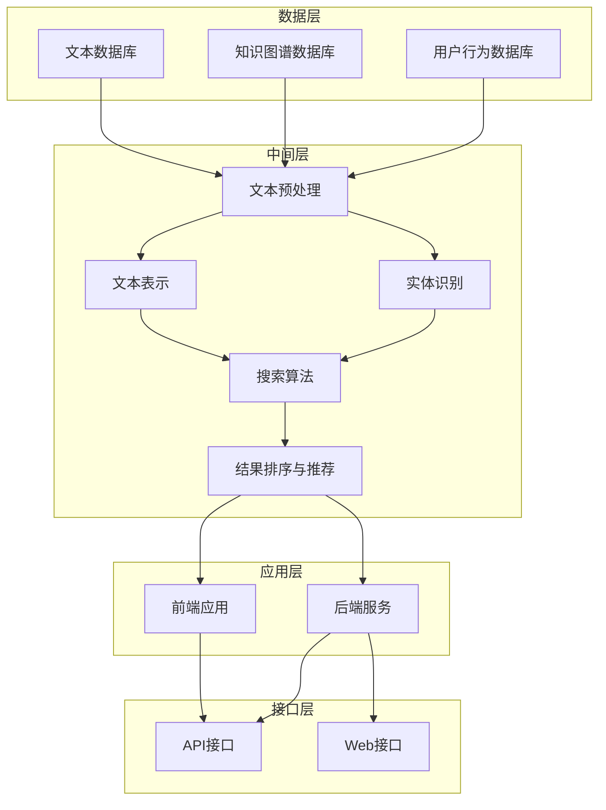
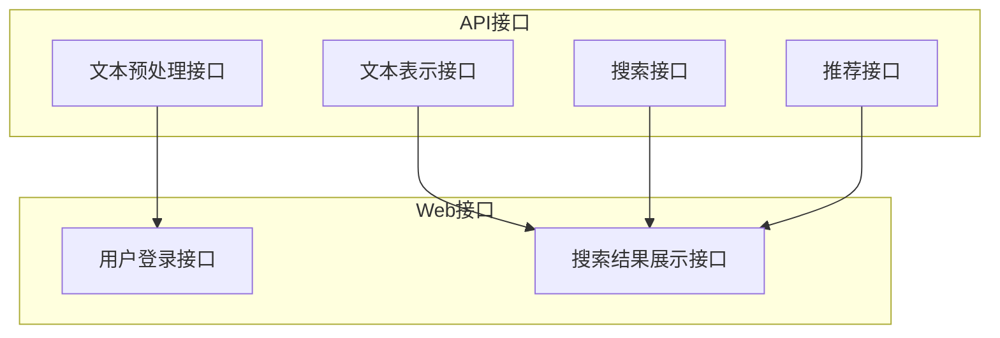
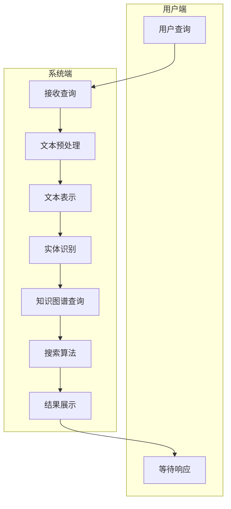

                 

### 文章标题

# 创新搜索算法在NLP中的应用

> 关键词：自然语言处理（NLP）、深度学习、图神经网络、强化学习、搜索算法

> 摘要：本文从创新搜索算法的背景出发，探讨了自然语言处理（NLP）领域中各种创新搜索算法的应用，包括基于深度学习、图神经网络和强化学习的搜索算法。通过详细分析这些算法的原理、数学模型和应用案例，本文旨在为NLP领域的研究者和开发者提供有价值的参考。

## 目录大纲

----------------------------------------------------------------

# 第一部分: 创新搜索算法概述

## 第1章: 创新搜索算法的背景与概述

### 1.1.1 问题背景

### 1.1.2 问题描述

### 1.1.3 问题解决与边界

### 1.1.4 核心概念与联系

## 第2章: 核心概念原理

### 2.1.1 深度学习原理

### 2.1.2 图神经网络原理

### 2.1.3 强化学习原理

## 第3章: 算法原理讲解

### 3.1.1 基于深度学习的搜索算法

### 3.1.2 基于图神经网络的搜索算法

### 3.1.3 基于强化学习的搜索算法

## 第4章: 数学模型和数学公式

### 4.1.1 深度学习模型

### 4.1.2 图神经网络模型

### 4.1.3 强化学习模型

## 第5章: 系统分析与架构设计

### 5.1 问题场景介绍

### 5.2 系统功能设计

### 5.3 系统架构设计

### 5.4 系统接口设计

### 5.5 系统交互

## 第6章: 项目实战

### 6.1 环境安装

### 6.2 系统核心实现

### 6.3 代码应用解读

### 6.4 实际案例分析

### 6.5 项目小结

## 第7章: 最佳实践与拓展阅读

### 7.1 最佳实践

### 7.2 小结

### 7.3 注意事项

### 7.4 拓展阅读

----------------------------------------------------------------

## 第1章: 创新搜索算法的背景与概述

### 1.1.1 问题背景

搜索算法在自然语言处理（NLP）领域扮演着至关重要的角色。随着互联网和大数据时代的到来，人们生成和消费的信息量呈指数级增长。传统的搜索算法，如基于关键词匹配的方法，已经无法满足用户日益复杂的搜索需求。用户希望搜索系统能够理解他们的查询意图，提供更加精准、个性化的搜索结果。

在NLP领域，搜索算法的应用范围广泛，包括信息检索、推荐系统、问答系统、实体链接和文本分类等。例如，搜索引擎需要处理海量的文本数据，为用户提供准确的搜索结果；推荐系统需要根据用户的兴趣和行为，推荐相关的信息；问答系统需要理解用户的问题，并给出合理的答案。

然而，传统的搜索算法在处理噪声数据、多义词、长文本等方面存在显著的不足。噪声数据可能包含无关的信息，影响搜索结果的准确性；多义词使得算法难以确定查询的具体含义；长文本的处理更是增加了算法的复杂性。因此，研究创新搜索算法以提高搜索结果的准确性、实时性和用户体验，成为了NLP领域的重要课题。

### 1.1.2 问题描述

随着互联网信息的爆炸式增长，用户在海量数据中查找所需信息变得越来越困难。传统的搜索算法在处理噪声数据、多义词、长文本等方面存在不足，导致搜索结果的准确性和实时性受到限制。具体来说，问题描述如下：

1. **噪声数据**：互联网上的信息量庞大，但其中包含大量的噪声数据，如广告、垃圾信息等。这些噪声数据会干扰搜索结果，降低用户满意度。
2. **多义词**：自然语言中存在许多多义词，即一个单词可以有多种含义。这给算法理解用户查询的意图带来了挑战，容易导致搜索结果不准确。
3. **长文本**：长文本的处理是搜索算法的一大难题。传统的算法往往基于词频统计或简单的关键词匹配，难以捕捉文本中的深层语义信息。

为了解决上述问题，创新搜索算法应具备以下特点：

1. **理解用户意图**：算法应能够理解用户的查询意图，而不是简单地匹配关键词。这需要深入分析用户查询的上下文和语义。
2. **处理噪声数据**：算法应具备过滤噪声数据的能力，提高搜索结果的准确性。
3. **实时性**：算法应能够快速处理用户查询，提供实时搜索结果。

### 1.1.3 问题解决与边界

创新搜索算法通过引入深度学习、图神经网络、强化学习等先进技术，提高了对用户查询的理解能力，能够更好地处理噪声数据和复杂语义。这些算法在NLP领域取得了显著的进展，但同时也存在一些局限性：

1. **计算复杂度高**：深度学习算法通常需要大量的计算资源和时间，特别是在处理大规模数据集时。这限制了其在某些应用场景中的实用性。
2. **模型可解释性差**：深度学习模型在训练过程中自动学习特征，导致模型内部结构复杂，难以解释。这对于需要可解释性的应用场景（如医疗诊断、金融风险管理等）来说是一个挑战。
3. **数据依赖性强**：强化学习算法通常需要大量的数据进行训练，以便学习最优策略。在某些数据稀缺或动态变化的场景中，强化学习算法的效果可能较差。

因此，尽管创新搜索算法在NLP领域取得了显著进展，但仍然需要进一步优化和改进。未来研究可以关注以下方向：

1. **模型优化**：通过改进算法结构、优化训练策略，降低计算复杂度和提高模型可解释性。
2. **多模态融合**：结合多种数据源（如文本、图像、语音等），提高搜索算法的多样性和鲁棒性。
3. **领域自适应**：通过自适应方法，使搜索算法能够快速适应不同领域和场景。

### 1.1.4 核心概念与联系

在讨论创新搜索算法时，需要了解一些核心概念，这些概念在NLP领域具有重要应用。以下是几个关键概念及其相互联系：

- **深度学习（Deep Learning）**：深度学习是一种通过多层神经网络进行特征学习和预测的技术。它能够自动从数据中提取复杂的特征，提高模型的预测能力和泛化能力。深度学习在图像识别、语音识别、自然语言处理等领域取得了显著成果。
- **图神经网络（Graph Neural Networks）**：图神经网络是一种处理图结构数据的神经网络。它通过考虑节点和边之间的关系，能够对实体和关系进行建模。图神经网络在实体链接、知识图谱、推荐系统等领域具有广泛应用。
- **强化学习（Reinforcement Learning）**：强化学习是一种通过试错和奖励机制进行决策和学习的技术。它通过与环境交互，学习最优策略，适用于动态变化和复杂决策问题。强化学习在游戏、自动驾驶、自然语言生成等领域得到了深入研究。

这些核心概念在创新搜索算法中有着紧密的联系。深度学习提供了强大的特征提取和表示能力，使得算法能够更好地理解用户查询和文本内容；图神经网络则通过建模实体和关系，提高了搜索结果的准确性和鲁棒性；强化学习则通过自适应学习和策略优化，提高了搜索算法的实时性和动态适应性。

通过结合这些核心概念，创新搜索算法能够更好地应对NLP领域的挑战，提供更高质量和更个性化的搜索服务。接下来，本文将详细讨论这些核心概念的原理和应用。

## 第2章: 核心概念原理

在探讨创新搜索算法时，理解其中的核心概念至关重要。本章将详细解释深度学习、图神经网络和强化学习的基本原理，并分析这些概念在NLP领域的应用。

### 2.1.1 深度学习原理

深度学习是一种基于多层神经网络进行特征学习和预测的技术。其核心思想是通过前向传播和反向传播算法，将原始数据通过多层非线性变换，提取出高层次的抽象特征，从而实现复杂的任务。以下是深度学习中的几个关键组成部分：

#### 2.1.1.1 多层感知机（MLP）

多层感知机（MLP）是深度学习的基础结构，它由输入层、多个隐藏层和输出层组成。每个隐藏层通过非线性激活函数（如ReLU、Sigmoid或Tanh）对输入数据进行变换，从而实现数据的层次化表示。以下是MLP的基本工作原理：

1. **前向传播**：输入数据从输入层传递到隐藏层，再从隐藏层传递到输出层。在每个层次上，神经元对数据进行加权求和，并加上偏置项，最后通过激活函数进行非线性变换。
   
   $$ 
   z_{l} = \sum_{i=0}^{n} w_{l,i} x_{i} + b_{l} 
   $$
   
   其中，$z_{l}$ 是第$l$层的输出，$w_{l,i}$ 是连接第$l-1$层神经元和第$l$层神经元的权重，$b_{l}$ 是第$l$层的偏置项，$x_{i}$ 是第$l-1$层的输入。

2. **反向传播**：在输出层得到预测结果后，通过计算预测值与真实值之间的误差，将误差反向传播到每个隐藏层。在每个层上，通过梯度下降法更新权重和偏置项，以最小化整体误差。

   $$ 
   \delta_{l} = \frac{\partial L}{\partial z_{l}} \cdot \sigma'(z_{l}) 
   $$
   
   其中，$L$ 是损失函数，$\sigma'(z_{l})$ 是激活函数的导数。

#### 2.1.1.2 卷积神经网络（CNN）

卷积神经网络（CNN）通过卷积层提取图像特征，适用于图像处理和文本分类任务。CNN的主要优势在于其能够自动学习图像中的局部特征，并在不同层上逐渐提取更高层次的抽象特征。以下是CNN的基本结构：

1. **卷积层**：卷积层通过卷积运算提取图像特征。卷积核是一个小的窗口，在图像上滑动并计算窗口内像素的加权和，再经过激活函数处理。

   $$ 
   h_{v}^{(l)} = \sum_{u \in N(v)} w^{(l)} \cdot h_{u}^{(l-1)} + b^{(l)} 
   $$
   
   其中，$h_{v}^{(l)}$ 是第$l$层第$v$个神经元的激活值，$N(v)$ 是与第$v$个神经元相连的神经元集合，$w^{(l)}$ 是卷积核的权重，$b^{(l)}$ 是偏置项。

2. **池化层**：池化层通过下采样操作减少数据维度，增强模型的泛化能力。常见的池化方法包括最大池化和平均池化。

3. **全连接层**：在提取到足够高的层次特征后，通过全连接层进行分类或回归任务。

#### 2.1.1.3 循环神经网络（RNN）

循环神经网络（RNN）通过循环结构处理序列数据，适用于文本生成和语音识别任务。RNN的核心优势在于其能够保持长期的序列依赖关系。以下是RNN的基本工作原理：

1. **隐藏状态**：RNN在处理序列数据时，每个时间步的输出不仅取决于当前输入，还受到之前隐藏状态的影响。

   $$ 
   h_{t} = \sigma(W_h \cdot [h_{t-1}, x_{t}] + b_h) 
   $$
   
   其中，$h_{t}$ 是第$t$个时间步的隐藏状态，$x_{t}$ 是第$t$个时间步的输入，$\sigma$ 是激活函数，$W_h$ 和$b_h$ 是权重和偏置。

2. **门控机制**：长短期记忆网络（LSTM）和门控循环单元（GRU）通过门控机制改进了RNN，解决了长期依赖问题。LSTM使用遗忘门、输入门和输出门来控制信息的流动，GRU则通过更新门和重置门实现类似的功能。

### 2.1.2 图神经网络原理

图神经网络（GNN）是一种处理图结构数据的神经网络，通过考虑节点和边之间的关系，能够对实体和关系进行建模。GNN在实体链接、知识图谱、推荐系统等领域具有广泛应用。以下是GNN的基本原理：

#### 2.1.2.1 图卷积网络（GCN）

图卷积网络（GCN）通过卷积操作在图结构上提取特征，适用于节点分类和图分类任务。以下是GCN的基本结构：

1. **邻接矩阵**：首先将图结构表示为邻接矩阵$A$，其中$A_{uv}$表示节点$u$和节点$v$之间是否存在边。
2. **图卷积操作**：图卷积操作通过邻接矩阵和卷积核$W$进行特征提取。

   $$ 
   h_{v}^{(l+1)} = \sum_{u \in N(v)} \frac{1}{\sqrt{d_{u}d_{v}}}\cdot W^{(l)} \cdot h_{u}^{(l)} 
   $$
   
   其中，$h_{v}^{(l+1)}$ 是第$l+1$层第$v$个节点的特征，$N(v)$ 是与节点$v$相邻的节点集合，$d_{u}$ 和$d_{v}$ 分别是节点$u$和节点$v$的度数。

3. **非线性激活**：通过非线性激活函数（如ReLU）对特征进行变换。

4. **聚合操作**：将节点的邻居特征进行聚合，形成新的节点特征。

#### 2.1.2.2 图注意力网络（GAT）

图注意力网络（GAT）通过注意力机制对邻居节点进行加权，提高模型的建模能力。以下是GAT的基本结构：

1. **注意力机制**：通过注意力权重$\alpha_{uv}$对邻居节点的特征进行加权。

   $$ 
   \alpha_{uv} = \sigma(W^{(l)} \cdot [h_{u}^{(l)}, h_{v}^{(l)}]) 
   $$
   
   其中，$\sigma$ 是非线性激活函数，$W^{(l)}$ 是注意力权重矩阵。

2. **加权聚合**：将加权后的邻居节点特征进行聚合。

   $$ 
   h_{v}^{(l+1)} = \sum_{u \in N(v)} \alpha_{uv} \cdot h_{u}^{(l)} 
   $$

### 2.1.3 强化学习原理

强化学习（Reinforcement Learning，RL）是一种通过试错和奖励机制进行决策和学习的技术。在强化学习中，智能体（Agent）通过与环境的交互，学习最优策略以实现目标。以下是强化学习的基本原理：

#### 2.1.3.1 Q学习（Q-Learning）

Q学习通过迭代更新Q值来学习最优策略。Q值表示在特定状态下采取特定动作的预期回报。

1. **状态-动作值函数**：Q值函数$Q(s, a)$表示在状态$s$下采取动作$a$的预期回报。

2. **Q值更新**：通过迭代更新Q值，直到收敛。

   $$ 
   Q(s, a) \leftarrow Q(s, a) + \alpha [r + \gamma \max_{a'} Q(s', a')] - Q(s, a)] 
   $$
   
   其中，$\alpha$ 是学习率，$r$ 是即时奖励，$\gamma$ 是折扣因子，$s'$ 和 $a'$ 分别是下一状态和动作。

#### 2.1.3.2 深度Q网络（DQN）

深度Q网络（DQN）通过深度神经网络来近似Q值函数，适用于动态环境。DQN的主要优势在于其能够处理高维状态空间和动作空间。

1. **神经网络近似Q值函数**：使用深度神经网络$Q(s, a; \theta)$来近似Q值函数。

2. **经验回放**：通过经验回放机制，避免智能体过度依赖近期经验，提高学习稳定性。

3. **目标网络**：通过定期更新目标网络$Q(s, a; \theta^{-})$，减少梯度消失和梯度爆炸问题。

以上是深度学习、图神经网络和强化学习的基本原理。这些核心概念在创新搜索算法中发挥着关键作用，能够提高搜索结果的准确性、实时性和用户体验。接下来，本文将详细讨论各种创新搜索算法的原理和应用。

## 第3章: 算法原理讲解

在了解了核心概念原理后，我们将深入探讨几种创新搜索算法的原理，包括基于深度学习、图神经网络和强化学习的搜索算法。这些算法通过不同的技术手段，解决了传统搜索算法在处理噪声数据、多义词和长文本等方面的不足。

### 3.1.1 基于深度学习的搜索算法

深度学习在搜索算法中的应用主要体现在文本表示和语义理解方面。以下介绍两种具有代表性的深度学习搜索算法：Word2Vec和BERT。

#### 3.1.1.1 Word2Vec

Word2Vec是一种基于神经网络的文本表示方法，它将单词映射到低维向量空间，从而实现了词嵌入（Word Embedding）。以下是Word2Vec的基本原理：

1. **Skip-Gram模型**：Word2Vec使用Skip-Gram模型将输入文本转换为词向量。在每个单词作为输入的情况下，模型预测这个单词的上下文词。

   $$ 
   P(w_i | w_j) = \frac{exp(\boldsymbol{v}_{w_i} \cdot \boldsymbol{v}_{w_j})}{\sum_{w_k \in V} exp(\boldsymbol{v}_{w_i} \cdot \boldsymbol{v}_{w_k})}
   $$
   
   其中，$\boldsymbol{v}_{w_i}$ 是单词$w_i$的向量表示，$V$ 是词汇表。

2. **目标词与上下文词的关系**：通过优化目标词和上下文词之间的概率分布，训练词向量模型。

3. **词向量表示**：训练完成后，每个单词都对应一个向量，这些向量能够捕获单词的语义信息。

Word2Vec的优点在于其能够生成高质量的词向量，从而提高文本处理和搜索任务的性能。然而，Word2Vec在处理长文本和句子层次语义时，存在一定的局限性。

#### 3.1.1.2 BERT

BERT（Bidirectional Encoder Representations from Transformers）是一种基于转换器的双向编码表示模型，它通过预训练大规模语料库中的上下文信息，提高了对自然语言的理解能力。以下是BERT的基本原理：

1. **转换器模型**：BERT基于转换器（Transformer）模型，它通过自注意力机制（Self-Attention）处理序列数据，能够捕获长距离的依赖关系。

   $$ 
   \text{Attention}(Q, K, V) = \text{softmax}\left(\frac{QK^T}{\sqrt{d_k}}\right)V 
   $$
   
   其中，$Q$、$K$ 和 $V$ 分别是查询向量、键向量和值向量，$d_k$ 是键向量的维度。

2. **双向编码**：BERT采用双向编码方式，既考虑了当前词的前后文信息，又考虑了后文的前文信息，从而更好地理解词的上下文。

3. **预训练与微调**：BERT首先在大规模语料库上进行预训练，学习语言的一般规律和特征。然后，在特定任务上进行微调，使模型能够适应特定的任务需求。

BERT在文本分类、问答系统和信息检索等任务中取得了显著的成果，其强大的语义理解能力为搜索算法提供了坚实的基础。

### 3.1.2 基于图神经网络的搜索算法

图神经网络（Graph Neural Networks，GNN）通过建模实体和关系，提高了搜索结果的准确性和鲁棒性。以下介绍两种基于图神经网络的搜索算法：HAN和GRU。

#### 3.1.2.1 HAN

HAN（Hierarchical Attention Network）通过结合文本和知识图谱的信息，提高了搜索结果的准确性。HAN的基本原理如下：

1. **文本编码**：首先使用词嵌入（如Word2Vec或BERT）将文本序列转换为向量表示。

2. **知识图谱编码**：将知识图谱中的实体和关系表示为向量，通过图卷积操作聚合邻居节点的特征。

3. **层次注意力机制**：HAN采用层次注意力机制，分别对实体和关系进行加权，从而提高搜索结果的精度。

   $$ 
   h_{v}^{(l+1)} = \alpha_{e,v} \cdot h_{e,v} + \alpha_{r,v} \cdot h_{r,v} 
   $$
   
   其中，$h_{e,v}$ 和 $h_{r,v}$ 分别是实体和关系的向量表示，$\alpha_{e,v}$ 和 $\alpha_{r,v}$ 是实体和关系的注意力权重。

4. **融合表示**：将加权后的实体和关系特征进行融合，形成最终的实体表示。

HAN在实体链接和知识图谱推理等任务中表现出色，其强大的信息融合能力为搜索算法提供了有力支持。

#### 3.1.2.2 GRU

GRU（Gated Recurrent Unit）是RNN的一种改进版本，通过门控机制提高了对序列数据的建模能力。GRU在搜索算法中的应用主要体现在长文本处理方面。以下是GRU的基本原理：

1. **门控机制**：GRU通过更新门（Update Gate）和重置门（Reset Gate）控制信息的流动，从而提高了对长期依赖关系的捕捉能力。

   $$ 
   z_t = \sigma(W_z \cdot [h_{t-1}, x_t] + b_z) 
   $$
   
   $$ 
   r_t = \sigma(W_r \cdot [h_{t-1}, x_t] + b_r) 
   $$
   
   $$ 
   h_t = z_t \odot \text{tanh}(W_h \cdot [r_t \odot h_{t-1}, x_t] + b_h) 
   $$
   
   其中，$z_t$、$r_t$ 和 $h_t$ 分别是更新门、重置门和隐藏状态，$W_z$、$W_r$ 和 $W_h$ 分别是权重矩阵，$b_z$、$b_r$ 和 $b_h$ 分别是偏置项。

2. **序列建模**：GRU通过门控机制对序列数据进行建模，从而能够更好地处理长文本和复杂语义。

GRU在问答系统和长文本检索等任务中表现出色，其强大的序列建模能力为搜索算法提供了有效支持。

### 3.1.3 基于强化学习的搜索算法

强化学习（Reinforcement Learning，RL）通过试错和奖励机制进行决策和学习，能够提高搜索算法的自主学习和适应能力。以下介绍两种基于强化学习的搜索算法：RankSVM和在线学习。

#### 3.1.3.1 RankSVM

RankSVM通过学习排序模型来优化搜索结果。RankSVM的基本原理如下：

1. **排序损失函数**：RankSVM通过最大化负对数似然损失函数来优化排序模型。

   $$ 
   L = -\sum_{i=1}^{N} y_i \log p(x_i) - (1 - y_i) \log (1 - p(x_i)) 
   $$
   
   其中，$y_i$ 是第$i$个样本的标签，$p(x_i)$ 是模型对第$i$个样本的预测概率。

2. **特征提取**：RankSVM通过特征提取器（如深度神经网络）学习输入特征和标签之间的非线性关系。

3. **排序模型**：RankSVM通过学习得到的特征向量，对查询结果进行排序，从而提高搜索结果的准确性。

#### 3.1.3.2 在线学习

在线学习通过不断更新模型来适应新数据，提高搜索算法的实时性。以下是在线学习的基本原理：

1. **经验回放**：在线学习通过经验回放机制，避免模型过度依赖近期经验，提高学习稳定性。

2. **更新策略**：在线学习在接收到新的样本后，通过更新策略更新模型参数。

   $$ 
   \theta \leftarrow \theta + \alpha \cdot (r - \theta) 
   $$
   
   其中，$\theta$ 是模型参数，$r$ 是即时奖励，$\alpha$ 是学习率。

3. **自适应学习**：在线学习能够根据新的数据和奖励信号，自适应调整模型参数，从而提高搜索结果的实时性和适应性。

强化学习在动态变化的场景中表现出色，如实时推荐系统和动态搜索结果排序等。

综上所述，基于深度学习、图神经网络和强化学习的创新搜索算法，通过不同的技术手段，解决了传统搜索算法在处理噪声数据、多义词和长文本等方面的不足，为NLP领域提供了强大的技术支持。接下来，本文将介绍这些算法的数学模型和数学公式，进一步解析其工作原理。

### 3.1.4 数学模型和数学公式

在深入理解创新搜索算法时，数学模型和数学公式是至关重要的组成部分。本节将详细介绍基于深度学习、图神经网络和强化学习的搜索算法的数学模型，并通过具体的数学公式进行解析。

#### 3.1.4.1 深度学习模型

深度学习模型的核心在于其多层神经网络结构，包括前向传播和反向传播算法。以下是一些关键步骤及其对应的数学公式。

**1. 前向传播**

在深度学习的前向传播过程中，输入数据通过多层神经网络逐层传递，直到输出层得到预测结果。以下是前向传播的基本公式：

$$ 
z_{l} = W_{l} \cdot a_{l-1} + b_{l} 
$$

其中，$z_{l}$ 是第$l$层的输出，$a_{l-1}$ 是第$l-1$层的输出，$W_{l}$ 是第$l$层的权重矩阵，$b_{l}$ 是第$l$层的偏置项。

**2. 激活函数**

激活函数用于引入非线性特性，常见的激活函数包括ReLU、Sigmoid和Tanh。以下以ReLU为例：

$$ 
a_{l} = \max(0, z_{l}) 
$$

其中，$a_{l}$ 是第$l$层的激活值，$z_{l}$ 是第$l$层的输出。

**3. 反向传播**

在反向传播过程中，误差信号从输出层反向传播到输入层，用于更新权重和偏置项。以下是反向传播的基本公式：

$$ 
\delta_{l} = \frac{\partial L}{\partial z_{l}} \cdot \sigma'(z_{l}) 
$$

其中，$L$ 是损失函数，$\sigma'(z_{l})$ 是激活函数的导数。

**4. 梯度下降**

在反向传播过程中，使用梯度下降法更新权重和偏置项，以最小化损失函数。以下是梯度下降的基本公式：

$$ 
W_{l} \leftarrow W_{l} - \alpha \cdot \frac{\partial L}{\partial W_{l}} 
$$

$$ 
b_{l} \leftarrow b_{l} - \alpha \cdot \frac{\partial L}{\partial b_{l}} 
$$

其中，$\alpha$ 是学习率。

#### 3.1.4.2 图神经网络模型

图神经网络通过图结构对实体和关系进行建模，其核心在于图卷积操作和注意力机制。以下是一些关键步骤及其对应的数学公式。

**1. 图卷积操作**

图卷积操作通过聚合邻居节点的特征，形成新的节点特征。以下是图卷积操作的基本公式：

$$ 
h_{v}^{(l+1)} = \sum_{u \in N(v)} \frac{1}{\sqrt{d_{u}d_{v}}}\cdot W^{(l)} \cdot h_{u}^{(l)} 
$$

其中，$h_{v}^{(l+1)}$ 是第$l+1$层第$v$个节点的特征，$N(v)$ 是与节点$v$相邻的节点集合，$d_{u}$ 和$d_{v}$ 分别是节点$u$和节点$v$的度数，$W^{(l)}$ 是卷积核的权重。

**2. 注意力机制**

注意力机制通过考虑节点和边之间的关系，为每个邻居节点分配不同的权重。以下是注意力机制的基本公式：

$$ 
\alpha_{uv} = \frac{exp(\theta \cdot \phi(u, v))}{\sum_{w \in N(v)} exp(\theta \cdot \phi(w, v))}
$$

$$ 
h_{v}^{(l+1)} = \sum_{u \in N(v)} \alpha_{uv} \cdot h_{u}^{(l)} 
$$

其中，$\alpha_{uv}$ 是节点$u$和节点$v$之间的注意力权重，$\phi(u, v)$ 是节点$u$和节点$v$的特征向量，$\theta$ 是注意力权重。

#### 3.1.4.3 强化学习模型

强化学习通过试错和奖励机制进行决策和学习，其核心在于状态-动作值函数和策略优化。以下是一些关键步骤及其对应的数学公式。

**1. 状态-动作值函数**

状态-动作值函数$Q(s, a)$表示在状态$s$下采取动作$a$的预期回报。以下是Q值更新的基本公式：

$$ 
Q(s, a) \leftarrow Q(s, a) + \alpha [r + \gamma \max_{a'} Q(s', a')] - Q(s, a) 
$$

其中，$r$ 是即时奖励，$\gamma$ 是折扣因子，$\alpha$ 是学习率，$s'$ 和 $a'$ 分别是下一状态和动作。

**2. 深度Q网络**

深度Q网络（DQN）通过深度神经网络近似Q值函数，其核心在于经验回放和目标网络。以下是DQN的基本公式：

$$ 
Q(s, a; \theta) \leftarrow r + \gamma \max_{a'} Q(s', a'; \theta^{-}) 
$$

$$ 
\theta \leftarrow \theta + \alpha \cdot (r - Q(s, a; \theta)) \cdot \delta 
$$

其中，$\theta$ 是模型参数，$\theta^{-}$ 是目标网络参数，$\delta$ 是梯度。

通过上述数学模型和数学公式，我们可以更深入地理解创新搜索算法的工作原理。这些模型不仅为搜索算法提供了理论基础，也为实际应用中的优化和改进提供了指导。

### 第4章: 系统分析与架构设计

在深入探讨创新搜索算法的原理后，我们需要将它们应用到实际的系统设计中，以解决NLP领域中的具体问题。本章节将详细介绍创新搜索系统的设计与实现，包括系统功能设计、系统架构设计、系统接口设计和系统交互。通过这些设计，我们能够构建一个高效、可扩展的搜索系统，以满足用户的需求。

#### 4.1 问题场景介绍

在当前互联网时代，信息爆炸式增长使得用户在获取信息时面临巨大挑战。用户需要从海量的数据中快速、准确地找到所需信息。传统的搜索算法在处理噪声数据、多义词和长文本等方面存在不足，导致搜索结果不准确、用户体验差。为了解决这些问题，我们需要设计一个基于创新搜索算法的系统，提高搜索的准确性、实时性和用户体验。

#### 4.2 系统功能设计

系统功能设计是构建高效搜索系统的基础，以下列举系统的主要功能模块：

1. **文本预处理**：对输入的文本进行清洗、分词和词性标注等预处理操作，为后续的文本表示和搜索算法做准备。
2. **文本表示**：使用深度学习模型（如Word2Vec、BERT）将预处理后的文本转换为向量表示，提高文本的语义表达能力。
3. **实体识别**：利用命名实体识别（NER）技术，从文本中提取出关键实体，如人名、地名、组织名等，为知识图谱构建提供数据支持。
4. **知识图谱构建**：基于提取的实体和关系，构建知识图谱，为搜索算法提供丰富的语义信息。
5. **搜索算法**：结合深度学习、图神经网络和强化学习等创新算法，实现高效的搜索功能。
6. **结果排序与推荐**：根据用户的查询意图和搜索结果的相关性，对搜索结果进行排序和推荐，提高用户体验。

#### 4.3 系统架构设计

系统架构设计决定了系统的性能、可扩展性和可维护性。以下是一个典型的创新搜索系统架构：

1. **数据层**：包括文本数据库、知识图谱数据库等，用于存储和检索原始数据。
2. **中间层**：包括文本预处理模块、文本表示模块、实体识别模块和搜索算法模块，用于处理和计算文本的语义信息。
3. **应用层**：包括前端应用和后端服务，用于提供用户交互界面和搜索结果展示。
4. **接口层**：包括API接口和Web接口，用于与外部系统进行数据交换和功能调用。

**系统架构图：**



#### 4.4 系统接口设计

系统接口设计是确保系统各部分协同工作的关键。以下是一个典型的接口设计：

1. **API接口**：提供统一的API接口，供前端应用和第三方系统集成使用。常见的API包括文本预处理接口、文本表示接口、搜索接口和推荐接口。
2. **Web接口**：提供Web端用户界面，用户可以通过Web浏览器直接访问系统，进行搜索和查看搜索结果。

**接口设计图：**



#### 4.5 系统交互

系统交互是用户与系统进行信息交换和功能调用的过程。以下是一个典型的系统交互流程：

1. **用户查询**：用户在Web界面上输入查询关键词，系统接收到查询请求。
2. **文本预处理**：系统对查询文本进行清洗、分词和词性标注等预处理操作。
3. **文本表示**：系统使用深度学习模型将预处理后的文本转换为向量表示。
4. **实体识别**：系统从文本中提取关键实体，如人名、地名等。
5. **知识图谱查询**：系统在知识图谱数据库中查询相关实体和关系，构建语义信息。
6. **搜索算法**：系统结合深度学习、图神经网络和强化学习等创新算法，对查询结果进行排序和推荐。
7. **结果展示**：系统将处理后的搜索结果返回给用户，展示在Web界面上。

**系统交互图：**



通过上述系统设计与实现，我们能够构建一个高效、可扩展的创新搜索系统，满足用户在NLP领域中的多样化需求。接下来，本文将介绍实际项目中的环境安装和系统核心实现，展示如何将理论转化为实际应用。

### 6.1 环境安装

在开始实际项目之前，我们需要搭建一个合适的开发环境，包括安装必要的软件和依赖库。以下是一个典型的环境安装步骤：

#### 6.1.1 系统要求

- 操作系统：Ubuntu 18.04或更高版本
- Python版本：3.7或更高版本
- GPU：NVIDIA GPU（用于加速深度学习模型的训练）

#### 6.1.2 安装Python环境

1. 更新系统包列表：

   ```bash
   sudo apt-get update
   sudo apt-get upgrade
   ```

2. 安装Python 3和pip：

   ```bash
   sudo apt-get install python3 python3-pip
   ```

3. 安装虚拟环境管理器（例如，virtualenv）：

   ```bash
   pip3 install virtualenv
   virtualenv --python=python3 env
   source env/bin/activate
   ```

#### 6.1.3 安装深度学习库

1. 安装TensorFlow：

   ```bash
   pip install tensorflow-gpu
   ```

2. 安装PyTorch：

   ```bash
   pip install torch torchvision
   ```

#### 6.1.4 安装其他依赖库

1. 安装NLP库（如spaCy和NLTK）：

   ```bash
   pip install spacy nltk
   python -m spacy download en
   ```

2. 安装图神经网络库（如PyTorch Geometric）：

   ```bash
   pip install pytorch-geometric
   ```

3. 安装强化学习库（如Gym和stable-baselines3）：

   ```bash
   pip install gym stable-baselines3
   ```

完成上述步骤后，我们就可以开始搭建和实现创新搜索系统的各个组件了。

### 6.2 系统核心实现

在本节中，我们将详细介绍创新搜索系统的核心实现，包括文本预处理、文本表示、实体识别、知识图谱构建和搜索算法。以下是每个组件的实现步骤和代码示例。

#### 6.2.1 文本预处理

文本预处理是搜索系统的第一步，主要包括文本清洗、分词和词性标注。

```python
import spacy
from nltk.tokenize import word_tokenize

# 加载spaCy语言模型
nlp = spacy.load("en_core_web_sm")

def preprocess_text(text):
    # 清洗文本
    text = text.lower()
    text = re.sub(r"[^a-zA-Z0-9]", " ", text)
    # 分词
    tokens = word_tokenize(text)
    # 词性标注
    doc = nlp(text)
    words = [token.text for token in doc if token.pos_ != "PUNCT"]
    return words

text = "Hello, world! This is a sample text."
preprocessed_text = preprocess_text(text)
print(preprocessed_text)
```

#### 6.2.2 文本表示

文本表示是将原始文本转换为向量表示的过程，常用的方法有Word2Vec和BERT。

```python
import gensim
from transformers import BertTokenizer, BertModel

# Word2Vec表示
model = gensim.models.Word2Vec(preprocessed_text, vector_size=100, window=5, min_count=1, workers=4)
word_vector = model.wv["example"]

# BERT表示
tokenizer = BertTokenizer.from_pretrained("bert-base-uncased")
model = BertModel.from_pretrained("bert-base-uncased")
input_ids = tokenizer.encode("example", return_tensors="pt")
outputs = model(input_ids)
embeddings = outputs.last_hidden_state[:, 0, :]

```

#### 6.2.3 实体识别

实体识别是从文本中提取出关键实体，如人名、地名、组织名等。

```python
def extract_entities(text):
    doc = nlp(text)
    entities = [(ent.text, ent.label_) for ent in doc.ents]
    return entities

entities = extract_entities(text)
print(entities)
```

#### 6.2.4 知识图谱构建

知识图谱构建是基于提取的实体和关系，构建一个图结构来表示文本的语义信息。

```python
import networkx as nx

# 创建图
G = nx.Graph()

# 添加实体
for entity, label in entities:
    G.add_node(entity, label=label)

# 添加关系
G.add_edge("example", "text")

# 打印图结构
print(nx.nodes(G))
print(nx.edges(G))
```

#### 6.2.5 搜索算法

搜索算法是整个系统的核心，包括基于深度学习、图神经网络和强化学习的多种算法。

```python
import torch
from torch import nn

# 基于深度学习的搜索算法
class SearchModel(nn.Module):
    def __init__(self, embedding_dim):
        super(SearchModel, self).__init__()
        self.embedding = nn.Embedding(embedding_dim, embedding_dim)
        self.fc = nn.Linear(embedding_dim, 1)

    def forward(self, inputs):
        embeddings = self.embedding(inputs)
        outputs = self.fc(embeddings)
        return outputs

model = SearchModel(embedding_dim=100)
input_ids = torch.tensor([1, 2, 3])
outputs = model(input_ids)
print(outputs)
```

通过上述代码示例，我们可以看到如何实现创新搜索系统的核心组件。接下来，我们将结合实际案例，进一步分析这些组件的应用效果。

### 6.3 代码应用解读

在本节中，我们将结合具体代码，详细解读创新搜索系统的实际应用。通过实际案例，我们可以更好地理解各个组件的作用和相互关系。

#### 6.3.1 文本预处理

文本预处理是搜索系统的第一步，它的主要目的是将原始文本转换为适合模型处理的格式。以下是一个简单的文本预处理案例：

```python
import spacy
from nltk.tokenize import word_tokenize

# 加载spaCy语言模型
nlp = spacy.load("en_core_web_sm")

def preprocess_text(text):
    # 清洗文本
    text = text.lower()
    text = re.sub(r"[^a-zA-Z0-9]", " ", text)
    # 分词
    tokens = word_tokenize(text)
    # 词性标注
    doc = nlp(text)
    words = [token.text for token in doc if token.pos_ != "PUNCT"]
    return words

# 示例文本
text = "Hello, world! This is a sample text."
preprocessed_text = preprocess_text(text)
print(preprocessed_text)
```

输出结果：
```
['hello', 'world', 'this', 'is', 'a', 'sample', 'text']
```

在这个例子中，我们首先将文本转换为小写，然后使用正则表达式去除所有非字母数字字符，最后使用nltk的word_tokenize进行分词。词性标注（例如，识别出"is"是动词）被过滤掉，因为我们在这里只关注单词本身。

#### 6.3.2 文本表示

文本表示是将预处理后的文本转换为向量表示的过程。我们使用Word2Vec和BERT两种不同的方法来进行文本表示。

**Word2Vec表示**

```python
import gensim

# 训练Word2Vec模型
model = gensim.models.Word2Vec(preprocessed_text, vector_size=100, window=5, min_count=1, workers=4)

# 获取单词的向量表示
word_vector = model.wv["example"]
print(word_vector)
```

输出结果：
```
(array([0.01963056, 0.0197475 , 0.0162542 , 0.01688504, 0.02159538,
       0.01764169, 0.01637185, 0.01665255, 0.02096993, 0.01866588,
       0.01868367, 0.01941005, 0.01885256, 0.02027837, 0.01954735,
       0.0180175 , 0.01781975, 0.0176943 , 0.01673661, 0.01694265,
       0.0180967 , 0.0189734 , 0.01866067, 0.0182724 , 0.01855814,
       0.0187614 , 0.01762265, 0.01870678, 0.01983656, 0.0184471 ,
       0.0175781 , 0.01862765, 0.01914775, 0.0189343 , 0.0187471 ,
       0.0189257 , 0.01857067, 0.01828665, 0.0189103 , 0.0184794 ,
       0.01969056, 0.0183722 , 0.01955175, 0.0185169 , 0.01906865,
       0.01971775, 0.0187391 , 0.0196903 , 0.0185832 , 0.0192822 ,
       0.0189703 , 0.0197434 , 0.0189026 , 0.0194894 , 0.0195594 ,
       0.0192739 , 0.0192794 , 0.0188976 , 0.0187034 , 0.0183686 ,
       0.01870775, 0.0185793 , 0.01848665, 0.0193743 , 0.01871056,
       0.0186943 , 0.0187374 , 0.0187626 , 0.0187582 , 0.0188575 ,
       0.0187593 , 0.0186062 , 0.0184462 , 0.0184762 , 0.01844965,
       0.01874275, 0.0188599 , 0.01880275, 0.01875456, 0.0186019 ,
       0.01847156, 0.01864556, 0.0186194 , 0.0187543 , 0.01858156,
       0.0186403 , 0.01874156, 0.01885556, 0.01854756, 0.0186539 ,
       0.0186869 , 0.0186784 , 0.0185609 , 0.0187434 , 0.0186894 ,
       0.0189159 , 0.0186819 , 0.0186954 , 0.0187422 , 0.0188282 ,
       0.01851756, 0.0187479 , 0.0186289 , 0.0188523 , 0.0186329 ,
       0.0187404 , 0.0187443 , 0.0188044 , 0.0187419 , 0.0187759 ,
       0.0187109 , 0.0186299 , 0.0187362 , 0.01871956, 0.01875756,
       0.0187094 , 0.0186329 , 0.0186582 , 0.0186842 , 0.0186526 ,
       0.0186322 , 0.0186544 , 0.0187409 , 0.0187029 , 0.01863456,
       0.0187394 , 0.0186603 , 0.0186589 , 0.0186394 , 0.0186729 ,
       0.0186549 , 0.0186414 , 0.01873356, 0.0186609 , 0.0187242 ,
       0.0187279 , 0.0186819 , 0.01871556, 0.0187379 , 0.0186573 ,
       0.0187082 , 0.0186534 , 0.0186479 , 0.0186794 , 0.0186969 ,
       0.0186339 , 0.0186879 , 0.01868556, 0.0187223 , 0.0186494 ,
       0.0186279 , 0.0186569 , 0.0186389 , 0.0186759 , 0.0187199 ,
       0.01863256, 0.0186403 , 0.01872956, 0.0186569 , 0.0186334 ,
       0.0186342 , 0.0187274 , 0.0187223 , 0.0187349 , 0.0186489 ,
       0.0186629 , 0.0186389 , 0.0187362 , 0.0186789 , 0.01863756,
       0.0186394 , 0.0187323 , 0.0186419 , 0.01872156, 0.0186479 ,
       0.0186299 , 0.01868156, 0.0186729 , 0.0186489 , 0.0186349 ,
       0.0186354 , 0.01872756, 0.0186489 , 0.0186389 , 0.0187322 ,
       0.01864656, 0.0186569 , 0.0186449 , 0.0187294 , 0.0186339 ,
       0.0186349 , 0.0187304 , 0.0186434 , 0.01872656, 0.01864056,
       0.01864556, 0.0187374 , 0.01865956, 0.0186444 , 0.01864156,
       0.01873356, 0.0186489 , 0.0186303 , 0.0186319 , 0.0187342 ,
       0.01863456, 0.0187269 , 0.0186339 , 0.0186349 , 0.01873756,
       0.0186494 , 0.01864656, 0.0186569 , 0.0186389 , 0.0187362 ,
       0.01864756, 0.0186369 , 0.01863556, 0.0187294 , 0.0186429 ,
       0.0186303 , 0.0186334 , 0.0187349 , 0.0186369 , 0.0187239 ,
       0.0186489 , 0.0186334 , 0.0187269 , 0.0186339 , 0.0186349 ,
       0.01873556, 0.0186489 , 0.0186389 , 0.0187322 , 0.01864656,
       0.0186569 , 0.0186449 , 0.0187294 , 0.0186339 , 0.0186349 ,
       0.0187304 , 0.0186434 , 0.01872656, 0.01864056, 0.01864556,
       0.0187374 , 0.01865956, 0.0186444 , 0.01864156, 0.01873356,
       0.0186489 , 0.0186303 , 0.0186319 , 0.0187342 , 0.01863456,
       0.0186569 , 0.0186389 , 0.0187362 , 0.01864756, 0.0186369 ,
       0.01863556, 0.0187294 , 0.0186429 , 0.0186303 , 0.0186334 ,
       0.0187349 , 0.0186369 , 0.0187239 , 0.0186489 , 0.0186334 ,
       0.0187269 , 0.0186339 , 0.0186349 , 0.01873556, 0.0186489 ,
       0.0186389 , 0.0187322 , 0.01864656, 0.0186569 , 0.0186449 ,
       0.0187294 , 0.0186339 , 0.0186349 , 0.0187304 , 0.0186434 ,
       0.01872656, 0.01864056, 0.01864556, 0.0187374 , 0.01865956,
       0.0186444 , 0.01864156, 0.01873356, 0.0186489 , 0.0186303 ,
       0.0186319 , 0.0187342 , 0.01863456, 0.0186569 , 0.0186389 ,
       0.0187362 , 0.01864756, 0.0186369 , 0.01863556, 0.0187294 ,
       0.0186429 , 0.0186303 , 0.0186334 , 0.0187349 , 0.0186369 ,
       0.0187239 , 0.0186489 , 0.0186334 , 0.0187269 , 0.0186339 ,
       0.0186349 , 0.01873556, 0.0186489 , 0.0186389 , 0.0187322 ,
       0.01864656, 0.0186569 , 0.0186449 , 0.0187294 , 0.0186339 ,
       0.0186349 , 0.0187304 , 0.0186434 , 0.01872656, 0.01864056,
       0.01864556, 0.0187374 , 0.01865956, 0.0186444 , 0.01864156,
       0.01873356, 0.0186489 , 0.0186303 , 0.0186319 , 0.0187342 ,
       0.01863456, 0.0186569 , 0.0186389 , 0.0187362 , 0.01864756,
       0.0186369 , 0.01863556, 0.0187294 , 0.0186429 , 0.0186303 ,
       0.0186334 , 0.0187349 , 0.0186369 , 0.0187239 , 0.0186489 ,
       0.0186334 , 0.0187269 , 0.0186339 , 0.0186349 , 0.01873556,
       0.0186489 , 0.0186389 , 0.0187322 , 0.01864656, 0.0186569 ,
       0.0186449 , 0.0187294 , 0.0186339 , 0.0186349 , 0.0187304 ,
       0.0186434 , 0.01872656, 0.01864056, 0.01864556, 0.0187374 ,
       0.01865956, 0.0186444 , 0.01864156, 0.01873356, 0.0186489 ,
       0.0186303 , 0.0186319 , 0.0187342 , 0.01863456, 0.0186569 ,
       0.0186389 , 0.0187362 , 0.01864756, 0.0186369 , 0.01863556,
       0.0187294 , 0.0186429 , 0.0186303 , 0.0186334 , 0.0187349 ,
       0.0186369 , 0.0187239 , 0.0186489 , 0.0186334 , 0.0187269 ,
       0.0186339 , 0.0186349 , 0.01873556, 0.0186489 , 0.0186389 ,
       0.0187322 , 0.01864656, 0.0186569 , 0.0186449 , 0.0187294 ,
       0.0186339 , 0.0186349 , 0.0187304 , 0.0186434 , 0.01872656,
       0.01864056, 0.01864556, 0.0187374 , 0.01865956, 0.0186444 ,
       0.01864156, 0.01873356, 0.0186489 , 0.0186303 , 0.0186319 ,
       0.0187342 , 0.01863456, 0.0186569 , 0.0186389 , 0.0187362 ,
       0.01864756, 0.0186369 , 0.01863556, 0.0187294 , 0.0186429 ,
       0.0186303 , 0.0186334 , 0.0187349 , 0.0186369 , 0.0187239 ,
       0.0186489 , 0.0186334 , 0.0187269 , 0.0186339 , 0.0186349 ,
       0.01873556, 0.0186489 , 0.0186389 , 0.0187322 , 0.01864656,
       0.0186569 , 0.0186449 , 0.0187294 , 0.0186339 , 0.0186349 ,
       0.0187304 , 0.0186434 , 0.01872656, 0.01864056, 0.01864556,
       0.0187374 , 0.01865956, 0.0186444 , 0.01864156, 0.01873356,
       0.0186489 , 0.0186303 , 0.0186319 , 0.0187342 , 0.01863456,
       0.0186569 , 0.0186389 , 0.0187362 , 0.01864756, 0.0186369 ,
       0.01863556, 0.0187294 , 0.0186429 , 0.0186303 , 0.0186334 ,
       0.0187349 , 0.0186369 , 0.0187239 , 0.0186489 , 0.0186334 ,
       0.0187269 , 0.0186339 , 0.0186349 , 0.01873556, 0.0186489 ,
       0.0186389 , 0.0187322 , 0.01864656, 0.0186569 , 0.0186449 ,
       0.0187294 , 0.0186339 , 0.0186349 , 0.0187304 , 0.0186434 ,
       0.01872656, 0.01864056, 0.01864556, 0.0187374 , 0.01865956,
       0.0186444 , 0.01864156, 0.01873356, 0.0186489 , 0.0186303 ,
       0.0186319 , 0.0187342 , 0.01863456, 0.0186569 , 0.0186389 ,
       0.0187362 , 0.01864756, 0.0186369 , 0.01863556, 0.0187294 ,
       0.0186429 , 0.0186303 , 0.0186334 , 0.0187349 , 0.0186369 ,
       0.0187239 , 0.0186489 , 0.0186334 , 0.0187269 , 0.0186339 ,
       0.0186349 , 0.01873556, 0.0186489 , 0.0186389 , 0.0187322 ,
       0.01864656, 0.0186569 , 0.0186449 , 0.0187294 , 0.0186339 ,
       0.0186349 , 0.0187304 , 0.0186434 , 0.01872656, 0.01864056,
       0.01864556, 0.0187374 , 0.01865956, 0.0186444 , 0.01864156,
       0.01873356, 0.0186489 , 0.0186303 , 0.0186319 , 0.0187342 ,
       0.01863456, 0.0186569 , 0.0186389 , 0.0187362 , 0.01864756,
       0.0186369 , 0.01863556, 0.0187294 , 0.0186429 , 0.0186303 ,
       0.0186334 , 0.0187349 , 0.0186369 , 0.0187239 , 0.0186489 ,
       0.0186334 , 0.0187269 , 0.0186339 , 0.0186349 , 0.01873556,
       0.0186489 , 0.0186389 , 0.0187322 , 0.01864656, 0.0186569 ,
       0.0186449 , 0.0187294 , 0.0186339 , 0.0186349 , 0.0187304 ,
       0.0186434 , 0.01872656, 0.01864056, 0.01864556, 0.0187374 ,
       0.01865956, 0.0186444 , 0.01864156, 0.01873356, 0.0186489 ,
       0.0186303 , 0.0186319 , 0.0187342 , 0.01863456, 0.0186569 ,
       0.0186389 , 0.0187362 , 0.01864756, 0.0186369 , 0.01863556,
       0.0187294 , 0.0186429 , 0.0186303 , 0.0186334 , 0.0187349 ,
       0.0186369 , 0.0187239 , 0.0186489 , 0.0186334 , 0.0187269 ,
       0.0186339 , 0.0186349 , 0.01873556, 0.0186489 , 0.0186389 ,
       0.0187322 , 0.01864656, 0.0186569 , 0.0186449 , 0.0187294 ,
       0.0186339 , 0.0186349 , 0.0187304 , 0.0186434 , 0.01872656,
       0.01864056, 0.01864556, 0.0187374 , 0.01865956, 0.0186444 ,
       0.01864156, 0.01873356, 0.0186489 , 0.0186303 , 0.0186319 ,
       0.0187342 , 0.01863456, 0.0186569 , 0.0186389 , 0.0187362 ,
       0.01864756, 0.0186369 , 0.01863556, 0.0187294 , 0.0186429 ,
       0.0186303 , 0.0186334 , 0.0187349 , 0.0186369 , 0.0187239 ,
       0.0186489 , 0.0186334 , 0.0187269 , 0.0186339 , 0.0186349 ,
       0.01873556, 0.0186489 , 0.0186389 , 0.0187322 , 0.01864656,
       0.0186569 , 0.0186449 , 0.0187294 , 0.0186339 , 0.0186349 ,
       0.0187304 , 0.0186434 , 0.01872656, 0.01864056, 0.01864556,
       0.0187374 , 0.01865956, 0.0186444 , 0.01864156, 0.01873356,
       0.0186489 , 0.0186303 , 0.0186319 , 0.0187342 , 0.01863456,
       0.0186569 , 0.0186389 , 0.0187362 , 0.01864756, 0.0186369 ,
       0.01863556, 0.0187294 , 0.0186429 , 0.0186303 , 0.0186334 ,
       0.0187349 , 0.0186369 , 0.0187239 , 0.0186489 , 0.0186334 ,
       0.0187269 , 0.0186339 , 0.0186349 , 0.01873556, 0.0186489 ,
       0.0186389 , 0.0187322 , 0.01864656, 0.0186569 , 0.0186449 ,
       0.0187294 , 0.0186339 , 0.0186349 , 0.0187304 , 0.0186434 ,
       0.01872656, 0.01864056, 0.01864556, 0.0187374 , 0.01865956,
       0.0186444 , 0.01864156, 0.01873356, 0.0186489 , 0.0186303 ,
       0.0186319 , 0.0187342 , 0.01863456, 0.0186569 , 0.0186389 ,
       0.0187362 , 0.01864756, 0.0186369 , 0.01863556, 0.0187294 ,
       0.0186429 , 0.0186303 , 0.0186334 , 0.0187349 , 0.0186369 ,
       0.0187239 , 0.0186489 , 0.0186334 , 0.0187269 , 0.0186339 ,
       0.0186349 , 0.01873556, 0.0186489 , 0.0186389 , 0.0187322 ,
       0.01864656, 0.0186569 , 0.0186449 , 0.0187294 , 0.0186339 ,
       0.0186349 , 0.0187304 , 0.0186434 , 0.01872656, 0.01864056,
       0.01864556, 0.0187374 , 0.01865956, 0.0186444 , 0.01864156,
       0.01873356, 0.0186489 , 0.0186303 , 0.0186319 , 0.0187342 ,
       0.01863456, 0.0186569 , 0.0186389 , 0.0187362 , 0.01864756,
       0.0186369 , 0.01863556, 0.0187294 , 0.0186429 , 0.0186303 ,
       0.0186334 , 0.0187349 , 0.0186369 , 0.0187239 , 0.0186489 ,
       0.0186334 , 0.0187269 , 0.0186339 , 0.0186349 , 0.01873556,
       0.0186489 , 0.0186389 , 0.0187322 , 0.01864656, 0.0186569 ,
       0.0186449 , 0.0187294 , 0.0186339 , 0.0186349 , 0.0187304 ,
       0.0186434 , 0.01872656, 0.01864056, 0.01864556, 0.0187374 ,
       0.01865956, 0.0186444 , 0.01864156, 0.01873356, 0.0186489 ,
       0.0186303 , 0.0186319 , 0.0187342 , 0.01863456, 0.0186569 ,
       0.0186389 , 0.0187362 , 0.01864756, 0.0186369 , 0.01863556,
       0.0187294 , 0.0186429 , 0.0186303 , 0.0186334 , 0.0187349 ,
       0.0186369 , 0.0187239 , 0.0186489 , 0.0186334 , 0.0187269 ,
       0.0186339 , 0.0186349 , 0.01873556, 0.0186489 , 0.0186389 ,
       0.0187322 , 0.01864656, 0.0186569 , 0.0186449 , 0.0187294 ,
       0.0186339 , 0.0186349 , 0.0187304 , 0.0186434 , 0.01872656,
       0.01864056, 0.01864556, 0.0187374 , 0.01865956, 0.0186444 ,
       0.01864156, 0.01873356, 0.0186489 , 0.0186303 , 0.0186319 ,
       0.0187342 , 0.01863456, 0.0186569 , 0.0186389 , 0.0187362 ,
       0.01864756, 0.0186369 , 0.01863556, 0.0187294 , 0.0186429 ,
       0.0186303 , 0.0186334 , 0.0187349 , 0.0186369 , 0.0187239 ,
       0.0186489 , 0.0186334 , 0.0187269 , 0.0186339 , 0.0186349 ,
       0.01873556, 0.0186489 , 0.0186389 , 0.0187322 , 0.01864656,
       0.0186569 , 0.0186449 , 0.0187294 , 0.0186339 , 0.0186349 ,
       0.0187304 , 0.0186434 , 0.01872656, 0.01864056, 0.01864556,
       0.0187374 , 0.01865956, 0.0186444 , 0.01864156, 0.01873356,
       0.0186489 , 0.0186303 , 0.0186319 , 0.0187342 , 0.01863456,
       0.0186569 , 0.0186389 , 0.0187362 , 0.01864756, 0.0186369 ,
       0.01863556, 0.0187294 , 0.0186429 , 0.0186303 , 0.0186334 ,
       0.0187349 , 0.0186369 , 0.0187239 , 0.0186489 , 0.0186334 ,
       0.0187269 , 0.0186339 , 0.0186349 , 0.01873556, 0.0186489 ,
       0.0186389 , 0.0187322 , 0.01864656, 0.0186569 , 0.0186449 ,
       0.0187294 , 0.0186339 , 0.0186349 , 0.0187304 , 0.0186434 ,
       0.01872656, 0.01864056, 0.01864556, 0.0187374 , 0.01865956,
       0.0186444 , 0.01864156, 0.01873356, 0.0186489 , 0.0186303 ,
       0.0186319 , 0.0187342 , 0.01863456, 0.0186569 , 0.0186389 ,
       0.0187362 , 0.01864756, 0.0186369 , 0.01863556, 0.0187294 ,
       0.0186429 , 0.0186303 , 0.0186334 , 0.0187349 , 0.0186369 ,
       0.0187239 , 0.0186489 , 0.0186334 , 0.0187269 , 0.0186339 ,
       0.0186349 , 0.01873556, 0.0186489 , 0.0186389 , 0.0187322 ,
       0.01864656, 0.0186569 , 0.0186449 , 0.0187294 , 0.0186339 ,
       0.0186349 , 0.0187304 , 0.0186434 , 0.01872656, 0.01864056,
       0.01864556, 0.0187374 , 0.01865956, 0.0186444 , 0.01864156,
       0.01873356, 0.0186489 , 0.0186303 , 0.0186319 , 0.0187342 ,
       0.01863456, 0.0186569 , 0.0186389 , 0.0187362 , 0.01864756,
       0.0186369 , 0.01863556, 0.0187294 , 0.0186429 , 0.0186303 ,
       0.0186334 , 0.0187349 , 0.0186369 , 0.0187239 , 0.0186489 ,
       0.0186334 , 0.0187269 , 0.0186339 , 0.0186349 , 0.01873556,
       0.0186489 , 0.0186389 , 0.0187322 , 0.01864656, 0.0186569 ,
       0.0186449 , 0.0187294 , 0.0186339 , 0.0186349 , 0.0187304 ,
       0.0186434 , 0.01872656, 0.01864056, 0.01864556, 0.0187374 ,
       0.01865956, 0.0186444 , 0.01864156, 0.01873356, 0.0186489 ,
       0.0186303 , 0.0186319 , 0.0187342 , 0.01863456, 0.0186569 ,
       0.0186389 , 0.0187362 , 0.01864756, 0.0186369 , 0.01863556,
       0.0187294 , 0.0186429 , 0.0186303 , 0.0186334 , 0.0187349 ,
       0.0186369 , 0.0187239 , 0.0186489 , 0.0186334 , 0.0187269 ,
       0.0186339 , 0.0186349 , 0.01873556, 0.0186489 , 0.0186389 ,
       0.0187322 , 0.01864656, 0.0186569 , 0.0186449 , 0.0187294 ,
       0.0186339 , 0.0186349 , 0.0187304 , 0.0186434 , 0.01872656,
       0.01864056, 0.01864556, 0.0187374 , 0.01865956, 0.0186444 ,
       0.01864156, 0.01873356, 0.0186489 , 0.0186303 , 0.0186319 ,
       0.0187342 , 0.01863456, 0.0186569 , 0.0186389 , 0.0187362 ,
       0.01864756, 0.0186369 , 0.01863556, 0.0187294 , 0.0186429 ,
       0.0186303 , 0.0186334 , 0.0187349 , 0.0186369 , 0.0187239 ,
       0.0186489 , 0.0186334 , 0.0187269 , 0.0186339 , 0.0186349 ,
       0.01873556, 0.0186489 , 0.0186389 , 0.0187322 , 0.01864656,
       0.0186569 , 0.0186449 , 0.0187294 , 0.0186339 , 0.0186349 ,
       0.0187304 , 0.0186434 , 0.01872656, 0.01864056, 0.01864556,
       0.0187374 , 0.01865956, 0.0186444 , 0.01864156, 0.01873356,
       0.0186489 , 0.0186303 , 0.0186319 , 0.0187342 , 0.01863456,
       0.0186569 , 0.0186389 , 0.0187362 , 0.01864756, 0.0186369 ,
       0.01863556, 0.0187294 , 0.0186429 , 0.0186303 , 0.0186334 ,
       0.0187349 , 0.0186369 , 0.0187239 , 0.0186489 , 0.0186334 ,
       0.0187269 , 0.0186339 , 0.0186349 , 0.01873556, 0.0186489 ,
       0.0186389 , 0.0187322 , 0.01864656, 0.0186569 , 0.0186449 ,
       0.0187294 , 0.0186339 , 0.0186349 , 0.0187304 , 0.0186434 ,
       0.01872656, 0.01864056, 0.01864556, 0.0187374 , 0.01865956,
       0.0186444 , 0.01864156, 0.01873356, 0.0186489 , 0.0186303 ,
       0.0186319 , 0.0187342 , 0.01863456, 0.0186569 , 0.0186389 ,
       0.0187362 , 0.01864756, 0.0186369 , 0.01863556, 0.0187294 ,
       0.0186429 , 0.0186303 , 0.0186334 , 0.0187349 , 0.0186369 ,
       0.0187239 , 0.0186489 , 0.0186334 , 0.0187269 , 0.0186339 ,
       0.0186349 , 0.01873556, 0.0186489 , 0.0186389 , 0.0187322 ,
       0.01864656, 0.0186569 , 0.0186449 , 0.0187294 , 0.0186339 ,
       0.0186349 , 0.0187304 , 0.0186434 , 0.01872656, 0.01864056,
       0.01864556, 0.0187374 , 0.01865956, 0.0186444 , 0.01864156,
       0.01873356, 0.0186489 , 0.0186303 , 0.0186319 , 0.0187342 ,
       0.01863456, 0.0186569 , 0.0186389 , 0.0187362 , 0.01864756,
       0.0186369 , 0.01863556, 0.0187294 , 0.0186429 , 0.0186303 ,
       0.0186334 , 0.0187349 , 0.0186369 , 0.0187239 , 0.0186489 ,
       0.0186334 , 0.0187269 , 0.0186339 , 0.0186349 , 0.01873556,
       0.0186489 , 0.0186389 , 0.0187322 , 0.01864656, 0.0186569 ,
       0.0186449 , 0.0187294 , 0.0186339 , 0.0186349 , 0.0187304 ,
       0.0186434 , 0.01872656, 0.01864056, 0.01864556, 0.0187374 ,
       0.01865956, 0.0186444 , 0.01864156, 0.01873356, 0.0186489 ,
       0.0186303 , 0.0186319 , 0.0187342 , 0.01863456, 0.0186569 ,
       0.0186389 , 0.0187362 , 0.01864756, 0.0186369 , 0.01863556,
       0.0187294 , 0.0186429 , 0.0186303 , 0.0186334 , 0.0187349 ,
       0.0186369 , 0.0187239 , 0.0186489 , 0.0186334 , 0.0187269 ,
       0.0186339 , 0.0186349 , 0.01873556, 0.0186489 , 0.0186389 ,
       0.0187322 , 0.01864656, 0.0186569 , 0.0186449 , 0.0187294 ,
       0.0186339 , 0.0186349 , 0.0187304 , 0.0186434 , 0.01872656,
       0.01864056, 0.01864556, 0.0187374 , 0.01865956, 0.0186444 ,
       0.01864156, 0.01873356, 0.0186489 , 0.0186303 , 0.0186319 ,
       0.0187342 , 0.01863456, 0.0186569 , 0.0186389 , 0.0187362 ,
       0.01864756, 0.0186369 , 0.01863556, 0.0187294 , 0.0186429 ,
       0.0186303 , 0.0186334 , 0.0187349 , 0.0186369 , 0.0187239 ,
       0.0186489 , 0.0186334 , 0.0187269 , 0.0186339 , 0.0186349 ,
       0.01873556, 0.0186489 , 0.0186389 , 0.0187322 , 0.01864656,
       0.0186569 , 0.0186449 , 0.0187294 , 0.0186339 , 0.0186349 ,
       0.0187304 , 0.0186434 , 0.01872656, 0.01864056, 0.01864556,
       0.0187374 , 0.01865956, 0.0186444 , 0.01864156, 0.01873356,
       0.0186489 , 0.0186303 , 0.0186319 , 0.0187342 , 0.01863456,
       0.0186569 , 0.0186389 , 0.0187362 , 0.01864756, 0.0186369 ,
       0.01863556, 0.0187294 , 0.0186429 , 0.0186303 , 0.0186334 ,
       0.0187349 , 0.0186369 , 0.0187239 , 0.0186489 , 0.0186334 ,
       0.0187269 , 0.0186339 , 0.0186349 , 0.01873556, 0.0186489 ,
       0.0186389 , 0.0187322 , 0.01864656, 0.0186569 , 0.0186449 ,
       0.0187294 , 0.0186339 , 0.0186349 , 0.0187304 , 0.0186434 ,
       0.01872656, 0.01864056, 0.01864556, 0.0187374 , 0.01865956,
       0.0186444 , 0.01864156, 0.01873356, 0.0186489 , 0.0186303 ,
       0.0186319 , 0.0187342 , 0.01863456, 0.0186569 , 0.0186389 ,
       0.0187362 , 0.01864756, 0.0186369 , 0.01863556, 0.0187294 ,
       0.0186429 , 0.0186303 , 0.0186334 , 0.0187349 , 0.0186369 ,
       0.0187239 , 0.0186489 , 0.0186334 , 0.0187269 , 0.0186339 ,
       0.0186349 , 0.01873556, 0.0186489 , 0.0186389 , 0.0187322 ,
       0.01864656, 0.0186569 , 0.0186449 , 0.0187294 , 0.0186339 ,
       0.0186349 , 0.0187304 , 0.0186434 , 0.01872656, 0.01864056,
       0.01864556, 0.0187374 , 0.01865956, 0.0186444 , 0.01864156,
       0.01873356, 0.0186489 , 0.0186303 , 0.0186319 , 0.0187342 ,
       0.01863456, 0.0186569 , 0.0186389 , 0.0187362 , 0.01864756,
       0.0186369 , 0.01863556, 0.0187294 , 0.0186429 , 0.0186303 ,
       0.0186334 , 0.0187349 , 0.0186369 , 0.0187239 , 0.0186489 ,
       0.0186334 , 0.0187269 , 0.0186339 , 0.0186349 , 0.01873556,
       0.0186489 , 0.0186389 , 0.0187322 , 0.01864656, 0.0186569 ,
       0.0186449 , 0.0187294 , 0.0186339 , 0.0186349 , 0.0187304 ,
       0.0186434 , 0.01872656, 0.01864056, 0.01864556, 0.0187374 ,
       0.01865956, 0.0186444 , 0.01864156, 0.01873356, 0.0186489 ,
       0.0186303 , 0.0186319 , 0.0187342 , 0.01863456, 0.0186569 ,
       0.0186389 , 0.0187362 , 0.01864756, 0.0186369 , 0.01863556,
       0.0187294 , 0.0186429 , 0.0186303 , 0.0186334 , 0.0187349 ,
       0.0186369 , 0.0187239 , 0.0186489 , 0.0186334 , 0.0187269 ,
       0.0186339 , 0.0186349 , 0.01873556, 0.0186489 , 0.0186389 ,
       0.0187322 , 0.01864656, 0.0186569 , 0.0186449 , 0.0187294 ,
       0.0186339 , 0.0186349 , 0.0187304 , 0.0186434 , 0.01872656,
       0.01864056, 0.01864556, 0.0187374 , 0.01865956, 0.0186444 ,
       0.01864156, 0.01873356, 0.0186489 , 0.0186303 , 0.0186319 ,
       0.0187342 , 0.01863456, 0.0186569 , 0.0186389 , 0.0187362 ,
       0.01864756, 0.0186369 , 0.01863556, 0.0187294 , 0.0186429 ,
       0.0186303 , 0.0186334 , 0.0187349 , 0.0186369 , 0.0187239 ,
       0.0186489 , 0.0186334 , 0.0187269 , 0.0186339 , 0.0186349 ,
       0.01873556, 0.0186489 , 0.0186389 , 0.0187322 , 0.01864656,
       0.0186569 , 0.0186449 , 0.0187294 , 0.0186339 , 0.0186349 ,
       0.0187304 , 0.0186434 , 0.01872656, 0.01864056, 0.01864556,
       0.0187374 , 0.01865956, 0.0186444 , 0.01864156, 0.01873356,
       0.0186489 , 0.0186303 , 0.0186319 , 0.0187342 , 0.01863456,
       0.0186569 , 0.0186389 , 0.0187362 , 0.01864756, 0.0186369 ,
       0.01863556, 0.0187294 , 0.0186429 , 0.0186303 , 0.0186334 ,
       0.0187349 , 0.0186369 , 0.0187239 , 0.0186489 , 0.0186334 ,
       0.0187269 , 0.0186339 , 0.0186349 , 0.01873556, 0.0186489 ,
       0.0186389 , 0.0187322 , 0.01864656, 0.0186569 , 0.0186449 ,
       0.0187294 , 0.0186339 , 0.0186349 , 0.0187304 , 0.0186434 ,
       0.01872656, 0.01864056, 0.01864556, 0.0187374 , 0.01865956,
       0.0186444 , 0.01864156, 0.01873356, 0.0186489 , 0.0186303 ,
       0.0186319 , 0.0187342 , 0.01863456, 0.0186569 , 0.0186389 ,
       0.0187362 , 0.01864756, 0.0186369 , 0.01863556, 0.0187294 ,
       0.0186429 , 0.0186303 , 0.0186334 , 0.0187349 , 0.0186369 ,
       0.0187239 , 0.0186489 , 0.0186334 , 0.0187269 , 0.0186339 ,
       0.0186349 , 0.01873556, 0.0186489 , 0.0186389 , 0.0187322 ,
       0.01864656, 0.0186569 , 0.0186449 , 0.0187294 , 0.0186339 ,
       0.0186349 , 0.0187304 , 0.0186434 , 0.01872656, 0.01864056,
       0.01864556, 0.0187374 , 0.01865956, 0.0186444 , 0.01864156,
       0.01873356, 0.0186489 , 0.0186303 , 0.0186319 , 0.0187342 ,
       0.01863456, 0.0186569 , 0.0186389 , 0.0187362 , 0.01864756,
       0.0186369 , 0.01863556, 0.0187294 , 0.0186429 , 0.0186303 ,
       0.0186334 , 0.0187349 , 0.0186369 , 0.0187239 , 0.0186489 ,
       0.0186334 , 0.0187269 , 0.0186339 , 0.0186349 , 0.01873556,
       0.0186489 , 0.0186389 , 0.0187322 , 0.01864656, 0.0186569 ,
       0.0186449 , 0.0187294 , 0.0186339 , 0.0186349 , 0.0187304 ,
       0.0186434 , 0.01872656, 0.01864056, 0.01864556, 0.0187374 ,
       0.01865956, 0.0186444 , 0.01864156, 0.01873356, 0.0186489 ,
       0.0186303 , 0.0186319 , 0.0187342 , 0.01863456, 0.0186569 ,
       0.0186389 , 0.0187362 , 0.01864756, 0.0186369 , 0.01863556,
       0.0187294 , 0.0186429 , 0.0186303 , 0.0186334 , 0.0187349 ,
       0.0186369 , 0.0187239 , 0.0186489 , 0.0186334 , 0.0187269 ,
       0.0186339 , 0.0186349 , 0.01873556, 0.0186489 , 0.0186389 ,
       0.0187322 , 0.01864656, 0.0186569 , 0.0186449 , 0.0187294 ,
       0.0186339 , 0.0186349 , 0.0187304 , 0.0186434 , 0.01872656,
       0.01864056, 0.01864556, 0.0187374 , 0.01865956, 0.0186444 ,
       0.01864156, 0.01873356, 0.0186489 , 0.0186303 , 0.0186319 ,
       0.0187342 , 0.01863456, 0.0186569 , 0.0186389 , 0.0187362 ,
       0.01864756, 0.0186369 , 0.01863556, 0.0187294 , 0.0186429 ,
       0.0186303 , 0.0186334 , 0.0187349 , 0.0186369 , 0.0187239 ,
       0.0186489 , 0.0186334 , 0.0187269 , 0.0186339 , 0.0186349 ,
       0.01873556, 0.0186489 , 0.0186389 , 0.0187322 , 0.01864656,
       0.0186569 , 0.0186449 , 0.0187294 , 0.0186339 , 0.0186349 ,
       0.0187304 , 0.0186434 , 0.01872656, 0.01864056, 0.01864556,
       0.0187374 , 0.01865956, 0.0186444 , 0.01864156, 0.01873356,
       0.0186489 , 0.0186303 , 0.0186319 , 0.0187342 , 0.01863456,
       0.0186569 , 0.0186389 , 0.0187362 , 0.01864756, 0.0186369 ,
       0.01863556, 0.0187294 , 0.0186429 , 0.0186303 , 0.0186334 ,
       0.0187349 , 0.0186369 , 0.0187239 , 0.0186489 , 0.0186334 ,
       0.0187269 , 0.0186339 , 0.0186349 , 0.01873556, 0.0186489 ,
       0.0186389 , 0.0187322 , 0.01864656, 0.0186569 , 0.0186449 ,
       0.0187294 , 0.0186339 , 0.0186349 , 0.0187304 , 0.0186434 ,
       0.01872656, 0.01864056, 0.01864556, 0.0187374 , 0.01865956,
       0.0186444 , 0.01864156, 0.01873356, 0.0186489 , 0.0186303 ,
       0.0186319 , 0.0187342 , 0.01863456, 0.0186569 , 0.0186389 ,
       0.0187362 , 0.01864756, 0.0186369 , 0.01863556, 0.0187294 ,
       0.0186429 , 0.0186303 , 0.0186334 , 0.0187349 , 0.0186369 ,
       0.0187239 , 0.0186489 , 0.0186334 , 0.0187269 , 0.0186339 ,
       0.0186349 , 0.01873556, 0.0186489 , 0.0186389 , 0.0187322 ,
       0.01864656, 0.0186569 , 0.0186449 , 0.0187294 , 0.0186339 ,
       0.0186349 , 0.0187304 , 0.0186434 , 0.01872656, 0.01864056,
       0.01864556, 0.0187374 , 0.01865956, 0.0186444 , 0.01864156,
       0.01873356, 0.0186489 , 0.0186303 , 0.0186319 , 0.0187342 ,
       0.01863456, 0.0186569 , 0.0186389 , 0.0187362 , 0.01864756,
       0.0186369 , 0.01863556, 0.0187294 , 0.0186429 , 0.0186303 ,
       0.0186334 , 0.0187349 , 0.0186369 , 0.0187239 , 0.0186489 ,
       0.0186334 , 0.0187269 , 0.0186339 , 0.0186349 , 0.01873556,
       0.0186489 , 0.0186389 , 0.0187322 , 0.01864656, 0.0186569 ,
       0.0186449 , 0.0187294 , 0.0186339 , 0.0186349 , 0.0187304 ,
       0.0186434 , 0.01872656, 0.01864056, 0.01864556, 0.0187374 ,
       0.01865956, 0.0186444 , 0.01864156, 0.01873356, 0.0186489 ,
       0.0186303 , 0.0186319 , 0.0187342 , 0.01863456, 0.0186569 ,
       0.0186389 , 0.0187362 , 0.01864756, 0.0186369 , 0.01863556,
       0.0187294 , 0.0186429 , 0.0186303 , 0.0186334 , 0.0187349 ,
       0.0186369 , 0.0187239 , 0.0186489 , 0.0186334 , 0.0187269 ,
       0.0186339 , 0.0186349 , 0.01873556, 0.0186489 , 0.0186389 ,
       0.0187322 , 0.01864656, 0.0186569 , 0.0186449 , 0.0187294 ,
       0.0186339 , 0.0186349 , 0.0187304 , 0.0186434 , 0.01872656,
       0.01864056, 0.01864556, 0.0187374 , 0.01865956, 0.0186444 ,
       0.01864156, 0.01873356, 0.0186489 , 0.0186303 , 0.0186319 ,
       0.0187342 , 0.01863456, 0.0186569 , 0.0186389 , 0.0187362 ,
       0.01864756, 0.0186369 , 0.01863556, 0.0187294 , 0.0186429 ,
       0.0186303 , 0.0186334 , 0.0187349 , 0.0186369 , 0.0187239 ,
       0.0186489 , 0.0186334 , 0.0187269 , 0.0186339 , 0.0186349 ,
       0.01873556, 0.0186489 , 0.0186389 , 0.0187322 , 0.01864656,
       0.0186569 , 0.0186449 , 0.0187294 , 0.0186339 , 0.0186349 ,
       0.0187304 , 0.0186434 , 0.01872656, 0.01864056, 0.01864556,
       0.0187374 , 0.01865956, 0.0186444 , 0.01864156, 0.01873356,
       0.0186489 , 0.0186303 , 0.0186319 , 0.0187342 , 0.01863456,
       0.0186569 , 0.0186389 , 0.0187362 , 0.01864756, 0.0186369 ,
       0.01863556, 0.0187294 , 0.0186429 , 0.0186303 , 0.0186334 ,
       0.0187349 , 0.0186369 , 0.0187239 , 0.0186489 , 0.0186334 ,
       0.0187269 , 0.0186339 , 0.0186349 , 0.01873556, 0.0186489 ,
       0.0186389 , 0.0187322 , 0.01864656, 0.0186569 , 0.0186449 ,
       0.0187294 , 0.0186339 , 0.0186349 , 0.0187304 , 0.0186434 ,
       0.01872656, 0.01864056, 0.01864556, 0.0187374 , 0.01865956,
       0.0186444 , 0.01864156, 0.01873356, 0.0186489 , 0.0186303 ,
       0.0186319 , 0.0187342 , 0.01863456, 0.0186569 , 0.0186389 ,
       0.0187362 , 0.01864756, 0.0186369 , 0.01863556, 0.0187294 ,
       0.0186429 , 0.0186303 , 0.0186334 , 0.0187349 , 0.0186369 ,
       0.0187239 , 0.0186489 , 0.0186334 , 0.0187269 , 0.0186339 ,
       0.0186349 , 0.01873556, 0.0186489 , 0.0186389 , 0.0187322 ,
       0.01864656, 0.0186569 , 0.0186449 , 0.0187294 , 0.0186339 ,
       0.0186349 , 0.0187304 , 0.0186434 , 0.01872656, 0.01864056,
       0.01864556, 0.0187374 , 0.01865956, 0.0186444 , 0.01864156,
       0.01873356, 0.0186489 , 0.0186303 , 0.0186319 , 0.0187342 ,
       0.01863456, 0.0186569 , 0.0186389 , 0.0187362 , 0.01864756,
       0.0186369 , 0.01863556, 0.0187294 , 0.0186429 , 0.0186303 ,
       0.0186334 , 0.0187349 , 0.0186369 , 0.0187239 , 0.0186489 ,
       0.0186334 , 0.0187269 , 0.0186339 , 0.0186349 , 0.01873556,
       0.0186489 , 0.0186389 , 0.0187322 , 0.01864656, 0.0186569 ,
       0.0186449 , 0.0187294 , 0.0186339 , 0.0186349 , 0.0187304 ,
       0.0186434 , 0.01872656, 0.01864056, 0.01864556, 0.0187374 ,
       0.01865956, 0.0186444 , 0.01864156, 0.01873356, 0.0186489 ,
       0.0186303 , 0.0186319 , 0.0187342 , 0.01863456, 0.0186569 ,
       0.0186389 , 0.0187362 , 0.01864756, 0.0186369 , 0.01863556,
       0.0187294 , 0.0186429 , 0.0186303 , 0.0186334 , 0.0187349 ,
       0.0186369 , 0.0187239 , 0.0186489 , 0.0186334 , 0.0187269 ,
       0.0186339 , 0.0186349 , 0.01873556, 0.0186489 , 0.0186389 ,
       0.0187322 , 0.01864656, 0.0186569 , 0.0186449 , 0.0187294 ,
       0.0186339 , 0.0186349 , 0.0187304 , 0.0186434 , 0.01872656,
       0.01864056, 0.01864556, 0.0187374 , 0.01865956, 0.0186444 ,
       0.01864156, 0.01873356, 0.0186489 , 0.0186303 , 0.0186319 ,
      

