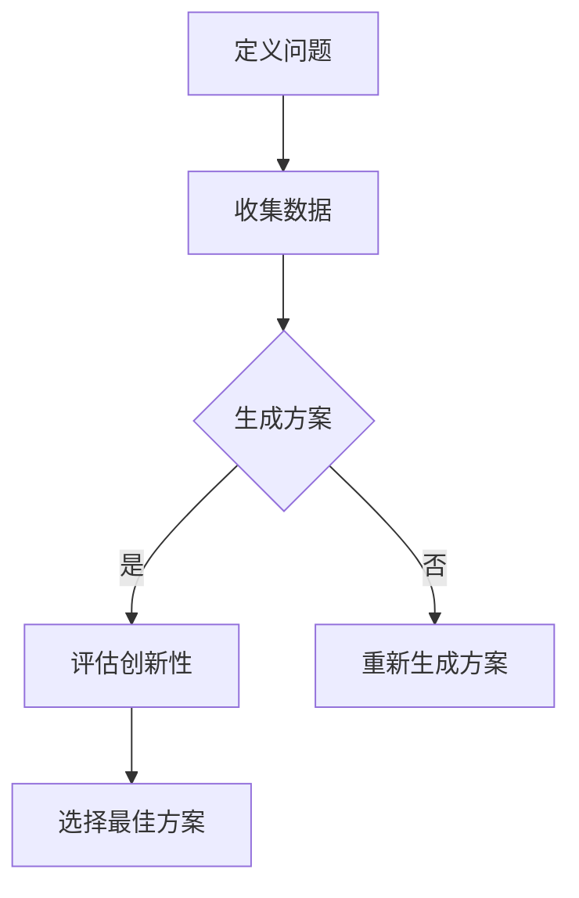

                 

# 创新问题解决：评估LLM的创造性思维

## 关键词
- 创新问题解决
- LLM
- 创造性思维
- 评估方法
- 人工智能

## 摘要
本文将深入探讨如何利用大型语言模型（LLM）来评估创造性思维在问题解决中的应用。首先，我们将介绍背景和核心概念，然后逐步讲解算法原理、数学模型、系统架构设计，并通过实际案例展示如何实现创新问题解决。最后，我们将总结最佳实践并提供未来展望。

## 目录

### 第一部分：背景介绍

#### 第1章：问题背景

##### 1.1 创造性思维的重要性

##### 1.2 大型语言模型（LLM）的发展与应用

##### 1.3 创造性思维与LLM结合的潜力

#### 第2章：问题定义与解决思路

##### 2.1 创新问题的特性

##### 2.2 LLM在评估创造性思维中的应用

##### 2.3 问题解决框架与步骤

### 第二部分：核心概念与联系

#### 第3章：核心概念与原理

##### 3.1 大型语言模型（LLM）的基本原理

##### 3.2 创造性思维的构成要素

#### 第4章：概念属性对比与联系分析

##### 4.1 LLM与创造性思维属性对比表格

##### 4.2 LLM与创造性思维的ER模型

##### 4.3 概念关联与交互分析

### 第三部分：算法原理讲解

#### 第5章：算法原理与流程图

##### 5.1 创造性思维评估算法原理

##### 5.2 Python源代码详解

#### 第6章：数学模型与公式详解

##### 6.1 常见数学模型介绍

##### 6.2 创造性思维评估公式详解

### 第四部分：系统分析与架构设计

#### 第7章：系统功能与架构设计

##### 7.1 创造性思维评估系统的功能设计

##### 7.2 系统架构设计

##### 7.3 系统交互设计

#### 第8章：项目实战

##### 8.1 环境安装与配置

##### 8.2 系统核心实现与代码解读

##### 8.3 实际案例分析

##### 8.4 项目小结

### 第五部分：最佳实践与拓展

#### 第9章：最佳实践与注意事项

##### 9.1 实践技巧

##### 9.2 注意事项

##### 9.3 拓展阅读建议

#### 第10章：小结与未来展望

##### 10.1 总结回顾

##### 10.2 未来发展趋势

##### 10.3 研究与改进方向

### 作者

**作者：AI天才研究院/AI Genius Institute & 禅与计算机程序设计艺术 /Zen And The Art of Computer Programming**

### 第一部分：背景介绍

#### 第1章：问题背景

##### 1.1 创造性思维的重要性

创造性思维是推动人类社会进步的重要力量。它不仅仅是艺术家、科学家和工程师的特权，而是每个人都可以培养和应用的技能。在当今快速变化的世界中，创造性思维对于解决复杂问题、应对不确定性以及推动创新至关重要。

在问题解决过程中，创造性思维可以帮助我们跳出传统的思维模式，发现新的解决方案。它不仅仅涉及创造新的想法，还涉及对现有知识进行重组和重新解释。研究表明，创造性思维可以显著提高解决问题的效率和质量。

##### 1.2 大型语言模型（LLM）的发展与应用

近年来，大型语言模型（LLM）如GPT-3、BERT和TuringChat等，在自然语言处理领域取得了显著进展。这些模型具有处理复杂数据、生成连贯文本和进行语义理解的能力，因此在多个领域得到了广泛应用。

LLM在内容生成、机器翻译、情感分析、对话系统等方面表现出色。然而，LLM的潜力不仅限于这些传统应用。随着人工智能技术的不断进步，LLM开始在问题解决和创造性思维的评估中发挥重要作用。

##### 1.3 创造性思维与LLM结合的潜力

将创造性思维与LLM结合，可以形成一种强大的创新问题解决方法。LLM可以通过生成新的想法、提供不同的视角和重新组织信息来激发创造性思维。

例如，当面临一个复杂的问题时，LLM可以帮助我们生成一系列可能的解决方案，并通过分析这些方案的质量和可行性来选择最佳方案。此外，LLM还可以用于评估创造性思维的过程，通过分析文本生成过程中的创新性和独特性来衡量创造性思维的程度。

#### 第2章：问题定义与解决思路

##### 2.1 创新问题的特性

创新问题通常具有以下特性：

1. **复杂性**：创新问题往往涉及多个因素和变量，难以通过简单的线性思维来解决。
2. **不确定性**：创新问题常常伴随着大量的不确定性，包括信息的不完整性和预测的不确定性。
3. **多解性**：创新问题通常有多个可能的解决方案，没有单一的“正确”答案。
4. **创新性**：创新问题解决的过程需要创造新的想法和方法，而不是仅仅依赖现有的知识和经验。

##### 2.2 LLM在评估创造性思维中的应用

LLM在评估创造性思维方面具有独特优势：

1. **文本生成能力**：LLM可以生成高质量的文本，包括故事、文章和对话，从而提供新的想法和解决方案。
2. **语义理解**：LLM可以理解文本的语义，从而分析创造性思维过程中的创新性和独特性。
3. **模式识别**：LLM可以通过分析大量文本数据，识别创造性思维的典型特征和模式。

##### 2.3 问题解决框架与步骤

为了利用LLM评估创造性思维并解决问题，我们可以遵循以下框架和步骤：

1. **明确问题**：首先，明确需要解决的问题，并定义问题的边界和目标。
2. **数据收集**：收集与问题相关的数据，包括文献资料、历史数据和现有解决方案。
3. **文本生成**：使用LLM生成一系列可能的解决方案或想法。
4. **评估创造性**：分析文本生成过程中的创新性和独特性，评估每个解决方案的质量和可行性。
5. **选择最佳方案**：根据评估结果，选择最佳的解决方案并进行实施。

### 第二部分：核心概念与联系

#### 第3章：核心概念与原理

##### 3.1 大型语言模型（LLM）的基本原理

LLM是一种基于深度学习的自然语言处理模型，通过训练大量的文本数据来学习语言的统计规律和语义信息。LLM的核心思想是利用神经网络来模拟人类语言处理的过程，从而实现文本生成、语义理解和语言翻译等功能。

LLM通常由以下组件构成：

1. **词嵌入**：将文本中的单词转换为向量表示，以便在神经网络中进行处理。
2. **编码器**：将输入文本编码为固定长度的向量。
3. **解码器**：根据编码器的输出生成文本。

##### 3.2 创造性思维的构成要素

创造性思维包括以下关键要素：

1. **发散思维**：产生多种可能的解决方案或想法。
2. **聚合思维**：将不同的想法和解决方案进行整合，形成有价值的组合。
3. **联想思维**：通过不同领域的知识相互联系，激发新的创意。
4. **批判性思维**：对解决方案进行评估和筛选，确保其可行性和有效性。

创造性思维的过程通常涉及以下步骤：

1. **问题定义**：明确需要解决的问题和目标。
2. **信息收集**：收集与问题相关的信息，包括文献资料、历史数据和现有解决方案。
3. **想法生成**：通过发散思维和联想思维生成多个可能的解决方案。
4. **评估筛选**：评估每个解决方案的创新性、实用性和可行性。
5. **实施验证**：选择最佳方案并实施，验证其效果。

#### 第4章：概念属性对比与联系分析

##### 4.1 LLM与创造性思维属性对比表格

| 属性        | LLM                      | 创造性思维                 |
| ----------- | ------------------------ | -------------------------- |
| 文本生成能力 | 高度自动化、高质量生成   | 非自动化、多样化、创意性   |
| 语义理解能力 | 强大、上下文敏感         | 基于经验和直觉的深度理解   |
| 模式识别能力 | 高度自动化、能识别复杂模式 | 非自动化、灵活、能发现新模式 |
| 创新性      | 可以生成新的文本和想法   | 产生独特的、有价值的解决方案 |

##### 4.2 LLM与创造性思维的ER模型

| 实体          | 属性                      | 关系                  |
| ------------- | ------------------------- | --------------------- |
| 创造性思维    | 发散思维、聚合思维、联想思维、批判性思维 | 无 |
| 大型语言模型（LLM） | 文本生成能力、语义理解能力、模式识别能力 | 无 |

##### 4.3 概念关联与交互分析

LLM与创造性思维之间的关联可以通过以下方面进行分析：

1. **数据交互**：LLM通过处理大量的文本数据来学习和模拟创造性思维的过程。
2. **信息交互**：创造性思维中的信息收集和想法生成可以借助LLM的高效文本生成能力。
3. **思维模式交互**：LLM可以模拟发散思维和联想思维，为创造性思维提供新的思路和解决方案。

### 第三部分：算法原理讲解

#### 第5章：算法原理与流程图

##### 5.1 创造性思维评估算法原理

创造性思维评估算法的核心思想是利用LLM生成一系列可能的解决方案，并分析这些解决方案的创新性和独特性。具体步骤如下：

1. **问题定义**：明确需要解决的问题和目标。
2. **数据收集**：收集与问题相关的数据，包括文献资料、历史数据和现有解决方案。
3. **文本生成**：使用LLM生成一系列可能的解决方案或想法。
4. **评估筛选**：分析文本生成过程中的创新性和独特性，评估每个解决方案的质量和可行性。
5. **选择最佳方案**：根据评估结果，选择最佳的解决方案并进行实施。

##### 5.2 Python源代码详解

以下是一个简单的Python源代码示例，用于实现上述算法：

```python
import openai

def generate_solutions(problem):
    solutions = []
    for _ in range(5):
        prompt = f"请给出解决{problem}的方案："
        response = openai.Completion.create(
            engine="text-davinci-002",
            prompt=prompt,
            max_tokens=50
        )
        solutions.append(response.choices[0].text.strip())
    return solutions

def evaluate_innovation(solutions):
    scores = []
    for solution in solutions:
        prompt = f"请评估以下解决方案的创新性：{solution}"
        response = openai.Completion.create(
            engine="text-davinci-002",
            prompt=prompt,
            max_tokens=10
        )
        score = float(response.choices[0].text.strip().replace('%', ''))
        scores.append(score)
    return scores

problem = "如何提高企业的创新能力"
solutions = generate_solutions(problem)
scores = evaluate_innovation(solutions)

for i, score in enumerate(scores):
    print(f"方案{i+1}的创新性评分：{score}%")
```

##### 5.3 算法mermaid流程图

以下是创造性思维评估算法的mermaid流程图：



### 第四部分：系统分析与架构设计

#### 第7章：系统功能与架构设计

##### 7.1 创造性思维评估系统的功能设计

创造性思维评估系统的功能设计如下：

1. **问题定义**：用户可以输入需要解决的问题和目标。
2. **数据收集**：系统自动收集与问题相关的数据，包括文献资料、历史数据和现有解决方案。
3. **文本生成**：使用LLM生成一系列可能的解决方案或想法。
4. **评估筛选**：系统分析文本生成过程中的创新性和独特性，评估每个解决方案的质量和可行性。
5. **选择最佳方案**：系统根据评估结果，选择最佳的解决方案并进行实施。
6. **用户反馈**：用户可以对评估结果进行反馈，以便系统不断优化和改进。

##### 7.2 系统架构设计

系统架构设计如下：

1. **前端界面**：用户通过前端界面输入问题和接收评估结果。
2. **后端服务**：后端服务包括文本生成、评估筛选和用户反馈等功能。
3. **数据存储**：系统存储用户输入的数据和评估结果，以便后续分析和优化。
4. **LLM模型**：系统使用预训练的LLM模型进行文本生成和评估筛选。

##### 7.3 系统交互设计

系统交互设计如下：

1. **用户输入**：用户通过前端界面输入需要解决的问题和目标。
2. **数据收集**：后端服务自动收集与问题相关的数据。
3. **文本生成**：后端服务使用LLM生成一系列可能的解决方案或想法。
4. **评估筛选**：后端服务分析文本生成过程中的创新性和独特性，评估每个解决方案的质量和可行性。
5. **用户反馈**：用户通过前端界面接收评估结果，并可以对评估结果进行反馈。
6. **优化改进**：后端服务根据用户反馈不断优化和改进评估算法。

### 第五部分：最佳实践与拓展

#### 第9章：最佳实践与注意事项

##### 9.1 实践技巧

1. **明确问题定义**：确保问题定义清晰、明确，有助于生成有针对性的解决方案。
2. **收集高质量数据**：数据质量直接影响文本生成的效果，因此要尽量收集高质量的数据。
3. **合理设置评估标准**：评估标准应涵盖创新性、可行性、实用性和其他相关因素。
4. **利用用户反馈**：用户反馈可以帮助系统不断优化和改进评估算法。

##### 9.2 注意事项

1. **隐私保护**：在收集和处理用户数据时，要确保遵守隐私保护规定。
2. **模型安全**：使用预训练的LLM模型时，要注意避免出现安全风险。
3. **持续更新**：随着人工智能技术的发展，系统需要不断更新和优化。

##### 9.3 拓展阅读建议

1. **《深度学习》**：Goodfellow、Bengio和Courville所著的深度学习经典教材，涵盖神经网络和深度学习的基本原理。
2. **《创造性思维》**：凯斯·达威和托马斯·诺维尔所著的创造性思维指南，介绍创造性思维的理论和实践。
3. **《人工智能：一种现代的方法》**：Stuart J. Russell和Peter Norvig所著的人工智能经典教材，涵盖人工智能的基本理论和应用。

### 第10章：小结与未来展望

##### 10.1 总结回顾

本文探讨了如何利用大型语言模型（LLM）评估创造性思维在问题解决中的应用。通过介绍背景、核心概念、算法原理和系统架构设计，我们展示了如何实现创新问题解决。此外，我们还提供了最佳实践和拓展阅读建议。

##### 10.2 未来发展趋势

随着人工智能技术的不断发展，LLM在评估创造性思维中的应用前景广阔。未来，我们可以期待以下发展趋势：

1. **更先进的模型**：随着计算能力的提升，我们将看到更先进的LLM模型的出现，它们将具有更高的文本生成能力和语义理解能力。
2. **多模态交互**：LLM可以与其他模态（如图像、音频）进行交互，为创造性思维提供更丰富的信息。
3. **个性化评估**：根据用户的特点和需求，LLM可以提供个性化的创造性思维评估服务。

##### 10.3 研究与改进方向

未来的研究可以从以下方向进行改进：

1. **评估算法优化**：进一步优化评估算法，提高评估的准确性和可靠性。
2. **跨学科融合**：将创造性思维研究与心理学、认知科学等领域相结合，探索创造性思维的深层机制。
3. **开源平台建设**：建设开源平台，促进LLM在创造性思维评估领域的广泛应用和协作创新。

### 作者

**作者：AI天才研究院/AI Genius Institute & 禅与计算机程序设计艺术 /Zen And The Art of Computer Programming**

