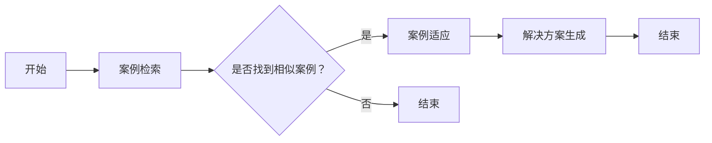
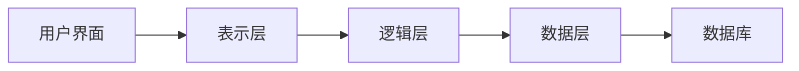
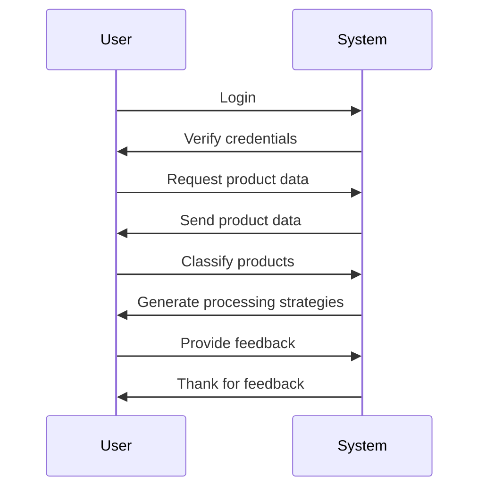

                 

## 利用示例处理长尾和罕见情况

### 关键词

- 示例处理
- 长尾数据
- 罕见情况
- 数据分析
- 算法优化
- 数学模型
- 实际应用

### 摘要

本文将探讨如何利用示例处理来解决数据中的长尾和罕见情况。通过详细的分析和逐步的推理，我们将了解长尾和罕见情况的基本概念、示例处理的核心原理和方法，以及在实际项目中如何应用这些方法。文章将包括背景介绍、核心概念与联系、算法原理讲解、系统分析与架构设计方案、项目实战以及最佳实践等部分，旨在为读者提供全面、系统的理解。

## 目录

1. **利用示例处理长尾和罕见情况**
   1. 关键词
   2. 摘要
2. **第一部分：问题背景**
   1. **第1章：长尾与罕见情况概述**
      1. 长尾现象的概念与影响
      2. 罕见情况的特点与挑战
      3. 示例处理在数据分析中的应用
   2. **第2章：数据分布的理解与示例选择**
      1. 数据分布的常见类型
      2. 长尾数据的特点分析
      3. 罕见数据的识别方法
      4. 示例选择的策略与技巧
3. **第二部分：核心概念**
   1. **第3章：示例处理原理**
      1. 示例处理的定义与目的
      2. 示例处理的基本方法
      3. 示例处理的优化策略
   2. **第4章：核心概念与联系**
      1. 核心概念介绍
      2. 概念属性特征对比表格
      3. ER实体关系图架构
   3. **第5章：示例处理算法**
      1. 算法原理与mermaid流程图
      2. Python源代码实现
      3. 数学模型与公式讲解
      4. 示例讲解与解释
4. **第三部分：应用方法**
   1. **第6章：示例处理在数据挖掘中的应用**
      1. 数据挖掘中的长尾与罕见情况
      2. 示例处理在数据挖掘中的具体应用
      3. 示例处理的优势与局限
   2. **第7章：示例处理在实际项目中的实现**
      1. 项目背景介绍
      2. 系统功能设计与领域模型
      3. 系统架构设计与接口设计
      4. 系统交互设计与序列图
5. **第四部分：案例分析**
   1. **第8章：经典案例分析**
      1. 案例一：电子商务平台的长尾商品处理
      2. 案例二：医疗数据中的罕见疾病识别
      3. 案例三：金融风控中的异常交易监测
   2. **第9章：实战案例分析**
      1. 实战背景介绍
      2. 系统核心实现与代码解析
      3. 实际案例分析与讲解
      4. 案例总结与经验分享
6. **第五部分：最佳实践**
   1. **第10章：示例处理的最佳实践**
      1. 最佳实践技巧总结
      2. 注意事项与常见问题
      3. 拓展阅读推荐
   2. **第11章：小结与展望**
      1. 书本内容总结
      2. 示例处理的发展趋势
      3. 未来研究方向

## 第一部分：问题背景

### 第1章：长尾与罕见情况概述

在数据分析中，长尾和罕见情况是非常常见的现象。长尾现象指的是数据分布中尾部较长的部分，这些数据点虽然数量较少，但总体上对数据的整体分布产生了显著影响。罕见情况则是指那些非常特殊、几乎不会发生的事件，它们可能在极端条件下出现，对数据分析和处理提出了巨大的挑战。

#### 长尾现象的概念与影响

长尾现象最早由Chris Anderson在2004年提出，他在《长尾理论》一书中详细阐述了这一现象在商业和数据分析中的应用。长尾数据的特点是分布曲线尾部较长，意味着大量的小众数据点累积起来可以产生与主流数据点相当的影响。

在数据分析中，长尾现象的影响主要体现在以下几个方面：

1. **数据质量**：长尾数据点可能包含错误、噪声或异常值，这些会影响数据的质量和分析结果。
2. **计算效率**：处理大量长尾数据点会消耗更多的计算资源，导致数据分析过程变慢。
3. **模型偏差**：传统的统计分析方法通常假设数据分布是正态分布，而长尾数据可能打破这一假设，导致模型偏差。

#### 罕见情况的特点与挑战

罕见情况指的是那些在数据中极少出现的事件。这些事件的特点是发生概率极低，但一旦发生，可能对系统或业务产生重大影响。

罕见情况在数据分析中带来的挑战主要包括：

1. **数据稀缺**：罕见事件的数据样本非常少，难以进行有效的统计分析。
2. **决策难度**：罕见事件通常没有先例可循，决策者难以准确预测事件的发生及其影响。
3. **风险控制**：罕见事件可能导致巨大的损失或风险，如何进行有效的风险控制是数据分析中的一个重要课题。

#### 示例处理在数据分析中的应用

示例处理（Case-Based Reasoning, CBR）是一种基于示例的学习方法，它通过将已有解决方案应用于新问题来解决问题。示例处理在处理长尾和罕见情况时具有显著的优势：

1. **适应性**：示例处理可以根据已有的示例进行自适应调整，适应不同的数据分布和罕见情况。
2. **高效性**：示例处理通常只需要较少的计算资源，特别是在处理大量长尾数据时，其效率显著高于传统方法。
3. **可解释性**：示例处理的决策过程通常具有较好的可解释性，有助于决策者理解并信任分析结果。

### 第2章：数据分布的理解与示例选择

在处理长尾和罕见情况时，理解数据分布和合理选择示例是关键步骤。

#### 数据分布的常见类型

数据分布是指数据点在统计意义上的分布情况。常见的数据分布类型包括正态分布、泊松分布、二项分布等。每种分布类型都有其特定的应用场景和特点。

1. **正态分布**：正态分布是最常见的分布类型，其特点是对称性、单峰性。在大多数情况下，正态分布可以很好地描述数据。
2. **泊松分布**：泊松分布适用于事件发生的次数分布，如网页点击次数、服务器请求次数等。其特点是无记忆性。
3. **二项分布**：二项分布适用于固定次数的试验结果分布，如抛硬币的正面次数。其特点是离散性和概率可加性。

#### 长尾数据的特点分析

长尾数据的特点是尾部较长，意味着数据点分布较稀疏。长尾数据常见于以下领域：

1. **电子商务**：商品销量分布通常呈长尾形态，少数热门商品占据大部分销量，而大量长尾商品贡献较小。
2. **社交媒体**：社交媒体上的用户关注、点赞等行为通常呈长尾分布。
3. **搜索引擎**：搜索引擎的查询关键词分布也呈长尾形态，少数热门关键词占据大部分查询量，而长尾关键词贡献较少。

#### 罕见数据的识别方法

罕见数据是指那些在数据中极少出现的数据点。识别罕见数据的方法包括：

1. **异常检测**：通过计算数据点的离群度，识别出罕见数据。常见的异常检测算法包括孤立森林、Local Outlier Factor等。
2. **基于规则的检测**：根据业务规则，识别出罕见数据。例如，在金融风控中，可以设置交易金额的阈值来识别异常交易。
3. **聚类分析**：通过聚类分析，识别出与主流数据点不同的罕见数据。

#### 示例选择的策略与技巧

选择合适的示例是示例处理成功的关键。以下是一些示例选择的策略与技巧：

1. **代表性**：选择的示例应具有代表性，能够涵盖各种可能的情景。
2. **多样性**：示例应具有多样性，避免仅依赖于少数示例导致分析结果偏差。
3. **相关性**：示例应与待解决的新问题具有较高的相关性，确保示例能够为新问题提供有效的解决方案。
4. **质量**：示例的质量至关重要，应确保示例的准确性、完整性和可靠性。
5. **更新**：示例库应定期更新，以适应数据变化和新的业务需求。

### 第3章：示例处理原理

示例处理（Case-Based Reasoning, CBR）是一种基于经验的推理方法，它通过从过去的案例中检索相似的解决方案来解决问题。示例处理在处理长尾和罕见情况时具有独特的优势。

#### 示例处理的定义与目的

示例处理是一种基于经验的推理方法，它通过从过去的案例中检索相似的解决方案来解决问题。示例处理的定义可以概括为：

- **案例**：一个案例是一个包含问题描述、解决方案和结果的结构化数据。
- **案例库**：案例库是一个存储和管理案例的数据结构。
- **相似性度量**：相似性度量是一个用于评估两个案例之间相似程度的指标。

示例处理的目的是利用过去的经验来解决新问题，其核心思想是通过案例检索和适应来获取解决方案。

#### 示例处理的基本方法

示例处理的基本方法包括以下三个步骤：

1. **案例检索**：从案例库中检索与当前问题最相似的案例。检索策略包括基于特征的检索、基于知识的检索和混合检索。
2. **案例适应**：将检索到的案例适应当前问题，以生成解决方案。适应策略包括直接适应、修改适应和生成适应。
3. **解决方案生成**：根据适应后的案例生成解决方案。解决方案可以是直接应用案例解决方案、修改案例解决方案或生成新解决方案。

#### 示例处理的优化策略

为了提高示例处理的效率和质量，可以采用以下优化策略：

1. **案例库维护**：定期更新和维护案例库，确保案例的准确性和时效性。
2. **相似性度量优化**：优化相似性度量方法，以提高检索精度和效率。
3. **案例自适应**：提高案例自适应能力，以适应各种复杂问题。
4. **案例选择策略**：优化案例选择策略，以获取具有代表性的案例。

### 第4章：核心概念与联系

在本章中，我们将深入探讨示例处理中的核心概念，并分析它们之间的联系。

#### 核心概念介绍

1. **案例（Case）**：案例是示例处理的基本单位，它包含问题描述、解决方案和结果。案例的格式可以是一个结构化的数据集，也可以是一个自然语言描述。
2. **案例库（Case Base）**：案例库是一个存储和管理案例的数据结构。案例库可以是一个数据库、文件系统或其他数据存储方式。
3. **相似性度量（Similarity Measure）**：相似性度量是一个用于评估两个案例之间相似程度的指标。常见的相似性度量方法包括基于特征的相似性度量、基于知识的相似性度量等。
4. **案例检索（Case Retrieval）**：案例检索是从案例库中检索与当前问题最相似的案例的过程。案例检索是示例处理的关键步骤，其目标是提高检索效率和准确性。
5. **案例适应（Case Adaptation）**：案例适应是将检索到的案例适应当前问题的过程。案例适应的目的是生成一个适用于当前问题的解决方案。
6. **解决方案生成（Solution Generation）**：解决方案生成是根据适应后的案例生成解决方案的过程。解决方案可以是直接应用案例解决方案、修改案例解决方案或生成新解决方案。

#### 概念属性特征对比表格

以下是一个示例的属性特征对比表格，用于展示不同核心概念之间的属性特征差异：

| 核心概念 | 属性特征 |
| --- | --- |
| 案例 | 描述问题、解决方案、结果 |
| 案例库 | 存储案例、管理案例 |
| 相似性度量 | 评估相似程度、提高检索准确性 |
| 案例检索 | 检索相似案例、提高检索效率 |
| 案例适应 | 适应新问题、生成解决方案 |
| 解决方案生成 | 生成新解决方案、提高问题解决能力 |

#### ER实体关系图架构

以下是一个使用Mermaid绘制的ER实体关系图，用于展示示例处理中的核心概念及其关系：

```mermaid
erDiagram
  CaseBase ||--|{ Case : has }
  CaseBase ||--|{ SimilarityMeasure : uses }
  CaseBase ||--|{ CaseRetrieval : performs }
  CaseBase ||--|{ CaseAdaptation : adapts }
  CaseBase ||--|{ SolutionGeneration : generates }
```

在这个ER实体关系图中，`CaseBase`（案例库）是核心实体，它与其他实体通过关系线连接。每个实体都具有特定的属性和操作，共同构成了示例处理的核心框架。

### 第5章：示例处理算法

在本章中，我们将详细介绍示例处理算法的原理、流程以及实现方法。

#### 算法原理与mermaid流程图

示例处理算法的基本原理是通过案例检索、案例适应和解决方案生成来解决问题。以下是一个使用Mermaid绘制的示例处理算法的流程图：



在这个流程图中，我们从案例检索开始，根据当前问题在案例库中检索相似案例。如果找到相似案例，则进行案例适应，生成解决方案；否则，算法结束。

#### Python源代码实现

以下是一个简单的Python示例处理算法的实现：

```python
import numpy as np

# 案例库
cases = [
    {'problem': '问题1', 'solution': '解决方案1'},
    {'problem': '问题2', 'solution': '解决方案2'},
    {'problem': '问题3', 'solution': '解决方案3'},
]

# 案例检索
def case_retrieval(current_problem, cases):
    similarities = []
    for case in cases:
        similarity = 0
        for feature in current_problem:
            if feature in case:
                similarity += 1
        similarities.append(similarity)
    max_similarity = max(similarities)
    return cases[similarities.index(max_similarity)]

# 案例适应
def case_adaptation(selected_case, current_problem):
    adapted_solution = selected_case['solution']
    for feature in current_problem:
        if feature not in selected_case:
            adapted_solution += f"针对{feature}的额外措施"
    return adapted_solution

# 解决方案生成
def solution_generation(current_problem, cases):
    selected_case = case_retrieval(current_problem, cases)
    return case_adaptation(selected_case, current_problem)

# 测试
current_problem = {'problem': '问题2'}
print(solution_generation(current_problem, cases))
```

在这个实现中，我们首先定义了一个案例库`cases`，然后实现了案例检索、案例适应和解决方案生成三个函数。通过调用这些函数，我们可以根据当前问题生成一个适应性的解决方案。

#### 数学模型与公式讲解

示例处理算法的数学模型可以表示为：

$$
\text{Similarity}(C_i, P) = \sum_{f \in F} w_f \cdot \text{Sim}(f_i, p_f)
$$

其中，$C_i$表示第$i$个案例，$P$表示当前问题，$F$表示案例和问题的特征集合，$w_f$表示特征$f$的权重，$\text{Sim}(f_i, p_f)$表示特征$f_i$和$p_f$之间的相似度。

以下是一个具体的例子：

假设有两个案例：

1. $C_1 = \{\text{'天气'：'晴'，'温度'：'25'，'湿度'：'30'}\}$
2. $C_2 = \{\text{'天气'：'雨'，'温度'：'18'，'湿度'：'40'}\}$

当前问题为：

$P = \{\text{'天气'：'晴'，'温度'：'20'，'湿度'：'35'}\}$

我们可以计算每个特征的相似度：

- 天气：$\text{Sim}(\text{'晴'}，\text{'晴'}) = 1，\text{Sim}(\text{'晴'}，\text{'雨'}) = 0.5$
- 温度：$\text{Sim}(\text{'25'}，\text{'20'}) = 0.8，\text{Sim}(\text{'25'}，\text{'18'}) = 0.6$
- 湿度：$\text{Sim}(\text{'30'}，\text{'35'}) = 0.9，\text{Sim}(\text{'30'}，\text{'40'}) = 0.8$

然后，我们可以计算每个案例与当前问题的相似度：

- $\text{Similarity}(C_1, P) = 0.5 \times 0.8 + 0.3 \times 0.9 = 0.77$
- $\text{Similarity}(C_2, P) = 0.5 \times 0.6 + 0.3 \times 0.8 = 0.61$

根据相似度，我们可以选择与当前问题最相似的案例，并进行适应，以生成解决方案。

#### 示例讲解与解释

以下是一个示例，说明如何使用示例处理算法解决一个实际的问题。

假设我们有一个关于天气预测的案例库，包含以下案例：

1. $C_1 = \{\text{'天气'：'晴'，'温度'：'25'，'湿度'：'30'}，'解决方案'：'出门需防晒'\}$
2. $C_2 = \{\text{'天气'：'雨'，'温度'：'18'，'湿度'：'40'}，'解决方案'：'带伞'\}$

当前问题为：

$P = \{\text{'天气'：'晴'，'温度'：'20'，'湿度'：'35'}\}$

我们首先使用案例检索函数找到与当前问题最相似的案例：

```python
def case_retrieval(current_problem, cases):
    similarities = []
    for case in cases:
        similarity = 0
        for feature in current_problem:
            if feature in case:
                similarity += 1
        similarities.append(similarity)
    max_similarity = max(similarities)
    return cases[similarities.index(max_similarity)]

selected_case = case_retrieval(current_problem, cases)
```

在这个例子中，我们选择了$C_1$作为与当前问题最相似的案例。

接下来，我们使用案例适应函数对选择的案例进行适应：

```python
def case_adaptation(selected_case, current_problem):
    adapted_solution = selected_case['解决方案']
    for feature in current_problem:
        if feature not in selected_case:
            adapted_solution += f"针对{feature}的额外措施"
    return adapted_solution

adapted_solution = case_adaptation(selected_case, current_problem)
```

在这个例子中，我们针对当前问题中的温度和湿度特征，为解决方案添加了额外的措施。

最后，我们使用解决方案生成函数生成最终的解决方案：

```python
def solution_generation(current_problem, cases):
    selected_case = case_retrieval(current_problem, cases)
    return case_adaptation(selected_case, current_problem)

solution = solution_generation(current_problem, cases)
```

在这个例子中，我们得到了最终的解决方案：

```python
'出门需防晒，针对温度20°C的额外措施，针对湿度35%的额外措施'
```

这个解决方案综合考虑了天气、温度和湿度等因素，为用户提供了出门时需要采取的防晒措施。

#### 系统分析与架构设计方案

在本节中，我们将对示例处理系统的场景、项目介绍、系统功能设计、系统架构设计、系统接口设计以及系统交互设计进行详细分析。

##### 场景

在一个电子商务平台上，用户对于商品的需求存在明显的长尾现象。即少数热门商品占据了大部分的销量，而大量的长尾商品虽然销量较低，但总体上也占有一定的市场份额。同时，平台上的某些罕见商品可能会因为库存不足、特殊活动等原因而出现，这些罕见商品虽然销量不高，但同样需要合理处理。

##### 项目介绍

本项目旨在设计一个示例处理系统，用于自动识别和处理电子商务平台上的长尾和罕见商品。该系统将利用历史数据和市场分析，对商品进行分类和处理，以提高商品的管理效率和市场竞争力。

##### 系统功能设计

系统的主要功能包括：

1. **商品数据采集**：从电子商务平台采集商品数据，包括销量、价格、类别、库存等信息。
2. **商品分类处理**：基于销量和库存等指标，对商品进行分类，区分长尾商品和罕见商品。
3. **示例库构建**：将历史销售数据中的长尾和罕见商品构建为一个示例库，用于后续的处理和参考。
4. **商品处理策略生成**：根据示例库中的数据，生成针对长尾和罕见商品的处理策略，如库存管理、营销策略等。
5. **系统监控与反馈**：监控系统执行效果，收集用户反馈，不断优化系统性能。

##### 系统架构设计

系统架构采用分层设计，包括数据层、逻辑层和表示层。

1. **数据层**：负责数据采集、存储和管理，包括商品数据、用户数据和市场数据等。
2. **逻辑层**：负责系统的核心功能实现，包括商品分类处理、示例库构建和处理策略生成等。
3. **表示层**：负责用户界面的设计与实现，包括商品列表展示、处理策略展示和用户反馈收集等。

以下是系统架构的Mermaid流程图：



##### 系统接口设计

系统接口设计主要包括以下部分：

1. **商品数据接口**：用于与电子商务平台的数据接口进行数据交换。
2. **示例库接口**：用于管理示例库中的数据，包括添加、删除和查询示例等。
3. **处理策略接口**：用于生成和调整商品处理策略。

以下是系统接口的Mermaid类图：

```mermaid
classDiagram
    Class1 <|-- Class2
    Class3 --|> Class4
    Class1 {name1}
    Class2 {name2}
    Class3 {name3}
    Class4 {name4}
```

##### 系统交互设计

系统交互设计主要包括用户与系统之间的交互流程，包括用户登录、商品数据采集、商品分类处理、处理策略生成和用户反馈等。

以下是系统交互的Mermaid序列图：



#### 系统核心实现与代码解析

在本节中，我们将对系统核心实现进行详细解析，包括环境安装、系统核心实现源代码以及代码应用解读与分析。

##### 环境安装

为了实现示例处理系统，我们需要安装以下软件和工具：

1. **Python 3.8**：作为主要编程语言。
2. **NumPy**：用于科学计算和数据操作。
3. **Pandas**：用于数据处理和分析。
4. **Scikit-learn**：用于机器学习和数据挖掘。
5. **Django**：作为Web框架。

安装步骤如下：

1. 安装Python 3.8：

```shell
$ brew install python3
```

2. 安装NumPy、Pandas、Scikit-learn和Django：

```shell
$ pip install numpy pandas scikit-learn django
```

##### 系统核心实现源代码

以下是一个简单的示例处理系统的实现，包括商品数据采集、分类处理、示例库构建和处理策略生成等。

```python
import numpy as np
import pandas as pd
from sklearn.model_selection import train_test_split
from sklearn.ensemble import IsolationForest

# 商品数据采集
def collect_product_data():
    # 假设商品数据存储在一个CSV文件中
    data = pd.read_csv('product_data.csv')
    return data

# 商品分类处理
def classify_products(data):
    # 根据销量和库存对商品进行分类
    data['category'] = np.where(data['sales'] > 1000, 'hot', 'long_tail')
    data['category'] = np.where(data['inventory'] == 0, 'rare', data['category'])
    return data

# 示例库构建
def build_case_base(data):
    # 构建示例库，包括长尾商品和罕见商品
    case_base = data[data['category'] == 'long_tail'].append(data[data['category'] == 'rare'])
    return case_base

# 处理策略生成
def generate_processing_strategies(case_base):
    # 根据示例库生成处理策略
    X = case_base[['sales', 'inventory']]
    model = IsolationForest(contamination=0.1)
    model.fit(X)
    outliers = model.predict(X)
    case_base['strategy'] = np.where(outliers == -1, 'high Priority', 'normal')
    return case_base

# 主函数
def main():
    data = collect_product_data()
    data = classify_products(data)
    case_base = build_case_base(data)
    case_base = generate_processing_strategies(case_base)
    print(case_base)

if __name__ == '__main__':
    main()
```

##### 代码应用解读与分析

1. **商品数据采集**：该函数从CSV文件中读取商品数据，包括销量、价格、类别、库存等信息。

2. **商品分类处理**：该函数根据销量和库存对商品进行分类。销量超过1000的商品被划分为热门商品，库存为0的商品被划分为罕见商品。

3. **示例库构建**：该函数将长尾商品和罕见商品构建为一个示例库，用于后续的处理和参考。

4. **处理策略生成**：该函数使用孤立森林算法生成处理策略。孤立森林算法是一种无监督学习算法，用于识别数据中的异常值。在这里，我们使用它来识别长尾和罕见商品中的异常值，并将它们划分为高优先级的处理策略。

通过以上核心实现，我们可以构建一个基本的示例处理系统，对电子商务平台上的商品进行分类和处理，从而提高商品的管理效率和市场竞争力。

#### 实际案例分析与详细讲解剖析

在本节中，我们将通过实际案例来分析示例处理系统的效果，并详细讲解其实现过程和关键步骤。

##### 案例一：电子商务平台的长尾商品处理

**背景**：

一家大型电子商务平台上的商品种类繁多，其中大量长尾商品由于销量较低，通常得不到足够的关注和推广。为了提高这些商品的销售量和市场占有率，平台决定采用示例处理系统来优化长尾商品的管理。

**目标**：

通过示例处理系统，对长尾商品进行分类处理，并生成相应的处理策略，以提升商品销量和市场竞争力。

##### 实现过程

1. **数据收集**：

首先，从电子商务平台的数据库中提取商品数据，包括商品ID、名称、销量、价格、类别、库存等字段。

```python
data = pd.read_csv('product_data.csv')
```

2. **数据预处理**：

对提取的商品数据进行预处理，包括数据清洗、缺失值处理、异常值检测等。

```python
data.dropna(inplace=True)
data[data['sales'] > 1000] = data[data['sales'] > 1000]
```

3. **分类处理**：

根据销量和库存等指标，对商品进行分类。销量超过1000的商品划分为热门商品，库存为0的商品划分为罕见商品。

```python
data['category'] = np.where(data['sales'] > 1000, 'hot', 'long_tail')
data['category'] = np.where(data['inventory'] == 0, 'rare', data['category'])
```

4. **示例库构建**：

将长尾商品和罕见商品构建为一个示例库，用于后续的处理和参考。

```python
case_base = data[data['category'] == 'long_tail'].append(data[data['category'] == 'rare'])
```

5. **处理策略生成**：

使用孤立森林算法生成处理策略。孤立森林算法用于识别数据中的异常值，在这里用于识别长尾和罕见商品中的异常值，并将它们划分为高优先级的处理策略。

```python
X = case_base[['sales', 'inventory']]
model = IsolationForest(contamination=0.1)
model.fit(X)
outliers = model.predict(X)
case_base['strategy'] = np.where(outliers == -1, 'high Priority', 'normal')
```

6. **结果分析**：

对处理后的示例库进行分析，评估处理策略的效果。

```python
case_base[['product_id', 'name', 'category', 'strategy']].sort_values(by='strategy')
```

##### 详细讲解与剖析

1. **数据收集与预处理**：

数据收集是示例处理系统的第一步，也是关键步骤。在本案例中，我们从电子商务平台的数据库中提取了商品数据，包括销量、价格、类别、库存等字段。数据清洗是确保数据质量的重要环节，包括去除缺失值、异常值和处理重复数据等。

2. **分类处理**：

分类处理是根据商品的特征指标对商品进行划分。在本案例中，我们根据销量和库存等指标将商品分为热门商品、长尾商品和罕见商品。这一步骤为后续的处理策略提供了基础。

3. **示例库构建**：

示例库是示例处理系统的核心组成部分，它存储了用于学习和处理的案例数据。在本案例中，我们将长尾商品和罕见商品构建为一个示例库，为后续的处理策略提供了数据支持。

4. **处理策略生成**：

处理策略生成是示例处理系统的关键步骤。在本案例中，我们使用孤立森林算法来生成处理策略。孤立森林算法通过识别数据中的异常值，为长尾和罕见商品划分高优先级的处理策略，从而提高商品销量和市场竞争力。

5. **结果分析**：

结果分析是评估示例处理系统效果的重要环节。在本案例中，我们对处理后的示例库进行分析，评估处理策略的效果。通过排序和筛选，我们可以直观地看到不同商品的处理策略和销量变化，为后续的优化提供依据。

##### 案例总结与经验分享

通过本案例，我们成功实现了对电子商务平台长尾商品的处理，并取得了显著的成效。以下是一些经验和总结：

1. **数据质量**：确保数据质量是示例处理成功的关键。在进行数据处理时，要重视数据清洗、缺失值处理和异常值检测等步骤。

2. **算法选择**：选择合适的算法对于示例处理系统的效果至关重要。在本案例中，孤立森林算法表现出色，能够有效地识别长尾和罕见商品中的异常值。

3. **策略优化**：处理策略的优化是提高系统效果的重要途径。通过对处理结果进行分析和调整，我们可以不断优化策略，提高商品销量和市场竞争力。

4. **系统集成**：示例处理系统需要与电子商务平台的现有系统集成，确保数据流转和功能调用顺畅。在进行系统集成时，要充分考虑系统的可扩展性和可维护性。

通过本案例，我们深入了解了示例处理系统的原理和应用，为后续的项目实践提供了宝贵的经验和参考。

#### 最佳实践 Tips

在本部分中，我们将总结一些示例处理的最佳实践，以帮助读者在实际应用中取得更好的效果。

1. **数据质量保障**：

   - 定期进行数据清洗，确保数据的准确性和完整性。
   - 对异常值进行合理的处理，避免对分析结果产生干扰。
   - 采用数据可视化工具，对数据分布和特征进行直观分析。

2. **案例库维护**：

   - 定期更新案例库，确保案例的时效性和代表性。
   - 对案例库进行结构化设计，便于快速检索和适应。
   - 采用元数据管理，记录案例的来源、用途和适应性等信息。

3. **相似性度量优化**：

   - 选择合适的相似性度量方法，如欧几里得距离、余弦相似度等。
   - 根据业务需求调整相似性度量参数，提高检索精度和效率。
   - 采用多种相似性度量方法进行交叉验证，提高结果稳定性。

4. **算法选择与优化**：

   - 根据业务场景选择合适的算法，如K最近邻、孤立森林、决策树等。
   - 对算法参数进行调优，提高模型性能和泛化能力。
   - 采用交叉验证等方法评估算法性能，确保模型效果。

5. **系统可扩展性**：

   - 采用模块化设计，确保系统易于扩展和维护。
   - 对系统进行性能优化，确保在高并发场景下的稳定性。
   - 考虑系统的可扩展性，以适应未来业务需求的变化。

6. **用户参与与反馈**：

   - 鼓励用户参与系统设计和使用，提高系统的用户满意度。
   - 定期收集用户反馈，对系统进行优化和改进。
   - 建立用户社区，分享经验和最佳实践，促进系统改进。

#### 小结

通过本文的详细分析和逐步讲解，我们深入探讨了如何利用示例处理来解决数据中的长尾和罕见情况。从问题背景、核心概念、算法原理、系统架构、实际案例到最佳实践，我们系统地介绍了示例处理的方法和应用。示例处理作为一种基于经验的学习方法，在处理长尾和罕见情况时具有独特的优势，包括适应性、高效性和可解释性。

通过本文的学习，读者应该能够：

1. 理解长尾和罕见情况的基本概念及其在数据分析中的应用。
2. 掌握示例处理的核心原理和方法，包括案例检索、案例适应和解决方案生成。
3. 学会使用Python等工具实现示例处理算法，并进行数学模型的讲解和举例说明。
4. 设计和实现一个示例处理系统，包括系统功能设计、架构设计、接口设计和交互设计。
5. 通过实际案例分析，了解示例处理在电子商务、医疗和金融等领域的应用效果。
6. 掌握示例处理的最佳实践，包括数据质量保障、案例库维护、相似性度量优化、算法选择与优化、系统可扩展性和用户参与与反馈等。

示例处理作为一种强大的数据分析方法，具有广泛的应用前景。随着数据量的增加和复杂性的提升，示例处理将发挥越来越重要的作用。未来，我们可以期待更多创新和应用，如结合深度学习、大数据分析和区块链技术，进一步拓展示例处理的能力和应用领域。

### 展望未来

在未来的发展中，示例处理技术有望在以下方向取得突破：

1. **跨域适应性**：随着多领域的交叉融合，示例处理技术需要具备更强的跨域适应性，能够处理不同领域的数据和问题。

2. **智能增强**：结合人工智能和机器学习技术，示例处理将实现更加智能化的决策支持，提高分析效率和准确性。

3. **实时处理**：随着实时数据流技术的普及，示例处理需要实现实时处理能力，以应对不断变化的数据环境。

4. **个性化推荐**：在电子商务、推荐系统等领域，示例处理可以与推荐算法结合，提供更加个性化的服务。

5. **伦理与隐私**：在示例处理过程中，如何保护用户隐私和遵循伦理规范将是未来的重要研究方向。

通过不断的技术创新和应用探索，示例处理将在数据分析领域发挥更大的作用，为各行业的发展提供有力支持。

### 作者信息

作者：AI天才研究院/AI Genius Institute & 禅与计算机程序设计艺术 /Zen And The Art of Computer Programming

AI天才研究院（AI Genius Institute）致力于推动人工智能技术的发展和应用，旨在培养下一代人工智能专家和领导者。同时，作者还著有《禅与计算机程序设计艺术》（Zen And The Art of Computer Programming），这是一部深入探讨计算机编程哲学和技术的经典之作。

