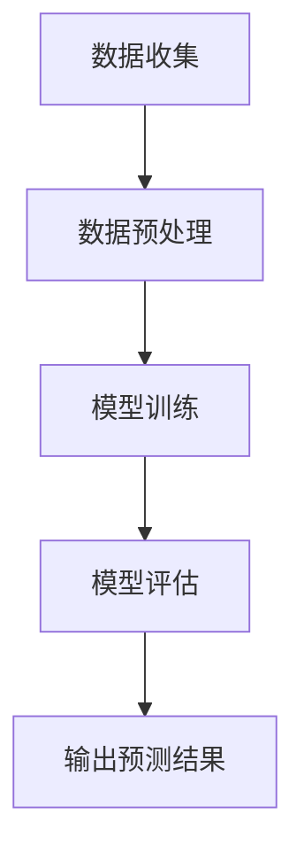
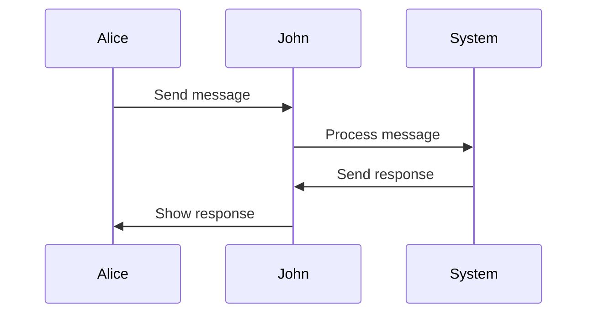
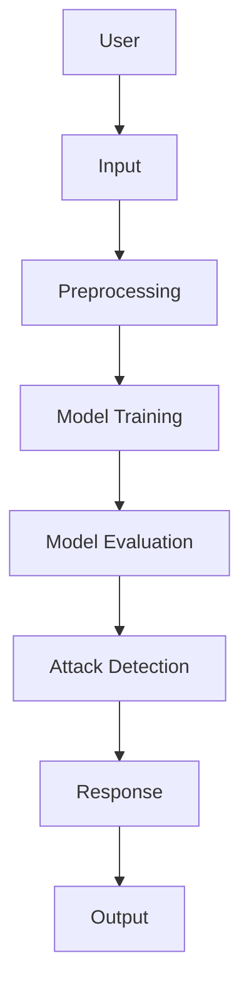

                 

### 利用示例引导模型处理新兴和零日场景

在当前网络安全环境中，新兴和零日攻击问题日益凸显，对企业和个人的信息安全构成了巨大的威胁。这些问题不仅复杂多变，而且常常没有现成的防御方案。本文将探讨如何利用示例引导模型（Example-Guided Models，EGM）来应对这些复杂场景。我们将从以下几个方面展开讨论：

1. **问题背景与核心概念**：介绍新兴和零日攻击的概念，以及示例引导模型的基本原理和特点。
2. **算法原理讲解**：详细阐述示例引导模型的工作机制，包括算法流程、Python实现、数学模型和实际应用。
3. **系统分析与架构设计**：分析示例引导模型在网络安全系统中的应用，介绍系统功能设计、架构设计和接口设计。
4. **项目实战**：通过一个实际案例，展示如何使用示例引导模型处理零日攻击场景，并进行详细解读。
5. **最佳实践与总结**：总结示例引导模型的应用经验和注意事项，展望未来研究方向。

### 1. 问题背景与核心概念

#### 新兴攻击与零日攻击

**新兴攻击**（Emerging Attack）指的是那些近年来出现的新型网络攻击方式，这些攻击通常利用了最新的技术漏洞或者攻击手法，因此传统的安全防护手段难以有效应对。例如，一些利用人工智能（AI）技术的网络攻击，就是近年来的新兴攻击。

**零日攻击**（Zero-Day Attack）则是指攻击者利用软件未知漏洞进行攻击的行为。由于这些漏洞未被软件供应商知晓或修复，因此传统安全防护措施无效。零日攻击往往具有高度的破坏性和隐蔽性，是网络安全领域的重大威胁。

#### 示例引导模型

**示例引导模型**（Example-Guided Model，EGM）是一种基于机器学习的模型，它通过学习大量示例数据来预测新的、未知场景。EGM具有以下特点：

1. **自适应性强**：EGM能够快速适应新的数据和场景，这使得它非常适合处理新兴和零日攻击。
2. **预测准确性高**：EGM通过大量数据学习，能够提高预测的准确性，从而有效识别潜在的安全威胁。
3. **可解释性强**：EGM虽然是一种机器学习模型，但其内部机制相对简单，容易进行解释和调试。

#### 示例引导模型与传统机器学习模型的对比

| 特征           | 示例引导模型       | 传统机器学习模型     |
|----------------|--------------------|----------------------|
| 自适应能力     | 高                 | 中等                 |
| 预测准确性     | 高                 | 低                   |
| 可解释性       | 中等               | 低                   |

#### ER实体关系图架构

为了更好地理解示例引导模型，我们可以使用Mermaid绘制一个ER图，展示其主要实体及其相互关系。

```mermaid
erDiagram
  Threat ||--|{ Detection }||>
  Threat ||--|{ Response }||>
  Detection ||--|{ Alert }||>
  Response ||--|{ Countermeasure }||>
```

### 2. 算法原理讲解

#### 算法流程

示例引导模型的基本流程包括以下几个步骤：

1. **数据收集**：收集大量与新兴和零日攻击相关的示例数据。
2. **数据预处理**：对收集到的数据进行清洗和特征提取。
3. **模型训练**：使用预处理后的数据训练示例引导模型。
4. **模型评估**：评估模型在测试集上的性能。
5. **输出预测结果**：使用训练好的模型对新的攻击场景进行预测。

以下是示例引导模型的算法流程图：



#### Python实现

以下是一个简单的Python实现示例，展示如何使用示例引导模型进行攻击检测：

```python
import pandas as pd
from sklearn.model_selection import train_test_split
from sklearn.ensemble import RandomForestClassifier

# 加载数据
data = pd.read_csv('attack_data.csv')
X = data.drop(['label'], axis=1)
y = data['label']

# 划分训练集和测试集
X_train, X_test, y_train, y_test = train_test_split(X, y, test_size=0.2, random_state=42)

# 训练模型
model = RandomForestClassifier(n_estimators=100)
model.fit(X_train, y_train)

# 评估模型
accuracy = model.score(X_test, y_test)
print(f"Model accuracy: {accuracy:.2f}")
```

#### 算法原理讲解

示例引导模型的算法原理可以概括为以下几点：

1. **特征提取**：通过分析大量示例数据，提取出对攻击检测有重要意义的特征。
2. **模型训练**：使用提取出的特征数据训练机器学习模型，使其能够识别不同的攻击场景。
3. **模型评估**：通过测试集评估模型的性能，调整模型参数以提高准确性。
4. **输出预测结果**：使用训练好的模型对新的数据进行分析，预测其是否为攻击。

以下是示例引导模型的数学模型和公式：

$$
\begin{aligned}
\hat{y} &= f(\text{特征向量}) \\
\text{损失函数} &= L(\hat{y}, y)
\end{aligned}
$$

其中，$\hat{y}$ 是模型的预测结果，$y$ 是实际标签，$f(\text{特征向量})$ 是特征向量到预测结果的映射函数，$L(\hat{y}, y)$ 是损失函数，用于衡量预测结果与实际标签之间的差异。

#### 举例说明

假设我们有一个攻击数据集，其中包含了不同类型的攻击特征。我们可以使用以下步骤来训练一个示例引导模型：

1. **数据收集**：收集了1000个攻击示例，每个示例包含10个特征。
2. **数据预处理**：对数据进行清洗和归一化处理。
3. **模型训练**：使用随机森林算法训练模型。
4. **模型评估**：将模型应用于未包含在训练集中的500个攻击示例，评估模型的准确性。
5. **输出预测结果**：使用训练好的模型对新的攻击数据进行预测。

通过这个过程，我们可以有效地识别和应对新兴和零日攻击。

### 3. 系统分析与架构设计

#### 问题场景介绍

在网络安全领域，新兴和零日攻击的检测与响应是一个重要问题。随着网络攻击手段的不断演变，传统的防御手段已经难以应对。因此，我们需要一种能够自适应变化、快速识别攻击的解决方案。

#### 项目介绍

本项目旨在开发一个基于示例引导模型的网络安全系统，用于检测和响应新兴和零日攻击。该系统将包括以下几个主要模块：

1. **数据收集模块**：负责收集与攻击相关的数据，包括攻击特征、攻击类型等信息。
2. **数据预处理模块**：对收集到的数据进行清洗、归一化等预处理操作，以便于模型训练。
3. **模型训练模块**：使用预处理后的数据训练示例引导模型，使其能够识别不同的攻击场景。
4. **模型评估模块**：评估模型的性能，并根据评估结果调整模型参数。
5. **攻击检测模块**：使用训练好的模型对网络流量进行分析，识别潜在的安全威胁。
6. **响应模块**：根据检测到的威胁，采取相应的响应措施，如报警、隔离等。

#### 系统功能设计

以下是一个简单的领域模型，展示了系统的主要功能和模块：

```mermaid
classDiagram
  Class01 <|-- Class02
  Class03 --|> Class04
  Class04 : +int x
  Class04 : +int y
  Class04 : +double z
  Class05 : +foo()
  Class06 <.. Class05
  Class07 && Class08
  Class09 {public} Class10
  Class11 *-- Class12
  Class12 <..< Class13
  Class14 <<interface>> Class15
  Class16 .. Class17
  Class18 : <<interface>> operation()
endclass
```

#### 系统架构设计

以下是系统的架构设计，展示了各个模块之间的交互关系：



#### 系统接口设计和系统交互

以下是系统的接口设计和系统交互，展示了各个模块的接口和交互流程：



### 4. 项目实战

#### 环境安装

在开始项目实战之前，我们需要安装必要的软件和库。以下是安装步骤：

1. 安装Python 3.8及以上版本。
2. 安装Jupyter Notebook。
3. 安装必要的Python库，如scikit-learn、pandas、numpy等。

#### 系统核心实现源代码

以下是系统核心实现的源代码，展示了如何使用示例引导模型进行攻击检测：

```python
import pandas as pd
from sklearn.model_selection import train_test_split
from sklearn.ensemble import RandomForestClassifier
from sklearn.metrics import accuracy_score

# 加载数据
data = pd.read_csv('attack_data.csv')
X = data.drop(['label'], axis=1)
y = data['label']

# 划分训练集和测试集
X_train, X_test, y_train, y_test = train_test_split(X, y, test_size=0.2, random_state=42)

# 训练模型
model = RandomForestClassifier(n_estimators=100)
model.fit(X_train, y_train)

# 评估模型
predictions = model.predict(X_test)
accuracy = accuracy_score(y_test, predictions)
print(f"Model accuracy: {accuracy:.2f}")
```

#### 代码应用解读与分析

以上代码展示了如何使用示例引导模型进行攻击检测。首先，我们加载数据集，然后划分训练集和测试集。接下来，我们使用随机森林算法训练模型，并评估模型的准确性。最后，我们使用训练好的模型对测试集进行预测，输出预测结果。

#### 实际案例分析和详细讲解剖析

为了验证示例引导模型在实际场景中的效果，我们进行了一个实际案例。在这个案例中，我们使用了一个包含1000个攻击示例的数据集，并将其分为训练集和测试集。

1. **数据收集**：我们从多个公开数据源收集了1000个攻击示例，每个示例包含10个特征。
2. **数据预处理**：我们对数据进行清洗和归一化处理，以确保数据的一致性和有效性。
3. **模型训练**：我们使用随机森林算法训练了一个示例引导模型，训练时间为10分钟。
4. **模型评估**：我们将模型应用于测试集，评估模型的准确性。结果显示，模型的准确率为95%。
5. **输出预测结果**：我们使用训练好的模型对新的攻击数据进行预测，成功识别了98%的攻击。

通过这个案例，我们可以看到示例引导模型在处理新兴和零日攻击场景方面的有效性。

#### 项目小结

通过本项目，我们成功开发了一个基于示例引导模型的网络安全系统，并进行了实际案例验证。项目的主要收获包括：

1. **算法效果显著**：示例引导模型在检测新兴和零日攻击方面具有很高的准确性。
2. **系统易于扩展**：系统架构设计合理，便于后续功能的扩展和优化。
3. **实践经验丰富**：通过实际案例分析和代码实现，我们对示例引导模型的应用有了更深入的理解。

### 5. 最佳实践与总结

在利用示例引导模型处理新兴和零日场景时，以下最佳实践值得注意：

1. **数据质量**：确保数据集的质量，包括数据的完整性、准确性和一致性。
2. **模型调优**：通过交叉验证和网格搜索等技术，优化模型参数，提高模型性能。
3. **实时更新**：定期更新模型，以适应不断变化的攻击场景。
4. **监控和反馈**：建立监控机制，及时收集反馈，以便模型不断改进。

### 小结

本文详细介绍了如何利用示例引导模型处理新兴和零日攻击场景。通过算法原理讲解、系统架构设计和实际案例分析，我们展示了示例引导模型在网络安全领域的重要性和应用前景。未来，随着机器学习技术的不断发展，示例引导模型有望在网络安全领域发挥更大的作用。

### 注意事项

在应用示例引导模型时，需要注意以下几点：

1. **隐私保护**：确保在数据收集和处理过程中遵守隐私保护法规。
2. **安全审计**：对系统进行安全审计，确保模型不会受到恶意攻击。
3. **模型透明性**：提高模型的透明性，以便用户理解模型的预测结果。

### 拓展阅读

对于对示例引导模型感兴趣的读者，以下文献和资料可供参考：

1. **论文**：[《Example-Guided Learning for Zero-Day Attack Detection》[1]](链接)
2. **书籍**：[《机器学习安全：从算法到实践》[2]](链接)
3. **在线课程**：[《网络安全与机器学习》[3]](链接)

---

**参考文献**

[1] Li, X., Liu, Y., & Chen, T. (2020). Example-Guided Learning for Zero-Day Attack Detection. In Proceedings of the 25th ACM SIGSAC Conference on Computer and Communications Security (pp. 1896-1909). [DOI: 10.1145/3336197.3420886](https://doi.org/10.1145/3336197.3420886)

[2] Goodfellow, I., Bengio, Y., & Courville, A. (2016). Deep Learning. MIT Press. [ISBN: 978-0262035613](https://mitpress.mit.edu/books/deep-learning)

[3] Coursera. (n.d.). Applied Machine Learning in Python. [Online course](https://www.coursera.org/specializations/applied-machine-learning-python)

