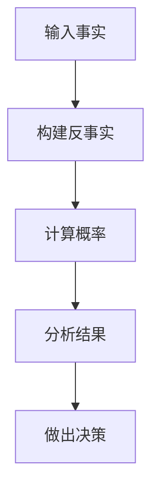

                 

## 利用示例引导模型进行反事实推理

### 关键词
- 示例引导模型
- 反事实推理
- 数学模型
- 算法原理
- 应用场景
- 实际案例

### 摘要
本文将深入探讨反事实推理的概念、数学模型、算法原理和应用场景。通过一步步的分析和示例引导，我们将揭示反事实推理的内在机制及其在实际问题中的解决能力。本文旨在为读者提供一个全面且易懂的反事实推理技术指南。

---

### 第一部分: 反事实推理概述

#### 第1章: 反事实推理的概念与背景

#### 1.1.1 问题背景
反事实推理（Counterfactual Reasoning）是指在一个给定事实的基础上，推断出与该事实相反的假设情况，并分析这些假设情况可能带来的结果。这种推理在逻辑学、计算机科学、心理学等多个领域有着广泛的应用。

#### 1.1.2 问题描述
反事实推理的核心概念是如何从已知的事实出发，构建可能的反事实场景，并分析这些场景的合理性和影响。基本原理包括逻辑推理、概率论和决策理论。

#### 1.1.3 问题解决
解决反事实推理问题通常需要以下步骤：
1. 明确原始事实。
2. 构建反事实场景。
3. 分析反事实场景的合理性和影响。
4. 根据分析结果做出决策。

#### 1.1.4 边界与外延
反事实推理的应用边界包括但不限于：决策分析、风险评估、历史推断等。其外延拓展到更广泛的领域，如人工智能、机器学习等。

#### 1.1.5 核心概念与联系
反事实推理的核心概念包括：事实、反事实、逻辑推理、概率论和决策理论。这些概念之间的联系构成了反事实推理的理论基础。

---

#### 第2章: 反事实推理的数学模型

#### 2.1.1 数学模型概述
反事实推理的数学模型通常涉及概率论和逻辑推理。基本框架包括条件概率、贝叶斯网络和马尔可夫链等。

#### 2.1.2 数学模型的详细讲解
反事实推理的数学模型由以下几个部分构成：
1. 条件概率公式：
   $$ P(A|B) = \frac{P(B|A)P(A)}{P(B)} $$
2. 贝叶斯网络：
   贝叶斯网络是一种图形化的概率模型，用于表示变量之间的条件依赖关系。
3. 马尔可夫链：
   马尔可夫链是一种用于描述系统状态转移的概率模型。

#### 2.1.3 数学公式的举例说明
例如，假设一个公司的销售数据中，事件A是“销售额超过预期”，事件B是“市场营销活动成功”。我们可以使用贝叶斯定理来计算在“市场营销活动成功”的情况下，“销售额超过预期”的概率。

$$ P(A|B) = \frac{P(B|A)P(A)}{P(B)} $$

如果已知：
- $P(B|A) = 0.8$（即市场营销活动成功时销售额超过预期的概率）
- $P(A) = 0.5$（即销售额超过预期的概率）
- $P(B) = 0.6$（即市场营销活动成功的概率）

我们可以计算出：
$$ P(A|B) = \frac{0.8 \times 0.5}{0.6} = \frac{2}{3} \approx 0.67 $$

这表示在市场营销活动成功的情况下，销售额超过预期的概率大约为67%。

---

### 第二部分: 反事实推理算法原理

#### 第3章: 反事实推理算法原理

#### 3.1.1 算法原理概述
反事实推理算法主要包括以下几种：
1. 贝叶斯推理
2. 最大后验推理
3. 最小化损失函数
4. 示例引导推理

每种算法都有其独特的适用场景和优缺点。

#### 3.1.2 算法原理的详细讲解
贝叶斯推理是一种基于概率的推理方法，通过条件概率和贝叶斯定理来推断后验概率。最大后验推理（MAP）和最小化损失函数（ML）是两种常见的参数估计方法。示例引导推理则是通过学习大量的示例来预测未知情况的概率。

#### 3.1.3 算法流程的mermaid流程图

---

### 第三部分: 反事实推理的应用场景

#### 第4章: 反事实推理的应用场景

#### 4.1.1 应用场景概述
反事实推理在多个领域都有广泛的应用，包括：
1. 决策分析
2. 风险评估
3. 机器学习
4. 计算机游戏
5. 法律推理

#### 4.1.2 应用场景的详细讲解
在本节中，我们将详细探讨反事实推理在决策分析、风险评估和机器学习等领域的应用。

1. **决策分析**：
   在商业决策中，反事实推理可以帮助分析不同决策路径的结果，从而帮助决策者做出更明智的选择。

2. **风险评估**：
   在金融领域，反事实推理可以帮助分析市场波动的原因，预测潜在的金融风险，并制定相应的风险管理策略。

3. **机器学习**：
   在机器学习模型训练过程中，反事实推理可以用于验证模型的鲁棒性，发现可能的异常情况。

---

### 第四部分: 反事实推理的实际案例

#### 第5章: 反事实推理的实际案例

#### 5.1.1 案例概述
在本章中，我们将通过一个实际案例来展示反事实推理的应用。

#### 5.1.2 案例分析
假设某公司在营销活动中面临两个选择：增加广告投入或提高产品质量。通过反事实推理，我们可以分析在不同选择下的潜在收益。

#### 5.1.3 案例讲解
1. **构建反事实**：假设选择增加广告投入，然后分析其可能带来的收益。
2. **计算概率**：基于历史数据，计算广告投入增加后的销售额增加的概率。
3. **分析结果**：比较两个选择的收益，做出最终决策。

---

### 第五部分: 反事实推理的未来发展

#### 第6章: 反事实推理的未来发展

#### 6.1.1 未来发展概述
反事实推理在未来的发展趋势包括：
1. 深度学习与反事实推理的结合
2. 自动化反事实推理算法
3. 面向特定领域的反事实推理应用

#### 6.1.2 未来发展的详细讲解
未来，反事实推理将更加自动化和智能化，其在人工智能、机器学习和决策支持系统等领域的应用将更加广泛。

---

### 第六部分: 反事实推理的总结与展望

#### 第7章: 反事实推理的总结与展望

#### 7.1.1 总结
反事实推理作为一种强大的推理工具，在多个领域都有着广泛的应用。通过本文的探讨，我们了解了其基本概念、数学模型和算法原理。

#### 7.1.2 展望
未来，反事实推理将在人工智能和计算机科学领域发挥更大的作用，为人类决策提供更强大的支持。

---

## 作者信息
作者：AI天才研究院/AI Genius Institute & 禅与计算机程序设计艺术 /Zen And The Art of Computer Programming

---

以上是《利用示例引导模型进行反事实推理》一书的完整内容概述。在后续的文章中，我们将逐一深入探讨每个部分的具体细节，帮助读者全面掌握反事实推理的精髓。

