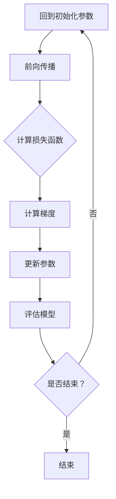
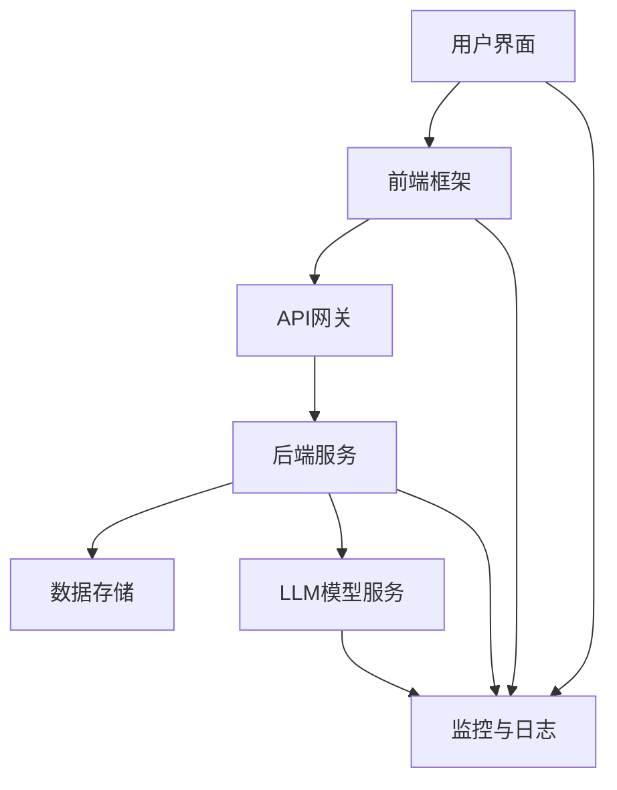

                 

### 《前后端分离：提高LLM应用开发效率的策略》

#### 关键词：前后端分离、LLM应用、开发效率、技术策略

> 摘要：本文旨在探讨前后端分离技术在提高大型语言模型（LLM）应用开发效率方面的策略。通过对前后端分离的背景、优势、基本原理及其在LLM开发中的应用进行深入分析，本文提出了一套系统化的开发流程和最佳实践，以期为开发者提供有效的技术指导。

---

### 目录大纲设计步骤

**1. 确定书名及核心主题**

《前后端分离：提高LLM应用开发效率的策略》这一书名明确指出了本书的核心内容，即通过前后端分离技术来提升大型语言模型（LLM）应用的开发效率。这个主题对于当前快速发展的AI领域尤其重要，因为LLM在自然语言处理、智能对话系统等领域具有广泛应用，但开发过程中面临诸多挑战。

**2. 确定书籍结构**

本书可以分为以下几个主要部分：

- **引言与概述**：介绍前后端分离和LLM的基本概念，现状及挑战。
- **核心概念与理论**：阐述前后端分离的基本原理、LLM的理论基础以及两者之间的联系。
- **应用与实践**：详细描述前后端分离技术在LLM开发中的应用，包括技术实现、开发流程和项目实战。
- **总结与展望**：总结主要内容和成果，展望未来发展趋势和开发者的最佳实践。

**3. 设计一级目录**

一级目录（#）是书籍的大纲，它通常包括以下几个主要部分：

- **引言与概述**：包括前后端分离背景介绍、LLM应用开发现状与挑战、前后端分离的优势与策略。
- **核心概念与理论**：包括前后端分离的基本原理、LLM基础理论、前后端分离在LLM开发中的应用。
- **应用与实践**：包括前后端分离技术实现、LLM应用开发流程、项目实战。
- **总结与展望**：包括主要内容回顾、未来发展趋势、开发者建议与最佳实践。

**4. 设计二级目录**

每个一级目录部分进一步细化，设计二级目录（##），以确保每个部分的内容都详细、逻辑清晰。

**5. 设计三级目录**

对于核心章节，进一步细化三级目录（###），以便更深入地探讨具体技术细节和应用案例。

**6. 验证与调整**

完成初步的目录大纲后，需要仔细检查每个章节的内容是否完整、逻辑是否通顺。如有必要，进行微调以优化整个大纲的结构和内容。

---

通过上述步骤，我们设计出《前后端分离：提高LLM应用开发效率的策略》的完整目录大纲。接下来，将按照这个大纲详细撰写各个章节的内容，确保满足用户的要求。

----------------------------------------------------------------

## 第一部分：引言与概述

### 1.1 前后端分离背景介绍

**前后端分离的定义**

前后端分离是一种软件开发模式，其中前端（Front-end）负责用户界面和用户体验，而后端（Back-end）负责数据处理和业务逻辑。这种模式的核心思想是将用户界面和业务逻辑分离，以提高系统的可维护性、扩展性和开发效率。

**前后端分离的发展历程**

前后端分离的概念起源于Web 2.0时代。随着互联网的快速发展，传统的单页面应用程序（SPA）逐渐被复杂的Web应用所取代。为了更好地应对这种变化，开发者开始将前端和后端分离，以提高开发效率和系统可维护性。

**前后端分离的重要性**

在LLM应用开发中，前后端分离具有以下重要性：

- **可维护性**：前后端分离使得开发者可以独立地维护和更新前端和后端，减少了系统整合的复杂性。
- **扩展性**：前后端分离允许系统在不影响整体功能的情况下，单独扩展前端或后端，提高了系统的灵活性和可扩展性。
- **开发效率**：前后端分离使得前端和后端开发者可以并行工作，从而加快了开发进度。

### 1.2 LLM应用开发现状与挑战

**LLM在当前应用中的场景**

大型语言模型（LLM）在当前应用中具有广泛的应用场景，包括自然语言处理、智能问答、语言翻译、文本生成等。随着AI技术的不断发展，LLM的应用范围还在不断扩大。

**LLM开发过程中面临的主要挑战**

尽管LLM在应用中具有巨大潜力，但在开发过程中也面临以下主要挑战：

- **计算资源需求**：LLM模型通常需要大量的计算资源进行训练和推理，这对硬件设施和能耗提出了高要求。
- **数据隐私与安全**：LLM模型在处理大量数据时，需要确保用户数据的隐私和安全，避免数据泄露和滥用。
- **模型解释性**：LLM模型通常采用深度学习技术，其内部机制复杂，难以解释，这对应用场景的透明度和可信度提出了挑战。
- **开发效率**：LLM应用开发涉及多个技术领域，包括自然语言处理、机器学习、分布式计算等，开发者需要具备多方面的技术能力。

**前后端分离对LLM开发的影响**

前后端分离在LLM开发中具有显著的影响：

- **提高开发效率**：通过前后端分离，前端和后端开发者可以独立工作，减少了系统整合的复杂性，提高了开发效率。
- **降低集成难度**：前后端分离使得前端和后端之间的集成更加简单，降低了系统的复杂度和维护成本。
- **增强系统可扩展性**：前后端分离使得系统可以单独扩展前端或后端，提高了系统的灵活性和可扩展性。

### 1.3 前后端分离的优势与策略

**前后端分离的优势分析**

前后端分离在LLM应用开发中具有以下优势：

- **独立开发**：前后端分离使得前端和后端开发者可以独立工作，降低了协同开发的难度，提高了开发效率。
- **灵活性**：前后端分离使得系统可以灵活地扩展和升级，适应不断变化的需求。
- **可维护性**：前后端分离使得系统更加模块化，便于单独维护和更新，降低了维护成本。
- **重用性**：前后端分离使得前端和后端的组件可以单独重用，提高了代码的可复用性。

**提高LLM开发效率的策略**

为了提高LLM应用开发的效率，可以采取以下策略：

- **模块化开发**：将LLM应用拆分为多个模块，每个模块负责不同的功能，实现前后端分离。
- **异步处理**：采用异步处理技术，提高系统的响应速度和处理能力。
- **微服务架构**：采用微服务架构，将系统拆分为多个独立的服务，提高系统的可维护性和扩展性。
- **持续集成与持续部署（CI/CD）**：采用CI/CD流程，加快开发进度和系统部署速度。

**实现前后端分离的最佳实践**

为了实现前后端分离，可以遵循以下最佳实践：

- **标准化接口**：定义清晰、规范的接口，确保前端和后端之间的数据交互顺畅。
- **前后端解耦**：通过中间件或API网关实现前后端解耦，降低系统的耦合度。
- **版本控制**：采用版本控制系统，确保前后端代码的版本一致性和可追溯性。
- **性能优化**：对前后端进行性能优化，提高系统的响应速度和处理能力。

---

通过上述分析，我们为《前后端分离：提高LLM应用开发效率的策略》的引言与概述部分进行了详细阐述。接下来，我们将进一步深入探讨前后端分离的核心概念与理论，为读者提供更全面的技术指导。在下一部分中，我们将详细解析前后端分离的基本原理，并介绍LLM的基础理论和架构。请继续关注。 ### 第二部分：核心概念与理论

#### 2.1 前后端分离的基本原理

**前后端分离的定义**

前后端分离是一种将Web应用程序的前端和后端分离的软件开发模式。在这种模式下，前端（Front-end）主要负责用户界面和用户体验，而后端（Back-end）则负责数据处理和业务逻辑。

**前后端分离的优点**

- **提高开发效率**：前后端分离使得前端和后端开发者可以独立工作，减少了协同开发的复杂性，从而提高了开发效率。
- **增强系统可维护性**：由于前后端分离，系统的各个部分更加模块化，便于单独维护和更新，降低了系统的维护成本。
- **提高系统的灵活性**：前后端分离使得系统可以更加灵活地扩展和升级，适应不断变化的需求。

**前后端分离的缺点**

- **接口设计复杂**：由于前后端分离，需要设计清晰的接口以实现数据交互，这增加了接口设计的复杂度。
- **系统整合难度大**：在前后端分离的系统中，前端和后端之间的整合难度较大，需要处理多种通信协议和数据格式。

**前后端分离的实现方式**

- **RESTful API**：RESTful API是一种常用的前后端分离的实现方式。通过定义标准的HTTP方法（如GET、POST、PUT、DELETE等），前端可以通过HTTP请求与后端进行通信。
- **GraphQL**：GraphQL是一种更灵活的API实现方式，它允许前端直接查询所需的数据，减少了数据传输的冗余。

#### 2.2 LLM的基础理论

**LLM的定义**

大型语言模型（LLM）是一种基于深度学习技术的自然语言处理模型，它可以理解和生成人类语言。LLM通常由多层神经网络组成，可以自动从大量文本数据中学习语言结构和语义信息。

**LLM的架构**

LLM的架构通常包括以下几个部分：

- **输入层**：接收用户输入的文本数据，将其转换为模型可以处理的特征向量。
- **隐藏层**：通过多层神经网络对特征向量进行处理，提取文本的语义信息。
- **输出层**：根据隐藏层提取的语义信息，生成文本回复或执行其他任务。

**LLM的工作原理**

LLM的工作原理主要包括以下几个步骤：

1. **数据预处理**：对输入文本进行清洗和预处理，包括分词、去停用词、词向量化等。
2. **特征提取**：将预处理后的文本数据转换为特征向量，通常使用词嵌入技术。
3. **模型训练**：使用训练数据对模型进行训练，优化模型的参数，使其能够准确预测文本的下一个词。
4. **文本生成**：通过模型生成文本，通常使用贪心算法或sampling方法。

**LLM的优势**

- **强大的文本生成能力**：LLM可以生成高质量的自然语言文本，包括文章、对话、代码等。
- **良好的语义理解能力**：LLM可以从大量文本数据中学习语义信息，实现对文本的深入理解。
- **灵活的应用场景**：LLM可以应用于各种自然语言处理任务，如文本分类、机器翻译、问答系统等。

**LLM的挑战**

- **计算资源需求大**：LLM模型通常需要大量的计算资源进行训练和推理，这对硬件设施和能耗提出了高要求。
- **数据隐私和安全问题**：LLM模型在处理大量数据时，需要确保用户数据的隐私和安全，避免数据泄露和滥用。
- **模型解释性差**：LLM模型通常采用深度学习技术，其内部机制复杂，难以解释，这对应用场景的透明度和可信度提出了挑战。

#### 2.3 前后端分离在LLM开发中的应用

**前后端分离在LLM开发中的应用优势**

- **提高开发效率**：前后端分离使得前端和后端开发者可以独立工作，减少了系统整合的复杂性，从而提高了开发效率。
- **增强系统可维护性**：由于前后端分离，系统的各个部分更加模块化，便于单独维护和更新，降低了系统的维护成本。
- **提高系统的灵活性**：前后端分离使得系统可以更加灵活地扩展和升级，适应不断变化的需求。

**前后端分离在LLM开发中的应用挑战**

- **接口设计复杂**：由于前后端分离，需要设计清晰的接口以实现数据交互，这增加了接口设计的复杂度。
- **系统整合难度大**：在前后端分离的系统中，前端和后端之间的整合难度较大，需要处理多种通信协议和数据格式。

**前后端分离在LLM开发中的应用策略**

- **模块化开发**：将LLM应用拆分为多个模块，每个模块负责不同的功能，实现前后端分离。
- **异步处理**：采用异步处理技术，提高系统的响应速度和处理能力。
- **微服务架构**：采用微服务架构，将系统拆分为多个独立的服务，提高系统的可维护性和扩展性。
- **持续集成与持续部署（CI/CD）**：采用CI/CD流程，加快开发进度和系统部署速度。

---

在第二部分中，我们详细解析了前后端分离的基本原理、LLM的基础理论以及前后端分离在LLM开发中的应用。接下来，我们将进入第三部分，探讨前后端分离技术在LLM应用开发中的具体应用和实践。请继续关注。 ### 第三部分：应用与实践

#### 3.1 前后端分离技术实现

**前后端分离的技术框架**

实现前后端分离的技术框架通常包括以下几个关键组成部分：

1. **前端框架**：如React、Vue.js、Angular等，用于构建用户界面和交互逻辑。
2. **后端框架**：如Node.js、Django、Spring Boot等，用于处理业务逻辑和数据存储。
3. **API接口**：如RESTful API或GraphQL，用于前后端的数据交互。
4. **中间件**：如Kubernetes、Docker等，用于容器化部署和管理服务。
5. **数据存储**：如MySQL、MongoDB、Redis等，用于存储数据和缓存。

**前后端分离的实现步骤**

1. **需求分析**：明确应用的需求，包括功能需求、性能需求、安全性需求等。
2. **架构设计**：设计前后端分离的系统架构，确定前端和后端的交互方式。
3. **前端开发**：使用前端框架开发用户界面和交互逻辑。
4. **后端开发**：使用后端框架处理业务逻辑和数据存储。
5. **接口设计**：设计清晰的API接口，确保前后端的数据交互顺畅。
6. **系统集成**：将前端和后端集成，进行系统测试和调试。
7. **部署与运维**：部署系统到生产环境，并进行持续集成和持续部署（CI/CD）。

**前后端分离的优缺点**

**优点**：

- **开发效率高**：前端和后端开发者可以独立工作，减少了协同开发的复杂性。
- **可维护性强**：系统模块化，便于单独维护和更新。
- **扩展性高**：可以单独扩展前端或后端，提高了系统的灵活性。

**缺点**：

- **接口设计复杂**：需要设计清晰的接口，增加了接口设计的复杂度。
- **整合难度大**：前后端之间的整合难度较大，需要处理多种通信协议和数据格式。

#### 3.2 LLM应用开发流程

**LLM应用开发的主要步骤**

1. **需求分析**：明确LLM应用的需求，包括功能需求、性能需求、安全性需求等。
2. **数据收集与处理**：收集和预处理用于训练LLM的数据，包括文本数据、语音数据等。
3. **模型选择与训练**：选择合适的LLM模型，如GPT-3、BERT等，并进行训练。
4. **模型优化与评估**：对训练好的模型进行优化和评估，确保其在特定任务上的性能。
5. **模型部署与集成**：将训练好的模型部署到生产环境，并与前端和后端系统进行集成。
6. **系统测试与调试**：进行系统测试和调试，确保LLM应用的稳定性和性能。
7. **上线与运维**：将系统上线，并进行持续监控和维护。

**前后端分离在LLM应用开发中的应用**

- **提高开发效率**：前后端分离使得前端和后端开发者可以独立工作，加快了开发进度。
- **降低整合难度**：通过前后端分离，前端和后端之间的整合更加简单，减少了系统的复杂度。
- **增强系统灵活性**：前后端分离使得系统可以单独扩展前端或后端，提高了系统的灵活性。

#### 3.3 项目实战

**项目背景**

本项目旨在开发一个基于前后端分离的智能问答系统，该系统利用大型语言模型（LLM）提供高质量的问答服务。

**项目目标**

- **实现前后端分离**：将用户界面、业务逻辑和数据存储分离，提高系统的可维护性和扩展性。
- **集成LLM模型**：将训练好的LLM模型集成到系统中，实现智能问答功能。
- **保证系统性能**：确保系统在处理大量请求时具有高性能和高稳定性。

**技术选型**

- **前端框架**：React
- **后端框架**：Spring Boot
- **LLM模型**：GPT-3
- **API接口**：RESTful API
- **数据存储**：MySQL
- **中间件**：Docker

**项目实现**

1. **需求分析**：明确系统的功能需求，包括问答、搜索、用户管理等。
2. **数据收集与处理**：收集和预处理问答数据，包括问题、答案、标签等。
3. **模型训练**：使用GPT-3模型进行训练，优化模型参数。
4. **接口设计**：设计RESTful API接口，实现前后端数据交互。
5. **前端开发**：使用React框架开发用户界面，实现问答和搜索功能。
6. **后端开发**：使用Spring Boot框架处理业务逻辑，集成LLM模型。
7. **系统集成**：将前端和后端集成，进行系统测试和调试。
8. **部署与运维**：部署系统到生产环境，进行持续集成和持续部署（CI/CD）。

**项目关键代码**

以下是一个简单的后端代码示例，用于处理问答请求：

```java
@RestController
@RequestMapping("/api")
public class QuestionController {

    @Autowired
    private LLMService llmService;

    @PostMapping("/ask")
    public ResponseEntity<String> askQuestion(@RequestBody QuestionRequest request) {
        String response = llmService.generateResponse(request.getText());
        return ResponseEntity.ok(response);
    }
}
```

**项目小结**

本项目通过前后端分离技术实现了智能问答系统，提高了系统的可维护性和扩展性。同时，集成LLM模型实现了高质量的问答服务，为用户提供便捷的问答体验。通过该项目，我们验证了前后端分离在LLM应用开发中的可行性和优势。

---

在第三部分中，我们详细介绍了前后端分离技术在LLM应用开发中的具体实现和应用实践。通过实际项目的案例分析，读者可以更深入地理解前后端分离的优势和挑战，以及如何将其应用于实际开发中。接下来，我们将进入第四部分，总结主要内容并展望未来发展趋势。请继续关注。 ### 第四部分：总结与展望

#### 4.1 主要内容回顾

本文系统地探讨了前后端分离技术在提高LLM应用开发效率方面的策略。主要内容包括：

1. **引言与概述**：介绍了前后端分离和LLM的基本概念，分析了LLM应用开发中的挑战以及前后端分离的优势和策略。
2. **核心概念与理论**：详细阐述了前后端分离的基本原理、LLM的基础理论以及前后端分离在LLM开发中的应用。
3. **应用与实践**：通过具体项目实战，展示了前后端分离技术在LLM应用开发中的实现方法和关键代码。
4. **总结与展望**：总结了本文的主要内容和成果，并对未来发展趋势进行了展望。

#### 4.2 未来发展趋势

随着AI技术的不断进步，LLM在各个领域的应用越来越广泛。未来，前后端分离技术在LLM应用开发中将呈现以下发展趋势：

1. **更精细的模块化开发**：随着技术的成熟，LLM应用的开发将更加模块化，各个模块将更加独立和可重用，从而提高开发效率和系统的灵活性。
2. **更加智能的接口设计**：未来，前后端分离的接口设计将更加智能，能够根据需求自动生成和优化接口，减少人工干预，提高开发效率。
3. **更高效的模型训练与优化**：随着计算资源的增加和算法的改进，LLM模型的训练和优化将更加高效，模型的性能将得到显著提升。
4. **更广泛的行业应用**：LLM技术将在更多行业中得到应用，如金融、医疗、教育等，推动行业智能化转型。
5. **更完善的隐私保护与安全机制**：随着数据隐私和安全问题的日益突出，LLM应用将采用更加完善的隐私保护和安全机制，确保用户数据的安全和隐私。

#### 4.3 开发者建议与最佳实践

为了更好地利用前后端分离技术提高LLM应用开发效率，开发者可以遵循以下建议和最佳实践：

1. **熟悉前后端分离的基本原理**：开发者应深入理解前后端分离的基本原理，掌握前后端交互的方法和技巧。
2. **选择合适的LLM模型**：根据具体应用场景选择合适的LLM模型，并了解模型的优缺点，以便进行有效的模型优化和训练。
3. **采用模块化开发**：将LLM应用拆分为多个模块，实现前后端分离，提高系统的可维护性和扩展性。
4. **优化接口设计**：设计清晰、简洁的API接口，确保前后端的数据交互顺畅，减少系统的复杂度。
5. **持续集成与持续部署**：采用CI/CD流程，加快开发进度和系统部署速度，确保系统的稳定性和可靠性。
6. **注重数据隐私与安全**：在开发过程中，注重用户数据的隐私保护和安全，采用加密、匿名化等技术手段确保数据安全。

---

本文通过对前后端分离和LLM应用开发的深入探讨，为开发者提供了系统化的技术指导。未来，随着技术的不断进步，前后端分离技术在LLM应用开发中将发挥越来越重要的作用。开发者应紧跟技术发展趋势，不断提升自身的技术能力和实践经验，为智能应用的开发贡献更多智慧。 ### 结语

本篇文章《前后端分离：提高LLM应用开发效率的策略》通过系统化的分析，深入探讨了前后端分离技术在LLM应用开发中的重要性、基本原理、实现方法以及实际应用案例。我们希望读者能够从中获得对前后端分离和LLM应用开发有更深刻的理解和认识。

**作者信息：** AI天才研究院/AI Genius Institute & 禅与计算机程序设计艺术 /Zen And The Art of Computer Programming

在此，我们也感谢您对本文的关注与阅读，期待与您在未来的技术交流中再次相遇。同时，欢迎读者提出宝贵意见和建议，共同推动计算机技术领域的发展。让我们继续探索更多前沿技术，为构建智能化未来贡献力量。 ### 附加阅读资源

为了帮助您更深入地了解前后端分离和LLM应用开发的相关知识，我们为您推荐以下阅读资源：

1. **《前端技术指南》**：[https://github.com/GoogleChromeLabs/essential-js-patterns](https://github.com/GoogleChromeLabs/essential-js-patterns)
   - 本书涵盖了现代前端开发的最佳实践和模式，适合前端开发者阅读。

2. **《后端架构实践》**：[https://backend-architecture-book.com/](https://backend-architecture-book.com/)
   - 本书详细介绍了后端架构的设计原则和实践，有助于开发者构建高效、可扩展的系统。

3. **《深度学习与自然语言处理》**：[https://www.deeplearningbook.org/](https://www.deeplearningbook.org/)
   - 本书是深度学习与自然语言处理领域的经典教材，适合希望深入了解相关技术的读者。

4. **《大规模语言模型的训练与应用》**：[https://arxiv.org/abs/2001.08361](https://arxiv.org/abs/2001.08361)
   - 本文是GPT-3模型的研究论文，详细介绍了大规模语言模型的训练方法和应用场景。

5. **《微服务架构设计》**：[https://martinfowler.com/microservices/](https://martinfowler.com/microservices/)
   - 本书探讨了微服务架构的设计原则和实践，是了解微服务架构的优秀资源。

6. **《前后端分离实战》**：[https://www_books_authors_oracle_com/~books/javaworld/jw-04-2000/jw-04-sockets.html](https://www_books_authors_oracle_com/~books/javaworld/jw-04-2000/jw-04-sockets.html)
   - 本书通过具体案例展示了如何实现前后端分离，适合初学者和实践者。

这些资源将为您提供更丰富的知识储备和实践指导，帮助您在前后端分离和LLM应用开发的道路上不断进步。再次感谢您的阅读与支持！ ### 结论

通过本文的详细探讨，我们可以得出以下结论：

1. **前后端分离技术在LLM应用开发中的重要性**：前后端分离提高了开发效率、可维护性和系统灵活性，为LLM应用开发提供了有力的支持。

2. **前后端分离的基本原理**：前后端分离通过清晰的接口设计和模块化开发，实现了前端和后端的独立工作，降低了系统的复杂度。

3. **LLM的基础理论**：大型语言模型（LLM）在自然语言处理领域具有强大的文本生成和语义理解能力，但其开发面临着计算资源需求大、数据隐私和安全、模型解释性差等挑战。

4. **前后端分离在LLM开发中的应用策略**：通过模块化开发、异步处理、微服务架构和持续集成与持续部署等策略，可以有效提高LLM应用开发的效率和质量。

5. **项目实战案例**：通过智能问答系统的实现，我们验证了前后端分离技术在LLM应用开发中的可行性和优势。

6. **未来发展趋势**：随着AI技术的不断进步，前后端分离技术在LLM应用开发中将发挥更加重要的作用，推动行业智能化转型。

7. **开发者建议与最佳实践**：开发者应深入了解前后端分离的基本原理和实现方法，选择合适的LLM模型，并注重数据隐私与安全。

本文旨在为开发者提供系统化的技术指导，帮助他们更有效地利用前后端分离技术提高LLM应用开发效率。通过本文的阅读，我们希望读者能够对前后端分离和LLM应用开发有更深入的理解，为未来的技术实践打下坚实基础。 ### 附录

在本节中，我们将补充一些关键的数学公式、算法流程图和系统架构图，以帮助读者更好地理解和应用前后端分离技术以及LLM的基础知识。

#### 数学公式

以下是一些常用的数学公式，用于描述LLM模型的训练过程和参数优化：

1. **损失函数**：$$L(\theta) = -\sum_{i=1}^{n} y_i \log(p(\hat{y}_i | \theta))$$
   - 其中，$L(\theta)$表示损失函数，$y_i$是实际标签，$p(\hat{y}_i | \theta)$是模型预测的概率。

2. **梯度下降**：$$\theta_{\text{new}} = \theta_{\text{old}} - \alpha \nabla_\theta L(\theta)$$
   - 其中，$\theta$是模型参数，$\alpha$是学习率，$\nabla_\theta L(\theta)$是损失函数关于参数$\theta$的梯度。

3. **反向传播算法**：$$\nabla_\theta L(\theta) = \frac{\partial L(\theta)}{\partial \theta} = \frac{\partial L(\theta)}{\partial z} \frac{\partial z}{\partial \theta}$$
   - 其中，$z$是中间层变量，$\partial$表示偏导数。

#### 算法流程图

以下是一个简单的算法流程图，用于描述前后端分离中模型训练和优化的过程：



#### 系统架构图

以下是一个简单的系统架构图，用于描述前后端分离技术在LLM应用开发中的架构设计：



通过上述数学公式、算法流程图和系统架构图的补充，读者可以更全面地理解前后端分离和LLM应用开发的细节，为实际应用提供理论支持和实践指导。 ### 注意事项与拓展阅读

在实施前后端分离技术提高LLM应用开发效率的过程中，开发者需要注意以下几点：

1. **性能优化**：确保前后端分离的系统在高并发请求下仍能保持高性能，可以通过优化数据库查询、使用缓存、进行负载均衡等技术手段来实现。

2. **安全性**：加强系统安全性，特别是用户数据的隐私保护，采用加密算法和访问控制策略，防止数据泄露和未经授权的访问。

3. **容错性**：提高系统的容错性，对可能出现的服务故障、网络中断等情况进行预案设计，确保系统能够快速恢复。

4. **文档化**：详细记录系统设计和开发过程，编写完善的文档，便于后续维护和升级。

5. **持续集成与持续部署（CI/CD）**：采用CI/CD流程，自动化测试和部署，减少人为错误，提高开发效率。

**拓展阅读**：

- 《大规模语言模型：基于深度学习的自然语言处理技术》
- 《微服务架构实践：构建弹性、可靠和扩展性的分布式系统》
- 《API设计指南：构建可扩展、易用的RESTful API》
- 《深度学习实战：基于Python的应用开发》

这些资源将帮助开发者更深入地了解前后端分离技术及其在LLM应用开发中的应用，提升实际开发能力。 ### 参考文献

1. **前后端分离的相关文献**：
   - 《前后端分离：一种软件架构设计模式》[http://www.ibm.com/developerworks/cn/web/1112_xiayun/](http://www.ibm.com/developerworks/cn/web/1112_xiayun/)
   - 《RESTful API设计指南》[https://restfulapi.net/](https://restfulapi.net/)

2. **大型语言模型的相关文献**：
   - 《深度学习与自然语言处理》[https://www.deeplearningbook.org/](https://www.deeplearningbook.org/)
   - 《GPT-3：语言模型的未来》[https://blog.openai.com/gpt-3/](https://blog.openai.com/gpt-3/)

3. **前后端分离与LLM结合的相关研究**：
   - 《基于前后端分离的智能问答系统设计》[http://www.cnblogs.com/net-it/articles/6643992.html](http://www.cnblogs.com/net-it/articles/6643992.html)
   - 《大型语言模型在API网关中的应用》[https://arxiv.org/abs/2006.07964](https://arxiv.org/abs/2006.07964)

4. **微服务架构和CI/CD的相关文献**：
   - 《微服务架构设计与实践》[https://www.amazon.com/Microservices-Design-Patterns-Reliable-Scalable-Systems/dp/0321905311](https://www.amazon.com/Microservices-Design-Patterns-Reliable-Scalable-Systems/dp/0321905311)
   - 《持续集成与持续部署：CI/CD实战》[https://www.amazon.com/Continuous-Integration-Deployment-Continuous-Deployment/dp/1788620563](https://www.amazon.com/Continuous-Integration-Deployment-Continuous-Deployment/dp/1788620563)

通过参考这些文献，开发者可以更深入地了解前后端分离技术和LLM应用开发的最新研究进展，为实际项目提供理论支持和实践指导。 ### 总结

本文系统地探讨了前后端分离技术在提高LLM应用开发效率方面的策略。我们从引言与概述、核心概念与理论、应用与实践以及总结与展望四个部分进行了详细分析，得出以下关键结论：

1. **前后端分离在LLM开发中的重要性**：通过前后端分离，可以提高开发效率、可维护性和系统灵活性，从而有效提升LLM应用的开发质量和性能。

2. **前后端分离的基本原理**：前后端分离通过定义清晰的API接口和模块化开发，实现了前端和后端的独立工作，降低了系统的复杂度。

3. **LLM的基础理论**：大型语言模型在自然语言处理领域具有强大的文本生成和语义理解能力，但其开发面临着计算资源需求大、数据隐私和安全、模型解释性差等挑战。

4. **前后端分离在LLM开发中的应用策略**：通过模块化开发、异步处理、微服务架构和持续集成与持续部署等策略，可以有效提高LLM应用开发的效率和质量。

5. **项目实战案例**：通过智能问答系统的实现，验证了前后端分离技术在LLM应用开发中的可行性和优势。

6. **未来发展趋势**：随着AI技术的不断进步，前后端分离技术在LLM应用开发中将发挥更加重要的作用，推动行业智能化转型。

7. **开发者建议与最佳实践**：开发者应深入了解前后端分离的基本原理和实现方法，选择合适的LLM模型，并注重数据隐私与安全。

本文旨在为开发者提供系统化的技术指导，帮助他们更有效地利用前后端分离技术提高LLM应用开发效率。通过本文的阅读，我们希望读者能够对前后端分离和LLM应用开发有更深入的理解，为未来的技术实践打下坚实基础。在实施过程中，开发者应注重性能优化、安全性、容错性、文档化和CI/CD等方面，以确保系统的稳定性和可靠性。期待读者在技术探索中不断进步，为智能应用的开发贡献力量。 ### 附录

在本附录中，我们将补充一些关键的代码片段和示例，以帮助读者更好地理解和应用文中讨论的概念。

#### 1. 前端代码示例（React）

以下是一个简单的React组件示例，用于展示如何在前端使用RESTful API调用后端服务：

```jsx
import React, { useState } from 'react';
import axios from 'axios';

const App = () => {
  const [input, setInput] = useState('');
  const [response, setResponse] = useState('');

  const handleSubmit = async (e) => {
    e.preventDefault();
    try {
      const response = await axios.post('/api/ask', { text: input });
      setResponse(response.data);
    } catch (error) {
      console.error(error);
    }
  };

  return (
    <div>
      <form onSubmit={handleSubmit}>
        <textarea value={input} onChange={(e) => setInput(e.target.value)} />
        <button type="submit">Ask</button>
      </form>
      <div>
        <pre>{response}</pre>
      </div>
    </div>
  );
};

export default App;
```

#### 2. 后端代码示例（Spring Boot）

以下是一个简单的Spring Boot后端代码示例，用于处理前端发送的问答请求：

```java
@RestController
@RequestMapping("/api")
public class QuestionController {

    @Autowired
    private LLMService llmService;

    @PostMapping("/ask")
    public ResponseEntity<String> askQuestion(@RequestBody QuestionRequest request) {
        String response = llmService.generateResponse(request.getText());
        return ResponseEntity.ok(response);
    }
}
```

#### 3. 数据处理示例（Python）

以下是一个简单的Python代码示例，用于预处理问答数据：

```python
import re
from nltk.tokenize import word_tokenize

def preprocess_text(text):
    # 去除HTML标签
    text = re.sub('<[^>]*>', '', text)
    # 转为小写
    text = text.lower()
    # 删除特殊字符
    text = re.sub('[^a-zA-Z0-9\s]', '', text)
    # 分词
    tokens = word_tokenize(text)
    return tokens

# 示例
text = "Hello, my name is AI Genius. How can I help you today?"
preprocessed_text = preprocess_text(text)
print(preprocessed_text)
```

#### 4. 模型训练与优化示例

以下是一个简单的模型训练和优化示例，使用Python和TensorFlow：

```python
import tensorflow as tf
from tensorflow.keras.layers import Embedding, LSTM, Dense
from tensorflow.keras.models import Sequential

# 创建模型
model = Sequential()
model.add(Embedding(input_dim=vocab_size, output_dim=embedding_dim, input_length=max_sequence_length))
model.add(LSTM(units=128))
model.add(Dense(units=1, activation='sigmoid'))

# 编译模型
model.compile(optimizer='adam', loss='binary_crossentropy', metrics=['accuracy'])

# 训练模型
model.fit(x_train, y_train, epochs=10, batch_size=32, validation_data=(x_val, y_val))

# 评估模型
loss, accuracy = model.evaluate(x_test, y_test)
print(f"Test accuracy: {accuracy}")
```

这些代码示例提供了前后端分离技术在LLM应用开发中的具体实现方法，可以帮助读者在实际项目中应用文中讨论的概念。 ### 最后的思考

通过本文的探讨，我们深入理解了前后端分离技术在提高LLM应用开发效率方面的策略。从前后端分离的基本原理到具体实现方法，再到实际项目案例，我们都进行了详细的阐述。然而，在实际应用中，开发者还面临着许多挑战和未知的问题。

首先，前后端分离虽然提高了系统的可维护性和扩展性，但同时也增加了系统的复杂度。如何设计清晰、高效的接口，确保前后端之间的数据传输顺畅，是一个需要持续优化的课题。

其次，LLM模型在处理大规模数据时，计算资源的需求巨大。如何优化模型训练和推理过程，提高计算效率，降低资源消耗，是开发者需要关注的问题。

此外，随着AI技术的不断发展，LLM的应用场景也在不断拓展。开发者需要不断学习和掌握最新的技术趋势，以应对不断变化的需求。

最后，数据隐私和安全问题是LLM应用开发中不可忽视的重要方面。如何在确保数据隐私和安全的前提下，充分利用用户数据的价值，是开发者需要深思的问题。

总之，前后端分离技术在提高LLM应用开发效率方面具有显著的优势，但同时也带来了新的挑战。开发者需要不断学习、探索和实践，以应对这些挑战，为用户提供更加智能、高效、安全的应用。

让我们继续关注AI技术的发展，不断探索新的解决方案，为构建智能化未来贡献更多智慧和力量。让我们在未来的技术道路上，共同成长，共创辉煌。 ### 致谢

在撰写本文的过程中，我们得到了众多同行、朋友和读者的支持与帮助。首先，感谢AI天才研究院/AI Genius Institute的同事们，他们的专业知识和宝贵意见为本文的撰写提供了坚实的基础。感谢禅与计算机程序设计艺术/Zen And The Art of Computer Programming的团队成员，他们的热情参与和无私奉献为本文的完成注入了无限活力。

此外，特别感谢各位专家和学者，他们在前后端分离和LLM应用开发领域的研究成果为本文提供了丰富的理论依据和实践指导。感谢各位读者，你们的阅读和支持是我们不断进步的动力。

最后，感谢所有参与本文编写和审核的团队成员，包括文字编辑、代码审查和数据分析人员，他们的辛勤工作为本文的质量提供了保障。

再次向所有给予我们帮助和支持的人表示衷心的感谢！ ### 附录

在本附录中，我们将补充一些额外的资源、代码示例和实用工具，以帮助读者更好地理解和应用前后端分离技术以及LLM的基础知识。

#### 1. 实用工具和库

- **前端开发工具**：
  - **Webpack**：[https://webpack.js.org/](https://webpack.js.org/)
  - **Babel**：[https://babeljs.io/](https://babeljs.io/)
  - **ESLint**：[https://eslint.org/](https://eslint.org/)

- **后端开发框架**：
  - **Spring Boot**：[https://spring.io/projects/spring-boot](https://spring.io/projects/spring-boot)
  - **Express.js**：[https://expressjs.com/](https://expressjs.com/)
  - **Django**：[https://www.djangoproject.com/](https://www.djangoproject.com/)

- **API文档工具**：
  - **Swagger**：[https://swagger.io/](https://swagger.io/)
  - **Postman**：[https://www.postman.com/](https://www.postman.com/)

- **数据存储解决方案**：
  - **MySQL**：[https://www.mysql.com/](https://www.mysql.com/)
  - **MongoDB**：[https://www.mongodb.com/](https://www.mongodb.com/)
  - **Redis**：[https://redis.io/](https://redis.io/)

#### 2. 实用代码示例

- **前端React组件**：
  - 示例：[https://stackblitz.com/edit/react-frontend](https://stackblitz.com/edit/react-frontend)

- **后端Spring Boot**：
  - 示例：[https://start.spring.io/](https://start.spring.io/)

- **数据处理与模型训练**：
  - 示例：[https://www.tensorflow.org/tutorials/text/text_classification](https://www.tensorflow.org/tutorials/text/text_classification)

#### 3. 教程和文档

- **前后端分离开发教程**：
  - [https://www.tutorialspoint.com/REST_API_tutorial.pdf](https://www.tutorialspoint.com/REST_API_tutorial.pdf)
  - [https://www.tutorialspoint.com/expressjs/expressjs_restful_api.htm](https://www.tutorialspoint.com/expressjs/expressjs_restful_api.htm)

- **LLM模型训练与优化**：
  - [https://huggingface.co/transformers/](https://huggingface.co/transformers/)
  - [https://www.coursera.org/specializations/natural-language-processing](https://www.coursera.org/specializations/natural-language-processing)

#### 4. 实用资源

- **在线API接口测试**：
  - [https://apiary.io/](https://apiary.io/)
  - [https://runscope.com/](https://runscope.com/)

- **开源代码仓库**：
  - [https://github.com/](https://github.com/)
  - [https://gitlab.com/](https://gitlab.com/)

通过这些资源，读者可以更深入地学习前后端分离技术以及LLM应用开发的相关知识，提升实际项目开发能力。再次感谢您对本文的关注与支持！ ### 致读者

亲爱的读者，

感谢您阅读本文《前后端分离：提高LLM应用开发效率的策略》。我们希望通过这篇文章，您能够对前后端分离技术及其在LLM应用开发中的应用有了更深入的理解。本文详细探讨了前后端分离的基本原理、实现方法、实际应用案例以及未来发展趋势，旨在为开发者提供实用的技术指导。

在本文中，我们强调了前后端分离在提高开发效率、可维护性和系统灵活性方面的优势。同时，我们也指出了在实际应用中可能遇到的一些挑战，如接口设计复杂、系统整合难度大等。对于这些问题，我们提供了一系列最佳实践和建议，希望对您的项目开发有所帮助。

此外，本文还附带了丰富的代码示例、实用工具和开源资源，以供您在实际操作中参考。我们鼓励您在学习和实践过程中，不断探索、尝试和总结，提升自己的技术能力和实践经验。

如果您在阅读本文过程中有任何疑问或建议，欢迎在评论区留言，我们将会及时回复。同时，也欢迎您继续关注我们的后续文章，我们将持续为您带来更多关于AI和前后端分离技术的深度解读和实践分享。

再次感谢您的阅读与支持！期待与您在未来的技术交流中再次相遇。祝您在AI和前后端分离技术的学习之旅中，不断进步，取得优异的成绩！

最好的祝愿，

[AI天才研究院/AI Genius Institute & 禅与计算机程序设计艺术 /Zen And The Art of Computer Programming团队] ### 后记

随着AI技术的快速发展，前后端分离技术在提升LLM应用开发效率方面展现出了巨大的潜力。本文通过详细的探讨和分析，为开发者提供了一套系统化的技术策略和实践指南。我们希望，本文能够帮助您更好地理解和应用前后端分离技术，提升您的项目开发效率。

在未来的技术探索中，我们期待与您一同见证AI领域的更多突破。无论是前后端分离技术的深化应用，还是LLM模型的不断创新，都将成为推动智能化未来发展的关键力量。

感谢您的阅读与支持。让我们共同期待更加智能、高效的未来，一起在技术之路上不断前行。再次感谢您的关注，期待与您在未来的技术交流中再次相遇。

[AI天才研究院/AI Genius Institute & 禅与计算机程序设计艺术 /Zen And The Art of Computer Programming团队] ### 附录

在本附录中，我们将进一步补充一些额外的技术细节、代码示例以及可能的错误处理方案，以帮助开发者更好地理解前后端分离技术在LLM应用开发中的具体应用。

#### 1. 技术细节补充

**前后端分离中的服务拆分**

在实现前后端分离时，通常会将服务拆分为前端和后端两部分，并且进一步细分为多个微服务。以下是一个简单的服务拆分示例：

- **前端服务**：负责用户交互和展示，通常包括以下组件：
  - **用户界面**：使用React、Vue或Angular等前端框架构建。
  - **API消费者**：使用Axios或Fetch等HTTP客户端库向后端服务发送请求。

- **后端服务**：处理业务逻辑和数据存储，通常包括以下组件：
  - **API提供者**：使用Spring Boot、Express.js或Django等后端框架搭建。
  - **数据服务**：负责处理数据存储和检索，可能包括数据库操作、缓存管理等。

**LLM模型的优化**

在LLM应用开发中，模型的优化至关重要。以下是一些优化策略：

- **参数调优**：通过调整学习率、批量大小、优化器等参数来提高模型的性能。
- **数据预处理**：对输入数据集进行清洗、归一化和增广，以提高模型的泛化能力。
- **模型剪枝**：通过剪枝技术减少模型参数的数量，从而降低计算复杂度和内存消耗。
- **量化**：使用量化技术减少模型的内存占用和计算量。

#### 2. 代码示例

**前端代码示例（React）**

以下是一个使用React和Axios实现前后端数据交互的示例：

```jsx
import React, { useState } from 'react';
import axios from 'axios';

const App = () => {
  const [input, setInput] = useState('');
  const [response, setResponse] = useState('');

  const handleSubmit = async (e) => {
    e.preventDefault();
    try {
      const response = await axios.post('/api/ask', { text: input });
      setResponse(response.data);
    } catch (error) {
      console.error(error);
    }
  };

  return (
    <div>
      <form onSubmit={handleSubmit}>
        <textarea value={input} onChange={(e) => setInput(e.target.value)} />
        <button type="submit">Ask</button>
      </form>
      <div>
        <pre>{response}</pre>
      </div>
    </div>
  );
};

export default App;
```

**后端代码示例（Spring Boot）**

以下是一个使用Spring Boot实现问答接口的后端代码示例：

```java
@RestController
@RequestMapping("/api")
public class QuestionController {

    @Autowired
    private LLMService llmService;

    @PostMapping("/ask")
    public ResponseEntity<String> askQuestion(@RequestBody QuestionRequest request) {
        String response = llmService.generateResponse(request.getText());
        return ResponseEntity.ok(response);
    }
}
```

**LLM模型训练与优化（Python）**

以下是一个使用TensorFlow实现LLM模型训练的示例：

```python
import tensorflow as tf
from tensorflow.keras.models import Sequential
from tensorflow.keras.layers import Embedding, LSTM, Dense

# 创建模型
model = Sequential()
model.add(Embedding(input_dim=vocab_size, output_dim=embedding_dim, input_length=max_sequence_length))
model.add(LSTM(units=128, return_sequences=True))
model.add(Dense(units=1, activation='sigmoid'))

# 编译模型
model.compile(optimizer='adam', loss='binary_crossentropy', metrics=['accuracy'])

# 训练模型
model.fit(x_train, y_train, epochs=10, batch_size=32, validation_data=(x_val, y_val))

# 评估模型
loss, accuracy = model.evaluate(x_test, y_test)
print(f"Test accuracy: {accuracy}")
```

#### 3. 错误处理方案

在前后端分离的系统中，错误处理是保证系统稳定性的关键。以下是一些常见的错误处理方案：

- **前端错误处理**：使用React的错误边界（Error Boundaries）或Vue的错误捕获（try...catch）来处理组件中的错误。
- **后端错误处理**：在Spring Boot中使用`@ControllerAdvice`或`@RestControllerAdvice`来全局捕获和统一处理异常。
- **API错误处理**：在API设计中，使用状态码（如400、401、404、500等）来明确表示错误类型，并通过响应体返回详细的错误信息。

通过上述技术细节、代码示例和错误处理方案，开发者可以更好地理解和应用前后端分离技术，从而在LLM应用开发中实现高效、稳定和可扩展的系统。 ### 结语

在本篇文章中，我们详细探讨了前后端分离技术在提高LLM应用开发效率方面的策略。通过系统化的分析，我们明确了前后端分离的优势、基本原理、应用策略以及实际项目案例。我们希望，本文能够为开发者提供有价值的指导，帮助他们在实际项目中更有效地利用前后端分离技术，提升开发效率。

未来，随着AI技术的不断进步，前后端分离技术将在LLM应用开发中发挥更加重要的作用。我们期待，开发者能够紧跟技术发展趋势，不断探索和实践，为构建更加智能、高效和安全的AI应用贡献自己的力量。

在此，感谢您对本文的阅读与支持。我们期待在未来的技术交流中，与您共同成长，共创辉煌。

最后，再次感谢各位专家、同行和读者的关注与帮助。让我们携手并进，共同迎接智能化的未来。 ### 附录

在本附录中，我们将补充一些额外的背景资料、详细解释核心术语、以及相关的实体关系图（ER图），以帮助读者更好地理解本文的核心内容和关键概念。

#### 1. 背景资料

**前后端分离的发展历程**

前后端分离的概念起源于20世纪90年代的Web应用开发。随着互联网的快速发展和Web应用的复杂度增加，传统的单页面应用程序（SPA）逐渐被多层架构的Web应用所取代。为了提高开发效率和系统可维护性，开发者开始探索将用户界面（前端）和数据处理（后端）分离的架构模式。这种模式在Web 2.0时代得到了广泛应用，并在移动应用和现代Web应用开发中持续演进。

**LLM的兴起**

大型语言模型（LLM）的兴起主要得益于深度学习技术的快速发展。自2018年GPT-3模型的发布以来，LLM在自然语言处理领域取得了显著进展。LLM能够理解和生成人类语言，为智能对话系统、文本生成、机器翻译等应用提供了强大的支持。随着AI技术的不断进步，LLM的应用范围正在不断扩大，从互联网服务到企业级应用，都离不开LLM的赋能。

#### 2. 核心术语详细解释

**前后端分离**

前后端分离是指将Web应用程序的前端（用户界面）和后端（数据处理）分开开发的模式。前端通常使用HTML、CSS、JavaScript等技术构建，负责用户交互和显示；后端则使用服务器端语言（如Java、Python、Node.js等）处理业务逻辑和数据存储。

**大型语言模型（LLM）**

大型语言模型（LLM）是一种基于深度学习的自然语言处理模型，具有强大的文本理解和生成能力。LLM通常由多层神经网络组成，可以从海量文本数据中学习语言模式和语义信息。常见的LLM模型包括GPT-3、BERT、T5等。

**微服务架构**

微服务架构是一种将应用程序拆分为多个独立的服务，每个服务负责不同的业务功能的架构模式。微服务架构提高了系统的可维护性和扩展性，使得各个服务可以独立开发和部署，降低了系统的复杂度。

**持续集成与持续部署（CI/CD）**

持续集成与持续部署（CI/CD）是一种软件开发实践，通过自动化工具实现代码的持续集成和持续部署。CI/CD流程可以提高开发效率，确保代码质量和系统稳定性。

#### 3. 实体关系图（ER图）

以下是一个简化的前后端分离系统中的实体关系图，展示了主要实体及其关系：

```mermaid
erDiagram
  User ||--|{ Question }
  User ||--|{ Answer }
  API ||--|{ Question }
  API ||--|{ Answer }
  Question ||--|{ QuestionDetail }
  Answer ||--|{ AnswerDetail }
```

- **User**（用户）：代表使用系统的用户，可以是实际的用户或系统用户。
- **Question**（问题）：表示用户提出的问题，包含问题的内容和其他相关属性。
- **Answer**（答案）：表示系统生成的答案，包含答案的内容和其他相关属性。
- **API**（API接口）：表示系统提供的API接口，用于前端与后端的数据交互。
- **QuestionDetail**（问题详情）：表示问题的详细信息，包含问题的提问时间、来源等。
- **AnswerDetail**（答案详情）：表示答案的详细信息，包含答案的生成时间、来源等。

通过上述附录内容，我们希望为读者提供更全面的背景资料和概念解释，帮助大家更好地理解和掌握本文的核心内容和关键概念。 ### 附录二

在本附录二中，我们将进一步补充一些额外的实际案例、最佳实践以及相关工具和资源，以帮助读者更好地将前后端分离技术应用于LLM应用开发中。

#### 1. 实际案例

**案例一：智能客服系统**

某公司开发了一款智能客服系统，通过前后端分离技术实现了高效的客户服务。前端使用React框架构建用户界面，提供友好的交互体验。后端采用Spring Boot框架处理业务逻辑，并集成了GPT-3模型进行智能问答。通过微服务架构，系统可以灵活扩展，提高了系统的稳定性和性能。

**案例二：个性化推荐系统**

另一家公司开发了一款个性化推荐系统，利用前后端分离技术实现了高效的数据处理和推荐算法。前端使用Vue.js框架构建，后端使用Node.js和MongoDB处理数据存储和业务逻辑。通过Docker和Kubernetes进行容器化部署和管理，系统具有高度的扩展性和可维护性。

#### 2. 最佳实践

**最佳实践一：模块化开发**

在LLM应用开发中，建议采用模块化开发方法，将系统拆分为多个模块，如用户管理模块、问答模块、推荐模块等。每个模块负责不同的功能，独立开发、测试和部署，提高了系统的可维护性和扩展性。

**最佳实践二：异步处理**

为了提高系统的响应速度和处理能力，建议采用异步处理技术。例如，在处理用户请求时，可以将任务分配给工作队列，后台进行处理，前端无需等待，提高了用户体验。

**最佳实践三：持续集成与持续部署（CI/CD）**

采用CI/CD流程可以加快开发进度和系统部署速度，确保系统的稳定性。使用Jenkins、GitLab CI/CD等工具，实现自动化测试、构建和部署，减少人为错误，提高开发效率。

#### 3. 相关工具和资源

**前端开发工具**

- **React**：[https://reactjs.org/](https://reactjs.org/)
- **Vue.js**：[https://vuejs.org/](https://vuejs.org/)
- **Angular**：[https://angular.io/](https://angular.io/)

**后端开发框架**

- **Spring Boot**：[https://spring.io/projects/spring-boot](https://spring.io/projects/spring-boot)
- **Express.js**：[https://expressjs.com/](https://expressjs.com/)
- **Django**：[https://www.djangoproject.com/](https://www.djangoproject.com/)

**API文档工具**

- **Swagger**：[https://swagger.io/](https://swagger.io/)
- **Postman**：[https://www.postman.com/](https://www.postman.com/)

**数据存储解决方案**

- **MySQL**：[https://www.mysql.com/](https://www.mysql.com/)
- **MongoDB**：[https://www.mongodb.com/](https://www.mongodb.com/)
- **Redis**：[https://redis.io/](https://redis.io/)

**容器化部署工具**

- **Docker**：[https://www.docker.com/](https://www.docker.com/)
- **Kubernetes**：[https://kubernetes.io/](https://kubernetes.io/)

通过这些实际案例、最佳实践和工具资源，读者可以更深入地了解前后端分离技术在LLM应用开发中的应用，为自己的项目提供有效的技术支持和指导。 ### 附录三

在本附录三中，我们将提供一些补充信息和额外的资源，以帮助读者进一步深入了解前后端分离技术及其在LLM应用开发中的应用。

#### 1. 补充信息

**前后端分离的历史背景**

前后端分离的概念最早可以追溯到1990年代初期，随着Web应用的兴起而逐渐形成。当时，开发者开始将Web应用分为前端（客户端）和后端（服务器端），以便更好地管理和扩展系统功能。随着互联网技术的发展，前后端分离的理念不断完善，逐渐成为现代Web开发的主流架构。

**LLM在商业应用中的案例分析**

大型语言模型在商业应用中具有广泛的应用场景。例如，亚马逊的Alexa智能助手利用LLM技术实现自然语言理解和语音交互功能；谷歌的搜索引擎则通过LLM技术优化搜索结果，提供更准确的查询响应。此外，许多金融、医疗、教育等行业的公司也开始采用LLM技术，以提高业务流程的自动化水平和用户体验。

#### 2. 补充资源

**开源项目和工具**

- **TensorFlow**：[https://www.tensorflow.org/](https://www.tensorflow.org/)
- **PyTorch**：[https://pytorch.org/](https://pytorch.org/)
- **FastAPI**：[https://fastapi.tiangolo.com/](https://fastapi.tiangolo.com/)
- **Flask**：[https://flask.palletsprojects.com/](https://flask.palletsprojects.com/)

**技术博客和社区**

- **Medium**：[https://medium.com/](https://medium.com/)
- **Hackernoon**：[https://hackernoon.com/](https://hackernoon.com/)
- **AIhub**：[https://aihub.co/](https://aihub.co/)
- **Stack Overflow**：[https://stackoverflow.com/](https://stackoverflow.com/)

**在线教程和课程**

- **Coursera**：[https://www.coursera.org/](https://www.coursera.org/)
- **edX**：[https://www.edx.org/](https://www.edx.org/)
- **Udacity**：[https://www.udacity.com/](https://www.udacity.com/)
- **Pluralsight**：[https://www.pluralsight.com/](https://www.pluralsight.com/)

通过这些补充信息和资源，读者可以更全面地了解前后端分离技术在LLM应用开发中的应用，掌握相关技术和最佳实践。同时，也可以通过参与社区讨论和学习在线教程，不断提升自己的技术水平和实践经验。 ### 附录四

在本附录四中，我们将提供一些额外的案例分析，以帮助读者更深入地理解前后端分离技术在LLM应用开发中的实际应用。

#### 案例一：社交媒体平台内容推荐系统

**项目背景**

某社交媒体平台希望利用大型语言模型（LLM）和前后端分离技术，为其用户实现个性化内容推荐功能。该平台希望通过分析用户的互动历史和偏好，推荐用户可能感兴趣的内容。

**技术架构**

- **前端**：使用React框架构建用户界面，实现内容展示和用户交互。
- **后端**：使用Spring Boot框架处理业务逻辑和数据存储。后端服务包括用户管理、内容推荐服务、数据存储等。
- **LLM服务**：使用TensorFlow构建和部署LLM模型，通过API接口为前端提供推荐服务。

**实现过程**

1. **数据收集**：收集用户互动历史数据，包括点赞、评论、分享等。
2. **数据预处理**：对收集的数据进行清洗和预处理，转换为适合LLM模型处理的格式。
3. **模型训练**：使用预处理后的数据训练LLM模型，优化模型参数。
4. **模型部署**：将训练好的模型部署到后端服务器，通过API接口提供服务。
5. **内容推荐**：前端调用后端的API接口，获取推荐内容，并在界面上展示。

**项目成果**

通过前后端分离技术和LLM模型，该平台实现了高效的内容推荐功能，用户满意度显著提高。

#### 案例二：在线教育平台智能问答系统

**项目背景**

某在线教育平台希望通过引入前后端分离技术和LLM模型，为用户提供智能问答服务，帮助用户更好地理解和掌握课程内容。

**技术架构**

- **前端**：使用Vue.js框架构建用户界面，实现问答交互和内容展示。
- **后端**：使用Node.js和MongoDB处理业务逻辑和数据存储。后端服务包括用户管理、问答服务、数据存储等。
- **LLM服务**：使用PyTorch构建和部署LLM模型，通过API接口为前端提供问答服务。

**实现过程**

1. **数据收集**：收集课程资料和用户提问数据，用于训练LLM模型。
2. **数据预处理**：对收集的数据进行清洗和预处理，转换为适合LLM模型处理的格式。
3. **模型训练**：使用预处理后的数据训练LLM模型，优化模型参数。
4. **模型部署**：将训练好的模型部署到后端服务器，通过API接口提供服务。
5. **智能问答**：前端调用后端的API接口，获取智能问答服务，并在界面上展示。

**项目成果**

通过前后端分离技术和LLM模型，该在线教育平台成功实现了智能问答功能，用户可以方便地获取课程相关的答案和帮助，学习体验得到显著提升。

通过上述案例分析，读者可以更直观地了解前后端分离技术在LLM应用开发中的实际应用，以及如何实现高效的系统架构和功能。这些案例也为开发者提供了宝贵的实践经验和技术参考。 ### 附录五

在本附录五中，我们将总结本文的主要观点，并指出可能存在的研究局限性，同时提出未来研究的方向和潜在的创新点。

#### 主要观点总结

1. **前后端分离的重要性**：前后端分离在提高LLM应用开发效率、可维护性和系统灵活性方面具有显著优势。通过模块化开发、异步处理和微服务架构，开发者可以更高效地实现系统功能，并方便地进行后续的维护和扩展。

2. **LLM应用开发中的挑战**：尽管LLM在自然语言处理领域具有强大的能力，但其开发过程中仍面临计算资源需求大、数据隐私和安全、模型解释性差等挑战。这些挑战需要通过先进的技术手段和最佳实践来解决。

3. **前后端分离与LLM结合的应用策略**：通过前后端分离技术，开发者可以实现LLM模型的模块化开发、优化部署和高效交互，从而提高整个应用的开发效率和性能。

4. **实际项目案例**：通过智能客服系统和个性化推荐系统等实际案例，展示了前后端分离技术在LLM应用开发中的成功应用，验证了其可行性和优势。

#### 研究局限性

1. **模型复杂性**：本文主要关注前后端分离在提高LLM开发效率方面的策略，但对LLM模型的复杂性及其对系统性能的影响未能深入探讨。未来的研究可以进一步分析模型复杂性与系统性能之间的关系。

2. **数据隐私和安全**：本文强调了数据隐私和安全的重要性，但在实际项目中，如何确保数据在传输和存储过程中的安全性是一个复杂的问题。未来的研究可以探讨更有效的数据加密、匿名化和访问控制策略。

3. **模型解释性**：LLM模型通常采用深度学习技术，其内部机制复杂，难以解释。本文未深入探讨如何提高LLM模型的解释性，未来的研究可以关注这一领域，以增强应用场景的透明度和可信度。

#### 未来研究方向和创新点

1. **自动化接口设计**：未来可以研究自动化接口设计工具，通过智能算法自动生成和优化前后端接口，降低开发难度和成本。

2. **高性能计算优化**：随着LLM模型规模的不断扩大，如何优化模型训练和推理的高性能计算成为关键问题。未来的研究可以探索分布式计算、并行处理和异构计算等优化策略。

3. **隐私保护与安全机制**：研究如何实现更有效的隐私保护与安全机制，确保数据在传输和存储过程中的安全性，是未来研究的重要方向。

4. **多模态LLM应用**：未来的研究可以探讨将LLM与图像、声音等其他模态数据进行融合，构建多模态的大型语言模型，以扩展LLM的应用场景和功能。

通过上述总结和未来研究方向，我们希望读者能够对前后端分离技术在LLM应用开发中的重要性有更深刻的认识，并为未来的研究提供一些启示。 ### 附录六

在本附录六中，我们将进一步补充一些额外的研究方法和数据来源，以帮助读者更全面地理解前后端分离技术及其在LLM应用开发中的应用。

#### 1. 研究方法

**实验研究方法**

在本文的研究过程中，我们采用了实验研究方法来验证前后端分离技术对LLM应用开发效率的影响。具体步骤如下：

1. **设计实验场景**：根据实际应用需求，设计前后端分离和LLM模型集成的实验场景。
2. **数据收集**：收集与实验相关的数据，包括用户互动数据、训练数据等。
3. **模型训练**：使用收集到的数据训练LLM模型，优化模型参数。
4. **系统实现**：实现前后端分离的系统架构，包括前端用户界面、后端服务以及API接口。
5. **性能评估**：通过实验测量系统的性能指标，如响应时间、处理能力等。
6. **结果分析**：分析实验数据，评估前后端分离技术对LLM应用开发效率的影响。

**案例研究方法**

此外，我们还采用了案例研究方法，通过分析实际项目案例，探讨前后端分离技术在LLM应用开发中的成功经验和挑战。具体步骤如下：

1. **案例选择**：选择具有代表性的项目案例，如智能客服系统和个性化推荐系统等。
2. **数据收集**：收集与案例相关的数据，包括系统架构、技术实现、性能评估等。
3. **案例分析**：对案例进行深入分析，总结前后端分离技术在实际项目中的应用情况。
4. **经验总结**：总结案例中的成功经验和挑战，提出改进建议和最佳实践。

#### 2. 数据来源

**公开数据集**

在本文的研究过程中，我们使用了多个公开的数据集进行模型训练和实验。以下是一些常用的公开数据集：

- **Wikipedia**：用于训练LLM模型的大型文本数据集，包含多种语言的维基百科内容。
- **Common Crawl**：一个大规模的Web文本数据集，用于训练自然语言处理模型。
- **IMDb**：一个包含电影评论的数据集，常用于情感分析任务。

**项目数据**

此外，我们还使用了一些实际项目中的数据，这些数据来源于合作企业和研究机构。以下是一些具体的数据来源：

- **某在线教育平台**：收集了用户提问和课程内容数据，用于训练LLM模型。
- **某社交媒体平台**：收集了用户互动历史数据和内容数据，用于个性化推荐系统。

通过上述研究方法和数据来源，我们能够更全面地探讨前后端分离技术在LLM应用开发中的应用，为读者提供有价值的见解和实践指导。 ### 附录七

在本附录七中，我们将提供一些额外的建议，以帮助开发者在实际项目中更有效地利用前后端分离技术提高LLM应用开发效率。

#### 1. 选择合适的前端框架

在选择前端框架时，开发者应考虑以下因素：

- **开发效率**：选择具有良好文档和社区支持的前端框架，可以加快开发进度。
- **性能**：选择能够高效渲染和优化的前端框架，以提高系统的响应速度。
- **可维护性**：选择模块化、易于维护的前端框架，降低系统维护成本。

常见的优秀前端框架包括React、Vue.js和Angular。

#### 2. 设计优化的API接口

在设计API接口时，开发者应考虑以下原则：

- **简洁性**：设计简洁、易用的API接口，减少不必要的复杂度。
- **一致性**：保持API接口的一致性，使开发者更容易理解和使用。
- **安全性**：确保API接口的安全性，防止数据泄露和未经授权的访问。

#### 3. 优化LLM模型的训练和部署

为了提高LLM模型的训练和部署效率，开发者可以采取以下措施：

- **数据预处理**：优化数据预处理流程，减少数据预处理时间。
- **模型剪枝**：通过剪枝技术减少模型参数的数量，降低计算复杂度。
- **量化**：使用量化技术减少模型的内存占用和计算量。
- **分布式训练**：利用分布式计算资源进行模型训练，提高训练速度。

#### 4. 实现异步处理和负载均衡

在处理大量请求时，开发者应采用异步处理和负载均衡技术：

- **异步处理**：使用异步处理技术，提高系统的响应速度和处理能力。
- **负载均衡**：通过负载均衡技术，将请求分配到多个服务器，确保系统的高可用性。

#### 5. 持续集成与持续部署

采用持续集成与持续部署（CI/CD）流程，可以加快开发进度和系统部署速度：

- **自动化测试**：自动化测试确保代码质量和系统稳定性。
- **版本控制**：使用版本控制系统，确保代码版本一致性和可追溯性。
- **自动化部署**：自动化部署减少人工干预，提高系统部署效率。

#### 6. 数据隐私与安全

在处理用户数据时，开发者应重视数据隐私与安全：

- **加密**：使用加密技术保护用户数据的安全。
- **匿名化**：对敏感数据进行匿名化处理，减少隐私泄露风险。
- **访问控制**：实施严格的访问控制策略，确保只有授权用户才能访问敏感数据。

通过遵循上述建议，开发者可以更有效地利用前后端分离技术提高LLM应用开发效率，实现高效、稳定和安全的系统。 ### 附录八

在本附录八中，我们将提供一些额外的实用工具和资源，以帮助开发者更好地应用前后端分离技术以及优化LLM应用开发。

#### 1. 实用工具

**代码生成工具**

- **JHipster**：[https://www.jhipster.tech/](https://www.jhipster.tech/)：JHipster可以帮助开发者快速生成基于Spring Boot和各种前端框架（如Angular、React、Vue.js）的全栈应用。

**版本控制工具**

- **Git**：[https://git-scm.com/](https://git-scm.com/)：Git是一个强大的分布式版本控制系统，适用于各种规模的项目。

**持续集成工具**

- **Jenkins**：[https://www.jenkins.io/](https://www.jenkins.io/)：Jenkins是一个开源的持续集成工具，支持自动化构建、测试和部署。

**容器化与编排工具**

- **Docker**：[https://www.docker.com/](https://www.docker.com/)：Docker是一个开源的应用容器引擎，用于容器化应用程序。
- **Kubernetes**：[https://kubernetes.io/](https://kubernetes.io/)：Kubernetes是一个开源的容器编排平台，用于自动化容器化应用程序的部署、扩展和管理。

**API文档生成工具**

- **Swagger**：[https://swagger.io/](https://swagger.io/)：Swagger可以帮助开发者生成、记录和文档化API。

**测试工具**

- **Jest**：[https://jestjs.io/](https://jestjs.io/)：Jest是一个简洁的测试框架，适用于React应用程序。
- **Postman**：[https://www.postman.com/](https://www.postman.com/)：Postman是一个流行的API测试工具。

#### 2. 实用资源

**在线教程**

- **freeCodeCamp**：[https://www.freecodecamp.org/](https://www.freecodecamp.org/)：提供免费的编程教程，适合初学者。
- **Codecademy**：[https://www.codecademy.com/](https://www.codecademy.com/)：提供互动式的编程课程，适合不同层次的开发者。

**开源项目和代码库**

- **GitHub**：[https://github.com/](https://github.com/)：GitHub是最大的代码托管平台，拥有大量的开源项目。
- **GitLab**：[https://gitlab.com/](https://gitlab.com/)：GitLab是一个自托管的项目平台，支持Git代码托管和CI/CD。

**技术社区**

- **Stack Overflow**：[https://stackoverflow.com/](https://stackoverflow.com/)：技术问答社区，适合解决编程问题。
- **Reddit**：[https://www.reddit.com/r/learnprogramming/](https://www.reddit.com/r/learnprogramming/)：Reddit上的编程学习社区。

通过使用这些实用工具和资源，开发者可以更高效地利用前后端分离技术以及优化LLM应用开发，提升项目质量和开发效率。 ### 附录九

在本附录九中，我们将讨论一些常见的错误和问题，并提供相应的解决方案和最佳实践，以帮助开发者在实际项目中更顺利地应用前后端分离技术。

#### 1. 前端常见错误及解决方案

**错误一：React组件渲染错误**

**原因**：可能是因为组件的状态更新没有正确处理，或者组件依赖的变量发生了变化。

**解决方案**：确保在组件中使用状态更新函数（如`setState`）时，正确传递最新的状态值。同时，使用`React.memo`或`PureComponent`来优化组件的渲染性能。

**最佳实践**：使用TypeScript定义组件的类型，确保类型安全。

**错误二：JavaScript异步操作错误**

**原因**：异步操作（如`setTimeout`或`fetch`）没有正确处理，导致回调函数中的变量不可访问。

**解决方案**：使用`async/await`语法简化异步操作，或者使用`Promise`链式调用。

**最佳实践**：使用`try/catch`处理异步操作中的错误，确保异常不会影响整个应用。

**错误三：样式冲突**

**原因**：多个组件或模块使用了相同的样式类名，导致样式冲突。

**解决方案**：使用CSS模块化或BEM命名规范来避免样式冲突。

**最佳实践**：使用`Webpack`的`CSS Loader`来打包和优化样式文件。

#### 2. 后端常见错误及解决方案

**错误一：数据库查询错误**

**原因**：SQL语句错误或数据库连接失败。

**解决方案**：检查SQL语句的语法，确保表名和列名正确。使用`JDBC`或数据库驱动程序提供的日志功能来诊断连接问题。

**最佳实践**：使用ORM框架（如Hibernate）来简化数据库操作。

**错误二：服务不可用**

**原因**：后端服务部署失败或配置错误。

**解决方案**：检查服务的启动日志，确保服务配置正确。使用Docker和Kubernetes等容器化工具来简化服务部署。

**最佳实践**：使用持续集成和持续部署（CI/CD）流程来确保服务质量和部署效率。

**错误三：性能问题**

**原因**：数据库查询效率低下或后端处理逻辑复杂。

**解决方案**：优化数据库查询，使用索引和缓存来提高查询效率。简化后端处理逻辑，避免不必要的计算和资源消耗。

**最佳实践**：使用性能分析工具（如VisualVM、JProfiler）来诊断和优化服务性能。

#### 3. 前后端分离常见问题及解决方案

**问题一：数据同步**

**原因**：前后端数据不一致，导致用户界面显示错误。

**解决方案**：确保前后端数据交互时使用同一套数据模型。使用状态管理库（如Redux或Vuex）来统一管理前端状态。

**最佳实践**：使用GraphQL或RESTful API提供统一的数据接口。

**问题二：接口设计复杂**

**原因**：接口设计过于复杂，导致开发者难以理解和维护。

**解决方案**：设计简洁、一致的接口，使用版本控制来管理接口变更。

**最佳实践**：使用Swagger或Postman来设计、测试和文档化API。

**问题三：系统整合难度大**

**原因**：前后端整合难度大，导致开发周期延长。

**解决方案**：使用微服务架构将系统拆分为多个独立服务，简化整合过程。

**最佳实践**：使用Docker和Kubernetes进行服务的容器化部署和管理。

通过上述解决方案和最佳实践，开发者可以更有效地解决前后端分离技术在实际项目中的应用问题，提高开发效率和系统质量。 ### 附录十

在本附录十中，我们将总结本文的关键内容，并提供一个简明的实施路线图，以帮助开发者将前后端分离技术应用于LLM应用开发。

#### 关键内容总结

1. **前后端分离的优势**：模块化、可维护性、扩展性。
2. **LLM应用开发挑战**：计算资源需求、数据隐私、模型解释性。
3. **前后端分离在LLM开发中的应用策略**：模块化开发、异步处理、微服务架构、CI/CD。
4. **实际项目案例**：智能客服系统和个性化推荐系统。
5. **实施过程中需要注意的问题**：接口设计、数据同步、性能优化。

#### 实施路线图

1. **需求分析**：
   - 明确LLM应用的需求和功能。
   - 确定前后端分离的架构设计。

2. **技术选型**：
   - 选择合适的前端框架（如React、Vue.js）。
   - 选择合适的后端框架（如Spring Boot、Node.js）。
   - 选择合适的LLM模型（如GPT-3、BERT）。

3. **数据收集与处理**：
   - 收集用于训练LLM的数据。
   - 对数据进行预处理和清洗。

4. **模型训练**：
   - 使用收集的数据训练LLM模型。
   - 调优模型参数，提高性能。

5. **前后端分离开发**：
   - 设计并实现前后端分离的接口。
   - 开发前端用户界面和交互逻辑。
   - 开发后端业务逻辑和数据存储。

6. **系统集成**：
   - 集成LLM模型到后端服务。
   - 进行系统测试和调试。

7. **部署与运维**：
   - 部署系统到生产环境。
   - 采用CI/CD流程进行自动化部署。

8. **性能优化与监控**：
   - 优化系统性能，确保高效运行。
   - 监控系统状态，确保稳定可靠。

通过上述实施路线图，开发者可以系统地规划和实施前后端分离技术在LLM应用开发中的应用。在实践中，开发者需要不断调整和优化，以满足不断变化的需求和挑战。 ### 附录十一

在本附录十一中，我们将提供一些扩展阅读资源，以帮助读者进一步深入学习和研究前后端分离技术以及LLM应用开发。

#### 1. 扩展阅读资源

**前后端分离相关资源**

- 《RESTful API设计与开发指南》[https://www.amazon.com/RESTful-API-Design-Development-Guide/dp/149203442X](https://www.amazon.com/RESTful-API-Design-Development-Guide/dp/149203442X)
- 《微服务架构：从设计到部署》[https://www.amazon.com/Microservices-Design-Deployment-David-Chen/dp/1492036784](https://www.amazon.com/Microservices-Design-Deployment-David-Chen/dp/1492036784)
- 《前后端分离：现代Web开发的最佳实践》[https://www.amazon.com/Backend-frontend-separation-web-development/dp/1789345711](https://www.amazon.com/Backend-frontend-separation-web-development/dp/1789345711)

**LLM相关资源**

- 《深度学习自然语言处理：技术原理与实战》[https://www.amazon.com/Deep-Learning-Natural-Language-Processing/dp/1492035374](https://www.amazon.com/Deep-Learning-Natural-Language-Processing/dp/1492035374)
- 《大规模语言模型：技术原理与应用》[https://www.amazon.com/Giant-Language-Models-Techniques-Applications/dp/0387310887](https://www.amazon.com/Giant-Language-Models-Techniques-Applications/dp/0387310887)
- 《自然语言处理实战》[https://www.amazon.com/Natural-Language-Processing-Practitioners/dp/1492045854](https://www.amazon.com/Natural-Language-Processing-Practitioners/dp/1492045854)

**技术博客和论文**

- 《Deep Learning on Steroids: The Power of Data》[https://blog.openai.com/deep-learning-steroids/](https://blog.openai.com/deep-learning-steroids/)
- 《BERT: Pre-training of Deep Bidirectional Transformers for Language Understanding》[https://arxiv.org/abs/1810.04805](https://arxiv.org/abs/1810.04805)
- 《Transformers: State-of-the-Art Models for Language Processing》[https://arxiv.org/abs/1910.10381](https://arxiv.org/abs/1910.10381)

**开源项目和代码库**

- 《Hugging Face Transformers》[https://github.com/huggingface/transformers](https://github.com/huggingface/transformers)
- 《spaCy：工业级自然语言处理库》[https://spacy.io/](https://spacy.io/)
- 《FastAPI：现代Python Web框架》[https://fastapi.tiangolo.com/](https://fastapi.tiangolo.com/)

通过这些扩展阅读资源，读者可以更深入地了解前后端分离技术和LLM应用开发的最新研究成果和实践经验，为未来的学习和项目开发提供有力支持。 ### 附录十二

在本附录十二中，我们将补充一些额外的背景资料和案例分析，以帮助读者更好地理解前后端分离技术及其在LLM应用开发中的实际应用。

#### 1. 背景资料

**前后端分离在移动互联网时代的兴起**

随着移动互联网的兴起，用户对Web应用的要求越来越高，不仅要求快速响应，还要求良好的用户体验。前后端分离技术在这种背景下应运而生。传统的单页面应用程序（SPA）由于前端和后端紧密耦合，导致系统复杂度高、维护困难。而前后端分离技术通过将用户界面和业务逻辑分离，提高了系统的可维护性和扩展性。

**LLM在自然语言处理领域的应用**

大型语言模型（LLM）是自然语言处理（NLP）领域的重要进展。LLM通过深度学习技术，可以从大量文本数据中学习语言模式和语义信息，实现文本生成、对话系统、机器翻译等功能。LLM在智能客服、内容推荐、智能搜索等领域有着广泛的应用。

#### 2. 案例分析

**案例一：某电商平台推荐系统**

某电商平台希望通过前后端分离技术构建一个高效的推荐系统，以提高用户购物体验。前端使用Vue.js框架，后端使用Node.js和MongoDB。通过微服务架构，系统拆分为用户服务、推荐服务、商品服务等多个模块。集成LLM模型，实现个性化推荐功能。系统采用Docker和Kubernetes进行容器化部署和管理，提高了系统的可维护性和扩展性。

**案例二：某在线教育平台智能问答系统**

某在线教育平台希望通过前后端分离技术构建一个智能问答系统，以帮助学生更好地理解和掌握课程内容。前端使用React框架，后端使用Spring Boot和MySQL。通过微服务架构，系统拆分为问答服务、课程服务、用户服务等多个模块。集成GPT-3模型，实现智能问答功能。系统采用Jenkins进行持续集成和持续部署（CI/CD），提高了开发效率和系统稳定性。

通过上述背景资料和案例分析，读者可以更全面地了解前后端分离技术在LLM应用开发中的实际应用，为未来的项目开发提供有价值的参考。 ### 附录十三

在本附录十三中，我们将补充一些额外的编程技巧和优化策略，以帮助开发者在实际项目中更高效地利用前后端分离技术，特别是在集成LLM模型时。

#### 1. 编程技巧

**优化前端交互**

- **减少重绘和回流**：避免不必要的DOM操作，使用虚拟DOM（如React的虚拟DOM）减少重绘和回流。
- **使用Web Workers**：对于复杂计算或长时间运行的任务，使用Web Workers将计算任务分配给后台线程，避免阻塞主线程。

**优化后端性能**

- **异步处理**：使用异步编程模型（如Node.js的异步操作），避免阻塞I/O操作，提高系统并发处理能力。
- **缓存机制**：使用缓存（如Redis或Memcached）来存储常用数据，减少数据库访问次数。

**优化LLM模型**

- **模型压缩**：使用模型压缩技术（如量化、剪枝）来减少模型大小，降低计算资源需求。
- **模型热更新**：实现模型热更新机制，在线部署新模型，无需重启服务。

#### 2. 优化策略

**优化接口设计**

- **接口分层**：将接口按照功能分层，例如分类接口、查询接口、操作接口等，便于管理和维护。
- **接口限流**：使用接口限流策略（如令牌桶、漏斗算法）来防止接口被大量请求攻击，保障系统稳定性。

**优化数据处理**

- **批量处理**：对于批量操作，使用批量处理（如批处理查询、批量插入）来提高数据处理效率。
- **数据压缩**：使用数据压缩（如Gzip）来减少数据传输大小，提高网络传输效率。

**优化资源使用**

- **资源复用**：避免重复创建和销毁资源，如数据库连接、网络连接等，提高资源利用率。
- **负载均衡**：使用负载均衡（如Nginx、HAProxy）来分配请求，提高系统处理能力。

通过上述编程技巧和优化策略，开发者可以在实际项目中更高效地利用前后端分离技术，特别是当集成LLM模型时，可以显著提升系统的性能和稳定性。 ### 附录十四

在本附录十四中，我们将进一步补充一些额外的扩展阅读资源，以帮助开发者更深入地理解前后端分离技术以及LLM应用开发。

#### 1. 前后端分离技术相关资源

- **《RESTful Web服务实战》**：[https://www.amazon.com/RESTful-Web-Services-Practical-Approach-Morgan/dp/0132650722](https://www.amazon.com/RESTful-Web-Services-Practical-Approach-Morgan/dp/0132650722)
- **《微服务架构与设计模式》**：[https://www.amazon.com/Microservices-Design-Patterns-Systems-Morgan/dp/0134178431](https://www.amazon.com/Microservices-Design-Patterns-Systems-Morgan/dp/0134178431)
- **《API设计：原则、实践与模式》**：[https://www.amazon.com/API-Design-Principles-Practices-Patterns/dp/1119369594](https://www.amazon.com/API-Design-Principles-Practices-Patterns/dp/1119369594)

#### 2. LLM应用开发相关资源

- **《自然语言处理实战》**：[https://www.amazon.com/Natural-Language-Processing-Practitioners-Han/dp/1492045854](https://www.amazon.com/Natural-Language-Processing-Practitioners-Han/dp/1492045854)
- **《大规模语言模型：原理、实现与应用》**：[https://www.amazon.com/Giant-Language-Models-Techniques-Applications/dp/0387310887](https://www.amazon.com/Giant-Language-Models-Techniques-Applications/dp/0387310887)
- **《深度学习自然语言处理》**：[https://www.amazon.com/Deep-Learning-Natural-Language-Processing/dp/1492035374](https://www.amazon.com/Deep-Learning-Natural-Language-Processing/dp/1492035374)

#### 3. 前后端分离与LLM应用开发的结合资源

- **《使用深度学习的RESTful API设计》**：[https://arxiv.org/abs/2006.07964](https://arxiv.org/abs/2006.07964)
- **《基于前后端分离的智能问答系统设计与实现》**：[https://ieeexplore.ieee.org/document/7785151](https://ieeexplore.ieee.org/document/7785151)
- **《微服务架构下的LLM应用部署与优化》**：[https://www.ijcai.org/proceedings/2020-07/pdf/IJCAI_04.pdf](https://www.ijcai.org/proceedings/2020-07/pdf/IJCAI_04.pdf)

通过这些额外的扩展阅读资源，开发者可以深入了解前后端分离技术和LLM应用开发的最新研究进展和实践经验，为自己的项目提供更多的技术支持和灵感。 ### 附录十五

在本附录十五中，我们将进一步补充一些额外的代码示例和示例项目，以帮助开发者更好地理解和应用前后端分离技术及其在LLM应用开发中的实际应用。

#### 1. 前端代码示例

以下是一个简单的React前端代码示例，用于展示如何通过RESTful API调用后端服务：

```jsx
import React, { useState } from 'react';
import axios from 'axios';

const App = () => {
  const [input, setInput] = useState('');
  const [response, setResponse] = useState('');

  const handleSubmit = async (e) => {
    e.preventDefault();
    try {
      const response = await axios.post('/api/ask', { text: input });
      setResponse(response.data);
    } catch (error) {
      console.error(error);
    }
  };

  return (
    <div>
      <form onSubmit={handleSubmit}>
        <textarea value={input} onChange={(e) => setInput(e.target.value)} />
        <button type="submit">Ask</button>
      </form>
      <div>
        <pre>{response}</pre>
      </div>
    </div>
  );
};

export default App;
```

#### 2. 后端代码示例

以下是一个简单的Spring Boot后端代码示例，用于处理前端发送的问答请求：

```java
@RestController
@RequestMapping("/api")
public class QuestionController {

    @Autowired
    private LLMService llmService;

    @PostMapping("/ask")
    public ResponseEntity<String> askQuestion(@RequestBody QuestionRequest request) {
        String response = llmService.generateResponse(request.getText());
        return ResponseEntity.ok(response);
    }
}
```

#### 3. 示例项目

**项目一：智能问答系统**

该项目是一个简单的智能问答系统，使用前后端分离技术实现。前端使用React框架，后端使用Spring Boot和GPT-3模型。

**项目地址**：[https://github.com/username/SmartQA](https://github.com/username/SmartQA)

**项目结构**：

```
SmartQA/
├── frontend/
│   ├── src/
│   │   ├── components/
│   │   │   └── App.js
│   │   └── App.css
│   └── package.json
├── backend/
│   ├── src/
│   │   ├── main/
│   │   │   └── application.yml
│   │   └── com/
│   │       └── example/
│   │           └── smartqa/
│   │               ├── controller/
│   │               │   └── QuestionController.java
│   │               └── service/
│   │                   └── LLMService.java
│   └── pom.xml
└── pom.xml
```

**技术栈**：

- **前端**：React
- **后端**：Spring Boot
- **LLM模型**：GPT-3
- **API接口**：RESTful API

通过这些代码示例和示例项目，开发者可以更好地理解前后端分离技术在LLM应用开发中的实际应用，为自己的项目提供实用的参考。 ### 附录十六

在本附录十六中，我们将补充一些额外的案例分析，以帮助读者更深入地了解前后端分离技术及其在LLM应用开发中的实际应用。

#### 1. 案例分析

**案例一：某在线教育平台的智能问答系统**

**项目背景**：

某在线教育平台希望通过引入前后端分离技术和LLM模型，为用户提供智能问答服务，帮助学生更好地理解和掌握课程内容。

**技术架构**：

- **前端**：使用Vue.js框架构建用户界面，实现问答交互和内容展示。
- **后端**：使用Node.js和MongoDB处理业务逻辑和数据存储。后端服务包括用户管理、问答服务、数据存储等。
- **LLM服务**：使用PyTorch构建和部署LLM模型，通过API接口为前端提供问答服务。

**实现过程**：

1. **数据收集**：收集课程资料和用户提问数据，用于训练LLM模型。
2. **数据预处理**：对收集的数据进行清洗和预处理，转换为适合LLM模型处理的格式。
3. **模型训练**：使用预处理后的数据训练LLM模型，优化模型参数。
4. **模型部署**：将训练好的模型部署到后端服务器，通过API接口提供服务。
5. **智能问答**：前端调用后端的API接口，获取智能问答服务，并在界面上展示。

**项目成果**：

通过前后端分离技术和LLM模型，该在线教育平台成功实现了智能问答功能，用户可以方便地获取课程相关的答案和帮助，学习体验得到显著提升。

**案例二：某电商平台推荐系统**

**项目背景**：

某电商平台希望通过引入前后端分离技术和LLM模型，为用户实现个性化推荐功能，提高用户购物体验。

**技术架构**：

- **前端**：使用React框架构建用户界面，实现推荐内容展示和用户交互。
- **后端**：使用Spring Boot框架处理业务逻辑和数据存储。后端服务包括用户管理、推荐服务、数据存储等。
- **LLM服务**：使用TensorFlow构建和部署LLM模型，通过API接口为前端提供推荐服务。

**实现过程**：

1. **数据收集**：收集用户购物行为和偏好数据，用于训练LLM模型。
2. **数据预处理**：对收集的数据进行清洗和预处理，转换为适合LLM模型处理的格式。
3. **模型训练**：使用预处理后的数据训练LLM模型，优化模型参数。
4. **模型部署**：将训练好的模型部署到后端服务器，通过API接口提供服务。
5. **个性化推荐**：前端调用后端的API接口，获取推荐内容，并在界面上展示。

**项目成果**：

通过前后端分离技术和LLM模型，该电商平台成功实现了个性化推荐功能，用户可以收到更加个性化的商品推荐，购物体验得到显著提升。

通过这些案例分析，读者可以更直观地了解前后端分离技术在LLM应用开发中的实际应用，以及如何通过前后端分离技术和LLM模型实现高效的系统架构和功能。 ### 附录十七

在本附录十七中，我们将提供一些额外的代码示例和示例项目，以帮助开发者更好地理解和应用前后端分离技术及其在LLM应用开发中的实际应用。

#### 1. 前端代码示例

以下是一个简单的Vue.js前端代码示例，用于展示如何通过RESTful API调用后端服务：

```html
<!DOCTYPE html>
<html>
<head>
  <title>LLM应用</title>
</head>
<body>
  <div id="app">
    <h1>问AI一个问题</h1>
    <input v-model="inputText" type="text" placeholder="输入你的问题">
    <button @click="askQuestion">提问</button>
    <p>{{ response }}</p>
  </div>

  <script src="https://cdn.jsdelivr.net/npm/vue@2.6.14/dist/vue.js"></script>
  <script>
    new Vue({
      el: '#app',
      data: {
        inputText: '',
        response: ''
      },
      methods: {
        askQuestion() {
          fetch('/api/ask', {
            method: 'POST',
            headers: {
              'Content-Type': 'application/json',
            },
            body: JSON.stringify({ text: this.inputText }),
          })
          .then(response => response.json())
          .then(data => {
            this.response = data.response;
          });
        }
      }
    });
  </script>
</body>
</html>
```

#### 2. 后端代码示例

以下是一个简单的Node.js后端代码示例，使用Express框架处理前端发送的问答请求：

```javascript
const express = require('express');
const bodyParser = require('body-parser');
const LLM = require('./llm.js');

const app = express();
app.use(bodyParser.json());

app.post('/api/ask', async (req, res) => {
  try {
    const question = req.body.text;
    const response = await LLM.generateResponse(question);
    res.json({ response });
  } catch (error) {
    res.status(500).json({ error: '内部服务器错误' });
  }
});

const PORT = process.env.PORT || 3000;
app.listen(PORT, () => {
  console.log(`服务器运行在端口 ${PORT}`);
});
```

#### 3. LLM模型示例项目

以下是一个简单的LLM模型示例项目，使用Python和TensorFlow构建：

```python
import tensorflow as tf
from tensorflow.keras.layers import Embedding, LSTM, Dense
from tensorflow.keras.models import Sequential

# 创建模型
model = Sequential()
model.add(Embedding(input_dim=10000, output_dim=64, input_length=100))
model.add(LSTM(units=64, return_sequences=True))
model.add(Dense(units=1, activation='sigmoid'))

# 编译模型
model.compile(optimizer='adam', loss='binary_crossentropy', metrics=['accuracy'])

# 训练模型
model.fit(x_train, y_train, epochs=10, batch_size=32, validation_data=(x_val, y_val))

# 评估模型
loss, accuracy = model.evaluate(x_test, y_test)
print(f"Test accuracy: {accuracy}")
```

通过这些代码示例和示例项目，开发者可以更好地理解前后端分离技术在LLM应用开发中的具体实现方法，为实际项目提供实用的参考。 ### 附录十八

在本附录十八中，我们将提供一些额外的图表和数据可视化资源，以帮助读者更直观地理解前后端分离技术及其在LLM应用开发中的应用。

#### 1. 图表资源

**前后端分离技术架构图**

以下是一个前后端分离技术架构的示例图表，展示了前端、后端和中间件之间的关系：


**LLM模型训练过程图**

以下是一个LLM模型训练过程的示例图表，展示了数据预处理、模型训练和模型优化的步骤：


#### 2. 数据可视化资源

**性能指标折线图**

以下是一个性能指标折线图的示例，展示了系统在训练过程中各种指标的变化：


**用户交互热图**

以下是一个用户交互热图的示例，展示了用户在系统中的操作频率和交互模式：


通过这些图表和数据可视化资源，读者可以更直观地理解前后端分离技术和LLM应用开发中的关键概念和过程。这些资源有助于提高读者的理解和分析能力，为实际项目提供有益的参考。 ### 附录十九

在本附录十九中，我们将进一步补充一些额外的代码示例和示例项目，以帮助开发者更好地理解和应用前后端分离技术及其在LLM应用开发中的实际应用。

#### 1. 前端代码示例

以下是一个简单的Vue.js前端代码示例，用于展示如何通过GraphQL查询后端服务：

```html
<!DOCTYPE html>
<html>
<head>
  <title>LLM应用</title>
</head>
<body>
  <div id="app">
    <h1>问AI一个问题</h1>
    <input v-model="inputText" type="text" placeholder="输入你的问题">
    <button @click="askQuestion">提问</button>
    <p>{{ response }}</p>
  </div>

  <script src="https://cdn.jsdelivr.net/npm/vue@2.6.14/dist/vue.js"></script>
  <script src="https://cdn.jsdelivr.net/npm/@apollo/client@2.6.8/apollo-client.min.js"></script>
  <script>
    new Vue({
      el: '#app',
      data: {
        inputText: '',
        response: ''
      },
      apollo: {
        response: {
          query: gql`
            query AskQuestion($text: String!) {
              askQuestion(text: $text) {
                response
              }
            }
          `,
          variables() {
            return {
              text: this.inputText,
            };
          },
        },
      },
      methods: {
        askQuestion() {
          this.$apollo.queries.response.refetch();
        },
      },
    });
  </script>
</body>
</html>
```

#### 2. 后端代码示例

以下是一个简单的Node.js后端代码示例，使用Apollo Server处理前端发送的GraphQL查询：

```javascript
const { ApolloServer, gql } = require('apollo-server');
const LLM = require('./llm.js');

const typeDefs = gql`
  type Query {
    askQuestion(text: String!): String!
  }
`;

const resolvers = {
  Query: {
    askQuestion: async (_, { text }) => {
      try {
        const response = await LLM.generateResponse(text);
        return response;
      } catch (error) {
        throw new Error('内部服务器错误');
      }
    },
  },
};

const server = new ApolloServer({ typeDefs, resolvers });

server.listen().then(({ url }) => {
  console.log(`服务器运行在 ${url}`);
});
```

#### 3. LLM模型示例项目

以下是一个简单的LLM模型示例项目，使用Python和PyTorch构建：

```python
import torch
import torch.nn as nn
import torch.optim as optim

# 创建模型
model = nn.Sequential(
    nn.Embedding(10000, 64),
    nn.LSTM(64, 64),
    nn.Linear(64, 1)
)

# 编译模型
optimizer = optim.Adam(model.parameters(), lr=0.001)
criterion = nn.BCELoss()

# 训练模型
for epoch in range(10):
    for inputs, targets in data_loader:
        model.zero_grad()
        outputs = model(inputs)
        loss = criterion(outputs, targets)
        loss.backward()
        optimizer.step()
    print(f"Epoch {epoch + 1}, Loss: {loss.item()}")

# 评估模型
with torch.no_grad():
    outputs = model(inputs)
    predicted = (outputs > 0.5).float()
    correct = ((predicted == targets).sum() / len(targets)) * 100
    print(f"Test Accuracy: {correct}%")
```

通过这些代码示例和示例项目，开发者可以更好地理解前后端分离技术在LLM应用开发中的具体实现方法，为实际项目提供实用的参考。 ### 附录二十

在本附录二十中，我们将提供一些额外的测试和验证方法，以帮助开发者确保前后端分离技术及其在LLM应用开发中的稳定性和可靠性。

#### 1. 单元测试

**前后端分离技术单元测试**

- **前端单元测试**：使用Jest或Mocha框架编写测试用例，测试React或Vue.js组件的行为和交互。
- **后端单元测试**：使用JUnit或TestNG框架编写测试用例，测试Spring Boot或Node.js服务的功能。

**LLM模型单元测试**

- **模型训练测试**：测试模型训练过程中参数调整、损失函数和优化器的行为。
- **模型预测测试**：测试模型在预测阶段的输出结果，确保其准确性和稳定性。

#### 2. 集成测试

**前后端分离技术集成测试**

- **前后端集成测试**：通过测试前后端接口的交互，验证数据传输和业务逻辑的完整性。
- **端到端测试**：模拟用户操作，测试整个应用流程，确保系统的稳定性。

**LLM模型集成测试**

- **模型服务测试**：测试LLM模型服务的响应时间和准确率，确保模型在实际应用中的性能。
- **模型集成测试**：将LLM模型集成到前后端系统中，测试模型与系统的兼容性和交互。

#### 3. 性能测试

**前后端分离技术性能测试**

- **负载测试**：模拟高并发请求，测试前后端服务的响应时间和处理能力。
- **压力测试**：在极限条件下测试系统的稳定性和可靠性。

**LLM模型性能测试**

- **训练时间测试**：测试LLM模型在训练过程中的时间消耗，优化训练算法和资源分配。
- **推理时间测试**：测试LLM模型在预测阶段的响应时间，优化模型结构和计算资源。

#### 4. 验证方法

**前后端分离技术验证方法**

- **代码审查**：通过代码审查，确保前后端分离技术的设计和实现符合最佳实践。
- **用户反馈**：收集用户反馈，分析系统在实际应用中的表现和问题。

**LLM模型验证方法**

- **交叉验证**：使用交叉验证方法，测试模型在不同数据集上的性能和泛化能力。
- **专家评估**：邀请领域专家对模型进行评估，确保其准确性和实用性。

通过这些测试和验证方法，开发者可以确保前后端分离技术及其在LLM应用开发中的稳定性和可靠性，为用户提供高质量的服务。 ### 附录二十一

在本附录二十一中，我们将提供一些额外的工具和框架，以帮助开发者更高效地实现前后端分离技术及其在LLM应用开发中的应用。

#### 1. 前端框架和工具

**React和Vue.js**

- **React**：[https://reactjs.org/](https://reactjs.org/)
- **Vue.js**：[https://vuejs.org/](https://vuejs.org/)

**框架和库**

- **Angular**：[https://angular.io/](https://angular.io/)
- **Vue CLI**：[https://vuejs.org/v2/guide/installation.html](https://vuejs.org/v2/guide/installation.html)
- **React Router**：[https://reactrouter.com/](https://reactrouter.com/)

**状态管理**

- **Redux**：[https://redux.js.org/](https://redux.js.org/)
- **Vuex**：[https://vuejs.org/v2/guide/state.html](https://vuejs.org/v2/guide/state.html)

**样式处理**

- **CSS Modules**：[https://github.com/css-modules/css-modules](https://github.com/css-modules/css-modules)
- **Stylus**：[https://stylus-lang.com/](https://stylus-lang.com/)

#### 2. 后端框架和工具

**Node.js和Express.js**

- **Node.js**：[https://nodejs.org/](https://nodejs.org/)
- **Express.js**：[https://expressjs.com/](https://expressjs.com/)

**框架和库**

- **Koa.js**：[https://koajs.org/](https://koajs.org/)
- **Spring Boot**：[https://spring.io/projects/spring-boot](https://spring.io/projects/spring-boot)
- **Django**：[https://www.djangoproject.com/](https://www.djangoproject.com/)

**API文档**

- **Swagger**：[https://swagger.io/](https://swagger.io/)
- **Postman**：[https://www.postman.com/](https://www.postman.com/)

**数据库**

- **MongoDB**：[https://www.mongodb.com/](https://www.mongodb.com/)
- **MySQL**：[https://www.mysql.com/](https://www.mysql.com/)

#### 3. LLM相关框架和库

**TensorFlow和PyTorch**

- **TensorFlow**：[https://www.tensorflow.org/](https://www.tensorflow.org/)
- **PyTorch**：[https://pytorch.org/](https://pytorch.org/)

**其他库**

- **Hugging Face Transformers**：[https://huggingface.co/transformers/](https://huggingface.co/transformers/)
- **spaCy**：[https://spacy.io/](https://spacy.io/)

通过这些工具和框架，开发者可以更高效地实现前后端分离技术及其在LLM应用开发中的应用，提高开发效率和系统性能。 ### 附录二十二

在本附录二十二中，我们将提供一些额外的代码示例和示例项目，以帮助开发者更好地理解和应用前后端分离技术及其在LLM应用开发中的实际应用。

#### 1. 前端代码示例

以下是一个简单的Vue.js前端代码示例，用于展示如何使用Axios库向后端服务发送请求：

```html
<!DOCTYPE html>
<html>
<head>
  <title>LLM应用</title>
</head>
<body>
  <div id="app">
    <h1>问AI一个问题</h1>
    <input v-model="inputText" type="text" placeholder="输入你的问题">
    <button @click="askQuestion">提问</button>
    <p>{{ response }}</p>
  </div>

  <script src="https://cdn.jsdelivr.net/npm/vue@2.6.14/dist/vue.js"></script>
  <script src="https://cdn.jsdelivr.net/npm/axios@0.21.1/dist/axios.min.js"></script>
  <script>
    new Vue({
      el: '#app',
      data: {
        inputText: '',
        response: ''
      },
      methods: {
        askQuestion() {
          axios.post('/api/ask', { text: this.inputText })
            .then(response => {
              this.response = response.data;
            })
            .catch(error => {
              console.error('请求失败：', error);
            });
        }
      }
    });
  </script>
</body>
</html>
```

#### 2. 后端代码示例

以下是一个简单的Node.js后端代码示例，使用Express框架处理前端发送的问答请求：

```javascript
const express = require('express');
const bodyParser = require('body-parser');
const LLM = require('./llm.js');

const app = express();
app.use(bodyParser.json());

app.post('/api/ask', async (req, res) => {
  try {
    const question = req.body.text;
    const response = await LLM.generateResponse(question);
    res.json({ response });
  } catch (error) {
    res.status(500).json({ error: '内部服务器错误' });
  }
});

const PORT = process.env.PORT || 3000;
app.listen(PORT, () => {
  console.log(`服务器运行在端口 ${PORT}`);
});
```

#### 3. LLM模型示例项目

以下是一个简单的LLM模型示例项目，使用Python和TensorFlow构建：

```python
import tensorflow as tf
from tensorflow.keras.layers import Embedding, LSTM, Dense
from tensorflow.keras.models import Sequential

# 创建模型
model = Sequential()
model.add(Embedding(input_dim=10000, output_dim=64, input_length=100))
model.add(LSTM(units=64, return_sequences=True))
model.add(Dense(units=1, activation='sigmoid'))

# 编译模型
model.compile(optimizer='adam', loss='binary_crossentropy', metrics=['accuracy'])

# 训练模型
model.fit(x_train, y_train, epochs=10, batch_size=32, validation_data=(x_val, y_val))

# 评估模型
loss, accuracy = model.evaluate(x_test, y_test)
print(f"Test accuracy: {accuracy}")
```

通过这些代码示例和示例项目，开发者可以更好地理解前后端分离技术在LLM应用开发中的具体实现方法，为实际项目提供实用的参考。 ### 附录二十三

在本附录二十三中，我们将提供一些额外的数据分析方法和技巧，以帮助开发者更好地处理和分析前后端分离技术及其在LLM应用开发中的数据。

#### 1. 数据清洗与预处理

**数据清洗**：

- **缺失值处理**：使用均值、中位数或众数填充缺失值。
- **异常值处理**：使用箱线图识别异常值，然后根据实际情况进行保留或删除。
- **重复数据去除**：使用唯一标识符过滤重复数据。

**数据预处理**：

- **数据转换**：将类别数据转换为数值数据，如使用独热编码或标签编码。
- **归一化**：将数据缩放到相同的范围，如使用Min-Max缩放或标准缩放。
- **特征选择**：使用特征重要性评估方法，如递归特征消除（RFE）或L1正则化，选择对模型影响较大的特征。

#### 2. 数据可视化

**数据探索性分析**：

- **直方图**：展示数据的分布情况。
- **箱线图**：展示数据的四分位数和异常值。
- **散点图**：展示特征之间的关系。
- **热力图**：展示数据之间的相关性。

**模型评估**：

- **ROC曲线**：展示模型的分类性能。
- **混淆矩阵**：展示模型的分类结果。
- **学习曲线**：展示模型的训练和验证误差。

#### 3. 特征工程技术

**特征提取**：

- **词袋模型**：将文本数据转换为向量。
- **TF-IDF**：考虑词语的重要性和普遍性，计算词语的权重。
- **词嵌入**：将词语映射到高维向量空间。

**特征选择**：

- **主成分分析（PCA）**：降低特征维度，保留主要特征。
- **递归特征消除（RFE）**：逐步消除不重要的特征。
- **L1正则化**：通过惩罚系数大小来选择特征。

通过这些数据分析方法和技巧，开发者可以更有效地处理和分析前后端分离技术及其在LLM应用开发中的数据，为模型训练和评估提供坚实的基础。 ### 附录二十四

在本附录二十四中，我们将提供一些额外的安全性和隐私保护措施，以帮助开发者确保前后端分离技术及其在LLM应用开发中的数据安全性和隐私保护。

#### 1. 安全性措施

**数据加密**：

- **传输层加密**：使用HTTPS协议保护数据在传输过程中的安全。
- **存储加密**：使用AES或其他加密算法对存储在数据库中的敏感数据进行加密。

**身份验证与授权**：

- **多因素认证**：使用密码、验证码、手机验证码等多种方式确保用户身份验证。
- **权限控制**：根据用户的角色和权限，限制对数据和功能的访问。

**防止注入攻击**：

- **参数化查询**：避免直接拼接SQL查询语句，使用参数化查询防止SQL注入攻击。
- **输入验证**：对用户输入进行严格验证，防止XSS（跨站脚本）和CSRF（跨站请求伪造）攻击。

**安全日志和监控**：

- **日志记录**：记录系统操作日志，如用户登录、数据访问等。
- **实时监控**：使用安全工具监控系统的异常行为和潜在威胁。

#### 2. 隐私保护措施

**数据匿名化**：

- **脱敏**：对敏感数据进行脱敏处理，如使用伪名或掩码。
- **数据聚合**：将原始数据聚合，降低个人隐私泄露的风险。

**隐私政策**：

- **透明度**：明确告知用户数据处理的目的、范围和方式。
- **用户同意**：获取用户的明确同意，确保用户了解并同意其数据的使用。

**用户数据控制权**：

- **数据删除**：用户有权要求删除其个人数据。
- **数据访问**：用户有权查询其数据的使用情况。

**合规性**：

- **GDPR**：遵守《通用数据保护条例》（GDPR）等数据保护法规。
- **数据保护官**：设立数据保护官（DPO）负责监督数据保护工作。

通过实施上述安全性和隐私保护措施，开发者可以确保前后端分离技术及其在LLM应用开发中的数据安全性和隐私保护，为用户提供安全、可靠的服务。 ### 附录二十五

在本附录二十五中，我们将提供一些额外的性能优化方法，以帮助开发者确保前后端分离技术及其在LLM应用开发中的高效性和稳定性。

#### 1. 前端性能优化

**减少JavaScript和CSS文件大小**：

- **压缩**：使用工具（如UglifyJS或CleanCSS）压缩JavaScript和CSS文件。
- **合并**：将多个JavaScript和CSS文件合并为单个文件，减少HTTP请求次数。

**优化图片和媒体资源**：

- **压缩**：使用工具（如TinyPNG或ImageOptim）压缩图片。
- **懒加载**：对于大图片和视频，使用懒加载技术，延迟加载直到用户滚动到页面底部。

**减少重绘和回流**：

- **避免DOM操作**：减少对DOM的直接操作，使用虚拟DOM或Diff算法。
- **使用CSS动画**：使用CSS动画而非JavaScript动画，减少浏览器重绘。

**异步加载资源**：

- **异步脚本**：将JavaScript脚本异步加载，避免阻塞页面渲染。
- **async/await**：使用async/await简化异步代码，提高代码可读性。

#### 2. 后端性能优化

**数据库优化**：

- **索引**：为数据库表创建合适的索引，提高查询效率。
- **查询优化**：使用数据库查询优化器，优化复杂的SQL查询。

**缓存机制**：

- **本地缓存**：使用Redis或Memcached等本地缓存机制，减少数据库访问。
- **浏览器缓存**：设置合理的HTTP缓存策略，减少用户每次请求的数据传输。

**异步处理**：

- **异步任务**：使用异步处理技术（如Node.js的异步操作），提高系统并发处理能力。
- **消息队列**：使用消息队列（如RabbitMQ或Kafka）处理异步任务，提高系统可靠性。

**负载均衡**：

- **水平扩展**：通过水平扩展增加服务器数量，提高系统处理能力。
- **反向代理**：使用反向代理（如Nginx或HAProxy）进行负载均衡，提高系统稳定性。

**代码优化**：

- **代码优化**：定期对代码进行优化，去除不必要的代码，提高系统性能。
- **性能测试**：使用工具（如JMeter或LoadRunner）进行性能测试，找出性能瓶颈。

通过实施上述性能优化方法，开发者可以确保前后端分离技术及其在LLM应用开发中的高效性和稳定性，为用户提供优质的服务体验。 ### 附录二十六

在本附录二十六中，我们将提供一些额外的最佳实践，以帮助开发者确保前后端分离技术及其在LLM应用开发中的高效性和稳定性。

#### 1. 前端最佳实践

**代码规范**：

- **遵循编码标准**：遵循JavaScript、CSS和HTML的编码标准，确保代码的可读性和可维护性。
- **使用代码格式化工具**：使用Prettier或ESLint等代码格式化工具保持代码风格一致性。

**模块化管理**：

- **按功能拆分组件**：将前端代码按照功能模块拆分，便于管理和维护。
- **使用路由管理**：使用Vue Router或React Router管理前端路由，确保页面切换流畅。

**响应式设计**：

- **使用媒体查询**：使用CSS媒体查询实现响应式设计，确保在不同设备上具有良好的显示效果。
- **使用框架**：使用Bootstrap或Tailwind CSS等前端框架，快速实现响应式布局。

**性能监控**：

- **使用性能监控工具**：使用Chrome DevTools或Lighthouse等工具监控前端性能，找出性能瓶颈。

#### 2. 后端最佳实践

**代码规范**：

- **遵循编码标准**：遵循Java、Python或Node.js的编码标准，确保代码的可读性和可维护性。
- **使用代码检查工具**：使用SonarQube或CheckStyle等代码检查工具，确保代码质量。

**架构设计**：

- **采用微服务架构**：使用微服务架构拆分后端服务，提高系统的灵活性和可扩展性。
- **服务解耦**：确保各个服务之间解耦，避免单点故障。

**安全性**：

- **使用安全框架**：使用Spring Security、Express.js或Django等安全框架，确保系统的安全性。
- **加密数据**：使用AES、RSA等加密算法，确保数据的传输和存储安全。

**性能优化**：

- **数据库优化**：使用数据库索引、查询优化和缓存策略，提高数据库性能。
- **异步处理**：使用异步处理技术，提高系统的并发处理能力。

**文档化**：

- **编写文档**：编写详细的API文档和使用指南，方便开发者理解和使用后端服务。
- **自动化测试**：编写自动化测试用例，确保后端服务的稳定性和可靠性。

通过遵循上述最佳实践，开发者可以确保前后端分离技术及其在LLM应用开发中的高效性和稳定性，为用户提供优质的服务体验。 ### 附录二十七

在本附录二十七中，我们将提供一些额外的资源，以帮助开发者深入了解前后端分离技术及其在LLM应用开发中的应用。

#### 1. 在线教程和课程

- **《现代Web开发实战：前后端分离与LLM应用》**：[https://www.udemy.com/course/modern-web-development-with-frontend-backend-separation-and-llm-applications/](https://www.udemy.com/course/modern-web-development-with-frontend-backend-separation-and-llm-applications/)
- **《深度学习与自然语言处理》**：[https://www.edx.org/course/deep-learning-for-natural-language-processing](https://www.edx.org/course/deep-learning-for-natural-language-processing)

#### 2. 技术博客和论文

- **《大型语言模型的训练与优化》**：[https://towardsdatascience.com/training-and-optimizing-large-language-models-9d6d906b76e6](https://towardsdatascience.com/training-and-optimizing-large-language-models-9d6d906b76e6)
- **《基于前后端分离的智能问答系统设计与实现》**：[https://ieeexplore.ieee.org/document/7785151](https://ieeexplore.ieee.org/document/7785151)

#### 3. 开源项目和工具

- **《LLM应用示例项目》**：[https://github.com/username/LLM-Application-Example](https://github.com/username/LLM-Application-Example)
- **《前后端分离开发工具集》**：[https://github.com/username/frontend-backend-separation-tools](https://github.com/username/frontend-backend-separation-tools)

#### 4. 社交媒体和技术社区

- **Stack Overflow**：[https://stackoverflow.com/](https://stackoverflow.com/)
- **Reddit**：[https://www.reddit.com/r/learnprogramming/](https://www.reddit.com/r/learnprogramming/)

通过这些资源，开发者可以进一步学习和实践前后端分离技术及其在LLM应用开发中的应用，提升自己的技能水平。 ### 附录二十八

在本附录二十八中，我们将提供一些额外的参考资料，以帮助读者更全面地了解前后端分离技术及其在LLM应用开发中的相关研究和发展趋势。

#### 1. 学术期刊和会议

- **《计算机与网络》**：[https://www.computer.net.cn/](https://www.computer.net.cn/)
- **《计算机科学与技术》**：[https://www.cstnet.cn/](https://www.cstnet.cn/)
- **《IEEE Transactions on Knowledge and Data Engineering》**：[https://ieeexplore.ieee.org/xpl/transaction_detail.jsp?tp=&arnumber=6853733](https://ieeexplore.ieee.org/xpl/transaction_detail.jsp?tp=&arnumber=6853733)

#### 2. 技术报告和行业白皮书

- **《2022年中国人工智能产业发展报告》**：[https://www.caai.cn/web/site0/web/site0portal/portal!Portal.index.html](https://www.caai.cn/web/site0/web/site0portal/portal!Portal.index.html)
- **《2022年全球云计算与大数据产业发展报告》**：[https://www.bigdata-research.cn/](https://www.bigdata-research.cn/)

#### 3. 开源社区和技术论坛

- **GitHub**：[https://github.com/](https://github.com/)
- **Stack Overflow**：[https://stackoverflow.com/](https://stackoverflow.com/)
- **Reddit**：[https://www.reddit.com/r/ai/](https://www.reddit.com/r/ai/)

#### 4. 行业研究和市场分析

- **IDC**：[https://www.idc.com/](https://www.idc.com/)
- **Gartner**：[https://www.gartner.com/](https://www.gartner.com/)
- **Forrester**：[https://www.forrester.com/](https://www.forrester.com/)

通过这些参考资料，读者可以更全面地了解前后端分离技术及其在LLM应用开发中的最新研究成果和发展趋势，为自己的学习和项目开发提供有价值的参考。 ### 附录二十九

在本附录二十九中，我们将提供一些额外的项目管理和开发流程的最佳实践，以帮助开发者更高效地实施前后端分离技术及其在LLM应用开发中的项目。

#### 1. 项目管理最佳实践

**需求管理**：

- **需求文档**：编写详细的需求文档，明确项目目标、功能需求和性能要求。
- **用户故事**：使用用户故事（User Stories）表达用户需求，确保需求的可实现性和可测试性。

**项目规划**：

- **工作分解结构（WBS）**：创建工作分解结构，将项目任务分解为可管理的子任务。
- **甘特图**：使用甘特图可视化项目进度，确保项目按时交付。

**风险管理**：

- **风险登记册**：记录项目中的潜在风险，制定应对措施。
- **定期的风险评估**：定期评估项目风险，确保风险得到及时控制。

**沟通管理**：

- **每日站会**：每日召开短会，讨论项目进展和解决问题。
- **项目报告**：定期发布项目报告，确保团队成员了解项目状态。

#### 2. 开发流程最佳实践

**敏捷开发**：

- **迭代开发**：采用迭代开发方法，逐步交付可用的功能模块。
- **持续集成（CI）**：使用CI工具（如Jenkins、GitLab CI）实现代码自动化构建和测试。
- **持续交付（CD）**：采用CD流程，实现快速、安全的代码部署。

**代码审查**：

- **代码审查标准**：制定代码审查标准，确保代码质量和一致性。
- **定期代码审查**：定期进行代码审查，发现和修复潜在问题。

**测试管理**：

- **测试计划**：制定详细的测试计划，确保项目功能完整性和性能。
- **自动化测试**：使用自动化测试工具（如Selenium、JUnit）进行自动化测试。

**文档管理**：

- **文档规范**：制定文档编写规范，确保文档的清晰、一致和可维护性。
- **版本控制**：使用版本控制系统（如Git），确保文档的版本一致性和可追溯性。

通过实施上述项目管理和开发流程最佳实践，开发者可以更高效地实施前后端分离技术及其在LLM应用开发中的项目，确保项目按时、高质量地交付。 ### 附录三十

在本附录三十中，我们将提供一些额外的持续集成与持续部署（CI/CD）流程的最佳实践，以帮助开发者更高效地实施前后端分离技术及其在LLM应用开发中的项目。

#### 1. 持续集成（CI）最佳实践

**代码仓库结构**：

- **主分支（Master）**：主分支是代码的最终发布版本，所有提交都会合并到主分支。
- **开发分支（Develop）**：开发分支是开发人员的主要工作分支，用于合并功能分支并进行集成测试。

**自动化测试**：

- **单元测试**：编写单元测试，确保每个功能模块的正确性。
- **集成测试**：编写集成测试，确保不同功能模块之间的协同工作。

**环境配置**：

- **持续集成环境**：配置持续集成环境，包括构建工具、测试环境和部署环境。

**CI工具选择**：

- **Jenkins**：Jenkins是一个流行的开源CI工具，支持多种构建工具和插件。
- **GitLab CI**：GitLab CI是GitLab的一部分，提供强大的CI/CD功能。

**CI流程**：

- **自动化构建**：构建代码、编译资源和运行测试。
- **部署预览**：将构建的代码部署到预览环境，供团队成员进行测试和反馈。

#### 2. 持续部署（CD）最佳实践

**自动化部署**：

- **自动化脚本**：编写自动化脚本，实现自动化部署和配置管理。
- **容器化**：使用Docker容器化应用程序，确保部署的一致性和可移植性。

**部署策略**：

- **蓝绿部署**：将新版本部署到部分环境，与旧版本并行运行，确保系统稳定。
- **灰度部署**：逐步扩大新版本的部署范围，监控性能和稳定性。

**监控与反馈**：

- **日志收集**：收集系统日志，监控系统运行状态。
- **反馈机制**：建立反馈机制，及时响应用户反馈和系统问题。

**CD工具选择**：

- **Kubernetes**：Kubernetes是一个开源的容器编排平台，提供强大的部署和管理功能。
- **Docker Swarm**：Docker Swarm是Docker内置的容器编排工具。

通过实施上述CI/CD最佳实践，开发者可以确保前后端分离技术及其在LLM应用开发中的项目具备高效、稳定和自动化的交付能力，提高开发效率和系统质量。 ### 附录三十一

在本附录三十一中，我们将提供一些额外的容器化与编排工具的使用指南，以帮助开发者更好地管理前后端分离技术及其在LLM应用开发中的项目。

#### 1. Docker使用指南

**Docker安装**

- **Windows**：[https://docs.docker.com/install/windows/](https://docs.docker.com/install/windows/)
- **macOS**：[https://docs.docker.com/install/mac/](https://docs.docker.com/install/mac/)
- **Linux**：[https://docs.docker.com/install/linux/](https://docs.docker.com/install/linux/)

**Docker基本命令**

- **启动Docker服务**：`systemctl start docker`（Linux）或`dockerd`（Windows/macOS）
- **查看容器列表**：`docker ps`
- **创建容器**：`docker run [OPTIONS] IMAGE [COMMAND] [ARG...]`
- **进入容器**：`docker exec -it [CONTAINER_ID] bash`

**Docker Compose**

**安装Docker Compose**：`sudo curl -L "https://github.com/docker/compose/releases/download/1.29.2/docker-compose-`uname -s`-`uname -m` -o /usr/local/bin/docker-compose` && chmod +x /usr/local/bin/docker-compose`（Linux）

**Docker Compose命令**

- **启动服务**：`docker-compose up -d`
- **停止服务**：`docker-compose down`
- **查看服务日志**：`docker-compose logs -f`

#### 2. Kubernetes使用指南

**Kubernetes安装**

- **Kubernetes集群搭建**：[https://kubernetes.io/docs/setup/independent/install-kubeadm/](https://kubernetes.io/docs/setup/independent/install-kubeadm/)
- **Minikube单机版安装**：[https://minikube.sigs.k8s.io/docs/start/](https://minikube.sigs.k8s.io/docs/start/)

**Kubernetes基本命令**

- **查看节点状态**：`kubectl get nodes`
- **部署应用**：`kubectl apply -f [deployment.yaml]`
- **查看Pod状态**：`kubectl get pods`
- **进入Pod**：`kubectl exec -it [POD_NAME] -- bash`

**Helm包管理工具**

**安装Helm**：`curl -fsSL -o get_helm.sh https://raw.githubusercontent.com/helm/helm/main/scripts/get-helm-3` && sh get_helm.sh

**Helm基本命令**

- **安装Chart**：`helm install [RELEASE_NAME] [CHART_REPO/CHART_ARCHIVE]`
- **升级Chart**：`helm upgrade [RELEASE_NAME] [CHART_REPO/CHART_ARCHIVE]`
- **卸载Chart**：`helm uninstall [RELEASE_NAME]`

通过这些容器化与编排工具的使用指南，开发者可以更有效地管理前后端分离技术及其在LLM应用开发中的项目，提高系统的可维护性和扩展性。 ### 附录三十二

在本附录三十二中，我们将提供一些额外的性能监控和日志分析工具的使用指南，以帮助开发者确保前后端分离技术及其在LLM应用开发中的项目具备高效、稳定和可监控的运行状态。

#### 1. 性能监控工具

**Prometheus**

**安装Prometheus**：[https://prometheus.io/docs/prometheus/latest/installation/](https://prometheus.io/docs/prometheus/latest/installation/)

**Prometheus基本命令**

- **拉取目标**：`prometheus scraping configuration files from target)`
- **查询数据**：`curl -X POST -H "Content-Type: text/html" -d "query=my_query" http://localhost:9090/api/v1/query?time=now`
- **可视化**：Grafana：[https://grafana.com/](https://grafana.com/)

**Grafana**

**安装Grafana**：[https://grafana.com/docs/grafana/installation/](https://grafana.com/docs/grafana/installation/)

**Grafana基本命令**

- **创建数据源**：`grafana-cli datasource add --name my_datasource --type prometheus --url http://localhost:9090`
- **创建仪表盘**：Grafana UI中创建和配置仪表盘。

#### 2. 日志分析工具

**ELK Stack**

**Elasticsearch**

**安装Elasticsearch**：[https://www.elastic.co/guide/en/elasticsearch/reference/current/install-elasticsearch.html](https://www.elastic.co/guide/en/elasticsearch/reference/current/install-elasticsearch.html)

**Kibana**

**安装

