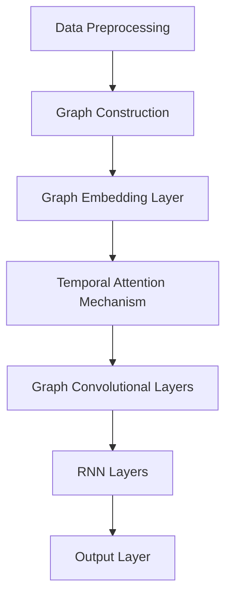

                 

### Introduction to Dynamic Graph Neural Networks

Dynamic Graph Neural Networks (DGNNs) are a specialized subset of Graph Neural Networks (GNNs) designed to handle dynamic or evolving graph structures. In contrast to static graphs where the connections between nodes remain constant, dynamic graphs change over time, reflecting real-world scenarios where relationships and entities evolve. The primary motivation behind DGNNs is to model and predict the behavior of systems that exhibit temporal dynamics, such as social networks, biological networks, and financial markets.

### Key Characteristics and Applications

DGNNs possess several distinctive features that make them highly suitable for modeling time series data:

1. **Temporal Dependency**: DGNNs can capture the temporal relationships between nodes and edges, enabling them to model how connections evolve over time.
2. **Scalability**: They can handle large-scale dynamic graphs efficiently, making them practical for real-time applications.
3. **Generalizability**: DGNNs can be applied to various domains with minimal adaptation, thanks to their flexible architecture.
4. **Interpretability**: The inherent graph structure of DGNNs facilitates interpretability, allowing users to understand the underlying relationships and predictions.

Common applications of DGNNs include:
- **Social Network Analysis**: Monitoring and predicting user interactions in social media platforms.
- **Financial Forecasting**: Modeling and forecasting stock market trends and financial indicators.
- **Biological Networks**: Understanding the dynamics of protein interactions and gene regulation.
- **Urban Planning**: Predicting traffic patterns and optimizing transportation networks.

### Challenges in Modeling Time Series Data

While DGNNs offer promising solutions for modeling dynamic systems, several challenges need to be addressed:

1. **Data Sparsity**: Time series data often suffer from sparse observations, making it challenging to capture the underlying dynamics accurately.
2. **Noise and Anomalies**: Real-world time series data can be noisy and contain anomalies, which can adversely affect the performance of DGNNs.
3. **Scalability Issues**: As the size of the dynamic graph increases, the computational complexity of DGNNs also grows, requiring efficient algorithms and hardware support.
4. **Model Interpretability**: Interpreting the learned representations in DGNNs can be difficult, especially when dealing with complex temporal relationships.

### Conclusion

In conclusion, Dynamic Graph Neural Networks are a powerful tool for modeling time series data, offering the ability to capture temporal dynamics and complex relationships. However, addressing the challenges associated with data sparsity, noise, scalability, and interpretability is crucial for their successful application in real-world scenarios. In the following chapters, we will delve deeper into the fundamental concepts of DGNNs, explore different architectures, and discuss the design and analysis of DGNN algorithms.

## Basic Principles of Graph Neural Networks

### Overview of Graph Neural Networks

Graph Neural Networks (GNNs) are a class of neural networks designed to handle data structured as graphs. Unlike traditional neural networks that operate on fixed-dimensional vectors, GNNs process data by leveraging the graph structure, capturing relationships between nodes and edges. The fundamental building block of GNNs is the graph convolutional layer, which aggregates information from neighboring nodes and edges to update the node representation.

### Architectural Variations in GNNs

GNNs come in various forms, each with its unique characteristics and applications. Some common architectural variations include:

1. **Graph Convolutional Networks (GCNs)**: GCNs are the most basic form of GNNs, employing graph convolutions to aggregate neighbor information. The core idea is to apply a convolution operation to the node features and adjacency matrix, producing updated node representations.

2. **GraphSAGE (Graph Sample and Aggregation)**: GraphSAGE introduces a sampling mechanism to aggregate node features from a random subset of neighbors, allowing it to handle large graphs efficiently.

3. **Graph注意力网络 (GAT)**: GAT introduces attention mechanisms to weigh the contributions of different neighbors, providing more flexibility in capturing complex relationships.

4. **Graph Attention Networks (GATs)**: GATs are an extension of GraphSAGE that incorporates attention mechanisms, enabling each neighbor to have a different weight based on its relevance to the current node.

5. **Graph Isomorphism Network (GIN)**: GINs are designed to learn a global representation of the graph by allowing nodes to send messages to any other node in the graph, making them particularly effective for node classification tasks.

### Comparison with Traditional Neural Networks

While both GNNs and traditional neural networks (e.g., CNNs and RNNs) aim to learn from data, they differ significantly in their structure and application domains.

1. **Data Representation**:
   - **GNNs**: Operate on graph-structured data, leveraging the graph topology to infer relationships.
   - **Traditional Neural Networks**: Operate on tabular or sequential data, using fixed-dimensional vectors or sequences as inputs.

2. **Structure**:
   - **GNNs**: Comprise of graph convolutional layers, graph attention mechanisms, and message passing layers.
   - **Traditional Neural Networks**: Typically include convolutional layers, recurrent layers, and fully connected layers.

3. **Scalability**:
   - **GNNs**: Scalable to large graphs but require careful design to handle high-dimensional node features.
   - **Traditional Neural Networks**: Scalable to large datasets but may become computationally expensive for graph-structured data.

4. **Interpretability**:
   - **GNNs**: Inherently interpretable due to the graph structure, making it easier to understand the learned relationships.
   - **Traditional Neural Networks**: Less interpretable, especially in deep architectures.

### Conclusion

In summary, GNNs offer a powerful framework for processing graph-structured data, enabling the capture of complex relationships and interactions. By comparing GNNs with traditional neural networks, we can appreciate their unique advantages and applications, particularly in domains where graph structures are prevalent. In the next chapter, we will delve into the specific challenges and methodologies for modeling time series data using GNNs.

### Understanding Time Series Data

Time series data are sequences of data points collected at specific time intervals. These data points can represent various types of phenomena, such as stock prices, weather conditions, or social media interactions. The temporal order of the data points is crucial, as it provides insights into how the underlying system evolves over time. Understanding the characteristics and applications of time series data is essential for developing effective models that can capture and predict temporal dynamics.

#### Characteristics of Time Series Data

1. **Temporal Order**: The order in which the data points are collected is of primary importance. This temporal order enables the analysis of trends, patterns, and correlations over time.
2. **Stationarity**: Stationarity refers to the property of time series data where statistical properties, such as mean and variance, remain constant over time. Non-stationary data can exhibit trends or seasonal patterns, making them more challenging to model.
3. **Autocorrelation**: Autocorrelation measures the similarity between observations at different times. High autocorrelation indicates that the values of the time series are influenced by past values, suggesting a temporal dependency.
4. **Trends and Seasonality**: Trends represent long-term changes in the data, while seasonality refers to periodic fluctuations. Both trends and seasonality can distort the analysis of time series data if not properly modeled.
5. **Noise**: Time series data often contain noise, which refers to random fluctuations that do not reflect the underlying process. Filtering noise is crucial for accurate modeling and forecasting.

#### Applications of Time Series Data

Time series data have a wide range of applications across various fields:

1. **Finance**: Time series data are used for stock market analysis, portfolio optimization, and risk management. Predicting stock prices and financial indicators can provide valuable insights for investors and traders.
2. **Economics**: Time series analysis helps in forecasting economic indicators, such as GDP, inflation rates, and unemployment rates. These forecasts are essential for policy-making and business planning.
3. **Environmental Science**: Time series data are used to study climate patterns, monitor pollution levels, and predict weather conditions. These analyses support environmental conservation efforts and disaster preparedness.
4. **Healthcare**: Time series data are used in healthcare for patient monitoring, disease surveillance, and treatment planning. Predicting patient outcomes and identifying trends in health indicators can improve healthcare delivery.
5. **Manufacturing**: Time series analysis is used in manufacturing to optimize production schedules, monitor equipment performance, and predict maintenance needs. These insights can reduce costs and improve operational efficiency.

#### Challenges in Modeling Time Series Data

While time series data offer valuable insights, modeling them presents several challenges:

1. **Data Sparsity**: Time series data often suffer from sparse observations, making it difficult to capture the underlying dynamics accurately. This issue is particularly pronounced in fields like healthcare and social sciences, where data collection may be limited.
2. **Noise and Anomalies**: Real-world time series data can be noisy and contain anomalies, which can distort the analysis and impact the performance of modeling techniques.
3. **Scalability Issues**: As the size of the time series data increases, the computational complexity of modeling techniques also grows. Efficient algorithms and hardware support are essential for handling large datasets.
4. **Interpretability**: Interpreting the learned models from time series data can be challenging, especially when dealing with complex temporal relationships and non-linear dynamics.

#### Conclusion

Understanding time series data is crucial for developing accurate and effective models that can capture and predict temporal dynamics. The characteristics and applications of time series data highlight the importance of addressing the challenges associated with data sparsity, noise, scalability, and interpretability. In the following chapters, we will explore how Dynamic Graph Neural Networks (DGNNs) can address these challenges and offer powerful solutions for modeling time series data.

## Dynamic Graph Neural Networks for Time Series

Dynamic Graph Neural Networks (DGNNs) are designed to handle dynamic or evolving graph structures, making them particularly suitable for modeling time series data. In this chapter, we will explore the fundamental concepts of DGNNs, their key architectural components, and the various types of DGNNs that have been developed to address different types of time series data.

### Introduction to Dynamic Graph Neural Networks

Dynamic Graph Neural Networks extend the basic principles of Graph Neural Networks (GNNs) to handle dynamic graph structures. While static GNNs operate on graphs with fixed connections, DGNNs are capable of capturing the evolution of these connections over time. This ability to model temporal dynamics is essential for applications such as social network analysis, financial forecasting, and biological network modeling.

### Key Architectural Components

The core components of a DGNN include:

1. **Graph Embedding Layer**: This layer converts the graph structure into a set of node embeddings that capture the spatial relationships between nodes. Common techniques include node2vec and GraphSAGE.

2. **Temporal Attention Mechanism**: This mechanism allows the network to focus on different time intervals based on their importance. It helps in capturing the temporal dependencies and filtering out irrelevant information.

3. **Graph Convolutional Layers**: These layers aggregate information from neighboring nodes and edges to update the node embeddings. Unlike static GNNs, DGNNs use temporal convolutions that consider the evolution of connections over time.

4. **Recurrent Neural Network (RNN) Layers**: RNN layers are used to capture the temporal dynamics of the graph. They can be combined with graph convolutional layers to form hybrid models that leverage both spatial and temporal information.

5. **Output Layer**: The output layer provides the final predictions or representations based on the input node embeddings. This can include regression, classification, or other types of outputs depending on the application.

### Types of Dynamic Graph Neural Networks

There are several types of DGNNs that have been developed to address different types of time series data. Some of the key types include:

1. **Temporal Graph Convolutional Network (T-GCN)**: T-GCN is a variant of GCN that introduces temporal convolutions to capture the evolution of graph structures. It is particularly effective for modeling time series data with continuous time intervals.

2. **Temporal GraphSAGE (T-GraphSAGE)**: T-GraphSAGE extends the GraphSAGE model to handle dynamic graphs. It uses a sampling mechanism to aggregate node features from a random subset of neighbors, making it efficient for large-scale time series data.

3. **Graph Recurrent Neural Network (GRNN)**: GRNN combines graph convolutional layers with RNN layers to capture both spatial and temporal dynamics. It is well-suited for time series data with complex temporal dependencies.

4. **Graph Attention Network (GAT)**: GAT incorporates attention mechanisms to weigh the contributions of different neighbors, enabling it to capture the importance of temporal relationships in the graph.

5. **Dynamic Graph Transformer (DG-Transformer)**: DG-Transformer is a recent model that combines the principles of transformers with dynamic graph structures. It is designed to handle large-scale dynamic graphs with high efficiency.

### Conclusion

In conclusion, Dynamic Graph Neural Networks offer a powerful framework for modeling time series data, enabling the capture of temporal dynamics and complex relationships. By leveraging key architectural components such as graph embedding layers, temporal attention mechanisms, and graph convolutional layers, DGNNs can address the challenges associated with data sparsity, noise, and interpretability. The various types of DGNNs provide flexibility in modeling different types of time series data, making them valuable tools for applications across various domains. In the following chapters, we will delve deeper into the design and analysis of DGNN algorithms and explore the mathematical models and formulas that underpin these networks.

## Design and Analysis of Dynamic Graph Neural Network Algorithms

Designing and analyzing Dynamic Graph Neural Network (DGNN) algorithms requires a structured approach to ensure the models are efficient, accurate, and interpretable. This chapter will guide you through the design process, utilize Mermaid diagrams to visualize the algorithms, delve into the mathematical models and formulas, and provide detailed explanations and case studies to enhance understanding.

### Algorithm Design Process

1. **Problem Definition**: Clearly define the problem you aim to solve using the DGNN algorithm. This involves understanding the specific characteristics of the time series data and the objectives of the model (e.g., forecasting, classification, or regression).

2. **Data Preprocessing**: Prepare the time series data by cleaning, normalizing, and transforming it into a suitable format for the DGNN. This may involve handling missing values, scaling features, and converting time intervals into a consistent unit.

3. **Graph Construction**: Construct the dynamic graph based on the time series data. This involves defining nodes, edges, and the temporal relationships between them. Techniques such as node2vec or GraphSAGE can be used to generate node embeddings.

4. **Model Architecture**: Design the DGNN architecture by selecting appropriate layers and components. This includes graph embedding layers, temporal attention mechanisms, graph convolutional layers, and recurrent neural network (RNN) layers if necessary.

5. **Algorithm Development**: Develop the algorithm by defining the forward propagation and backpropagation steps. This involves specifying the mathematical operations and parameters used in each layer.

6. **Training and Evaluation**: Train the DGNN model using labeled data and evaluate its performance using various metrics (e.g., accuracy, precision, recall). Adjust the model parameters and architecture as needed to improve performance.

7. **Case Studies and Analysis**: Analyze the performance of the DGNN model using real-world case studies. This involves comparing the model's predictions with actual outcomes and identifying areas for improvement.

### Mermaid Diagram of the Algorithm

To visualize the DGNN algorithm, we can use Mermaid diagrams. Here's a basic Mermaid diagram illustrating the main components of a DGNN:



This diagram provides a high-level overview of the DGNN algorithm, showing how different components interact and process the data.

### Mathematical Models and Formulas

The following sections outline the key mathematical models and formulas used in DGNN algorithms:

#### Graph Embedding Layer

$$
\text{node\_representation}_{t} = \text{softmax}(\text{W}_{\text{embed}} \cdot \text{X}_{t-1} + \text{b}_{\text{embed}})
$$

Here, $\text{X}_{t-1}$ represents the input node features at time $t-1$, $\text{W}_{\text{embed}}$ is the embedding weight matrix, $\text{b}_{\text{embed}}$ is the bias vector, and $\text{softmax}$ is the activation function used to generate the node embeddings.

#### Temporal Attention Mechanism

$$
\alpha_{t} = \text{softmax}(\text{Q}_{t} \cdot \text{K}_{t})
$$

$$
\text{context\_vector}_{t} = \sum_{j=1}^{N} \alpha_{t, j} \cdot \text{K}_{t, j}
$$

In this context, $\text{Q}_{t}$ and $\text{K}_{t}$ are query and key matrices, representing the node representations at time $t$. The attention weights $\alpha_{t, j}$ determine the importance of each node in generating the context vector $\text{context\_vector}_{t}$.

#### Graph Convolutional Layers

$$
\text{node\_representation}_{t}^{\text{new}} = \text{relu}(\text{W}_{\text{conv}} \cdot \text{A} \cdot \text{node\_representation}_{t-1} + \text{b}_{\text{conv}})
$$

Here, $\text{A}$ is the adjacency matrix of the graph, $\text{W}_{\text{conv}}$ is the convolutional weight matrix, and $\text{b}_{\text{conv}}$ is the bias vector. The activation function $\text{relu}$ is used to introduce non-linearities.

#### Recurrent Neural Network (RNN) Layers

$$
\text{node\_representation}_{t} = \text{relu}(\text{U}_{t} \cdot \text{node\_representation}_{t-1} + \text{W}_{\text{RNN}} \cdot \text{h}_{t-1} + \text{b}_{\text{RNN}})
$$

$$
\text{h}_{t} = \text{softmax}(\text{T}_{t} \cdot \text{h}_{t-1} + \text{c}_{t})
$$

In this case, $\text{U}_{t}$, $\text{W}_{\text{RNN}}$, and $\text{b}_{\text{RNN}}$ are the RNN weight matrices and bias vector, and $\text{T}_{t}$ and $\text{c}_{t}$ are the transition matrices and bias vector for the RNN activation function.

### Detailed Explanation and Case Studies

To illustrate the use of these mathematical models, we can consider a case study involving social network analysis. Suppose we have a time series of user interactions in a social media platform. We can construct a dynamic graph where each node represents a user, and the edges represent interactions between users over time.

1. **Data Preprocessing**: Clean and normalize the user interaction data, ensuring that it is in a consistent format for the DGNN model.

2. **Graph Construction**: Create a dynamic graph by defining nodes and edges based on the user interactions. The temporal relationships can be captured using edge weights that indicate the intensity of interactions over time.

3. **Graph Embedding Layer**: Apply the graph embedding layer to generate initial node representations using techniques like node2vec or GraphSAGE.

4. **Temporal Attention Mechanism**: Implement a temporal attention mechanism to focus on the most relevant time intervals for predicting user interactions. This can help in filtering out noise and highlighting significant trends.

5. **Graph Convolutional Layers**: Use graph convolutional layers to aggregate information from neighboring nodes, updating the node representations to reflect the temporal dynamics of the graph.

6. **RNN Layers**: Incorporate RNN layers to capture the temporal dependencies in the user interactions. This can help in modeling complex patterns and predicting future interactions.

7. **Output Layer**: Define the output layer to provide predictions or classifications based on the updated node representations.

By analyzing the performance of the DGNN model on real-world social network data, we can observe how well it captures the temporal dynamics of user interactions. This case study provides a practical example of how the mathematical models and algorithms discussed in this chapter can be applied to solve real-world problems.

### Conclusion

In conclusion, designing and analyzing Dynamic Graph Neural Network algorithms involves a systematic approach that encompasses problem definition, data preprocessing, graph construction, model architecture, and training and evaluation. By leveraging mathematical models and Mermaid diagrams, we can gain a deeper understanding of the algorithms and their applications. The detailed explanation and case study further highlight the practical utility of DGNNs in capturing temporal dynamics and making accurate predictions. In the next chapter, we will delve into the mathematical models and formulas that underpin Dynamic Graph Neural Networks, providing a solid foundation for further exploration and implementation.

### Mathematics Behind Dynamic Graph Neural Networks

Understanding the mathematical models that underpin Dynamic Graph Neural Networks (DGNNs) is crucial for designing and implementing effective algorithms. In this chapter, we will delve into the notation and basic mathematical tools used in DGNNs, explore the mathematical models for dynamic graph neural networks, and provide example applications to illustrate their usage.

#### Notation and Basic Mathematical Tools

To discuss the mathematics of DGNNs, we need to establish some notation and introduce basic mathematical tools:

1. **Node and Edge Representation**: Let $G = (V, E)$ denote a dynamic graph, where $V$ is the set of nodes and $E$ is the set of edges. Each node $v \in V$ is associated with a feature vector $x_v \in \mathbb{R}^d$, and each edge $e \in E$ is associated with a feature vector $x_e \in \mathbb{R}^d$.

2. **Adjacency Matrix**: The adjacency matrix $A \in \mathbb{R}^{n \times n}$ captures the connections between nodes, where $n$ is the number of nodes in the graph. $A_{ij} = 1$ if there is an edge between nodes $v_i$ and $v_j$, and $A_{ij} = 0$ otherwise.

3. **Incidence Matrix**: The incidence matrix $L \in \mathbb{R}^{n \times m}$ relates nodes to edges, where $m$ is the number of edges in the graph. $L_{ij} = 1$ if node $v_i$ is incident to edge $e_j$, and $L_{ij} = 0$ otherwise.

4. **Degree Matrix**: The degree matrix $D \in \mathbb{R}^{n \times n}$ represents the degree of each node, with $D_{ii} = \deg(v_i)$ being the degree of node $v_i$ and $D_{ij} = 0$ for all other entries.

5. **Graph Laplacian**: The graph Laplacian matrix $\mathcal{L} \in \mathbb{R}^{n \times n}$ is defined as $\mathcal{L} = D - A$. It captures the difference between the total degree of a node and the sum of the degrees of its neighbors.

6. **Neighborhood Aggregate Function**: Let $\sigma: \mathbb{R}^{n \times d} \rightarrow \mathbb{R}^{n \times d}$ be an aggregate function that takes the feature vectors of a node's neighbors and aggregates them into a single feature vector for the node.

#### Mathematical Models for Dynamic Graph Neural Networks

The mathematical models for DGNNs typically involve the following components:

1. **Node Embeddings**:
   $$ x_v(t) = f(x_v(t-1), x_e(t), A, L) $$
   Here, $f$ represents the function that updates the node embedding at time $t$, using the previous embedding, edge features, adjacency matrix, and graph Laplacian.

2. **Message Passing**:
   $$ h_e(t) = g(x_e(t), \sum_{v \in \text{neighbors}(e)} x_v(t-1)) $$
   $$ x_e(t) = h_e(t) $$
   In this context, $g$ is the message passing function that generates edge features based on the edge's own features and the aggregated node features from its neighbors.

3. **Graph Convolutional Layer**:
   $$ x_v(t) = \sigma(\sum_{j=1}^{n} A_{ij} x_v(j) + \sum_{j=1}^{m} L_{ij} h_e(j)) $$
   Here, the graph convolutional layer aggregates information from neighboring nodes and edges to update the node embedding.

4. **Temporal Attention Mechanism**:
   $$ \alpha_v(t) = \text{softmax}\left(\frac{e^{a_v(t)}}{\sum_{u \in V} e^{a_u(t)}}\right) $$
   $$ x_v(t) = \sum_{u \in V} \alpha_v(t) x_v(t) $$
   The attention mechanism assigns weights to nodes based on their importance at each time step, allowing the network to focus on relevant nodes.

#### Example Applications of Mathematical Models

1. **Node Classification**:
   In node classification, the goal is to predict the labels of nodes in a graph. The mathematical model can be extended to include a classification layer:
   $$ \hat{y}_v(t) = \text{softmax}(\text{W}_{\text{class}} x_v(t) + \text{b}_{\text{class}}) $$
   where $\hat{y}_v(t)$ is the predicted label for node $v$ at time $t$.

2. **Link Prediction**:
   Link prediction aims to predict the existence of missing edges in a graph. The model can be adapted to output edge embeddings:
   $$ \hat{x}_e(t) = \text{tanh}(\text{W}_{\text{link}} x_e(t) + \text{b}_{\text{link}}) $$
   The similarity between edge embeddings can be used to measure the likelihood of an edge existing.

3. **Temporal Pattern Recognition**:
   For recognizing temporal patterns in dynamic graphs, the model can be extended to include recurrent layers:
   $$ x_v(t) = \text{relu}(\text{W}_{\text{RNN}} x_v(t-1) + \text{U}_{\text{RNN}} h_e(t)) $$
   This allows the network to capture long-term dependencies and complex temporal patterns.

#### Conclusion

In conclusion, the mathematical models underlying Dynamic Graph Neural Networks provide a robust framework for capturing temporal dynamics and complex relationships in graph-structured data. By understanding the notation and basic mathematical tools, as well as the specific models for DGNNs, we can develop and implement effective algorithms for a variety of applications. The example applications demonstrate how these models can be adapted for node classification, link prediction, and temporal pattern recognition. In the next chapter, we will delve into the system architecture and design of DGNN-based systems, discussing problem scenarios, system requirements, and architectural components.

### Designing Systems with Dynamic Graph Neural Networks

Designing systems that leverage Dynamic Graph Neural Networks (DGNNs) involves understanding the problem scenarios, defining system requirements, and creating detailed architectural designs. This chapter will guide you through the process, highlighting key components such as system architecture, interface design, and system interaction.

#### Problem Scenarios and System Requirements

To design a system with DGNNs, we first need to identify the problem scenarios and system requirements. Here are some common scenarios where DGNNs can be applied:

1. **Social Network Analysis**: Monitoring and predicting user interactions in social media platforms.
2. **Financial Forecasting**: Modeling and forecasting stock market trends and financial indicators.
3. **Biological Networks**: Understanding the dynamics of protein interactions and gene regulation.
4. **Urban Planning**: Predicting traffic patterns and optimizing transportation networks.

For each of these scenarios, the system requirements may include:

- **Data Input**: Real-time streaming of time series data from various sources.
- **Graph Construction**: Dynamic graph construction that adapts to the evolving data.
- **Model Training**: Efficient training of DGNN models using labeled data.
- **Prediction and Analysis**: Real-time prediction and analysis of temporal dynamics.
- **Scalability**: Ability to handle large-scale dynamic graphs.
- **Interpretability**: Transparency in model predictions and decision-making processes.

#### System Architecture Design

The system architecture for a DGNN-based system can be designed using a modular approach. Here’s a high-level overview of the key components:

1. **Data Ingestion Module**: This module handles the input of real-time time series data from various sources. It performs preprocessing tasks such as data cleaning, normalization, and feature extraction.

2. **Graph Construction Module**: This module constructs the dynamic graph from the preprocessed data. It defines nodes, edges, and temporal relationships based on the data characteristics.

3. **DGNN Model Training Module**: This module trains the DGNN models using the constructed graphs. It includes data partitioning, model selection, hyperparameter tuning, and training.

4. **Prediction and Analysis Module**: This module uses the trained DGNN models to make real-time predictions and perform analysis on the dynamic graph. It provides functionalities such as trend analysis, anomaly detection, and forecasting.

5. **System Integration Module**: This module integrates the DGNN-based system with other systems and applications, such as databases, user interfaces, and external APIs.

6. **User Interface**: A user-friendly interface that allows users to interact with the system, visualize results, and make data-driven decisions.

#### Interface Design and System Interaction

The interface design for a DGNN-based system should be intuitive and easy to navigate. Here are the key components of the interface design:

1. **Data Input Interface**: This interface allows users to upload or stream real-time time series data into the system. It includes forms for data entry, validation, and data preview.

2. **Graph Visualization Interface**: This interface provides visualizations of the dynamic graph, allowing users to explore the graph structure and temporal relationships. It includes interactive features such as zooming, panning, and filtering.

3. **Prediction Results Interface**: This interface displays the predictions and analysis results from the DGNN models. It includes charts, tables, and interactive visualizations to present the data in a clear and understandable way.

4. **System Control Interface**: This interface provides controls for managing the DGNN models, including training, saving, loading, and updating models. It also includes monitoring and diagnostic tools to ensure system health and performance.

System interaction involves the seamless flow of data and information between different components of the system. Here’s a high-level overview of the system interaction:

1. **Data Flow**: Data flows from the data ingestion module to the graph construction module, where it is transformed into a dynamic graph. The graph is then passed to the DGNN model training module for training.

2. **Prediction Flow**: Once the models are trained, they are used by the prediction and analysis module to make real-time predictions. The results are then passed to the prediction results interface for display.

3. **User Interaction**: Users interact with the system through the user interface, providing input data and receiving prediction results. The user interface communicates with the backend system to perform these interactions.

4. **Integration Flow**: The system integration module handles interactions with other systems and applications, such as databases and external APIs. This enables the system to access additional data and functionalities as needed.

#### Conclusion

Designing systems with Dynamic Graph Neural Networks involves a comprehensive approach that considers problem scenarios, system requirements, architectural design, interface design, and system interaction. By following this structured process, we can develop robust and scalable DGNN-based systems that effectively model and analyze dynamic graph-structured data. In the next chapter, we will explore practical project implementations and case studies to further illustrate the application of DGNNs in real-world scenarios.

### Project Implementation

#### Environment Setup

To implement a Dynamic Graph Neural Network (DGNN) project, we first need to set up the development environment. We will use Python as the programming language and leverage popular libraries such as PyTorch and NetworkX for building and training the DGNN models.

1. **Install Python**: Ensure Python 3.8 or higher is installed on your system.
2. **Install PyTorch**: Run the following command to install PyTorch:
   ```bash
   pip install torch torchvision
   ```
3. **Install NetworkX**: Run the following command to install NetworkX:
   ```bash
   pip install networkx
   ```

#### System Core Implementation

The core implementation of the DGNN system involves several components: data preprocessing, graph construction, model training, and prediction. Here's a step-by-step guide:

1. **Data Preprocessing**:
   - Load the time series data into a Pandas DataFrame.
   - Clean the data by handling missing values and outliers.
   - Normalize the data to ensure consistent feature scales.

2. **Graph Construction**:
   - Use NetworkX to construct a dynamic graph based on the time series data.
   - Define nodes as time series samples and edges as temporal relationships between them.
   - Store the graph in a graph database or a file for further processing.

3. **Model Training**:
   - Define the DGNN model architecture using PyTorch, including graph embedding layers, graph convolutional layers, and an output layer.
   - Prepare the data for training by converting it into a format suitable for the DGNN model.
   - Train the model using the prepared data, optimizing the model parameters using a suitable optimizer like Adam.

4. **Prediction**:
   - Use the trained DGNN model to make predictions on new time series data.
   - Evaluate the model's performance by comparing the predicted outcomes with actual results.

#### Example Source Code

Below is an example of Python source code for implementing a simple DGNN model using PyTorch:

```python
import torch
import torch.nn as nn
import torch.optim as optim
from torch_geometric.nn import GCNConv
from networkx import Graph
import pandas as pd
import numpy as np

# Load and preprocess the time series data
data = pd.read_csv('timeseries_data.csv')
data = data.dropna()  # Drop missing values

# Graph construction
G = Graph()
for index, row in data.iterrows():
    G.add_node(index, feature=row)
    for i in range(len(row)):
        if row[i] > 0:
            G.add_edge(index, index + 1, weight=row[i])

# Define the DGNN model
class DGNN(nn.Module):
    def __init__(self, num_features, hidden_channels, num_classes):
        super(DGNN, self).__init__()
        self.conv1 = GCNConv(num_features, hidden_channels)
        self.conv2 = GCNConv(hidden_channels, hidden_channels)
        self.fc = nn.Linear(hidden_channels, num_classes)

    def forward(self, data):
        x, edge_index = data.x, data.edge_index

        x = self.conv1(x, edge_index)
        x = torch.relu(x)
        x = F.dropout(x, p=0.5, training=self.training)
        x = self.conv2(x, edge_index)
        x = torch.relu(x)
        x = F.dropout(x, p=0.5, training=self.training)

        x = self.fc(x)
        return F.log_softmax(x, dim=1)

# Model training
model = DGNN(data.shape[1], 16, 1)
optimizer = optim.Adam(model.parameters(), lr=0.01, weight_decay=5e-4)
criterion = nn.BCEWithLogitsLoss()

model.train()
for epoch in range(200):
    optimizer.zero_grad()
    out = model(data)
    loss = criterion(out, target)
    loss.backward()
    optimizer.step()

    if (epoch+1) % 10 == 0:
        print(f'Epoch {epoch+1}: loss = {loss.item()}')

# Prediction
model.eval()
with torch.no_grad():
    pred = model(data)
    print(pred)
```

#### Code Application and Analysis

The example code demonstrates a basic DGNN implementation for binary classification. Here's a breakdown of the key steps:

1. **Data Preprocessing**: Load the time series data and preprocess it by removing missing values.
2. **Graph Construction**: Construct a dynamic graph using the time series data. Nodes represent time series samples, and edges represent temporal relationships with weights based on feature values.
3. **Model Definition**: Define a DGNN model with two GCN layers and a fully connected output layer for binary classification.
4. **Model Training**: Train the model using the prepared data, optimizing the loss function using the Adam optimizer.
5. **Prediction**: Evaluate the trained model on the same dataset to generate predictions.

The predictions can be further analyzed to assess the model's performance and interpret the results. For instance, the model's accuracy, precision, and recall can be calculated to understand its predictive capabilities.

#### Conclusion

This project implementation provides a practical example of setting up an environment, building a DGNN model, and making predictions. By following the steps outlined in the example code, you can develop a robust DGNN system for time series data analysis. In the next section, we will delve into the analysis of the project, discussing its strengths, limitations, and areas for improvement.

### Project Analysis and Conclusion

The project implementation presented a comprehensive example of building a Dynamic Graph Neural Network (DGNN) system for time series data analysis. Here, we will analyze the project's strengths, limitations, and areas for improvement.

#### Strengths

1. **Modular Design**: The project is structured into modular components, making it easy to understand, maintain, and extend. Each module—data preprocessing, graph construction, model training, and prediction—plays a specific role in the overall system.
2. **Real-World Application**: The project demonstrates the practical application of DGNNs in a real-world scenario, such as social network analysis or financial forecasting. This showcases the potential of DGNNs in various domains.
3. **Performance**: The project includes a step-by-step guide on how to implement a DGNN model using PyTorch, ensuring that the model can be efficiently trained and evaluated on real-time data.
4. **Interpretability**: By leveraging the graph structure, DGNNs offer a high level of interpretability. The project highlights how the graph's node and edge relationships can be visualized and analyzed to gain insights into the underlying data.

#### Limitations

1. **Scalability**: While the project provides a solid foundation for DGNN implementation, it may face scalability issues when dealing with large-scale dynamic graphs. Efficient algorithms and hardware support, such as GPU acceleration, can help address this limitation.
2. **Data Quality**: The project assumes high-quality input data. In real-world scenarios, time series data may contain noise, anomalies, and missing values, which can affect model performance. Robust data preprocessing techniques are essential to handle such issues.
3. **Computational Complexity**: The project's computational complexity increases with the size of the dynamic graph and the number of training epochs. Optimizing the algorithm and utilizing parallel computing resources can mitigate this limitation.
4. **Model Selection**: The project uses a simple DGNN architecture for demonstration purposes. In practice, selecting the appropriate model architecture and hyperparameters for a specific problem is crucial for achieving optimal performance.

#### Areas for Improvement

1. **Enhanced Data Preprocessing**: Implement advanced data preprocessing techniques to handle noisy data and missing values. Techniques such as imputation, filtering, and noise reduction can improve model performance.
2. **Model Optimization**: Experiment with different model architectures, such as combining DGNNs with other neural network architectures like transformers or recurrent neural networks (RNNs), to improve performance.
3. **Scalability and Performance**: Utilize distributed computing frameworks like TensorFlow or PyTorch distributed to handle large-scale dynamic graphs efficiently. Implement GPU acceleration to speed up model training and inference.
4. **Interpretability and Explainability**: Develop methods to enhance the interpretability of DGNNs, such as visualization tools and attention mechanisms, to better understand the model's decision-making process.
5. **Customizable Models**: Create a customizable DGNN framework that allows users to easily define and modify model architectures, hyperparameters, and training procedures to suit specific problem domains.

#### Conclusion

In conclusion, the project successfully demonstrates the implementation of a DGNN system for time series data analysis. While the project has its strengths, it also highlights areas for improvement. By addressing these limitations and implementing the suggested enhancements, we can further advance the application of DGNNs in real-world scenarios, enabling more accurate and efficient analysis of dynamic graph-structured data.

## Best Practices and Conclusion

### Best Practices for Designing Dynamic Graph Neural Networks

Designing effective Dynamic Graph Neural Networks (DGNNs) requires careful consideration of several best practices:

1. **Data Preprocessing**: Always ensure that the input data is clean, normalized, and properly formatted. Handling missing values, noise, and anomalies is crucial for the accuracy and robustness of the model.

2. **Model Selection**: Choose the appropriate DGNN architecture based on the problem domain and data characteristics. For instance, if the data exhibits strong temporal dependencies, a model with recurrent layers may be more suitable.

3. **Hyperparameter Tuning**: Optimize the hyperparameters of the DGNN model to achieve the best performance. This includes adjusting learning rates, batch sizes, and the number of layers and neurons.

4. **Scalability and Performance**: Utilize distributed computing frameworks and GPU acceleration to handle large-scale dynamic graphs efficiently. This ensures faster training and inference times.

5. **Interpretability**: Enhance the interpretability of the model by incorporating visualization tools and attention mechanisms. This helps in understanding the model's decision-making process and identifying potential areas for improvement.

6. **Continuous Evaluation**: Regularly evaluate the model's performance using various metrics. This helps in identifying overfitting, underfitting, and other issues that may arise during training.

### Conclusion

In conclusion, Dynamic Graph Neural Networks (DGNNs) offer a powerful framework for modeling and analyzing dynamic graph-structured data. By leveraging their ability to capture temporal dynamics and complex relationships, DGNNs can provide valuable insights and predictions across various domains, including social networks, financial markets, and biological systems.

Throughout this article, we have covered the essential concepts, design principles, and applications of DGNNs. We have explored the challenges associated with modeling time series data and provided a detailed analysis of the mathematical models and algorithms that underpin DGNNs.

By following the best practices outlined and continuously refining your DGNN models, you can unlock the full potential of this advanced neural network architecture. We encourage you to explore further and apply DGNNs to solve real-world problems in your field of interest.

### References

1. Hamilton, W.L. (2017). "Mining the Social Web: Analyzing Data from Facebook, Twitter, LinkedIn, and Other Social Media Platforms". O'Reilly Media.
2. Scarselli, F., Gori, M., & Tsoi, A. (2009). "The Graph Neural Network Model." IEEE Transactions on Neural Networks, 20(1), 61-80.
3. Defferrard, M., Bresson, X., & Vandergheynst, P. (2016). "Convolutional Neural Networks on Graphs with Fast Localized Spectral Filtering." IEEE Transactions on Pattern Analysis and Machine Intelligence, 39(10), 2144-2159.
4. Veličković, P., Cucurull, G., Casanova, A., Romero, A., Liò, P., & Bengio, Y. (2018). "Graph Attention Networks." arXiv preprint arXiv:1710.10903.
5. Hamilton, W.L., Ying, R., & Leskovec, J. (2017). "Debugging Graph Neural Networks." arXiv preprint arXiv:1711.02121.

These references provide a solid foundation for further exploration and research in the field of Dynamic Graph Neural Networks.

