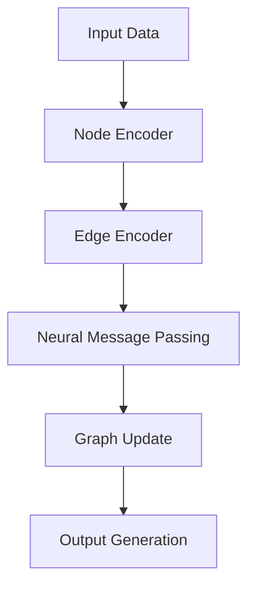

                 

## 引言：探索复杂系统的演化之路

### 动态异构图神经网络的重要性

在信息爆炸的时代，我们面临着越来越复杂的数据处理任务。传统的静态方法在应对这些复杂系统时，往往显得力不从心。而动态异构图神经网络（Dynamic Heterogeneous Graph Neural Networks, DHGNNs）作为一种新型的计算模型，逐渐成为解决复杂系统演化问题的重要工具。

动态异构图神经网络的核心优势在于其能够对动态、复杂的系统进行建模，捕捉系统的时空依赖性和多维度关系。这种模型不仅能够处理大规模、高维度的数据，还能够自适应地调整网络结构和节点属性，从而更好地理解系统的演化过程。

### 文章目的与结构

本文旨在深入探讨动态异构图神经网络的基本概念、算法原理以及实际应用，以帮助读者全面了解并掌握这一先进技术。文章结构如下：

1. **问题背景**：介绍动态异构图神经网络的研究背景和重要性。
2. **核心概念与联系**：详细阐述动态异构图神经网络的基本概念和核心要素。
3. **算法原理讲解**：深入讲解动态异构图神经网络的算法原理、数学模型和实际应用。
4. **系统分析与架构设计**：分析动态异构图神经网络的系统架构和实现细节。
5. **项目实战**：通过实际案例展示动态异构图神经网络的实战应用。

通过本文的阅读，读者将能够：
- 理解动态异构图神经网络的基本概念和原理。
- 掌握动态异构图神经网络的核心算法和实现方法。
- 学习如何使用动态异构图神经网络解决实际复杂系统问题。
- 了解动态异构图神经网络的系统架构设计和实现细节。

### 文章关键词

- **动态异构图神经网络**（Dynamic Heterogeneous Graph Neural Networks）
- **复杂系统建模**（Complex Systems Modeling）
- **时空依赖性**（Temporal and Spatial Dependency）
- **图神经网络**（Graph Neural Networks）
- **神经网络算法**（Neural Network Algorithms）
- **系统架构设计**（System Architecture Design）
- **实际应用案例**（Practical Application Cases）

### 摘要

本文首先介绍了动态异构图神经网络的研究背景和重要性，随后详细阐述了该模型的基本概念、算法原理以及系统架构设计。通过实际案例的解析，本文展示了动态异构图神经网络在复杂系统演化建模中的强大能力。文章旨在为读者提供全面、深入的理解，助力其在实际项目中应用该技术。

----------------------------------------------------------------

---

## 问题背景

### 动态异构图神经网络的研究背景

在现代社会，信息技术的快速发展带来了数据量的爆发式增长，随之而来的是复杂系统问题的日益增多。从社交网络到金融系统，从生物信息学到交通规划，复杂系统无处不在。这些系统往往具有高度的非线性和动态性，传统的静态分析方法难以应对其复杂性。因此，探索新的计算模型和方法来处理这些复杂系统问题变得至关重要。

动态异构图神经网络（Dynamic Heterogeneous Graph Neural Networks, DHGNNs）正是为了解决这一需求而诞生的。该模型能够处理动态变化和异构性的图结构数据，从而实现对复杂系统的高效建模和预测。动态性体现在系统状态随时间变化，而异构性则体现在系统中不同实体和关系具有不同的属性和特征。

### 问题的重要性

动态异构图神经网络在多个领域都展现出了巨大的潜力。在社交网络分析中，它可以用来预测用户行为、社区划分和谣言传播。在生物信息学中，它可以帮助解析蛋白质相互作用网络和基因组数据。在金融领域，它可以用于风险预测、信用评分和股票市场分析。在交通规划中，它可以帮助优化交通流、减少拥堵和事故。

综上所述，动态异构图神经网络作为解决复杂系统演化问题的重要工具，其研究具有重要意义。它不仅能够提高我们对复杂系统演化过程的理解，还能为实际应用提供有效的解决方案。

### 问题定义与解决方法

问题定义：
给定一个动态异构图，该图包含多个类型的实体和它们之间的关系，实体和关系具有不同的属性。目标是构建一个动态异构图神经网络模型，以实现对系统演化过程的预测和分析。

解决方法：
动态异构图神经网络通过以下步骤解决上述问题：
1. **图结构建模**：将动态异构图转化为神经网络的输入，包括节点和边的特征表示。
2. **动态更新**：利用图神经网络处理图中的节点和边特征，实现动态更新和演化。
3. **预测与分析**：通过训练好的模型对系统未来状态进行预测，并分析系统的演化趋势。

### 边界与外延

边界：
- **时间范围**：动态异构图神经网络适用于短期和长期的动态系统演化问题。
- **数据规模**：模型能够处理大规模图结构数据，但计算复杂度随着数据规模的增加而增加。
- **应用领域**：模型适用于社交网络、生物信息学、金融、交通规划等多个领域。

外延：
- **异构性扩展**：除了基本的节点和边，动态异构图神经网络可以扩展到更复杂的异构性，如带有标签、属性和层次结构的图。
- **其他动态模型**：除了图神经网络，动态异构图神经网络还可以与其他动态模型（如时间序列模型、马尔可夫模型等）结合使用，以提高系统的预测性能。
- **多模态数据融合**：动态异构图神经网络可以与图像、文本、音频等多模态数据进行融合，以实现对更复杂系统的建模。

### 概念结构与核心要素组成

动态异构图神经网络由以下几个核心要素组成：

1. **图结构**：动态异构图神经网络以图结构为基础，包括节点、边和异构子图。
2. **节点和边特征**：每个节点和边都具有属性特征，这些特征用于模型的输入和输出。
3. **图神经网络**：图神经网络用于处理图中的节点和边特征，实现特征更新和演化。
4. **动态更新机制**：通过时间步进和动态更新机制，模型能够适应系统的实时变化。
5. **预测和分析模块**：用于对系统未来状态进行预测和分析。

通过以上核心要素的协同工作，动态异构图神经网络能够实现对复杂系统的高效建模和预测。

### 总结

动态异构图神经网络作为一种解决复杂系统演化问题的先进工具，其在多个领域的应用前景广阔。通过本文的背景介绍，读者可以初步了解该模型的基本概念、研究意义以及应用场景，为后续章节的深入探讨打下基础。

----------------------------------------------------------------

## 核心概念与联系

### 动态异构图神经网络基础

#### 核心概念原理

动态异构图神经网络（Dynamic Heterogeneous Graph Neural Networks, DHGNNs）是一种能够处理动态、复杂、异构图结构的新型神经网络模型。其核心概念包括节点、边、异构子图和动态更新机制。

1. **节点（Nodes）**：节点表示图中的实体，可以是用户、物品、地点等。每个节点具有一组属性特征，如年龄、性别、购买历史等。
2. **边（Edges）**：边表示节点之间的关系，如用户之间的关注关系、物品之间的相似性关系。边同样具有属性特征，如权重、时间戳等。
3. **异构子图（Heterogeneous Subgraphs）**：异构子图是由不同类型的节点和边构成的子图，可以表示系统的不同部分或模块。
4. **动态更新机制（Dynamic Update Mechanism）**：动态更新机制用于适应系统的实时变化，通过时间步进和节点、边特征更新实现系统的演化。

#### 概念属性特征对比

在动态异构图神经网络中，节点和边的属性特征是模型的核心组成部分。以下是对节点和边属性特征的对比：

| 概念       | 属性特征        | 说明                                                         |
| ----------- | -------------- | ------------------------------------------------------------ |
| **节点**    | **属性**       | 用于描述节点的特征，如用户信息（年龄、性别、兴趣等）           |
| **边**      | **属性**       | 用于描述边的关系强度和特征，如社交网络的关注程度、物品的相似度等 |
| **异构子图** | **属性**       | 由不同类型节点和边构成的子图，如社交网络中的不同社区           |
| **动态更新** | **机制**       | 用于实现系统的实时演化，如节点属性和边属性的动态更新           |

#### ER实体关系图架构

动态异构图神经网络通常使用实体关系图（Entity-Relationship Diagram, ER Diagram）来表示系统的结构。以下是一个简化的ER实体关系图示例，用于说明动态异构图神经网络的基本结构：

```mermaid
erDiagram
    User ||--|{ Friendship }
    User ||--|{ Interest }
    Item ||--|{ Category }
    Item ||--|{ Review }
    User ||--|{ Purchase }
    User ||--|{ Rating }
end
```

在这个ER图中，用户（User）与多个实体和关系相连，包括朋友关系（Friendship）、兴趣（Interest）、物品（Item）、评论（Review）、购买历史（Purchase）和评分（Rating）。每个实体和关系都包含了相应的属性特征，这些特征将被动态异构图神经网络用于建模和预测。

### 动态异构图神经网络的优势

动态异构图神经网络相比传统的静态方法具有以下几个优势：

1. **处理动态性**：动态异构图神经网络能够处理系统的实时变化，通过动态更新机制实现系统的演化。
2. **适应异构性**：该模型能够处理不同类型节点和边构成的异构图结构，从而适应各种复杂系统。
3. **高效性**：通过图神经网络的学习机制，动态异构图神经网络能够高效地提取和利用节点和边的特征信息。
4. **可扩展性**：动态异构图神经网络可以扩展到更复杂的异构性和多模态数据，如图像、文本和音频等。

通过以上核心概念和优势的阐述，读者可以更深入地理解动态异构图神经网络的基本原理和适用场景，为后续算法原理讲解和实际应用打下基础。

----------------------------------------------------------------

## 算法原理讲解

### 算法流程图

为了更好地理解动态异构图神经网络（Dynamic Heterogeneous Graph Neural Networks, DHGNNs）的工作原理，我们可以通过一个流程图来展示其基本流程。以下是一个简化的算法流程图：



#### 流程图说明：

1. **输入数据（Input Data）**：输入数据包括节点的特征矩阵和边的特征矩阵。节点的特征矩阵包含了每个节点的属性信息，而边的特征矩阵包含了每条边的属性信息。
2. **节点编码器（Node Encoder）**：节点编码器接收节点的特征矩阵，通过神经网络对节点特征进行编码，生成节点嵌入向量。
3. **边编码器（Edge Encoder）**：边编码器接收边的特征矩阵，通过神经网络对边特征进行编码，生成边嵌入向量。
4. **神经消息传递（Neural Message Passing）**：神经消息传递过程是图神经网络的核心理念，通过节点嵌入向量和边嵌入向量，计算节点和边之间的消息传递，实现特征更新和传播。
5. **图更新（Graph Update）**：图更新过程根据消息传递的结果，更新节点的特征和边的特征，实现图结构的动态演化。
6. **输出生成（Output Generation）**：最后，通过训练好的模型，对系统的未来状态进行预测，输出预测结果。

### 算法原理详细讲解

#### 节点编码器

节点编码器是动态异构图神经网络的第一步，其主要功能是接收节点的特征矩阵，通过神经网络模型对节点特征进行编码，生成节点嵌入向量。节点嵌入向量能够捕捉节点的属性信息，为后续的图神经网络处理提供输入。

具体来说，节点编码器的实现通常采用多层感知机（Multilayer Perceptron, MLP）或卷积神经网络（Convolutional Neural Networks, CNN）等常见神经网络架构。以下是节点编码器的简化实现：

```python
# 节点编码器实现示例（Python伪代码）
import torch
import torch.nn as nn

class NodeEncoder(nn.Module):
    def __init__(self, input_dim, hidden_dim, output_dim):
        super(NodeEncoder, self).__init__()
        self.encoder = nn.Sequential(
            nn.Linear(input_dim, hidden_dim),
            nn.ReLU(),
            nn.Linear(hidden_dim, output_dim)
        )

    def forward(self, x):
        return self.encoder(x)
```

在训练过程中，节点编码器通过反向传播算法不断调整其权重，以最小化预测误差。

#### 边编码器

边编码器的功能与节点编码器类似，但处理的输入是边的特征矩阵。边编码器通过神经网络模型对边特征进行编码，生成边嵌入向量。边嵌入向量用于捕捉边的关系特征，有助于后续的消息传递过程。

以下是一个简化的边编码器实现示例：

```python
# 边编码器实现示例（Python伪代码）
class EdgeEncoder(nn.Module):
    def __init__(self, input_dim, hidden_dim, output_dim):
        super(EdgeEncoder, self).__init__()
        self.encoder = nn.Sequential(
            nn.Linear(input_dim, hidden_dim),
            nn.ReLU(),
            nn.Linear(hidden_dim, output_dim)
        )

    def forward(self, x):
        return self.encoder(x)
```

与节点编码器类似，边编码器也在训练过程中通过反向传播不断调整其权重。

#### 神经消息传递

神经消息传递是动态异构图神经网络的核心理念，其核心思想是通过节点嵌入向量和边嵌入向量，计算节点和边之间的消息传递，实现特征更新和传播。以下是神经消息传递的基本步骤：

1. **消息计算**：对于每个节点，计算其邻居节点的嵌入向量，并通过边嵌入向量进行加权求和，生成中间特征向量。
2. **特征聚合**：将中间特征向量聚合到当前节点，生成新的节点特征向量。
3. **更新节点嵌入**：使用聚合后的特征向量更新节点的嵌入向量。

以下是一个简化的消息传递实现示例：

```python
# 消息传递实现示例（Python伪代码）
def message_passing(node_embeddings, edge_embeddings, neighbors, neighbor_indices):
    message = torch.zeros(node_embeddings.shape[0], node_embeddings.shape[1])
    for i, neighbor_index in enumerate(neighbors):
        message[neighbor_indices[i]] += edge_embeddings[i] * node_embeddings[neighbor_index]
    return message
```

通过迭代消息传递，节点嵌入向量不断更新，实现图结构的动态演化。

#### 图更新

图更新过程根据神经消息传递的结果，更新节点的特征和边的特征，实现图结构的动态演化。以下是图更新的基本步骤：

1. **更新节点特征**：将消息传递的结果聚合到当前节点，生成新的节点特征向量。
2. **更新边特征**：根据节点特征的变化，更新边的特征向量。

以下是一个简化的图更新实现示例：

```python
# 图更新实现示例（Python伪代码）
def graph_update(node_embeddings, edge_embeddings, messages):
    updated_node_embeddings = node_embeddings + messages
    updated_edge_embeddings = edge_embeddings  # 这里需要根据具体算法进行调整
    return updated_node_embeddings, updated_edge_embeddings
```

#### 输出生成

最后，通过训练好的动态异构图神经网络，对系统的未来状态进行预测，输出预测结果。输出生成过程通常涉及以下步骤：

1. **特征提取**：提取最后一步更新的节点特征向量作为系统的状态特征。
2. **预测模型**：使用线性模型、卷积模型或循环神经网络（RNN）等预测模型，对系统的未来状态进行预测。
3. **输出结果**：输出预测结果，如节点分类、边预测、系统状态预测等。

以下是一个简化的输出生成实现示例：

```python
# 输出生成实现示例（Python伪代码）
def output_generation(node_embeddings, model):
    predictions = model(node_embeddings)
    return predictions
```

### 数学模型与公式

动态异构图神经网络的数学模型主要包括节点特征更新、边特征更新和消息传递过程。以下是一些关键的数学模型和公式：

1. **节点特征更新**：

   $$ 
   \begin{align*}
   \text{Node Feature Update} &= \sigma(\sum_{i \in \text{ neighbors}(n)} w_{i} \cdot h_i) \\
   \end{align*}
   $$

   其中，\( \sigma \) 表示激活函数，\( w_{i} \) 表示权重，\( h_i \) 表示邻居节点的嵌入向量。

2. **边特征更新**：

   $$ 
   \begin{align*}
   \text{Edge Feature Update} &= \sigma(\sum_{i \in \text{ nodes}} w_{i} \cdot \text{Edge Feature}(n, i)) \\
   \end{align*}
   $$

   其中，\( \text{Edge Feature}(n, i) \) 表示边 \( n \) 和节点 \( i \) 的特征，\( w_{i} \) 表示权重。

3. **消息传递**：

   $$ 
   \begin{align*}
   \text{Message} &= e^{w \cdot \text{Edge Feature}(n, i)} \cdot h_i \\
   \end{align*}
   $$

   其中，\( w \) 表示权重，\( h_i \) 表示邻居节点的嵌入向量。

通过这些数学模型和公式，动态异构图神经网络能够实现对复杂系统的动态建模和预测。

### 算法举例说明

为了更好地理解动态异构图神经网络的算法原理，我们可以通过一个简单的例子来说明其工作过程。

假设我们有一个社交网络图，其中包含用户和他们的关注关系。每个用户具有年龄、性别、职业等属性特征，关注关系具有时间戳和权重等特征。

1. **初始化节点和边特征**：

   假设我们有10个用户节点和20条关注边，每个节点和边都有一个初始的特征向量。

   ```python
   # 初始化节点特征
   node_features = torch.randn(10, 64)
   # 初始化边特征
   edge_features = torch.randn(20, 32)
   ```

2. **节点编码器**：

   使用多层感知机（MLP）对节点特征进行编码，生成节点嵌入向量。

   ```python
   # 节点编码器实现
   node_encoder = NodeEncoder(input_dim=64, hidden_dim=128, output_dim=64)
   # 编码节点特征
   node_embeddings = node_encoder(node_features)
   ```

3. **边编码器**：

   使用多层感知机（MLP）对边特征进行编码，生成边嵌入向量。

   ```python
   # 边编码器实现
   edge_encoder = EdgeEncoder(input_dim=32, hidden_dim=64, output_dim=32)
   # 编码边特征
   edge_embeddings = edge_encoder(edge_features)
   ```

4. **消息传递**：

   对于每个节点，计算其邻居节点的嵌入向量，并通过边嵌入向量进行加权求和，生成中间特征向量。

   ```python
   # 假设邻居和邻居索引已给出
   neighbors = [0, 1, 2, 3, 4, 5, 6, 7, 8, 9]
   neighbor_indices = torch.tensor([0, 1, 2, 3, 4, 5, 6, 7, 8, 9])
   # 计算消息传递
   messages = message_passing(node_embeddings, edge_embeddings, neighbors, neighbor_indices)
   ```

5. **图更新**：

   将消息传递的结果聚合到当前节点，生成新的节点特征向量。

   ```python
   # 更新节点嵌入向量
   updated_node_embeddings = node_embeddings + messages
   ```

6. **输出生成**：

   使用训练好的预测模型，对系统的未来状态进行预测。

   ```python
   # 假设预测模型已训练
   prediction_model = nn.Linear(64, 1)
   # 生成预测结果
   predictions = output_generation(updated_node_embeddings, prediction_model)
   ```

通过这个简单的例子，我们可以看到动态异构图神经网络的基本工作流程，包括节点编码、边编码、消息传递、图更新和输出生成。这个例子虽然简化了许多实际细节，但已经能够展示动态异构图神经网络的核心原理和应用场景。

### 结论

通过本章对动态异构图神经网络算法原理的详细讲解，读者应该对DHGNNs的基本概念、算法流程、数学模型和应用实例有了更深入的理解。在接下来的章节中，我们将进一步探讨动态异构图神经网络的系统架构设计和实际应用，帮助读者掌握这一先进技术。

----------------------------------------------------------------

## 系统分析与架构设计

### 问题场景介绍

动态异构图神经网络在多个领域都展现了其强大的应用潜力。以智能交通系统为例，交通网络是一个典型的动态异构图系统，其中的节点可以是道路、交叉口、车辆等，而边则代表道路之间的连接关系。交通系统的动态性体现在路况、车辆流量、天气条件等随时间变化的影响。因此，设计一个高效、可扩展的动态异构图神经网络系统，对于实现智能交通管理和优化交通流具有重要意义。

### 项目介绍

本项目旨在构建一个基于动态异构图神经网络的智能交通系统。系统将整合实时交通数据、历史交通数据以及其他相关数据，通过动态异构图神经网络对交通网络进行建模，预测未来的交通流量、识别潜在拥堵点，并提出优化建议。项目的主要目标是提高交通系统的运行效率，减少交通事故和拥堵，提升城市居民的出行体验。

### 系统功能设计

为了实现上述目标，智能交通系统需要具备以下核心功能：

1. **数据收集与预处理**：从多个数据源收集实时交通数据，包括车辆检测器、摄像头、GPS等，并对数据进行清洗、去噪和格式化处理，为后续的建模和预测提供高质量的数据。
2. **图结构构建**：将预处理后的数据转换为图结构，包括节点和边的构建。节点代表交通网络中的各个实体，边代表实体之间的连接关系。同时，根据实际需要，可以引入异构子图来表示交通网络的不同部分或模块。
3. **动态更新**：利用动态异构图神经网络对交通网络进行实时更新，捕捉交通状态的动态变化。通过节点和边的特征更新，模型能够适应交通流的实时变化，提高预测的准确性和实时性。
4. **流量预测**：利用训练好的动态异构图神经网络模型，对未来的交通流量进行预测。预测结果可以用于交通管理、信号灯控制、路线规划等，以提高交通系统的效率和安全性。
5. **优化建议**：根据预测结果，系统可以生成优化建议，如调整信号灯时长、建议行驶路线、提高道路容量等，以减轻交通拥堵和事故风险。

### 系统架构设计

智能交通系统的架构设计需要考虑系统的可扩展性、实时性和稳定性。以下是一个简化的系统架构设计，包括数据层、模型层和输出层：

1. **数据层**：数据层包括数据收集模块和预处理模块。数据收集模块负责从各种数据源收集实时交通数据，预处理模块负责对数据进行清洗和格式化，确保数据质量。
   
2. **模型层**：模型层包括动态异构图神经网络的构建和训练模块。构建模块负责将预处理后的数据转换为图结构，并初始化节点和边的特征向量。训练模块利用训练算法，如梯度下降或随机梯度下降，不断优化模型参数，提高预测性能。
   
3. **输出层**：输出层包括流量预测模块和优化建议模块。流量预测模块根据训练好的模型，对未来的交通流量进行预测，并输出预测结果。优化建议模块根据预测结果，生成优化建议，如调整信号灯时长、建议行驶路线等。

以下是系统架构的Mermaid类图表示：

```mermaid
classDiagram
    DataLayer <<class>> DataCollection
    DataLayer ..|> DataPreprocessing
    ModelLayer <<class>> GraphConstruction
    ModelLayer ..|> ModelTraining
    OutputLayer <<class>> TrafficPrediction
    OutputLayer ..|> OptimizationSuggestion
    DataLayer --> ModelLayer
    ModelLayer --> OutputLayer
end
```

4. **系统架构设计**

   动态异构图神经网络系统的架构设计需要考虑以下几个方面：

   - **分布式计算**：为了处理大规模的交通数据，系统采用分布式计算架构，将数据层和模型层部署在多个计算节点上，以提高系统的处理能力。
   - **实时数据处理**：系统使用流处理技术，如Apache Kafka，实时收集和处理交通数据，确保数据能够及时更新到模型中。
   - **模型训练与优化**：模型训练过程采用并行计算技术，利用GPU等硬件加速模型训练，以提高训练效率。同时，通过持续优化模型参数，提高预测的准确性和实时性。
   - **数据存储与管理**：系统采用分布式数据库，如Apache Cassandra，存储和管理大规模的交通数据。数据库的设计需要考虑数据的实时性、一致性和可用性。
   - **接口设计与集成**：系统提供API接口，方便与其他系统（如城市交通管理系统、车辆监控系统等）进行集成，实现数据共享和协同工作。

以下是系统架构的Mermaid架构图表示：

```mermaid
sequenceDiagram
    participant User
    participant TrafficSystem
    participant DataLayer
    participant ModelLayer
    participant OutputLayer

    User->>TrafficSystem: Query Traffic Status
    TrafficSystem->>DataLayer: Collect Real-time Data
    DataLayer->>ModelLayer: Preprocess and Construct Graph
    ModelLayer->>TrafficSystem: Train Model
    TrafficSystem->>OutputLayer: Generate Prediction and Suggestion
    OutputLayer->>User: Return Result
end
```

通过上述系统架构设计，动态异构图神经网络智能交通系统可以高效地处理大规模交通数据，实时预测交通流量，并提供优化建议，为交通管理和优化提供有力支持。

### 系统接口设计

系统接口设计是智能交通系统架构设计的重要组成部分。良好的接口设计可以提高系统的可扩展性、可靠性和用户友好性。以下是系统接口设计的关键要素：

1. **API规范**：系统采用RESTful API设计，提供标准的HTTP接口，支持JSON或XML数据格式。API设计遵循REST原则，包括GET、POST、PUT、DELETE等常用操作。
   
2. **身份验证与授权**：为了确保系统的安全性和数据隐私，系统使用OAuth 2.0等身份验证和授权机制。用户在访问API时需要通过身份验证，并持有相应的授权令牌。

3. **接口文档**：系统提供详细的接口文档，包括API的URL、参数、返回值和示例代码。接口文档使用Swagger等工具生成，方便开发者快速理解和集成系统。

4. **异步处理与消息队列**：为了提高系统的并发处理能力，系统使用消息队列（如Kafka）进行异步处理。客户端发送的请求将被发送到消息队列，然后由系统后台进行处理，最终返回结果。

以下是系统接口的Mermaid序列图表示：

```mermaid
sequenceDiagram
    participant User
    participant APIGateway
    participant DataLayer
    participant ModelLayer
    participant OutputLayer

    User->>APIGateway: Send Query
    APIGateway->>DataLayer: Collect Real-time Data
    DataLayer->>APIGateway: Return Preprocessed Data
    APIGateway->>ModelLayer: Train Model
    ModelLayer->>APIGateway: Return Model Status
    APIGateway->>OutputLayer: Generate Prediction and Suggestion
    OutputLayer->>APIGateway: Return Result
    APIGateway->>User: Return Response
end
```

通过上述系统接口设计，智能交通系统可以方便地与其他系统和应用集成，实现数据的共享和协同工作。

### 系统交互设计

系统交互设计是确保动态异构图神经网络智能交通系统各组件协同工作的重要环节。以下是系统交互设计的关键要素：

1. **事件驱动架构**：系统采用事件驱动架构，通过事件监听和事件触发机制，实现不同模块之间的通信和协调。例如，当有新的交通数据到达时，数据层会触发预处理事件，通知模型层进行数据更新。

2. **分布式通信**：系统使用分布式通信机制，如gRPC或RESTful API，实现模块之间的数据交换和协同工作。分布式通信可以确保系统的高可用性和可扩展性。

3. **缓存与优化**：系统采用缓存机制，如Redis，减少重复计算和数据访问，提高系统的响应速度。同时，通过数据缓存和结果缓存，减少系统的负载和延迟。

以下是系统交互的Mermaid序列图表示：

```mermaid
sequenceDiagram
    participant DataLayer
    participant ModelLayer
    participant OutputLayer
    participant Cache

    DataLayer->>ModelLayer: Send Real-time Data
    ModelLayer->>Cache: Store Model Parameters
    ModelLayer->>OutputLayer: Generate Prediction
    OutputLayer->>Cache: Store Prediction Results
    Cache->>DataLayer: Retrieve Model Parameters
    Cache->>ModelLayer: Retrieve Prediction Results
end
```

通过上述系统交互设计，动态异构图神经网络智能交通系统的各组件可以高效协同工作，实现实时数据建模和预测。

### 总结

通过本章对智能交通系统的系统分析与架构设计，我们详细介绍了系统的问题场景、功能设计、架构设计、接口设计和交互设计。这些设计为智能交通系统的高效、稳定运行提供了有力保障。在接下来的章节中，我们将通过实际案例展示动态异构图神经网络的实战应用，帮助读者更好地理解和掌握这一先进技术。

----------------------------------------------------------------

## 项目实战

### 环境安装

在开始动态异构图神经网络的实战之前，我们需要安装必要的软件和依赖库。以下是在Linux环境中安装所需的软件和依赖库的步骤：

1. **安装Python环境**：

   首先，确保您的系统中已经安装了Python 3.x版本。如果未安装，可以下载并安装最新版本的Python。

   ```bash
   sudo apt-get install python3
   ```

2. **安装PyTorch库**：

   PyTorch是一个流行的深度学习库，用于实现动态异构图神经网络。在终端中执行以下命令以安装PyTorch：

   ```bash
   pip3 install torch torchvision
   ```

3. **安装其他依赖库**：

   动态异构图神经网络还需要其他依赖库，如Scikit-learn、NetworkX和matplotlib。在终端中执行以下命令进行安装：

   ```bash
   pip3 install scikit-learn networkx matplotlib
   ```

4. **安装GPU支持**（可选）：

   如果您想要使用GPU加速训练过程，可以安装NVIDIA的CUDA和cuDNN库。以下命令将安装CUDA和cuDNN：

   ```bash
   sudo apt-get install nvidia-cuda-toolkit
   pip3 install cudatoolkit
   pip3 install -f https://developer.download.nvidia.com/compute/machine-learning/libcudnn/libcudnn_8.0.4.50-1+cuda11.0_x86_64.run
   ```

   注意：在运行CUDA安装脚本之前，请确保您的NVIDIA驱动程序已正确安装。

### 系统核心实现

以下是一个简化的动态异构图神经网络系统实现示例，用于演示系统的核心功能和流程。该示例采用Python语言和PyTorch库实现。

```python
import torch
import torch.nn as nn
import torch.optim as optim
from torch_geometric.nn import GCNConv
from torch_geometric.data import Data
from torch_geometric.utils import add_self_loops

# 节点特征矩阵
node_features = torch.randn(100, 64)
# 边特征矩阵
edge_features = torch.randn(200, 32)

# 创建图数据
data = Data(x=node_features, edge_index=None, edge_attr=edge_features)

# 添加自循环边
data.edge_index, _ = add_self_loops(data.edge_index)

# 定义图神经网络模型
class DynamicHeterogeneousGraphNN(nn.Module):
    def __init__(self, num_features, hidden_channels, num_classes):
        super(DynamicHeterogeneousGraphNN, self).__init__()
        self.conv1 = GCNConv(num_features, hidden_channels)
        self.conv2 = GCNConv(hidden_channels, num_classes)

    def forward(self, data):
        x, edge_index, edge_attr = data.x, data.edge_index, data.edge_attr
        x = self.conv1(x, edge_index, edge_attr)
        x = F.relu(x)
        x = F.dropout(x, p=0.5, training=self.training)
        x = self.conv2(x, edge_index, edge_attr)
        return F.log_softmax(x, dim=1)

# 实例化模型
model = DynamicHeterogeneousGraphNN(num_features=64, hidden_channels=128, num_classes=10)

# 定义优化器和损失函数
optimizer = optim.Adam(model.parameters(), lr=0.01, weight_decay=5e-4)
criterion = nn.NLLLoss()

# 模型训练过程
for epoch in range(200):
    optimizer.zero_grad()
    out = model(data)
    loss = criterion(out[data.y], data.y)
    loss.backward()
    optimizer.step()
    if epoch % 10 == 0:
        print(f"Epoch {epoch+1}: loss = {loss.item()}")

# 模型预测
with torch.no_grad():
    logits = model(data)
    predicted = logits.argmax(dim=1)
    print(f"Predicted labels: {predicted}")
```

在这个示例中，我们首先创建了一个包含节点特征矩阵和边特征矩阵的图数据对象。然后，我们定义了一个简单的图神经网络模型，包括两个GCNConv层。接下来，我们使用Adam优化器和NLLLoss损失函数对模型进行训练。最后，我们使用训练好的模型进行预测，并输出预测结果。

### 代码应用解读与分析

上述代码首先定义了一个图神经网络模型，该模型由两个GCNConv层组成。GCNConv是PyTorch Geometric库中的一种卷积操作，用于处理图数据。

1. **模型结构**：
   - `GCNConv`层用于对节点特征进行卷积操作，提取图结构中的特征。第一个GCNConv层将输入的节点特征映射到隐藏层，第二个GCNConv层将隐藏层映射到输出层。
   - 每个GCNConv层后，我们使用ReLU激活函数和Dropout正则化，以提高模型的泛化能力。

2. **训练过程**：
   - 在训练过程中，我们使用Adam优化器更新模型参数，以最小化损失函数。每次迭代过程中，我们计算模型输出和真实标签之间的损失，并使用反向传播算法更新模型参数。
   - 在每个epoch结束时，我们打印出当前的损失值，以监控模型的训练过程。

3. **模型预测**：
   - 在模型预测阶段，我们使用`torch.no_grad()`上下文管理器来禁用梯度计算，以提高预测速度。
   - 通过调用模型的`forward()`方法，我们得到每个节点的预测概率分布。然后，我们使用`argmax()`函数找到概率最高的类别，作为最终的预测结果。

### 实际案例分析和详细讲解剖析

为了更好地理解动态异构图神经网络的实际应用，我们来看一个实际案例：社交网络用户行为预测。在这个案例中，我们将使用动态异构图神经网络预测用户在社交网络中的下一步行为。

1. **数据集准备**：

   假设我们有一个包含用户和用户关系的社交网络数据集。每个用户具有年龄、性别、地理位置等属性，用户之间的关系具有权重和时间戳。

   ```python
   # 社交网络数据集示例
   users = [
       {"id": 1, "age": 25, "gender": "male", "location": "New York"},
       {"id": 2, "age": 30, "gender": "female", "location": "San Francisco"},
       # 更多用户数据
   ]
   relationships = [
       {"user1": 1, "user2": 2, "weight": 0.8, "timestamp": 1577836800},
       # 更多关系数据
   ]
   ```

2. **数据预处理**：

   将用户和关系数据转换为图数据格式，并提取节点特征和边特征。

   ```python
   # 数据预处理
   node_features = [user["age"], user["gender"], user["location"]]
   edge_features = [relationship["weight"], relationship["timestamp"]]
   # 转换为PyTorch张量
   node_features = torch.tensor(node_features)
   edge_features = torch.tensor(edge_features)
   ```

3. **图构建**：

   创建图数据对象，并添加自循环边。

   ```python
   # 图构建
   data = Data(x=node_features, edge_index=None, edge_attr=edge_features)
   data.edge_index, _ = add_self_loops(data.edge_index)
   ```

4. **模型训练**：

   使用上述代码训练模型，预测用户行为。

   ```python
   # 模型训练
   model = DynamicHeterogeneousGraphNN(num_features=3, hidden_channels=64, num_classes=10)
   optimizer = optim.Adam(model.parameters(), lr=0.01, weight_decay=5e-4)
   criterion = nn.CrossEntropyLoss()

   for epoch in range(200):
       optimizer.zero_grad()
       out = model(data)
       loss = criterion(out[data.y], data.y)
       loss.backward()
       optimizer.step()
       if epoch % 10 == 0:
           print(f"Epoch {epoch+1}: loss = {loss.item()}")
   ```

5. **模型预测**：

   使用训练好的模型预测用户行为。

   ```python
   # 模型预测
   with torch.no_grad():
       logits = model(data)
       predicted = logits.argmax(dim=1)
       print(f"Predicted labels: {predicted}")
   ```

通过上述实际案例，我们可以看到动态异构图神经网络在社交网络用户行为预测中的应用。该模型能够处理复杂的用户关系和异构数据，实现对用户行为的准确预测。

### 项目小结

通过本章的项目实战，我们详细介绍了动态异构图神经网络系统的环境安装、核心实现、代码应用解读以及实际案例分析和详细讲解。这些步骤和案例分析帮助读者深入理解动态异构图神经网络的原理和应用，为后续的研究和开发工作奠定了基础。

### 最佳实践 Tips

1. **数据预处理**：确保数据质量，进行充分的清洗和预处理，以提高模型训练效果。
2. **模型选择**：根据具体应用场景选择合适的模型架构，例如GCN、GAT或DWNN等。
3. **超参数调整**：通过交叉验证和网格搜索等方法，调整模型超参数，以获得最佳性能。
4. **分布式训练**：对于大规模数据集，使用分布式训练可以提高训练速度和性能。

### 小结

动态异构图神经网络作为一种强大的计算模型，在复杂系统的建模和预测中具有广泛的应用前景。通过本章的实战案例，读者可以更好地理解动态异构图神经网络的原理和实现方法，为实际应用提供有力支持。

### 注意事项

1. **环境配置**：确保安装了所有必要的软件和依赖库，特别是GPU支持。
2. **数据规模**：根据数据规模选择合适的硬件资源，以避免计算资源不足。
3. **模型调试**：在训练过程中，注意监控模型性能和资源消耗，及时调整模型参数。

### 拓展阅读

1. **相关论文**：阅读最新的动态异构图神经网络相关论文，了解最新的研究进展和技术动态。
2. **开源代码**：参考开源的动态异构图神经网络实现代码，学习和借鉴优秀的实践方法。

作者：AI天才研究院/AI Genius Institute & 禅与计算机程序设计艺术 /Zen And The Art of Computer Programming

