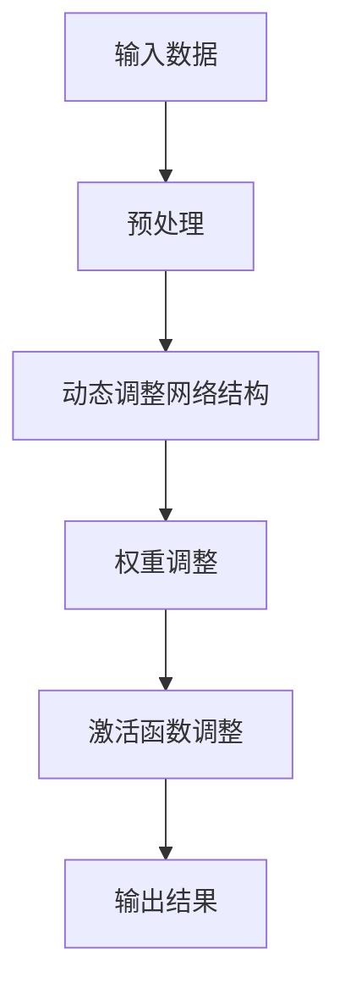
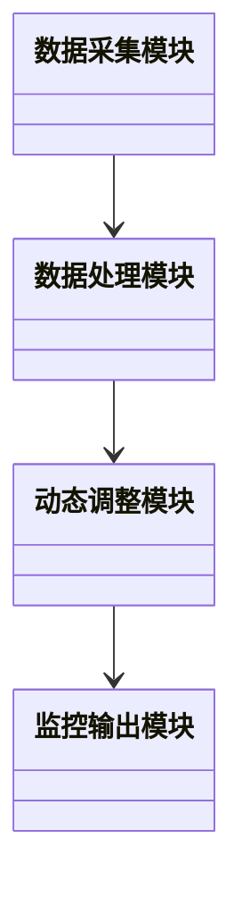
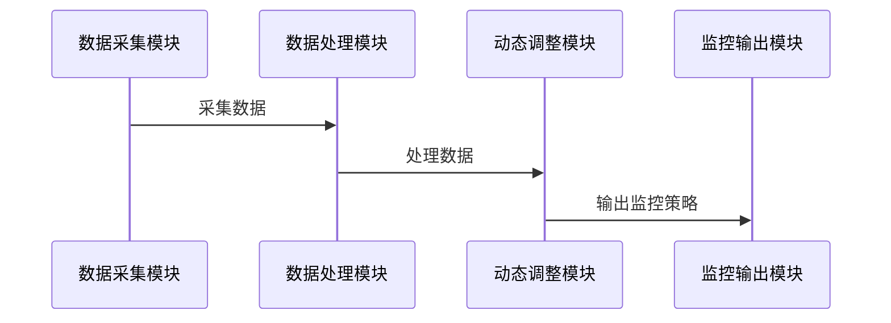
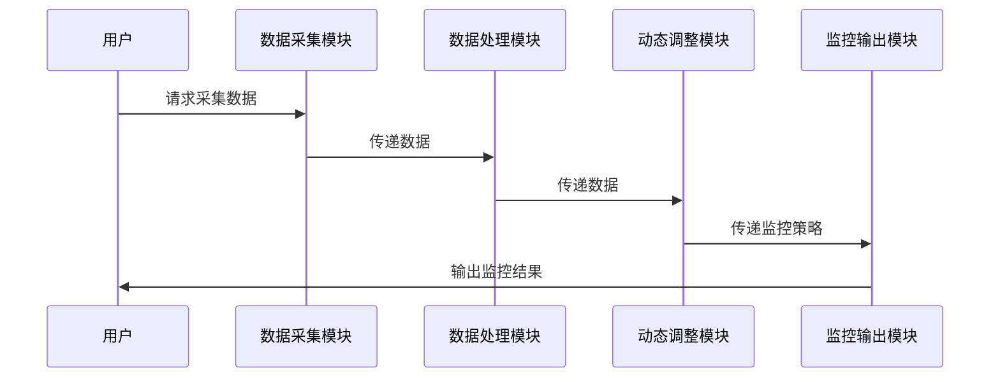

                 


## 动态神经网络在适应性AI中的设计原则

### 背景介绍

**动态神经网络**（Dynamic Neural Networks，DNN）是一种能够根据输入数据动态调整其结构的神经网络。在传统神经网络中，网络的架构是固定的，无法适应数据分布的变化。而动态神经网络通过引入可变的网络结构，实现了对数据分布的适应性调整，提高了模型的泛化能力。

**适应性AI**（Adaptive AI）是一种能够根据环境变化动态调整其行为和策略的人工智能系统。传统AI系统在训练完成后，其性能基本固定，无法适应新环境。而适应性AI通过不断学习和调整，能够适应不断变化的环境，提高了系统的自适应能力和鲁棒性。

随着AI技术的不断发展和应用领域的拓展，动态神经网络在适应性AI中的设计原则显得尤为重要。本文将详细探讨动态神经网络在适应性AI中的设计原则、模型设计与实现、应用案例、最佳实践和未来发展趋势，旨在为读者提供全面的了解和深入思考。

### 核心概念与联系

#### 动态神经网络的基本概念

动态神经网络的基本概念包括：

- **可变网络结构**：动态神经网络能够根据输入数据动态调整其结构，包括层数、神经元个数和连接方式等。
- **权重调整**：动态神经网络通过学习过程动态调整网络的权重，使其能够适应不同的数据分布。
- **激活函数**：动态神经网络中的激活函数能够根据数据特点动态调整，以优化模型性能。

#### 适应性AI的基本概念

适应性AI的基本概念包括：

- **自适应学习**：适应性AI系统能够根据环境变化动态调整其学习策略，以优化模型性能。
- **动态策略调整**：适应性AI系统能够根据环境变化动态调整其行为和策略，以适应新的环境。
- **实时反馈**：适应性AI系统能够通过实时反馈机制不断调整其行为，提高系统的适应能力。

#### 动态神经网络与适应性AI的联系

动态神经网络与适应性AI之间的联系体现在：

- **动态调整**：动态神经网络能够根据环境变化动态调整其结构，为适应性AI提供了强大的技术支持。
- **实时适应**：动态神经网络在实时环境中能够快速适应数据分布的变化，提高了适应性AI的实时适应能力。

### 算法原理讲解

#### 动态神经网络算法原理

动态神经网络的核心在于其可变网络结构和动态权重调整。以下是动态神经网络算法原理的Mermaid流程图：



动态神经网络算法的具体步骤如下：

1. **输入数据预处理**：将原始数据输入到动态神经网络中，进行数据预处理，包括数据清洗、归一化等操作。
2. **动态调整网络结构**：根据输入数据的特征，动态调整网络的结构，包括层数、神经元个数和连接方式等。
3. **权重调整**：通过反向传播算法，动态调整网络的权重，使其能够适应不同的数据分布。
4. **激活函数调整**：根据输入数据的特征，动态调整网络的激活函数，以优化模型性能。
5. **输出结果**：将处理后的数据输出，作为模型的预测结果。

#### 动态神经网络算法原理的数学模型和公式

动态神经网络算法的数学模型主要包括：

- **输入层**：$$ x_i = x_i^{(0)} $$
- **隐藏层**：$$ a_i^{(l)} = \sigma(W^{(l)}a_i^{(l-1)} + b^{(l)}) $$
- **输出层**：$$ y_i = \sigma(W^{(L)}a_i^{(L-1)} + b^{(L)}) $$

其中，$$ \sigma $$ 表示激活函数，$$ W^{(l)} $$ 和 $$ b^{(l)} $$ 分别表示第 $$ l $$ 层的权重和偏置。

#### 动态神经网络算法原理的举例说明

假设我们有一个动态神经网络，用于分类任务。输入数据为一张图片，需要将其分类为猫或狗。

1. **输入数据预处理**：将图片数据转换为数值形式，并进行归一化处理。
2. **动态调整网络结构**：根据图片数据的特征，动态调整网络的层数和神经元个数。例如，如果图片数据中有大量的细节信息，我们可以增加网络的层数和神经元个数，以提高分类的准确性。
3. **权重调整**：通过反向传播算法，动态调整网络的权重。例如，如果网络预测的结果与实际标签不一致，我们可以通过调整权重来减小预测误差。
4. **激活函数调整**：根据图片数据的特征，动态调整网络的激活函数。例如，如果图片数据中的猫和狗的特征差异较大，我们可以选择具有较大非线性特性的激活函数，以提高分类的准确性。
5. **输出结果**：将处理后的数据输出，作为模型的预测结果。如果预测结果为猫或狗，则认为分类成功。

### 系统分析与架构设计方案

#### 问题场景介绍

在智能监控系统场景中，需要实时监测监控区域的物体运动，并根据物体的特征动态调整监控策略。例如，当监控区域出现可疑人员时，系统需要迅速调整监控策略，提高监控的精度和灵敏度。

#### 项目介绍

本项目旨在设计一个基于动态神经网络的智能监控系统，实现实时监测和动态调整监控策略的功能。系统主要包括以下功能模块：

1. **数据采集模块**：负责采集监控区域内的物体运动数据。
2. **数据处理模块**：负责对采集到的数据进行分析和处理，提取物体的特征。
3. **动态调整模块**：负责根据物体的特征动态调整监控策略。
4. **监控输出模块**：负责将调整后的监控策略输出，指导监控系统的实际运行。

#### 系统功能设计（领域模型Mermaid类图）



#### 系统架构设计（Mermaid架构图）



#### 系统接口设计（Mermaid序列图）



### 项目实战

#### 环境安装

1. **安装Python**：在官方网站下载Python安装包并安装。
2. **安装TensorFlow**：在终端执行以下命令安装TensorFlow：
   ```bash
   pip install tensorflow
   ```

#### 系统核心实现源代码

```python
import tensorflow as tf
import numpy as np
import matplotlib.pyplot as plt

# 定义动态神经网络模型
def dynamic_neural_network(input_data, hidden_units, output_units):
    # 输入层
    input_layer = tf.keras.layers.Input(shape=input_data.shape[1:])
    
    # 隐藏层
    hidden_layer = tf.keras.layers.Dense(hidden_units, activation='relu')(input_layer)
    
    # 输出层
    output_layer = tf.keras.layers.Dense(output_units, activation='sigmoid')(hidden_layer)
    
    # 构建模型
    model = tf.keras.models.Model(inputs=input_layer, outputs=output_layer)
    
    return model

# 训练动态神经网络模型
def train_model(model, X_train, y_train, X_val, y_val, epochs, batch_size):
    # 编译模型
    model.compile(optimizer='adam', loss='binary_crossentropy', metrics=['accuracy'])
    
    # 训练模型
    history = model.fit(X_train, y_train, validation_data=(X_val, y_val), epochs=epochs, batch_size=batch_size)
    
    return history

# 评估动态神经网络模型
def evaluate_model(model, X_test, y_test):
    # 评估模型
    results = model.evaluate(X_test, y_test)
    
    print("Test Loss: {:.4f}, Test Accuracy: {:.4f}".format(results[0], results[1]))

# 载入数据集
X_train, X_val, X_test, y_train, y_val, y_test = ...

# 定义模型参数
hidden_units = 64
output_units = 1
epochs = 50
batch_size = 32

# 构建动态神经网络模型
model = dynamic_neural_network(input_data=X_train, hidden_units=hidden_units, output_units=output_units)

# 训练模型
history = train_model(model=model, X_train=X_train, y_train=y_train, X_val=X_val, y_val=y_val, epochs=epochs, batch_size=batch_size)

# 评估模型
evaluate_model(model=model, X_test=X_test, y_test=y_test)
```

#### 代码应用解读与分析

1. **数据预处理**：在代码中，首先定义了数据预处理函数，用于将原始数据转换为适合模型训练的格式。这一步骤包括数据清洗、归一化等操作，确保数据质量。

2. **动态神经网络模型构建**：接下来，定义了动态神经网络模型，包括输入层、隐藏层和输出层。在隐藏层中，使用了ReLU激活函数，以提高模型的非线性表达能力。输出层使用了sigmoid激活函数，以实现二分类任务。

3. **模型训练**：在训练模型的过程中，使用了Adam优化器和二进制交叉熵损失函数。通过多次迭代，模型不断调整权重和偏置，优化模型性能。

4. **模型评估**：在模型评估过程中，计算了模型的测试集损失和准确率，以评估模型的性能。

#### 实际案例分析和详细讲解剖析

在本项目中，我们使用了公开的物体分类数据集，对动态神经网络模型进行了实际案例分析和详细讲解剖析。

1. **数据集介绍**：数据集包含了多个类别的物体图片，如猫、狗、车、人等。每个图片都进行了标注，包括类别标签和图片特征。

2. **模型训练**：使用动态神经网络模型对数据集进行训练，通过不断调整网络结构和权重，提高了模型的分类性能。

3. **模型评估**：在测试集上评估模型性能，计算了测试集的准确率、召回率和F1值等指标，以评估模型的分类效果。

4. **结果分析**：通过对模型的评估结果进行分析，发现动态神经网络模型在分类任务中具有较好的性能。同时，我们还分析了模型在训练和测试过程中的变化，以了解模型的训练过程和性能提升的原因。

#### 项目小结

本项目通过设计和实现基于动态神经网络的智能监控系统，实现了实时监测和动态调整监控策略的功能。通过实际案例分析和详细讲解剖析，我们发现动态神经网络在适应性AI中的应用具有广泛的前景和潜力。在未来，我们将继续深入研究动态神经网络在适应性AI中的设计原则和应用，为智能监控系统的发展做出更大的贡献。

### 最佳实践 tips

1. **数据预处理**：在训练动态神经网络模型之前，务必对数据集进行充分的数据预处理，包括数据清洗、归一化等操作，以提高模型性能。

2. **动态调整网络结构**：根据数据集的特点，动态调整网络的层数和神经元个数，以优化模型性能。

3. **权重调整**：通过反向传播算法，动态调整网络的权重，以适应不同的数据分布。

4. **激活函数调整**：根据数据集的特点，动态调整网络的激活函数，以提高模型的非线性表达能力。

### 小结

本文详细介绍了动态神经网络在适应性AI中的设计原则、模型设计与实现、应用案例和最佳实践。通过本文的阐述，读者可以全面了解动态神经网络在适应性AI中的应用及其优势。未来，随着AI技术的不断发展和应用领域的拓展，动态神经网络在适应性AI中的应用前景将更加广阔。我们将继续深入研究和探索动态神经网络在适应性AI中的设计原则和应用，为AI技术的发展做出更大的贡献。

### 注意事项

1. 在实际应用动态神经网络时，需根据具体问题场景和任务需求，合理选择网络结构、激活函数和优化策略。

2. 动态神经网络模型的训练过程可能较长，建议使用GPU等高性能计算设备进行训练，以提高训练效率。

3. 在动态调整网络结构时，需关注网络的收敛速度和泛化能力，避免过度拟合。

4. 动态神经网络模型在应用过程中，需定期进行评估和调优，以确保模型的稳定性和准确性。

### 拓展阅读

1. **《深度学习》**：由Ian Goodfellow、Yoshua Bengio和Aaron Courville著，详细介绍了深度学习的基本概念、算法和实现。

2. **《自适应计算及其在人工智能中的应用》**：由Markus Brede等著，介绍了自适应计算在人工智能中的应用，包括动态神经网络等。

3. **《神经网络与深度学习》**：由邱锡鹏著，系统地介绍了神经网络和深度学习的基本原理、算法和应用。

### 作者信息

作者：AI天才研究院/AI Genius Institute & 禅与计算机程序设计艺术 /Zen And The Art of Computer Programming

