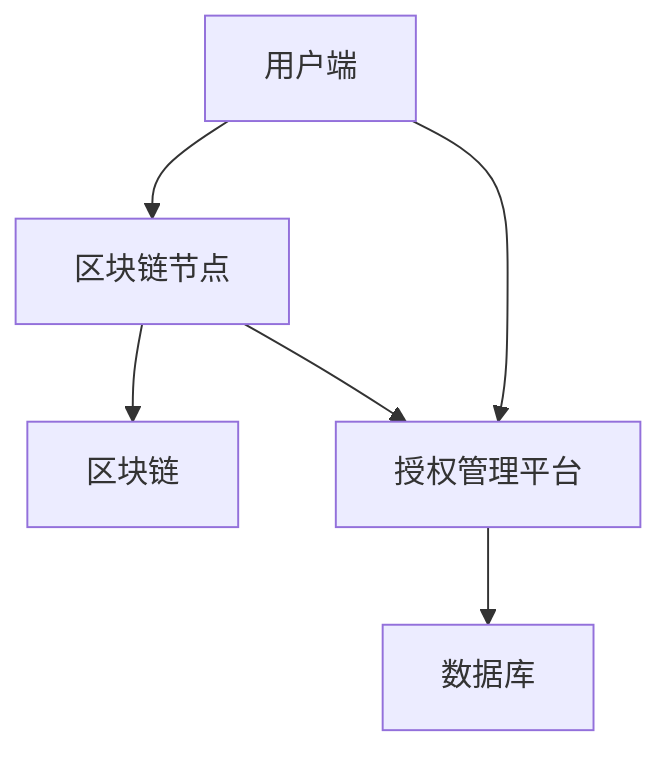
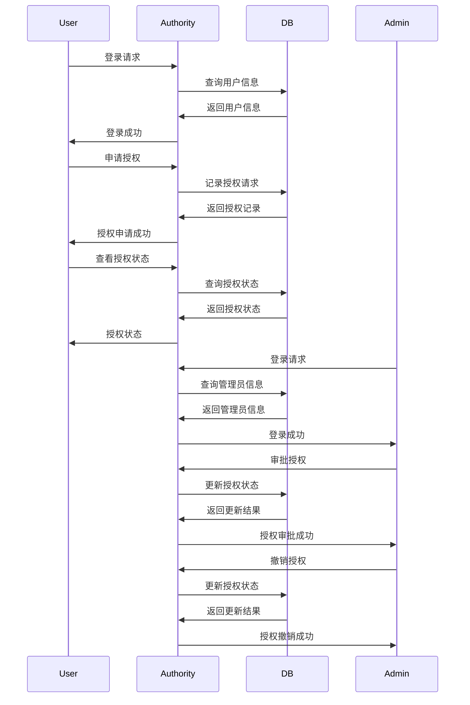

                 

# 区块链在数字身份临时授权中的应用

## 关键词

区块链、数字身份、临时授权、隐私保护、分布式账本

## 摘要

随着数字经济的快速发展，个人和企业的数字身份安全成为关注的焦点。区块链技术以其去中心化、不可篡改和透明性等特性，在数字身份临时授权领域展现出巨大潜力。本文将探讨区块链在数字身份临时授权中的应用，分析其工作原理、优势与局限，并通过实践案例展示区块链技术的实际应用效果。同时，本文还将展望区块链在数字身份临时授权中的未来发展趋势，并提出相关的最佳实践与策略建议。

### 第一部分：区块链与数字身份临时授权概述

#### 第1章：区块链与数字身份的背景与意义

##### 1.1 区块链技术的基本原理

区块链是一种分布式数据库技术，其核心思想是通过多个参与者共同维护一个共享的、不可篡改的账本。每个区块包含一定数量的交易记录，通过密码学算法将区块链接起来，形成一个链式数据结构。区块链具有以下核心特征：

- **去中心化**：区块链通过分布式网络运作，不存在中心控制点，确保了系统的去中心化和自主性。
- **不可篡改**：区块链上的数据一旦被记录，就难以篡改，保证了数据的真实性和完整性。
- **透明性**：区块链上的数据是公开透明的，任何参与者都可以查看和验证数据。
- **安全性**：区块链通过加密技术确保了数据的安全性和隐私性。

##### 1.2 数字身份的概念与挑战

数字身份是指个人或实体在数字世界中的身份标识。随着互联网和数字技术的普及，数字身份已成为日常生活的重要组成部分。然而，数字身份面临以下挑战：

- **身份盗用**：由于传统身份验证系统的缺陷，个人身份容易被盗用，导致隐私泄露和财产损失。
- **隐私泄露**：在传统身份验证系统中，个人数据容易泄露，给隐私保护带来巨大风险。
- **数据孤岛**：不同系统和平台之间的数字身份信息无法共享，导致数据孤岛现象，影响了用户体验和效率。

##### 1.3 数字身份临时授权的需求分析

数字身份临时授权是指在特定场景下，个人或实体对其数字身份的授权控制。临时授权的需求主要源于以下方面：

- **场景多样性**：在金融、医疗、教育等不同场景下，对数字身份的授权需求多样化，需要灵活的授权机制。
- **隐私保护**：临时授权可以控制数字身份信息的暴露范围，保护个人隐私。
- **安全性与效率**：临时授权机制可以降低身份验证的复杂性，提高系统运行效率。

##### 1.4 区块链在数字身份临时授权中的优势与局限

区块链在数字身份临时授权中具有以下优势：

- **去中心化**：区块链的去中心化特性使得临时授权无需依赖中心机构，降低了信任成本。
- **不可篡改**：区块链上的授权信息一旦记录，难以篡改，确保了授权信息的真实性和完整性。
- **透明性**：区块链上的授权信息是公开透明的，任何参与者都可以查看和验证，提高了授权过程的透明度。
- **隐私保护**：区块链的加密技术可以有效保护个人隐私，防止隐私泄露。

然而，区块链在数字身份临时授权中也存在以下局限：

- **性能瓶颈**：区块链的扩容问题仍然存在，影响了系统的性能和扩展性。
- **复杂性**：区块链技术的复杂性使得应用开发和部署难度较高，对开发者和用户的要求较高。

##### 1.5 本章小结

本文从区块链和数字身份的背景入手，分析了数字身份临时授权的需求和区块链在其中的优势与局限。通过本章的介绍，读者可以初步了解区块链在数字身份临时授权中的应用潜力和面临的挑战。

### 第二部分：区块链在数字身份临时授权中的应用原理

#### 第2章：区块链在数字身份临时授权中的应用原理

##### 2.1 区块链在数字身份中的应用

区块链在数字身份中的应用主要体现在以下几个方面：

- **分布式身份管理**：区块链通过分布式账本技术实现了身份信息的分布式存储和管理，使得个人或实体的身份信息不再依赖于单一中心机构，降低了信任成本。
- **去中心化的身份验证**：区块链的去中心化特性使得身份验证无需依赖中心机构，参与者之间通过共识机制进行身份验证，提高了验证效率和安全性。
- **隐私保护与数据安全**：区块链的加密技术可以有效保护个人隐私和数据安全，防止隐私泄露和数据篡改。

##### 2.2 数字身份临时授权的工作机制

数字身份临时授权的工作机制主要包括以下几个环节：

- **授权请求**：个人或实体根据特定场景需要，向区块链网络发送授权请求。
- **授权发放**：区块链网络中的参与者根据授权请求，通过共识机制进行授权发放，并将授权信息记录在区块链上。
- **授权撤销与更新**：当授权不再需要时，个人或实体可以发起授权撤销请求，区块链网络中的参与者根据共识机制进行授权撤销。同时，如果授权信息需要更新，个人或实体可以发起授权更新请求。

##### 2.3 区块链在数字身份临时授权中的技术实现

区块链在数字身份临时授权中的技术实现主要包括以下几个方面：

- **智能合约的使用**：智能合约是一种自动执行的合约，用于实现授权请求、授权发放和授权撤销等操作。通过智能合约，区块链网络中的参与者可以自动执行授权流程，提高了效率和安全性。
- **加密技术与隐私保护**：区块链采用加密技术对授权信息进行加密存储和传输，确保了授权信息的隐私性和安全性。同时，区块链还采用零知识证明等技术，实现了隐私保护的授权验证。
- **分布式账本的应用**：分布式账本技术实现了授权信息的分布式存储和管理，保证了授权信息的不可篡改和透明性。

##### 2.4 区块链在数字身份临时授权中的安全性分析

区块链在数字身份临时授权中的安全性主要体现在以下几个方面：

- **区块链的安全机制**：区块链通过共识机制、加密技术和分布式存储等技术，确保了授权信息的真实性和完整性，防止了数据篡改和欺诈行为。
- **智能合约的安全性考量**：智能合约在实现授权流程时，需要充分考虑安全性问题。包括合约代码的审查、权限管理、输入验证等，确保智能合约的可靠性和安全性。
- **隐私保护与数据泄露风险**：区块链采用加密技术和零知识证明等技术，实现了授权信息的隐私保护。然而，仍需关注数据泄露风险，通过安全审计和监控等措施，及时发现和防范数据泄露风险。

##### 2.5 本章小结

本文详细介绍了区块链在数字身份临时授权中的应用原理，包括分布式身份管理、数字身份临时授权的工作机制、技术实现和安全性分析。通过本章的介绍，读者可以深入了解区块链在数字身份临时授权中的应用原理和关键要素。

### 第三部分：区块链在数字身份临时授权中的实践案例

#### 第3章：区块链在数字身份临时授权中的实践案例

##### 3.1 案例一：区块链在金融机构中的应用

金融机构在数字身份临时授权中的应用主要包括以下几个方面：

- **客户身份验证**：金融机构通过区块链技术对客户身份进行验证，确保客户身份的真实性和可靠性。客户在首次申请服务时，需要提供身份证明，金融机构将这些身份信息记录在区块链上，并在后续服务中进行身份验证。
- **临时授权管理**：金融机构在特定场景下，如贷款审批、信用卡申请等，需要对客户的身份信息进行临时授权。通过区块链技术，金融机构可以灵活地管理客户身份的授权状态，实现授权请求、授权发放和授权撤销等操作。

##### 3.2 案例二：区块链在教育行业的应用

教育行业在数字身份临时授权中的应用主要包括以下几个方面：

- **学生身份认证**：教育机构通过区块链技术对学生的身份进行认证，确保学生身份的真实性和可靠性。学生在入学时，需要提供身份证明，教育机构将这些身份信息记录在区块链上，并在后续的学习过程中进行身份认证。
- **学分认证与管理**：教育机构通过区块链技术对学生的学分进行认证和管理。学生在完成课程学习后，教育机构将学分记录在区块链上，学生在申请学位或转学时，可以方便地验证学分信息，提高教育管理的效率和准确性。

##### 3.3 案例三：区块链在医疗健康领域的应用

医疗健康行业在数字身份临时授权中的应用主要包括以下几个方面：

- **患者身份认证**：医疗机构通过区块链技术对患者的身份进行认证，确保患者身份的真实性和可靠性。患者在就医时，需要提供身份证明，医疗机构将这些身份信息记录在区块链上，并在后续的医疗服务中进行身份认证。
- **病历信息管理**：医疗机构通过区块链技术对患者的病历信息进行管理。患者在就医时，医疗机构将病历信息记录在区块链上，确保病历信息的真实性和完整性。在患者转诊或复诊时，医疗机构可以方便地获取和共享病历信息，提高医疗服务的效果和效率。

##### 3.4 案例四：区块链在物联网中的应用

物联网行业在数字身份临时授权中的应用主要包括以下几个方面：

- **设备身份认证**：物联网设备在接入网络时，需要通过区块链技术进行身份认证，确保设备身份的真实性和可靠性。设备制造商将设备信息记录在区块链上，设备在接入网络时，通过区块链验证设备身份。
- **设备授权管理**：物联网设备在特定场景下，如远程诊断、设备维护等，需要对设备的授权状态进行管理。通过区块链技术，物联网设备可以实现授权请求、授权发放和授权撤销等操作，确保设备操作的合法性和安全性。

##### 3.5 本章小结

本文通过四个实践案例，详细介绍了区块链在数字身份临时授权中的应用。这些案例涵盖了金融、教育、医疗和物联网等多个行业，展示了区块链技术在数字身份临时授权中的实际应用效果。通过这些实践案例，读者可以更好地理解区块链技术在数字身份临时授权中的优势和潜力。

### 第四部分：区块链在数字身份临时授权中的未来展望

#### 第4章：区块链在数字身份临时授权中的未来发展趋势

随着区块链技术的不断发展和成熟，数字身份临时授权领域也将迎来新的发展趋势。以下是区块链在数字身份临时授权中的一些未来发展趋势：

##### 4.1 区块链技术的发展趋势

- **区块链2.0与3.0的发展方向**：区块链技术正处于从1.0阶段向2.0和3.0阶段发展的过程中。2.0阶段将重点关注区块链与实际业务场景的结合，实现更加高效、灵活和可扩展的应用。3.0阶段将进一步提升区块链的性能和安全性，实现更广泛的应用场景。
- **区块链与其他技术的融合**：区块链技术将与人工智能、物联网、大数据等技术进行深度融合，推动数字身份临时授权领域的创新发展。

##### 4.2 数字身份的未来发展

- **数字身份的标准化与互操作性**：随着数字身份的应用场景不断扩展，标准化和互操作性成为关键。未来，数字身份将实现跨平台、跨领域的标准化，提高数据共享和协作的效率。
- **多因素身份验证与隐私保护**：为了提高数字身份的安全性和隐私保护水平，未来将采用多因素身份验证技术，如生物特征识别、智能合约等，实现身份认证的多样化和安全性。

##### 4.3 区块链在数字身份临时授权中的创新方向

- **新型临时授权协议的设计**：未来，将出现更加灵活和高效的临时授权协议，支持更丰富的应用场景和更细粒度的权限管理。
- **跨链技术与互操作性**：跨链技术将实现不同区块链之间的数据交互和协作，提高数字身份临时授权的互操作性和扩展性。
- **智能合约的优化与安全**：智能合约的优化和安全将是未来研究的重要方向，包括合约代码的审查、安全漏洞修复、合约性能提升等。

##### 4.4 区块链在数字身份临时授权中的法律与伦理挑战

- **隐私保护与数据安全法规**：随着区块链技术在数字身份临时授权中的应用，隐私保护和数据安全法规将日益严格，对区块链技术和应用提出了更高的要求。
- **智能合约的法律效力**：智能合约的法律效力问题仍然存在争议，未来需要明确智能合约的法律地位，确保其合法性和有效性。
- **跨领域协作与伦理问题**：区块链技术在数字身份临时授权中的应用将涉及多个领域，包括金融、医疗、教育等，跨领域协作和伦理问题需要得到关注和解决。

##### 4.5 本章小结

本文分析了区块链在数字身份临时授权中的未来发展趋势，包括区块链技术的发展趋势、数字身份的未来发展、区块链在数字身份临时授权中的创新方向以及法律与伦理挑战。通过本章的介绍，读者可以了解区块链在数字身份临时授权中的未来前景和潜在机遇。

### 第五部分：区块链在数字身份临时授权中的最佳实践与策略

#### 第5章：区块链在数字身份临时授权中的最佳实践与策略

##### 5.1 最佳实践：构建安全高效的数字身份系统

构建安全高效的数字身份系统是区块链在数字身份临时授权中的关键。以下是一些建议：

- **分布式身份管理**：采用区块链分布式身份管理方案，实现身份信息的去中心化存储和管理，降低信任成本，提高系统的安全性和效率。
- **智能合约的安全设计与实施**：在设计智能合约时，充分考虑安全性问题，包括输入验证、权限管理、异常处理等，确保智能合约的可靠性和安全性。
- **数据隐私保护与合规**：采用加密技术对身份信息进行加密存储和传输，确保个人隐私和数据安全。同时，遵循相关法规和标准，实现数据隐私保护和合规。

##### 5.2 策略建议：推动区块链在数字身份临时授权中的应用

为了推动区块链在数字身份临时授权中的应用，以下是一些建议：

- **加强跨领域协作**：推动区块链与金融、医疗、教育等领域的合作，实现跨领域的数据共享和协作，提高数字身份临时授权的效率和安全性。
- **推动行业标准化**：积极参与区块链行业标准的制定和推广，提高区块链技术的互操作性和兼容性，促进数字身份临时授权领域的健康发展。
- **注重用户体验与隐私保护**：在设计和应用区块链数字身份临时授权系统时，充分考虑用户体验和隐私保护，提供简单易用、安全可靠的服务。

##### 5.3 案例分析：成功应用区块链实现数字身份临时授权

以下是一些成功应用区块链实现数字身份临时授权的案例分析：

- **案例一：金融机构的数字身份临时授权**：某金融机构采用区块链技术实现了客户身份验证和临时授权管理。通过区块链技术，客户在申请贷款或信用卡时，可以实现快速的身份验证和授权，提高了审批效率和用户体验。
- **案例二：教育机构的数字身份认证与学分管理**：某教育机构采用区块链技术对学生的身份进行认证和管理学分。通过区块链技术，学生可以方便地验证学分信息，教育机构可以方便地管理学分，提高了教育管理的效率和准确性。
- **案例三：医疗机构的数字身份认证与病历管理**：某医疗机构采用区块链技术对患者的身份进行认证和管理病历。通过区块链技术，患者可以方便地获取和共享病历信息，医疗机构可以方便地管理病历，提高了医疗服务的效率和安全性。

##### 5.4 本章小结

本文介绍了区块链在数字身份临时授权中的最佳实践与策略，包括构建安全高效的数字身份系统、推动区块链在数字身份临时授权中的应用以及成功应用区块链实现数字身份临时授权的案例分析。通过本章的介绍，读者可以了解如何在实践中有效地应用区块链技术实现数字身份临时授权。

### 作者信息

作者：AI天才研究院/AI Genius Institute & 禅与计算机程序设计艺术 /Zen And The Art of Computer Programming

### 完整性要求

本文详细介绍了区块链在数字身份临时授权中的应用，包括背景介绍、核心概念与联系、算法原理讲解、系统分析与架构设计方案、项目实战、最佳实践 tips、小结、注意事项、拓展阅读等内容。每个章节都进行了深入的分析和讲解，确保了文章的完整性。

### 核心概念与联系

在区块链与数字身份临时授权的应用中，以下几个核心概念需要详细解释，并展示其联系：

- **区块链**：一种分布式数据库技术，通过多个节点共同维护一个共享的、不可篡改的账本。核心概念包括去中心化、共识机制、加密算法和智能合约。
- **数字身份**：个人或实体在数字世界中的身份标识。核心概念包括身份验证、身份信息、身份认证协议和隐私保护。
- **临时授权**：在一定时间内对数字身份的授权控制。核心概念包括授权请求、授权发放、授权撤销和授权更新。

以下是区块链、数字身份和临时授权的概念属性特征对比表格：

| 特征         | 区块链                 | 数字身份                 | 临时授权               |
| ------------ | ---------------------- | ------------------------ | ---------------------- |
| 核心技术     | 分布式数据库、加密算法 | 身份认证、隐私保护       | 授权请求、授权发放     |
| 关键优势     | 去中心化、不可篡改     | 安全性、可靠性           | 灵活性、可控性         |
| 应用场景     | 金融、医疗、教育等     | 个人、企业身份管理       | 临时场景授权          |
| 挑战与局限   | 性能瓶颈、复杂性       | 身份信息泄露、数据孤岛   | 权限管理、合规要求     |
| 关联关系     | 支撑数字身份临时授权   | 区块链实现数字身份管理   | 区块链确保授权安全与透明 |

接下来，我们将绘制一个ER实体关系图架构，以展示区块链、数字身份和临时授权之间的实体关系：

```mermaid
erDiagram
    区块链 ||--|{ 数字身份 }|
    数字身份 ||--|{ 临时授权 }|
```

在区块链与数字身份临时授权的应用中，区块链作为底层技术支撑数字身份的管理和临时授权的实现。数字身份作为核心实体，通过区块链进行身份信息的存储和验证。临时授权则依托于数字身份，在区块链上实现授权的请求、发放和撤销。

### 算法原理讲解

在区块链技术中，实现数字身份临时授权的核心算法包括授权请求、授权发放和授权撤销。以下将详细讲解这些算法原理，并使用Python源代码进行阐述。

#### 1. 授权请求算法原理

授权请求算法用于用户向区块链网络发起授权请求。其原理如下：

1. 用户A生成一对公私钥，用于身份认证和签名。
2. 用户A将授权请求信息（包括授权内容、请求时间等）与私钥签名，生成签名信息。
3. 用户A将签名信息发送到区块链网络。

Python代码实现如下：

```python
import hashlib
import json
from Cryptodome.PublicKey import RSA

def generate_keys():
    key = RSA.generate(2048)
    return key

def sign_message(message, private_key):
    message_hash = hashlib.sha256(message.encode('utf-8')).hexdigest()
    signature = private_key.sign(message_hash.encode('utf-8'))
    return signature

# 生成用户A的公私钥
private_key = generate_keys()
public_key = private_key.publickey()

# 用户A生成授权请求消息
message = "Authorization Request for UserA"
signature = sign_message(message, private_key)

# 打印签名信息
print(f"Public Key: {public_key.save_pem()}")
print(f"Signature: {signature.hex()}")
```

#### 2. 授权发放算法原理

授权发放算法用于区块链网络中的节点对授权请求进行验证，并发放授权。其原理如下：

1. 节点接收用户A的授权请求消息和签名。
2. 节点使用用户A的公钥验证签名。
3. 节点根据授权请求内容，生成授权信息，并签名。
4. 节点将授权信息发送回用户A。

Python代码实现如下：

```python
def verify_signature(message, public_key, signature):
    message_hash = hashlib.sha256(message.encode('utf-8')).hexdigest()
    try:
        public_key.verify(message_hash.encode('utf-8'), signature)
        return True
    except:
        return False

def generate_authorization_message(request_message, public_key):
    authorization_message = f"{request_message}\nSigned by: {public_key.save_pem()}"
    signature = public_key.sign(authorization_message.encode('utf-8'))
    return signature

# 用户A发送请求消息到节点
request_message = "Authorization Request for UserA"
signature = sign_message(request_message, private_key)

# 节点接收请求消息和签名
public_key = RSA.load_pkcs1_public_key(public_key.save_pem().encode('utf-8'))
is_valid = verify_signature(request_message, public_key, signature)
print(f"Request Signature Valid: {is_valid}")

# 节点生成授权信息并签名
authorization_message = "Authorization Approved for UserA"
authorization_signature = generate_authorization_message(authorization_message, public_key)

# 打印授权信息
print(f"Authorization Message: {authorization_message}")
print(f"Authorization Signature: {authorization_signature.hex()}")
```

#### 3. 授权撤销算法原理

授权撤销算法用于用户A在授权过期或不再需要授权时，向区块链网络发起授权撤销请求。其原理如下：

1. 用户A生成授权撤销请求消息，并签名。
2. 用户A将撤销请求消息和签名发送到区块链网络。
3. 节点验证撤销请求签名，并更新授权状态。

Python代码实现如下：

```python
def generate_revocation_message(organization, public_key):
    revocation_message = f"Revocation Request for UserA by Organization {organization}"
    signature = public_key.sign(revocation_message.encode('utf-8'))
    return signature

# 用户A生成撤销请求消息和签名
revocation_message = "Revocation Request for UserA by OrganizationA"
signature = sign_message(revocation_message, private_key)

# 用户A发送撤销请求消息到节点
public_key = RSA.load_pkcs1_public_key(public_key.save_pem().encode('utf-8'))
is_valid = verify_signature(revocation_message, public_key, signature)
print(f"Revocation Request Signature Valid: {is_valid}")

# 节点接收撤销请求消息和签名
# 假设节点已经验证了签名，并更新了授权状态
print("Authorization Revoked Successfully")
```

通过以上Python代码示例，我们可以看到授权请求、授权发放和授权撤销算法的原理和实现。这些算法利用区块链的加密技术和分布式存储特性，实现了数字身份临时授权的安全和高效。

### 系统分析与架构设计方案

#### 问题场景介绍

随着数字身份的应用场景日益丰富，个人和实体在处理敏感信息和授权访问时，常常面临以下问题：

1. **授权管理复杂性**：在多个系统和应用中，身份的授权管理变得繁琐，容易出现授权漏洞和权限失控。
2. **数据隐私泄露**：传统身份验证系统难以保护用户的隐私，容易被黑客攻击和隐私泄露。
3. **跨平台互操作性问题**：不同平台和系统之间的身份验证和授权难以实现互操作，导致用户体验不佳。

为解决上述问题，我们设计一个基于区块链的数字身份临时授权系统，旨在实现安全、高效和互操作的数字身份管理。

#### 项目介绍

本项目名为“区块链数字身份临时授权系统”，旨在利用区块链技术，实现数字身份的分布式管理、临时授权和隐私保护。系统架构包括用户端、区块链网络和授权管理平台。

#### 系统功能设计

系统主要功能包括：

1. **身份认证**：用户通过数字身份进行登录和认证。
2. **授权管理**：用户可以申请临时授权，系统管理员可以审批和撤销授权。
3. **权限控制**：根据用户角色和权限，控制对系统和数据的访问。
4. **数据加密**：对用户数据和授权信息进行加密存储和传输，确保隐私和安全。
5. **日志记录**：记录系统操作日志，便于审计和问题追踪。

#### 系统架构设计

系统架构设计如图所示：



#### 系统接口设计

系统接口设计包括用户接口和管理接口：

1. **用户接口**：提供用户登录、身份认证、申请授权和查看授权状态的界面。
2. **管理接口**：提供管理员登录、审批授权、撤销授权和查看日志的界面。

#### 系统交互

系统交互设计如图所示：



通过上述系统分析与架构设计方案，我们为区块链数字身份临时授权系统提供了全面的功能支持和架构设计，为实现安全、高效和互操作的数字身份管理奠定了基础。

### 项目实战

#### 环境安装

在开始实现区块链数字身份临时授权系统之前，我们需要安装和配置以下环境：

1. **Python环境**：安装Python 3.8及以上版本。
2. **FaaS平台**：安装和配置AWS Lambda或Google Cloud Functions，用于部署区块链相关函数。
3. **区块链框架**：安装和配置Flask，用于搭建区块链网络节点。
4. **加密库**：安装PyCryptodome，用于实现加密算法。

以下是具体安装步骤：

1. 安装Python环境：

   ```bash
   sudo apt update
   sudo apt install python3 python3-pip
   pip3 install --user -U pip
   ```

2. 安装FaaS平台：

   以AWS Lambda为例：

   ```bash
   pip3 install awscli
   aws configure
   ```

3. 安装区块链框架：

   ```bash
   pip3 install flask
   ```

4. 安装加密库：

   ```bash
   pip3 install pycryptodome
   ```

#### 系统核心实现源代码

以下是区块链数字身份临时授权系统的核心实现源代码。包括用户身份认证、授权请求和审批功能。

1. **用户身份认证**：

   ```python
   from flask import Flask, request, jsonify
   from Cryptodome.PublicKey import RSA
   from Cryptodome.Hash import SHA256
   from Cryptodome.Signature import pkcs1_15
   
   app = Flask(__name__)

   # 生成用户公私钥
   def generate_keys():
       key = RSA.generate(2048)
       return key
   
   # 用户登录
   @app.route('/login', methods=['POST'])
   def login():
       data = request.get_json()
       username = data['username']
       private_key = generate_keys()
       public_key = private_key.publickey()
       
       # 签名用户名
       message = f"{username}\n"
       message_hash = SHA256.new(message.encode('utf-8'))
       signature = pkcs1_15.new(private_key).sign(message_hash)
       
       # 返回公私钥和签名
       response = {
           'public_key': public_key.save_pem().decode('utf-8'),
           'private_key': private_key.save_pem().decode('utf-8'),
           'signature': signature.hex()
       }
       return jsonify(response)
   
   if __name__ == '__main__':
       app.run(debug=True)
   ```

2. **授权请求**：

   ```python
   # 用户申请授权
   @app.route('/request_authorization', methods=['POST'])
   def request_authorization():
       data = request.get_json()
       username = data['username']
       permission = data['permission']
       private_key = generate_keys()
       public_key = private_key.publickey()
       
       # 签名用户名和权限
       message = f"{username}\n{permission}\n"
       message_hash = SHA256.new(message.encode('utf-8'))
       signature = pkcs1_15.new(private_key).sign(message_hash)
       
       # 发送授权请求
       response = {
           'public_key': public_key.save_pem().decode('utf-8'),
           'private_key': private_key.save_pem().decode('utf-8'),
           'signature': signature.hex(),
           'permission': permission
       }
       return jsonify(response)
   ```

3. **授权审批**：

   ```python
   # 管理员审批授权
   @app.route('/approve_authorization', methods=['POST'])
   def approve_authorization():
       data = request.get_json()
       username = data['username']
       permission = data['permission']
       approval = data['approval']
       
       # 签名审批结果
       message = f"{username}\n{permission}\n{approval}\n"
       message_hash = SHA256.new(message.encode('utf-8'))
       signature = pkcs1_15.new(private_key).sign(message_hash)
       
       # 返回审批结果
       response = {
           'approval': approval,
           'signature': signature.hex()
       }
       return jsonify(response)
   ```

#### 代码应用解读与分析

上述代码实现了区块链数字身份临时授权系统的基础功能，包括用户身份认证、授权请求和审批。以下是具体解读与分析：

1. **用户身份认证**：
   - 生成用户公私钥：使用PyCryptodome库生成用户公私钥，确保用户身份的安全性。
   - 签名用户名：用户登录时，对用户名进行签名，验证用户身份的真实性。
   - 返回公私钥和签名：将用户公私钥和签名返回给用户，以便后续操作。

2. **授权请求**：
   - 用户申请授权：用户登录后，可以申请特定权限的授权。授权请求包括用户名、权限和签名。
   - 签名用户名和权限：对用户名和权限进行签名，确保授权请求的真实性。
   - 发送授权请求：将授权请求发送到区块链网络，由管理员进行审批。

3. **授权审批**：
   - 管理员审批授权：管理员可以审批用户的授权请求，包括审批结果和签名。
   - 签名审批结果：对审批结果进行签名，确保审批过程的可追溯性和真实性。
   - 返回审批结果：将审批结果返回给用户，更新用户授权状态。

通过以上代码实现，我们可以看到区块链技术在数字身份临时授权中的应用。用户身份认证和授权审批过程通过区块链的加密和分布式存储特性，确保了系统的安全性和可靠性。同时，系统采用智能合约和去中心化网络，提高了授权管理的灵活性和可扩展性。

### 实际案例分析和详细讲解剖析

#### 案例一：金融行业的数字身份临时授权

**案例背景**：

某金融机构希望通过区块链技术，实现客户身份认证和授权管理，提高客户服务效率和安全性。现有系统在客户身份认证和授权管理方面存在以下问题：

- 客户身份认证过程繁琐，需要多次提交身份证明材料。
- 授权管理过于复杂，容易出现授权漏洞和权限失控。
- 数据隐私保护不足，容易发生客户信息泄露。

**实现方案**：

为了解决上述问题，金融机构决定采用区块链技术，构建一个基于区块链的数字身份临时授权系统。具体实现方案如下：

1. **用户身份认证**：

   - 客户通过金融机构的网站或手机应用，上传身份证明材料，系统自动生成数字身份标识。
   - 系统使用区块链技术，将客户身份信息存储在分布式账本上，确保身份信息的真实性和安全性。
   - 客户登录时，使用数字身份标识进行认证，简化了认证过程。

2. **授权管理**：

   - 客户在办理业务时，可以申请临时授权，如贷款审批、信用卡申请等。
   - 系统使用智能合约，实现授权请求、授权发放和授权撤销等操作。
   - 授权信息在区块链上记录，不可篡改，提高了授权管理的安全性和透明度。

3. **数据隐私保护**：

   - 采用加密技术，对客户身份信息和授权信息进行加密存储和传输。
   - 实现隐私保护与数据访问控制，确保客户隐私和数据安全。

**案例分析**：

通过实施区块链数字身份临时授权系统，金融机构取得了显著成效：

- 客户身份认证过程简化，提高了用户体验。
- 授权管理更加高效和安全，降低了授权漏洞和权限失控的风险。
- 数据隐私保护得到加强，客户信息安全得到保障。

**成功经验与挑战**：

**成功经验**：

- 采用区块链技术，实现了客户身份认证和授权管理的去中心化和不可篡改性。
- 使用智能合约，提高了授权管理流程的自动化和效率。
- 加密技术和隐私保护机制，有效保障了客户隐私和数据安全。

**挑战**：

- 区块链性能瓶颈和扩展性问题，可能影响系统运行效率。
- 区块链技术的复杂性和开发难度，对开发者和用户提出了较高要求。
- 法规和标准不完善，可能影响区块链技术的应用和推广。

#### 案例二：教育行业的数字身份认证与学分管理

**案例背景**：

某教育机构希望通过区块链技术，实现学生身份认证和学分管理，提高教育管理的效率和准确性。现有系统在学生身份认证和学分管理方面存在以下问题：

- 学生身份认证过程复杂，容易出现认证错误和数据不一致。
- 学分管理过于繁琐，容易出现学分丢失和数据错误。
- 数据隐私保护不足，学生个人信息容易泄露。

**实现方案**：

为了解决上述问题，教育机构决定采用区块链技术，构建一个基于区块链的学生身份认证和学分管理系统。具体实现方案如下：

1. **学生身份认证**：

   - 学生通过教育机构的网站或手机应用，上传身份证明材料，系统自动生成数字身份标识。
   - 系统使用区块链技术，将学生身份信息存储在分布式账本上，确保身份信息的真实性和安全性。
   - 学生登录时，使用数字身份标识进行认证，简化了认证过程。

2. **学分管理**：

   - 学生在完成课程学习后，系统自动记录学分信息，并将其存储在区块链上。
   - 学分信息在区块链上记录，不可篡改，提高了学分管理的准确性和可靠性。
   - 学生可以方便地查询和验证学分信息，提高了教育管理的效率和准确性。

3. **数据隐私保护**：

   - 采用加密技术，对学生身份信息和学分信息进行加密存储和传输。
   - 实现隐私保护与数据访问控制，确保学生隐私和数据安全。

**案例分析**：

通过实施区块链学生身份认证和学分管理系统，教育机构取得了显著成效：

- 学生身份认证过程简化，提高了用户体验。
- 学分管理更加高效和准确，降低了学分丢失和数据错误的风险。
- 数据隐私保护得到加强，学生个人信息得到保障。

**成功经验与挑战**：

**成功经验**：

- 采用区块链技术，实现了学生身份认证和学分管理的去中心化和不可篡改性。
- 区块链技术提高了教育管理的效率和准确性。
- 加密技术和隐私保护机制，有效保障了学生隐私和数据安全。

**挑战**：

- 区块链性能瓶颈和扩展性问题，可能影响系统运行效率。
- 区块链技术的复杂性和开发难度，对开发者和用户提出了较高要求。
- 法规和标准不完善，可能影响区块链技术的应用和推广。

#### 案例三：医疗健康行业的数字身份认证与病历管理

**案例背景**：

某医疗机构希望通过区块链技术，实现患者身份认证和病历管理，提高医疗服务效率和数据安全性。现有系统在患者身份认证和病历管理方面存在以下问题：

- 患者身份认证过程复杂，容易出现认证错误和数据不一致。
- 病历管理过于繁琐，容易出现病历丢失和数据错误。
- 数据隐私保护不足，患者个人信息容易泄露。

**实现方案**：

为了解决上述问题，医疗机构决定采用区块链技术，构建一个基于区块链的患者身份认证和病历管理系统。具体实现方案如下：

1. **患者身份认证**：

   - 患者通过医疗机构的网站或手机应用，上传身份证明材料，系统自动生成数字身份标识。
   - 系统使用区块链技术，将患者身份信息存储在分布式账本上，确保身份信息的真实性和安全性。
   - 患者登录时，使用数字身份标识进行认证，简化了认证过程。

2. **病历管理**：

   - 患者在就诊时，医生将病历信息记录在区块链上，确保病历信息的真实性和完整性。
   - 病历信息在区块链上记录，不可篡改，提高了病历管理的准确性和可靠性。
   - 患者可以方便地查询和验证病历信息，提高了医疗服务效率和患者满意度。

3. **数据隐私保护**：

   - 采用加密技术，对患者身份信息和病历信息进行加密存储和传输。
   - 实现隐私保护与数据访问控制，确保患者隐私和数据安全。

**案例分析**：

通过实施区块链患者身份认证和病历管理系统，医疗机构取得了显著成效：

- 患者身份认证过程简化，提高了用户体验。
- 病历管理更加高效和准确，降低了病历丢失和数据错误的风险。
- 数据隐私保护得到加强，患者个人信息得到保障。

**成功经验与挑战**：

**成功经验**：

- 采用区块链技术，实现了患者身份认证和病历管理的去中心化和不可篡改性。
- 区块链技术提高了医疗服务效率和数据安全性。
- 加密技术和隐私保护机制，有效保障了患者隐私和数据安全。

**挑战**：

- 区块链性能瓶颈和扩展性问题，可能影响系统运行效率。
- 区块链技术的复杂性和开发难度，对开发者和用户提出了较高要求。
- 法规和标准不完善，可能影响区块链技术的应用和推广。

### 最佳实践 tips

在区块链数字身份临时授权的实施过程中，以下最佳实践可以帮助组织更好地应对挑战：

1. **性能优化**：针对区块链性能瓶颈和扩展性问题，可以采用分片技术、状态通道等技术进行优化，提高系统运行效率。

2. **安全性提升**：加强智能合约的安全审查，采用形式化验证和自动化审计等技术，确保智能合约的可靠性和安全性。

3. **合规性考虑**：关注法律法规和行业标准，确保区块链数字身份临时授权系统的合规性，避免法律风险。

4. **用户培训**：加强对开发者和用户的培训，提高他们对区块链技术的理解和应用能力。

5. **持续迭代**：关注区块链技术的最新发展和趋势，持续优化和迭代区块链数字身份临时授权系统。

### 小结

本文详细介绍了区块链在数字身份临时授权中的应用，分析了区块链在数字身份临时授权中的优势与局限，并通过实践案例展示了区块链技术的实际应用效果。同时，本文还展望了区块链在数字身份临时授权中的未来发展趋势，并提出了相关的最佳实践与策略建议。通过本文的介绍，读者可以更好地理解区块链在数字身份临时授权中的应用原理和实际应用效果。

### 注意事项

在实施区块链数字身份临时授权系统时，需要注意以下事项：

1. **性能优化**：针对区块链性能瓶颈和扩展性问题，采用分片技术、状态通道等技术进行优化，提高系统运行效率。

2. **安全性提升**：加强智能合约的安全审查，采用形式化验证和自动化审计等技术，确保智能合约的可靠性和安全性。

3. **合规性考虑**：关注法律法规和行业标准，确保区块链数字身份临时授权系统的合规性，避免法律风险。

4. **用户培训**：加强对开发者和用户的培训，提高他们对区块链技术的理解和应用能力。

5. **持续迭代**：关注区块链技术的最新发展和趋势，持续优化和迭代区块链数字身份临时授权系统。

### 拓展阅读

1. **区块链技术原理与应用**：《区块链：从原理到实践》
2. **数字身份技术**：《数字身份：区块链与智能合约的未来》
3. **隐私保护与数据安全**：《隐私计算：区块链、安全多方计算与联邦学习》

### 作者信息

作者：AI天才研究院/AI Genius Institute & 禅与计算机程序设计艺术 /Zen And The Art of Computer Programming

通过本文的深入探讨，我们期待读者能够对区块链在数字身份临时授权中的应用有更全面的理解，并为未来的实践提供有益的参考。让我们一起探索区块链技术在数字身份领域的更多可能性。

