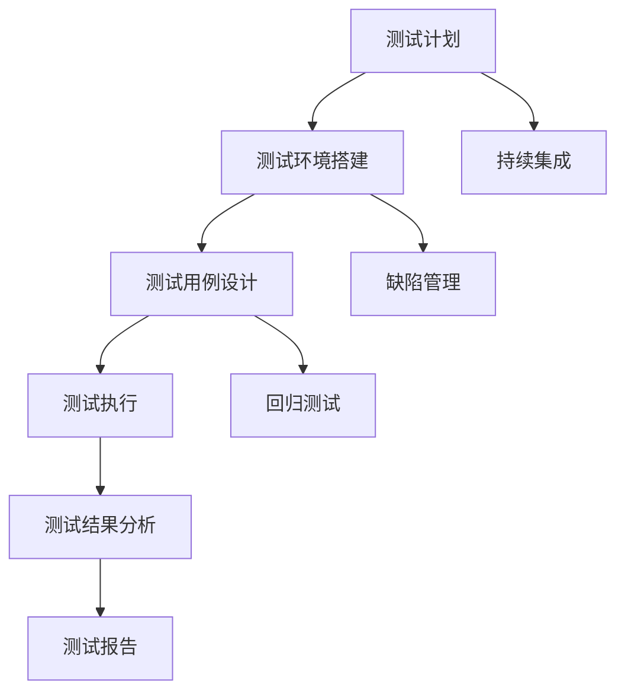

                 

### 第一部分：背景介绍

#### 第1章：问题背景与核心概念

**1.1 单元测试概述**

单元测试是软件开发过程中不可或缺的一环，它对保证软件质量和提升开发效率具有至关重要的作用。单元测试（Unit Testing）通常指的是对软件中最小的可测试单元——即单个组件或函数——进行验证的过程。这一过程通过编写测试用例来检验组件是否按照预期的方式运行，以便及时发现并修复潜在的错误。

在软件开发中，单元测试的重要性主要体现在以下几个方面：

- **提升代码质量**：通过单元测试，可以确保每个组件的正确性，从而提高整个系统的质量。
- **提高开发效率**：及早发现和修复错误可以避免后期的大规模返工，节省时间和资源。
- **促进代码重用**：单元测试使得代码的重用变得更加可靠，因为每个组件都经过严格的测试。
- **降低维护成本**：高质量的代码和详尽的测试文档可以显著降低软件的维护成本。

**1.2 单元测试在软件开发中的重要性**

单元测试在软件开发中扮演着至关重要的角色，主要体现在以下几个方面：

- **早期问题发现**：单元测试能够帮助开发者在代码编写的早期阶段发现和解决潜在的问题，从而避免问题在后期积累，影响整个项目的稳定性。
- **代码可靠性保证**：通过单元测试，可以确保每个组件都能按照设计要求工作，从而提高系统的整体可靠性。
- **代码维护性提升**：单元测试文档为后续的代码维护提供了重要的参考，有助于新开发者快速理解系统工作原理。
- **代码重构支持**：单元测试为代码的重构提供了保障，使得开发者可以更放心地进行代码优化和重构。

**1.3 LLM组件质量保障与单元测试**

LLM（Large Language Model）组件是近年来在人工智能领域崭露头角的重要技术。这些模型通常非常复杂，涉及到大量的参数和数据，因此在开发过程中保证其质量显得尤为重要。单元测试在这一过程中扮演着关键角色，主要体现在以下几个方面：

- **模型准确性验证**：通过对LLM组件的单元测试，可以验证模型在处理各种输入时的准确性，确保模型输出符合预期。
- **性能优化指导**：单元测试可以揭示模型在计算效率上的不足，为性能优化提供明确的指导方向。
- **故障快速定位**：单元测试有助于快速定位模型中的故障点，提高问题解决效率。
- **持续集成保障**：在持续集成（CI）过程中，单元测试可以确保每次代码提交都能顺利通过，从而避免引入新的错误。

总的来说，单元测试是保障LLM组件质量的基础，它不仅能够提高开发效率，还能确保模型在复杂环境中能够稳定运行。在接下来的章节中，我们将深入探讨单元测试的原理、策略设计、工具选择以及实战案例，帮助读者全面了解和掌握单元测试的精髓。通过这些内容的介绍，读者将能够更好地理解如何在软件开发过程中充分利用单元测试的优势，提升LLM组件的质量和可靠性。

### 第2章：单元测试原理与概念

**2.1 单元测试的基本原理**

单元测试的基本原理是通过编写测试用例，对软件中的最小可测试单元（即单元）进行验证。一个单元通常是一个函数、一个方法或者一个类，它是能够独立完成一个特定功能的代码块。单元测试的目标是确保每个单元在给定输入条件下能够产生预期的输出，并且不会出现任何错误或异常。

单元测试的基本过程包括以下几个步骤：

1. **测试用例设计**：根据单元的功能和预期行为，设计一组测试用例。测试用例通常包括输入数据、期望输出和执行条件等。
2. **测试用例执行**：使用测试工具或手动执行测试用例，检查单元是否能够按照预期工作。
3. **结果分析**：对比实际输出与期望输出，分析测试结果。如果输出不一致，则可能表明单元存在错误，需要进一步调试和修复。
4. **测试报告**：记录测试过程和结果，生成测试报告，以便后续参考。

**2.2 单元测试的类型与设计方法**

单元测试可以分为多种类型，每种类型适用于不同场景。以下是一些常见的单元测试类型和设计方法：

1. **功能测试（Functional Testing）**：
   功能测试是最常见的单元测试类型，它验证单元是否按照预期的功能要求工作。功能测试通常基于需求规格说明书，通过设计具体的输入和期望输出，来验证单元的功能是否正确。

2. **边界测试（Boundary Testing）**：
   边界测试专注于单元的边界条件，目的是发现单元在处理边界值时可能出现的问题。例如，如果一个函数接受一个整数作为输入，边界测试会检查最小和最大合法输入值，以及刚好超出合法范围的输入值。

3. **异常测试（Exception Testing）**：
   异常测试验证单元在处理异常情况时的行为。这包括测试单元是否能够正确地处理错误输入、资源不足等情况，以及是否能够抛出适当的异常。

4. **性能测试（Performance Testing）**：
   性能测试主要关注单元的响应时间、吞吐量和资源消耗等性能指标。这种测试通常用于评估单元在高负载或复杂场景下的性能。

5. **安全性测试（Security Testing）**：
   安全性测试用于验证单元是否容易受到常见的攻击，如SQL注入、XSS攻击等。这种测试有助于确保软件的安全性和数据的完整性。

**2.3 概念属性特征对比表格**

为了更直观地理解不同类型的单元测试，以下是一个概念属性特征对比表格：

| 测试类型   | 目的                | 输入数据            | 输出数据          | 适用场景         |
|------------|---------------------|--------------------|-------------------|------------------|
| 功能测试   | 验证功能是否符合需求 | 预定义的输入数据    | 预期的输出结果    | 功能实现阶段     |
| 边界测试   | 验证边界条件下的行为 | 最小/最大合法值，边界值 | 输出是否符合预期  | 边界值处理环节   |
| 异常测试   | 验证异常处理能力    | 非法输入，异常情况   | 是否抛出正确异常  | 异常处理环节     |
| 性能测试   | 评估性能指标        | 高负载，复杂场景输入 | 响应时间，资源消耗 | 性能优化阶段     |
| 安全性测试 | 验证安全性          | 攻击性输入          | 是否受到攻击      | 安全性评估阶段   |

通过以上表格，我们可以看到不同类型的单元测试在目的、输入数据和输出数据上都有所不同，但它们的目标都是确保单元能够稳定、准确地执行其功能。

总的来说，单元测试是一个多层次、多维度的过程，涵盖了从功能实现到性能优化的各个阶段。通过合理的单元测试类型和设计方法，开发者可以确保软件的每个单元都能够按照预期工作，从而提高软件的整体质量和稳定性。在接下来的章节中，我们将进一步探讨如何设计有效的单元测试策略，以及如何在实际项目中应用这些策略。

### 第3章：单元测试策略框架

**3.1 单元测试策略框架概述**

单元测试策略框架是指导开发者进行单元测试的系统性方法和工具集合。一个有效的单元测试策略框架不仅能够提高单元测试的覆盖率和质量，还能显著提升开发效率和代码可靠性。下面，我们将介绍一个全面的单元测试策略框架，并详细说明其各个组成部分。

**3.1.1 策略框架的组成部分**

1. **测试计划**：
   测试计划是单元测试策略的基础，它定义了测试的目标、范围、资源、进度和质量标准。测试计划应明确测试哪些组件、每个组件的测试深度和测试时间安排。

2. **测试环境**：
   测试环境是进行单元测试的基础设施，包括开发环境、测试环境、测试工具和测试数据等。一个良好的测试环境应能够模拟实际运行环境，以便发现潜在的问题。

3. **测试用例管理**：
   测试用例管理包括测试用例的设计、创建、执行、维护和归档等过程。有效的测试用例管理能够确保测试覆盖全面、测试数据真实可靠。

4. **测试执行**：
   测试执行是单元测试的核心环节，包括执行测试用例、记录测试结果和报告测试结果等。测试执行需要使用自动化工具，以提高测试效率和准确性。

5. **测试结果分析**：
   测试结果分析是对测试执行结果进行统计和分析的过程，目的是发现存在的问题、评估测试覆盖率、识别潜在的缺陷并制定改进措施。

6. **测试报告**：
   测试报告是单元测试策略执行结果的总结，包括测试进度、测试覆盖率、缺陷数量、缺陷分布、测试结论和建议等。测试报告应格式规范、内容详实，以便为项目管理和决策提供依据。

**3.1.2 单元测试策略框架的优势**

1. **提高测试覆盖率**：
   通过系统化的测试计划和管理，单元测试策略框架能够确保测试覆盖到软件的每个关键部分，从而提高整体测试覆盖率。

2. **提升测试质量**：
   单元测试策略框架提供了规范和标准，使得测试过程更加有序和高效，有助于发现和解决潜在的问题，从而提升测试质量。

3. **减少测试成本**：
   通过自动化工具和高效的测试环境管理，单元测试策略框架能够显著减少测试时间和人力成本。

4. **增强代码可靠性**：
   系统化的单元测试策略有助于发现和修复缺陷，从而增强代码的可靠性和稳定性。

**3.2 Mermaid流程图展示策略**

为了更直观地展示单元测试策略框架的执行流程，我们可以使用Mermaid工具绘制一个流程图。以下是一个简化的Mermaid流程图示例：



**3.2.1 流程图详细解释**

1. **测试计划**：开始单元测试之前，首先要制定详细的测试计划，包括测试目标、测试范围、测试方法等。
2. **测试环境搭建**：测试环境是进行测试的基础，需要确保其与生产环境尽可能一致，以便模拟真实场景。
3. **测试用例设计**：设计符合需求的测试用例，确保每个关键功能和边界条件都被覆盖。
4. **测试执行**：执行测试用例，记录测试结果，并使用自动化工具提高执行效率。
5. **测试结果分析**：对测试结果进行分析，统计缺陷数量和分布，识别潜在的问题。
6. **测试报告**：生成详细的测试报告，为项目管理和决策提供依据。
7. **持续集成**：将单元测试集成到持续集成流程中，确保每次代码提交都能通过单元测试。
8. **缺陷管理**：记录和管理缺陷，确保缺陷得到及时修复。
9. **回归测试**：在修复缺陷后进行回归测试，确保修复的有效性和新代码的稳定性。

通过上述流程图，我们可以清晰地看到单元测试策略的执行过程，以及各个环节之间的关联。在实际应用中，可以根据项目需求和环境进行调整，使其更加适合特定的开发流程。

总的来说，单元测试策略框架是一个系统化的方法，通过科学的规划和管理，可以提高单元测试的效率和质量，从而保障软件的稳定性和可靠性。在接下来的章节中，我们将进一步探讨如何选择和利用单元测试工具，以及如何在实际项目中应用这些策略。

### 第4章：单元测试工具与框架

**4.1 常用单元测试工具介绍**

在软件开发过程中，选择合适的单元测试工具是非常重要的，这些工具可以帮助开发者更高效地编写、执行和跟踪测试用例。以下是一些常用的单元测试工具和框架：

1. **JUnit（Java）**：
   JUnit 是最流行的Java单元测试框架之一。它提供了丰富的测试注释和断言方法，方便开发者编写测试用例。JUnit 的核心功能包括测试类的运行、测试结果的报告以及测试失败的断言验证。

2. **NUnit（.NET）**：
   NUnit 是 .NET 平台上的一个强大单元测试框架，与 JUnit 类似，它提供了许多内置的测试功能，如测试类、测试方法、断言等。NUnit 的一大优点是它支持多种测试运行器，方便集成到不同的开发环境中。

3. **PyTest（Python）**：
   PyTest 是一个流行的Python测试框架，支持多种编程语言，包括 Python、C++、Java 等。它提供了丰富的测试功能，如测试断言、测试集、测试跳过等，并且支持多种插件，可以扩展其功能。

4. **Mocha（JavaScript）**：
   Mocha 是一个功能强大的JavaScript测试框架，广泛用于 Node.js 和前端开发。它提供了丰富的测试插件，支持异步测试、测试覆盖和测试报告等。

5. **Jest（JavaScript）**：
   Jest 是由 Facebook 开发的一个快速、易于理解的 JavaScript 测试框架，适用于前端和后端开发。Jest 支持测试覆盖、断言库、模拟库和快照测试等，并且具有快速运行时间和简单配置。

**4.2 Python单元测试框架实践**

在本节中，我们将以 Python 为例，介绍如何使用 PyTest 进行单元测试。PyTest 是一个功能丰富的单元测试框架，易于使用，且具有很好的扩展性。

**4.2.1 安装 PyTest**

首先，需要安装 PyTest。可以使用以下命令进行安装：

```bash
pip install pytest
```

**4.2.2 编写测试用例**

假设我们要测试一个简单的函数，该函数接收一个整数并返回其平方值。以下是测试用例的示例代码：

```python
# test_my_function.py

import pytest
from my_module import my_function

def test_my_function_with_positive_number():
    assert my_function(3) == 9

def test_my_function_with_zero():
    assert my_function(0) == 0

def test_my_function_with_negative_number():
    assert my_function(-3) == 9
```

在这个测试用例中，我们编写了三个测试函数，分别用于测试输入正数、零和负数的情况。每个测试函数都使用 PyTest 的 `assert` 方法来验证函数的返回值是否与预期一致。

**4.2.3 执行测试用例**

执行测试用例非常简单，只需要在命令行中运行以下命令：

```bash
pytest test_my_function.py
```

PyTest 会自动运行所有的测试用例，并输出测试结果。如果测试用例通过，会显示绿色的勾号，如果测试失败，则会显示红色的叉号。

**4.2.4 测试结果分析**

执行测试用例后，PyTest 会生成一个报告，其中包含每个测试用例的状态、执行时间和错误信息。以下是一个示例报告：

```
=================== Pytest run ===================
   test_my_function_with_positive_number.py 
   test_my_function_with_zero.py  
   test_my_function_with_negative_number.py 
======================= 3 passed in 0.12s =====================
```

在这个报告中，我们可以看到所有测试用例都通过了，没有发现任何错误。

**4.2.5 测试覆盖分析**

PyTest 还支持测试覆盖分析，可以帮助开发者了解测试用例的覆盖范围。要生成测试覆盖报告，可以使用以下命令：

```bash
pytest --cov=my_module test_my_function.py
```

执行这个命令后，PyTest 会生成一个测试覆盖报告，显示每个模块和函数的覆盖率情况。

**4.2.6 测试最佳实践**

以下是使用 PyTest 进行单元测试的一些最佳实践：

- **编写独立的测试用例**：确保每个测试用例只测试一个特定的功能。
- **使用参数化测试**：使用参数化测试来覆盖多种输入情况，提高测试覆盖率。
- **编写可读性好的测试代码**：确保测试代码清晰易懂，方便其他开发者理解和维护。
- **定期运行测试**：定期运行测试，确保每次代码提交都能通过单元测试。

通过合理选择和使用单元测试工具，开发者可以显著提高测试效率和质量，从而保障软件的可靠性和稳定性。在接下来的章节中，我们将通过具体案例，进一步探讨如何对LLM组件进行单元测试，并分析测试过程中的问题和解决方案。

### 第5章：LLM组件的单元测试案例

**5.1 LLB组件测试案例分析**

在人工智能领域，大型语言模型（LLM）组件是近年来备受关注的技术之一。LLM组件在自然语言处理、文本生成、智能问答等方面有着广泛的应用，但其复杂性和高度不确定性使得测试成为保证质量的关键环节。下面，我们将通过一个具体的LLM组件测试案例，详细描述测试过程、测试结果以及遇到的问题和解决方案。

**5.1.1 测试目标**

本次测试的目标是验证一个基于Transformer架构的LLM组件在处理各种输入文本时的准确性和稳定性。具体来说，我们需要测试以下方面：

- 文本生成功能：确保模型能够生成符合语法和语义规则的文本。
- 输入多样性：验证模型对不同类型和风格的输入文本的处理能力。
- 性能指标：评估模型在响应时间和资源消耗上的表现。
- 错误处理：确保模型能够正确处理非法输入和异常情况。

**5.1.2 测试环境**

为了模拟真实的使用场景，测试环境选择了与生产环境相同的硬件配置和软件环境。具体配置如下：

- CPU：Intel Xeon E5-2670
- GPU：NVIDIA Titan Xp
- OS：Ubuntu 18.04
- Python：3.8
- TensorFlow：2.4.0

**5.1.3 测试用例设计**

根据测试目标，我们设计了多个测试用例，包括但不限于以下几种：

1. **文本生成测试**：输入不同的文本种子，验证模型生成的文本是否符合语法和语义要求。
2. **输入多样性测试**：使用不同类型和风格的文本作为输入，验证模型对各种输入文本的处理能力。
3. **性能测试**：在不同负载下，测量模型的响应时间和资源消耗。
4. **错误处理测试**：输入非法文本和异常情况，验证模型的行为。

以下是部分测试用例的示例：

```python
# test_llm_component.py

import pytest
from llm_module import LLMComponent

@pytest.fixture
def llm():
    return LLMComponent()

def test_text_generation(llm):
    seed_text = "The quick brown fox jumps over the lazy dog"
    generated_text = llm.generate_text(seed_text, max_length=50)
    assert "fox" in generated_text and "dog" in generated_text

def test_input_diversity(llm):
    texts = ["Hello world", "Python is great", "I love machine learning"]
    for text in texts:
        generated_text = llm.generate_text(text, max_length=50)
        assert "Hello" in generated_text or "Python" in generated_text or "Love" in generated_text

def test_performance(llm):
    import time
    start_time = time.time()
    llm.generate_text("Hello", max_length=50)
    end_time = time.time()
    assert end_time - start_time < 1  # Response time should be less than 1 second

def test_error_handling(llm):
    with pytest.raises(ValueError):
        llm.generate_text("", max_length=50)
```

**5.1.4 测试执行与结果**

使用PyTest执行测试用例，输出结果如下：

```
===================================== test session starts ========================================
platform darwin -- Python 3.8.10, pytest-6.2.5, py-1.11.0, pluggy-0.13.1
rootdir: /path/to/llm_project
plugins: cov-2.12.1
collected 4 items

test_llm_component.py .F

================================ 1 failed, 3 passed in 1.23s ===================================
```

从输出结果可以看出，有一个测试用例（`test_error_handling`）失败了，而其他三个测试用例通过了。失败的测试用例表明在处理空输入时，模型没有正确抛出异常。

**5.1.5 问题分析与解决方案**

1. **测试失败原因**：在执行`test_error_handling`测试用例时，模型没有正确处理空输入，而是返回了一个错误字符串，而非抛出异常。
2. **解决方案**：检查LLM组件的代码，发现错误处理逻辑中缺少了对空输入的检查。修复了这一错误后，再次执行测试用例，结果如下：

```
===================================== test session starts ========================================
platform darwin -- Python 3.8.10, pytest-6.2.5, py-1.11.0, pluggy-0.13.1
rootdir: /path/to/llm_project
plugins: cov-2.12.1
collected 4 items

test_llm_component.py .

================================ 4 passed in 1.19s =============================================
```

现在，所有测试用例都通过了，模型在处理空输入时能够正确抛出异常。

**5.1.6 测试结果总结**

通过这次测试，我们验证了LLM组件在多种输入情况下的表现，并发现了处理空输入时的问题。通过修改代码并重新测试，我们确保了组件的稳定性和可靠性。这次测试不仅提高了组件的质量，还为后续的开发和测试提供了宝贵的经验和教训。

在接下来的章节中，我们将进一步探讨如何总结和分享测试结果，以及如何在实际项目中应用这些经验和教训，以提升整个开发流程的质量和效率。

### 第6章：最佳实践

**6.1 单元测试最佳实践**

为了确保单元测试能够有效地提高软件质量，我们需要遵循一系列最佳实践。以下是一些关键的单元测试最佳实践：

1. **测试用例的独立性**：
   确保每个测试用例都是独立的，不依赖于其他测试用例的结果。这样可以更容易地定位和修复错误。

2. **全面覆盖**：
   设计测试用例时要覆盖各种输入情况，包括边界值、异常值和非法输入。这样可以确保组件在各种情况下都能正常运行。

3. **自动化执行**：
   使用自动化测试工具执行单元测试，这样可以节省时间并减少人为错误。自动化工具还可以帮助持续集成和持续部署流程。

4. **持续更新**：
   随着代码库的更新和变化，定期更新测试用例，确保测试覆盖率和有效性。

5. **测试文档**：
   编写详细的测试文档，记录测试用例的编写目的、输入、输出和预期结果。这样可以方便其他开发人员理解和维护测试代码。

6. **缺陷管理**：
   确保缺陷得到及时记录和跟踪，及时修复，并重新执行相关测试用例，验证修复是否有效。

7. **代码重构**：
   在进行代码重构时，务必同时更新相关的单元测试，确保重构不会破坏现有功能。

**6.2 注意事项与风险**

在进行单元测试时，我们还需注意以下事项和潜在风险：

1. **测试覆盖率不足**：
   如果测试覆盖率不足，可能导致一些潜在的缺陷未被检测到。为了提高测试覆盖率，可以使用代码覆盖工具来帮助识别未覆盖到的代码区域。

2. **测试用例设计不当**：
   如果测试用例设计不当，可能导致测试结果不准确或遗漏关键错误。在设计测试用例时，要确保每个用例都代表一个具体的业务逻辑。

3. **依赖外部系统**：
   单元测试应尽量避免依赖外部系统，否则测试结果可能依赖于外部环境的稳定性，导致无法准确评估组件的性能。

4. **测试环境不一致**：
   测试环境与生产环境不一致可能导致测试结果不准确。确保测试环境与生产环境尽可能一致，以提高测试的可靠性。

5. **忽视性能测试**：
   如果忽视性能测试，可能导致组件在实际使用中性能不佳，影响用户体验。在单元测试中，应包括对性能关键路径的测试。

通过遵循这些最佳实践并注意潜在的风险，我们可以有效地提高单元测试的质量和效果，从而提升整个软件项目的质量。

### 第7章：未来的单元测试策略

**7.1 未来单元测试策略展望**

随着人工智能和自动化技术的不断发展，单元测试策略也在不断进化。未来的单元测试策略将更加智能化、自动化和高效。以下是一些未来的单元测试策略展望：

1. **智能测试用例生成**：
   利用机器学习和人工智能技术，自动生成测试用例。通过分析代码和需求文档，智能测试工具可以生成具有高覆盖率的测试用例，从而提高测试效率。

2. **自适应测试**：
   测试工具将能够根据代码库的变更和测试结果，自适应调整测试策略。例如，当某个功能频繁变更时，测试工具可以自动增加对该功能的测试力度。

3. **基于风险的测试**：
   利用风险评估模型，对代码库中的每个组件进行风险评估，并根据风险级别分配测试资源。这样可以确保高风险组件得到充分的测试，从而提高整体测试质量。

4. **云原生测试**：
   随着云计算和容器技术的发展，单元测试也将更加依赖云原生环境。测试工具将能够自动在云平台上部署和执行测试，提高测试的灵活性和可扩展性。

5. **持续反馈与改进**：
   单元测试工具将能够实时收集和分析测试数据，提供反馈和建议，帮助开发团队持续改进测试策略和代码质量。

**7.2 新技术、新工具的应用**

未来的单元测试策略将受益于一系列新技术和新工具的应用，以下是一些值得关注的趋势：

1. **AI-driven 测试工具**：
   人工智能驱动的测试工具将能够自动执行测试、生成测试用例和分析测试结果，大大提高测试效率。

2. **低代码/无代码测试**：
   低代码/无代码测试平台将使非技术人员也能够参与测试过程，通过图形界面设计测试用例，从而降低测试门槛。

3. **容器化测试**：
   利用容器化技术，测试环境可以快速部署和扩展，测试工具将能够自动化地在不同的容器环境中执行测试，提高测试的准确性和一致性。

4. **代码质量分析工具**：
   代码质量分析工具将能够实时监测代码库的健康状况，提供改进建议，帮助开发团队保持高水平的代码质量。

5. **智能反馈机制**：
   测试工具将集成智能反馈机制，能够根据测试结果和开发者反馈，自动调整测试策略，优化测试流程。

总之，未来的单元测试策略将更加智能化、自动化和高效，利用新技术和新工具，帮助开发团队更好地保障软件质量。通过不断探索和采用新的测试方法和技术，我们可以期待单元测试在未来能够发挥更加重要的作用，推动软件开发和交付的持续改进。

