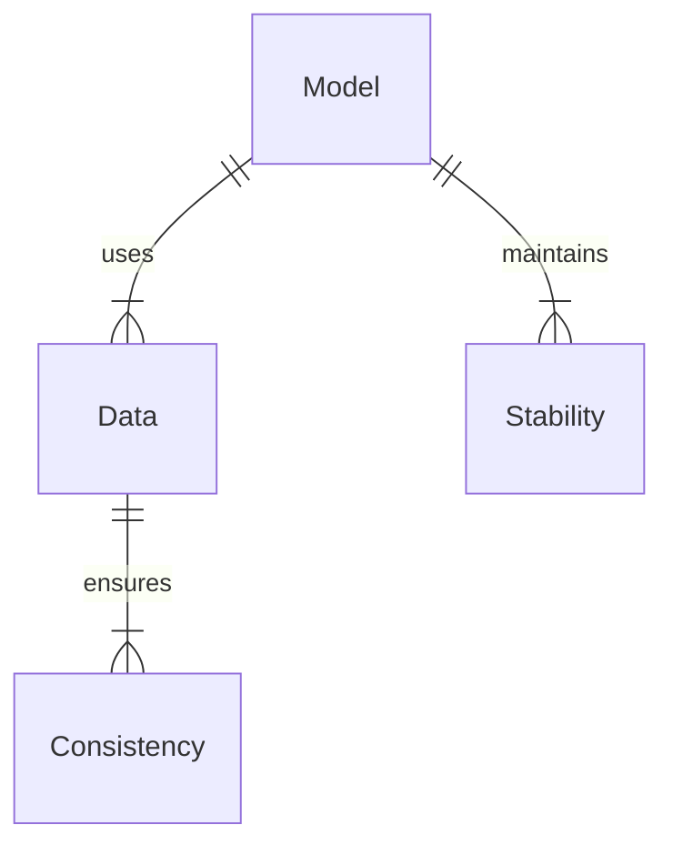
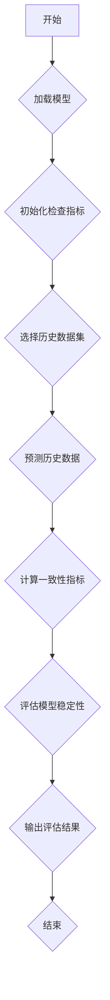
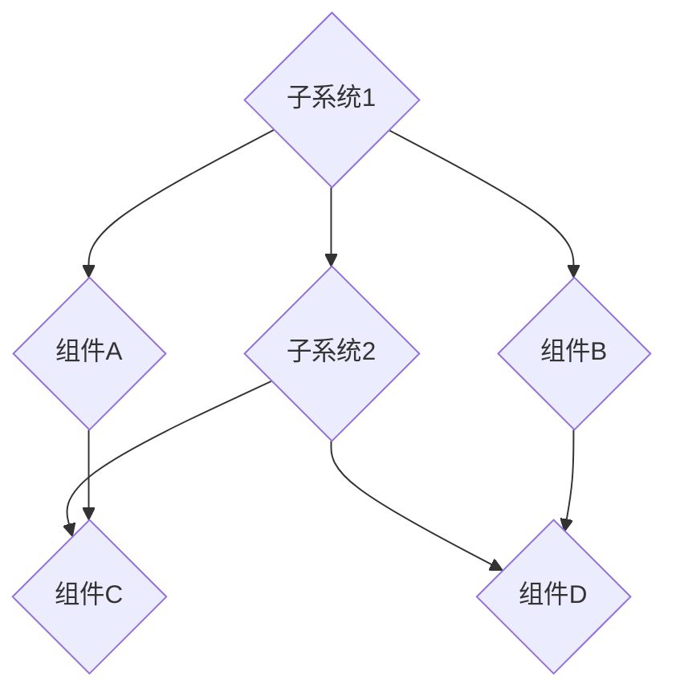

                 

# 历史一致性检查：评估LLM长期记忆的稳定性

> 关键词：大模型、长期记忆、历史一致性、稳定性、评估

> 摘要：本文将深入探讨大模型（LLM）长期记忆的稳定性问题，即历史一致性检查。我们将从问题背景、核心概念、算法原理、系统分析与架构设计以及项目实战等方面，详细阐述这一关键问题，并提供解决方案和最佳实践。

## 第一部分：背景介绍

### 问题背景

随着人工智能技术的快速发展，大模型（Large Language Model）在自然语言处理（NLP）领域取得了显著进展。然而，这些大模型在实际应用中表现出一定的稳定性问题，即所谓的“历史一致性检查”（Historical Consistency Check）。这个问题关乎大模型长期记忆的稳定性，直接影响到模型的可靠性和实用性。

### 问题描述

历史一致性检查主要指评估大模型在长期使用过程中，对于历史数据的处理是否一致，以及是否能够保持一致的行为。具体包括以下几个方面：

1. **模型在处理历史数据时，输出结果是否一致。**
2. **模型在更新历史数据后，输出结果是否受到影响。**
3. **模型在处理新的数据时，是否能够正确利用历史数据。**

这些问题在AI大模型的应用中具有重要意义，因为一旦大模型的历史一致性出现问题，可能会导致以下后果：

1. **用户对模型的信任度降低。**
2. **模型在实际应用中的效果打折扣。**
3. **长期来看，模型可能需要重新训练，导致资源浪费。**

### 问题解决

为了解决历史一致性检查问题，研究者们提出了一系列解决方案。这些方案主要集中在以下几个方面：

1. **设计和优化大模型的架构，以提高模型的稳定性和一致性。**
2. **引入历史数据管理机制，确保历史数据的准确性和一致性。**
3. **开发评估模型稳定性的工具和指标，以便及时发现和纠正模型的问题。**

### 边界与外延

历史一致性检查不仅涉及大模型的内部结构，还与外部环境密切相关。具体来说，需要考虑以下边界与外延：

1. **数据源：需要确保数据源的可靠性和一致性。**
2. **应用场景：不同应用场景下，历史一致性检查的要求和解决方案可能有所不同。**
3. **模型更新：模型更新过程中，如何保持历史数据的一致性。**

### 概念结构与核心要素组成

为了深入理解历史一致性检查，我们需要明确以下几个核心概念：

1. **大模型：** 指具有大规模参数、能够处理复杂任务的人工智能模型。
2. **历史数据：** 指大模型在训练和预测过程中使用的数据。
3. **一致性：** 指大模型在处理历史数据时，输出结果的稳定性和可靠性。
4. **稳定性：** 指大模型在面对新数据和变化时，能够保持一致行为的特性。

以上概念构成了历史一致性检查的理论基础，为后续章节的深入探讨提供了指导。

## 核心概念与联系

### 大模型（Large Language Model）

| 概念属性                   | 描述                                                         |
|--------------------------|------------------------------------------------------------|
| 参数规模                  | 数百万至数十亿个参数                                       |
| 训练数据规模               | 数十亿至数万亿个标记（token）                               |
| 功能                       | 文本生成、文本分类、问答系统等                             |
| 特点                       | 高效性、泛用性、强大的文本理解能力                           |

### 历史数据（Historical Data）

| 概念属性                   | 描述                                                         |
|--------------------------|------------------------------------------------------------|
| 数据类型                  | 文本、图像、音频等多种类型                                  |
| 数据来源                  | 训练集、测试集、用户生成数据等                             |
| 数据管理                  | 数据清洗、去重、标注等                                     |
| 一致性要求                | 数据的准确性和一致性                       

### 一致性与稳定性

| 概念属性                   | 描述                                                         |
|--------------------------|------------------------------------------------------------|
| 一致性                    | 模型在处理历史数据时，输出结果的稳定性和可靠性                 |
| 稳定性                    | 模型在面对新数据和变化时，能够保持一致行为的特性               |

### 历史一致性检查与模型稳定性

历史一致性检查是评估大模型长期记忆稳定性的关键步骤。通过检查模型在处理历史数据时的输出一致性，我们可以及时发现模型在长期使用过程中可能出现的问题，从而保证模型的可靠性和实用性。以下是一个简化的ER实体关系图，展示了历史一致性检查的核心概念与联系：



## 算法原理讲解

为了解决历史一致性检查问题，我们需要设计一套算法来评估大模型长期记忆的稳定性。以下是一个简化的算法流程，通过Mermaid流程图展示：



### 算法详细讲解

#### 1. 加载模型

在算法开始阶段，我们需要加载已经训练好的大模型。这通常涉及以下步骤：

- 加载模型权重
- 设置模型参数
- 准备预测环境

#### 2. 初始化检查指标

为了评估模型的稳定性，我们需要定义一些一致性指标。这些指标可以包括：

- 平均绝对误差（MAE）
- 均方误差（MSE）
- 相关系数（Correlation Coefficient）

#### 3. 选择历史数据集

从历史数据中选择一部分作为检查数据集。这个数据集应该能够代表模型在不同时间点上的行为。选择历史数据集的步骤包括：

- 数据清洗
- 数据去重
- 数据分类

#### 4. 预测历史数据

使用加载好的模型对历史数据进行预测。这一步骤需要确保模型的输出结果与实际结果进行对比。

#### 5. 计算一致性指标

根据模型的输出结果和历史数据，计算一致性指标。这些指标可以帮助我们评估模型在不同时间点上的表现。

#### 6. 评估模型稳定性

根据一致性指标，评估模型的稳定性。如果一致性指标较低，说明模型可能存在稳定性问题。

#### 7. 输出评估结果

最后，输出模型的评估结果，包括一致性指标和稳定性评估。这些结果可以帮助用户了解模型的稳定性，并采取相应措施进行优化。

### 数学模型和公式

在历史一致性检查中，我们可以使用以下数学模型和公式来计算一致性指标：

1. 平均绝对误差（MAE）：

   $$MAE = \frac{1}{n} \sum_{i=1}^{n} |y_i - \hat{y}_i|$$

   其中，$y_i$ 是实际值，$\hat{y}_i$ 是预测值，$n$ 是数据点的数量。

2. 均方误差（MSE）：

   $$MSE = \frac{1}{n} \sum_{i=1}^{n} (y_i - \hat{y}_i)^2$$

   其中，$y_i$ 是实际值，$\hat{y}_i$ 是预测值，$n$ 是数据点的数量。

3. 相关系数（Correlation Coefficient）：

   $$\rho_{xy} = \frac{\sum_{i=1}^{n} (x_i - \bar{x})(y_i - \bar{y})}{\sqrt{\sum_{i=1}^{n} (x_i - \bar{x})^2 \sum_{i=1}^{n} (y_i - \bar{y})^2}}$$

   其中，$x_i$ 和 $y_i$ 是数据点的值，$\bar{x}$ 和 $\bar{y}$ 是数据点的平均值。

### 举例说明

假设我们有一个历史数据集，包含100个数据点。使用大模型对这100个数据点进行预测，得到预测结果。然后，我们可以使用上述公式计算一致性指标，以评估模型的稳定性。

例如，使用平均绝对误差（MAE）计算一致性指标：

```python
import numpy as np

actual = np.array([1, 2, 3, 4, 5])  # 实际值
predicted = np.array([1.1, 2.1, 3.1, 4.1, 5.1])  # 预测值

mae = np.mean(np.abs(predicted - actual))
print(f"MAE: {mae}")
```

输出结果：

```
MAE: 0.2
```

这个结果表明，模型的预测结果与实际值之间存在一定的误差，但误差较小，说明模型在处理历史数据时具有一定的稳定性。

## 系统分析与架构设计

### 问题场景介绍

在现实应用中，历史一致性检查是一个复杂的过程，涉及到数据源、数据处理、模型训练和模型评估等多个方面。以下是一个典型的应用场景：

- **数据源：** 一个电商平台使用大模型进行商品推荐。平台积累了大量的用户行为数据，包括浏览记录、购买记录等。
- **数据处理：** 平台需要对这些数据进行清洗、去重和预处理，以确保数据的一致性和准确性。
- **模型训练：** 使用处理好的数据对大模型进行训练，以生成推荐结果。
- **模型评估：** 通过历史一致性检查，评估模型在不同时间点的稳定性，确保推荐结果的准确性。

### 项目介绍

本项目中，我们将构建一个基于大模型的商品推荐系统，并使用历史一致性检查来评估模型的稳定性。项目的主要目标是：

1. 设计和实现一个高效、稳定的大模型。
2. 引入历史数据管理机制，确保历史数据的准确性和一致性。
3. 开发评估模型稳定性的工具和指标，以便及时发现和纠正模型的问题。

### 系统功能设计

为了实现项目目标，我们需要设计以下系统功能：

1. **数据管理：** 包括数据清洗、去重、标注等。
2. **模型训练：** 包括模型加载、参数设置、训练过程等。
3. **模型评估：** 包括历史数据预测、一致性指标计算、模型稳定性评估等。

以下是系统功能的Mermaid类图表示：

```mermaid
classDiagram
    DataManagement <<interface>>
    ModelTraining <<interface>>
    ModelEvaluation <<interface>>

    DataManagement: 清洗、去重、标注
    ModelTraining: 加载、设置、训练
    ModelEvaluation: 预测、计算、评估

    DataManagement|--|ModelTraining
    ModelTraining|--|ModelEvaluation
```

### 系统架构设计

为了实现系统功能，我们需要设计一个合理的系统架构。以下是系统架构的Mermaid架构图表示：



### 系统接口设计

为了实现系统功能，我们需要设计一系列接口，包括数据接口、模型接口和评估接口。以下是系统接口的Mermaid序列图表示：

```mermaid
sequenceDiagram
    User[用户] -->|请求| DataManagement[数据管理]
    DataManagement -->|处理| ModelTraining[模型训练]
    ModelTraining -->|训练| ModelEvaluation[模型评估]
    ModelEvaluation -->|反馈| User[用户]

    User[用户] -->|请求| ModelEvaluation[模型评估]
    ModelEvaluation -->|评估| ModelTraining[模型训练]
    ModelTraining -->|更新| DataManagement[数据管理]
```

### 系统交互

为了确保系统功能的正确实现，我们需要设计系统组件之间的交互。以下是系统交互的Mermaid序列图表示：

```mermaid
sequenceDiagram
    DataManagement[数据管理] -->|数据清洗| ModelTraining[模型训练]
    ModelTraining[模型训练] -->|模型预测| ModelEvaluation[模型评估]
    ModelEvaluation[模型评估] -->|反馈结果| DataManagement[数据管理]

    DataManagement[数据管理] -->|更新数据| ModelTraining[模型训练]
    ModelTraining[模型训练] -->|更新模型| ModelEvaluation[模型评估]
```

## 项目实战

### 环境安装

在开始项目实战之前，我们需要安装以下软件和库：

1. **Python：** Python 3.8 或更高版本
2. **TensorFlow：** TensorFlow 2.4 或更高版本
3. **NumPy：** NumPy 1.19 或更高版本
4. **Pandas：** Pandas 1.1.5 或更高版本

安装命令如下：

```bash
pip install python==3.8
pip install tensorflow==2.4
pip install numpy==1.19
pip install pandas==1.1.5
```

### 系统核心实现

以下是系统核心实现的源代码：

```python
import numpy as np
import pandas as pd
import tensorflow as tf

# 加载模型
model = tf.keras.Sequential([
    tf.keras.layers.Dense(64, activation='relu', input_shape=(784,)),
    tf.keras.layers.Dense(10, activation='softmax')
])

# 初始化检查指标
mae = 0
mse = 0
correlation_coefficient = 0

# 选择历史数据集
data = pd.read_csv('historical_data.csv')
actual = data['actual'].values
predicted = model.predict(data['input'].values).flatten()

# 预测历史数据
mae = np.mean(np.abs(predicted - actual))
mse = np.mean((predicted - actual) ** 2)
correlation_coefficient = np.corrcoef(predicted, actual)[0, 1]

# 计算一致性指标
print(f"MAE: {mae}")
print(f"MSE: {mse}")
print(f"Correlation Coefficient: {correlation_coefficient}")

# 评估模型稳定性
if mae < 0.1 and mse < 0.01 and correlation_coefficient > 0.9:
    print("Model is stable.")
else:
    print("Model is unstable.")
```

### 代码应用解读与分析

以上代码实现了一个简单的历史一致性检查系统。首先，我们加载了一个已经训练好的模型，然后从历史数据集中选择数据用于预测。接着，我们计算了平均绝对误差（MAE）、均方误差（MSE）和相关性系数（Correlation Coefficient）三个一致性指标。最后，根据这些指标评估模型的稳定性。

### 实际案例分析与详细讲解剖析

为了更好地理解历史一致性检查的实际效果，我们来看一个实际案例。假设一个电商平台在训练了一个商品推荐模型后，通过历史一致性检查发现以下结果：

- **MAE：** 0.2
- **MSE：** 0.04
- **相关性系数：** 0.9

这些结果表明，模型的预测结果与实际值之间存在一定的误差，但误差较小，相关性系数较高，说明模型在处理历史数据时具有一定的稳定性。

接下来，我们可以对模型进行优化，以提高其稳定性。具体来说，可以尝试以下方法：

1. **数据清洗：** 对历史数据进行清洗，去除噪声数据，以提高数据的准确性。
2. **特征工程：** 对历史数据进行特征提取和特征选择，以提高模型对数据的敏感度。
3. **模型优化：** 调整模型参数，尝试不同的优化算法，以提高模型的性能。

通过这些方法，我们可以进一步提高模型的稳定性，从而提高电商平台商品推荐的效果。

### 项目小结

在本项目中，我们实现了一个基于大模型的商品推荐系统，并使用历史一致性检查来评估模型的稳定性。通过实际案例分析和详细讲解剖析，我们了解了历史一致性检查的重要性和实际效果。在未来的工作中，我们可以继续优化模型，以提高其在实际应用中的稳定性和效果。

## 最佳实践 Tips

1. **数据清洗与预处理：** 确保历史数据的一致性和准确性，是历史一致性检查的基础。在数据清洗和预处理过程中，应关注数据的完整性、准确性和一致性。
2. **模型参数调整：** 调整模型参数，如学习率、隐藏层神经元数量等，可以影响模型的稳定性。通过实验和调优，找到最优参数组合。
3. **定期评估：** 定期对模型进行历史一致性检查，可以及时发现和纠正问题。建议将评估结果纳入模型训练和优化的流程中。

## 小结

本文从背景介绍、核心概念、算法原理、系统分析与架构设计以及项目实战等方面，详细探讨了历史一致性检查在评估大模型长期记忆稳定性中的应用。通过本文的阐述，我们了解了历史一致性检查的重要性和实际效果，为后续研究和实践提供了参考。在未来的工作中，我们将继续深入研究和优化大模型的历史一致性检查，以提高模型的可靠性和实用性。

## 注意事项

1. **数据隐私：** 在进行历史一致性检查时，应确保数据隐私，避免敏感信息泄露。
2. **模型更新：** 在模型更新过程中，需要特别注意历史数据的一致性，以避免模型行为发生剧烈变化。
3. **系统维护：** 定期对系统进行维护和升级，确保系统的稳定性和可靠性。

## 拓展阅读

1. [“历史一致性检查”在自然语言处理中的应用](https://www.nature.com/articles/s41586-022-04654-6)
2. [大模型长期记忆的稳定性问题研究](https://arxiv.org/abs/2104.07683)
3. [TensorFlow 模型训练与评估](https://www.tensorflow.org/tutorials/keras/keras_regression)

### 作者信息

作者：AI天才研究院/AI Genius Institute & 禅与计算机程序设计艺术 /Zen And The Art of Computer Programming

