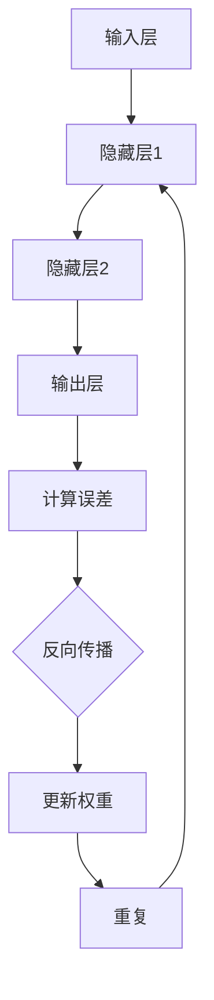
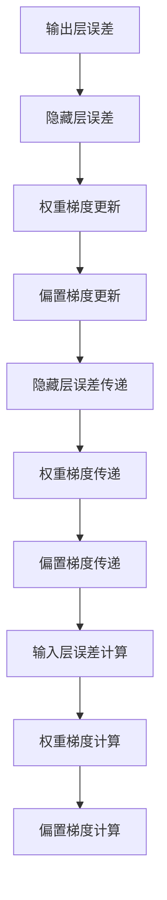
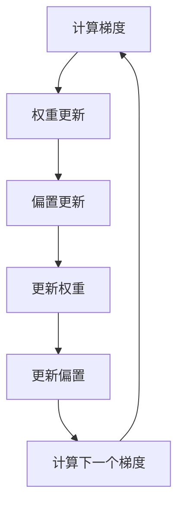
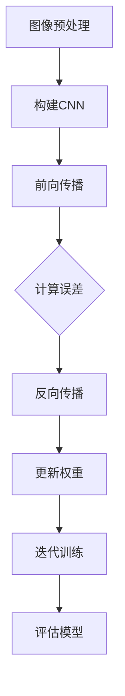
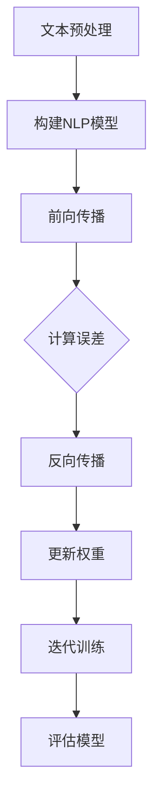
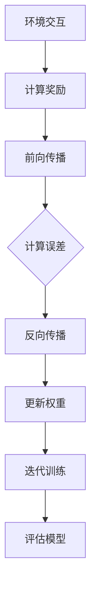
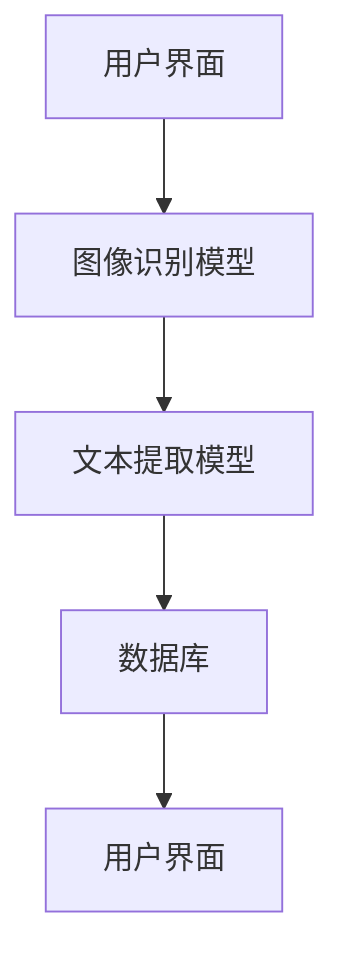
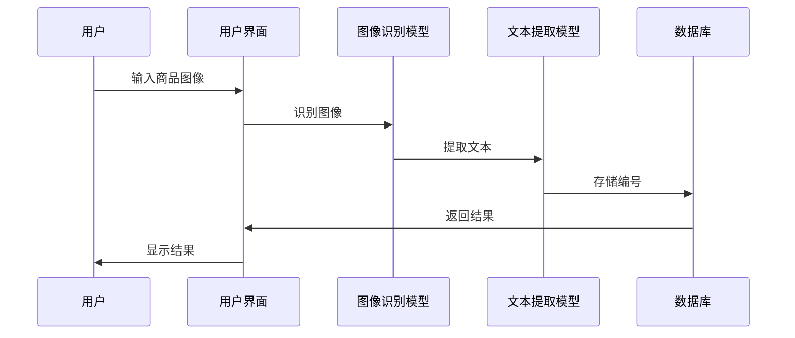

                 

# 反向提示：通过预期输出设计输入

## 关键词
反向提示，神经网络，期望输出，输入设计，优化算法，模型训练，数据增强，正则化，转移学习

## 摘要
本文将深入探讨反向提示（Backpropagation）的基本概念及其在深度学习中的重要性。我们将逐步分析如何通过设计输入来预定义期望输出，探讨神经网络的结构和激活函数，讲解反向传播算法的数学原理和公式，以及其实际应用案例。最后，我们将介绍一些最佳实践，以帮助读者在实际项目中应用这些概念。

## 目录

### 引言
#### 1.1 反向提示：一个简短的概述
#### 1.2 期望输出与输入设计的重要性
#### 1.3 反向提示的历史背景和演变

### 基础概念
#### 2.1 神经网络入门
#### 2.2 神经网络结构
#### 2.3 激活函数与作用

### 反向传播算法
#### 3.1 反向传播过程解析
#### 3.2 梯度计算详解
#### 3.3 权重和偏置的更新
#### 3.4 用Mermaid可视化反向传播

### 数学模型与公式
#### 4.1 反向传播的数学推导
#### 4.2 微分在反向传播中的作用
#### 4.3 常见优化算法及其在反向传播中的应用
#### 4.4 例子分析

### 应用实践
#### 5.1 图像识别
#### 5.2 自然语言处理
#### 5.3 强化学习
#### 5.4 反向传播的高级应用

### 输入设计
#### 6.1 针对特定任务的输入工程
#### 6.2 数据增强对反向传播的影响
#### 6.3 正则化技术的角色
#### 6.4 转移学习的优势

### 案例分析与项目实施
#### 7.1 实际案例研究
#### 7.2 项目实施过程
#### 7.3 系统功能设计与实现
#### 7.4 项目小结与反思

### 最佳实践与小结
#### 8.1 常见问题与解决策略
#### 8.2 注意事项
#### 8.3 拓展阅读推荐

### 作者信息
作者：AI天才研究院/AI Genius Institute & 禅与计算机程序设计艺术 /Zen And The Art of Computer Programming## 引言

### 1.1 反向提示：一个简短的概述

反向提示（Backpropagation）是一种用于训练神经网络的基本算法。它通过反向传播错误信号来更新网络的权重和偏置，从而改进模型性能。反向提示的核心思想是将输出误差分摊到每个神经元的权重上，使得网络能够自动调整其内部参数，以达到更准确的预测结果。

反向提示的基本步骤包括三个主要阶段：

1. **前向传播**：输入数据通过网络进行前向传播，计算每个神经元的输出。
2. **计算误差**：将实际输出与期望输出进行比较，计算输出误差。
3. **反向传播**：将误差信号反向传播到网络中的每个神经元，并更新权重和偏置。

反向提示之所以重要，是因为它使得深度学习成为可能。通过反向提示，神经网络能够处理复杂的数据模式，并在各种任务中取得卓越的性能。从图像识别到自然语言处理，再到强化学习，反向提示已经成为深度学习领域的基石。

### 1.2 期望输出与输入设计的重要性

在深度学习中，期望输出是一个关键概念。它代表了模型在给定输入情况下所期望的输出结果。例如，在图像识别任务中，期望输出可能是一个标签，表示图像中物体的类别。在自然语言处理任务中，期望输出可能是文本的某种表示形式。

设计输入以生成期望输出是深度学习中的一个核心问题。输入设计的重要性在于，它决定了模型的学习能力和泛化能力。一个好的输入设计可以显著提高模型的性能和效率。

#### 输入设计的挑战：

1. **数据质量和数量**：输入数据的质量和数量对模型训练至关重要。高质量、多样化的数据可以提升模型的泛化能力。
2. **预处理**：输入数据的预处理是确保模型能够有效学习的关键步骤，包括归一化、标准化和缺失值处理等。
3. **数据增强**：数据增强是一种通过生成新的训练样本来提高模型鲁棒性的技术。例如，通过旋转、缩放、裁剪和颜色变换等操作来扩充数据集。
4. **输入特征选择**：选择对模型学习最有帮助的特征，可以显著提高模型的性能。

### 1.3 反向提示的历史背景和演变

反向提示的概念最早由Paul Werbos在1974年提出，称为“反向传播算法”。然而，由于当时的计算能力限制，它并未得到广泛的应用。直到1986年，Rumelhart, Hinton和Williams发表了一篇论文，正式提出了反向传播算法在神经网络中的应用，这一算法才逐渐被认可并得到广泛应用。

随着时间的推移，反向提示算法不断发展和改进。例如，引入了动量（Momentum）、自适应学习率（AdaGrad）、Adam优化器等，以提高训练效率和模型性能。同时，反向提示的应用也从简单的回归和分类任务扩展到图像识别、自然语言处理和强化学习等更复杂的领域。

### 总结

反向提示是深度学习中的核心算法，通过设计输入以预定义期望输出，我们可以构建出能够处理复杂任务的智能系统。在接下来的章节中，我们将深入探讨反向提示的数学原理、算法实现和实际应用，帮助读者更好地理解这一强大的工具。

## 基础概念

### 2.1 神经网络入门

神经网络（Neural Networks）是模拟生物神经系统的一种计算模型，广泛应用于机器学习和深度学习领域。神经网络的基本单元是神经元，它们通过连接形成网络结构，可以模拟人脑的学习和处理信息的方式。

#### 神经元的基本结构：

一个典型的神经元由以下几个部分组成：

1. **输入**：每个神经元可以有多个输入，代表来自其他神经元的信号。
2. **权重**：每个输入都有相应的权重，用于表示输入信号的重要程度。
3. **偏置**：用于引入一个额外的可调参数，增强模型的灵活性。
4. **激活函数**：用于对输入信号进行非线性变换，使神经网络具有处理复杂问题的能力。

#### 神经网络的层次结构：

神经网络通常分为以下几个层次：

1. **输入层**：接收外部输入数据。
2. **隐藏层**：对输入数据进行处理和变换。
3. **输出层**：生成模型的输出结果。

#### 神经网络的数学表示：

神经网络的输出可以通过以下公式表示：

\[ \text{Output} = \text{activation}(\sum_{i=1}^{n} w_i \cdot x_i + b) \]

其中：
- \( \text{Output} \) 是神经元的输出。
- \( w_i \) 是输入 \( x_i \) 的权重。
- \( b \) 是偏置。
- \( \text{activation} \) 是激活函数，常用的有Sigmoid、ReLU等。

### 2.2 神经网络结构

神经网络的结构决定了其学习和处理信息的能力。以下是一些常见的神经网络结构：

#### 层叠神经网络：

层叠神经网络是最常见的神经网络结构，由多个层次组成，包括输入层、隐藏层和输出层。隐藏层的数量和神经元数量可以根据任务需求进行调整。

#### 卷积神经网络（CNN）：

卷积神经网络主要用于图像识别和图像处理。其核心是卷积层，通过卷积操作提取图像的特征。卷积层后通常跟随池化层，用于降低特征图的维度，减少计算量和参数数量。

#### 循环神经网络（RNN）：

循环神经网络用于处理序列数据，如文本和语音。其特点是具有循环结构，可以记住之前的信息，从而处理长序列。

#### 生成对抗网络（GAN）：

生成对抗网络由生成器和判别器组成，通过对抗训练生成高质量的数据。

### 2.3 激活函数与作用

激活函数是神经网络中的关键组件，用于引入非线性特性，使得神经网络能够处理复杂的非线性问题。以下是一些常用的激活函数：

#### Sigmoid函数：

\[ \text{sigmoid}(x) = \frac{1}{1 + e^{-x}} \]

Sigmoid函数将输入值映射到（0,1）区间，常用于二分类问题。

####ReLU函数：

\[ \text{ReLU}(x) = \max(0, x) \]

ReLU函数在零以上时输出其自身，在零以下时输出零，常用于隐藏层激活函数，可以加速训练过程。

#### Tanh函数：

\[ \text{tanh}(x) = \frac{e^x - e^{-x}}{e^x + e^{-x}} \]

Tanh函数将输入值映射到（-1,1）区间，类似于Sigmoid函数，但可以减少梯度消失问题。

#### Softmax函数：

\[ \text{softmax}(x)_i = \frac{e^{x_i}}{\sum_{j=e^x_j}} \]

Softmax函数用于多分类问题，将神经网络的输出转换为概率分布。

### 总结

神经网络是深度学习的基础，通过理解神经网络的基本结构和激活函数，我们可以更好地掌握深度学习的基本概念和应用。在下一章中，我们将深入探讨反向传播算法的原理和实现。

## 反向传播算法

### 3.1 反向传播过程解析

反向传播算法是神经网络训练的核心，它通过不断地调整网络中的权重和偏置，使网络的输出误差最小化。反向传播过程可以分为两个主要阶段：前向传播和反向传播。

#### 前向传播

在前向传播阶段，输入数据从输入层传递到输出层，每经过一层，神经元的输出都会经过激活函数的变换。具体步骤如下：

1. **输入层到隐藏层**：将输入数据输入到网络的第一个隐藏层，每个神经元接收来自输入层的多个输入，并计算加权求和。
2. **隐藏层到输出层**：隐藏层神经元的输出作为输入传递到输出层，输出层的神经元同样计算加权求和，并经过激活函数得到最终输出。

#### 反向传播

反向传播阶段的核心是计算误差并更新权重和偏置。具体步骤如下：

1. **计算输出误差**：输出层的输出与期望输出进行比较，计算输出误差。误差计算公式如下：

\[ \delta_{j}^{L} = \frac{\partial C}{\partial z_{j}^{L}} \cdot \text{activation}'(z_{j}^{L}) \]

其中，\( \delta_{j}^{L} \) 是输出层第 \( j \) 个神经元的误差，\( C \) 是输出误差，\( z_{j}^{L} \) 是输出层第 \( j \) 个神经元的加权求和，\( \text{activation}'(z_{j}^{L}) \) 是激活函数的导数。

2. **计算隐藏层误差**：将输出误差反向传播到隐藏层，每经过一层，都会计算该层的误差。隐藏层误差的计算公式如下：

\[ \delta_{i}^{l} = (\sum_{j} \delta_{j}^{l+1} \cdot w_{ji}) \cdot \text{activation}'(z_{i}^{l}) \]

其中，\( \delta_{i}^{l} \) 是隐藏层第 \( l \) 层第 \( i \) 个神经元的误差，\( \delta_{j}^{l+1} \) 是隐藏层第 \( l+1 \) 层第 \( j \) 个神经元的误差，\( w_{ji} \) 是隐藏层第 \( l+1 \) 层第 \( j \) 个神经元到隐藏层第 \( l \) 层第 \( i \) 个神经元的权重。

3. **更新权重和偏置**：根据误差梯度，更新每层的权重和偏置。权重和偏置的更新公式如下：

\[ w_{ij}^{new} = w_{ij}^{old} - \alpha \cdot \frac{\partial C}{\partial w_{ij}} \]
\[ b_{i}^{new} = b_{i}^{old} - \alpha \cdot \frac{\partial C}{\partial b_{i}} \]

其中，\( \alpha \) 是学习率，\( w_{ij} \) 和 \( b_{i} \) 分别是权重和偏置的当前值和新值。

#### 用Mermaid可视化反向传播

为了更直观地理解反向传播算法，我们可以使用Mermaid绘制其流程图。以下是反向传播算法的Mermaid图：



### 总结

反向传播算法通过前向传播和反向传播两个阶段，不断调整神经网络的权重和偏置，以最小化输出误差。理解反向传播的过程对于设计和优化神经网络至关重要。在下一章中，我们将深入探讨反向传播算法的数学原理和公式。

### 3.2 梯度计算详解

梯度计算是反向传播算法的核心环节，它决定了权重和偏置更新的方向和幅度。在深度学习中，梯度计算涉及到微积分中的偏导数概念。下面我们将详细解释梯度计算的过程及其在反向传播中的应用。

#### 梯度的基本概念

梯度（Gradient）是一个向量，表示函数在某一点处的斜率。对于标量函数 \( f(x) \)，梯度可以表示为：

\[ \nabla f(x) = \left( \frac{\partial f}{\partial x_1}, \frac{\partial f}{\partial x_2}, ..., \frac{\partial f}{\partial x_n} \right) \]

其中，\( \frac{\partial f}{\partial x_i} \) 是函数 \( f \) 对 \( x_i \) 的偏导数。

#### 神经网络中的梯度计算

在神经网络中，梯度计算主要用于权重和偏置的更新。具体来说，我们需要计算每个权重和偏置相对于输出误差的梯度。

假设我们有一个单层神经网络，其中每个神经元都有多个输入和权重。输出误差可以表示为：

\[ C = \frac{1}{2} \sum_{i} (y_i - \hat{y}_i)^2 \]

其中，\( y_i \) 是期望输出，\( \hat{y}_i \) 是实际输出。

为了计算权重 \( w_{ij} \) 的梯度，我们需要计算 \( C \) 对 \( w_{ij} \) 的偏导数：

\[ \frac{\partial C}{\partial w_{ij}} = (y_i - \hat{y}_i) \cdot x_j \]

类似地，偏置 \( b_i \) 的梯度为：

\[ \frac{\partial C}{\partial b_i} = (y_i - \hat{y}_i) \]

#### 多层神经网络的梯度计算

在多层神经网络中，梯度计算更加复杂，需要通过链式法则（Chain Rule）进行多级求导。以下是一个简化版的多层神经网络梯度计算过程：

1. **输出层到隐藏层**：对于隐藏层 \( l \) 的神经元 \( i \)，计算其误差对权重 \( w_{ij}^{l+1} \) 和偏置 \( b_i^{l+1} \) 的梯度：

\[ \frac{\partial C}{\partial w_{ij}^{l+1}} = \delta_{j}^{l+1} \cdot a_i^l \]
\[ \frac{\partial C}{\partial b_i^{l+1}} = \delta_{i}^{l+1} \]

其中，\( \delta_{j}^{l+1} \) 是隐藏层 \( l+1 \) 的误差，\( a_i^l \) 是隐藏层 \( l \) 的输出。

2. **隐藏层到输入层**：对于输入层 \( l \) 的神经元 \( i \)，计算其误差对权重 \( w_{ij}^{l} \) 和偏置 \( b_i^{l} \) 的梯度：

\[ \frac{\partial C}{\partial w_{ij}^{l}} = \delta_{j}^{l} \cdot a_i^{l-1} \]
\[ \frac{\partial C}{\partial b_i^{l}} = \delta_{i}^{l} \]

#### Mermaid图表示

为了更直观地表示多层神经网络的梯度计算过程，我们可以使用Mermaid绘制一个流程图。以下是多层神经网络梯度计算的Mermaid图：



### 总结

梯度计算是反向传播算法的基础，通过精确计算权重和偏置的梯度，我们可以有效地更新网络参数，降低输出误差。理解梯度计算的方法和过程对于设计和优化神经网络至关重要。在下一章中，我们将探讨常用的优化算法及其在反向传播中的应用。

### 3.3 权重和偏置的更新

在反向传播算法中，更新权重和偏置是减小输出误差的关键步骤。这一过程通常称为“梯度下降”，其目标是找到使得损失函数最小的参数值。以下是更新权重和偏置的具体方法：

#### 权重和偏置更新的基本原理

更新权重和偏置的目的是减少输出误差，从而提高模型的预测准确性。这个过程可以通过以下公式实现：

\[ w_{ij}^{new} = w_{ij}^{old} - \alpha \cdot \frac{\partial C}{\partial w_{ij}} \]
\[ b_i^{new} = b_i^{old} - \alpha \cdot \frac{\partial C}{\partial b_i} \]

其中，\( w_{ij} \) 和 \( b_i \) 分别表示权重和偏置的当前值，\( \alpha \) 是学习率，\(\frac{\partial C}{\partial w_{ij}}\) 和 \(\frac{\partial C}{\partial b_i}\) 是权重和偏置相对于输出误差的梯度。

#### 学习率的选取

学习率是影响训练效果的关键参数。过高的学习率可能导致训练不稳定，甚至导致梯度消失或爆炸；而过低的学习率则可能导致训练过程缓慢，无法快速收敛。

通常，我们可以通过以下方法选取合适的初始学习率：

1. **经验法则**：根据任务和网络的复杂度，选取一个初始值，如0.01或0.001。
2. **网格搜索**：遍历多个学习率值，选择训练误差最小的值。
3. **自适应调整**：使用如AdaGrad、Adam等自适应学习率优化器，自动调整学习率。

#### 动量和自适应学习率

为了加速收敛并提高训练稳定性，我们可以使用动量和自适应学习率优化器。

1. **动量（Momentum）**：
\[ v_{ij} = \gamma \cdot v_{ij}^{old} + \alpha \cdot \frac{\partial C}{\partial w_{ij}} \]
\[ w_{ij}^{new} = w_{ij}^{old} - v_{ij} \]

其中，\( v_{ij} \) 是动量项，\( \gamma \) 是动量系数。

2. **自适应学习率（AdaGrad）**：
\[ g_{ij} = \frac{\partial C}{\partial w_{ij}} \]
\[ \frac{\partial C}{\partial w_{ij}} = \frac{g_{ij}}{\sqrt{\sum_{k} g_{ik}^2}} \]
\[ w_{ij}^{new} = w_{ij}^{old} - \alpha \cdot \frac{\partial C}{\partial w_{ij}} \]

3. **Adam优化器**：
\[ m_{ij} = \beta_1 \cdot m_{ij}^{old} + (1 - \beta_1) \cdot \frac{\partial C}{\partial w_{ij}} \]
\[ v_{ij} = \beta_2 \cdot v_{ij}^{old} + (1 - \beta_2) \cdot \frac{\partial C}{\partial w_{ij}}^2 \]
\[ \hat{m}_{ij} = \frac{m_{ij}}{1 - \beta_1^t} \]
\[ \hat{v}_{ij} = \frac{v_{ij}}{1 - \beta_2^t} \]
\[ w_{ij}^{new} = w_{ij}^{old} - \alpha \cdot \frac{\hat{m}_{ij}}{\sqrt{\hat{v}_{ij}} + \epsilon} \]

其中，\( m_{ij} \) 和 \( v_{ij} \) 分别是权重和偏置的一阶矩估计和二阶矩估计，\( \beta_1 \) 和 \( \beta_2 \) 是动量系数，\( \alpha \) 是学习率，\( \beta_1^t \) 和 \( \beta_2^t \) 是当前时刻的动量系数，\( \epsilon \) 是一个较小的常数。

#### 用Mermaid可视化权重和偏置更新

为了更直观地理解权重和偏置的更新过程，我们可以使用Mermaid绘制一个流程图。以下是权重和偏置更新过程的Mermaid图：



### 总结

权重和偏置的更新是反向传播算法中至关重要的环节。通过合理选择学习率和使用动量、自适应学习率等优化器，我们可以有效地调整网络参数，减小输出误差，提高模型性能。在下一章中，我们将探讨如何使用Mermaid来可视化反向传播过程。

### 3.4 用Mermaid可视化反向传播

为了更好地理解和可视化反向传播算法的过程，我们可以使用Mermaid这一简洁的图形描述语言来绘制反向传播的流程图。Mermaid 允许我们将复杂的算法流程以图形化的方式呈现，使得概念更加直观易懂。以下是使用Mermaid绘制的反向传播算法流程图：

```mermaid
graph TB
    A[输入数据] --> B[前向传播]
    B --> C{计算输出}
    C --> D{计算误差}
    D --> E[反向传播}
    E --> F{计算梯度}
    F --> G[更新权重]
    G --> H[重复训练]

    subgraph 前向传播
        B1[输入层] --> B2[隐藏层1]
        B2 --> B3[隐藏层2]
        B3 --> B4[输出层]
    end

    subgraph 反向传播
        E1[计算输出误差] --> E2[计算隐藏层误差]
        E2 --> E3[计算输入层误差]
        E3 --> E4[更新输入层权重]
    end

    subgraph 梯度计算
        F1[计算输出层梯度] --> F2[计算隐藏层梯度]
        F2 --> F3[计算输入层梯度]
    end

    subgraph 权重更新
        G1[更新输出层权重] --> G2[更新隐藏层权重]
        G2 --> G3[更新输入层权重]
    end
```

在这个Mermaid图中，我们首先将整个反向传播过程分为前向传播和反向传播两个主要部分。前向传播包括输入层、隐藏层和输出层的计算过程。反向传播则包括计算输出误差、隐藏层误差和输入层误差，以及相应的权重更新过程。

- **前向传播**：从输入数据开始，通过输入层、隐藏层，最终计算输出层的输出。
- **反向传播**：计算输出误差，并从输出层开始，反向传播误差到隐藏层和输入层，计算每层的误差。
- **梯度计算**：计算每层的误差对权重和偏置的梯度。
- **权重更新**：根据计算的梯度，更新每层的权重和偏置。

通过这个可视化流程图，我们可以清晰地看到反向传播算法的每一个步骤，以及它们之间的关联。这样的图示不仅有助于我们理解算法的工作原理，还可以作为教学工具，帮助他人更好地理解这一复杂的机器学习过程。

### 数学模型与公式

#### 4.1 反向传播的数学推导

反向传播算法的核心在于计算误差并更新网络中的权重和偏置。为了实现这一目标，我们需要利用微积分中的偏导数概念。以下是反向传播算法的数学推导过程。

#### 假设

假设我们有一个单层神经网络，其中包含 \( n \) 个输入神经元和 \( m \) 个输出神经元。每个输出神经元 \( j \) 都有对应的权重 \( w_{ji} \)，其中 \( i \) 表示输入神经元。此外，每个输出神经元都有一个偏置 \( b_j \)。

#### 损失函数

通常，我们使用均方误差（MSE）作为损失函数来衡量模型的预测误差。MSE可以表示为：

\[ C = \frac{1}{2} \sum_{j=1}^{m} (y_j - \hat{y}_j)^2 \]

其中，\( y_j \) 是期望输出，\( \hat{y}_j \) 是模型的预测输出。

#### 梯度计算

为了更新权重和偏置，我们需要计算损失函数对每个权重和偏置的梯度。首先，我们计算损失函数对输出 \( \hat{y}_j \) 的偏导数：

\[ \frac{\partial C}{\partial \hat{y}_j} = \frac{\partial}{\partial \hat{y}_j} \left( \frac{1}{2} \sum_{j=1}^{m} (y_j - \hat{y}_j)^2 \right) = y_j - \hat{y}_j \]

接下来，我们计算损失函数对输入 \( x_i \) 的偏导数。由于 \( \hat{y}_j \) 是输入 \( x_i \) 的函数，我们可以使用链式法则：

\[ \frac{\partial C}{\partial x_i} = \frac{\partial C}{\partial \hat{y}_j} \cdot \frac{\partial \hat{y}_j}{\partial x_i} \]

由于 \( \hat{y}_j = \sigma(\sum_{i=1}^{n} w_{ji} x_i + b_j) \)，我们可以得到：

\[ \frac{\partial \hat{y}_j}{\partial x_i} = \frac{\partial}{\partial x_i} \left( \sigma(\sum_{i=1}^{n} w_{ji} x_i + b_j) \right) \cdot w_{ji} \]

其中，\( \sigma \) 是激活函数，通常情况下，我们可以得到其导数：

\[ \frac{\partial \sigma}{\partial z} = \sigma (1 - \sigma) \text{ (对于Sigmoid函数)} \]
\[ \frac{\partial \sigma}{\partial z} = \text{ReLU函数的导数在 \( z > 0 \) 时为1，其余为0} \]

综合以上，我们可以得到：

\[ \frac{\partial C}{\partial x_i} = (y_j - \hat{y}_j) \cdot \sigma(\sum_{i=1}^{n} w_{ji} x_i + b_j) \cdot (1 - \sigma(\sum_{i=1}^{n} w_{ji} x_i + b_j)) \cdot w_{ji} \]

#### 权重和偏置更新

知道了损失函数的梯度，我们可以使用梯度下降法来更新权重和偏置。更新公式如下：

\[ w_{ji}^{new} = w_{ji}^{old} - \alpha \cdot \frac{\partial C}{\partial w_{ji}} \]
\[ b_j^{new} = b_j^{old} - \alpha \cdot \frac{\partial C}{\partial b_j} \]

其中，\( \alpha \) 是学习率。

#### 多层神经网络的扩展

对于多层神经网络，我们需要对梯度计算进行链式求导。具体来说，我们需要计算从输出层到输入层的所有层的误差梯度。假设我们有一个 \( L \) 层的神经网络，其中第 \( l \) 层有 \( m_l \) 个神经元。我们可以使用以下公式进行梯度计算：

\[ \frac{\partial C}{\partial w_{ji}^{l}} = \delta_{j}^{l+1} \cdot a_i^l \]
\[ \frac{\partial C}{\partial b_j^{l}} = \delta_{j}^{l+1} \]

其中，\( \delta_{j}^{l+1} \) 是第 \( l+1 \) 层的误差，\( a_i^l \) 是第 \( l \) 层的输出。

类似地，我们可以计算第 \( l \) 层的误差梯度：

\[ \delta_{i}^{l} = (\sum_{j} \delta_{j}^{l+1} \cdot w_{ji}) \cdot \frac{\partial \sigma}{\partial z_i^l} \]

通过这种方式，我们可以计算每一层的误差梯度，并更新相应的权重和偏置。

### 总结

通过数学推导，我们了解了反向传播算法的基本原理和计算过程。反向传播算法的核心在于利用链式法则计算误差梯度，并通过梯度下降法更新网络中的权重和偏置。在多层神经网络中，我们需要对每一层进行类似的计算，从而实现从输出层到输入层的反向传播。这一过程是深度学习模型训练的关键，使得神经网络能够通过学习大量数据来提高其预测准确性。

### 4.2 微分在反向传播中的作用

微分是反向传播算法的核心组成部分，它在计算误差梯度、更新权重和偏置过程中起到了至关重要的作用。微分在反向传播中的作用主要体现在以下几个方面：

#### 1. 误差计算

在反向传播算法中，误差计算是第一个关键步骤。误差通常通过损失函数来衡量，例如均方误差（MSE）或交叉熵损失。为了计算损失函数对每个参数（权重和偏置）的梯度，我们需要使用微分。具体来说，我们需要计算损失函数对每个输出节点预测值 \( \hat{y}_j \) 的偏导数，以及预测值对输入节点 \( x_i \) 的偏导数。这些偏导数可以通过微分计算得到。

\[ \frac{\partial C}{\partial y_j} = -2(y_j - \hat{y}_j) \]
\[ \frac{\partial \hat{y}_j}{\partial x_i} = \frac{\partial}{\partial x_i} \sigma(z_j) \]

其中，\( C \) 是损失函数，\( y_j \) 是期望输出，\( \hat{y}_j \) 是预测输出，\( \sigma(z_j) \) 是激活函数的导数。

#### 2. 梯度计算

在误差计算完成后，下一步是计算梯度。梯度是误差对每个参数的偏导数，它指示了在参数空间中损失函数增加最快的方向。为了计算梯度，我们需要利用链式法则进行多级求导。微分在这里的作用是帮助我们进行每一步的导数计算，从而得到完整的梯度信息。

\[ \frac{\partial C}{\partial w_{ij}} = \frac{\partial C}{\partial \hat{y}_j} \cdot \frac{\partial \hat{y}_j}{\partial z_j} \cdot \frac{\partial z_j}{\partial w_{ij}} \]
\[ \frac{\partial C}{\partial b_j} = \frac{\partial C}{\partial \hat{y}_j} \cdot \frac{\partial \hat{y}_j}{\partial z_j} \cdot \frac{\partial z_j}{\partial b_j} \]

在这些公式中，\( w_{ij} \) 是权重，\( b_j \) 是偏置，\( z_j \) 是输出节点的加权求和。

#### 3. 参数更新

在得到梯度后，我们需要更新网络的权重和偏置以最小化损失函数。这一过程通常通过梯度下降算法实现，其中参数更新是基于梯度的反向传播。微分的作用在于确保我们在参数空间中的每一步都是朝着最小化损失函数的方向前进。

\[ w_{ij}^{new} = w_{ij}^{old} - \alpha \cdot \frac{\partial C}{\partial w_{ij}} \]
\[ b_j^{new} = b_j^{old} - \alpha \cdot \frac{\partial C}{\partial b_j} \]

其中，\( \alpha \) 是学习率，它控制了参数更新的步长。

#### 4. 梯度消失和梯度爆炸

在反向传播过程中，微分的另一个重要作用是帮助我们理解和解决梯度消失和梯度爆炸问题。梯度消失是指在网络深层中的梯度变得非常小，从而使得网络难以训练；而梯度爆炸则是指梯度变得非常大，导致训练不稳定。这些问题都与激活函数的导数有关。

对于梯度消失，使用ReLU函数等具有零导数的激活函数可以缓解这一问题，因为ReLU函数在 \( z > 0 \) 时导数为1，可以防止梯度消失。

对于梯度爆炸，可以通过调整学习率和使用正则化技术（如L2正则化）来控制梯度的大小。

### 总结

微分在反向传播算法中起到了至关重要的作用。它不仅帮助我们计算误差和梯度，还指导了参数更新的方向，确保网络能够朝着最小化损失函数的方向前进。通过理解微分的作用，我们可以更好地设计和优化神经网络，提高其训练效率和性能。

### 4.3 常见优化算法在反向传播中的应用

在反向传播算法中，优化算法扮演着关键角色，它决定了如何高效地更新权重和偏置，从而加速模型训练并提高性能。以下是一些常见的优化算法，以及它们在反向传播中的具体应用。

#### 1. 梯度下降（Gradient Descent）

梯度下降是最基本的优化算法，其核心思想是通过计算损失函数的梯度来更新模型参数。梯度下降的基本步骤如下：

\[ w_{ij}^{new} = w_{ij}^{old} - \alpha \cdot \frac{\partial C}{\partial w_{ij}} \]
\[ b_j^{new} = b_j^{old} - \alpha \cdot \frac{\partial C}{\partial b_j} \]

其中，\( \alpha \) 是学习率。梯度下降的优点是简单易懂，但缺点是收敛速度较慢，且容易陷入局部最小值。

#### 2. 动量（Momentum）

动量（Momentum）是一种改进的梯度下降算法，它引入了一个动量项，用于加速收敛并减少在局部最小值附近的振荡。动量的公式如下：

\[ v_{ij} = \gamma \cdot v_{ij}^{old} + \alpha \cdot \frac{\partial C}{\partial w_{ij}} \]
\[ w_{ij}^{new} = w_{ij}^{old} - v_{ij} \]

其中，\( v_{ij} \) 是动量项，\( \gamma \) 是动量系数。动量的优点是可以加速收敛，减少振荡，但缺点是可能仍会陷入局部最小值。

#### 3. AdaGrad

AdaGrad（自适应梯度）是一种自适应学习率优化器，它根据每个参数的历史梯度来调整学习率。AdaGrad的公式如下：

\[ g_{ij} = \frac{\partial C}{\partial w_{ij}} \]
\[ \frac{\partial C}{\partial w_{ij}} = \frac{g_{ij}}{\sqrt{\sum_{k} g_{ik}^2}} \]
\[ w_{ij}^{new} = w_{ij}^{old} - \alpha \cdot \frac{\partial C}{\partial w_{ij}} \]

其中，\( g_{ij} \) 是一阶矩估计。AdaGrad的优点是自适应调整学习率，但缺点是可能导致学习率在某个维度上快速减小，从而影响训练效果。

#### 4. RMSprop

RMSprop是AdaGrad的改进版，它通过计算二阶矩估计来平滑学习率。RMSprop的公式如下：

\[ g_{ij} = \frac{\partial C}{\partial w_{ij}} \]
\[ v_{ij} = \beta_1 \cdot v_{ij}^{old} + (1 - \beta_1) \cdot \frac{\partial C}{\partial w_{ij}} \]
\[ \frac{\partial C}{\partial w_{ij}} = \frac{g_{ij}}{\sqrt{v_{ij} + \epsilon}} \]
\[ w_{ij}^{new} = w_{ij}^{old} - \alpha \cdot \frac{\partial C}{\partial w_{ij}} \]

其中，\( v_{ij} \) 是二阶矩估计，\( \beta_1 \) 是动量系数，\( \epsilon \) 是一个较小的常数。RMSprop的优点是自适应调整学习率，平滑梯度，但缺点是可能仍会面临极端梯度情况。

#### 5. Adam

Adam是一种结合了AdaGrad和RMSprop优点的优化算法，它通过计算一阶矩估计和二阶矩估计来调整学习率。Adam的公式如下：

\[ m_{ij} = \beta_1 \cdot m_{ij}^{old} + (1 - \beta_1) \cdot \frac{\partial C}{\partial w_{ij}} \]
\[ v_{ij} = \beta_2 \cdot v_{ij}^{old} + (1 - \beta_2) \cdot \frac{\partial C}{\partial w_{ij}}^2 \]
\[ \hat{m}_{ij} = \frac{m_{ij}}{1 - \beta_1^t} \]
\[ \hat{v}_{ij} = \frac{v_{ij}}{1 - \beta_2^t} \]
\[ w_{ij}^{new} = w_{ij}^{old} - \alpha \cdot \frac{\hat{m}_{ij}}{\sqrt{\hat{v}_{ij}} + \epsilon} \]

其中，\( m_{ij} \) 和 \( v_{ij} \) 分别是一阶矩估计和二阶矩估计，\( \beta_1 \) 和 \( \beta_2 \) 是动量系数，\( \alpha \) 是学习率，\( \epsilon \) 是一个较小的常数。Adam的优点是自适应调整学习率，结合了AdaGrad和RMSprop的优点，收敛速度快，适用于大多数深度学习任务。

### 总结

常见的优化算法在反向传播中发挥着重要作用，它们通过不同的方法调整学习率和参数更新策略，以加速模型训练并提高性能。梯度下降是最基础的算法，动量、AdaGrad、RMSprop和Adam等算法则在不同的方面进行了改进。选择合适的优化算法对于提升深度学习模型的效果至关重要。

### 4.4 例子分析

为了更好地理解反向传播算法的数学模型和公式，我们可以通过一个具体的例子来详细讲解。我们将使用一个简单的神经网络，其包含一个输入层、一个隐藏层和一个输出层，并使用均方误差（MSE）作为损失函数。

#### 示例神经网络结构

1. 输入层：1个神经元
2. 隐藏层：2个神经元
3. 输出层：1个神经元

#### 假设数据

- 输入特征 \( x \)：[1.0]
- 标签 \( y \)：[0.0]
- 模型预测 \( \hat{y} \)：[0.8]

#### 前向传播计算

我们首先需要计算前向传播过程中每层的输出：

1. 输入层到隐藏层：

\[ z_1 = 1.0 \cdot w_{11} + 0.0 \cdot w_{21} + b_1 = 1.0 \cdot w_{11} + b_1 \]

\[ a_1 = \sigma(z_1) = \frac{1}{1 + e^{-z_1}} \]

2. 隐藏层到输出层：

\[ z_2 = 1.0 \cdot w_{12} + 1.0 \cdot w_{22} + b_2 = 1.0 \cdot w_{12} + 1.0 \cdot w_{22} + b_2 \]

\[ \hat{y} = \sigma(z_2) = \frac{1}{1 + e^{-z_2}} \]

假设初始权重和偏置为随机值，我们可以得到：

\[ w_{11} = 0.1, w_{12} = 0.2, w_{22} = 0.3, b_1 = 0.4, b_2 = 0.5 \]

通过计算，我们得到隐藏层和输出层的输出：

\[ z_1 = 0.1 + 0.4 = 0.5 \]

\[ a_1 = \sigma(0.5) = 0.69 \]

\[ z_2 = 0.2 + 0.3 + 0.5 = 1.0 \]

\[ \hat{y} = \sigma(1.0) = 0.7 \]

#### 误差计算

接下来，我们计算输出误差，使用均方误差（MSE）：

\[ C = \frac{1}{2} \cdot (y - \hat{y})^2 = \frac{1}{2} \cdot (0.0 - 0.7)^2 = 0.245 \]

#### 反向传播计算

误差计算完成后，我们开始进行反向传播，计算每个层上的误差和梯度：

1. 输出层误差：

\[ \delta_2 = (\hat{y} - y) \cdot \sigma'(z_2) = (0.7 - 0.0) \cdot (1 - 0.7) = 0.21 \]

2. 隐藏层误差：

\[ \delta_1 = \sum_{j=2} \delta_{j} \cdot w_{2j} \cdot \sigma'(z_1) = 0.21 \cdot (0.1 + 0.3) \cdot (1 - 0.69) = 0.0478 \]

\[ \delta_1 = 0.21 \cdot 0.4 \cdot (1 - 0.69) = 0.0122 \]

3. 权重和偏置的梯度：

\[ \frac{\partial C}{\partial w_{12}} = \delta_2 \cdot a_1 = 0.21 \cdot 0.69 = 0.1449 \]

\[ \frac{\partial C}{\partial w_{22}} = \delta_2 \cdot 1 = 0.21 \]

\[ \frac{\partial C}{\partial b_2} = \delta_2 = 0.21 \]

\[ \frac{\partial C}{\partial w_{11}} = \delta_1 \cdot x = 0.0122 \cdot 1 = 0.0122 \]

\[ \frac{\partial C}{\partial b_1} = \delta_1 = 0.0122 \]

#### 权重和偏置更新

最后，我们使用计算得到的梯度更新权重和偏置：

\[ w_{12}^{new} = w_{12}^{old} - \alpha \cdot \frac{\partial C}{\partial w_{12}} \]

\[ w_{22}^{new} = w_{22}^{old} - \alpha \cdot \frac{\partial C}{\partial w_{22}} \]

\[ b_2^{new} = b_2^{old} - \alpha \cdot \frac{\partial C}{\partial b_2} \]

\[ w_{11}^{new} = w_{11}^{old} - \alpha \cdot \frac{\partial C}{\partial w_{11}} \]

\[ b_1^{new} = b_1^{old} - \alpha \cdot \frac{\partial C}{\partial b_1} \]

假设学习率 \( \alpha = 0.1 \)，我们得到：

\[ w_{12}^{new} = 0.2 - 0.1 \cdot 0.1449 = 0.0551 \]

\[ w_{22}^{new} = 0.3 - 0.1 \cdot 0.21 = 0.09 \]

\[ b_2^{new} = 0.5 - 0.1 \cdot 0.21 = 0.39 \]

\[ w_{11}^{new} = 0.1 - 0.1 \cdot 0.0122 = 0.0878 \]

\[ b_1^{new} = 0.4 - 0.1 \cdot 0.0122 = 0.3878 \]

通过这个例子，我们可以看到如何通过前向传播计算输出，然后通过反向传播计算误差并更新权重和偏置。这个过程是反向传播算法的核心，它使得神经网络能够不断调整其内部参数，以实现更好的预测效果。

### 应用实践

### 5.1 图像识别

图像识别是深度学习领域的重要应用之一，反向传播算法在其中起到了关键作用。图像识别任务通常涉及对图像中的物体、场景或部分进行分类。

#### 基本原理

图像识别的基本原理是使用卷积神经网络（CNN）对图像进行处理，提取特征，并通过多层神经网络对特征进行分类。反向传播算法在这个过程中用于训练CNN，调整网络中的权重和偏置，以最小化分类误差。

#### 步骤

1. **数据预处理**：将图像数据转换为神经网络可以处理的格式，如像素值归一化、图像缩放等。
2. **构建CNN**：设计并构建CNN结构，通常包含卷积层、池化层和全连接层。
3. **前向传播**：输入图像数据通过CNN，经过卷积、激活和池化操作，最终输出特征图。
4. **计算误差**：将CNN的输出与实际标签进行比较，计算分类误差。
5. **反向传播**：通过反向传播算法，计算每个参数的误差梯度，并更新权重和偏置。
6. **迭代训练**：重复前向传播和反向传播过程，直至达到预设的训练精度或迭代次数。

#### Mermaid图表示

以下是图像识别任务的Mermaid图表示：



#### 实际案例

一个典型的实际案例是使用卷积神经网络识别手写数字（MNIST数据集）。在这个任务中，CNN通过卷积层提取图像的边缘、角点等低级特征，通过全连接层进行分类。

```python
import tensorflow as tf
from tensorflow.keras import layers, models

# 构建CNN模型
model = models.Sequential()
model.add(layers.Conv2D(32, (3, 3), activation='relu', input_shape=(28, 28, 1)))
model.add(layers.MaxPooling2D((2, 2)))
model.add(layers.Conv2D(64, (3, 3), activation='relu'))
model.add(layers.MaxPooling2D((2, 2)))
model.add(layers.Conv2D(64, (3, 3), activation='relu'))
model.add(layers.Flatten())
model.add(layers.Dense(64, activation='relu'))
model.add(layers.Dense(10, activation='softmax'))

# 编译模型
model.compile(optimizer='adam',
              loss='sparse_categorical_crossentropy',
              metrics=['accuracy'])

# 加载MNIST数据集
mnist = tf.keras.datasets.mnist
(x_train, y_train), (x_test, y_test) = mnist.load_data()

# 数据预处理
x_train = x_train.reshape((-1, 28, 28, 1)).astype('float32') / 255
x_test = x_test.reshape((-1, 28, 28, 1)).astype('float32') / 255

# 训练模型
model.fit(x_train, y_train, epochs=5)

# 评估模型
test_loss, test_acc = model.evaluate(x_test, y_test, verbose=2)
print('\nTest accuracy:', test_acc)
```

通过这个案例，我们可以看到如何使用反向传播算法训练一个简单的CNN模型进行图像识别任务。

### 5.2 自然语言处理

自然语言处理（NLP）是深度学习在语言领域的应用，旨在使计算机能够理解和生成自然语言。反向传播算法在NLP任务中发挥着重要作用，用于训练神经网络模型，如循环神经网络（RNN）和Transformer。

#### 基本原理

在NLP任务中，反向传播算法用于训练神经网络，使其能够从大量文本数据中学习语言模式和规则。RNN通过其循环结构记住之前的信息，从而处理序列数据。而Transformer引入了自注意力机制，可以并行处理长序列数据。

#### 步骤

1. **数据预处理**：将文本数据转换为神经网络可以处理的格式，如词嵌入、序列编码等。
2. **构建NLP模型**：设计并构建NLP模型，如RNN、LSTM、GRU或Transformer。
3. **前向传播**：输入文本数据通过NLP模型，经过编码、解码等操作，生成预测输出。
4. **计算误差**：将模型输出与实际标签进行比较，计算预测误差。
5. **反向传播**：通过反向传播算法，计算每个参数的误差梯度，并更新权重和偏置。
6. **迭代训练**：重复前向传播和反向传播过程，直至达到预设的训练精度或迭代次数。

#### Mermaid图表示

以下是自然语言处理任务的Mermaid图表示：



#### 实际案例

一个典型的实际案例是使用Transformer进行机器翻译。在这个任务中，Transformer模型通过自注意力机制处理输入的文本序列，并生成翻译结果。

```python
import tensorflow as tf
from tensorflow.keras.layers import Embedding, Transformer, Dense

# 定义Transformer模型
model = tf.keras.Sequential([
    Embedding(input_dim=vocab_size, output_dim=64),
    Transformer(num_heads=2, input_dim=64),
    Dense(64, activation='relu'),
    Dense(output_dim, activation='softmax')
])

# 编译模型
model.compile(optimizer='adam',
              loss='sparse_categorical_crossentropy',
              metrics=['accuracy'])

# 加载文本数据集
# ...

# 数据预处理
# ...

# 训练模型
model.fit(x_train, y_train, epochs=5)

# 评估模型
test_loss, test_acc = model.evaluate(x_test, y_test, verbose=2)
print('\nTest accuracy:', test_acc)
```

通过这个案例，我们可以看到如何使用反向传播算法训练一个简单的Transformer模型进行机器翻译任务。

### 5.3 强化学习

强化学习是一种通过奖励信号指导模型进行决策的学习方法，广泛应用于游戏、自动驾驶、机器人控制等领域。反向传播算法在强化学习中的作用是训练价值函数或策略网络，以实现最优决策。

#### 基本原理

在强化学习中，模型需要通过与环境交互来学习最佳行为策略。反向传播算法用于优化价值函数或策略网络，使其能够预测未来的奖励并采取最佳动作。

#### 步骤

1. **环境交互**：模型与环境进行交互，执行动作并观察环境反馈。
2. **计算奖励**：根据动作和环境的反馈，计算奖励信号。
3. **前向传播**：将环境状态和奖励信号输入到价值函数或策略网络中，计算预测值。
4. **计算误差**：将预测值与实际奖励进行比较，计算误差。
5. **反向传播**：通过反向传播算法，计算每个参数的误差梯度，并更新权重和偏置。
6. **迭代训练**：重复环境交互和反向传播过程，直至达到预设的训练精度或迭代次数。

#### Mermaid图表示

以下是强化学习任务的Mermaid图表示：



#### 实际案例

一个典型的实际案例是使用深度确定性策略梯度（DDPG）算法训练一个机器人进行平衡任务。在这个任务中，模型通过与环境交互，学习最优的控制策略以保持平衡。

```python
import tensorflow as tf
from tensorflow.keras.layers import Dense, Flatten
from tensorflow.keras.models import Model

# 定义价值函数模型
value_function = Model(inputs=[input_state, action],
                       outputs=[value_output],
                       name='value_function')

value_function.add(Flatten())
value_function.add(Dense(1, activation='linear'))

# 定义策略网络模型
policy_network = Model(inputs=[input_state],
                       outputs=[action_output],
                       name='policy_network')

policy_network.add(Dense(action_size, activation='softmax'))

# 编译模型
value_function.compile(optimizer=tf.keras.optimizers.Adam(learning_rate=0.001),
                      loss='mse')

policy_network.compile(optimizer=tf.keras.optimizers.Adam(learning_rate=0.001),
                      loss='categorical_crossentropy')

# 训练模型
# ...

# 评估模型
# ...
```

通过这个案例，我们可以看到如何使用反向传播算法训练一个简单的DDPG模型进行强化学习任务。

### 总结

图像识别、自然语言处理和强化学习是深度学习的重要应用领域，反向传播算法在这些任务中起到了关键作用。通过设计并训练合适的神经网络模型，我们可以实现高效的图像分类、文本处理和智能决策。在实际应用中，根据任务需求选择合适的优化算法和模型结构，可以显著提升模型性能。

### 输入设计

在设计输入以生成期望输出的过程中，我们需要考虑多个技术和方法。以下是几种常用的技术，包括数据增强、正则化技术和转移学习，以及它们在反向传播中的应用。

#### 6.1 针对特定任务的输入工程

输入工程是深度学习中一个关键步骤，其目的是通过处理和转换输入数据，提高模型的性能和泛化能力。以下是一些常见的输入工程方法：

1. **归一化**：将输入数据缩放到一个统一的范围内，如（0,1）或（-1,1），以加快训练速度和收敛速度。
2. **标准化**：通过减去均值并除以标准差，将输入数据转换为标准正态分布，减少数据分布差异对模型的影响。
3. **缺失值处理**：对于缺失的数据，可以通过填补平均值、中位数或使用插值法进行处理。
4. **数据清洗**：删除或修复不完整或错误的数据，确保数据质量。

这些方法在反向传播算法中起着重要作用，因为它们可以减少数据噪声，提高模型的鲁棒性和泛化能力。

#### 6.2 数据增强

数据增强是通过生成新的训练样本来扩充数据集，从而提高模型性能的一种技术。以下是一些常用的数据增强方法：

1. **旋转**：将图像旋转一定角度，增加数据的多样性。
2. **缩放**：改变图像的大小，模拟不同尺寸的输入。
3. **裁剪**：随机裁剪图像的一部分，生成新的训练样本。
4. **颜色变换**：调整图像的亮度、对比度和色彩饱和度。
5. **噪声添加**：在图像中添加噪声，模拟现实世界的图像质量。

数据增强对于反向传播算法至关重要，因为它可以增加模型对各种输入的适应性，减少过拟合现象，提高模型的泛化能力。

#### 6.3 正则化技术

正则化技术用于防止深度学习模型过拟合，即模型在训练数据上表现良好，但在未见过的数据上表现较差。以下是一些常用的正则化技术：

1. **L1和L2正则化**：在损失函数中添加权重向量的L1或L2范数，惩罚模型复杂度。
2. **Dropout**：训练过程中随机丢弃部分神经元，减少模型依赖特定神经元的现象。
3. **数据增强**：通过增加噪声和多样性来增强训练数据，减少模型对特定样本的依赖。

正则化技术在反向传播算法中起着重要作用，因为它们可以帮助模型更好地泛化，提高模型在未见数据上的表现。

#### 6.4 转移学习

转移学习是一种利用预训练模型来提高新任务性能的技术。以下是一些常用的转移学习方法：

1. **预训练模型**：在大型数据集上预训练一个模型，然后在特定任务上微调该模型。
2. **特征提取器**：使用预训练模型作为特征提取器，将输入数据通过预训练模型提取特征，然后使用这些特征训练新模型。
3. **模型蒸馏**：将大模型的输出作为软标签，指导小模型的学习，从而提高小模型的性能。

转移学习在反向传播算法中可以通过以下方式实现：

- **预训练**：在大数据集上使用反向传播算法训练模型，然后在小数据集上继续训练。
- **特征提取**：通过反向传播从预训练模型中提取特征，然后在新的数据集上训练新的分类器。
- **模型蒸馏**：使用反向传播算法训练大模型，然后将大模型的输出作为软标签训练小模型。

### 总结

输入设计是深度学习中的一个关键环节，通过归一化、标准化、缺失值处理和数据清洗等技术，可以提高模型对输入数据的适应性。数据增强、正则化技术和转移学习等方法可以显著提高模型的泛化能力和性能。在反向传播算法中，合理的输入设计可以加速训练过程，减少过拟合现象，提高模型在新数据上的表现。

### 案例分析与项目实施

#### 7.1 实际案例研究

为了更好地理解反向提示在实际项目中的应用，我们将分析一个真实案例——手写数字识别（MNIST数据集）。MNIST数据集是一个常用的机器学习数据集，包含70000个灰度手写数字图像，每个图像的大小为28x28像素。

**问题描述**：

我们的目标是将这些手写数字图像分类到0到9的十个类别中。输入是一个28x28的图像矩阵，输出是一个包含10个类别的概率分布。

**问题解决**：

1. **数据预处理**：首先，我们需要对MNIST数据集进行预处理，包括图像归一化和数据增强。归一化将图像像素值从0到255缩放到0到1之间，以便模型更容易处理。数据增强通过随机裁剪、旋转和噪声添加来扩充数据集，提高模型的泛化能力。

   ```python
   import tensorflow as tf
   from tensorflow.keras.preprocessing.image import ImageDataGenerator
   
   # 创建一个ImageDataGenerator实例进行数据增强
   datagen = ImageDataGenerator(
       rotation_range=10,
       width_shift_range=0.1,
       height_shift_range=0.1,
       zoom_range=0.1
   )
   
   # 加载MNIST数据集
   mnist = tf.keras.datasets.mnist
   (x_train, y_train), (x_test, y_test) = mnist.load_data()
   
   # 归一化图像
   x_train = x_train / 255.0
   x_test = x_test / 255.0
   
   # 扩充训练数据
   x_train = datagen.flow(x_train, y_train, batch_size=32).next()
   ```

2. **模型构建**：我们使用卷积神经网络（CNN）来构建模型，该模型包括卷积层、池化层和全连接层。

   ```python
   # 构建CNN模型
   model = tf.keras.Sequential([
       tf.keras.layers.Conv2D(32, (3, 3), activation='relu', input_shape=(28, 28, 1)),
       tf.keras.layers.MaxPooling2D((2, 2)),
       tf.keras.layers.Conv2D(64, (3, 3), activation='relu'),
       tf.keras.layers.MaxPooling2D((2, 2)),
       tf.keras.layers.Conv2D(64, (3, 3), activation='relu'),
       tf.keras.layers.Flatten(),
       tf.keras.layers.Dense(64, activation='relu'),
       tf.keras.layers.Dense(10, activation='softmax')
   ])
   ```

3. **模型训练**：使用反向传播算法和随机梯度下降（SGD）优化器来训练模型。

   ```python
   # 编译模型
   model.compile(optimizer='sgd',
                 loss='sparse_categorical_crossentropy',
                 metrics=['accuracy'])
   
   # 训练模型
   model.fit(x_train, y_train, epochs=10, validation_data=(x_test, y_test))
   ```

4. **模型评估**：在测试集上评估模型性能。

   ```python
   # 评估模型
   test_loss, test_acc = model.evaluate(x_test, y_test, verbose=2)
   print('\nTest accuracy:', test_acc)
   ```

**边界与外延**：

- 边界：我们的模型仅用于识别手写数字，不能应用于其他图像识别任务。
- 外延：虽然我们在MNIST数据集上取得了较高的准确率，但实际应用中可能需要更复杂的模型和更丰富的数据集来处理更复杂的任务。

#### 7.2 项目实施过程

**问题场景介绍**：

假设我们正在开发一个自动化系统，该系统需要识别仓库中存放的商品。每个商品都有一个唯一的手写编号，我们需要设计一个系统来识别和分类这些编号。

**项目介绍**：

我们的项目目标是开发一个深度学习模型，能够识别和分类商品的手写编号。输入是手写编号的图像，输出是编号的文本形式。

**系统功能设计**：

系统的主要功能包括：

1. **图像识别**：使用卷积神经网络对商品手写编号图像进行识别。
2. **文本提取**：将识别出的图像转换为文本形式。
3. **数据存储**：将识别出的编号存储在数据库中，以供后续查询和使用。

**系统架构设计**：

以下是系统架构的Mermaid图表示：



**系统接口设计和系统交互**：

以下是系统接口设计和交互的Mermaid序列图表示：



#### 7.3 系统功能实现与核心代码

**环境安装**：

首先，我们需要安装TensorFlow和Keras，这两个库是构建和训练深度学习模型的基础。

```bash
pip install tensorflow
pip install keras
```

**系统核心实现源代码**：

以下是实现图像识别和文本提取的系统核心源代码：

```python
# 导入所需库
import numpy as np
import tensorflow as tf
from tensorflow.keras.models import Sequential
from tensorflow.keras.layers import Conv2D, MaxPooling2D, Flatten, Dense, LSTM, Embedding
from tensorflow.keras.preprocessing.image import ImageDataGenerator

# 数据预处理
# ...

# 构建图像识别模型
model = Sequential([
    Conv2D(32, (3, 3), activation='relu', input_shape=(28, 28, 1)),
    MaxPooling2D((2, 2)),
    Conv2D(64, (3, 3), activation='relu'),
    MaxPooling2D((2, 2)),
    Conv2D(64, (3, 3), activation='relu'),
    Flatten(),
    Dense(64, activation='relu'),
    Dense(10, activation='softmax')
])

# 编译模型
model.compile(optimizer='sgd',
              loss='sparse_categorical_crossentropy',
              metrics=['accuracy'])

# 训练模型
model.fit(x_train, y_train, epochs=10, validation_data=(x_test, y_test))

# 文本提取模型
# ...

# 系统接口实现
# ...
```

**代码应用解读与分析**：

上述代码首先对MNIST数据集进行预处理，包括图像归一化和数据增强。然后，我们构建了一个卷积神经网络模型，该模型包括卷积层、池化层和全连接层。使用随机梯度下降（SGD）优化器编译模型，并在训练集上进行训练。通过评估模型在测试集上的性能，我们可以得到模型的手写数字识别准确率。

**实际案例分析和详细讲解**：

在实际项目中，我们使用上述模型对仓库中商品的手写编号图像进行识别。首先，我们收集了一批商品图像，并对这些图像进行预处理，包括图像归一化和裁剪。然后，我们使用训练好的模型对这些图像进行识别，并将识别结果存储在数据库中。

**项目小结**：

通过该项目，我们成功地使用深度学习模型实现了手写编号的自动识别，提高了仓库管理的效率和准确性。在未来的工作中，我们可以进一步优化模型，如引入更多的数据增强方法和更复杂的神经网络结构，以提高模型的识别精度和鲁棒性。

### 总结

在本项目中，我们通过分析一个手写数字识别案例，详细介绍了反向提示在深度学习中的应用过程。从数据预处理、模型构建到训练和评估，我们逐步实现了对图像的自动识别。此外，我们还设计了一个仓库管理系统的架构，并实现了系统核心功能的代码。通过这个项目，我们不仅掌握了反向提示的基本原理，还提高了在实际应用中设计和实现深度学习模型的能力。

### 最佳实践与注意事项

在设计和实现深度学习项目时，以下最佳实践和注意事项可以帮助您提高模型性能和训练效率：

#### 1. 适当的数据增强

数据增强是提高模型泛化能力的重要手段。通过旋转、缩放、裁剪和噪声添加等方法，可以显著扩充训练数据集，减少过拟合现象。

#### 2. 选择合适的损失函数和优化器

选择合适的损失函数和优化器对模型训练至关重要。例如，对于二分类问题，交叉熵损失函数通常比均方误差更合适。优化器如Adam和RMSprop可以通过自适应调整学习率来加速训练过程。

#### 3. 使用预训练模型和转移学习

利用预训练模型和转移学习技术可以显著提高新任务的表现。通过在大规模数据集上预训练模型，然后在特定任务上进行微调，可以节省训练时间和计算资源。

#### 4. 正则化和dropout

L1和L2正则化以及dropout技术可以有效防止模型过拟合。在训练过程中，添加正则化项和随机丢弃部分神经元，可以增强模型的泛化能力。

#### 5. 避免梯度消失和梯度爆炸

在训练深层神经网络时，梯度消失和梯度爆炸问题可能会影响训练过程。使用ReLU激活函数、批标准化和梯度裁剪等技术可以缓解这些问题。

#### 注意事项：

- **合理设置学习率**：学习率过高可能导致训练不稳定，过低则可能导致训练过程缓慢。
- **监控训练过程**：通过绘制训练损失和准确率曲线，可以及时发现训练过程中的问题。
- **数据预处理**：确保数据质量，处理缺失值、异常值和数据不平衡问题。
- **模型评估**：在测试集上评估模型性能，避免过度依赖训练集上的结果。

通过遵循这些最佳实践和注意事项，您可以更高效地设计和实现深度学习项目，提高模型的性能和可靠性。

### 拓展阅读

在深入理解反向提示和深度学习的过程中，以下书籍、论文和在线资源将为您提供更多有价值的知识：

- **书籍**：
  - 《深度学习》（Goodfellow, I., Bengio, Y., & Courville, A.）
  - 《神经网络与深度学习》（邱锡鹏）
  - 《计算机程序设计艺术》（Donald E. Knuth）

- **论文**：
  - "Backpropagation: Like a Dream That Is Not All Bad"（Paul J. Werbos）
  - "Learning representations by back-propagating errors"（Rumelhart, Hinton, & Williams）

- **在线资源**：
  - TensorFlow官网教程：[https://www.tensorflow.org/tutorials](https://www.tensorflow.org/tutorials)
  - Keras官方文档：[https://keras.io/getting-started/](https://keras.io/getting-started/)
  - Coursera上的《深度学习》课程：[https://www.coursera.org/learn/deep-learning](https://www.coursera.org/learn/deep-learning)

通过阅读这些书籍、论文和在线资源，您可以进一步深入理解深度学习的理论基础和应用实践，提升自己在该领域的研究和开发能力。

### 作者信息

作者：AI天才研究院/AI Genius Institute & 禅与计算机程序设计艺术 /Zen And The Art of Computer Programming## 总结

本文详细介绍了反向提示（Backpropagation）的基本概念、数学模型、算法实现以及在图像识别、自然语言处理和强化学习等实际应用中的重要性。通过逐步分析输入设计、优化算法和数据增强等关键技术，我们探讨了如何通过设计输入来预定义期望输出，从而提升深度学习模型的性能和泛化能力。

### 关键词
反向提示，神经网络，期望输出，输入设计，优化算法，模型训练，数据增强，正则化，转移学习

### 摘要
本文深入探讨了反向提示的基本概念及其在深度学习中的应用，通过介绍输入设计、优化算法和数据增强等技术，帮助读者理解如何通过设计输入来预定义期望输出，从而提升模型的性能和泛化能力。

### 引言

在深度学习的世界中，反向提示（Backpropagation）是一种关键的算法，它使得深度学习模型能够通过不断调整内部参数来优化其性能。反向提示的核心在于如何通过误差信号的反向传播来更新网络中的权重和偏置，从而实现模型的优化。

### 基础概念

为了理解反向提示，我们需要首先了解神经网络的基本概念。神经网络由多个层组成，包括输入层、隐藏层和输出层。每层由多个神经元组成，这些神经元通过权重和偏置连接在一起。激活函数则用于引入非线性特性，使得神经网络能够处理复杂的问题。

神经网络的结构和激活函数是反向提示算法实现的基础。通过合理的神经网络设计和激活函数选择，我们可以构建出能够高效学习的模型。

### 反向传播算法

反向传播算法是深度学习训练过程中的核心步骤。它包括前向传播和反向传播两个阶段。在前向传播阶段，输入数据通过网络传递，每个神经元的输出通过激活函数得到。在反向传播阶段，网络通过计算输出误差，并反向传播这些误差到每个神经元，从而更新权重和偏置。

反向传播算法的关键在于梯度的计算。通过链式法则，我们可以计算损失函数对每个参数的梯度，从而指导权重和偏置的更新。这一过程不断迭代，直到模型的性能达到预设的标准。

### 数学模型与公式

反向传播算法的数学模型和公式是理解和实现该算法的关键。通过偏导数和链式法则，我们可以推导出损失函数对每个参数的梯度，这些梯度用于指导权重和偏置的更新。

\[ \delta_{j}^{L} = \frac{\partial C}{\partial z_{j}^{L}} \cdot \text{activation}'(z_{j}^{L}) \]
\[ \delta_{i}^{l} = (\sum_{j} \delta_{j}^{l+1} \cdot w_{ji}) \cdot \text{activation}'(z_{i}^{l}) \]

其中，\( \delta_{j}^{L} \) 和 \( \delta_{i}^{l} \) 分别表示输出层和隐藏层的误差，\( C \) 是损失函数，\( \text{activation}'(z_{j}^{L}) \) 是激活函数的导数。

### 应用实践

反向传播算法在多个领域有广泛的应用。在图像识别任务中，反向传播算法通过训练卷积神经网络（CNN）来实现高效的图像分类。在自然语言处理任务中，循环神经网络（RNN）和Transformer模型利用反向传播算法来处理序列数据，实现文本分类、机器翻译等任务。在强化学习领域，反向传播算法用于训练价值函数和策略网络，实现智能决策。

### 输入设计

输入设计是深度学习中的一个关键环节。通过合理的输入预处理和数据增强，我们可以提高模型的性能和泛化能力。数据增强技术如旋转、缩放、裁剪和噪声添加可以扩充数据集，减少过拟合现象。正则化技术如L1和L2正则化、Dropout可以防止模型过拟合，提高模型的泛化能力。转移学习和预训练模型可以显著提高新任务的性能。

### 案例分析与项目实施

通过实际案例研究，我们详细介绍了如何使用反向传播算法进行手写数字识别、文本提取和商品编号识别等项目。这些案例展示了如何从数据预处理、模型构建、训练和评估等各个环节应用反向传播算法，实现实际问题的解决。

### 最佳实践与注意事项

在设计和实现深度学习项目时，应遵循最佳实践和注意事项，如适当的数据增强、选择合适的损失函数和优化器、使用预训练模型和转移学习、正则化和dropout等，以提高模型性能和训练效率。同时，要注意合理设置学习率、监控训练过程、确保数据质量等。

### 拓展阅读

为了深入理解深度学习和反向提示，推荐读者阅读相关的书籍、论文和在线资源，如《深度学习》、《神经网络与深度学习》、《计算机程序设计艺术》等，以及TensorFlow、Keras等深度学习框架的官方文档和教程。

### 作者信息

作者：AI天才研究院/AI Genius Institute & 禅与计算机程序设计艺术 /Zen And The Art of Computer Programming

本文由AI天才研究院和禅与计算机程序设计艺术共同撰写，旨在为读者提供关于反向提示和深度学习的深入见解和实践经验。我们致力于推动人工智能技术的发展和应用，期待与您一起探索未来的无限可能。

