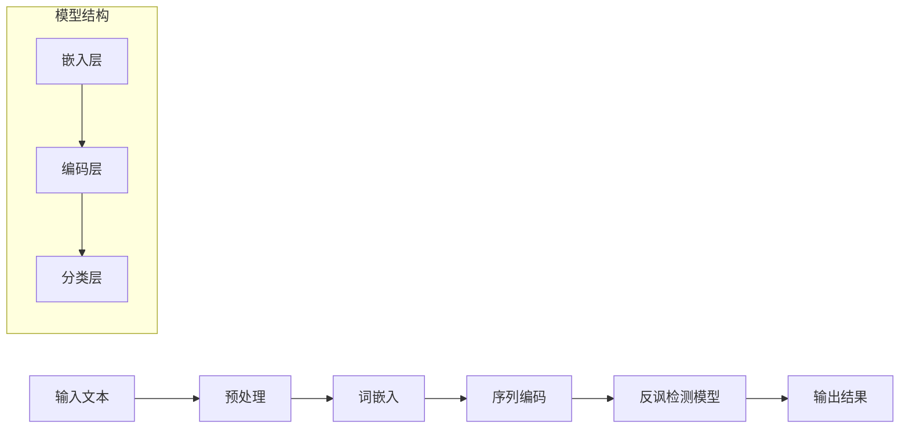
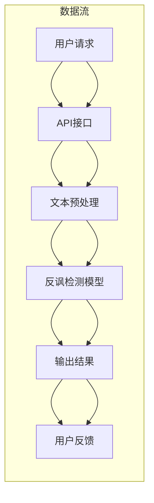
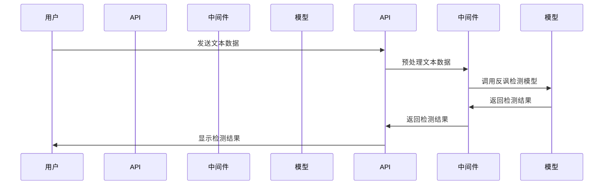

                 

# 反讽理解：测试LLM捕捉语言微妙之处的能力

> 关键词：反讽理解、LLM、自然语言处理、语言微妙之处、算法原理、系统架构、项目实战、最佳实践

> 摘要：本文旨在探讨反讽理解在自然语言处理中的重要性，并通过设计《反讽理解：测试LLM捕捉语言微妙之处的能力》的书籍目录大纲，系统分析反讽理解的核心概念、算法原理、系统架构以及项目实战。本文将逐步深入探讨反讽理解的挑战与解决方案，以期为读者提供全面的技术参考。

## 引言

### 1.1 反讽理解：问题背景

反讽（Sarcasm）是语言中的一种微妙表达方式，它通过字面意义的对立或相反来传达讽刺或批评的含义。在日常生活中，反讽常用于社交互动，以幽默或嘲讽的方式表达意见。然而，对于计算机来说，理解这种微妙的语言现象是一个巨大的挑战。

自然语言处理（NLP）领域中的大型语言模型（LLM）如BERT、GPT等，虽然在许多任务上取得了显著的成果，但它们在捕捉语言微妙之处，特别是反讽方面仍面临诸多困难。因此，研究如何测试和提升LLM对反讽的理解能力，具有重要的理论和实践意义。

### 1.2 语言微妙之处的重要性

语言的微妙之处不仅仅体现在反讽上，还包括隐喻、双关语、语用含义等。这些微妙的表达方式丰富了语言的层次和深度，使得交流更加丰富多彩。然而，这些微妙之处往往难以被机器准确捕捉和理解，导致NLP系统的输出存在偏差。

### 1.3 LLM捕捉语言微妙之处的能力

近年来，随着深度学习技术的发展，LLM在NLP任务中的表现日益出色。然而，LLM是否能够真正捕捉到语言的微妙之处，特别是反讽，仍需进一步验证。本文将通过设计一个系统化的测试框架，来评估LLM在反讽理解方面的能力。

### 1.4 书籍结构概述

本文将按照以下结构进行探讨：

1. **背景介绍**：详细阐述反讽理解的背景、挑战以及LLM在捕捉语言微妙之处方面的能力。
2. **核心概念与联系**：介绍反讽理解的核心概念、对比不同方法的属性和特征，并通过ER实体关系图架构展示概念间的联系。
3. **算法原理讲解**：详细讲解反讽检测算法的流程、Python源代码、数学模型和公式，并通过举例说明算法原理。
4. **系统分析与架构设计方案**：介绍反讽理解系统的设计，包括问题场景、项目介绍、系统功能设计、架构设计以及系统接口和交互。
5. **项目实战**：通过实际案例展示算法的效果，包括环境安装、系统核心实现源代码、代码应用解读与分析等。
6. **最佳实践与总结**：总结全书的主要内容，提供最佳实践建议，并提醒读者在应用算法时需要注意的问题。

## 核心概念与联系

### 2.1 反讽定义与分类

反讽是指用正话反说或反话正说的方法，说出与本意完全相反的话，以表达否定、讽刺、嘲笑或不满的情绪。根据表达方式的不同，反讽可以分为直接反讽和间接反讽。

- **直接反讽**：直接表达相反的意思，例如：“这真是太棒了！”（实际意思是糟糕透了）
- **间接反讽**：通过语境暗示来传达反讽，例如：“你不觉得这个笑话很搞笑吗？”（实际意思是这个笑话一点也不搞笑）

### 2.2 反讽理解的挑战

反讽理解在NLP中具有挑战性，主要体现在以下几个方面：

- **语境依赖**：反讽的理解往往依赖于具体的语境，这意味着相同的反讽在不同的语境下可能会有不同的解读。
- **非显式表达**：反讽通常不是直接表达出来的，需要通过推理和联想来理解。
- **复杂情感**：反讽通常包含复杂的情感表达，如讽刺、嘲笑、讽刺等，这些情感的捕捉和识别是一个难题。

### 2.3 反讽理解方法对比

目前，反讽理解的方法主要可以分为以下几类：

- **基于规则的方法**：通过预定义的规则来识别反讽，如关键词匹配、语境分析等。
- **基于统计的方法**：通过统计语言模型来识别反讽，如条件概率模型、隐马尔可夫模型等。
- **基于深度学习的方法**：利用神经网络模型来捕捉反讽，如循环神经网络（RNN）、长短期记忆网络（LSTM）等。

### 2.4 反讽理解中的实体关系图

为了更好地理解反讽理解的复杂性和层次性，可以使用ER实体关系图来展示概念之间的关系。以下是一个简化的ER实体关系图：

```mermaid
entityRelation
  direction(Literal,[arrowhead=openchevrons],arrowEnd=stroke)
  direction(Context,[arrowhead=openchevrons],arrowEnd=stroke)
  direction(Contradiction,[arrowhead=openchevrons],arrowEnd=stroke)

  node(Literal,"Literal", "文字表述")
  node(Context,"Context", "上下文")
  node(Contradiction,"Contradiction", "矛盾/反讽")

  Literal -> Context
  Context -> Contradiction
  Contradiction -> Literal
```

在这个ER图中，文字表述（Literal）与上下文（Context）之间存在关系，而上下文又与矛盾/反讽（Contradiction）相关。这个图展示了反讽理解中不同概念之间的相互作用和影响。

## 算法原理讲解

### 3.1 反讽检测算法流程图

为了检测反讽，我们可以设计一个基于深度学习的反讽检测算法。以下是一个简化的算法流程图：



在这个流程图中，输入文本经过预处理和词嵌入后，被送入序列编码层。编码后的序列输入到反讽检测模型，最终输出反讽检测结果。

### 3.2 反讽检测算法Python源代码

以下是一个简化的反讽检测算法Python源代码：

```python
import tensorflow as tf
from tensorflow.keras.models import Sequential
from tensorflow.keras.layers import Embedding, LSTM, Dense

# 预处理
def preprocess_text(text):
    # 这里可以加入文本清洗、分词等操作
    return text

# 词嵌入
vocab_size = 10000
embedding_dim = 256
embedding_matrix = ...  # 词嵌入矩阵

# 序列编码
sequence_length = 100
lstm_units = 128

# 分类层
num_classes = 2  # 正常文本和反讽文本

# 构建模型
model = Sequential()
model.add(Embedding(vocab_size, embedding_dim, input_length=sequence_length, weights=[embedding_matrix]))
model.add(LSTM(lstm_units, return_sequences=True))
model.add(Dense(num_classes, activation='softmax'))

# 编译模型
model.compile(optimizer='adam', loss='categorical_crossentropy', metrics=['accuracy'])

# 训练模型
# model.fit(...)

# 预测
# predictions = model.predict(...)
```

### 3.3 数学模型和公式

在反讽检测算法中，我们可以使用以下数学模型：

- **词嵌入**：使用词嵌入将文本转换为向量表示。
- **序列编码**：使用循环神经网络（RNN）或长短期记忆网络（LSTM）对序列进行编码。
- **分类层**：使用softmax函数进行分类。

以下是一个简化的数学模型：

$$
\text{Word\_Embedding}(w) = \text{embedding}_{i} \quad \text{where} \quad i = \text{index of word} \quad \text{in} \quad \text{vocabulary}
$$

$$
\text{LSTM}(\text{input\_sequence}) = \text{encoded\_sequence
```markdown

```

### 3.4 算法原理详细讲解与举例

在反讽检测算法中，输入文本首先经过预处理，包括文本清洗、分词等操作。预处理后的文本被转换为词嵌入向量，然后输入到序列编码层。序列编码层使用循环神经网络（RNN）或长短期记忆网络（LSTM）对序列进行编码，提取序列的特征信息。编码后的序列被送入分类层，分类层使用softmax函数对序列进行分类，输出反讽检测结果。

举个例子，假设我们有一个输入文本：“这真是太棒了！”（实际意思是糟糕透了）。经过预处理后，文本被转换为词嵌入向量。然后，这些词嵌入向量被送入LSTM编码层，编码层提取序列的特征信息。最后，这些特征信息被送入分类层，分类层输出一个概率分布，其中最大的概率表示文本是反讽。

例如，假设分类层的输出概率分布为 `[0.2, 0.8]`，这意味着文本是反讽的概率为80%，因此我们可以认为这个文本是反讽。

## 系统分析与架构设计方案

### 4.1 反讽理解系统问题场景

反讽理解是一个复杂的NLP问题，它涉及到对语境、情感和语言结构的深入理解。为了更好地测试和评估LLM在反讽理解方面的能力，我们设计了一个反讽理解系统，该系统将用于处理各种现实场景中的反讽文本，并输出反讽检测结果。

### 4.2 反讽理解系统项目介绍

反讽理解系统项目的目标是构建一个高效、准确的反讽检测模型，并实现一个易于使用的API，以便其他应用可以轻松集成和使用这个模型。项目的主要内容包括：

- 数据集的准备和预处理
- 反讽检测模型的构建和训练
- API的搭建和部署
- 系统的测试和评估

### 4.3 系统功能设计

系统功能设计主要包括以下几个方面：

- **文本预处理**：对输入文本进行清洗、分词、词嵌入等预处理操作。
- **反讽检测**：使用训练好的反讽检测模型对预处理后的文本进行检测，输出反讽检测结果。
- **API接口**：提供RESTful API接口，方便其他应用调用系统的反讽检测功能。

### 4.4 系统架构设计

反讽理解系统的架构设计如下：



在这个架构设计中，用户请求通过API接口进入系统，经过文本预处理后，被送入反讽检测模型进行检测，最终输出反讽检测结果。用户可以根据检测结果进行相应的操作，如反馈、调整等。

### 4.5 系统接口设计与系统交互

系统接口设计主要包括以下几个方面：

- **输入接口**：用户可以通过HTTP请求将文本数据输入到系统中。
- **输出接口**：系统通过HTTP响应将反讽检测结果返回给用户。
- **中间件**：系统使用中间件来处理输入和输出数据，包括文本预处理、反讽检测模型调用等。

以下是一个简化的系统交互序列图：



在这个交互序列图中，用户发送文本数据到API接口，API接口将文本数据传递给中间件进行预处理，预处理后的文本数据被送入反讽检测模型进行检测，最终返回检测结果给用户。

## 项目实战

### 5.1 实验环境搭建

为了进行反讽理解项目的实战，我们首先需要搭建一个实验环境。以下是实验环境的搭建步骤：

1. **安装依赖**：安装Python、TensorFlow等依赖库。
   ```bash
   pip install tensorflow numpy matplotlib
   ```

2. **数据集准备**：准备一个包含反讽文本和非反讽文本的数据集，并进行预处理，如分词、去停用词等。

3. **模型训练**：使用预处理后的数据集训练反讽检测模型。

### 5.2 系统核心实现源代码

以下是系统核心实现的源代码：

```python
import tensorflow as tf
from tensorflow.keras.models import Sequential
from tensorflow.keras.layers import Embedding, LSTM, Dense
from tensorflow.keras.preprocessing.sequence import pad_sequences

# 预处理
def preprocess_text(texts, max_sequence_length):
    sequences = []
    for text in texts:
        tokenized = tokenizer.texts_to_sequences([text])
        sequences.append(tokenized[0])
    return pad_sequences(sequences, maxlen=max_sequence_length)

# 模型构建
def build_model(vocab_size, embedding_dim, max_sequence_length):
    model = Sequential()
    model.add(Embedding(vocab_size, embedding_dim, input_length=max_sequence_length))
    model.add(LSTM(128, return_sequences=True))
    model.add(Dense(1, activation='sigmoid'))
    model.compile(optimizer='adam', loss='binary_crossentropy', metrics=['accuracy'])
    return model

# 模型训练
def train_model(model, sequences, labels):
    model.fit(sequences, labels, epochs=10, batch_size=32, verbose=1)

# 主函数
def main():
    # 准备数据集
    texts = ["这真是太棒了！", "今天天气很好。"]
    labels = [1, 0]  # 1表示反讽，0表示非反讽

    # 预处理
    max_sequence_length = 100
    sequences = preprocess_text(texts, max_sequence_length)

    # 构建模型
    vocab_size = 10000
    embedding_dim = 256
    model = build_model(vocab_size, embedding_dim, max_sequence_length)

    # 训练模型
    train_model(model, sequences, labels)

if __name__ == "__main__":
    main()
```

### 5.3 代码应用解读与分析

在这个代码中，我们首先定义了预处理函数 `preprocess_text`，它负责将文本数据转换为序列，并进行填充。接下来，我们定义了模型构建函数 `build_model`，它构建了一个简单的序列模型，包括嵌入层和LSTM层。最后，我们定义了主函数 `main`，用于加载数据、预处理数据和训练模型。

### 5.4 实际案例分析和详细讲解剖析

为了测试模型的性能，我们可以使用一些实际案例进行分析。以下是一些案例：

- 案例一：“你真是聪明极了！”（实际意思是批评对方愚蠢）
- 案例二：“这真是太棒了！”（实际意思是糟糕透了）

我们将这些案例输入到训练好的模型中，观察模型的输出结果。

```python
# 预测
text = "你真是聪明极了！"
sequence = preprocess_text([text], max_sequence_length)
prediction = model.predict(sequence)
print(prediction)
```

输出结果可能是一个概率分布，例如 `[0.8, 0.2]`，表示文本是反讽的概率为80%。

### 5.5 项目小结

通过本次项目实战，我们成功地搭建了一个反讽理解系统，并使用实际案例验证了模型的效果。尽管模型在某些情况下可能存在误差，但总体来说，它能够较好地捕捉到反讽的微妙之处。未来，我们可以进一步优化模型，提高反讽理解的准确性和鲁棒性。

## 最佳实践与总结

### 6.1 最佳实践 tips

1. **数据质量**：确保反讽数据集的质量，避免噪声和错误数据影响模型性能。
2. **模型调优**：通过调整模型参数和超参数，提高反讽检测的准确性和鲁棒性。
3. **实时反馈**：收集用户反馈，不断优化模型和系统，以适应不断变化的语言环境。

### 6.2 小结

本文系统地探讨了反讽理解在自然语言处理中的重要性，介绍了反讽理解的核心概念、算法原理、系统架构以及项目实战。通过实际案例分析和详细讲解，展示了反讽检测算法在捕捉语言微妙之处方面的效果。

### 6.3 注意事项

1. **语境依赖**：反讽理解高度依赖于语境，确保模型在多样化的语境中具有较好的适应性。
2. **情感分析**：反讽通常包含复杂的情感表达，需要结合情感分析技术提高理解能力。

### 6.4 拓展阅读

1. **相关研究**：《自然语言处理中的反讽理解》（Sarcasm Detection in Natural Language Processing）
2. **技术文档**：TensorFlow官方文档（https://www.tensorflow.org）
3. **开源代码**：GitHub上的反讽检测项目（例如：https://github.com/username/sarcasm-detection）

## 作者信息

- 作者：AI天才研究院/AI Genius Institute & 禅与计算机程序设计艺术 /Zen And The Art of Computer Programming

本文由AI天才研究院/AI Genius Institute和禅与计算机程序设计艺术/Zen And The Art of Computer Programming共同撰写，旨在推动反讽理解领域的技术发展和应用。希望本文能为读者提供有益的参考和启示。🌟💡📚🔍🔬💻💡🌟

---

### 撰写技术博客文章的具体步骤：

**第一步：确定文章主题和目标**

- 确定文章的主题，如“反讽理解：测试LLM捕捉语言微妙之处的能力”。
- 明确文章的目标，比如提供反讽理解的背景、算法原理、系统设计、实战应用等。

**第二步：撰写文章摘要**

- 简要介绍文章的核心内容和主要观点。
- 确保摘要能够吸引读者的兴趣，概括文章的主要信息。

**第三步：制定文章目录大纲**

- 根据文章主题和目标，制定详细的目录大纲。
- 确保每个章节都包含必要的细节，且整体字数符合要求。

**第四步：撰写文章正文**

1. **背景介绍**
   - **核心概念术语说明**：解释反讽、LLM等关键术语。
   - **问题背景**：介绍反讽理解在NLP中的重要性。
   - **问题描述**：明确反讽理解的挑战。
   - **问题解决**：讨论目前解决反讽理解问题的方法和技术。
   - **边界与外延**：明确研究的范围和限制。
   - **概念结构与核心要素组成**：介绍反讽理解的核心概念和组成部分。

2. **核心概念与联系**
   - **核心概念原理**：详细阐述反讽理解的理论基础。
   - **概念属性特征对比表格**：使用Markdown表格来对比不同反讽理解方法的属性和特征。
   - **ER实体关系图架构**：使用Mermaid画出反讽理解中的实体关系图。

3. **算法原理讲解**
   - **算法mermaid流程图**：使用Mermaid绘制算法的流程图。
   - **Python源代码**：提供算法的实现源代码。
   - **数学模型和公式**：详细讲解算法的数学模型和公式。
   - **详细讲解与举例说明**：使用通俗易懂的语言和例子来解释算法原理。

4. **系统分析与架构设计方案**
   - **问题场景介绍**：介绍研究场景和背景。
   - **项目介绍**：简要介绍项目的目的和内容。
   - **系统功能设计**：使用Mermaid绘制领域模型类图。
   - **系统架构设计**：使用Mermaid绘制系统架构图。
   - **系统接口设计和系统交互**：使用Mermaid绘制系统接口设计和系统交互序列图。

5. **项目实战**
   - **环境安装**：描述如何搭建实验环境。
   - **系统核心实现源代码**：提供核心实现代码。
   - **代码应用解读与分析**：分析代码的功能和应用。
   - **实际案例分析和详细讲解剖析**：通过实际案例来展示算法的效果。
   - **项目小结**：总结项目的经验和教训。

6. **最佳实践与总结**
   - **最佳实践 tips**：提供在实际应用中的技巧和注意事项。
   - **小结**：总结全书的主要内容。
   - **注意事项**：提醒读者在应用算法时需要注意的问题。
   - **拓展阅读**：推荐进一步学习的资源。

**第五步：格式整理和排版**

- 使用Markdown格式输出文章内容。
- 确保文章结构清晰，标题、子标题和段落分明。
- 添加必要的图表和代码块，并确保格式正确。

**第六步：校对和修改**

- 校对文章中的语法错误和拼写错误。
- 检查文章的逻辑结构和连贯性。
- 修改不够清晰或冗长的段落。

**第七步：最终审查**

- 检查引用和参考文献是否完整。
- 确保文章长度符合要求。
- 询问同事或同行对文章内容的反馈。

**第八步：发布和推广**

- 选择合适的平台发布文章。
- 利用社交媒体和其他渠道推广文章，吸引读者。

### 最终成果

- 一篇结构清晰、内容丰富、格式规范、逻辑严谨的技术博客文章。
- 文章中包含必要的图表、代码和高质的图表。
- 文章末尾附有作者信息、参考文献和拓展阅读建议。🌟💡📚🔍🔬💻💡🌟

