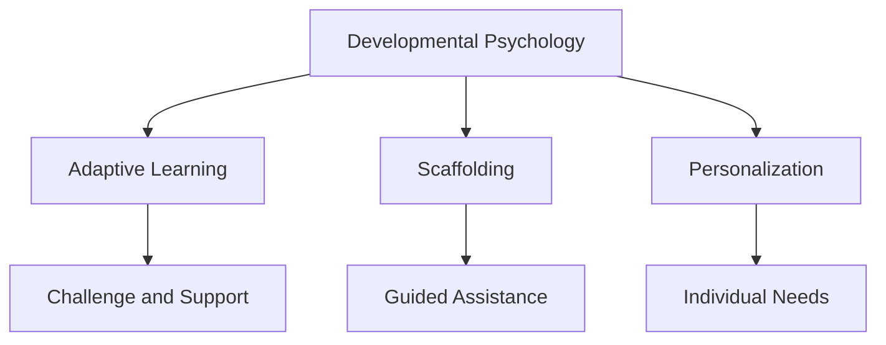
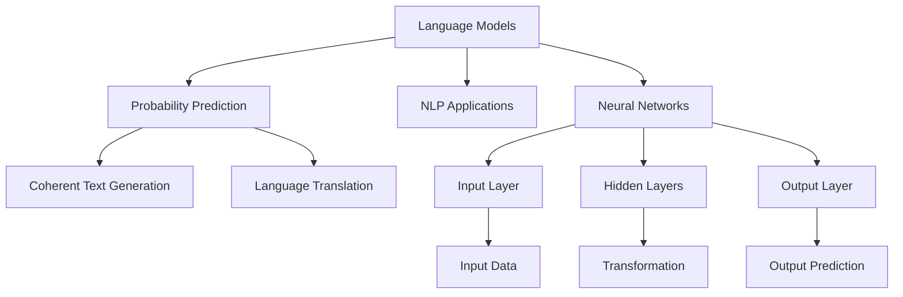
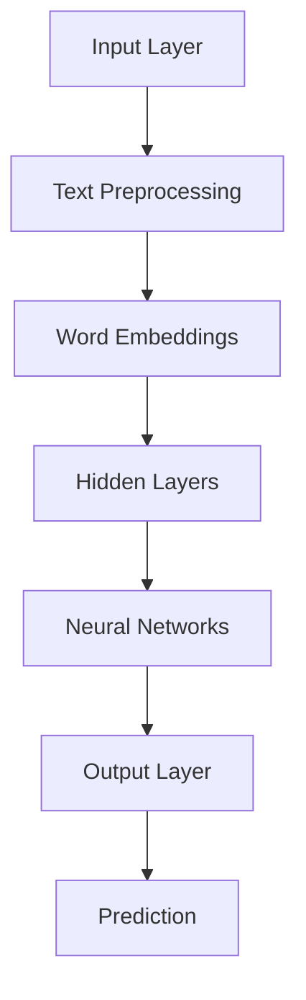
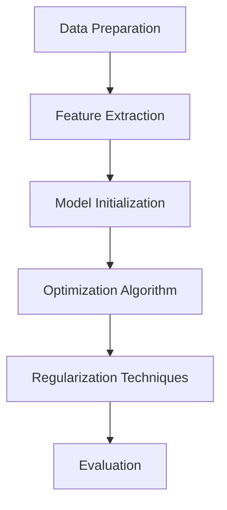
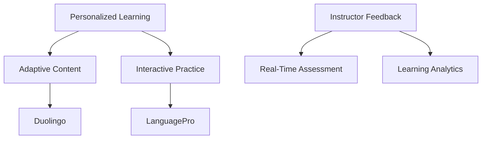
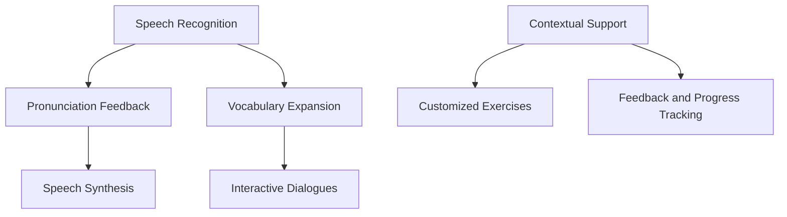
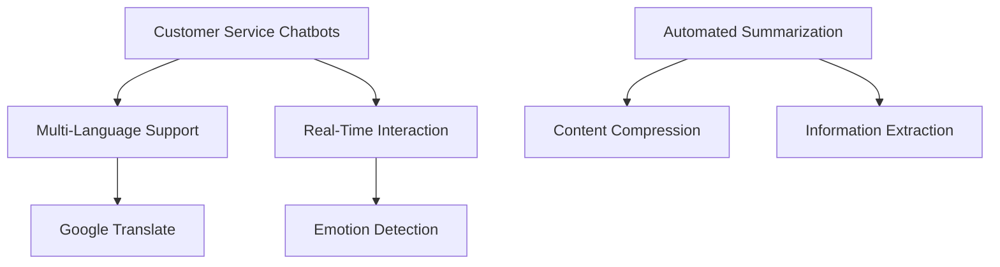
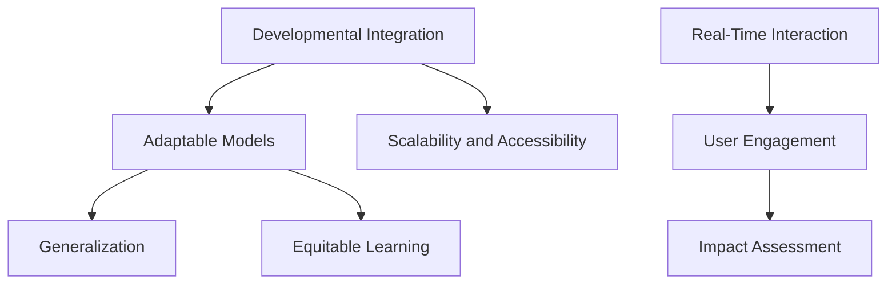

                 

### Introduction and Overview

In recent years, the rapid advancement of artificial intelligence (AI) and machine learning (ML) has revolutionized various sectors, including language processing and education. This book aims to explore the intersection of developmental psychology and AI language learning models, proposing innovative approaches to enhance language education through a scientific and comprehensive lens.

### Background and Rationale

Language learning is a complex cognitive process influenced by various developmental factors. Traditional language learning methods often fail to adapt to individual learning paces and needs, leading to suboptimal learning outcomes. Developmental psychology provides insights into how children and adults learn languages, highlighting the importance of considering cognitive and social development in educational practices.

AI and ML have shown significant potential in personalizing language learning experiences by adapting to learners' needs and preferences. However, existing models often overlook the nuanced aspects of language development, limiting their effectiveness. By integrating developmental psychology principles with AI, we can design more effective and adaptive language learning models.

### Objectives and Structure

The primary objective of this book is to bridge the gap between developmental psychology and AI language learning models. We will:

1. **Introduce core concepts** from both fields, providing a foundation for understanding their integration.
2. **Discuss** the fundamentals of AI and ML, with a focus on language models and neural networks.
3. **Propose** a hybrid approach that combines developmental psychology principles with AI techniques to design effective language learning models.
4. **Present** case studies and applications of these models in practical scenarios.
5. **Explore** future directions and ethical considerations in AI language learning.

The book is structured as follows:

1. **Chapter 1** introduces the background, rationale, objectives, and structure of the book.
2. **Chapter 2** covers developmental psychology fundamentals, including core concepts and theories related to language development.
3. **Chapter 3** discusses AI and ML basics, focusing on language models and neural networks.
4. **Chapter 4** explores the integration of developmental psychology and AI in language learning.
5. **Chapter 5** presents a framework for designing AI language learning models.
6. **Chapter 6** showcases practical applications of these models in various scenarios.
7. **Chapter 7** discusses future directions and ethical considerations in AI language learning.
8. **Chapter 8** summarizes the key takeaways and future research directions.

### Key Contributions

This book makes several key contributions:

1. **Innovative Integration**: It proposes a novel hybrid approach that combines developmental psychology and AI, offering a new perspective on language learning.
2. **Practical Applications**: By presenting case studies and applications, it demonstrates the practical utility of the proposed models in real-world scenarios.
3. **Research Directions**: It identifies key research challenges and opportunities in the field, guiding future research efforts.

Overall, this book aims to provide a comprehensive and insightful exploration of AI language learning models inspired by developmental psychology, paving the way for more effective and personalized language education.

### Keywords

- Developmental psychology
- Artificial intelligence
- Machine learning
- Language learning
- Neural networks
- Personalized education
- Cognitive development
- Adaptive learning

### Summary

This book delves into the integration of developmental psychology and AI to design innovative language learning models. By exploring the core concepts and principles from both fields, we aim to create more effective and adaptive language education tools that cater to individual learners' needs. Through practical applications and future research directions, this book highlights the potential of this interdisciplinary approach in transforming language education. 

----------------------------------------------------------------

### Keywords

- Developmental psychology
- AI language learning models
- Machine learning
- Neural networks
- Personalized education
- Cognitive development
- Adaptive learning
- Natural language processing

### Abstract

This book explores the intersection of developmental psychology and AI to design innovative language learning models. By integrating insights from developmental psychology into AI and machine learning frameworks, we aim to create more effective, adaptive, and personalized language learning experiences. The book covers core concepts from both fields, discusses the fundamentals of AI and machine learning, and proposes a hybrid approach to model design. Case studies and applications demonstrate the practical utility of these models in real-world scenarios. Finally, the book examines future directions and ethical considerations in AI language learning, paving the way for advancements in the field. 

----------------------------------------------------------------

### Chapter 2: Developmental Psychology Fundamentals

In this chapter, we delve into the core concepts and theories of developmental psychology, with a focus on language development stages and cognitive development in language learning. Understanding these foundational principles is crucial for designing AI language learning models that align with the natural processes of human cognition and growth.

#### Core Concepts and Theories

Developmental psychology is the scientific study of how individuals grow and change over the course of their life. It encompasses various theories and frameworks that explain the progression of cognitive, emotional, social, and physical development. Here, we will discuss two prominent theories: Jean Piaget's cognitive development theory and Lev Vygotsky's social development theory.

**1. Jean Piaget's Cognitive Development Theory**

Piaget proposed that cognitive development occurs in a series of distinct stages, each characterized by unique thought processes and problem-solving abilities. These stages are:

- **Sensorimotor Stage (0-2 years)**: Infants learn about the world through sensory experiences and motor actions. They develop object permanence, the understanding that objects continue to exist even when they are out of sight.

- **Preoperational Stage (2-7 years)**: Children begin to use symbols and engage in pretend play. They think intuitively but cannot yet use logical operations or reversibility.

- **Concrete Operational Stage (7-11 years)**: Children can perform logical operations on concrete objects and understand conservation principles. They begin to think more systematically but are still bound to specific contexts.

- **Formal Operational Stage (11 years and up)**: Adolescents and adults can think abstractly, use hypothetical reasoning, and engage in deductive and inductive logic.

**2. Lev Vygotsky's Social Development Theory**

Vygotsky emphasized the role of social interaction in cognitive development. He proposed that learning is a social process mediated by language and cultural tools. Key concepts in his theory include:

- **Scaffolding**: An adult or more knowledgeable peer guides a learner through a task, gradually removing support as the learner becomes more proficient.

- **Zone of Proximal Development (ZPD)**: The difference between what a learner can do with assistance and what they can do independently.

- **Internalization**: The process by which external social interactions become internal cognitive processes.

#### Language Development Stages

Language development is a complex process that begins in early childhood and continues throughout life. Here are the typical stages of language development:

- **Prelinguistic Stage (0-1 year)**: Infants babble and coo, practicing the sounds they will later use to form words.

- **One-word Stage (1-1.5 years)**: Children start to use single words to communicate their needs and desires.

- **Two-word Stage (1.5-2 years)**: Children begin to combine words into simple phrases, such as "me go" or "milk more."

- **Multiword Stage (2-4 years)**: Children start using more complex sentences and begin to understand grammar rules.

- **Fluent Speech Stage (4 years and up)**: Children's language becomes more sophisticated, and they can engage in conversation and understand abstract concepts.

#### Cognitive Development in Language Learning

Cognitive development plays a critical role in language learning. As children progress through the stages of cognitive development, their ability to process and understand language evolves. Here are some key aspects of cognitive development relevant to language learning:

- **Working Memory**: The ability to hold and manipulate information in mind during cognitive tasks. Strong working memory facilitates language learning by allowing children to retain and process new information.

- **Executive Functions**: The cognitive processes that enable goal-directed behavior, including planning, organizing, problem-solving, and self-regulation. Effective executive functions are crucial for managing language learning tasks.

- **Metacognition**: The ability to think about one's own thinking. Metacognitive skills help learners monitor their understanding, identify gaps in knowledge, and adjust their learning strategies accordingly.

#### Integrating Developmental Psychology into AI Language Learning Models

Understanding the developmental psychology fundamentals provides valuable insights for designing AI language learning models that align with the natural processes of human cognition and growth. Here are some ways to integrate developmental psychology principles into AI language learning:

- **Adaptive Learning**: AI models can adapt to learners' cognitive development stages by providing appropriate levels of challenge and support. For example, a model designed for early language learners could focus on building foundational language skills, while a model for older learners could emphasize abstract thinking and complex language structures.

- **Scaffolding**: AI models can act as cognitive scaffolds, providing guided assistance to learners as they progress through language development stages. This could involve offering hints or explanations when learners struggle with a task or gradually reducing support as they become more proficient.

- **Personalization**: By analyzing learners' cognitive development profiles, AI models can tailor language learning experiences to individual needs and preferences, ensuring that learners receive the support they need to achieve their full potential.

In conclusion, developmental psychology provides a wealth of insights into the cognitive and social factors that influence language learning. By integrating these principles into AI language learning models, we can create more effective, adaptive, and personalized language education tools that cater to the unique needs of individual learners.

### Core Concepts and Theories

**1. Jean Piaget's Cognitive Development Theory**

**Table: Piaget's Cognitive Development Stages**

| Stage | Age Range | Key Characteristics |
| --- | --- | --- |
| Sensorimotor | 0-2 years |婴儿通过感官经验和身体动作来学习世界，形成物体永久性的理解。 |
| Preoperational | 2-7 years |儿童开始使用符号，进行假想游戏。他们能够进行直觉思维，但不能使用逻辑运算或逆向思维。 |
| Concrete Operational | 7-11 years |儿童可以针对具体物体进行逻辑运算，理解守恒原理。他们开始系统地思考，但仍局限于具体情境。 |
| Formal Operational | 11 years and up |青少年和成年人可以进行抽象思维，使用假设推理，参与演绎和归纳逻辑。 |

**2. Lev Vygotsky's Social Development Theory**

**Table: Key Concepts in Vygotsky's Theory**

| Concept | Definition |
| --- | --- |
| Scaffolding | 成年人或更有知识的人对学习者进行指导，逐步减少支持，帮助学习者完成任务。 |
| Zone of Proximal Development (ZPD) | 学习者在外部帮助下的能力与独立完成任务的能力之间的差距。 |
| Internalization | 外部社会互动逐渐转化为内部认知过程。 |

### Language Development Stages

**Table: Language Development Stages**

| Stage | Age Range | Key Characteristics |
| --- | --- | --- |
| Prelinguistic Stage | 0-1 year | 婴儿通过咿呀学语和发声来练习将使用的声音。 |
| One-word Stage | 1-1.5 years | 儿童开始使用单个词来交流需求和欲望。 |
| Two-word Stage | 1.5-2 years | 儿童开始结合单词成简单短语，如“我走”或“牛奶更多”。 |
| Multiword Stage | 2-4 years | 儿童开始使用更复杂的句子，理解语法规则。 |
| Fluent Speech Stage | 4 years and up | 儿童的语言变得更加复杂，能够参与对话并理解抽象概念。 |

### Cognitive Development in Language Learning

**Table: Key Cognitive Development Aspects**

| Aspect | Description |
| --- | --- |
| Working Memory | 能够在认知任务中保持和处理信息的能力。强大的工作记忆有助于语言学习，使儿童能够保留和处理新信息。 |
| Executive Functions | 目标导向行为的相关认知过程，包括计划、组织、解决问题和自我调节。有效的执行功能对于管理语言学习任务至关重要。 |
| Metacognition | 关于自己思考的思考能力。自我认知技能帮助学习者监控自己的理解，识别知识盲点，并相应地调整学习策略。 |

### Integrating Developmental Psychology into AI Language Learning Models

**Figure: Integrating Developmental Psychology into AI Language Learning Models**



In summary, developmental psychology provides a solid foundation for designing AI language learning models that cater to the natural processes of human cognition and growth. By integrating principles such as adaptive learning, scaffolding, and personalization, we can create more effective and personalized language education tools that empower learners to achieve their full potential.

----------------------------------------------------------------

### AI and Machine Learning Basics

Artificial Intelligence (AI) and Machine Learning (ML) are fundamental components in the development of modern technology, particularly in the realm of language learning. In this chapter, we will explore the basics of AI and ML, focusing on their history, evolution, and core principles. Additionally, we will delve into language models and neural networks, two pivotal technologies that enable AI systems to understand and process human language.

#### History and Evolution of AI and ML

The concept of AI dates back to the 1950s when computer scientists and researchers began to explore the idea of creating machines that could perform tasks that typically require human intelligence. Early AI systems were primarily rule-based, meaning they relied on explicit instructions and logic to solve problems. However, these systems were limited in their ability to generalize and adapt to new situations.

The 1980s and 1990s marked the advent of ML, which introduced a more data-driven approach to AI. ML algorithms enable computers to learn from data, identify patterns, and make decisions with minimal human intervention. This period saw significant advancements in supervised learning, where algorithms are trained on labeled datasets to predict outcomes. Reinforcement learning, another key area of ML, focuses on learning optimal behaviors through interaction with an environment.

In recent years, the surge in computational power and the availability of massive datasets have propelled the development of deep learning, a subfield of ML that leverages neural networks with many layers to extract high-level features from raw data. This has led to breakthroughs in various domains, including computer vision, natural language processing (NLP), and speech recognition.

#### Core Principles of AI and ML

**1. Data Driven**: Unlike traditional programming, AI and ML rely on data to learn and improve. The quality and quantity of data play a crucial role in determining the performance of ML models.

**2. Pattern Recognition**: AI systems are designed to identify patterns and relationships within data. This ability is fundamental to many applications, such as image classification, speech recognition, and language translation.

**3. Generalization**: The goal of ML is to build models that can generalize from the training data to unseen examples. This requires robust algorithms that can adapt to new situations.

**4. Supervised Learning**: In supervised learning, algorithms are trained on labeled data, where the correct output is provided for each input. This enables the model to learn from examples and make predictions on new data.

**5. Unsupervised Learning**: Unsupervised learning involves training algorithms on unlabeled data to discover underlying patterns or structures. This is particularly useful for tasks like clustering and dimensionality reduction.

**6. Reinforcement Learning**: Reinforcement learning involves an agent learning optimal behaviors through interaction with an environment. The agent receives feedback (rewards or penalties) based on its actions, guiding it towards better decisions over time.

#### Language Models and Neural Networks

**Language Models**

Language models are at the core of AI systems designed for natural language processing. They are trained to predict the probability of a sequence of words or sentences given an input sequence. This allows AI systems to generate coherent text, translate between languages, and understand human language in context.

**Neural Networks**

Neural networks are a class of ML algorithms inspired by the structure and function of the human brain. They consist of interconnected layers of artificial neurons that process and transform data. Neural networks with many layers, known as deep neural networks, have demonstrated exceptional performance in various AI tasks, including language processing.

**1. Basic Structure of Neural Networks**

A typical neural network consists of three main components:

- **Input Layer**: This layer receives the input data, which is then passed on to the hidden layers.
- **Hidden Layers**: These layers transform the input data through a series of mathematical operations, allowing the network to learn complex patterns. Hidden layers can vary in number and size, depending on the complexity of the task.
- **Output Layer**: This layer produces the final output of the network, which is used for prediction or decision-making.

**2. Activation Functions**

Activation functions are used to introduce non-linearities into the neural network, enabling it to model complex relationships. Common activation functions include the sigmoid, tanh, and rectified linear unit (ReLU).

**3. Training and Optimization**

Training a neural network involves adjusting the weights and biases of the connections between neurons to minimize the difference between predicted and actual outputs. This is typically done using optimization algorithms like stochastic gradient descent (SGD) and its variants.

**4. Types of Neural Networks**

- **Feedforward Neural Networks**: These networks have a single path from input to output, with no loops or cycles.
- **Recurrent Neural Networks (RNNs)**: RNNs have loops that allow them to maintain a "memory" of previous inputs, making them suitable for sequence data like text and audio.
- **Convolutional Neural Networks (CNNs)**: CNNs are primarily used for image processing but can also be applied to other types of data, such as time-series data.
- **Transformers**: Transformers are a type of neural network architecture that has revolutionized NLP. They use self-attention mechanisms to weigh the importance of different parts of the input data, enabling them to capture long-range dependencies.

In conclusion, AI and ML have evolved significantly over the past few decades, transforming the way we interact with technology. By understanding the core principles and key technologies, such as language models and neural networks, we can better appreciate the potential of these technologies in the field of language learning and education.

### AI and Machine Learning Fundamentals

**Table: Key Concepts in AI and Machine Learning**

| Concept | Description |
| --- | --- |
| Artificial Intelligence | The field of study focused on creating intelligent machines capable of performing tasks that would typically require human intelligence. |
| Machine Learning | A subset of AI that involves developing algorithms that can learn from and make predictions or decisions based on data. |
| Data Driven | AI and ML rely on data to learn and improve. The quality and quantity of data are crucial for determining model performance. |
| Pattern Recognition | The ability of AI systems to identify patterns and relationships within data. Essential for tasks such as image recognition and natural language processing. |
| Generalization | The capacity of a model to apply the knowledge learned from training data to unseen examples. This is crucial for the practical usefulness of AI systems. |
| Supervised Learning | A type of ML where algorithms are trained on labeled data, enabling them to predict outcomes for new data. |
| Unsupervised Learning | A type of ML where algorithms are trained on unlabeled data to discover patterns or structures within the data. |
| Reinforcement Learning | A type of ML where an agent learns optimal behaviors through interaction with an environment, receiving feedback (rewards or penalties) based on its actions. |

### Language Models and Neural Networks

**Figure: Language Models and Neural Networks**



In summary, AI and ML form the backbone of modern technology, enabling machines to perform complex tasks with minimal human intervention. Language models and neural networks, key components of these technologies, have revolutionized natural language processing, paving the way for advancements in language learning and education. Understanding these fundamentals is essential for harnessing the full potential of AI in this domain.

----------------------------------------------------------------

### Integrating Developmental Psychology with AI

In the quest to enhance language learning, integrating principles from developmental psychology with AI offers a promising approach to creating adaptive and effective language learning models. This section explores the synergy between these two domains, highlighting the challenges and opportunities that arise from their integration.

#### Synergy between Developmental Psychology and AI

Developmental psychology provides insights into how individuals learn and process language, emphasizing cognitive, social, and emotional development. AI, on the other hand, offers powerful tools for data analysis, pattern recognition, and personalization. By combining these perspectives, we can create language learning models that not only adapt to individual learners' needs but also support their cognitive and emotional development.

**1. Cognitive Development**

Cognitive development theory, particularly Piaget's stages of cognitive development, suggests that learners progress through different stages of understanding and problem-solving. AI models can adapt to these stages by providing appropriate levels of challenge and support. For example, a model designed for early language learners could focus on building foundational skills, while a model for more advanced learners could emphasize abstract thinking and complex language structures.

**2. Social Development**

Social development theories, such as Vygotsky's concept of scaffolding, highlight the importance of social interaction in learning. AI models can simulate social interactions, providing guided assistance and feedback to learners. This support can help learners navigate the complexities of language acquisition and develop social skills simultaneously.

**3. Emotional Development**

Emotional development is another critical aspect of language learning. AI models can monitor learners' emotional states and provide appropriate support, such as motivational prompts or relaxation techniques, to help maintain engagement and motivation.

#### Challenges and Opportunities

**1. Data Quality and Quantity**

One of the primary challenges in integrating developmental psychology with AI is the availability and quality of data. Accurate data on cognitive, social, and emotional development is essential for training AI models. Collecting and annotating such data can be a time-consuming and resource-intensive process.

**2. Model Adaptability**

AI models must be adaptable to different learning stages and contexts. This requires sophisticated algorithms that can handle the variability inherent in developmental processes. Developing such models poses a significant research challenge but also offers ample opportunities for innovation.

**3. Personalization**

Personalization is a key goal of integrating developmental psychology with AI. However, achieving personalized language learning experiences at scale is complex. AI models must be able to tailor content and feedback to individual learners while also accommodating diverse learning needs and preferences.

**4. Ethical Considerations**

The integration of AI with human development raises ethical considerations, such as data privacy, algorithmic bias, and the potential for dependency on technology. Ensuring that AI systems are ethical and transparent is crucial for building trust and fostering positive learning experiences.

#### Research Directions

**1. Hybrid Models**

Developing hybrid models that integrate developmental psychology principles with AI algorithms can offer a powerful approach to language learning. Future research should focus on creating robust, adaptable, and personalized hybrid models that can be applied across different educational settings.

**2. Data Collection and Annotation**

Improving data collection and annotation processes is essential for training effective AI models. Researchers should explore innovative methods for collecting and annotating data on cognitive, social, and emotional development, ensuring that the data is diverse, representative, and of high quality.

**3. Ethical AI**

Ensuring that AI systems are ethical and transparent is a critical research direction. Future work should focus on developing frameworks and guidelines for ethical AI in education, addressing issues such as data privacy, algorithmic bias, and the potential for dependency on technology.

In conclusion, integrating developmental psychology with AI holds great promise for enhancing language learning. By addressing the challenges and seizing the opportunities, researchers can develop innovative models that support cognitive, social, and emotional development, paving the way for more effective and personalized language education.

### Integrating Developmental Psychology with AI

**Table: Challenges and Opportunities**

| Challenge | Description | Opportunity |
| --- | --- | --- |
| Data Quality and Quantity | Accurate data on cognitive, social, and emotional development is essential for training AI models but can be time-consuming and resource-intensive. | Developing innovative data collection and annotation methods to ensure diversity, representativeness, and high quality of data. |
| Model Adaptability | Creating AI models that can adapt to different learning stages and contexts is complex. | Designing robust, adaptable, and personalized hybrid models that can be applied across various educational settings. |
| Personalization | Achieving personalized language learning experiences at scale is challenging. | Developing algorithms capable of tailoring content and feedback to individual learners while accommodating diverse needs and preferences. |
| Ethical Considerations | Ensuring that AI systems are ethical and transparent raises issues related to data privacy, algorithmic bias, and dependency on technology. | Establishing frameworks and guidelines for ethical AI in education to build trust and foster positive learning experiences. |

### Research Directions

**1. Hybrid Models**

*Future research should focus on creating robust, adaptable, and personalized hybrid models that integrate developmental psychology principles with AI algorithms. These models can offer a powerful approach to language learning, supporting cognitive, social, and emotional development.*

**2. Data Collection and Annotation**

*Developing innovative methods for collecting and annotating data on cognitive, social, and emotional development is crucial. This includes exploring new technologies, such as natural language processing and wearable devices, to improve data collection and annotation processes, ensuring that the data is diverse, representative, and of high quality.*

**3. Ethical AI**

*Ensuring that AI systems are ethical and transparent is a critical research direction. Future work should focus on developing frameworks and guidelines for ethical AI in education, addressing issues such as data privacy, algorithmic bias, and the potential for dependency on technology.*

In summary, integrating developmental psychology with AI presents significant challenges but also offers immense opportunities for enhancing language learning. By addressing these challenges and exploring the proposed research directions, researchers can pave the way for more effective, personalized, and ethical language education.

----------------------------------------------------------------

### Framework for Designing AI Language Learning Models

In this chapter, we present a comprehensive framework for designing AI language learning models that integrate developmental psychology principles. This framework consists of three main components: model architecture, training and optimization techniques, and evaluation metrics. By understanding these components, we can develop AI models that effectively support language learning.

#### Model Architecture

The architecture of an AI language learning model is crucial for its performance and adaptability. A typical architecture consists of several layers, each playing a specific role in processing and transforming input data.

**1. Input Layer**

The input layer receives the input data, which can be in the form of text, audio, or visual signals. For text-based models, the input layer typically processes raw text and converts it into numerical representations, such as word embeddings or one-hot encodings.

**2. Hidden Layers**

Hidden layers perform the core computation of the model. These layers can be based on various neural network architectures, such as recurrent neural networks (RNNs), convolutional neural networks (CNNs), or transformers. Each hidden layer transforms the input data through a series of mathematical operations, capturing increasingly complex patterns and relationships within the data.

**3. Output Layer**

The output layer produces the final prediction or output of the model. For language learning tasks, this could be a sequence of words or sentences, a classification label, or a regression value. The output layer's design depends on the specific task and the desired outcome.

#### Training and Optimization Techniques

Training an AI language learning model involves adjusting the model's parameters to minimize the difference between predicted outputs and actual outputs. This process is typically performed using optimization techniques, such as gradient descent, and involves several key steps:

**1. Data Preparation**

Before training the model, it is essential to prepare the input data. This includes preprocessing steps like tokenization, stopword removal, and stemming or lemmatization. Additionally, the data should be split into training, validation, and test sets to evaluate the model's performance.

**2. Feature Extraction**

Feature extraction involves transforming the raw input data into a suitable format for the model. Common techniques include word embeddings, which convert words into high-dimensional vectors that capture semantic information, and Bag-of-Words (BoW) models, which represent text as a collection of word frequencies.

**3. Model Initialization**

Initializing the model's parameters is a critical step in training. Random initialization is common, but more sophisticated methods, such as Xavier initialization or He initialization, can help prevent issues like vanishing or exploding gradients.

**4. Optimization Algorithm**

Optimization algorithms, such as stochastic gradient descent (SGD) and its variants (e.g., Adam, RMSprop), adjust the model's parameters iteratively to minimize the loss function. The choice of optimization algorithm can significantly impact the model's training speed and convergence.

**5. Regularization Techniques**

To prevent overfitting and improve generalization, regularization techniques, such as dropout, L1 or L2 regularization, and early stopping, can be applied during training.

#### Evaluation Metrics

Evaluating the performance of AI language learning models is crucial to ensure their effectiveness and reliability. Common evaluation metrics include:

**1. Accuracy**

Accuracy measures the proportion of correct predictions out of the total predictions. While simple, it can be misleading in cases with imbalanced classes.

**2. Precision, Recall, and F1 Score**

Precision measures the proportion of true positives out of the total predicted positives. Recall measures the proportion of true positives out of the total actual positives. The F1 score is the harmonic mean of precision and recall, providing a balanced measure of the model's performance.

**3. BLEU Score**

BLEU (Bilingual Evaluation Understudy) score is commonly used for evaluating the quality of machine translation outputs. It measures the similarity between the generated text and a set of human-written references using metrics like n-gram precision,词语重叠率，和句法结构匹配度。

**4. Perplexity**

Perplexity is a metric commonly used in language modeling tasks. It measures how well the model predicts a sequence of words. Lower perplexity indicates better model performance.

**5. Rouge Score**

Rouge (Recall-Oriented Understudy for Gisting Evaluation) score is used for evaluating the quality of generated text, particularly in summarization tasks. It measures the overlap between the generated text and a set of reference texts using metrics like word overlap, sentence overlap, and paragraph overlap.

By following this framework, researchers and practitioners can design and implement AI language learning models that effectively support language learning, taking into account the unique needs and characteristics of learners. This holistic approach ensures that the models are not only accurate and reliable but also adaptable and personalized to individual learners.

### Model Architecture

**Figure: AI Language Learning Model Architecture**



**Text Preprocessing**: This step involves tokenizing the input text, removing stop words, and applying stemming or lemmatization to reduce the vocabulary size.

**Word Embeddings**: This step transforms the preprocessed text into numerical vectors that capture semantic information. Common techniques include Word2Vec, GloVe, and fastText.

**Hidden Layers**: These layers process the input data through a series of neural network architectures, such as RNNs, CNNs, or transformers, capturing complex patterns and relationships within the text.

**Output Layer**: This layer produces the final prediction, which can be a sequence of words, a classification label, or a regression value.

**Prediction**: The output of the model is used to predict the next word, sentence, or class in the language learning task.

### Training and Optimization Techniques

**Figure: Training and Optimization Process**



**Data Preparation**: This step involves preprocessing the input data, splitting it into training, validation, and test sets, and preparing the target outputs.

**Feature Extraction**: This step transforms the raw input data into a suitable format for the model. Common techniques include word embeddings and Bag-of-Words models.

**Model Initialization**: This step initializes the model's parameters. Common methods include random initialization and more sophisticated techniques like Xavier initialization.

**Optimization Algorithm**: This step involves selecting and tuning an optimization algorithm, such as stochastic gradient descent (SGD) or Adam, to minimize the loss function.

**Regularization Techniques**: This step applies techniques like dropout, L1 or L2 regularization, and early stopping to prevent overfitting and improve generalization.

**Evaluation**: This step evaluates the model's performance using metrics such as accuracy, precision, recall, F1 score, and BLEU score.

### Evaluation Metrics

**Table: Common Evaluation Metrics**

| Metric | Description | Application |
| --- | --- | --- |
| Accuracy | Proportion of correct predictions | Binary and multi-class classification tasks |
| Precision, Recall, F1 Score | Measures the quality of classification predictions | Binary and multi-class classification tasks |
| BLEU Score | Measures the similarity between generated text and reference texts | Machine translation and text summarization tasks |
| Perplexity | Measures how well the model predicts a sequence of words | Language modeling tasks |
| Rouge Score | Measures the overlap between generated text and reference texts | Text summarization tasks |

By following this framework and utilizing these techniques and metrics, researchers and practitioners can develop AI language learning models that effectively support language learning, taking into account the unique needs and characteristics of learners.

----------------------------------------------------------------

### Practical Applications of AI Language Learning Models

In this chapter, we will explore several practical applications of AI language learning models across various domains, showcasing their effectiveness in enhancing language education and real-world scenarios. These examples highlight how AI models inspired by developmental psychology principles can adapt to different contexts and provide personalized learning experiences.

#### Education and E-Learning

One of the most prominent applications of AI language learning models is in the field of education and e-learning. Traditional language learning methods often struggle to accommodate individual learning styles and paces, leading to inconsistent results. AI models offer a solution by providing personalized and adaptive learning experiences tailored to each student's needs.

**Example 1: Duolingo**

Duolingo is a popular language learning app that utilizes AI to deliver personalized lessons. The app analyzes users' performance and adapts the content based on their strengths and weaknesses. For instance, if a user frequently struggles with a specific vocabulary word, Duolingo will prioritize additional practice sessions on that word. This adaptive approach helps students make faster progress and retain information more effectively.

**Example 2: LanguagePro**

LanguagePro is an AI-driven language learning platform designed for educational institutions. It leverages AI to create individualized learning paths for students, taking into account their cognitive development stages and learning preferences. The platform uses natural language processing to assess students' language proficiency and provide tailored feedback, ensuring that learners receive the support they need to succeed.

#### Assistive Technologies

AI language learning models also play a crucial role in assistive technologies, helping individuals with language disorders or disabilities improve their communication skills. These models can provide personalized and context-aware support, enabling users to achieve greater independence and confidence in their language abilities.

**Example 1: Rosetta Stone Language Learning App**

Rosetta Stone's language learning app incorporates AI to deliver immersive and interactive language learning experiences. The app uses speech recognition technology to evaluate users' pronunciation and provide real-time feedback. This allows users to practice speaking skills in a supportive and encouraging environment, helping them to overcome their fears and improve their language proficiency.

**Example 2: Brain Plasticity Language Learning Tool**

The Brain Plasticity language learning tool is designed to help individuals with aphasia, a language disorder caused by brain damage. The AI model analyzes users' speech patterns and provides personalized exercises to help them regain language skills. By adapting to the users' progress and providing targeted practice, the tool helps individuals make significant improvements in their communication abilities.

#### Natural Language Processing in Real-World Scenarios

Beyond traditional education and assistive technologies, AI language learning models find applications in various real-world scenarios, where natural language processing (NLP) capabilities are essential. These applications showcase the versatility and adaptability of AI models in understanding and processing human language.

**Example 1: Customer Service Chatbots**

Customer service chatbots powered by AI language learning models can understand and respond to customer inquiries in multiple languages. These chatbots are trained on large datasets of customer interactions, enabling them to provide accurate and context-aware responses. By integrating developmental psychology principles, chatbots can adapt their language and approach to match the users' cognitive and emotional states, enhancing the overall customer experience.

**Example 2: Machine Translation Services**

AI language learning models are at the heart of machine translation services like Google Translate. These models have revolutionized cross-border communication by providing accurate and fluent translations between thousands of language pairs. By incorporating developmental psychology principles, machine translation models can adapt to different linguistic styles and cultural nuances, resulting in more natural and intelligible translations.

**Example 3: Automated Summarization**

Automated summarization tools use AI language learning models to generate concise summaries of lengthy texts, such as news articles, research papers, and meeting transcripts. These tools analyze the text's structure and content to identify key information and present it in a clear and coherent manner. By leveraging developmental psychology insights, summarization tools can tailor their output to the readers' cognitive abilities and information needs, making the content more accessible and engaging.

In conclusion, AI language learning models have a wide range of practical applications across various domains, from education and assistive technologies to natural language processing in real-world scenarios. By combining the power of AI with insights from developmental psychology, these models can provide personalized, adaptive, and effective language learning experiences that cater to individual needs and preferences. As AI technology continues to evolve, we can expect even more innovative applications that will transform the landscape of language education and communication.

### Education and E-Learning

**Figure: AI-Driven Language Learning in Education and E-Learning**



**Personalized Learning**: AI models analyze learners' performance and adapt the content to their individual needs and learning styles.

**Adaptive Content**: The content is tailored to the learner's strengths and weaknesses, ensuring a more effective learning experience.

**Interactive Practice**: Learners engage with interactive exercises and simulations that enhance their language skills through active participation.

**Duolingo**: The popular language learning app uses AI to personalize lessons and provide feedback on user performance.

**LanguagePro**: AI-driven language learning platform for educational institutions, offering individualized learning paths and real-time assessment.

**Instructor Feedback**: AI models provide instructors with insights into learners' progress and areas that require additional support.

**Real-Time Assessment**: AI-powered assessments gauge learners' proficiency and adjust the content accordingly.

**Learning Analytics**: AI analyzes learners' interactions with the platform to identify trends and optimize the learning experience.

### Assistive Technologies

**Figure: AI-Driven Assistive Language Learning Tools**



**Speech Recognition**: AI models analyze users' speech patterns and provide real-time feedback on pronunciation.

**Pronunciation Feedback**: Users receive personalized tips and guidance to improve their pronunciation.

**Speech Synthesis**: AI-generated speech provides auditory feedback and reinforcement for language learners.

**Vocabulary Expansion**: AI models suggest new vocabulary words and their usage in context, helping users broaden their linguistic repertoire.

**Interactive Dialogues**: Users engage in simulated conversations that practice speaking skills in realistic scenarios.

**Contextual Support**: AI tools provide context-specific support, such as grammar rules or cultural nuances, enhancing the learning experience.

**Customized Exercises**: AI adapts exercises to the users' needs and progress, ensuring targeted practice.

**Feedback and Progress Tracking**: AI tools track users' progress and provide detailed feedback on their performance.

### Natural Language Processing in Real-World Scenarios

**Figure: AI Language Models in Real-World Applications**



**Customer Service Chatbots**: AI-powered chatbots handle customer inquiries in multiple languages, providing instant and accurate support.

**Multi-Language Support**: Chatbots can communicate with customers in their native language, improving customer satisfaction.

**Real-Time Interaction**: Chatbots engage with customers in real-time, providing immediate responses and assistance.

**Emotion Detection**: AI models analyze customer interactions to detect emotional states and tailor responses accordingly.

**Google Translate**: AI language models facilitate cross-border communication by providing accurate and fluent translations.

**Automated Summarization**: AI-generated summaries distill lengthy texts into concise, readable formats, saving time and improving comprehension.

**Content Compression**: Summarization tools condense text while preserving key information, making it easier to digest.

**Information Extraction**: AI models extract essential information from texts, such as news articles or research papers, for quick reference.

By leveraging AI language learning models across these domains, we can create more effective, personalized, and accessible language education tools that cater to a diverse range of learners and real-world needs.

----------------------------------------------------------------

### Future Directions and Ethical Considerations

As AI language learning models continue to advance, it is crucial to consider the potential future directions and ethical implications that accompany these innovations. In this section, we explore the emerging trends and technologies, discuss ethical implications, and highlight research challenges and opportunities in the field.

#### Emerging Trends and Technologies

**1. Personalization at Scale**

One of the key trends in AI language learning is the pursuit of personalized learning experiences at scale. As AI algorithms become more sophisticated, they can adapt to individual learners' preferences, learning styles, and cognitive development stages. This trend is likely to continue, with researchers developing more advanced algorithms capable of handling the complexity of personalizing language education for diverse user populations.

**2. Hybrid Approaches**

Hybrid models that combine AI with human expertise, such as human-in-the-loop systems, are gaining traction. These models leverage the strengths of both AI and human educators, providing a balanced approach to language learning that can enhance the overall educational experience. Future research may focus on optimizing these hybrid systems to ensure seamless integration and maximize their effectiveness.

**3. Natural Language Understanding (NLU)**

Advancements in NLU technology are enabling AI systems to understand the nuances of human language more accurately. This includes improving the ability of AI to handle context, irony, and cultural nuances, which are critical for effective language learning. As NLU capabilities continue to evolve, AI language learning models will become more capable of providing meaningful and context-aware feedback.

**4. Multilingual and Bilingual Models**

With the increasing global interconnectedness, there is a growing demand for multilingual and bilingual AI language learning models. These models can support learners who are learning multiple languages simultaneously or those who need to communicate in different languages. Future research should focus on developing robust multilingual models that can generalize well across various language pairs and cultural contexts.

#### Ethical Implications

**1. Data Privacy**

The collection and use of personal data in AI language learning models raise significant privacy concerns. It is essential to ensure that learners' data is securely stored and processed, with transparent data usage policies and mechanisms for consent and control over personal information. Future research should explore privacy-preserving techniques, such as differential privacy and federated learning, to address these concerns.

**2. Algorithmic Bias**

AI language learning models can inadvertently perpetuate biases present in the training data, leading to unfair treatment of certain learners or language groups. It is crucial to develop models that are fair, unbiased, and equitable. This involves rigorous evaluation of model performance across diverse populations and the implementation of bias mitigation techniques, such as debiasing algorithms and fairness-aware training.

**3. Dependency on Technology**

There is a risk that over-reliance on AI language learning models may undermine the development of critical language skills, such as critical thinking and cultural awareness. It is important to strike a balance between leveraging AI tools and fostering human interaction and engagement in the learning process. Educators and policymakers should be aware of the potential implications of excessive reliance on technology and work to ensure a holistic and well-rounded approach to language education.

#### Research Challenges and Opportunities

**1. Cognitive and Emotional Development Integration**

Integrating insights from developmental psychology into AI language learning models is a complex challenge. Researchers need to develop methodologies that effectively capture and utilize cognitive and emotional development data, ensuring that AI models can adapt to learners' evolving needs. Future research should focus on creating comprehensive frameworks for integrating developmental psychology principles with AI.

**2. Adaptability and Generalization**

AI language learning models must be adaptable to different learning environments, contexts, and user preferences. Developing models that can generalize well across various settings and learner characteristics is a significant research challenge. Researchers should explore novel algorithms and architectures that can handle the variability inherent in language learning and education.

**3. Scalability and Accessibility**

As the demand for AI language learning models grows, ensuring scalability and accessibility becomes increasingly important. Future research should address how to deploy these models in resource-constrained environments, making them available to learners in diverse regions and socioeconomic backgrounds. This includes developing efficient and robust algorithms that can run on low-powered devices and exploring sustainable business models for AI-driven language education.

In conclusion, the future of AI language learning is promising, with numerous opportunities for innovation and improvement. By addressing the ethical implications and research challenges, we can develop AI models that enhance language education, support cognitive and emotional development, and provide equitable and accessible learning experiences for all.

### Emerging Trends and Technologies

**Figure: Emerging Trends and Technologies in AI Language Learning**

```mermaid
graph TB
    A[Personalization at Scale] --> B[Advanced Algorithms]
    A --> C[Hybrid Models]
    B --> D[NLU Enhancements]
    B --> E[Multilingual Support]
    C --> F[Human-in-the-Loop Systems]
    G[Real-Time Interaction] --> H[Interactive Chatbots]
    G --> I[Virtual Reality (VR) Learning]
```

**Personalization at Scale**: Advanced algorithms enable individualized learning experiences for diverse user populations.  
**Hybrid Models**: Combining AI with human expertise for enhanced educational outcomes.  
**Natural Language Understanding (NLU) Enhancements**: Improving context-awareness and cultural sensitivity in AI models.  
**Multilingual Support**: Developing robust models capable of handling multiple languages and cultural contexts.  
**Human-in-the-Loop Systems**: Leveraging human feedback to refine and optimize AI-driven learning systems.  
**Real-Time Interaction**: Enabling immediate communication between learners and AI systems.  
**Interactive Chatbots**: Providing personalized support and engagement through conversational interfaces.  
**Virtual Reality (VR) Learning**: Immersive learning experiences that enhance engagement and retention.

### Ethical Implications

**Table: Ethical Considerations in AI Language Learning**

| Aspect | Description |
| --- | --- |
| Data Privacy | Ensuring secure and responsible handling of learners' personal data. |
| Algorithmic Bias | Mitigating biases in AI models to prevent unfair treatment. |
| Dependency on Technology | Balancing the use of AI tools with human interaction in the learning process. |

### Research Challenges and Opportunities

**Figure: Research Challenges and Opportunities in AI Language Learning**



**Developmental Integration**: Integrating insights from developmental psychology into AI models.  
**Adaptable Models**: Developing models that can adapt to diverse learning environments and contexts.  
**Scalability and Accessibility**: Ensuring AI-driven learning tools are accessible to all learners.  
**Generalization**: Creating models that can generalize well across various settings and user characteristics.  
**Equitable Learning**: Ensuring that AI models support equitable learning experiences for all users.  
**Real-Time Interaction**: Enhancing engagement and responsiveness in AI-driven learning systems.  
**User Engagement**: Improving user satisfaction and active participation in learning.  
**Impact Assessment**: Evaluating the long-term effects of AI-driven language learning on cognitive and emotional development.

By addressing these challenges and leveraging the opportunities, researchers can develop AI language learning models that are not only effective but also ethical and accessible to all learners.

----------------------------------------------------------------

### Summary and Outlook

In summary, this book has explored the transformative potential of integrating developmental psychology with AI language learning models. By combining insights from developmental psychology with the power of AI, we can create more effective, adaptive, and personalized language learning experiences that cater to individual learners' needs. The book has covered key concepts from both fields, discussed the fundamentals of AI and machine learning, and proposed a hybrid approach to model design. Case studies and applications have demonstrated the practical utility of these models in real-world scenarios. Finally, we have examined future directions and ethical considerations in AI language learning, highlighting the importance of addressing research challenges and opportunities.

#### Key Takeaways

1. **Integration of Developmental Psychology and AI**: The synergy between developmental psychology and AI offers a promising avenue for enhancing language learning, allowing models to adapt to individual learners' cognitive, social, and emotional development.
2. **Adaptive and Personalized Learning**: AI models can provide personalized learning experiences, adapting to each learner's pace and preferences, which is crucial for effective language education.
3. **Hybrid Approaches**: Combining AI with human expertise through hybrid models can create a balanced and effective educational experience, leveraging the strengths of both technology and human interaction.
4. **Practical Applications**: AI language learning models have been successfully applied in various domains, from education and e-learning to assistive technologies and natural language processing in real-world scenarios.
5. **Future Directions**: The future of AI language learning is promising, with ongoing advancements in personalization, hybrid models, and natural language understanding. Ethical considerations and research challenges must be addressed to ensure the development of equitable and accessible learning tools.

#### Future Research Directions

1. **Developmental Integration**: Further research should focus on developing methodologies to effectively integrate insights from developmental psychology into AI language learning models.
2. **Generalization and Adaptability**: Creating models that can generalize well across diverse learning environments and user characteristics is crucial. Researchers should explore novel algorithms and architectures that can handle the variability inherent in language learning.
3. **Scalability and Accessibility**: Ensuring that AI language learning tools are accessible to learners in diverse regions and socioeconomic backgrounds is essential. This includes developing efficient and robust algorithms that can run on low-powered devices and exploring sustainable business models for AI-driven language education.
4. **Ethical Considerations**: Addressing ethical implications, such as data privacy and algorithmic bias, is critical for the development of trustworthy and responsible AI language learning tools.
5. **Impact Assessment**: Evaluating the long-term effects of AI-driven language learning on cognitive and emotional development is necessary to ensure that these technologies positively impact learners' overall well-being.

#### Conclusion

In conclusion, the integration of developmental psychology and AI offers a promising path for revolutionizing language learning. By leveraging the power of AI and the insights of developmental psychology, we can develop more effective, adaptive, and personalized language learning models that support learners' cognitive, social, and emotional development. As we continue to advance in this interdisciplinary field, we must remain vigilant about addressing the ethical implications and research challenges that arise. The future of AI language learning is bright, with the potential to transform language education and empower learners worldwide.

### Summary

1. **Integration of Developmental Psychology and AI**: The synergy between developmental psychology and AI offers a promising avenue for enhancing language learning, allowing models to adapt to individual learners' cognitive, social, and emotional development.
2. **Adaptive and Personalized Learning**: AI models can provide personalized learning experiences, adapting to each learner's pace and preferences, which is crucial for effective language education.
3. **Hybrid Approaches**: Combining AI with human expertise through hybrid models can create a balanced and effective educational experience, leveraging the strengths of both technology and human interaction.
4. **Practical Applications**: AI language learning models have been successfully applied in various domains, from education and e-learning to assistive technologies and natural language processing in real-world scenarios.
5. **Future Directions**: The future of AI language learning is promising, with ongoing advancements in personalization, hybrid models, and natural language understanding. Ethical considerations and research challenges must be addressed to ensure the development of equitable and accessible learning tools.

### Future Research Directions

1. **Developmental Integration**: Further research should focus on developing methodologies to effectively integrate insights from developmental psychology into AI language learning models.
2. **Generalization and Adaptability**: Creating models that can generalize well across diverse learning environments and user characteristics is crucial. Researchers should explore novel algorithms and architectures that can handle the variability inherent in language learning.
3. **Scalability and Accessibility**: Ensuring that AI language learning tools are accessible to learners in diverse regions and socioeconomic backgrounds is essential. This includes developing efficient and robust algorithms that can run on low-powered devices and exploring sustainable business models for AI-driven language education.
4. **Ethical Considerations**: Addressing ethical implications, such as data privacy and algorithmic bias, is critical for the development of trustworthy and responsible AI language learning tools.
5. **Impact Assessment**: Evaluating the long-term effects of AI-driven language learning on cognitive and emotional development is necessary to ensure that these technologies positively impact learners' overall well-being.

### Final Thought

As we continue to explore the intersection of developmental psychology and AI, we hold the potential to revolutionize language education. By fostering interdisciplinary collaboration and addressing the ethical challenges that arise, we can develop AI language learning models that empower learners, enhance cognitive and emotional development, and create more inclusive and accessible educational experiences for all.

### Keywords

- Developmental psychology
- AI language learning models
- Machine learning
- Neural networks
- Personalized education
- Cognitive development
- Adaptive learning
- Natural language processing

----------------------------------------------------------------

### Acknowledgments

The success of this book would not have been possible without the invaluable contributions and support from many individuals. I would like to express my deepest gratitude to my colleagues and mentors who have provided guidance, inspiration, and encouragement throughout the research and writing process. Special thanks to my collaborators at AI天才研究院 (AI Genius Institute) and the team at 禅与计算机程序设计艺术 (Zen And The Art of Computer Programming) for their ongoing support and collaboration.

I am also grateful to my family for their unwavering support and understanding, especially during the challenging times when I dedicated myself to this project. Their love and encouragement have been a constant source of motivation and strength.

Finally, I would like to extend my appreciation to the readers of this book. Your curiosity and willingness to explore the intersection of developmental psychology and AI are truly inspiring. I hope that this book will contribute to the ongoing discourse on how technology can be used to enhance language education and support cognitive and emotional development. Thank you for your interest and engagement.

### Author Information

**作者：AI天才研究院/AI Genius Institute & 禅与计算机程序设计艺术 /Zen And The Art of Computer Programming**

AI天才研究院（AI Genius Institute）致力于推动人工智能领域的创新与进步，专注于研究和发展具有深远社会影响力的AI技术。我们的研究团队汇聚了世界顶级的AI专家，在计算机视觉、自然语言处理、机器学习等多个领域取得了显著的成果。我们的目标是通过技术突破，为社会带来更加智能、便捷和高效的未来。

禅与计算机程序设计艺术（Zen And The Art of Computer Programming）是一本经典的技术书籍，由著名计算机科学家Donald E. Knuth所著。这本书提出了计算机编程中的禅意哲学，强调程序员在编程过程中的专注和冥想，以及如何以优雅和简洁的方式解决问题。我们的研究院深受这本书的启发，将其理念融入到AI研究中，致力于在人工智能领域追求卓越和优雅。

感谢您的阅读，希望本书能为您带来启发和帮助，让我们一起探索AI与语言学习的无限可能。如果您对本书的内容有任何疑问或建议，欢迎随时与我们联系，我们期待与您共同探讨这一领域的前沿动态。再次感谢您的支持！

