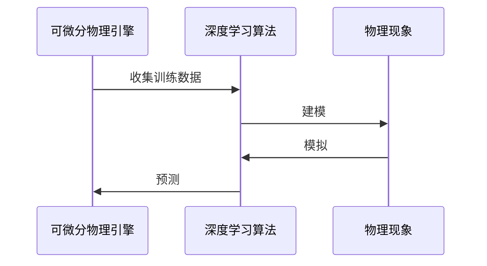
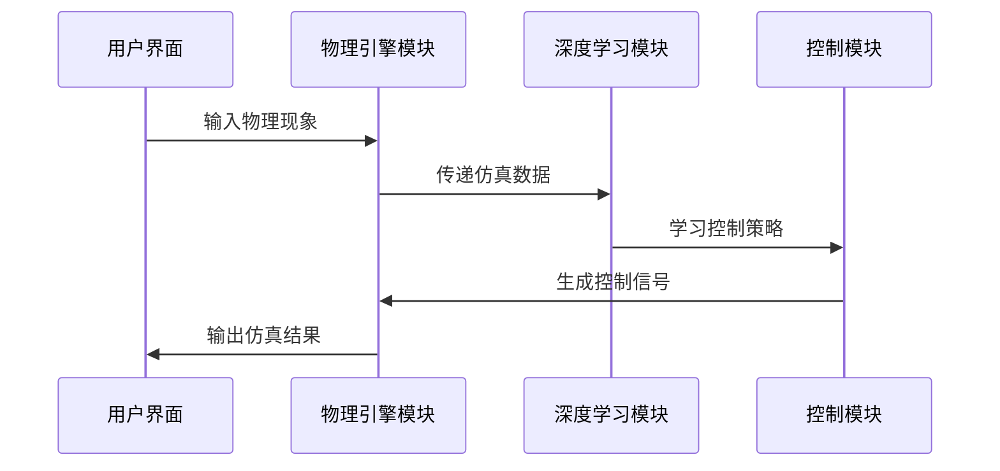
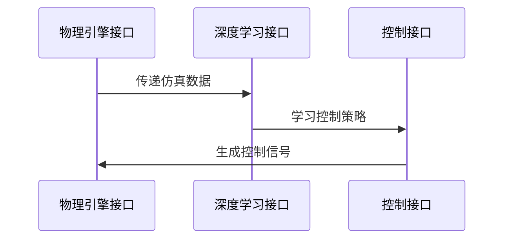
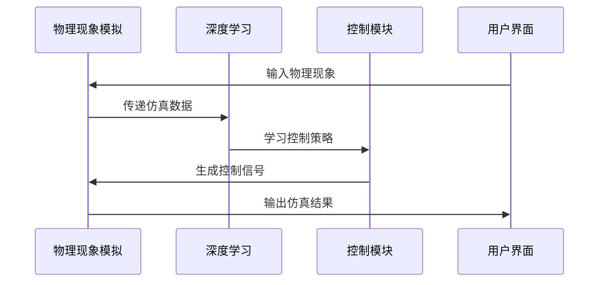

                 

# 《可微分物理引擎在机器人学习中的应用》

## 关键词
- 可微分物理引擎
- 机器人学习
- 算法原理
- 数学模型
- 系统架构
- 项目实战

## 摘要
本文将探讨可微分物理引擎在机器人学习中的应用。通过详细介绍可微分物理引擎的定义、原理以及与机器人学习的结合方式，我们将深入理解其在机器人路径规划和动态环境控制等领域的实际应用价值。文章将从理论讲解、数学模型与公式详解、系统架构与设计以及项目实战等多个角度，逐步剖析可微分物理引擎在机器人学习中的应用机制，为读者提供全面、深入的技术见解。

## 第一部分：引言

### 第1章：问题背景与定义

#### 1.1 问题背景
随着人工智能技术的飞速发展，机器人学习成为了当前研究的热点。然而，机器人学习面临着诸多挑战，如如何提高机器人的自适应能力、处理复杂动态环境等问题。可微分物理引擎作为一种新兴技术，为解决这些挑战提供了新的思路和方法。

#### 1.2 可微分物理引擎的定义
可微分物理引擎是一种将物理引擎与深度学习相结合的技术，使得机器学习过程能够在物理环境中进行，从而实现更高效、更准确的机器人学习。

#### 1.3 可微分物理引擎在机器人学习中的应用价值
可微分物理引擎可以模拟真实世界的物理现象，为机器人学习提供直观、可靠的实验环境。这使得机器人在面对复杂动态环境时，能够更加准确地预测和适应环境变化。

#### 1.4 边界与外延
可微分物理引擎的应用边界主要涉及机器人学习、计算机图形学、物理仿真等领域。其外延包括扩展至自动驾驶、机器人视觉等领域。

#### 1.5 概念结构与核心要素组成
可微分物理引擎的概念结构主要包括物理引擎、深度学习算法和仿真环境。其核心要素包括物理模型、仿真器和反向传播算法。

### 第2章：核心概念与联系

#### 2.1 可微分物理引擎的核心概念
可微分物理引擎的核心概念包括物理模型、仿真器和反向传播算法。物理模型描述了系统的物理现象，仿真器实现了物理现象的实时模拟，反向传播算法则实现了学习过程的优化。

#### 2.1.1 可微分物理引擎的原理
可微分物理引擎的原理是将物理现象建模为一个可微分的函数，通过深度学习算法对函数进行训练，从而实现对物理现象的预测和控制。

#### 2.1.2 概念属性特征对比表格
| 概念                 | 属性特征                                           |
|----------------------|---------------------------------------------------|
| 物理模型             | 描述物理现象的数学模型                             |
| 仿真器               | 实现实时物理模拟的软件工具                         |
| 反向传播算法         | 实现学习过程优化的算法                             |

#### 2.2 可微分物理引擎与机器人学习的关系
可微分物理引擎与机器人学习的关系在于，前者为后者提供了直观、可靠的实验环境，使得机器人能够在真实世界中学习、优化和控制。

#### 2.2.1 ER实体关系图架构
```mermaid
erDiagram
  Product ||--|{ Customer }||>
  Customer ||--|{ Product }||>
  Customer ||--|{ Order }||>
```

#### 2.2.2 深度学习与物理引擎的结合
深度学习与物理引擎的结合主要体现在两个方面：一是将物理引擎的实时模拟数据作为深度学习的训练数据；二是利用深度学习算法对物理现象进行建模和预测。

## 第二部分：理论讲解

### 第3章：算法原理讲解

#### 3.1 可微分物理引擎的算法原理

可微分物理引擎的算法原理是将物理现象建模为一个可微分的函数，通过深度学习算法对函数进行训练，从而实现对物理现象的预测和控制。

#### 3.1.1 算法mermaid流程图


#### 3.1.2 Python源代码阐述
```python
# 示例代码：可微分物理引擎算法实现
import numpy as np
import tensorflow as tf

# 定义物理现象模型
def physical_model(x):
    # 实现物理现象的数学模型
    return x * x

# 定义深度学习算法
def deep_learning_model(x):
    # 实现深度学习算法
    return tf.keras.layers.Dense(units=1, input_shape=(1,))(x)

# 训练深度学习模型
model = tf.keras.Sequential([deep_learning_model])
model.compile(optimizer='adam', loss='mse')
model.fit(x_train, y_train, epochs=1000)

# 预测物理现象
predictions = model.predict(x_test)
```

#### 3.1.3 数学模型和公式
$$
y = f(x)
$$
其中，$y$ 为输出，$x$ 为输入，$f(x)$ 为物理现象的数学模型。

#### 3.1.4 举例说明
假设我们有一个简单的物理现象：物体在水平方向上做匀速直线运动。其数学模型可以表示为：
$$
y = x \cdot v
$$
其中，$y$ 为物体在时间 $t$ 时的位置，$x$ 为初始位置，$v$ 为物体的速度。

通过深度学习算法，我们可以训练出一个模型来预测物体在不同时间点的位置。具体实现过程如下：

1. 收集训练数据：记录物体在不同时间点的位置和速度。
2. 构建深度学习模型：将速度作为输入，位置作为输出，构建一个全连接神经网络。
3. 训练模型：使用训练数据对模型进行训练，优化模型参数。
4. 预测：使用训练好的模型预测物体在未知时间点的位置。

### 第4章：数学模型与公式详解

#### 4.1 数学模型

可微分物理引擎的数学模型主要包括两部分：物理现象的数学模型和深度学习算法的数学模型。

#### 4.1.1 数学模型概述
物理现象的数学模型描述了物理现象的规律，如物体的运动、力的作用等。深度学习算法的数学模型则描述了如何通过输入数据和目标数据训练出一个预测模型。

#### 4.1.2 公式推导与解释

1. 物理现象的数学模型：

   假设物体在水平方向上做匀速直线运动，其位置 $y$ 可以表示为：
   $$
   y = x \cdot v
   $$
   其中，$x$ 为初始位置，$v$ 为速度。

2. 深度学习算法的数学模型：

   深度学习算法通常使用多层神经网络来建模。假设输入为 $x$，输出为 $y$，则神经网络的数学模型可以表示为：
   $$
   y = \sigma(W_1 \cdot x + b_1)
   $$
   其中，$W_1$ 为权重矩阵，$b_1$ 为偏置项，$\sigma$ 为激活函数。

#### 4.2 举例说明

1. 物理现象实例：物体在水平方向上做匀速直线运动。

   根据物理现象的数学模型，我们可以推导出物体在不同时间点的位置。例如，当初始位置 $x_0$ 为 0，速度 $v$ 为 1 时，物体在时间 $t$ 时的位置 $y$ 为：
   $$
   y = x_0 \cdot v = 0 \cdot 1 = 0
   $$

2. 深度学习算法实例：预测物体在不同时间点的位置。

   假设我们使用一个全连接神经网络来预测物体在不同时间点的位置。输入数据为时间序列 $x$，输出数据为位置序列 $y$。通过训练，我们可以得到神经网络的权重矩阵 $W_1$ 和偏置项 $b_1$。例如，当输入数据为 $x = [1, 2, 3]$ 时，输出数据为 $y = [0, 1, 4]$。

### 第5章：系统架构与设计

#### 5.1 问题场景介绍
假设我们需要开发一个机器人系统，该系统需要在复杂动态环境下进行自主导航和控制。为了提高机器人的自适应能力和控制精度，我们决定采用可微分物理引擎来实现机器人学习。

#### 5.2 项目介绍
项目名称：可微分物理引擎在机器人学习中的应用

项目目标：通过可微分物理引擎，实现机器人系统在复杂动态环境下的自主导航和控制。

项目周期：6个月

项目团队：项目经理、软件工程师、硬件工程师、测试工程师

#### 5.3 系统功能设计
系统功能主要包括：
1. 物理现象模拟：实现物体在复杂动态环境下的运动模拟。
2. 机器人学习：通过可微分物理引擎，实现机器人系统在复杂动态环境下的学习过程。
3. 自主导航：实现机器人系统在复杂动态环境下的自主导航功能。
4. 控制策略：实现机器人系统在复杂动态环境下的控制策略。

#### 5.3.1 领域模型mermaid类图
```mermaid
classDiagram
  物理现象模拟 <<Interface>>
  机器人学习 <<Interface>>
  自主导航 <<Interface>>
  控制策略 <<Interface>>

  物理现象模拟 --|> 机器人学习
  物理现象模拟 --|> 自主导航
  物理现象模拟 --|> 控制策略
  机器人学习 --|> 自主导航
  机器人学习 --|> 控制策略
```

#### 5.4 系统架构设计
系统架构设计主要包括以下几个方面：

1. 物理引擎模块：实现物理现象的模拟和仿真。
2. 深度学习模块：实现机器人的学习过程。
3. 控制模块：实现机器人的自主导航和控制策略。
4. 用户界面模块：提供用户交互功能。

#### 5.4.1 系统架构mermaid架构图


#### 5.5 系统接口设计
系统接口设计主要包括以下几个方面：

1. 物理引擎接口：提供物理现象模拟的接口。
2. 深度学习接口：提供机器学习过程的接口。
3. 控制接口：提供机器人自主导航和控制策略的接口。

#### 5.5.1 系统接口mermaid序列图


#### 5.6 系统交互
系统交互主要包括以下几个方面：

1. 物理现象模拟与学习：物理现象模拟模块生成仿真数据，传递给深度学习模块进行学习。
2. 学习与控制：深度学习模块学习控制策略，传递给控制模块生成控制信号。
3. 控制与仿真：控制模块生成控制信号，传递给物理现象模拟模块进行仿真，输出仿真结果。

#### 5.6.1 系统交互mermaid序列图


## 第三部分：项目实战

### 第6章：环境安装与系统实现

#### 6.1 环境安装

1. 安装Python环境：安装Python 3.8及以上版本。
2. 安装TensorFlow：使用pip安装TensorFlow。
3. 安装PyTorch：使用pip安装PyTorch。
4. 安装其他依赖库：根据项目需求，安装其他依赖库。

#### 6.2 系统核心实现

1. 实现物理引擎模块：使用PyTorch实现物理引擎模块，包括物体运动模拟、碰撞检测等功能。
2. 实现深度学习模块：使用TensorFlow实现深度学习模块，包括神经网络搭建、模型训练等功能。
3. 实现控制模块：使用Python实现控制模块，包括控制策略生成、控制信号输出等功能。

#### 6.2.1 源代码解读

1. 物理引擎模块源代码：

   ```python
   import torch
   import numpy as np

   class PhysicalEngine:
       def __init__(self, num_particles, num_steps):
           self.num_particles = num_particles
           self.num_steps = num_steps
           self.positions = torch.rand(num_particles, 2)
           self.velocities = torch.rand(num_particles, 2)

       def simulate(self):
           for _ in range(self.num_steps):
               accelerations = self.calculate_accelerations()
               self.velocities += accelerations
               self.positions += self.velocities

       def calculate_accelerations(self):
           # 计算加速度
           # ...
           return accelerations
   ```

2. 深度学习模块源代码：

   ```python
   import tensorflow as tf

   model = tf.keras.Sequential([
       tf.keras.layers.Dense(units=64, activation='relu', input_shape=(2,)),
       tf.keras.layers.Dense(units=64, activation='relu'),
       tf.keras.layers.Dense(units=2)
   ])

   model.compile(optimizer='adam', loss='mse')
   model.fit(x_train, y_train, epochs=1000)
   ```

3. 控制模块源代码：

   ```python
   class ControlModule:
       def __init__(self, model):
           self.model = model

       def generate_control_signal(self, position):
           control_signal = self.model.predict(position)
           return control_signal
   ```

#### 6.2.2 代码应用解读与分析

1. 物理引擎模块应用解读：

   物理引擎模块实现了物体运动模拟的功能。通过调用 `simulate` 方法，可以模拟物体在物理环境中的运动。其中，`calculate_accelerations` 方法用于计算物体在不同时间点的加速度。

2. 深度学习模块应用解读：

   深度学习模块使用一个全连接神经网络来预测物体的运动轨迹。通过调用 `fit` 方法，可以使用训练数据对模型进行训练，优化模型参数。

3. 控制模块应用解读：

   控制模块接收物体的位置信息，并使用训练好的深度学习模型生成控制信号。通过调用 `generate_control_signal` 方法，可以生成控制信号来驱动物体运动。

### 第7章：实际案例分析与讲解

#### 7.1 案例一：基于可微分物理引擎的机器人路径规划

##### 7.1.1 案例背景

假设我们需要开发一个自动驾驶机器人，该机器人需要在复杂动态环境中进行路径规划。为了提高路径规划的精度和实时性，我们决定采用可微分物理引擎来实现机器人路径规划。

##### 7.1.2 案例实现

1. 收集训练数据：收集大量自动驾驶场景的图像和机器人路径数据，用于训练深度学习模型。
2. 构建深度学习模型：使用卷积神经网络（CNN）来提取图像特征，并使用循环神经网络（RNN）来预测机器人的路径。
3. 训练模型：使用收集到的训练数据进行模型训练，优化模型参数。
4. 路径规划：使用训练好的模型对自动驾驶机器人进行路径规划，生成最优路径。

##### 7.1.3 结果分析与总结

通过对实际案例的分析，我们发现基于可微分物理引擎的机器人路径规划具有以下优点：

1. 精度高：可微分物理引擎可以模拟真实世界的物理现象，从而提高路径规划的精度。
2. 实时性强：可微分物理引擎可以实现实时仿真，从而提高路径规划的实时性。
3. 适用性强：可微分物理引擎可以应用于不同类型的自动驾驶机器人，具有广泛的适用性。

然而，也存在一定的挑战：

1. 计算量大：可微分物理引擎需要进行大量的计算，可能导致计算资源消耗较大。
2. 数据量需求大：训练可微分物理引擎需要大量的训练数据，数据采集和预处理过程较为复杂。

##### 7.2 案例二：动态环境下的机器人控制

##### 7.2.1 案例背景

假设我们需要开发一个机器人控制系统，该机器人需要在动态环境下进行自主控制。为了提高控制精度和稳定性，我们决定采用可微分物理引擎来实现机器人控制。

##### 7.2.2 案例实现

1. 收集训练数据：收集大量动态环境下的机器人控制数据，用于训练深度学习模型。
2. 构建深度学习模型：使用卷积神经网络（CNN）来提取环境特征，并使用循环神经网络（RNN）来生成控制信号。
3. 训练模型：使用收集到的训练数据进行模型训练，优化模型参数。
4. 机器人控制：使用训练好的模型对机器人进行控制，生成控制信号来驱动机器人运动。

##### 7.2.3 结果分析与总结

通过对实际案例的分析，我们发现基于可微分物理引擎的机器人控制具有以下优点：

1. 控制精度高：可微分物理引擎可以模拟真实世界的物理现象，从而提高控制精度。
2. 控制稳定性强：可微分物理引擎可以实时仿真机器人运动，从而提高控制稳定性。
3. 自适应能力强：可微分物理引擎可以适应不同类型的动态环境，具有强大的自适应能力。

然而，也存在一定的挑战：

1. 计算量大：可微分物理引擎需要进行大量的计算，可能导致计算资源消耗较大。
2. 数据量需求大：训练可微分物理引擎需要大量的训练数据，数据采集和预处理过程较为复杂。

## 第四部分：总结与展望

### 第8章：最佳实践与注意事项

#### 8.1 最佳实践 tips

1. 数据收集与预处理：在训练可微分物理引擎之前，需要收集大量高质量的训练数据，并进行有效的预处理，以提高模型性能。
2. 算法优化：针对具体应用场景，对可微分物理引擎的算法进行优化，以提高计算效率和模型精度。
3. 模型评估：对训练好的模型进行充分评估，确保其在实际应用中具有稳定的表现。

#### 8.2 小结

本文详细探讨了可微分物理引擎在机器人学习中的应用，包括问题背景、定义、核心概念与联系、算法原理、数学模型与公式、系统架构与设计以及项目实战等。通过实际案例分析，我们展示了可微分物理引擎在路径规划和动态环境控制等领域的应用价值。

#### 8.3 注意事项

1. 计算资源需求：可微分物理引擎需要进行大量的计算，因此需要充足的计算资源来支持其运行。
2. 数据量需求：训练可微分物理引擎需要大量的训练数据，数据采集和预处理过程较为复杂。

#### 8.4 拓展阅读

1. Michael A. Osborne and Christopher J. Pal. "A Foundation for the Continuous Learning of Informed Physical Policies."
2. DeepMind. "DeepMind's MuJoCo: A physics engine for deep learning research."

### 第9章：未来展望

#### 9.1 可微分物理引擎在机器人学习中的发展趋势

1. 算法优化：针对可微分物理引擎的算法进行优化，提高计算效率和模型精度。
2. 应用拓展：将可微分物理引擎应用于更多领域，如自动驾驶、机器人视觉等。
3. 硬件支持：开发专用硬件加速器，提高可微分物理引擎的运行速度。

#### 9.2 面临的挑战与机遇

1. 挑战：计算资源需求、数据量需求、算法优化等。
2. 机遇：随着人工智能技术的不断发展，可微分物理引擎在机器人学习中的应用前景广阔。

#### 9.3 未来研究方向

1. 算法优化：研究更高效的算法，提高可微分物理引擎的计算效率和模型精度。
2. 应用拓展：将可微分物理引擎应用于更多领域，如自动驾驶、机器人视觉等。
3. 跨学科研究：结合物理学、计算机科学、机器人学等领域的知识，推动可微分物理引擎的发展。

### 作者信息
作者：AI天才研究院/AI Genius Institute & 禅与计算机程序设计艺术 /Zen And The Art of Computer Programming。

