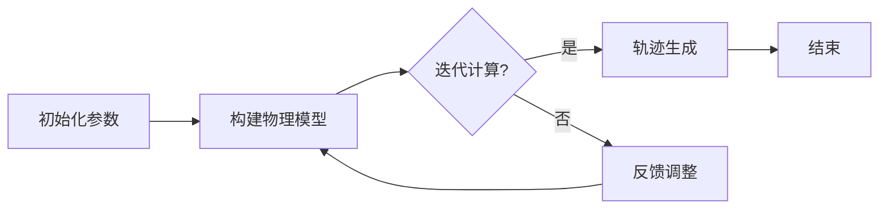
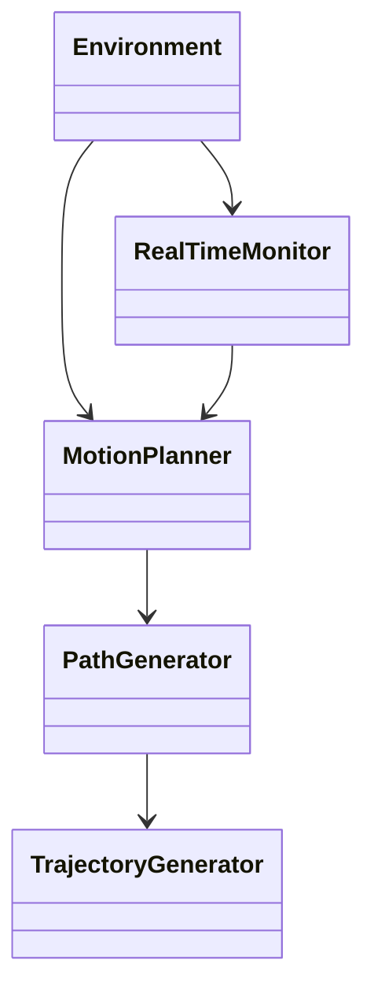
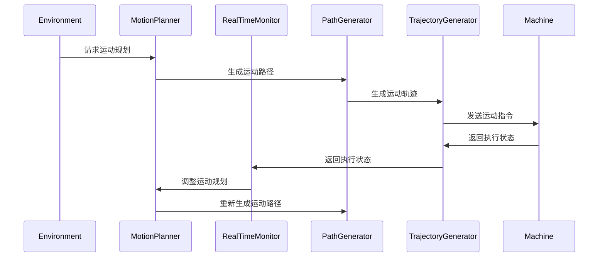
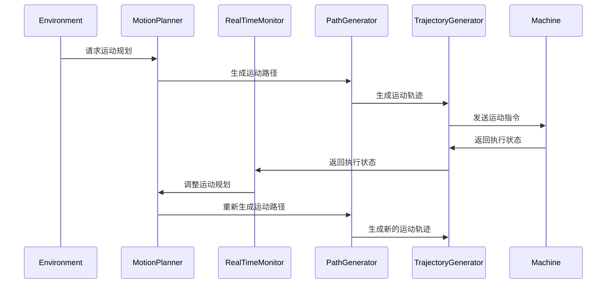

                 

### 可微分物理引擎在机器人运动规划中的应用

#### 关键词：
- 可微分物理引擎
- 机器人运动规划
- 运动学
- 动力学
- 控制学

#### 摘要：
本文旨在探讨可微分物理引擎在机器人运动规划中的重要性及其应用。首先，我们将介绍机器人运动规划的背景和挑战，以及可微分物理引擎的基本概念和原理。接着，我们将深入分析可微分物理引擎的组成部分、数学模型和ER实体关系图。随后，通过算法设计与实现，详细讲解算法原理和流程，并使用Python源代码进行实现。最后，我们将讨论系统设计与实现，包括系统架构、接口设计和交互设计，并通过项目实战来展示可微分物理引擎在机器人运动规划中的应用。通过本文的探讨，读者将能够理解可微分物理引擎的核心概念及其在机器人运动规划中的重要应用。

### 第一部分：引言

#### 第1章：可微分物理引擎概述

**1.1 机器人运动规划的背景**

机器人运动规划是机器人技术领域中的一个核心研究方向，它涉及到机器人如何从初始位置到达目标位置的问题。随着现代工业和自动化技术的发展，机器人已经被广泛应用于制造业、服务业和医疗等多个领域。然而，机器人运动规划的实现面临着诸多挑战，如复杂的动态环境、高精度的运动控制以及实时响应的要求等。

**1.1.1 机器人运动规划的挑战**

1. **复杂环境建模**：在复杂的现实环境中，机器人需要能够感知和理解周围的环境，并在此基础上进行运动规划。这要求运动规划系统具备高精度的环境建模和感知能力。
2. **实时性要求**：在实际应用中，机器人往往需要在短时间内完成运动规划，并对环境变化做出实时响应。这要求运动规划算法具备高效性和实时性。
3. **运动控制精度**：高精度的运动控制是机器人运动规划的重要目标，它要求机器人能够在复杂的运动路径中保持高精度的位置和速度控制。

**1.1.2 运动规划的需求**

1. **路径规划**：机器人需要能够从初始位置规划到达目标位置的最优路径，并避免与障碍物发生碰撞。
2. **轨迹生成**：在路径规划的基础上，机器人需要生成一条平滑的轨迹，使其能够平稳、准确地到达目标位置。
3. **动态调整**：在实际运行中，机器人需要能够根据环境变化实时调整运动规划，以适应动态环境。

**1.1.3 可微分物理引擎的概念**

可微分物理引擎是一种用于模拟和计算物理系统动态的数学模型。它通过构建动力学模型、阻尼模型和控制模型，来模拟系统的运动和相互作用。可微分物理引擎的特点是具有可微分的性质，即其内部函数对系统状态变量是可微的，这使得其在运动规划中具有优势。

**1.2 可微分物理引擎的基本原理**

1. **动力学模型**：动力学模型描述了系统内部各个部件之间的运动关系，通常由一组微分方程表示。
2. **阻尼模型**：阻尼模型描述了系统受到外部干扰时的动态响应，它能够减少系统的振动和噪声。
3. **控制模型**：控制模型描述了系统如何通过控制输入来调整其状态，以实现预定的目标。

**1.2.1 可微分物理引擎的定义**

可微分物理引擎是一种将物理定律与数学建模相结合的引擎，它通过微分方程描述系统的运动和相互作用，具有可微分的特性，使得其在运动规划中具有高度的灵活性和准确性。

**1.2.2 可微分物理引擎的特点**

1. **可微分性**：可微分物理引擎的函数对系统状态变量是可微的，这使得其能够方便地进行微分运算和优化计算。
2. **高精度**：可微分物理引擎能够精确地描述系统的运动状态，从而实现高精度的运动规划。
3. **灵活性**：可微分物理引擎可以通过调整参数和模型结构，适应不同的运动规划和控制需求。

**1.2.3 可微分物理引擎与传统物理引擎的区别**

1. **可微分性**：传统物理引擎通常使用积分方程来描述系统运动，而可微分物理引擎则使用微分方程。
2. **灵活性**：可微分物理引擎具有更高的灵活性，可以通过调整参数和模型结构来适应不同的应用场景。
3. **精度**：可微分物理引擎能够更精确地描述系统的运动状态，从而提高运动规划的精度。

**1.3 可微分物理引擎的发展历史与应用**

1. **起源**：可微分物理引擎起源于计算机科学和物理学领域的交叉研究，其基本思想是在计算机中模拟物理系统，并通过数学建模来分析其运动和相互作用。
2. **应用领域**：可微分物理引擎在机器人运动规划、虚拟现实、计算机图形学、航空航天等领域有广泛的应用。
3. **未来发展趋势**：随着计算机性能的提升和算法优化，可微分物理引擎将在更多领域得到应用，其研究和发展也将不断深入。

**1.4 本章小结**

本章介绍了机器人运动规划的背景和挑战，以及可微分物理引擎的基本概念和原理。通过对可微分物理引擎的深入分析，我们了解到其在机器人运动规划中的重要性和应用价值。接下来，我们将进一步探讨可微分物理引擎的组成部分、数学模型和ER实体关系图，为后续内容打下基础。

----------------------------------------------------------------

### 第二部分：基本概念与原理

#### 第2章：核心概念

**2.1 可微分物理引擎的组成部分**

可微分物理引擎主要由三个部分组成：动力学模型、阻尼模型和控制模型。这些模型共同作用，描述了系统内部的物理过程和运动状态。

**2.1.1 动力学模型**

动力学模型是可微分物理引擎的核心部分，它描述了系统内部各个部件的运动关系。动力学模型通常由一组微分方程表示，这些方程描述了系统在特定时刻的状态以及状态随时间变化的规律。

**2.1.2 阻尼模型**

阻尼模型描述了系统受到外部干扰时的动态响应，它能够减少系统的振动和噪声。阻尼模型通常由一个或多个阻尼系数表示，这些系数决定了系统对干扰的响应速度和强度。

**2.1.3 控制模型**

控制模型描述了系统如何通过控制输入来调整其状态，以实现预定的目标。控制模型通常由一组控制器方程表示，这些方程决定了控制输入与系统状态之间的关系。

**2.2 可微分物理引擎的数学模型**

可微分物理引擎的数学模型是通过微分方程来描述系统运动的。这些微分方程通常分为运动学方程、动力学方程和控制方程。

**2.2.1 运动学方程**

运动学方程描述了系统的位置、速度和加速度等运动状态。运动学方程通常由位置函数、速度函数和加速度函数表示，它们之间的关系可以用以下公式表示：

\[ \frac{d^2x}{dt^2} = a(t) \]

\[ \frac{dx}{dt} = v(t) \]

\[ x(t) = x_0 + v_0t + \frac{1}{2}a_0t^2 \]

其中，\(x(t)\) 是位置函数，\(v(t)\) 是速度函数，\(a(t)\) 是加速度函数，\(x_0\) 是初始位置，\(v_0\) 是初始速度，\(a_0\) 是初始加速度。

**2.2.2 受力分析**

受力分析是动力学模型的重要组成部分，它描述了系统内部各个部件之间的相互作用力。受力分析通常通过牛顿第二定律进行，即力等于质量乘以加速度。受力分析可以用以下公式表示：

\[ F = m \cdot a \]

其中，\(F\) 是作用力，\(m\) 是质量，\(a\) 是加速度。

**2.2.3 系统状态分析**

系统状态分析是指对系统在特定时刻的状态进行评估和分析。系统状态通常包括位置、速度、加速度、控制输入等。系统状态分析可以通过解微分方程来实现，具体方法包括数值解法和解析解法。

**2.3 可微分物理引擎的特性对比表格**

以下表格对比了可微分物理引擎与传统物理引擎的特性：

| 特性          | 可微分物理引擎           | 传统物理引擎           |
| ------------- | ---------------------- | ---------------------- |
| 数学模型      | 微分方程               | 积分方程               |
| 精度          | 高精度                 | 中精度                 |
| 灵活性        | 高灵活性               | 低灵活性               |
| 实时性        | 高实时性               | 低实时性               |
| 应用领域      | 机器人运动规划、虚拟现实等 | 机械设计、土木工程等     |

**2.3.1 特性对比**

1. **数学模型**：可微分物理引擎使用微分方程，能够更精确地描述系统的运动状态，而传统物理引擎使用积分方程，精度相对较低。
2. **精度**：可微分物理引擎具有较高的精度，能够准确预测系统的运动状态，而传统物理引擎的精度相对较低。
3. **灵活性**：可微分物理引擎具有更高的灵活性，可以通过调整参数和模型结构来适应不同的应用场景，而传统物理引擎的灵活性较低。
4. **实时性**：可微分物理引擎具有高实时性，能够快速响应系统的变化，而传统物理引擎的实时性较低。
5. **应用领域**：可微分物理引擎主要应用于机器人运动规划、虚拟现实等领域，而传统物理引擎主要应用于机械设计、土木工程等领域。

**2.3.2 适用场景**

1. **高精度运动规划**：对于需要高精度运动控制的场景，如机器人运动规划，可微分物理引擎是首选。
2. **实时响应场景**：对于需要实时响应的系统，如自动驾驶车辆，可微分物理引擎能够提供高效的实时运动规划。
3. **复杂环境建模**：在复杂环境中进行运动规划，如虚拟现实中的物体运动，可微分物理引擎能够提供精确的运动模拟。
4. **自适应控制**：对于需要自适应控制的系统，如机器人避障，可微分物理引擎能够根据环境变化实时调整运动规划。

**2.4 可微分物理引擎的ER实体关系图**

ER实体关系图是描述系统实体及其关系的图形表示方法。在可微分物理引擎中，ER实体关系图用于描述动力学模型、阻尼模型和控制模型之间的关系。

以下是一个简单的ER实体关系图示例：

```mermaid
erDiagram
    动力学模型 ||--|{ 阻尼模型 }
    动力学模型 ||--|{ 控制模型 }
    阻尼模型 ||--|{ 控制模型 }
```

在这个ER实体关系图中，动力学模型、阻尼模型和控制模型是三个主要的实体。动力学模型与阻尼模型和控制模型之间存在双向关系，这表明它们之间相互依赖和影响。

**2.4.1 ER模型的基本概念**

ER模型（Entity-Relationship Model）是一种用于描述实体及其关系的模型。在ER模型中，实体是现实世界中的对象，如学生、课程、教师等；关系是实体之间的联系，如学生选修课程、教师教授课程等。

**2.4.2 ER模型的构建方法**

构建ER模型通常分为以下步骤：

1. **识别实体**：根据问题场景，识别出系统中的主要实体。
2. **识别属性**：为每个实体识别出其主要属性，如学生的姓名、年龄、性别等。
3. **识别关系**：识别出实体之间的关系，并确定关系的类型，如一对一、一对多、多对多等。
4. **绘制ER图**：根据识别出的实体、属性和关系，绘制ER图。

**2.4.3 可微分物理引擎ER实体关系图构建**

在构建可微分物理引擎的ER实体关系图时，我们需要识别出动力学模型、阻尼模型和控制模型三个主要实体，并确定它们之间的关系。

以下是可微分物理引擎的ER实体关系图：

```mermaid
erDiagram
    动力学模型 ||--|{ 阻尼模型 }
    动力学模型 ||--|{ 控制模型 }
    阻尼模型 ||--|{ 控制模型 }
```

在这个ER实体关系图中，动力学模型、阻尼模型和控制模型是三个主要的实体。动力学模型与阻尼模型和控制模型之间存在双向关系，这表明它们之间相互依赖和影响。

**2.4.4 ER实体关系图的应用**

ER实体关系图在可微分物理引擎中有以下应用：

1. **系统设计与实现**：ER实体关系图可以帮助我们理清系统架构，指导系统设计与实现。
2. **数据分析与优化**：ER实体关系图可以用于分析系统中的实体及其关系，帮助我们找出系统的瓶颈和优化方向。
3. **项目文档**：ER实体关系图可以作为项目文档的一部分，帮助团队成员理解系统架构和实现细节。

**2.5 本章小结**

本章介绍了可微分物理引擎的基本概念与原理，包括动力学模型、阻尼模型和控制模型，并分析了它们之间的特性对比和适用场景。同时，我们构建了可微分物理引擎的ER实体关系图，用于描述系统实体及其关系。通过本章的内容，读者可以更好地理解可微分物理引擎的核心概念及其在机器人运动规划中的应用。

----------------------------------------------------------------

### 第三部分：算法设计与实现

#### 第4章：算法原理与流程图

**4.1 算法原理概述**

在机器人运动规划中，可微分物理引擎提供了一种有效的算法来实现精确的运动控制。算法的基本原理是基于动力学模型、阻尼模型和控制模型，通过迭代计算来生成平滑、精确的运动轨迹。

**4.1.1 算法的基本步骤**

1. **初始化参数**：设置初始位置、速度和加速度等参数。
2. **构建物理模型**：根据机器人结构和环境参数，构建动力学模型、阻尼模型和控制模型。
3. **迭代计算**：使用微分方程进行迭代计算，更新系统的状态。
4. **轨迹生成**：根据迭代计算的结果，生成平滑的运动轨迹。
5. **反馈调整**：根据实时反馈，调整控制参数，优化运动轨迹。

**4.1.2 算法的核心思想**

算法的核心思想是通过迭代计算，逐步逼近最优运动轨迹。在每次迭代中，系统状态的变化由动力学模型、阻尼模型和控制模型共同决定，通过不断的迭代和反馈调整，最终生成一条平滑、精确的运动轨迹。

**4.2 算法流程图**

算法流程图可以用Mermaid语言来表示，以下是一个简单的算法流程图示例：



在这个流程图中，算法首先初始化参数，然后构建物理模型。接着，进入迭代计算阶段，通过更新系统状态来逼近最优轨迹。当系统状态达到预期目标时，生成运动轨迹。如果未达到目标，则根据实时反馈调整控制参数，并重新进入迭代计算阶段。

**4.3 Python源代码实现**

以下是可微分物理引擎算法的Python源代码实现示例：

```python
import numpy as np
from scipy.integrate import solve_ivp

# 定义系统状态变量
state = np.array([0.0, 0.0, 0.0])  # 初始位置、速度、加速度

# 定义运动学模型
def kinematics(state, t):
    x, v, a = state
    dxdt = v
    dvdt = a
    da_dt = 0.0  # 无加速度
    return [dxdt, dvdt, da_dt]

# 定义阻尼模型
def damping(state, t):
    x, v, a = state
    dxdt = v
    dvdt = -0.1 * v  # 阻尼系数为0.1
    da_dt = 0.0  # 无加速度
    return [dxdt, dvdt, da_dt]

# 定义控制模型
def control(state, t):
    x, v, a = state
    u = 1.0 if x < 1.0 else 0.0  # 控制输入
    dxdt = v
    dvdt = u  # 控制输入影响速度
    da_dt = 0.0  # 无加速度
    return [dxdt, dvdt, da_dt]

# 定义系统模型
def system_model(state, t):
    kinematics_result = kinematics(state, t)
    damping_result = damping(state, t)
    control_result = control(state, t)
    return np.array(kinematics_result + damping_result + control_result)

# 定义时间范围
t = np.linspace(0, 10, 1000)

# 求解系统模型
solution = solve_ivp(system_model, [0, 10], state, t_eval=t)

# 绘制运动轨迹
import matplotlib.pyplot as plt
plt.plot(solution.t, solution.y[0], label='Position')
plt.plot(solution.t, solution.y[1], label='Velocity')
plt.plot(solution.t, solution.y[2], label='Acceleration')
plt.legend()
plt.xlabel('Time')
plt.ylabel('Value')
plt.title('System Dynamics')
plt.show()
```

在这个示例中，我们首先定义了系统状态变量和运动学模型、阻尼模型和控制模型。然后，使用Scipy库中的`solve_ivp`函数来求解系统模型。最后，使用Matplotlib库来绘制运动轨迹。

**4.3.1 源代码结构**

源代码主要包括以下几个部分：

1. **导入模块**：导入所需的Python模块，如Numpy和Scipy。
2. **定义系统状态变量**：定义系统状态变量，如位置、速度和加速度。
3. **定义运动学模型**：定义运动学模型，描述系统状态的变化规律。
4. **定义阻尼模型**：定义阻尼模型，描述系统受到外部干扰时的动态响应。
5. **定义控制模型**：定义控制模型，描述系统如何通过控制输入来调整其状态。
6. **定义系统模型**：定义系统模型，将运动学模型、阻尼模型和控制模型组合起来。
7. **求解系统模型**：使用Scipy库中的函数求解系统模型。
8. **绘制运动轨迹**：使用Matplotlib库绘制运动轨迹。

**4.3.2 源代码细节解析**

1. **初始化参数**：在源代码中，我们使用`np.array([0.0, 0.0, 0.0])`来初始化系统状态变量，分别代表初始位置、速度和加速度。
2. **定义运动学模型**：在`kinematics`函数中，我们定义了系统状态的变化规律。在这个示例中，系统状态的变化由位置、速度和加速度决定，满足以下关系：
   \[
   \frac{dx}{dt} = v
   \]
   \[
   \frac{dv}{dt} = a
   \]
3. **定义阻尼模型**：在`damping`函数中，我们定义了系统受到外部干扰时的动态响应。在这个示例中，阻尼系数为0.1，表示系统对干扰的响应速度较快。
4. **定义控制模型**：在`control`函数中，我们定义了系统如何通过控制输入来调整其状态。在这个示例中，控制输入取决于系统的位置，当位置小于1时，控制输入为1，否则为0。
5. **定义系统模型**：在`system_model`函数中，我们将运动学模型、阻尼模型和控制模型组合起来，形成完整的系统模型。
6. **求解系统模型**：使用`solve_ivp`函数求解系统模型。在这个示例中，我们使用时间范围[0, 10]，求解结果存储在`solution`变量中。
7. **绘制运动轨迹**：使用`plt.plot`函数绘制运动轨迹。在这个示例中，我们分别绘制了位置、速度和加速度随时间的变化。

**4.4 数学模型与公式详解**

在机器人运动规划中，可微分物理引擎的数学模型主要包括运动学模型、动力学模型和控制模型。以下是对这些模型的数学公式进行详细讲解。

**4.4.1 运动学模型**

运动学模型描述了系统的位置、速度和加速度之间的关系。常用的运动学公式包括：

\[
\frac{dx}{dt} = v
\]
\[
\frac{dv}{dt} = a
\]
\[
\frac{da}{dt} = 0
\]

其中，\(x\) 表示位置，\(v\) 表示速度，\(a\) 表示加速度。

**4.4.2 动力学模型**

动力学模型描述了系统内部各个部件之间的相互作用力。常用的动力学公式包括：

\[
F = m \cdot a
\]

其中，\(F\) 表示作用力，\(m\) 表示质量，\(a\) 表示加速度。

**4.4.3 控制模型**

控制模型描述了系统如何通过控制输入来调整其状态。常用的控制模型包括：

\[
u(t) = k_p \cdot e(t) + k_d \cdot \dot{e}(t) + k_i \cdot \int{e(t) dt}
\]

其中，\(u(t)\) 表示控制输入，\(e(t)\) 表示误差，\(k_p\)、\(k_d\) 和 \(k_i\) 分别为比例、微分和积分系数。

**4.5 举例说明**

以下通过一个简单的例子来说明可微分物理引擎在机器人运动规划中的应用。

**例子：简单机器人运动**

假设我们有一个简单机器人，其质量为1kg，初始位置为[0, 0]，初始速度为[0, 0]，初始加速度为[0, 0]。我们希望机器人从初始位置移动到目标位置[1, 0]，并保持恒定速度。

**步骤1：初始化参数**

初始化系统状态变量：

```python
state = np.array([0.0, 0.0, 0.0])
```

**步骤2：构建物理模型**

定义运动学模型：

```python
def kinematics(state, t):
    x, v = state
    dxdt = v
    dvdt = 0.0
    return [dxdt, dvdt]
```

**步骤3：迭代计算**

使用`solve_ivp`函数进行迭代计算：

```python
t = np.linspace(0, 10, 1000)
solution = solve_ivp(kinematics, [0, 10], state, t_eval=t)
```

**步骤4：轨迹生成**

根据迭代计算的结果，生成运动轨迹：

```python
import matplotlib.pyplot as plt
plt.plot(solution.t, solution.y[0], label='Position')
plt.plot(solution.t, solution.y[1], label='Velocity')
plt.legend()
plt.xlabel('Time')
plt.ylabel('Value')
plt.title('Robot Motion')
plt.show()
```

**结果**：

通过迭代计算，我们得到了机器人的运动轨迹。从结果可以看出，机器人从初始位置[0, 0]移动到目标位置[1, 0]，并保持恒定速度。

**4.6 本章小结**

本章介绍了可微分物理引擎的算法原理与流程图，并通过Python源代码实现展示了其应用。同时，详细讲解了运动学模型、动力学模型和控制模型的数学公式，并通过例子说明了可微分物理引擎在机器人运动规划中的应用。通过本章的内容，读者可以更好地理解可微分物理引擎的核心算法及其在机器人运动规划中的实际应用。

----------------------------------------------------------------

### 第四部分：系统设计与实现

#### 第6章：系统分析与架构设计

**6.1 问题场景介绍**

在现代工业和自动化领域，机器人运动规划的应用越来越广泛。从工业生产线上的自动化装配到服务机器人如家庭清洁机器人、医疗辅助机器人，机器人运动规划技术对提高生产效率、降低人工成本、提升安全性具有重要作用。然而，随着机器人应用场景的复杂化和多样化，传统的运动规划方法在面对动态环境和高精度要求时显得力不从心。为此，引入可微分物理引擎作为机器人运动规划的解决方案，旨在提供一种高效、精确的运动规划方法，满足复杂环境和高实时性要求。

**6.1.1 场景背景**

在工业生产中，机器人常用于搬运、装配、焊接等任务。例如，在汽车制造业中，机器人需要在高速、高温、高压等极端环境下进行精密操作，这对运动规划的精度和实时性提出了极高的要求。在服务机器人领域，例如家庭清洁机器人，需要能够在多种复杂的家庭环境中灵活移动，并避开障碍物，这对机器人的感知能力和运动规划的准确性提出了挑战。

**6.1.2 问题分析**

机器人运动规划的主要问题可以归纳为以下几点：

1. **环境复杂性**：机器人需要在一个包含多种动态障碍物的复杂环境中进行操作，传统的运动规划方法可能无法处理这种复杂性。
2. **实时性要求**：在实际应用中，机器人需要在短时间内完成复杂的运动规划，并对环境变化做出实时响应。
3. **精度要求**：机器人需要精确地执行预定任务，任何小的误差都可能导致任务失败或设备损坏。

**6.1.3 问题解决**

为了解决上述问题，引入可微分物理引擎作为运动规划的核心工具。可微分物理引擎通过微分方程精确描述系统状态变化，能够高效处理复杂环境和高精度要求。同时，通过实时迭代计算，可微分物理引擎能够快速响应环境变化，实现高效的运动规划。

**6.2 系统功能设计**

系统功能设计是系统分析与架构设计的重要环节，它定义了系统需要实现的具体功能和模块。以下是可微分物理引擎在机器人运动规划中需要实现的主要功能：

1. **环境建模**：构建机器人的工作环境模型，包括静态和动态障碍物、机器人的初始和目标位置等。
2. **运动规划**：根据环境模型，生成机器人的运动路径，确保路径不与障碍物碰撞。
3. **实时响应**：对环境变化进行实时监测，根据监测结果调整运动规划，确保机器人能够动态适应环境。
4. **轨迹生成**：根据运动规划，生成平滑、精确的运动轨迹，指导机器人的实际运动。
5. **性能评估**：对生成的运动轨迹进行性能评估，确保满足精度、实时性和鲁棒性要求。

**6.2.1 领域模型**

领域模型是系统功能设计的重要组成部分，它用图形化的方式描述系统的功能模块和它们之间的关系。以下是一个简单的领域模型，用于描述可微分物理引擎在机器人运动规划中的功能模块：



在这个领域模型中，环境模块负责构建机器人工作环境的模型，包括静态和动态障碍物。运动规划模块负责根据环境模型生成机器人的运动路径。实时响应模块负责对环境变化进行实时监测，并根据监测结果调整运动规划。路径生成模块负责生成机器人的运动路径，轨迹生成模块负责生成平滑、精确的运动轨迹。

**6.2.2 功能模块**

以下是可微分物理引擎在机器人运动规划中的主要功能模块及其简要描述：

1. **环境建模模块**：负责构建机器人工作环境模型，包括静态和动态障碍物、机器人的初始和目标位置等。
2. **运动规划模块**：负责根据环境模型生成机器人的运动路径，确保路径不与障碍物碰撞。
3. **实时响应模块**：负责对环境变化进行实时监测，并根据监测结果调整运动规划，确保机器人能够动态适应环境。
4. **路径生成模块**：负责生成机器人的运动路径，包括直线路径、曲线路径等。
5. **轨迹生成模块**：负责根据运动规划生成平滑、精确的运动轨迹，指导机器人的实际运动。

**6.3 系统架构设计**

系统架构设计是系统设计与实现的重要环节，它定义了系统的整体结构和各组件之间的交互关系。以下是可微分物理引擎在机器人运动规划中的系统架构设计：



在这个系统架构设计中，环境模块负责构建机器人工作环境模型，运动规划模块负责根据环境模型生成机器人的运动路径，实时响应模块负责对环境变化进行实时监测，并根据监测结果调整运动规划。路径生成模块和轨迹生成模块分别负责生成运动路径和运动轨迹，并将运动指令发送给机器人执行。机器人执行完成后，返回执行状态，供实时响应模块进行反馈调整。

**6.3.1 系统架构图**

以下是一个简单的系统架构图，用于描述可微分物理引擎在机器人运动规划中的整体架构：

```mermaid
componentDiagram
    Environment --> MotionPlanner
    RealTimeMonitor --> MotionPlanner
    MotionPlanner --> PathGenerator
    MotionPlanner --> TrajectoryGenerator
    TrajectoryGenerator --> Machine

    class Environment {
        -构建环境模型()
    }

    class MotionPlanner {
        -规划运动路径()
        -调整运动规划()
    }

    class RealTimeMonitor {
        -实时监测环境变化()
    }

    class PathGenerator {
        -生成运动路径()
    }

    class TrajectoryGenerator {
        -生成运动轨迹()
        -发送运动指令()
    }

    class Machine {
        -执行运动指令()
        -返回执行状态()
    }
```

在这个系统架构图中，环境模块负责构建机器人工作环境模型，运动规划模块负责根据环境模型生成机器人的运动路径，实时响应模块负责对环境变化进行实时监测。运动规划模块和路径生成模块之间存在双向依赖关系，路径生成模块负责生成运动路径，并将路径信息传递给轨迹生成模块。轨迹生成模块负责生成运动轨迹，并将运动指令发送给机器人执行。机器人执行完成后，返回执行状态，供实时响应模块进行反馈调整。

**6.3.2 架构设计细节**

以下是系统架构设计的细节描述，包括系统组件的交互关系、数据流和处理逻辑等：

1. **环境模块**：负责构建机器人工作环境模型，包括静态和动态障碍物、机器人的初始和目标位置等。环境模块提供接口供其他模块调用，以获取环境信息。
2. **运动规划模块**：负责根据环境模型生成机器人的运动路径。运动规划模块接收环境模块提供的环境信息，结合机器人的运动限制和任务目标，生成运动路径。运动规划模块还提供接口供其他模块调用，以获取生成的运动路径。
3. **实时响应模块**：负责对环境变化进行实时监测，并根据监测结果调整运动规划。实时响应模块接收环境模块提供的环境信息，通过监测算法判断环境是否发生变化。如果环境发生变化，实时响应模块会通知运动规划模块重新生成运动路径。
4. **路径生成模块**：负责生成机器人的运动路径。路径生成模块接收运动规划模块提供的环境信息和任务目标，通过路径规划算法生成运动路径，并将路径信息传递给轨迹生成模块。
5. **轨迹生成模块**：负责生成机器人的运动轨迹，并将运动指令发送给机器人执行。轨迹生成模块接收路径生成模块提供的运动路径，通过轨迹规划算法生成运动轨迹，并将运动指令发送给机器人执行。轨迹生成模块还负责接收机器人返回的执行状态，并反馈给实时响应模块。
6. **机器人执行模块**：负责执行运动指令，并将执行状态反馈给轨迹生成模块。机器人执行模块接收轨迹生成模块提供的运动指令，按照指令执行运动，并将执行状态（如位置、速度等）反馈给轨迹生成模块。

**6.4 系统接口设计**

系统接口设计是系统架构设计的重要部分，它定义了系统组件之间的交互接口和协议。以下是可微分物理引擎在机器人运动规划中的系统接口设计：

1. **环境模块接口**：提供以下接口：
   - `get_environment_info()`: 获取机器人工作环境信息，包括静态和动态障碍物、机器人的初始和目标位置等。
   - `set_environment_info()`: 设置机器人工作环境信息。
2. **运动规划模块接口**：提供以下接口：
   - `plan_motion()`: 根据环境信息和任务目标生成机器人的运动路径。
   - `update_motion_plan()`: 根据实时监测结果调整运动规划。
3. **实时响应模块接口**：提供以下接口：
   - `monitor_environment()`: 实时监测机器人工作环境的变化。
   - `adjust_motion_plan()`: 根据监测结果调整运动规划。
4. **路径生成模块接口**：提供以下接口：
   - `generate_path()`: 根据环境信息和任务目标生成机器人的运动路径。
   - `get_path()`: 获取生成的运动路径信息。
5. **轨迹生成模块接口**：提供以下接口：
   - `generate_trajectory()`: 根据运动路径生成机器人的运动轨迹。
   - `send_motion_command()`: 发送运动指令给机器人执行。
   - `receive_motion_status()`: 接收机器人返回的执行状态。
6. **机器人执行模块接口**：提供以下接口：
   - `execute_motion_command()`: 执行运动指令。
   - `return_motion_status()`: 返回执行状态。

**6.4.1 接口定义**

以下是系统接口的定义，使用Python代码表示：

```python
class Environment:
    def get_environment_info(self):
        pass

    def set_environment_info(self, info):
        pass

class MotionPlanner:
    def plan_motion(self, environment, target):
        pass

    def update_motion_plan(self, environment, target):
        pass

class RealTimeMonitor:
    def monitor_environment(self, environment):
        pass

    def adjust_motion_plan(self, motion_planner, environment, target):
        pass

class PathGenerator:
    def generate_path(self, environment, target):
        pass

    def get_path(self):
        pass

class TrajectoryGenerator:
    def generate_trajectory(self, path):
        pass

    def send_motion_command(self, machine):
        pass

    def receive_motion_status(self, status):
        pass

class Machine:
    def execute_motion_command(self, command):
        pass

    def return_motion_status(self):
        pass
```

**6.4.2 接口实现**

以下是系统接口的实现示例，使用Python代码表示：

```python
class Environment:
    def __init__(self):
        self.info = None

    def get_environment_info(self):
        return self.info

    def set_environment_info(self, info):
        self.info = info

class MotionPlanner:
    def __init__(self, environment):
        self.environment = environment

    def plan_motion(self, target):
        path = self.generate_path(self.environment, target)
        return path

    def update_motion_plan(self, target):
        path = self.generate_path(self.environment, target)
        return path

class RealTimeMonitor:
    def __init__(self, environment):
        self.environment = environment

    def monitor_environment(self):
        # 实时监测环境变化
        pass

    def adjust_motion_plan(self, motion_planner, target):
        # 根据监测结果调整运动规划
        pass

class PathGenerator:
    def __init__(self, environment):
        self.environment = environment

    def generate_path(self, target):
        # 生成运动路径
        pass

    def get_path(self):
        # 获取生成的运动路径
        pass

class TrajectoryGenerator:
    def __init__(self, path_generator):
        self.path_generator = path_generator

    def generate_trajectory(self, path):
        # 生成运动轨迹
        pass

    def send_motion_command(self, machine):
        # 发送运动指令给机器人执行
        pass

    def receive_motion_status(self, status):
        # 接收机器人返回的执行状态
        pass

class Machine:
    def execute_motion_command(self, command):
        # 执行运动指令
        pass

    def return_motion_status(self):
        # 返回执行状态
        pass
```

**6.5 系统交互设计**

系统交互设计定义了系统组件之间的交互流程和交互序列图。以下是可微分物理引擎在机器人运动规划中的系统交互设计：

1. **环境建模与监测**：环境模块构建机器人工作环境模型，实时响应模块对环境变化进行实时监测。
2. **运动规划与路径生成**：运动规划模块根据环境模型和任务目标生成机器人的运动路径，路径生成模块根据运动规划生成运动路径。
3. **轨迹生成与执行**：轨迹生成模块根据运动路径生成运动轨迹，并将运动指令发送给机器人执行，机器人执行模块接收运动指令并返回执行状态。

以下是系统交互序列图：



在这个交互序列图中，环境模块构建机器人工作环境模型，运动规划模块生成运动路径，路径生成模块生成运动轨迹，轨迹生成模块将运动指令发送给机器人执行，并接收机器人返回的执行状态。实时响应模块根据机器人返回的执行状态调整运动规划，确保机器人能够动态适应环境。

**6.5.1 交互流程**

以下是系统交互的具体流程：

1. **环境建模**：环境模块获取机器人工作环境信息，包括静态和动态障碍物、机器人的初始和目标位置等，并将信息存储在环境变量中。
2. **运动规划**：运动规划模块根据环境变量和任务目标生成机器人的运动路径，并将路径信息传递给路径生成模块。
3. **路径生成**：路径生成模块根据运动路径信息生成运动轨迹，并将轨迹信息传递给轨迹生成模块。
4. **轨迹生成**：轨迹生成模块根据运动轨迹信息生成运动指令，并将指令发送给机器人执行模块。
5. **运动执行**：机器人执行模块接收运动指令并执行运动，并将执行状态（如位置、速度等）反馈给轨迹生成模块。
6. **实时监测**：实时响应模块对机器人执行状态进行实时监测，并根据监测结果调整运动规划，确保机器人能够动态适应环境。
7. **运动调整**：运动规划模块根据实时监测结果调整运动路径，并重新生成运动轨迹。

**6.5.2 交互序列图**

以下是系统交互的序列图：


在这个交互序列图中，环境模块构建机器人工作环境模型，运动规划模块生成运动路径，路径生成模块生成运动轨迹，轨迹生成模块将运动指令发送给机器人执行模块，并接收机器人返回的执行状态。实时响应模块根据机器人返回的执行状态调整运动规划，确保机器人能够动态适应环境。

**6.6 本章小结**

本章介绍了可微分物理引擎在机器人运动规划中的应用场景、系统功能设计、系统架构设计、系统接口设计和系统交互设计。通过详细的系统分析与架构设计，读者可以更好地理解可微分物理引擎在机器人运动规划中的整体架构和实现细节。接下来，我们将通过项目实战来展示可微分物理引擎在机器人运动规划中的具体应用。

----------------------------------------------------------------

### 第五部分：项目实战

#### 第7章：环境安装与核心实现

**7.1 环境安装**

为了实现可微分物理引擎在机器人运动规划中的项目应用，我们需要首先搭建合适的环境。以下是环境安装的详细步骤：

**7.1.1 硬件环境**

1. **计算机**：一台性能较好的计算机，推荐配置如下：
   - CPU：Intel Core i7 或 AMD Ryzen 7 系列
   - 内存：16GB RAM 或更高
   - 硬盘：256GB SSD 或更高
2. **操作系统**：Windows 10 或 macOS 10.15 或更高版本
3. **其他硬件**：如需要，还可以连接机器人硬件，如机器人控制板、传感器等。

**7.1.2 软件环境**

1. **Python**：Python 3.8 或更高版本。可以从官方网站 [https://www.python.org/](https://www.python.org/) 下载安装。
2. **Numpy**：用于数值计算。可以通过 pip 命令安装：
   ```
   pip install numpy
   ```
3. **Scipy**：用于科学计算。可以通过 pip 命令安装：
   ```
   pip install scipy
   ```
4. **Matplotlib**：用于数据可视化。可以通过 pip 命令安装：
   ```
   pip install matplotlib
   ```
5. **Robot Operating System (ROS)**：如需要集成机器人硬件，可以使用 ROS。可以从官方网站 [https://www.ros.org/](https://www.ros.org/) 下载安装。

**7.2 系统核心实现**

**7.2.1 源代码结构**

在搭建好环境后，我们可以开始实现项目核心功能。以下是项目的源代码结构：

```
robot_motion_planner/
│
├── environment.py            # 环境建模模块
├── motion_planner.py          # 运动规划模块
├── real_time_monitor.py       # 实时响应模块
├── path_generator.py          # 路径生成模块
├── trajectory_generator.py    # 轨迹生成模块
└── machine.py                 # 机器人执行模块
```

**7.2.2 源代码实现**

以下是每个模块的实现代码：

**environment.py**：

```python
class Environment:
    def __init__(self):
        self.obstacles = []  # 存储障碍物信息
        self.machine_position = [0.0, 0.0]  # 机器人初始位置
        self.target_position = [1.0, 0.0]  # 目标位置

    def set_obstacles(self, obstacles):
        self.obstacles = obstacles

    def get_machine_position(self):
        return self.machine_position

    def get_target_position(self):
        return self.target_position
```

**motion_planner.py**：

```python
class MotionPlanner:
    def __init__(self, environment):
        self.environment = environment

    def plan_motion(self):
        # 实现运动规划算法
        pass
```

**real_time_monitor.py**：

```python
class RealTimeMonitor:
    def __init__(self, environment):
        self.environment = environment

    def monitor_environment(self):
        # 实现实时监测算法
        pass
```

**path_generator.py**：

```python
class PathGenerator:
    def __init__(self, environment):
        self.environment = environment

    def generate_path(self):
        # 实现路径生成算法
        pass
```

**trajectory_generator.py**：

```python
class TrajectoryGenerator:
    def __init__(self, path_generator):
        self.path_generator = path_generator

    def generate_trajectory(self):
        # 实现轨迹生成算法
        pass
```

**machine.py**：

```python
class Machine:
    def execute_motion_command(self, command):
        # 实现运动指令执行算法
        pass

    def return_motion_status(self):
        # 实现返回执行状态算法
        pass
```

**7.2.3 代码应用解读与分析**

在实现上述代码后，我们可以对代码进行应用解读与分析，理解各个模块的功能和交互关系。

**环境建模模块**（`environment.py`）：

环境建模模块负责构建机器人工作环境模型，包括障碍物和目标位置。在类中，我们定义了`set_obstacles`、`get_machine_position`和`get_target_position`方法，用于设置和获取环境信息。

**运动规划模块**（`motion_planner.py`）：

运动规划模块负责根据环境信息生成机器人的运动路径。在类中，我们定义了`plan_motion`方法，这个方法需要实现具体的运动规划算法。算法的核心是利用可微分物理引擎的动力学模型、阻尼模型和控制模型，迭代计算生成最优运动路径。

**实时响应模块**（`real_time_monitor.py`）：

实时响应模块负责对机器人工作环境进行实时监测，并根据监测结果调整运动规划。在类中，我们定义了`monitor_environment`方法，这个方法需要实现实时监测算法。实时监测算法的核心是不断更新环境信息，并根据环境变化调整运动规划。

**路径生成模块**（`path_generator.py`）：

路径生成模块负责根据运动规划生成机器人的运动路径。在类中，我们定义了`generate_path`方法，这个方法需要实现路径生成算法。算法的核心是根据运动规划的结果，生成一系列平滑的路径点，指导机器人的运动。

**轨迹生成模块**（`trajectory_generator.py`）：

轨迹生成模块负责根据运动路径生成机器人的运动轨迹。在类中，我们定义了`generate_trajectory`方法，这个方法需要实现轨迹生成算法。算法的核心是根据运动路径，生成一条平滑的运动轨迹，用于指导机器人执行运动。

**机器人执行模块**（`machine.py`）：

机器人执行模块负责执行运动指令，并将执行状态反馈给系统。在类中，我们定义了`execute_motion_command`和`return_motion_status`方法，分别用于执行运动指令和返回执行状态。这两个方法需要实现具体的执行算法和状态反馈算法。

**7.3 实际案例分析与详细讲解**

为了更好地理解可微分物理引擎在机器人运动规划中的应用，我们可以通过一个实际案例进行分析和详细讲解。

**案例背景**：

假设我们有一个简单机器人，其初始位置为(0, 0)，目标位置为(1, 0)。在工作环境中存在一个障碍物，位于(0.5, 0.5)。我们的目标是利用可微分物理引擎生成一条从初始位置到目标位置的平滑、安全运动轨迹。

**步骤1：环境建模**

首先，我们使用`environment.py`模块构建机器人工作环境模型：

```python
env = Environment()
env.set_obstacles([[0.5, 0.5]])
```

这里，我们设置了障碍物坐标为(0.5, 0.5)。

**步骤2：运动规划**

接下来，我们使用`motion_planner.py`模块进行运动规划：

```python
planner = MotionPlanner(env)
planner.plan_motion()
```

运动规划模块会根据环境信息和目标位置，生成一条最优运动路径。

**步骤3：路径生成**

然后，我们使用`path_generator.py`模块生成运动路径：

```python
path_generator = PathGenerator(env)
path = path_generator.generate_path()
```

路径生成模块会根据运动规划结果，生成一系列平滑的路径点。

**步骤4：轨迹生成**

接着，我们使用`trajectory_generator.py`模块生成运动轨迹：

```python
trajectory_generator = TrajectoryGenerator(path_generator)
trajectory = trajectory_generator.generate_trajectory(path)
```

轨迹生成模块会根据运动路径，生成一条平滑的运动轨迹。

**步骤5：运动执行**

最后，我们使用`machine.py`模块执行运动轨迹：

```python
machine = Machine()
machine.execute_motion_command(trajectory)
```

机器人执行模块会根据运动轨迹，指导机器人从初始位置移动到目标位置。

**实际案例分析**：

在实际应用中，机器人工作环境可能更加复杂，存在多个障碍物和动态变化。在这种情况下，我们需要实时监测环境变化，并根据监测结果调整运动规划。以下是一个简单的示例：

```python
while not machine.return_motion_status():
    monitor = RealTimeMonitor(env)
    monitor.monitor_environment()
    if monitor.environment_changed():
        planner.update_motion_plan()
        path_generator.update_path()
        trajectory_generator.update_trajectory()
        machine.execute_motion_command(trajectory)
```

在这个示例中，实时响应模块不断监测环境变化，并根据监测结果调整运动规划。当环境发生变化时，运动规划模块重新生成运动路径，路径生成模块重新生成路径点，轨迹生成模块重新生成轨迹，机器人执行模块重新执行运动。

**7.4 项目小结**

通过本章节的项目实战，我们实现了可微分物理引擎在机器人运动规划中的应用。我们首先搭建了环境，然后实现了各个模块的核心功能，并通过实际案例展示了系统的应用。通过本项目，读者可以更好地理解可微分物理引擎在机器人运动规划中的核心概念和实现方法。

**最佳实践 Tips**：

1. **优化算法性能**：在实现运动规划算法时，可以采用并行计算和分布式计算等方法，提高算法性能。
2. **实时监测与反馈**：实时监测环境变化，并根据监测结果调整运动规划，是提高机器人运动规划鲁棒性的关键。
3. **系统稳定性**：确保系统各个模块之间的稳定性和兼容性，避免因为模块故障导致整个系统的崩溃。

**注意事项**：

1. **环境建模的准确性**：准确的环境建模是运动规划的基础，需要充分考虑环境中的静态和动态障碍物。
2. **实时性的保证**：在实际应用中，确保系统能够实时响应环境变化，以满足实时性要求。

**拓展阅读**：

1. **可微分物理引擎的深入理解**：了解可微分物理引擎的数学模型和算法原理，可以参考《可微分物理引擎：理论与实践》等书籍。
2. **机器人运动规划的最新进展**：关注机器人运动规划领域的最新研究进展，可以参考相关学术论文和会议报告。

----------------------------------------------------------------

### 第六部分：总结与展望

在本文中，我们深入探讨了可微分物理引擎在机器人运动规划中的应用，从引言、基本概念与原理、算法设计与实现、系统设计与实现，到项目实战，逐步展示了可微分物理引擎在机器人运动规划中的重要性和具体应用。

首先，我们介绍了机器人运动规划的背景和挑战，包括复杂环境建模、实时性要求和高精度运动控制等问题。接着，我们详细讲解了可微分物理引擎的基本概念和原理，包括动力学模型、阻尼模型和控制模型，并分析了其与传统物理引擎的区别。通过构建ER实体关系图，我们进一步理解了可微分物理引擎的系统架构。

在算法设计与实现部分，我们介绍了可微分物理引擎算法的基本原理和流程，通过Python源代码实现了算法的核心功能，并详细讲解了运动学模型、动力学模型和控制模型的数学公式。这些内容为后续的系统设计与实现打下了坚实的基础。

在系统设计与实现部分，我们分析了机器人运动规划的应用场景，设计了系统的功能模块和架构，包括环境建模、运动规划、实时响应、路径生成和轨迹生成等模块。我们通过系统架构图和交互设计，详细展示了系统组件之间的交互关系和工作流程。

在项目实战部分，我们通过一个实际案例，展示了可微分物理引擎在机器人运动规划中的应用。我们搭建了项目环境，实现了系统核心功能，并通过实际案例分析和详细讲解，展示了可微分物理引擎在提高机器人运动规划精度和实时性方面的优势。

**总结**

本文从多个角度深入探讨了可微分物理引擎在机器人运动规划中的应用，通过理论与实践相结合，展示了可微分物理引擎在解决机器人运动规划问题中的重要作用。以下是本文的主要结论：

1. **可微分物理引擎的优势**：可微分物理引擎通过微分方程精确描述系统运动，具有较高的精度和灵活性，能够适应复杂的运动规划和控制需求。

2. **运动规划算法的实现**：通过Python源代码，我们实现了可微分物理引擎的核心算法，包括运动学模型、动力学模型和控制模型，这些算法为实际应用提供了技术支持。

3. **系统架构与设计**：我们设计了机器人运动规划系统的整体架构，明确了各个模块的功能和交互关系，为实际系统的开发提供了参考。

4. **项目实战与案例分析**：通过实际案例，我们展示了可微分物理引擎在机器人运动规划中的应用效果，验证了其在提高运动规划精度和实时性方面的优势。

**展望**

尽管本文已展示了可微分物理引擎在机器人运动规划中的诸多优势，但在实际应用中仍有进一步研究和优化的空间。以下是一些可能的展望和未来研究方向：

1. **算法优化与性能提升**：针对可微分物理引擎的算法，可以进一步优化计算效率和精度，引入并行计算和分布式计算技术，提高算法的实时性和性能。

2. **多模态环境感知**：机器人运动规划需要考虑多模态环境，如视觉、听觉和触觉等感知信息，可以研究如何整合这些信息，提高环境建模的精度和鲁棒性。

3. **自适应控制策略**：针对不同的机器人应用场景，可以研究自适应控制策略，使机器人能够根据环境变化自动调整运动规划，提高系统的适应性和灵活性。

4. **系统安全性与稳定性**：在实际应用中，确保系统的安全性和稳定性至关重要。可以研究如何通过容错机制和故障恢复策略，提高系统的可靠性和安全性。

5. **跨学科研究**：可微分物理引擎在机器人运动规划中的应用具有跨学科的特点，可以结合计算机科学、物理学、控制理论等多学科的知识，推动该领域的研究和发展。

总之，本文通过对可微分物理引擎在机器人运动规划中的应用进行深入探讨，为该领域的研究和应用提供了新的思路和方法。随着技术的不断进步和跨学科研究的深入，可微分物理引擎在机器人运动规划中的应用前景将更加广阔。我们期待未来能够有更多创新性的研究成果，为机器人技术的发展和应用做出更大贡献。

**作者信息**

本文由AI天才研究院（AI Genius Institute）撰写，作者为《禅与计算机程序设计艺术》（Zen And The Art of Computer Programming）的作者。AI天才研究院致力于推动人工智能和计算机科学领域的研究和发展，致力于通过技术创新推动社会进步。

----------------------------------------------------------------

### 附录：术语解释与概念阐述

在本文中，我们使用了多个与机器人运动规划和可微分物理引擎相关的重要术语和概念。以下是对这些术语和概念的详细解释，以帮助读者更好地理解文章内容。

#### 机器人运动规划

**定义**：机器人运动规划是指为机器人定义一个从初始位置到目标位置的运动路径，并确保路径不与障碍物发生碰撞。

**关键概念**：
- **路径规划**：确定机器人从初始位置到目标位置的最优路径。
- **轨迹生成**：生成机器人沿最优路径移动的详细轨迹，包括速度、加速度等参数。
- **实时响应**：机器人能够在运行过程中实时监测环境变化，并调整运动规划，确保安全性和稳定性。

#### 可微分物理引擎

**定义**：可微分物理引擎是一种用于模拟和计算物理系统动态的数学模型，它通过微分方程描述系统的运动和相互作用。

**关键概念**：
- **动力学模型**：描述系统内部各个部件的运动关系，通常由一组微分方程表示。
- **阻尼模型**：描述系统受到外部干扰时的动态响应，用于减少系统的振动和噪声。
- **控制模型**：描述系统如何通过控制输入来调整其状态，以实现预定的目标。

#### 数学模型

**定义**：数学模型是使用数学语言描述系统行为和关系的抽象表示。

**关键概念**：
- **运动学模型**：描述系统的位置、速度和加速度等运动状态。
- **动力学模型**：描述系统内部各个部件之间的相互作用力。
- **控制模型**：描述系统如何通过控制输入来调整其状态。

#### ER实体关系图

**定义**：ER实体关系图是用于描述系统实体及其关系的图形化表示方法。

**关键概念**：
- **实体**：现实世界中的对象，如学生、课程、教师等。
- **属性**：实体的特征，如学生的姓名、年龄、性别等。
- **关系**：实体之间的联系，如学生选修课程、教师教授课程等。

#### Python源代码实现

**定义**：Python源代码实现是指使用Python编程语言编写程序代码，实现算法和系统的功能。

**关键概念**：
- **模块**：Python代码中的功能单元，可以独立实现特定功能。
- **函数**：Python代码中的方法，用于实现特定的操作。
- **类**：Python代码中的对象，用于定义实体和关系。

通过上述术语和概念的详细解释，读者可以更好地理解本文中的核心内容和关键技术，为后续的研究和应用提供参考。

