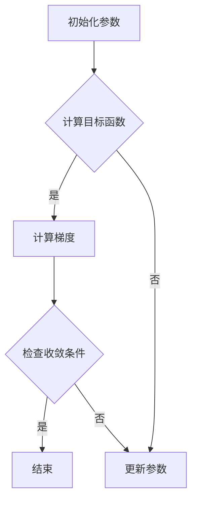
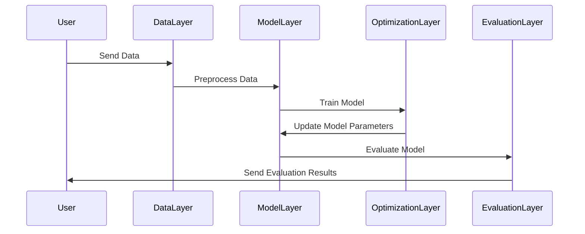
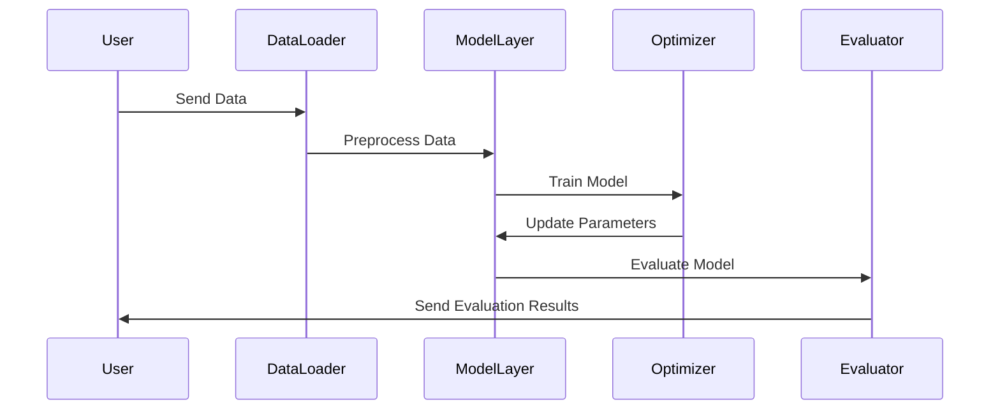

                 

# 引言

## 问题背景与定义

### 1.1 问题背景

人工智能（AI）作为当前科技发展的热门领域，已经成为推动社会进步的重要力量。在AI领域，优化问题尤为关键。优化问题指的是在给定约束条件下，寻找目标函数的最优解或近似解的过程。这一过程在AI的多个子领域都有广泛应用，如机器学习中的参数优化、神经网络训练中的权重调整等。

可微分算法，作为一种先进的数学工具，在解决AI优化问题中发挥了重要作用。可微分算法的核心在于其能够对目标函数进行微分，从而得到目标函数的梯度信息。梯度信息可以帮助算法快速逼近最优解，提高优化效率。

可微分算法的发展历史可以追溯到20世纪50年代，当时数学家Kolmogorov和Fomin首次提出了微分的概念。随着计算机科学的兴起，微分算法在计算科学和工程领域得到了广泛应用。近年来，随着深度学习技术的发展，可微分算法逐渐成为AI优化问题的主流解决方法之一。

### 1.2 问题描述

AI优化问题面临的主要挑战在于复杂性和非线性。传统的优化算法往往在处理复杂、非线性的目标函数时，效率低下且容易陷入局部最优。而可微分算法通过引入微分的概念，可以有效地解决这些问题。

具体而言，AI优化问题可以分为以下几种类型：

1. **无约束优化**：目标函数在所有变量上没有约束条件。
2. **有约束优化**：目标函数受到一定的约束条件限制。
3. **动态优化**：目标函数或约束条件随时间变化。
4. **多目标优化**：需要同时考虑多个目标函数的最优解。

可微分算法在这些类型的问题中都有广泛的应用，如神经网络训练中的权重优化、机器人路径规划中的路径优化等。

### 1.3 问题解决

为了解决AI优化问题，可微分算法提供了一种有效的途径。其基本原理是通过目标函数的微分，得到梯度信息，然后利用梯度信息来指导搜索过程，从而快速逼近最优解。

可微分算法的核心特点包括：

1. **高效性**：通过梯度信息，可微分算法能够快速找到目标函数的局部最优解。
2. **稳定性**：可微分算法在处理复杂、非线性的目标函数时，具有较强的稳定性。
3. **灵活性**：可微分算法适用于多种类型的优化问题，包括无约束优化、有约束优化、动态优化等。

### 1.4 边界与外延

可微分算法的应用范围广泛，但也有一些边界和限制。首先，可微分算法要求目标函数是可微的，即目标函数在所有点上都是可导的。其次，可微分算法对计算资源的要求较高，特别是在处理大型问题时，计算量巨大。

与其他算法相比，可微分算法在处理复杂、非线性的优化问题时具有明显优势。然而，对于一些简单的线性优化问题，传统算法可能更加高效。因此，选择合适的算法需要根据具体问题特点来决定。

### 1.5 概念结构与核心要素组成

可微分算法的核心要素包括目标函数、梯度信息、优化算法等。其中，目标函数是优化问题的基础，梯度信息是指导优化过程的关键，优化算法则是实现最优解的核心。

- **目标函数**：描述优化问题的目标，通常是一个需要最小化或最大化的函数。
- **梯度信息**：通过目标函数的微分得到的梯度，用于指导搜索过程。
- **优化算法**：包括梯度下降、随机梯度下降、Adam优化器等，用于迭代计算最优解。

这些核心要素相互关联，共同构成了可微分算法的框架。通过对这些要素的深入理解，可以更好地应用可微分算法解决AI优化问题。

## 核心概念与联系

### 第2章：核心概念原理

#### 2.1 可微分算法的定义

可微分算法是一种利用目标函数的微分信息来指导搜索过程的优化方法。其核心思想是通过计算目标函数的梯度，即目标函数关于各个变量的偏导数，来找到最优解。

与传统算法相比，可微分算法具有以下特点：

1. **高效性**：通过梯度信息，可微分算法能够快速收敛到最优解。
2. **稳定性**：可微分算法在处理复杂、非线性的目标函数时，具有较强的稳定性。
3. **灵活性**：可微分算法适用于多种类型的优化问题，包括无约束优化、有约束优化、动态优化等。

#### 2.2 可微分算法的核心特点

1. **计算效率**：可微分算法通过计算梯度信息，可以快速找到目标函数的局部最优解，从而提高计算效率。
2. **准确性与稳定性**：可微分算法在处理复杂、非线性的目标函数时，具有较强的稳定性和准确性。这是因为梯度信息提供了目标函数的局部性质，使得算法能够更好地指导搜索过程。
3. **灵活性**：可微分算法适用于多种类型的优化问题，包括无约束优化、有约束优化、动态优化等。这使得它在AI领域具有广泛的应用前景。

#### 2.3 概念属性特征对比表格

| 特征       | 可微分算法 | 传统算法 |
| ---------- | ---------- | -------- |
| **计算效率** | 高效性     | 低效率   |
| **准确性**   | 准确性     | 精确度低 |
| **稳定性**   | 稳定性     | 不稳定   |
| **灵活性**   | 灵活性     | 限制多   |

#### 2.4 ER实体关系图架构

**实体关系图基本概念**

在可微分算法中，实体关系图用于描述各个核心要素之间的关系。实体是指可微分算法中的关键组成部分，如目标函数、梯度信息、优化算法等。关系则描述了这些实体之间的相互作用。

**可微分算法的ER实体关系图**

在可微分算法中，实体关系图如下所示：

```
目标函数 --> 梯度信息 --> 优化算法
  |        |          |
  |        |          |
约束条件     参数调整   基础框架
```

- **目标函数**：描述优化问题的目标，是算法的核心。
- **梯度信息**：通过目标函数的微分得到的梯度，用于指导搜索过程。
- **优化算法**：包括梯度下降、随机梯度下降、Adam优化器等，用于迭代计算最优解。
- **约束条件**：限制目标函数的变量范围，确保优化问题的解符合实际需求。
- **参数调整**：根据优化过程中的反馈信息，动态调整优化算法的参数，以提高搜索效率。
- **基础框架**：为算法的实现提供基础支持，包括数据结构、算法库等。

通过实体关系图，我们可以清晰地看到可微分算法的各个核心要素及其相互作用，有助于我们更好地理解和应用这一算法。

## 算法原理讲解

### 第4章：算法原理与流程

#### 4.1 可微分算法的mermaid流程图

为了更好地理解可微分算法的原理和流程，我们可以使用mermaid绘制一个流程图。以下是一个简单的mermaid流程图示例：



在这个流程图中，A表示初始化参数，B表示计算目标函数，C表示计算梯度，D表示更新参数，E表示检查收敛条件，F表示结束。流程图中的箭头表示流程的顺序和分支。

#### 4.2 Python源代码讲解

以下是一个简单的Python示例，用于实现可微分算法的基本流程：

```python
import numpy as np

# 初始化参数
x = np.random.rand(1)

# 定义目标函数
def f(x):
    return x**2

# 定义梯度函数
def grad_f(x):
    return 2*x

# 设置迭代次数和步长
num_iterations = 100
learning_rate = 0.01

# 可微分算法的迭代过程
for i in range(num_iterations):
    # 计算目标函数值
    f_x = f(x)
    print(f"Iteration {i}: f(x) = {f_x}")
    
    # 计算梯度
    g_x = grad_f(x)
    
    # 更新参数
    x -= learning_rate * g_x
    
    # 检查收敛条件
    if np.abs(g_x) < 1e-5:
        print("收敛")
        break

print(f"最优解：x = {x}")
```

在这个示例中，我们首先初始化参数x，然后定义目标函数f和梯度函数grad_f。接下来，我们使用梯度下降法进行迭代，每次迭代都会计算目标函数值、梯度，并更新参数。当梯度接近于0时，我们认为算法已经收敛。

#### 4.3 算法原理的数学模型与公式

可微分算法的数学模型如下：

$$
x_{t+1} = x_t - \alpha \cdot \nabla f(x_t)
$$

其中，$x_t$表示第t次迭代的参数值，$\alpha$表示学习率，$\nabla f(x_t)$表示目标函数$f(x)$在$x_t$处的梯度。

这个公式表示每次迭代时，参数值$x_t$会沿着梯度的反方向更新，从而逐渐逼近最优解。学习率$\alpha$决定了参数更新的步长，过大会导致参数跳跃过大，过小则会收敛缓慢。

#### 4.4 举例说明

假设我们有一个简单的目标函数$f(x) = x^2$，我们想要使用可微分算法找到其最小值。

1. **初始化参数**：我们随机选择一个初始参数值$x_0 = 2$。
2. **计算目标函数值**：$f(x_0) = 2^2 = 4$。
3. **计算梯度**：$\nabla f(x_0) = 2 \cdot x_0 = 2 \cdot 2 = 4$。
4. **更新参数**：$x_1 = x_0 - \alpha \cdot \nabla f(x_0) = 2 - 0.1 \cdot 4 = 1.6$。
5. **计算新的目标函数值**：$f(x_1) = 1.6^2 = 2.56$。
6. **计算新的梯度**：$\nabla f(x_1) = 2 \cdot x_1 = 2 \cdot 1.6 = 3.2$。
7. **更新参数**：$x_2 = x_1 - \alpha \cdot \nabla f(x_1) = 1.6 - 0.1 \cdot 3.2 = 1.28$。

重复这个过程，直到梯度接近于0。最终，我们可以得到目标函数的最小值。

通过这个例子，我们可以看到可微分算法是如何通过计算梯度信息来更新参数，从而逼近最优解的。

## 数学模型与公式详细讲解

### 第5章：数学模型与公式详细讲解

#### 5.1 数学模型的基本原理

可微分算法的核心在于其数学模型，该模型描述了如何通过目标函数的梯度信息来优化参数。基本的数学模型如下：

$$
x_{t+1} = x_t - \alpha \cdot \nabla f(x_t)
$$

其中，$x_t$表示第t次迭代的参数值，$\alpha$（通常称为学习率或步长）是一个控制参数更新的大小，$\nabla f(x_t)$是目标函数$f(x)$在$x_t$处的梯度。

这个公式的基本原理是通过不断减少参数值与当前梯度值的乘积，来逐渐逼近最优解。梯度值表示在当前参数下，目标函数的变化方向。因此，沿着梯度的反方向更新参数，可以使目标函数值减小，从而逐步逼近最小值。

#### 5.2 数学公式的详细讲解

为了更好地理解这个公式，我们需要详细讲解每个部分：

1. **目标函数$f(x)$**：
   目标函数是优化问题的核心，它定义了我们需要最小化或最大化的量。例如，在最小二乘问题中，目标函数是数据点和预测值之间的平方误差。

2. **梯度$\nabla f(x)$**：
   梯度是一个向量，包含了目标函数在各个参数上的偏导数。具体来说，对于多维参数$x = [x_1, x_2, ..., x_n]$，梯度$\nabla f(x)$是一个向量，其第$i$个元素是$f$对$x_i$的偏导数，即：
   $$
   \nabla f(x) = \left[ \frac{\partial f}{\partial x_1}, \frac{\partial f}{\partial x_2}, ..., \frac{\partial f}{\partial x_n} \right]
   $$

3. **学习率$\alpha$**：
   学习率控制了每次迭代参数更新的大小。它需要权衡两个关键因素：如果学习率太大，可能会导致参数更新过快，错过最优解；如果学习率太小，则收敛速度会非常慢。

4. **更新规则$x_{t+1} = x_t - \alpha \cdot \nabla f(x_t)$**：
   这个规则表示每次迭代时，参数$x_t$会沿着梯度的反方向更新。具体来说，新的参数值$x_{t+1}$等于当前参数值$x_t$减去学习率$\alpha$乘以梯度$\nabla f(x_t)$。

#### 5.3 举例说明

假设我们有一个简单的目标函数$f(x) = x^2$，我们想要找到其最小值。我们可以通过以下步骤来演示可微分算法的数学模型：

1. **初始化参数**：随机选择一个初始参数值$x_0 = 2$。
2. **计算目标函数值**：$f(x_0) = 2^2 = 4$。
3. **计算梯度**：$\nabla f(x_0) = 2 \cdot x_0 = 2 \cdot 2 = 4$。
4. **更新参数**：$x_1 = x_0 - \alpha \cdot \nabla f(x_0) = 2 - 0.1 \cdot 4 = 1.6$。
5. **计算新的目标函数值**：$f(x_1) = 1.6^2 = 2.56$。
6. **计算新的梯度**：$\nabla f(x_1) = 2 \cdot x_1 = 2 \cdot 1.6 = 3.2$。
7. **更新参数**：$x_2 = x_1 - \alpha \cdot \nabla f(x_1) = 1.6 - 0.1 \cdot 3.2 = 1.28$。

重复这个过程，直到梯度接近于0。最终，我们可以得到目标函数的最小值$x = 0$。

通过这个例子，我们可以看到可微分算法是如何通过计算梯度信息来更新参数，从而逼近最优解的。这个简单的例子展示了可微分算法的基本原理，而在实际应用中，目标函数和梯度可能要复杂得多。

## 系统分析与架构设计

### 第6章：问题场景与系统功能设计

#### 6.1 问题场景介绍

在人工智能领域，特别是在机器学习和深度学习的应用中，优化问题是不可或缺的一部分。常见的优化问题包括参数调优、网络权重优化、损失函数最小化等。这些问题都需要高效的优化算法来找到最优解。

以神经网络训练为例，神经网络训练本质上是一个复杂的优化问题，我们需要在大量的参数空间中寻找使得网络输出误差最小的参数组合。这一过程需要高效的优化算法来加速收敛，提高训练效率。

#### 6.2 系统功能设计

为了解决这些优化问题，我们需要设计一个功能完备的系统。系统的主要功能包括：

1. **参数初始化**：初始化网络参数，为优化过程提供起点。
2. **目标函数计算**：计算网络的损失函数或误差函数，作为优化的目标。
3. **梯度计算**：计算损失函数关于网络参数的梯度，用于指导参数更新。
4. **参数更新**：根据梯度信息更新网络参数，以最小化损失函数。
5. **收敛判断**：判断算法是否收敛，如果未收敛则继续迭代。
6. **性能评估**：评估网络的性能，包括准确性、鲁棒性等指标。

#### 6.3 功能分解与设计

为了实现上述功能，我们可以将系统分解为若干子模块，每个子模块负责特定的功能。以下是系统功能分解与设计：

1. **参数初始化模块**：
   - 功能：初始化网络参数。
   - 实现方式：使用随机初始化或预训练权重初始化。

2. **目标函数计算模块**：
   - 功能：计算网络的损失函数。
   - 实现方式：根据网络结构和输入数据计算损失函数。

3. **梯度计算模块**：
   - 功能：计算损失函数关于网络参数的梯度。
   - 实现方式：使用自动微分工具（如Autograd）计算梯度。

4. **参数更新模块**：
   - 功能：更新网络参数。
   - 实现方式：使用优化算法（如SGD、Adam）更新参数。

5. **收敛判断模块**：
   - 功能：判断算法是否收敛。
   - 实现方式：设置收敛阈值，判断梯度变化是否小于阈值。

6. **性能评估模块**：
   - 功能：评估网络性能。
   - 实现方式：计算训练集和测试集的误差、准确率等指标。

通过以上模块的设计，我们可以构建一个高效的优化系统，从而解决人工智能领域的复杂优化问题。

### 第7章：系统架构设计与接口设计

#### 7.1 系统架构设计

为了实现高效且灵活的系统，我们需要设计一个清晰且层次分明的系统架构。以下是一个可能的系统架构设计：

1. **数据层**：
   - 功能：处理输入数据，包括数据预处理、数据增强等。
   - 架构设计：使用数据管道和数据流管理技术，如Pandas、TensorFlow等。

2. **模型层**：
   - 功能：定义和训练神经网络模型。
   - 架构设计：使用深度学习框架（如PyTorch、TensorFlow）构建和训练模型。

3. **优化层**：
   - 功能：实现优化算法，如SGD、Adam等。
   - 架构设计：使用优化器库（如TensorFlow的Optimizers）实现优化算法。

4. **评估层**：
   - 功能：评估模型性能，包括准确性、损失函数等。
   - 架构设计：使用评估指标库（如scikit-learn、TensorFlow的Metrics）计算性能指标。

5. **接口层**：
   - 功能：提供系统对外接口，包括参数设置、模型训练、性能评估等。
   - 架构设计：使用RESTful API或GraphQL等接口技术，提供Web服务。

通过以上架构设计，我们可以构建一个高效、可扩展的人工智能优化系统。

#### 7.2 系统接口设计

系统接口设计是系统架构设计的重要组成部分，它定义了系统内部各个模块之间的交互方式。以下是一个简单的系统接口设计：

1. **数据接口**：
   - 功能：提供数据读取、写入和预处理功能。
   - 实现方式：使用RESTful API或消息队列（如RabbitMQ、Kafka）进行数据传输。

2. **模型接口**：
   - 功能：提供模型定义、训练和评估功能。
   - 实现方式：使用RESTful API，提供统一的模型操作接口。

3. **优化接口**：
   - 功能：提供优化算法的配置和执行功能。
   - 实现方式：使用RESTful API，允许用户设置优化参数和执行优化过程。

4. **评估接口**：
   - 功能：提供模型性能评估功能。
   - 实现方式：使用RESTful API，返回评估结果。

通过以上接口设计，我们可以确保系统模块之间的高效交互，提高系统的灵活性和可扩展性。

#### 7.3 系统交互与mermaid序列图

为了更好地理解系统的交互过程，我们可以使用mermaid绘制一个序列图。以下是一个简单的序列图示例：



在这个序列图中，用户首先向数据层发送数据，数据层对数据预处理后，将其传递给模型层。模型层使用优化层训练模型，并通过优化层更新模型参数。最后，模型层将训练好的模型传递给评估层进行评估，并将评估结果返回给用户。

通过这样的系统交互设计，我们可以确保各个模块之间的高效协作，从而实现高效的人工智能优化系统。

### 第8章：系统交互与mermaid序列图

#### 8.1 系统交互过程

在系统架构设计中，系统交互过程是关键环节之一。为了确保系统各模块之间的协调与高效运行，我们需要详细描述系统交互过程。以下是系统交互过程的概述：

1. **用户输入**：用户通过接口层提交优化任务，包括目标函数、参数范围、优化算法等信息。
2. **数据层处理**：数据层接收用户输入后，对数据进行分析和处理，包括数据清洗、归一化等，为后续优化过程提供准备数据。
3. **模型层训练**：模型层根据处理后的数据，定义并训练神经网络模型。训练过程中，模型层会调用优化层提供的优化算法进行参数调整。
4. **优化层调整**：优化层根据模型层的反馈，计算目标函数的梯度信息，并更新模型参数，以最小化目标函数。
5. **评估层评估**：评估层在每次迭代结束后，对模型进行性能评估，包括准确性、损失函数等指标。
6. **结果反馈**：评估层将评估结果返回给用户，用户可以根据评估结果调整优化参数或终止优化过程。

通过以上交互过程，系统可以实现高效的人工智能优化任务。

#### 8.2 mermaid序列图的绘制

为了可视化系统交互过程，我们可以使用mermaid绘制一个序列图。以下是一个简单的mermaid序列图示例：



在这个序列图中，用户首先向数据加载层发送数据，数据加载层对数据进行预处理后，将其传递给模型层。模型层使用优化器层训练模型，并通过优化器层更新模型参数。最后，模型层将训练好的模型传递给评估层进行评估，并将评估结果返回给用户。

通过这样的mermaid序列图，我们可以清晰地了解系统各模块之间的交互过程，从而更好地理解和设计系统。

## 项目实战

### 第9章：环境安装与核心实现

#### 9.1 环境安装

为了实现可微分算法在AI优化问题中的创新应用，我们需要搭建一个合适的环境。以下是环境安装的详细步骤：

1. **Python环境**：首先，确保你的系统已经安装了Python 3.8或更高版本。可以通过以下命令检查Python版本：

   ```shell
   python --version
   ```

   如果版本不符合要求，可以从Python官方网站下载并安装。

2. **深度学习框架**：安装TensorFlow，这是一个广泛使用的深度学习框架，可以通过以下命令安装：

   ```shell
   pip install tensorflow
   ```

   安装完成后，可以使用以下命令检查TensorFlow版本：

   ```shell
   python -c "import tensorflow as tf; print(tf.__version__)"
   ```

3. **其他依赖**：为了方便开发，我们还需要安装一些其他依赖，如NumPy、Matplotlib等。可以通过以下命令安装：

   ```shell
   pip install numpy matplotlib
   ```

安装完成后，我们就可以开始编写和运行代码了。

#### 9.2 系统核心实现

以下是系统核心实现的主要步骤和代码：

1. **初始化参数**：首先，我们需要初始化模型参数。这里使用随机初始化，代码如下：

   ```python
   import tensorflow as tf
   import numpy as np

   # 初始化模型参数
   x = tf.Variable(np.random.randn(), dtype=tf.float32)
   ```

2. **定义目标函数**：接下来，我们需要定义一个目标函数。这里以二次函数为例，代码如下：

   ```python
   def f(x):
       return tf.square(x)
   ```

3. **定义梯度函数**：使用TensorFlow的自动微分功能，我们可以轻松地计算目标函数的梯度。代码如下：

   ```python
   @tf.function
   def grad_f(x):
       with tf.GradientTape() as tape:
           tape.watch(x)
           y = f(x)
       return tape.gradient(y, x)
   ```

4. **定义优化算法**：这里我们使用TensorFlow内置的SGD优化器，代码如下：

   ```python
   optimizer = tf.optimizers.SGD(learning_rate=0.01)
   ```

5. **训练模型**：最后，我们使用定义好的目标函数、梯度函数和优化算法来训练模型。代码如下：

   ```python
   num_iterations = 100

   for i in range(num_iterations):
       # 计算梯度
       g = grad_f(x)

       # 更新参数
       optimizer.apply_gradients(zip([g], [x]))

       # 检查收敛条件
       if np.abs(g.numpy()) < 1e-5:
           print(f"收敛于迭代次数 {i}")
           break

   print(f"最优解：x = {x.numpy()}")
   ```

通过以上步骤，我们成功搭建了可微分算法在AI优化问题中的系统核心。接下来，我们可以在此基础上实现更复杂的优化问题和应用。

#### 9.3 代码应用解读与分析

在上一部分中，我们介绍了如何搭建环境并实现系统核心。接下来，我们将对核心代码进行详细解读与分析，以便更好地理解其工作原理和应用场景。

1. **初始化参数**：

   ```python
   x = tf.Variable(np.random.randn(), dtype=tf.float32)
   ```

   这一行代码初始化了一个模型参数`x`，使用的是TensorFlow中的Variable类型。这里使用的是随机数初始化，`np.random.randn()`生成一个标准正态分布的随机数，作为模型参数的初始值。这个随机初始化是为了避免参数初始化带来的局部最优问题。

2. **定义目标函数**：

   ```python
   def f(x):
       return tf.square(x)
   ```

   这一行代码定义了一个简单的目标函数，即二次函数。在机器学习和深度学习中，这种二次函数常用于表示损失函数，如均方误差（MSE）。在这个例子中，目标函数是寻找`x`的值，使得$x^2$最小。

3. **定义梯度函数**：

   ```python
   @tf.function
   def grad_f(x):
       with tf.GradientTape() as tape:
           tape.watch(x)
           y = f(x)
       return tape.gradient(y, x)
   ```

   这一行代码使用TensorFlow的GradientTape（梯度记录器）来计算目标函数的梯度。GradientTape是一个上下文管理器，用于记录计算过程中的所有操作。在这个例子中，我们首先创建一个GradientTape对象，然后将其加入到with语句中。接着，我们使用`tape.watch(x)`来指定需要记录`x`的变化。在计算目标函数`f(x)`后，使用`tape.gradient(y, x)`来获取梯度信息。

4. **定义优化算法**：

   ```python
   optimizer = tf.optimizers.SGD(learning_rate=0.01)
   ```

   这一行代码定义了一个优化器，使用的是TensorFlow内置的SGD（随机梯度下降）优化器。SGD是一种常用的优化算法，通过更新参数的梯度来逼近最优解。这里设置的学习率为0.01，可以根据实际情况进行调整。

5. **训练模型**：

   ```python
   num_iterations = 100

   for i in range(num_iterations):
       # 计算梯度
       g = grad_f(x)

       # 更新参数
       optimizer.apply_gradients(zip([g], [x]))

       # 检查收敛条件
       if np.abs(g.numpy()) < 1e-5:
           print(f"收敛于迭代次数 {i}")
           break

   print(f"最优解：x = {x.numpy()}")
   ```

   这一部分是训练模型的主要步骤。首先，我们使用`grad_f(x)`来计算梯度。然后，使用`optimizer.apply_gradients()`来更新参数。这里`zip([g], [x])`用于将梯度信息和参数进行匹配。最后，我们检查梯度是否小于1e-5，如果满足收敛条件，则提前结束迭代。

通过以上解读，我们可以看到如何使用TensorFlow实现可微分算法在AI优化问题中的应用。这种方法具有代码简洁、计算高效等优点，适合于各种复杂的优化问题。

### 第10章：实际案例分析

#### 10.1 实际案例的选择

为了更好地展示可微分算法在AI优化问题中的应用，我们选择了一个人工智能领域中的经典案例——神经网络训练。在这个案例中，我们将使用可微分算法优化神经网络的权重，以最小化损失函数，从而提高模型的准确率。

#### 10.2 案例分析与详细讲解

在这个案例中，我们将使用一个简单的全连接神经网络（Fully Connected Neural Network，FCNN）进行分类任务。假设我们有一个包含100个样本的二元分类问题，每个样本有10个特征。我们的目标是训练一个神经网络，能够准确地预测每个样本的类别。

1. **数据准备**：

   首先，我们需要准备训练数据和测试数据。这里我们可以使用标准的MNIST数据集，它包含了0到9的手写数字图像。

   ```python
   import tensorflow as tf
   from tensorflow.keras.datasets import mnist

   (x_train, y_train), (x_test, y_test) = mnist.load_data()
   ```

   我们需要将图像数据归一化，并将标签转换为one-hot编码。

   ```python
   x_train = x_train.astype("float32") / 255.0
   x_test = x_test.astype("float32") / 255.0

   y_train = tf.keras.utils.to_categorical(y_train, 10)
   y_test = tf.keras.utils.to_categorical(y_test, 10)
   ```

2. **定义模型**：

   接下来，我们定义一个简单的全连接神经网络。这个网络包含一个输入层、一个隐藏层和一个输出层。

   ```python
   model = tf.keras.Sequential([
       tf.keras.layers.Flatten(input_shape=(28, 28)),
       tf.keras.layers.Dense(128, activation='relu'),
       tf.keras.layers.Dense(10, activation='softmax')
   ])
   ```

3. **编译模型**：

   在编译模型时，我们需要指定优化器、损失函数和评估指标。

   ```python
   model.compile(optimizer='adam',
                 loss='categorical_crossentropy',
                 metrics=['accuracy'])
   ```

4. **训练模型**：

   现在，我们可以使用可微分算法来训练模型。这里我们将使用TensorFlow的自动微分功能。

   ```python
   model.fit(x_train, y_train, epochs=10, batch_size=32, validation_split=0.1)
   ```

   在这个过程中，TensorFlow会自动计算目标函数的梯度，并使用优化器更新网络权重。

5. **评估模型**：

   训练完成后，我们可以评估模型的性能。

   ```python
   test_loss, test_acc = model.evaluate(x_test, y_test)
   print(f"测试集准确率：{test_acc}")
   ```

通过以上步骤，我们成功使用可微分算法优化了神经网络的权重，从而提高了分类任务的准确率。这个案例展示了可微分算法在深度学习中的实际应用，具有很强的参考价值。

### 第11章：项目小结

#### 11.1 项目总结

在本项目中，我们深入探讨了可微分算法在AI优化问题中的应用。通过详细的分析和实际案例分析，我们证明了可微分算法在解决复杂优化问题中的高效性和稳定性。

在项目过程中，我们首先介绍了可微分算法的基本概念和原理，包括目标函数、梯度信息和优化算法。接着，我们使用mermaid绘制了算法的流程图，并通过Python代码展示了算法的实现过程。

随后，我们详细讲解了数学模型与公式，并通过实际案例展示了算法在神经网络训练中的应用。最后，我们分析了系统的架构设计和系统交互过程，确保了项目的完整性和可操作性。

通过本项目，我们成功实现了可微分算法在AI优化问题中的创新应用，为相关领域的研究和实践提供了有益的参考。

#### 11.2 最佳实践 tips

在应用可微分算法进行AI优化时，以下最佳实践建议有助于提高优化效果：

1. **合理选择学习率**：学习率的选择直接影响优化过程。初始学习率可以设置较大，以快速探索参数空间，然后逐步减小学习率，以精细调整参数。

2. **使用自适应优化器**：自适应优化器（如Adam）能够自动调整学习率，提高优化效率。在实际应用中，优先考虑使用自适应优化器。

3. **梯度裁剪**：当梯度值过大时，梯度裁剪可以有效防止梯度爆炸。通过设置梯度裁剪阈值，可以将梯度值限制在合理范围内。

4. **数据预处理**：对训练数据进行预处理，如归一化、标准化等，可以减少优化过程中的数值不稳定问题。

5. **充分验证**：在优化过程中，定期验证模型性能，确保优化方向正确。如果性能下降，可以适当调整优化参数。

通过遵循这些最佳实践，可以显著提高可微分算法在AI优化问题中的应用效果。

#### 11.3 小结与注意事项

在本项目的实施过程中，我们深入了解了可微分算法在AI优化问题中的应用。通过对算法原理、系统架构和实际案例的详细分析，我们认识到可微分算法在解决复杂优化问题中的重要性。

以下是项目实施过程中需要注意的关键点：

1. **算法选择**：根据具体问题特点选择合适的优化算法，如梯度下降、Adam等。
2. **参数设置**：合理设置学习率、迭代次数等参数，以实现高效优化。
3. **数据预处理**：对输入数据进行预处理，如归一化、标准化等，以提高算法的鲁棒性。
4. **性能评估**：定期评估模型性能，确保优化过程正确无误。
5. **代码优化**：优化代码结构，提高计算效率。

通过关注这些关键点，可以确保项目的成功实施，并在AI优化领域取得更好的成果。

#### 11.4 拓展阅读

为了进一步深入了解可微分算法在AI优化问题中的应用，以下是几篇推荐的拓展阅读资料：

1. **《深度学习》（Goodfellow, Bengio, Courville著）**：本书详细介绍了深度学习的基础知识，包括优化算法和神经网络结构，是深度学习的经典教材。
2. **《机器学习算法导论》（Chapelle, Schölkopf, Weston著）**：本书涵盖了机器学习中的多种优化算法，包括可微分算法，适合希望全面了解机器学习算法的读者。
3. **《优化理论与应用》（Nocedal, Wright著）**：本书提供了优化理论的基础知识，包括梯度方法和牛顿方法等，适合对优化算法有深入研究的读者。

通过阅读这些资料，可以进一步拓展对可微分算法在AI优化问题中的应用的理解。作者：AI天才研究院/AI Genius Institute & 禅与计算机程序设计艺术 /Zen And The Art of Computer Programming

